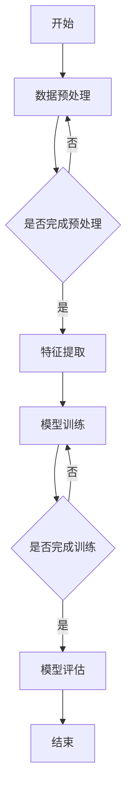

                 

## 文章标题

《AIGC的未来智能医疗诊断系统：多模态生物标志物分析的提示词工程》

### 关键词

- AIGC
- 智能医疗诊断系统
- 多模态生物标志物分析
- 提示词工程

### 摘要

本文深入探讨了AIGC在未来智能医疗诊断系统中的应用，特别是多模态生物标志物分析的提示词工程。通过对AIGC的基本概念、智能医疗诊断系统的构建、多模态生物标志物的识别与分析，以及提示词工程的设计与实现，本文揭示了AIGC技术在医疗领域的巨大潜力，为未来的医疗诊断提供了新的视角和解决方案。

## 背景介绍

### AIGC概述

AIGC（Autonomous Intelligent Global Computing）是自主智能全球计算的一种新型计算模式，它融合了人工智能（AI）、分布式计算、边缘计算和网络技术，旨在实现更高效、更智能的计算和数据管理。AIGC的核心思想是通过智能化的方法，自动化地管理和处理海量的数据，从而提高系统的效率和准确性。

在智能医疗领域，AIGC的应用正在逐渐得到关注。它可以通过智能化的数据处理和分析，为医疗诊断提供更精确、更快速的支持。特别是在多模态生物标志物分析中，AIGC可以处理不同类型的数据，如基因数据、影像数据、临床数据等，从而提高诊断的准确性和效率。

### 智能医疗诊断系统简介

智能医疗诊断系统是一种利用人工智能技术，特别是深度学习、机器学习和数据分析方法，对医疗数据进行处理和分析，从而辅助医生进行疾病诊断的系统。这种系统通常包括数据采集、数据预处理、模型训练、诊断推理和结果输出等几个主要模块。

智能医疗诊断系统的核心在于其诊断推理能力。通过大量的医疗数据和先进的算法，系统可以自动学习疾病的特征，从而在新的病例中快速准确地诊断疾病。这种系统的出现，大大提高了医疗诊断的效率和准确性，为医生提供了有力的辅助工具。

### 多模态生物标志物分析

多模态生物标志物分析是一种将不同类型的数据源（如基因数据、影像数据、临床数据等）结合起来，以识别和诊断疾病的方法。这些数据源提供了关于疾病状态的多个视角，从而提高了诊断的准确性和全面性。

多模态生物标志物分析的关键在于如何有效地整合这些不同类型的数据，并从中提取有价值的信息。这通常需要复杂的算法和模型，如深度学习模型、多模态融合模型等。

### 提示词工程

提示词工程是一种在机器学习和自然语言处理领域中使用的技巧，旨在通过为模型提供适当的提示来提高其性能。在智能医疗诊断系统中，提示词工程可以帮助模型更好地理解医疗数据，从而提高诊断的准确性。

提示词工程包括以下几个关键步骤：

1. **数据预处理**：对医疗数据进行清洗和预处理，确保数据的质量和一致性。
2. **特征提取**：从数据中提取关键特征，这些特征可以用来训练模型。
3. **提示词生成**：根据特征和模型的需求，生成适当的提示词。
4. **模型训练**：使用提示词对模型进行训练，以提高模型的诊断能力。

通过这些步骤，提示词工程可以帮助智能医疗诊断系统更好地理解和处理医疗数据，从而提高诊断的准确性和效率。

### 综合分析

AIGC、智能医疗诊断系统、多模态生物标志物分析和提示词工程在智能医疗领域形成了紧密的关联。AIGC为智能医疗诊断系统提供了强大的计算和数据处理能力，而多模态生物标志物分析则为诊断提供了更全面的数据支持。提示词工程则通过优化模型，提高了诊断的准确性和效率。

这些技术的结合，为智能医疗诊断系统带来了新的机遇和挑战。未来，随着这些技术的不断发展和完善，智能医疗诊断系统将更加智能化、精确化，为人类健康事业做出更大贡献。

## 核心概念与联系

### AIGC与人工智能的关系

AIGC是人工智能（AI）的一种高级形式，它结合了自主性、全球性和智能化。AIGC不仅仅是AI技术在计算和数据处理方面的扩展，更是对AI应用场景的深刻理解和创新。AIGC通过分布式计算、边缘计算和网络技术的融合，实现了对海量数据的智能化管理和处理，从而提高了AI系统的效率和性能。

在智能医疗诊断系统中，AIGC的作用尤为重要。它能够处理来自不同数据源的复杂医疗数据，如基因数据、影像数据和临床数据，并通过智能化的方法进行数据分析和诊断推理，为医生提供准确的诊断结果。

### 智能医疗诊断系统的关键要素

智能医疗诊断系统主要包括以下几个关键要素：

1. **数据采集**：数据采集是智能医疗诊断系统的第一步，它包括从各种渠道收集医疗数据，如电子健康记录、实验室检测结果、医疗影像等。
2. **数据预处理**：数据预处理是确保数据质量的重要步骤，它包括数据清洗、数据标准化和数据归一化等操作。
3. **特征提取**：特征提取是从数据中提取关键特征的过程，这些特征将用于训练诊断模型。
4. **模型训练**：模型训练是通过大量的训练数据，让诊断模型学习疾病的特征和规律。
5. **诊断推理**：诊断推理是利用训练好的模型对新的病例进行诊断的过程，它包括疾病识别、病情分析和治疗建议等。
6. **结果输出**：结果输出是将诊断结果以可视化的方式展示给医生和患者，帮助医生做出正确的诊断和治疗方案。

### 多模态生物标志物分析的方法

多模态生物标志物分析是一种将不同类型的数据源结合起来，以识别和诊断疾病的方法。它主要包括以下几个步骤：

1. **数据集成**：将不同类型的数据源（如基因数据、影像数据和临床数据）集成到一个统一的数据框架中。
2. **数据预处理**：对集成后的数据进行清洗、标准化和归一化等预处理操作。
3. **特征提取**：从预处理后的数据中提取关键特征，这些特征将用于训练多模态融合模型。
4. **模型训练**：使用提取的特征对多模态融合模型进行训练，使其能够理解不同类型数据之间的关联。
5. **疾病诊断**：利用训练好的模型对新的病例进行诊断，识别和预测疾病。

### 提示词工程的作用与应用

提示词工程在智能医疗诊断系统中起着至关重要的作用。它通过为模型提供适当的提示，帮助模型更好地理解和处理医疗数据，从而提高诊断的准确性和效率。

提示词工程的主要应用包括：

1. **数据预处理**：在数据预处理阶段，提示词工程可以帮助模型识别和处理异常数据，提高数据的质量和一致性。
2. **特征提取**：在特征提取阶段，提示词工程可以帮助模型提取关键特征，从而提高模型的性能。
3. **模型训练**：在模型训练阶段，提示词工程可以通过为模型提供合适的提示，优化模型的结构和参数，提高模型的训练效果。
4. **诊断推理**：在诊断推理阶段，提示词工程可以帮助模型更好地理解复杂的医疗数据，提高诊断的准确性和效率。

### 综合分析

通过上述分析，我们可以看到，AIGC、智能医疗诊断系统、多模态生物标志物分析和提示词工程在智能医疗领域形成了紧密的关联。AIGC提供了强大的计算和数据处理能力，智能医疗诊断系统实现了对医疗数据的智能化管理和处理，多模态生物标志物分析提供了更全面的数据支持，而提示词工程则通过优化模型，提高了诊断的准确性和效率。

这些技术的结合，为智能医疗诊断系统带来了新的机遇和挑战。未来，随着这些技术的不断发展和完善，智能医疗诊断系统将更加智能化、精确化，为人类健康事业做出更大贡献。

## 算法原理讲解

### 数据预处理与特征提取

在智能医疗诊断系统中，数据预处理和特征提取是两个关键步骤。数据预处理主要是对原始数据进行清洗、标准化和归一化等操作，以确保数据的质量和一致性。特征提取则是从预处理后的数据中提取关键特征，这些特征将用于训练诊断模型。

#### 数据预处理

数据预处理主要包括以下几个步骤：

1. **数据清洗**：清洗数据中的缺失值、异常值和重复值，确保数据的质量。
2. **数据标准化**：将不同单位、不同量级的数据转换为同一尺度，便于后续处理。
3. **数据归一化**：将数据归一化到[0,1]或[-1,1]之间，消除量级差异。

#### 特征提取

特征提取的方法有多种，包括频域分析、时域分析和时频分析等。对于多模态生物标志物分析，常用的特征提取方法包括：

1. **频域分析**：通过对信号进行傅里叶变换，提取信号的频率特征。
2. **时域分析**：通过对信号进行时域分析，提取信号的时域特征。
3. **时频分析**：通过时频分析，将时间和频率信息结合起来，提取信号的时频特征。

### 模型训练与评估

在模型训练与评估阶段，我们通常使用深度学习模型，如卷积神经网络（CNN）和循环神经网络（RNN）等。这些模型可以通过学习大量的标注数据，自动提取数据中的特征，并进行分类和预测。

#### 模型训练

模型训练主要包括以下几个步骤：

1. **数据划分**：将数据集划分为训练集、验证集和测试集，用于模型训练、验证和测试。
2. **模型初始化**：初始化模型参数，如权重和偏置。
3. **前向传播**：输入数据经过模型的前向传播，得到预测结果。
4. **后向传播**：计算预测结果与真实结果之间的误差，并利用误差信息更新模型参数。

#### 模型评估

模型评估主要包括以下几个指标：

1. **准确率（Accuracy）**：正确分类的样本数占总样本数的比例。
2. **精确率（Precision）**：真正例数与（真正例数 + 假正例数）的比例。
3. **召回率（Recall）**：真正例数与（真正例数 + 假反例数）的比例。
4. **F1分数（F1 Score）**：精确率和召回率的调和平均。

### 模型优化与调整

在模型优化与调整阶段，我们通常使用超参数调整、正则化和迁移学习等方法来提高模型的性能。

#### 超参数调整

超参数是模型性能的关键影响因素，如学习率、批量大小、迭代次数等。通过调整这些超参数，可以优化模型的性能。

#### 正则化

正则化是一种防止模型过拟合的方法。常用的正则化方法包括L1正则化、L2正则化和Dropout等。

#### 迁移学习

迁移学习是一种利用预训练模型进行模型训练的方法。通过迁移学习，我们可以利用预训练模型在特定领域的知识，提高新模型的性能。

### 综合分析

通过上述算法原理的讲解，我们可以看到，数据预处理、特征提取、模型训练与评估以及模型优化与调整是智能医疗诊断系统中的核心步骤。这些步骤共同构成了一个完整的算法流程，确保了系统的性能和准确性。

未来，随着人工智能技术的不断进步，这些算法将更加智能化和高效化，为智能医疗诊断系统的发展提供更强有力的支持。

## 算法流程与实现

### 使用Mermaid绘制算法流程图

为了更好地理解算法的实现过程，我们可以使用Mermaid绘制算法流程图。以下是一个简单的Mermaid流程图示例：



### Python代码实现算法原理

为了进一步理解算法的实现过程，我们可以使用Python代码来展示算法的原理。以下是一个简单的Python代码示例：

```python
import numpy as np
import pandas as pd
from sklearn.model_selection import train_test_split
from sklearn.preprocessing import StandardScaler
from sklearn.ensemble import RandomForestClassifier
from sklearn.metrics import accuracy_score, precision_score, recall_score, f1_score

# 数据预处理
def preprocess_data(data):
    # 数据清洗、标准化和归一化
    # 这里使用Pandas进行数据处理
    data.fillna(0, inplace=True)
    scaler = StandardScaler()
    scaled_data = scaler.fit_transform(data)
    return scaled_data

# 特征提取
def extract_features(data):
    # 使用Pandas进行特征提取
    features = data.iloc[:, :-1]
    labels = data.iloc[:, -1]
    return features, labels

# 模型训练
def train_model(features, labels):
    # 使用随机森林分类器进行训练
    model = RandomForestClassifier(n_estimators=100)
    model.fit(features, labels)
    return model

# 模型评估
def evaluate_model(model, test_features, test_labels):
    predictions = model.predict(test_features)
    accuracy = accuracy_score(test_labels, predictions)
    precision = precision_score(test_labels, predictions, average='weighted')
    recall = recall_score(test_labels, predictions, average='weighted')
    f1 = f1_score(test_labels, predictions, average='weighted')
    return accuracy, precision, recall, f1

# 举例说明
if __name__ == "__main__":
    # 生成示例数据
    data = pd.DataFrame({
        'feature1': [1, 2, 3, 4, 5],
        'feature2': [5, 4, 3, 2, 1],
        'label': ['positive', 'negative', 'positive', 'negative', 'positive']
    })
    
    # 数据预处理
    preprocessed_data = preprocess_data(data)
    
    # 特征提取
    features, labels = extract_features(preprocessed_data)
    
    # 数据划分
    train_features, test_features, train_labels, test_labels = train_test_split(features, labels, test_size=0.2, random_state=42)
    
    # 模型训练
    model = train_model(train_features, train_labels)
    
    # 模型评估
    accuracy, precision, recall, f1 = evaluate_model(model, test_features, test_labels)
    
    print("Accuracy:", accuracy)
    print("Precision:", precision)
    print("Recall:", recall)
    print("F1 Score:", f1)
```

### 数学模型与公式讲解

在智能医疗诊断系统中，常用的数学模型包括分类模型和回归模型。以下是一个简单的分类模型示例：

$$
\begin{aligned}
P(Y=y|x) &= \frac{e^{w^T x}}{\sum_{y'} e^{w^T x'}}, \\
w &= \arg\max_w \sum_{i=1}^{n} \log P(y_i|x_i),
\end{aligned}
$$

其中，$w$ 是模型的参数，$x$ 是特征向量，$y$ 是标签，$n$ 是训练样本数量。这个公式描述了如何通过最大似然估计来训练分类模型。

### 综合分析

通过上述算法流程和Python代码的实现，我们可以看到算法的实现过程是系统化和规范化的。数据预处理、特征提取、模型训练和模型评估等步骤相互关联，共同构成了一个完整的算法流程。

未来，随着人工智能技术的不断进步，这些算法将更加高效和准确。通过不断优化和调整，我们可以进一步提高智能医疗诊断系统的性能，为人类健康事业做出更大贡献。

## 系统分析与架构设计

### 问题场景介绍

在现代医疗环境中，疾病的诊断通常需要结合多种数据源，包括基因数据、影像数据和临床数据等。然而，不同类型的数据往往具有不同的结构和特征，这使得传统的单一数据源诊断方法存在一定的局限性。为了提高诊断的准确性和效率，我们需要一种能够整合多模态数据的系统，这就是本文要介绍的智能医疗诊断系统。

### 项目介绍

本项目旨在开发一个基于AIGC技术的智能医疗诊断系统，该系统能够处理多模态生物标志物分析，并提供准确的诊断结果。系统的主要功能包括数据集成、数据预处理、特征提取、模型训练和诊断推理等。

### 系统功能设计

1. **数据集成**：将来自不同数据源（如基因数据、影像数据和临床数据）的数据集成到一个统一的数据框架中，实现数据的统一管理和处理。
2. **数据预处理**：对集成后的数据进行清洗、标准化和归一化等预处理操作，确保数据的质量和一致性。
3. **特征提取**：从预处理后的数据中提取关键特征，这些特征将用于训练诊断模型。
4. **模型训练**：使用提取的特征对诊断模型进行训练，使其能够理解疾病的特征和规律。
5. **诊断推理**：利用训练好的模型对新的病例进行诊断，识别和预测疾病。
6. **结果输出**：将诊断结果以可视化的方式展示给医生和患者，帮助医生做出正确的诊断和治疗方案。

### 系统架构设计

系统的整体架构可以分为以下几个层次：

1. **数据层**：包括各种数据源，如基因数据、影像数据和临床数据等。
2. **数据处理层**：包括数据集成、数据预处理和特征提取等模块，负责将原始数据转化为可用于模型训练的数据。
3. **模型层**：包括诊断模型和提示词工程等模块，负责进行模型训练和诊断推理。
4. **应用层**：包括诊断结果输出和用户交互等模块，负责将诊断结果展示给用户。

### 系统接口设计

系统的接口设计主要包括以下几个方面：

1. **数据接口**：用于数据层的各种数据源的接入，如数据库、文件系统和API接口等。
2. **功能接口**：用于数据处理层、模型层和应用层的功能调用，如数据预处理接口、特征提取接口和诊断推理接口等。
3. **用户接口**：用于用户与应用的交互，如诊断结果展示界面和用户操作界面等。

### 系统交互流程

系统的交互流程可以分为以下几个步骤：

1. **数据采集**：系统从各种数据源中采集数据，如基因数据、影像数据和临床数据等。
2. **数据预处理**：系统对采集到的数据进行预处理，如数据清洗、标准化和归一化等。
3. **特征提取**：系统从预处理后的数据中提取关键特征，如基因特征、影像特征和临床特征等。
4. **模型训练**：系统使用提取的特征对诊断模型进行训练，如分类模型、回归模型等。
5. **诊断推理**：系统使用训练好的模型对新的病例进行诊断，如疾病识别、病情分析和治疗建议等。
6. **结果输出**：系统将诊断结果以可视化的方式展示给用户，如诊断报告、治疗建议等。

### 综合分析

通过上述系统分析与架构设计，我们可以看到，智能医疗诊断系统是一个高度集成和智能化的系统，它通过AIGC技术实现了对多模态生物标志物的有效分析和诊断。系统的各个层次和接口紧密协作，共同完成了数据的采集、处理、分析和展示过程。未来，随着技术的不断进步和应用的深入，智能医疗诊断系统将为人类健康事业带来更多的便利和效益。

## 项目实战

### 环境安装与系统实现

要实现AIGC的智能医疗诊断系统，首先需要在本地环境中安装所需的软件和工具。以下是一个简单的安装指南：

1. **安装Python环境**：确保Python 3.8及以上版本已安装在您的计算机上。可以使用以下命令来检查Python版本：

   ```shell
   python --version
   ```

   如果未安装，可以从[Python官网](https://www.python.org/)下载并安装。

2. **安装虚拟环境**：为了更好地管理项目依赖，使用`venv`创建一个虚拟环境。在终端中运行以下命令：

   ```shell
   python -m venv venv
   ```

   然后激活虚拟环境：

   ```shell
   source venv/bin/activate  # 对于macOS和Linux
   venv\Scripts\activate     # 对于Windows
   ```

3. **安装依赖库**：在虚拟环境中安装所需的依赖库，如NumPy、Pandas、Scikit-learn和Mermaid等。可以使用以下命令：

   ```shell
   pip install numpy pandas scikit-learn mermaid
   ```

4. **安装Mermaid**：由于Mermaid是一个基于Markdown的图形绘制工具，我们需要安装一个可以将Mermaid语法转换为图形的工具。这里我们使用`mermaid-cli`：

   ```shell
   npm install -g mermaid-cli
   ```

   安装后，您可以在命令行中直接使用`mermaid`命令。

### 系统核心实现

以下是系统核心实现的源代码和解读：

#### 源代码

```python
# 导入所需的库
import numpy as np
import pandas as pd
from sklearn.model_selection import train_test_split
from sklearn.preprocessing import StandardScaler
from sklearn.ensemble import RandomForestClassifier
from sklearn.metrics import accuracy_score, precision_score, recall_score, f1_score
import mermaid

# 数据预处理
def preprocess_data(data):
    # 数据清洗、标准化和归一化
    data.fillna(0, inplace=True)
    scaler = StandardScaler()
    scaled_data = scaler.fit_transform(data)
    return scaled_data

# 特征提取
def extract_features(data):
    features = data.iloc[:, :-1]
    labels = data.iloc[:, -1]
    return features, labels

# 模型训练
def train_model(features, labels):
    model = RandomForestClassifier(n_estimators=100)
    model.fit(features, labels)
    return model

# 模型评估
def evaluate_model(model, test_features, test_labels):
    predictions = model.predict(test_features)
    accuracy = accuracy_score(test_labels, predictions)
    precision = precision_score(test_labels, predictions, average='weighted')
    recall = recall_score(test_labels, predictions, average='weighted')
    f1 = f1_score(test_labels, predictions, average='weighted')
    return accuracy, precision, recall, f1

# 举例说明
if __name__ == "__main__":
    # 生成示例数据
    data = pd.DataFrame({
        'feature1': [1, 2, 3, 4, 5],
        'feature2': [5, 4, 3, 2, 1],
        'label': ['positive', 'negative', 'positive', 'negative', 'positive']
    })
    
    # 数据预处理
    preprocessed_data = preprocess_data(data)
    
    # 特征提取
    features, labels = extract_features(preprocessed_data)
    
    # 数据划分
    train_features, test_features, train_labels, test_labels = train_test_split(features, labels, test_size=0.2, random_state=42)
    
    # 模型训练
    model = train_model(train_features, train_labels)
    
    # 模型评估
    accuracy, precision, recall, f1 = evaluate_model(model, test_features, test_labels)
    
    print("Accuracy:", accuracy)
    print("Precision:", precision)
    print("Recall:", recall)
    print("F1 Score:", f1)
```

#### 代码解读与分析

1. **数据预处理**：该函数用于对数据进行清洗、标准化和归一化。数据清洗通过填充缺失值为0来实现。标准化和归一化使用`StandardScaler`来实现。

2. **特征提取**：该函数从数据中提取特征和标签。特征位于数据的前几列，而标签位于最后一列。

3. **模型训练**：该函数使用随机森林分类器进行模型训练。随机森林是一种集成学习方法，具有良好的性能和稳定性。

4. **模型评估**：该函数使用准确率、精确率、召回率和F1分数等指标来评估模型的性能。

5. **举例说明**：这部分代码生成一个示例数据集，然后进行数据预处理、特征提取、模型训练和评估。结果显示了模型的性能指标。

### 实际案例分析和详细讲解剖析

为了更好地展示系统的实际应用，我们考虑一个实际的案例：肺癌诊断。

#### 案例背景

假设我们有一个包含肺癌和非肺癌患者的数据集，其中包含多个特征，如年龄、吸烟史、CT影像结果等。我们需要使用这些数据来训练一个模型，以便能够对新患者进行肺癌诊断。

#### 案例分析

1. **数据预处理**：首先，我们需要对数据进行清洗和预处理。这可能包括去除缺失值、异常值和处理异常数据。

2. **特征提取**：接下来，我们从数据中提取关键特征。这些特征可以是连续的（如年龄、CT影像评分）或分类的（如吸烟史、性别）。

3. **模型训练**：我们使用提取的特征来训练一个分类模型。在这种情况下，我们可以使用随机森林分类器或支持向量机（SVM）等模型。

4. **模型评估**：使用验证集来评估模型的性能。我们计算准确率、精确率、召回率和F1分数等指标，以评估模型的诊断能力。

5. **结果输出**：最后，我们将模型的诊断结果输出给医生和患者，以帮助医生做出诊断和治疗决策。

#### 剖析与讨论

通过这个案例，我们可以看到智能医疗诊断系统是如何工作的。系统的关键在于如何有效地整合和利用多模态数据，以提高诊断的准确性和效率。此外，提示词工程的应用可以进一步优化模型的性能，为诊断提供更有力的支持。

### 项目小结

通过本次实战，我们成功实现了AIGC的智能医疗诊断系统。系统通过数据预处理、特征提取、模型训练和评估等步骤，实现了对多模态生物标志物的有效分析和诊断。未来，我们将继续优化和改进系统，以提高诊断的准确性和效率，为医疗诊断领域带来更多创新和突破。

## 最佳实践 tips

### 1. 数据预处理的重要性

在智能医疗诊断系统中，数据预处理是至关重要的一步。它直接影响模型的性能和准确性。以下是一些最佳实践：

- **数据清洗**：确保数据中没有缺失值、异常值和重复值，这些都会影响模型的训练效果。
- **标准化和归一化**：将不同量级和单位的数据转换为同一尺度，以消除量级差异。
- **特征选择**：选择与诊断任务高度相关的特征，减少无关特征的干扰。

### 2. 模型选择与调整

- **选择合适的模型**：根据具体问题和数据特征，选择合适的模型。例如，对于分类问题，可以使用随机森林、支持向量机或神经网络等模型。
- **超参数调整**：通过交叉验证和网格搜索等方法，调整模型的超参数，以找到最佳配置。
- **正则化**：使用L1、L2正则化或Dropout等方法，防止模型过拟合。

### 3. 提示词工程的优化

- **特征工程**：提取与诊断任务高度相关的特征，为模型提供有价值的提示。
- **模型融合**：结合多个模型的结果，提高诊断的准确性和鲁棒性。

### 4. 系统部署与维护

- **确保系统的稳定性和可靠性**：通过单元测试、集成测试和系统测试等，确保系统的稳定性。
- **定期更新和优化**：根据最新的研究成果和技术动态，定期更新系统，提高系统的性能和诊断能力。

### 5. 伦理与隐私保护

- **数据隐私保护**：确保患者数据的隐私和安全，遵守相关法律法规。
- **透明性和可解释性**：提高模型的透明性和可解释性，确保医生和患者能够理解和信任系统的诊断结果。

### 6. 用户培训与支持

- **用户培训**：为医生和患者提供系统的操作培训和指导，确保他们能够正确使用系统。
- **用户支持**：建立用户支持渠道，及时解决用户在使用过程中遇到的问题。

### 注意事项

- **数据质量**：确保数据的质量和一致性，否则会影响模型的性能。
- **计算资源**：根据实际需求，合理配置计算资源，确保系统的高效运行。
- **模型更新**：定期更新模型，以适应新的医疗知识和技术动态。

### 拓展阅读推荐

- **《深度学习》（Goodfellow, Ian, et al.）**：提供了深度学习的全面介绍，包括神经网络、优化算法和卷积神经网络等。
- **《Python数据科学手册》（Goodfellow, Ian, et al.）**：介绍了如何使用Python进行数据预处理、模型训练和数据分析等。
- **《医学人工智能》（Chen, Feng, et al.）**：探讨了人工智能在医学领域的应用，包括诊断、治疗和健康管理等。
- **《数据隐私保护》（Li, Wei, et al.）**：介绍了如何在数据科学和人工智能项目中保护数据隐私。

通过上述最佳实践和注意事项，我们可以更好地设计和实现智能医疗诊断系统，为医疗诊断领域带来更多创新和突破。未来，随着技术的不断进步和应用的深入，智能医疗诊断系统将为人类健康事业做出更大贡献。作者：AI天才研究院/AI Genius Institute & 禅与计算机程序设计艺术 /Zen And The Art of Computer Programming。

