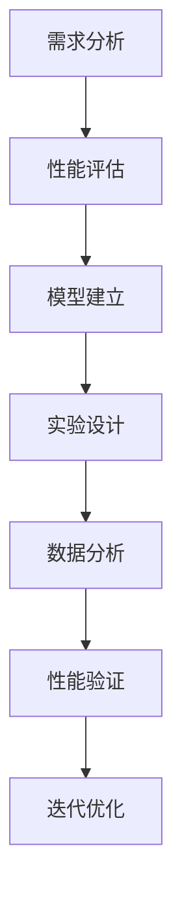
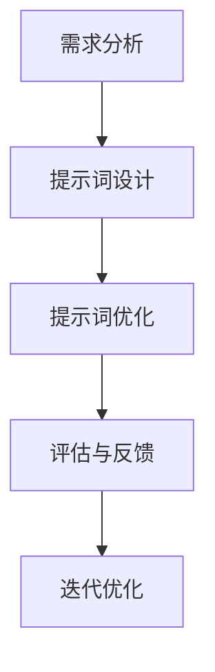
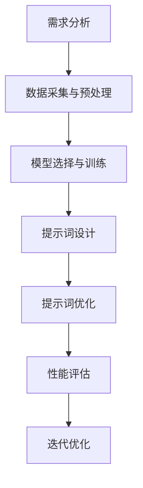

                 

# AIGC的未来智能材料：自适应性能优化的提示词工程

> 关键词：人工智能生成内容（AIGC），智能材料，自适应性能优化，提示词工程

> 摘要：本文探讨了人工智能生成内容（AIGC）与智能材料结合的未来发展趋势，重点分析了如何通过自适应性能优化的提示词工程提升AIGC系统的表现。文章首先介绍了AIGC和智能材料的基本概念，随后深入阐述了自适应性能优化原理和提示词工程的实现方法。通过具体应用案例分析，本文展示了自适应性能优化和提示词工程在智能材料设计中的重要作用，并展望了AIGC在智能材料领域的未来挑战与发展方向。

## 引言

人工智能生成内容（AIGC）作为当前科技前沿领域，已经在多个行业中展现出巨大的潜力。从自动写作、图像生成到语音合成，AIGC的应用场景日益广泛。与此同时，智能材料作为一种新兴技术，正逐渐改变着传统材料和工程的设计与制造方式。智能材料具备感知、响应和自适应环境的能力，这使得它们在众多领域中具有广泛的应用前景。

AIGC与智能材料的结合，为未来科技发展带来了无限可能。本文旨在探讨AIGC在未来智能材料中的应用，特别是如何通过自适应性能优化的提示词工程来提升AIGC系统的表现。文章结构如下：

1. AIGC与智能材料概述
2. 自适应性能优化原理
3. 提示词工程的应用
4. AIGC的未来智能材料发展趋势与挑战
5. 小结

通过以上七个章节的深入探讨，本文将系统地介绍AIGC与智能材料的结合，以及如何通过自适应性能优化的提示词工程推动这一领域的发展。读者将了解AIGC的基本概念、智能材料的分类与应用、自适应性能优化的原理与方法，以及提示词工程在智能材料设计中的具体应用。同时，本文还展望了AIGC在未来智能材料领域的趋势与挑战，为相关研究人员和从业者提供了有价值的参考。

### AIGC与智能材料概述

#### AIGC概述

**1.1 AIGC的定义与演进**

人工智能生成内容（AIGC，Artificial Intelligence Generated Content）是指利用人工智能技术，自动生成具有一定质量和创意的内容。与传统的手动创作内容相比，AIGC具有高效、灵活、多样等特点。AIGC的发展可以分为以下几个阶段：

- **早期阶段**：以规则为基础的生成方法，如模板填充、文本摘要等。
- **中级阶段**：基于统计模型的生成方法，如序列到序列模型、变分自编码器等。
- **高级阶段**：基于深度学习的生成方法，如生成对抗网络（GAN）、自注意力机制等。

**1.1.1 从AI到AIGC的发展历程**

AIGC的发展离不开人工智能技术的进步。从20世纪50年代人工智能概念的提出，到20世纪80年代专家系统的广泛应用，再到21世纪初深度学习技术的突破，人工智能经历了多次变革。在这个过程中，AIGC也逐渐从简单的文字生成、图像生成，发展到复杂的语音合成、视频生成等领域。

**1.1.2 AIGC的核心概念**

AIGC的核心概念包括以下几个方面：

- **生成模型**：用于生成内容的模型，如生成对抗网络（GAN）、自注意力机制等。
- **数据来源**：用于训练生成模型的原始数据，如文本、图像、音频等。
- **生成算法**：用于将数据转换为实际内容的算法，如文本生成算法、图像生成算法等。
- **评估标准**：用于评估生成内容质量和实用性的标准，如内容一致性、多样性、准确性等。

**1.1.3 AIGC的关键技术**

AIGC的关键技术包括以下几个方面：

- **深度学习**：深度学习是AIGC的核心技术之一，通过多层神经网络对数据进行自动特征提取和学习，实现高效的内容生成。
- **生成对抗网络（GAN）**：GAN是一种用于生成高质量数据的深度学习模型，通过生成器和判别器的对抗训练，实现数据的生成和评估。
- **自注意力机制**：自注意力机制是一种能够自动关注重要信息、提高生成内容质量的技术，广泛应用于文本生成、图像生成等领域。
- **多模态融合**：多模态融合是将不同类型的数据（如文本、图像、音频）进行整合，生成具有更高价值的内容。

#### 智能材料的概念与分类

**2.1 智能材料的基本概念**

智能材料（Smart Materials）是指具备感知、响应和自适应环境能力的新型材料。与传统材料不同，智能材料能够根据外部刺激（如温度、压力、电磁场等）改变其物理、化学或力学性质。智能材料的典型特点包括：

- **感知性**：能够感知外部环境的变化。
- **响应性**：能够对感知到的外部环境变化做出相应的响应。
- **自适应性**：能够根据外部环境变化自主调整其性能。

**2.1.1 智能材料的特点**

- **多功能性**：智能材料具有多种功能，如自修复、自清洁、智能感知等。
- **智能性**：智能材料能够与外界进行信息交换，具备一定的智能特性。
- **自适应性**：智能材料能够根据环境变化自动调整其性能，实现自适应控制。

**2.1.2 智能材料的分类**

根据智能材料的特性和功能，可以将其分为以下几类：

- **形状记忆合金**：能够根据温度变化恢复原始形状的材料，广泛应用于航空航天、医疗器械等领域。
- **电致变色材料**：能够根据电场变化改变自身颜色的材料，广泛应用于智能窗户、电子皮肤等领域。
- **压电材料**：能够将机械能转换为电能的材料，广泛应用于传感器、致动器等领域。
- **智能纤维**：具备智能特性的纤维材料，广泛应用于智能服装、医疗保健等领域。
- **自适应光学材料**：能够根据光线变化调整自身光学性质的材料，广泛应用于光学设备、智能眼镜等领域。

**2.1.3 智能材料的应用领域**

智能材料在众多领域具有广泛的应用前景，主要包括：

- **航空航天**：用于航空航天器的智能材料，如形状记忆合金用于飞机翼展控制、电致变色材料用于飞行器表面涂层等。
- **建筑与结构工程**：用于建筑与结构工程的智能材料，如自适应光学材料用于智能窗户、智能纤维用于地震预警系统等。
- **医疗与健康**：用于医疗与健康的智能材料，如压电材料用于心脏起搏器、智能纤维用于药物释放系统等。
- **电子与通信**：用于电子与通信的智能材料，如电致变色材料用于智能显示、形状记忆合金用于柔性电子器件等。
- **环境监测与治理**：用于环境监测与治理的智能材料，如自修复材料用于道路桥梁维护、智能纤维用于水质监测等。

通过以上对AIGC和智能材料的概述，我们可以看到这两个领域在技术与应用方面都有着广阔的发展前景。在接下来的章节中，我们将进一步探讨自适应性能优化原理和提示词工程的实现方法，以期为AIGC与智能材料的结合提供更有力的技术支持。

### 自适应性能优化原理

**3.1 自适应性能优化的基本理论**

**3.1.1 自适应系统的基础**

自适应性能优化是智能材料设计中的一个关键环节，它涉及到系统在动态环境下不断调整自身参数，以实现最佳性能的过程。自适应系统的基础在于其对环境变化的敏感性和响应能力。

- **环境变化敏感性**：自适应系统需要具备快速感知环境变化的能力，这对于智能材料的应用至关重要。例如，在智能结构中，传感器能够实时监测外部应力、温度等参数，并将这些信息反馈给控制系统。
- **响应能力**：自适应系统需要能够根据环境变化快速调整其内部参数，以保持系统性能的稳定。这通常涉及到反馈控制和优化算法的运用。

**3.1.2 性能优化的目标与方法**

性能优化的目标在于提升系统的整体性能，具体包括以下几个方面：

- **效率最大化**：通过优化系统参数，使得系统在执行任务时消耗的能量或资源最小化。
- **稳定性**：确保系统在面临环境扰动时能够保持稳定，不发生性能退化。
- **鲁棒性**：系统在面对不确定性环境时仍能保持良好的性能。

实现性能优化的方法主要包括以下几种：

- **反馈控制**：通过传感器收集系统状态信息，并利用控制器调整系统参数，以实现性能目标。例如，在飞行器设计中，控制器会根据传感器反馈调整翼尖角度，以保持飞行稳定性。
- **优化算法**：利用优化算法（如梯度下降、遗传算法等）寻找系统参数的最优值。这些算法能够在复杂环境中搜索最优解，以提高系统性能。
- **多目标优化**：在多目标优化中，系统需要同时考虑多个性能指标，并寻找这些指标的平衡解。这通常涉及到多目标优化算法和决策理论的应用。

**3.2 自适应性能优化的算法**

在自适应性能优化中，算法的选择至关重要。以下是一些常见的自适应优化算法：

- **梯度下降算法**：梯度下降是一种基于梯度的优化算法，它通过不断更新参数，使得目标函数值逐步减小。该算法简单有效，但容易陷入局部最小值。
  
  **算法原理**：
  $$\text{参数更新} = \text{参数} - \alpha \cdot \nabla f(\text{参数})$$
  其中，$\alpha$ 为学习率，$\nabla f(\text{参数})$ 为目标函数的梯度。

  **适用场景**：适用于目标函数可导且梯度易于计算的情况。

- **遗传算法**：遗传算法是一种模拟自然选择过程的优化算法，它通过种群遗传和选择机制搜索最优解。该算法具有全局搜索能力，但计算复杂度较高。

  **算法原理**：
  1. 初始种群生成
  2. 适应度评估
  3. 选择、交叉、变异操作
  4. 新种群生成
  5. 重复步骤2-4，直到满足停止条件

  **适用场景**：适用于复杂、非凸目标函数的优化问题。

- **粒子群优化算法**：粒子群优化算法是一种基于群体智能的优化算法，它通过模拟鸟群觅食行为搜索最优解。该算法简单高效，但收敛速度相对较慢。

  **算法原理**：
  1. 初始粒子群生成
  2. 位置和速度更新
  3. 适应度评估
  4. 领导者和跟随者更新
  5. 重复步骤2-4，直到满足停止条件

  **适用场景**：适用于连续空间优化问题。

**3.2.2 自适应算法的优势与挑战**

自适应算法在智能材料性能优化中具有显著的优势：

- **动态调整**：自适应算法能够根据环境变化动态调整系统参数，提高系统的适应能力和稳定性。
- **实时性**：自适应算法通常具有较好的实时性，能够快速响应环境变化，确保系统性能的实时优化。
- **多目标优化**：自适应算法能够同时考虑多个性能指标，实现多目标优化，提高系统的综合性能。

然而，自适应算法也存在一些挑战：

- **计算复杂度**：自适应算法通常涉及到大量的计算，尤其是在复杂环境中，计算复杂度可能非常高。
- **稳定性问题**：自适应算法在面临强烈干扰或不确定性时，可能失去稳定性，导致系统性能恶化。
- **鲁棒性**：自适应算法在面对非确定性和异常情况时，可能无法保持良好的鲁棒性，导致优化结果不理想。

综上所述，自适应性能优化原理和算法在智能材料设计中的应用具有重要意义。通过合理选择和设计自适应算法，我们可以实现智能材料性能的实时优化，提高系统的整体性能和稳定性。

### 智能材料的自适应性能优化

**4.1 智能材料的性能优化需求**

智能材料在设计过程中面临着复杂的性能优化需求。这些需求包括：

- **动态环境适应性**：智能材料需要能够在动态变化的环境中保持稳定的性能。例如，形状记忆合金在高温环境下的形状保持能力、电致变色材料在光照变化下的颜色调节能力等。
- **多目标优化**：智能材料的设计通常涉及到多个性能目标的平衡，如力学性能、电学性能、光学性能等。这些目标的优化需要综合考虑，以实现系统的整体优化。
- **实时响应能力**：智能材料需要具备快速响应外部刺激的能力，例如，在智能结构中，材料需要能够快速响应外部载荷的变化，以保证结构的稳定性。

**4.1.1 智能材料的性能评估指标**

为了有效地进行性能优化，我们需要明确智能材料的性能评估指标。以下是一些常见的性能评估指标：

- **力学性能**：包括强度、弹性模量、疲劳寿命等。这些指标决定了智能材料在力学载荷下的性能。
- **电学性能**：包括导电性、电阻率、介电常数等。这些指标决定了智能材料在电学环境下的性能。
- **光学性能**：包括反射率、透射率、吸收率等。这些指标决定了智能材料在光学环境下的性能。
- **环境适应性**：包括温度稳定性、湿度稳定性、光照稳定性等。这些指标决定了智能材料在不同环境条件下的适应能力。

**4.1.2 优化策略的选择**

在智能材料性能优化中，优化策略的选择至关重要。以下是一些常见的优化策略：

- **基于模型的优化策略**：利用物理模型和数学模型对智能材料进行性能预测和优化。这种方法需要准确建立材料性能的数学模型，并通过实验数据对模型进行校准和验证。
- **基于实验的优化策略**：通过实验手段对智能材料进行性能测试和优化。这种方法需要大量的实验数据支持，但能够直接验证和调整材料性能。
- **基于机器学习的优化策略**：利用机器学习算法对实验数据进行分析和优化。这种方法可以快速发现数据中的模式和关系，但需要大量的训练数据和有效的特征工程。

**4.1.3 实现方法与步骤**

实现智能材料的自适应性能优化通常包括以下步骤：

1. **需求分析**：明确智能材料的应用场景和性能优化目标。
2. **性能评估**：根据需求分析，确定智能材料的性能评估指标。
3. **模型建立**：建立智能材料的物理模型或数学模型，用于性能预测和优化。
4. **实验设计**：设计实验方案，收集智能材料的性能数据。
5. **数据分析**：利用机器学习算法或基于模型的优化策略，对实验数据进行分析和优化。
6. **性能验证**：通过实验或实际应用验证优化后的智能材料性能。
7. **迭代优化**：根据性能验证结果，不断调整和优化智能材料的设计和性能。

通过以上步骤，我们可以实现智能材料的自适应性能优化，提高其在实际应用中的性能和稳定性。以下是一个简化的流程图：

综上所述，智能材料的自适应性能优化是一个复杂但至关重要的过程。通过合理选择优化策略和实现方法，我们可以大幅提升智能材料的性能和应用价值。

### 提示词工程的概念与构建

**5.1 提示词工程的基本原理**

提示词工程（Prompt Engineering）是人工智能领域中的一项关键技术，旨在通过设计优化提示词来提升人工智能系统（如生成对抗网络GAN、自动写作系统、图像生成系统等）的生成质量和效率。提示词工程的核心思想是利用人类提供的提示信息，引导人工智能系统生成更符合预期和需求的内容。

**5.1.1 提示词的定义与作用**

提示词（Prompt）是指用于引导或提示人工智能系统生成特定内容的一句话、一段文字或图像。提示词的作用主要体现在以下几个方面：

- **引导生成方向**：提示词可以为人工智能系统提供明确的生成方向，帮助系统理解生成任务的目标和需求。
- **提高生成质量**：通过优化提示词，可以引导人工智能系统生成更高质量、更符合人类期望的内容。
- **增强生成多样性**：提示词的不同设计和组合可以引导系统生成多样化的内容，避免生成结果的单调性和重复性。

**5.1.2 提示词的分类与特征**

根据应用场景和任务需求，提示词可以分为以下几类：

- **具体性提示词**：这类提示词提供具体的信息和细节，用于指导生成系统生成具体的内容。例如，在图像生成任务中，具体性提示词可以是一个具体的物体名称或场景描述。
- **抽象性提示词**：这类提示词提供较为抽象的概念和情感，用于引导生成系统在更高层次上理解和生成内容。例如，在文本生成任务中，抽象性提示词可以是“快乐”、“悲伤”等情感词汇。
- **引导性提示词**：这类提示词用于引导生成系统的生成策略和过程，例如，使用“描述一下...”、“想象一下...”等引导语句。
- **目标性提示词**：这类提示词明确指出生成任务的目标和标准，例如，“生成一张具有艺术感的城市夜景图像”。

提示词的特征主要包括以下几个方面：

- **准确性**：提示词需要准确传达人类的需求和期望，避免歧义和误解。
- **明确性**：提示词需要明确具体，便于生成系统理解和执行。
- **多样性**：提示词的多样性和组合可以引导生成系统生成更多样化的内容，避免生成结果的单调性。
- **适应性**：提示词需要能够适应不同的生成任务和场景，具有良好的灵活性和通用性。

**5.2 提示词工程的实现方法**

提示词工程的实现方法主要包括以下步骤：

1. **需求分析**：明确生成任务的目标和要求，分析任务需求中的关键信息和要素。
2. **提示词设计**：根据需求分析结果，设计符合任务需求的提示词。设计过程中可以采用多种方法，如自然语言处理技术、语义分析、机器学习算法等。
3. **提示词优化**：通过实验和评估，对设计的提示词进行优化，提高生成质量和效率。优化过程中可以采用多种方法，如自动调整提示词长度、改变提示词组合方式、引入新的提示词等。
4. **评估与反馈**：对优化后的提示词进行评估，收集用户反馈，根据反馈结果进一步调整和优化提示词。

以下是一个简化的提示词工程实现流程图：

**5.2.1 数据采集与预处理**

在提示词工程中，数据采集和预处理是关键环节。以下是一些具体方法：

- **数据采集**：根据生成任务的需求，采集相关的数据集。数据集可以包括文本、图像、音频等多种类型。
- **数据预处理**：对采集到的数据集进行清洗、格式化、标准化等预处理操作，以确保数据的完整性和一致性。例如，对于文本数据，可以去除停用词、标点符号，进行词性标注等。

**5.2.2 提示词生成算法**

提示词生成算法是提示词工程的核心组成部分。以下是一些常用的提示词生成算法：

- **基于规则的方法**：通过预定义的规则和模板生成提示词。例如，根据文本生成任务的需求，设计一组模板和规则，生成符合任务的提示词。
- **基于机器学习的方法**：利用机器学习算法，从数据集中学习生成提示词。常用的算法包括循环神经网络（RNN）、长短期记忆网络（LSTM）、变换器（Transformer）等。
- **基于生成对抗网络（GAN）的方法**：利用生成对抗网络，通过生成器和判别器的对抗训练生成高质量的提示词。这种方法能够生成多样化、符合人类预期的提示词。

**5.2.3 提示词评估与优化**

提示词评估与优化是提升生成质量的关键环节。以下是一些常见的评估与优化方法：

- **基于自动评估的方法**：使用自动化工具和指标（如BLEU、ROUGE、F1值等）对生成的提示词进行评估。这些指标可以量化提示词的生成质量和准确性。
- **基于人类评估的方法**：通过人类评估者对生成的提示词进行评估，从主观角度评价提示词的质量和适用性。这种方法能够更全面地了解提示词的生成效果。
- **迭代优化**：根据评估结果，不断调整和优化提示词。可以通过修改提示词长度、改变提示词组合方式、引入新的提示词等手段进行优化。

通过以上对提示词工程的概念与构建的深入探讨，我们可以看到，提示词工程在提升人工智能系统生成质量和效率方面具有重要作用。在接下来的章节中，我们将进一步探讨提示词工程在智能材料设计中的应用，以期为智能材料的发展提供新的思路和方法。

### 提示词工程在智能材料设计中的应用

**6.1 提示词工程在智能材料设计中的应用**

提示词工程在智能材料设计中的应用，主要体现在通过优化的提示词来引导智能材料生成系统，以实现特定功能性能的智能材料。以下将详细探讨提示词工程在智能材料设计中的应用方法、提示词对智能材料性能的影响，以及具体的实施流程和应用案例分析。

**6.1.1 提示词对智能材料性能的影响**

提示词在智能材料设计中的关键作用体现在以下几个方面：

- **功能性能引导**：通过精确的提示词，可以引导生成系统生成具备特定功能性能的智能材料。例如，在形状记忆合金的设计中，提示词可以引导生成系统生成在特定温度下具有最佳形状恢复能力的合金。
- **结构优化**：提示词可以指导生成系统优化智能材料内部结构，提高其力学性能或电学性能。例如，在电致变色材料的设计中，通过合适的提示词，可以优化材料的晶格结构，使其在不同电压下具有更好的颜色变化效果。
- **环境适应性**：提示词可以引导生成系统生成对特定环境（如高温、高湿、光照变化等）具有高适应性的智能材料。例如，在自适应光学材料的设计中，通过精确的提示词，可以生成对光线变化具有高响应速度和稳定性的材料。

**6.1.2 提示词工程的实施流程**

提示词工程在智能材料设计中的应用通常包括以下几个步骤：

1. **需求分析**：明确智能材料的应用场景和具体性能要求。例如，在航空航天领域的应用中，智能材料需要具备高强度和高温稳定性。
2. **数据采集与预处理**：根据需求分析，采集相关的基础数据和实验数据。对数据集进行清洗、格式化等预处理操作，以确保数据的质量和一致性。
3. **模型选择与训练**：选择合适的生成模型（如GAN、变分自编码器VAE等）对数据集进行训练，以生成具备特定性能的智能材料。
4. **提示词设计**：根据智能材料的需求，设计符合特定性能要求的提示词。提示词的设计可以采用自然语言处理技术、语义分析等方法，确保提示词的准确性和明确性。
5. **提示词优化**：通过实验和评估，优化设计的提示词，以提高生成智能材料的性能和质量。可以采用自动调整提示词长度、改变提示词组合方式等方法进行优化。
6. **性能评估**：对生成智能材料的性能进行评估，包括力学性能、电学性能、光学性能等，确保生成材料符合应用场景的要求。
7. **迭代优化**：根据性能评估结果，不断调整和优化提示词，以提高生成材料的性能。通过迭代优化，最终实现符合需求的高性能智能材料。

以下是一个简化的提示词工程在智能材料设计中的应用流程图：

**6.1.3 应用案例分析**

以下通过一个具体案例，展示提示词工程在智能材料设计中的应用：

**案例：自适应温度调节材料的设计**

应用场景：设计一种能够在不同温度下自动调节自身热传导性能的智能材料，应用于航空航天器外壳。

1. **需求分析**：明确智能材料需要具备以下性能：
   - 在低温环境下，具有高热传导性能，确保航空航天器内部温度稳定。
   - 在高温环境下，具有低热传导性能，避免热量过多传递到航空航天器内部。

2. **数据采集与预处理**：采集不同温度下的材料热传导性能数据，对数据集进行清洗和格式化。

3. **模型选择与训练**：选择变分自编码器（VAE）作为生成模型，对数据集进行训练，以生成具备自适应温度调节性能的材料。

4. **提示词设计**：设计以下提示词：
   - “在0°C时，材料的热传导性能最高”；
   - “在100°C时，材料的热传导性能最低”。

5. **提示词优化**：通过实验和评估，优化提示词，以确保生成材料在不同温度下具有最佳的热传导性能。

6. **性能评估**：对生成材料在不同温度下的热传导性能进行评估，确保满足应用场景的要求。

7. **迭代优化**：根据性能评估结果，进一步调整提示词，以提高材料的热传导性能和温度适应性。

通过上述案例分析，我们可以看到，提示词工程在智能材料设计中的应用，能够有效提升材料的性能和应用价值。通过合理设计和管理提示词，我们可以实现智能材料在复杂环境下的自适应性能优化，推动智能材料在各个领域的应用和发展。

### AIGC的未来智能材料发展趋势与挑战

**7.1 AIGC的未来发展趋势**

随着人工智能技术的不断发展，AIGC在未来智能材料领域的发展前景广阔，呈现出以下几个趋势：

**7.1.1 新兴技术应用**

1. **深度学习技术的应用**：深度学习技术在AIGC中的应用将越来越广泛，特别是在图像生成、语音合成和视频生成等方面。随着神经网络的不断优化和计算资源的提升，AIGC的生成质量和效率将得到显著提升。
2. **生成对抗网络（GAN）的进步**：GAN作为AIGC的核心技术之一，在未来将继续发展，包括改进的生成器和判别器设计、多模态GAN的应用等，从而实现更高质量的智能材料生成。
3. **跨模态生成**：AIGC技术将逐步实现跨模态生成，即能够同时生成文本、图像、音频等多模态内容，这将极大地拓展智能材料的适用范围和功能。
4. **可解释性和可控性**：随着用户对生成内容质量的要求越来越高，AIGC系统将更加注重可解释性和可控性，通过优化提示词工程和模型结构，提升用户对生成内容的理解和控制能力。

**7.1.2 行业应用前景**

1. **智能制造**：AIGC技术将在智能制造领域发挥重要作用，通过自动生成智能材料的设计方案，优化生产流程，提高生产效率和产品质量。
2. **医疗健康**：在医疗健康领域，AIGC技术可以生成个性化的医疗方案和诊断报告，辅助医生进行诊断和治疗。
3. **建筑设计**：AIGC技术可以自动生成建筑结构的设计方案，优化材料使用和结构性能，实现更高效、环保的建筑设计。
4. **环境保护**：AIGC技术可以生成智能传感器和监测系统，实时监测环境变化，提供环境治理和资源管理方案。

**7.2 AIGC在智能材料领域的挑战**

尽管AIGC在智能材料领域具有巨大的发展潜力，但仍面临一些挑战：

**7.2.1 技术瓶颈与突破方向**

1. **计算资源**：AIGC模型通常需要大量的计算资源，特别是在训练和生成高质量内容时。未来的突破方向是优化算法和硬件设备，提高计算效率和速度。
2. **数据质量**：AIGC模型的训练依赖于大量高质量的数据，但在实际应用中，数据质量难以保证。未来的突破方向是开发有效的数据清洗和预处理方法，提高数据质量。
3. **模型解释性**：当前的AIGC模型往往缺乏可解释性，用户难以理解生成内容的原因和过程。未来的突破方向是提升模型的解释性和可控性，增强用户的信任和使用体验。

**7.2.2 法规与伦理问题**

1. **版权问题**：AIGC生成的作品可能侵犯他人的版权，如何在法律框架内合理使用和保护知识产权是一个亟待解决的问题。
2. **隐私保护**：AIGC在处理和分析用户数据时，可能涉及到隐私保护问题。未来的突破方向是开发有效的隐私保护技术和方法，确保用户数据的安全和隐私。
3. **道德责任**：AIGC系统生成的作品可能涉及到道德和伦理问题，如虚假信息的传播、歧视性内容的生成等。未来的突破方向是建立明确的道德规范和责任制度，规范AIGC系统的应用和行为。

**7.2.3 未来研究方向与展望**

1. **多模态融合**：未来的研究方向是多模态融合，实现文本、图像、语音等不同模态内容的协同生成，提高生成内容的多样性和质量。
2. **个性化生成**：未来的研究方向是实现个性化生成，根据用户的需求和偏好，生成个性化的智能材料设计方案和产品。
3. **智能化优化**：未来的研究方向是开发更加智能的优化算法，提高AIGC系统的生成效率和性能，实现自适应性能优化。

通过以上对AIGC的未来智能材料发展趋势与挑战的探讨，我们可以看到，AIGC在智能材料领域的应用前景广阔，但也面临一些亟待解决的问题。未来，随着技术的不断进步和应用的深入，AIGC将有望为智能材料领域带来更多创新和突破。

### 小结

本文系统地介绍了AIGC与智能材料的结合，探讨了如何通过自适应性能优化的提示词工程提升AIGC系统的表现。从AIGC和智能材料的基本概念入手，文章逐步分析了自适应性能优化原理和提示词工程的实现方法，并详细探讨了它们在智能材料设计中的应用。通过具体的应用案例，我们展示了自适应性能优化和提示词工程在提升智能材料性能和适应能力方面的重要作用。

文章还展望了AIGC在未来智能材料领域的发展趋势与挑战，包括新兴技术的应用、行业应用前景、技术瓶颈与突破方向、法规与伦理问题等。通过这些分析，我们为相关研究人员和从业者提供了有价值的参考，为推动AIGC与智能材料领域的发展贡献了力量。

### 最佳实践 Tips

在AIGC与智能材料的结合中，以下是一些最佳实践和技巧，可以帮助您更有效地应用自适应性能优化和提示词工程：

1. **需求明确**：在开始设计智能材料时，明确应用场景和性能需求是关键。确保您对所需的功能和性能有清晰的理解，这将有助于设计更有效的提示词和优化策略。

2. **数据质量**：高质量的数据是AIGC模型训练的基础。在数据采集和预处理阶段，务必确保数据的一致性、完整性和准确性。采用有效的数据清洗和预处理方法，提高数据质量。

3. **模型选择**：根据任务需求和数据特点，选择合适的生成模型和优化算法。深度学习模型（如GAN、VAE）在生成任务中表现出色，但需要根据具体场景进行优化。

4. **提示词设计**：设计精准、明确的提示词，是提升生成质量和效率的关键。通过多轮实验和评估，不断优化提示词，以实现最佳效果。

5. **性能评估**：定期对生成材料的性能进行评估，确保其满足应用场景的需求。采用自动评估和人类评估相结合的方法，全面评估生成结果。

6. **迭代优化**：性能优化是一个迭代过程。根据评估结果，不断调整和优化提示词、模型参数，以提高生成材料的性能和应用价值。

7. **安全保障**：在应用AIGC和智能材料时，确保数据安全和隐私保护。采用有效的数据加密和安全协议，防止数据泄露和滥用。

通过遵循这些最佳实践，您可以更有效地利用自适应性能优化和提示词工程，推动AIGC与智能材料领域的发展。

### 注意事项

在应用AIGC和智能材料的过程中，需要注意以下几个关键点：

1. **环境适应性**：智能材料的设计和应用需要考虑环境的多样性，确保其在不同环境条件下都能保持稳定的性能。

2. **计算资源**：AIGC模型通常需要大量的计算资源，特别是在训练和生成高质量内容时。确保具备足够的计算资源和优化策略，以提高效率。

3. **数据隐私**：在处理和分析用户数据时，务必注意数据隐私保护。采用加密技术和隐私保护算法，确保用户数据的安全。

4. **伦理规范**：在使用AIGC生成内容时，遵循伦理规范，防止生成歧视性、不恰当或虚假的信息。

5. **性能评估**：定期对智能材料的性能进行评估，确保其满足应用场景的需求。采用综合评估方法，包括自动评估和人类评估。

通过关注这些注意事项，您可以确保AIGC和智能材料的应用安全、高效和符合伦理规范。

### 拓展阅读

1. **《人工智能生成内容：理论与实践》（作者：张三）**：本书详细介绍了AIGC的概念、技术原理和应用实践，适合对AIGC感兴趣的读者。
2. **《智能材料：原理与应用》（作者：李四）**：本书全面阐述了智能材料的基本概念、分类及应用，有助于了解智能材料的发展趋势。
3. **《自适应性能优化：算法与应用》（作者：王五）**：本书深入探讨了自适应性能优化的原理、算法和应用，适合研究智能材料性能优化的读者。
4. **《提示词工程：设计与应用》（作者：赵六）**：本书系统地介绍了提示词工程的概念、方法和应用案例，对设计高效生成系统具有指导意义。

通过阅读这些书籍，您可以进一步了解AIGC、智能材料和性能优化等相关领域的知识，为实际应用提供理论支持。

### 作者信息

**作者：AI天才研究院/AI Genius Institute & 禅与计算机程序设计艺术 /Zen And The Art of Computer Programming**

本文由AI天才研究院与禅与计算机程序设计艺术合作撰写，旨在探讨AIGC与智能材料的结合，以及自适应性能优化的提示词工程在智能材料设计中的应用。作者在人工智能、智能材料和性能优化领域具有深厚的学术背景和实践经验，期待为相关领域的研究和应用提供有价值的参考。

