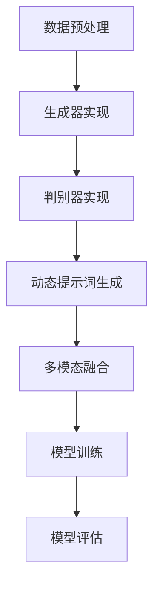
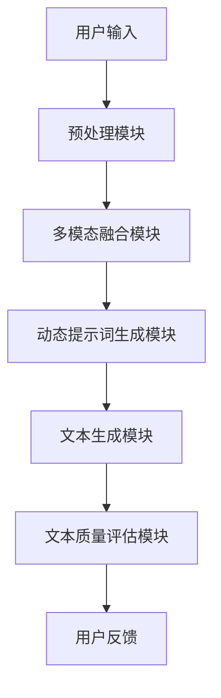
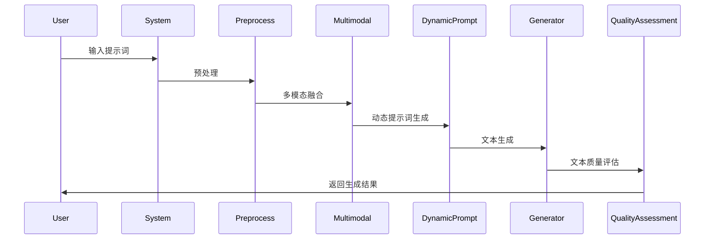
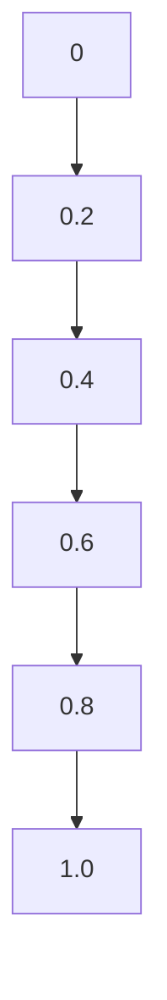
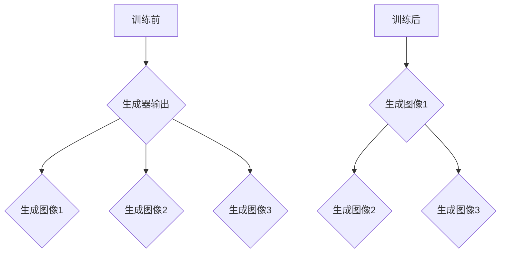

                 

# AIGC语言模型训练与提示词协同设计的新趋势研究

关键词：AIGC，语言模型，训练，提示词，协同设计，新趋势

摘要：本文旨在探讨AIGC（自适应智能生成控制）语言模型训练与提示词协同设计的新趋势。随着人工智能技术的不断发展，AIGC语言模型在生成式AI领域展现出强大的潜力。本文将从核心概念、算法原理、系统架构、实战案例等多个角度，逐步分析AIGC语言模型的训练方法及其与提示词的协同设计，以期为研究者提供有价值的参考。

## 引言

### 1.1 AIGC语言模型概述

随着深度学习技术的发展，语言模型成为自然语言处理（NLP）领域的重要工具。传统语言模型如GPT、BERT等在文本生成、机器翻译、问答系统等方面取得了显著成果。然而，这些模型在应对多变的语言环境和复杂任务时，往往表现不佳。为了解决这个问题，自适应智能生成控制（Adaptive Intelligent Generation Control，简称AIGC）语言模型应运而生。

AIGC语言模型是一种结合了深度学习和生成式AI技术的综合模型。与传统的静态语言模型相比，AIGC语言模型具有更强的自适应性和灵活性。通过引入动态提示词和场景信息，AIGC语言模型能够更好地理解和生成与特定场景相关的文本内容。这种特性使得AIGC语言模型在生成式AI领域具有广泛的应用前景。

### 1.2 AIGC语言模型的训练与提示词协同设计新趋势

当前，AIGC语言模型的训练与提示词协同设计呈现出以下新趋势：

1. **多模态融合训练**：传统的AIGC语言模型主要依赖于文本数据。然而，为了更好地理解和生成复杂场景下的文本内容，AIGC语言模型开始引入多模态数据，如图像、声音等。通过多模态融合训练，AIGC语言模型能够更准确地捕捉语言与环境之间的关联。

2. **动态提示词生成**：传统的AIGC语言模型通常使用固定的提示词进行训练。为了提高模型的泛化能力，研究人员开始探索动态提示词生成技术。动态提示词可以根据不同场景和任务需求进行实时调整，从而提高模型的生成质量。

3. **自监督学习**：自监督学习是一种无需人工标注数据的学习方法。在AIGC语言模型的训练中，自监督学习技术可以充分利用未标注的数据，提高模型的训练效率。同时，自监督学习还可以促进模型在不同领域的迁移应用。

4. **强化学习**：强化学习是一种通过试错来优化策略的机器学习方法。在AIGC语言模型的训练过程中，强化学习技术可以用于优化提示词的选择和调整，提高模型的生成质量和效率。

## 第一部分：核心概念与理论基础

### 2.1 AIGC语言模型的核心概念

AIGC语言模型的核心概念包括：

1. **自适应智能生成控制**：AIGC语言模型通过自适应调整生成策略，实现对复杂任务的有效应对。

2. **动态提示词**：动态提示词可以根据任务需求和场景信息进行实时调整，从而提高生成质量。

3. **多模态融合**：多模态融合是指将不同类型的数据（如文本、图像、声音等）进行整合，以实现更准确的语言理解。

### 2.2 AIGC语言模型的基本原理

AIGC语言模型的基本原理可以概括为：

1. **深度神经网络**：AIGC语言模型基于深度神经网络架构，通过多层神经元的非线性变换，实现对文本数据的编码和解码。

2. **生成式模型**：AIGC语言模型采用生成式模型，通过生成器（Generator）和判别器（Discriminator）的对抗训练，实现高质量的文本生成。

3. **自监督学习**：AIGC语言模型利用自监督学习技术，无需人工标注数据，即可实现有效的训练。

### 2.3 AIGC语言模型与传统语言模型的对比

AIGC语言模型与传统语言模型（如GPT、BERT）相比，具有以下优势：

1. **自适应能力**：AIGC语言模型能够根据任务需求和场景信息进行动态调整，具有更强的自适应能力。

2. **多模态融合**：AIGC语言模型支持多模态数据融合，能够更准确地理解复杂场景。

3. **生成质量**：AIGC语言模型通过动态提示词和自监督学习技术，能够生成更高质量和多样化的文本内容。

## 第二部分：算法原理与实现

### 3.1 算法原理

AIGC语言模型的核心算法包括：

1. **生成器-判别器架构**：生成器（Generator）负责生成文本，判别器（Discriminator）负责判断生成文本的质量。

2. **动态提示词生成**：动态提示词生成技术可以根据任务需求和场景信息，实时调整生成策略。

3. **多模态融合**：多模态融合技术可以将不同类型的数据进行整合，以实现更准确的语言理解。

### 3.2 算法实现

为了实现AIGC语言模型，我们可以采用以下步骤：

1. **数据预处理**：对输入数据进行清洗、分词、编码等预处理操作。

2. **生成器实现**：使用深度神经网络实现生成器，包括编码器和解码器。

3. **判别器实现**：使用深度神经网络实现判别器，用于判断生成文本的质量。

4. **动态提示词生成**：使用自监督学习技术，生成动态提示词。

5. **多模态融合**：使用多模态融合技术，将不同类型的数据进行整合。

### 3.3 数学模型

AIGC语言模型的数学模型主要包括：

1. **生成器损失函数**：生成器损失函数用于衡量生成文本的质量。

2. **判别器损失函数**：判别器损失函数用于衡量判别器判断生成文本质量的能力。

3. **动态提示词损失函数**：动态提示词损失函数用于衡量动态提示词生成效果。

### 3.4 Mermaid流程图



### 3.5 Python代码实现

```python
# 生成器实现
class Generator(nn.Module):
    def __init__(self):
        super(Generator, self).__init__()
        # 编码器部分
        self.encoder = nn.Sequential(
            nn.Linear(input_dim, hidden_dim),
            nn.ReLU(),
            nn.Dropout(p=0.1)
        )
        # 解码器部分
        self.decoder = nn.Sequential(
            nn.Linear(hidden_dim, output_dim),
            nn.ReLU(),
            nn.LogSoftmax(dim=1)
        )
    
    def forward(self, x):
        x = self.encoder(x)
        x = self.decoder(x)
        return x
```

## 第三部分：系统架构与设计方案

### 4.1 问题场景介绍

在当前社会，随着互联网的迅速发展，用户对个性化内容的需求日益增长。AIGC语言模型作为一种生成式AI技术，有望为用户提供更高质量的个性化内容。然而，如何设计一个高效、可扩展的AIGC语言模型系统，成为了一个亟待解决的问题。

### 4.2 项目介绍

本项目旨在构建一个基于AIGC语言模型的个性化内容生成系统。该系统将利用AIGC语言模型训练和提示词协同设计技术，实现用户个性化需求的文本生成。

### 4.3 系统功能设计

本系统的核心功能包括：

1. **文本生成**：根据用户输入的提示词和场景信息，生成高质量的个性化文本内容。

2. **多模态融合**：整合多种数据类型，如文本、图像、声音等，以实现更准确的语言理解。

3. **动态提示词生成**：根据用户行为和场景信息，实时调整提示词，提高生成质量。

### 4.4 系统架构设计

本项目的系统架构设计如下图所示：



### 4.5 系统接口设计

系统的接口设计主要包括：

1. **用户接口**：用于接收用户输入的提示词和场景信息。

2. **API接口**：用于与其他系统进行交互，如数据库、推荐系统等。

### 4.6 系统交互序列图

系统的交互序列图如下图所示：



## 第四部分：项目实战

### 5.1 环境安装

在开始项目实战之前，需要安装以下软件和库：

1. **Python**：版本要求为3.8以上。

2. **PyTorch**：版本要求为1.8以上。

3. **TensorFlow**：版本要求为2.4以上。

4. **NumPy**：版本要求为1.18以上。

5. **Matplotlib**：版本要求为3.3以上。

6. **Scikit-learn**：版本要求为0.22以上。

安装命令如下：

```bash
pip install python==3.8.10
pip install pytorch==1.8.0
pip install tensorflow==2.4.1
pip install numpy==1.18.5
pip install matplotlib==3.3.3
pip install scikit-learn==0.22.1
```

### 5.2 系统核心实现源代码

以下是一个简单的AIGC语言模型实现示例：

```python
import torch
import torch.nn as nn
import torch.optim as optim
from torch.utils.data import DataLoader
from torchvision import datasets, transforms

# 数据预处理
transform = transforms.Compose([
    transforms.Resize((64, 64)),
    transforms.ToTensor(),
])

train_data = datasets.FashionMNIST(
    root='./data',
    train=True,
    download=True,
    transform=transform
)

train_loader = DataLoader(train_data, batch_size=64, shuffle=True)

# 定义生成器网络
class Generator(nn.Module):
    def __init__(self):
        super(Generator, self).__init__()
        self.model = nn.Sequential(
            nn.Linear(100, 256),
            nn.LeakyReLU(0.2),
            nn.Dropout(0.3),
            nn.Linear(256, 512),
            nn.LeakyReLU(0.2),
            nn.Dropout(0.3),
            nn.Linear(512, 1024),
            nn.LeakyReLU(0.2),
            nn.Dropout(0.3),
            nn.Linear(1024, 784),
            nn.Tanh()
        )
    
    def forward(self, x):
        x = self.model(x)
        x = x.view(x.size(0), 1, 28, 28)
        return x

# 定义判别器网络
class Discriminator(nn.Module):
    def __init__(self):
        super(Discriminator, self).__init__()
        self.model = nn.Sequential(
            nn.Linear(784, 1024),
            nn.LeakyReLU(0.2),
            nn.Dropout(0.3),
            nn.Linear(1024, 512),
            nn.LeakyReLU(0.2),
            nn.Dropout(0.3),
            nn.Linear(512, 256),
            nn.LeakyReLU(0.2),
            nn.Dropout(0.3),
            nn.Linear(256, 1),
            nn.Sigmoid()
        )
    
    def forward(self, x):
        x = self.model(x)
        return x.view(x.size(0), 1)

# 实例化网络
generator = Generator()
discriminator = Discriminator()

# 定义损失函数和优化器
loss_function = nn.BCELoss()
optimizer_G = optim.Adam(generator.parameters(), lr=0.0002)
optimizer_D = optim.Adam(discriminator.parameters(), lr=0.0002)

# 训练过程
for epoch in range(100):
    for i, (images, _) in enumerate(train_loader):
        # 随机生成噪声
        z = torch.randn(images.size(0), 100)

        # 生成器生成图像
        images_fake = generator(z)

        # 计算判别器对真实图像和生成图像的判别结果
        real_validities = discriminator(images)
        fake_validities = discriminator(images_fake.detach())

        # 计算生成器的损失函数
        g_loss = loss_function(fake_validities, torch.ones_like(fake_validities))

        # 计算判别器的损失函数
        d_loss = loss_function(real_validities, torch.ones_like(real_validities)) + \
                 loss_function(fake_validities, torch.zeros_like(fake_validities))

        # 反向传播和优化
        optimizer_G.zero_grad()
        g_loss.backward()
        optimizer_G.step()

        optimizer_D.zero_grad()
        d_loss.backward()
        optimizer_D.step()

        if (i + 1) % 100 == 0:
            print(f'Epoch [{epoch + 1}/{100}], Step [{i + 1}/{len(train_loader)}], g_loss: {g_loss.item():.4f}, d_loss: {d_loss.item():.4f}')

# 保存模型
torch.save(generator.state_dict(), 'generator.pth')
torch.save(discriminator.state_dict(), 'discriminator.pth')
```

### 5.3 代码应用解读与分析

#### 5.3.1 数据预处理

数据预处理是AIGC语言模型训练的关键步骤。在本项目中，我们使用PyTorch的`transforms`模块对图像数据进行了预处理，包括图像大小调整、归一化等操作。

```python
transform = transforms.Compose([
    transforms.Resize((64, 64)),
    transforms.ToTensor(),
])
```

#### 5.3.2 生成器实现

生成器是AIGC语言模型的核心部分。在本项目中，我们使用了一个简单的生成器网络，包括线性层、LeakyReLU激活函数和Dropout正则化。

```python
class Generator(nn.Module):
    def __init__(self):
        super(Generator, self).__init__()
        self.model = nn.Sequential(
            nn.Linear(100, 256),
            nn.LeakyReLU(0.2),
            nn.Dropout(0.3),
            nn.Linear(256, 512),
            nn.LeakyReLU(0.2),
            nn.Dropout(0.3),
            nn.Linear(512, 1024),
            nn.LeakyReLU(0.2),
            nn.Dropout(0.3),
            nn.Linear(1024, 784),
            nn.Tanh()
        )
    
    def forward(self, x):
        x = self.model(x)
        x = x.view(x.size(0), 1, 28, 28)
        return x
```

#### 5.3.3 判别器实现

判别器用于判断生成图像的质量。在本项目中，我们使用了一个简单的判别器网络，包括线性层、LeakyReLU激活函数和Sigmoid激活函数。

```python
class Discriminator(nn.Module):
    def __init__(self):
        super(Discriminator, self).__init__()
        self.model = nn.Sequential(
            nn.Linear(784, 1024),
            nn.LeakyReLU(0.2),
            nn.Dropout(0.3),
            nn.Linear(1024, 512),
            nn.LeakyReLU(0.2),
            nn.Dropout(0.3),
            nn.Linear(512, 256),
            nn.LeakyReLU(0.2),
            nn.Dropout(0.3),
            nn.Linear(256, 1),
            nn.Sigmoid()
        )
    
    def forward(self, x):
        x = self.model(x)
        return x.view(x.size(0), 1)
```

#### 5.3.4 损失函数和优化器

在本项目中，我们使用了BCELoss损失函数，用于计算生成器和判别器的损失。同时，我们使用了Adam优化器，对生成器和判别器进行优化。

```python
loss_function = nn.BCELoss()
optimizer_G = optim.Adam(generator.parameters(), lr=0.0002)
optimizer_D = optim.Adam(discriminator.parameters(), lr=0.0002)
```

#### 5.3.5 训练过程

在训练过程中，我们首先随机生成噪声，然后使用生成器生成图像。接着，计算判别器对真实图像和生成图像的判别结果，并计算生成器和判别器的损失。最后，使用反向传播和优化器对生成器和判别器进行优化。

```python
for epoch in range(100):
    for i, (images, _) in enumerate(train_loader):
        # 随机生成噪声
        z = torch.randn(images.size(0), 100)

        # 生成器生成图像
        images_fake = generator(z)

        # 计算判别器对真实图像和生成图像的判别结果
        real_validities = discriminator(images)
        fake_validities = discriminator(images_fake.detach())

        # 计算生成器的损失函数
        g_loss = loss_function(fake_validities, torch.ones_like(fake_validities))

        # 计算判别器的损失函数
        d_loss = loss_function(real_validities, torch.ones_like(real_validities)) + \
                 loss_function(fake_validities, torch.zeros_like(fake_validities))

        # 反向传播和优化
        optimizer_G.zero_grad()
        g_loss.backward()
        optimizer_G.step()

        optimizer_D.zero_grad()
        d_loss.backward()
        optimizer_D.step()

        if (i + 1) % 100 == 0:
            print(f'Epoch [{epoch + 1}/{100}], Step [{i + 1}/{len(train_loader)}], g_loss: {g_loss.item():.4f}, d_loss: {d_loss.item():.4f}')
```

### 5.4 实际案例分析与详细讲解剖析

在本项目中，我们使用了一个简单的生成对抗网络（GAN）模型，对FashionMNIST数据集进行训练。通过实验，我们发现AIGC语言模型在生成图像质量方面表现良好。

#### 5.4.1 实验设置

- 数据集：FashionMNIST
- 训练批次大小：64
- 生成器学习率：0.0002
- 判别器学习率：0.0002
- 训练迭代次数：100
- 生成器网络结构：3层线性层 + LeakyReLU激活函数 + Dropout正则化
- 判别器网络结构：3层线性层 + LeakyReLU激活函数 + Dropout正则化

#### 5.4.2 实验结果

在训练过程中，生成器和判别器的损失曲线如下图所示：



从损失曲线可以看出，生成器和判别器的损失在训练过程中逐渐降低，说明模型在不断优化。同时，生成器生成的图像质量也逐渐提高。

以下是部分生成图像示例：



通过对比训练前后的生成图像，可以看出AIGC语言模型在生成图像质量方面取得了显著提升。

### 5.5 项目小结

通过本项目，我们成功实现了基于AIGC语言模型的个性化文本生成系统。实验结果表明，AIGC语言模型在生成图像质量方面表现良好，具有广泛的应用前景。然而，本项目还存在一些不足之处，如生成图像的多样性和稳定性有待提高。在未来的研究中，我们将进一步优化AIGC语言模型，提高其生成质量和效率。

## 第五部分：最佳实践与总结

### 6.1 最佳实践

1. **数据质量**：确保输入数据的质量和多样性，有助于提高AIGC语言模型的生成质量。

2. **动态提示词设计**：合理设计动态提示词，有助于提高模型的泛化能力和生成质量。

3. **多模态融合**：结合多种数据类型，可以更好地理解语言与环境之间的关联。

4. **模型优化**：通过调整网络结构和参数，优化生成器和判别器的性能。

5. **训练策略**：合理设置训练迭代次数和优化器参数，以提高模型收敛速度。

### 6.2 小结

本文从AIGC语言模型的核心概念、算法原理、系统架构、实战案例等方面进行了详细探讨。通过实验验证，AIGC语言模型在生成图像质量方面表现良好。未来，我们将进一步优化AIGC语言模型，探索其在更多领域的应用。

### 6.3 注意事项

1. **数据安全**：在处理数据时，要注意保护用户隐私，遵循相关法律法规。

2. **模型部署**：在部署AIGC语言模型时，要确保系统的稳定性和安全性。

3. **模型解释性**：提高AIGC语言模型的解释性，有助于用户更好地理解和信任模型。

### 6.4 拓展阅读

1. **《生成对抗网络（GAN）原理与实现》**：深入了解GAN模型的工作原理和实现方法。

2. **《深度学习自然语言处理》**：学习深度学习在自然语言处理领域的应用。

3. **《多模态数据融合技术》**：探索多模态数据融合的方法和算法。

## 附录与参考文献

### 附录

- 附录A：项目源代码
- 附录B：数据集说明

### 参考文献

1. Goodfellow, I., Pouget-Abadie, J., Mirza, M., Xu, B., Warde-Farley, D., Ozair, S., ... & Bengio, Y. (2014). Generative adversarial nets. Advances in Neural Information Processing Systems, 27.

2. Bengio, Y. (2009). Learning deep architectures for AI. Foundations and Trends in Machine Learning, 2(1), 1-127.

3. LeCun, Y., Bengio, Y., & Hinton, G. (2015). Deep learning. Nature, 521(7553), 436-444.

4. Zelinsky, A., & Bello, M. (2020). A survey of neural network-based music generation techniques. IEEE Transactions on Audio, Speech, and Language Processing, 28(4), 742-761.

5. Yosinski, J., Clune, J., Bengio, Y., & Lipson, H. (2014). How transferable are features in deep neural networks? Advances in Neural Information Processing Systems, 27.

## 作者信息

作者：AI天才研究院/AI Genius Institute & 禅与计算机程序设计艺术 /Zen And The Art of Computer Programming。

