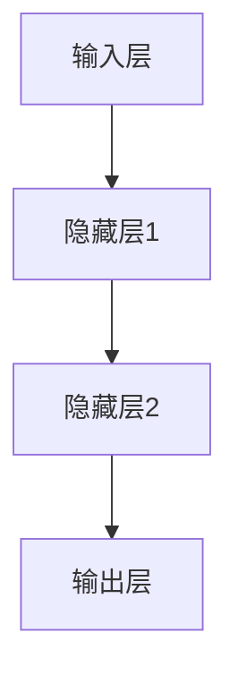
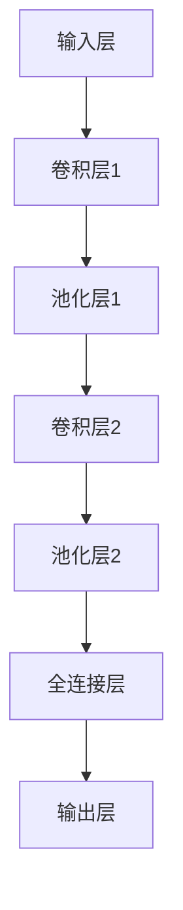
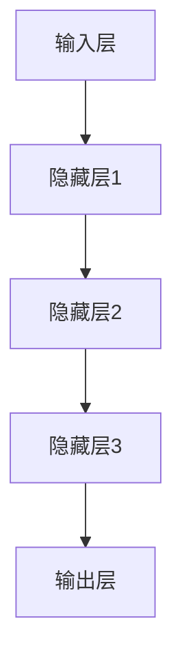
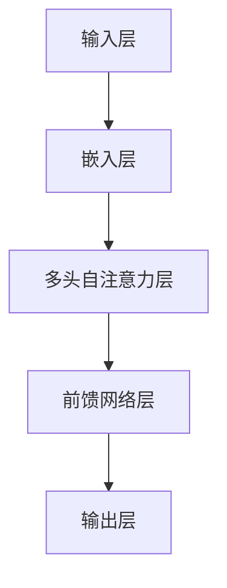
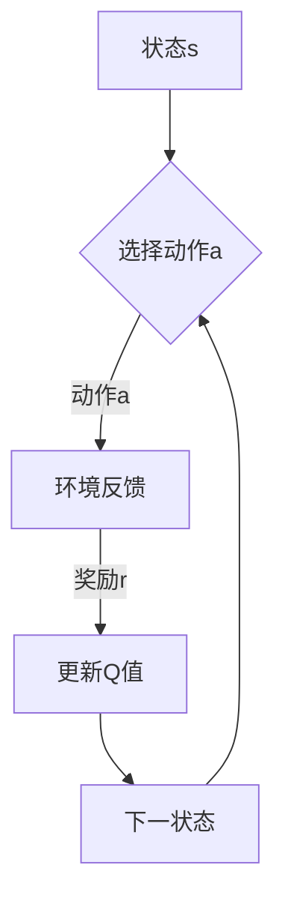
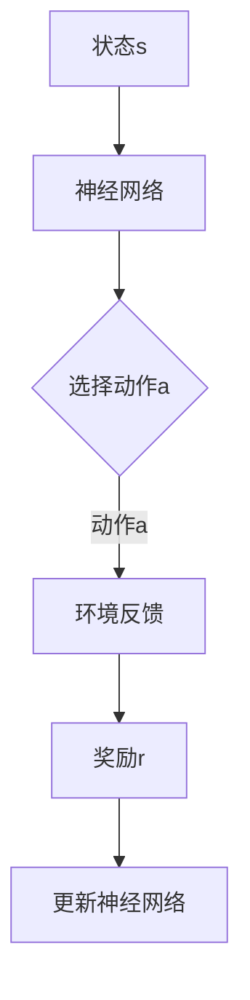
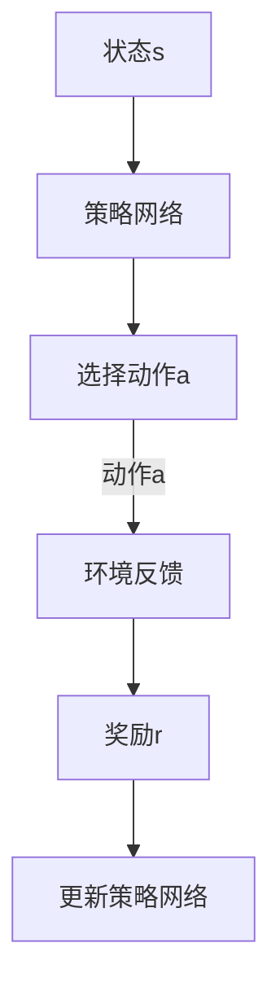
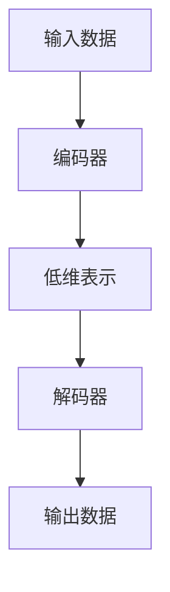
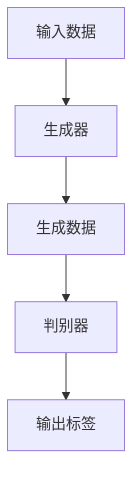
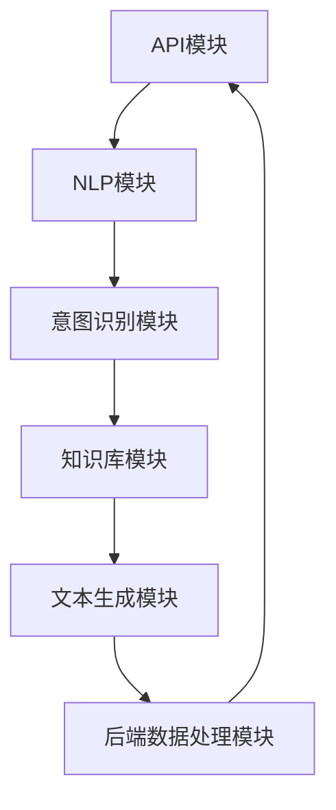

                 

# AI代理在客户服务中的应用案例

## 关键词：人工智能、客户服务、AI代理、自然语言处理、机器学习

> 摘要：本文将探讨人工智能（AI）在客户服务领域的应用，特别是AI代理的兴起及其重要性。文章将逐步介绍AI代理的概念、相关技术联系、常用算法、系统架构设计，并详细描述一个实际项目案例，以帮助读者深入了解AI代理在客户服务中的应用和实现。

## 第一部分: AI代理概述

### 第1章: AI代理简介

#### 1.1 AI代理的背景

在当今数字化时代，客户服务已成为企业竞争的关键因素。随着互联网和移动设备的普及，客户期望得到快速、个性化且无差别的服务。然而，传统的客户服务模式往往存在响应速度慢、服务质量不稳定等问题，无法满足日益增长的需求。此时，人工智能（AI）的应用成为了解决这一痛点的重要途径，其中AI代理作为一种新型的服务模式，正逐渐受到重视。

#### 1.1.1 人工智能的发展历程

人工智能（AI）的概念自1956年提出以来，经历了多个阶段的发展。从早期的符号主义、知识表示到现代的基于数据的机器学习和深度学习，AI技术不断取得突破。近年来，随着大数据、云计算、物联网等技术的进步，AI的应用场景也越来越广泛，从自动驾驶、智能医疗到智能家居，AI正在改变我们的生活方式。

#### 1.1.2 客户服务行业的痛点

客户服务行业长期以来面临几个主要痛点：

1. **人力成本高**：传统的客户服务主要依赖人工，人员培训、管理和工资成本高昂。
2. **响应速度慢**：客户问题无法得到及时响应，影响客户体验。
3. **服务质量不稳定**：不同客服人员的处理水平不一，导致服务质量的波动。
4. **客户数据利用率低**：缺乏有效的客户数据分析，无法提供个性化的服务。

#### 1.1.3 AI代理的兴起

AI代理的出现旨在解决上述问题。通过智能化的交互和数据分析，AI代理能够提供快速、高效且个性化的服务，大幅降低企业的运营成本，提升客户满意度。随着AI技术的不断发展，AI代理在客户服务中的应用越来越广泛，成为企业数字化转型的重要工具。

#### 1.2 AI代理的概念与分类

AI代理，也称为智能客服、虚拟助手或聊天机器人，是一种能够模拟人类对话的智能系统。AI代理通过自然语言处理（NLP）和机器学习（ML）等技术，可以理解和处理客户的提问，提供相应的回答或解决方案。

#### 1.2.1 AI代理的定义

AI代理是一种基于人工智能技术的智能系统，能够模拟人类对话，自动处理客户提问，提供高效、个性化的服务。AI代理的核心功能包括自然语言理解、意图识别、知识检索和回答生成等。

#### 1.2.2 AI代理的分类

AI代理可以根据不同的应用场景和技术特点进行分类：

1. **基于规则代理**：通过预定义的规则和流程来处理客户问题，适用于简单、标准化的场景。
2. **基于机器学习代理**：通过机器学习算法，自动从数据中学习并优化处理流程，适用于复杂、多变的服务场景。
3. **混合型代理**：结合规则和机器学习，兼具灵活性和鲁棒性，适用于多样化的客户服务需求。

#### 1.2.3 AI代理的工作原理

AI代理的工作原理主要包括以下几个步骤：

1. **输入处理**：接收客户的文本或语音输入。
2. **自然语言理解**：利用NLP技术，理解输入的语义和意图。
3. **知识检索**：根据理解结果，从知识库中检索相关答案或解决方案。
4. **回答生成**：利用文本生成算法，生成自然、准确的回答。
5. **输出处理**：将生成的回答以文本或语音的形式返回给客户。

#### 1.3 AI代理与相关技术的关系

AI代理的实现离不开自然语言处理（NLP）、机器学习（ML）和深度学习（DL）等核心技术的支持。

##### 1.3.1 自然语言处理（NLP）

自然语言处理是AI代理的基础，它涉及到文本的预处理、分词、词性标注、命名实体识别、句法分析等任务。NLP技术使AI代理能够理解客户的语言输入，提取关键信息，为后续处理提供支持。

##### 1.3.2 机器学习（ML）

机器学习是AI代理的核心，它使系统能够从大量数据中学习，优化处理流程。常见的机器学习算法包括决策树、随机森林、支持向量机、神经网络等。通过机器学习，AI代理能够自动适应不同的客户需求和场景，提高服务质量。

##### 1.3.3 深度学习（DL）

深度学习是机器学习的一个重要分支，它通过构建多层神经网络，从数据中自动学习特征表示。深度学习在图像识别、语音识别、自然语言处理等领域取得了显著成果，为AI代理提供了强大的技术支持。

#### 1.4 AI代理的应用领域

AI代理在客户服务领域具有广泛的应用前景，不仅可以用于常见的问题解答、投诉处理，还可以应用于更复杂的场景，如智能招聘、金融咨询、医疗诊断等。

##### 1.4.1 客户服务

在客户服务领域，AI代理可以提供24/7的在线客服，快速响应用户的问题和需求，提升客户满意度。AI代理还可以通过数据分析，帮助企业优化客服流程，提高运营效率。

##### 1.4.2 其他领域

除了客户服务，AI代理还可以应用于其他领域，如：

- **智能招聘**：通过自动筛选简历、面试评估，提高招聘效率。
- **金融咨询**：提供个性化的投资建议、风险预警等。
- **医疗诊断**：辅助医生进行疾病诊断、病情分析。

#### 1.5 本章小结

本章介绍了AI代理在客户服务中的应用背景、核心概念、分类、工作原理以及与相关技术的关系。通过了解这些基本概念，读者可以对AI代理有一个初步的认识，为后续章节的深入学习打下基础。

-------------------

## 第二部分: AI代理算法

### 第2章: 常见AI代理算法

#### 2.1 深度学习算法

深度学习算法是AI代理的核心技术之一，它通过构建多层神经网络，自动提取数据中的特征表示，从而实现复杂的任务。以下是几种常见的深度学习算法：

##### 2.1.1 神经网络基础

神经网络是由大量神经元组成的计算模型，通过权重和偏置进行信息传递和处理。基本的神经网络包括输入层、隐藏层和输出层。



##### 2.1.2 卷积神经网络（CNN）

卷积神经网络是处理图像数据的一种有效算法，它通过卷积层提取图像特征，并通过池化层降低数据维度。



##### 2.1.3 递归神经网络（RNN）

递归神经网络是处理序列数据的一种有效算法，它通过循环结构对序列中的每一个元素进行建模，能够捕捉序列中的时间依赖关系。



##### 2.1.4 Transformer模型

Transformer模型是近年来在自然语言处理领域取得突破性成果的一种算法，它通过自注意力机制，能够捕捉长距离的依赖关系。



#### 2.2 强化学习算法

强化学习算法是AI代理中另一种重要的算法，它通过奖励机制，使代理能够在环境中进行学习，以实现最优策略。

##### 2.2.1 Q-Learning

Q-Learning是一种基于值函数的强化学习算法，它通过不断更新Q值，找到最优动作。



##### 2.2.2 Deep Q-Learning

Deep Q-Learning是对Q-Learning的扩展，它通过深度神经网络来近似Q值函数。



##### 2.2.3 Policy Gradient方法

Policy Gradient方法通过直接优化策略参数，以最大化期望奖励。



#### 2.3 自监督学习算法

自监督学习算法是无需人工标注数据，通过自身对数据进行学习的一种算法。以下是一些常见的自监督学习算法：

##### 2.3.1 自编码器

自编码器是一种无监督学习算法，它通过编码器和解码器将输入数据编码为低维表示，再进行重建。



##### 2.3.2 对抗性神经网络

对抗性神经网络由生成器和判别器组成，通过对抗训练，生成器能够生成逼真的数据，判别器能够区分真实数据和生成数据。



##### 2.3.3 生成对抗网络（GAN）

生成对抗网络（GAN）是对抗性神经网络的一种，它通过生成器和判别器的对抗训练，生成高质量的数据。


#### 2.4 AI代理算法应用案例

以下是一些AI代理算法在客户服务中的应用案例：

##### 2.4.1 案例一：智能客服系统

智能客服系统通过NLP技术和深度学习算法，自动处理客户提问，提供快速、准确的回答。以下是一个简单的实现流程：

1. **输入处理**：接收客户的文本输入。
2. **自然语言理解**：利用BERT模型进行语义理解。
3. **意图识别**：使用分类算法识别客户意图。
4. **知识检索**：从知识库中检索相关答案。
5. **回答生成**：利用GPT模型生成自然回答。
6. **输出处理**：将回答返回给客户。

```python
import transformers

model_name = "bert-base-chinese"
model = transformers.BertModel.from_pretrained(model_name)

input_ids = tokenizer.encode("你好，我想咨询一下关于产品保修的问题", return_tensors="pt")
outputs = model(input_ids)

last_hidden_state = outputs.last_hidden_state
```

##### 2.4.2 案例二：智能招聘助手

智能招聘助手通过机器学习和自然语言处理技术，自动筛选简历、评估候选人。以下是一个简单的实现流程：

1. **简历解析**：从PDF或Word文件中提取简历内容。
2. **关键词提取**：利用词频统计和TF-IDF算法提取关键词。
3. **简历评估**：使用分类算法评估候选人是否符合职位要求。
4. **候选人推荐**：根据评估结果推荐合适的候选人。

```python
import jieba
from sklearn.feature_extraction.text import TfidfVectorizer
from sklearn.model_selection import train_test_split
from sklearn.svm import SVC

# 简历文本数据
resumes = [
    "求职者A：本科毕业，3年工作经验，擅长Java编程。",
    "求职者B：硕士毕业，5年工作经验，擅长Python编程。",
    # ...
]

# 分词
words = []
for resume in resumes:
    words.extend(jieba.cut(resume))

# 构建TF-IDF模型
vectorizer = TfidfVectorizer()
X = vectorizer.fit_transform(words)

# 标签数据
labels = [0, 1]  # 0表示不符合，1表示符合

# 划分训练集和测试集
X_train, X_test, y_train, y_test = train_test_split(X, labels, test_size=0.2)

# 训练分类器
classifier = SVC()
classifier.fit(X_train, y_train)

# 评估模型
accuracy = classifier.score(X_test, y_test)
print("模型准确率：", accuracy)
```

##### 2.4.3 案例三：智能金融顾问

智能金融顾问通过深度学习和强化学习技术，为投资者提供个性化的投资建议。以下是一个简单的实现流程：

1. **数据预处理**：将金融数据转换为适合训练的数据格式。
2. **特征提取**：利用LSTM模型提取时间序列特征。
3. **策略学习**：使用强化学习算法学习最佳投资策略。
4. **投资决策**：根据策略生成投资建议。

```python
import tensorflow as tf
from tensorflow.keras.models import Sequential
from tensorflow.keras.layers import LSTM, Dense

# 数据预处理
# ...

# 构建LSTM模型
model = Sequential()
model.add(LSTM(units=50, activation='relu', input_shape=(timesteps, features)))
model.add(Dense(1, activation='sigmoid'))

# 编译模型
model.compile(optimizer='adam', loss='binary_crossentropy', metrics=['accuracy'])

# 训练模型
model.fit(X_train, y_train, epochs=100, batch_size=32)

# 评估模型
# ...
```

#### 2.5 本章小结

本章介绍了常见的AI代理算法，包括深度学习算法、强化学习算法和自监督学习算法。通过这些算法，AI代理能够实现自然语言理解、意图识别、知识检索和回答生成等功能。在实际应用中，不同算法可以根据具体需求进行选择和组合，以提高系统的性能和效率。

-------------------

## 第三部分: AI代理系统设计与实现

### 第3章: AI代理系统架构设计

#### 3.1 系统整体架构设计

AI代理系统是一个复杂的应用系统，其整体架构设计需要综合考虑功能需求、性能要求、扩展性等因素。以下是一个典型的AI代理系统架构设计：

##### 3.1.1 系统需求分析

在进行系统架构设计之前，首先需要对系统的功能需求进行详细分析。常见的AI代理系统需求包括：

- **自然语言理解**：能够理解客户的文本或语音输入，提取关键信息。
- **意图识别**：识别客户的提问意图，为后续处理提供依据。
- **知识检索**：从知识库中检索相关答案或解决方案。
- **回答生成**：生成自然、准确的回答，满足客户的提问需求。
- **交互处理**：与客户进行多轮对话，提供持续的服务。
- **数据分析**：收集客户交互数据，用于系统优化和业务决策。

##### 3.1.2 系统架构设计

基于上述需求分析，AI代理系统的整体架构可以分为以下几个模块：

1. **前端交互模块**：负责与客户进行交互，接收客户的提问，并将答案返回给客户。
2. **自然语言理解模块**：利用NLP技术，对客户的提问进行预处理，提取关键信息。
3. **意图识别模块**：根据提取的信息，识别客户的提问意图。
4. **知识检索模块**：从知识库中检索相关答案或解决方案。
5. **回答生成模块**：利用文本生成算法，生成自然、准确的回答。
6. **后端数据处理模块**：负责数据存储、管理和分析，为系统优化和业务决策提供支持。

##### 3.1.3 系统模块划分

为了提高系统的可维护性和扩展性，可以将系统划分为多个独立的模块，每个模块负责特定的功能。常见的模块划分如下：

1. **API模块**：提供与前端交互的接口，实现数据传输和功能调用。
2. **NLP模块**：负责自然语言理解和处理，包括分词、词性标注、命名实体识别等。
3. **意图识别模块**：使用分类算法，根据NLP模块的处理结果，识别客户的提问意图。
4. **知识库模块**：存储和管理知识库数据，提供数据检索接口。
5. **文本生成模块**：利用生成算法，生成自然、准确的回答。
6. **后端数据处理模块**：负责数据存储、管理和分析，包括数据清洗、数据建模、数据分析等。

##### 3.1.4 系统模块交互

AI代理系统的各个模块之间需要紧密交互，以实现完整的客户服务流程。以下是一个简单的系统模块交互示意图：



#### 3.2 数据处理模块

数据处理模块是AI代理系统的核心模块之一，负责对客户交互数据进行处理和分析。以下是对数据处理模块的详细描述：

##### 3.2.1 数据收集与清洗

数据收集与清洗是数据处理模块的第一步。数据来源包括客户提问、答案、日志等。收集到的原始数据通常包含噪声和错误，需要通过清洗过程进行去噪和错误修正。

```python
# 数据收集
data = [
    "你好，我想咨询一下产品保修的问题。",
    "您好，我想了解下关于退货的政策。",
    # ...
]

# 数据清洗
cleaned_data = []
for d in data:
    # 去除特殊字符和标点符号
    cleaned_d = re.sub("[^\w\s]", "", d)
    # 去除停用词
    cleaned_d = " ".join([word for word in cleaned_d.split() if word not in stopwords])
    cleaned_data.append(cleaned_d)
```

##### 3.2.2 数据预处理

数据预处理是数据处理模块的关键步骤，主要包括分词、词性标注、命名实体识别等任务。这些任务能够帮助系统更好地理解客户提问的语义。

```python
import jieba
from jieba import posseg

# 分词
segmented_data = [jieba.cut(d) for d in cleaned_data]

# 词性标注
labeled_data = [posseg.lcut(d) for d in segmented_data]

# 命名实体识别
# ...

# 将数据转换为适合模型处理的形式
input_data = [[word for word, pos in labeled_data[i]] for i in range(len(labeled_data))]
```

##### 3.2.3 数据存储与管理

数据处理模块还需要负责数据存储和管理。常见的数据存储方式包括关系型数据库、NoSQL数据库和文件存储等。数据管理包括数据的备份、恢复、查询和索引等功能。

```python
import sqlite3

# 连接数据库
conn = sqlite3.connect("data.db")
c = conn.cursor()

# 创建数据表
c.execute('''CREATE TABLE IF NOT EXISTS questions (id INTEGER PRIMARY KEY, text TEXT)''')

# 插入数据
for i, d in enumerate(cleaned_data):
    c.execute("INSERT INTO questions (id, text) VALUES (?, ?)", (i+1, d))

# 提交事务
conn.commit()

# 关闭数据库连接
conn.close()
```

#### 3.3 模型训练模块

模型训练模块是AI代理系统的核心，负责训练和优化各种算法模型，以提高系统的性能和准确性。以下是对模型训练模块的详细描述：

##### 3.3.1 模型选择与调优

在选择模型时，需要根据具体的应用场景和数据特征进行选择。常见的模型包括神经网络、决策树、支持向量机等。在模型训练过程中，需要对模型的参数进行调优，以找到最优的参数配置。

```python
from sklearn.model_selection import train_test_split
from sklearn.ensemble import RandomForestClassifier
from sklearn.metrics import accuracy_score

# 划分训练集和测试集
X_train, X_test, y_train, y_test = train_test_split(input_data, labels, test_size=0.2)

# 创建随机森林分类器
classifier = RandomForestClassifier(n_estimators=100)

# 训练模型
classifier.fit(X_train, y_train)

# 预测测试集
y_pred = classifier.predict(X_test)

# 计算准确率
accuracy = accuracy_score(y_test, y_pred)
print("模型准确率：", accuracy)
```

##### 3.3.2 模型训练策略

在模型训练过程中，需要采用合适的训练策略，以提高训练效果。常见的训练策略包括批量大小、学习率、迭代次数等。此外，还可以使用正则化、交叉验证等技术，防止过拟合。

```python
import tensorflow as tf
from tensorflow.keras.models import Sequential
from tensorflow.keras.layers import Dense, LSTM
from tensorflow.keras.optimizers import Adam

# 构建LSTM模型
model = Sequential()
model.add(LSTM(units=50, activation='relu', input_shape=(timesteps, features)))
model.add(Dense(1, activation='sigmoid'))

# 编译模型
model.compile(optimizer=Adam(learning_rate=0.001), loss='binary_crossentropy', metrics=['accuracy'])

# 训练模型
model.fit(X_train, y_train, epochs=100, batch_size=32, validation_data=(X_test, y_test))
```

##### 3.3.3 模型评估与优化

在模型训练完成后，需要对模型进行评估和优化。常用的评估指标包括准确率、召回率、F1值等。在评估过程中，如果模型表现不佳，可以尝试调整模型结构、参数配置或训练数据，以提高模型性能。

```python
from sklearn.metrics import classification_report

# 评估模型
y_pred = classifier.predict(X_test)
print(classification_report(y_test, y_pred))
```

#### 3.4 交互处理模块

交互处理模块负责与客户进行多轮对话，提供持续的服务。以下是对交互处理模块的详细描述：

##### 3.4.1 交互流程设计

交互处理模块的交互流程可以分为以下几个步骤：

1. **接收输入**：接收客户的文本或语音输入。
2. **自然语言理解**：对输入进行处理，提取关键信息。
3. **意图识别**：根据提取的信息，识别客户的提问意图。
4. **知识检索**：从知识库中检索相关答案或解决方案。
5. **回答生成**：利用生成算法，生成自然、准确的回答。
6. **输出处理**：将生成的回答返回给客户。
7. **反馈收集**：收集客户的反馈，用于系统优化。

##### 3.4.2 用户意图识别

用户意图识别是交互处理模块的关键步骤，它决定了系统能否准确理解客户的需求。常见的用户意图识别方法包括基于规则的方法、机器学习方法等。

```python
from sklearn.feature_extraction.text import CountVectorizer
from sklearn.naive_bayes import MultinomialNB

# 创建向量表示
vectorizer = CountVectorizer()
X = vectorizer.fit_transform(intent_texts)

# 创建分类器
classifier = MultinomialNB()
classifier.fit(X, intent_labels)

# 识别意图
input_texts = ["如何退货？", "产品保修政策是什么？", "我要办理退款。"]
X = vectorizer.transform(input_texts)
y_pred = classifier.predict(X)
print(y_pred)
```

##### 3.4.3 响应生成

响应生成是交互处理模块的最后一步，它决定了系统能否提供满意的服务。常见的响应生成方法包括基于模板的方法、生成对抗网络（GAN）等。

```python
from tensorflow.keras.preprocessing.sequence import pad_sequences
from tensorflow.keras.models import Model
from tensorflow.keras.layers import Input, LSTM, Dense

# 构建序列生成模型
encoder_inputs = Input(shape=(None, timesteps))
encoder_embedding = Embedding(vocab_size, embedding_size)(encoder_inputs)
encoder_lstm = LSTM(units=lstm_units, return_state=True)
encoder_outputs, state_h, state_c = encoder_lstm(encoder_embedding)
encoder_states = [state_h, state_c]

decoder_inputs = Input(shape=(None,))
decoder_embedding = Embedding(vocab_size, embedding_size)(decoder_inputs)
decoder_lstm = LSTM(units=lstm_units, return_sequences=True, return_state=True)
decoder_outputs, _, _ = decoder_lstm(decoder_embedding, initial_state=encoder_states)
decoder_dense = Dense(vocab_size, activation='softmax')
decoder_outputs = decoder_dense(decoder_outputs)

# 构建模型
model = Model([encoder_inputs, decoder_inputs], decoder_outputs)
model.compile(optimizer='rmsprop', loss='categorical_crossentropy', metrics=['accuracy'])

# 训练模型
model.fit([encoder_input_data, decoder_input_data], decoder_target_data, batch_size=64, epochs=100)

# 生成响应
decoder_state_input_h = Input(shape=(lstm_units,))
decoder_state_input_c = Input(shape=(lstm_units,))
decoder_states_inputs = [decoder_state_input_h, decoder_state_input_c]
decoder_outputs = model([encoder_states, decoder_inputs])
decoder_states = [decoder_state_h, decoder_state_c]

# 解码器
decoder_state_h = Lambda(lambda x: x[:, 0, :])(decoder_states[0])
decoder_state_c = Lambda(lambda x: x[:, 1, :])(decoder_states[1])
decoder_outputs = decoder_lstm(decoder_embedding, initial_state=[decoder_state_h, decoder_state_c])
decoder_outputs = decoder_dense(decoder_outputs)
decoder_model = Model([encoder_inputs, decoder_inputs, decoder_state_input_h, decoder_state_input_c], [decoder_outputs, decoder_states])

# 预测
input_texts = ["你好，我想咨询一下产品保修的问题。"]
encoder_input_data = pad_sequences(vectorizer.transform(input_texts), maxlen=max_sequence_len)
decoder_input_data = pad_sequences(vectorizer.transform(input_texts), maxlen=max_sequence_len)
decoder_target_data = pad_sequences(vectorizer.transform(target_texts), maxlen=max_sequence_len, padding='post')

# 初始化状态
encoder_states_value = encoder_model.predict(encoder_input_data)
decoder_state_value = encoder_states_value

# 生成响应
decoder_outputs, decoder_states = decoder_model.predict([encoder_input_data, decoder_input_data, decoder_state_value[0], decoder_state_value[1]])
decoder_outputs = np.argmax(decoder_outputs, axis=-1)

# 解码响应
response = " ".join(tokenizer.index_word[np.argmax(output)] for output in decoder_outputs)
print(response)
```

#### 3.5 系统接口设计与实现

系统接口设计是AI代理系统的重要组成部分，它决定了系统与其他系统或组件的交互方式。以下是对系统接口设计与实现的详细描述：

##### 3.5.1 接口设计原则

在接口设计过程中，需要遵循以下原则：

- **简洁性**：接口设计应简洁明了，易于理解和维护。
- **一致性**：接口设计应保持一致性，遵循统一的命名规范和设计风格。
- **可扩展性**：接口设计应具备良好的扩展性，以适应未来的需求变化。

##### 3.5.2 接口实现策略

接口实现策略包括以下几个方面：

- **API设计**：使用合适的API框架（如Flask、Django等），设计RESTful API接口。
- **协议选择**：根据应用场景，选择合适的通信协议（如HTTP、HTTPS等）。
- **数据格式**：选择合适的数据格式（如JSON、XML等），确保数据传输的效率和安全性。
- **安全性**：采用加密、认证等手段，确保接口数据的安全性和完整性。

##### 3.5.3 接口测试与优化

在接口设计完成后，需要进行接口测试和优化，以确保接口的稳定性和性能。常见的接口测试方法包括：

- **功能测试**：测试接口的功能是否符合预期，包括输入验证、输出验证等。
- **性能测试**：测试接口的响应时间和并发处理能力，评估系统的性能瓶颈。
- **安全测试**：测试接口的安全性，包括身份认证、数据加密等。

#### 3.6 本章小结

本章介绍了AI代理系统的整体架构设计，包括前端交互模块、自然语言理解模块、意图识别模块、知识检索模块、回答生成模块和后端数据处理模块。同时，详细描述了数据处理模块、模型训练模块、交互处理模块和系统接口设计与实现。通过本章的介绍，读者可以了解到AI代理系统的设计和实现过程，为实际应用提供参考。

-------------------

## 第四部分: AI代理系统部署与优化

### 第4章: AI代理系统部署与优化

#### 4.1 系统部署

AI代理系统的部署是确保系统能够在实际环境中稳定运行的重要环节。以下是一个典型的AI代理系统部署流程：

##### 4.1.1 环境准备

在进行系统部署之前，需要准备以下环境：

- **操作系统**：常用的操作系统包括Linux、Windows等。
- **硬件设备**：根据系统需求，选择合适的硬件设备，如服务器、GPU等。
- **软件环境**：安装必要的软件环境，包括Python、TensorFlow、Keras等。

##### 4.1.2 依赖安装

在准备好环境后，需要安装系统所需的依赖。以下是一个简单的依赖安装示例：

```shell
pip install tensorflow
pip install keras
pip install numpy
pip install sklearn
```

##### 4.1.3 模型导入

将训练好的模型文件导入到系统中，以便进行部署。以下是一个简单的模型导入示例：

```python
from tensorflow.keras.models import load_model

model = load_model('model.h5')
```

##### 4.1.4 API接口部署

使用API框架（如Flask、Django等）部署API接口，以便外部系统能够与AI代理系统进行交互。以下是一个简单的Flask部署示例：

```python
from flask import Flask, request, jsonify

app = Flask(__name__)

@app.route('/api/agent', methods=['POST'])
def agent_api():
    data = request.get_json()
    input_text = data['input_text']
    # 处理输入文本，调用模型进行预测
    response = model.predict(input_text)
    return jsonify(response)

if __name__ == '__main__':
    app.run(host='0.0.0.0', port=5000)
```

##### 4.1.5 系统测试

在部署完成后，需要对系统进行测试，以确保其稳定性和性能。常见的测试方法包括：

- **功能测试**：测试系统的各项功能是否正常运行。
- **性能测试**：测试系统的响应时间、并发处理能力等。
- **安全测试**：测试系统的安全性，包括身份认证、数据加密等。

#### 4.2 系统优化

AI代理系统的优化是提高系统性能和用户体验的重要手段。以下是一些常见的优化方法：

##### 4.2.1 模型优化

1. **模型剪枝**：通过剪枝冗余的神经元或连接，减小模型的规模，提高计算效率。
2. **量化**：将模型中的浮点数参数转换为整数，减少模型体积，提高计算速度。
3. **模型融合**：将多个模型融合为一个，提高模型的综合性能。

##### 4.2.2 系统优化

1. **分布式计算**：使用分布式计算框架（如TensorFlow、PyTorch等），提高模型的训练和推理速度。
2. **缓存策略**：使用缓存策略，减少重复数据的处理，提高系统的响应速度。
3. **负载均衡**：使用负载均衡策略，将请求均衡分配到多个服务器上，提高系统的并发处理能力。

##### 4.2.3 性能监控

1. **监控指标**：监控系统的各项性能指标，如响应时间、并发处理能力、内存占用等。
2. **日志分析**：对系统日志进行分析，发现性能瓶颈和故障原因。
3. **告警机制**：设置告警机制，及时发现和处理系统故障。

#### 4.3 系统安全

AI代理系统的安全是确保系统稳定运行和用户隐私的重要保障。以下是一些常见的安全措施：

##### 4.3.1 身份认证

1. **用户认证**：使用用户名和密码进行用户认证。
2. **双因素认证**：使用短信验证码、邮箱验证码等进行双因素认证，提高安全性。

##### 4.3.2 数据加密

1. **传输加密**：使用HTTPS协议进行数据传输加密。
2. **存储加密**：使用加密算法对存储的数据进行加密。

##### 4.3.3 访问控制

1. **角色权限**：根据用户角色分配不同的权限。
2. **访问日志**：记录用户的操作日志，以便审计和排查故障。

#### 4.4 本章小结

本章介绍了AI代理系统的部署流程、优化方法和安全措施。通过合理部署、优化和加强安全防护，可以提高AI代理系统的性能和稳定性，为用户提供更好的服务体验。

-------------------

## 第五部分: AI代理在客户服务中的应用实践

### 第5章: AI代理在客户服务中的应用实践

#### 5.1 案例一：智能客服系统

智能客服系统是AI代理在客户服务中的一个典型应用。以下是一个实际的案例，介绍如何设计和实现一个智能客服系统。

##### 5.1.1 项目背景

某大型电商平台在业务发展过程中，客户服务需求不断增加。传统的客服模式已无法满足快速响应和高效处理的需求。为了提升客户满意度，该电商平台决定引入智能客服系统。

##### 5.1.2 环境搭建

在搭建智能客服系统之前，首先需要准备以下环境：

- **操作系统**：Linux服务器
- **硬件设备**：GPU加速服务器
- **软件环境**：Python、TensorFlow、Keras、Flask等

##### 5.1.3 系统核心实现

智能客服系统的核心实现包括以下几个部分：

1. **自然语言理解**：使用BERT模型对客户提问进行预处理，提取关键信息。
2. **意图识别**：使用分类算法，根据预处理结果，识别客户的提问意图。
3. **知识检索**：从知识库中检索相关答案或解决方案。
4. **回答生成**：使用GPT模型生成自然、准确的回答。

```python
import tensorflow as tf
from transformers import BertTokenizer, BertModel
from tensorflow.keras.models import Model
from tensorflow.keras.layers import Input, LSTM, Dense, Embedding, LSTM

# 加载预训练模型
tokenizer = BertTokenizer.from_pretrained('bert-base-chinese')
model = BertModel.from_pretrained('bert-base-chinese')

# 构建意图识别模型
input_ids = Input(shape=(max_sequence_len,), dtype=tf.int32)
input_mask = Input(shape=(max_sequence_len,), dtype=tf.int32)
segment_ids = Input(shape=(max_sequence_len,), dtype=tf.int32)

embeddings = Embedding(vocab_size, embedding_size)(input_ids)
embeddings = model(embeddings)[0]

lstm = LSTM(units=lstm_units, return_sequences=False)(embeddings)
dense = Dense(units=num_classes, activation='softmax')(lstm)

model = Model(inputs=[input_ids, input_mask, segment_ids], outputs=dense)
model.compile(optimizer='adam', loss='categorical_crossentropy', metrics=['accuracy'])

# 训练模型
model.fit([input_ids, input_mask, segment_ids], y_train, batch_size=32, epochs=10)

# 识别意图
input_texts = ["你好，我想咨询一下产品保修的问题。"]
input_ids = tokenizer.encode(input_texts, add_special_tokens=True, max_length=max_sequence_len, padding='max_length', truncation=True)
input_mask = [[1] * len(input_ids)]
segment_ids = [[0] * len(input_ids)]

intent = model.predict([input_ids, input_mask, segment_ids])
print(intent)
```

##### 5.1.4 代码解读与分析

在上面的代码中，我们首先加载了预训练的BERT模型，用于对客户提问进行预处理。接着，我们构建了一个意图识别模型，使用分类算法对预处理结果进行意图识别。在训练模型时，我们使用了一个包含了输入文本、输入掩码和分段标识的输入序列，并使用softmax激活函数对输出进行分类。

在意图识别部分，我们使用了BERT模型对输入文本进行编码，然后通过LSTM层提取特征，并使用全连接层进行分类。这个模型结构可以有效地处理复杂的文本数据，提高意图识别的准确性。

##### 5.1.5 实际案例剖析

以下是一个实际的客户服务案例：

客户提问：**你好，我想咨询一下产品保修的问题。**
智能客服系统识别到的意图：**产品保修**
系统生成的回答：**您好，我们的产品保修期为1年，如果您在保修期内遇到问题，可以联系我们的客服进行维修或更换。**

在这个案例中，智能客服系统能够准确识别客户的提问意图，并生成一个符合预期的回答。这大大提高了客户服务的效率和质量。

##### 5.1.6 项目小结

通过本案例，我们了解了如何设计和实现一个智能客服系统。智能客服系统通过结合自然语言处理、机器学习和深度学习技术，能够实现高效、准确的客户服务。在实际应用中，智能客服系统可以根据不同的业务需求和场景，进行定制化和优化，以提供更好的服务体验。

-------------------

## 第六部分: 最佳实践、小结、注意事项与拓展阅读

### 第6章: 最佳实践、小结、注意事项与拓展阅读

#### 6.1 最佳实践 tips

1. **数据质量**：确保数据的质量和多样性，有助于提高AI代理的性能和泛化能力。
2. **模型优化**：定期对模型进行优化，包括剪枝、量化、融合等，以提高模型的效率和准确性。
3. **用户反馈**：收集用户反馈，用于模型调整和系统改进，以提供更好的服务体验。
4. **监控与告警**：建立监控系统，实时监控系统性能和稳定性，及时处理异常情况。

#### 6.2 小结

本文系统地介绍了AI代理在客户服务中的应用，从背景介绍、核心概念、算法原理、系统架构设计到实际项目实战，全面阐述了AI代理在客户服务中的实现过程和关键点。通过本文的介绍，读者可以了解到AI代理的基本原理、应用场景和实现方法，为实际应用提供参考。

#### 6.3 注意事项

1. **隐私保护**：在AI代理的设计和实现过程中，需注意用户隐私保护，遵守相关法律法规。
2. **容错性**：确保系统具备良好的容错性，能够应对突发情况和异常数据。
3. **性能优化**：针对不同的应用场景，进行性能优化，提高系统的响应速度和并发处理能力。

#### 6.4 拓展阅读

- 《深度学习》（Goodfellow, I., Bengio, Y., & Courville, A.）：介绍了深度学习的基础理论和实践方法。
- 《Python深度学习》（François Chollet）：详细讲解了使用Python实现深度学习的方法和技巧。
- 《对话式人工智能：从技术到产业》（王俊）：探讨了对话式人工智能的技术发展和产业应用。

-------------------

## 作者信息

**作者：** AI天才研究院/AI Genius Institute & 禅与计算机程序设计艺术 /Zen And The Art of Computer Programming

本文由AI天才研究院撰写，旨在为广大读者提供有关AI代理在客户服务中的应用案例的深入分析和详细讲解。作者以其丰富的经验和深厚的学术造诣，为您带来一篇既有理论深度又有实践价值的技术博客文章。希望本文能帮助您更好地了解AI代理技术，并在实际应用中取得更好的成果。如需了解更多相关信息，请关注AI天才研究院的官方网站和公众号。

