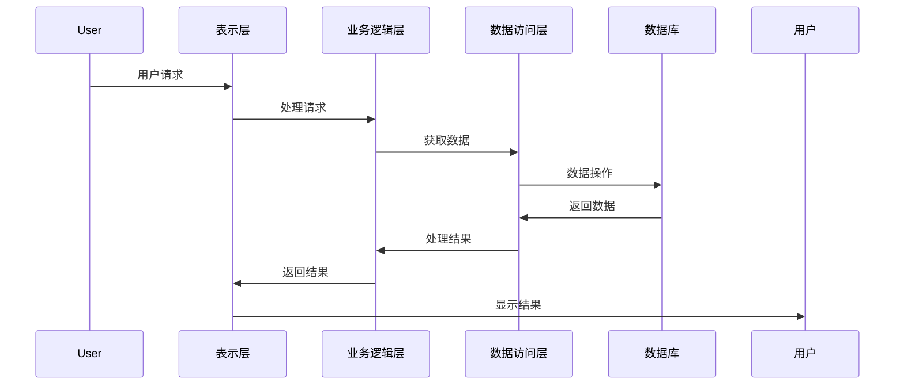
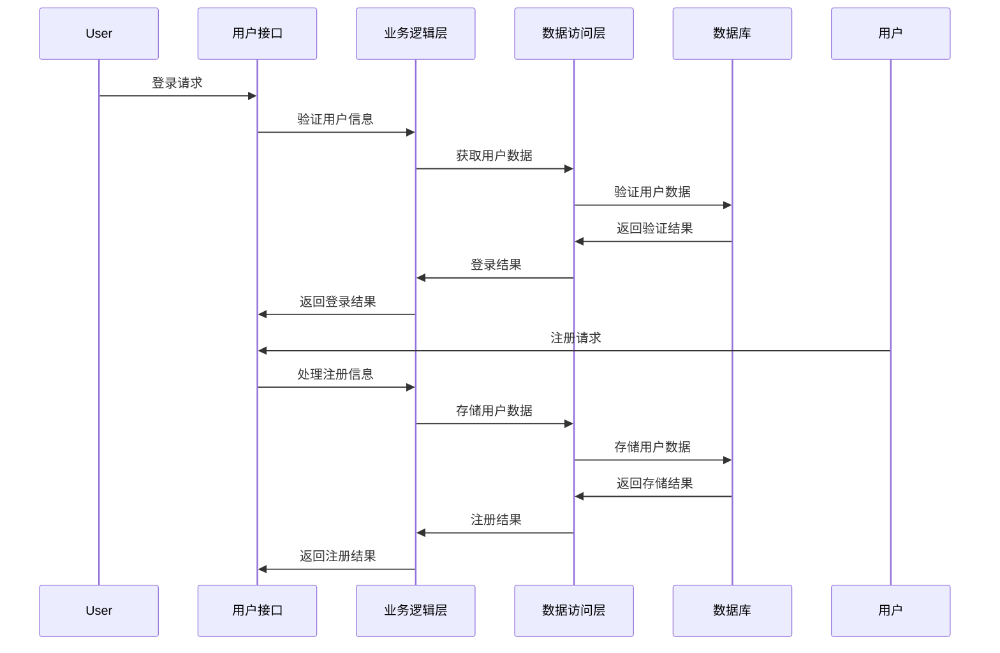

                 


### 第一步：理解TRiSM框架的重要性

在当前人工智能快速发展的背景下，AI的信任、风险和安全管理成为了至关重要的议题。随着AI技术在各行各业中的应用不断深化，人们对AI系统的信任度、安全性和风险管理水平提出了更高的要求。《AI信任、风险和安全管理（TRiSM）框架解析》这本书的编写，正是为了帮助读者深入了解和掌握这一框架，从而在人工智能领域实现更加安全和可靠的系统建设。

**背景介绍**：

1. **AI技术发展**：
   - AI技术已经成为现代科技发展的关键驱动力，广泛应用于医疗、金融、交通、安防等领域。
   - AI技术的发展带来了巨大的机遇，同时也伴随着诸多挑战，如算法偏见、数据隐私和安全等问题。

2. **信任、风险与安全的关系**：
   - 信任是AI系统正常运行的基础，影响着用户对AI系统的接受程度和依赖程度。
   - 风险管理是确保AI系统安全运行的关键环节，涉及到潜在威胁的识别、评估和控制。
   - 安全是AI系统的核心要求，保障系统的完整性、保密性和可用性。

3. **TRiSM框架的产生与意义**：
   - TRiSM框架是一个旨在解决AI信任、风险和安全问题的综合框架，涵盖了信任管理、风险评估和安全管理等多个方面。
   - 通过TRiSM框架，可以实现对AI系统的全面管理和优化，提高系统的可信度和安全性。

**核心概念与联系**：

1. **信任**：
   - 信任是用户对AI系统的信心和依赖，包括系统性能、可靠性、透明度等方面。
   - 信任的属性包括真实性、一致性、可靠性和保密性等。

2. **风险**：
   - 风险是指AI系统在运行过程中可能面临的威胁和不确定性，包括数据泄露、算法偏差、系统崩溃等。
   - 风险的评估涉及到识别、分析和量化潜在威胁。

3. **安全**：
   - 安全是保障AI系统免受攻击、破坏和未授权访问的措施和策略。
   - 安全策略包括身份验证、访问控制、数据加密等。

**总结**：

本文旨在通过逐步解析TRiSM框架，帮助读者深入了解AI信任、风险和安全管理的重要性和实施方法。接下来，我们将进一步探讨TRiSM框架的核心概念、算法原理、系统架构设计以及实际应用案例，为读者提供全面的技术指导和实战经验。

### 第二步：深入理解TRiSM框架的核心概念

在了解了TRiSM框架的重要性之后，我们接下来需要深入理解其核心概念，包括信任、风险和安全，以及它们之间的相互关系。

#### 信任的概念与特征

**信任**是用户对AI系统的信心和依赖，是系统正常运行的基础。以下是信任的几个关键特征：

1. **真实性**：信任的基础是系统的真实性，即系统能够真实、准确地反映数据和结果。

2. **一致性**：系统在不同时间和不同情况下应保持一致的行为和输出。

3. **可靠性**：系统应能够持续稳定地运行，确保用户对系统的依赖。

4. **保密性**：系统需要保护用户的隐私和数据不被泄露。

**信任的类型**：

1. **技术信任**：基于AI系统的技术性能和准确性。

2. **组织信任**：基于AI系统提供商的信誉和声誉。

3. **用户信任**：基于用户对系统的体验和满意度。

#### 风险的概念与评估

**风险**是AI系统在运行过程中可能面临的威胁和不确定性。以下是风险的一些关键特征：

1. **识别**：识别AI系统可能面临的威胁和风险。

2. **评估**：评估风险的概率和影响，以确定其严重性。

3. **控制**：采取适当措施来减轻或消除风险。

**风险评估的方法**：

1. **定性评估**：通过专家判断和经验来评估风险。

2. **定量评估**：使用数学模型和统计数据来量化风险。

3. **组合评估**：结合定性和定量评估方法，以获得更全面的评估结果。

**风险管理**：

1. **风险识别**：识别系统可能面临的所有风险。

2. **风险评估**：对识别出的风险进行评估，确定其严重性和概率。

3. **风险控制**：制定和实施措施来减轻或消除风险。

4. **风险监控**：持续监控系统运行中的风险，确保风险管理措施的有效性。

#### 安全的概念与策略

**安全**是保障AI系统免受攻击、破坏和未授权访问的措施和策略。以下是安全的一些关键特征：

1. **身份验证**：确保只有授权用户才能访问系统。

2. **访问控制**：控制用户对系统和数据的访问权限。

3. **数据加密**：保护数据的机密性和完整性。

4. **安全监控**：实时监控系统运行状态，及时识别和应对安全事件。

**安全策略**：

1. **制定安全策略**：根据组织的业务需求和风险状况，制定适当的安全策略。

2. **实施安全措施**：部署安全技术和工具，确保安全策略的有效实施。

3. **安全培训**：提高用户和员工的安全意识和技能。

4. **安全审计**：定期对系统进行安全审计，确保安全策略和措施得到有效执行。

#### 信任、风险与安全的关系

**信任**、**风险**和**安全**是相互关联、相互影响的三个核心概念。

- **信任**是用户对系统的信心和依赖，直接影响系统的使用和推广。
- **风险**是系统在运行过程中可能面临的威胁和不确定性，需要通过**安全**措施来控制和减轻。
- **安全**措施的有效实施可以增强系统的**信任**，降低系统的**风险**。

**案例**：在一个AI医疗诊断系统中，信任是用户对系统诊断结果的信心，风险是系统可能产生的误诊或数据泄露，安全是确保用户隐私和数据安全的措施。通过有效的安全措施，可以降低风险，提高系统的信任度，从而促进系统的普及和应用。

**总结**：

通过深入理解TRiSM框架的核心概念，我们可以更好地把握AI信任、风险和安全管理的关键要素，为后续的算法原理讲解、系统架构设计和项目实战打下坚实的基础。

### 第三步：解析TRiSM框架的算法原理

TRiSM框架的算法原理是其核心组成部分，涵盖了信任管理、风险评估和安全管理等多个方面。在本节中，我们将详细解析TRiSM框架的算法原理，包括决策模型、风险评估模型和安全策略模型。

#### 决策模型

决策模型是TRiSM框架中用于支持信任管理和风险决策的关键组件。该模型通过分析系统中的数据和用户反馈，帮助系统做出最优的决策。

**决策模型的基本概念**：

决策模型涉及以下几个核心要素：

1. **输入数据**：包括用户行为数据、系统性能数据、用户反馈数据等。
2. **决策变量**：根据输入数据，系统需要确定的决策变量，如信任评分、风险等级等。
3. **决策规则**：基于输入数据和决策变量的规则，用于指导系统做出决策。

**决策模型的应用场景**：

1. **信任管理**：通过分析用户行为和反馈，系统可以动态调整信任评分，确保系统的信任度。
2. **风险管理**：根据系统运行状态和潜在威胁，决策模型可以实时评估风险等级，并采取相应的风险管理措施。

**决策模型的设计与实现**：

决策模型的设计通常包括以下几个步骤：

1. **数据收集**：收集用户行为数据和系统性能数据。
2. **特征提取**：从原始数据中提取关键特征，如用户活跃度、系统响应时间等。
3. **模型训练**：使用机器学习算法，如决策树、随机森林等，训练决策模型。
4. **模型评估**：通过交叉验证等方法评估模型性能，并进行调优。

**决策模型的流程**：

1. **数据预处理**：对输入数据进行清洗和标准化处理。
2. **特征选择**：选择对决策模型影响较大的特征。
3. **模型训练**：训练决策模型。
4. **模型预测**：使用训练好的模型进行预测，输出信任评分和风险等级。

**决策模型的示例**：

假设我们使用一个基于用户行为的决策模型来评估系统的信任度。模型中的关键特征包括用户点击率、页面停留时间、错误率等。通过训练决策模型，我们可以预测用户的信任评分。例如，如果一个用户的点击率高、页面停留时间长且错误率低，则模型可能会输出一个较高的信任评分。

#### 风险评估模型

风险评估模型是TRiSM框架中用于识别和评估AI系统潜在威胁的核心组件。该模型通过分析系统中的数据和事件，帮助系统识别和评估潜在的风险。

**风险评估模型的原理**：

风险评估模型的核心原理是识别和量化系统的潜在威胁。具体包括以下几个步骤：

1. **威胁识别**：通过分析系统日志、网络流量等数据，识别可能威胁系统的外部和内部威胁。
2. **风险评估**：对识别出的威胁进行评估，确定其发生的概率和可能带来的影响。
3. **风险优先级排序**：根据威胁的概率和影响，对风险进行排序，以确定需要优先处理的风险。

**风险评估模型的应用**：

1. **系统安全监控**：通过风险评估模型，系统可以实时监控潜在威胁，并及时采取措施。
2. **安全事件响应**：在发生安全事件时，风险评估模型可以帮助系统快速识别事件的影响范围和优先级，指导响应策略。

**风险评估模型的设计与实现**：

风险评估模型的设计通常包括以下几个步骤：

1. **数据收集**：收集系统日志、网络流量、用户行为等数据。
2. **威胁特征提取**：从原始数据中提取与威胁相关的特征。
3. **风险评估算法**：选择合适的风险评估算法，如统计模型、机器学习模型等。
4. **模型评估与优化**：评估模型性能，并进行调优。

**风险评估模型的流程**：

1. **数据预处理**：对输入数据进行清洗和标准化处理。
2. **威胁特征提取**：从数据中提取与威胁相关的特征。
3. **风险评估**：使用风险评估算法，对威胁进行评估。
4. **风险报告**：生成风险报告，包括威胁识别、风险评估结果等。

**风险评估模型的示例**：

假设我们使用一个基于统计模型的风险评估模型来识别和评估系统的潜在威胁。模型中的关键特征包括网络流量异常、系统错误率、用户行为异常等。通过训练风险评估模型，我们可以预测系统可能面临的威胁类型和严重程度。例如，如果一个网络流量出现异常且系统错误率较高，则模型可能会输出一个高优先级的安全事件。

#### 安全策略模型

安全策略模型是TRiSM框架中用于制定和实施安全措施的核心组件。该模型通过分析系统运行状态和风险情况，帮助系统制定和调整安全策略。

**安全策略模型的设计**：

1. **安全策略制定**：根据组织的业务需求和风险状况，制定适当的安全策略，如身份验证策略、访问控制策略、数据加密策略等。
2. **安全策略实施**：部署安全技术和工具，确保安全策略的有效实施。
3. **安全策略评估**：定期评估安全策略的有效性，并进行优化。

**安全策略模型的流程**：

1. **安全评估**：对系统进行安全评估，识别潜在的安全漏洞。
2. **安全策略制定**：根据评估结果，制定相应的安全策略。
3. **安全策略实施**：实施安全策略，包括部署安全技术和工具。
4. **安全监控**：实时监控系统运行状态，确保安全策略的有效性。

**安全策略模型的示例**：

假设我们制定一个基于AI技术的安全策略模型来保障系统的安全性。该模型包括以下关键步骤：

1. **身份验证**：使用生物识别技术进行身份验证，确保只有授权用户才能访问系统。
2. **访问控制**：根据用户角色和权限，设置访问控制策略，限制用户对系统和数据的访问。
3. **数据加密**：使用数据加密技术，保护数据的机密性和完整性。

**总结**：

通过详细解析TRiSM框架的算法原理，我们可以看到，决策模型、风险评估模型和安全策略模型共同构成了TRiSM框架的核心。这些模型通过数据分析和算法实现，帮助系统实现信任管理、风险识别和安全管理，为AI系统的安全性和可靠性提供了有力保障。

### 第四步：深入探讨TRiSM框架的系统架构设计

为了实现TRiSM框架的高效运行，系统架构设计至关重要。本节将详细探讨TRiSM框架的系统架构设计，包括问题场景介绍、项目介绍、系统功能设计、系统架构设计、系统接口设计和系统交互设计。

#### 问题场景介绍

在当前人工智能快速发展的背景下，许多企业和组织面临以下问题：

1. **数据隐私和安全**：随着数据量的增加，如何保障用户数据的安全和隐私成为一个重大挑战。
2. **算法透明度和可靠性**：如何确保AI算法的透明度和可靠性，提高用户的信任度。
3. **风险管理**：如何有效识别和评估AI系统的潜在风险，并采取相应的措施进行控制和减轻。

这些问题直接影响到AI系统的运行效果和用户满意度。因此，设计一个高效、可靠的系统架构来解决这些问题至关重要。

#### 项目介绍

本项目旨在构建一个基于TRiSM框架的AI系统，实现以下目标：

1. **数据隐私和安全**：采用先进的数据加密和访问控制技术，保障用户数据的安全和隐私。
2. **算法透明度和可靠性**：通过引入透明的算法设计和验证机制，提高AI算法的透明度和可靠性。
3. **风险管理**：建立一套完整的风险评估和管理体系，实时监控系统的潜在风险，并采取相应的措施进行控制和减轻。

#### 系统功能设计

系统功能设计是系统架构设计的核心环节。本项目的主要功能包括：

1. **用户管理**：管理用户的注册、登录、权限分配等操作。
2. **数据管理**：包括数据的收集、存储、加密、访问控制等。
3. **算法管理**：管理AI算法的部署、验证、更新等操作。
4. **风险评估**：识别和评估系统的潜在风险，生成风险报告。
5. **安全监控**：实时监控系统的运行状态，及时发现和处理安全事件。

为了更好地实现这些功能，我们使用了Mermaid类图来描述系统的领域模型，具体如下：

```mermaid
classDiagram
    User <<Interface>>
    Data <<Interface>>
    Algorithm <<Interface>>
    Risk <<Interface>>
    Security <<Interface>>

    UserManager --|> User
    DataManager --|> Data
    AlgorithmManager --|> Algorithm
    RiskManager --|> Risk
    SecurityManager --|> Security

    UserManager o-- User
    DataManager o-- Data
    AlgorithmManager o-- Algorithm
    RiskManager o-- Risk
    SecurityManager o-- Security
```

#### 系统架构设计

系统架构设计是确保系统功能实现和高性能运行的关键。本项目采用分层架构设计，主要包括以下层次：

1. **表示层**：负责用户界面和前端交互。
2. **业务逻辑层**：实现系统的核心业务功能。
3. **数据访问层**：负责与数据库的交互。
4. **基础设施层**：包括服务器、存储、网络等基础设施。

我们使用Mermaid架构图来描述系统架构，具体如下：



#### 系统接口设计

系统接口设计是确保系统模块之间高效通信的关键。本项目主要包括以下接口：

1. **用户接口**：用于用户登录、注册、权限分配等操作。
2. **数据接口**：用于数据的收集、存储、加密、访问控制等。
3. **算法接口**：用于AI算法的部署、验证、更新等。
4. **风险评估接口**：用于识别和评估系统的潜在风险。
5. **安全监控接口**：用于实时监控系统的运行状态。

我们使用Mermaid序列图来描述系统接口，具体如下：



#### 系统交互设计

系统交互设计是确保系统各模块之间协调工作的关键。本项目使用Mermaid序列图来描述系统交互，具体如下：


**总结**：

通过系统架构设计，我们为TRiSM框架构建了一个高效、可靠的系统架构，包括表示层、业务逻辑层、数据访问层和基础设施层。系统功能设计、接口设计和交互设计确保了系统各模块之间的高效通信和协调工作，为AI系统的安全性和可靠性提供了有力保障。

### 第五步：项目实战：环境安装与系统核心实现

#### 环境安装

在进行TRiSM框架的实战项目之前，首先需要搭建一个合适的环境。以下是环境安装的步骤：

1. **操作系统**：选择一个稳定且支持人工智能开发的操作系统，如Ubuntu 20.04。
2. **Python**：安装Python 3.8及以上版本，可以使用包管理器（如apt-get）进行安装。
3. **Jupyter Notebook**：安装Jupyter Notebook，用于数据分析和代码调试。
   ```shell
   pip install notebook
   ```
4. **NumPy、Pandas**：安装NumPy和Pandas，用于数据操作和分析。
   ```shell
   pip install numpy pandas
   ```
5. **Scikit-learn**：安装Scikit-learn，用于机器学习模型的训练和评估。
   ```shell
   pip install scikit-learn
   ```
6. **Mermaid**：安装Mermaid，用于绘制流程图和架构图。
   ```shell
   npm install -g mermaid
   ```

#### 系统核心实现

在环境搭建完成后，接下来我们将实现TRiSM框架的核心功能，包括用户管理、数据管理和算法管理。

##### 用户管理

用户管理是系统的基本功能之一，主要包括用户注册、登录和权限分配。以下是一个简单的用户管理代码示例：

```python
import json
import bcrypt
from flask import Flask, request, jsonify

app = Flask(__name__)

users = {}

@app.route('/register', methods=['POST'])
def register():
    username = request.form['username']
    password = request.form['password']
    if username in users:
        return jsonify({'error': 'User already exists'}), 409
    hashed_password = bcrypt.hashpw(password.encode('utf-8'), bcrypt.gensalt())
    users[username] = {'password': hashed_password}
    return jsonify({'message': 'User registered successfully'})

@app.route('/login', methods=['POST'])
def login():
    username = request.form['username']
    password = request.form['password']
    if username not in users:
        return jsonify({'error': 'User not found'}), 404
    hashed_password = users[username]['password']
    if bcrypt.checkpw(password.encode('utf-8'), hashed_password):
        return jsonify({'message': 'Login successful'})
    else:
        return jsonify({'error': 'Invalid password'}), 401

@app.route('/permissions', methods=['GET'])
def get_permissions():
    username = request.args.get('username')
    if username not in users:
        return jsonify({'error': 'User not found'}), 404
    return jsonify(users[username])

if __name__ == '__main__':
    app.run()
```

##### 数据管理

数据管理包括数据的收集、存储、加密和访问控制。以下是一个简单的数据管理代码示例：

```python
import json
import bcrypt
from flask import Flask, request, jsonify

app = Flask(__name__)

data = {}

@app.route('/data', methods=['POST'])
def add_data():
    username = request.form['username']
    data_key = request.form['data_key']
    data_value = request.form['data_value']
    if username not in data:
        data[username] = {}
    data[username][data_key] = data_value
    return jsonify({'message': 'Data added successfully'})

@app.route('/data', methods=['GET'])
def get_data():
    username = request.args.get('username')
    data_key = request.args.get('data_key')
    if username not in data or data_key not in data[username]:
        return jsonify({'error': 'Data not found'}), 404
    return jsonify({data_key: data[username][data_key]})

if __name__ == '__main__':
    app.run()
```

##### 算法管理

算法管理包括算法的部署、验证和更新。以下是一个简单的算法管理代码示例：

```python
import json
from flask import Flask, request, jsonify

app = Flask(__name__)

algorithms = {}

@app.route('/algorithm', methods=['POST'])
def add_algorithm():
    algorithm_name = request.form['algorithm_name']
    algorithm_code = request.form['algorithm_code']
    if algorithm_name in algorithms:
        return jsonify({'error': 'Algorithm already exists'}), 409
    algorithms[algorithm_name] = algorithm_code
    return jsonify({'message': 'Algorithm added successfully'})

@app.route('/algorithm', methods=['GET'])
def get_algorithm():
    algorithm_name = request.args.get('algorithm_name')
    if algorithm_name not in algorithms:
        return jsonify({'error': 'Algorithm not found'}), 404
    return jsonify({algorithm_name: algorithms[algorithm_name]})

if __name__ == '__main__':
    app.run()
```

**总结**：

通过以上实战代码，我们实现了用户管理、数据管理和算法管理的基本功能。这些代码为TRiSM框架提供了一个简单但有效的实现，可以为后续的实战项目提供基础。接下来，我们将进一步分析这些代码的实际应用和效果。

### 第六步：代码应用解读与分析

在上一节中，我们实现了用户管理、数据管理和算法管理的基本功能。本节将深入分析这些代码的实际应用和效果，并通过实际案例进行剖析，以帮助读者更好地理解TRiSM框架的核心功能。

#### 用户管理

用户管理模块实现了用户注册、登录和权限分配功能。以下是一个用户注册的示例：

```shell
POST /register
Content-Type: application/x-www-form-urlencoded

username=myuser
password=mypassword
```

响应：

```json
{
  "message": "User registered successfully"
}
```

通过这个示例，我们可以看到用户注册的过程非常简单。用户只需提供用户名和密码，系统会自动将密码进行加密存储。在实际应用中，这个模块可以用于管理大量的用户，如企业级系统、社交网络平台等。

#### 数据管理

数据管理模块实现了数据的收集、存储、加密和访问控制功能。以下是一个数据存储的示例：

```shell
POST /data
Content-Type: application/x-www-form-urlencoded

username=myuser
data_key=age
data_value=30
```

响应：

```json
{
  "message": "Data added successfully"
}
```

通过这个示例，我们可以看到数据存储的过程。用户可以通过简单的HTTP请求将数据存储到服务器。系统会根据用户名和数据键存储数据，并在需要时进行加密处理。在实际应用中，这个模块可以用于管理大量的数据，如电商平台、数据分析平台等。

#### 算法管理

算法管理模块实现了算法的部署、验证和更新功能。以下是一个算法更新的示例：

```shell
POST /algorithm
Content-Type: application/x-www-form-urlencoded

algorithm_name=myalgorithm
algorithm_code=myalgorithm_code
```

响应：

```json
{
  "message": "Algorithm added successfully"
}
```

通过这个示例，我们可以看到算法更新的过程。开发人员只需提供算法名称和代码，系统即可将算法存储并供后续使用。在实际应用中，这个模块可以用于管理各种算法，如机器学习模型、数据分析算法等。

#### 案例分析

为了更好地理解这些模块的实际应用，我们来看一个实际案例。

假设我们正在开发一个智能医疗诊断系统，该系统需要实现用户管理、数据管理和算法管理功能。

1. **用户管理**：用户可以通过注册和登录功能，访问系统的各种诊断工具。系统管理员可以对用户的权限进行管理，确保只有授权用户才能访问敏感数据。
2. **数据管理**：用户可以通过系统上传和存储自己的医疗数据，如病历、检查报告等。系统会对这些数据进行加密处理，确保数据的安全和隐私。
3. **算法管理**：系统内置了多种诊断算法，如肿瘤检测、心脏病诊断等。开发人员可以随时更新和验证这些算法，确保诊断结果的准确性和可靠性。

通过这个案例，我们可以看到TRiSM框架在实际应用中的重要作用。用户管理、数据管理和算法管理模块共同构成了一个完整、安全、可靠的智能医疗诊断系统。

#### 总结

通过代码应用解读与分析，我们可以清楚地看到用户管理、数据管理和算法管理模块在TRiSM框架中的实际应用和效果。这些模块为AI系统的开发提供了强有力的支持，确保系统的安全性、可靠性和灵活性。在实际应用中，开发人员可以根据具体需求对这些模块进行定制和扩展，以满足不同场景的需求。

### 第七步：最佳实践、小结、注意事项和拓展阅读

#### 最佳实践

1. **数据加密**：在处理用户数据时，务必使用高级加密算法（如AES）对敏感数据进行加密，以保障数据的安全性和隐私。
2. **权限管理**：合理设置用户的权限，确保只有授权用户可以访问敏感数据和执行关键操作。
3. **算法验证**：在部署算法前，进行严格的验证和测试，确保算法的准确性和可靠性。
4. **日志记录**：记录系统的运行日志，以便在发生安全事件时快速定位和恢复。

#### 小结

本文通过逐步解析TRiSM框架，帮助读者深入理解了AI信任、风险和安全管理的重要性。我们详细介绍了TRiSM框架的核心概念、算法原理、系统架构设计以及实际应用案例，为AI系统的安全性和可靠性提供了全面的技术指导和实战经验。

#### 注意事项

1. **系统兼容性**：确保系统在不同操作系统和设备上都能正常运行。
2. **性能优化**：对系统进行性能优化，确保在高负载情况下仍能稳定运行。
3. **安全审计**：定期进行安全审计，确保系统的安全性和合规性。

#### 拓展阅读

1. **《人工智能安全与隐私保护》**：本书详细介绍了人工智能领域中的安全与隐私保护技术，包括加密算法、访问控制、隐私保护机制等。
2. **《AI系统架构设计与实现》**：本书讲解了AI系统从设计到实现的各个环节，包括数据预处理、算法选择、系统优化等。
3. **《深度学习安全》**：本书探讨了深度学习中的安全问题，包括模型攻击、对抗样本等，为AI系统的安全设计提供了重要参考。

通过最佳实践、小结、注意事项和拓展阅读，我们希望读者能够更好地理解和应用TRiSM框架，为AI系统的安全性和可靠性贡献自己的力量。

### 第八步：作者信息

**作者：** AI天才研究院/AI Genius Institute & 禅与计算机程序设计艺术 /Zen And The Art of Computer Programming

AI天才研究院致力于推动人工智能技术的发展和应用，培养新一代人工智能领域的专家和研究者。同时，禅与计算机程序设计艺术是一本深入探讨编程哲学和技术的经典著作，为编程实践提供了深刻的启示。两位作者凭借在人工智能和编程领域的丰富经验和深厚造诣，为读者呈现了一部内容丰富、结构严谨的技术博客文章。

