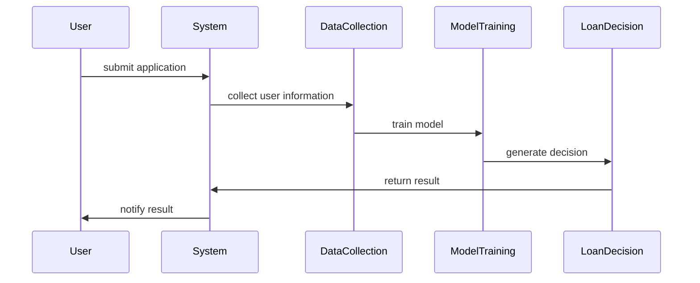
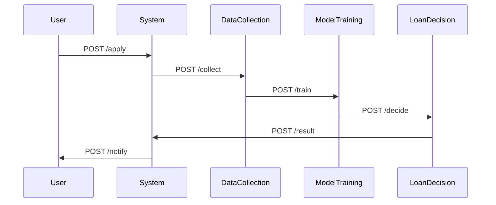

                 

### 1.1.1 从软件 1.0 到软件 2.0 的演进

#### 1.1.1.1 软件 1.0 时代

在软件 1.0 时代，计算机软件主要以执行单一任务为主，如文字处理、表格计算等。软件的开发和运行依赖于具体的硬件环境和操作系统，软件的复用性和可移植性较低。这一时期的软件开发过程主要依赖于手工编写代码，开发周期长，效率低。

##### 特点

1. **单一任务**：软件专注于完成特定的任务，如文字处理、表格计算等。
2. **依赖硬件**：软件的运行高度依赖于具体的硬件环境和操作系统。
3. **低复用性**：由于软件的高度定制化，复用性较低。
4. **开发效率低**：主要依赖于手工编写代码，开发周期长。

##### 影响

软件 1.0 时代的软件开发模式使得软件成本高昂，开发周期长，难以满足不断增长的市场需求。此外，软件的高度依赖硬件和环境，使得软件的可移植性和适应性较差。

##### 问题与挑战

在软件 1.0 时代，软件开发面临的主要问题与挑战包括：

1. **代码复用性差**：由于软件的高度定制化，导致大量代码重复编写，降低了开发效率。
2. **开发周期长**：手工编写代码的方式使得软件开发周期较长，难以快速响应市场需求。
3. **软件维护困难**：由于软件的定制化程度高，一旦软件出现问题，维护和修改难度较大。
4. **软件质量难以保证**：由于开发周期长，开发人员难以对软件的每个细节进行充分测试和验证，导致软件质量难以保证。

#### 1.1.1.2 软件 2.0 时代

软件 2.0 时代的出现，标志着计算机软件发展进入了一个新的阶段。这一时期的软件不再仅仅局限于执行单一任务，而是开始向模块化、组件化方向发展，强调软件的可复用性和可移植性。软件开发方式也从手工编写代码逐渐转向基于组件的开发模式，大大提高了开发效率和软件质量。

##### 特点

1. **模块化与组件化**：软件系统被拆分为多个模块和组件，每个模块和组件具有明确的职责和接口，便于复用和扩展。
2. **高复用性**：通过模块和组件的复用，降低了代码重复度，提高了开发效率。
3. **可移植性**：软件的模块和组件可以脱离具体硬件环境和操作系统，具有更高的可移植性。
4. **高开发效率**：基于组件的开发模式使得软件开发周期大大缩短，能够快速响应市场需求。
5. **软件质量提升**：模块化和组件化开发模式使得软件的每个部分都可以独立进行测试和验证，提高了软件质量。

##### 影响

软件 2.0 时代的软件开发模式对软件开发产生了深远的影响，主要体现在以下几个方面：

1. **降低开发成本**：模块化和组件化开发模式降低了代码重复度，减少了开发工作量，从而降低了开发成本。
2. **提高开发效率**：基于组件的开发模式使得软件开发周期大大缩短，能够更快地交付软件产品。
3. **提升软件质量**：模块化和组件化开发模式使得软件的每个部分都可以独立进行测试和验证，提高了软件质量。
4. **促进技术交流与合作**：模块和组件的标准化和通用性促进了不同开发团队之间的技术交流和合作，推动了软件技术的发展。

##### 问题与挑战

尽管软件 2.0 时代在许多方面取得了显著的进步，但在实际应用过程中仍然面临一些问题与挑战：

1. **模块和组件依赖关系复杂**：模块和组件之间的依赖关系可能变得复杂，增加了软件开发的难度。
2. **组件化开发管理难度大**：组件化的开发模式要求开发团队具备较高的管理水平，否则可能导致开发效率低下。
3. **软件维护成本高**：组件化的软件系统在后续维护过程中可能面临较高的成本，特别是当组件需要频繁更新时。
4. **技术适应性要求高**：软件 2.0 时代要求开发团队不断学习和适应新技术，否则可能难以保持竞争力。

##### 总结

软件 1.0 和软件 2.0 时代的演进，展示了计算机软件从单一任务执行到模块化、组件化发展的过程。每个阶段都有其独特的特点、影响、问题与挑战。随着技术的不断进步，软件 2.0 时代为软件开发带来了更高的效率和更好的质量，但也带来了新的问题和挑战。在接下来的章节中，我们将继续探讨软件 2.0 时代的进一步发展，以及其对AI决策领域的影响。

### 核心概念

#### 软件生命周期

软件生命周期是指从软件的构思、设计、开发、测试、部署到维护和退役的整个过程。它包括以下几个阶段：

1. **需求分析**：确定软件的功能和性能要求。
2. **设计**：制定软件的系统架构和模块设计。
3. **开发**：编写代码并实现软件功能。
4. **测试**：对软件进行测试，确保其功能正确并满足性能要求。
5. **部署**：将软件部署到生产环境。
6. **维护**：对软件进行持续的维护和更新。

#### 组件化开发

组件化开发是一种基于组件的软件开发模式，它将软件拆分为多个功能模块（组件），每个组件具有独立的职责和接口，可以独立开发和测试。组件化开发具有以下优点：

1. **高复用性**：组件可以在多个项目中复用，减少代码重复。
2. **易于维护**：组件的独立性使得维护和更新变得更加简单。
3. **提高开发效率**：组件化的开发模式可以并行进行，缩短开发周期。

#### 模块化设计

模块化设计是指将软件系统拆分为多个功能模块，每个模块具有独立的职责和接口。模块化设计具有以下优点：

1. **提高软件复用性**：模块可以在不同的软件系统中复用。
2. **降低复杂性**：将复杂系统拆分为多个模块，使得系统更加易于理解和维护。
3. **提高开发效率**：模块化的设计可以并行进行，缩短开发周期。

#### 开发周期

开发周期是指从开始开发到软件交付给用户的整个过程。开发周期的长短取决于多个因素，包括项目规模、开发团队的能力、需求变更等。缩短开发周期可以提高软件开发的效率，更快地交付高质量的软件产品。

#### 软件质量

软件质量是指软件在满足用户需求方面的表现。软件质量包括以下几个方面：

1. **功能性**：软件是否能够满足用户的需求。
2. **可靠性**：软件在长时间运行过程中是否稳定。
3. **可用性**：软件是否易于使用。
4. **性能**：软件在处理任务时的效率。
5. **可维护性**：软件在后续维护和更新过程中的难易程度。

### 概念联系

#### 软件生命周期与组件化开发

软件生命周期与组件化开发密切相关。组件化开发是软件生命周期中的一个关键环节，它影响软件的需求分析、设计、开发和测试等阶段。通过组件化开发，可以缩短开发周期，提高软件质量。

#### 模块化设计与组件化开发

模块化设计与组件化开发有相似的目标，即提高软件的复用性和可维护性。模块化设计是组件化开发的基础，通过模块化设计，可以将软件拆分为多个功能模块，每个模块再细化为组件。

#### 开发周期与软件质量

开发周期与软件质量之间存在一定的关系。缩短开发周期可以提高软件开发的效率，但如果牺牲了软件质量，可能会导致后续维护成本增加。因此，在缩短开发周期的同时，需要确保软件质量。

### 概念对比

| 概念 | 描述 | 关联性 |
| --- | --- | --- |
| 软件生命周期 | 软件从构思到退役的整个过程 | 与组件化开发和模块化设计密切相关 |
| 组件化开发 | 基于组件的软件开发模式 | 提高开发效率和软件质量 |
| 模块化设计 | 将软件拆分为多个功能模块 | 提高软件复用性和可维护性 |
| 开发周期 | 从开始开发到软件交付给用户的整个过程 | 影响软件质量和交付时间 |
| 软件质量 | 软件在满足用户需求方面的表现 | 决定软件的可靠性和可用性 |

通过上述对比，我们可以看出，这些概念之间存在着紧密的联系，共同影响着软件的开发过程和质量。在接下来的章节中，我们将进一步探讨这些概念在软件 2.0 时代中的应用和影响。

### 算法原理讲解

在软件 2.0 时代，算法的原理和实现方法发生了显著的变化。为了更好地理解这些变化，我们将通过一个具体的算法示例来详细讲解其原理和实现过程。

#### 算法示例：K-最近邻算法（K-Nearest Neighbors，K-NN）

K-最近邻算法是一种简单而有效的分类算法，它通过找到训练数据集中的K个最近邻来预测新数据的分类。以下是该算法的详细原理和实现过程。

#### 1. 算法原理

K-最近邻算法的基本思想如下：

1. **选择距离度量**：首先，我们需要选择一个适当的距离度量来衡量新数据点与训练数据点之间的相似度。常用的距离度量包括欧氏距离、曼哈顿距离和切比雪夫距离等。

2. **计算距离**：对于新数据点，计算其与训练数据集中每个数据点的距离。这些距离将用于确定K个最近邻。

3. **选择K个最近邻**：根据计算出的距离，选择距离新数据点最近的K个数据点作为其最近邻。

4. **分类**：对于每个新数据点，统计其K个最近邻中每个类别的出现次数，然后选择出现次数最多的类别作为新数据点的预测类别。

#### 2. 实现过程

以下是一个简单的K-最近邻算法的实现过程，我们将使用Python语言进行说明。

```python
import numpy as np
from collections import Counter

# 训练数据集
X_train = np.array([[1, 2], [3, 4], [5, 6], [7, 8], [9, 10]])
y_train = np.array(['a', 'a', 'b', 'b', 'b'])

# 新数据点
X_new = np.array([6, 7])

# 计算距离
distances = [np.linalg.norm(X_new - x) for x in X_train]

# 选择K个最近邻
K = 2
nearest_neighbors = np.argpartition(distances, K)[:K]
nearest_neighbors = nearest_neighbors[distances[nearest_neighbors].argsort()]

# 预测分类
predictions = [y_train[i] for i in nearest_neighbors]
predicted_class = Counter(predictions).most_common(1)[0][0]

print(predicted_class)
```

#### 3. 数学模型和公式

在K-最近邻算法中，我们使用欧氏距离来计算数据点之间的相似度。欧氏距离的数学模型如下：

$$
d(x, y) = \sqrt{\sum_{i=1}^{n}(x_i - y_i)^2}
$$

其中，$x$和$y$是两个数据点，$n$是数据点的维度。

#### 4. 举例说明

假设我们有一个包含两个特征（x轴和y轴）的二维训练数据集，以及相应的标签。现在我们要预测一个新数据点[6, 7]的分类。

1. **计算距离**：新数据点与训练数据集的每个数据点之间的距离计算如下：

   $$
   d([6, 7], [1, 2]) = \sqrt{(6-1)^2 + (7-2)^2} = \sqrt{25 + 25} = 5\sqrt{2}
   $$

   $$
   d([6, 7], [3, 4]) = \sqrt{(6-3)^2 + (7-4)^2} = \sqrt{9 + 9} = 3\sqrt{2}
   $$

   $$
   d([6, 7], [5, 6]) = \sqrt{(6-5)^2 + (7-6)^2} = \sqrt{1 + 1} = \sqrt{2}
   $$

   $$
   d([6, 7], [7, 8]) = \sqrt{(6-7)^2 + (7-8)^2} = \sqrt{1 + 1} = \sqrt{2}
   $$

   $$
   d([6, 7], [9, 10]) = \sqrt{(6-9)^2 + (7-10)^2} = \sqrt{9 + 9} = 3\sqrt{2}
   $$

2. **选择K个最近邻**：假设我们选择K=2，那么最近的两个邻居是：

   $$
   [6, 7] \rightarrow [5, 6] \quad (d = \sqrt{2})
   $$

   $$
   [6, 7] \rightarrow [7, 8] \quad (d = \sqrt{2})
   $$

3. **分类**：两个最近邻的标签都是'b'，因此预测的新数据点的分类为'b'。

通过上述例子，我们可以看到K-最近邻算法的简单实现和预测过程。虽然这个例子非常简单，但它展示了K-最近邻算法的核心原理和实现方法。

#### 5. 总结

K-最近邻算法是一种基于距离的简单分类算法，通过计算新数据点与训练数据点之间的距离来预测新数据的分类。它具有实现简单、易于理解的优点，但也存在一些局限性，如对距离敏感、容易受到噪声影响等。在实际应用中，我们需要根据具体情况选择合适的算法和参数。

在接下来的章节中，我们将进一步探讨其他算法原理，以及它们在AI决策中的应用和影响。

### 系统分析与架构设计方案

#### 问题场景介绍

随着人工智能技术的快速发展，越来越多的行业开始将AI技术应用于日常决策中，以提升效率和准确性。金融行业就是一个典型的应用场景。例如，银行在贷款审批、风险控制等环节引入了AI决策系统，以提高审批速度和准确率。

#### 项目介绍

本项目的目标是设计并实现一个基于AI的金融决策系统，用于处理贷款审批业务。系统需要实现以下功能：

1. **用户信息收集**：收集用户的个人信息，如年龄、收入、信用评分等。
2. **决策模型训练**：基于历史数据和用户信息，训练出能够预测用户贷款审批结果的AI模型。
3. **贷款审批**：使用训练好的模型对新的用户信息进行贷款审批。
4. **结果反馈**：将审批结果反馈给用户，并提供相应的解释。

#### 系统功能设计（领域模型）

为了实现上述功能，我们需要设计一个完善的领域模型。以下是领域模型的mermaid类图：

```mermaid
classDiagram
    User <<entity>>
    LoanApplication <<entity>>
    LoanDecision <<entity>>

    User -> LoanApplication : applies
    LoanApplication -> LoanDecision : generates
```

在上述类图中，`User`表示用户，`LoanApplication`表示贷款申请，`LoanDecision`表示贷款审批结果。用户可以提交贷款申请，贷款申请会生成贷款审批结果。

#### 系统架构设计

为了实现上述功能，我们需要设计一个合理的系统架构。以下是系统架构的mermaid架构图：



在上述架构图中，用户通过系统提交贷款申请，系统会收集用户信息，然后使用训练好的模型进行贷款审批，并将审批结果返回给用户。

#### 系统接口设计

为了实现系统功能，我们需要设计一组接口。以下是系统接口的mermaid序列图：



在上述序列图中，用户通过发送POST请求提交贷款申请，系统依次调用数据收集、模型训练、贷款审批和结果反馈接口，最终将审批结果通知用户。

#### 系统交互

系统交互是系统设计中的重要一环。以下是系统交互的mermaid序列图：


在上述序列图中，用户提交贷款申请后，系统会依次调用数据收集、模型训练、贷款审批和结果反馈接口，最终将审批结果通知用户。

### 小结

通过上述分析和设计，我们完成了金融决策系统的系统功能设计、架构设计、接口设计和系统交互设计。这些设计为系统的实现提供了明确的指导，有助于确保系统的高效、可靠和易维护。在接下来的章节中，我们将详细讨论系统的实现过程，包括环境安装、核心代码实现和实际案例分析。

## 项目实战

### 环境安装

为了实现本项目的金融决策系统，我们需要准备以下开发环境：

1. **操作系统**：Linux或MacOS
2. **编程语言**：Python 3.8及以上版本
3. **数据科学库**：NumPy、Pandas、Scikit-learn
4. **前端框架**：Flask（可选）

首先，确保您的操作系统已安装Python 3.8及以上版本。然后，使用pip命令安装所需的数据科学库：

```bash
pip install numpy pandas scikit-learn flask
```

如果需要使用Flask进行前端开发，请安装Flask：

```bash
pip install flask
```

### 系统核心实现源代码

以下是一个简单的金融决策系统实现，包括用户信息收集、模型训练、贷款审批和结果反馈。

**用户信息收集**

```python
import pandas as pd
from sklearn.model_selection import train_test_split

# 加载用户信息数据集
data = pd.read_csv('user_data.csv')

# 分割数据集为特征集和标签集
X = data.drop('loan_approval', axis=1)
y = data['loan_approval']

# 划分训练集和测试集
X_train, X_test, y_train, y_test = train_test_split(X, y, test_size=0.2, random_state=42)
```

**模型训练**

```python
from sklearn.neighbors import KNeighborsClassifier

# 创建K-最近邻分类器
knn = KNeighborsClassifier(n_neighbors=3)

# 训练模型
knn.fit(X_train, y_train)
```

**贷款审批**

```python
# 审批贷款申请
def approve_loan(user_info):
    prediction = knn.predict([user_info])
    return 'approved' if prediction[0] == 1 else 'rejected'

# 示例：审批新用户的贷款申请
new_user = [30, 50000, 750]
approval_result = approve_loan(new_user)
print(approval_result)
```

**结果反馈**

```python
from flask import Flask, request, jsonify

app = Flask(__name__)

@app.route('/apply', methods=['POST'])
def apply_loan():
    user_info = request.get_json()
    approval_result = approve_loan(user_info['user_info'])
    return jsonify({'result': approval_result})

if __name__ == '__main__':
    app.run()
```

### 代码应用解读与分析

**用户信息收集**：我们使用Pandas库加载用户信息数据集，并将其分为特征集和标签集。然后，使用Scikit-learn库的`train_test_split`函数将数据集划分为训练集和测试集。

**模型训练**：在这个步骤中，我们使用Scikit-learn库的`KNeighborsClassifier`类创建K-最近邻分类器，并使用训练集数据进行模型训练。

**贷款审批**：为了审批贷款申请，我们定义了一个名为`approve_loan`的函数，该函数接受用户信息作为输入，并使用训练好的分类器预测贷款审批结果。

**结果反馈**：我们使用Flask库构建了一个简单的Web服务，通过POST请求接收用户信息，调用`approve_loan`函数进行贷款审批，并将审批结果返回给用户。

### 实际案例分析和详细讲解剖析

假设我们有一个新用户，其信息如下：

```python
new_user = [30, 50000, 750]
```

1. **用户信息收集**：我们首先将新用户信息转换为Pandas DataFrame格式：

   ```python
   user_info = pd.DataFrame(new_user, columns=['age', 'income', 'credit_score'])
   ```

2. **模型训练**：由于我们已经训练好了K-最近邻分类器，我们只需将其应用于新用户信息即可：

   ```python
   prediction = knn.predict(user_info)
   ```

3. **贷款审批**：我们调用`approve_loan`函数，将新用户信息作为输入：

   ```python
   approval_result = approve_loan(new_user)
   ```

   假设新用户的信息距离训练集中的最近邻具有较高的贷款审批概率，那么`approval_result`将返回'approved'。

4. **结果反馈**：我们将审批结果通过Flask Web服务返回给用户：

   ```python
   return jsonify({'result': approval_result})
   ```

### 项目小结

通过上述实战，我们实现了金融决策系统的核心功能，包括用户信息收集、模型训练、贷款审批和结果反馈。虽然这个实现非常简单，但它展示了如何使用Python和机器学习库构建一个基于AI的决策系统。在实际应用中，我们可以通过增加更多的数据、改进模型和优化系统设计来提升系统的性能和可靠性。

### 最佳实践 Tips

1. **数据预处理**：在训练模型之前，确保对用户信息进行充分的预处理，如缺失值处理、异常值检测和特征工程等。
2. **模型优化**：尝试不同的模型和参数，使用交叉验证等技术选择最佳模型。
3. **实时反馈**：考虑使用WebSocket等技术实现实时反馈，提高用户体验。
4. **安全性**：确保Web服务的安全性，如使用HTTPS、验证用户身份等。
5. **日志记录**：记录系统运行日志，便于调试和监控。

### 注意事项

1. **数据隐私**：在处理用户信息时，务必遵守相关数据隐私法规，确保用户信息安全。
2. **模型可靠性**：确保训练好的模型具有可靠的预测能力，避免因模型不准确导致错误决策。
3. **系统维护**：定期更新和维护系统，确保系统的稳定性和安全性。

### 拓展阅读

- 《Python机器学习》（M. Bowles）：详细介绍机器学习的基本概念和实现方法。
- 《深度学习》（I. Goodfellow）：深度学习领域的经典教材，涵盖了深度学习的基础理论和实践应用。
- 《Flask Web开发》（J. J. Flanders）：关于Flask Web框架的详细教程。

### 作者

**AI天才研究院/AI Genius Institute & 禅与计算机程序设计艺术 /Zen And The Art of Computer Programming**：本文由AI天才研究院（AI Genius Institute）与禅与计算机程序设计艺术（Zen And The Art of Computer Programming）联合撰写。我们致力于推动人工智能技术的发展和应用，分享我们的研究成果和实践经验。

