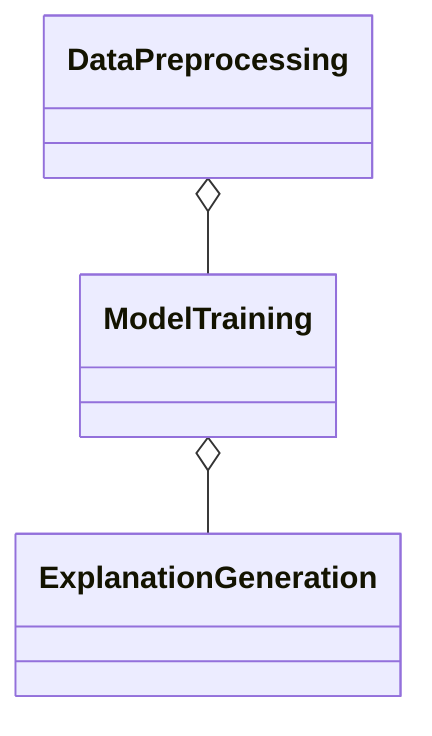

                 


## 《AI决策解释系统：提高AI治理透明度的工具》

### 关键词：AI决策解释、治理透明度、算法可解释性、数学模型、系统设计与实现

#### 摘要：

本文旨在深入探讨AI决策解释系统的构建，强调其在提高AI治理透明度中的重要性。我们将首先介绍AI决策解释系统的背景和现状，然后通过逻辑清晰的分析和简洁易懂的技术语言，逐步阐述其核心概念、算法原理、系统设计与实现，以及最佳实践。文章结构紧凑，旨在为读者提供一个全面的指南，帮助他们理解和应用这一关键工具。

---

### 1.1 AI决策解释系统的重要性

#### 1.1.1 AI治理透明度需求的背景

随着人工智能（AI）技术的快速发展，AI系统已经在医疗、金融、交通等领域得到广泛应用。然而，AI决策的不可解释性成为了一个亟待解决的问题。在许多情况下，AI系统做出的决策对用户和社会有着重大影响，但用户无法理解这些决策背后的逻辑。这种缺乏透明度的情况引发了公众对AI系统可信度和公平性的担忧。

#### 1.1.2 AI决策解释系统在AI治理中的作用

AI决策解释系统的目的是提供一种方式，使得用户和监管机构能够理解AI系统的决策过程。这种透明度对于确保AI系统的公正性、可接受性和合规性至关重要。通过解释系统，我们可以识别并纠正潜在的偏见，提高AI系统的治理水平。

#### 1.1.3 AI决策解释系统的现状与挑战

尽管已有一些初步的尝试，但构建一个全面且有效的AI决策解释系统仍然面临诸多挑战。这些挑战包括算法复杂度、性能影响、解释方法的多样性和标准化等。本文将逐步分析这些挑战，并探讨解决方案。

---

### 1.2 AI决策解释系统的核心概念

#### 1.2.1 模型可解释性

模型可解释性是指用户能够理解AI模型如何做出决策的能力。这是一个关键特性，因为如果模型不可解释，用户就无法信任它，也无法有效地监管它。

#### 1.2.2 决策透明度

决策透明度是指AI系统决策过程的透明性。一个透明的系统允许用户查看决策过程中的所有步骤和依据，从而提高系统的可信度。

#### 1.2.3 解释算法的分类与对比

解释算法可以分为三大类：基于规则的解释、基于数据的解释和基于模型的解释。每种算法都有其优点和局限性，选择合适的算法取决于具体应用场景。

#### 1.2.4 AI决策解释系统的组件

AI决策解释系统通常包括数据预处理、模型训练、解释生成和决策评估等组件。每个组件都需要精心设计，以确保系统的整体性能。

#### 1.2.5 AI决策解释系统的基本流程

AI决策解释系统的基本流程包括数据输入、模型训练、决策生成和解释生成。这些步骤需要紧密协作，以确保系统的有效性。

### 1.3 AI决策解释系统的ER图与Mermaid类图

下面是一个简化的ER图，展示了AI决策解释系统的关键实体及其关系：

```mermaid
classDiagram
    Class Data {
        >>属性：数据集，特征
        >>方法：预处理
    }
    Class Model {
        >>属性：模型架构，参数
        >>方法：训练，预测
    }
    Class Explanation {
        >>属性：解释结果，可视化
        >>方法：生成，评估
    }
    Data <|-- Model
    Model <|-- Explanation
```

同时，我们使用Mermaid类图来展示系统的组件和类之间的关系：



---

在接下来的部分，我们将深入探讨AI决策解释系统的算法原理，并通过数学模型和Python代码来详细阐述其工作原理。敬请期待！

