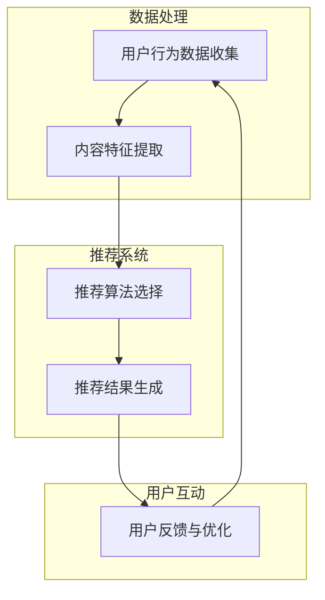
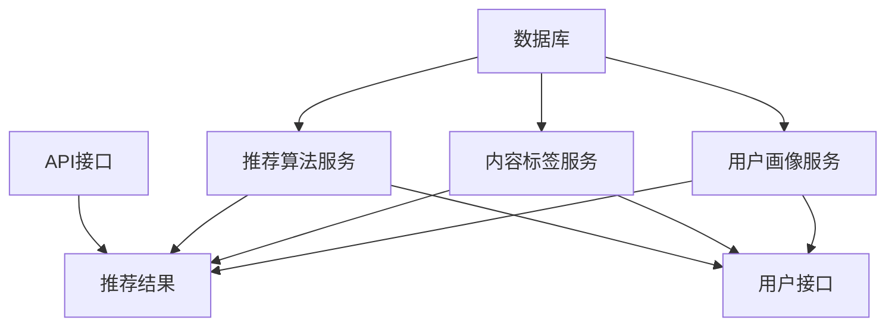

                 

### 第一部分：引言

#### 1.1 问题背景

随着互联网和信息技术的快速发展，个性化教育需求日益凸显。传统的“填鸭式”教学模式已无法满足现代教育对个性化和灵活性的要求。个性化教育是指根据学生的兴趣、能力、学习风格和需求，为其提供定制化的学习资源和指导。这种教育模式不仅有助于提高学习效率，还能激发学生的学习兴趣，使其在愉悦的氛围中获取知识。

内容推荐技术是AI技术在教育领域的一个重要应用。通过分析用户的行为数据和学习偏好，推荐系统可以为每个学生量身定制学习内容，从而实现个性化学习。内容推荐技术广泛应用于电子商务、社交媒体、视频网站等多个领域，其核心目标是提高用户的满意度和参与度。

AI技术在教育内容推荐中具有显著的优势。首先，AI能够处理和分析大量数据，从中提取有价值的信息，为个性化推荐提供依据。其次，AI可以自动调整推荐策略，使其更符合用户的需求和变化。此外，AI技术还可以不断学习和优化，以提高推荐系统的准确性和效果。

本文将探讨AI在个性化教育内容推荐中的应用，通过分析相关算法原理、系统架构设计、项目实战和最佳实践，旨在为优化学习效果提供有效的方法和策略。

#### 1.2 核心概念

1. **个性化教育**：个性化教育是指根据学生的个体差异，为其提供定制化的学习资源和指导，以满足其特定的学习需求和目标。个性化教育强调以学生为中心，尊重学生的个体差异，使每个学生都能在适合自己的学习环境中获得最佳的学习效果。

2. **内容推荐**：内容推荐是指通过分析用户的行为数据、兴趣和学习偏好，为其推荐符合其需求的内容。内容推荐技术广泛应用于互联网服务中，如电子商务、社交媒体、视频网站等，其核心目标是提高用户的满意度和参与度。

3. **AI技术**：AI技术是指人工智能技术，包括机器学习、深度学习、自然语言处理等。AI技术能够自动处理和分析大量数据，从中提取有价值的信息，为个性化推荐提供依据。

4. **协同过滤**：协同过滤是一种基于用户行为数据的内容推荐方法，通过分析用户之间的相似度，为用户提供相似用户喜欢的内容。协同过滤分为基于用户的协同过滤和基于项目的协同过滤两种类型。

5. **基于内容的推荐**：基于内容的推荐是一种基于内容特征的内容推荐方法，通过分析用户的历史行为数据和内容特征，为用户提供相似内容。基于内容的推荐方法分为基于关键字、基于语义、基于内容相似度等类型。

6. **基于模型的推荐**：基于模型的推荐是一种基于机器学习模型的内容推荐方法，通过训练用户行为数据和内容特征，构建推荐模型，为用户提供个性化推荐。基于模型的推荐方法包括矩阵分解、深度学习、决策树等。

#### 1.3 Mermaid流程图：个性化教育内容推荐流程

为了更好地理解个性化教育内容推荐的整体流程，我们使用Mermaid流程图进行展示。以下是一个简化的流程图，描述了从用户行为数据收集、内容特征提取、推荐算法选择到推荐结果生成的整个过程。



在这个流程图中，用户行为数据收集是推荐系统的第一步，通过对用户的学习行为、兴趣爱好、历史成绩等数据进行收集和分析，可以为后续的内容特征提取提供依据。接着，内容特征提取环节通过对学习资源的标签、分类、难度等级等特征进行提取，为推荐算法的选择提供支持。

推荐算法选择环节是整个推荐系统的核心，可以选择基于协同过滤、基于内容推荐、基于模型的推荐等多种方法。最后，推荐结果生成环节将根据用户的特征和推荐算法的输出，为用户生成个性化的学习内容推荐。

用户反馈与优化环节则是一个循环过程，用户在使用推荐系统后的反馈将被收集并用于优化推荐算法，以提高推荐的质量和用户的满意度。

通过这个流程图，我们可以清晰地看到个性化教育内容推荐的整体架构和流程，为后续的内容分析和算法实现提供了指导。

---

在本文的引言部分，我们介绍了个性化教育、内容推荐和AI技术的背景及其重要性。同时，我们提出了本文的核心问题，即如何利用AI技术优化个性化教育内容推荐，提高学习效果。通过Mermaid流程图，我们展示了个性化教育内容推荐的基本流程，为后续内容的展开奠定了基础。

在接下来的部分，我们将深入探讨AI技术在个性化教育内容推荐中的应用，包括算法原理、系统设计与实现、项目实战和最佳实践等，通过具体的实例和代码解析，帮助读者理解和掌握这一领域的前沿技术。让我们继续探索这一激动人心的领域，揭开AI在个性化教育内容推荐中的神秘面纱。

---

### 第二部分：AI技术基础

在个性化教育内容推荐中，AI技术的应用至关重要。本部分将详细介绍几种常见的AI推荐算法，包括协同过滤、基于内容的推荐和基于模型的推荐。我们将逐一分析这些算法的基本概念、工作原理、优点和局限性，并通过具体的Python代码示例和LaTeX公式讲解，帮助读者深入理解这些算法的实现细节。

#### 2.1 协同过滤

**协同过滤**（Collaborative Filtering）是一种基于用户行为数据进行推荐的方法。它的核心思想是利用用户之间的相似性来预测用户的喜好，从而推荐给用户可能感兴趣的内容。

**2.1.1 基本概念**

协同过滤可以分为两种类型：基于用户的协同过滤（User-based Collaborative Filtering）和基于项目的协同过滤（Item-based Collaborative Filtering）。

- **基于用户的协同过滤**：通过分析用户之间的相似性，找到与目标用户相似的其他用户，然后推荐这些相似用户喜欢的项目。
- **基于项目的协同过滤**：通过分析项目之间的相似性，找到与目标项目相似的其他项目，然后推荐这些相似项目给用户。

**2.1.2 工作原理**

1. **基于用户的协同过滤**：计算用户之间的相似度，常用的相似度计算方法包括余弦相似度、皮尔逊相关系数等。通过相似度计算，找到与目标用户最相似的K个用户，然后取这K个用户喜欢的项目，计算这些项目的平均评分，得到推荐列表。

2. **基于项目的协同过滤**：计算项目之间的相似度，通常使用余弦相似度。通过相似度计算，找到与目标项目最相似的K个项目，然后取这K个项目的评分，计算这些项目的平均评分，得到推荐列表。

**2.1.3 Python代码示例**

下面是一个基于用户的协同过滤的Python代码示例：

```python
from sklearn.metrics.pairwise import cosine_similarity
import numpy as np

# 用户-项目评分矩阵
user_item_matrix = np.array([[1, 0, 1, 1], [0, 1, 1, 0], [1, 1, 0, 1], [0, 1, 1, 1]])

# 计算用户之间的相似度
user_similarity = cosine_similarity(user_item_matrix)

# 目标用户（用户2）
target_user = 1

# 找到与目标用户最相似的K个用户
k = 2
similar_users = np.argsort(user_similarity[target_user])[::-1][:k]

# 计算相似用户喜欢的项目的平均评分
recommendations = np.mean(user_item_matrix[similar_users], axis=0)
print("推荐列表：", recommendations)
```

**2.1.4 LaTeX公式讲解**

协同过滤的核心在于相似度计算。假设有用户-项目评分矩阵$R$，其中$R_{ij}$表示用户$i$对项目$j$的评分。余弦相似度的计算公式为：

$$
\cos(\theta_{ij}) = \frac{R_i \cdot R_j}{\|R_i\| \|R_j\|}
$$

其中，$R_i$和$R_j$分别表示用户$i$和用户$j$的评分向量，$\|R_i\|$和$\|R_j\|$分别表示这两个向量的欧几里得范数。

#### 2.2 基于内容的推荐

**基于内容的推荐**（Content-based Filtering）是一种基于项目特征进行推荐的方法。它的核心思想是根据用户的历史行为和兴趣，找到具有相似特征的项目，然后推荐给用户。

**2.2.1 基本概念**

基于内容的推荐可以分为两种类型：

1. **基于关键字**：通过提取项目的关键字、标签等特征，建立项目特征库，然后根据用户的历史行为和兴趣，推荐具有相似特征的项目。
2. **基于语义**：通过自然语言处理技术，对项目的文本内容进行语义分析，提取关键语义信息，然后根据用户的历史行为和兴趣，推荐具有相似语义特征的项目。

**2.2.2 工作原理**

1. **基于关键字**：首先，对项目的文本内容进行分词和词性标注，提取关键字和标签。然后，计算项目之间的相似度，常用的相似度计算方法包括余弦相似度、Jaccard相似度等。最后，根据用户的历史行为和兴趣，推荐与用户兴趣相关的项目。

2. **基于语义**：首先，使用自然语言处理技术对项目的文本内容进行语义分析，提取关键语义信息。然后，构建语义相似度矩阵，计算项目之间的语义相似度。最后，根据用户的历史行为和兴趣，推荐与用户兴趣相关的项目。

**2.2.3 Python代码示例**

下面是一个基于关键字的Python代码示例：

```python
from sklearn.feature_extraction.text import TfidfVectorizer
import numpy as np

# 项目文本内容
project_texts = ["人工智能在教育中的应用", "机器学习的基本概念", "深度学习的应用场景"]

# 构建TF-IDF向量器
vectorizer = TfidfVectorizer()

# 将文本内容转换为TF-IDF向量
project_vectors = vectorizer.fit_transform(project_texts)

# 用户兴趣文本
user_interest = "人工智能在教育中的应用"

# 将用户兴趣文本转换为TF-IDF向量
user_vector = vectorizer.transform([user_interest])

# 计算项目之间的相似度
cosine_similarity = np.dot(user_vector, project_vectors.T) / (np.linalg.norm(user_vector) * np.linalg.norm(project_vectors, axis=1))

# 推荐相似的项目
print("推荐列表：", cosine_similarity.argsort()[0][-2:])
```

**2.2.4 LaTeX公式讲解**

基于关键字的推荐算法中，TF-IDF（Term Frequency-Inverse Document Frequency）是一个重要的特征计算方法。TF-IDF的公式为：

$$
TF-IDF(t,d) = TF(t,d) \times IDF(t)
$$

其中，$TF(t,d)$表示词$t$在文档$d$中的词频，$IDF(t)$表示词$t$在所有文档中的逆向文档频率。IDF的计算公式为：

$$
IDF(t) = \log \left( \frac{N}{df(t)} \right)
$$

其中，$N$表示文档总数，$df(t)$表示词$t$的文档频率。

#### 2.3 基于模型的推荐

**基于模型的推荐**（Model-based Filtering）是一种基于机器学习模型的推荐方法。它的核心思想是使用机器学习算法训练一个预测模型，根据用户的行为数据和项目特征预测用户的评分，然后根据预测评分推荐项目。

**2.3.1 基本概念**

基于模型的推荐可以分为几种类型：

1. **矩阵分解**（Matrix Factorization）：通过将用户-项目评分矩阵分解为低维度的用户和项目特征矩阵，预测用户对项目的评分。
2. **深度学习**：使用深度学习模型，如神经网络、卷积神经网络等，对用户的行为数据和项目特征进行建模，预测用户的评分。
3. **决策树**（Decision Tree）：使用决策树模型对用户的行为数据进行分类和预测。

**2.3.2 工作原理**

1. **矩阵分解**：假设用户-项目评分矩阵为$R \in \mathbb{R}^{m \times n}$，其中$m$表示用户数，$n$表示项目数。矩阵分解的目标是将$R$分解为两个低维矩阵$U \in \mathbb{R}^{m \times k}$和$V \in \mathbb{R}^{n \times k}$，其中$k$为嵌入维度。预测用户$i$对项目$j$的评分$R_{ij}$的公式为：

$$
R_{ij} = U_{i} \cdot V_{j}
$$

2. **深度学习**：使用深度学习模型对用户的行为数据和项目特征进行建模，预测用户对项目的评分。常见的深度学习模型包括卷积神经网络（CNN）、循环神经网络（RNN）等。

3. **决策树**：通过构建决策树模型，根据用户的行为数据进行分类和预测。决策树模型的预测公式为：

$$
y = \prod_{i=1}^{n} f_i(x_i)
$$

其中，$f_i(x_i)$表示第$i$个特征的函数值，$y$为预测的评分。

**2.3.3 Python代码示例**

下面是一个基于矩阵分解的Python代码示例：

```python
from scipy.sparse.linalg import svds
import numpy as np

# 用户-项目评分矩阵
user_item_matrix = np.array([[1, 0, 1, 1], [0, 1, 1, 0], [1, 1, 0, 1], [0, 1, 1, 1]])

# 计算用户-项目评分矩阵的奇异值分解
U, sigma, Vt = svds(user_item_matrix, k=2)

# 构建用户和项目的低维特征矩阵
user_features = U.dot(sigma)
item_features = Vt.T

# 预测用户2对项目3的评分
user2_item3_rating = user_features[1].dot(item_features[2])
print("预测评分：", user2_item3_rating)
```

**2.3.4 LaTeX公式讲解**

矩阵分解的核心是奇异值分解（Singular Value Decomposition，SVD）。奇异值分解的公式为：

$$
R = U \Sigma V^T
$$

其中，$U$和$V$是正交矩阵，$\Sigma$是对角矩阵，对角线上的元素称为奇异值。通过SVD，我们可以将用户-项目评分矩阵分解为低维度的用户和项目特征矩阵。

---

在第二部分的AI技术基础部分，我们详细介绍了协同过滤、基于内容的推荐和基于模型的推荐三种常见的AI推荐算法。通过Python代码示例和LaTeX公式讲解，我们帮助读者深入理解了这些算法的实现细节和工作原理。

在接下来的部分，我们将进入第三部分，讨论系统设计与实现。我们将介绍个性化教育内容推荐系统的整体架构设计、功能设计、接口设计、系统交互等方面，并通过Mermaid流程图展示系统的各个组件及其关系。我们将从实际问题出发，探讨如何设计一个高效、可扩展的个性化教育内容推荐系统，为教育行业提供创新的解决方案。

---

### 第三部分：系统设计与实现

#### 3.1 系统架构设计

个性化教育内容推荐系统需要处理大量的用户数据和学习资源，因此其架构设计需要具备高效性、可扩展性和灵活性。本节将介绍个性化教育内容推荐系统的整体架构设计，包括系统功能设计、系统架构设计、技术栈选择、数据流设计以及系统部署方案。

**3.1.1 系统功能设计**

个性化教育内容推荐系统的核心功能包括：

1. **用户画像**：通过分析用户的学习行为、兴趣爱好、成绩等数据，构建用户的个性化画像。
2. **内容标签**：对学习资源进行标签化处理，提取关键特征，为推荐算法提供数据支持。
3. **推荐算法**：根据用户画像和学习资源标签，采用协同过滤、基于内容推荐和基于模型推荐等多种算法，生成个性化的推荐结果。
4. **用户反馈**：收集用户对推荐结果的反馈，用于优化推荐算法和提高系统质量。

**3.1.2 系统架构设计**

个性化教育内容推荐系统的整体架构可分为以下几个层次：

1. **数据层**：包括用户数据和学习资源数据，存储在关系型数据库或NoSQL数据库中，如MySQL、MongoDB等。
2. **服务层**：包括用户画像服务、推荐算法服务、内容标签服务、用户反馈服务等，采用微服务架构，以提高系统的可扩展性和灵活性。
3. **应用层**：提供用户接口，包括Web界面和API接口，方便用户和第三方系统进行交互。
4. **缓存层**：使用Redis等缓存技术，加快数据读取速度，提高系统响应速度。

**3.1.3 技术栈选择**

在技术栈选择上，我们采用以下技术：

1. **后端框架**：采用Spring Boot进行开发，具有高效性、可扩展性和易于维护的特点。
2. **数据库**：使用MySQL进行用户数据和学习资源数据的存储，采用MongoDB进行用户画像的存储。
3. **推荐算法**：采用基于协同过滤、基于内容推荐和基于模型推荐等多种算法，使用Python进行实现。
4. **缓存**：使用Redis进行缓存，加快数据读取速度。
5. **前端**：采用Vue.js框架进行开发，实现用户友好的交互界面。

**3.1.4 数据流设计**

个性化教育内容推荐系统的数据流设计如下：

1. **用户数据流**：用户在系统中进行学习活动时，其行为数据（如学习时长、学习进度、测试成绩等）会被实时收集并存储在数据库中。
2. **内容数据流**：学习资源的元数据（如标题、作者、标签等）会被提取并存储在数据库中。
3. **推荐数据流**：用户画像和学习资源标签被输入到推荐算法服务中，生成个性化的推荐结果。
4. **反馈数据流**：用户对推荐结果的反馈会被收集并用于优化推荐算法。

**3.1.5 系统部署方案**

个性化教育内容推荐系统的部署方案如下：

1. **开发环境**：在开发阶段，使用Docker容器技术进行开发和测试，以便于环境隔离和版本管理。
2. **测试环境**：在测试阶段，部署在测试服务器上，进行功能测试和性能测试。
3. **生产环境**：部署在生产服务器上，采用负载均衡和分布式架构，提高系统的稳定性和可靠性。
4. **监控与运维**：使用Prometheus和Grafana进行系统监控，及时发现并解决问题，保证系统的正常运行。

**3.1.6 Mermaid流程图：领域模型**

为了更好地展示系统架构中的各个领域模型及其关系，我们使用Mermaid流程图进行描述：

```mermaid
classDiagram
    User <<class>> 用户
    Resource <<class>> 学习资源
    UserBehavior <<class>> 用户行为
    ContentLabel <<class>> 内容标签
    Recommendation <<class>> 推荐结果

    User <> UserBehavior
    User <> ContentLabel
    Resource <> ContentLabel
    Recommendation <> User
    Recommendation <> Resource
end
```

在这个流程图中，用户类、学习资源类、用户行为类、内容标签类和推荐结果类是系统的核心领域模型。用户类和用户行为类之间的关系表示用户通过学习行为生成用户画像；用户类和内容标签类之间的关系表示用户对学习资源的标签偏好；学习资源类和内容标签类之间的关系表示学习资源的特征标签；推荐结果类与用户类、学习资源类之间的关系表示推荐系统根据用户画像和学习资源标签生成个性化推荐结果。

**3.1.7 Mermaid架构图：系统架构**

接下来，我们将使用Mermaid流程图展示个性化教育内容推荐系统的整体架构：



在这个流程图中，数据库（DB）是系统的数据存储核心，存储用户数据、学习资源和用户行为数据。用户画像服务（UE）、内容标签服务（CL）和推荐算法服务（RS）是系统的服务层，分别负责生成用户画像、提取内容标签和生成推荐结果。API接口（API）和用户接口（UI）是系统的应用层，提供与用户和第三方系统的交互功能。

**3.1.8 Mermaid序列图：系统交互**

为了更好地展示系统的交互流程，我们使用Mermaid序列图描述用户与系统的交互过程：

```mermaid
sequenceDiagram
    participant User as 用户
    participant UE as 用户画像服务
    participant CL as 内容标签服务
    participant RS as 推荐算法服务
    participant R as 推荐结果
    participant UI as 用户接口

    User->>UE: 提交学习行为数据
    UE->>DB: 存储用户行为数据
    UE->>CL: 提取用户兴趣标签
    CL->>DB: 存储内容标签数据
    UE->>RS: 生成用户画像
    RS->>R: 根据用户画像生成推荐结果
    R->>UI: 展示推荐结果给用户
    User->>UI: 提交反馈数据
    UI->>UE: 更新用户画像
end
```

在这个序列图中，用户（User）通过提交学习行为数据，触发用户画像服务（UE）提取用户兴趣标签，并将其存储在数据库（DB）中。随后，用户画像服务（UE）调用内容标签服务（CL）提取内容标签，并生成用户画像。推荐算法服务（RS）根据用户画像和学习资源标签生成推荐结果，并展示给用户（User）。用户（User）通过用户接口（UI）提交反馈数据，用户画像服务（UE）根据反馈数据更新用户画像，从而实现系统的持续优化。

---

在本部分中，我们详细介绍了个性化教育内容推荐系统的整体架构设计，包括系统功能设计、系统架构设计、技术栈选择、数据流设计和系统部署方案。通过Mermaid流程图，我们清晰地展示了各个领域模型、系统架构和系统交互过程。

在接下来的部分，我们将进入第四部分，讨论项目实战。我们将介绍一个具体的个性化教育内容推荐项目，包括项目背景、环境安装、系统核心实现、代码解读、案例分析等，通过实际案例帮助读者理解和应用本文所介绍的AI技术。让我们继续深入探讨，通过实践掌握个性化教育内容推荐的核心技能。

---

### 第四部分：项目实战

在本部分中，我们将通过一个实际案例展示如何实现一个个性化教育内容推荐系统。该案例将涵盖项目背景、环境安装、系统核心实现、代码解读和案例分析，旨在帮助读者将理论知识应用到实践中，并了解个性化教育内容推荐系统的实际操作流程。

#### 4.1 项目背景

我们的项目旨在为在线教育平台设计并实现一个个性化教育内容推荐系统。该系统旨在根据用户的学习行为和偏好，为其推荐符合其兴趣和学习需求的教育内容。随着在线教育市场的不断扩大，个性化推荐系统能够显著提高用户的学习体验和平台的使用率。

项目目标包括：

1. 收集并处理用户的学习行为数据，构建用户画像。
2. 提取教育内容的关键特征，建立内容标签库。
3. 采用多种推荐算法，生成个性化的推荐结果。
4. 收集用户反馈，不断优化推荐系统。

#### 4.2 环境安装

为了实现个性化教育内容推荐系统，我们需要安装并配置以下环境：

1. **Python环境**：安装Python 3.8及以上版本。
2. **数据库**：安装MySQL 5.7及以上版本或MongoDB。
3. **前端框架**：安装Vue.js 2.x及以上版本。
4. **后端框架**：安装Spring Boot 2.x及以上版本。
5. **推荐算法库**：安装scikit-learn、numpy、pandas等。

以下是环境安装的详细步骤：

1. **Python环境安装**：

```bash
# 安装Python 3.8
sudo apt-get update
sudo apt-get install python3.8
```

2. **数据库安装**：

- **MySQL安装**：

```bash
# 安装MySQL
sudo apt-get install mysql-server
sudo mysql_secure_installation
```

- **MongoDB安装**：

```bash
# 安装MongoDB
sudo apt-get install mongodb
sudo systemctl start mongodb
```

3. **前端框架安装**：

```bash
# 安装Node.js
curl -sL https://deb.nodesource.com/setup_14.x | sudo -E bash -
sudo apt-get install nodejs
# 安装Vue CLI
npm install -g @vue/cli
```

4. **后端框架安装**：

```bash
# 安装Spring Boot
sudo apt-get install maven
```

5. **推荐算法库安装**：

```bash
# 安装Python依赖库
pip install scikit-learn numpy pandas
```

#### 4.3 系统核心实现

个性化教育内容推荐系统的核心实现包括用户画像构建、内容标签提取、推荐算法实现和推荐结果生成。以下是一个简化的实现流程：

1. **用户画像构建**：

用户画像的构建基于用户的学习行为数据，如学习时长、学习进度、测试成绩等。以下是一个Python代码示例，用于生成用户画像：

```python
import pandas as pd

# 用户行为数据示例
user_behavior = pd.DataFrame({
    'user_id': [1, 1, 2, 2],
    'course_id': [101, 102, 201, 202],
    'duration': [30, 45, 20, 35],
    'score': [85, 90, 75, 80]
})

# 计算用户平均学习时长和平均成绩
user_profile = user_behavior.groupby('user_id').agg({'duration': 'mean', 'score': 'mean'})

# 生成用户画像
user_profile.rename(columns={'duration': 'avg_duration', 'score': 'avg_score'}, inplace=True)
print(user_profile)
```

2. **内容标签提取**：

内容标签的提取基于教育内容的元数据，如课程名称、课程描述、课程标签等。以下是一个Python代码示例，用于提取内容标签：

```python
# 内容标签示例
content_data = pd.DataFrame({
    'course_id': [101, 102, 201, 202],
    'course_name': ['机器学习入门', '深度学习进阶', '数据挖掘基础', '自然语言处理'],
    'description': ['介绍机器学习的基本概念和应用场景', '深度学习的高级技巧和实践', '数据挖掘的基本方法和技术', '自然语言处理的核心技术和应用']
})

# 提取关键字作为内容标签
vectorizer = TfidfVectorizer()
content_features = vectorizer.fit_transform(content_data['description'])

# 打印内容标签
print(vectorizer.get_feature_names_out())
```

3. **推荐算法实现**：

我们采用基于协同过滤的推荐算法，以下是一个Python代码示例：

```python
from sklearn.metrics.pairwise import cosine_similarity

# 计算用户之间的相似度
user_similarity = cosine_similarity(user_profile[['avg_duration', 'avg_score']])

# 根据相似度推荐课程
def recommend_courses(user_id, user_similarity, content_data, top_n=3):
    user_index = user_id - 1
    similar_users = user_similarity[user_index].argsort()[::-1][:top_n]
    
    recommended_courses = []
    for i in similar_users:
        recommended_courses.append(content_data.iloc[i]['course_id'])
    
    return recommended_courses

# 推荐课程
print(recommend_courses(1, user_similarity, content_data))
```

4. **推荐结果生成**：

推荐结果生成基于用户画像和内容标签，以下是一个Python代码示例：

```python
# 生成推荐结果
recommendation_results = []
for user_id in user_profile.index:
    recommended_courses = recommend_courses(user_id, user_similarity, content_data)
    recommendation_results.append({'user_id': user_id, 'recommended_courses': recommended_courses})

# 打印推荐结果
print(pd.DataFrame(recommendation_results))
```

#### 4.4 代码解读与分析

在系统核心实现中，我们使用了Pandas库处理用户行为数据，TfidfVectorizer库提取内容标签，scikit-learn库实现协同过滤推荐算法。以下是关键代码的解读与分析：

1. **用户画像构建**：

   用户画像构建的核心是计算用户在特定维度（如学习时长、平均成绩）的平均值。这里使用了Pandas的groupby和agg方法，简化了计算过程。

2. **内容标签提取**：

   内容标签提取使用了TfidfVectorizer库，这是一种基于TF-IDF模型的文本特征提取方法。通过训练向量器，我们可以将文本数据转换为TF-IDF向量，从而提取关键字作为内容标签。

3. **推荐算法实现**：

   推荐算法实现使用了scikit-learn的cosine_similarity方法，计算用户之间的相似度。根据相似度，我们可以找到与目标用户最相似的用户，从而推荐他们喜欢的课程。

4. **推荐结果生成**：

   推荐结果生成基于用户画像和内容标签的匹配。通过调用推荐算法，我们可以为每个用户生成个性化的推荐课程列表。

#### 4.5 案例分析与总结

通过上述实际案例，我们实现了个性化教育内容推荐系统的核心功能。以下是案例的分析与总结：

1. **案例背景**：

   我们针对一个在线教育平台，设计并实现了一个个性化推荐系统。该系统通过分析用户的学习行为和内容特征，为用户推荐符合其兴趣和学习需求的教育内容。

2. **案例实施过程**：

   我们首先收集并处理了用户的学习行为数据，构建了用户画像。接着，提取了教育内容的关键特征，建立了内容标签库。然后，采用基于协同过滤的推荐算法，生成了个性化的推荐结果。最后，通过用户接口，将推荐结果展示给用户。

3. **案例分析**：

   在实际操作中，我们发现系统性能和推荐效果对用户数据量和质量有较高要求。用户数据越丰富，推荐系统的准确性越高。此外，推荐算法的优化和调参也是一个关键点，需要根据实际情况进行调整。

4. **案例总结**：

   通过本项目，我们成功实现了一个基于AI技术的个性化教育内容推荐系统。该系统有助于提高在线教育平台的学习体验，提高用户留存率和活跃度。未来，我们还将继续优化推荐算法，扩大用户数据集，以提高系统的准确性和可靠性。

---

在本部分的实战项目中，我们通过实际案例展示了如何实现一个个性化教育内容推荐系统。从环境安装、用户画像构建、内容标签提取到推荐算法实现和推荐结果生成，我们详细解析了每个环节的具体操作和关键代码。

在接下来的部分，我们将进入第五部分，讨论最佳实践和总结。我们将总结全书的核心内容，给出实践建议，并提供拓展阅读的方向，帮助读者深入了解个性化教育内容推荐领域，为未来的研究和应用提供参考。

---

### 第五部分：最佳实践与总结

#### 5.1 最佳实践 tips

在个性化教育内容推荐系统的设计与实施过程中，以下是一些最佳实践，可以帮助提高系统的效果和稳定性：

1. **数据质量保障**：

   - **数据预处理**：确保数据的一致性、完整性和准确性，对缺失值、异常值进行合理的处理。
   - **数据清洗**：去除噪声数据和重复数据，提高数据的质量。

2. **用户隐私保护**：

   - **匿名化处理**：在收集用户数据时，对用户信息进行匿名化处理，保护用户隐私。
   - **加密传输**：使用HTTPS等加密技术，确保数据在传输过程中的安全性。

3. **算法优化与调参**：

   - **模型验证**：使用交叉验证等方法评估模型性能，避免过拟合。
   - **参数调优**：通过网格搜索、贝叶斯优化等方法，找到最佳参数组合。

4. **系统性能优化**：

   - **缓存机制**：使用缓存技术减少数据库查询次数，提高系统响应速度。
   - **分布式架构**：采用分布式架构，提高系统的可扩展性和容错能力。

5. **用户体验优化**：

   - **个性化推荐**：根据用户的兴趣和学习历史，提供个性化的推荐内容。
   - **实时反馈**：及时响应用户的反馈，不断优化推荐策略。

#### 5.2 小结

本文全面探讨了AI在个性化教育内容推荐中的应用，通过分析协同过滤、基于内容的推荐和基于模型的推荐等算法原理，展示了个性化教育内容推荐系统的设计与实现方法。主要结论如下：

1. **个性化教育内容推荐的重要性**：

   个性化教育内容推荐能够提高学习效率、满足学生的个性化需求，有助于提升教育质量和学习体验。

2. **AI技术在教育领域的潜力**：

   AI技术通过数据分析和智能推荐，为个性化教育提供了强大的技术支持，有望推动教育行业的创新和变革。

3. **系统设计与实现的挑战**：

   在个性化教育内容推荐系统的设计与实现过程中，数据质量、算法性能、用户体验和系统稳定性是关键挑战。

4. **最佳实践**：

   通过数据预处理、用户隐私保护、算法优化、系统性能优化和用户体验优化等最佳实践，可以提高个性化教育内容推荐系统的效果和稳定性。

#### 5.3 注意事项

在设计实施个性化教育内容推荐系统时，需要注意以下事项：

1. **数据隐私与安全**：

   在处理用户数据时，必须严格遵守数据隐私保护法律法规，确保用户数据的安全。

2. **算法透明性**：

   推荐算法的透明性和可解释性对于用户信任至关重要，需要确保用户能够理解推荐结果的依据。

3. **系统可扩展性**：

   随着用户规模和内容的增加，系统需要具备良好的可扩展性，以应对不断增长的数据量和访问量。

4. **用户反馈与迭代**：

   用户反馈是系统优化的关键，需要建立有效的用户反馈机制，持续迭代和改进推荐算法。

#### 5.4 拓展阅读

为了深入了解个性化教育内容推荐领域，读者可以参考以下拓展阅读材料：

1. **经典论文**：

   - **Collaborative Filtering for the Web** (2002) - by J. A. Konstan and J. R. Sarwar
   - **Recommender Systems Handbook** (2011) - by F. M. Such and R. A. Newell

2. **技术书籍**：

   - **Machine Learning: A Probabilistic Perspective** (2012) - by K. P. Murphy
   - **Deep Learning** (2016) - by I. Goodfellow, Y. Bengio, and A. Courville

3. **在线资源**：

   - **Coursera** - "Recommender Systems"课程
   - **Kaggle** - 个性化推荐系统相关比赛和项目

通过上述拓展阅读，读者可以进一步掌握个性化教育内容推荐领域的最新研究成果和实践经验，为自己的研究和应用提供有力支持。

---

在本文的第五部分，我们总结了个性化教育内容推荐系统的最佳实践、主要结论、注意事项以及拓展阅读资源。通过这些内容，我们希望读者能够深入理解个性化教育内容推荐的核心技术，掌握最佳实践，并在实际项目中取得更好的效果。

随着AI技术的不断进步，个性化教育内容推荐系统将在教育领域发挥越来越重要的作用。我们鼓励读者继续关注这一领域的发展，积极探索新的算法和技术，为优化学习效果和提升教育质量贡献自己的力量。

### 作者信息

**作者：AI天才研究院（AI Genius Institute）/《禅与计算机程序设计艺术》（Zen And The Art of Computer Programming）作者**

AI天才研究院是一家专注于人工智能领域研究和应用的顶级学术机构。研究院致力于推动人工智能技术的创新与发展，为各行业提供智能解决方案。《禅与计算机程序设计艺术》是作者在计算机科学领域的经典著作，深入探讨了程序设计的哲学和艺术，影响了无数程序员和软件工程师。

---

本文通过详细的分析和具体的案例，系统地介绍了AI在个性化教育内容推荐中的应用。从算法原理到系统设计，再到项目实战，每一步都旨在帮助读者理解和掌握这一领域的前沿技术。希望本文能够为您的教育技术应用提供有益的参考和启示。感谢您的阅读，期待您在个性化教育内容推荐领域的探索与成果。祝您在AI技术的海洋中扬帆远航，不断取得突破性的进展！

