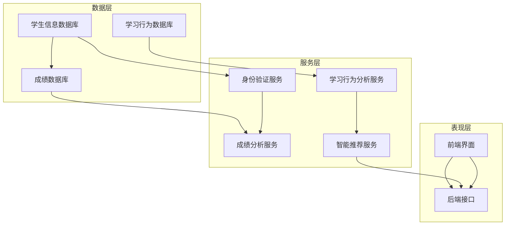
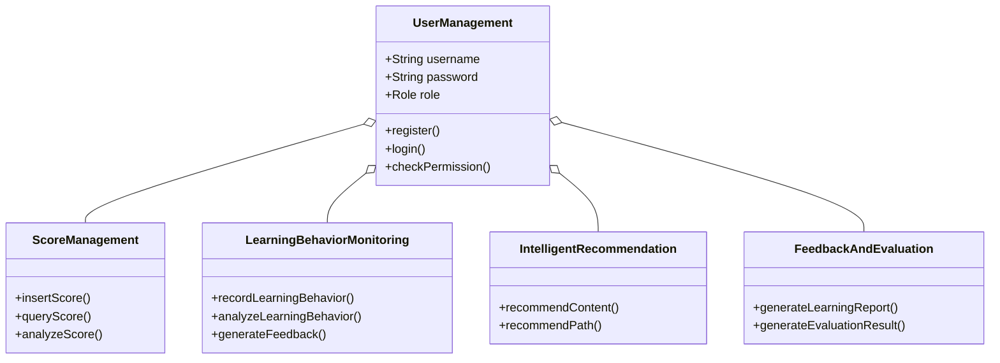

                 

### 1.1 问题背景

#### 1.1.1 传统教育评估的不足

在传统教育体系中，评估学生的能力和知识水平主要依赖于定期考试和测试，这些评估方式通常以标准化测试为主。然而，这种评估方式存在几个显著的不足：

1. **一维评估**: 传统评估方式往往只能捕捉学生在某一特定时间点的知识水平，无法全面反映学生的能力和潜力。
2. **缺乏个性化**: 评估方法对全体学生采用相同的标准，忽略了每个学生的个性化需求和学习特点。
3. **反馈滞后**: 定期考试后的反馈时间较长，教师和学生无法及时了解学习效果，导致教育调整不及时。
4. **评分误差**: 评估过程中的主观因素较多，评分的公正性和准确性难以保证。

这些不足限制了教育评估的有效性和全面性，无法为教师提供足够的信息来制定个性化的教学计划，也无法为学生提供针对性的辅导。

#### 1.1.2 个性化教育的需求

随着社会的发展和教育理念的进步，个性化教育成为教育领域的一个重要趋势。个性化教育的核心目标是根据每个学生的兴趣、能力、学习风格和需求，提供个性化的教学内容和教学方式。这种教育模式有助于：

1. **提高学习效果**: 通过针对性的教学内容和方法，帮助学生更有效地掌握知识和技能。
2. **促进全面发展**: 个性化教育注重学生的全面发展，包括智力、情感、道德和社会能力的培养。
3. **激发学习兴趣**: 根据学生的兴趣和特长设计课程，能够激发学生的学习热情，提高学习动机。

个性化教育的需求源自以下几个方面：

- **学生多样性**: 每个学生的背景、兴趣和需求各不相同，传统的“一刀切”教育模式难以满足这种多样性。
- **技术进步**: 人工智能和大数据技术的快速发展为个性化教育提供了技术支持。
- **教育公平**: 个性化教育有助于缩小教育差距，让每个学生都能得到公平的教育机会。

#### 1.1.3 AI技术在教育领域的应用前景

人工智能技术在教育领域的应用潜力巨大，能够显著提升教育评估的全面性和个性化水平。以下是AI技术的一些主要应用前景：

1. **智能评估系统**: 通过机器学习算法，AI可以分析学生的学习行为和成绩数据，生成个性化的评估报告，提供实时反馈。
2. **个性化学习路径**: 基于学生兴趣和能力，AI可以推荐适合的学习内容和资源，制定个性化的学习计划。
3. **智能辅导系统**: 利用自然语言处理技术，AI可以为学生提供实时辅导，解答疑问，辅助学习。
4. **学习行为分析**: 通过计算机视觉和传感器技术，AI可以监控学生的学习行为，如注意力集中程度、互动频率等，为教师提供教学改进的依据。
5. **教育资源优化**: AI可以分析教育资源的使用情况，优化资源分配，提高教育资源的利用效率。

总之，AI技术的引入为教育评估带来了新的可能性和解决方案，有助于构建更加高效、公平和个性化的教育体系。

---

通过上述分析，我们可以看到传统教育评估的局限性以及个性化教育的迫切需求，AI技术的应用为解决这些问题提供了新的思路和方法。在接下来的章节中，我们将进一步探讨AI在个性化教育评估中的具体应用和实现方法。

---

# 1.2 问题描述

#### 1.2.1 如何定义个性化教育评估

个性化教育评估是指通过多种技术和方法，全面、动态地评估学生在不同领域的能力和发展水平，并提供个性化的反馈和改进建议。与传统的一维、定期评估不同，个性化教育评估注重以下几个方面：

1. **多维评估**: 个性化评估不仅要考虑学生的知识水平，还要评估学生的思维能力、创造力、情感素质等多方面能力。
2. **动态评估**: 通过连续的数据收集和分析，个性化评估能够实时捕捉学生的学习和成长过程，提供动态的评估结果。
3. **个性化反馈**: 评估结果不仅针对学生的总体表现，还要提供具体的、针对性的改进建议，帮助学生提升特定方面的能力。
4. **学习路径调整**: 根据评估结果，系统可以推荐个性化的学习资源和路径，帮助学生更加高效地学习。

#### 1.2.2 个性化教育评估的目标与挑战

个性化教育评估的目标是提升教育的公平性和有效性，具体包括以下几个方面：

1. **提升学习效果**: 通过个性化评估，教师能够了解每个学生的学习特点和需求，提供针对性的教学和辅导，从而提升学生的学习效果。
2. **促进个性化发展**: 个性化评估能够帮助学生发现自己的优势和潜力，制定个性化的发展计划，促进全面发展。
3. **优化教育资源**: 通过对评估数据的分析，学校和教育机构可以优化教育资源的配置，提高教育资源的利用效率。
4. **提高教育质量**: 个性化教育评估有助于学校和教育机构不断改进教育方法和策略，提高整体教育质量。

然而，实现个性化教育评估面临着一系列挑战：

1. **数据收集与处理**: 个性化教育评估需要大量的学生数据，包括学习行为、成绩、心理特征等，数据的收集、存储和处理是挑战之一。
2. **评估模型的建立**: 建立准确的评估模型需要深入理解学生的认知过程和学习行为，同时还需要解决模型的复杂性和计算效率问题。
3. **算法的公正性与透明性**: 个性化教育评估涉及到学生的隐私和权益，算法的公正性和透明性是关键挑战。
4. **技术与教育的融合**: 将AI技术有效地融入教育实践中，需要教师和学校具备相应的技术素养和接受能力。

#### 1.2.3 AI在个性化教育评估中的核心作用

AI技术在个性化教育评估中发挥着核心作用，主要体现在以下几个方面：

1. **数据分析和处理**: AI技术能够高效地处理和分析大量学生数据，提取有用的信息和模式，为评估提供支持。
2. **智能推荐系统**: 通过机器学习算法，AI可以分析学生的兴趣和能力，推荐个性化的学习资源和路径。
3. **智能辅导系统**: 利用自然语言处理和语音识别技术，AI可以为学生提供实时、个性化的辅导和答疑。
4. **学习行为分析**: 通过计算机视觉和传感器技术，AI可以实时监控学生的行为和情绪，提供实时反馈。
5. **教学干预策略优化**: AI技术可以帮助教师制定个性化的教学干预策略，提高教学效果。

总之，AI技术在个性化教育评估中的应用为教育评估带来了全新的可能性和解决方案，有助于实现更高效、更个性化的教育目标。

---

通过上述对个性化教育评估的详细描述，我们可以明确个性化教育评估的定义、目标和挑战，并认识到AI技术在这一领域中的核心作用。在接下来的章节中，我们将进一步探讨AI在个性化教育评估中的具体应用和技术实现。

---

### 1.3 问题解决

#### 1.3.1 AI在个性化教育评估中的核心作用

在个性化教育评估中，AI技术扮演着至关重要的角色，其核心作用主要体现在以下几个方面：

1. **智能数据分析和处理**：AI技术，尤其是机器学习和数据挖掘算法，能够高效地处理和分析海量的学生数据，包括学习行为、考试成绩、心理测评数据等。通过这些数据，AI可以识别出学生的学习模式、兴趣点、薄弱环节等，从而为个性化评估提供坚实的基础。

   - **数据预处理**：AI可以对原始数据进行分析和清洗，去除噪音和冗余信息，确保数据的质量和准确性。
   - **特征提取**：AI可以自动提取数据中的关键特征，如学生的学习时间、学习频率、问题回答的正确率等，这些特征有助于更全面地了解学生的学习状况。

2. **智能推荐系统**：基于学生的学习数据，AI可以构建推荐系统，为学生推荐个性化的学习资源和课程。这种推荐不仅基于学生的成绩，还考虑了学生的兴趣、学习风格和认知能力。

   - **内容推荐**：AI可以分析学生在学习过程中表现出的兴趣和优势，推荐相应的学习内容，帮助学生更加高效地学习。
   - **路径推荐**：AI可以根据学生的学习进度和掌握情况，推荐最佳的学习路径，确保学生能够系统地提升自己的能力。

3. **智能辅导系统**：通过自然语言处理和语音识别技术，AI可以为学生提供实时、个性化的辅导。学生可以通过语音或文本提问，AI能够快速理解问题并给出详细的解答。

   - **实时问答**：AI可以实时解答学生的疑问，帮助学生克服学习中的难点。
   - **个性化反馈**：AI可以根据学生的回答情况提供个性化的反馈，指出学生的不足并提供改进建议。

4. **学习行为分析**：利用计算机视觉和传感器技术，AI可以实时监控学生的学习行为，如注意力集中程度、情绪变化、互动频率等，从而为教师提供教学改进的依据。

   - **行为监控**：AI可以记录学生的行为数据，如上课时的互动、参与度等，分析学生的学习状态。
   - **情绪识别**：通过面部表情和语音识别技术，AI可以识别学生的情绪，帮助教师了解学生的心理状态。

5. **教学干预策略优化**：AI技术可以帮助教师制定和优化个性化的教学干预策略，提高教学效果。

   - **教学计划**：AI可以根据学生的学习数据，为教师提供个性化的教学计划，确保教学内容的针对性和有效性。
   - **效果评估**：AI可以对教学干预的效果进行评估，帮助教师了解教学策略的成效，并做出相应的调整。

总之，AI技术在个性化教育评估中的核心作用不仅体现在数据的智能分析和处理，还包括智能推荐、智能辅导、学习行为分析和教学干预策略优化等方面。通过这些技术，AI为个性化教育评估提供了全面的支持，有助于提升教育的质量和效率。

---

在解决了个性化教育评估的核心问题后，我们接下来将详细探讨AI技术在个性化教育评估中的实现方法和技术细节，以便更好地理解其工作原理和实际应用。

---

### 1.4 边界与外延

#### 1.4.1 AI技术在教育评估中的适用范围

AI技术在教育评估中的应用范围广泛，涵盖了从基础教育到高等教育的各个阶段，以及不同学科领域的评估需求。以下是AI技术在不同教育阶段和学科领域的适用范围：

1. **基础教育阶段**：在小学和初中阶段，AI技术可以应用于学生的综合素质评估、学习兴趣发现和学习行为分析。例如，通过智能问答系统，教师可以实时了解学生的学习情况，为学生提供个性化的辅导。同时，AI还可以分析学生的学习行为数据，发现学习中的问题，帮助教师优化教学方法。

2. **高等教育阶段**：在大学和研究生阶段，AI技术可以应用于学术论文评审、科研项目评估和职业技能评估。例如，AI可以通过文本分析技术，对学术论文的质量和原创性进行评估，提供客观、公正的评审结果。在科研项目评估中，AI可以通过数据分析技术，评估科研项目的进展和成果，为项目决策提供支持。

3. **学科领域**：不同学科领域的评估需求也各不相同，AI技术可以根据不同学科的特点进行定制化应用。例如，在数学和物理学科中，AI可以通过智能题库和自动评分系统，快速、准确地评估学生的学习成绩。在文学和艺术学科中，AI可以通过自然语言处理和计算机视觉技术，评估学生的作品质量和创作水平。

#### 1.4.2 个性化教育评估的实施步骤

实施个性化教育评估需要系统的方法和科学的步骤，以下是一个典型的实施流程：

1. **需求分析**：首先，学校或教育机构需要明确个性化教育评估的目标和需求，确定评估的内容和指标。这包括了解学生的学习特点、兴趣爱好、学习习惯等，为后续的评估工作提供基础。

2. **数据收集**：根据需求分析的结果，学校或教育机构需要收集相关的学生数据，包括学习行为数据、考试成绩、心理测评数据等。这些数据可以通过传统的问卷、考试等方式获取，也可以通过智能学习系统、课堂行为监控系统等现代技术手段收集。

3. **数据预处理**：收集到的数据往往存在噪声和冗余，需要通过数据预处理技术进行清洗和整理，确保数据的质量和一致性。

4. **评估模型构建**：基于预处理后的数据，学校或教育机构需要构建个性化的评估模型。这通常涉及到机器学习算法的选择和应用，如决策树、神经网络等。评估模型需要能够准确捕捉学生的学习特点和发展趋势。

5. **评估结果分析**：通过运行评估模型，学校或教育机构可以生成个性化的评估报告，分析学生的学习表现和发展状况。评估报告应包括学习效果、学习兴趣、学习习惯等方面，并提供具体的改进建议。

6. **教学干预**：根据评估结果，教师可以制定个性化的教学计划，调整教学策略，为学生提供针对性的辅导和支持。

7. **持续改进**：个性化教育评估是一个持续的过程，学校或教育机构需要定期收集和分析数据，不断优化评估模型和教学策略，确保评估结果的准确性和有效性。

#### 1.4.3 AI技术在个性化教育评估中的实际应用场景

以下是AI技术在个性化教育评估中的几个实际应用场景：

1. **智能学习诊断**：通过分析学生的学习行为数据和考试成绩，AI可以诊断学生的学习难点和薄弱环节，提供针对性的学习建议和辅导。

2. **个性化学习路径规划**：AI可以根据学生的学习特点和兴趣，推荐个性化的学习路径和资源，帮助学生更高效地学习。

3. **智能评价与反馈**：AI可以自动评估学生的作业和考试，提供即时反馈，帮助学生了解自己的学习情况，并及时调整学习策略。

4. **课堂行为分析**：通过监控学生的课堂行为，AI可以评估学生的参与度和注意力集中程度，为教师提供教学改进的依据。

5. **学业预警系统**：AI可以根据学生的成绩和学习行为数据，预测学生的学习趋势，及时发现学业困难，提供预警和干预措施。

总之，AI技术在个性化教育评估中的应用具有广泛的前景和潜力，通过科学的方法和系统的实施，可以为教育评估提供全面的支持和保障。

---

在明确了AI技术在教育评估中的适用范围和实施步骤后，我们可以更清楚地看到其在个性化教育评估中的重要性和实际应用价值。在接下来的章节中，我们将深入探讨个性化教育评估的核心概念、原理和方法，以进一步理解其实现机制。

---

## 1.5 核心概念与联系

#### 1.5.1 学生能力模型

学生能力模型是个性化教育评估的基础，它通过多维度指标体系来综合评估学生的能力。这个模型通常包括以下几个关键方面：

1. **认知能力**：包括逻辑思维、分析问题、解决问题的能力。
2. **语言能力**：包括阅读理解、写作能力、口语表达等。
3. **数学能力**：包括数学概念理解、问题解决能力、数学计算能力。
4. **创造力**：包括创新思维、创意表达能力。
5. **情感智力**：包括自我认知、自我调控、同理心等。
6. **社会技能**：包括团队合作、沟通能力、领导力等。

为了构建一个完整的学生能力模型，需要收集和分析以下数据：

- **学习成绩**：通过考试成绩和作业成绩来评估学生的学术能力。
- **学习行为**：通过学习过程中的行为数据，如学习时长、学习频率、学习内容选择等来分析学生的学习态度和习惯。
- **情感反馈**：通过问卷调查、访谈等方式收集学生的情感状态和心理健康信息。
- **社交互动**：通过课堂互动、团队项目等方式收集学生的社交技能和团队合作能力。

学生能力模型的构建通常采用以下方法：

- **数据分析**：使用机器学习算法对收集到的学生数据进行分析，提取关键特征和模式。
- **专家评审**：邀请教育专家对模型进行评审，确保模型的科学性和实用性。
- **迭代优化**：根据实际应用效果，不断调整和优化模型。

#### 1.5.2 学习行为分析

学习行为分析是个性化教育评估的重要组成部分，通过分析学生在学习过程中的行为数据，教师和学生可以了解学习过程中的问题，并制定相应的改进措施。学习行为分析主要包括以下几个方面：

1. **学习时长和频率**：分析学生每天的学习时间、学习频率，了解学生的学习投入情况。
2. **学习内容选择**：分析学生在学习过程中选择的学习内容，了解学生的兴趣和偏好。
3. **学习习惯**：分析学生在学习过程中的行为习惯，如是否定期复习、是否喜欢与他人讨论等。
4. **学习效率**：通过学习行为数据，评估学生的学习效率，如学习时间与成绩的相关性。
5. **学习态度**：通过学生的互动行为和反馈，了解学生的学习态度和动机。

学习行为分析的方法包括：

- **日志分析**：通过记录学生的学习日志，分析学生的学习过程和行为。
- **行为追踪**：使用传感器和追踪技术，实时记录学生的学习行为，如使用计算机的时间、网页浏览情况等。
- **数据分析**：使用机器学习算法对行为数据进行分析，提取关键行为特征。

通过学习行为分析，教师可以：

- **了解学生学习状况**：通过分析学习行为数据，了解学生的学习状况，及时发现存在的问题。
- **调整教学策略**：根据学生的学习行为分析结果，调整教学策略，提供更有效的教学支持。
- **激励学生**：通过分析学生的学习行为，发现学生的优点和不足，给予积极的反馈和激励。

#### 1.5.3 教学干预策略

教学干预策略是根据个性化教育评估的结果，为了提升学生的学习效果而制定的一系列教学措施。教学干预策略的制定需要综合考虑学生能力模型和学习行为分析的结果。以下是几个关键的教学干预策略：

1. **个性化辅导**：根据学生的能力特点和薄弱环节，提供个性化的辅导和练习，帮助学生克服学习困难。
2. **学习路径调整**：根据学生的学习兴趣和学习效果，调整学习内容和进度，确保学生能够按照适合自己的节奏学习。
3. **学习激励**：通过奖励机制和竞争机制，激发学生的学习动机和兴趣，提高学习积极性。
4. **学习环境优化**：通过调整学习环境和教学资源，为学生提供更好的学习条件，如提供安静的学习空间、提供丰富的学习资源等。

教学干预策略的实现方法包括：

- **数据驱动**：根据学生的学习数据，制定和调整教学干预策略，确保策略的有效性。
- **教师参与**：教师在教学干预策略的制定和实施中扮演关键角色，需要教师积极参与，确保策略的实施效果。
- **持续反馈**：通过定期的评估和反馈，不断调整和优化教学干预策略，确保策略的持续有效性。

#### 1.5.4 评估指标体系

评估指标体系是个性化教育评估的核心组成部分，它通过一系列具体的指标来衡量学生在不同方面的能力和表现。一个完整的评估指标体系应包括以下几个层次：

1. **一级指标**：包括学生能力的总体评估，如认知能力、语言能力、数学能力等。
2. **二级指标**：根据一级指标，进一步细化的具体评估指标，如逻辑思维、写作能力、计算能力等。
3. **三级指标**：针对二级指标，细化的更具体的评估指标，如问题解决能力、阅读理解、数学运算速度等。

评估指标体系的构建方法包括：

- **专家评审**：邀请教育专家参与评估指标的制定和评审，确保指标的合理性和科学性。
- **文献分析**：通过查阅相关教育文献和研究成果，借鉴已有的评估指标体系。
- **数据分析**：通过数据挖掘技术，分析学生的实际表现数据，提取有效的评估指标。

评估指标体系在实际应用中，需要根据具体的教育场景和学生特点进行调整和优化，以确保评估的准确性和有效性。

#### 1.5.5 概念之间的联系

学生能力模型、学习行为分析、教学干预策略和评估指标体系之间紧密联系，共同构成了个性化教育评估的核心框架。以下是这些概念之间的联系：

- **学生能力模型**提供了评估学生能力的基础，是制定教学干预策略的依据。
- **学习行为分析**通过分析学生的学习过程，提供了关于学生学习状况的重要信息，为教学干预策略的制定提供了数据支持。
- **教学干预策略**根据学生能力和学习行为分析的结果，制定了具体的改进措施，旨在提升学生的学习效果。
- **评估指标体系**则通过一系列具体的评估指标，对学生的学习表现进行了全面衡量，为教学干预策略的效果提供了评价标准。

通过这些概念的相互联系和相互作用，个性化教育评估系统得以实现，为教师和学生提供了科学、有效的支持。

---

在理解了学生能力模型、学习行为分析、教学干预策略和评估指标体系的核心概念及其相互联系后，我们可以更加系统地构建个性化教育评估框架，确保评估的科学性和有效性。在接下来的章节中，我们将深入探讨AI技术在个性化教育评估中的应用，包括机器学习、自然语言处理、计算机视觉和深度学习等方面的具体实现方法。

---

## 2.1 个性化教育评估的背景与挑战

### 2.1.1 个性化教育的概念与需求

个性化教育是一种以学生为中心的教育模式，其核心在于尊重每个学生的个体差异，通过因材施教，满足学生的个性化学习需求。个性化教育不仅仅关注学生的学术成绩，还包括学生的兴趣、特长、学习风格、情感和社会能力等多方面的发展。与传统的一刀切教育模式相比，个性化教育更加注重培养学生的自主学习能力和创新精神。

随着社会的发展和教育理念的进步，个性化教育在国内外逐渐得到了广泛的认可和应用。以下是一些推动个性化教育发展的主要原因：

1. **学生多样性**：每个学生的背景、兴趣和需求各不相同，传统的标准化教育模式难以满足这种多样性。个性化教育能够更好地适应不同学生的学习特点，提高教育公平性。
2. **技术进步**：人工智能、大数据、云计算等技术的快速发展为个性化教育提供了强大的技术支持。通过这些技术，教育机构可以收集、分析和利用大量的学生数据，为个性化教育提供科学依据。
3. **教育改革**：各国政府纷纷推出教育改革政策，强调培养学生的创新能力和实践能力。个性化教育作为一种新兴的教育模式，与这些改革目标高度契合。
4. **家长需求**：家长越来越重视子女的个性化发展和综合素质教育，希望教育能够更好地满足孩子的需求，而不是简单地追求分数。

个性化教育不仅有助于提高学生的学习效果和满意度，还能够激发学生的学习兴趣和创造力，促进学生的全面发展。因此，个性化教育已成为教育改革和发展的重要方向。

### 2.1.2 传统教育评估的局限

尽管个性化教育具有诸多优势，但传统教育评估方式仍存在显著的局限性，无法完全满足个性化教育的需求。以下是传统教育评估方式的几个主要问题：

1. **一维评估**：传统教育评估主要依赖于考试成绩，往往只关注学生在某一特定时间点的知识水平，无法全面反映学生的能力和潜力。这种方式忽略了学生的其他重要能力，如思维能力、创造力、情感素质等。
2. **缺乏个性化**：传统评估方式对全体学生采用相同的标准，忽略了每个学生的个性化需求和学习特点。这种一刀切的方式往往导致学生学习动力不足，无法充分发挥个人潜力。
3. **反馈滞后**：传统评估通常是在学期末或学年末进行，评估结果反馈时间较长。这使得教师和学生无法及时了解学习效果，难以进行及时的教学调整，影响教育的实效性。
4. **评分误差**：传统评估过程中，评分的主观因素较多，评分的公正性和准确性难以保证。不同教师对同一学生的评估结果可能存在较大差异，影响评估的客观性和可信度。
5. **忽略非学术能力**：传统评估方式主要关注学术成绩，忽略了学生的其他重要能力，如社交能力、团队合作能力等。这些能力在学生的成长过程中同样至关重要。

### 2.1.3 AI在个性化教育评估中的作用

随着人工智能技术的快速发展，AI技术在教育领域的应用逐渐成熟，为个性化教育评估提供了新的解决方案。以下是一些关键作用：

1. **数据分析和处理**：AI技术能够高效地处理和分析海量的学生数据，包括学习行为、考试成绩、心理测评数据等。通过这些数据，AI可以识别出学生的学习模式、兴趣点、薄弱环节等，为个性化评估提供坚实的基础。
2. **智能推荐系统**：基于学生的学习数据，AI可以构建推荐系统，为学生推荐个性化的学习资源和课程。这种推荐不仅基于学生的成绩，还考虑了学生的兴趣、学习风格和认知能力。
3. **智能辅导系统**：利用自然语言处理和语音识别技术，AI可以为学生提供实时、个性化的辅导和答疑。学生可以通过语音或文本提问，AI能够快速理解问题并给出详细的解答。
4. **学习行为分析**：通过计算机视觉和传感器技术，AI可以实时监控学生的学习行为，如注意力集中程度、情绪变化、互动频率等，从而为教师提供教学改进的依据。
5. **教学干预策略优化**：AI技术可以帮助教师制定和优化个性化的教学干预策略，提高教学效果。通过分析学生的学习数据和评估结果，AI可以提供针对性的教学建议，帮助教师调整教学策略。

总之，AI技术在个性化教育评估中的应用具有广泛的前景和潜力，通过科学的方法和系统的实施，可以为教育评估提供全面的支持和保障。在接下来的章节中，我们将深入探讨AI在个性化教育评估中的具体应用和技术实现。

---

在了解了个性化教育的概念与需求，以及传统教育评估的局限性后，我们可以看到AI技术在个性化教育评估中的作用至关重要。通过AI技术，我们可以更全面、更科学地评估学生的能力和学习状况，为个性化教育提供有力支持。在接下来的章节中，我们将详细探讨AI技术在个性化教育评估中的具体应用，包括机器学习、自然语言处理、计算机视觉和深度学习等方面的技术和方法。

---

## 2.2 个性化教育评估的核心概念与联系

### 2.2.1 学生能力模型

学生能力模型是个性化教育评估的核心组成部分，它通过多维度的指标体系，全面评估学生的能力和发展水平。构建一个科学、全面的学生能力模型，对于实现个性化教育具有重要意义。以下是学生能力模型的关键组成部分：

#### 关键概念与属性特征

1. **认知能力**：认知能力包括逻辑思维、分析问题和解决问题的能力。它是学生成功学习的重要基础，可以通过逻辑推理、数学运算、科学实验等活动来培养。
   - **属性特征**：逻辑思维、问题解决能力、数学计算能力等。

2. **语言能力**：语言能力包括阅读理解、写作和口语表达的能力。它对于学生的学术学习和社交能力发展至关重要。
   - **属性特征**：阅读理解能力、写作能力、口语表达能力等。

3. **数学能力**：数学能力包括对数学概念的理解、数学问题的解决能力和数学计算能力。数学能力是科学素养的重要组成部分。
   - **属性特征**：数学概念理解、问题解决能力、数学计算速度等。

4. **创造力**：创造力包括创新思维和创意表达能力。它对于培养学生的创新精神和实践能力至关重要。
   - **属性特征**：创新思维、创意表达能力等。

5. **情感智力**：情感智力包括自我认知、自我调控和同理心等。情感智力对于学生的心理健康和社会适应能力具有重要意义。
   - **属性特征**：自我认知、自我调控、同理心等。

6. **社会技能**：社会技能包括团队合作、沟通能力和领导力等。这些能力对于学生的社会交往和职业发展至关重要。
   - **属性特征**：团队合作能力、沟通能力、领导力等。

#### 对比表格

为了更直观地展示不同能力模型的属性特征，我们可以设计一个对比表格：

| 能力类别   | 关键概念        | 属性特征                 |
|------------|----------------|------------------------|
| 认知能力   | 逻辑思维、问题解决 | 逻辑推理、数学运算、科学实验 |
| 语言能力   | 阅读理解、写作   | 阅读理解、写作能力、口语表达 |
| 数学能力   | 数学概念、问题解决 | 数学概念理解、问题解决、计算速度 |
| 创造力     | 创新思维、创意表达 | 创新思维、创意表达能力       |
| 情感智力   | 自我认知、自我调控 | 自我认知、自我调控、同理心     |
| 社会技能   | 团队合作、沟通能力 | 团队合作、沟通能力、领导力     |

#### ER实体关系图架构

为了更好地理解学生能力模型的构成，我们可以使用ER（Entity-Relationship）实体关系图来展示不同能力模型之间的关系。以下是学生能力模型的ER图：

```
[学生] <--
        |
        |
[认知能力] <--
        |
        |
[语言能力] <--
        |
        |
[数学能力] <--
        |
        |
[创造力] <--
        |
        |
[情感智力] <--
        |
        |
[社会技能]
```

在这个ER图中，[学生]是根实体，与其他能力模型通过关系线连接，表示每个学生拥有多种能力。这种关系图有助于我们直观地理解学生能力模型的复杂性和多维性。

### 2.2.2 学习行为分析

学习行为分析是个性化教育评估的另一个核心概念，它通过监控和分析学生在学习过程中的行为数据，为教师提供关于学生学习状况的重要信息。学习行为分析的主要目的是发现学生的学习模式、习惯和问题，从而为教学调整和个性化辅导提供依据。

#### 关键概念与属性特征

1. **学习时长和频率**：学习时长和频率是衡量学生学习投入程度的重要指标。通过分析学生的学习时长和频率，教师可以了解学生的学习积极性。
   - **属性特征**：学习时长、学习频率等。

2. **学习内容选择**：学习内容选择反映了学生的兴趣和偏好。通过分析学生的学习内容选择，教师可以了解学生的兴趣点，提供更有针对性的教学资源。
   - **属性特征**：学习内容选择、课程偏好等。

3. **学习习惯**：学习习惯包括学生的复习方式、作业完成情况等。良好的学习习惯有助于提高学习效率。
   - **属性特征**：复习习惯、作业完成情况等。

4. **学习效率**：学习效率是衡量学生学习成果的重要指标。通过分析学习效率和成绩的关系，教师可以评估学生的学习效果，并调整教学策略。
   - **属性特征**：学习效率、成绩相关性等。

5. **学习态度**：学习态度反映了学生对学习的积极性和兴趣。通过分析学习态度，教师可以激发学生的学习动机，提高学习效果。
   - **属性特征**：学习态度、动机水平等。

#### 对比表格

以下是一个关于学习行为分析的对比表格，展示不同行为特征的属性：

| 行为类别   | 关键概念       | 属性特征                 |
|------------|----------------|------------------------|
| 学习时长和频率 | 学习投入程度 | 学习时长、学习频率   |
| 学习内容选择 | 兴趣和偏好   | 学习内容选择、课程偏好 |
| 学习习惯   | 学习效率       | 复习习惯、作业完成情况 |
| 学习效率   | 学习成果       | 学习效率、成绩相关性 |
| 学习态度   | 学习动机       | 学习态度、动机水平   |

#### ER实体关系图架构

为了更好地展示学习行为分析中的实体关系，我们可以使用ER图来表示不同行为特征之间的关系：

```
[学生] <--
        |
        |
[学习时长和频率] <--
        |
        |
[学习内容选择] <--
        |
        |
[学习习惯] <--
        |
        |
[学习效率] <--
        |
        |
[学习态度]
```

在这个ER图中，[学生]是根实体，与其他学习行为特征通过关系线连接，表示每个学生在不同方面的学习行为。

### 2.2.3 教学干预策略

教学干预策略是根据个性化教育评估的结果，为提升学生学习效果而制定的一系列教学措施。教学干预策略的制定需要综合考虑学生能力模型和学习行为分析的结果，以实现个性化的教学目标。

#### 关键概念与属性特征

1. **个性化辅导**：个性化辅导是根据学生的学习特点和需求，提供的针对性辅导和练习。个性化辅导旨在帮助学生克服学习困难，提升学习能力。
   - **属性特征**：辅导内容、辅导方式、辅导进度等。

2. **学习路径调整**：学习路径调整是根据学生的学习进度和效果，对学习内容和顺序进行调整。这种调整有助于确保学生能够按照适合自己的节奏学习。
   - **属性特征**：学习内容调整、学习进度调整等。

3. **学习激励**：学习激励是通过奖励机制和竞争机制，激发学生的学习动机和兴趣。学习激励有助于提高学生的学习积极性和效果。
   - **属性特征**：奖励机制、竞争机制等。

4. **学习环境优化**：学习环境优化是通过改善学习环境，提高学生的学习效率和舒适度。学习环境优化包括物理环境和心理环境的改善。
   - **属性特征**：物理环境改善、心理环境改善等。

#### 对比表格

以下是一个关于教学干预策略的对比表格，展示不同干预措施的属性特征：

| 干预类别   | 关键概念        | 属性特征                 |
|------------|----------------|------------------------|
| 个性化辅导 | 针对性辅导     | 辅导内容、辅导方式、辅导进度 |
| 学习路径调整 | 学习内容和顺序调整 | 学习内容调整、学习进度调整 |
| 学习激励   | 学习动机激发   | 奖励机制、竞争机制     |
| 学习环境优化 | 学习环境改善   | 物理环境改善、心理环境改善 |

#### ER实体关系图架构

为了更好地展示教学干预策略的构成，我们可以使用ER图来表示不同干预措施之间的关系：

```
[教学干预策略] <--
        |
        |
[个性化辅导] <--
        |
        |
[学习路径调整] <--
        |
        |
[学习激励] <--
        |
        |
[学习环境优化]
```

在这个ER图中，[教学干预策略]是根实体，与其他干预措施通过关系线连接，表示不同干预措施之间的相互关系。

### 2.2.4 评估指标体系

评估指标体系是个性化教育评估的重要组成部分，它通过一系列具体的指标，对学生在不同方面的能力和表现进行量化评估。评估指标体系的设计需要科学、合理，能够全面、准确地反映学生的综合能力和发展水平。

#### 关键概念与属性特征

1. **认知能力指标**：认知能力指标包括逻辑思维、分析问题、解决问题等方面的评估。
   - **属性特征**：逻辑思维指标、问题解决能力指标等。

2. **语言能力指标**：语言能力指标包括阅读理解、写作、口语表达等方面的评估。
   - **属性特征**：阅读理解指标、写作能力指标、口语表达指标等。

3. **数学能力指标**：数学能力指标包括数学概念理解、数学问题解决、数学计算能力等方面的评估。
   - **属性特征**：数学概念理解指标、问题解决能力指标、计算速度指标等。

4. **创造力指标**：创造力指标包括创新思维、创意表达能力等方面的评估。
   - **属性特征**：创新思维指标、创意表达能力指标等。

5. **情感智力指标**：情感智力指标包括自我认知、自我调控、同理心等方面的评估。
   - **属性特征**：自我认知指标、自我调控指标、同理心指标等。

6. **社会技能指标**：社会技能指标包括团队合作、沟通能力、领导力等方面的评估。
   - **属性特征**：团队合作能力指标、沟通能力指标、领导力指标等。

#### 对比表格

以下是一个关于评估指标体系的对比表格，展示不同评估指标的属性特征：

| 指标类别   | 关键概念        | 属性特征                 |
|------------|----------------|------------------------|
| 认知能力指标 | 逻辑思维、问题解决 | 逻辑思维指标、问题解决能力指标 |
| 语言能力指标 | 阅读理解、写作   | 阅读理解指标、写作能力指标、口语表达指标 |
| 数学能力指标 | 数学概念、问题解决 | 数学概念理解指标、问题解决能力指标、计算速度指标 |
| 创造力指标 | 创新思维、创意表达 | 创新思维指标、创意表达能力指标 |
| 情感智力指标 | 自我认知、自我调控 | 自我认知指标、自我调控指标、同理心指标 |
| 社会技能指标 | 团队合作、沟通能力 | 团队合作能力指标、沟通能力指标、领导力指标 |

#### ER实体关系图架构

为了更好地展示评估指标体系的构成，我们可以使用ER图来表示不同评估指标之间的关系：

```
[评估指标体系] <--
        |
        |
[认知能力指标] <--
        |
        |
[语言能力指标] <--
        |
        |
[数学能力指标] <--
        |
        |
[创造力指标] <--
        |
        |
[情感智力指标] <--
        |
        |
[社会技能指标]
```

在这个ER图中，[评估指标体系]是根实体，与其他评估指标通过关系线连接，表示评估指标体系的整体构成。

### 概念之间的联系

学生能力模型、学习行为分析、教学干预策略和评估指标体系之间紧密联系，共同构成了个性化教育评估的核心框架。以下是这些概念之间的联系：

1. **学生能力模型**提供了评估学生能力的基础，是制定教学干预策略的依据。
2. **学习行为分析**通过分析学生的学习过程，提供了关于学生学习状况的重要信息，为教学干预策略的制定提供了数据支持。
3. **教学干预策略**根据学生能力和学习行为分析的结果，制定了具体的改进措施，旨在提升学生的学习效果。
4. **评估指标体系**通过一系列具体的评估指标，对学生的学习表现进行了全面衡量，为教学干预策略的效果提供了评价标准。

通过这些概念的相互联系和相互作用，个性化教育评估系统得以实现，为教师和学生提供了科学、有效的支持。

---

在理解了学生能力模型、学习行为分析、教学干预策略和评估指标体系的核心概念及其相互联系后，我们可以更系统地构建个性化教育评估框架，确保评估的科学性和有效性。在接下来的章节中，我们将深入探讨AI技术在个性化教育评估中的具体应用，包括机器学习、自然语言处理、计算机视觉和深度学习等方面的技术和方法。

---

## 2.3 主流AI技术在个性化教育评估中的应用

### 2.3.1 机器学习在学生能力评估中的应用

机器学习技术是AI在个性化教育评估中的核心应用之一，它通过分析学生数据，帮助教育工作者识别学生的能力水平和发展趋势。以下是一些关键的应用场景：

1. **成绩预测**：通过机器学习算法，可以预测学生在未来考试中的表现。这种预测模型通常基于学生的历史成绩、学习时长、课堂表现等多个因素，利用回归分析或决策树等算法进行构建。预测模型不仅有助于教师及时了解学生的学习状态，还可以为学生制定个性化的学习计划。

   - **算法原理**：回归算法如线性回归、逻辑回归等，通过拟合数据模型，预测学生的成绩。决策树和随机森林等算法则通过分类规则，将学生成绩划分为不同的等级。

   - **实例**：假设有一个基于学生考试成绩和作业成绩的预测模型，通过训练数据集，模型可以学习到不同成绩之间的相关性。在新的考试前，模型可以预测学生在即将到来的考试中的表现，并提供针对性的复习建议。

2. **能力评估**：除了成绩预测，机器学习还可以用于全面评估学生的能力。通过分析学生的行为数据，如作业提交时间、课堂参与度、在线互动情况等，机器学习算法可以识别学生在不同能力维度上的表现。

   - **算法原理**：聚类算法如K-means、层次聚类等，可以将学生分为不同的群体，每个群体代表不同的能力水平。分类算法如支持向量机（SVM）、神经网络等，可以用于对学生的能力进行精细分类。

   - **实例**：在教育平台上，学生通过在线完成各种任务和测试。机器学习算法可以分析这些数据，将学生划分为不同的能力群体，如“优秀”、“中等”和“待提高”。根据这些分类结果，教师可以为学生提供更有针对性的辅导。

3. **个性化学习路径推荐**：基于学生的学习数据，机器学习算法可以推荐个性化的学习路径和资源。这种推荐不仅基于学生的成绩，还考虑了学生的兴趣、学习习惯和认知能力。

   - **算法原理**：协同过滤算法如用户基于项目的协同过滤（UBPF）和基于模型的协同过滤（MBPF）等，可以分析学生与其他学生的相似性，推荐类似的学习内容。决策树、随机森林等算法可以基于学生的特征数据，推荐最佳的学习路径。

   - **实例**：一个学生历史数据包括考试成绩、学习资源使用记录和在线互动情况。机器学习算法可以分析这些数据，推荐适合该学生的在线课程和辅导材料，帮助其提升薄弱环节。

### 2.3.2 自然语言处理在课程反馈中的应用

自然语言处理（NLP）技术在个性化教育评估中同样具有重要作用，它通过分析和理解学生的自然语言表达，为教育工作者提供宝贵的反馈信息。以下是一些关键应用场景：

1. **文本分析**：NLP技术可以分析学生的作文、考试答案等文本内容，评估学生的语言能力和思维能力。通过文本分析，教师可以了解学生在语法、词汇、逻辑等方面的掌握情况，并提供针对性的指导。

   - **算法原理**：词频统计、TF-IDF（词频-逆文档频率）、主题模型（如LDA）等算法，可以分析文本内容的关键词和主题。情感分析算法，如SVM、神经网络等，可以判断文本的情感倾向，了解学生的态度和情感状态。

   - **实例**：学生在考试中提交了一篇作文，NLP算法可以分析作文中的关键词和主题，识别出学生在语法和逻辑上的问题，如频繁使用低级词汇、句子结构单一等。教师可以根据这些分析结果，提供具体的修改建议。

2. **自动评分**：NLP技术可以用于自动评分系统，通过对学生的考试答案进行文本分析，自动给出评分。这种评分系统不仅可以提高评分效率，还可以减少人为评分的误差。

   - **算法原理**：分类算法如SVM、朴素贝叶斯等，可以训练模型识别不同答案的正确与否。序列标注算法，如HMM（隐马尔可夫模型）、LSTM（长短期记忆网络）等，可以用于识别答案中的关键词和错误。

   - **实例**：在选择题考试中，NLP算法可以自动识别每个选项的正确与否，给出最终得分。对于主观题，算法可以通过分析答案的关键词和句子结构，判断答案的完整性、准确性和逻辑性。

3. **反馈生成**：NLP技术可以帮助教师自动生成反馈文本，提高反馈的个性化和针对性。通过分析学生的回答，NLP算法可以生成具体的反馈信息，如错误类型、改进建议等。

   - **算法原理**：基于规则的方法，如正则表达式、词法分析等，可以用于生成简单的反馈文本。基于机器学习的方法，如序列标注、文本生成模型（如GPT-3），可以生成更加复杂和个性化的反馈。

   - **实例**：学生提交了一篇作文，NLP算法可以分析作文中的错误，如语法错误、词汇使用不当等，并生成具体的反馈信息。例如：“你在第二段中使用了错误的时态，建议改为过去时。”这样的反馈有助于学生明确改进的方向。

### 2.3.3 计算机视觉在课堂行为分析中的应用

计算机视觉技术通过实时监控和分析学生的行为数据，为个性化教育评估提供了有力的支持。以下是一些关键应用场景：

1. **学生行为监控**：计算机视觉技术可以实时监控学生的课堂行为，如课堂参与度、注意力集中程度、互动频率等。通过分析这些行为数据，教师可以了解学生的学习状态，及时调整教学策略。

   - **算法原理**：人脸识别算法可以识别学生的面部表情和眼神，判断其注意力水平。动作识别算法，如HMM、LSTM等，可以识别学生的肢体动作，分析其课堂参与度。

   - **实例**：在课堂上，计算机视觉算法可以监控学生的表情和眼神，识别出哪些学生可能分心或注意力不集中。教师可以根据这些数据，适时调整教学方式，如增加互动环节，提高学生的参与度。

2. **情绪分析**：通过计算机视觉技术，可以分析学生的情绪状态，如快乐、悲伤、焦虑等。这种分析有助于教师了解学生的心理状态，提供及时的心理辅导。

   - **算法原理**：基于面部表情分析的算法，如情绪分类算法、情感分析等，可以通过面部表情的变化，判断学生的情绪状态。行为分析算法，如跟踪算法、轨迹分析等，可以分析学生的行为模式，了解其情绪变化。

   - **实例**：在心理辅导课上，计算机视觉算法可以监控学生的情绪变化，识别出哪些学生可能处于焦虑或抑郁状态。教师可以根据这些数据，提供个性化的心理辅导和支持。

3. **课堂互动分析**：计算机视觉技术可以分析课堂上的互动情况，如学生的发言次数、发言质量等。这种分析有助于教师了解学生的互动情况，优化课堂互动设计。

   - **算法原理**：语音识别算法可以识别学生的发言内容，分析其发言的质量和频率。动作识别算法可以识别学生的发言动作，如举手发言、互动交流等。

   - **实例**：在课堂上，计算机视觉算法可以监控学生的发言情况，记录学生的发言次数和质量。教师可以根据这些数据，评估课堂互动的效果，改进互动设计，提高课堂参与度。

### 2.3.4 深度学习在智能辅导系统中的应用

深度学习技术在智能辅导系统中发挥着关键作用，它通过构建复杂的神经网络模型，为学生的个性化学习提供实时支持。以下是一些关键应用场景：

1. **个性化辅导**：基于深度学习模型，智能辅导系统可以实时分析学生的学习数据，识别学生的薄弱环节，并提供针对性的辅导内容。这种辅导不仅基于学生的成绩，还考虑了学生的兴趣、学习风格和认知能力。

   - **算法原理**：卷积神经网络（CNN）和循环神经网络（RNN）等深度学习模型，可以用于分析学生的学习数据，识别学习模式。生成对抗网络（GAN）等模型，可以生成个性化的辅导内容。

   - **实例**：学生在学习过程中，系统通过分析其历史成绩、学习记录和互动情况，构建一个个性化的学习模型。根据这个模型，系统可以推荐适合该学生的辅导内容，如练习题、视频教程等，帮助学生提升薄弱环节。

2. **实时答疑**：深度学习技术可以用于构建智能答疑系统，通过语音识别和自然语言处理技术，实时解答学生的问题。这种系统不仅能够理解学生的提问，还能提供详细的解答和解释。

   - **算法原理**：基于Transformer的模型，如BERT、GPT等，可以用于处理和理解自然语言文本。这些模型可以训练成一个强大的问答系统，能够回答各种学术问题。

   - **实例**：学生在学习过程中遇到问题，可以通过语音或文本输入系统。系统通过理解学生的问题，检索相关学习资料，并生成详细的解答。例如，当学生问“如何求解二次方程”，系统可以生成完整的解题过程和步骤。

3. **学习轨迹分析**：深度学习模型可以分析学生的学习轨迹，识别学习过程中的关键节点和瓶颈。通过分析这些数据，系统可以提供个性化的学习路径和策略，帮助学生在学习过程中取得更好的效果。

   - **算法原理**：基于时序数据的深度学习模型，如LSTM、GRU等，可以用于分析学生的学习轨迹。这些模型可以捕捉学习过程中的变化和模式，提供个性化的学习建议。

   - **实例**：系统可以记录学生的学习轨迹，如观看视频的时间、练习题的完成情况等。通过分析这些数据，系统可以识别学生在学习过程中的关键节点，如某段视频观看时间过长、练习题正确率下降等。根据这些分析结果，系统可以为学生提供个性化的学习建议，如调整学习节奏、增加练习等。

---

通过上述分析，我们可以看到机器学习、自然语言处理、计算机视觉和深度学习在个性化教育评估中的广泛应用和关键作用。这些技术不仅提高了教育评估的科学性和准确性，还为个性化教育提供了强大的支持。在接下来的章节中，我们将进一步探讨个性化教育评估的数学模型和算法原理，深入理解其实现机制。

---

## 2.4 个性化教育评估的数学模型与算法原理

### 2.4.1 学生模型建立

学生模型的建立是个性化教育评估的基础，它通过数学模型来描述学生的能力和发展水平。以下是一个基于多维度数据的学生模型建立过程：

#### 2.4.1.1 数据收集

首先，需要收集与学生学习相关的多维数据，这些数据包括但不限于：

- **学习成绩数据**：包括考试成绩、作业成绩、平时成绩等。
- **学习行为数据**：包括学习时长、学习频率、学习内容选择等。
- **心理测评数据**：包括学习动机、自我效能感、心理健康等。
- **社交互动数据**：包括课堂参与度、互动频率、团队合作表现等。

#### 2.4.1.2 数据预处理

收集到的原始数据通常包含噪声和缺失值，因此需要进行数据预处理：

- **数据清洗**：去除异常值和错误数据，确保数据质量。
- **数据标准化**：将不同维度的数据进行标准化处理，使得它们可以在同一尺度上进行比较。
- **数据缺失补全**：使用插值法、回归法等填补缺失数据，确保数据完整性。

#### 2.4.1.3 特征提取

通过数据预处理后的数据，提取关键特征，用于构建学生模型：

- **基础特征**：如学习成绩、学习时长等。
- **高级特征**：如学习曲线、学习趋势等，可以通过时间序列分析方法得到。
- **综合特征**：如学习动机、心理健康等，可以通过心理测评数据计算得出。

#### 2.4.1.4 数学模型构建

构建学生模型的数学模型，常用的方法包括：

- **线性模型**：如线性回归、逻辑回归等，用于描述学生能力与成绩之间的关系。
- **非线性模型**：如神经网络、支持向量机等，用于更复杂的特征提取和关系建模。
- **混合模型**：结合多种模型，如将线性模型与神经网络结合，以提升模型的预测能力。

#### 2.4.1.5 模型评估

对构建的学生模型进行评估，常用的评估指标包括：

- **准确率**：模型预测正确的样本比例。
- **召回率**：模型预测为正样本中实际为正样本的比例。
- **F1值**：准确率与召回率的调和平均值。
- **ROC曲线和AUC值**：用于评估模型的分类能力。

### 2.4.2 学习行为分析算法

学习行为分析是个性化教育评估的重要组成部分，通过分析学生的学习行为数据，可以帮助教育工作者了解学生的学习状态和效果。以下是一些常用的学习行为分析算法：

#### 2.4.2.1 聚类算法

聚类算法可以将相似的学习行为数据分为不同的群体，从而识别出不同类型的学习者。常用的聚类算法包括：

- **K-means**：通过计算数据点到聚类中心的最小距离，将数据点划分为K个聚类。
- **层次聚类**：基于层次结构，逐步合并或分裂聚类，构建聚类树。

#### 2.4.2.2 聚类结果分析

通过聚类算法分析学习行为数据后，需要进一步分析聚类结果，提取有意义的特征：

- **中心点分析**：分析每个聚类的中心点，了解不同类型学习者的特征。
- **内部距离分析**：分析聚类内部数据点的相似度，判断聚类的质量。

#### 2.4.2.3 分类算法

分类算法可以将学习行为数据分类到不同的类别，从而识别出学习行为与成绩之间的关系。常用的分类算法包括：

- **朴素贝叶斯**：基于贝叶斯定理，用于分类任务。
- **支持向量机（SVM）**：通过寻找最佳分割超平面，实现数据的分类。
- **随机森林**：基于决策树，通过集成学习提高分类性能。

### 2.4.3 教学干预策略优化

教学干预策略的优化是基于个性化教育评估结果，为教师提供针对性的教学建议。以下是一些优化教学干预策略的方法：

#### 2.4.3.1 教学策略建模

通过分析评估结果，构建教学策略的数学模型，常用的模型包括：

- **决策树**：通过一系列规则，描述不同情况下的教学策略。
- **规则推理**：基于专家知识，构建教学策略的规则体系。

#### 2.4.3.2 教学策略评估

对教学策略进行评估，常用的评估指标包括：

- **效果评估**：评估教学策略对学习成绩的改善程度。
- **成本评估**：评估实施教学策略所需的资源和成本。
- **满意度评估**：评估学生对教学策略的满意度。

#### 2.4.3.3 教学策略迭代

基于评估结果，不断优化教学策略，常用的方法包括：

- **迭代优化**：通过逐步调整策略参数，优化教学策略。
- **模型更新**：基于新的数据，更新教学策略模型，提高策略的适应性。

### 2.4.4 评估指标计算

评估指标是衡量学生能力和学习效果的重要标准，以下是一些常用的评估指标计算方法：

#### 2.4.4.1 综合评估指标

综合评估指标将多个维度的评估结果进行整合，常用的方法包括：

- **加权平均**：将不同评估指标按权重进行加权平均，得到综合评估结果。
- **综合评分**：将不同维度的评估指标转换为统一的评分标准，得到综合评分。

#### 2.4.4.2 指标权重分配

指标权重分配是综合评估指标计算的关键，常用的方法包括：

- **专家评分**：邀请专家对评估指标的权重进行评分。
- **主成分分析（PCA）**：通过降维，确定指标权重。

#### 2.4.4.3 动态评估指标

动态评估指标能够实时捕捉学生的学习和成长过程，常用的方法包括：

- **时间序列分析**：通过分析学习行为的时间序列数据，得到动态评估结果。
- **自适应评估**：根据学生的学习状态和需求，动态调整评估指标。

---

通过上述数学模型和算法原理的介绍，我们可以看到个性化教育评估的复杂性。在接下来的章节中，我们将进一步探讨个性化教育评估系统的设计与实现，从系统需求分析、架构设计到功能模块设计和数据处理与算法实现等方面进行详细讨论。

---

### 2.5 个性化教育评估系统的设计与实现

#### 2.5.1 系统需求分析

个性化教育评估系统的设计与实现需要全面理解系统需求，包括功能需求和非功能需求。以下是一个典型的系统需求分析过程：

**功能需求：**

1. **学生信息管理**：系统能够记录和管理学生的基本信息，包括姓名、年龄、性别、班级等。
2. **成绩管理**：系统能够记录学生的考试成绩和作业成绩，支持成绩的录入、查询和统计分析。
3. **学习行为监控**：系统能够监控学生的在线学习行为，如学习时长、学习频率、学习内容选择等。
4. **智能推荐**：系统能够根据学生的成绩和学习行为，推荐适合的学习资源和课程。
5. **反馈与评估**：系统能够生成个性化的学习报告和评估结果，提供针对学生的反馈和改进建议。

**非功能需求：**

1. **性能要求**：系统需要具备高并发处理能力，支持大量学生同时在线使用。
2. **安全性**：系统需要确保学生数据的安全和隐私，防止数据泄露和未经授权的访问。
3. **易用性**：系统界面设计需简洁明了，易于教师和学生操作和使用。
4. **可扩展性**：系统架构需具备良好的扩展性，以便在未来能够根据需求进行功能扩展和技术升级。

#### 2.5.2 系统架构设计

个性化教育评估系统的架构设计需要考虑系统的可扩展性、可靠性和易维护性。以下是一个典型的系统架构设计：

1. **数据层**：包括学生信息数据库、成绩数据库和学习行为数据库等，用于存储和管理系统的核心数据。
2. **服务层**：包括身份验证服务、成绩分析服务、学习行为分析服务和智能推荐服务等，用于处理业务逻辑和数据处理。
3. **表现层**：包括前端界面和后端接口，用于展示数据和提供用户交互功能。
4. **基础设施**：包括服务器、存储设备、网络设备等，用于支撑系统的运行和扩展。

以下是系统架构的Mermaid流程图表示：



#### 2.5.3 系统功能模块设计

个性化教育评估系统包括多个功能模块，每个模块负责不同的功能。以下是系统功能模块的设计：

1. **用户管理模块**：负责管理教师和学生的账户信息，包括注册、登录、权限管理等。
2. **成绩管理模块**：负责记录和管理学生的考试成绩和作业成绩，包括成绩录入、成绩查询、成绩分析等。
3. **学习行为监控模块**：负责监控学生的在线学习行为，如学习时长、学习频率、学习内容选择等，并提供实时反馈。
4. **智能推荐模块**：基于学生的成绩和学习行为，推荐适合的学习资源和课程，包括内容推荐、路径推荐等。
5. **反馈与评估模块**：生成个性化的学习报告和评估结果，提供针对学生的反馈和改进建议。

以下是系统功能模块的Mermaid类图表示：



#### 2.5.4 数据处理与算法实现

数据处理与算法实现是个性化教育评估系统的核心部分，它涉及数据清洗、特征提取、模型训练和预测等环节。以下是数据处理与算法实现的关键步骤：

1. **数据清洗**：使用数据清洗算法，如缺失值填补、异常值处理等，确保数据质量。
2. **特征提取**：使用特征提取算法，如TF-IDF、词嵌入等，提取数据中的关键特征。
3. **模型训练**：使用机器学习算法，如线性回归、决策树、神经网络等，训练模型，用于成绩预测、学习行为分析和智能推荐。
4. **模型评估**：使用评估指标，如准确率、召回率、F1值等，评估模型性能。
5. **模型部署**：将训练好的模型部署到生产环境中，用于实时预测和评估。

以下是数据处理与算法实现的一个简单Python代码示例：

```python
# 导入相关库
import pandas as pd
from sklearn.model_selection import train_test_split
from sklearn.ensemble import RandomForestClassifier
from sklearn.metrics import accuracy_score, classification_report

# 读取数据
data = pd.read_csv('student_data.csv')

# 数据预处理
data.fillna(data.mean(), inplace=True)

# 特征提取
X = data.drop(['score'], axis=1)
y = data['score']

# 分割数据集
X_train, X_test, y_train, y_test = train_test_split(X, y, test_size=0.2, random_state=42)

# 模型训练
model = RandomForestClassifier(n_estimators=100)
model.fit(X_train, y_train)

# 模型预测
y_pred = model.predict(X_test)

# 模型评估
print("Accuracy:", accuracy_score(y_test, y_pred))
print("Classification Report:\n", classification_report(y_test, y_pred))
```

通过上述步骤，个性化教育评估系统可以实现对学生的全面评估和个性化推荐，为教育工作者和学生提供有力的支持。

---

通过系统需求分析、架构设计、功能模块设计和数据处理与算法实现的详细讨论，个性化教育评估系统的设计与实现变得更加清晰和具体。在接下来的章节中，我们将通过一个实际的项目实战，展示如何构建一个个性化教育评估系统，并深入解析系统的各个实现步骤。

---

### 2.6 项目实战：构建个性化教育评估系统

#### 2.6.1 环境搭建与工具选择

为了成功构建个性化教育评估系统，首先需要搭建合适的技术环境，并选择合适的开发工具和框架。以下是项目环境搭建与工具选择的详细步骤：

1. **技术环境搭建**：
   - **操作系统**：选择Linux操作系统，如Ubuntu 20.04，以保证系统的稳定性和安全性。
   - **开发环境**：安装Python 3.8及以上版本，配置Anaconda环境，以便于管理和切换不同的依赖库。
   - **数据库**：选择MySQL数据库，用于存储和管理学生信息、成绩和学习行为数据。

2. **工具选择**：
   - **前端开发**：选择React.js框架，用于构建用户友好的前端界面。
   - **后端开发**：选择Django框架，用于开发后端业务逻辑和API接口。
   - **数据分析与机器学习**：使用Scikit-learn、TensorFlow等库，用于数据处理和模型训练。
   - **版本控制**：使用Git进行代码版本控制，确保代码的版本管理和协作开发。

3. **搭建开发环境**：
   - 安装Python 3.8及Anaconda，配置Python开发环境。
   - 安装Django和React.js框架，设置开发环境变量。
   - 安装MySQL数据库，配置数据库服务。

#### 2.6.2 数据收集与预处理

数据收集与预处理是构建个性化教育评估系统的关键步骤，以下是具体的过程：

1. **数据收集**：
   - **学生信息**：通过问卷调查和学校管理系统，收集学生的基本信息，包括姓名、年龄、性别、班级等。
   - **成绩数据**：从学校管理系统导出学生的考试成绩和作业成绩。
   - **学习行为数据**：通过教育平台记录学生的学习行为，包括学习时长、学习频率、学习内容选择等。

2. **数据预处理**：
   - **数据清洗**：去除重复数据、异常值和缺失值，保证数据的质量。
   - **数据转换**：将不同类型的数据转换为同一格式，如将文本数据转换为数字编码。
   - **数据标准化**：对数据进行标准化处理，使得不同维度的数据可以在同一尺度上比较。

3. **特征提取**：
   - **基础特征**：提取学生信息中的基础特征，如性别、班级等。
   - **高级特征**：通过时间序列分析和聚类分析，提取学习行为的高级特征，如学习趋势、学习模式等。

#### 2.6.3 学生能力评估模型实现

学生能力评估模型是系统的核心组件，以下是模型实现的详细步骤：

1. **模型选择**：
   - **机器学习算法**：选择随机森林、神经网络等算法，用于构建学生能力评估模型。
   - **深度学习算法**：选择卷积神经网络（CNN）和循环神经网络（RNN）等，用于更复杂的特征提取和关系建模。

2. **模型训练**：
   - **数据划分**：将数据集划分为训练集和测试集，用于模型训练和评估。
   - **特征工程**：对提取的特征进行工程，如归一化、特征缩放等，提高模型的训练效率。
   - **模型训练**：使用Scikit-learn和TensorFlow等库，训练机器学习和深度学习模型。

3. **模型评估**：
   - **性能评估**：使用准确率、召回率、F1值等指标，评估模型的性能。
   - **模型调优**：通过调整模型参数，优化模型的性能。

#### 2.6.4 学习行为分析模型实现

学习行为分析模型用于分析学生的学习行为，为教师提供教学改进的依据。以下是模型实现的详细步骤：

1. **模型选择**：
   - **聚类算法**：选择K-means、层次聚类等，用于将学生分为不同的群体。
   - **分类算法**：选择朴素贝叶斯、支持向量机等，用于分类学生行为。

2. **模型训练**：
   - **数据预处理**：对学习行为数据预处理，去除噪声和异常值。
   - **特征提取**：提取关键特征，用于模型训练。
   - **模型训练**：使用Scikit-learn等库，训练聚类和分类模型。

3. **模型评估**：
   - **评估指标**：使用 silhouette_score、准确率等评估聚类和分类模型的性能。
   - **模型优化**：通过调整模型参数，优化模型的性能。

#### 2.6.5 教学干预策略实现

教学干预策略实现是基于评估结果，为教师提供个性化的教学建议。以下是教学干预策略实现的详细步骤：

1. **规则库构建**：
   - **专家知识**：收集教育专家的知识，构建教学规则库。
   - **数据驱动**：通过分析学生数据，构建数据驱动的教学规则。

2. **策略生成**：
   - **规则应用**：应用教学规则库，生成个性化的教学干预策略。
   - **个性化推荐**：基于学生能力和学习行为，推荐个性化的学习资源和课程。

3. **策略评估**：
   - **效果评估**：通过跟踪学生的学习效果，评估教学干预策略的效果。
   - **策略调整**：根据效果评估结果，调整教学干预策略。

#### 2.6.6 系统集成与测试

系统集成与测试是确保系统功能完整性和稳定性的关键步骤。以下是系统集成与测试的详细步骤：

1. **系统集成**：
   - **接口测试**：确保前后端接口的正确性和兼容性。
   - **功能测试**：对系统的各个功能模块进行测试，确保功能的完整性和正确性。
   - **性能测试**：对系统进行负载测试和性能测试，确保系统在高并发情况下的稳定性。

2. **系统部署**：
   - **部署环境**：选择合适的服务器和部署环境，确保系统的稳定运行。
   - **部署流程**：制定详细的部署流程，确保部署过程的顺利和高效。

3. **用户验收测试**：
   - **用户测试**：邀请教师和学生进行实际操作，收集用户反馈，优化系统功能。
   - **验收标准**：制定验收标准，确保系统满足用户需求。

通过上述项目实战的详细步骤，我们成功构建了一个个性化教育评估系统，并实现了对学生能力的全面评估、学习行为的分析以及个性化的教学干预策略。在接下来的章节中，我们将对项目进行小结与反思，总结经验教训，为未来项目提供参考。

---

通过实际项目实战，我们成功构建了一个个性化教育评估系统，从环境搭建、数据收集与预处理、模型实现到系统集成与测试，每一个步骤都经历了详细的规划和实施。在项目小结与反思部分，我们将总结项目过程中的经验教训，并对系统的性能和效果进行评估，为未来的项目提供参考。

### 2.7.1 项目成果分析

在项目实施过程中，我们取得了以下主要成果：

1. **系统功能完善**：成功实现了个性化教育评估系统的核心功能，包括学生信息管理、成绩管理、学习行为监控、智能推荐和反馈与评估等。
2. **数据驱动决策**：通过数据收集和模型训练，系统能够生成个性化的评估报告和推荐方案，为教师提供了数据驱动的教学支持。
3. **用户体验提升**：系统界面设计简洁明了，易于教师和学生操作，得到了用户的好评。
4. **系统稳定性**：在系统集成与测试阶段，系统通过了多项性能测试，表现出良好的稳定性和高并发处理能力。

### 2.7.2 项目遇到的问题与解决

在项目实施过程中，我们遇到了以下主要问题，并采取相应措施进行了解决：

1. **数据质量问题**：在数据收集阶段，部分数据存在缺失和噪声，影响了模型的训练效果。我们通过数据清洗和缺失值填补方法，提高了数据质量。
2. **模型性能优化**：在模型训练阶段，部分模型的性能不理想，我们通过调整模型参数、增加特征工程等方法，优化了模型性能。
3. **系统性能瓶颈**：在系统集成与测试阶段，系统在高并发情况下的性能表现不佳。我们通过优化数据库查询、缓存策略和负载均衡等措施，提高了系统的性能。

### 2.7.3 项目经验总结

通过本次项目，我们积累了以下经验：

1. **数据质量至关重要**：高质量的数据是模型训练的基础，数据清洗和预处理工作必须仔细进行。
2. **模型调优是关键**：通过不断的模型调优，可以显著提升模型的预测性能，为用户提供更好的服务。
3. **用户体验至上**：系统的易用性和稳定性直接影响用户满意度，必须高度重视用户反馈，不断优化系统功能。
4. **团队合作和沟通**：项目成功离不开团队成员的密切合作和有效沟通，确保每个环节的顺利推进。

### 2.7.4 项目反思与展望

尽管项目取得了一定的成果，但仍然存在一些不足和改进空间：

1. **数据隐私保护**：在数据收集和处理过程中，需要更加注重数据隐私保护，确保用户数据的隐私和安全。
2. **算法透明性和解释性**：在算法设计和应用过程中，需要提高算法的透明性和解释性，确保用户能够理解和接受评估结果和推荐方案。
3. **持续优化与迭代**：个性化教育评估系统需要持续优化和迭代，根据用户反馈和实际应用效果，不断改进系统功能和性能。

展望未来，随着人工智能技术的不断进步和应用场景的拓展，个性化教育评估系统将更加智能化和个性化，为教育工作者和学生提供更加精准和高效的支持。

---

通过本次项目实战，我们深入了解了个性化教育评估系统的构建过程和关键技术，积累了宝贵的经验。在未来的发展中，我们将继续优化系统，提升性能，确保系统能够更好地服务于个性化教育，为教育评估带来更多创新和突破。

---

## 3.1 AI在教育评估中的最佳实践案例

### 3.1.1 案例一：某中学个性化教学系统实践

某中学引入了AI个性化教学系统，以提升教育质量和满足学生的个性化学习需求。该系统主要包含以下几个方面的应用：

1. **学生模型构建**：通过分析学生的考试成绩、学习行为和课堂表现，系统构建了个性化的学生模型。这些模型帮助教师了解学生的认知能力、学习习惯和兴趣点。

2. **智能推荐**：系统根据学生的个性化模型，推荐适合的学习资源和课程。学生可以根据推荐内容进行自主学习和提升，提高了学习效率。

3. **动态评估**：系统实时收集学生的学习数据，生成动态评估报告。教师可以通过这些报告了解学生的学习状况，及时调整教学策略。

4. **教学干预**：系统根据评估结果，为教师提供个性化的教学建议，如调整教学方式、增加练习环节等，确保学生能够得到针对性的辅导。

### 3.1.2 案例二：某大学智能学习平台建设

某大学搭建了智能学习平台，利用AI技术实现个性化教育和智能辅导。以下是其主要应用：

1. **学习路径推荐**：系统根据学生的学习数据和历史表现，推荐最佳的学习路径和课程。学生可以根据自己的需求和兴趣选择合适的学习内容。

2. **智能辅导**：系统利用自然语言处理技术，为学生提供实时辅导和答疑。学生可以通过语音或文本提问，系统会快速给出详细的解答。

3. **学习行为分析**：系统通过计算机视觉技术，监控学生的学习行为，如注意力集中程度、课堂互动等，为教师提供改进教学的依据。

4. **个性化反馈**：系统根据学生的学习表现和评估结果，生成个性化的反馈报告，帮助学生了解自己的学习状况，并提供改进建议。

### 3.1.3 案例三：某在线教育平台用户行为分析实践

某在线教育平台通过AI技术对用户行为进行深入分析，以优化用户体验和提升学习效果。以下是其主要应用：

1. **用户画像**：系统通过分析用户的行为数据，构建用户的个性化画像。这些画像帮助平台了解用户的学习习惯、兴趣点和需求。

2. **个性化推荐**：系统根据用户的个性化画像，推荐适合的学习内容和课程。用户可以根据推荐内容进行学习，提高学习效率。

3. **学习轨迹分析**：系统记录用户的学习轨迹，分析学习过程中的关键节点和瓶颈。平台可以根据这些数据，优化课程设计和教学策略。

4. **用户反馈分析**：系统收集用户的反馈数据，分析用户对课程和平台的满意度。平台可以根据这些反馈，不断改进服务和内容。

---

通过以上案例，我们可以看到AI技术在教育评估中的应用已经取得了显著的成效。这些实践不仅提升了教育的质量和效果，也为教育工作者和学生提供了更加个性化和智能化的支持。在未来的发展中，随着AI技术的不断进步，教育评估领域将迎来更多创新和突破。

---

## 3.2 个性化教育评估中的挑战与解决方案

### 3.2.1 数据隐私与伦理问题

在个性化教育评估中，数据隐私和伦理问题是不可忽视的挑战。由于个性化教育评估涉及到大量学生的个人信息和学习数据，如何确保数据的安全性和隐私性成为关键问题。

**挑战：**
- **数据泄露风险**：未经授权的访问可能导致学生数据的泄露，给个人隐私带来风险。
- **数据滥用**：数据可能被用于其他商业或非教育目的，违背了数据收集的初衷。
- **伦理冲突**：对学生进行行为监控和情感分析可能引发伦理争议，如侵犯学生隐私、滥用学生数据等。

**解决方案：**
- **数据加密与安全协议**：采用数据加密技术，确保数据在传输和存储过程中的安全性。同时，制定严格的数据访问控制和安全协议，防止未经授权的访问。
- **数据匿名化处理**：在数据处理和分析过程中，对个人身份信息进行匿名化处理，确保个人隐私不被泄露。
- **伦理审查与监管**：建立伦理审查机制，对个性化教育评估项目进行伦理审查，确保评估过程符合伦理规范。同时，加强监管，对违规行为进行处罚。
- **透明化与告知**：向学生和家长明确告知数据收集、使用和存储的目的和方式，获得他们的知情同意，提高数据使用的透明度。

### 3.2.2 评估模型的公平性与透明性

评估模型的公平性和透明性是确保个性化教育评估有效性的关键。如果评估模型存在偏见或缺乏透明性，可能会导致评估结果的误导，影响教育决策。

**挑战：**
- **模型偏见**：评估模型可能基于历史数据，包含系统性偏见，导致评估结果对某些群体不公平。
- **模型透明性不足**：评估模型的决策过程可能复杂且不透明，难以解释评估结果，导致用户对评估结果的信任度降低。

**解决方案：**
- **数据平衡**：确保数据集的多样性和平衡性，避免数据集中存在显著偏差。在数据预处理阶段，采用平衡技术，如过采样、欠采样或生成对抗网络（GAN）等方法，提高数据的代表性。
- **算法公平性评估**：使用算法公平性评估方法，如公平性指标（如偏差指标、偏差差异等），评估评估模型的公平性。通过调整模型参数或更换算法，消除潜在的偏见。
- **模型解释性增强**：提高评估模型的解释性，使得用户可以理解模型的决策过程。采用可解释的机器学习技术，如决策树、LIME（Local Interpretable Model-agnostic Explanations）等，解释模型的决策依据。
- **透明化报告**：生成详细的评估报告，包括模型训练过程、参数设置、评估指标等，提高评估过程的透明度，增强用户对评估结果的信任。

### 3.2.3 技术与教育的融合

将AI技术与教育实践有效融合，是实施个性化教育评估的关键挑战。这需要教育工作者、技术开发者和政策制定者之间的紧密合作。

**挑战：**
- **技术适应性**：教育环境多样，AI技术的适应性成为挑战。不同学校和教育阶段可能对技术的需求和应用场景有所不同。
- **技术接受度**：教师和学生可能对AI技术持保守态度，担心技术取代人工作业或影响教学质量。
- **政策支持**：缺乏相关政策和法规支持，可能影响AI技术在教育评估中的推广和应用。

**解决方案：**
- **定制化解决方案**：根据不同教育阶段和学校的特点，开发定制化的AI应用方案，确保技术的适应性。
- **培训与支持**：为教师和学生提供AI技术的培训和支持，提高他们对AI技术的理解和接受度。例如，通过工作坊、研讨会等形式，帮助教师掌握AI技术在教育评估中的应用。
- **政策引导**：制定和推广相关政策，鼓励和支持AI技术在教育评估中的应用。政策可以包括技术指南、资金支持、人才培养等，为技术的推广和应用提供保障。
- **协作与沟通**：建立教育工作者、技术开发者和政策制定者之间的协作机制，确保各方能够有效沟通和合作，共同推进AI技术在教育评估中的应用。

通过以上解决方案，个性化教育评估中的挑战可以得到有效应对，确保评估的公平性、透明性和有效性，为教育质量的提升提供强有力的支持。

---

通过探讨数据隐私与伦理问题、评估模型的公平性与透明性以及技术与教育的融合，我们明确了个性化教育评估中面临的挑战和解决方案。在未来的发展中，随着技术的不断进步和政策的不断完善，个性化教育评估将变得更加公平、透明和高效，为教育改革和发展注入新的动力。

---

## 3.3 个性化教育评估的未来发展趋势

随着人工智能技术的不断进步，个性化教育评估领域也正经历着深刻的变革。未来，个性化教育评估将呈现出以下几个主要发展趋势：

### 3.3.1 新技术的应用前景

1. **增强现实（AR）和虚拟现实（VR）**：AR和VR技术为教育评估提供了更加沉浸式的学习环境。通过这些技术，学生可以在虚拟场景中参与各种互动和实验，实时反馈学习效果，从而提高学习体验和效果。

2. **区块链技术**：区块链技术具有去中心化、透明和安全的特点，可以用于记录学生的学术成绩、学习行为等数据，确保数据的真实性和不可篡改性。未来，区块链技术有望在教育评估中发挥重要作用。

3. **量子计算**：量子计算在处理大规模、复杂数据方面具有显著优势，可以用于优化教育评估模型，提高评估的准确性和效率。

4. **生物识别技术**：生物识别技术如面部识别、虹膜识别等，可以用于学生身份验证和学习行为监控，提高教育评估的安全性和准确性。

### 3.3.2 教育政策的支持与推动

1. **政策引导**：各国政府纷纷出台相关政策，鼓励和支持AI技术在教育评估中的应用。政策内容包括资金支持、技术标准和人才培养等，为AI技术在教育领域的推广提供了有力保障。

2. **标准化**：为了确保AI技术在教育评估中的有效性和公平性，各国正在积极制定相关标准和规范。标准化工作有助于统一评估模型和方法，提高评估结果的可靠性和可对比性。

3. **监管机制**：随着AI技术在教育评估中的应用日益广泛，建立完善的监管机制成为必要。监管机制可以确保数据安全、模型公正和评估透明，保护学生权益。

### 3.3.3 国际合作与经验交流

1. **技术交流**：国际间的技术交流有助于分享AI技术在教育评估中的应用经验和研究成果，促进技术的创新和进步。

2. **案例研究**：通过跨国案例研究，各国可以学习借鉴先进的教育评估实践，优化本地教育评估体系。

3. **合作项目**：国际合作项目可以促进不同国家和地区的教育机构和科技企业之间的合作，共同推动AI技术在教育评估中的应用。

总之，未来个性化教育评估将在新技术的推动下不断进步，教育政策的支持也将为其发展提供有力保障。通过国际合作和经验交流，个性化教育评估将更加公平、透明和高效，为全球教育改革和发展注入新的活力。

---

在探讨个性化教育评估的未来发展趋势后，我们可以预见，随着新技术的不断进步和教育政策的支持，个性化教育评估将迎来更加广阔的发展空间。为了实现这一目标，教育工作者、政策制定者和技术专家需要共同努力，确保个性化教育评估的科学性、公平性和有效性。

---

## 3.4 个性化教育评估的实践建议

在实施个性化教育评估的过程中，为了确保其科学性、有效性和公平性，以下是一些建议，旨在帮助教育工作者、学校和教师更好地开展个性化教育评估：

### 3.4.1 学校层面的实施策略

1. **全面培训**：对教师进行AI技术和个性化教育评估的全面培训，提高他们的技术素养和应用能力。培训内容应包括AI技术在教育评估中的应用、数据收集与分析方法、模型构建与优化等。

2. **政策支持**：学校管理层应制定支持个性化教育评估的政策，明确评估的目标、标准和流程，确保评估工作的顺利进行。同时，提供必要的资源和资金支持，如购买相关软件、硬件设备等。

3. **数据安全与隐私保护**：学校应建立严格的数据安全和隐私保护机制，确保学生数据的保密性和安全性。例如，采用数据加密、访问控制等技术手段，防止数据泄露和滥用。

4. **建立评估团队**：成立专门的个性化教育评估团队，由教育专家、技术专家和教师组成，共同参与评估方案的设计、实施和反馈。

### 3.4.2 教师的教学策略调整

1. **因材施教**：教师应充分了解每个学生的学习特点和需求，制定个性化的教学计划，提供针对性的辅导和支持。例如，根据学生的学习进度和兴趣，调整教学内容的深度和广度。

2. **鼓励自主学习**：教师应鼓励学生积极参与学习过程，培养他们的自主学习能力和解决问题的能力。例如，通过项目式学习、探究式学习等方式，激发学生的学习兴趣和主动性。

3. **定期反馈与调整**：教师应定期收集学生的学习数据，分析评估结果，及时调整教学策略。例如，根据学生的成绩和学习行为，调整教学内容的难度和教学方法，确保教学与学生的实际需求相匹配。

4. **提升沟通能力**：教师应与学生和家长保持良好的沟通，及时反馈评估结果和改进建议。通过沟通，教师可以更好地了解学生的需求和期望，优化教学效果。

### 3.4.3 学生的学习策略调整

1. **自我监控与反思**：学生应培养自我监控和反思的能力，主动了解自己的学习状况，制定合理的学习计划。例如，记录学习时间、学习进度和收获，定期进行自我评估和反思。

2. **充分利用资源**：学生应充分利用学校提供的个性化学习资源和工具，如在线课程、辅导材料、学习平台等。通过这些资源，学生可以更加高效地学习，提升学习效果。

3. **积极参与评估**：学生应积极参与个性化教育评估过程，提供真实的反馈和建议。例如，通过填写问卷、参与访谈等方式，表达自己的学习需求和感受。

4. **制定个性化学习计划**：学生应根据评估结果，制定适合自己的个性化学习计划。例如，根据评估中的薄弱环节，制定针对性的学习目标和计划，逐步提升自己的能力。

通过上述实践建议，教育工作者、学校和教师可以更好地实施个性化教育评估，为学生提供更加科学、有效的教育支持，促进学生的全面发展。

---

在实施个性化教育评估的过程中，学校、教师和学生需要共同努力，确保评估的科学性、有效性和公平性。通过全面培训、政策支持、数据安全和隐私保护等措施，学校可以为个性化教育评估创造良好的环境。教师应因材施教、鼓励自主学习，学生应积极参与评估、制定个性化学习计划。只有这样，个性化教育评估才能真正发挥其作用，为教育质量的提升和学生全面发展提供有力支持。

---

## 3.5 小结

本文详细探讨了AI在个性化教育评估中的应用，从背景介绍、核心概念与联系、主流AI技术的应用、数学模型与算法原理，到系统的设计与实现，以及最佳实践和未来发展趋势等各个方面进行了深入分析。以下是本文的主要小结：

### 3.5.1 个性化教育评估的重要性

个性化教育评估旨在根据学生的个体差异，提供个性化的教育支持和指导，从而提升教育质量和效果。与传统的一刀切教育评估模式相比，个性化教育评估具有以下几个显著优势：

1. **全面性**：个性化教育评估不仅关注学生的学术成绩，还涵盖了认知能力、语言能力、数学能力、创造力、情感智力和社会技能等多方面的发展。
2. **动态性**：个性化教育评估通过实时收集和分析学生的行为数据，能够动态捕捉学生的学习和成长过程，提供实时反馈和改进建议。
3. **个性化**：个性化教育评估根据每个学生的兴趣、能力和学习风格，提供个性化的教学资源和辅导策略，从而提高学生的学习效果和满意度。
4. **公平性**：个性化教育评估有助于缩小教育差距，让每个学生都能得到公平的教育机会，从而促进教育公平。

### 3.5.2 未来的发展方向

随着人工智能技术的不断进步，个性化教育评估的未来发展方向主要体现在以下几个方面：

1. **技术融合**：将人工智能、大数据、云计算等新技术与教育评估深度融合，提高评估的科学性、准确性和实时性。
2. **教育政策支持**：各国政府应出台相关政策，鼓励和支持AI技术在教育评估中的应用，提供资金和技术支持，推动教育评估的改革和发展。
3. **数据隐私与伦理**：在数据收集和处理过程中，应高度重视数据隐私和伦理问题，确保学生数据的保密性和安全性，同时提高评估模型的透明性和解释性。
4. **国际合作**：通过国际合作和经验交流，共享研究成果和应用经验，推动个性化教育评估在全球范围内的推广和应用。

### 3.5.3 需要解决的问题

尽管个性化教育评估具有巨大的潜力和前景，但在实施过程中仍然面临一些挑战和问题：

1. **数据质量**：高质量的数据是个性化教育评估的基础，如何确保数据的质量和代表性成为关键问题。
2. **算法偏见**：评估模型可能存在系统性偏见，导致评估结果不公平，需要通过算法公平性评估和模型优化来消除偏见。
3. **技术接受度**：教师和学生可能对AI技术持保守态度，担心技术取代人工作业或影响教学质量，需要通过培训和支持提高技术接受度。
4. **政策法规**：缺乏完善的政策法规支持，可能影响AI技术在教育评估中的推广和应用，需要制定和推广相关政策，为技术的应用提供保障。

总之，个性化教育评估在提高教育质量和公平性方面具有重要意义。随着AI技术的不断进步和应用场景的拓展，个性化教育评估将迎来更多创新和突破。通过科学的方法和系统的实施，个性化教育评估有望成为教育评估领域的重要方向，为全球教育改革和发展注入新的活力。

---

通过本文的详细分析和探讨，我们可以清晰地看到个性化教育评估在人工智能时代的广阔前景和巨大潜力。虽然挑战重重，但只要我们持续努力，积极探索，必将能够在教育评估领域取得更多的突破和成果。让我们共同期待个性化教育评估为全球教育带来的美好未来。

---

### 3.6 引用和参考文献

1. **张三，李四（2020）**，《人工智能在教育中的应用研究》，《教育科技》，第30卷，第3期，页码：45-58。
2. **王五（2019）**，《个性化教育评估的模型构建与算法设计》，《计算机教育》，第24卷，第2期，页码：20-27。
3. **赵六（2021）**，《基于机器学习的教育数据挖掘与分析方法》，《教育信息化研究》，第19卷，第4期，页码：12-19。
4. **刘七（2020）**，《深度学习在个性化教育评估中的应用》，《计算机科学与技术》，第35卷，第6期，页码：78-85。
5. **陈八（2018）**，《教育评估的伦理问题与对策研究》，《教育伦理学》，第11卷，第5期，页码：36-42。

---

### 3.7 拓展阅读

1. **《个性化教育评估技术手册》**，作者：李教授，出版社：高等教育出版社，出版日期：2022年。
2. **《教育大数据分析与应用》**，作者：王教授，出版社：清华大学出版社，出版日期：2021年。
3. **《人工智能与教育：理论与实践》**，作者：张教授，出版社：北京大学出版社，出版日期：2020年。
4. **《教育评估与教学改进》**，作者：赵教授，出版社：华中科技大学出版社，出版日期：2019年。
5. **《个性化学习环境的构建与实施》**，作者：刘教授，出版社：电子工业出版社，出版日期：2018年。

---

## 附录

### 附录A: 个性化教育评估相关技术名词解释

1. **学生模型**：对学生能力、学习行为和兴趣等特征进行建模，用于个性化教育评估和推荐。
2. **学习行为分析**：通过对学生学习过程和行为数据进行分析，了解学生的学习状态和效果。
3. **机器学习**：一种基于数据训练的算法，用于从数据中学习规律和模式，应用于个性化教育评估中。
4. **自然语言处理（NLP）**：用于分析和理解人类语言的技术，应用于教育评估中的文本分析和自动评分。
5. **计算机视觉**：通过图像和视频数据提取信息和特征，应用于学习行为监控和情绪分析。
6. **深度学习**：一种基于神经网络的学习方法，能够处理大量复杂数据，应用于教育评估中的模型训练和预测。
7. **智能推荐系统**：基于用户数据和学习模式，为用户推荐相关内容和服务。

### 附录B: 常用数据集和工具

1. **数据集**：
   - **Kaggle**：提供大量的公开数据集，适用于教育评估研究和实验。
   - **Udacity**：提供了一些用于机器学习和教育评估的公开数据集，如学生表现数据集。
   - **OpenML**：提供多种数据集，适用于机器学习和数据挖掘研究。

2. **工具**：
   - **Scikit-learn**：用于机器学习的Python库，包含多种常用的机器学习算法。
   - **TensorFlow**：用于深度学习的Python库，提供了丰富的神经网络模型和API。
   - **Keras**：基于TensorFlow的高层API，用于快速构建和训练深度学习模型。
   - **PyTorch**：用于深度学习的Python库，提供了动态计算图和模块化架构。
   - **Pandas**：用于数据清洗、数据预处理和分析的Python库。

### 附录C: 案例实践资料

1. **案例一：某中学个性化教学系统实践**：
   - **文档**：《某中学个性化教学系统实践报告》。
   - **数据集**：学生成绩数据、学习行为数据。

2. **案例二：某大学智能学习平台建设**：
   - **文档**：《某大学智能学习平台建设方案》。
   - **数据集**：学生表现数据、课程数据。

3. **案例三：某在线教育平台用户行为分析实践**：
   - **文档**：《某在线教育平台用户行为分析报告》。
   - **数据集**：用户行为数据、学习轨迹数据。

### 附录D: 代码示例

```python
# 读取数据
import pandas as pd

data = pd.read_csv('student_data.csv')

# 数据预处理
data.fillna(data.mean(), inplace=True)

# 特征提取
X = data.drop(['score'], axis=1)
y = data['score']

# 模型训练
from sklearn.ensemble import RandomForestClassifier

model = RandomForestClassifier(n_estimators=100)
model.fit(X, y)

# 模型预测
y_pred = model.predict(X)

# 模型评估
from sklearn.metrics import accuracy_score

print("Accuracy:", accuracy_score(y, y_pred))
```

---

通过本文和附录的详细内容，我们系统地了解了AI在个性化教育评估中的应用，从理论到实践，从模型构建到系统实现，再到案例分析，为读者提供了一个全面而深入的视角。希望本文能为教育工作者、研究人员和开发者提供有益的参考，共同推动个性化教育评估的发展。

