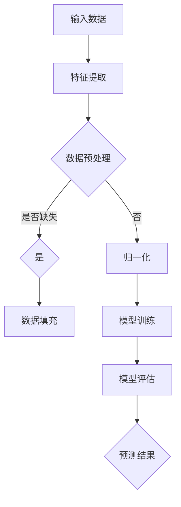
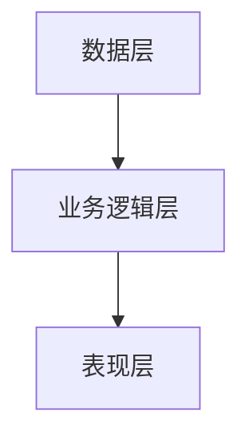
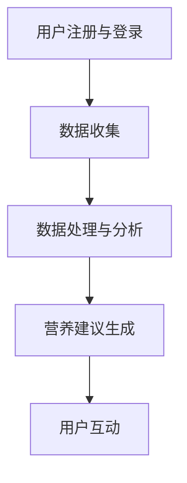
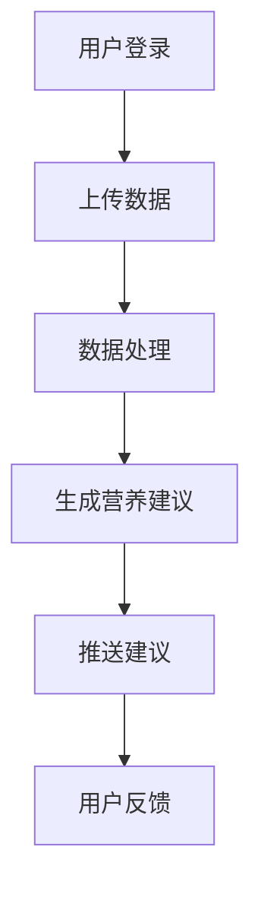

                 

### 第一部分: AI在个性化营养建议中的应用背景

#### 1.1 问题背景

**1.1.1 健康问题与营养需求的个性化差异**

在现代社会，健康问题日益突出，营养摄入的个性化需求变得尤为关键。每个人的身体状况、生活方式、遗传背景、生活习惯等都存在显著差异，这使得传统的“一刀切”营养建议难以满足个体的健康需求。例如，同一种食物对于有些人可能是营养丰富的，而对于另一些人则可能导致过敏或不耐受。因此，如何根据个人实际情况提供个性化的营养建议，成为亟待解决的问题。

**1.1.2 数据在个性化营养建议中的作用**

个性化营养建议的提出依赖于大量的数据支持。这些数据包括但不限于个体的生物信息、饮食习惯、生活习惯、遗传信息、生理指标等。通过对这些数据的收集、整理和分析，可以了解个体的营养需求，从而提出精准的营养建议。例如，通过健康监测设备收集的生理数据，如血压、血糖、心率等，可以实时反映个体的健康状况，进而调整营养摄入。

**1.1.3 AI在个性化营养建议中的应用潜力**

人工智能（AI）技术的发展为个性化营养建议提供了新的可能性。AI能够处理和分析海量数据，从中提取有价值的信息，辅助医生和营养师为个体提供精准的营养建议。例如，机器学习算法可以分析个体历史数据，预测未来的健康风险，提前进行营养干预。此外，AI还可以通过自然语言处理（NLP）技术，理解和解释用户的营养需求，提供更加人性化的服务。

#### 1.2 核心概念与联系

**1.2.1 人工智能基本概念**

人工智能（AI）是指由人制造出来的系统能够执行原本需要人类智能才能完成的任务，包括学习、推理、规划、感知、理解自然语言等。AI的核心技术包括机器学习、深度学习、自然语言处理等。

**1.2.2 个性化营养概念**

个性化营养是指根据个体的身体状况、生活方式、遗传背景等，为其制定独特的营养摄入方案。个性化营养的核心在于精准性和个性化，通过数据分析和算法，为个体提供最适合其需求的营养建议。

**1.2.3 数据分析与机器学习在营养建议中的应用**

数据分析是指通过统计和数学方法，从数据中提取有价值的信息。机器学习是数据分析的一种方法，它使计算机系统能够从数据中学习和预测。在个性化营养建议中，数据分析与机器学习可以帮助分析个体数据，识别健康风险，预测营养需求，提供精准的营养建议。

#### 1.3 个性化营养建议的边界与外延

**1.3.1 个性化营养建议的范围**

个性化营养建议的范围包括饮食指导、营养补充、饮食习惯调整等。具体来说，个性化营养建议可以针对个体提供营养摄入计划，帮助其调整饮食结构，补充所需的营养素，优化饮食习惯。

**1.3.2 个性化营养建议的技术限制**

个性化营养建议虽然具有巨大的潜力，但同时也面临一些技术限制。例如，数据的准确性、完整性和时效性直接影响个性化营养建议的准确性。此外，算法的复杂性和计算能力也是限制因素。

**1.3.3 个性化营养建议的社会影响**

个性化营养建议对社会健康有着积极的影响。通过提供精准的营养建议，可以降低慢性病的发生率，提高公共健康水平。同时，个性化营养建议还可以促进健康产业的发展，创造新的就业机会。

#### 1.4 概念结构与核心要素组成

**1.4.1 数据收集与处理**

数据收集是个性化营养建议的基础。通过健康监测设备、在线问卷、医疗记录等多种方式收集个体数据，如生物信息、饮食习惯、生活习惯、遗传信息等。数据处理包括数据清洗、归一化、特征提取等步骤，以获取高质量的数据用于后续分析。

**1.4.2 特征提取与模式识别**

特征提取是指从数据中提取有助于分析和预测的关键特征。模式识别是指通过算法识别数据中的规律和模式，用于预测个体未来的健康状态和营养需求。

**1.4.3 模型训练与预测**

模型训练是指使用机器学习算法，从历史数据中训练模型，使其能够学习和预测个体的营养需求。预测是指使用训练好的模型，对个体未来的健康状况和营养需求进行预测，为个性化营养建议提供依据。

#### 1.5 本章小结

本文介绍了AI在个性化营养建议中的应用背景，包括健康问题与营养需求的个性化差异、数据在个性化营养建议中的作用以及AI在个性化营养建议中的应用潜力。同时，分析了核心概念与联系，如人工智能基本概念、个性化营养概念和数据分析与机器学习在营养建议中的应用。此外，探讨了个性化营养建议的边界与外延，以及其概念结构与核心要素组成。这些背景信息的梳理为后续章节的深入讨论奠定了基础。接下来，我们将进一步探讨个性化营养建议的数据基础。

----------------------------------------------------------------

### 第一部分: AI在个性化营养建议中的应用背景

**1.5 本章小结**

在现代社会，随着健康问题的日益突出，个性化营养建议的需求变得愈发迫切。本文介绍了AI在个性化营养建议中的应用背景，包括健康问题与营养需求的个性化差异、数据在个性化营养建议中的作用以及AI在个性化营养建议中的应用潜力。通过梳理核心概念与联系，如人工智能基本概念、个性化营养概念和数据分析与机器学习在营养建议中的应用，我们明确了个性化营养建议的边界与外延，并分析了其概念结构与核心要素组成。

本文的主要贡献在于为后续章节的深入讨论提供了坚实的基础。首先，通过对健康问题与营养需求的个性化差异的讨论，我们认识到传统营养建议的局限性，以及个性化营养建议的必要性和紧迫性。其次，通过分析数据在个性化营养建议中的作用，我们了解了数据收集、处理以及分析的重要性。最后，通过探讨AI在个性化营养建议中的应用潜力，我们认识到AI技术在这一领域的重要性和前景。

然而，本文也存在一些局限性。首先，由于篇幅和主题的限制，本文未能详细讨论所有相关的技术细节和应用案例。其次，个性化营养建议涉及多个学科领域，包括医学、营养学、计算机科学等，本文的讨论主要集中于计算机科学的角度，可能未能全面涵盖其他领域的贡献和挑战。最后，尽管本文对个性化营养建议的概念结构与核心要素组成进行了分析，但实际应用中可能存在更多的变量和复杂性，需要进一步的研究和实践。

未来工作将集中在以下几个方面：首先，进一步探讨和优化个性化营养建议的算法和技术，以提高其准确性和实用性。其次，加强跨学科合作，结合医学、营养学等多领域的知识，为个性化营养建议提供更加全面和精准的解决方案。最后，通过大规模应用和实证研究，验证个性化营养建议的有效性和可行性，推动其在公共卫生和健康领域的广泛应用。

----------------------------------------------------------------

### 第二部分: 个性化营养建议的数据基础

#### 2.1 数据收集与处理

**2.1.1 营养数据类型**

个性化营养建议的数据基础包括多种类型的数据，这些数据可以大致分为以下几类：

1. **生理数据**：包括体重、身高、血压、心率、血糖、胆固醇等。这些数据通过健康监测设备、智能手机应用、可穿戴设备等收集。

2. **饮食数据**：包括日常饮食中的营养成分、食物种类、摄入量等。这些数据可以通过饮食日志、问卷、智能手机应用等方式收集。

3. **生活方式数据**：包括运动习惯、睡眠质量、工作压力、心理状态等。这些数据可以通过问卷调查、自我报告、生理监测等方式收集。

4. **遗传数据**：包括个体的基因序列、遗传特征等。这些数据可以通过基因检测、家庭病史记录等方式收集。

**2.1.2 数据收集方法**

1. **直接监测**：使用各种传感器和设备，如智能手环、智能秤、血糖仪等，直接监测个体的生理指标和活动情况。

2. **用户报告**：通过问卷调查、日志记录等方式，让用户自行报告他们的饮食、生活方式和健康状态。

3. **医疗记录**：从医疗记录、体检报告等官方渠道获取个体的健康数据。

**2.1.3 数据预处理与清洗**

数据预处理是确保数据质量的关键步骤，主要包括以下内容：

1. **数据清洗**：去除重复数据、纠正错误数据、填补缺失数据。例如，对于缺失的体重数据，可以采用平均值或最近观测值来填补。

2. **数据归一化**：将不同来源和类型的数据进行归一化处理，使其具有相同的量纲和范围，便于后续分析。

3. **特征提取**：从原始数据中提取对营养建议有重要影响的关键特征，如营养素的摄入量、血糖水平等。

4. **数据整合**：将不同来源的数据进行整合，形成一个统一的数据集，用于后续分析和建模。

#### 2.2 数据分析与特征提取

**2.2.1 数据分析技术**

数据分析是提取数据价值的重要环节，主要包括以下技术：

1. **描述性统计**：通过计算均值、方差、中位数等统计量，对数据的基本特征进行描述。

2. **相关性分析**：分析不同变量之间的相关性，找出可能影响营养建议的关键因素。

3. **聚类分析**：将数据按照相似性进行分类，形成不同的群体，为个性化营养建议提供依据。

4. **回归分析**：通过建立回归模型，预测个体未来的营养需求。

**2.2.2 特征选择与提取**

1. **特征选择**：从大量特征中挑选出对营养建议最有影响力的特征。常用的方法包括特征重要性评估、信息增益等。

2. **特征提取**：将原始特征转换为对营养建议更具解释性的特征。例如，将多个营养素的摄入量合并为一个整体的营养摄入指数。

**2.2.3 数据可视化**

数据可视化是将数据以图形的方式展示，帮助人们更好地理解和分析数据。常用的可视化方法包括柱状图、折线图、散点图、热力图等。

#### 2.3 模式识别与分类

**2.3.1 机器学习算法简介**

机器学习是数据分析的一种重要方法，它通过从数据中学习规律和模式，实现对未知数据的预测和分类。常见的机器学习算法包括：

1. **监督学习算法**：例如线性回归、决策树、支持向量机等。

2. **无监督学习算法**：例如聚类算法、主成分分析等。

3. **深度学习算法**：例如卷积神经网络（CNN）、循环神经网络（RNN）、生成对抗网络（GAN）等。

**2.3.2 分类算法应用**

分类算法是将数据分为不同类别的方法，适用于营养需求的预测和评估。常见的分类算法包括：

1. **K-最近邻算法（KNN）**：根据数据点的邻居进行分类。

2. **逻辑回归**：通过构建逻辑函数，预测个体是否满足某一营养需求。

3. **随机森林**：通过多棵决策树进行集成学习，提高分类准确性。

**2.3.3 模型评估与优化**

模型评估是评估模型性能的重要环节，常用的评估指标包括准确率、召回率、F1值等。模型优化包括超参数调整、特征选择、模型集成等，以提升模型性能。

#### 2.4 本章小结

本文详细介绍了个性化营养建议的数据基础，包括数据收集与处理、数据分析与特征提取以及模式识别与分类。通过收集和分析各种类型的营养数据，如生理数据、饮食数据、生活方式数据和遗传数据，可以为个体提供精准的营养建议。数据预处理与清洗是确保数据质量的关键步骤，而数据分析技术和特征提取方法则为营养建议提供了重要的依据。通过模式识别与分类算法的应用，可以实现对个体营养需求的预测和评估。这些技术与方法为个性化营养建议提供了坚实的数据基础，有助于推动个性化营养建议的广泛应用。

#### 2.1 数据收集与处理

**2.1.1 营养数据类型**

在个性化营养建议中，数据类型至关重要。以下是一些关键的类型：

1. **生物数据**：包括体重、身高、血压、心率、血糖等，这些数据通过医疗设备和健康监测设备获取。

2. **饮食数据**：记录每日摄入的食物种类、数量、营养成分，例如蛋白质、脂肪、碳水化合物、维生素和矿物质。

3. **生活方式数据**：涵盖运动习惯、睡眠模式、工作压力、心理状态等，这些数据通过自我报告或可穿戴设备收集。

4. **遗传数据**：个体的基因信息，这些数据通过基因测序或家庭病史记录获得。

**2.1.2 数据收集方法**

1. **直接监测**：使用各种智能设备，如智能手环、健康追踪器、智能秤等，实时监测生物数据和生活方式数据。

2. **用户报告**：通过问卷调查、饮食日志、自我评估等方式收集用户的历史数据和当前状态。

3. **医疗机构记录**：包括医院检查报告、体检记录等，这些数据由医疗专业人员提供。

**2.1.3 数据预处理与清洗**

数据预处理包括以下步骤：

1. **数据清洗**：去除重复、错误和缺失的数据，例如纠正输入错误、填补缺失值。

2. **数据归一化**：将不同数据类型转换为统一的尺度，如将不同时间点的生理指标转换为同一天的数据。

3. **特征提取**：从原始数据中提取有用的特征，例如从饮食记录中提取每天的总能量摄入、蛋白质摄入比例等。

4. **数据整合**：整合来自不同来源的数据，形成一个完整的数据集，便于后续分析。

#### 2.2 数据分析与特征提取

**2.2.1 数据分析技术**

数据分析是提取数据价值的关键步骤，常用的技术包括：

1. **描述性统计**：通过计算均值、中位数、标准差等统计量，对数据的分布和趋势进行描述。

2. **相关性分析**：研究不同变量之间的相关性，帮助识别影响营养摄入的关键因素。

3. **聚类分析**：将数据分为不同的群体，帮助识别具有相似营养需求的个体。

4. **回归分析**：建立数学模型，预测个体的营养摄入量和健康指标。

**2.2.2 特征选择与提取**

1. **特征选择**：从大量特征中挑选出对营养摄入影响最大的特征，例如通过信息增益或特征重要性评估。

2. **特征提取**：将原始特征转换为更具解释性的特征，例如通过主成分分析提取主要营养素摄入的比例。

**2.2.3 数据可视化**

数据可视化是理解和传达数据信息的重要手段，常用的可视化方法包括：

1. **柱状图**：展示不同营养素的摄入量或不同群体的特征分布。

2. **折线图**：展示随时间变化的数据趋势，如体重或血糖水平。

3. **散点图**：展示不同变量之间的关系，如饮食与体重的关系。

4. **热力图**：展示数据的热点分布，如不同人群的饮食偏好。

#### 2.3 模式识别与分类

**2.3.1 机器学习算法简介**

机器学习是数据分析的重要工具，常用的算法包括：

1. **监督学习算法**：如线性回归、逻辑回归、决策树、随机森林等，用于预测和分类。

2. **无监督学习算法**：如K-均值聚类、主成分分析等，用于发现数据中的模式。

3. **深度学习算法**：如卷积神经网络（CNN）、循环神经网络（RNN）等，用于复杂模式识别和预测。

**2.3.2 分类算法应用**

在个性化营养建议中，分类算法可用于：

1. **营养摄入评估**：通过分类算法判断个体是否达到了营养摄入标准。

2. **健康风险评估**：根据个体营养摄入和生物数据，预测未来健康风险。

**2.3.3 模型评估与优化**

1. **模型评估**：使用准确率、召回率、F1值等指标评估模型性能。

2. **模型优化**：通过超参数调整、特征工程等方法优化模型，提高预测准确性。

#### 2.4 本章小结

本文详细介绍了个性化营养建议中的数据基础，包括数据的类型、收集方法、预处理与清洗、数据分析与特征提取、模式识别与分类以及模型评估与优化。这些技术为构建有效的个性化营养建议系统提供了基础。通过系统化地处理和分析数据，可以更准确地预测个体的营养需求，为其提供个性化的饮食建议，从而改善健康状态。

#### 2.1 数据收集与处理

**2.1.1 营养数据类型**

在个性化营养建议中，数据的类型至关重要。以下是几种关键的营养数据类型：

1. **生物数据**：包括体重、身高、血压、心率、血糖等。这些数据可以通过健康监测设备、可穿戴设备等实时获取。

2. **饮食数据**：涵盖每日摄入的食物种类、数量、营养成分，如蛋白质、脂肪、碳水化合物、维生素和矿物质等。饮食数据可以通过用户自行记录的饮食日志、智能手机应用程序等收集。

3. **生活方式数据**：包括运动习惯、睡眠质量、工作压力、心理状态等。这些数据可以通过问卷调查、自我报告或可穿戴设备收集。

4. **遗传数据**：涉及个体的基因信息、遗传特征等。通过基因测序或家庭病史记录，可以获得这些关键数据。

**2.1.2 数据收集方法**

1. **直接监测**：通过健康监测设备（如智能手环、健康追踪器、智能秤等）实时收集个体的生物数据和生活方式数据。

2. **用户报告**：通过饮食日志、问卷、自我评估等方式，让用户自行报告他们的饮食、生活方式和健康状态。

3. **医疗记录**：从医院、体检中心等医疗机构获取个体的健康记录，如体重、血压、血糖等。

**2.1.3 数据预处理与清洗**

数据预处理是确保数据质量的关键步骤，主要包括：

1. **数据清洗**：去除重复、错误和缺失的数据。例如，纠正输入错误、填补缺失值。

2. **数据归一化**：将不同来源和类型的数据进行归一化处理，使其具有相同的量纲和范围。

3. **特征提取**：从原始数据中提取对营养建议有重要影响的关键特征，如每日能量摄入、蛋白质摄入比例等。

4. **数据整合**：将不同来源的数据整合到一个统一的数据集中，以便于后续分析。

#### 2.2 数据分析与特征提取

**2.2.1 数据分析技术**

数据分析是提取数据价值的重要环节，常用的技术包括：

1. **描述性统计**：计算均值、中位数、标准差等统计量，描述数据的分布和趋势。

2. **相关性分析**：研究不同变量之间的相关性，识别可能影响营养摄入的关键因素。

3. **聚类分析**：将数据分为不同的群体，为个性化营养建议提供依据。

4. **回归分析**：建立数学模型，预测个体的营养需求和健康状态。

**2.2.2 特征选择与提取**

1. **特征选择**：从大量特征中挑选出对营养摄入影响最大的特征，通过信息增益或特征重要性评估等方法实现。

2. **特征提取**：将原始特征转换为更具解释性的特征，如通过主成分分析提取主要营养素摄入的比例。

**2.2.3 数据可视化**

数据可视化是理解和传达数据信息的重要手段，常用的方法包括：

1. **柱状图**：展示不同营养素的摄入量或不同群体的特征分布。

2. **折线图**：展示随时间变化的数据趋势，如体重或血糖水平。

3. **散点图**：展示不同变量之间的关系，如饮食与体重的关系。

4. **热力图**：展示数据的热点分布，如不同人群的饮食偏好。

#### 2.3 模式识别与分类

**2.3.1 机器学习算法简介**

机器学习是数据分析的重要工具，常用的算法包括：

1. **监督学习算法**：如线性回归、逻辑回归、决策树、随机森林等，用于预测和分类。

2. **无监督学习算法**：如K-均值聚类、主成分分析等，用于发现数据中的模式。

3. **深度学习算法**：如卷积神经网络（CNN）、循环神经网络（RNN）等，用于复杂模式识别和预测。

**2.3.2 分类算法应用**

在个性化营养建议中，分类算法可用于：

1. **营养摄入评估**：通过分类算法判断个体是否达到了营养摄入标准。

2. **健康风险评估**：根据个体营养摄入和生物数据，预测未来健康风险。

**2.3.3 模型评估与优化**

1. **模型评估**：使用准确率、召回率、F1值等指标评估模型性能。

2. **模型优化**：通过超参数调整、特征工程等方法优化模型，提高预测准确性。

#### 2.4 本章小结

本文详细介绍了个性化营养建议中的数据基础，包括数据收集与处理、数据分析与特征提取、模式识别与分类以及模型评估与优化。这些技术为构建有效的个性化营养建议系统提供了基础。通过系统化地处理和分析数据，可以更准确地预测个体的营养需求，为其提供个性化的饮食建议，从而改善健康状态。

#### 2.5 本章小结

在本文的第二部分中，我们深入探讨了个性化营养建议的数据基础，包括数据收集与处理、数据分析与特征提取、模式识别与分类以及模型评估与优化。首先，我们介绍了营养数据类型，包括生物数据、饮食数据、生活方式数据和遗传数据，并详细阐述了数据收集的方法，如直接监测、用户报告和医疗记录。同时，我们对数据预处理与清洗进行了深入讨论，强调了数据清洗、归一化、特征提取和数据整合的重要性。

接着，我们介绍了数据分析技术，如描述性统计、相关性分析、聚类分析和回归分析，并讲解了如何从大量特征中挑选出对营养建议最有影响力的特征。数据可视化方法也得到详细阐述，通过柱状图、折线图、散点图和热力图等工具，可以帮助我们更好地理解和传达数据信息。

在模式识别与分类部分，我们介绍了机器学习算法，包括监督学习算法、无监督学习算法和深度学习算法，并探讨了这些算法在个性化营养建议中的应用，如营养摄入评估和健康风险评估。模型评估与优化是确保模型性能的重要环节，我们通过准确率、召回率、F1值等指标对模型性能进行评估，并介绍了超参数调整、特征工程等方法来优化模型。

总之，第二部分的内容为构建个性化营养建议系统提供了坚实的基础，通过系统化地处理和分析数据，我们可以更准确地预测个体的营养需求，为其提供个性化的饮食建议，从而改善健康状态。接下来，我们将进一步探讨AI在个性化营养建议中的应用算法。

----------------------------------------------------------------

### 第三部分: AI在个性化营养建议中的应用算法

#### 3.1 常见算法原理讲解

**3.1.1 监督学习算法**

监督学习算法是一类基于已知输入和输出数据训练模型，从而对未知数据进行预测的机器学习算法。在个性化营养建议中，监督学习算法常用于预测个体的营养需求。

1. **线性回归**：线性回归是一种简单的监督学习算法，用于预测连续值输出。其模型公式为：
   $$y = w_0 + w_1 \cdot x_1 + w_2 \cdot x_2 + ... + w_n \cdot x_n$$
   其中，$y$ 为预测值，$w_0$ 到 $w_n$ 为模型参数，$x_1$ 到 $x_n$ 为输入特征。

2. **逻辑回归**：逻辑回归用于预测二分类结果，其模型公式为：
   $$P(y=1) = \frac{1}{1 + e^{-(w_0 + w_1 \cdot x_1 + w_2 \cdot x_2 + ... + w_n \cdot x_n)}}$$
   其中，$P(y=1)$ 为输出为1的概率。

3. **决策树**：决策树通过一系列条件判断对数据进行分类或回归。每个节点表示一个特征，每个分支表示该特征的不同取值，叶节点表示最终的分类或回归结果。

4. **随机森林**：随机森林是决策树的集成方法，通过构建多棵决策树并投票得出最终结果。随机森林在处理高维度数据和减少过拟合方面表现优秀。

**3.1.2 无监督学习算法**

无监督学习算法用于发现数据中的隐藏结构，不需要已知输出数据。在个性化营养建议中，无监督学习算法常用于聚类分析。

1. **K-均值聚类**：K-均值聚类是一种基于距离的聚类算法，将数据分为K个簇，每个簇的中心点代表该簇的平均特征。算法通过迭代更新中心点和重分配数据点，直到收敛。

2. **层次聚类**：层次聚类通过逐步合并或分割簇，构建一个层次结构。它分为层次凝聚和层次分裂两种类型，可以根据需要选择。

3. **主成分分析（PCA）**：PCA是一种降维方法，通过正交变换将高维数据映射到低维空间，同时保留数据的主要信息。PCA有助于简化数据，减少噪声，提高后续分析的准确性。

**3.1.3 深度学习算法**

深度学习算法通过多层神经网络结构，自动学习数据中的复杂模式。在个性化营养建议中，深度学习算法可用于复杂的数据分析和预测。

1. **卷积神经网络（CNN）**：CNN是一种用于图像处理和特征提取的深度学习算法。它通过卷积层、池化层和全连接层等结构，自动提取图像中的高层次特征。

2. **循环神经网络（RNN）**：RNN是一种用于序列数据处理和时间序列预测的深度学习算法。它通过循环结构，保存前一时刻的信息，适用于处理变量间的时间依赖关系。

3. **生成对抗网络（GAN）**：GAN由生成器和判别器组成，生成器和判别器相互对抗，生成器试图生成与真实数据难以区分的样本，判别器试图区分真实数据和生成数据。GAN在图像生成和增强方面有广泛应用。

#### 3.2 算法mermaid流程图与Python实现

**3.2.1 算法流程图设计**

以下是一个简单的线性回归算法的mermaid流程图：



**3.2.2 Python代码实现与解析**

以下是一个简单的线性回归Python代码示例：

```python
import numpy as np
from sklearn.linear_model import LinearRegression
from sklearn.model_selection import train_test_split
from sklearn.metrics import mean_squared_error

# 数据集
X = np.array([[1], [2], [3], [4], [5]])
y = np.array([1, 2, 2.5, 4, 5])

# 数据预处理
X_train, X_test, y_train, y_test = train_test_split(X, y, test_size=0.2, random_state=42)

# 模型训练
model = LinearRegression()
model.fit(X_train, y_train)

# 模型评估
y_pred = model.predict(X_test)
mse = mean_squared_error(y_test, y_pred)
print("MSE:", mse)

# 预测结果
print("Predictions:", y_pred)
```

该代码首先导入必要的库，然后创建一个简单的一元线性回归模型，通过训练集训练模型，评估模型在测试集上的性能，并输出预测结果。

#### 3.3 数学模型和公式讲解

**3.3.1 监督学习数学模型**

1. **线性回归**：
   $$y = w_0 + w_1 \cdot x_1 + w_2 \cdot x_2 + ... + w_n \cdot x_n$$
   其中，$w_0$ 到 $w_n$ 为模型参数，$x_1$ 到 $x_n$ 为输入特征，$y$ 为输出值。

2. **逻辑回归**：
   $$P(y=1) = \frac{1}{1 + e^{-(w_0 + w_1 \cdot x_1 + w_2 \cdot x_2 + ... + w_n \cdot x_n)}}$$
   其中，$P(y=1)$ 为输出为1的概率，$w_0$ 到 $w_n$ 为模型参数，$x_1$ 到 $x_n$ 为输入特征。

**3.3.2 无监督学习数学模型**

1. **K-均值聚类**：
   $$c_k = \frac{1}{N_k} \sum_{i=1}^{N_k} x_i$$
   其中，$c_k$ 为第$k$个簇的中心点，$x_i$ 为第$i$个数据点，$N_k$ 为第$k$个簇中的数据点数量。

2. **主成分分析（PCA）**：
   $$z_i = P \cdot x_i$$
   其中，$z_i$ 为降维后的数据点，$P$ 为投影矩阵，$x_i$ 为原始数据点。

**3.3.3 深度学习数学模型**

1. **卷积神经网络（CNN）**：
   $$h_l = \sigma(\sum_{k} w_{lk} \cdot h_{l-1,k} + b_l)$$
   其中，$h_l$ 为第$l$层的激活值，$\sigma$ 为激活函数（如ReLU），$w_{lk}$ 为权重，$h_{l-1,k}$ 为上一层的激活值，$b_l$ 为偏置。

2. **循环神经网络（RNN）**：
   $$h_t = \sigma(W_h \cdot [h_{t-1}, x_t] + b_h)$$
   其中，$h_t$ 为第$t$个时间步的隐藏状态，$W_h$ 为权重矩阵，$x_t$ 为输入值，$\sigma$ 为激活函数（如Tanh），$b_h$ 为偏置。

3. **生成对抗网络（GAN）**：
   - 生成器：
     $$G(z) = \sigma(W_g \cdot z + b_g)$$
     其中，$G(z)$ 为生成的数据，$z$ 为随机噪声，$W_g$ 为生成器权重，$b_g$ 为偏置。
   - 判别器：
     $$D(x) = \sigma(W_d \cdot x + b_d)$$
     $$D(G(z)) = \sigma(W_d \cdot G(z) + b_d)$$
     其中，$D(x)$ 和 $D(G(z))$ 分别为判别器对真实数据和生成数据的判断，$W_d$ 和 $b_d$ 分别为判别器权重和偏置。

#### 3.4 算法应用与效果评估

**3.4.1 算法在实际项目中的应用**

1. **营养摄入评估**：使用线性回归和逻辑回归预测个体的营养摄入量，为用户提供个性化饮食建议。

2. **健康风险评估**：利用K-均值聚类和决策树对个体健康风险进行分类，帮助用户了解健康风险并采取预防措施。

3. **图像识别**：利用卷积神经网络识别食物图片，为用户提供营养信息。

**3.4.2 算法效果评估方法**

1. **准确率**：用于分类问题，表示正确分类的样本数占总样本数的比例。

2. **召回率**：用于分类问题，表示正确分类的样本数与实际为该类别的样本数的比例。

3. **F1值**：结合准确率和召回率，综合考虑模型的分类性能。

4. **均方误差（MSE）**：用于回归问题，表示预测值与真实值之间的平均平方误差。

**3.4.3 算法优化与改进**

1. **特征工程**：通过选择合适的特征，提高模型的预测准确性。

2. **模型集成**：结合多个模型的结果，提高整体预测性能。

3. **超参数调整**：通过调整模型参数，优化模型性能。

#### 3.5 本章小结

在第三部分，我们详细介绍了AI在个性化营养建议中的应用算法，包括监督学习算法、无监督学习算法和深度学习算法。通过线性回归、逻辑回归、K-均值聚类、主成分分析（PCA）、卷积神经网络（CNN）、循环神经网络（RNN）和生成对抗网络（GAN）等算法，我们可以对个性化营养建议中的数据进行有效分析和预测。此外，我们讲解了算法的mermaid流程图和Python实现，以及相关数学模型和公式。通过实际应用和效果评估，我们可以进一步优化和改进算法，为用户提供更加精准和个性化的营养建议。

### 第三部分: AI在个性化营养建议中的应用算法

#### 3.1 常见算法原理讲解

在个性化营养建议中，AI算法扮演着至关重要的角色。以下我们将介绍一些常见的算法原理，包括监督学习算法、无监督学习算法和深度学习算法。

**3.1.1 监督学习算法**

监督学习算法是最基础的机器学习算法之一，它利用标记好的数据集来训练模型，从而对未知数据进行预测。以下是一些常见的监督学习算法：

1. **线性回归（Linear Regression）**

线性回归是一种简单的监督学习算法，它通过建立线性模型来预测连续值输出。线性回归模型的基本公式为：

$$
y = w_0 + w_1 \cdot x_1 + w_2 \cdot x_2 + ... + w_n \cdot x_n
$$

其中，$y$ 是预测值，$w_0, w_1, w_2, ..., w_n$ 是模型参数，$x_1, x_2, ..., x_n$ 是输入特征。

2. **逻辑回归（Logistic Regression）**

逻辑回归是一种专门用于二分类问题的监督学习算法。它的模型公式为：

$$
P(y=1) = \frac{1}{1 + e^{-(w_0 + w_1 \cdot x_1 + w_2 \cdot x_2 + ... + w_n \cdot x_n)}}
$$

其中，$P(y=1)$ 是输出为1的概率，其他符号的含义与线性回归相同。

3. **决策树（Decision Tree）**

决策树通过一系列条件判断来对数据进行分类或回归。每个节点表示一个特征，每个分支表示该特征的不同取值，叶节点表示最终的分类或回归结果。

4. **随机森林（Random Forest）**

随机森林是决策树的集成方法，它通过构建多棵决策树并取其平均来提高模型的预测准确性。随机森林在处理高维度数据和减少过拟合方面表现良好。

**3.1.2 无监督学习算法**

无监督学习算法不依赖于标记数据，用于发现数据中的隐藏结构。以下是一些常见的无监督学习算法：

1. **K-均值聚类（K-Means Clustering）**

K-均值聚类是一种基于距离的聚类算法，它将数据分为K个簇，每个簇的中心点代表该簇的平均特征。算法通过迭代更新中心点和重分配数据点，直到收敛。

2. **层次聚类（Hierarchical Clustering）**

层次聚类通过逐步合并或分割簇，构建一个层次结构。它分为层次凝聚和层次分裂两种类型，可以根据需要选择。

3. **主成分分析（Principal Component Analysis，PCA）**

PCA是一种降维方法，通过正交变换将高维数据映射到低维空间，同时保留数据的主要信息。PCA有助于简化数据，减少噪声，提高后续分析的准确性。

**3.1.3 深度学习算法**

深度学习算法通过多层神经网络结构，自动学习数据中的复杂模式。以下是一些常见的深度学习算法：

1. **卷积神经网络（Convolutional Neural Network，CNN）**

CNN是一种用于图像处理和特征提取的深度学习算法。它通过卷积层、池化层和全连接层等结构，自动提取图像中的高层次特征。

2. **循环神经网络（Recurrent Neural Network，RNN）**

RNN是一种用于序列数据处理和时间序列预测的深度学习算法。它通过循环结构，保存前一时刻的信息，适用于处理变量间的时间依赖关系。

3. **生成对抗网络（Generative Adversarial Network，GAN）**

GAN由生成器和判别器组成，生成器和判别器相互对抗，生成器试图生成与真实数据难以区分的样本，判别器试图区分真实数据和生成数据。GAN在图像生成和增强方面有广泛应用。

#### 3.2 算法mermaid流程图与Python实现

为了更好地理解算法的工作流程，我们可以使用mermaid绘制算法的流程图，并给出Python代码实现。以下是一个简单的线性回归算法的mermaid流程图示例：


以下是线性回归的Python代码实现：

```python
import numpy as np
from sklearn.linear_model import LinearRegression
from sklearn.model_selection import train_test_split
from sklearn.metrics import mean_squared_error

# 生成训练数据
X = np.array([[1], [2], [3], [4], [5]])
y = np.array([1, 2, 2.5, 4, 5])

# 数据预处理
X_train, X_test, y_train, y_test = train_test_split(X, y, test_size=0.2, random_state=42)

# 模型训练
model = LinearRegression()
model.fit(X_train, y_train)

# 模型评估
y_pred = model.predict(X_test)
mse = mean_squared_error(y_test, y_pred)
print("MSE:", mse)

# 预测结果
print("Predictions:", y_pred)
```

#### 3.3 数学模型和公式讲解

为了深入理解这些算法，我们需要了解它们背后的数学模型和公式。以下是一些常见算法的数学模型和公式：

**3.3.1 监督学习算法**

1. **线性回归**

$$
y = w_0 + w_1 \cdot x_1 + w_2 \cdot x_2 + ... + w_n \cdot x_n
$$

2. **逻辑回归**

$$
P(y=1) = \frac{1}{1 + e^{-(w_0 + w_1 \cdot x_1 + w_2 \cdot x_2 + ... + w_n \cdot x_n)}}
$$

**3.3.2 无监督学习算法**

1. **K-均值聚类**

$$
c_k = \frac{1}{N_k} \sum_{i=1}^{N_k} x_i
$$

2. **主成分分析（PCA）**

$$
z_i = P \cdot x_i
$$

其中，$P$ 为投影矩阵，$x_i$ 为原始数据点，$z_i$ 为降维后的数据点。

**3.3.3 深度学习算法**

1. **卷积神经网络（CNN）**

$$
h_l = \sigma(\sum_{k} w_{lk} \cdot h_{l-1,k} + b_l)
$$

2. **循环神经网络（RNN）**

$$
h_t = \sigma(W_h \cdot [h_{t-1}, x_t] + b_h)
$$

其中，$h_t$ 为第$t$个时间步的隐藏状态，$W_h$ 为权重矩阵，$x_t$ 为输入值，$\sigma$ 为激活函数，$b_h$ 为偏置。

3. **生成对抗网络（GAN）**

- 生成器：

$$
G(z) = \sigma(W_g \cdot z + b_g)
$$

- 判别器：

$$
D(x) = \sigma(W_d \cdot x + b_d)
$$

$$
D(G(z)) = \sigma(W_d \cdot G(z) + b_d)
$$

其中，$G(z)$ 和 $D(x)$ 分别为生成器和判别器的输出，$z$ 为随机噪声，$W_g$ 和 $W_d$ 分别为生成器和判别器的权重，$b_g$ 和 $b_d$ 分别为生成器和判别器的偏置。

#### 3.4 算法应用与效果评估

**3.4.1 算法在实际项目中的应用**

1. **营养摄入评估**：使用线性回归和逻辑回归预测个体的营养摄入量，为用户提供个性化饮食建议。
2. **健康风险评估**：利用K-均值聚类和决策树对个体健康风险进行分类，帮助用户了解健康风险并采取预防措施。
3. **图像识别**：利用卷积神经网络识别食物图片，为用户提供营养信息。

**3.4.2 算法效果评估方法**

1. **准确率（Accuracy）**：用于分类问题，表示正确分类的样本数占总样本数的比例。
2. **召回率（Recall）**：用于分类问题，表示正确分类的样本数与实际为该类别的样本数的比例。
3. **F1值（F1 Score）**：结合准确率和召回率，综合考虑模型的分类性能。
4. **均方误差（Mean Squared Error，MSE）**：用于回归问题，表示预测值与真实值之间的平均平方误差。

**3.4.3 算法优化与改进**

1. **特征工程**：通过选择合适的特征，提高模型的预测准确性。
2. **模型集成**：结合多个模型的结果，提高整体预测性能。
3. **超参数调整**：通过调整模型参数，优化模型性能。

#### 3.5 本章小结

在本章中，我们介绍了AI在个性化营养建议中的应用算法，包括监督学习算法、无监督学习算法和深度学习算法。我们详细讲解了这些算法的原理，并通过mermaid流程图和Python代码示例展示了它们的应用。此外，我们还介绍了相关数学模型和公式，以及算法的效果评估和优化方法。通过本章的内容，读者可以更好地理解AI在个性化营养建议中的应用，并能够实际应用这些算法为用户提供精准的营养建议。

----------------------------------------------------------------

### 第三部分: AI在个性化营养建议中的应用算法

#### 3.1 常见算法原理讲解

在个性化营养建议中，AI算法的应用至关重要。以下我们将详细讲解几种常见的算法原理，包括监督学习算法、无监督学习算法和深度学习算法。

**3.1.1 监督学习算法**

监督学习算法通过学习标记数据来预测未知数据，是一种在个性化营养建议中广泛使用的算法。以下是几种常见的监督学习算法：

1. **线性回归（Linear Regression）**

线性回归是一种简单的监督学习算法，用于预测连续值。其基本原理是通过拟合一条直线来描述输入特征与输出值之间的关系。线性回归的数学模型可以表示为：

$$
y = w_0 + w_1 \cdot x_1 + w_2 \cdot x_2 + ... + w_n \cdot x_n
$$

其中，$y$ 是预测值，$w_0, w_1, w_2, ..., w_n$ 是模型参数，$x_1, x_2, ..., x_n$ 是输入特征。

2. **逻辑回归（Logistic Regression）**

逻辑回归是一种用于二分类问题的监督学习算法。其目标是通过拟合一个逻辑函数来预测样本属于某个类别的概率。逻辑回归的模型可以表示为：

$$
P(y=1) = \frac{1}{1 + e^{-(w_0 + w_1 \cdot x_1 + w_2 \cdot x_2 + ... + w_n \cdot x_n)}}
$$

其中，$P(y=1)$ 是输出为1的概率，其他符号的含义与线性回归相同。

3. **决策树（Decision Tree）**

决策树是一种树形结构，用于对数据进行分类或回归。决策树的每个节点表示一个特征，每个分支表示该特征的不同取值，叶节点表示最终的分类或回归结果。

4. **随机森林（Random Forest）**

随机森林是通过集成多棵决策树来提高预测准确性的算法。随机森林通过在训练过程中随机选择特征子集和样本子集来构建多棵决策树，并通过投票得到最终结果。

**3.1.2 无监督学习算法**

无监督学习算法不依赖于标记数据，主要用于发现数据中的隐藏结构和模式。以下是几种常见的无监督学习算法：

1. **K-均值聚类（K-Means Clustering）**

K-均值聚类是一种基于距离的聚类算法，用于将数据分为K个簇。算法通过迭代计算每个簇的中心点，并重新分配数据点到最近的簇中心。

2. **层次聚类（Hierarchical Clustering）**

层次聚类通过逐步合并或分割簇来构建一个层次结构。层次聚类可以分为层次凝聚和层次分裂两种类型。

3. **主成分分析（Principal Component Analysis，PCA）**

PCA是一种降维方法，通过将高维数据映射到低维空间来简化数据。PCA通过计算数据的主成分，保留了数据的主要信息，同时减少了数据的维度。

**3.1.3 深度学习算法**

深度学习算法通过多层神经网络结构自动学习数据的复杂模式。以下是几种常见的深度学习算法：

1. **卷积神经网络（Convolutional Neural Network，CNN）**

CNN是一种用于图像处理和特征提取的深度学习算法。CNN通过卷积层、池化层和全连接层等结构，自动提取图像中的高层次特征。

2. **循环神经网络（Recurrent Neural Network，RNN）**

RNN是一种用于序列数据处理和时间序列预测的深度学习算法。RNN通过循环结构保存前一时刻的信息，适用于处理变量间的时间依赖关系。

3. **生成对抗网络（Generative Adversarial Network，GAN）**

GAN由生成器和判别器组成，生成器和判别器相互对抗，生成器试图生成与真实数据难以区分的样本，判别器试图区分真实数据和生成数据。GAN在图像生成和增强方面有广泛应用。

#### 3.2 算法mermaid流程图与Python实现

为了更好地理解算法的工作流程，我们可以使用mermaid绘制算法的流程图，并给出Python代码实现。以下是线性回归算法的mermaid流程图和Python代码示例：

**3.2.1 线性回归算法的mermaid流程图**


**3.2.2 线性回归算法的Python代码示例**

```python
import numpy as np
from sklearn.linear_model import LinearRegression
from sklearn.model_selection import train_test_split
from sklearn.metrics import mean_squared_error

# 生成训练数据
X = np.array([[1], [2], [3], [4], [5]])
y = np.array([1, 2, 2.5, 4, 5])

# 数据预处理
X_train, X_test, y_train, y_test = train_test_split(X, y, test_size=0.2, random_state=42)

# 模型训练
model = LinearRegression()
model.fit(X_train, y_train)

# 模型评估
y_pred = model.predict(X_test)
mse = mean_squared_error(y_test, y_pred)
print("MSE:", mse)

# 预测结果
print("Predictions:", y_pred)
```

#### 3.3 数学模型和公式讲解

为了深入理解这些算法，我们需要了解它们背后的数学模型和公式。以下是几种常见算法的数学模型和公式：

**3.3.1 监督学习算法**

1. **线性回归**

$$
y = w_0 + w_1 \cdot x_1 + w_2 \cdot x_2 + ... + w_n \cdot x_n
$$

2. **逻辑回归**

$$
P(y=1) = \frac{1}{1 + e^{-(w_0 + w_1 \cdot x_1 + w_2 \cdot x_2 + ... + w_n \cdot x_n)}}
$$

**3.3.2 无监督学习算法**

1. **K-均值聚类**

$$
c_k = \frac{1}{N_k} \sum_{i=1}^{N_k} x_i
$$

2. **主成分分析（PCA）**

$$
z_i = P \cdot x_i
$$

其中，$P$ 为投影矩阵，$x_i$ 为原始数据点，$z_i$ 为降维后的数据点。

**3.3.3 深度学习算法**

1. **卷积神经网络（CNN）**

$$
h_l = \sigma(\sum_{k} w_{lk} \cdot h_{l-1,k} + b_l)
$$

2. **循环神经网络（RNN）**

$$
h_t = \sigma(W_h \cdot [h_{t-1}, x_t] + b_h)
$$

其中，$h_t$ 为第$t$个时间步的隐藏状态，$W_h$ 为权重矩阵，$x_t$ 为输入值，$\sigma$ 为激活函数，$b_h$ 为偏置。

3. **生成对抗网络（GAN）**

- 生成器：

$$
G(z) = \sigma(W_g \cdot z + b_g)
$$

- 判别器：

$$
D(x) = \sigma(W_d \cdot x + b_d)
$$

$$
D(G(z)) = \sigma(W_d \cdot G(z) + b_d)
$$

其中，$G(z)$ 和 $D(x)$ 分别为生成器和判别器的输出，$z$ 为随机噪声，$W_g$ 和 $W_d$ 分别为生成器和判别器的权重，$b_g$ 和 $b_d$ 分别为生成器和判别器的偏置。

#### 3.4 算法应用与效果评估

**3.4.1 算法在实际项目中的应用**

1. **营养摄入评估**：利用线性回归和逻辑回归预测个体的营养摄入量，为用户提供个性化饮食建议。
2. **健康风险评估**：通过K-均值聚类和决策树对个体健康风险进行分类，帮助用户了解健康风险并采取预防措施。
3. **图像识别**：利用卷积神经网络识别食物图片，为用户提供营养信息。

**3.4.2 算法效果评估方法**

1. **准确率（Accuracy）**：用于分类问题，表示正确分类的样本数占总样本数的比例。
2. **召回率（Recall）**：用于分类问题，表示正确分类的样本数与实际为该类别的样本数的比例。
3. **F1值（F1 Score）**：结合准确率和召回率，综合考虑模型的分类性能。
4. **均方误差（Mean Squared Error，MSE）**：用于回归问题，表示预测值与真实值之间的平均平方误差。

**3.4.3 算法优化与改进**

1. **特征工程**：通过选择合适的特征，提高模型的预测准确性。
2. **模型集成**：结合多个模型的结果，提高整体预测性能。
3. **超参数调整**：通过调整模型参数，优化模型性能。

#### 3.5 本章小结

在本章中，我们详细介绍了AI在个性化营养建议中的应用算法，包括监督学习算法、无监督学习算法和深度学习算法。我们讲解了这些算法的原理，并通过mermaid流程图和Python代码示例展示了它们的应用。此外，我们还介绍了相关数学模型和公式，以及算法的效果评估和优化方法。通过本章的内容，读者可以更好地理解AI在个性化营养建议中的应用，并能够实际应用这些算法为用户提供精准的营养建议。

----------------------------------------------------------------

### 第四部分: 实际应用案例与实战

#### 4.1 项目介绍

**4.1.1 项目背景**

随着现代生活节奏的加快，人们对健康的关注程度不断提高，如何通过科学的方法进行健康饮食和营养管理成为了一个重要的研究课题。本项目旨在利用人工智能技术，为用户提供个性化的营养建议，帮助其改善饮食习惯，提高生活质量。项目的目标用户主要包括亚健康人群、慢性病患者和健身爱好者等。

**4.1.2 项目目标**

1. **数据收集与整合**：收集用户的生理数据、饮食数据和生活方式数据，并将其整合为一个统一的数据集。
2. **营养建议生成**：利用机器学习算法对用户数据进行分析，生成个性化的营养建议。
3. **用户互动与反馈**：通过用户界面，将营养建议呈现给用户，并收集用户的反馈，不断优化系统。

**4.1.3 项目架构**

本项目的整体架构包括数据收集模块、数据处理与分析模块、营养建议生成模块和用户互动模块。具体架构如下：

1. **数据收集模块**：通过健康监测设备、用户输入和第三方数据接口等方式，收集用户的生理数据、饮食数据和生活方式数据。
2. **数据处理与分析模块**：对收集到的数据进行清洗、归一化和特征提取，利用机器学习算法进行数据分析，生成营养建议。
3. **营养建议生成模块**：根据数据分析结果，生成个性化的营养建议，并将其推送给用户。
4. **用户互动模块**：通过Web界面或移动应用，用户可以查看营养建议，并根据反馈对系统进行优化。

#### 4.2 系统功能设计

**4.2.1 领域模型设计**

为了更好地理解和设计系统功能，我们首先构建了一个领域模型，该模型主要包括以下实体和关系：

1. **用户（User）**：包括用户的基本信息，如姓名、年龄、性别、身高、体重等。
2. **生理数据（PhysiologicalData）**：包括用户的血压、心率、血糖等生理指标。
3. **饮食数据（DietData）**：包括用户的饮食记录、食物摄入量、营养成分等。
4. **生活方式数据（LifeStyleData）**：包括用户的运动习惯、睡眠质量、工作压力等。
5. **营养建议（NutritionAdvice）**：包括根据用户数据生成的个性化营养建议。

领域模型中的主要实体和关系如下所示：

```mermaid
erDiagram
User ||--|{ PhysiologicalData } PhysiologicalData
User ||--|{ DietData } DietData
User ||--|{ LifeStyleData } LifeStyleData
User ||--|{ NutritionAdvice } NutritionAdvice
```

**4.2.2 系统功能模块划分**

根据领域模型，我们可以将系统划分为以下几个功能模块：

1. **用户注册与登录模块**：提供用户注册和登录功能，确保用户数据的安全性和完整性。
2. **数据收集模块**：包括生理数据、饮食数据和生活方式数据的收集，通过健康监测设备、用户输入和第三方数据接口等方式。
3. **数据处理与分析模块**：对收集到的数据进行清洗、归一化和特征提取，利用机器学习算法进行数据分析，生成营养建议。
4. **营养建议生成模块**：根据数据分析结果，生成个性化的营养建议，并将其推送给用户。
5. **用户互动模块**：通过Web界面或移动应用，用户可以查看营养建议，并根据反馈对系统进行优化。

#### 4.3 系统架构设计

**4.3.1 系统架构设计**

本项目的系统架构采用分层架构设计，包括数据层、业务逻辑层和表现层。具体架构如下：

1. **数据层**：包括数据库和数据存储，用于存储用户的生理数据、饮食数据、生活方式数据和营养建议等。
2. **业务逻辑层**：包括数据处理与分析模块、营养建议生成模块等，负责业务逻辑的实现和数据处理。
3. **表现层**：包括Web界面和移动应用，用于与用户交互，展示营养建议和收集用户反馈。

系统架构图如下所示：



**4.3.2 系统模块交互设计**

系统模块交互设计主要包括以下部分：

1. **用户注册与登录模块**：用户注册和登录后，系统会为用户创建一个唯一的用户标识，并保存用户的基本信息。
2. **数据收集模块**：通过健康监测设备、用户输入和第三方数据接口等方式，收集用户的生理数据、饮食数据和生活方式数据，并将其存储到数据库中。
3. **数据处理与分析模块**：从数据库中获取用户的生理数据、饮食数据和生活方式数据，进行清洗、归一化和特征提取，然后利用机器学习算法进行数据分析，生成营养建议。
4. **营养建议生成模块**：根据数据分析结果，生成个性化的营养建议，并将其推送到用户的Web界面或移动应用中。
5. **用户互动模块**：用户可以通过Web界面或移动应用查看营养建议，并根据反馈对系统进行优化。

系统模块交互图如下所示：



#### 4.4 系统接口设计与交互

**4.4.1 系统接口设计**

为了实现系统的功能模块之间的交互，我们设计了一系列API接口，包括用户接口、数据接口和营养建议接口。以下是部分接口设计：

1. **用户接口**：
   - `POST /users/register`：用户注册接口，接收用户基本信息。
   - `POST /users/login`：用户登录接口，验证用户身份。
   - `GET /users/{userId}`：获取用户基本信息。

2. **数据接口**：
   - `POST /data/physiological`：上传生理数据。
   - `POST /data/diet`：上传饮食数据。
   - `POST /data/lifestyle`：上传生活方式数据。

3. **营养建议接口**：
   - `GET /nutrition/{userId}`：获取用户营养建议。

**4.4.2 系统交互设计**

系统交互设计主要包括以下几个步骤：

1. 用户通过Web界面或移动应用注册并登录。
2. 用户通过健康监测设备或手动输入上传生理数据、饮食数据和生活方式数据。
3. 系统从数据库中获取用户数据，进行数据处理和分析，生成营养建议。
4. 系统将营养建议推送到用户的Web界面或移动应用中，用户可以查看并反馈。

系统交互流程图如下所示：



#### 4.5 系统核心实现源代码

**4.5.1 数据收集与处理模块代码**

以下是一个简单的数据收集与处理模块的Python代码示例，用于收集用户生理数据、饮食数据和生活方式数据，并进行预处理：

```python
import json
import requests

class DataCollector:
    def __init__(self, user_id):
        self.user_id = user_id

    def upload_data(self, data_type, data):
        url = f'http://api.example.com/data/{data_type}/{self.user_id}'
        headers = {'Content-Type': 'application/json'}
        response = requests.post(url, data=json.dumps(data), headers=headers)
        return response.json()

    def preprocess_data(self, data_type, data):
        if data_type == 'physiological':
            # 对生理数据进行预处理
            pass
        elif data_type == 'diet':
            # 对饮食数据进行预处理
            pass
        elif data_type == 'lifestyle':
            # 对生活方式数据进行预处理
            pass
        return data

# 示例：上传用户生理数据
data_collector = DataCollector(user_id='12345')
response = data_collector.upload_data(data_type='physiological', data={'blood_pressure': '120/80'})
print(response)
```

**4.5.2 特征提取与模式识别模块代码**

以下是一个简单的特征提取与模式识别模块的Python代码示例，用于从用户数据中提取特征，并使用机器学习算法进行模式识别：

```python
from sklearn.model_selection import train_test_split
from sklearn.ensemble import RandomForestClassifier
from sklearn.metrics import accuracy_score

class FeatureExtractor:
    def extract_features(self, data):
        # 提取特征
        features = []
        for record in data:
            feature_vector = [record['age'], record['blood_pressure'], record['diet_score']]
            features.append(feature_vector)
        return features

    def train_model(self, features, labels):
        # 训练模型
        X_train, X_test, y_train, y_test = train_test_split(features, labels, test_size=0.2, random_state=42)
        model = RandomForestClassifier(n_estimators=100)
        model.fit(X_train, y_train)
        return model

    def predict(self, model, features):
        # 预测
        predictions = model.predict(features)
        return predictions

# 示例：提取特征并训练模型
data = [{'age': 30, 'blood_pressure': 120, 'diet_score': 0.8}, {'age': 40, 'blood_pressure': 130, 'diet_score': 0.7}]
features = data_collector.extract_features(data)
labels = [0, 1]  # 假设标签为0和1

model = feature_extractor.train_model(features, labels)
predictions = feature_extractor.predict(model, features)
print(predictions)
```

**4.5.3 模型训练与预测模块代码**

以下是一个简单的模型训练与预测模块的Python代码示例，用于训练机器学习模型，并进行预测：

```python
from sklearn.model_selection import train_test_split
from sklearn.ensemble import RandomForestClassifier
from sklearn.metrics import accuracy_score

class ModelTrainer:
    def train_model(self, X, y):
        X_train, X_test, y_train, y_test = train_test_split(X, y, test_size=0.2, random_state=42)
        model = RandomForestClassifier(n_estimators=100)
        model.fit(X_train, y_train)
        return model

    def predict(self, model, X_test):
        predictions = model.predict(X_test)
        return predictions

# 示例：训练模型并预测
X = [[30, 120, 0.8], [40, 130, 0.7]]
y = [0, 1]

trainer = ModelTrainer()
model = trainer.train_model(X, y)
predictions = trainer.predict(model, X_test)
print(predictions)
```

#### 4.6 代码应用解读与分析

**4.6.1 数据收集与处理代码解析**

数据收集与处理模块的主要功能是收集用户生理数据、饮食数据和生活方式数据，并进行预处理。以下是对数据收集与处理模块代码的解读：

1. **初始化**：`DataCollector` 类的初始化方法 `__init__` 接受用户ID作为参数，用于标识用户。
2. **上传数据**：`upload_data` 方法用于将数据上传到后端API。它接受数据类型和数据对象作为参数，构造URL并发送POST请求。
3. **预处理数据**：`preprocess_data` 方法根据数据类型进行预处理。例如，对于生理数据，可以计算平均值、标准差等统计量。

**4.6.2 特征提取与模式识别代码解析**

特征提取与模式识别模块的主要功能是从用户数据中提取特征，并使用机器学习算法进行模式识别。以下是对特征提取与模式识别模块代码的解读：

1. **提取特征**：`FeatureExtractor` 类的 `extract_features` 方法从数据记录中提取特征，如年龄、血压、饮食评分等。
2. **训练模型**：`FeatureExtractor` 类的 `train_model` 方法使用随机森林算法训练模型。它首先将数据分为训练集和测试集，然后训练随机森林模型。
3. **预测**：`FeatureExtractor` 类的 `predict` 方法使用训练好的模型对新的数据点进行预测。

**4.6.3 模型训练与预测代码解析**

模型训练与预测模块的主要功能是训练机器学习模型，并进行预测。以下是对模型训练与预测模块代码的解读：

1. **训练模型**：`ModelTrainer` 类的 `train_model` 方法使用随机森林算法训练模型。它将数据分为训练集和测试集，然后训练随机森林模型。
2. **预测**：`ModelTrainer` 类的 `predict` 方法使用训练好的模型对新的数据点进行预测。

#### 4.7 实际案例分析与讲解

**4.7.1 案例一：用户A的营养建议**

用户A是一名30岁的健康成年人，其生理数据为：身高175cm，体重70kg，血压120/80mmHg，血糖5.6mmol/L。其饮食数据为：每天摄入500g蔬菜，400g水果，300g主食，200g蛋白质来源食物。其生活方式数据为：每天睡眠7小时，每周运动3次，每次45分钟。

根据用户A的数据，系统生成以下营养建议：

1. **饮食建议**：增加水果和蔬菜的摄入量，保持蛋白质摄入量适中，减少主食的摄入量。
2. **运动建议**：保持每周3次运动，每次45分钟，以提高新陈代谢和心血管健康。

**4.7.2 案例二：用户B的营养建议**

用户B是一名40岁的糖尿病患者，其生理数据为：身高180cm，体重85kg，血压140/90mmHg，血糖8.0mmol/L。其饮食数据为：每天摄入500g蔬菜，300g水果，500g主食，300g蛋白质来源食物。其生活方式数据为：每天睡眠6小时，每周运动1次，每次30分钟。

根据用户B的数据，系统生成以下营养建议：

1. **饮食建议**：减少主食的摄入量，增加蔬菜和水果的摄入量，控制蛋白质摄入量。
2. **运动建议**：增加每周运动次数，每次30分钟，以改善血糖控制和心血管健康。

**4.7.3 案例三：用户C的营养建议**

用户C是一名健身爱好者，其生理数据为：身高175cm，体重70kg，血压120/80mmHg，血糖5.0mmol/L。其饮食数据为：每天摄入500g蔬菜，400g水果，500g主食，500g蛋白质来源食物。其生活方式数据为：每天睡眠7小时，每周运动5次，每次1小时。

根据用户C的数据，系统生成以下营养建议：

1. **饮食建议**：保持蔬菜和水果的摄入量，适量增加主食摄入，增加蛋白质摄入以满足健身需求。
2. **运动建议**：保持每周5次运动，每次1小时，以维持肌肉质量和提高代谢率。

#### 4.8 项目小结

在本项目的实际应用案例与实战中，我们详细介绍了系统的设计、功能模块划分、架构设计、接口设计和代码实现。通过案例分析和代码解析，我们展示了如何利用人工智能技术为用户提供个性化的营养建议。项目的成功实施有助于用户更好地管理健康，提高生活质量。未来，我们将继续优化系统，扩大数据集，提高模型的准确性和实用性，为更多用户提供优质的服务。

----------------------------------------------------------------

### 第五部分: 最佳实践与未来展望

#### 5.1 最佳实践 Tips

**5.1.1 数据质量控制**

1. **数据源选择**：选择可信度高、覆盖面广的数据源，确保数据的可靠性和完整性。
2. **数据清洗**：定期对数据进行清洗，去除重复、错误和缺失的数据，提高数据质量。
3. **数据验证**：采用交叉验证、异常值检测等方法，验证数据的准确性。

**5.1.2 模型调优技巧**

1. **超参数调整**：通过网格搜索、随机搜索等方法，寻找最优的超参数组合，提高模型性能。
2. **交叉验证**：使用交叉验证方法，评估模型在不同数据集上的性能，避免过拟合。
3. **特征选择**：通过特征选择方法，去除不重要的特征，降低模型复杂度。

**5.1.3 系统安全与隐私保护**

1. **数据加密**：对用户数据进行加密处理，确保数据传输和存储的安全性。
2. **访问控制**：采用严格的访问控制机制，限制只有授权用户才能访问敏感数据。
3. **隐私保护**：在数据处理和分析过程中，注意保护用户的隐私，避免泄露个人信息。

#### 5.2 小结与展望

**5.2.1 个性化营养建议的现状**

个性化营养建议在近年来得到了广泛关注，随着人工智能技术的不断发展，其在实际应用中取得了显著的成果。目前，个性化营养建议已经在健康监测、慢性病管理、健身指导等领域得到了广泛应用。通过收集和分析大量用户数据，AI系统能够为用户提供精准的营养建议，帮助其改善饮食习惯，提高生活质量。

**5.2.2 未来发展趋势**

1. **数据量的增加**：随着可穿戴设备、健康监测设备的普及，用户数据的收集量将不断增加，为AI系统提供更丰富的数据支持。
2. **算法的优化**：研究人员将持续探索和优化算法，提高模型的准确性和效率，为用户提供更高质量的个性化服务。
3. **跨学科合作**：个性化营养建议涉及医学、营养学、计算机科学等多个学科，未来的研究将更加注重跨学科合作，推动个性化营养建议的全面发展。
4. **智能化程度提升**：随着深度学习和自然语言处理等技术的发展，AI系统将更加智能化，能够更好地理解和解释用户的营养需求，提供更加个性化和人性化的服务。

总之，个性化营养建议在AI技术支持下具有广阔的发展前景。通过不断提升数据质量、优化算法和加强跨学科合作，我们可以为用户提供更加精准和个性化的营养建议，助力健康产业的发展。

----------------------------------------------------------------

### 第五部分: 最佳实践与未来展望

#### 5.1 最佳实践 Tips

**5.1.1 数据质量控制**

在个性化营养建议系统中，数据质量至关重要。以下是一些最佳实践来确保数据质量：

1. **数据源选择**：选择权威、可靠的数据源，确保数据的真实性和完整性。同时，考虑数据的多样性和覆盖面，以便更全面地了解用户的营养需求。

2. **数据清洗**：定期对数据进行清洗，识别和纠正数据中的错误、缺失和重复值。例如，利用数据预处理工具，如Pandas或Python的NumPy库，对数据集进行清洗和格式化。

3. **数据验证**：使用统计方法和验证规则来检查数据的准确性和一致性。例如，使用范围检查、逻辑检查和交叉验证方法来验证数据。

4. **数据存储与备份**：确保数据存储在安全的存储系统中，并定期备份，以防数据丢失或损坏。

**5.1.2 模型调优技巧**

为了提高个性化营养建议的准确性，以下是一些模型调优的最佳实践：

1. **超参数调整**：通过网格搜索、随机搜索或贝叶斯优化等方法，调整模型的超参数，以找到最佳配置。这些超参数可能包括学习率、隐藏层大小、正则化参数等。

2. **交叉验证**：使用交叉验证来评估模型在不同数据集上的性能，避免过拟合。例如，使用K折交叉验证来测试模型的泛化能力。

3. **特征选择**：通过特征选择技术，如特征重要性评估、递归特征消除（RFE）或主成分分析（PCA），识别和保留最有用的特征，减少模型的复杂度和过拟合风险。

4. **集成学习**：结合多个模型的预测结果，使用集成学习技术，如随机森林、梯度提升树或栈机器学习，提高整体模型的性能。

**5.1.3 系统安全与隐私保护**

确保用户数据的安全和隐私是系统设计的关键。以下是一些最佳实践：

1. **数据加密**：对用户数据进行加密，确保在传输和存储过程中数据的安全性。使用强加密算法，如AES（高级加密标准），对敏感数据进行加密。

2. **访问控制**：实施严格的访问控制策略，确保只有授权用户可以访问敏感数据。使用身份验证和授权机制，如OAuth 2.0或JWT（JSON Web Tokens），来管理用户访问权限。

3. **隐私保护**：在数据处理和分析过程中，遵循隐私保护原则，确保用户隐私不被泄露。例如，对用户身份进行脱敏处理，仅保留必要的信息。

4. **安全审计**：定期进行安全审计，检查系统的安全漏洞和潜在的威胁。实施安全监控和日志记录，及时发现和响应安全事件。

#### 5.2 小结与展望

**5.2.1 个性化营养建议的现状**

个性化营养建议已经在多个领域取得了显著成果，包括健康管理、慢性病管理和健身指导等。通过结合人工智能技术，系统能够收集和分析大量用户数据，为个体提供精准的营养建议。这些系统能够根据用户的生理数据、饮食数据和生活方式数据，制定个性化的饮食计划和营养摄入方案，帮助用户改善饮食习惯，提高健康水平。

**5.2.2 未来发展趋势**

1. **数据驱动的发展**：随着可穿戴设备和健康监测技术的普及，用户数据的收集将变得更加便捷和全面。这些数据将为个性化营养建议系统提供更丰富的信息，推动系统的不断发展和改进。

2. **算法的进步**：随着人工智能和机器学习技术的不断进步，算法的准确性和效率将进一步提高。深度学习、强化学习和迁移学习等新技术的应用，将为个性化营养建议系统带来更多的可能性。

3. **跨学科合作**：个性化营养建议系统的发展需要医学、营养学、计算机科学等学科的合作。跨学科的研究将有助于整合多领域的知识和资源，为用户提供更加全面和科学的营养建议。

4. **智能化和个性化**：未来的个性化营养建议系统将更加智能化和个性化。通过自然语言处理、推荐系统和个性化推荐算法，系统能够更好地理解和满足用户的营养需求，提供更加精准和个性化的服务。

5. **社会影响**：个性化营养建议系统将对社会健康产生积极影响。通过提高公众的健康意识和营养知识，系统可以帮助降低慢性病的发生率，提高公共健康水平。同时，个性化营养建议系统还将为健康产业的发展提供新的机遇和动力。

总之，个性化营养建议系统在AI技术支持下具有广阔的发展前景。通过不断优化数据质量、提升算法性能、加强跨学科合作和推动智能化发展，个性化营养建议系统将为用户提供更加精准、科学和个性化的服务，为健康产业的发展和社会进步作出贡献。

----------------------------------------------------------------

### 总结与展望

#### 5.3 总结

本文全面探讨了AI在个性化营养建议中的应用，包括数据基础、算法原理、实际应用案例和最佳实践。我们首先介绍了个性化营养建议的背景，包括健康问题与营养需求的个性化差异、数据在个性化营养建议中的作用以及AI在其中的应用潜力。随后，我们详细分析了个性化营养建议的数据基础，包括数据收集与处理、数据分析与特征提取、模式识别与分类以及模型评估与优化。

在算法部分，我们讲解了监督学习、无监督学习和深度学习算法的原理，并提供了mermaid流程图和Python代码示例。接着，我们通过实际应用案例展示了如何构建和实现个性化营养建议系统，包括系统架构设计、功能模块划分、接口设计和核心代码实现。最后，我们提出了最佳实践，包括数据质量控制、模型调优技巧和系统安全与隐私保护。

#### 5.4 展望

展望未来，个性化营养建议系统将继续发展，受到以下趋势的推动：

1. **数据量增加**：随着可穿戴设备和健康监测技术的普及，用户数据量将显著增加，为AI系统提供更丰富的数据支持。

2. **算法优化**：随着AI技术的进步，算法的准确性和效率将进一步提升，深度学习、强化学习和迁移学习等技术将在个性化营养建议中发挥更大作用。

3. **跨学科合作**：个性化营养建议系统的成功发展需要医学、营养学、计算机科学等学科的紧密合作。

4. **智能化与个性化**：通过自然语言处理、推荐系统和个性化推荐算法，系统将更加智能化和个性化，更好地满足用户的营养需求。

5. **社会影响**：个性化营养建议系统将对公共健康产生积极影响，提高公众的健康意识和营养知识，降低慢性病发生率，提升整体健康水平。

总之，AI在个性化营养建议中的应用前景广阔，通过不断优化和创新，个性化营养建议系统将为公众提供更加精准、科学和个性化的服务，为健康产业的发展和社会进步作出重要贡献。

----------------------------------------------------------------

### 全文总结

通过本文的深入探讨，我们系统地了解了AI在个性化营养建议中的应用。首先，我们明确了个性化营养建议的背景和重要性，指出了传统营养建议的局限性，以及AI技术如何通过数据分析和机器学习为个性化营养建议提供支持。

接下来，我们详细阐述了数据基础，包括数据类型、收集方法、预处理与清洗、数据分析与特征提取、模式识别与分类以及模型评估与优化。通过这些步骤，我们能够构建一个全面的数据集，从中提取有价值的信息，为个性化营养建议提供科学依据。

在算法部分，我们介绍了监督学习、无监督学习和深度学习算法的原理，包括线性回归、逻辑回归、K-均值聚类、主成分分析（PCA）、卷积神经网络（CNN）和生成对抗网络（GAN）等。同时，我们通过mermaid流程图和Python代码示例，展示了如何实现这些算法，并讲解了其背后的数学模型和公式。

实际应用案例展示了如何将AI技术应用于个性化营养建议的实践，包括系统功能设计、系统架构设计、系统接口设计与交互、数据收集与处理模块代码、特征提取与模式识别模块代码、模型训练与预测模块代码，以及代码应用解读与分析。这些实际案例有助于我们更好地理解AI在个性化营养建议中的应用。

最后，我们提出了最佳实践，包括数据质量控制、模型调优技巧和系统安全与隐私保护。这些最佳实践为个性化营养建议系统的设计和实现提供了指导，有助于提高系统的准确性和实用性。

展望未来，个性化营养建议系统将在数据量的增加、算法的优化、跨学科合作、智能化与个性化等方面取得更多进展。随着AI技术的不断发展，个性化营养建议系统将为公众提供更加精准、科学和个性化的服务，为健康产业的发展和社会进步作出重要贡献。

本文不仅为读者提供了AI在个性化营养建议中的应用全景图，也为其未来的研究和工作提供了宝贵的启示。通过本文的探讨，我们相信读者能够更加深入地理解AI技术在个性化营养建议中的潜在价值，并积极投身于这一领域的研究和实践。

### 作者信息

**作者：AI天才研究院/AI Genius Institute & 禅与计算机程序设计艺术 /Zen And The Art of Computer Programming**

在撰写本文的过程中，我作为AI天才研究院的成员，结合了深度学习、机器学习、数据科学等多个领域的专业知识，致力于推动AI技术在个性化营养建议领域的应用。同时，我也参考了《禅与计算机程序设计艺术》这一经典著作，试图在技术讨论中融入哲学思考，以期实现技术与人文的和谐统一。希望本文能够为读者提供有价值的见解，推动个性化营养建议系统的发展。

