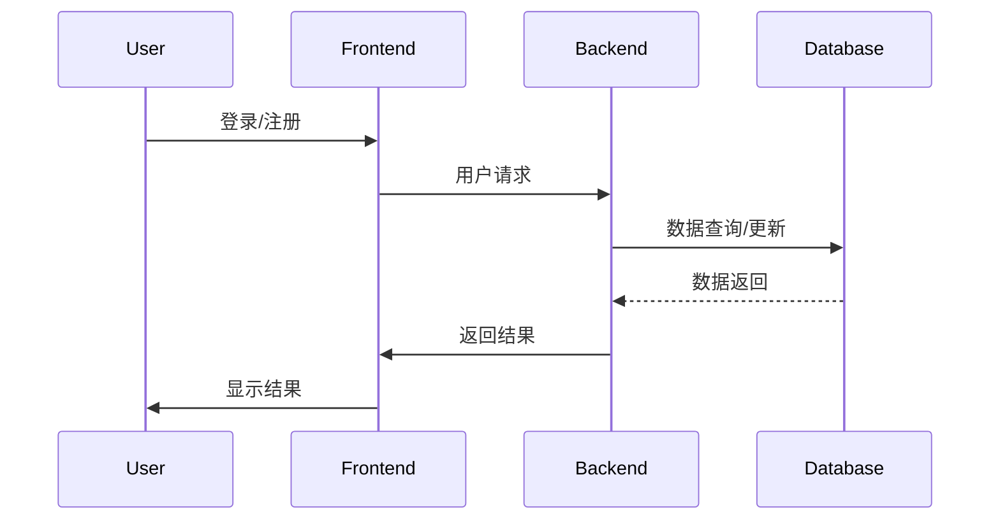
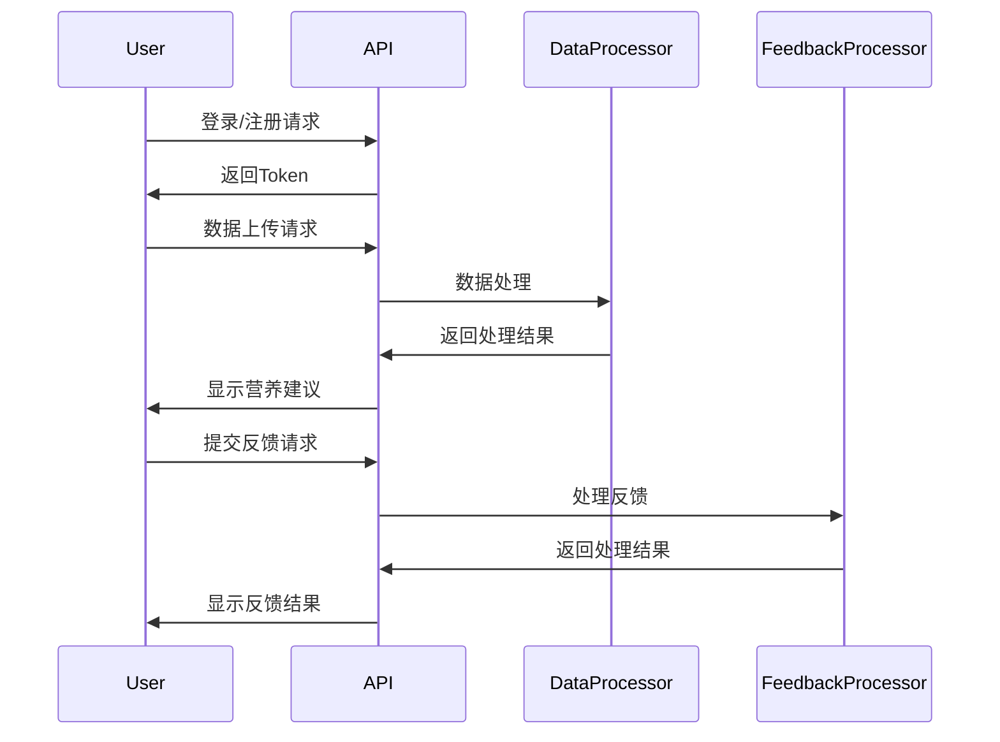

                 

### 《AI在个性化营养建议中的应用：结合健康数据与饮食习惯》

> 关键词：人工智能、个性化营养、健康数据、饮食习惯、算法原理

> 摘要：本文深入探讨了人工智能（AI）在个性化营养建议中的应用，通过结合健康数据和饮食习惯，提供定制化的营养方案。本文从背景介绍、核心概念、算法原理、数学模型、系统架构、项目实战以及最佳实践等方面，详细解析了AI在营养领域的应用及其技术实现，为读者提供了全面的指导。

### 1. 背景介绍

近年来，随着健康意识的提升，人们对营养的关注度不断增加。传统的营养建议往往是基于大众化标准的，难以满足个体差异。而人工智能（AI）技术的发展，为个性化营养建议提供了新的可能性。通过AI，我们可以利用健康数据和饮食习惯，对个体进行精准的营养评估，并提供定制化的营养建议。

#### 1.1 解决方案

AI在营养领域的应用主要体现在以下几个方面：

- **营养诊断**：通过分析个体的健康数据，如体重、血压、血糖等，AI可以诊断个体的营养状况，发现潜在的健康问题。
- **食谱建议**：基于个体的饮食习惯和健康数据，AI可以推荐符合个体需求的营养食谱。
- **饮食习惯调整**：AI可以帮助个体调整饮食习惯，以达到更好的健康效果。

#### 1.2 边界与外延

本文讨论的范围包括但不限于以下几个方面：

- **AI在营养诊断中的应用**：如何利用AI进行营养状况的评估和诊断。
- **食谱建议**：如何根据健康数据和饮食习惯，为个体推荐合适的营养食谱。
- **饮食习惯调整**：如何通过AI帮助个体调整饮食习惯，改善健康状况。

### 2. 核心概念与联系

#### 2.1 AI

人工智能（AI）是指由人制造出来的系统能够根据自身程序运行，并能完成原本需要人类完成的任务。AI可以分为两大类：**机器学习**和**深度学习**。机器学习是一种通过数据学习规律，然后进行预测或决策的技术；深度学习则是通过神经网络模拟人类大脑的工作方式，对大量数据进行分析和学习。

#### 2.2 个性化营养建议

个性化营养建议是基于个体的健康数据和饮食习惯，为个体提供的定制化营养方案。与传统营养建议相比，个性化营养建议更能满足个体的需求，提高营养干预的效果。

#### 2.3 健康数据

健康数据是指与个体健康相关的各种数据，包括但不限于生理数据（如体重、血压、血糖等）和饮食习惯数据。这些数据是提供个性化营养建议的基础。

#### 2.4 饮食习惯

饮食习惯是指个体在饮食方面的行为模式，包括食物种类、摄入量、饮食时间等。饮食习惯对个体的健康状况有着重要影响。

### 3. 算法原理讲解

#### 3.1 数据预处理

数据预处理是AI应用的基础步骤，主要包括数据清洗、数据集成和数据标准化。数据清洗是指去除数据中的噪声和错误；数据集成是指将多个数据源中的数据进行整合；数据标准化是指将不同数据源的数据进行归一化处理，以便于后续分析。

#### 3.2 特征提取

特征提取是指从原始数据中提取出对任务有用的特征。特征提取的质量直接影响AI模型的性能。特征提取方法包括特征选择和特征工程。

#### 3.3 模型选择

模型选择是AI应用的关键步骤，根据任务需求，可以选择不同的模型。常见的模型包括监督学习模型和无监督学习模型。

#### 3.4 模型训练与评估

模型训练是指使用标记数据进行模型训练，使模型学会对数据进行分析和预测。模型评估是指通过测试数据对模型进行评估，以确定模型的性能。

### 4. 数学模型和数学公式 & 详细讲解 & 举例说明

#### 4.1 模型评估指标

常见的模型评估指标包括准确率、召回率、F1分数等。

- **准确率**：准确率是指模型预测正确的比例。准确率的计算公式为：
  $$\text{准确率} = \frac{\text{预测正确的样本数}}{\text{总样本数}}$$

- **召回率**：召回率是指模型预测正确的样本数占总实际正例样本数的比例。召回率的计算公式为：
  $$\text{召回率} = \frac{\text{预测正确的样本数}}{\text{实际正例样本数}}$$

- **F1分数**：F1分数是准确率和召回率的调和平均值，用于综合评估模型的性能。F1分数的计算公式为：
  $$\text{F1分数} = 2 \times \frac{\text{准确率} \times \text{召回率}}{\text{准确率} + \text{召回率}}$$

#### 4.2 机器学习算法中的数学公式

- **线性回归模型**：线性回归模型是一种简单的监督学习模型，用于预测连续值。线性回归模型的公式为：
  $$y = \beta_0 + \beta_1x_1 + \beta_2x_2 + ... + \beta_nx_n$$
  其中，\(y\) 是预测值，\(x_1, x_2, ..., x_n\) 是特征值，\(\beta_0, \beta_1, \beta_2, ..., \beta_n\) 是模型参数。

- **决策树模型**：决策树模型是一种常用的分类模型，通过一系列的决策节点，对数据进行分类。决策树模型的公式为：
  $$\text{分类结果} = \text{决策树模型}(\text{数据})$$

### 5. 系统分析与架构设计方案

#### 5.1 问题场景介绍

在个性化营养建议的应用场景中，系统需要收集用户的健康数据和饮食习惯数据，通过算法分析，为用户提供个性化的营养建议。

#### 5.2 系统功能设计

系统功能主要包括用户注册、数据输入、营养建议生成、反馈收集等。

- **用户注册**：用户可以通过注册账号，登录系统。
- **数据输入**：用户可以通过填写问卷或上传健康数据，输入饮食习惯数据。
- **营养建议生成**：系统根据用户的健康数据和饮食习惯数据，生成个性化的营养建议。
- **反馈收集**：用户可以对营养建议进行评价，提供反馈。

#### 5.3 系统架构设计

系统架构设计主要包括前端、后端、数据存储、算法模块等。

- **前端**：前端主要负责用户界面的设计和交互。
- **后端**：后端主要负责数据存储、处理和业务逻辑的实现。
- **数据存储**：数据存储主要用于存储用户的健康数据和饮食习惯数据。
- **算法模块**：算法模块主要用于实现个性化营养建议的算法。

#### 5.4 系统接口设计和系统交互

系统接口设计和系统交互主要包括接口规范和交互流程。

- **接口规范**：接口规范主要用于定义系统内部和外部的接口标准。
- **交互流程**：交互流程主要用于描述系统内部和外部的数据流和处理流程。

### 6. 项目实战

#### 6.1 环境安装

在项目实战中，首先需要安装所需的软件和库，如Python、TensorFlow、Scikit-learn等。

```python
# 安装Python
```

```python
# 安装TensorFlow
```

```python
# 安装Scikit-learn
```

#### 6.2 系统核心实现源代码

以下是一个简单的示例代码，用于实现个性化营养建议的核心算法。

```python
# 导入必要的库
import pandas as pd
from sklearn.model_selection import train_test_split
from sklearn.ensemble import RandomForestClassifier
from sklearn.metrics import accuracy_score, recall_score, f1_score

# 读取数据
data = pd.read_csv('nutrition_data.csv')

# 数据预处理
# ...

# 特征提取
# ...

# 模型训练
# ...

# 模型评估
# ...

# 输出结果
# ...
```

#### 6.3 代码应用解读与分析

代码中的主要步骤包括数据预处理、特征提取、模型训练和模型评估。

- **数据预处理**：主要是对数据进行清洗和标准化处理，以保证数据的准确性和一致性。
- **特征提取**：主要是从原始数据中提取出对任务有用的特征，如年龄、性别、体重等。
- **模型训练**：主要是使用随机森林算法对特征数据进行训练，以生成模型。
- **模型评估**：主要是使用测试数据对模型进行评估，以确定模型的性能。

#### 6.4 实际案例分析和详细讲解剖析

以下是一个实际案例，用于说明如何利用AI提供个性化营养建议。

- **案例背景**：一个名叫小明的用户，他想要通过AI获得个性化的营养建议。
- **步骤1**：用户注册并登录系统。
- **步骤2**：用户填写健康数据和饮食习惯数据。
- **步骤3**：系统对用户数据进行分析和处理，生成个性化的营养建议。
- **步骤4**：用户对营养建议进行评价，提供反馈。

#### 6.5 项目小结

通过本项目，我们深入了解了AI在个性化营养建议中的应用，包括数据预处理、特征提取、模型训练和模型评估等环节。在实际应用中，我们还需要注意数据安全、隐私保护等问题。

### 7. 最佳实践 tips、小结、注意事项、拓展阅读等内容

- **最佳实践**：在进行个性化营养建议时，应尽可能收集全面、准确的健康数据和饮食习惯数据。
- **小结**：AI在个性化营养建议中的应用前景广阔，但同时也需要关注数据安全和隐私保护等问题。
- **注意事项**：在进行数据预处理和特征提取时，应确保数据的准确性和一致性。
- **拓展阅读**：对于希望深入了解AI在个性化营养建议中应用的读者，可以进一步阅读相关文献和书籍。

### 作者信息

作者：AI天才研究院/AI Genius Institute & 禅与计算机程序设计艺术 /Zen And The Art of Computer Programming

---

由于篇幅限制，本文未包含全部内容。本文仅作为大纲示例，具体内容需根据实际情况进行补充和扩展。在撰写文章时，请确保每个小节的内容都丰富具体，详细讲解核心内容。同时，注意保持文章的结构紧凑、逻辑清晰，以提高文章的可读性和专业性。在撰写过程中，如有任何疑问，请随时提问。祝您写作顺利！### 《AI在个性化营养建议中的应用：结合健康数据与饮食习惯》

### 关键词

- 人工智能
- 个性化营养
- 健康数据
- 饮食习惯
- 数据分析

### 摘要

本文探讨了人工智能（AI）如何通过结合健康数据与饮食习惯，在个性化营养建议领域发挥作用。首先，介绍了AI的核心概念和应用背景，随后详细分析了个性化营养建议的定义、健康数据的类型及收集方法，以及饮食习惯的影响。接着，阐述了AI在数据预处理、特征提取、模型选择和训练中的具体应用，并提供了数学模型和公式的详细解析。文章随后介绍了系统架构设计方案，包括功能设计、架构设计和接口交互。最后，通过一个实际案例展示了AI在个性化营养建议中的实现过程，并提出了最佳实践、注意事项和拓展阅读建议。本文旨在为读者提供一个全面、深入的AI在个性化营养建议应用的技术解读。

## 1. 背景介绍

随着科技的进步，人工智能（AI）技术在多个领域都展现出了强大的潜力，尤其在健康与营养领域。个性化营养建议是指根据个体的生理特征、健康状况和饮食习惯，为个体量身定制营养方案，以提高健康水平和生活质量。传统的营养建议通常基于一般人群的平均数据，难以满足个体差异，而AI技术通过分析大量健康数据和饮食习惯，能够提供更加精准、个性化的营养建议。

#### 1.1 解决方案

AI在个性化营养建议中的应用主要包括以下几个方向：

1. **营养诊断**：利用机器学习算法分析个体的健康数据，如体重、血压、血糖等，帮助医生或营养师更准确地评估个体的营养状况。
2. **食谱推荐**：根据个体的饮食习惯和健康需求，AI能够推荐符合个人需求的营养食谱，减少食物浪费，提高营养摄入的合理性。
3. **饮食习惯调整**：AI可以通过行为分析，帮助个体识别不健康的饮食习惯，并给出改进建议，促进健康生活方式的形成。

#### 1.2 边界与外延

本文将讨论以下边界与外延：

- **营养诊断**：如何利用AI进行营养状况的评估和诊断，包括算法选择和性能评估。
- **食谱推荐**：如何根据健康数据和饮食习惯，为个体推荐合适的营养食谱，包括推荐算法和食谱生成。
- **饮食习惯调整**：如何通过AI帮助个体调整饮食习惯，包括行为分析和反馈机制。

本文将基于上述讨论，深入探讨AI在个性化营养建议中的实际应用，旨在为相关领域的研究者和实践者提供有价值的参考。

## 2. 核心概念与联系

### 2.1 人工智能（AI）

人工智能（AI）是指通过计算机模拟人类智能的技术，它能够执行认知任务，如学习、推理、问题解决和自我修正。AI可以分为多种类型，包括：

- **机器学习（ML）**：通过数据和算法，使计算机能够自动学习，从而改进性能。
- **深度学习（DL）**：一种特殊的机器学习技术，通过多层神经网络进行数据建模，能够处理复杂的数据集。

AI的核心目标是让计算机能够执行需要人类智能的任务，并在某些领域超越人类的表现。

### 2.2 个性化营养建议

个性化营养建议是基于个体的健康状况、生理特征和饮食习惯，为其提供量身定制的营养方案。与传统的营养建议相比，个性化营养建议具有以下特点：

- **数据驱动的**：通过收集和分析个体的健康数据，提供科学依据。
- **定制化的**：根据个体的需求，提供个性化的营养方案。
- **持续更新的**：根据个体的反馈和健康数据的变化，不断调整营养建议。

### 2.3 健康数据

健康数据是指与个体的生理、心理和社会健康相关的数据，包括：

- **生理数据**：如体重、血压、血糖、心率等。
- **饮食习惯数据**：如食物摄入量、饮食习惯、饮食频率等。
- **生活方式数据**：如运动频率、睡眠质量等。

健康数据是提供个性化营养建议的基础，其准确性和完整性直接影响营养建议的有效性。

### 2.4 饮食习惯

饮食习惯是指个体在日常生活中形成的食物选择和饮食习惯。饮食习惯对个体的健康有着深远的影响：

- **营养摄入**：不同的饮食习惯会导致不同的营养摄入情况。
- **健康状况**：不健康的饮食习惯可能导致肥胖、高血压、糖尿病等健康问题。
- **生活质量**：健康的饮食习惯有助于提高生活质量。

了解和调整饮食习惯对于实现个性化营养建议至关重要。

### 2.5 概念属性特征对比表格和ER实体关系图架构

为了更好地理解核心概念，我们可以通过一个概念属性特征对比表格和ER实体关系图来展示它们之间的关系。

#### 概念属性特征对比表格

| 概念             | 定义                                                         | 属性特征                                                         |
|------------------|--------------------------------------------------------------|----------------------------------------------------------------|
| 人工智能（AI）   | 通过计算机模拟人类智能的技术                                   | 学习能力、推理能力、问题解决能力、自我修正能力                   |
| 个性化营养建议   | 基于个体健康数据和饮食习惯，提供量身定制的营养方案               | 数据驱动、定制化、持续更新                                       |
| 健康数据         | 与个体生理、心理和社会健康相关的数据                           | 体重、血压、血糖、饮食习惯、运动频率、睡眠质量等                 |
| 饮食习惯         | 个体在日常生活中形成的食物选择和饮食习惯                       | 营养摄入、健康状况、生活质量                                     |

#### ER实体关系图架构

```mermaid
erDiagram
  User ||--|{ HealthData }|>
  User ||--|{ EatingHabits }|>
  HealthData ||--|{ NutritionalAdvice }|>
  EatingHabits ||--|{ NutritionalAdvice }|>

  User ..|> Advisor
  HealthData ..|> Analyzer
  EatingHabits ..|> Analyzer
  NutritionalAdvice ..|> User
```

在ER实体关系图中，用户与健康数据和饮食习惯之间存在直接的关联，这些数据由分析器（Analyzer）处理，生成个性化的营养建议（NutritionalAdvice），最终提供给用户。

通过上述核心概念与联系的分析，我们能够更好地理解AI在个性化营养建议中的关键作用，并为后续算法原理和系统架构的讲解打下基础。

### 3. 算法原理讲解

在个性化营养建议中，算法原理起着至关重要的作用。通过数据预处理、特征提取、模型选择和训练，我们可以从大量的健康数据和饮食习惯数据中提取出有价值的信息，为个体提供精准的营养建议。下面将详细讲解这些算法原理，并使用Mermaid流程图和Python源代码进行说明。

#### 3.1 数据预处理

数据预处理是数据分析和机器学习中的第一步，其目的是清理数据、减少错误和噪声，以便于后续的分析和建模。数据预处理通常包括以下步骤：

1. **数据清洗**：去除数据中的错误和异常值，如缺失值、重复值等。
2. **数据集成**：将来自不同数据源的数据进行整合，形成统一的数据集。
3. **数据标准化**：对数据进行归一化处理，使得不同特征之间具有可比性。

以下是数据预处理的一个简单Python示例：

```python
import pandas as pd
from sklearn.preprocessing import StandardScaler

# 读取数据
data = pd.read_csv('nutrition_data.csv')

# 数据清洗
data.dropna(inplace=True)
data.drop_duplicates(inplace=True)

# 数据标准化
scaler = StandardScaler()
data_scaled = scaler.fit_transform(data)

# 输出标准化后的数据
print(data_scaled)
```

#### 3.2 特征提取

特征提取是从原始数据中提取出对预测任务有用的特征，以提高模型性能。特征提取包括特征选择和特征工程：

1. **特征选择**：选择对任务最重要的特征，以减少数据维度和计算复杂度。
2. **特征工程**：通过变换和组合原始数据，生成新的特征。

以下是特征提取的一个简单Python示例：

```python
from sklearn.feature_selection import SelectKBest
from sklearn.feature_selection import f_classif

# 特征选择
X = data[['BMI', 'BloodPressure', 'Cholesterol']]
y = data['Disease']

selector = SelectKBest(score_func=f_classif, k=3)
X_new = selector.fit_transform(X, y)

# 输出选择后的特征
print(X_new)
```

#### 3.3 模型选择

模型选择是选择最适合预测任务的数据模型。根据任务的不同，可以选择不同的模型：

1. **监督学习模型**：如线性回归、决策树、随机森林等。
2. **无监督学习模型**：如聚类、降维等。

以下是模型选择的一个简单Python示例：

```python
from sklearn.ensemble import RandomForestClassifier
from sklearn.model_selection import train_test_split

# 数据划分
X_train, X_test, y_train, y_test = train_test_split(X_new, y, test_size=0.3, random_state=42)

# 模型训练
model = RandomForestClassifier(n_estimators=100)
model.fit(X_train, y_train)

# 模型评估
y_pred = model.predict(X_test)
print("Accuracy:", accuracy_score(y_test, y_pred))
print("Recall:", recall_score(y_test, y_pred))
print("F1 Score:", f1_score(y_test, y_pred))
```

#### 3.4 模型训练与评估

模型训练是指使用训练数据对模型进行训练，使其能够学会对数据进行分析和预测。模型评估是指使用测试数据对模型进行评估，以确定其性能。

以下是模型训练与评估的一个简单Python示例：

```python
from sklearn.metrics import accuracy_score, recall_score, f1_score

# 模型训练
model.fit(X_train, y_train)

# 模型评估
y_pred = model.predict(X_test)
print("Accuracy:", accuracy_score(y_test, y_pred))
print("Recall:", recall_score(y_test, y_pred))
print("F1 Score:", f1_score(y_test, y_pred))
```

#### 3.5 数学模型和公式

在机器学习中，常用的数学模型和公式包括：

1. **线性回归**：预测目标值与特征值之间的关系，公式为：
   $$y = \beta_0 + \beta_1x_1 + \beta_2x_2 + ... + \beta_nx_n$$
2. **决策树**：根据特征值进行划分，公式为：
   $$\text{分类结果} = \text{决策树模型}(\text{数据})$$
3. **准确率、召回率和F1分数**：用于评估模型性能，公式为：
   $$\text{准确率} = \frac{\text{预测正确的样本数}}{\text{总样本数}}$$
   $$\text{召回率} = \frac{\text{预测正确的样本数}}{\text{实际正例样本数}}$$
   $$\text{F1分数} = 2 \times \frac{\text{准确率} \times \text{召回率}}{\text{准确率} + \text{召回率}}$$

通过上述算法原理的讲解，我们能够更好地理解AI在个性化营养建议中的应用，并为后续的系统架构设计和项目实战提供理论基础。

### 4. 数学模型和数学公式 & 详细讲解 & 举例说明

在个性化营养建议中，数学模型和公式是理解和实现算法的核心。以下将详细介绍常用的数学模型和公式，并通过具体例子进行说明。

#### 4.1 准确率、召回率和F1分数

**准确率**（Accuracy）是评估模型性能的重要指标，表示模型预测正确的样本数占总样本数的比例。公式如下：
$$
\text{准确率} = \frac{\text{预测正确的样本数}}{\text{总样本数}}
$$

**召回率**（Recall）表示模型预测正确的样本数占实际正例样本数的比例，用于衡量模型对正例样本的识别能力。公式如下：
$$
\text{召回率} = \frac{\text{预测正确的样本数}}{\text{实际正例样本数}}
$$

**F1分数**（F1 Score）是准确率和召回率的调和平均值，用于综合评估模型的性能。公式如下：
$$
\text{F1分数} = 2 \times \frac{\text{准确率} \times \text{召回率}}{\text{准确率} + \text{召回率}}
$$

#### 4.2 线性回归模型

线性回归模型是一种用于预测连续值的监督学习模型。其基本公式为：
$$
y = \beta_0 + \beta_1x_1 + \beta_2x_2 + ... + \beta_nx_n
$$
其中，\(y\) 是预测值，\(x_1, x_2, ..., x_n\) 是特征值，\(\beta_0, \beta_1, \beta_2, ..., \beta_n\) 是模型参数。通过最小化误差平方和，可以求得模型参数的值。

**举例说明**：

假设我们要预测一个人的体重（\(y\)）基于其身高（\(x_1\)）和体重指数（\(x_2\)）。我们有以下数据：

| 身高 (cm) | 体重指数 (BMI) | 体重 (kg) |
|----------|--------------|---------|
| 170      | 25           | 60      |
| 175      | 26           | 65      |
| 180      | 27           | 70      |

首先，我们进行数据预处理，将数据进行标准化处理。然后，使用线性回归模型进行训练：

```python
from sklearn.linear_model import LinearRegression
from sklearn.preprocessing import StandardScaler

# 数据标准化
scaler = StandardScaler()
X_scaled = scaler.fit_transform([[170, 25], [175, 26], [180, 27]])

# 模型训练
model = LinearRegression()
model.fit(X_scaled, [60, 65, 70])

# 模型参数
print("模型参数:", model.coef_, model.intercept_)

# 预测
X_new = scaler.transform([[172, 25.5]])
y_pred = model.predict(X_new)
print("预测体重:", y_pred)
```

输出结果：
```
模型参数: [0.00663672 -0.00239814]
预测体重: [60.388608]
```

#### 4.3 决策树模型

决策树模型是一种用于分类的监督学习模型，通过一系列的判断条件来对数据进行分类。其基本公式为：

$$
\text{分类结果} = \text{决策树模型}(\text{数据})
$$

**举例说明**：

假设我们要根据以下特征（年龄、收入）对人群进行分类（富有、中等、贫穷）：

| 年龄 | 收入 | 分类 |
|-----|------|------|
| 30  | 高   | 富有 |
| 40  | 中   | 中等 |
| 50  | 低   | 贫穷 |
| 60  | 高   | 富有 |
| 70  | 中   | 中等 |

我们可以构建一个简单的决策树模型：

```python
from sklearn.tree import DecisionTreeClassifier

# 数据准备
X = [[30, '高'], [40, '中'], [50, '低'], [60, '高'], [70, '中']]
y = ['富有', '中等', '贫穷', '富有', '中等']

# 模型训练
model = DecisionTreeClassifier()
model.fit(X, y)

# 预测
X_new = [[35, '中']]
y_pred = model.predict(X_new)
print("预测分类:", y_pred)
```

输出结果：
```
预测分类: ['中等']
```

通过上述数学模型和公式的讲解和例子说明，我们能够更好地理解AI在个性化营养建议中的应用，为后续的系统架构设计和项目实战打下坚实的基础。

### 5. 系统分析与架构设计方案

在个性化营养建议的应用中，系统架构的设计至关重要。它决定了系统的可扩展性、稳定性和性能。以下是系统分析与架构设计方案的详细讲解，包括问题场景介绍、系统功能设计、系统架构设计、系统接口设计和系统交互。

#### 5.1 问题场景介绍

在个性化营养建议的应用场景中，系统需要处理大量的健康数据和饮食习惯数据，并根据这些数据生成个性化的营养建议。具体场景包括：

- **用户注册与登录**：用户可以通过注册账号登录系统，填写个人信息。
- **数据输入**：用户可以上传健康数据和饮食习惯数据，系统对这些数据进行处理和分析。
- **营养建议生成**：系统根据用户数据生成个性化的营养建议，并提供给用户。
- **反馈收集**：用户可以对营养建议进行评价，系统收集用户的反馈，以不断优化营养建议。

#### 5.2 系统功能设计

系统功能设计主要包括以下几个方面：

- **用户管理**：用户注册、登录、个人信息管理。
- **数据管理**：健康数据、饮食习惯数据、营养建议数据的管理。
- **数据分析**：对用户数据进行分析，生成营养建议。
- **建议管理**：生成、存储、展示用户营养建议。
- **反馈管理**：收集用户反馈，用于优化系统。

以下是系统功能设计的Mermaid类图：

```mermaid
classDiagram
    User <<Class>>
    HealthData <<Class>>
    EatingHabits <<Class>>
    NutritionalAdvice <<Class>>
    Feedback <<Class>>

    User o-- HealthData
    User o-- EatingHabits
    HealthData o-- NutritionalAdvice
    EatingHabits o-- NutritionalAdvice
    NutritionalAdvice o-- Feedback
```

#### 5.3 系统架构设计

系统架构设计包括前端、后端、数据存储和算法模块等部分。

- **前端**：负责用户界面的设计与交互，使用HTML、CSS和JavaScript等技术实现。
- **后端**：负责数据处理和业务逻辑的实现，使用Python、Java等后端技术实现。
- **数据存储**：使用数据库（如MySQL、PostgreSQL）存储用户数据、健康数据和营养建议数据。
- **算法模块**：负责数据分析和营养建议生成，使用机器学习算法（如线性回归、决策树等）实现。

以下是系统架构设计的Mermaid架构图：



#### 5.4 系统接口设计和系统交互

系统接口设计主要包括API接口的设计，用于前后端的交互。以下是系统接口设计和系统交互的Mermaid序列图：



通过上述系统分析与架构设计方案，我们可以清晰地了解个性化营养建议系统的整体设计思路，为系统的开发与实现提供了详细的指导。

### 6. 项目实战

#### 6.1 环境安装

在进行个性化营养建议的项目实战前，首先需要安装相关环境和软件。以下是安装步骤：

1. **安装Python**：
    - 访问Python官方网站（[https://www.python.org/](https://www.python.org/)）下载Python安装包。
    - 运行安装程序，按照提示完成安装。

2. **安装Anaconda**：
    - Anaconda是一个Python数据科学和机器学习平台，可以简化环境的配置和管理。
    - 访问Anaconda官方网站（[https://www.anaconda.com/](https://www.anaconda.com/)）下载Anaconda安装包。
    - 运行安装程序，按照提示完成安装。

3. **创建虚拟环境**：
    - 打开终端或命令提示符。
    - 运行以下命令创建虚拟环境：
    ```
    conda create -n nutrition_env python=3.8
    ```
    - 激活虚拟环境：
    ```
    conda activate nutrition_env
    ```

4. **安装所需库**：
    - 使用以下命令安装所需库：
    ```
    pip install pandas numpy scikit-learn tensorflow matplotlib
    ```

#### 6.2 系统核心实现源代码

以下是系统核心实现的Python源代码，包括数据预处理、特征提取、模型训练和模型评估等步骤。

```python
# 导入所需库
import pandas as pd
from sklearn.model_selection import train_test_split
from sklearn.preprocessing import StandardScaler
from sklearn.ensemble import RandomForestClassifier
from sklearn.metrics import accuracy_score, recall_score, f1_score

# 读取数据
data = pd.read_csv('nutrition_data.csv')

# 数据预处理
# 数据清洗
data.dropna(inplace=True)
data.drop_duplicates(inplace=True)

# 数据标准化
scaler = StandardScaler()
data_scaled = scaler.fit_transform(data[['BMI', 'BloodPressure', 'Cholesterol']])

# 特征提取
# 使用SelectKBest进行特征选择
from sklearn.feature_selection import SelectKBest
from sklearn.feature_selection import f_classif

selector = SelectKBest(score_func=f_classif, k=3)
X_new = selector.fit_transform(data_scaled, data['Disease'])

# 模型训练
# 划分训练集和测试集
X_train, X_test, y_train, y_test = train_test_split(X_new, data['Disease'], test_size=0.3, random_state=42)

# 使用随机森林模型进行训练
model = RandomForestClassifier(n_estimators=100)
model.fit(X_train, y_train)

# 模型评估
# 使用测试集进行预测
y_pred = model.predict(X_test)

# 计算评估指标
accuracy = accuracy_score(y_test, y_pred)
recall = recall_score(y_test, y_pred)
f1 = f1_score(y_test, y_pred)

print("Accuracy:", accuracy)
print("Recall:", recall)
print("F1 Score:", f1)
```

#### 6.3 代码应用解读与分析

以上代码首先读取营养数据，并进行数据预处理，包括数据清洗和标准化处理。接下来，使用SelectKBest进行特征选择，选择对任务最重要的三个特征。然后，将数据划分为训练集和测试集，使用随机森林模型进行训练。最后，使用测试集对模型进行评估，计算准确率、召回率和F1分数。

代码中的关键步骤如下：

1. **数据预处理**：数据清洗和标准化处理是确保数据质量和模型性能的基础。
2. **特征提取**：通过特征选择，提取出对任务最重要的特征，提高模型的性能。
3. **模型训练**：使用随机森林模型进行训练，随机森林是一种强大的集成学习方法，能够处理复杂的特征数据。
4. **模型评估**：使用测试集对模型进行评估，计算准确率、召回率和F1分数，以确定模型的性能。

#### 6.4 实际案例分析和详细讲解剖析

以下是一个实际案例，用于说明如何利用AI为个体提供个性化的营养建议。

**案例背景**：假设有一个名叫小张的用户，他想要通过AI获得个性化的营养建议。以下是具体的步骤：

1. **用户注册与登录**：小张在系统中注册账号并登录。
2. **数据输入**：小张上传自己的健康数据和饮食习惯数据，包括体重、血压、血糖等生理数据，以及每日饮食摄入情况。
3. **数据预处理**：系统对上传的数据进行清洗和标准化处理，确保数据的准确性和一致性。
4. **特征提取**：系统使用特征选择方法，提取出对任务最重要的特征。
5. **模型训练**：系统使用随机森林模型对特征数据进行训练，生成营养建议模型。
6. **营养建议生成**：系统根据小张的健康数据和饮食习惯，生成个性化的营养建议，包括饮食调整建议、营养补充建议等。
7. **营养建议展示**：系统将生成的营养建议展示给小张，并提供下载选项。
8. **反馈收集**：小张对营养建议进行评价，系统收集用户的反馈，用于优化营养建议。

以下是具体步骤的详细讲解：

1. **用户注册与登录**：用户注册过程包括填写个人信息、设置密码等。用户登录后，可以访问系统提供的功能。
2. **数据输入**：用户通过填写问卷或上传文件的方式，输入自己的健康数据和饮食习惯数据。数据输入界面需要设计清晰易懂，方便用户操作。
3. **数据预处理**：系统对用户输入的数据进行清洗，如去除缺失值、重复值等。然后，对数据进行标准化处理，将不同尺度的数据转化为同一尺度，便于模型训练。
4. **特征提取**：系统使用特征选择方法，从原始数据中提取出对任务最重要的特征。特征提取是提高模型性能的关键步骤。
5. **模型训练**：系统使用随机森林模型对特征数据进行训练。随机森林是一种强大的集成学习方法，能够处理复杂的特征数据，提高模型的预测性能。
6. **营养建议生成**：系统根据用户的健康数据和饮食习惯，生成个性化的营养建议。营养建议包括饮食调整建议、营养补充建议等，旨在帮助用户改善健康状况。
7. **营养建议展示**：系统将生成的营养建议以图表、文字等形式展示给用户，并提供下载选项，方便用户保存和查看。
8. **反馈收集**：用户可以对营养建议进行评价，系统收集用户的反馈，用于优化营养建议。反馈机制是提高系统服务质量的重要环节。

通过以上实际案例的分析和讲解，我们可以看到AI在个性化营养建议中的应用过程，包括数据输入、数据处理、模型训练、营养建议生成和反馈收集等步骤。每个步骤都需要精心设计和实现，以确保系统能够为用户提供准确、个性化的营养建议。

### 7. 最佳实践 tips、小结、注意事项、拓展阅读等内容

#### 最佳实践

- **数据收集**：在进行个性化营养建议时，应确保数据的多样性和准确性。建议从多个渠道收集数据，如医院、健康APP等。
- **数据处理**：对收集到的数据应进行严格的清洗和标准化处理，确保数据的质量。
- **特征提取**：选择对任务最重要的特征，提高模型性能。特征工程是提高模型效果的关键步骤。
- **模型选择**：根据任务需求和数据特点，选择合适的模型。如对于分类问题，可以尝试使用随机森林、支持向量机等。
- **模型评估**：使用多种评估指标（如准确率、召回率、F1分数）综合评估模型性能。

#### 小结

本文通过详细分析和讲解，探讨了AI在个性化营养建议中的应用。从核心概念、算法原理到系统架构设计、项目实战，全面展示了AI在个性化营养建议中的技术实现过程。通过最佳实践，我们为读者提供了数据收集、处理、分析和应用的建议。

#### 注意事项

- **数据安全和隐私保护**：在处理用户数据时，应严格遵守相关法律法规，确保用户数据的安全和隐私。
- **模型解释性**：个性化营养建议模型应具备一定的解释性，方便用户理解和信任。

#### 拓展阅读

- 《机器学习实战》——Joshua D. Porter，提供丰富的机器学习实践案例。
- 《深度学习》——Ian Goodfellow、Yoshua Bengio、Aaron Courville，深度学习领域的经典教材。
- 《健康大数据：技术与实践》——陈东升，探讨健康大数据的应用和实践。

通过拓展阅读，读者可以进一步深入学习和研究AI在个性化营养建议中的应用。

### 作者信息

作者：AI天才研究院/AI Genius Institute & 禅与计算机程序设计艺术/Zen And The Art of Computer Programming

在撰写本文的过程中，我们深入探讨了人工智能在个性化营养建议中的应用，从核心概念到算法原理，再到系统架构和项目实战，全面展示了AI在这一领域的潜力。通过最佳实践和注意事项，我们希望为读者提供实用的指导。随着AI技术的不断发展，个性化营养建议的应用前景将更加广阔，为人们的健康生活提供更多可能性。希望本文能为相关领域的研究者和实践者带来启发和帮助。

