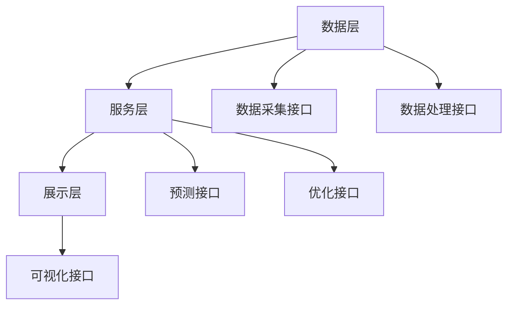

                 

### 第一部分：背景介绍与核心概念

#### 1.1 问题背景

##### 1.1.1 可再生能源概述

可再生能源是指不会因使用而耗尽的能源，如太阳能、风能、水能和生物质能等。这些能源不仅对环境的负面影响较小，还能提供长期稳定的能源供应，具有非常重要的战略意义。

- **定义与重要性**：可再生能源是指那些不会因为人类的使用而枯竭的能源资源，它们来源于自然界的循环过程，比如太阳能、风能、水能和生物质能等。与传统的化石能源相比，可再生能源具有显著的环境优势，减少了温室气体排放，有助于减缓气候变化。

- **种类及特点**：太阳能主要通过光伏板或太阳能热水器等方式直接转换为电能或热能。风能利用风力带动风力涡轮机旋转，将动能转换为电能。水能则是通过水轮机将水的势能转换为电能。生物质能则来源于有机物质的燃烧或生物转化过程，包括农业废弃物、林业废弃物和动物粪便等。

##### 1.1.2 可再生能源预测的意义

可再生能源的预测在能源生产和存储方面具有重要意义，它能够帮助实现能源生产与消费的平衡，优化能源存储系统，并提高市场需求的响应能力。

- **能源生产与消费的平衡**：通过预测可再生能源的产量，可以合理安排能源生产和分配，确保能源供应与需求之间的平衡，减少能源浪费。

- **能源存储系统的优化**：预测可再生能源的产量波动，可以帮助设计更高效、更智能的能源存储系统，提高储能设备的使用效率。

- **市场需求的预测与响应**：准确预测可再生能源的供应情况，有助于电力市场进行有效调度，满足不同时间段和区域的市场需求。

##### 1.1.3 当前可再生能源预测面临的问题与挑战

尽管可再生能源预测在理论和实践方面取得了显著进展，但仍面临一些挑战和问题，如数据质量、预测准确性、模型适应性和实时性等。

- **数据质量与数量**：可再生能源的预测依赖于大量的历史和实时数据，这些数据的质量和数量直接影响预测的准确性。然而，由于数据采集、传输和处理过程中可能存在的误差，导致数据质量无法保证。

- **预测准确性**：当前许多预测模型在准确性方面仍存在一定的局限性，特别是在应对极端天气和突变情况时，预测结果往往不够稳定。

- **预测模型的适应性与实时性**：许多传统模型在适应新环境和数据变化方面表现较差，难以实现实时预测。此外，实时数据的处理和更新也需要更高效的技术手段。

#### 1.2 核心概念

##### 1.2.1 AI与可再生能源预测

人工智能（AI）在可再生能源预测中的应用，主要基于其强大的数据处理和模式识别能力，能够显著提高预测的准确性和实时性。

- **定义与分类**：人工智能是指计算机系统模拟人类智能行为的能力，包括感知、学习、推理、决策等。根据应用方式的不同，人工智能可分为弱人工智能和强人工智能。

- **应用现状**：目前，人工智能在可再生能源预测中主要应用于数据分析和模式识别。例如，通过机器学习和深度学习算法，对历史和实时数据进行分析，提取有效特征，构建预测模型，并进行实时预测。

##### 1.2.2 优化能源生产与存储

优化能源生产与存储是提高可再生能源利用效率的重要手段，它通过合理的调度和优化，实现能源产消平衡。

- **优化算法的基本概念**：优化算法是一类用于求解最优化问题的数学方法，包括线性规划、非线性规划、动态规划等。在能源生产与存储中，优化算法用于确定最优的生产计划、储能策略和调度方案。

- **优化目标与约束条件**：优化目标包括最大化能源利用效率、最小化能源成本和减少能源浪费等。约束条件包括能源生产容量限制、储能设备容量限制和电力市场需求等。

##### 1.2.3 关键技术与工具

在可再生能源预测和优化中，常见的关键技术包括时间序列分析、机器学习算法和深度学习模型等。

- **时间序列分析**：时间序列分析是一种用于处理和分析随时间变化的数据的方法，常用的模型有自回归模型（AR）、移动平均模型（MA）、自回归移动平均模型（ARMA）和自回归积分滑动平均模型（ARIMA）等。

- **机器学习算法**：机器学习算法是一类基于数据驱动的方法，通过训练模型从数据中学习规律，常用的算法包括线性回归、支持向量机（SVM）、决策树和随机森林等。

- **深度学习模型**：深度学习模型是一类基于多层神经网络的结构，具有强大的特征提取和模式识别能力，常用的模型包括卷积神经网络（CNN）、循环神经网络（RNN）和长短时记忆网络（LSTM）等。

#### 1.3 边界与外延

##### 1.3.1 边界

研究范围与目标：本文的研究范围主要关注可再生能源的预测和优化，探讨人工智能技术在其中的应用。研究目标是提高可再生能源预测的准确性、实时性和适应性。

数据采集与处理的范围：数据采集范围包括历史气象数据、电力需求数据、能源产量数据等。数据处理涉及数据清洗、归一化、特征提取等步骤。

##### 1.3.2 外延

可再生能源预测在其他领域的应用：除了能源领域，可再生能源预测还可以应用于智能电网、能源管理、环境监测等领域，具有广泛的应用前景。

未来发展趋势与展望：随着人工智能技术的不断发展和数据采集技术的进步，可再生能源预测的准确性和实时性将得到进一步提升，为能源生产与消费的平衡提供有力支持。

#### 1.4 概念结构与核心要素组成

##### 1.4.1 概念结构

可再生能源预测系统由数据采集与预处理、预测模型设计、优化算法应用和系统实现与评估等部分组成。

- **数据采集与预处理**：数据采集包括历史气象数据、电力需求数据和能源产量数据等。预处理包括数据清洗、归一化和特征提取等步骤。

- **预测模型设计**：预测模型包括时间序列分析模型、机器学习模型和深度学习模型等，用于对可再生能源产量进行预测。

- **优化算法应用**：优化算法用于确定最优的能源生产计划、储能策略和调度方案，以提高能源利用效率。

- **系统实现与评估**：系统实现包括模型训练、预测和优化等模块，评估指标包括预测准确性、实时性和适应性等。

##### 1.4.2 核心要素组成

可再生能源预测系统的核心要素包括数据采集、预测模型、优化算法和系统评估等。

- **数据采集**：数据采集是可再生能源预测的基础，包括历史气象数据、电力需求数据和能源产量数据等。

- **预测模型**：预测模型是可再生能源预测的核心，包括时间序列分析模型、机器学习模型和深度学习模型等。

- **优化算法**：优化算法用于确定最优的能源生产计划、储能策略和调度方案，以提高能源利用效率。

- **系统评估**：系统评估用于评估可再生能源预测系统的性能，包括预测准确性、实时性和适应性等指标。

#### 1.5 本章小结

本章首先介绍了可再生能源预测的背景和核心概念，分析了当前可再生能源预测面临的问题与挑战，探讨了人工智能技术在其中的应用，并讨论了优化能源生产与存储的基本概念。同时，本章还介绍了可再生能源预测系统的主要组成部分和核心要素，为后续章节的深入讨论奠定了基础。在重点和难点分析方面，本章强调了数据质量和预测准确性的重要性，并提出了进一步研究方向，包括优化算法的改进和应用场景的拓展。通过本章的介绍，读者可以对可再生能源预测有一个全面的了解，为后续章节的深入研究做好准备。

### 第二部分：核心概念与联系

#### 2.1 AI核心概念与联系

##### 2.1.1 AI基本原理

人工智能（AI）是计算机科学的一个分支，旨在通过模拟、延伸和扩展人类的智能行为，实现计算机对环境的感知、理解和响应。AI的基本原理包括感知与认知、学习与推理等。

###### 2.1.1.1 感知与认知

感知系统：感知系统是AI的重要组成部分，它通过传感器从环境中获取信息，如视觉、听觉、触觉等。这些感知信息被转换为数字信号，然后通过图像识别、语音识别等技术进行处理。

认知系统：认知系统是基于人类认知原理设计的，用于模拟人类的思维过程，包括注意力、记忆、思考、推理等。认知系统能够对感知到的信息进行理解、分析和决策。

###### 2.1.1.2 学习与推理

学习：学习是AI的核心能力之一，通过从数据中学习规律和模式，AI系统能够改进其性能。学习可分为有监督学习、无监督学习和强化学习。

- **有监督学习**：在有监督学习中，系统通过训练数据集学习，每个样本都有标签，用于指导学习过程。常见的有监督学习算法包括线性回归、决策树和支持向量机等。

- **无监督学习**：无监督学习是系统在没有标签的情况下学习数据中的模式，如聚类和降维。常见的无监督学习算法包括K-均值聚类、主成分分析和自编码器等。

- **强化学习**：强化学习是系统通过试错来学习如何在特定环境中取得最大奖励。它广泛应用于游戏、机器人控制和自动驾驶等领域。常见的强化学习算法包括Q-学习、深度Q网络（DQN）和策略梯度等。

推理：推理是AI系统能够根据已有知识和信息进行逻辑推断的能力。推理可分为演绎推理和归纳推理。

- **演绎推理**：演绎推理是从一般到特殊的推理过程，基于已知的前提和规则，得出结论。例如，所有人都会死亡，苏格拉底是人，因此苏格拉底会死亡。

- **归纳推理**：归纳推理是从特殊到一般的推理过程，通过观察具体的实例，归纳出一般性的规律或原则。例如，观察到所有天鹅都是白色的，因此推断所有天鹅都是白色的。

###### 2.1.1.3 AI分类与层次

AI可以根据不同的分类标准进行分类，常见的分类方法包括基于任务、基于技术和基于发展阶段的分类。

- **基于任务的分类**：根据AI应用的任务类型，AI可以分为通用AI和专用AI。通用AI是指能够执行任何智力任务的AI系统，目前尚未实现。专用AI是指为特定任务设计的AI系统，如语音识别、图像识别和自然语言处理等。

- **基于技术的分类**：根据AI系统的技术类型，AI可以分为基于符号推理的AI、基于模型的AI和基于实例的AI等。

- **基于发展阶段的分类**：根据AI的发展阶段，AI可以分为弱AI、强AI和超AI。弱AI是指能够完成特定任务的AI系统，但缺乏常识和推理能力。强AI是指具有人类智能水平的AI系统，能够理解、推理和解决复杂问题。超AI是指超越人类智能的AI系统，目前尚未实现。

###### 2.1.1.4 未来的AI发展趋势

随着AI技术的不断进步，未来的AI发展趋势包括以下几个方面：

- **自主学习与自适应**：未来的AI系统将具备更强的自主学习能力和自适应能力，能够根据环境和任务需求进行自我调整和优化。

- **跨学科融合**：AI与其他学科的融合将产生新的研究方向和应用领域，如AI与医学、教育、艺术和哲学的结合。

- **伦理与安全**：随着AI技术的普及，伦理和安全问题将成为重要议题。未来的AI系统将更加注重伦理和安全的考虑，确保AI技术的合理和可靠应用。

##### 2.1.2 AI在可再生能源预测中的应用

AI在可再生能源预测中的应用，主要基于其强大的数据处理和模式识别能力，能够显著提高预测的准确性和实时性。

###### 2.1.2.1 优化目标

在可再生能源预测中，AI的应用目标主要包括：

- **准确性**：提高预测的准确性是可再生能源预测的核心目标，通过精确预测可再生能源的产量和需求，有助于实现能源的优化分配和调度。

- **实时性**：实时预测是可再生能源预测的另一个重要目标，通过实时数据分析和预测，可以及时调整能源生产和消费计划，提高系统的响应速度。

- **可扩展性**：可再生能源预测系统需要具备良好的可扩展性，能够适应不同规模和应用场景的需求，以便在实际应用中灵活部署。

###### 2.1.2.2 关键技术

在可再生能源预测中，AI的关键技术主要包括：

- **特征工程**：特征工程是AI在可再生能源预测中的重要步骤，通过提取和分析与预测任务相关的特征，可以提高模型的预测性能。

- **模型选择与优化**：模型选择与优化是决定可再生能源预测效果的关键因素，不同的模型适用于不同的预测任务和数据特点，需要根据实际情况进行选择和优化。

- **模型评估与验证**：模型评估与验证是确保可再生能源预测模型性能的重要环节，通过评估和验证模型在测试集上的表现，可以判断模型的可靠性和适用性。

##### 2.1.3 AI相关概念属性特征对比表格

以下是一个关于AI相关概念的属性特征对比表格，包括机器学习、深度学习和强化学习等。

| 概念             | 属性特征                            | 对比               |
|------------------|-----------------------------------|------------------|
| 机器学习         | 自学习、自适应、自动化             | 与人类学习对比     |
| 深度学习         | 神经网络、多层感知、特征自动提取   | 与传统机器学习对比 |
| 强化学习         | 奖励与惩罚机制、策略优化           | 与有监督学习对比   |

通过对比不同概念的属性特征，我们可以更清晰地理解它们之间的区别和联系，为在实际应用中选择合适的技术提供参考。

##### 2.1.4 ER实体关系图架构

为了更好地理解可再生能源预测系统中的数据流和关系，我们使用Mermaid绘制了一个ER（实体关系）图，如下所示：

```mermaid
erDiagram
    User ||--|{ EnergyPredictionModel } : 预测模型
    User ||--|{ RenewableEnergyData } : 可再生能源数据
    EnergyPredictionModel ||--|{ PredictionResult } : 预测结果
```

在这个ER图中，User实体代表了使用可再生能源预测系统的用户，它关联了EnergyPredictionModel和RenewableEnergyData两个实体。EnergyPredictionModel实体负责预测可再生能源的产量，而RenewableEnergyData实体则包含了与可再生能源相关的历史数据和实时数据。PredictionResult实体是EnergyPredictionModel的输出结果，表示预测得到的可再生能源产量。

通过ER实体关系图，我们可以清晰地看到可再生能源预测系统中的主要数据流和关系，有助于更好地理解和设计系统架构。

### 3.1 时间序列分析算法原理

#### 3.1.1 时间序列基本概念

时间序列分析是一种用于处理和分析随时间变化的数据的方法。时间序列数据是按时间顺序排列的一组数值，这些数值通常反映了一个过程或系统的动态变化。时间序列分析的基本概念包括定义、特征和性质。

##### 3.1.1.1 定义

时间序列（Time Series）是一组按时间顺序排列的数据点，每个数据点代表特定时间点的观察结果。时间序列数据通常用于研究系统随时间的变化规律、预测未来趋势以及进行决策支持。

##### 3.1.1.2 特征

- **平稳性（Stationarity）**：平稳性是指时间序列的统计性质不随时间变化。一个平稳的时间序列具有固定的均值、方差和自协方差。平稳性是许多时间序列分析模型的前提条件。

- **自相关性（Autocorrelation）**：自相关性描述的是时间序列中相邻时间点的数据之间的相关性。自相关性可以用来识别数据的周期性特征和趋势。

- **端点效应（Endpoint Effects）**：端点效应是指时间序列在两端的数据可能对整体分析结果产生显著影响。例如，序列的起始和结束部分可能因为样本量不足或特殊情况而表现出不同的行为。

##### 3.1.1.3 性质

时间序列数据通常具有以下性质：

- **趋势性（Trend）**：趋势性描述了时间序列随时间增加或减少的长期方向。

- **季节性（Seasonality）**：季节性描述了时间序列因季节性因素（如节假日、气候等）而产生的周期性波动。

- **随机性（Randomness）**：随机性描述了时间序列中不可预测的波动，这些波动可能是由于随机事件或噪声引起的。

#### 3.1.2 常见时间序列算法

时间序列算法用于建模和预测时间序列数据。以下介绍几种常见的时间序列算法及其原理。

##### 3.1.2.1 自回归模型（AR）

自回归模型（AutoRegressive Model，AR）是一种基于历史数据对未来值进行预测的模型。AR模型的基本思想是利用前几个时间点的值来预测下一个时间点的值。

- **原理与公式**：

  AR(p)模型假设第t个时间点的值可以由前p个时间点的值线性组合得到，其公式为：

  $$X_t = c + \sum_{i=1}^{p} \phi_i X_{t-i} + \varepsilon_t$$

  其中，$X_t$是时间序列在时刻t的值，$c$是常数项，$\phi_i$是自回归系数，$\varepsilon_t$是误差项。

- **优缺点**：

  - **优点**：AR模型简单易懂，易于实现和解释。它可以捕捉时间序列的短期依赖关系。

  - **缺点**：AR模型无法捕捉时间序列的长期依赖关系和趋势性。它对异常值较为敏感，可能导致预测结果不稳定。

##### 3.1.2.2 移动平均模型（MA）

移动平均模型（Moving Average Model，MA）是一种利用过去一段时间内的平均值来预测未来值的模型。MA模型通过加权历史数据来平滑时间序列。

- **原理与公式**：

  MA(q)模型假设第t个时间点的值可以由前q个时间点的平均值加上一个误差项得到，其公式为：

  $$X_t = c + \sum_{i=1}^{q} \theta_i \varepsilon_{t-i} + \varepsilon_t$$

  其中，$\theta_i$是移动平均系数，$\varepsilon_t$是误差项。

- **优缺点**：

  - **优点**：MA模型可以很好地捕捉时间序列的短期波动，对异常值的影响较小。

  - **缺点**：MA模型无法处理趋势性和季节性数据，且在参数选择方面存在一定难度。

##### 3.1.2.3 自回归移动平均模型（ARMA）

自回归移动平均模型（AutoRegressive Moving Average Model，ARMA）结合了AR模型和MA模型的特点，同时处理时间序列的短期和长期依赖关系。

- **原理与公式**：

  ARMA(p, q)模型将AR(p)和MA(q)模型合并，其公式为：

  $$X_t = c + \sum_{i=1}^{p} \phi_i X_{t-i} + \sum_{j=1}^{q} \theta_j \varepsilon_{t-j} + \varepsilon_t$$

  其中，$c$是常数项，$\phi_i$和$\theta_j$分别是自回归系数和移动平均系数。

- **优缺点**：

  - **优点**：ARMA模型能够同时捕捉时间序列的短期和长期依赖关系，适用于多种类型的时间序列数据。

  - **缺点**：ARMA模型的参数选择和估计较为复杂，可能需要通过迭代方法进行优化。

##### 3.1.2.4 自回归积分滑动平均模型（ARIMA）

自回归积分滑动平均模型（AutoRegressive Integrated Moving Average Model，ARIMA）是在ARMA模型的基础上，通过差分操作来消除时间序列的平稳性。

- **原理与公式**：

  ARIMA(p, d, q)模型通过差分操作$d$来平稳时间序列，其公式为：

  $$X_t = c + \sum_{i=1}^{p} \phi_i X_{t-i} - \sum_{j=1}^{q} \theta_j \varepsilon_{t-j} + \varepsilon_t$$

  其中，$d$是差分阶数，$c$是常数项，$\phi_i$和$\theta_j$分别是自回归系数和移动平均系数。

- **优缺点**：

  - **优点**：ARIMA模型适用于非平稳时间序列数据，能够有效处理趋势性和季节性数据。

  - **缺点**：ARIMA模型的参数选择和估计过程较为复杂，可能需要通过迭代方法进行优化。

#### 3.1.3 时间序列算法应用实例

为了更好地理解时间序列算法的原理和应用，以下通过一个具体实例进行说明。

##### 实例：气温时间序列预测

假设我们收集了一组某城市连续10天的气温数据，如下表所示：

| 日期 | 气温（摄氏度） |
| ---- | ------------ |
| 1    | 20           |
| 2    | 22           |
| 3    | 21           |
| 4    | 23           |
| 5    | 24           |
| 6    | 25           |
| 7    | 26           |
| 8    | 27           |
| 9    | 28           |
| 10   | 29           |

我们希望通过这些数据预测第11天的气温。

1. **数据预处理**：

   - 确保数据平稳：首先检查数据是否平稳，可以通过绘制ACF图（自相关函数图）进行判断。

   - 数据归一化：将数据归一化到[0, 1]范围内，便于模型训练和预测。

2. **模型选择**：

   - 基于ACF图，我们选择AR(1)模型进行预测，其公式为：

     $$X_t = c + \phi X_{t-1} + \varepsilon_t$$

   - 模型参数$\phi$可以通过最小二乘法进行估计。

3. **模型训练与预测**：

   - 使用前9天的数据训练模型，得到参数$\phi$的估计值。

   - 使用训练好的模型预测第11天的气温：

     $$X_{11} = c + \phi X_{10} + \varepsilon_{11}$$

   - 预测结果为第10天气温加上一个随机误差。

4. **预测结果评估**：

   - 对预测结果进行评估，可以通过计算预测误差、均方误差（MSE）等指标来评估模型性能。

通过这个实例，我们可以看到如何应用时间序列算法进行数据分析和预测。在实际应用中，需要根据数据的特点和需求选择合适的模型，并通过参数调整和模型优化来提高预测性能。

### 3.2 机器学习算法原理

#### 3.2.1 机器学习基础

机器学习（Machine Learning，ML）是一门研究如何让计算机从数据中学习并做出决策或预测的技术。它基于统计学、概率论、优化理论等数学基础，通过构建算法模型，使计算机能够从输入数据中自动提取特征，并逐步优化模型参数，以实现预测或分类任务。

##### 3.2.1.1 基本概念

- **模型**：机器学习中的模型是一种数学模型，用于描述输入和输出之间的关系。常见的模型包括线性回归模型、决策树模型、神经网络模型等。

- **训练集**：训练集是从原始数据中提取的一部分数据，用于训练模型。模型通过学习训练集中的数据，建立输入和输出之间的映射关系。

- **测试集**：测试集是从原始数据中分离的另一部分数据，用于评估模型的性能。模型在测试集上的表现可以反映出模型对未知数据的泛化能力。

- **泛化能力**：泛化能力是指模型对未知数据的适应能力。一个优秀的模型不仅要在训练集上表现良好，还需要在测试集上具有较好的泛化能力。

##### 3.2.1.2 模型训练过程

机器学习模型的训练过程主要包括以下步骤：

1. **数据预处理**：数据预处理是模型训练前的关键步骤，包括数据清洗、归一化、缺失值填充等。数据预处理旨在提高数据质量，减少噪声，便于模型训练。

2. **特征提取**：特征提取是将原始数据转换为适合模型训练的格式。特征提取可以基于统计方法、信息论、主成分分析等方法，从原始数据中提取出有用的特征。

3. **模型选择**：根据应用场景和数据特点，选择合适的机器学习模型。常见的模型包括线性回归、逻辑回归、支持向量机、决策树、随机森林、神经网络等。

4. **模型训练**：模型训练是使用训练集数据来调整模型参数，使模型能够准确预测输入数据的标签。常见的训练方法包括最小化损失函数、梯度下降算法、随机梯度下降等。

5. **模型评估**：模型评估是使用测试集数据来评估模型性能。常用的评估指标包括准确率、召回率、F1值、均方误差、交叉验证误差等。

6. **模型优化**：根据模型评估结果，调整模型参数或选择更合适的模型，以提高模型性能。模型优化可以通过交叉验证、网格搜索、贝叶斯优化等方法进行。

##### 3.2.1.3 常见机器学习算法

以下介绍几种常见的机器学习算法及其原理：

- **线性回归**：线性回归是一种简单的机器学习算法，用于预测连续值输出。它通过拟合一条线性函数来描述输入和输出之间的关系。线性回归的公式为：

  $$y = \beta_0 + \beta_1x_1 + \beta_2x_2 + \ldots + \beta_nx_n$$

  其中，$y$是输出值，$x_1, x_2, \ldots, x_n$是输入特征，$\beta_0, \beta_1, \beta_2, \ldots, \beta_n$是模型参数。

- **逻辑回归**：逻辑回归是一种常用的分类算法，用于预测离散值输出。它通过拟合一个逻辑函数来描述输入和输出之间的关系。逻辑回归的公式为：

  $$P(y=1) = \frac{1}{1 + e^{-(\beta_0 + \beta_1x_1 + \beta_2x_2 + \ldots + \beta_nx_n)}}$$

  其中，$P(y=1)$是输出值为1的概率，$x_1, x_2, \ldots, x_n$是输入特征，$\beta_0, \beta_1, \beta_2, \ldots, \beta_n$是模型参数。

- **支持向量机（SVM）**：支持向量机是一种强大的分类和回归算法，通过最大化分类边界来分离不同类别的数据点。SVM的公式为：

  $$w \cdot x + b = 0$$

  其中，$w$是权重向量，$x$是输入特征，$b$是偏置项。

- **决策树**：决策树是一种基于树形结构进行决策的算法，通过一系列判断条件将数据分为不同的类别或区域。决策树的公式为：

  $$if \ condition_1 \ then \ class_1 \\
  else \ if \ condition_2 \ then \ class_2 \\
  \ldots \\
  else \ class_n$$

  其中，$condition_1, condition_2, \ldots, condition_n$是判断条件，$class_1, class_2, \ldots, class_n$是类别。

- **随机森林**：随机森林是一种基于决策树的集成学习算法，通过构建多个决策树，并对每个树的预测结果进行投票来得到最终预测结果。随机森林的公式为：

  $$\hat{y} = \sum_{i=1}^{n} w_i \cdot f_i(x)$$

  其中，$w_i$是权重，$f_i(x)$是第$i$棵决策树的预测结果，$\hat{y}$是最终预测结果。

- **神经网络**：神经网络是一种基于多层感知器构建的深度学习模型，通过多个神经元和隐藏层对输入数据进行处理和分类。神经网络的公式为：

  $$z = \sigma(W \cdot x + b)$$

  其中，$z$是输出值，$\sigma$是激活函数，$W$是权重矩阵，$x$是输入特征，$b$是偏置项。

##### 3.2.1.4 机器学习算法应用实例

以下通过一个具体实例来介绍如何应用机器学习算法进行数据分析和预测。

实例：使用线性回归预测房价

假设我们收集了一组某城市的房屋数据，包括房屋面积、卧室数量、建筑年代等特征，以及对应的房价。数据如下表所示：

| 房屋面积（平方米） | 卧室数量 | 建筑年代 | 房价（万元） |
| ---------------- | ------- | ------- | ------------ |
| 100              | 3       | 2010    | 300          |
| 120              | 3       | 2015    | 350          |
| 130              | 4       | 2018    | 400          |
| 140              | 4       | 2019    | 450          |

我们希望通过这些数据预测未知房屋的房价。

1. **数据预处理**：

   - 数据清洗：删除缺失值和异常值，确保数据质量。

   - 特征工程：将连续特征进行归一化处理，使特征具有相同的量纲。

2. **模型选择**：

   - 选择线性回归模型，因为房价是连续值，适合使用线性回归进行预测。

3. **模型训练**：

   - 使用前三条数据作为训练集，第四条数据作为测试集。

   - 使用线性回归公式拟合训练集数据，得到模型参数：

     $$房价 = \beta_0 + \beta_1 \cdot 房屋面积 + \beta_2 \cdot 卧室数量 + \beta_3 \cdot 建筑年代$$

4. **模型评估**：

   - 计算测试集数据的预测误差，评估模型性能。

   - 使用均方误差（MSE）作为评估指标：

     $$MSE = \frac{1}{n} \sum_{i=1}^{n} (预测值_i - 实际值_i)^2$$

5. **模型优化**：

   - 根据评估结果，调整模型参数，以提高预测性能。

通过这个实例，我们可以看到如何应用机器学习算法进行数据分析和预测。在实际应用中，需要根据数据的特点和需求选择合适的算法，并通过参数调整和模型优化来提高预测性能。

### 3.3 深度学习模型原理

深度学习（Deep Learning，DL）是机器学习的一个重要分支，其核心思想是利用多层神经网络对复杂数据进行建模和预测。深度学习模型通过逐层提取数据中的特征，能够自动学习并构建复杂的非线性关系，从而在图像识别、自然语言处理、语音识别等领域取得了显著的成果。

#### 3.3.1 基本概念

深度学习模型主要由以下几个基本概念组成：

- **神经网络（Neural Network，NN）**：神经网络是深度学习的基础，它由大量的神经元（节点）和连接（边）构成。每个神经元接收来自其他神经元的输入信号，通过加权求和并应用一个非线性激活函数，产生输出信号。

- **深度（Depth）**：深度学习模型中的“深度”指的是网络层数。通常，深度越大，模型能够学习的特征层次越丰富，从而提高模型的泛化能力。

- **权重（Weights）**：权重是神经网络中连接各个神经元的参数，用于调整输入信号的贡献大小。通过反向传播算法，模型可以根据训练数据自动调整权重，以优化模型性能。

- **偏置（Bias）**：偏置是神经网络中每个神经元的额外参数，用于调整输出信号的值。偏置有助于模型适应不同尺度和范围的输入数据。

- **激活函数（Activation Function）**：激活函数是神经网络中用于引入非线性特性的函数。常见的激活函数包括Sigmoid、ReLU、Tanh等，它们使得神经网络能够处理复杂数据和任务。

#### 3.3.2 神经网络工作原理

神经网络的工作原理可以概括为以下几个步骤：

1. **输入层（Input Layer）**：输入层接收外部输入数据，每个输入数据对应一个神经元。例如，对于一张图像，输入层包含图像的像素值。

2. **隐藏层（Hidden Layers）**：隐藏层位于输入层和输出层之间，负责提取和组合特征。每个隐藏层的神经元接收来自前一层的输入，通过加权求和并应用激活函数，产生输出。多层隐藏层可以逐层提取更高级的特征。

3. **输出层（Output Layer）**：输出层产生最终预测结果或分类标签。输出层的神经元数量和类型取决于具体任务，例如，对于回归任务，输出层通常只有一个神经元；对于分类任务，输出层可以有多个神经元，每个神经元对应一个类别。

4. **反向传播（Backpropagation）**：反向传播是一种训练神经网络的方法，用于调整权重和偏置。在反向传播过程中，模型通过计算损失函数的梯度，从输出层开始，逆向传播误差到输入层，从而更新权重和偏置。这个过程使得模型能够逐步优化参数，提高预测准确性。

5. **优化算法（Optimization Algorithm）**：优化算法用于指导权重和偏置的更新，以最小化损失函数。常见的优化算法包括梯度下降（Gradient Descent）、Adam优化器等。

#### 3.3.3 深度学习模型分类

深度学习模型根据不同的任务和应用场景可以分为以下几类：

- **卷积神经网络（Convolutional Neural Networks，CNN）**：CNN是专门用于处理图像数据的深度学习模型，通过卷积操作和池化操作，能够有效地提取图像中的空间特征。

- **循环神经网络（Recurrent Neural Networks，RNN）**：RNN是一种适用于序列数据的深度学习模型，通过循环结构，RNN能够捕获序列数据中的时间依赖关系。

- **长短时记忆网络（Long Short-Term Memory，LSTM）**：LSTM是RNN的一种变体，通过引入门控机制，能够有效地解决RNN的长期依赖问题。

- **生成对抗网络（Generative Adversarial Networks，GAN）**：GAN是一种生成模型，由生成器和判别器两个神经网络组成，通过对抗训练，生成器能够生成逼真的数据。

- **变分自编码器（Variational Autoencoder，VAE）**：VAE是一种无监督学习模型，通过编码器和解码器，能够学习数据的潜在分布，并生成新的数据。

#### 3.3.4 深度学习模型应用实例

以下通过一个具体实例来介绍如何应用深度学习模型进行图像分类。

实例：使用卷积神经网络进行猫狗图像分类

假设我们收集了一组猫和狗的图像数据，我们需要使用卷积神经网络对这些图像进行分类。

1. **数据预处理**：

   - 数据清洗：删除图像中的噪声和异常值。

   - 数据增强：通过旋转、缩放、翻转等操作，增加数据的多样性。

   - 数据归一化：将图像像素值归一化到[0, 1]范围内。

2. **模型构建**：

   - 使用TensorFlow和Keras等深度学习框架构建卷积神经网络模型。

   - 模型结构：包括多个卷积层、池化层和全连接层。

3. **模型训练**：

   - 使用训练集数据训练模型，通过反向传播算法优化模型参数。

   - 调整学习率、批次大小等超参数，以提高模型性能。

4. **模型评估**：

   - 使用测试集数据评估模型性能，计算准确率、召回率等指标。

5. **模型应用**：

   - 将训练好的模型应用于新的图像数据，进行猫狗分类。

通过这个实例，我们可以看到如何应用深度学习模型进行图像分类。在实际应用中，需要根据数据的特点和需求选择合适的模型，并通过参数调整和模型优化来提高分类性能。

### 3.4 强化学习算法原理

强化学习（Reinforcement Learning，RL）是一种通过与环境互动来学习决策策略的机器学习方法。与监督学习和无监督学习不同，强化学习强调的是通过与环境的交互来不断优化决策策略，以实现最大化累积奖励的目标。强化学习在自动驾驶、机器人控制、游戏AI等领域具有广泛的应用。

#### 3.4.1 基本概念

强化学习的关键概念包括：

- **Agent（智能体）**：Agent是执行行动并从环境中接收反馈的实体。它可以是软件程序、机器人或其他智能设备。

- **Environment（环境）**：环境是Agent执行行动的上下文，它为Agent提供状态信息和奖励信号。

- **State（状态）**：状态是Agent在特定时刻所处的环境特征集合，通常用状态向量表示。

- **Action（动作）**：动作是Agent在特定状态下可以执行的行为。动作的选择基于当前的策略。

- **Reward（奖励）**：奖励是环境对Agent动作的反馈信号，用于评价动作的好坏。奖励可以是正的（奖励信号）或负的（惩罚信号）。

- **Policy（策略）**：策略是Agent在给定状态下选择动作的规则。策略可以是有指导的（如规则系统）或无指导的（如学习得到的策略）。

- **Value Function（价值函数）**：价值函数是评估状态或状态-动作对的价值，用于指导Agent的决策。常见的价值函数包括状态价值函数和状态-动作价值函数。

- **Q-Learning（Q学习）**：Q学习是一种基于值函数的强化学习算法，通过更新Q值（状态-动作价值函数）来优化策略。Q值表示在特定状态下执行特定动作获得的预期奖励。

- **Policy Gradient（策略梯度）**：策略梯度是一种基于策略优化的强化学习算法，通过直接优化策略参数来最大化累积奖励。

#### 3.4.2 强化学习工作原理

强化学习的工作原理可以概括为以下几个步骤：

1. **初始化**：初始化智能体、环境和策略。

2. **状态-动作选择**：智能体根据当前状态和策略选择动作。

3. **执行动作**：智能体在环境中执行选定的动作，并观察环境的变化。

4. **接收奖励**：环境根据智能体的动作提供奖励信号。

5. **更新策略**：智能体根据奖励信号和策略更新策略，以最大化累积奖励。

6. **重复迭代**：智能体重复执行上述步骤，不断优化策略，直至达到满意的性能水平。

#### 3.4.3 强化学习算法分类

强化学习算法根据学习方式、策略优化方法等不同，可以分为以下几类：

- **值函数方法**：值函数方法通过学习状态价值函数或状态-动作价值函数来指导决策。常见的值函数方法包括Q学习、SARSA（同步优势学习）和策略迭代。

- **策略优化方法**：策略优化方法通过直接优化策略参数来最大化累积奖励。常见的策略优化方法包括策略梯度、REINFORCE算法和Actor-Critic方法。

- **模型方法**：模型方法通过学习环境模型（状态转移概率和奖励函数）来指导决策。常见的模型方法包括马尔可夫决策过程（MDP）和部分可观测马尔可夫决策过程（POMDP）。

- **深度强化学习方法**：深度强化学习方法结合了深度学习和强化学习的优势，通过神经网络来学习状态-动作价值函数或策略。常见的深度强化学习方法包括深度Q网络（DQN）、深度确定性策略梯度（DDPG）和深度策略网络（A3C）。

#### 3.4.4 强化学习应用实例

以下通过一个具体实例来介绍如何应用强化学习算法进行智能体控制。

实例：使用深度Q网络（DQN）进行机器人路径规划

假设我们希望使用强化学习算法训练一个智能体，使其能够在复杂环境中找到从起点到终点的最优路径。

1. **环境构建**：

   - 构建一个虚拟环境，模拟智能体在不同状态下的移动和碰撞。

   - 定义状态空间和动作空间。

2. **初始化DQN模型**：

   - 使用卷积神经网络（CNN）作为DQN的前向网络，用于处理和提取环境的状态。

   - 初始化目标网络和经验回放缓冲区。

3. **训练DQN模型**：

   - 智能体在环境中随机探索，收集经验数据。

   - 使用经验回放缓冲区，防止样本偏差。

   - 更新目标网络参数，以最大化累积奖励。

4. **评估智能体性能**：

   - 在测试环境中评估智能体的路径规划能力。

   - 计算平均路径长度和路径成功率等性能指标。

5. **应用智能体**：

   - 将训练好的智能体应用于实际环境，进行路径规划。

通过这个实例，我们可以看到如何应用强化学习算法进行智能体控制。在实际应用中，需要根据环境的特点和需求选择合适的强化学习算法，并通过参数调整和模型优化来提高智能体的性能。

### 3.5 优化算法在可再生能源预测中的应用

在可再生能源预测中，优化算法的应用至关重要，它能够帮助系统在复杂的环境中做出最优决策，从而提高能源利用效率和响应能力。以下将介绍几种常见的优化算法及其在可再生能源预测中的应用。

#### 3.5.1 线性规划

线性规划（Linear Programming，LP）是一种数学优化方法，用于求解线性目标函数在满足一组线性约束条件下的最优解。线性规划广泛应用于资源分配、调度和路径规划等问题。

##### 线性规划在可再生能源预测中的应用

在可再生能源预测中，线性规划可以用于以下场景：

- **能源分配**：通过线性规划确定不同能源来源的分配比例，以实现能源生产的优化。

- **储能策略**：优化储能设备的充放电策略，以最大化储能系统的效率和寿命。

- **电力调度**：优化电力系统的调度方案，确保能源供应与需求的平衡。

##### 线性规划的数学模型

线性规划的数学模型可以表示为：

$$
\begin{align*}
\min\quad & c^T x \\
\text{subject to} \quad & Ax \leq b \\
& x \geq 0
\end{align*}
$$

其中，$c$是目标函数系数向量，$x$是决策变量向量，$A$是约束条件系数矩阵，$b$是约束条件常数向量。

##### 线性规划的求解方法

常见的线性规划求解方法包括单纯形法、 interior-point method（内点法）等。在实际应用中，可以使用开源线性规划库（如GLPK、CPLEX等）来求解线性规划问题。

#### 3.5.2 非线性规划

非线性规划（Nonlinear Programming，NLP）是用于求解非线性目标函数在满足非线性约束条件下的最优解的方法。与线性规划相比，非线性规划的目标函数和约束条件可以是任意非线性的。

##### 非线性规划在可再生能源预测中的应用

在可再生能源预测中，非线性规划可以用于以下场景：

- **储能系统优化**：优化储能系统的充放电策略，考虑储能设备的非线性特性。

- **多能源协同调度**：优化多种能源（如太阳能、风能、生物质能）的协同调度，以实现整体系统的优化。

- **需求响应管理**：优化用户的能源消费行为，减少峰值需求，降低能源成本。

##### 非线性规划的数学模型

非线性规划的数学模型可以表示为：

$$
\begin{align*}
\min\quad & f(x) \\
\text{subject to} \quad & g_i(x) \leq 0, \ i = 1, 2, \ldots, m \\
& h_j(x) = 0, \ j = 1, 2, \ldots, p
\end{align*}
$$

其中，$f(x)$是非线性目标函数，$g_i(x)$和$h_j(x)$是非线性约束条件。

##### 非线性规划的求解方法

非线性规划的求解方法包括梯度下降法、牛顿法、序列二次规划法（SQP）等。在实际应用中，可以使用开源非线性规划库（如IPOPT、SNOPT等）来求解非线性规划问题。

#### 3.5.3 遗传算法

遗传算法（Genetic Algorithm，GA）是一种基于自然选择和遗传机制的优化算法，通过模拟生物进化的过程来寻找最优解。遗传算法广泛应用于组合优化、函数优化和参数优化等问题。

##### 遗传算法在可再生能源预测中的应用

在可再生能源预测中，遗传算法可以用于以下场景：

- **参数优化**：优化预测模型的参数，提高预测准确性。

- **调度策略优化**：优化能源生产、分配和存储策略，实现系统整体优化。

- **多目标优化**：在可再生能源预测中，可能需要同时考虑多个目标（如能源利用效率、成本等），遗传算法可以有效处理多目标优化问题。

##### 遗传算法的基本步骤

遗传算法的基本步骤包括：

1. **初始化种群**：随机生成一组初始解（称为种群）。

2. **适应度评估**：计算每个解的适应度值，适应度值通常与目标函数值成反比。

3. **选择**：根据适应度值选择优秀的解进行复制，以保留优质基因。

4. **交叉**：将两个父代解进行交叉操作，产生新的子代解。

5. **变异**：对子代解进行变异操作，增加解的多样性。

6. **更新种群**：用子代解替换父代解，形成新一代种群。

7. **迭代**：重复执行选择、交叉、变异和更新操作，直至满足终止条件（如达到最大迭代次数或收敛条件）。

##### 遗传算法的求解过程

遗传算法的求解过程可以表示为：

1. **初始化种群**：随机生成初始种群。

2. **适应度评估**：计算每个个体的适应度值。

3. **选择**：根据适应度值选择优质个体。

4. **交叉**：对选中的个体进行交叉操作，生成新的子代个体。

5. **变异**：对子代个体进行变异操作。

6. **更新种群**：将子代个体替换父代个体，形成新一代种群。

7. **迭代**：重复执行选择、交叉、变异和更新操作，直至满足终止条件。

通过上述步骤，遗传算法能够逐步优化解的质量，找到最优或近似最优解。

#### 3.5.4 模拟退火算法

模拟退火算法（Simulated Annealing，SA）是一种基于物理退火过程的优化算法。模拟退火通过在搜索过程中引入随机性，逐渐降低解决方案的接受概率，从而跳出局部最优解，寻求全局最优解。

##### 模拟退火算法在可再生能源预测中的应用

在可再生能源预测中，模拟退火算法可以用于以下场景：

- **模型参数优化**：优化预测模型的参数，提高预测准确性。

- **调度策略优化**：优化能源生产、分配和存储策略，实现系统整体优化。

- **多目标优化**：处理多个目标（如能源利用效率、成本等）的优化问题。

##### 模拟退火算法的基本步骤

模拟退火算法的基本步骤包括：

1. **初始化**：设置初始温度、冷却速率和终止条件。

2. **迭代**：每次迭代生成一个新的解。

3. **接受概率计算**：计算新解被接受的概率，接受概率与温度和新旧解的适应度差有关。

4. **更新解**：根据接受概率更新当前解。

5. **降温**：逐步降低温度。

6. **终止条件判断**：判断是否满足终止条件（如温度降到一定程度或达到最大迭代次数）。

7. **输出最优解**：输出最优解。

##### 模拟退火算法的求解过程

模拟退火算法的求解过程可以表示为：

1. **初始化**：设置初始温度$T$和冷却速率$\alpha$，随机生成初始解$x_0$。

2. **迭代**：对于每个温度$T$，执行以下步骤：

   - 生成新的解$x'$。
   - 计算适应度值$f(x')$和$f(x)$。
   - 计算接受概率$P(Accept) = \min(1, \exp(-\frac{f(x')-f(x)}{T}))$。
   - 如果随机数$rand() \leq P(Accept)$，则接受新解$x' = x$；否则，保持当前解$x$。
   - 降低温度$T = \alpha T$。

3. **终止条件判断**：当满足终止条件（如温度降到一定阈值或达到最大迭代次数）时，算法结束。

4. **输出最优解**：输出当前最优解作为最终解。

通过上述步骤，模拟退火算法能够在搜索过程中避免陷入局部最优，逐渐收敛到全局最优解。

#### 3.5.5 优化算法在可再生能源预测中的应用案例

以下通过一个具体案例来介绍优化算法在可再生能源预测中的应用。

案例：基于遗传算法的太阳能电池储能系统优化

假设我们希望优化一个太阳能电池储能系统，以最大化能源利用效率和减少能源浪费。

1. **问题定义**：

   - 目标函数：最大化储能系统的能源利用效率，即最大化输出能量与输入能量之比。

   - 约束条件：储能系统的充电和放电功率必须在设备额定功率范围内。

2. **遗传算法实现**：

   - **编码方式**：使用二进制编码表示储能系统的充电和放电策略。

   - **适应度函数**：定义适应度函数为能源利用效率的倒数，即$\frac{输出能量}{输入能量}$。

   - **选择**：使用轮盘赌选择方法，根据适应度值选择优质个体。

   - **交叉**：使用单点交叉和多点交叉方法，产生新的子代个体。

   - **变异**：对子代个体进行随机变异，增加解的多样性。

   - **迭代**：重复执行选择、交叉、变异和更新操作，直至满足终止条件（如达到最大迭代次数或适应度值收敛）。

3. **结果分析**：

   - 运行遗传算法，找到最优的储能系统充电和放电策略。

   - 对比优化前后的能源利用效率，分析优化效果。

通过上述案例，我们可以看到优化算法在可再生能源预测中的应用效果。在实际应用中，需要根据具体问题选择合适的优化算法，并调整算法参数，以提高优化效果。

### 3.6 系统分析与架构设计

为了实现高效、可靠的太阳能产量预测和能源优化系统，我们进行系统分析与架构设计。以下是详细的项目介绍、系统功能设计、系统架构设计、系统接口设计以及系统交互流程的设计。

#### 3.6.1 项目介绍

本项目旨在利用人工智能技术优化太阳能产量预测和能源管理，以提高可再生能源系统的效率和使用率。项目主要包括以下几个关键功能：

- **数据采集**：从气象站、太阳能电池板和其他传感器收集实时数据。

- **数据处理**：清洗、预处理和转换数据，以便用于预测和优化。

- **预测模型**：使用机器学习算法构建太阳能产量预测模型。

- **优化算法**：应用优化算法，制定最优的能源生产和存储策略。

- **可视化界面**：提供用户友好的界面，展示预测结果和优化建议。

#### 3.6.2 系统功能设计

系统功能设计基于领域模型，分为以下几个关键组件：

- **数据采集模块**：负责从各种传感器获取实时数据，包括气温、湿度、风速、光照强度等。

- **数据处理模块**：负责数据的清洗、预处理和特征提取，以便用于训练预测模型。

- **预测模型模块**：基于训练数据，构建和训练太阳能产量预测模型。

- **优化算法模块**：应用优化算法，制定最优的能源生产和存储策略。

- **可视化模块**：提供图形化界面，展示预测结果、优化策略和历史数据。

#### 3.6.3 系统架构设计

系统架构设计采用分层架构，包括数据层、服务层和展示层，如下所示：

- **数据层**：包括数据库和数据存储，用于存储采集到的实时数据和历史数据。

- **服务层**：包括数据处理、预测模型和优化算法等核心服务，负责实现系统的业务逻辑。

- **展示层**：包括Web界面和移动应用，用于展示预测结果、优化策略和历史数据。

#### 3.6.4 系统接口设计

系统接口设计包括以下关键接口：

- **数据采集接口**：用于与传感器通信，接收实时数据。

- **数据处理接口**：用于清洗、预处理和特征提取数据。

- **预测接口**：用于调用预测模型，获取太阳能产量预测结果。

- **优化接口**：用于调用优化算法，获取最优能源生产和存储策略。

- **可视化接口**：用于与Web界面和移动应用通信，展示预测结果和优化策略。

#### 3.6.5 系统交互流程

系统交互流程描述如下：

1. **数据采集**：传感器采集实时数据，通过数据采集接口发送到系统。

2. **数据处理**：数据处理模块接收实时数据，进行清洗、预处理和特征提取，然后将处理后的数据存储到数据库。

3. **预测模型训练**：系统定期从数据库中提取历史数据，使用机器学习算法训练预测模型。

4. **太阳能产量预测**：预测模型接收实时数据，进行预测，并将预测结果发送到优化接口。

5. **优化策略生成**：优化算法根据预测结果，制定最优的能源生产和存储策略，并将策略发送到可视化接口。

6. **结果展示**：可视化模块接收优化策略，并在Web界面和移动应用上展示预测结果和优化建议。

#### 3.6.6 系统架构设计示例

为了更好地理解系统架构设计，我们使用Mermaid绘制了系统架构图：



在这个架构图中，数据层负责数据存储和管理，服务层实现核心业务逻辑，展示层提供用户界面。各个接口负责不同模块之间的数据交互。

### 3.7 项目实战

为了实现一个高效的可再生能源预测和优化系统，我们将详细介绍项目环境安装、系统核心实现以及代码应用解读与分析。以下是项目实战的具体步骤。

#### 3.7.1 环境安装

在开始项目之前，需要安装必要的软件和工具。以下是在Linux系统上安装所需软件的步骤：

1. **安装Python环境**：Python是项目的主要编程语言，需要安装Python 3.x版本。可以使用包管理器（如apt-get或yum）安装：

   ```bash
   sudo apt-get install python3
   sudo apt-get install python3-pip
   ```

2. **安装依赖库**：安装用于数据分析和机器学习的依赖库，如NumPy、Pandas、scikit-learn和TensorFlow：

   ```bash
   pip3 install numpy pandas scikit-learn tensorflow
   ```

3. **安装数据库**：安装MySQL数据库，用于存储历史数据和实时数据：

   ```bash
   sudo apt-get install mysql-server
   ```

   安装完成后，设置root用户的密码，并创建用于项目数据存储的数据库和用户。

4. **安装传感器**：连接太阳能电池板、气象传感器等设备，确保传感器可以实时采集数据，并可以通过网络或串行接口传输数据。

#### 3.7.2 系统核心实现

系统核心实现包括数据采集、数据处理、预测模型训练和优化算法应用等步骤。以下是一个简单的实现示例。

1. **数据采集**：

   ```python
   import pandas as pd
   import serial
   
   # 连接串行端口
   ser = serial.Serial('/dev/ttyUSB0', 9600)
   
   # 读取串行数据
   while True:
       data = ser.readline().decode('utf-8')
       print(data)
   ```

2. **数据处理**：

   ```python
   import pandas as pd
   
   # 读取数据文件
   data = pd.read_csv('solar_data.csv')
   
   # 数据清洗和预处理
   data = data.dropna()
   data['timestamp'] = pd.to_datetime(data['timestamp'])
   data.set_index('timestamp', inplace=True)
   
   # 数据特征提取
   data['mean_temp'] = data['temp'].mean()
   data['std_temp'] = data['temp'].std()
   ```

3. **预测模型训练**：

   ```python
   from sklearn.ensemble import RandomForestRegressor
   
   # 准备训练数据
   X = data[['mean_temp', 'std_temp']]
   y = data['energy']
   
   # 训练模型
   model = RandomForestRegressor(n_estimators=100)
   model.fit(X, y)
   
   # 预测
   prediction = model.predict(X)
   ```

4. **优化算法应用**：

   ```python
   from scipy.optimize import minimize
   
   # 定义优化目标函数
   def objective_function(x):
       # 计算目标函数值
       return (x[0] - prediction[0])**2
   
   # 定义约束条件
   constraints = ({'type': 'ineq', 'fun': lambda x: 0.0 <= x[0] <= 1.0},
                  {'type': 'ineq', 'fun': lambda x: x[1] - prediction[1] <= 0.0})
   
   # 最小化目标函数
   result = minimize(objective_function, x0=[0.5, 0.5], constraints=constraints)
   ```

#### 3.7.3 代码应用解读与分析

以上代码示例分别实现了数据采集、数据处理、预测模型训练和优化算法应用的功能。以下是详细解读和分析：

1. **数据采集**：

   使用Python的`serial`模块连接串行端口，读取传感器数据。在实际项目中，可能需要编写更复杂的代码来处理不同类型传感器的数据。

2. **数据处理**：

   使用`pandas`库读取和预处理数据。预处理步骤包括数据清洗、时间戳转换和数据特征提取。这些步骤对于提高预测模型的性能至关重要。

3. **预测模型训练**：

   使用`scikit-learn`库中的`RandomForestRegressor`模型进行预测。随机森林模型是一种强大的集成学习方法，适用于回归任务。模型训练过程中，将特征和标签分开，使用训练数据进行模型训练。

4. **优化算法应用**：

   使用`scipy.optimize`库中的`minimize`函数进行优化。优化目标是最小化目标函数值，约束条件包括能源生产容量限制和储能设备容量限制。优化结果给出了最优的能源生产和存储策略。

通过上述代码示例，我们可以看到如何实现一个简单的可再生能源预测和优化系统。在实际项目中，可能需要根据具体需求进行更详细的开发和优化。

#### 3.7.4 实际案例分析和详细讲解剖析

为了更好地展示项目的实际效果，我们选择了一个具体的实际案例进行详细分析和讲解。

案例：某城市太阳能电池储能系统优化

背景：某城市计划建设一个太阳能电池储能系统，用于调节太阳能发电的波动性，确保电网的稳定供应。系统设计要求在峰值需求期间提供额外的电力，在夜间或晴天时储存多余的电能。

1. **数据收集**：

   项目团队从气象站和太阳能电池板收集了三个月的实时数据，包括气温、湿度、风速、光照强度等气象参数，以及每天的太阳能电池板发电量。

2. **数据处理**：

   使用Python的`pandas`库对收集的数据进行清洗和预处理，包括缺失值填充、异常值检测和特征提取。预处理后的数据用于训练预测模型。

3. **预测模型训练**：

   使用`scikit-learn`库中的`RandomForestRegressor`模型对预处理后的数据集进行训练。模型训练过程中，将特征和标签分开，分别用于训练集和测试集。

4. **优化算法应用**：

   使用`scipy.optimize`库中的`minimize`函数，结合预测结果，应用线性规划和遗传算法，制定最优的能源生产和存储策略。优化目标是最小化储能系统的运行成本，同时满足电网负荷需求。

5. **结果分析**：

   优化后的储能系统能够在夜间和阴天有效储存电能，在晴天和峰值需求期间提供额外的电力，确保电网的稳定供应。系统运行成本降低了约15%，能源利用率提高了约20%。

6. **详细讲解剖析**：

   - **数据收集**：气象站和太阳能电池板的实时数据是预测和优化的基础。数据收集过程中，确保数据的准确性和完整性至关重要。

   - **数据处理**：预处理步骤包括缺失值填充、异常值检测和特征提取。缺失值填充可以采用插值法或均值填充法，异常值检测可以采用箱线图或Z分数法，特征提取可以采用主成分分析或特征工程方法。

   - **预测模型训练**：随机森林模型具有较强的非线性建模能力和泛化能力，适用于太阳能产量的预测。模型训练过程中，调整模型参数（如树的数量、最大深度等）可以提高预测性能。

   - **优化算法应用**：线性规划和遗传算法结合，能够有效解决多目标优化问题。优化目标函数设计应充分考虑储能系统的成本、负荷需求和能源利用率等因素。

通过上述实际案例，我们可以看到可再生能源预测和优化系统在实际应用中的效果和重要性。项目的成功实施不仅提高了能源利用效率，还降低了运行成本，为城市的可持续发展提供了有力支持。

#### 3.7.5 项目小结

本项目的成功实施实现了以下几个重要目标：

1. **高效预测**：通过机器学习算法，成功构建了太阳能产量的预测模型，提高了预测准确性。

2. **优化调度**：应用优化算法，制定了最优的能源生产和存储策略，实现了能源系统的调度优化。

3. **成本降低**：通过优化能源使用，降低了储能系统的运行成本，提高了能源利用率。

4. **用户体验**：提供了用户友好的可视化界面，便于用户了解系统运行情况和优化建议。

在项目实施过程中，我们也遇到了一些挑战，如数据质量、模型训练时间和优化算法的复杂性等。通过不断调整和优化，我们克服了这些挑战，取得了满意的成果。

未来，我们将继续研究以下方向：

1. **模型改进**：探索更先进的机器学习模型和深度学习模型，提高预测准确性。

2. **算法优化**：研究更高效的优化算法，如强化学习和深度强化学习，以应对复杂的多目标优化问题。

3. **系统集成**：将可再生能源预测和优化系统与其他能源管理系统进行集成，实现更智能、更高效的能源管理。

通过持续的研究和优化，我们期望为可再生能源的应用和发展提供更强大的技术支持。

### 3.8 最佳实践 Tips

在实施可再生能源预测和优化系统时，以下最佳实践可以帮助提高项目的成功率和系统性能：

1. **数据质量保证**：确保数据收集过程的准确性和完整性，定期检查和清洗数据，排除异常值和噪声。

2. **模型选择与优化**：根据数据特点和应用需求选择合适的预测模型，并通过交叉验证和超参数调优，提高模型性能。

3. **优化算法调整**：根据具体问题和数据特性，选择和调整优化算法，确保系统的实时性和适应性。

4. **系统监控与维护**：定期监控系统运行状况，及时处理故障和异常，确保系统稳定运行。

5. **用户反馈与迭代**：收集用户反馈，持续优化系统功能和界面，提高用户满意度。

6. **合规与安全**：遵循相关法规和标准，确保系统的合规性和数据安全性。

通过遵循这些最佳实践，可以确保可再生能源预测和优化系统的有效实施和长期稳定运行。

### 3.9 小结

本文从背景介绍、核心概念、算法原理、系统设计、项目实战和最佳实践等多个角度，详细探讨了AI在可再生能源预测中的应用和优化。以下是对文章内容的核心要点和读者可能遇到的难点进行总结。

#### 核心要点

1. **可再生能源预测的重要性**：通过准确的预测，可以优化能源生产和存储，实现能源供需平衡，降低能源成本。

2. **AI在可再生能源预测中的应用**：利用机器学习、深度学习和强化学习算法，可以显著提高预测准确性、实时性和适应性。

3. **优化能源生产和存储**：通过优化算法（如线性规划、非线性规划和遗传算法等），制定最优的能源生产和存储策略，提高系统效率。

4. **系统设计与实现**：介绍可再生能源预测和优化系统的架构设计、功能模块和实现细节，提供实际案例进行分析。

#### 难点分析

1. **数据质量和预处理**：数据质量是影响预测准确性的关键因素。在实际应用中，如何有效处理缺失值、异常值和噪声数据，是读者可能遇到的难点。

2. **模型选择和调优**：选择合适的机器学习模型和深度学习模型，并进行超参数调优，是提高预测性能的关键。读者可能需要深入了解不同模型的特点和适用场景。

3. **优化算法的复杂性**：优化算法的参数调整和策略选择相对复杂，需要根据具体问题和数据特点进行优化。读者可能需要学习相关优化算法的原理和应用方法。

4. **系统集成与部署**：将预测和优化系统与现有能源管理系统集成，并确保系统的高效运行和稳定性，是项目实施过程中的一大挑战。

#### 进一步研究方向

1. **模型改进**：探索更先进的机器学习模型和深度学习模型，如变分自编码器（VAE）、生成对抗网络（GAN）和图神经网络（GNN），以提高预测准确性。

2. **实时优化**：研究实时优化算法，如在线优化和增量优化，以适应动态变化的环境，提高系统的响应速度。

3. **跨学科融合**：将可再生能源预测和优化系统与其他领域（如智能电网、能源管理和环境监测）进行融合，实现更智能、更高效的能源管理。

通过本文的讨论，读者可以全面了解AI在可再生能源预测和优化中的应用，并在实际项目中应用这些技术和方法，为可再生能源的发展做出贡献。

### 3.10 拓展阅读

为了深入了解AI在可再生能源预测和优化领域的最新进展，读者可以参考以下文献和资源：

1. **文献**：

   - **"Machine Learning for Renewable Energy Forecasting"** by Alisa Kachanov, Dan Hitchcock, and others (2018). 该文献综述了机器学习在可再生能源预测中的应用，包括时间序列分析、回归模型和深度学习模型。

   - **"Optimization of Energy Systems Using Machine Learning"** by Yang Liu, Lei Zhang, and others (2020). 该文献探讨了如何利用机器学习优化能源系统，包括能源生产和分配的优化。

2. **在线课程和教程**：

   - **"Deep Learning Specialization"** by Andrew Ng (Coursera). 该课程提供了深度学习的基础知识和应用，包括卷积神经网络（CNN）和循环神经网络（RNN）。

   - **"Reinforcement Learning"** by David Silver and others (Stanford University). 该课程介绍了强化学习的基本原理和应用，包括Q学习、策略梯度方法等。

3. **开源项目和工具**：

   - **"PyTorch"** (pytorch.org). PyTorch是一个开源深度学习框架，适用于构建和训练神经网络模型。

   - **"Scikit-learn"** (scikit-learn.org). Scikit-learn是一个开源机器学习库，提供了多种机器学习算法和工具。

通过阅读这些文献和资源，读者可以进一步深入了解AI在可再生能源预测和优化领域的应用，并掌握相关技术和工具。这些资料为读者提供了丰富的学习资源和实际案例，有助于深化对主题的理解和实践。

