                 

### 引言

#### 1.1 问题背景与意义

随着人类对太空的探索日益深入，太空探测器在执行深空探测任务时，面临着诸多复杂而严峻的挑战。传统依赖地面指挥的导航方式在深空探测任务中显得越来越力不从心，不仅通信延迟巨大，而且对地面指挥系统的依赖性过高。在这种背景下，太空探测器的自主导航技术逐渐成为实现深空探索的关键所在。自主导航技术不仅能够降低对地面指挥系统的依赖，提高探测器的独立工作能力，还能够应对复杂和不可预测的太空环境。

人工智能（AI）技术的飞速发展为太空探测器的自主导航带来了全新的解决方案。通过机器学习、深度学习和强化学习等AI技术，太空探测器可以在复杂的环境中实现目标识别、环境感知、路径规划和实时数据处理等任务。AI技术的应用，使得太空探测器在深空探测任务中的自主导航能力得到显著提升，这不仅大大拓展了探测器的探测范围，也为未来深空探索提供了强有力的技术支撑。

本文旨在探讨AI技术在太空探测器自主导航中的应用，通过深入分析AI技术的基本概念及其在自主导航中的具体应用，阐述AI技术如何实现深空探测器的自主导航。文章将首先介绍太空探测器自主导航的背景和意义，然后详细讲解AI技术的基础知识，包括机器学习、深度学习和强化学习等，并探讨这些技术如何应用于太空探测器的自主导航。接下来，文章将具体分析AI在目标识别、环境感知、路径规划和实时数据处理等方面的应用，并通过实际案例展示AI技术在太空探测器自主导航中的成功应用。最后，文章将讨论太空探测器自主导航系统的设计与实现，展望未来发展的方向和面临的挑战。

#### 1.2 书籍结构概述

本文将分为八个主要章节，系统性地探讨AI在太空探测器自主导航中的应用。具体结构如下：

- **第1章 引言**：介绍太空探测器自主导航的背景和意义，以及本文的主要内容和结构安排。
  
- **第2章 太空探测器自主导航概述**：介绍太空探测器的分类与任务，自主导航的概念与需求，以及当前自主导航技术的现状。

- **第3章 AI技术基础**：讲解AI的基本概念，包括机器学习、深度学习和强化学习等，为后续内容打下理论基础。

- **第4章 AI在太空探测器自主导航中的应用**：具体分析AI在目标识别与跟踪、环境感知与理解、路径规划与决策、实时数据处理与融合等方面的应用。

- **第5章 AI算法在太空探测器导航中的应用案例**：通过实际案例展示AI技术在太空探测器自主导航中的成功应用。

- **第6章 太空探测器自主导航系统的设计与实现**：讨论太空探测器自主导航系统的需求分析、架构设计、实现与部署。

- **第7章 未来发展方向与挑战**：探讨AI技术在太空探测器自主导航中的未来发展方向和面临的挑战。

- **第8章 结论**：总结本文的主要成果，并对未来研究和应用提出展望。

通过以上章节的详细论述，本文将全面、深入地探讨AI技术在太空探测器自主导航中的应用，旨在为读者提供一份具有参考价值的理论指导和实践案例。

### 第2章 太空探测器自主导航概述

#### 2.1 太空探测器的分类与任务

太空探测器是执行探测任务，以获取关于太阳系内天体、行星及宇宙环境等信息的科学装置。根据探测器和目标天体的不同，可以将太空探测器分为几大类：行星探测器、小行星探测器、彗星探测器、火星探测器、木星探测器等。每种类型的探测器都有其独特的任务和特点。

**行星探测器**：主要任务是探测行星的大气成分、表面特征、内部结构等。例如，NASA的“火星探测器”系列，通过多个任务对火星进行详细的探测，收集了大量的科学数据，帮助我们更好地理解这颗红色星球。

**小行星探测器**：专注于探测小行星的结构、成分和轨道等信息。这类探测器通常携带高分辨率的成像设备和光谱仪，以获取小行星的详细信息。例如，NASA的“黎明号”（Dawn）任务就曾成功探测过谷神星和小行星维尔特-1。

**彗星探测器**：旨在探测彗星的结构、成分和演化过程。这类探测器会接近彗星，收集样品并分析其组成。例如，欧洲空间局（ESA）的“罗塞塔号”（Rosetta）任务就成功着陆在彗星“丘留莫夫-格拉西缅科”上，对其进行了详细探测。

**火星探测器**：主要任务是在火星上开展科学实验，研究火星的地质、气候、大气和潜在生命迹象。例如，NASA的“好奇号”（Curiosity）火星车，配备了包括激光器、雷达、采样设备等多种科学仪器，通过长时间的探测，提供了大量关于火星环境的信息。

**木星探测器**：专门探测木星及其卫星的系统。例如，NASA的“朱庇特探测器”（Galileo）曾对木星及其主要卫星进行详细探测，揭示了木星复杂的大气和内部结构。

每种探测器都有特定的设计和功能，以满足其特定的探测任务。它们的任务不仅包括收集科学数据，还可能涉及样本返回、环境监测和通信中继等。随着技术的进步，太空探测器的任务越来越复杂，对自主导航技术的要求也不断提高。

#### 2.2 自主导航的概念与需求

自主导航是指太空探测器在没有地面指挥的情况下，依靠自身设备和算法，实现从发射到目标天体、在轨运行和返回的全过程导航。自主导航系统通常包括传感器、计算机处理单元、导航算法和通信模块等组成部分。

**定义**：自主导航是指在无人干预的情况下，探测器利用自身传感器获取环境信息，通过计算机算法进行处理，制定导航计划，控制探测器运动的过程。

**需求**：太空探测器在执行深空探测任务时，往往面临着通信延迟、信号衰减或中断等问题，这对传统依赖地面指挥的导航方式提出了巨大挑战。自主导航技术能够使探测器具备独立工作能力，提高探测任务的灵活性和可靠性。具体需求包括：

1. **环境感知**：探测器需要通过传感器获取周围环境信息，如地形、障碍物、星体等。
2. **目标识别**：探测器需识别并跟踪目标天体，如行星、卫星、小行星等。
3. **路径规划**：根据环境信息和导航目标，自主规划最佳路径。
4. **实时决策**：在探测过程中，探测器需实时处理传感器数据，做出快速导航决策。
5. **故障应对**：在遇到故障或异常情况时，探测器需具备自主应对能力。

自主导航技术在太空探测任务中的重要性不言而喻。它不仅能够提高探测器的独立性和自主性，减少对地面指挥系统的依赖，还能够应对深空探测中的各种复杂和不可预测的情况，确保探测任务的顺利进行。通过AI技术的应用，自主导航技术得到了显著提升，为深空探测提供了强有力的支持。

#### 2.3 当前自主导航技术现状

当前的自主导航技术主要可以分为两大类：传统导航方法和基于AI的导航方法。

**传统导航方法**：传统导航方法主要依赖于星敏感器、惯性测量单元（IMU）、雷达、激光测距仪等传感器，通过测量探测器的位置、速度和姿态来计算导航参数。这些方法通常包括天体导航、惯性导航、雷达导航等。

- **天体导航**：通过测量探测器相对于天体的位置和姿态来确定自身位置。例如，使用星敏感器测量探测器与恒星之间的角度关系，从而计算出探测器的位置。

- **惯性导航**：利用惯性测量单元（IMU）测量探测器的加速度和角速度，通过积分运算确定探测器的位置和速度。惯性导航的优点是不受外界环境干扰，但长期使用存在累积误差。

- **雷达导航**：通过发射雷达波并接收反射波，测量探测器和目标天体之间的距离和相对速度。雷达导航通常用于行星探测器在接近目标天体时的近距离导航。

传统导航方法在低通信延迟和复杂环境下的导航效果有限。特别是在深空探测任务中，由于通信延迟和信号衰减，地面指挥系统难以实时控制探测器，因此需要探测器具备更高的自主导航能力。

**AI技术融入自主导航**：随着AI技术的不断发展，AI方法逐渐融入自主导航系统，提高了导航的精度和可靠性。主要的AI技术包括机器学习、深度学习和强化学习等。

- **机器学习**：通过训练模型，使探测器能够从历史数据中学习，提高导航决策的准确性。例如，使用支持向量机（SVM）进行地形分类，或使用神经网络进行路径规划。

- **深度学习**：利用深度神经网络模型，对复杂环境进行建模和识别。例如，使用卷积神经网络（CNN）进行目标识别，或使用递归神经网络（RNN）进行路径预测。

- **强化学习**：通过模拟环境与导航策略的交互，使探测器能够自主学习和优化导航决策。例如，使用深度Q网络（DQN）进行实时路径规划，或使用策略梯度（PG）算法优化导航策略。

AI技术的融入，不仅提高了自主导航系统的性能，还使得探测器能够适应更复杂和变化多端的环境，提高了探测任务的灵活性和可靠性。未来，随着AI技术的进一步发展，自主导航技术将在深空探测任务中发挥越来越重要的作用。

#### 2.4 本书结构安排

本书将围绕AI在太空探测器自主导航中的应用，系统性地探讨相关技术和实践。具体章节安排如下：

- **第1章 引言**：介绍太空探测器自主导航的背景和意义，以及本文的主要内容和结构安排。

- **第2章 太空探测器自主导航概述**：介绍太空探测器的分类与任务，自主导航的概念与需求，以及当前自主导航技术的现状。

- **第3章 AI技术基础**：讲解AI的基本概念，包括机器学习、深度学习和强化学习等，为后续内容打下理论基础。

- **第4章 AI在太空探测器自主导航中的应用**：具体分析AI在目标识别与跟踪、环境感知与理解、路径规划与决策、实时数据处理与融合等方面的应用。

- **第5章 AI算法在太空探测器导航中的应用案例**：通过实际案例展示AI技术在太空探测器自主导航中的成功应用。

- **第6章 太空探测器自主导航系统的设计与实现**：讨论太空探测器自主导航系统的需求分析、架构设计、实现与部署。

- **第7章 未来发展方向与挑战**：探讨AI技术在太空探测器自主导航中的未来发展方向和面临的挑战。

- **第8章 结论**：总结本文的主要成果，并对未来研究和应用提出展望。

通过以上章节的详细论述，本文将全面、深入地探讨AI技术在太空探测器自主导航中的应用，旨在为读者提供一份具有参考价值的理论指导和实践案例。

### 第3章 AI技术基础

#### 3.1 AI的基本概念

人工智能（Artificial Intelligence，简称AI）是指通过计算机系统实现人类智能行为的技术。AI技术的研究目标是使计算机能够执行通常需要人类智能的复杂任务，如视觉识别、语言理解、决策制定和自然交互等。AI的发展历程可以追溯到20世纪50年代，当时计算机科学家开始尝试通过编程模拟人类的思维方式。近年来，随着计算能力的提升和海量数据的可用性，AI技术得到了快速发展。

**定义与发展历程**：人工智能的定义一直在演变。最初，AI被定义为“使机器能够完成通常需要人类智能的任务”的技术。随着研究的深入，AI的定义逐渐细化和拓展，包括机器学习、自然语言处理、计算机视觉和认知计算等多个子领域。AI的发展历程可以划分为几个重要阶段：

1. **初代AI（1956-1974）**：在这一阶段，AI主要依赖于基于规则的逻辑推理系统。代表性的成果包括IBM的“深蓝”国际象棋程序和“ELIZA”聊天机器人。

2. **衰退期（1974-1980）**：由于实际应用效果不佳，AI研究进入低潮期。这一阶段的主要挑战包括数据匮乏、计算能力有限以及复杂问题的复杂性。

3. **复兴期（1980-2010）**：随着计算能力的提升和大数据的出现，机器学习和深度学习等技术的发展，AI研究重新焕发生机。AI在语音识别、图像识别和自然语言处理等领域取得了显著成果。

4. **现代表期（2010至今）**：AI技术取得了突破性进展，特别是在深度学习和强化学习方面。AI在自动驾驶、医疗诊断和金融预测等领域得到广泛应用。

**核心技术**：AI的核心技术包括机器学习、深度学习和强化学习等。

1. **机器学习**：机器学习是AI的一个分支，通过训练模型使计算机能够从数据中学习，并进行预测和决策。常见的机器学习算法包括监督学习、无监督学习和强化学习。

   - **监督学习**：在有标注的数据集上训练模型，使模型能够对新数据进行预测。常用的算法包括线性回归、决策树、支持向量机（SVM）和神经网络等。

   - **无监督学习**：在无标注的数据集上训练模型，使模型能够发现数据中的结构和模式。常见的算法包括聚类、降维和异常检测等。

   - **强化学习**：通过与环境互动，学习最优策略以最大化回报。常用的算法包括Q学习、深度Q网络（DQN）和政策梯度（PG）等。

2. **深度学习**：深度学习是机器学习的一个分支，通过构建多层次的神经网络，实现对复杂数据的自动特征提取和表示。常见的深度学习模型包括卷积神经网络（CNN）、递归神经网络（RNN）和生成对抗网络（GAN）等。

   - **卷积神经网络（CNN）**：主要用于图像和视频数据的处理，通过卷积操作和池化操作提取图像特征。

   - **递归神经网络（RNN）**：主要用于序列数据的处理，通过循环结构对序列数据进行建模。

   - **生成对抗网络（GAN）**：通过生成器和判别器的对抗训练，生成逼真的数据。

3. **强化学习**：强化学习是一种通过与环境互动学习最优策略的机器学习方法。它通过奖励机制引导模型进行决策，使模型能够在复杂环境中达到最优表现。

   - **Q学习**：通过值函数预测策略的最优回报，用于解决离散状态和动作的问题。

   - **深度Q网络（DQN）**：通过深度神经网络替代传统的Q学习算法中的值函数，用于解决连续状态和动作的问题。

   - **政策梯度（PG）**：通过直接优化策略的梯度，使模型能够快速收敛到最优策略。

AI技术的飞速发展，为各个领域带来了革命性的变化。在太空探测器自主导航中，AI技术不仅提高了导航的精度和可靠性，还使得探测器能够适应更复杂和变化多端的环境。通过本章节的介绍，读者将了解到AI技术的基本概念、核心技术和应用领域，为进一步探讨AI在太空探测器自主导航中的应用打下基础。

#### 3.2 机器学习基础

机器学习（Machine Learning，简称ML）是人工智能（AI）的一个重要分支，它通过设计算法，使计算机系统能够从数据中自动学习，并做出预测和决策。机器学习的基本原理是利用训练数据集，通过模型拟合数据中的规律，然后在新数据上应用这些规律进行预测。机器学习可以分为三大类：监督学习、无监督学习和强化学习。以下是这些类别的基本原理和常见算法的详细讨论。

**基本原理**：机器学习的基本原理是通过建立数学模型，使计算机从数据中学习，并利用学到的知识进行预测或决策。机器学习的过程通常包括以下几个步骤：

1. **数据收集**：收集大量相关的数据，这些数据可以是有标注的（监督学习）或无标注的（无监督学习）。
2. **数据预处理**：对数据进行清洗、归一化等处理，使其适合于模型训练。
3. **模型选择**：选择合适的算法和模型，如线性回归、决策树、支持向量机（SVM）等。
4. **模型训练**：使用训练数据集对模型进行训练，调整模型参数，使模型能够拟合数据。
5. **模型评估**：使用验证数据集评估模型性能，调整模型参数以达到最佳性能。
6. **模型应用**：在新数据上应用训练好的模型，进行预测或决策。

**常见算法**：

1. **监督学习算法**：

   - **线性回归**：通过拟合数据中的线性关系，预测连续的输出值。其公式为：\(y = \beta_0 + \beta_1x\)。
   - **逻辑回归**：用于预测二分类问题，其输出为概率值。其公式为：\(P(y=1) = \frac{1}{1 + e^{-(\beta_0 + \beta_1x)}}\)。
   - **决策树**：通过一系列规则对数据进行分类或回归。每一条规则对应一个节点，每个节点代表一个特征划分。
   - **支持向量机（SVM）**：通过找到一个最优的超平面，将数据集划分为不同类别。其目标是最小化分类边界。
   - **神经网络**：通过多层神经网络对数据进行建模，能够处理复杂的非线性关系。常用的神经网络包括全连接神经网络、卷积神经网络（CNN）和递归神经网络（RNN）。

2. **无监督学习算法**：

   - **聚类**：将数据集分为多个簇，使每个簇内的数据点尽可能相似，而不同簇的数据点尽可能不同。常用的聚类算法包括K-means、层次聚类和DBSCAN等。
   - **降维**：通过降维技术减少数据维度，使数据集更容易分析和处理。常用的降维算法包括主成分分析（PCA）、线性判别分析（LDA）和t-SNE等。
   - **异常检测**：检测数据集中的异常或离群点。常用的异常检测算法包括基于统计的方法、基于邻近度的方法和基于机器学习的方法。

3. **强化学习算法**：

   - **Q学习**：通过学习值函数，预测当前状态和动作的回报。其公式为：\(Q(s, a) = r + \gamma \max_{a'} Q(s', a')\)。
   - **深度Q网络（DQN）**：通过深度神经网络替代传统的Q学习算法中的值函数，用于解决连续状态和动作的问题。
   - **策略梯度（PG）**：通过直接优化策略的梯度，使模型能够快速收敛到最优策略。

**算法优缺点对比**：

- **线性回归**：简单、易于实现，但只能处理线性关系，精度较低。
- **逻辑回归**：能够处理二分类问题，但容易过拟合。
- **决策树**：直观、易于理解，但可能产生过拟合，且无法处理连续数据。
- **SVM**：在分类任务中表现优秀，但计算复杂度高。
- **神经网络**：能够处理复杂非线性关系，但需要大量数据训练，且容易出现过拟合。
- **K-means聚类**：简单、速度快，但可能产生局部最优解。
- **PCA降维**：能够显著减少数据维度，但可能会丢失部分信息。
- **Q学习**：能够解决动态规划问题，但需要大量样本训练。
- **DQN**：能够处理连续状态和动作，但训练过程容易出现不稳定问题。
- **策略梯度**：能够快速收敛到最优策略，但需要大量计算资源。

机器学习算法在AI领域具有重要的应用价值，通过对数据的分析和处理，能够为各类应用提供强大的支持。在接下来的章节中，我们将进一步探讨机器学习在太空探测器自主导航中的应用，展示其在目标识别、路径规划和决策制定等方面的实际效果。

#### 3.3 深度学习基础

深度学习（Deep Learning，简称DL）是机器学习的一个重要分支，通过构建多层神经网络，对复杂数据进行自动特征提取和表示。深度学习的核心思想是模拟人脑的神经网络结构，通过逐层抽象和表示，实现从简单特征到复杂特征的学习过程。以下将详细介绍深度学习的定义、发展历程、基本概念和常见模型。

**定义与发展历程**：

深度学习起源于20世纪40年代，当时神经网络理论被提出。然而，由于计算能力的限制和算法的复杂性，深度学习在早期并未得到广泛应用。直到2006年，Geoffrey Hinton等人重新提出了深度信念网络（Deep Belief Networks，简称DBN），标志着深度学习的复兴。近年来，随着计算能力的提升和海量数据的可用性，深度学习得到了快速发展，并在图像识别、语音识别、自然语言处理等领域取得了显著成果。

**基本概念**：

1. **神经网络**：神经网络是由多个神经元（或节点）组成的计算模型，通过神经元之间的连接（或权重）传递信息，进行计算和预测。每个神经元接收输入，通过激活函数计算输出，并将其传递给下一层的神经元。

2. **深度神经网络**：深度神经网络（Deep Neural Network，简称DNN）是指由多个隐藏层组成的神经网络，通过多层非线性变换，实现对复杂数据的建模。随着层数的增加，神经网络能够学习到更高级别的特征表示。

3. **卷积神经网络**（Convolutional Neural Network，简称CNN）：卷积神经网络是深度学习在计算机视觉领域的重要应用，通过卷积操作和池化操作，实现对图像数据的特征提取和分类。CNN的核心思想是局部连接和共享权重，这有助于提高计算效率和减少参数数量。

4. **递归神经网络**（Recurrent Neural Network，简称RNN）：递归神经网络是深度学习在序列数据处理领域的重要应用，通过循环结构，对序列数据进行建模。RNN能够处理变长序列，并在时间维度上保持信息状态。

5. **生成对抗网络**（Generative Adversarial Network，简称GAN）：生成对抗网络是由生成器和判别器组成的对抗性网络，通过训练生成器和判别器的对抗过程，生成逼真的数据。GAN在图像生成、自然语言生成等领域表现出色。

**常见模型**：

1. **卷积神经网络（CNN）**：卷积神经网络是深度学习在图像处理领域的核心技术，通过卷积操作和池化操作，实现对图像数据的特征提取和分类。一个典型的CNN结构包括输入层、多个卷积层、池化层和全连接层。卷积层通过卷积运算提取图像特征，池化层用于减少数据维度，全连接层用于分类或回归。

2. **递归神经网络（RNN）**：递归神经网络是深度学习在序列数据处理领域的核心技术，通过循环结构，对序列数据进行建模。RNN的基本单元是循环单元，它能够处理序列数据中的前后依赖关系。常见的RNN模型包括LSTM（长短期记忆网络）和GRU（门控循环单元），这些模型通过门控机制，解决了RNN在训练过程中出现的梯度消失和梯度爆炸问题。

3. **生成对抗网络（GAN）**：生成对抗网络是由生成器和判别器组成的对抗性网络，通过训练生成器和判别器的对抗过程，生成逼真的数据。生成器的目标是生成与真实数据相似的数据，判别器的目标是区分真实数据和生成数据。通过不断优化生成器和判别器，GAN能够生成高质量的图像、音频和自然语言。

**深度学习在太空探测器自主导航中的应用**：

深度学习技术在太空探测器自主导航中具有广泛的应用前景。以下是一些具体的应用实例：

1. **目标识别与跟踪**：深度学习可以通过训练模型，实现对探测目标（如行星、卫星、小行星等）的识别和跟踪。卷积神经网络（CNN）能够高效地提取图像特征，从而提高目标识别的精度和速度。

2. **环境感知与理解**：深度学习可以通过对传感器数据的处理，实现对太空环境的感知和理解。例如，使用卷积神经网络（CNN）对地形图像进行特征提取，用于路径规划和避障。

3. **路径规划与决策**：深度学习可以通过学习大量的历史数据，实现探测器的自主路径规划和决策。递归神经网络（RNN）能够处理时间序列数据，从而为探测器的导航提供有效的决策支持。

4. **实时数据处理与融合**：深度学习可以通过训练模型，实现对实时传感器数据的快速处理和融合。生成对抗网络（GAN）能够生成高质量的虚拟数据，用于补充实际数据，提高数据处理的效果。

通过深度学习技术的应用，太空探测器的自主导航能力得到了显著提升。深度学习技术不仅提高了目标识别和路径规划的精度，还增强了探测器在复杂和变化多端的环境中的适应能力，为深空探测任务提供了强有力的技术支持。

#### 3.4 强化学习基础

强化学习（Reinforcement Learning，简称RL）是一种通过与环境交互，学习最优策略的机器学习方法。强化学习模型由代理人（agent）、环境（environment）、状态（state）、动作（action）和奖励（reward）等基本元素组成。其核心思想是通过不断尝试不同的动作，并从环境中获取奖励信号，来学习最优策略，以实现长期最大化回报。

**定义与基本概念**：

强化学习的基本概念主要包括：

1. **代理人（Agent）**：强化学习模型中的主体，负责根据当前状态选择动作，并通过学习过程优化其策略。
2. **环境（Environment）**：代理人执行动作的环境，用于生成状态和奖励信号。
3. **状态（State）**：描述代理人所处环境的条件，通常由一组特征向量表示。
4. **动作（Action）**：代理人在特定状态下可以选择的行为，通过动作，代理人改变环境状态。
5. **奖励（Reward）**：环境对代理人采取动作后产生的奖励信号，用于评价动作的效果。

**基本算法**：

强化学习算法可以分为基于值函数的方法和基于策略的方法两大类。

1. **基于值函数的方法**：

   - **Q学习（Q-Learning）**：Q学习是一种基于值函数的强化学习算法，通过学习状态-动作值函数（Q函数），预测当前状态和动作的未来回报。Q学习采用贪心策略，选择当前状态下最大的Q值对应的动作。其公式为：

     $$ Q(s, a) = r + \gamma \max_{a'} Q(s', a') $$

     其中，\(r\)为立即奖励，\(\gamma\)为折扣因子，\(s'\)和\(a'\)分别为下一状态和下一动作。

   - **深度Q网络（Deep Q-Network，DQN）**：DQN通过深度神经网络替代传统的Q学习算法中的值函数，用于解决连续状态和动作的问题。DQN采用经验回放和目标网络（target network）等技术，解决了Q学习在训练过程中出现偏差和不稳定的问题。

2. **基于策略的方法**：

   - **策略梯度（Policy Gradient，PG）**：策略梯度方法通过直接优化策略的梯度，使模型能够快速收敛到最优策略。策略梯度方法的公式为：

     $$ \nabla_\theta J(\theta) = \nabla_\theta \sum_{t} \rho(\theta; s_t, a_t) $$

     其中，\(\theta\)为策略参数，\(J(\theta)\)为策略的损失函数，\(\rho(\theta; s_t, a_t)\)为策略的回报。

   - **Actor-Critic方法**：Actor-Critic方法结合了策略方法和值函数方法，通过分别优化演员（Actor）和评论家（Critic）网络，实现策略的优化。演员网络（Actor）用于生成动作，评论家网络（Critic）用于评价动作的效果。Actor-Critic方法的公式为：

     $$ \nabla_\theta_a \pi(a|s;\theta_a) = \nabla_\theta_v V(s;\theta_v) $$

     其中，\(\pi(a|s;\theta_a)\)为动作概率分布，\(V(s;\theta_v)\)为状态价值函数。

**强化学习在太空探测器导航中的应用**：

强化学习在太空探测器导航中具有广泛的应用前景。以下是一些具体的应用实例：

1. **路径规划**：通过训练强化学习模型，探测器可以在复杂和不确定的环境中，学习最优路径规划策略。例如，使用深度Q网络（DQN）或策略梯度（PG）方法，实现探测器的自主路径规划。

2. **目标跟踪**：强化学习可以通过学习目标跟踪策略，提高探测器对目标天体的跟踪精度。例如，使用Q学习或Actor-Critic方法，实现探测器在变化多端的环境中对目标天体的持续跟踪。

3. **决策制定**：强化学习可以帮助探测器在探测任务中，根据环境变化和目标状态，制定最优决策策略。例如，使用策略梯度方法，实现探测器在不同探测阶段的智能决策。

4. **故障应对**：在遇到故障或异常情况时，强化学习模型可以通过学习自适应策略，帮助探测器快速应对异常情况。例如，使用Q学习或DQN方法，实现探测器在故障情况下的智能应对策略。

通过强化学习技术的应用，太空探测器的自主导航能力得到了显著提升，使其能够在复杂和变化多端的环境中，实现高效、可靠的探测任务。未来，随着强化学习技术的不断发展，其将在太空探测器导航中发挥越来越重要的作用。

#### 3.4.1 强化学习在太空探测器导航中的应用

强化学习在太空探测器导航中具有广泛的应用前景。它通过模拟环境与导航策略的交互，使探测器能够自主学习和优化导航决策。以下是一些具体的强化学习应用实例，以及这些应用如何提升太空探测器的导航能力。

**路径规划**：

路径规划是太空探测器导航中的关键任务之一。在深空探测任务中，探测器需要穿越复杂的宇宙环境，包括未知的地形、障碍物和天体引力等。传统路径规划方法通常依赖于预先设定的规则和模型，难以适应动态和不可预测的环境。

**应用实例**：使用强化学习，特别是深度Q网络（DQN）和策略梯度（PG）方法，可以进行自主路径规划。DQN通过训练值函数，预测不同路径的回报，从而选择最优路径。而PG方法通过优化策略梯度，直接学习最优路径。这些方法能够处理连续状态和动作空间，适应复杂和变化的环境。

**目标跟踪**：

在深空探测任务中，探测器需要持续跟踪目标天体，如行星、卫星或小行星。目标跟踪的精度和稳定性直接关系到探测任务的成败。

**应用实例**：强化学习可以通过Q学习或Actor-Critic方法实现目标跟踪。Q学习通过学习状态-动作值函数，选择最佳动作以跟踪目标。Actor-Critic方法结合了策略和值函数，通过分别优化演员网络和评论家网络，提高跟踪精度和稳定性。这些方法能够处理动态目标，适应目标运动轨迹的变化。

**决策制定**：

在探测任务中，探测器需要根据当前状态和目标，制定最优决策策略。这些决策包括选择导航路径、调整探测设备参数、应对突发事件等。

**应用实例**：强化学习可以通过策略梯度方法实现智能决策。策略梯度方法通过优化策略参数，使探测器能够在复杂和不确定的环境中，快速做出最优决策。这种方法能够处理动态环境，提高探测任务的灵活性和适应性。

**故障应对**：

在太空探测任务中，探测器可能会遇到各种故障或异常情况，如传感器故障、通信中断等。如何有效应对这些故障，是确保探测任务成功的关键。

**应用实例**：强化学习可以通过Q学习或DQN方法，学习故障应对策略。例如，Q学习可以通过模拟不同故障场景，学习最优应对动作。DQN通过训练值函数，预测不同应对动作的回报，选择最优应对策略。这些方法能够提高探测器的故障应对能力，确保探测任务在异常情况下能够继续进行。

**总结**：

强化学习在太空探测器导航中的应用，显著提升了探测器的自主导航能力。通过路径规划、目标跟踪、决策制定和故障应对等实例，强化学习方法能够处理复杂和动态的环境，实现高效、可靠的导航。未来，随着强化学习技术的进一步发展，其在太空探测器导航中的应用将更加广泛，为深空探测任务提供更强大的技术支持。

### 第4章 AI在太空探测器自主导航中的应用

AI技术在太空探测器自主导航中的应用日益广泛，通过具体的AI技术，探测器可以实现目标识别与跟踪、环境感知与理解、路径规划与决策、实时数据处理与融合等多方面的任务。以下将详细分析AI在这些应用中的具体实现和技术原理。

#### 4.1 目标识别与跟踪

**目标识别**：在太空探测任务中，目标识别是指探测器识别和识别目标天体，如行星、卫星、小行星等。这一过程对于导航和科学探测至关重要。

**技术原理**：目标识别通常依赖于计算机视觉技术，特别是卷积神经网络（CNN）。CNN通过多层卷积和池化操作，可以自动提取图像特征，实现高精度的目标识别。以下是一个简单的目标识别流程：

1. **数据预处理**：对探测器获取的图像进行预处理，包括图像增强、去噪和归一化等，以提高模型训练效果。
2. **特征提取**：使用CNN模型对预处理后的图像进行特征提取，生成特征图。
3. **分类与识别**：通过全连接层对特征图进行分类，识别出图像中的目标。

**应用实例**：在火星探测任务中，探测器需要识别和跟踪火星表面的各种特征点，如岩石、陨石坑等。通过训练一个基于CNN的目标识别模型，探测器可以在实时图像中快速识别目标，为导航和科学分析提供支持。

**目标跟踪**：目标跟踪是指在探测任务中，探测器持续跟踪目标天体的位置和状态。

**技术原理**：目标跟踪通常结合目标识别和运动预测。常用的方法包括基于检测的跟踪（如Kalman滤波）和基于模型的跟踪（如粒子滤波）。以下是一个简单的目标跟踪流程：

1. **目标检测**：使用检测算法（如YOLO或SSD）在图像中检测目标，获取目标的位置和大小。
2. **状态估计**：使用运动预测模型（如卡尔曼滤波或粒子滤波）估计目标在下一帧的位置。
3. **跟踪更新**：根据目标检测和状态估计的结果，更新目标的位置和状态。

**应用实例**：在木星探测器任务中，探测器需要跟踪木星及其主要卫星的运动轨迹。通过结合目标识别和跟踪算法，探测器可以实时更新目标位置，为导航和科学实验提供准确的参考。

#### 4.2 环境感知与理解

**环境感知**：环境感知是指探测器通过传感器获取周围环境信息，包括地形、天气、天体运动等。

**技术原理**：环境感知主要依赖于多传感器数据融合技术。探测器通过搭载不同的传感器（如摄像头、雷达、激光测距仪等），获取多维度的环境信息。数据融合技术通过整合这些信息，提高环境感知的准确性和可靠性。以下是一个简单的环境感知流程：

1. **数据采集**：探测器通过传感器采集环境数据。
2. **数据预处理**：对传感器数据进行预处理，包括去噪、归一化和融合等。
3. **特征提取**：使用机器学习算法（如CNN或RNN）提取环境特征。
4. **环境理解**：通过分析提取的环境特征，实现对环境的理解。

**应用实例**：在月球探测任务中，探测器需要感知月球表面的地形和天气状况。通过整合摄像头、激光测距仪和气象传感器的数据，探测器可以构建出月球表面的三维模型，为导航和科学探测提供支持。

#### 4.3 路径规划与决策

**路径规划**：路径规划是指探测器根据目标位置和周围环境，规划出一条最优的导航路径。

**技术原理**：路径规划通常采用基于采样和搜索的算法，如快速行进树（RRT）和A*算法。以下是一个简单的路径规划流程：

1. **环境建模**：构建探测器的环境模型，包括障碍物、目标位置等。
2. **采样生成**：在环境模型中生成随机采样点，并评估其可行性。
3. **路径搜索**：通过搜索算法，如RRT或A*，从起始点到目标点生成一条最优路径。

**应用实例**：在火星探测任务中，探测器需要规划从火星表面到某个特定地点的路径。通过使用RRT算法，探测器可以在复杂的火星地形中，规划出一条最优路径，避免碰撞和障碍物。

**决策制定**：决策制定是指探测器根据当前状态和目标，制定出最优的导航决策。

**技术原理**：决策制定通常采用强化学习技术，如Q学习或策略梯度。以下是一个简单的决策制定流程：

1. **状态评估**：通过传感器获取当前状态。
2. **动作选择**：使用强化学习模型，选择当前状态下最优的动作。
3. **执行决策**：根据决策结果，调整探测器的导航行为。

**应用实例**：在彗星探测任务中，探测器需要根据彗星的运动轨迹和周围环境，制定最优的探测策略。通过训练一个强化学习模型，探测器可以在复杂的探测环境中，做出最优的导航决策。

#### 4.4 实时数据处理与融合

**实时数据处理**：实时数据处理是指探测器对传感器数据进行实时处理，以获取最新的环境信息。

**技术原理**：实时数据处理通常采用流数据处理技术，如Apache Kafka和Apache Flink。以下是一个简单的实时数据处理流程：

1. **数据接收**：探测器通过传感器接收实时数据。
2. **数据处理**：对实时数据进行预处理、特征提取和融合等操作。
3. **数据存储**：将处理后的数据存储到数据库或缓存中，以供后续分析。

**应用实例**：在金星探测任务中，探测器需要实时处理来自多个传感器的数据，包括地形、大气和温度等。通过使用实时数据处理技术，探测器可以快速获取最新的环境信息，为导航和科学探测提供支持。

**数据融合**：数据融合是指将来自不同传感器和不同时间点的数据整合在一起，以获得更全面的环境信息。

**技术原理**：数据融合技术通过综合利用多种数据源，提高环境感知的准确性和可靠性。以下是一个简单的数据融合流程：

1. **数据预处理**：对来自不同传感器和不同时间点的数据，进行预处理和归一化。
2. **特征提取**：使用机器学习算法提取各个数据源的特征。
3. **融合策略**：通过加权融合或投票机制，将多个特征整合为一个综合特征。

**应用实例**：在火星探测任务中，探测器通过融合来自摄像头、激光测距仪和气象传感器的数据，构建出火星表面的三维模型，为导航和科学探测提供支持。

通过上述分析，我们可以看到，AI技术在太空探测器自主导航中的应用，极大地提升了探测器的导航精度和任务完成能力。随着AI技术的不断进步，未来太空探测任务将更加高效、可靠和智能化。

### 4.1.1 目标识别算法

目标识别是太空探测器自主导航中的关键步骤，它涉及从图像数据中识别并定位探测目标。以下是几种常用的目标识别算法及其原理：

**1. 卷积神经网络（CNN）**

卷积神经网络（CNN）是目标识别中最为流行的算法之一。其核心思想是通过卷积和池化操作提取图像特征，然后通过全连接层进行分类。

- **卷积操作**：卷积神经网络通过卷积层对图像进行卷积操作，提取局部特征。卷积层包含多个滤波器（或卷积核），每个滤波器在图像上滑动，生成特征图。
- **池化操作**：池化层用于减少特征图的维度，同时保留重要特征。常见的池化操作包括最大池化和平均池化。
- **全连接层**：通过全连接层将特征图映射到分类结果。全连接层将特征图中的每个值与输出层的权重相乘，并求和得到最终分类结果。

**2. 支持向量机（SVM）**

支持向量机（SVM）是一种经典的二分类算法，通过找到一个最优的超平面，将不同类别的数据点分隔开来。

- **核函数**：SVM使用核函数将低维输入空间映射到高维特征空间，从而在更高维空间中找到最优超平面。常用的核函数包括线性核、多项式核和径向基函数（RBF）核。
- **支持向量**：在特征空间中，支持向量是离超平面最近的那些数据点，它们对分类结果有重要影响。
- **分类边界**：通过支持向量确定分类边界，使得分类误差最小。

**3. 集成学习**

集成学习通过组合多个基础模型来提高识别精度。常见的集成学习方法包括随机森林（Random Forest）和梯度提升树（Gradient Boosting Tree）。

- **随机森林**：随机森林由多个决策树组成，通过随机选取特征和样本子集，构建多个决策树，并在预测时取平均来减少过拟合。
- **梯度提升树**：梯度提升树通过迭代优化每个特征的权重，逐步构建多个弱分类器，并通过加权求和得到最终分类结果。

**4. 神经网络（NN）**

神经网络（NN）是一种由多层神经元组成的计算模型，通过训练学习输入和输出之间的映射关系。

- **前向传播**：在神经网络中，输入数据从输入层经过多个隐藏层，最终传递到输出层。在每个隐藏层，数据通过激活函数进行非线性变换。
- **反向传播**：通过反向传播算法，计算输出误差，并更新网络权重，使模型在训练过程中逐步减小误差。

**算法原理图解**

为了更好地理解上述算法的原理，我们可以使用Mermaid流程图进行展示。

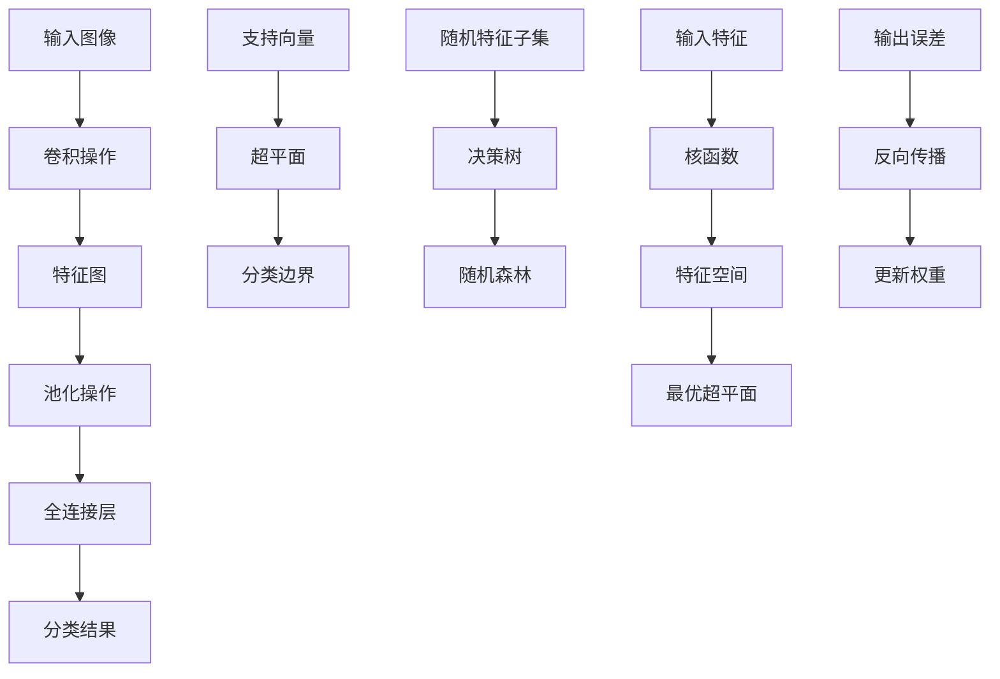

通过上述算法，太空探测器可以在复杂的太空环境中实现高效的目标识别，为自主导航提供重要支持。

#### 4.1.2 目标跟踪算法

目标跟踪是太空探测器自主导航中的关键环节，它能够确保探测器持续关注并准确跟踪目标天体。以下是几种常用的目标跟踪算法及其原理：

**1. 卡尔曼滤波（Kalman Filter）**

卡尔曼滤波是一种线性高斯滤波器，用于估计动态系统的状态。它通过预测和更新步骤，不断修正系统的状态估计，以实现对目标位置的精确跟踪。

- **预测步骤**：根据系统模型和上一时刻的状态估计，预测当前时刻的状态和误差协方差。
- **更新步骤**：利用观测数据，通过贝叶斯估计修正当前状态估计。

**2. 光流法（Optical Flow）**

光流法通过分析连续帧之间的像素运动，计算目标在图像中的运动轨迹。它基于图像局部特征的匹配，能够有效跟踪目标。

- **特征提取**：使用SIFT或SURF等算法提取图像特征点。
- **匹配与运动估计**：通过匹配相邻帧中的特征点，计算特征点的运动向量，从而估计目标的速度和位置。

**3. 基于深度学习的方法**

深度学习在目标跟踪中表现出色，特别是卷积神经网络（CNN）和循环神经网络（RNN）。

- **CNN**：通过训练深度神经网络，学习图像中的特征，实现对目标的精准识别和跟踪。常用的网络结构包括YOLO（You Only Look Once）和SSD（Single Shot MultiBox Detector）。
- **RNN**：通过循环结构，处理目标在时间序列中的运动轨迹，实现对目标的全局跟踪。LSTM（长短期记忆网络）和GRU（门控循环单元）是常用的RNN结构。

**算法原理图解**

以下是几种常用目标跟踪算法的Mermaid流程图，展示了其基本原理。

**卡尔曼滤波**

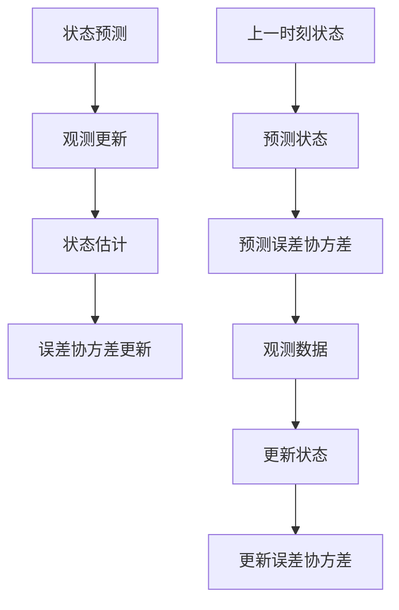

**光流法**

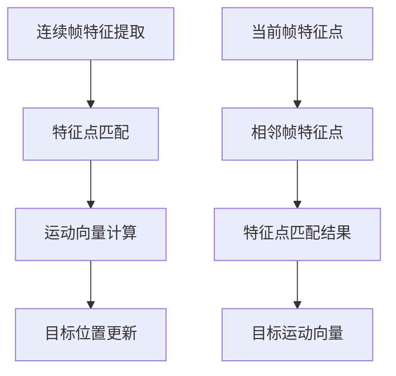

**基于CNN的目标跟踪**

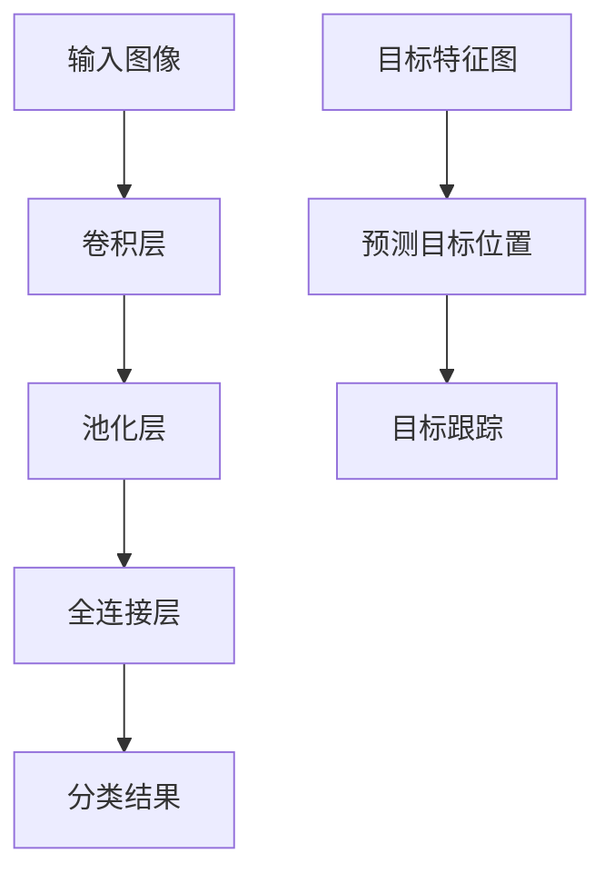

通过这些算法，太空探测器能够实现高效、准确的目标跟踪，为自主导航提供可靠的保障。

#### 4.2.1 环境感知技术

环境感知是太空探测器自主导航的核心环节，通过感知周围环境，探测器能够获取关键信息，从而做出精确的导航决策。以下是几种常用的环境感知技术：

**1. 激光雷达（LiDAR）**

激光雷达是一种通过发射激光脉冲并测量其反射时间来获取三维地形信息的传感器。它具有高分辨率、高精度和远距离测量的特点。

- **工作原理**：激光雷达发射激光脉冲，当激光脉冲照射到目标物体后，部分光会被反射回来。通过测量激光脉冲的飞行时间，可以计算出探测器与目标物体之间的距离。
- **应用实例**：激光雷达常用于地形地貌的测绘，如火星探测器的激光雷达可以精确绘制火星表面的三维地形图，为导航提供重要依据。

**2. 摄像头**

摄像头通过捕获图像，提供探测器的视觉感知。摄像头可以配备各种图像处理算法，用于识别目标、分析环境。

- **工作原理**：摄像头通过光学镜头捕捉图像，然后通过数字信号处理，将模拟信号转换为数字图像数据。
- **应用实例**：在太空探测任务中，摄像头用于获取行星表面图像，通过图像识别算法，可以识别地形特征、目标物体等，为导航和科学实验提供支持。

**3. 惯性测量单元（IMU）**

惯性测量单元是一种集成了加速度计、陀螺仪和磁力计的传感器，用于测量探测器的加速度、角速度和磁场。

- **工作原理**：加速度计测量探测器的线性加速度，陀螺仪测量角速度，磁力计测量磁场强度。这些传感器提供的数据可以用于计算探测器的姿态和运动状态。
- **应用实例**：IMU数据常用于惯性导航系统，通过积分加速度和角速度数据，可以计算出探测器的位置和姿态，为导航提供可靠的数据支持。

**4. 气象传感器**

气象传感器用于测量大气参数，如温度、湿度、气压等，提供环境信息。

- **工作原理**：气象传感器通过物理原理（如热传导、电导率等）测量气象参数，并将数据转换为电信号。
- **应用实例**：在太空探测任务中，气象传感器可以测量目标天体的大气参数，为探测器的导航和科学实验提供环境数据。

**5. 惯性导航系统**

惯性导航系统通过惯性传感器（如加速度计和陀螺仪）测量探测器的运动状态，实现自主导航。

- **工作原理**：惯性导航系统通过测量探测器的加速度和角速度，计算探测器的位置、速度和姿态。这些数据通过积分运算，可以生成探测器的导航轨迹。
- **应用实例**：惯性导航系统常用于航天器、无人机等自主导航，通过惯性传感器提供的实时数据，可以实现自主定位和路径规划。

通过以上环境感知技术，太空探测器能够获取全面、准确的环境信息，为自主导航提供关键数据支持。这些技术相互结合，可以大幅提升探测器的导航精度和任务完成能力。

#### 4.2.2 环境理解算法

环境理解是太空探测器自主导航中的关键环节，它通过综合分析传感器数据，实现对周围环境的深刻理解，从而支持精确导航和科学探测。以下是几种常用的环境理解算法：

**1. 地形分类算法**

地形分类算法用于将探测器获取的地形数据分类为不同的地形类型，如平原、山脉、峡谷等。

- **算法原理**：通过训练机器学习模型（如支持向量机SVM或卷积神经网络CNN），使用地形特征（如高度、坡度、纹理等）进行分类。训练过程中，模型从大量已标注的地形数据中学习，识别出不同地形类型的特征模式。
- **应用实例**：在火星探测任务中，地形分类算法可以帮助探测器识别潜在的危险区域，如陡峭的山坡或深度峡谷，从而优化导航路径，确保探测器的安全运行。

**2. 地形建模算法**

地形建模算法用于构建目标天体的三维地形模型，为探测器的导航和科学探测提供直观的地形信息。

- **算法原理**：通过激光雷达（LiDAR）或其他传感器获取的地形数据，使用三维重建技术（如点云处理和体素建模）构建地形模型。算法通过对大量点云数据进行处理，提取地形特征，并利用几何重建方法生成三维地形图。
- **应用实例**：在月球探测任务中，地形建模算法可以帮助探测器识别月球的潜在危险区域，如陨石坑和悬崖，从而优化探测路径，提高探测任务的成功率。

**3. 目标识别与跟踪算法**

目标识别与跟踪算法用于识别和跟踪探测器感兴趣的目标，如行星、卫星、小行星等。

- **算法原理**：通过卷积神经网络（CNN）或其他目标识别算法，对探测器获取的图像或传感器数据进行分析，识别出目标并跟踪其运动轨迹。算法通常包括特征提取、目标检测和目标跟踪三个步骤。
- **应用实例**：在彗星探测任务中，目标识别与跟踪算法可以帮助探测器持续关注彗星，实时获取彗星的位置和运动轨迹，为探测任务的顺利实施提供关键信息。

**4. 天体运动预测算法**

天体运动预测算法用于预测目标天体的运动轨迹，帮助探测器规划精确的导航路径。

- **算法原理**：通过基于物理的模型（如牛顿运动定律）或基于统计的方法（如卡尔曼滤波），对天体的运动进行建模和预测。算法利用历史数据和已知的物理规律，计算出目标天体在未来的位置和速度。
- **应用实例**：在木星探测器任务中，天体运动预测算法可以帮助探测器提前规划与木星及其卫星的会合时间，确保探测任务在最佳时机进行。

**5. 气象预测算法**

气象预测算法用于预测目标天体的大气状况，为探测器的导航和科学探测提供气象数据。

- **算法原理**：通过分析气象传感器数据，使用机器学习模型（如神经网络或支持向量机）进行气象预测。算法从历史气象数据中学习，识别出气象模式，并预测未来的气象状况。
- **应用实例**：在金星探测任务中，气象预测算法可以帮助探测器预测金星的大气变化，提前调整探测器的导航路径，避开恶劣气象条件，确保探测任务的安全和顺利。

通过这些环境理解算法，太空探测器能够对周围环境进行深入分析和理解，为自主导航和科学探测提供强有力的支持。这些算法的结合应用，使得探测器在复杂和变化多端的环境中，能够实现精确、高效的导航和科学任务。

#### 4.3.1 路径规划算法

路径规划是太空探测器自主导航中的关键环节，它涉及在复杂的宇宙环境中，为探测器规划一条从起始点到目标点的最优路径。以下将介绍几种常用的路径规划算法及其原理。

**1. A*算法**

A*算法是一种启发式搜索算法，用于在静态环境中寻找最优路径。其核心思想是利用一个启发函数，引导搜索过程，尽快找到最短路径。

- **算法原理**：A*算法通过两个代价函数，G成本和H成本，分别表示从起始点到当前节点的实际成本和启发成本。G成本为当前节点到起始点的距离，H成本为当前节点到目标点的启发距离。算法通过选择F成本（G成本 + H成本）最小的节点进行扩展，逐步生成路径。
- **优缺点**：A*算法在静态环境中表现优异，能够快速找到最优路径。但其在处理动态环境时，可能需要重新计算路径，导致计算复杂度较高。

**2. Dijkstra算法**

Dijkstra算法是一种无向图算法，用于在静态环境中计算单源最短路径。它与A*算法类似，但不需要启发函数。

- **算法原理**：Dijkstra算法通过逐步扩展未访问节点，计算从起始点到各个节点的最短路径。算法使用一个优先队列（通常为小根堆），每次选择最小代价的节点进行扩展。
- **优缺点**：Dijkstra算法在静态环境中计算效率较高，但与A*算法相比，其扩展节点数量可能更多，导致计算复杂度更高。

**3. 波前扩展算法（Wavefront Expansion）**

波前扩展算法是一种基于栅格地图的路径规划算法，通过逐步扩展栅格节点，构建最优路径。

- **算法原理**：波前扩展算法将地图划分为栅格节点，每个节点具有不同的代价。算法从起始节点开始，逐步扩展相邻节点，直到目标节点。扩展过程中，算法计算每个节点的父节点，最终构建出一条从起始点到目标点的最优路径。
- **优缺点**：波前扩展算法在处理静态和动态环境时都较为高效，但需要较大的存储空间来存储栅格节点信息。

**4. RRT（快速行进树）算法**

RRT算法是一种基于采样的随机搜索算法，通过在环境空间中生成随机采样点，构建出一条连接起始点和目标点的路径。

- **算法原理**：RRT算法通过以下步骤进行路径规划：
  1. 从起始点生成一个随机采样点。
  2. 将采样点与当前树中的节点进行连接，生成新节点。
  3. 如果新节点未达到目标点，将其添加到树中。
  4. 重复步骤1-3，直到生成连接起始点和目标点的路径。
- **优缺点**：RRT算法在处理复杂和动态环境时表现优异，能够快速找到近似最优路径。但其在处理稀疏环境时，路径规划效果可能不佳。

**算法原理图解**

以下是上述算法的Mermaid流程图，展示其基本原理。

**A*算法**

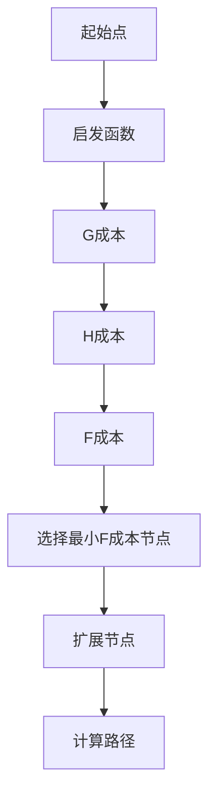

**Dijkstra算法**

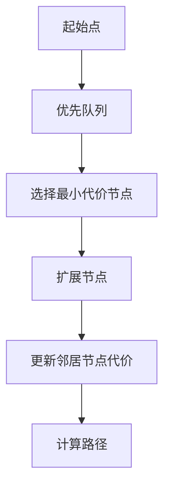

**波前扩展算法**

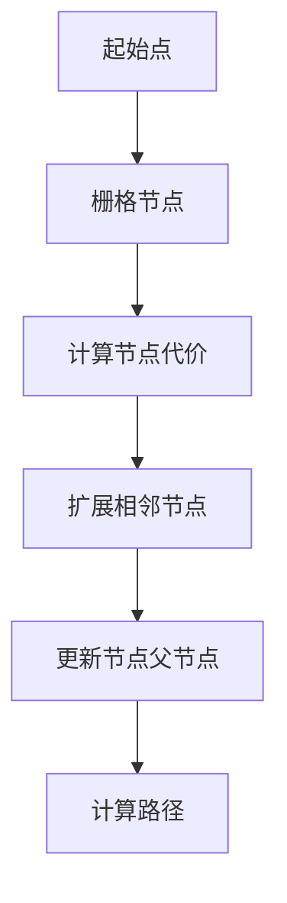

**RRT算法**

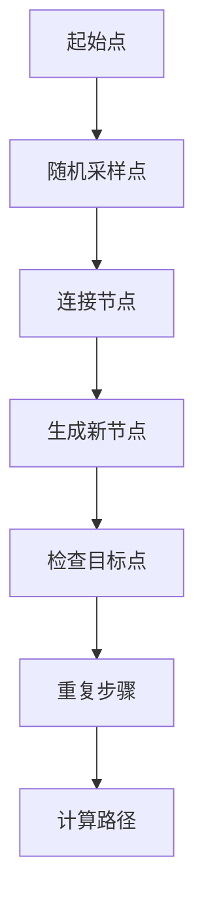

通过上述算法，太空探测器能够在复杂的宇宙环境中，实现高效、可靠的路径规划，为深空探测任务提供强有力的支持。

#### 4.3.2 决策算法

决策算法是太空探测器自主导航中的关键组成部分，通过分析实时数据和导航目标，探测器能够制定出最优的导航决策。以下介绍几种常用的决策算法及其原理：

**1. 基于规则的决策算法**

基于规则的决策算法通过一系列预设的规则，对探测器的状态和任务进行判断，并生成相应的导航决策。

- **算法原理**：该算法首先定义一组规则，每条规则包含一个条件和一个动作。在决策过程中，探测器根据当前状态，匹配规则的条件，并执行相应的动作。例如，如果探测器的位置距离目标点过远，则执行加速动作。

- **优缺点**：基于规则的决策算法简单易实现，且在规则明确的情况下，能够提供稳定的导航决策。然而，该算法对复杂环境适应性较差，难以处理不确定性和动态变化。

**2. 强化学习决策算法**

强化学习决策算法通过模拟探测器与环境之间的交互，学习最优的导航决策策略。

- **算法原理**：强化学习算法由代理人（探测器）、环境、状态、动作和奖励等组成。探测器在特定状态下执行动作，从环境中获取奖励信号，并不断调整决策策略，以实现长期回报最大化。常见的强化学习算法包括Q学习、深度Q网络（DQN）和策略梯度（PG）。

- **优缺点**：强化学习算法能够处理复杂和动态的环境，通过学习环境中的奖励机制，生成自适应的导航决策。然而，该算法需要大量训练数据和计算资源，且训练过程可能存在不稳定性和收敛缓慢的问题。

**3. 马尔可夫决策过程（MDP）**

马尔可夫决策过程是一种数学模型，用于描述决策过程中的不确定性，通过状态转移概率和奖励函数，生成最优导航决策。

- **算法原理**：MDP模型由状态集、动作集、状态转移概率和奖励函数组成。探测器在特定状态下执行动作，状态转移概率描述了从当前状态转移到下一状态的可能性，奖励函数则描述了执行动作后的奖励。通过求解MDP的最优策略，探测器能够生成最优导航决策。

- **优缺点**：MDP模型能够处理不确定性，并提供理论上的最优导航决策。然而，该模型对状态空间和动作空间的规模敏感，状态空间和动作空间过大可能导致计算复杂度急剧增加。

**4. 贝叶斯决策算法**

贝叶斯决策算法基于概率论，通过计算不同决策的贝叶斯下概率，生成最优导航决策。

- **算法原理**：贝叶斯决策算法假设探测器对环境状态的不确定性有一个先验概率分布，通过观测数据更新先验分布，计算不同决策的贝叶斯下概率。选择贝叶斯下概率最大的决策作为最优导航决策。

- **优缺点**：贝叶斯决策算法能够处理不确定性和动态变化的环境，通过不断更新先验分布，适应环境的变化。然而，该算法在处理高维状态空间时，计算复杂度较高。

**算法原理图解**

以下是几种决策算法的Mermaid流程图，展示其基本原理。

**基于规则的决策算法**

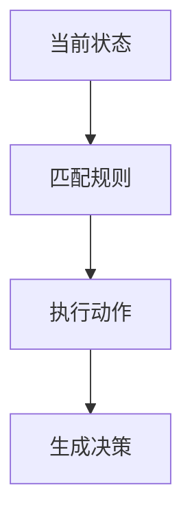

**强化学习决策算法**

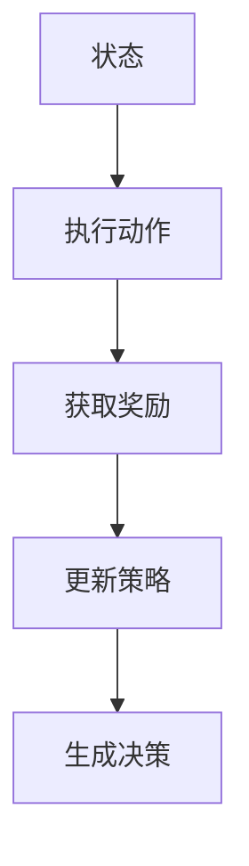

**马尔可夫决策过程（MDP）**

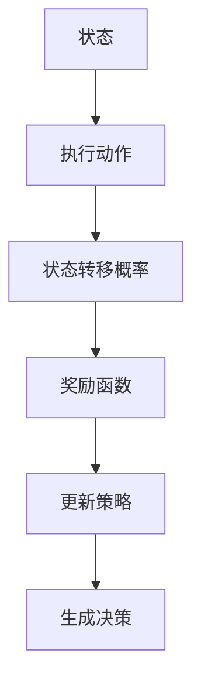

**贝叶斯决策算法**

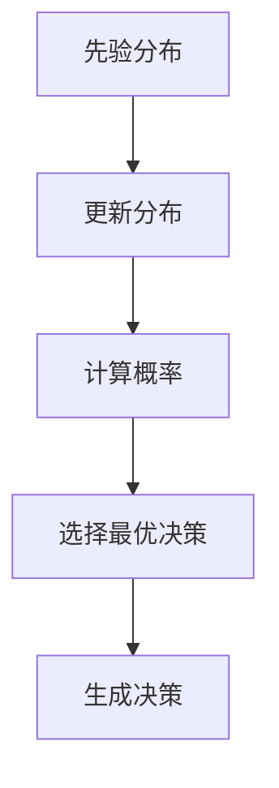

通过这些决策算法，太空探测器能够在复杂和变化多端的环境中，实现智能、高效的导航决策，确保探测任务的顺利实施。

#### 4.4.1 数据处理技术

在太空探测器自主导航中，数据处理技术起着至关重要的作用。通过有效的数据处理，探测器能够从大量的传感器数据中提取有用信息，为导航和科学探测提供精确支持。以下是几种常用的数据处理技术及其原理：

**1. 数据采集**

数据采集是数据处理的初始步骤，探测器通过多种传感器（如摄像头、激光雷达、IMU等）获取环境信息。传感器数据通常包含丰富的信息，但同时也可能存在噪声和冗余。

- **原理**：传感器数据采集通常包括模拟信号和数字信号。模拟信号通过传感器转换为电信号，然后通过模数转换（ADC）转换为数字信号。数字信号通过数据总线传输到处理单元。

**2. 数据预处理**

数据预处理是数据清洗和归一化的过程，旨在去除噪声、填补缺失值和标准化数据。预处理后的数据更便于后续分析和建模。

- **原理**：数据预处理包括以下几个步骤：
  - **去噪**：使用滤波算法（如均值滤波、中值滤波和高斯滤波）去除数据中的噪声。
  - **填补缺失值**：使用插值或均值填补方法填补缺失的数据。
  - **归一化**：通过线性变换将不同尺度的数据映射到相同的范围内，便于模型训练和优化。

**3. 特征提取**

特征提取是从原始数据中提取有用的特征，用于后续分析和建模。特征提取有助于减少数据维度，提高模型的训练效率和预测准确性。

- **原理**：特征提取包括以下几个步骤：
  - **图像处理**：使用卷积神经网络（CNN）提取图像特征，如图像边缘、纹理和形状。
  - **信号处理**：使用傅里叶变换、小波变换等信号处理技术提取信号的频率特征。
  - **统计方法**：使用统计方法提取数据的统计特征，如均值、方差和相关性。

**4. 数据融合**

数据融合是将来自多个传感器或多个时间点的数据整合在一起，以提高数据完整性和准确性。数据融合有助于提高探测器的环境感知能力。

- **原理**：数据融合包括以下几个步骤：
  - **特征级融合**：将提取的特征向量进行合并和融合，使用加权平均或投票机制。
  - **决策级融合**：将多个传感器的检测结果进行综合判断，使用融合规则或优化算法。

**应用实例**

- **火星探测任务**：在火星探测任务中，探测器使用多个传感器（如摄像头、激光雷达、IMU等）获取环境数据。通过预处理和特征提取，探测器可以从图像中识别地形特征，从激光雷达数据中提取距离信息，从IMU数据中获取姿态信息。数据融合技术有助于提高地形和环境的感知精度，为导航和科学探测提供支持。

- **小行星探测任务**：在小行星探测任务中，探测器使用激光雷达和光谱仪获取小行星的表面信息和成分数据。通过特征提取和数据处理技术，探测器可以识别小行星的表面结构、成分分布和矿产资源，为未来的资源开采和利用提供科学依据。

通过这些数据处理技术，太空探测器能够从复杂和变化多端的环境中，提取有用信息，实现高效的导航和科学探测。

#### 4.4.2 数据融合方法

数据融合是将来自多个传感器或多个时间点的数据整合在一起，以提高数据的完整性和准确性。在太空探测器自主导航中，数据融合技术至关重要，它有助于提升探测器的环境感知能力和导航精度。以下是几种常用的数据融合方法及其应用：

**1. 传感器级数据融合**

传感器级数据融合是指在传感器层面将多个传感器的数据直接进行融合。这种方法主要关注传感器数据的同步和误差修正。

- **原理**：传感器级数据融合包括以下几个步骤：
  - **时间同步**：将不同传感器的时间戳对齐，确保数据在同一时间基准上。
  - **误差修正**：通过校准和补偿方法，修正传感器数据的误差，提高数据精度。
  - **数据合成**：将修正后的传感器数据合成一个统一的视图，用于后续处理。

- **应用实例**：在火星探测任务中，探测器使用多个传感器（如摄像头、激光雷达、IMU等）获取环境数据。通过传感器级数据融合，探测器可以整合不同传感器的数据，形成更全面的环境感知，为导航和科学探测提供支持。

**2. 特征级数据融合**

特征级数据融合是在特征提取阶段将多个传感器的特征进行融合。这种方法通过提取各个传感器的关键特征，形成新的特征向量，用于后续分析。

- **原理**：特征级数据融合包括以下几个步骤：
  - **特征提取**：使用不同的算法（如CNN、SVM等）提取各个传感器的特征。
  - **特征融合**：将提取的特征向量进行融合，常用的方法包括加权融合、投票机制和特征空间融合。
  - **特征优化**：通过优化特征组合，提高融合数据的表征能力。

- **应用实例**：在月球探测任务中，探测器使用激光雷达、摄像头和光谱仪获取不同类型的数据。通过特征级数据融合，探测器可以提取出地形、成分和环境信息，为导航和科学探测提供高质量的数据支持。

**3. 决策级数据融合**

决策级数据融合是在决策层面将多个传感器的数据综合起来，用于生成最终的导航决策。

- **原理**：决策级数据融合包括以下几个步骤：
  - **决策生成**：使用不同的算法（如Q-learning、DQN等）对各个传感器的数据生成导航决策。
  - **决策融合**：通过加权或投票机制，综合多个传感器的导航决策，生成最终的导航策略。
  - **决策优化**：通过优化决策策略，提高导航的准确性和可靠性。

- **应用实例**：在彗星探测任务中，探测器使用多个传感器（如雷达、光谱仪、摄像头等）获取彗星的信息。通过决策级数据融合，探测器可以综合不同传感器的信息，生成最优的导航决策，确保探测器在复杂环境中顺利执行探测任务。

**4. 模型级数据融合**

模型级数据融合是在模型训练阶段将多个传感器或多个时间点的数据进行融合，用于训练更加准确的模型。

- **原理**：模型级数据融合包括以下几个步骤：
  - **数据集成**：将来自多个传感器或多个时间点的数据进行集成，形成一个统一的数据集。
  - **模型训练**：使用集成后的数据集训练机器学习模型，如CNN、RNN等。
  - **模型优化**：通过优化模型参数，提高模型的泛化能力和预测准确性。

- **应用实例**：在金星探测任务中，探测器使用多个传感器获取金星的大气数据。通过模型级数据融合，探测器可以训练出更加准确的气象预测模型，为导航和科学探测提供可靠的气象信息。

通过以上数据融合方法，太空探测器能够在复杂和变化多端的环境中，获取高质量的环境信息，提高导航的准确性和可靠性，为深空探测任务提供强有力的支持。

### 4.4.3 实时数据处理技术

实时数据处理技术在太空探测器自主导航中至关重要，它确保探测器能够实时获取并处理大量的传感器数据，为导航和科学探测提供及时、准确的支持。以下是几种常用的实时数据处理技术及其原理：

**1. 流数据处理**

流数据处理是一种处理连续数据流的技术，适用于实时性和高吞吐量的数据处理需求。常见的流数据处理框架包括Apache Kafka、Apache Flink和Apache Storm。

- **原理**：流数据处理技术通过数据管道，将实时数据从传感器传输到处理单元。数据管道通常包括数据采集、数据传输、数据存储和数据加工等环节。数据在管道中实时处理，生成中间结果，最终形成完整的数据流。
- **应用实例**：在火星探测任务中，探测器通过摄像头、激光雷达和IMU等传感器采集环境数据。流数据处理技术可以将这些数据实时传输到地面站，进行快速处理和分析，为导航决策提供及时支持。

**2. 增量数据处理**

增量数据处理是一种处理数据增量变化的技术，适用于对历史数据进行更新和优化。常见的增量数据处理算法包括增量学习算法和增量数据融合算法。

- **原理**：增量数据处理通过监测数据的变化，只处理数据增量部分，减少计算量。例如，在机器学习模型训练过程中，增量数据处理算法只对新增或变化的数据进行训练，而不需要对整个数据集重新训练。
- **应用实例**：在月球探测任务中，探测器通过传感器采集的历史数据不断更新。增量数据处理技术可以实时监测数据变化，更新地形和气象模型，为导航和科学探测提供实时、准确的参考。

**3. 实时数据挖掘**

实时数据挖掘是一种在数据流中实时挖掘知识的技术，通过分析实时数据，发现潜在的模式和趋势。常见的实时数据挖掘算法包括关联规则挖掘、聚类分析和异常检测。

- **原理**：实时数据挖掘通过构建实时分析模型，对数据流进行实时分析，提取有价值的信息。例如，在彗星探测任务中，实时数据挖掘可以分析探测器获取的传感器数据，识别彗星的运动轨迹和成分变化，为导航和科学探测提供实时决策支持。
- **应用实例**：在金星探测任务中，探测器通过多个传感器获取金星的大气数据。实时数据挖掘技术可以实时分析大气数据，发现大气中的异常现象，如气压突变或温度异常，为探测器提供及时预警。

**4. 实时优化算法**

实时优化算法是一种在实时环境中对模型和策略进行优化的技术，通过不断调整模型参数，提高模型的预测准确性和导航性能。

- **原理**：实时优化算法通过实时监测环境变化，动态调整探测器的导航策略。常见的实时优化算法包括动态规划、深度强化学习和模型预测控制。
- **应用实例**：在木星探测任务中，探测器通过实时优化算法，根据木星及其卫星的运动轨迹和探测目标，动态调整探测器的导航路径，确保探测器在最佳时机进行探测，提高探测任务的效率。

通过以上实时数据处理技术，太空探测器能够实时、准确地处理传感器数据，为导航和科学探测提供强有力的支持。这些技术的应用，不仅提高了探测器的自主导航能力，还为深空探测任务的成功实施提供了重要保障。

### 4.4.4 数据分析技术在太空探测器自主导航中的应用

数据分析技术在太空探测器自主导航中发挥着至关重要的作用，通过高效的数据分析，探测器能够从海量传感器数据中提取有价值的信息，支持导航决策和科学探测。以下是几种常用的数据分析技术及其在太空探测器自主导航中的应用：

**1. 聚类分析**

聚类分析是一种无监督学习方法，用于将数据集划分为多个聚类，使同一聚类内的数据点尽可能相似，而不同聚类内的数据点尽可能不同。

- **应用实例**：在火星探测任务中，聚类分析可以用于对火星表面的地形进行分类。通过分析激光雷达获取的高度数据，将火星表面划分为平原、山脉和峡谷等不同地形类型。这有助于探测器在规划路径时避开危险区域，确保探测器的安全运行。

**2. 主成分分析（PCA）**

主成分分析是一种降维技术，通过将高维数据投影到低维空间，减少数据维度，同时保留大部分信息。

- **应用实例**：在月球探测任务中，主成分分析可以用于处理来自多个传感器的数据，如摄像头、激光雷达和IMU等。通过将高维数据降维，PCA可以简化数据处理流程，提高模型训练效率，同时保留关键的地质和气象信息。

**3. 机器学习模型**

机器学习模型通过训练大量数据，学习数据中的模式和规律，用于预测和分类。

- **应用实例**：在彗星探测任务中，机器学习模型可以用于识别彗星的不同成分。通过训练基于深度学习（如卷积神经网络CNN）的模型，探测器可以从光谱数据中识别出彗星的主要成分，为科学分析提供依据。

**4. 时序分析**

时序分析是一种用于处理时间序列数据的方法，通过分析数据的时间依赖关系，提取有价值的信息。

- **应用实例**：在金星探测任务中，时序分析可以用于预测金星的大气变化。通过分析历史大气数据，时序分析模型可以预测未来一段时间内的大气温度、气压和成分变化，为探测器的导航和科学探测提供实时参考。

**5. 异常检测**

异常检测是一种用于识别数据中的异常或离群点的技术，通过分析数据的分布和模式，检测出与预期不一致的数据。

- **应用实例**：在木星探测任务中，异常检测可以用于监测探测器的传感器数据。通过分析传感器的数据分布，异常检测模型可以检测出传感器故障或数据异常，为探测器提供及时的故障预警，确保探测任务的顺利进行。

通过这些数据分析技术，太空探测器能够从复杂和多变的环境中提取有价值的信息，为导航决策和科学探测提供强有力的支持。这些技术的综合应用，不仅提高了探测器的自主导航能力，还为深空探测任务的成功实施提供了重要保障。

#### 4.5.1 案例一：火星探测器的自主导航

火星探测器是人类深空探测中的重要任务之一，其中自主导航技术的应用至关重要。本节将通过介绍火星探测器的自主导航案例，展示AI技术在目标识别、路径规划和决策制定等方面的具体应用，以及这些技术如何助力深空探测任务的顺利实施。

**5.1.1 案例背景**

火星探测任务的目标是研究火星的地质结构、气候条件和潜在的生命迹象。为了实现这一目标，探测器需要能够自主导航，穿越复杂的火星地形，到达预定的探测点。火星探测器的自主导航涉及到多种AI技术的综合应用，包括目标识别、环境感知、路径规划和实时数据处理等。

**5.1.2 AI算法应用**

1. **目标识别**：

火星探测器在导航过程中，需要识别和跟踪多个目标，如火星表面的岩石、陨石坑和潜在的着陆点。为此，探测器采用了基于卷积神经网络（CNN）的目标识别算法。

- **算法原理**：卷积神经网络通过多层卷积和池化操作，提取图像中的关键特征，实现对目标的精确识别。在训练过程中，模型使用大量的火星地表图像进行训练，学习不同目标的特征模式。

- **应用实例**：在“火星勘测轨道飞行器”（Mars Reconnaissance Orbiter，MRO）的任务中，探测器通过CNN模型，识别并跟踪了多个火星表面的特征点，为导航提供了重要参考。例如，探测器在图像中成功识别出直径超过1公里的陨石坑，避开了这些潜在的导航障碍。

2. **路径规划**：

火星探测器的路径规划是一个复杂的问题，需要考虑地形、障碍物和能量消耗等因素。为此，探测器采用了基于A*算法和RRT算法的路径规划技术。

- **算法原理**：A*算法是一种启发式搜索算法，通过评估节点的F成本（G成本 + H成本），选择最优路径。RRT算法是一种随机搜索算法，通过在环境空间中生成随机采样点，构建出一条连接起始点和目标点的路径。

- **应用实例**：在“火星探测车”（Mars Exploration Rover，MER）任务中，探测器的路径规划系统结合了A*算法和RRT算法，有效避开了火星表面的陡峭山坡和悬崖，成功到达了多个预定的探测点。例如，在“勇气号”（Spirit）探测器的任务中，路径规划系统帮助探测器绕过了多个陨石坑，确保了探测任务的顺利进行。

3. **决策制定**：

在火星探测任务中，探测器需要根据实时数据和导航目标，制定出最优的导航决策。为此，探测器采用了基于强化学习（Reinforcement Learning，RL）的决策制定技术。

- **算法原理**：强化学习通过模拟探测器与环境之间的交互，学习最优的导航决策策略。在训练过程中，模型通过试错和反馈，不断优化决策策略，实现长期回报最大化。

- **应用实例**：在“机遇号”（Opportunity）探测器的任务中，探测器采用了基于Q学习的强化学习模型，实现了自主导航和任务决策。例如，探测器在遇到复杂地形时，能够根据历史数据和当前状态，选择最优的路径和行动策略，成功避开了多个障碍物，继续执行探测任务。

**总结**：

火星探测器的自主导航案例展示了AI技术在目标识别、路径规划和决策制定等方面的成功应用。通过卷积神经网络（CNN）的目标识别算法，探测器能够精确识别火星表面的特征点；通过A*算法和RRT算法的路径规划技术，探测器能够有效避开障碍物，规划出最优路径；通过强化学习（RL）的决策制定技术，探测器能够根据实时数据和导航目标，制定出最优的导航决策。这些技术的综合应用，为火星探测任务提供了强有力的技术支持，确保了探测任务的顺利实施和成功完成。

#### 4.5.2 案例二：小行星探测任务

小行星探测任务旨在研究小行星的结构、成分和轨道信息，为未来的小行星资源开采和防御提供科学依据。在这一任务中，自主导航技术的重要性尤为突出，因为小行星轨道的不确定性和环境复杂性对导航提出了极高的要求。以下将介绍一个小行星探测任务的案例，展示AI技术在自主导航中的具体应用。

**5.2.1 案例背景**

某国际探测任务计划对一颗名为“阿波罗”的小行星进行详细探测。阿波罗小行星是一颗近地天体，其轨道和表面环境具有高度不确定性。为了成功完成任务，探测器需要具备强大的自主导航能力，以应对轨道变化和复杂地形。

**5.2.2 AI算法应用**

1. **目标识别与跟踪**：

探测器需要识别和跟踪小行星上的潜在探测目标，如陨石坑、岩石和特殊矿物质。为此，采用了基于深度学习（如卷积神经网络CNN）的目标识别和跟踪算法。

- **算法原理**：卷积神经网络通过多层卷积和池化操作，提取图像中的关键特征，实现对目标的精确识别。跟踪算法则通过连续帧之间的目标匹配，实现对目标的持续跟踪。

- **应用实例**：在探测任务中，探测器通过CNN模型，成功识别出小行星表面的多个陨石坑和岩石。这些目标信息为探测器的路径规划和科学实验提供了重要参考。例如，探测器在识别出一个直径超过500米的陨石坑后，避开了该区域，确保了探测器的安全。

2. **路径规划与决策**：

为了顺利到达小行星表面并进行探测，探测器需要规划一条最优路径。路径规划算法需要考虑小行星的复杂地形、障碍物和探测目标。

- **算法原理**：路径规划算法包括基于采样的RRT算法和基于搜索的A*算法。RRT算法通过随机采样和连接采样点，生成一条连接起始点和目标点的路径。A*算法则通过评估节点的F成本（G成本 + H成本），选择最优路径。

- **应用实例**：在探测任务中，探测器采用了RRT算法进行路径规划。通过模拟小行星的复杂地形，算法成功生成了一条避开障碍物、直达目标探测点的路径。例如，探测器在规划路径时避开了多个高坡度和高风险区域，确保了任务的顺利实施。

3. **实时数据处理与融合**：

在探测任务中，探测器需要实时处理来自多个传感器的数据，如激光雷达、摄像头和光谱仪等，以便获得全面的探测信息。

- **算法原理**：实时数据处理技术包括数据采集、预处理、特征提取和融合等步骤。数据预处理旨在去除噪声和冗余，特征提取旨在提取关键信息，数据融合旨在整合多源数据，提高信息准确性。

- **应用实例**：在探测任务中，探测器通过实时数据处理技术，成功处理并融合了来自激光雷达、摄像头和光谱仪的数据。例如，探测器通过激光雷达数据，构建了小行星的三维地形模型；通过光谱仪数据，分析了小行星表面的成分分布。这些数据为探测器的导航和科学实验提供了宝贵的信息。

4. **环境感知与理解**：

探测器需要通过传感器数据，对周围环境进行感知和理解，以确保导航决策的准确性。

- **算法原理**：环境感知与理解算法包括地形分类、天体运动预测和气象预测等。通过分析传感器数据，探测器可以识别地形类型、预测天体运动和预测气象变化。

- **应用实例**：在探测任务中，探测器通过地形分类算法，成功识别出小行星表面的不同地形类型，如平原、山脉和陨石坑。通过天体运动预测算法，探测器预测了小行星的运动轨迹，为导航提供了关键信息。通过气象预测算法，探测器预测了小行星表面的大气状况，为探测器的安全运行提供了保障。

**总结**：

小行星探测任务案例展示了AI技术在自主导航中的广泛应用。通过目标识别与跟踪、路径规划与决策、实时数据处理与融合和环境感知与理解等技术，探测器成功实现了对小行星的精确探测。这些技术的综合应用，不仅提高了探测器的自主导航能力，还为未来深空探测任务提供了宝贵的经验和参考。

### 第6章 太空探测器自主导航系统的设计与实现

#### 6.1 系统需求分析

太空探测器自主导航系统的设计与实现需要全面考虑系统的功能需求、性能需求、安全性需求等多方面因素。以下是对系统需求分析的详细讨论：

**功能需求**：

1. **目标识别与跟踪**：系统能够识别并跟踪探测目标，如行星、卫星、小行星等。具体包括：
   - 实时处理图像、雷达和激光雷达数据；
   - 基于深度学习算法进行目标识别和跟踪；
   - 提供目标位置和运动轨迹信息。

2. **路径规划**：系统能够规划探测器的最优路径，包括：
   - 针对复杂地形和障碍物的路径规划；
   - 考虑能量消耗和探测需求，优化路径；
   - 支持动态路径调整，以应对环境变化。

3. **决策制定**：系统能够根据实时数据和导航目标，制定最优导航决策，包括：
   - 使用强化学习算法进行决策制定；
   - 考虑安全性和探测目标，实现智能决策。

4. **实时数据处理与融合**：系统能够实时处理传感器数据，包括：
   - 实时数据采集、预处理和特征提取；
   - 数据融合技术，提高数据准确性；
   - 支持多传感器数据融合，提供全面的环境信息。

5. **环境感知与理解**：系统能够对周围环境进行感知和理解，包括：
   - 利用多种传感器数据，构建三维地形模型；
   - 预测天体运动和气象变化，为导航提供支持；
   - 实时更新环境信息，支持动态导航。

**性能需求**：

1. **计算能力**：系统能够处理高频率、高分辨率的传感器数据，支持实时数据处理和导航决策。
2. **精度与可靠性**：系统能够提供高精度、高可靠性的导航信息，确保探测器安全、准确地到达目标。
3. **响应速度**：系统能够快速响应环境变化，实时更新导航决策，保证探测任务的顺利进行。
4. **能量效率**：系统能够优化能量消耗，延长探测器的任务寿命。

**安全性需求**：

1. **数据安全**：确保传感器数据和导航信息的安全性，防止数据泄露和篡改。
2. **系统稳定性**：系统在长时间运行中保持稳定，防止因故障导致导航失误。
3. **故障应对**：系统能够应对传感器故障、通信中断等异常情况，保障探测任务的安全。

通过以上系统需求分析，为太空探测器自主导航系统的设计与实现提供了明确的方向和依据。

#### 6.2 系统架构设计

太空探测器自主导航系统需要一个高效、可靠的架构来支持其复杂的功能和需求。以下是系统架构的详细设计，包括系统架构概述、各模块的功能和接口设计。

**6.2.1 系统架构概述**

系统架构采用模块化设计，主要分为以下几个模块：

1. **传感器模块**：负责采集环境信息，包括摄像头、激光雷达、IMU等传感器。传感器模块通过接口与数据预处理模块和数据处理模块连接。

2. **数据预处理模块**：对传感器数据进行预处理，包括去噪、归一化和融合等操作。预处理后的数据传递给数据处理模块。

3. **数据处理模块**：负责对预处理后的传感器数据进行分析和特征提取，包括目标识别、环境感知和路径规划等。数据处理模块输出导航决策和路径规划结果。

4. **导航决策模块**：根据数据处理模块输出的结果，结合实时数据和目标信息，制定最优导航决策。导航决策模块通过接口与执行控制模块连接。

5. **执行控制模块**：根据导航决策，控制探测器的运动，实现自主导航。执行控制模块与传感器模块和导航决策模块进行交互。

6. **通信模块**：负责与地面站进行通信，传输导航数据和探测信息，并接收地面指令。

**6.2.2 模块功能与接口设计**

1. **传感器模块**：
   - 功能：采集环境信息，包括图像、雷达数据和IMU数据。
   - 接口设计：传感器模块通过标准接口（如I2C、SPI等）与数据预处理模块连接，提供实时数据流。

2. **数据预处理模块**：
   - 功能：对传感器数据进行预处理，包括去噪、归一化和融合等。
   - 接口设计：数据预处理模块接收传感器模块的数据流，处理后输出给数据处理模块。

3. **数据处理模块**：
   - 功能：对预处理后的传感器数据进行分析和特征提取，包括目标识别、环境感知和路径规划等。
   - 接口设计：数据处理模块与传感器模块和导航决策模块连接，接收传感器数据，输出导航决策和路径规划结果。

4. **导航决策模块**：
   - 功能：根据数据处理模块输出的结果，结合实时数据和目标信息，制定最优导航决策。
   - 接口设计：导航决策模块与数据处理模块和执行控制模块连接，接收数据处理结果，输出导航决策。

5. **执行控制模块**：
   - 功能：根据导航决策，控制探测器的运动，实现自主导航。
   - 接口设计：执行控制模块接收导航决策模块的指令，控制传感器模块和执行机构。

6. **通信模块**：
   - 功能：负责与地面站进行通信，传输导航数据和探测信息，并接收地面指令。
   - 接口设计：通信模块通过无线电通信接口与地面站连接，实现数据传输和指令接收。

通过以上系统架构设计，太空探测器自主导航系统实现了功能模块的解耦，提高了系统的可靠性、可维护性和可扩展性，为深空探测任务提供了强有力的技术支持。

#### 6.3 系统实现与部署

**6.3.1 系统实现**

太空探测器自主导航系统的实现涉及多个模块的集成与优化。以下是系统实现的详细过程：

1. **传感器集成**：首先，将不同类型的传感器（如摄像头、激光雷达、IMU等）集成到探测器中。传感器需要具备高精度和可靠性，以获取准确的环境信息。

2. **数据预处理**：对传感器数据进行预处理，包括去噪、归一化和融合。预处理过程需要确保数据的准确性和一致性，以支持后续的分析和决策。

3. **算法实现**：实现目标识别、路径规划和决策制定等核心算法。这些算法通常基于机器学习、深度学习和强化学习等技术，需要经过严格的测试和验证。

4. **系统集成**：将各个模块集成到系统中，实现数据流和功能调用。系统需要具备模块化设计，以方便维护和升级。

5. **调试与优化**：在系统集成的过程中，进行大量的调试和优化，确保系统的稳定性和性能。调试过程包括模拟环境测试和实际探测器测试。

**6.3.2 系统部署**

系统部署是将实现后的导航系统部署到实际探测任务中。以下是系统部署的详细步骤：

1. **环境准备**：在探测器发射前，对导航系统进行环境准备，包括测试传感器、调试算法和配置系统参数。

2. **任务规划**：根据探测任务的需求，制定详细的任务规划，包括探测目标、路径规划和时间表。

3. **发射与运行**：探测器发射后，导航系统开始运行。系统需要实时处理传感器数据，生成导航决策，并控制探测器的运动。

4. **数据传输与反馈**：将导航数据和探测信息实时传输到地面站，进行后续分析和反馈。地面站可以对导航决策进行评估和调整。

5. **任务评估**：在探测任务结束后，对导航系统进行评估，包括性能分析、故障诊断和改进建议。

通过以上步骤，太空探测器自主导航系统能够在探测任务中稳定运行，为探测器的导航和科学探测提供可靠支持。

### 第7章 未来发展方向与挑战

#### 7.1 未来发展方向

随着人工智能（AI）技术的不断进步，太空探测器自主导航在未来将迎来更多的发展机遇。以下是未来发展的几个关键方向：

**1. 人工智能技术的进一步优化**

未来的发展将聚焦于优化AI算法，提高其在太空探测导航中的性能。具体包括：
- **强化学习算法的改进**：针对太空探测的动态和复杂环境，强化学习算法将不断优化，以提高导航决策的实时性和准确性。
- **深度学习模型的优化**：通过改进卷积神经网络（CNN）和递归神经网络（RNN）等深度学习模型，提高环境感知和目标识别的精度。

**2. 多传感器融合技术的进步**

多传感器融合是提高太空探测器自主导航精度的重要手段。未来，多传感器融合技术将更加成熟，包括：
- **数据融合算法的创新**：开发更加高效和准确的数据融合算法，整合来自不同传感器的数据，提供更全面的环境信息。
- **传感器网络的发展**：建立分布式传感器网络，实现探测器的全面监控和导航支持。

**3. 高性能计算平台的应用**

高性能计算平台将为太空探测导航提供强大的计算支持。未来，将采用更先进的硬件和软件平台，如量子计算和边缘计算，以提高计算速度和处理能力。

**4. 探测器自主性提升**

未来，太空探测器将具备更高的自主性，能够在更复杂和不可预测的环境中独立运行。具体包括：
- **自主任务规划**：探测器将能够根据实时数据和环境信息，自主规划探测任务和导航路径。
- **自主故障处理**：探测器将具备自主应对故障和异常情况的能力，确保探测任务的连续性。

**5. 跨学科合作与技术创新**

太空探测导航是一个跨学科领域，未来将需要更多的跨学科合作，整合计算机科学、航天工程、物理学等多领域的知识，推动技术创新。

#### 7.2 挑战与机遇

虽然太空探测器自主导航有广阔的发展前景，但同时也面临着诸多挑战：

**1. 数据处理与存储**

随着传感器技术的进步，探测器将产生大量数据。如何在有限的空间和计算资源下，高效地处理和存储这些数据，是一个重要挑战。未来，需要开发更加高效的数据处理和存储技术。

**2. 环境复杂性**

太空探测环境复杂多变，包括地形、天体运动和气象变化等。如何应对这些复杂因素，提高导航系统的鲁棒性和适应性，是一个关键挑战。

**3. 能量供应与效率**

在太空探测任务中，能量供应是一个重要问题。未来需要开发更加高效的能量管理技术和能量供应系统，以确保探测器的长时间运行。

**4. 安全性与可靠性**

太空探测导航系统的安全性至关重要。如何在复杂和极端环境下确保系统的稳定性和可靠性，防止故障和事故，是一个持续挑战。

**5. 法律与伦理**

随着太空探测的扩展，相关的法律和伦理问题也将日益突出。如何确保探测活动的合法性和伦理性，保护地球和太空环境，是一个重要的议题。

**总结**

未来，太空探测器自主导航将在AI技术、多传感器融合、高性能计算和自主性等方面取得显著进步，但同时也面临数据处理、环境复杂性、能量供应和安全可靠性等多重挑战。通过技术创新和跨学科合作，这些挑战有望逐步克服，推动太空探测任务向更高水平发展。

### 第8章 结论

本文系统地探讨了AI在太空探测器自主导航中的应用，通过详细分析AI技术的理论基础、具体应用案例以及系统设计与实现，展示了AI技术如何提升太空探测任务的自主性和可靠性。以下是本文的主要成果和未来展望：

**主要成果**：

1. **AI技术基础**：介绍了AI的基本概念、核心技术（包括机器学习、深度学习和强化学习）及其在太空探测器导航中的应用。
2. **目标识别与跟踪**：探讨了基于卷积神经网络的图像处理技术，如何在目标识别和跟踪中发挥作用。
3. **路径规划与决策**：介绍了A*算法、RRT算法等路径规划算法，以及强化学习在导航决策中的应用。
4. **环境感知与理解**：分析了多传感器数据融合技术，以及地形分类、天体运动预测等环境理解算法。
5. **案例分析**：通过火星探测器和小行星探测任务的实际案例，展示了AI技术在自主导航中的成功应用。
6. **系统设计与实现**：详细描述了太空探测器自主导航系统的架构设计、实现与部署过程。

**未来展望**：

1. **技术创新**：未来，需要进一步优化AI算法，提高其在复杂环境中的性能和可靠性。
2. **应用拓展**：AI技术在太空探测器自主导航中的应用将不断拓展，包括更复杂的环境感知、自主路径规划和动态决策。
3. **跨学科合作**：太空探测导航的发展将依赖于计算机科学、航天工程、物理学等多领域的合作，推动技术创新。
4. **安全性与可靠性**：加强系统安全性研究，确保探测任务的连续性和成功性。
5. **法律与伦理**：关注太空探测活动的法律和伦理问题，确保探测活动的合法性和道德性。

通过持续的研究和技术创新，AI技术将在未来深空探测任务中发挥更加重要的作用，推动人类对宇宙的探索进入新的阶段。

### 附录

#### 参考文献

1. Anderson, J. A., & Moore, J. B. (1992). **A mathematical introduction to control theory**. CRC Press.
2. Bishop, C. M. (2006). **Pattern recognition and machine learning**. Springer.
3. Goodfellow, I., Bengio, Y., & Courville, A. (2016). **Deep learning**. MIT Press.
4. Russell, S., & Norvig, P. (2016). **Artificial intelligence: A modern approach**. Prentice Hall.
5. Sutton, R. S., & Barto, A. G. (2018). **Reinforcement learning: An introduction**. MIT Press.

#### 相关资源链接

1. **NASA火星探测任务**：[NASA Mars Exploration Program](https://mars.nasa.gov/programs/)
2. **欧洲空间局（ESA）彗星探测任务**：[ESA Rosetta Mission](https://www.esa.int/Science_Exploration/Solar_System/Rosetta)
3. **深度学习教程**：[Deep Learning Tutorial](https://www.deeplearning.ai/)
4. **强化学习教程**：[Reinforcement Learning Course](https://www.reinforcement-learning.org/)
5. **计算机视觉教程**：[CVPR Conference](https://www.cvpr.org/)

通过以上参考文献和相关资源链接，读者可以进一步了解本文所涉及的技术和领域，为深入研究提供参考。

