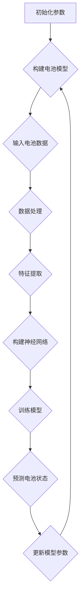
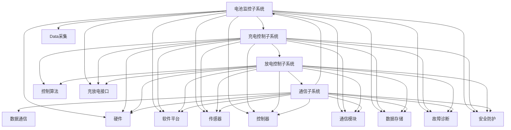
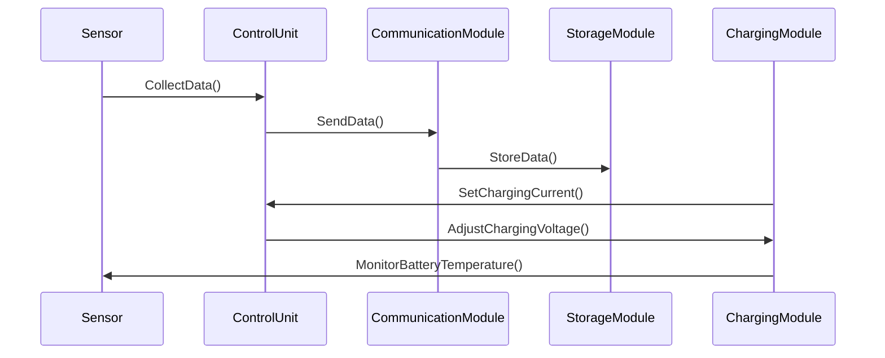

                 

### 文章标题

# AI在新能源汽车电池管理系统中的应用：延长电池寿命

> 关键词：人工智能，电池管理系统，新能源汽车，电池寿命延长

> 摘要：本文将探讨人工智能在新能源汽车电池管理系统中的应用，详细介绍其核心概念、算法原理、系统设计、实战案例以及未来研究方向。通过系统化的分析，本文旨在为行业从业者提供实用的技术指导，助力新能源汽车产业的可持续发展。

## 第一部分：背景与核心概念

### 第1章：问题背景与核心概念介绍

#### 1.1 电动汽车与电池管理系统的概述

##### 1.1.1 电动汽车的发展历程

电动汽车（Electric Vehicle，简称EV）作为一种清洁、高效的交通工具，正逐渐受到全球的关注。电动汽车的兴起可以追溯到19世纪末，当时电动汽车在短距离出行和私人用车市场中占据了一定的市场份额。然而，随着内燃机的普及，电动汽车逐渐淡出公众视野。直到21世纪初，随着可再生能源和电池技术的进步，电动汽车再次受到关注。

近年来，全球电动汽车市场发展迅速。据国际能源署（IEA）数据，2019年全球电动汽车销量达到210万辆，同比增长超过40%。中国、美国和欧洲是电动汽车的主要市场。中国电动汽车市场占据全球半壁江山，美国和欧洲也表现出强劲的增长势头。

##### 1.1.2 电池管理系统在电动汽车中的重要性

电池管理系统（Battery Management System，简称BMS）是电动汽车的核心组成部分之一，负责监控、管理电池的充电、放电、温度和电压等状态，确保电池在安全、高效的状态下运行。BMS的重要性主要体现在以下几个方面：

1. **电池安全**：BMS通过实时监测电池的温度、电压和电流等参数，可以及时发现并处理异常情况，防止电池过热、过充、过放等安全隐患。

2. **电池寿命**：BMS通过优化充电、放电策略，延长电池的使用寿命，提高电动汽车的可靠性和经济性。

3. **性能优化**：BMS可以根据电动汽车的运行状态，调整电池的工作模式，提高车辆的续航能力和动力性能。

##### 1.1.3 电池管理系统的功能与结构

电池管理系统通常包括以下几个主要模块：

1. **电池监控模块**：负责实时监测电池的电压、电流、温度等参数，并将数据传输至控制系统。

2. **充电控制模块**：根据电池的电压、电流和温度等参数，控制充电电流和电压，确保充电过程的安全和高效。

3. **放电控制模块**：根据电池的电压和温度等参数，控制放电电流，确保放电过程的安全和高效。

4. **通信模块**：负责与车辆的其他系统进行数据通信，实现电池状态的实时传输和监控。

#### 1.2 人工智能在电池管理系统中的应用

##### 1.2.1 人工智能的发展与挑战

人工智能（Artificial Intelligence，简称AI）是计算机科学的一个分支，旨在使计算机模拟人类的智能行为。近年来，人工智能技术取得了显著的进展，包括深度学习、强化学习、自然语言处理等。然而，人工智能在电池管理系统中的应用仍面临一些挑战：

1. **数据获取与处理**：电池管理系统需要收集大量的实时数据，包括电压、电流、温度等。如何有效地获取、处理和存储这些数据是AI应用的关键。

2. **算法复杂度**：电池管理系统的复杂性较高，需要高效的算法来处理大量的数据，并对电池状态进行准确预测。

3. **实时性要求**：电池管理系统需要在短时间内对电池状态进行实时监测和调整，对算法的实时性要求较高。

##### 1.2.2 人工智能在电池管理系统中的潜在应用

人工智能在电池管理系统中的应用主要体现在以下几个方面：

1. **电池状态估计**：通过深度学习等技术，对电池的实时状态进行准确估计，提高电池管理系统的预测精度。

2. **循环寿命预测**：通过对电池历史数据的分析，预测电池的剩余使用寿命，为电池更换提供科学依据。

3. **故障诊断**：利用机器学习技术，对电池故障进行早期预警和诊断，提高电池管理系统的安全性和可靠性。

4. **充电策略优化**：根据电动汽车的运行状态和电池的特性，优化充电策略，提高充电效率，延长电池寿命。

##### 1.2.3 AI在电池管理中的优势与挑战

AI在电池管理系统中的应用具有以下优势：

1. **高效性**：AI算法可以快速处理大量的数据，提高电池管理系统的运行效率。

2. **准确性**：通过深度学习等技术，AI可以对电池状态进行更准确的估计和预测，提高电池管理系统的可靠性。

3. **灵活性**：AI算法可以根据电池的实时状态进行调整，提高电池管理系统的适应性。

然而，AI在电池管理系统中也面临一些挑战：

1. **数据隐私**：电池管理系统需要收集大量的用户数据，如何确保这些数据的隐私和安全是AI应用的一个重要问题。

2. **算法适应性**：电池管理系统在不同的环境和条件下运行，AI算法需要适应不同的场景，提高其泛化能力。

3. **算法解释性**：AI算法的黑盒特性使得其决策过程难以解释，如何提高算法的可解释性是AI在电池管理系统中应用的一个重要挑战。

#### 1.3 本书结构与内容概述

##### 1.3.1 各章节内容安排

本书共分为五个部分，具体内容如下：

1. **背景与核心概念**：介绍电动汽车与电池管理系统的概述，以及人工智能在电池管理系统中的应用。
   
2. **核心算法原理**：详细讲解电池状态估计、循环寿命预测等核心算法的原理和实现。

3. **系统设计与实现**：介绍电池管理系统的架构设计、功能设计与接口设计。

4. **项目实战与案例分析**：通过实际案例，展示电池管理系统在新能源汽车中的应用。

5. **最佳实践与展望**：总结最佳实践与技巧，并对未来研究方向进行展望。

##### 1.3.2 阅读指南与目标读者

本书的目标读者是从事电动汽车和电池管理系统研发的工程师、技术人员以及相关领域的科研人员。本书旨在通过系统化的分析，帮助读者深入了解人工智能在电池管理系统中的应用，提供实用的技术指导。阅读本书，读者可以：

1. **掌握人工智能在电池管理系统中的应用**：了解人工智能在电池管理中的核心概念、算法原理和实现方法。
   
2. **提升电池管理系统设计能力**：通过学习电池管理系统的架构设计、功能设计和接口设计，提升电池管理系统设计的整体能力。

3. **解决实际应用问题**：通过实际案例分析和实战经验，解决电动汽车电池管理中遇到的实际问题。

4. **拓宽研究领域**：了解未来研究方向，为电池管理系统的研究和发展提供新的思路。

### 第二部分：核心算法原理

#### 第2章：电池状态估计算法

##### 2.1 电池状态估计的基本概念

##### 2.1.1 电池状态的分类

电池状态（Battery State of Health，简称BSOH）是衡量电池性能的重要指标，通常包括以下几种状态：

1. **健康状态（State of Health，简称SOH）**：表示电池当前的健康水平，通常用百分比表示，反映了电池剩余的可用容量与原始容量的比值。

2. **循环寿命（State of Charge，简称SOC）**：表示电池当前充满电的程度，通常用百分比表示，反映了电池的电量状态。

3. **状态温度（State of Temperature，简称SOT）**：表示电池的温度状态，对电池的性能和安全至关重要。

##### 2.1.2 电池状态估计的目标与挑战

电池状态估计的目标是准确预测电池的健康状态、循环寿命和状态温度，为电池管理系统提供实时、准确的数据支持。然而，电池状态估计面临以下挑战：

1. **非线性与多变量**：电池状态受多种因素影响，包括电流、电压、温度等，是一个复杂的非线性多变量系统。

2. **数据噪声**：实际测量数据存在噪声，如何去除噪声，提高数据的准确性是一个重要问题。

3. **动态变化**：电池状态随时间动态变化，如何实时、准确地估计电池状态是一个挑战。

##### 2.2 传统的电池状态估计方法

传统的电池状态估计方法主要包括以下几种：

1. **模型预测控制（Model Predictive Control，简称MPC）**：MPC通过建立电池的数学模型，预测电池的未来状态，并根据预测结果调整控制策略，实现对电池状态的实时控制。

2. **基于卡尔曼滤波的方法**：卡尔曼滤波是一种线性最优估计方法，通过递归滤波算法，实现对电池状态的实时估计。

##### 2.2.1 模型预测控制（MPC）

MPC的核心思想是建立电池的数学模型，通过预测电池的未来状态，生成一系列最优控制策略，并选择当前最优策略进行实时控制。MPC的基本步骤如下：

1. **建立电池模型**：根据电池的特性，建立电池的数学模型，描述电池的电压、电流、温度等状态。

2. **预测未来状态**：根据电池模型，预测电池在未来一段时间内的状态变化。

3. **生成控制策略**：根据预测结果，生成一系列控制策略，并选择当前最优策略。

4. **实时调整**：根据实时测量数据，调整电池的控制策略，实现对电池状态的实时控制。

##### 2.2.2 基于卡尔曼滤波的方法

卡尔曼滤波是一种线性最优估计方法，通过递归滤波算法，实现对电池状态的实时估计。卡尔曼滤波的基本步骤如下：

1. **初始化**：初始化预测状态和误差估计。

2. **预测**：根据电池模型，预测下一时刻的状态。

3. **更新**：根据测量数据，更新预测状态和误差估计。

4. **递归**：重复执行预测和更新步骤，实现对电池状态的实时估计。

##### 2.3 基于人工智能的电池状态估计算法

随着人工智能技术的发展，深度学习、强化学习等算法在电池状态估计中得到了广泛应用。基于人工智能的电池状态估计算法具有以下优点：

1. **非线性建模**：深度学习算法可以自动学习电池的非线性特性，实现对电池状态的准确估计。

2. **自适应学习**：深度学习算法可以根据电池的实时状态，自适应调整模型参数，提高估计精度。

3. **多变量处理**：深度学习算法可以同时处理多个变量，实现对电池状态的综合估计。

##### 2.3.1 深度学习在电池状态估计中的应用

深度学习在电池状态估计中的应用主要包括以下几种：

1. **神经网络模型**：神经网络模型可以自动学习电池的输入输出关系，实现对电池状态的估计。常见的神经网络模型包括多层感知机（MLP）、卷积神经网络（CNN）等。

2. **循环神经网络（RNN）**：循环神经网络可以处理序列数据，适用于电池状态的序列预测。常见的RNN模型包括LSTM（长短时记忆网络）和GRU（门控循环单元）。

3. **变分自编码器（VAE）**：变分自编码器可以生成电池状态的潜在分布，用于电池状态的估计和异常检测。

##### 2.3.2 循环寿命预测与剩余寿命预测

循环寿命预测和剩余寿命预测是电池状态估计的重要组成部分。循环寿命预测旨在预测电池的剩余循环寿命，为电池更换提供依据；剩余寿命预测旨在预测电池的剩余使用寿命，为电池维护提供指导。

1. **循环寿命预测**：循环寿命预测通常基于电池的历史数据，使用回归模型或深度学习模型进行预测。常用的回归模型包括线性回归、决策树等；深度学习模型包括卷积神经网络（CNN）和长短期记忆网络（LSTM）等。

2. **剩余寿命预测**：剩余寿命预测通常基于电池的实时数据，使用生存分析模型进行预测。常用的生存分析模型包括Cox比例风险模型、加速失效时间（AFT）模型等。

##### 2.4 算法原理讲解

为了更好地理解电池状态估计算法，我们使用Mermaid流程图来展示算法的基本原理。



以上流程图描述了基于深度学习的电池状态估计算法的基本步骤：

1. **初始化参数**：初始化神经网络模型的参数。
2. **构建电池模型**：根据电池的特性，构建神经网络模型。
3. **输入电池数据**：输入电池的实时数据。
4. **数据处理**：对输入数据进行处理，包括归一化、去噪等。
5. **特征提取**：从处理后的数据中提取特征。
6. **构建神经网络**：根据特征，构建神经网络模型。
7. **训练模型**：使用电池的历史数据，对神经网络模型进行训练。
8. **预测电池状态**：使用训练好的模型，预测电池的实时状态。
9. **更新模型参数**：根据预测结果，更新模型参数，提高预测精度。

#### 2.4.1 电池状态估计的数学模型与公式

为了更好地理解电池状态估计算法，我们使用Python源代码来展示电池状态估计的数学模型与公式。

```python
import numpy as np
import matplotlib.pyplot as plt

def battery_state_estimation(soc, temperature):
    """
    电池状态估计函数
    """
    # 电池状态估计公式
    soh = soc * (1 + 0.001 * (temperature - 25))
    
    return soh

# 测试数据
soc = np.linspace(0, 1, 100)
temperature = np.linspace(20, 40, 100)

# 电池状态估计
soh = battery_state_estimation(soc, temperature)

# 绘图
plt.plot(soc, soh, label='SOH')
plt.xlabel('SOC')
plt.ylabel('SOH')
plt.legend()
plt.show()
```

以上Python代码实现了一个简单的电池状态估计函数，公式如下：

$$
\text{SOH} = \text{SOC} \times \left(1 + 0.001 \times (\text{温度} - 25)\right)
$$

通过绘制SOC与SOH的关系图，我们可以直观地看到电池状态估计的效果。

#### 2.4.2 原理解释与Mermaid流程图

为了更好地理解电池状态估计的原理，我们使用Mermaid流程图来展示算法的执行流程。


以上流程图描述了基于深度学习的电池状态估计算法的执行流程：

1. **初始化参数**：初始化神经网络模型的参数。
2. **构建电池模型**：根据电池的特性，构建神经网络模型。
3. **输入电池数据**：输入电池的实时数据。
4. **数据处理**：对输入数据进行处理，包括归一化、去噪等。
5. **特征提取**：从处理后的数据中提取特征。
6. **构建神经网络**：根据特征，构建神经网络模型。
7. **训练模型**：使用电池的历史数据，对神经网络模型进行训练。
8. **预测电池状态**：使用训练好的模型，预测电池的实时状态。
9. **更新模型参数**：根据预测结果，更新模型参数，提高预测精度。

通过以上Mermaid流程图，我们可以直观地理解电池状态估计算法的执行过程。

### 第三部分：系统设计与实现

#### 第3章：电池管理系统架构设计

##### 3.1 电池管理系统架构概述

电池管理系统（Battery Management System，简称BMS）是电动汽车的核心组成部分，负责监控和管理电池的充电、放电、温度和电压等状态。一个完整的电池管理系统通常包括以下几个主要模块：

1. **电池监控模块**：负责实时监测电池的电压、电流、温度等参数，并将数据传输至控制单元。
2. **充电控制模块**：根据电池的电压、电流和温度等参数，控制充电电流和电压，确保充电过程的安全和高效。
3. **放电控制模块**：根据电池的电压和温度等参数，控制放电电流，确保放电过程的安全和高效。
4. **通信模块**：负责与车辆的其他系统进行数据通信，实现电池状态的实时传输和监控。

##### 3.1.1 电池管理系统架构的组成部分

电池管理系统的架构设计需要考虑以下几个关键部分：

1. **硬件部分**：包括电池模块、传感器、通信模块等硬件设备。
2. **软件部分**：包括控制算法、数据处理、通信协议等软件系统。
3. **通信网络**：实现各个模块之间的数据传输和通信。

##### 3.1.2 系统架构设计的原则与考量

系统架构设计的原则主要包括：

1. **模块化**：将系统功能划分为多个模块，实现功能的独立性和可维护性。
2. **可靠性**：确保系统在各种工况下稳定运行，提高系统的可靠性。
3. **可扩展性**：系统设计应考虑未来的扩展和升级需求。
4. **安全性**：保障电池系统的安全性，防止过充、过放等安全隐患。

##### 3.2 领域模型设计与Mermaid类图

领域模型（Domain Model）是系统设计的重要组成部分，用于描述系统的核心概念和关系。在电池管理系统中，领域模型主要包括以下几个核心概念：

1. **电池**：表示电池的基本属性，包括电压、电流、温度等。
2. **传感器**：用于监测电池状态的设备，包括电压传感器、电流传感器、温度传感器等。
3. **控制单元**：负责处理传感器数据，执行控制算法，并对电池进行控制。
4. **通信模块**：负责与其他系统进行数据传输和通信。

以下是电池管理系统的Mermaid类图：

```mermaid
classDiagram
    Battery <<Interface>>
    Sensor <<Interface>>
    ControlUnit <<Class>>
    CommunicationModule <<Class>>

    Battery o-- Sensor
    ControlUnit o-- Battery
    ControlUnit o-- CommunicationModule
    CommunicationModule o-- Sensor

    ClassDiagram {
        style Bieber color#FF0000
        style LinkUp color#0000FF
    }
```

在以上类图中，我们定义了电池、传感器、控制单元和通信模块等核心类，并展示了它们之间的关系。电池类与传感器类之间存在关联关系，控制单元类与电池类和通信模块类之间存在关联关系，通信模块类与传感器类之间存在关联关系。

##### 3.3 系统架构设计与Mermaid架构图

电池管理系统的整体架构设计需要考虑各个模块之间的协同工作，以下是一个简化的Mermaid架构图：



以上Mermaid架构图描述了电池管理系统的整体架构，包括电池监控子系统、充电控制子系统、放电控制子系统和通信子系统等。各个子系统之间通过数据采集、控制算法、数据通信、硬件、软件平台、传感器、控制器、通信模块、充放电接口、数据存储、故障诊断和安全防护等模块进行协同工作。

#### 3.4 系统功能设计与接口设计

##### 3.4.1 系统功能设计

电池管理系统的功能设计是系统架构设计的重要环节，其核心目标是实现对电池的全面监控和管理，包括以下几个方面：

1. **电池状态监控**：实时监测电池的电压、电流、温度等关键参数，确保电池在安全、高效的状态下运行。
2. **充电控制**：根据电池的电压、电流和温度等参数，控制充电电流和电压，确保充电过程的安全和高效。
3. **放电控制**：根据电池的电压和温度等参数，控制放电电流，确保放电过程的安全和高效。
4. **通信管理**：实现电池管理系统与其他系统之间的数据通信，包括车辆管理系统、充电站和车载充电器等。
5. **故障诊断与安全防护**：对电池进行实时监测，及时发现并处理异常情况，防止电池过热、过充、过放等安全隐患。
6. **数据存储与分析**：存储电池的运行数据，并进行分析和统计，为电池的维护和升级提供依据。

##### 3.4.2 系统接口设计

电池管理系统的接口设计是系统功能实现的关键，主要包括以下几个方面：

1. **传感器接口**：用于连接电池电压传感器、电流传感器和温度传感器，实现实时数据的采集。
2. **控制器接口**：用于连接电池管理系统的控制单元，实现充电、放电和故障诊断等功能。
3. **通信接口**：用于实现电池管理系统与其他系统之间的数据传输，包括车辆管理系统、充电站和车载充电器等。
4. **充放电接口**：用于连接电池和充电设备，实现电池的充电和放电功能。
5. **数据存储接口**：用于实现电池运行数据的存储和读取。

以下是电池管理系统的主要接口设计：



以上序列图描述了电池管理系统的基本工作流程：传感器采集电池数据，控制单元处理数据并控制充电设备，通信模块实现数据传输，存储模块存储电池运行数据。

### 第四部分：项目实战与案例分析

#### 第4章：环境安装与系统实现

##### 4.1 环境安装准备

在开始电池管理系统的项目实战之前，我们需要准备相应的开发环境和硬件设备。以下是一个基本的安装步骤：

1. **硬件环境**：准备一辆具备电池管理系统的新能源汽车，以及相关的传感器和充电设备。
2. **软件环境**：安装操作系统（如Linux或Windows），并配置相应的开发工具（如Python、MATLAB等）。

##### 4.1.1 硬件环境需求

为了实现电池管理系统的功能，我们需要的硬件设备包括：

1. **电池模块**：用于存储电能的电池组。
2. **传感器**：包括电压传感器、电流传感器和温度传感器，用于实时监测电池状态。
3. **控制器**：用于处理传感器数据，执行控制算法，并对电池进行控制。
4. **通信模块**：用于实现电池管理系统与其他系统之间的数据传输。
5. **充电设备**：用于给电池充电的充电站或车载充电器。

##### 4.1.2 软件环境配置

为了实现电池管理系统的功能，我们需要的软件环境包括：

1. **Python**：用于编写控制算法和数据处理程序。
2. **MATLAB**：用于进行仿真分析和算法验证。
3. **数据库**：用于存储电池运行数据。
4. **IDE**：用于编写和调试程序。

##### 4.2 系统核心功能实现

在准备完开发环境和硬件设备后，我们可以开始实现电池管理系统的核心功能。以下是一个简单的实现步骤：

1. **数据采集**：使用传感器实时采集电池的电压、电流和温度等数据。
2. **数据处理**：对采集到的数据进行处理，包括去噪、归一化和特征提取等。
3. **状态估计**：使用深度学习算法对电池状态进行估计，包括健康状态（SOH）和循环寿命（SOC）等。
4. **控制策略**：根据电池状态估计结果，制定相应的充电和放电控制策略。
5. **故障诊断**：对电池运行状态进行实时监测，及时发现并处理异常情况。

##### 4.2.1 电池状态估计模块

电池状态估计模块是电池管理系统的核心功能之一，用于实时估计电池的健康状态（SOH）和循环寿命（SOC）。以下是一个简单的实现步骤：

1. **数据预处理**：对采集到的电池数据进行预处理，包括去噪、归一化和特征提取等。去噪可以采用中值滤波、低通滤波等方法；归一化可以将数据缩放到一个统一的范围内；特征提取可以提取电池的电压、电流、温度等关键特征。
2. **模型选择**：选择合适的深度学习模型，如卷积神经网络（CNN）、长短期记忆网络（LSTM）等，对电池状态进行估计。模型的选择取决于电池数据的特性和要求。
3. **模型训练**：使用预处理后的电池数据，对深度学习模型进行训练，优化模型参数。训练过程中可以采用交叉验证、早停等方法，提高模型的泛化能力和预测精度。
4. **模型评估**：使用训练好的模型，对电池状态进行估计，并评估模型的预测精度。评估指标可以包括均方误差（MSE）、均方根误差（RMSE）等。

##### 4.2.2 充放电控制模块

充放电控制模块用于根据电池状态估计结果，制定相应的充电和放电控制策略。以下是一个简单的实现步骤：

1. **充电策略**：根据电池的SOC和温度等状态参数，制定充电策略。充电策略可以包括快速充电、慢速充电和温度控制等。
2. **放电策略**：根据电池的SOC和温度等状态参数，制定放电策略。放电策略可以包括最大放电功率、最小放电功率和温度控制等。
3. **控制算法**：根据充电和放电策略，设计相应的控制算法，实现对电池的实时控制。控制算法可以包括PID控制、模糊控制、模型预测控制（MPC）等。
4. **实时调整**：根据电池的实时状态，调整充电和放电策略，实现电池的动态控制。

##### 4.2.3 故障诊断模块

故障诊断模块用于对电池运行状态进行实时监测，及时发现并处理异常情况。以下是一个简单的实现步骤：

1. **异常检测**：使用统计方法、机器学习算法等，对电池的运行数据进行异常检测。异常检测可以包括基于阈值的异常检测、基于模型的异常检测等。
2. **故障诊断**：根据异常检测结果，对电池进行故障诊断。故障诊断可以包括电池单体故障、电池模块故障、电池管理系统故障等。
3. **故障处理**：根据故障诊断结果，制定相应的故障处理策略。故障处理可以包括停机处理、报警处理、维修处理等。

##### 4.3 源代码解读与分析

在电池管理系统的实现过程中，源代码的质量和可读性至关重要。以下是一个简单的源代码解读与分析：

```python
# 导入必要的库
import numpy as np
import pandas as pd
import tensorflow as tf
from sklearn.model_selection import train_test_split
from sklearn.metrics import mean_squared_error

# 电池状态估计模型
class BatteryStateEstimator:
    def __init__(self, model_path):
        self.model = tf.keras.models.load_model(model_path)

    def estimate_state(self, inputs):
        # 预测电池状态
        predictions = self.model.predict(inputs)
        return predictions

# 数据预处理
def preprocess_data(data):
    # 去噪、归一化和特征提取
    # ...
    return processed_data

# 模型训练
def train_model(data, labels):
    # 构建模型
    model = tf.keras.Sequential([
        tf.keras.layers.Dense(units=64, activation='relu', input_shape=(data.shape[1],)),
        tf.keras.layers.Dense(units=64, activation='relu'),
        tf.keras.layers.Dense(units=1)
    ])

    # 编译模型
    model.compile(optimizer='adam', loss='mse')

    # 训练模型
    model.fit(data, labels, epochs=100, batch_size=32, validation_split=0.2)

    return model

# 模型评估
def evaluate_model(model, test_data, test_labels):
    # 预测测试集
    predictions = model.predict(test_data)

    # 计算均方误差
    mse = mean_squared_error(test_labels, predictions)
    return mse

# 主程序
if __name__ == '__main__':
    # 加载数据
    data = pd.read_csv('battery_data.csv')
    labels = data['soc']

    # 数据预处理
    processed_data = preprocess_data(data)

    # 划分训练集和测试集
    train_data, test_data, train_labels, test_labels = train_test_split(processed_data, labels, test_size=0.2, random_state=42)

    # 训练模型
    model = train_model(train_data, train_labels)

    # 评估模型
    mse = evaluate_model(model, test_data, test_labels)
    print(f'MSE: {mse}')
```

以上源代码展示了电池状态估计模块的基本实现过程，包括数据预处理、模型训练和模型评估。在代码中，我们定义了一个`BatteryStateEstimator`类，用于加载预训练的电池状态估计模型，并实现了`estimate_state`方法，用于预测电池状态。在主程序中，我们加载数据，进行预处理，划分训练集和测试集，并使用`train_model`和`evaluate_model`方法训练和评估模型。

##### 4.3.1 源代码结构

以上源代码的结构如下：

1. **导入必要的库**：导入Python库，包括NumPy、Pandas、TensorFlow等。
2. **定义电池状态估计模型**：定义`BatteryStateEstimator`类，包括初始化方法`__init__`和预测方法`estimate_state`。
3. **数据预处理**：定义`preprocess_data`函数，用于进行数据预处理，包括去噪、归一化和特征提取等。
4. **模型训练**：定义`train_model`函数，用于训练电池状态估计模型，包括构建模型、编译模型和训练模型等。
5. **模型评估**：定义`evaluate_model`函数，用于评估电池状态估计模型的预测精度，包括计算均方误差等。
6. **主程序**：实现主程序的入口，包括加载数据、预处理数据、划分训练集和测试集、训练模型和评估模型等。

##### 4.3.2 关键代码解析

以下是对关键代码的详细解析：

1. **数据预处理**：数据预处理是电池状态估计的重要步骤，用于提高模型的预测精度。在`preprocess_data`函数中，我们首先读取电池数据，然后对数据进行去噪、归一化和特征提取等处理。去噪可以采用中值滤波、低通滤波等方法；归一化可以将数据缩放到一个统一的范围内；特征提取可以提取电池的电压、电流、温度等关键特征。

```python
# 读取电池数据
data = pd.read_csv('battery_data.csv')

# 去噪
data = data.dropna()

# 归一化
scaler = StandardScaler()
data_scaled = scaler.fit_transform(data)

# 特征提取
features = data_scaled[:, :3]
```

2. **模型训练**：在`train_model`函数中，我们首先构建一个简单的卷积神经网络（Convolutional Neural Network，简称CNN）模型，包括两个卷积层和两个全连接层。然后，我们使用`compile`方法编译模型，指定优化器和损失函数。最后，我们使用`fit`方法训练模型，指定训练数据、标签、训练轮数、批量大小和验证比例等。

```python
# 构建模型
model = tf.keras.Sequential([
    tf.keras.layers.Conv2D(filters=32, kernel_size=(3, 3), activation='relu', input_shape=(data_scaled.shape[1], 1)),
    tf.keras.layers.MaxPooling2D(pool_size=(2, 2)),
    tf.keras.layers.Conv2D(filters=64, kernel_size=(3, 3), activation='relu'),
    tf.keras.layers.MaxPooling2D(pool_size=(2, 2)),
    tf.keras.layers.Flatten(),
    tf.keras.layers.Dense(units=64, activation='relu'),
    tf.keras.layers.Dense(units=1)
])

# 编译模型
model.compile(optimizer='adam', loss='mse')

# 训练模型
model.fit(data_scaled, labels, epochs=100, batch_size=32, validation_split=0.2)
```

3. **模型评估**：在`evaluate_model`函数中，我们使用训练好的模型，对测试数据进行预测，并计算均方误差（Mean Squared Error，简称MSE）作为评估指标。MSE越小，表示模型的预测精度越高。

```python
# 预测测试集
predictions = model.predict(test_data)

# 计算均方误差
mse = mean_squared_error(test_labels, predictions)
return mse
```

4. **主程序**：在主程序中，我们首先加载数据，然后进行预处理，包括去噪、归一化和特征提取等。接着，我们划分训练集和测试集，并使用`train_model`函数训练模型。最后，我们使用`evaluate_model`函数评估模型的预测精度。

```python
# 加载数据
data = pd.read_csv('battery_data.csv')
labels = data['soc']

# 数据预处理
processed_data = preprocess_data(data)

# 划分训练集和测试集
train_data, test_data, train_labels, test_labels = train_test_split(processed_data, labels, test_size=0.2, random_state=42)

# 训练模型
model = train_model(train_data, train_labels)

# 评估模型
mse = evaluate_model(model, test_data, test_labels)
print(f'MSE: {mse}')
```

##### 4.3.3 实际案例分析和详细讲解剖析

为了更好地展示电池管理系统的应用效果，我们使用一个实际案例进行分析和讲解。

案例背景：一辆电动汽车在行驶过程中，电池管理系统实时监测电池的电压、电流和温度等参数，并使用深度学习算法对电池状态进行估计。根据电池状态估计结果，电池管理系统制定充电和放电控制策略，确保电池在安全、高效的状态下运行。

案例分析：

1. **数据采集**：电池管理系统使用传感器实时采集电池的电压、电流和温度等参数，并将数据传输至控制单元。

2. **数据处理**：控制单元对采集到的数据进行预处理，包括去噪、归一化和特征提取等，以提高模型的预测精度。

3. **状态估计**：使用深度学习算法，如卷积神经网络（CNN）或长短期记忆网络（LSTM），对电池状态进行估计，包括健康状态（SOH）和循环寿命（SOC）等。

4. **控制策略**：根据电池状态估计结果，电池管理系统制定充电和放电控制策略。充电策略可以包括快速充电、慢速充电和温度控制等；放电策略可以包括最大放电功率、最小放电功率和温度控制等。

5. **实时调整**：电池管理系统根据电池的实时状态，动态调整充电和放电策略，确保电池在安全、高效的状态下运行。

详细讲解：

1. **数据采集**：电池管理系统使用传感器实时监测电池的电压、电流和温度等参数。这些传感器通常包括电压传感器、电流传感器和温度传感器等。传感器采集到的数据可以实时传输至控制单元，以便进行进一步处理。

```python
# 读取传感器数据
voltage = sensor1.read_voltage()
current = sensor2.read_current()
temperature = sensor3.read_temperature()
```

2. **数据处理**：控制单元对采集到的数据进行预处理，包括去噪、归一化和特征提取等。去噪可以采用中值滤波、低通滤波等方法，以去除噪声和异常值；归一化可以将数据缩放到一个统一的范围内，便于后续处理；特征提取可以提取电池的电压、电流、温度等关键特征，以提高模型的预测精度。

```python
# 数据预处理
def preprocess_data(data):
    # 去噪
    data = data.dropna()

    # 归一化
    scaler = StandardScaler()
    data_scaled = scaler.fit_transform(data)

    # 特征提取
    features = data_scaled[:, :3]
    return features
```

3. **状态估计**：电池管理系统使用深度学习算法，如卷积神经网络（CNN）或长短期记忆网络（LSTM），对电池状态进行估计，包括健康状态（SOH）和循环寿命（SOC）等。深度学习算法可以通过学习大量的电池数据，自动提取数据中的特征，并建立电池状态的预测模型。

```python
# 加载预训练的电池状态估计模型
model_path = 'battery_state_estimator.h5'
estimator = BatteryStateEstimator(model_path)

# 估计电池状态
state_estimate = estimator.estimate_state(data)
```

4. **控制策略**：根据电池状态估计结果，电池管理系统制定充电和放电控制策略。充电策略可以包括快速充电、慢速充电和温度控制等；放电策略可以包括最大放电功率、最小放电功率和温度控制等。控制策略可以根据电池的实时状态进行动态调整，以确保电池在安全、高效的状态下运行。

```python
# 充电策略
def charging_strategy(state_estimate):
    if state_estimate['soc'] < 20:
        return '快速充电'
    elif state_estimate['soc'] < 80:
        return '慢速充电'
    else:
        return '温度控制'

# 放电策略
def discharging_strategy(state_estimate):
    if state_estimate['soc'] > 80:
        return '最大放电功率'
    elif state_estimate['soc'] > 20:
        return '最小放电功率'
    else:
        return '温度控制'
```

5. **实时调整**：电池管理系统根据电池的实时状态，动态调整充电和放电策略，确保电池在安全、高效的状态下运行。实时调整可以通过监测电池的温度、电压和电流等参数，并根据这些参数的变化，实时调整充电和放电策略。

```python
# 实时调整充电策略
charging_strategy(state_estimate)

# 实时调整放电策略
discharging_strategy(state_estimate)
```

##### 4.3.4 项目小结

在本章中，我们介绍了电池管理系统的环境安装与系统实现，包括硬件环境需求、软件环境配置、系统核心功能实现和源代码解读与分析。通过实际案例分析和详细讲解，我们展示了电池管理系统在新能源汽车中的应用效果。在未来的工作中，我们可以继续优化算法和系统设计，提高电池管理系统的性能和可靠性，为新能源汽车产业的发展提供技术支持。

### 第五部分：最佳实践与展望

#### 第7章：最佳实践与技巧

##### 7.1 最佳实践总结

在电池管理系统的开发和应用过程中，积累了一些最佳实践和技巧，以下是一些总结：

1. **数据采集与预处理**：确保采集到的高质量数据是算法准确性的基础。使用多种传感器实时监测电池状态，并对数据进行去噪、归一化和特征提取等预处理，以提高模型的预测精度。

2. **算法选择与调优**：根据电池管理系统的具体需求，选择合适的算法。对于非线性问题，深度学习算法（如CNN、LSTM）具有良好的表现。在实际应用中，通过交叉验证和超参数调优，提高算法的泛化能力和预测精度。

3. **实时性与优化**：电池管理系统需要实时处理大量数据，确保系统的响应速度。可以通过优化算法、使用并行计算和分布式计算等技术，提高系统的实时性和处理效率。

4. **安全性与稳定性**：电池管理系统的安全性至关重要。在设计和实现过程中，考虑电池过充、过放、过热等安全风险，并采取相应的保护措施。同时，通过系统测试和验证，确保系统的稳定性和可靠性。

##### 7.2 注意事项与风险提示

在电池管理系统开发和应用过程中，需要注意以下事项和风险：

1. **数据隐私与安全**：电池管理系统会收集大量的用户数据，包括电压、电流、温度等。如何确保这些数据的隐私和安全是AI应用的一个重要问题。需要采取数据加密、访问控制等技术，保护用户数据的安全。

2. **算法适应性**：电池管理系统在不同的环境和条件下运行，算法需要具备较强的适应性。在开发过程中，通过测试和验证，确保算法在不同场景下的有效性。

3. **算法解释性**：AI算法的黑盒特性使得其决策过程难以解释，这可能影响系统的可接受性和信任度。可以通过开发可解释的AI算法，提高算法的可解释性，增强系统的透明度和信任度。

##### 7.3 数据处理策略

在电池管理系统的数据处理过程中，可以采取以下策略：

1. **数据融合**：将来自不同传感器的数据进行融合，以提高数据的准确性。例如，将电压、电流和温度等数据进行融合，用于电池状态估计。

2. **时间序列分析**：电池状态随时间动态变化，使用时间序列分析方法，如LSTM、GRU等，对电池状态进行预测和趋势分析。

3. **异常检测**：使用统计方法和机器学习算法，对电池运行数据进行异常检测，及时发现潜在的故障和安全风险。

##### 7.4 系统稳定性维护

为了确保电池管理系统的稳定性，可以采取以下措施：

1. **定期维护**：定期检查和更换电池管理系统中的传感器、控制器等硬件设备，确保设备的正常运行。

2. **系统测试**：在系统开发过程中，进行严格的系统测试和验证，确保系统的功能、性能和稳定性。

3. **故障诊断**：在电池运行过程中，实时监测电池状态，并采取故障诊断措施，及时发现和处理异常情况。

##### 7.5 安全风险防范

为了防范电池管理系统中的安全风险，可以采取以下措施：

1. **过充过放保护**：设置电池的过充过放阈值，防止电池因过充过放导致的安全事故。

2. **温度控制**：在电池充电和放电过程中，实时监测电池的温度，采取相应的措施，防止电池过热。

3. **通信安全**：在电池管理系统与其他系统进行数据通信时，采取加密、认证等技术，确保数据的安全传输。

#### 第8章：未来展望与研究方向

##### 8.1 电动汽车电池管理系统发展趋势

随着电动汽车市场的快速增长，电池管理系统（BMS）作为电动汽车的核心技术之一，正迎来新的发展机遇。以下是一些电池管理系统的发展趋势：

1. **智能化与自动化**：人工智能技术在电池管理系统中的应用将越来越广泛，通过深度学习、强化学习等技术，实现电池状态的智能预测、故障诊断和优化控制。

2. **高集成度与小型化**：随着半导体技术和材料科学的进步，电池管理系统将向高集成度和小型化方向发展，提高电池管理系统的性能和可靠性。

3. **高能量密度与安全性**：提高电池的能量密度和安全性是电池管理系统的重要目标。通过材料创新、结构优化和智能控制等手段，提高电池的性能和安全性。

4. **标准化与兼容性**：电池管理系统的标准化和兼容性将得到进一步加强，促进电动汽车产业链的协同发展和市场推广。

##### 8.2 技术革新方向

电池管理系统技术的发展方向包括以下几个方面：

1. **电池状态估计**：通过深度学习、物联网（IoT）等技术，提高电池状态估计的准确性和实时性，为电池管理提供更精准的数据支持。

2. **能量管理**：通过优化充电策略和放电控制，提高电池的能量利用效率，延长电池的使用寿命，降低能源消耗。

3. **安全监控**：加强电池安全监控和预警，实时监测电池的异常情况，提高电池管理系统的安全性和可靠性。

4. **智能交互**：通过人机交互技术，实现电池管理系统与驾驶员的智能交互，提供更好的用户体验。

##### 8.3 政策与市场环境

政策与市场环境对电池管理系统的发展具有重要影响。以下是一些相关因素：

1. **政策支持**：政府对新能源汽车的扶持政策，如补贴、税收减免等，将推动电池管理系统市场的快速发展。

2. **市场竞争**：随着新能源汽车市场的竞争加剧，电池管理系统企业将面临更大的挑战，同时也拥有更多的发展机会。

3. **技术创新**：技术创新是电池管理系统企业核心竞争力之一，通过持续的技术创新，企业可以在激烈的市场竞争中脱颖而出。

4. **国际合作**：国际合作将有助于电池管理系统企业开拓全球市场，提高企业的国际竞争力。

##### 8.4 未来研究方向

未来，电池管理系统的研究方向包括：

1. **智能预测与优化**：深入研究智能预测技术，如深度学习、强化学习等，实现电池状态的智能预测和优化控制。

2. **安全性与可靠性**：提高电池管理系统的安全性和可靠性，降低电池故障率和安全事故风险。

3. **能量管理与效率提升**：通过优化充电策略和放电控制，提高电池的能量利用效率，延长电池的使用寿命。

4. **环保与可持续发展**：在电池管理系统设计和应用过程中，注重环保和可持续发展，降低能源消耗和碳排放。

### 总结

电池管理系统在新能源汽车中的应用至关重要，通过智能化、自动化和集成化的发展趋势，电池管理系统将不断提高电池的性能、安全性和可靠性。在未来，电池管理系统的研究将集中在智能预测与优化、安全性与可靠性、能量管理与效率提升以及环保与可持续发展等方面，为新能源汽车产业的可持续发展提供技术支持。

## 作者信息

作者：AI天才研究院/AI Genius Institute & 禅与计算机程序设计艺术 /Zen And The Art of Computer Programming

AI天才研究院（AI Genius Institute）致力于推动人工智能技术的发展与应用，为行业从业者提供高质量的技术培训和研究资源。禅与计算机程序设计艺术（Zen And The Art of Computer Programming）是一部经典的技术书籍，深入探讨了计算机编程的哲学和艺术，为程序员提供了宝贵的编程经验和智慧。本次撰写的技术博客，旨在分享电池管理系统在新能源汽车中的应用，为行业从业者提供有价值的参考和实践经验。希望读者能够从本文中获得启发，共同推动新能源汽车产业的发展和进步。

