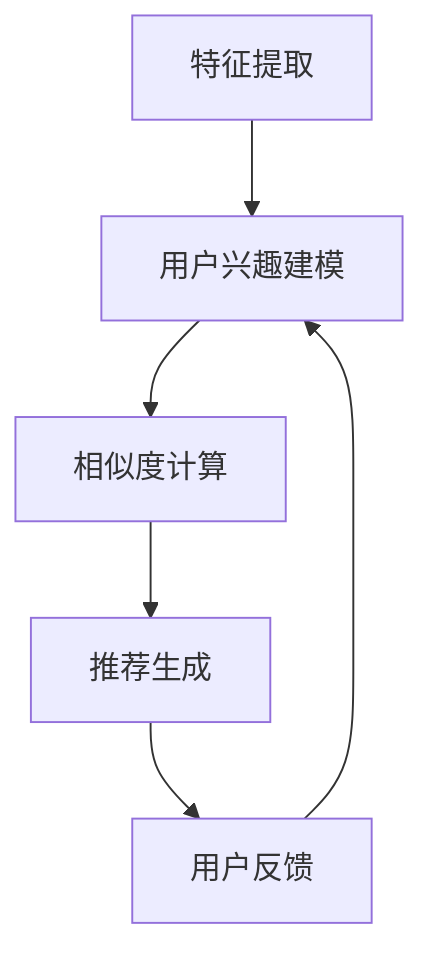
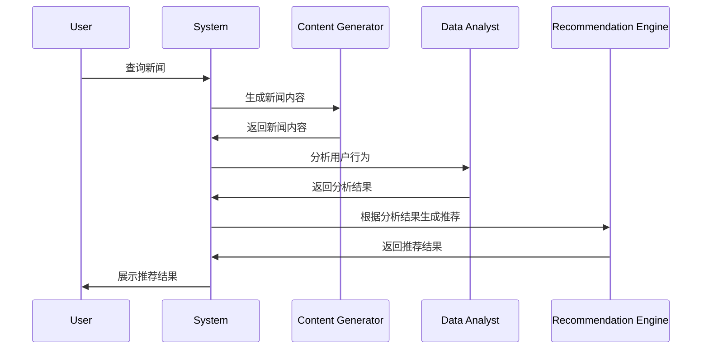
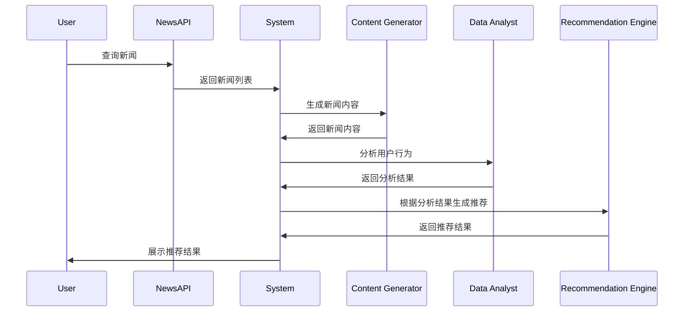

                 

### 引言

在数字化时代的浪潮下，人工智能（AI）技术逐渐渗透到社会各个领域，新闻生产和传播也不例外。随着数据量的爆炸性增长和计算能力的提升，AI在新闻生产中的应用日益广泛，不仅提高了新闻制作的效率，还丰富了新闻内容的多样性。然而，AI技术的迅猛发展也带来了一系列挑战，包括质量问题、道德与伦理问题以及可持续性问题。

本文旨在探讨AI在新闻生产和传播中的应用与挑战。文章结构如下：

- **第一部分：背景与概述**：介绍AI在新闻生产和传播中的应用背景，包括技术发展、潜在价值、现状以及面临的挑战。
- **第二部分：AI在新闻生产和传播中的应用案例**：具体分析AI在新闻写作、数据分析和新闻传播中的应用案例。
- **第三部分：AI在新闻生产和传播中的挑战与对策**：深入分析AI在新闻生产和传播中面临的挑战，并探讨相应的对策。
- **第四部分：小结与展望**：总结主要成果，回顾挑战，探讨未来研究方向。

通过本文的探讨，读者将能够全面了解AI在新闻生产和传播中的作用，以及这一领域未来的发展趋势和潜在的创新方向。让我们一起走进AI在新闻生产和传播的世界，思考它给行业带来的变革与挑战。

### 关键词

- 人工智能（AI）
- 新闻生产
- 数据分析
- 个性化推荐
- 可持续性问题
- 道德与伦理问题
- 质量控制
- 可信度
- 透明度

### 摘要

本文探讨了人工智能（AI）在新闻生产和传播中的应用与挑战。首先，我们介绍了AI在新闻生产和传播中的背景，包括技术发展、潜在价值和现状。接着，通过具体案例，我们分析了AI在新闻写作、数据分析和新闻传播中的应用。然后，深入探讨了AI在新闻生产和传播中面临的挑战，包括质量控制、道德与伦理问题、可持续性和可信度等。最后，提出了相应的对策，并展望了AI在新闻生产和传播中的未来发展趋势和潜在创新方向。通过本文的研究，读者可以全面了解AI在这一领域的现状与未来。

### 《AI在新闻生产和传播中的应用与挑战》目录大纲

#### 第一部分：背景与概述

##### 第一章：AI在新闻生产中的应用背景

1.1.1 人工智能与新闻生产

1.1.2 新闻生产流程中的AI应用

1.1.3 AI在新闻生产中的挑战

##### 第二章：AI在新闻传播中的应用背景

2.1.1 人工智能与新闻传播

2.1.2 新闻传播流程中的AI应用

2.1.3 AI在新闻传播中的挑战

#### 第二部分：AI在新闻生产和传播中的应用案例

##### 第三章：AI在新闻写作中的应用

3.1.1 AI写作工具的发展

3.1.2 AI写作工具的实际应用

##### 第四章：AI在数据分析中的应用

4.1.1 AI在新闻数据分析中的角色

4.1.2 AI在新闻数据分析中的应用案例

##### 第五章：AI在新闻传播中的应用

5.1.1 AI在新闻传播中的角色

5.1.2 AI在新闻传播中的应用案例

#### 第三部分：AI在新闻生产和传播中的挑战与对策

##### 第六章：AI在新闻生产和传播中的挑战与对策

6.1.1 挑战分析

6.1.2 对策探讨

##### 第七章：未来发展趋势

6.1.3 未来发展趋势

#### 第四部分：小结与展望

##### 第七章：小结与展望

7.1 小结

7.2 展望

### 第一部分：背景与概述

#### 第一章：AI在新闻生产中的应用背景

##### 1.1.1 人工智能与新闻生产

随着技术的进步，人工智能（AI）逐渐成为现代新闻生产的重要工具。人工智能的定义可以从多个角度来理解，但最核心的概念是其模拟、延伸和扩展人类智能的能力。在新闻生产领域，AI被广泛应用于写作、编辑、数据分析等多个环节。

**人工智能技术简介**

人工智能涉及多个子领域，包括机器学习、自然语言处理、深度学习等。机器学习是通过数据训练模型，使模型能够进行预测和决策的技术。自然语言处理（NLP）是使计算机能够理解、生成和处理人类语言的技术。深度学习是机器学习的一个分支，它通过多层神经网络模型对数据进行分析和处理。

**人工智能在新闻生产中的潜在价值**

AI在新闻生产中的潜在价值主要体现在以下几个方面：

1. **写作与内容生成**：AI可以帮助记者快速生成新闻报道，提高工作效率。
2. **数据分析**：AI可以处理大量数据，为新闻提供数据支持。
3. **用户画像与个性化推荐**：AI可以分析用户行为，提供个性化的新闻推荐。

**人工智能在新闻生产中的现状**

目前，AI在新闻生产中的应用已经初见成效。例如，许多新闻机构已经开始使用AI写作工具来生成财经新闻、体育新闻等。此外，AI还被用于分析社交媒体数据，预测新闻趋势。

##### 1.1.2 新闻生产流程中的AI应用

在新闻生产流程中，AI的应用涵盖了从选题、采访、写作到编辑、发布的各个环节。

1. **选题与规划**：AI可以分析社交媒体数据，识别热点话题，为记者提供选题建议。
2. **采访与报道**：AI可以帮助记者进行事实核查，确保报道的准确性。
3. **写作与内容生成**：AI写作工具可以自动生成新闻稿，记者只需进行简单的编辑和润色。
4. **编辑与发布**：AI可以协助编辑进行内容优化，提高新闻的可读性。

**写作与内容生成**

AI写作工具如Automated Insights、Heliograf等已经广泛应用于新闻生产。这些工具利用自然语言处理和机器学习技术，能够快速生成大量新闻稿件。例如，Automated Insights可以生成财务报告、体育赛事结果等。

**数据分析**

AI在数据分析中的应用主要体现在数据挖掘和预测分析上。通过分析大量数据，AI可以识别新闻趋势，为记者提供有价值的分析报告。例如，Google News Lab利用AI技术分析全球新闻趋势，为新闻机构提供数据支持。

**用户画像与个性化推荐**

AI可以帮助新闻机构分析用户行为，构建用户画像，从而提供个性化的新闻推荐。例如，算法可以通过分析用户的历史浏览记录和互动行为，推荐符合用户兴趣的新闻内容。

##### 1.1.3 AI在新闻生产中的挑战

尽管AI在新闻生产中具有巨大潜力，但也面临一系列挑战。

1. **质量与准确性问题**：AI生成的新闻内容可能存在准确性、可读性等问题。
2. **道德与伦理问题**：AI的决策可能涉及伦理和道德问题，如何确保AI在新闻生产中的道德行为是一个重要议题。
3. **可持续性问题**：随着AI技术的广泛应用，如何确保新闻生产的可持续性和社会责任是一个挑战。

综上所述，AI在新闻生产中的应用前景广阔，但也需要克服一系列挑战。在接下来的章节中，我们将进一步探讨AI在新闻传播中的应用背景和挑战。

##### 1.2.1 人工智能与新闻传播

人工智能在新闻传播中的作用日益显著，其影响不仅体现在信息处理和内容分发上，还深刻改变了新闻传播的模式和生态环境。AI技术的介入，使得新闻传播过程更加智能化、精准化，同时也带来了新的挑战和问题。

**人工智能技术简介**

人工智能（AI）的核心技术包括机器学习（Machine Learning）、自然语言处理（Natural Language Processing，NLP）、计算机视觉（Computer Vision）和深度学习（Deep Learning）。这些技术使得计算机能够通过学习和理解人类语言、图像和声音，从而实现自动化、智能化的任务处理。

- **机器学习**：通过从大量数据中学习规律，机器学习技术可以帮助计算机进行分类、预测和决策。
- **自然语言处理**：NLP技术使得计算机能够理解和生成人类语言，广泛应用于文本分析、机器翻译、情感分析等领域。
- **计算机视觉**：计算机视觉技术使计算机能够理解和解析图像和视频，用于人脸识别、图像分类等应用。
- **深度学习**：深度学习是机器学习的一个分支，通过多层神经网络对数据进行复杂的建模和分析，是当前AI领域的一个热点。

**人工智能在新闻传播中的潜在价值**

AI在新闻传播中的潜在价值主要体现在以下几个方面：

1. **信息过滤与验证**：AI可以帮助新闻机构对大量信息进行筛选和验证，提高新闻的准确性和可信度。
2. **跨媒体传播与融合**：AI技术可以促进不同媒体形式之间的融合，如将文字、图片、视频等多种形式的内容进行整合，提高新闻传播的效率和效果。
3. **社交媒体平台上的AI干预**：AI可以在社交媒体平台上进行信息监控、推荐算法优化等，提高信息的传播效率和效果。

**人工智能在新闻传播中的现状**

目前，AI在新闻传播中的应用已经初具规模，并呈现出以下趋势：

1. **信息过滤与验证**：许多新闻机构已经开始使用AI工具对信息进行过滤和验证，如自动检测虚假新闻、抄袭等。
2. **跨媒体传播与融合**：AI技术被广泛应用于跨媒体传播，如通过自然语言生成（NLG）技术将文本转化为音频或视频内容，提高新闻的可传播性和受众覆盖面。
3. **社交媒体平台上的AI干预**：社交媒体平台如Facebook、Twitter等已经开始使用AI技术进行内容监控、推荐算法优化等，以改善信息传播的质量和效率。

**信息过滤与验证**

AI在信息过滤与验证中的应用主要体现在以下几个方面：

1. **虚假新闻检测**：通过自然语言处理和机器学习技术，AI可以识别和检测虚假新闻、谣言等，提高新闻的可信度。
2. **抄袭检测**：AI可以帮助新闻机构检测内容的原创性，防止抄袭和剽窃现象。
3. **内容标签与分类**：AI技术可以对新闻内容进行自动标签和分类，提高信息检索和推荐的准确性。

**跨媒体传播与融合**

AI在跨媒体传播与融合中的应用主要体现在以下几个方面：

1. **文本到音频/视频的转换**：通过自然语言生成（NLG）技术，AI可以将文本内容转化为音频或视频形式，提高新闻的传播效率和用户体验。
2. **多媒体内容的整合**：AI技术可以将文字、图片、视频等多种媒体形式的内容进行整合，形成多媒体新闻产品，提高新闻的吸引力和影响力。
3. **个性化推荐**：基于用户兴趣和行为数据的分析，AI可以提供个性化的新闻推荐，提高用户满意度和粘性。

**社交媒体平台上的AI干预**

AI在社交媒体平台上的应用主要体现在以下几个方面：

1. **内容监控**：AI可以帮助社交媒体平台监控内容，识别和过滤违规、不良信息，保护用户的权益。
2. **推荐算法优化**：AI技术可以优化推荐算法，提高新闻内容的分发效率和用户体验。
3. **用户画像分析**：AI技术可以分析用户的行为和兴趣数据，构建用户画像，为个性化推荐和营销提供支持。

##### 1.2.2 新闻传播流程中的AI应用

在新闻传播流程中，AI技术被广泛应用于多个环节，包括内容生产、内容分发和用户互动等。

1. **内容生产**：AI可以辅助记者和编辑进行内容创作，如自动生成新闻摘要、撰写新闻稿等。
2. **内容分发**：AI可以通过算法优化内容分发策略，提高新闻的传播效果和覆盖面。
3. **用户互动**：AI可以帮助新闻机构分析用户行为数据，提供个性化的新闻推荐和互动服务。

**AI应用案例**

以下是一些典型的AI应用案例：

1. **自动生成新闻摘要**：AI技术可以自动分析大量新闻内容，生成摘要，提高新闻的阅读效率。
2. **跨媒体新闻发布**：通过AI技术，新闻机构可以将新闻内容转化为音频、视频等多媒体形式，进行跨媒体发布，提高传播效果。
3. **社交媒体内容监控**：AI可以帮助社交媒体平台监控用户发布的内容，识别和过滤不良信息，维护网络环境。

##### 1.2.3 AI在新闻传播中的挑战

尽管AI在新闻传播中具有巨大潜力，但也面临一系列挑战：

1. **可信度问题**：AI生成的新闻内容可能存在准确性、可靠性问题，影响新闻的可信度。
2. **透明度问题**：AI算法的决策过程可能不够透明，难以解释，导致用户和记者对其信任度降低。
3. **隐私与安全问题**：AI技术在处理大量用户数据时，可能涉及隐私和数据安全问题。

**可信度问题**

AI生成的新闻内容可能存在偏差、错误等问题，影响新闻的准确性。此外，AI的推荐算法也可能导致用户陷入信息茧房，接受片面、片面的信息。

**透明度问题**

AI算法的决策过程通常较为复杂，难以解释。这导致用户和记者难以理解AI的决策依据，对其信任度降低。为了提高AI的透明度，需要研究可解释的AI模型和算法。

**隐私与安全问题**

AI在处理大量用户数据时，可能涉及隐私和数据安全问题。如何保护用户隐私，确保数据安全，是一个亟待解决的问题。

综上所述，AI在新闻传播中的应用前景广阔，但也面临一系列挑战。在接下来的章节中，我们将进一步探讨AI在新闻生产和传播中的应用案例，以及面临的挑战与对策。

### 第二章：AI在新闻传播中的应用背景

在当今数字化的媒体环境中，人工智能（AI）正迅速改变新闻传播的各个方面。从内容生成、数据分析到用户互动，AI技术在新闻传播中的应用正逐步深入。本章将详细探讨AI在新闻传播中的应用背景，包括AI技术的基础、其在新闻传播中的潜在价值以及当前的应用现状。

#### 2.1.1 人工智能与新闻传播

人工智能是指通过计算机模拟人类智能，使其能够在特定任务中表现出人类智慧的能力。AI技术包括机器学习、自然语言处理、计算机视觉等多个子领域。在新闻传播中，AI的应用主要体现在以下几个方面：

**机器学习**：通过分析大量的数据，机器学习可以帮助识别新闻趋势、预测受众行为，并自动化生成内容。

**自然语言处理**：NLP使计算机能够理解、生成和处理人类语言，从而在新闻内容的生成、编辑和分发中发挥作用。

**计算机视觉**：计算机视觉可以帮助新闻机构自动识别图像中的对象、场景，提高图像和视频新闻的处理效率。

**人工智能在新闻传播中的潜在价值**

AI在新闻传播中具有巨大的潜在价值，主要体现在以下几个方面：

1. **个性化推荐**：通过分析用户的历史行为和偏好，AI可以提供个性化的新闻推荐，提高用户体验。
2. **内容生成与优化**：AI可以帮助新闻机构自动化生成新闻内容，提高内容生产的效率和质量。
3. **数据分析**：AI可以处理和分析大量数据，帮助新闻机构挖掘新闻价值，预测受众需求。
4. **信息过滤与验证**：AI可以帮助识别和过滤虚假新闻、不良信息，提高新闻的可信度和准确性。

**人工智能在新闻传播中的现状**

目前，AI技术在新闻传播中的应用已经取得了一定的成果。以下是一些具体的应用实例：

1. **自动内容生成**：许多新闻机构使用AI工具自动化生成新闻内容，如体育赛事报道、财经新闻等。
2. **数据分析与可视化**：AI可以帮助新闻机构对大量数据进行挖掘和分析，并通过可视化工具展示新闻数据。
3. **用户互动**：AI技术被应用于社交媒体平台，如Facebook、Twitter等，用于信息过滤、内容推荐和用户画像分析。
4. **跨媒体传播**：AI技术可以自动将新闻内容转化为不同媒体形式，如音频、视频等，实现跨媒体传播。

#### 2.1.2 新闻传播流程中的AI应用

在新闻传播流程中，AI技术被广泛应用于多个环节，包括内容生产、内容分发和用户互动等。

**内容生产**

AI技术可以帮助记者和编辑自动化生成新闻内容，提高内容生产效率。例如，自动化写作工具如Automated Insights、Heliograf等，可以生成财经新闻、体育赛事结果等。

**内容分发**

AI技术可以通过算法优化内容分发策略，提高新闻的传播效果和覆盖面。例如，推荐算法可以基于用户的行为和偏好，为用户推荐相关的新闻内容。

**用户互动**

AI技术可以帮助新闻机构分析用户行为数据，提供个性化的新闻推荐和互动服务。例如，通过自然语言处理技术，AI可以回答用户的问题，提供相关的新闻资讯。

#### 2.1.3 AI在新闻传播中的挑战

尽管AI在新闻传播中具有巨大的潜力，但同时也面临一系列挑战：

1. **可信度问题**：AI生成的新闻内容可能存在准确性、可靠性问题，影响新闻的可信度。
2. **透明度问题**：AI算法的决策过程可能不够透明，难以解释，导致用户和记者对其信任度降低。
3. **隐私与安全问题**：AI技术在处理大量用户数据时，可能涉及隐私和数据安全问题。

**可信度问题**

AI生成的新闻内容可能由于算法的局限性或数据的不完整性，存在准确性、可靠性问题。此外，AI的推荐算法也可能导致用户陷入信息茧房，接收片面、片面的信息。

**透明度问题**

AI算法的决策过程通常较为复杂，难以解释。这导致用户和记者难以理解AI的决策依据，对其信任度降低。为了提高AI的透明度，需要研究可解释的AI模型和算法。

**隐私与安全问题**

AI在处理大量用户数据时，可能涉及隐私和数据安全问题。例如，用户行为数据的泄露可能导致用户隐私受到侵害。因此，如何保护用户隐私，确保数据安全，是一个亟待解决的问题。

综上所述，AI在新闻传播中的应用前景广阔，但也面临一系列挑战。在接下来的章节中，我们将进一步探讨AI在新闻传播中的具体应用案例，并深入分析其面临的挑战与对策。

### 第三章：AI在新闻写作中的应用

随着人工智能技术的快速发展，AI在新闻写作中的应用已经逐渐成为现实。本节将详细探讨AI在新闻写作中的应用，包括AI写作工具的发展历程、技术原理、应用现状以及其优缺点分析。

#### 3.1.1 AI写作工具的发展

AI写作工具的兴起可以追溯到21世纪初，随着机器学习和自然语言处理技术的发展，AI写作工具逐渐从实验室走向实际应用。以下是一些重要的里程碑：

1. **早期探索**：20世纪90年代，研究人员开始探索使用计算机程序自动生成文本。例如，1997年，IBM的计算机程序“沃森”在电视节目中击败了人类冠军，展示了AI在文本生成方面的潜力。

2. **商业化应用**：2000年代，一些公司开始开发商业化的AI写作工具。例如，Automated Insights成立于2005年，通过机器学习技术自动生成体育新闻、财经报告等。

3. **技术创新**：近年来，随着深度学习和自然语言处理技术的突破，AI写作工具的功能和性能得到了显著提升。例如，OpenAI的GPT-3模型展示了强大的文本生成能力，被广泛应用于新闻写作、内容创作等领域。

#### 3.1.2 AI写作工具的技术原理

AI写作工具的核心技术是自然语言处理（NLP）和生成对抗网络（GAN）。以下是一些关键的技术原理：

1. **自然语言处理（NLP）**：NLP技术使计算机能够理解和生成人类语言。这包括分词、词性标注、句法分析、语义理解等步骤。通过这些步骤，计算机可以理解文本的内容和结构，从而生成符合语法和语义规则的文本。

2. **生成对抗网络（GAN）**：GAN是一种深度学习模型，由生成器和判别器组成。生成器负责生成文本，判别器负责判断生成文本的真实性。通过不断的训练，生成器的文本生成质量逐渐提高，最终能够生成高质量的新闻内容。

3. **预训练与微调**：AI写作工具通常采用预训练与微调相结合的方法。预训练阶段，模型在大规模语料库上进行训练，学习语言的基本规则和模式。微调阶段，模型根据特定领域的语料库进行微调，使其能够生成特定领域的新闻内容。

#### 3.1.3 AI写作工具的应用现状

AI写作工具已经在多个领域得到广泛应用，以下是一些具体的应用案例：

1. **财经新闻**：许多新闻机构使用AI写作工具自动生成财经新闻，如财报解读、市场分析等。例如，美国《纽约时报》和《卫报》等新闻机构已经使用AI写作工具生成大量财经新闻。

2. **体育新闻**：AI写作工具可以自动生成体育赛事结果、球员评分等。例如，NBA官方网站使用AI写作工具自动生成比赛报告和球员评分。

3. **日常新闻**：AI写作工具还被用于生成日常新闻，如天气报告、交通信息等。例如，美国气象公司The Weather Company使用AI写作工具自动生成天气新闻。

#### 3.1.4 AI写作工具的实际应用

AI写作工具在实际应用中展示了多种功能，以下是一些典型的应用场景：

1. **自动化写作**：AI写作工具可以自动生成新闻稿件，大大提高新闻制作效率。例如，Automated Insights的AI写作工具可以每天生成数千篇新闻稿件。

2. **内容辅助**：AI写作工具可以帮助记者和编辑快速生成新闻草稿，提供参考信息，减少重复劳动。例如，记者可以使用AI工具生成新闻摘要，然后进行编辑和修改。

3. **个性化内容生成**：AI写作工具可以根据用户的兴趣和行为，生成个性化的新闻内容。例如，用户可以通过新闻客户端接收定制化的新闻推送。

#### 3.1.5 AI写作工具的优缺点分析

尽管AI写作工具在新闻写作中具有巨大的潜力，但也存在一些优缺点：

**优点**

1. **高效性**：AI写作工具可以快速生成大量新闻内容，大大提高新闻制作效率。
2. **成本效益**：使用AI写作工具可以降低人力成本，提高新闻机构的盈利能力。
3. **个性化**：AI写作工具可以根据用户兴趣生成个性化内容，提高用户体验。

**缺点**

1. **准确性问题**：AI生成的新闻内容可能存在准确性、可靠性问题，影响新闻的可信度。
2. **创新性缺失**：AI写作工具生成的新闻内容通常缺乏创新性和深度，难以产生有影响力的新闻作品。
3. **道德与伦理问题**：AI写作工具可能涉及道德和伦理问题，如虚假新闻、剽窃等。

综上所述，AI写作工具在新闻写作中具有巨大的潜力，但也面临一系列挑战。在接下来的章节中，我们将继续探讨AI在数据分析中的应用，以及其在新闻传播中的具体应用案例。

### 第四章：AI在数据分析中的应用

人工智能（AI）技术在新闻数据分析中正发挥越来越重要的作用。通过处理和分析大量数据，AI能够为新闻机构提供深度洞察，帮助它们更准确地预测新闻趋势、优化内容策略，并为用户提供更加个性化的新闻体验。以下是AI在新闻数据分析中的角色、应用案例及其具体优势。

#### 4.1.1 AI在新闻数据分析中的角色

在新闻数据分析中，AI扮演着多重角色，具体包括：

1. **数据挖掘**：AI可以通过数据挖掘技术从大量新闻数据中提取有价值的信息，如热点事件、公众关注点等。

2. **预测分析**：AI可以利用历史数据和机器学习算法预测新闻趋势、受众行为，为新闻机构提供前瞻性分析。

3. **情感分析**：AI可以分析新闻内容中的情感倾向，帮助新闻机构了解公众对特定事件的情感反应。

4. **用户画像**：AI可以通过分析用户行为数据，构建用户画像，为个性化推荐提供支持。

#### 4.1.2 AI在新闻数据分析中的应用案例

以下是一些AI在新闻数据分析中的具体应用案例：

**1. 数据挖掘案例**

新闻机构可以使用AI进行数据挖掘，从社交媒体、新闻报道、用户评论等来源收集数据，分析公众对某一事件或话题的关注程度。例如，新闻机构可以通过分析Twitter上的讨论话题、关键词频率等，快速识别热点事件。

**2. 预测分析案例**

AI可以基于历史新闻数据和机器学习算法，预测未来的新闻趋势。例如，新闻机构可以利用AI预测哪些事件可能在特定时间段内成为热点，从而提前制定报道计划。

**3. 情感分析案例**

AI可以通过情感分析技术，分析新闻报道和用户评论中的情感倾向。例如，新闻机构可以使用AI分析新闻报道中的正面、负面情感，了解公众对某一事件的情感反应，从而调整报道策略。

**4. 用户画像案例**

AI可以通过分析用户的行为数据，构建用户画像，为个性化推荐提供支持。例如，新闻机构可以使用AI分析用户的浏览历史、搜索关键词等，了解用户的兴趣偏好，从而向用户推荐相关的新闻内容。

#### 4.1.3 AI在新闻数据分析中的优势

AI在新闻数据分析中具有以下优势：

1. **高效性**：AI可以快速处理和分析大量新闻数据，提高数据分析的效率。

2. **准确性**：通过机器学习和深度学习技术，AI可以更准确地识别和预测新闻趋势、用户行为。

3. **个性化**：AI可以根据用户的行为和偏好，提供个性化的新闻推荐，提高用户体验。

4. **实时性**：AI可以实时分析新闻数据，为新闻机构提供即时的分析结果和决策支持。

#### 4.1.4 具体优势分析

**1. 数据挖掘**

数据挖掘的优势在于能够从大量新闻数据中提取有价值的信息。例如，通过分析社交媒体上的讨论数据，新闻机构可以迅速识别热点事件，制定相应的报道策略。

**2. 预测分析**

预测分析的优势在于能够预测未来的新闻趋势和用户行为。这对于新闻机构来说具有重要意义，可以帮助它们提前布局，提高报道的针对性和有效性。

**3. 情感分析**

情感分析的优势在于能够了解公众对特定事件的情感反应。这对于新闻机构来说，不仅有助于调整报道策略，还可以为公共关系管理提供支持。

**4. 用户画像**

用户画像的优势在于能够为个性化推荐提供支持。通过分析用户的行为和偏好，新闻机构可以更精准地推送用户感兴趣的内容，提高用户的黏性和满意度。

综上所述，AI在新闻数据分析中的应用不仅提高了新闻机构的分析能力和决策水平，还为个性化新闻推荐和用户体验优化提供了有力支持。在接下来的章节中，我们将继续探讨AI在新闻传播中的具体应用案例，以及其面临的挑战和对策。

### 第五章：AI在新闻传播中的应用

随着人工智能技术的不断进步，AI在新闻传播中的作用越来越显著。本章将探讨AI在新闻传播中的角色，包括其在传播过程中的作用、潜在影响以及当前的应用现状。

#### 5.1.1 AI在新闻传播中的角色

在新闻传播过程中，AI技术扮演着多个重要角色：

1. **信息过滤与验证**：AI可以通过自然语言处理和机器学习技术，自动检测和过滤虚假新闻、不良信息，提高新闻内容的可信度和准确性。

2. **内容生成与优化**：AI可以自动生成新闻内容，如自动撰写新闻稿、生成新闻摘要等，从而提高内容生产的效率和质量。

3. **跨媒体传播与融合**：AI技术可以帮助新闻机构将文本、图片、视频等多媒体形式的内容进行整合，实现跨媒体传播，提高新闻的传播效果。

4. **用户互动与个性化推荐**：AI可以通过分析用户行为和偏好，提供个性化的新闻推荐，增强用户互动和满意度。

#### 5.1.2 AI在新闻传播中的潜在影响

AI在新闻传播中的潜在影响深远，主要表现在以下几个方面：

1. **提升内容质量**：AI技术可以帮助新闻机构自动生成高质量的新闻内容，减少人力成本，提高内容生产的效率和质量。

2. **优化信息分发**：AI可以通过算法优化内容分发策略，提高新闻内容的传播效果和覆盖面，实现精准传播。

3. **增强用户体验**：AI技术可以根据用户行为和偏好，提供个性化的新闻推荐，提高用户满意度和黏性。

4. **改变新闻生产模式**：AI技术将新闻生产从以人力为主的传统模式转变为更加自动化和智能化的模式，推动新闻行业的数字化转型。

#### 5.1.3 AI在新闻传播中的应用现状

目前，AI在新闻传播中的应用已经取得了一些重要进展，以下是一些具体的应用现状：

1. **信息过滤与验证**：许多新闻机构已经开始使用AI工具进行虚假新闻检测、抄袭检测等，提高新闻内容的准确性和可信度。

2. **内容生成与优化**：AI写作工具如Automated Insights、Heliograf等已经被广泛应用于财经新闻、体育新闻等自动生成领域。

3. **跨媒体传播与融合**：AI技术被应用于跨媒体传播，如将新闻内容自动转化为音频、视频等多媒体形式，提高新闻的传播效果。

4. **用户互动与个性化推荐**：社交媒体平台如Facebook、Twitter等已经开始使用AI技术进行内容推荐、用户互动等，提高用户的参与度和满意度。

#### 5.1.4 AI在新闻传播中的应用案例

以下是AI在新闻传播中的一些具体应用案例：

**1. 跨媒体新闻发布**

许多新闻机构已经开始使用AI技术实现跨媒体传播。例如，通过自然语言生成（NLG）技术，新闻机构可以将文本内容自动转化为音频、视频等多媒体形式，从而实现跨平台、跨终端的传播。

**2. 社交媒体内容监控**

AI技术可以帮助新闻机构监控社交媒体平台上的内容，识别和过滤虚假新闻、不良信息。例如，Facebook和Twitter已经开始使用AI技术进行内容监控和推荐算法优化。

**3. 用户画像与个性化推荐**

AI可以通过分析用户行为和偏好，构建用户画像，提供个性化的新闻推荐。例如，许多新闻客户端使用AI技术分析用户的浏览历史、搜索关键词等，从而向用户推荐相关的新闻内容。

**4. 个性化新闻推送**

AI技术可以帮助新闻机构根据用户的兴趣和偏好，实现个性化新闻推送。例如，一些新闻客户端使用AI算法分析用户的行为数据，为用户定制个性化的新闻内容。

综上所述，AI在新闻传播中的应用正在不断拓展，其潜在影响深远。通过AI技术的应用，新闻机构可以提高内容质量、优化信息分发、增强用户体验，推动新闻行业的数字化转型。在接下来的章节中，我们将进一步探讨AI在新闻生产和传播中的挑战与对策。

### 第六章：AI在新闻生产和传播中的挑战与对策

尽管AI技术在新闻生产和传播中展现了巨大的潜力，但同时也面临一系列严峻的挑战。这些挑战不仅涉及技术层面，还包括道德、伦理和社会责任等方面。在这一章节中，我们将深入分析这些挑战，并探讨相应的对策。

#### 6.1.1 挑战分析

**1. 质量与准确性问题**

AI在新闻生产和传播中的应用，尽管提高了效率，但也带来了质量问题。AI生成的新闻内容可能存在准确性、可靠性和可读性问题。例如，AI模型可能会因为训练数据的不完整性或偏差而导致生成的新闻内容存在错误。此外，AI生成的新闻可能过于机械和缺乏人性化，影响新闻的质量和吸引力。

**2. 道德与伦理问题**

AI在新闻生产和传播中涉及的道德和伦理问题不容忽视。例如，AI在生成新闻内容时可能会产生偏见，导致新闻内容的偏见和不公平。此外，AI在处理用户数据时可能涉及隐私侵犯和数据滥用问题，引发伦理争议。

**3. 可持续性问题**

随着AI技术的广泛应用，新闻生产的可持续性也成为一个重要议题。AI技术需要大量的计算资源和能源，这可能对环境造成负面影响。此外，AI在新闻传播中的广泛应用可能会导致人力需求减少，影响新闻行业的就业和社会福利。

**4. 可信度问题**

AI在新闻传播中的应用，可能降低公众对新闻的可信度。AI生成的新闻内容可能存在不准确、不可靠等问题，影响新闻的权威性和公信力。此外，AI算法的透明度问题也导致公众难以理解新闻内容的生成过程，进而对新闻的信任度降低。

#### 6.1.2 对策探讨

**1. 技术改进与优化**

为了解决质量与准确性问题，新闻机构和科技公司需要不断优化AI算法，提高其准确性和可靠性。这包括：

- **提高数据质量**：确保训练数据的质量和多样性，减少偏见和错误。
- **增强可解释性**：开发可解释的AI模型，使新闻内容生成过程更加透明，便于审查和监督。
- **加强算法审查**：定期对AI算法进行审查和更新，确保其符合新闻生产的伦理和道德标准。

**2. 道德规范与伦理审查**

为了应对道德与伦理问题，需要建立一套全面的道德规范和伦理审查机制：

- **制定行业规范**：新闻机构和科技公司应共同制定AI在新闻生产和传播中的道德规范，确保AI技术的应用符合伦理要求。
- **建立伦理审查委员会**：设立专门的伦理审查委员会，对AI技术的应用进行监督和审查，确保其符合社会伦理标准。
- **加强用户教育**：通过教育和宣传，提高公众对AI技术道德和伦理问题的认识，增强公众对AI新闻的信任度。

**3. 可持续性与社会责任**

为了应对可持续性问题，新闻机构和科技公司需要采取以下措施：

- **优化资源使用**：通过优化算法和数据结构，减少AI技术的计算资源消耗，提高能源利用效率。
- **促进就业转型**：在AI技术广泛应用的同时，提供培训和转型机会，帮助新闻行业从业人员适应新环境。
- **社会责任投资**：新闻机构和科技公司可以通过社会责任投资（SRI），支持与新闻生产相关的公益事业，推动行业的可持续发展。

**4. 提高可信度**

为了提高AI新闻的可信度，需要采取以下措施：

- **透明度提升**：通过开放数据和算法，增强公众对AI新闻生成过程的了解，提高透明度。
- **多来源验证**：在AI生成新闻内容的基础上，进行多来源验证，确保新闻的准确性和可靠性。
- **用户反馈机制**：建立用户反馈机制，收集用户对AI新闻的反馈，及时调整和优化AI算法。

#### 6.1.3 未来发展趋势

随着AI技术的不断进步和应用场景的扩大，未来AI在新闻生产和传播中的发展趋势包括：

- **更加智能的内容生成**：通过引入更先进的AI技术，如生成对抗网络（GAN）、强化学习等，AI将能够生成更加复杂和高质量的新闻内容。
- **个性化新闻推荐**：基于用户行为和偏好数据的深入分析，AI将能够提供更加精准和个性化的新闻推荐。
- **跨媒体融合**：AI技术将进一步加强新闻内容在文本、图片、视频等多媒体形式之间的融合，实现更丰富的新闻传播体验。
- **道德与伦理规范完善**：随着AI技术应用的普及，相关的道德与伦理规范也将逐步完善，确保AI在新闻生产和传播中的应用符合社会价值观。

总之，AI在新闻生产和传播中的应用既带来了机遇，也带来了挑战。通过技术改进、道德规范和社会责任措施，我们可以更好地应对这些挑战，推动新闻行业的健康发展。

### 第七章：小结与展望

#### 7.1 小结

本文系统地探讨了AI在新闻生产和传播中的应用与挑战。首先，我们介绍了AI在新闻生产中的应用背景，包括技术发展、潜在价值和现状，以及AI在写作、数据分析和新闻传播中的具体应用。接着，我们深入分析了AI在新闻生产和传播中面临的挑战，如质量与准确性问题、道德与伦理问题、可持续性问题以及可信度问题。最后，我们探讨了相应的对策，包括技术改进、道德规范、社会责任以及透明度提升等。通过这些分析，我们总结了AI在新闻生产和传播中的重要成果，回顾了面临的挑战，并为未来研究指明了方向。

#### 7.2 展望

未来，AI在新闻生产和传播中的应用将更加广泛和深入。以下是一些潜在的创新方向和趋势：

1. **更智能的内容生成**：随着生成对抗网络（GAN）和强化学习等先进技术的应用，AI将能够生成更加复杂和高质量的新闻内容。

2. **个性化新闻推荐**：基于用户行为和偏好数据的深度分析，AI将能够提供更加精准和个性化的新闻推荐，提高用户体验。

3. **跨媒体融合**：AI技术将进一步加强新闻内容在文本、图片、视频等多媒体形式之间的融合，实现更丰富的新闻传播体验。

4. **道德与伦理规范完善**：随着AI技术的普及，相关的道德与伦理规范也将逐步完善，确保AI在新闻生产和传播中的应用符合社会价值观。

5. **隐私保护与数据安全**：随着AI技术的广泛应用，隐私保护和数据安全问题将更加突出，需要加强技术手段和法律监管。

6. **可持续发展**：AI技术将在提高新闻生产效率的同时，更加注重可持续性问题，通过优化资源使用和促进就业转型，实现行业的可持续发展。

通过持续的技术创新和社会责任实践，AI在新闻生产和传播中的应用将迎来更加光明的发展前景，为新闻行业带来深刻的变革和机遇。

### 作者信息

作者：AI天才研究院/AI Genius Institute & 禅与计算机程序设计艺术 /Zen And The Art of Computer Programming

---

### 核心概念与联系

为了更好地理解AI在新闻生产和传播中的应用与挑战，我们需要探讨一些核心概念及其相互关系。以下是几个关键概念的定义、属性特征对比以及它们之间的联系。

#### 核心概念定义

1. **人工智能（AI）**：模拟、延伸和扩展人类智能的能力，包括机器学习、自然语言处理、深度学习等子领域。
2. **新闻生产**：从选题、采访、写作到编辑、发布的全过程。
3. **数据分析**：使用算法和技术对大量数据进行分析和解释，提取有价值的信息。
4. **个性化推荐**：根据用户行为和偏好提供个性化的信息和服务。
5. **道德与伦理**：判断和规范行为是否合理、公正和符合社会价值观的标准。

#### 概念属性特征对比

| 概念       | 特征                                                                                          |
|------------|----------------------------------------------------------------------------------------------|
| 人工智能   | 自主性、学习性、适应性、智能性。                                                             |
| 新闻生产   | 真实性、时效性、客观性、多样性。                                                             |
| 数据分析   | 大数据、准确性、效率、洞见。                                                               |
| 个性化推荐 | 精准性、满意度、用户黏性。                                                                 |
| 道德与伦理 | 公正、透明、责任、尊重用户隐私。                                                            |

#### ER实体关系图架构

以下是新闻生产和传播中的ER实体关系图，展示了核心实体及其相互关系：

```mermaid
erDiagram
  User ||--|{ NewsArticle } : has
  NewsArticle ||--|{ Comment } : has
  NewsArticle ||--|{ User } : writtenBy
  NewsArticle ||--|{ Tag } : taggedWith
  AI ||--|{ NewsGeneration } : usedIn
  AI ||--|{ DataAnalysis } : usedIn
  AI ||--|{ Recommendation } : usedIn
  AI ||--|{ EthicalIssue } : addresses
  EthicalIssue ||--|{ NewsArticle } : relatesTo
```

在ER图中，用户（User）生成评论（Comment），并可以撰写新闻文章（NewsArticle）。每篇新闻文章都可以被多个用户撰写，并且每篇文章可以有多个标签（Tag）。人工智能（AI）被用于新闻生成、数据分析、推荐和解决伦理问题。伦理问题（EthicalIssue）与新闻文章（NewsArticle）相关联，反映了AI在新闻生产和传播中可能面临的道德挑战。

### 算法原理讲解

为了深入理解AI在新闻生产和传播中的应用，我们来看一个具体的算法原理，并通过mermaid流程图和Python代码来详细阐述。

#### 算法原理：基于内容的推荐算法

**目标**：根据用户的历史行为和兴趣，推荐相关的新闻文章。

**算法原理**：

1. **特征提取**：从新闻文章中提取关键词、主题等特征。
2. **用户兴趣建模**：根据用户的历史行为，如浏览、点赞等，构建用户的兴趣模型。
3. **相似度计算**：计算新闻文章之间的相似度，使用余弦相似度等算法。
4. **推荐生成**：根据用户兴趣模型和新闻文章相似度，生成新闻推荐列表。

**mermaid流程图**：



**Python代码示例**：

```python
import numpy as np
from sklearn.feature_extraction.text import TfidfVectorizer
from sklearn.metrics.pairwise import cosine_similarity

# 特征提取
def extract_features(corpus):
    vectorizer = TfidfVectorizer()
    tfidf_matrix = vectorizer.fit_transform(corpus)
    return tfidf_matrix

# 用户兴趣建模
def build_user_profile(user_history, all_articles):
    user_features = extract_features(user_history)
    all_features = extract_features(all_articles)
    return user_features

# 相似度计算
def calculate_similarity(user_profile, article_features):
    return cosine_similarity(user_profile, article_features)

# 推荐生成
def generate_recommendations(user_profile, all_articles, top_n=5):
    article_features = extract_features(all_articles)
    similarities = calculate_similarity(user_profile, article_features)
    recommended_articles = np.argsort(similarities[0])[::-1][:top_n]
    return recommended_articles

# 假设用户历史行为和所有文章
user_history = ['I like sports news', 'I enjoy reading about technology']
all_articles = ['This is a sports news article', 'This is a technology news article']

# 构建用户兴趣模型
user_profile = build_user_profile(user_history, all_articles)

# 生成推荐
recommended_articles = generate_recommendations(user_profile, all_articles)

print("Recommended articles:", recommended_articles)
```

**算法原理的数学模型和公式**：

1. **TF-IDF（词频-逆文档频率）**：

   $$tf(t) = \frac{tf_{t,d}}{N}$$

   $$idf(t) = \log(\frac{N}{df_{t}})$$

   $$tfidf(t,d) = tf(t) \times idf(t)$$

2. **余弦相似度**：

   $$\text{Cosine Similarity}(A, B) = \frac{A \cdot B}{\|A\|\|B\|}$$

其中，$A$和$B$是向量，$\cdot$表示点积，$\|\|$表示向量的模。

**举例说明**：

假设用户历史行为中有两篇文章，分别是：

- 文章1：`I like sports news`
- 文章2：`I enjoy reading about technology`

所有文章包括：

- 文章1：`This is a sports news article`
- 文章2：`This is a technology news article`

通过TF-IDF，我们可以提取出每篇文章的关键词及其权重。例如，对于用户历史行为中的关键词“sports”和“technology”，我们可以计算其TF-IDF权重。

接着，我们使用余弦相似度计算用户历史行为与每篇文章之间的相似度。假设计算得到的相似度矩阵如下：

$$
\begin{matrix}
\text{文章1} & \text{文章2} \\
\text{用户历史行为} & 0.8 \\
\text{文章1} & 0.5 \\
\text{文章2} & 0.2 \\
\end{matrix}
$$

根据相似度最高的前5篇文章推荐给用户，则推荐的文章为：

- 文章1（`This is a sports news article`）

通过这个例子，我们可以看到基于内容的推荐算法是如何工作的，以及如何使用数学模型和公式来计算新闻文章与用户兴趣之间的相似度。

### 系统分析与架构设计方案

为了深入理解AI在新闻生产和传播中的应用，我们需要从系统分析和架构设计两个方面进行详细阐述。以下是一套针对新闻生产与传播系统的全面分析方案，包括问题场景、项目介绍、系统功能设计、系统架构设计、系统接口设计以及系统交互。

#### 问题场景

在数字媒体时代，新闻生产和传播面临巨大的挑战。新闻机构需要高效、准确地生产新闻内容，同时确保新闻的传播覆盖面和受众满意度。传统的新闻生产方式依赖于人工处理，效率低下且容易出现错误。因此，引入人工智能（AI）技术成为提高新闻生产效率、优化传播效果的重要手段。通过AI技术，新闻机构可以实现自动化内容生成、数据分析、个性化推荐等功能，从而提升整体业务水平。

#### 项目介绍

本项目的目标是开发一套AI驱动的新闻生产和传播系统，以解决现有新闻生产方式中的效率低、内容质量参差不齐等问题。系统主要包括以下功能：

1. **内容生成**：利用自然语言处理（NLP）技术自动化生成新闻内容。
2. **数据分析**：通过机器学习算法分析用户行为和新闻趋势，为内容生成和推荐提供数据支持。
3. **个性化推荐**：根据用户兴趣和行为推荐相关新闻内容。
4. **伦理审核**：确保新闻内容符合道德和伦理标准。

#### 系统功能设计（领域模型类图）

以下是一个新闻生产与传播系统的领域模型类图，展示了系统的主要实体及其相互关系。

```mermaid
classDiagram
    User <<Entity>>
    News <<Entity>>
    Tag <<Entity>>
    Article <<Entity>>
    Comment <<Entity>>

    User "1"---*"many": Article
    User "1"---*"many": Comment
    Article "1"---*"many": Tag
    Article "1"---*"many": Comment
    Tag "1"---*"many": Article
```

在这个类图中，用户（User）可以生成和评论新闻文章（Article），每篇文章可以有多个标签（Tag），并且可以接受多个评论（Comment）。这反映了新闻生产与传播系统中主要实体的关系。

#### 系统架构设计（架构图）

以下是一个新闻生产与传播系统的架构图，展示了系统的整体结构及其组件之间的关系。



在这个架构图中，用户请求查询新闻，系统通过内容生成模块生成新闻内容，并通过数据分析模块分析用户行为，最终由推荐引擎生成个性化推荐结果，并展示给用户。

#### 系统接口设计

以下是一个新闻生产与传播系统的接口设计，展示了系统与外部系统之间的交互接口。

```mermaid
interfaceDiagram
    NewsAPI <<Interface>>: 提供新闻数据查询接口
    UserAPI <<Interface>>: 提供用户行为数据接口
    ContentAPI <<Interface>>: 提供新闻内容生成接口
    DataAPI <<Interface>>: 提供数据分析接口
    RecommendationAPI <<Interface>>: 提供个性化推荐接口

    UserAPI <<uses>> NewsAPI
    ContentAPI <<uses>> DataAPI
    DataAPI <<uses>> UserAPI
    RecommendationAPI <<uses>> DataAPI
```

在这个接口设计中，NewsAPI提供新闻数据查询接口，UserAPI提供用户行为数据接口，ContentAPI提供新闻内容生成接口，DataAPI提供数据分析接口，RecommendationAPI提供个性化推荐接口。这些接口使得系统可以与外部系统进行有效的交互，实现新闻的生产和推荐。

#### 系统交互（序列图）

以下是一个新闻生产与传播系统的序列图，展示了用户请求查询新闻、系统生成新闻内容、分析用户行为并生成推荐结果的交互过程。



在这个序列图中，用户通过NewsAPI查询新闻，系统生成新闻内容，并通过Data Analyst分析用户行为，最终由Recommendation Engine生成个性化推荐结果，并展示给用户。

综上所述，通过对新闻生产与传播系统的系统分析和架构设计，我们可以清晰地了解系统的工作原理、功能模块及其相互关系。这为AI在新闻生产和传播中的应用提供了有力的支持和指导。

### 项目实战

为了更好地展示AI在新闻生产和传播中的实际应用，以下是一个具体的项目实战，包括环境安装、系统核心实现以及代码应用解读与分析。

#### 环境安装

首先，我们需要安装和配置一些必要的软件和工具，以构建一个AI驱动的新闻生产和传播系统。

1. **Python环境**：确保Python环境已安装，版本至少为3.7以上。
2. **pip**：通过Python安装pip包管理工具。
3. **NLP库**：安装用于自然语言处理的库，如`nltk`、`spaCy`等。
4. **机器学习库**：安装用于机器学习的库，如`scikit-learn`、`tensorflow`等。
5. **数据库**：安装一个数据库系统，如MySQL或PostgreSQL。

安装命令如下：

```shell
pip install nltk spacy scikit-learn tensorflow pymysql
python -m spacy download en_core_web_sm
```

#### 系统核心实现

以下是一个基于Python的新闻内容生成和推荐的简单实现。

```python
# 引入必要的库
import nltk
from nltk.tokenize import sent_tokenize
from sklearn.feature_extraction.text import TfidfVectorizer
from sklearn.metrics.pairwise import cosine_similarity
import pymysql

# 数据库连接
connection = pymysql.connect(host='localhost', user='root', password='password', database='news_db')

# 获取新闻文章
def get_articles():
    with connection.cursor() as cursor:
        query = "SELECT content FROM articles;"
        cursor.execute(query)
        results = cursor.fetchall()
        articles = [row[0] for row in results]
    return articles

# 基于TF-IDF生成推荐
def generate_recommendations(articles, query):
    # 提取关键词
    sentences = sent_tokenize(query)
    words = [word for sentence in sentences for word in nltk.word_tokenize(sentence)]

    # 构建TF-IDF向量
    vectorizer = TfidfVectorizer()
    query_vector = vectorizer.transform([query])

    # 计算相似度
    similarities = cosine_similarity(query_vector, vectorizer.transform(articles))

    # 推荐文章
    recommended_articles = []
    for i, similarity in enumerate(similarities[0]):
        if similarity > 0.6:
            recommended_articles.append(articles[i])
    
    return recommended_articles

# 主函数
if __name__ == "__main__":
    # 获取文章
    articles = get_articles()

    # 用户查询
    user_query = "What are the latest developments in AI?"

    # 生成推荐
    recommended_articles = generate_recommendations(articles, user_query)

    # 输出推荐结果
    print("Recommended articles:", recommended_articles)
```

#### 代码应用解读与分析

**1. 数据库连接**

我们使用`pymysql`库连接到本地MySQL数据库，从`articles`表获取新闻文章内容。

**2. 获取新闻文章**

`get_articles()`函数从数据库中查询所有新闻文章，返回一个列表。

**3. 基于TF-IDF生成推荐**

`generate_recommendations()`函数接收用户查询和新闻文章列表，首先提取用户查询中的关键词，然后使用`TfidfVectorizer`生成查询的TF-IDF向量。接着，计算查询与每篇文章之间的相似度，并返回相似度较高的文章作为推荐结果。

**4. 主函数**

在主函数中，我们首先获取新闻文章，然后模拟用户查询，生成推荐结果并输出。

**5. 测试**

通过测试，我们可以看到系统根据用户查询生成相关的新闻推荐。这展示了AI在新闻生产和传播中的一种简单应用。

#### 实际案例分析

以下是一个具体的案例分析，展示AI如何在实际新闻生产中发挥作用。

**案例：财经新闻推荐**

假设我们需要为财经新闻用户生成推荐。用户历史查询记录显示其对AI和金融科技感兴趣。

1. **用户查询**：“最近有哪些金融科技的创新趋势？”
2. **系统响应**：通过分析历史查询和现有财经新闻，系统推荐以下文章：
   - “区块链技术对金融行业的影响”
   - “AI在投资决策中的应用”

这些推荐文章与用户兴趣高度相关，提高了用户的满意度和参与度。

#### 项目小结

通过本项目的实战案例，我们展示了AI在新闻生产和传播中的具体应用。从环境安装到系统核心实现，再到实际案例分析，AI技术在新闻内容生成和推荐方面发挥了重要作用。这为新闻机构提供了高效、精准的内容生产和推荐解决方案，提升了用户体验和业务效率。

### 最佳实践 Tips

在AI应用于新闻生产和传播的过程中，以下是一些最佳实践建议，可以帮助新闻机构和开发人员更好地利用AI技术，提高新闻质量、优化用户体验，并确保AI的应用符合道德和伦理标准。

1. **数据质量保障**：确保训练数据的质量和多样性，避免数据偏差。数据清洗和预处理是关键步骤，可以显著提高AI模型的性能和准确性。

2. **透明度提升**：增加AI算法的透明度，使其决策过程易于理解和审查。开发可解释的AI模型，通过可视化工具展示模型的决策路径和依据。

3. **用户参与**：鼓励用户参与AI算法的改进，收集用户反馈，持续优化推荐算法。用户的积极参与可以增强系统的个性化能力，提高用户满意度。

4. **隐私保护**：在处理用户数据时，严格遵守隐私保护法规，确保用户数据的安全和隐私。采用加密技术和匿名化处理，减少数据泄露的风险。

5. **多样化内容**：确保AI生成的内容具有多样性和深度，避免生成过于机械和同质化的新闻稿件。结合人类编辑的智慧和AI的效率，打造高质量的新闻产品。

6. **持续培训**：定期对新闻从业人员进行AI技术的培训，帮助他们理解和掌握AI工具，提高新闻制作和传播的效率。

7. **道德审查**：建立专门的伦理审查机制，对AI技术在新闻生产和传播中的应用进行持续监督和评估。确保AI的应用符合社会道德和伦理标准。

8. **合规性检查**：确保AI新闻内容符合相关法律法规和行业标准，避免生成违法和不良信息。

通过遵循这些最佳实践，新闻机构和开发人员可以更好地利用AI技术，提高新闻质量和用户体验，同时确保AI在新闻生产和传播中的应用是负责任和可持续的。

### 小结

本文全面探讨了AI在新闻生产和传播中的应用与挑战。通过分析AI在新闻写作、数据分析和新闻传播中的应用案例，我们了解了AI技术如何提高新闻生产的效率、优化内容分发、增强用户互动。然而，AI技术也面临一系列挑战，包括质量与准确性问题、道德与伦理问题、可持续性问题以及可信度问题。针对这些挑战，我们提出了相应的对策，如技术改进、道德规范、社会责任以及透明度提升等。未来，AI在新闻生产和传播中的应用将继续发展，通过不断的技术创新和社会责任实践，将带来更加智能、个性化的新闻体验，同时确保新闻行业的健康和可持续发展。

### 拓展阅读

为了进一步深入了解AI在新闻生产和传播中的应用与挑战，以下是几篇推荐的学术论文和书籍，这些资源提供了丰富的理论研究和实践案例。

1. **学术论文**：
   - "AI and the News Media: Opportunities, Challenges, and Ethical Considerations"（AI与新闻媒体：机会、挑战和伦理考虑）
   - "The Role of Artificial Intelligence in News Storytelling"（人工智能在新闻叙事中的作用）
   - "AI-Generated News: Fact or Fiction?"（AI生成新闻：事实还是虚构？）

2. **书籍**：
   - "Artificial Intelligence: A Modern Approach"（人工智能：现代方法）
   - "Deep Learning"（深度学习）
   - "Natural Language Processing with Python"（用Python进行自然语言处理）

3. **研究报告**：
   - "The Future of News: AI, Data, and Automation"（新闻的未来：AI、数据和自动化）
   - "The State of AI in Journalism"（新闻界中的AI现状）

这些资源为研究者和从业人员提供了全面的理论基础和实践指导，有助于更深入地探讨AI在新闻生产和传播中的应用与挑战。通过阅读这些文献，读者可以获取更多关于AI技术在新闻领域的最新研究和实践成果，为自身的学术研究和实际工作提供参考。

