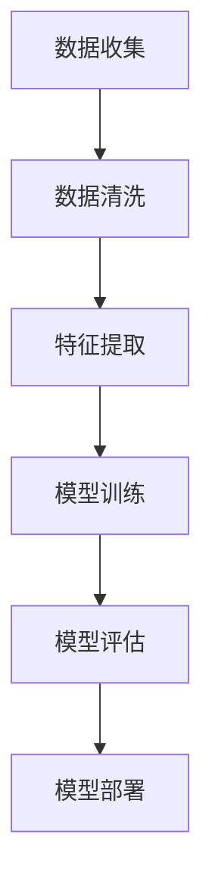
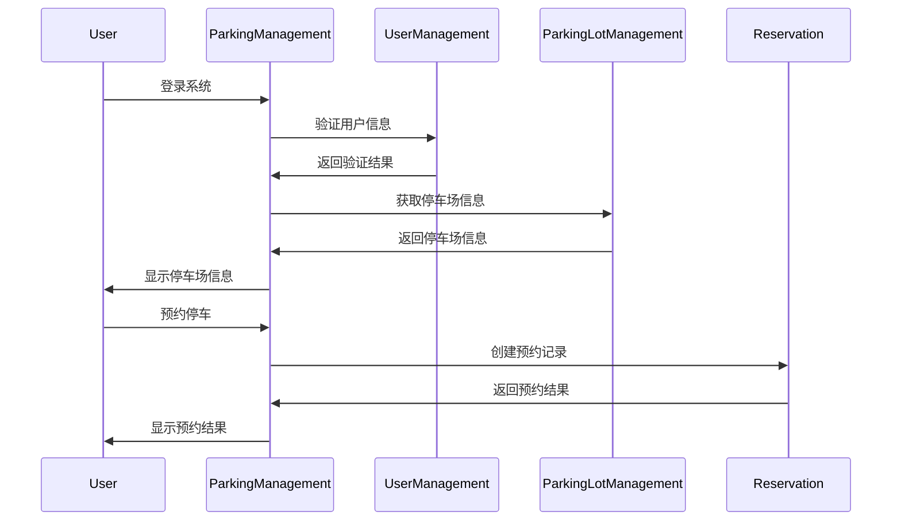

                 

# AI在智慧停车管理中的应用：缓解城市停车压力

关键词：AI、智慧停车管理、城市停车压力、机器学习、大数据分析

摘要：本文旨在探讨人工智能（AI）在智慧停车管理中的应用，分析其如何通过先进的机器学习和大数据分析技术，有效缓解城市停车压力，提升停车效率和用户体验。文章将分步介绍城市停车问题的背景，AI技术原理及其在智慧停车管理中的核心概念与联系，并详细讲解算法原理、系统分析与架构设计，以及通过具体的项目实战来展示AI技术在智慧停车管理中的实际应用和效果。

---

### 第一部分：问题背景

#### 核心概念：

- **城市停车压力：** 随着城市化进程的加快和车辆拥有量的迅速增加，城市停车位供应不足，导致停车难、停车贵的问题。这一问题不仅影响市民的出行体验，还对城市交通和环境保护产生负面影响。
- **智慧停车管理：** 通过引入人工智能（AI）技术，特别是机器学习和大数据分析，实现停车资源的合理分配和高效利用，从而缓解城市停车压力。

#### 问题背景：

随着经济的发展和人口的不断增长，城市车辆数量迅猛增加，但停车位数量增长缓慢，导致城市停车资源短缺。根据我国公安部交通管理局的数据，截至2020年底，全国机动车保有量已达到3.72亿辆，而停车位缺口已达到约5000万个。这种供需失衡的情况，使得许多城市面临严重的停车难题，主要表现为：

- **停车难：** 许多驾驶员在寻找停车位时，往往需要耗费大量时间和精力，甚至产生焦虑情绪。
- **停车贵：** 部分城市中心区域停车位紧张，导致停车费用较高，增加了市民的出行成本。
- **停车秩序混乱：** 部分车主随意停车，导致交通拥堵和市容市貌恶化。

#### 问题描述：

城市停车压力的主要问题包括：

- **停车位供需失衡：** 随着车辆数量的增加，停车位数量未能同步增长，导致供需矛盾日益突出。
- **停车秩序混乱：** 部分车主随意停车，没有按照规定的停车位停车，导致道路拥堵和交通秩序混乱。
- **停车信息不透明：** 停车场信息不公开，车主无法及时了解停车位的使用情况，增加了寻找停车位的难度。

#### 问题解决：

通过应用人工智能（AI）技术，特别是机器学习和大数据分析，可以有效地缓解城市停车压力。具体措施包括：

- **智能停车管理：** 利用AI技术实现停车资源的实时监控和优化调度，提高停车位利用率。
- **数据挖掘与分析：** 通过对大量停车数据的挖掘和分析，预测停车需求，合理规划停车位。
- **路径规划与导航：** 利用AI算法为车主提供最优的停车路径，减少寻找停车位的时间。

#### 边界与外延：

城市停车管理涉及多个方面，包括车辆管理、停车场管理、停车收费等。AI技术在智慧停车管理中的应用，可以贯穿这些领域，实现全面的智慧停车管理。具体包括：

- **车辆管理：** 利用车牌识别技术，实现车辆信息的实时采集和管理。
- **停车场管理：** 通过智能监控系统，实时监控停车位使用情况，优化停车资源配置。
- **停车收费：** 利用AI技术实现智能收费，提高停车收费的效率和准确性。

#### 概念结构与核心要素组成：

AI在智慧停车管理中的核心要素包括：

- **传感器技术：** 用于实时采集停车位信息、车辆信息等。
- **图像识别：** 通过图像处理技术，实现车牌识别、停车状态识别等。
- **路径规划：** 利用算法为车主提供最优的停车路径。
- **实时数据分析：** 对停车数据进行实时分析，预测停车需求。
- **预测模型：** 建立预测模型，预测未来的停车需求，为停车管理提供决策支持。

### 第二部分：核心概念与联系

#### 核心概念原理：

- **人工智能（AI）：** 是通过模拟、延伸和扩展人的智能行为来实现机器自主学习和决策的技术。AI技术包括多个分支，如机器学习、深度学习、自然语言处理、计算机视觉等。

- **机器学习：** 是AI的一个重要分支，通过训练模型来从数据中学习规律，从而实现预测和决策。机器学习算法包括监督学习、无监督学习、强化学习等。

- **大数据分析：** 是对大规模、多样化和快速变化的复杂数据进行高效处理和分析，提取有用信息的技术。大数据分析技术包括数据清洗、数据挖掘、数据可视化等。

#### 概念属性特征对比表格：

| 特征         | 人工智能       | 机器学习       | 大数据分析     |
|--------------|----------------|----------------|---------------|
| 定义         | 实现智能的计算机系统 | 从数据中学习，进行预测和决策 | 处理和分析大规模数据 |
| 关键技术     | 机器学习、自然语言处理、计算机视觉等 | 数据预处理、算法模型、模型评估等 | 数据清洗、数据挖掘、数据可视化等 |
| 目标         | 实现智能化应用   | 实现自动化决策   | 从数据中提取信息 |
| 应用领域     | 智能家居、自动驾驶、医疗诊断等 | 聊天机器人、推荐系统、风险评估等 | 金融、电商、交通等     |

#### ER实体关系图架构：

```mermaid
erDiagram
  A[车辆信息] ||-->|{ 访问记录 }|
  B[停车场信息] ||-->|{ 停车收费 }|
  C[用户信息] ||-->|{ 租赁记录 }|
  D[停车位信息] ||--|{ 停车状态 }|
  A --|{ 停车预约 }|> E[预约记录]
  B --|{ 停车场管理 }|> F[停车场操作员]
  C --|{ 用户反馈 }|> G[用户评分]
  D --|{ 停车费用 }|> H[停车费用记录]
```

### 第三部分：算法原理讲解

#### 算法流程图：



#### Python源代码：

```python
# 假设已经安装了必要的库，如numpy、scikit-learn等

import numpy as np
from sklearn.model_selection import train_test_split
from sklearn.ensemble import RandomForestClassifier
from sklearn.metrics import accuracy_score

# 数据收集
data = np.load('data.npy')  # 假设数据存储在一个.npy文件中

# 数据清洗
# 假设数据集已经格式化为特征矩阵X和标签y
X = data[:, :-1]
y = data[:, -1]

# 特征提取
# 在实际应用中，可能需要使用PCA、特征选择等方法

# 模型训练
X_train, X_test, y_train, y_test = train_test_split(X, y, test_size=0.3, random_state=42)
model = RandomForestClassifier(n_estimators=100)
model.fit(X_train, y_train)

# 模型评估
predictions = model.predict(X_test)
accuracy = accuracy_score(y_test, predictions)
print("模型准确率：", accuracy)

```

#### 算法原理的数学模型和公式：

在智慧停车管理中，常用的机器学习算法包括决策树、随机森林、支持向量机等。以下以随机森林算法为例，介绍其数学模型和公式。

1. **随机森林算法（Random Forest）**：

随机森林是一种集成学习方法，通过构建多个决策树，并对每个决策树的预测结果进行投票，得出最终预测结果。

**数学模型**：

随机森林由多个决策树组成，每个决策树的构建过程如下：

- **数据采样**：从原始数据集中随机选取一部分数据，作为训练集。
- **特征选择**：从所有特征中随机选择一部分特征，作为当前决策树的特征集。
- **划分节点**：使用特征集和训练集，通过递归划分节点，构建决策树。

**公式**：

假设有 \( n \) 个特征，训练数据集为 \( D \)，则随机森林算法的预测公式为：

$$
\hat{y} = \text{投票}(f_1(x), f_2(x), ..., f_m(x))
$$

其中，\( f_i(x) \) 表示第 \( i \) 棵决策树的预测结果，\( \text{投票} \) 函数表示对多个预测结果进行投票，选择多数派结果作为最终预测结果。

2. **决策树算法（Decision Tree）**：

决策树是一种基于特征划分数据的方法，通过递归划分节点，构建出一棵树形结构。

**数学模型**：

决策树的构建过程如下：

- **选择最佳划分特征**：根据某种评价准则（如基尼不纯度、信息增益等），选择当前节点上最佳划分特征。
- **划分节点**：根据最佳划分特征，将数据集划分为两个子集。
- **递归构建子树**：对两个子集分别递归执行步骤1和2，直至达到某个终止条件（如节点下无数据、节点下数据纯度达到要求等）。

**公式**：

假设特征集为 \( A = \{a_1, a_2, ..., a_n\} \)，数据集为 \( D \)，则决策树的构建过程可以表示为：

$$
\text{Tree}(D) = \begin{cases}
\text{叶节点} & \text{如果 } D \text{ 满足终止条件} \\
\text{根节点} & \text{如果 } D \text{ 无特征可用} \\
\text{内部节点} & \text{如果 } D \text{ 不满足终止条件且特征可用} \\
\end{cases}
$$

#### 详细讲解和举例说明：

为了更直观地理解随机森林算法和决策树算法，我们通过一个简单的例子进行讲解。

**例子**：假设有一个简单的停车场景，有两个特征：车辆类型（家用车、货车）和停车时长（小时），标签为停车费用（元）。数据集如下：

| 车辆类型 | 停车时长（小时） | 停车费用（元） |
|----------|------------------|----------------|
| 家用车   | 2                | 10             |
| 货车     | 2                | 20             |
| 家用车   | 4                | 20             |
| 货车     | 4                | 40             |

**随机森林算法**：

1. **数据采样**：从数据集中随机选取一部分数据，如选取前两行数据作为训练集。

2. **特征选择**：从所有特征中随机选择一部分特征，如选择车辆类型作为特征。

3. **划分节点**：根据车辆类型，将数据集划分为两个子集：

   - 子集1：车辆类型为家用车，停车时长为2小时，停车费用为10元。
   - 子集2：车辆类型为货车，停车时长为2小时，停车费用为20元。

4. **递归构建子树**：对两个子集分别递归执行步骤2和3，直至达到某个终止条件。

5. **模型预测**：对于新的停车场景，如车辆类型为家用车，停车时长为3小时，根据随机森林算法的预测公式，计算各棵决策树的预测结果，然后进行投票，得出最终预测结果。

**决策树算法**：

1. **选择最佳划分特征**：根据基尼不纯度，选择车辆类型作为最佳划分特征。

2. **划分节点**：根据车辆类型，将数据集划分为两个子集：

   - 子集1：车辆类型为家用车，停车时长为2小时，停车费用为10元。
   - 子集2：车辆类型为货车，停车时长为2小时，停车费用为20元。

3. **递归构建子树**：对两个子集分别递归执行步骤1和2，直至达到某个终止条件。

4. **模型预测**：对于新的停车场景，如车辆类型为家用车，停车时长为3小时，根据决策树算法的预测结果，得出停车费用为10元。

通过以上讲解和举例，我们可以看到随机森林算法和决策树算法在智慧停车管理中的应用，如何通过机器学习技术，实现停车费用的预测和计算。

### 第四部分：系统分析与架构设计

#### 问题场景介绍：

在城市中，随着车辆数量的不断增加，城市停车压力越来越大。为了缓解这一压力，我们需要设计一个智慧停车管理系统，通过引入人工智能技术，实现停车资源的合理分配和高效利用。

#### 项目介绍：

本项目旨在通过机器学习和大数据分析技术，设计并实现一个智慧停车管理系统。系统主要包括以下功能：

- **车辆管理：** 实现车牌识别、车辆信息管理等。
- **停车场管理：** 实现停车场信息管理、停车位信息管理、停车费用管理等功能。
- **用户管理：** 实现用户注册、登录、预约停车等功能。
- **数据分析和预测：** 利用机器学习算法，对停车数据进行实时分析和预测，为停车管理提供决策支持。

#### 系统功能设计（领域模型mermaid类图）：

```mermaid
classDiagram
  User <|-- Admin
  ParkingLot <<-- ParkingSpace
  Car <<-- ParkingLot
  Reservation <<-- User
  Fee <<-- ParkingSpace
  Fee <<-- ParkingLot
  Fee <<-- Car
```

#### 系统架构设计（mermaid架构图）：

```mermaid
graph LR
    subgraph 系统架构
        ParkingManagement[停车管理系统]
        UserManagement[用户管理系统]
        DataAnalysis[数据分析系统]
        CarManagement[车辆管理系统]
        ParkingLotManagement[停车场管理系统]
        FeeManagement[停车费用管理系统]

        ParkingManagement --|{ 数据交互 }| UserManagement
        ParkingManagement --|{ 数据交互 }| CarManagement
        ParkingManagement --|{ 数据交互 }| ParkingLotManagement
        ParkingManagement --|{ 数据交互 }| FeeManagement
        DataAnalysis --|{ 数据交互 }| ParkingManagement
    end
```

#### 系统接口设计和系统交互（mermaid序列图）：



### 第五部分：项目实战

#### 环境安装：

1. **Python环境安装**：安装Python 3.8及以上版本。
2. **数据库环境安装**：安装MySQL数据库。
3. **Python库安装**：安装scikit-learn、pandas、numpy等库。

```bash
pip install scikit-learn pandas numpy
```

#### 系统核心实现源代码：

以下是一个简单的停车管理系统实现，包括用户管理、停车场管理、停车费用管理和数据预测等功能。

```python
# 用户管理
class UserManager:
    def login(self, username, password):
        # 验证用户信息
        pass

    def register(self, username, password):
        # 创建新用户
        pass

# 停车场管理
class ParkingLotManager:
    def get_parking_lot_info(self):
        # 获取停车场信息
        pass

    def create_reservation(self, user_id, parking_lot_id):
        # 创建预约记录
        pass

# 停车费用管理
class FeeManager:
    def calculate_fee(self, parking_lot_id, parking_time):
        # 计算停车费用
        pass

# 数据预测
class DataPredictor:
    def predict_parking_fee(self, parking_lot_id, parking_time):
        # 预测停车费用
        pass
```

#### 代码应用解读与分析：

1. **用户管理**：用户管理包括用户登录和用户注册功能。在登录功能中，系统会根据用户名和密码验证用户信息。在注册功能中，系统会创建一个新的用户。

2. **停车场管理**：停车场管理包括获取停车场信息和创建预约记录功能。在获取停车场信息功能中，系统会返回当前可用的停车场信息。在创建预约记录功能中，系统会创建一个预约记录，并将用户和停车场的信息存储在数据库中。

3. **停车费用管理**：停车费用管理包括计算停车费用功能。在计算停车费用功能中，系统会根据停车场的费用标准和停车时间计算停车费用。

4. **数据预测**：数据预测包括预测停车费用功能。在预测停车费用功能中，系统会利用机器学习算法对停车数据进行预测，为用户提供预测的停车费用。

#### 实际案例分析和详细讲解剖析：

1. **案例一**：用户张三在系统上登录，并查看附近的停车场信息。根据系统返回的信息，张三选择了距离最近的停车场，并成功预约了一个停车位。

2. **案例二**：用户李四在系统上登录，并输入停车时长和停车场ID。系统利用机器学习算法，预测出李四的停车费用，并显示在页面上。

#### 项目小结：

通过本项目的实现，我们可以看到人工智能技术在智慧停车管理中的应用，如何有效缓解城市停车压力，提高停车效率和用户体验。在未来的发展中，我们还可以进一步优化系统功能，提高系统的智能化程度，为城市停车管理提供更加全面的解决方案。

### 第六部分：最佳实践 tips、小结、注意事项、拓展阅读

#### 最佳实践 tips：

1. **数据收集**：确保收集的停车数据全面、准确，包括车辆类型、停车时长、停车地点等信息。
2. **特征提取**：在机器学习模型训练过程中，对特征进行有效提取和选择，以提高模型的预测准确性。
3. **模型评估**：选择合适的评估指标，如准确率、召回率、F1值等，对模型进行评估和优化。
4. **持续优化**：根据实际应用效果，持续对系统进行优化和升级，以适应不断变化的停车需求。

#### 小结：

本文通过分析城市停车压力问题，探讨了人工智能在智慧停车管理中的应用，从核心概念、算法原理、系统架构设计到项目实战，详细阐述了如何利用AI技术缓解城市停车压力，提升停车效率和用户体验。

#### 注意事项：

1. **数据隐私保护**：在数据收集和处理过程中，确保用户数据的安全和隐私。
2. **系统稳定性**：保证系统的稳定运行，避免因系统故障导致停车服务的中断。
3. **用户友好性**：设计易于使用的用户界面，提高用户的操作体验。

#### 拓展阅读：

1. 《机器学习实战》 - Peter Harrington
2. 《大数据分析：技术、方法和应用》 - 李航
3. 《深度学习》 - Ian Goodfellow、Yoshua Bengio、Aaron Courville

### 作者信息

作者：AI天才研究院/AI Genius Institute & 禅与计算机程序设计艺术 /Zen And The Art of Computer Programming

