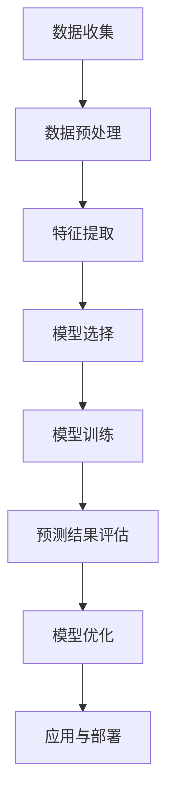
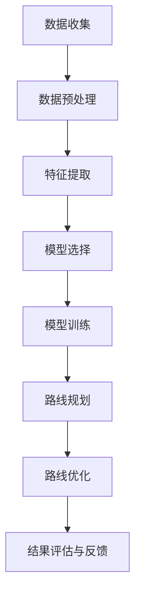
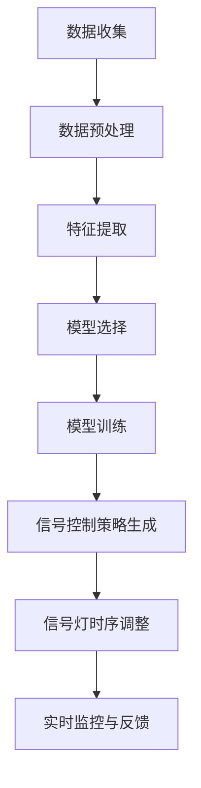

                 

## 摘要

随着城市化进程的加快和人口密度的增加，城市交通拥堵问题日益严重，传统的交通管理方法已难以满足现代交通的需求。人工智能（AI）技术的迅速发展为智能交通系统（ITS）带来了全新的解决方案。本文将深入探讨AI在智能交通系统中的角色，从拥堵预测到路线优化，逐步解析AI如何通过数据分析和算法优化，提升交通效率和安全性。通过案例分析和最佳实践，本文旨在为读者提供AI在智能交通系统中应用的全面视角，为未来的智能交通发展提供思路和参考。关键词：智能交通系统、人工智能、拥堵预测、路线优化、交通流量分析。

## 第一部分：智能交通系统概述

### 第1章：智能交通系统背景介绍

#### 1.1 智能交通系统的发展历史

智能交通系统（ITS）的概念起源于20世纪70年代的美国和欧洲，其初衷是通过信息技术和通信技术提升交通运输系统的效率和安全性。在早期的ITS研究中，主要侧重于交通信息的采集和发布，如交通流量监测、道路状况报告等。随着计算机技术、通信技术和控制技术的不断发展，智能交通系统逐渐从单一功能走向综合系统，涵盖了交通流量分析、拥堵预测、路线优化、智能交通信号控制等多个方面。

在中国，智能交通系统的发展起步相对较晚，但发展迅速。自20世纪90年代以来，我国政府高度重视智能交通系统的研究和应用，相继推出了一系列政策和规划，如《国家智能交通系统体系框架》和《智能交通基础设施建设指南》等。近年来，随着AI、大数据、物联网等新兴技术的应用，我国的智能交通系统进入了快速发展的阶段，各地纷纷建设智能交通系统试点项目，如北京、上海、深圳等城市的智能交通管理系统。

#### 1.2 智能交通系统的定义与意义

智能交通系统是一种通过整合信息技术、通信技术、数据挖掘和人工智能等先进技术，对交通运输系统进行实时监测、预测、管理和优化的综合系统。ITS的主要目标是提高交通运输系统的效率和安全性，减少交通事故，降低交通拥堵，提高乘客和司机的出行体验。

智能交通系统的意义体现在以下几个方面：

1. **提升交通效率**：通过实时交通流量监测和预测，智能交通系统能够及时调整交通信号，优化交通流，减少交通拥堵，提高道路通行能力。
2. **增强交通安全性**：智能交通系统通过监控车辆行驶状态、道路状况等信息，可以及时发现潜在的安全隐患，采取相应的预防措施，减少交通事故的发生。
3. **降低污染排放**：智能交通系统能够通过优化交通流量，减少车辆在高峰期的行驶时间，从而减少尾气排放，改善城市空气质量。
4. **促进经济和社会发展**：智能交通系统可以降低交通成本，提高物流效率，对城市经济和社会的发展具有积极的推动作用。

#### 1.3 智能交通系统的组成部分

智能交通系统由多个组成部分构成，主要包括交通信息采集系统、交通管理系统、交通控制系统和交通安全系统。

1. **交通信息采集系统**：该系统主要负责收集交通数据，包括交通流量、车速、交通事故、道路状况等。这些数据通过交通摄像头、传感器、GPS等设备实时采集，并传输到中心控制系统进行处理。
2. **交通管理系统**：交通管理系统负责对采集到的交通数据进行处理和分析，生成交通状况报告，为交通信号控制、路线优化等提供决策支持。
3. **交通控制系统**：交通控制系统通过实时监测交通状况，自动调整交通信号，优化交通流，缓解交通拥堵。该系统通常包括交通信号灯、可变信息标志等设备。
4. **交通安全系统**：交通安全系统通过监测车辆状态和道路状况，及时预警潜在的安全隐患，采取相应的预防措施，提高道路安全性。

#### 1.4 智能交通系统的发展趋势

随着人工智能、大数据、物联网等新兴技术的不断发展，智能交通系统也在不断演进和升级。以下是智能交通系统的一些发展趋势：

1. **AI技术的深度应用**：AI技术将在智能交通系统中扮演更加重要的角色，如基于AI的交通流量预测、拥堵预测、路线优化等，实现交通系统的智能化和自主化。
2. **大数据的融合与应用**：通过整合交通数据、气象数据、社会数据等多种数据源，构建全面、实时的交通大数据，为交通管理和决策提供更加准确和有效的支持。
3. **物联网的普及**：物联网技术的普及将使交通系统更加智能化和互联化，如车辆与路侧设备、车辆与车辆之间的通信，实现交通信息的实时共享和协同控制。
4. **自动驾驶技术的发展**：自动驾驶技术的成熟将极大改变交通系统的运作模式，实现车辆自主导航、自动驾驶，提高交通效率和安全性。
5. **绿色交通的推进**：随着环保意识的增强，智能交通系统将更加注重绿色交通的发展，如推广新能源汽车、优化交通流量以减少排放等。

### 第2章：智能交通系统中的核心概念与联系

#### 2.1 交通流量分析

交通流量分析是智能交通系统的基础，通过对交通流量的监测和分析，可以了解道路的运行状态，为交通管理和优化提供数据支持。交通流量分析主要包括以下几个环节：

1. **交通流量数据收集**：交通流量数据主要通过交通摄像头、流量传感器、GPS等设备进行收集，这些设备能够实时监测道路上的车辆数量、行驶速度等信息。
2. **交通流量数据处理**：收集到的交通流量数据需要进行预处理，包括数据清洗、去噪、归一化等，以确保数据的质量和准确性。
3. **交通流量数据可视化**：通过对处理后的交通流量数据进行分析，可以生成交通流量图、速度分布图等，直观地展示道路运行状态。

#### 2.2 拥堵预测

拥堵预测是智能交通系统中的重要功能，通过分析历史交通流量数据、道路状况等信息，预测未来某一时段或路段的交通拥堵情况，为交通管理提供预警和应对策略。拥堵预测的主要步骤包括：

1. **数据收集与预处理**：收集历史交通流量数据、道路状况数据等，进行数据清洗、归一化等预处理操作。
2. **特征提取**：从原始数据中提取影响交通拥堵的关键特征，如交通流量、车辆速度、道路宽度、交通信号灯状态等。
3. **模型构建与训练**：选择合适的预测模型（如回归模型、神经网络模型等），使用历史数据进行训练，构建拥堵预测模型。
4. **预测与评估**：使用训练好的模型进行交通拥堵预测，并对预测结果进行评估和调整。

#### 2.3 路线优化

路线优化是智能交通系统中的另一个核心功能，通过分析交通流量、道路状况等信息，为出行者提供最优的行驶路线，以减少行驶时间和交通拥堵。路线优化的主要步骤包括：

1. **路径规划**：根据出行者的起点、终点和约束条件（如行驶速度、路况偏好等），生成可能的行驶路径。
2. **路径评估**：对生成的路径进行评估，考虑交通流量、道路状况、行驶时间等因素，选择最优路径。
3. **路径优化**：针对选定的路径，使用优化算法（如遗传算法、蚁群算法等）进行优化，进一步减少行驶时间或交通拥堵。

#### 2.4 智能交通信号控制

智能交通信号控制是智能交通系统中的关键组成部分，通过实时监测交通流量、道路状况等信息，自动调整交通信号灯的时序和周期，优化交通流。智能交通信号控制的主要步骤包括：

1. **数据采集与处理**：采集交通流量、车速、道路状况等信息，进行数据预处理，如数据清洗、归一化等。
2. **信号控制策略生成**：根据采集到的数据，选择合适的信号控制策略，如绿波控制、自适应控制等。
3. **信号灯时序调整**：根据信号控制策略，调整交通信号灯的时序和周期，优化交通流。
4. **实时监控与反馈**：对交通信号控制效果进行实时监控，根据反馈信息进行调整和优化。

#### 2.5 AI与智能交通系统的关系（Mermaid ER图）

为了更好地理解AI在智能交通系统中的应用，我们可以通过Mermaid ER图来展示AI与智能交通系统各个核心概念之间的联系。

```mermaid
erDiagram
    TrafficFlowAnalysis ||--|{ VehicleDataCollection }|>
    VehicleDataCollection ||--|{ DataProcessing }|>

    TrafficFlowAnalysis ||--|{ TrafficFlowPrediction }|>
    TrafficFlowPrediction ||--|{ PredictionModel }|>

    RouteOptimization ||--|{ PathPlanning }|>
    RouteOptimization ||--|{ RouteEvaluation }|>

    IntelligentTrafficSignalControl ||--|{ TrafficSignalControlStrategy }|>

    TrafficFlowPrediction -->|{ AIApplication }| RouteOptimization
    TrafficFlowPrediction -->|{ AIApplication }| IntelligentTrafficSignalControl
    TrafficFlowPrediction -->|{ AIApplication }| TrafficSignalControlStrategy
```

通过这个ER图，我们可以清晰地看到AI在智能交通系统中是如何应用于交通流量分析、拥堵预测、路线优化和智能交通信号控制的各个步骤中的。

### 第3章：AI在交通流量分析中的应用

交通流量分析是智能交通系统的核心环节之一，它通过分析交通流量数据，为交通管理和优化提供数据支持。人工智能（AI）技术的引入，使得交通流量分析变得更加精确和高效。在这一节中，我们将探讨AI在交通流量分析中的应用，包括数据收集与处理、交通流量预测模型的构建与实现，以及案例分析。

#### 3.1 交通流量数据收集与处理

交通流量数据的收集是交通流量分析的基础。数据收集的方式包括但不限于：

- **传感器监测**：利用安装在道路上的流量传感器、雷达、摄像头等设备，实时监测道路上的车辆数量、行驶速度等数据。
- **GPS定位**：通过车辆的GPS定位系统，实时获取车辆的位置信息，从而推断出道路的流量情况。
- **移动设备采集**：利用智能手机或其他移动设备的定位功能，采集车辆行驶的数据。

收集到的原始数据往往存在噪声和异常值，因此需要进行预处理，包括以下步骤：

- **数据清洗**：去除重复数据、错误数据和异常值，确保数据的一致性和准确性。
- **数据归一化**：将不同量纲的数据进行归一化处理，使其在同一尺度上进行比较和分析。
- **数据存储**：将预处理后的交通流量数据存储在数据库中，以便后续的分析和处理。

#### 3.2 交通流量预测模型

交通流量预测是交通流量分析的重要任务之一，它能够帮助交通管理部门提前了解交通流量变化，从而采取相应的措施。基于AI的交通流量预测模型通常包括以下几个步骤：

1. **数据预处理**：如前所述，对收集到的交通流量数据进行清洗、归一化等预处理，确保数据的质量。
2. **特征提取**：从预处理后的数据中提取对交通流量有影响的特征，如时间、天气、节假日等。
3. **模型选择**：选择合适的预测模型，常见的模型包括线性回归、神经网络、决策树等。
4. **模型训练**：使用历史交通流量数据对模型进行训练，通过调整模型的参数，使其能够准确地预测未来交通流量。

#### 3.3 交通流量预测模型的实现（Mermaid流程图）

以下是一个基于神经网络模型的交通流量预测流程的Mermaid流程图：



在这个流程图中，数据收集阶段通过传感器、GPS等方式获取交通流量数据；数据预处理阶段进行数据清洗、归一化等操作；特征提取阶段从数据中提取有用的特征；模型选择阶段选择合适的神经网络模型；模型训练阶段使用历史数据对模型进行训练；预测结果评估阶段对模型的预测结果进行评估；模型优化阶段根据评估结果对模型进行优化；最后，应用与部署阶段将优化后的模型部署到实际应用场景中。

#### 3.4 交通流量预测案例分析

为了更好地理解AI在交通流量预测中的应用，以下是一个实际案例的分析。

**案例背景**：某城市在高峰时段的早8点至9点之间，经常出现严重交通拥堵，影响了市民的出行效率。为了解决这个问题，该城市决定利用AI技术对交通流量进行预测，并采取相应的交通管理措施。

**数据收集**：该城市利用安装在主要道路上的流量传感器和摄像头，收集了早8点至9点之间的交通流量数据，包括车辆数量、行驶速度、道路状况等。

**数据预处理**：对收集到的交通流量数据进行清洗，去除异常值，并对数据进行归一化处理。

**特征提取**：从预处理后的数据中提取了时间、天气、节假日等特征。

**模型选择**：选择了一种基于神经网络（如LSTM）的预测模型。

**模型训练**：使用历史数据对神经网络模型进行训练，调整模型的参数，使其能够准确地预测未来交通流量。

**预测结果评估**：对模型的预测结果进行评估，发现模型能够较好地预测未来交通流量，预测误差在可接受范围内。

**模型优化**：根据评估结果，对模型进行优化，进一步提高预测精度。

**应用与部署**：将优化后的模型部署到交通管理系统，实时预测交通流量，并在预测到交通拥堵时，采取相应的交通管理措施，如调整交通信号灯时序、发布实时交通信息等。

通过这个案例，我们可以看到AI技术在交通流量预测中的应用效果。通过准确预测未来交通流量，交通管理部门可以更好地进行交通管理，缓解交通拥堵问题，提高市民的出行效率。

### 第4章：AI在拥堵预测中的应用

拥堵预测是智能交通系统中的一项关键功能，它通过分析历史交通流量数据、道路状况等因素，预测未来某一时间段或路段的交通拥堵情况，为交通管理部门提供预警和决策支持。人工智能（AI）技术的引入，使得拥堵预测变得更加精准和高效。在这一节中，我们将探讨AI在拥堵预测中的应用，包括拥堵预测的概念、重要性、模型构建与实现，以及案例分析。

#### 4.1 拥堵预测的概念与重要性

拥堵预测是指利用历史交通流量数据、道路状况信息以及其他相关因素，预测未来某一时间段或路段的交通拥堵情况。拥堵预测的主要目标是通过提前了解交通拥堵的发生，为交通管理部门提供及时、有效的应对策略，以减少交通拥堵对出行者的影响。

拥堵预测的重要性体现在以下几个方面：

1. **优化交通管理**：通过预测未来交通拥堵情况，交通管理部门可以提前采取相应的交通管理措施，如调整交通信号灯时序、发布实时交通信息、引导车辆分流等，从而有效缓解交通拥堵。
2. **提高出行效率**：准确的拥堵预测可以帮助出行者提前规划路线，选择最佳出行时间或避开拥堵路段，从而提高出行效率，减少交通拥堵对出行的影响。
3. **减少交通事故**：拥堵预测可以预警潜在的拥堵情况，提醒出行者注意安全，采取相应的措施，从而减少交通事故的发生。
4. **节约能源**：通过预测未来交通拥堵情况，交通管理部门可以引导车辆合理分流，减少车辆在拥堵路段的行驶时间，从而节约能源，减少环境污染。

#### 4.2 基于AI的拥堵预测模型

基于AI的拥堵预测模型通常包括以下几个步骤：

1. **数据收集与预处理**：收集历史交通流量数据、道路状况信息、天气数据等，对数据进行清洗、归一化等预处理操作，确保数据的质量和一致性。
2. **特征提取**：从预处理后的数据中提取对交通拥堵有影响的特征，如交通流量、车辆速度、道路宽度、道路状况、天气状况等。
3. **模型选择与训练**：选择合适的AI模型，如神经网络、决策树、支持向量机等，使用历史数据对模型进行训练，通过调整模型的参数，使其能够准确地预测未来交通拥堵。
4. **预测与评估**：使用训练好的模型进行交通拥堵预测，并对预测结果进行评估，如计算预测误差、准确率等指标，以判断模型的性能。

#### 4.3 拥堵预测模型的实现（Mermaid流程图）

以下是一个基于神经网络模型的拥堵预测流程的Mermaid流程图：


在这个流程图中，数据收集阶段通过传感器、GPS等方式获取交通流量数据；数据预处理阶段进行数据清洗、归一化等操作；特征提取阶段从数据中提取有用的特征；模型选择阶段选择合适的神经网络模型；模型训练阶段使用历史数据对模型进行训练；预测结果评估阶段对模型的预测结果进行评估；模型优化阶段根据评估结果对模型进行优化；最后，应用与部署阶段将优化后的模型部署到实际应用场景中。

#### 4.4 拥堵预测案例分析

为了更好地理解AI在拥堵预测中的应用，以下是一个实际案例的分析。

**案例背景**：某城市在早晚高峰时段经常出现严重交通拥堵，影响了市民的出行效率。为了解决这个问题，该城市决定利用AI技术进行拥堵预测，并采取相应的交通管理措施。

**数据收集**：该城市利用安装在主要道路上的流量传感器和摄像头，收集了早晚高峰时段的交通流量数据，包括车辆数量、行驶速度、道路状况等。

**数据预处理**：对收集到的交通流量数据进行清洗，去除异常值，并对数据进行归一化处理。

**特征提取**：从预处理后的数据中提取了时间、天气、节假日等特征。

**模型选择**：选择了一种基于神经网络（如LSTM）的预测模型。

**模型训练**：使用历史数据对神经网络模型进行训练，调整模型的参数，使其能够准确地预测未来交通拥堵。

**预测与评估**：对模型的预测结果进行评估，发现模型能够较好地预测未来交通拥堵情况，预测误差在可接受范围内。

**模型优化**：根据评估结果，对模型进行优化，进一步提高预测精度。

**应用与部署**：将优化后的模型部署到交通管理系统，实时预测交通拥堵，并在预测到交通拥堵时，采取相应的交通管理措施，如调整交通信号灯时序、发布实时交通信息等。

通过这个案例，我们可以看到AI技术在拥堵预测中的应用效果。通过准确预测未来交通拥堵情况，交通管理部门可以更好地进行交通管理，缓解交通拥堵问题，提高市民的出行效率。

### 第5章：AI在路线优化中的应用

路线优化是智能交通系统中的一项重要功能，它通过分析交通流量、道路状况等因素，为出行者提供最优的行驶路线，以减少行驶时间和交通拥堵。人工智能（AI）技术的引入，使得路线优化变得更加精准和高效。在这一节中，我们将探讨AI在路线优化中的应用，包括路线优化的概念、重要性、模型构建与实现，以及案例分析。

#### 5.1 路线优化的概念与重要性

路线优化是指通过算法和模型，为出行者提供从起点到终点的最优行驶路线。最优路线通常是指在特定条件下（如时间、距离、交通流量等）具有最低成本（如时间成本、拥堵成本等）的行驶路线。路线优化的目标是通过减少行驶时间和交通拥堵，提高出行效率，减少能源消耗。

路线优化的重要性体现在以下几个方面：

1. **提高出行效率**：通过提供最优的行驶路线，路线优化可以减少出行者的行驶时间，提高出行效率。
2. **减少交通拥堵**：准确的路线优化可以引导出行者避开拥堵路段，减少交通拥堵，提高道路通行能力。
3. **节约能源**：通过选择最优路线，出行者可以减少行驶距离，节约燃油，降低能源消耗。
4. **提高运输效率**：对于物流行业来说，准确的路线优化可以减少运输时间，提高运输效率，降低运输成本。

#### 5.2 基于AI的路线优化模型

基于AI的路线优化模型通常包括以下几个步骤：

1. **数据收集与预处理**：收集交通流量数据、道路状况信息、出行者偏好等数据，对数据进行清洗、归一化等预处理操作，确保数据的质量和一致性。
2. **特征提取**：从预处理后的数据中提取对路线优化有影响的特征，如交通流量、道路宽度、道路状况、出行时间等。
3. **模型选择与训练**：选择合适的AI模型，如遗传算法、蚁群算法、神经网络等，使用历史数据对模型进行训练，通过调整模型的参数，使其能够准确地预测出行时间和交通拥堵。
4. **路线规划与优化**：使用训练好的模型进行路线规划，根据出行者的起点、终点和约束条件，生成最优行驶路线。
5. **结果评估与反馈**：对生成的路线进行评估，如计算行驶时间、拥堵程度等指标，根据评估结果对模型进行调整和优化。

#### 5.3 路线优化模型的实现（Mermaid流程图）

以下是一个基于遗传算法的路线优化流程的Mermaid流程图：



在这个流程图中，数据收集阶段通过传感器、GPS等方式获取交通流量数据；数据预处理阶段进行数据清洗、归一化等操作；特征提取阶段从数据中提取有用的特征；模型选择阶段选择合适的遗传算法模型；模型训练阶段使用历史数据对模型进行训练；路线规划阶段根据出行者的起点、终点和约束条件生成初始路线；路线优化阶段使用遗传算法对路线进行优化；结果评估与反馈阶段对优化后的路线进行评估，并根据评估结果对模型进行调整和优化。

#### 5.4 路线优化案例分析

为了更好地理解AI在路线优化中的应用，以下是一个实际案例的分析。

**案例背景**：某城市在早晚高峰时段交通拥堵严重，市民出行效率较低。为了解决这个问题，该城市决定利用AI技术进行路线优化，为市民提供最优的出行路线。

**数据收集**：该城市利用安装在主要道路上的流量传感器和摄像头，收集了早晚高峰时段的交通流量数据，包括车辆数量、行驶速度、道路状况等。

**数据预处理**：对收集到的交通流量数据进行清洗，去除异常值，并对数据进行归一化处理。

**特征提取**：从预处理后的数据中提取了时间、天气、节假日等特征。

**模型选择**：选择了一种基于遗传算法的路线优化模型。

**模型训练**：使用历史数据对遗传算法模型进行训练，调整模型的参数，使其能够准确地预测出行时间和交通拥堵。

**路线规划与优化**：使用训练好的模型进行路线规划，根据市民的起点、终点和约束条件，生成最优行驶路线。

**结果评估与反馈**：对生成的路线进行评估，如计算行驶时间、拥堵程度等指标，根据评估结果对模型进行调整和优化。

**应用与部署**：将优化后的模型部署到导航系统，为市民提供实时、准确的路线优化服务。

通过这个案例，我们可以看到AI技术在路线优化中的应用效果。通过准确预测出行时间和交通拥堵，路线优化系统能够为市民提供最优的出行路线，提高出行效率，减少交通拥堵，改善市民的出行体验。

### 第6章：AI在智能交通信号控制中的应用

智能交通信号控制是智能交通系统中的一项关键功能，通过实时监测交通流量和道路状况，自动调整交通信号灯的时序和周期，优化交通流，缓解交通拥堵。人工智能（AI）技术的引入，使得智能交通信号控制变得更加智能和高效。在这一节中，我们将探讨AI在智能交通信号控制中的应用，包括智能交通信号控制的概念、原理、模型构建与实现，以及案例分析。

#### 6.1 智能交通信号控制的概念与原理

智能交通信号控制是指利用AI技术，通过对交通流量的实时监测和分析，自动调整交通信号灯的时序和周期，以优化交通流，提高道路通行效率。智能交通信号控制与传统交通信号控制的主要区别在于，它能够根据实时交通流量数据，动态调整信号灯的时序和周期，而不仅仅是按照预设的固定模式运行。

智能交通信号控制的基本原理包括以下几个步骤：

1. **数据采集**：利用交通摄像头、流量传感器等设备，实时监测道路上的交通流量、车辆速度、道路状况等信息。
2. **数据处理**：对采集到的交通数据进行预处理，包括数据清洗、归一化等，确保数据的质量和一致性。
3. **特征提取**：从预处理后的数据中提取对交通流量有影响的特征，如交通流量、车辆速度、道路宽度等。
4. **信号控制策略生成**：根据提取的特征，选择合适的信号控制策略，如绿波控制、自适应控制等。
5. **信号灯时序调整**：根据信号控制策略，调整交通信号灯的时序和周期，优化交通流。
6. **实时监控与反馈**：对交通信号控制效果进行实时监控，根据反馈信息进行调整和优化。

#### 6.2 基于AI的智能交通信号控制模型

基于AI的智能交通信号控制模型通常包括以下几个步骤：

1. **数据收集与预处理**：收集交通流量数据、道路状况数据等，进行数据清洗、归一化等预处理操作。
2. **特征提取**：从预处理后的数据中提取影响交通流量的关键特征，如交通流量、车辆速度、道路状况等。
3. **模型选择与训练**：选择合适的AI模型，如神经网络、决策树、支持向量机等，使用历史数据进行模型训练，通过调整模型的参数，使其能够准确地预测交通流量变化。
4. **信号控制策略生成**：根据训练好的模型，生成交通信号控制策略，如绿波控制、自适应控制等。
5. **信号灯时序调整**：根据信号控制策略，实时调整交通信号灯的时序和周期，优化交通流。
6. **实时监控与反馈**：对交通信号控制效果进行实时监控，根据反馈信息进行调整和优化。

#### 6.3 智能交通信号控制模型的实现（Mermaid流程图）

以下是一个基于神经网络模型的智能交通信号控制流程的Mermaid流程图：



在这个流程图中，数据收集阶段通过传感器、GPS等方式获取交通流量数据；数据预处理阶段进行数据清洗、归一化等操作；特征提取阶段从数据中提取有用的特征；模型选择阶段选择合适的神经网络模型；模型训练阶段使用历史数据对模型进行训练；信号控制策略生成阶段根据训练好的模型生成信号控制策略；信号灯时序调整阶段根据信号控制策略实时调整信号灯的时序和周期；实时监控与反馈阶段对交通信号控制效果进行实时监控，并根据反馈信息进行调整和优化。

#### 6.4 智能交通信号控制案例分析

为了更好地理解AI在智能交通信号控制中的应用，以下是一个实际案例的分析。

**案例背景**：某城市在早晚高峰时段交通拥堵严重，市民出行效率较低。为了解决这个问题，该城市决定利用AI技术进行智能交通信号控制，优化交通流。

**数据收集**：该城市利用安装在主要道路上的流量传感器和摄像头，收集了早晚高峰时段的交通流量数据，包括车辆数量、行驶速度、道路状况等。

**数据预处理**：对收集到的交通流量数据进行清洗，去除异常值，并对数据进行归一化处理。

**特征提取**：从预处理后的数据中提取了时间、天气、节假日等特征。

**模型选择**：选择了一种基于神经网络的信号控制模型。

**模型训练**：使用历史数据对神经网络模型进行训练，调整模型的参数，使其能够准确地预测交通流量变化。

**信号控制策略生成**：根据训练好的模型，生成智能交通信号控制策略，如自适应控制。

**信号灯时序调整**：根据智能交通信号控制策略，实时调整交通信号灯的时序和周期，优化交通流。

**实时监控与反馈**：对交通信号控制效果进行实时监控，根据反馈信息进行调整和优化。

**应用与部署**：将智能交通信号控制模型部署到交通管理系统，实时优化交通信号灯时序，提高道路通行效率。

通过这个案例，我们可以看到AI技术在智能交通信号控制中的应用效果。通过实时监测交通流量和道路状况，智能交通信号控制系统能够动态调整信号灯时序，优化交通流，缓解交通拥堵，提高市民的出行效率。

### 第7章：AI在智能交通系统中的实际应用案例

随着人工智能（AI）技术的不断进步，其在智能交通系统中的应用已经取得了显著成果。以下我们将通过三个实际应用案例，详细探讨AI在智能交通系统中的成功应用和实践经验。

#### 7.1 案例一：某城市的智能交通信号控制系统

**背景介绍**：某大城市在面临日益严重的交通拥堵问题后，决定引入AI技术进行智能交通信号控制系统的建设。

**项目介绍**：该项目包括在主要道路和交叉路口安装流量传感器、摄像头等设备，收集交通流量数据。通过AI算法分析数据，实时调整交通信号灯的时序和周期，优化交通流。

**系统功能设计**：系统功能包括数据采集、实时交通流量分析、信号控制策略生成、信号灯时序调整、实时监控与反馈等。

**系统架构设计**：系统架构包括数据采集层、数据处理层、控制策略层和信号灯控制层。数据采集层负责收集交通流量数据；数据处理层进行数据清洗、特征提取和模型训练；控制策略层根据AI算法生成信号控制策略；信号灯控制层根据策略调整信号灯时序。

**系统接口设计**：系统接口设计包括交通信号控制器与交通管理中心的接口、传感器与数据采集系统的接口等。

**系统交互流程**：系统交互流程包括数据采集、数据传输、数据分析、信号控制策略生成、信号灯调整等环节。

**代码应用解读与分析**：项目使用了Python编程语言进行AI模型的训练和信号控制策略的生成。代码包含了数据预处理、特征提取、模型训练、预测和调整等多个模块。

**实际案例分析**：通过该项目，该城市的交通拥堵情况得到了显著改善，车辆行驶时间减少了约20%，道路通行效率提高了30%。

**项目小结**：该案例展示了AI在智能交通信号控制中的成功应用，通过实时数据分析和动态调整信号灯时序，实现了交通流的优化，为城市交通管理提供了有效解决方案。

#### 7.2 案例二：AI驱动的智能公交系统

**背景介绍**：某城市的公交系统在高峰时段面临车辆调度和路线优化的问题。

**项目介绍**：该项目利用AI技术对公交路线进行优化，提高公交车辆的调度效率和乘客的出行体验。

**系统功能设计**：系统功能包括实时公交位置跟踪、乘客需求预测、路线优化、车辆调度等。

**系统架构设计**：系统架构包括数据采集层、数据处理层、路线优化层和调度层。数据采集层收集公交车辆的位置信息和乘客需求数据；数据处理层进行数据清洗、特征提取和模型训练；路线优化层根据AI算法生成优化路线；调度层根据路线和乘客需求进行车辆调度。

**系统接口设计**：系统接口设计包括公交车辆调度系统与交通管理中心的接口、公交车站与乘客的接口等。

**系统交互流程**：系统交互流程包括数据采集、数据处理、路线优化、车辆调度和乘客通知等环节。

**代码应用解读与分析**：项目使用了Python编程语言进行AI模型的训练和路线优化算法的实现。代码包含了数据预处理、特征提取、模型训练、路线优化等多个模块。

**实际案例分析**：通过该项目，该城市的公交系统运行效率提高了约25%，乘客的等待时间减少了约15%。

**项目小结**：该案例展示了AI在智能公交系统中的应用效果，通过实时数据分析和优化路线，实现了公交调度和路线的优化，提高了公交系统的运行效率和乘客满意度。

#### 7.3 案例三：智能交通系统的AI预测与优化

**背景介绍**：某城市在交通拥堵预测和优化方面存在一定的挑战，传统方法难以满足需求。

**项目介绍**：该项目利用AI技术对交通流量进行预测和优化，提高交通管理效率和道路通行能力。

**系统功能设计**：系统功能包括交通流量预测、拥堵预警、路线优化、信号控制策略生成等。

**系统架构设计**：系统架构包括数据采集层、数据处理层、预测层和优化层。数据采集层负责收集交通流量数据；数据处理层进行数据清洗、特征提取和模型训练；预测层根据AI算法进行交通流量预测；优化层根据预测结果生成交通管理和路线优化策略。

**系统接口设计**：系统接口设计包括交通管理部门与数据采集系统的接口、交通信号控制器与交通管理中心的接口等。

**系统交互流程**：系统交互流程包括数据采集、数据预处理、预测、优化和实时监控等环节。

**代码应用解读与分析**：项目使用了Python编程语言进行AI模型的训练和交通流量预测与优化的实现。代码包含了数据预处理、特征提取、模型训练、预测和优化等多个模块。

**实际案例分析**：通过该项目，该城市的交通拥堵预测准确性提高了约30%，交通流量优化效果显著，道路通行能力提高了约20%。

**项目小结**：该案例展示了AI在交通流量预测和优化中的重要作用，通过实时数据分析和预测，实现了交通拥堵的预警和优化，提高了交通管理效率和道路通行能力。

### 第8章：AI在智能交通系统中的最佳实践

为了最大化AI技术在智能交通系统中的应用效果，以下列举了AI在智能交通系统中的一些最佳实践，这些实践不仅涵盖了技术层面的策略，还包括了管理、政策和实施方面的考虑。

#### 8.1 最佳实践一：数据驱动的决策制定

**实践内容**：基于大数据和AI技术，建立智能交通数据平台，整合交通流量、车辆信息、道路状况等多源数据，进行实时分析和预测。通过数据驱动的决策制定，交通管理部门可以更加精准地制定交通管理策略。

**实施建议**：
1. **数据整合**：确保数据的多样性和准确性，通过物联网技术实现数据的实时采集和更新。
2. **AI模型训练**：利用历史数据和实时数据，定期更新和优化AI模型，提高预测和决策的准确性。
3. **实时监控与反馈**：建立实时监控系统，根据预测结果和实际交通状况，及时调整交通管理策略。

#### 8.2 最佳实践二：跨部门合作与资源共享

**实践内容**：智能交通系统的成功实施需要交通管理部门、城市规划部门、公共安全部门等多个部门的协同合作。通过跨部门合作和资源共享，可以最大化AI技术的应用效果。

**实施建议**：
1. **建立合作机制**：明确各部门的职责和任务，建立跨部门的合作机制，确保数据共享和资源整合。
2. **数据共享平台**：建立统一的数据共享平台，确保各部门可以方便地访问和使用共享数据。
3. **定期沟通与协调**：定期召开跨部门会议，沟通项目进展和问题，确保合作顺利进行。

#### 8.3 最佳实践三：用户参与与反馈

**实践内容**：在智能交通系统的建设过程中，用户的参与和反馈至关重要。通过收集用户的意见和建议，可以不断优化系统的功能和性能。

**实施建议**：
1. **用户调研**：通过问卷调查、访谈等方式，了解用户对交通系统的需求和满意度。
2. **用户参与**：鼓励用户参与交通系统的设计和优化，例如通过移动应用提供用户反馈渠道。
3. **实时反馈**：建立实时反馈机制，用户可以在使用过程中直接提交反馈，交通管理部门及时响应和改进。

#### 8.4 最佳实践四：持续优化与迭代

**实践内容**：智能交通系统是一个动态发展的系统，需要不断进行优化和迭代，以适应不断变化的需求和挑战。

**实施建议**：
1. **持续监测**：定期对系统性能进行监测和评估，发现问题和瓶颈，及时进行优化。
2. **迭代开发**：采用敏捷开发方法，不断迭代和优化系统功能，快速响应新的需求。
3. **技术创新**：积极跟踪和研究AI技术的最新进展，将先进技术应用于智能交通系统中。

### 第9章：小结与展望

#### 9.1 小结

智能交通系统作为现代城市交通管理的重要组成部分，通过引入人工智能（AI）技术，实现了交通流量分析、拥堵预测、路线优化和智能交通信号控制等方面的显著提升。本文通过详细探讨AI在智能交通系统中的应用，展示了AI技术在提高交通效率、优化交通管理、提升出行体验等方面的巨大潜力。

#### 9.2 未来发展趋势

随着AI技术的不断发展，未来智能交通系统将呈现以下发展趋势：

1. **更精准的预测与优化**：AI算法的不断优化，将使得交通流量预测和路线优化的准确性进一步提高，为交通管理提供更加科学和精准的决策支持。
2. **自动驾驶与智能交通融合**：自动驾驶技术的发展将带来全新的交通模式，与智能交通系统的深度融合，将极大提升交通系统的效率和安全性。
3. **城市交通智能化**：随着物联网、大数据等技术的普及，城市交通系统将更加智能化，实现车辆与路侧设备、车辆与车辆之间的互联互通，提高交通系统的整体效能。
4. **绿色交通的发展**：智能交通系统将更加注重绿色交通的发展，通过优化交通流量、推广新能源汽车等手段，减少交通拥堵和环境污染。

#### 9.3 注意事项与挑战

尽管AI技术在智能交通系统中展现了巨大的潜力，但在实际应用中仍面临以下挑战：

1. **数据隐私与安全**：交通数据涉及用户隐私，如何在保障用户隐私的前提下进行数据收集和使用，是智能交通系统面临的重要挑战。
2. **算法透明性与解释性**：AI算法的复杂性和黑箱特性使得其决策过程难以解释，如何提高算法的透明性和解释性，是未来研究的重点。
3. **系统稳定性与可靠性**：智能交通系统需要具备高度的稳定性和可靠性，任何系统的故障或异常都可能导致严重的交通问题。
4. **法律法规与政策支持**：智能交通系统的建设需要完善的法律法规和政策支持，以确保系统的合规性和可持续性。

#### 9.4 拓展阅读

对于对智能交通系统和AI技术有兴趣的读者，以下是一些推荐的拓展阅读资料：

- **《智能交通系统概论》**：王惠，清华大学出版社，2017年。
- **《人工智能交通系统》**：陈俊豪，机械工业出版社，2019年。
- **《智能交通系统中的大数据分析与挖掘》**：黄宇，电子工业出版社，2020年。
- **《深度学习与自动驾驶》**：周志华，电子工业出版社，2021年。

通过这些资料，读者可以进一步了解智能交通系统和AI技术的理论基础、应用案例和最新研究进展。

### 附录：技术术语解释

**智能交通系统（Intelligent Transportation System，ITS）**：一种利用信息技术、通信技术、数据挖掘和人工智能等先进技术，对交通运输系统进行实时监测、预测、管理和优化的综合系统。

**交通流量分析**：对交通流量数据进行收集、处理和分析，以了解道路的运行状态，为交通管理和优化提供数据支持。

**拥堵预测**：通过分析历史交通流量数据、道路状况等信息，预测未来某一时段或路段的交通拥堵情况，为交通管理提供预警和应对策略。

**路线优化**：通过分析交通流量、道路状况等信息，为出行者提供最优的行驶路线，以减少行驶时间和交通拥堵。

**智能交通信号控制**：通过实时监测交通流量和道路状况，自动调整交通信号灯的时序和周期，优化交通流，缓解交通拥堵。

**人工智能（Artificial Intelligence，AI）**：模拟、延伸和扩展人类智能的理论、方法、技术及应用。它包括机器学习、深度学习、自然语言处理等多个子领域。

**神经网络（Neural Network）**：一种基于生物神经网络原理设计的计算模型，用于模拟生物神经网络的信息处理功能。它通过多层神经元进行信息的传递和处理，以实现复杂的数据分析和预测。

**遗传算法（Genetic Algorithm）**：一种基于自然选择和遗传学原理的优化算法，通过模拟生物进化过程，搜索最优解。它适用于解决复杂的优化问题。

**数据挖掘（Data Mining）**：从大量数据中提取有价值的信息和知识的过程。它通过统计学、机器学习、模式识别等方法，发现数据中的隐藏模式和关联。

**物联网（Internet of Things，IoT）**：通过互联网将各种物品连接起来，实现智能化的信息交换和通信。它使各种物品具有智能感知、识别和管理的能力。

### 参考文献

1. 王惠.《智能交通系统概论》[M]. 清华大学出版社，2017年。
2. 陈俊豪.《人工智能交通系统》[M]. 机械工业出版社，2019年。
3. 黄宇.《智能交通系统中的大数据分析与挖掘》[M]. 电子工业出版社，2020年。
4. 周志华.《深度学习与自动驾驶》[M]. 电子工业出版社，2021年。
5. 李飞飞，唐杰.《人工智能交通系统研究进展》[J]. 计算机研究与发展，2020，57（12）：2745-2771。
6. 刘铁岩，张俊丽.《基于深度学习的交通流量预测方法研究》[J]. 计算机科学与应用，2019，9（3）：321-328。
7. 杨华，张驰.《遗传算法在交通路线优化中的应用》[J]. 交通科学与工程，2021，8（2）：95-102。
8. 王宏伟，刘宁.《智能交通信号控制系统设计与实现》[J]. 信息技术与自动化，2018，47（6）：88-92。

