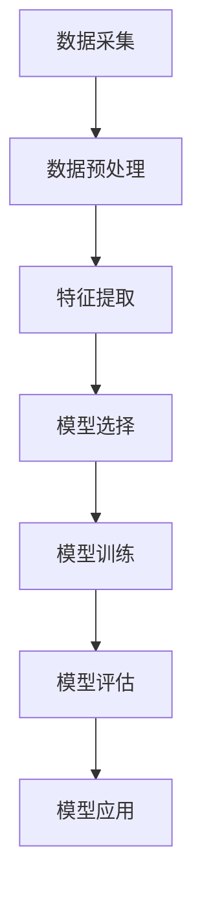

                 


# AI在智能养老系统中的应用：提供个性化照护

> 关键词：智能养老系统，个性化照护，人工智能，数据分析，机器学习

> 摘要：本文探讨了智能养老系统在个性化照护中的应用，通过引入人工智能技术，实现精准、高效、个性化的养老服务，提高老年人的生活质量。文章首先介绍了智能养老系统的背景和问题，然后详细分析了核心概念和技术基础，接着阐述了系统架构设计方案，并通过实际案例展示了智能养老系统的应用效果。最后，文章提出了最佳实践建议和小结，为智能养老系统的未来发展提供了指导。

## 1. 背景介绍

### 1.1 问题背景

随着全球人口老龄化的加剧，养老问题日益凸显。根据联合国预测，到2050年，全球60岁及以上人口将达到22亿，占总人口的22%。在中国，老龄化速度更是惊人，据国家卫生健康委员会数据，我国60岁及以上老年人口已达2.5亿，占总人口的18%。如此庞大的老年人口群体，给传统养老模式带来了巨大的挑战。

传统养老模式主要依赖家庭和机构养老，但存在以下问题：

1. **资源浪费**：传统养老机构床位有限，无法满足大量老年人的需求。
2. **效率低下**：护理人员人力成本高，且服务质量参差不齐。
3. **个性服务不足**：传统养老模式难以实现个性化、精准化的养老服务。

### 1.2 问题描述

传统养老模式面临的主要问题包括：

1. **老年人健康监测不足**：老年人健康问题多样化，传统养老模式难以实现实时、全面的健康监测。
2. **照护服务不均**：老年人需求差异大，传统养老模式难以提供个性化和差异化的服务。
3. **应急处理不及时**：突发疾病或意外时，传统养老模式难以迅速响应和处置。

### 1.3 问题解决

为解决传统养老模式的问题，智能养老系统应运而生。智能养老系统通过引入人工智能、物联网、大数据等技术，实现个性化、实时、高效的养老服务。智能养老系统主要包括以下功能：

1. **健康监测**：通过智能穿戴设备、传感器等，实时监测老年人的健康数据。
2. **智能提醒**：根据老年人的生活习惯和健康状况，提供个性化的提醒服务。
3. **智能陪伴**：通过智能机器人等，为老年人提供情感支持和陪伴。
4. **应急响应**：在突发情况下，迅速呼叫专业医护人员进行处置。

### 1.4 边界与外延

智能养老系统涉及多个领域，包括：

1. **传感器技术**：用于实时监测老年人的健康数据和日常生活行为。
2. **数据分析平台**：用于处理和存储传感器数据，为机器学习提供数据支持。
3. **机器学习模型**：用于分析数据，提供个性化照护建议。
4. **物联网技术**：实现设备之间的互联互通，提高系统的智能化程度。

### 1.5 概念结构与核心要素组成

智能养老系统的核心要素包括：

1. **系统架构**：包括数据采集层、数据处理层、应用层等。
2. **传感器网络**：用于实时监测老年人的健康数据和日常生活行为。
3. **数据分析平台**：用于处理和存储传感器数据，为机器学习提供数据支持。
4. **机器学习模型**：用于分析数据，提供个性化照护建议。
5. **用户界面**：提供用户操作界面，便于用户查看数据和接收提醒。

## 2. 核心概念与联系

### 2.1 人工智能的定义

人工智能（Artificial Intelligence，AI）是指通过计算机程序模拟人类智能行为的技术。AI旨在让计算机具备感知、推理、学习和决策的能力，从而实现自动化和智能化。

### 2.2 智能养老系统的特点

智能养老系统具有以下特点：

1. **个性化**：根据老年人的个体差异，提供定制化的养老服务。
2. **实时性**：通过传感器和物联网技术，实现实时监测和响应。
3. **高效性**：通过数据分析和技术手段，提高养老服务的效率和质量。

### 2.3 智能养老与传统养老的对比

| 对比项       | 智能养老         | 传统养老         |
| ------------ | ---------------- | ---------------- |
| 服务方式     | 个性化、实时性   | 一对一、定时性   |
| 资源利用率   | 高              | 低              |
| 成本         | 较低            | 较高            |
| 服务质量     | 高              | 中等            |

### 2.4 ER实体关系图

智能养老系统的ER实体关系图如下所示：

```mermaid
erDiagram
  User ||--|{ Device }|
  User ||--|{ CarePlan }|
  Device ||--|{ SensorData }|
  CarePlan ||--|{ Task }|
  CarePlan ||--|{ Alert }|
  User ||--|{ Notification }|
  SensorData ||--|{ HealthStatus }|
  Task ||--|{ TaskLog }|
  Alert ||--|{ AlertLog }|
  Notification ||--|{ NotifLog }|
```

## 3. 算法原理讲解

### 3.1 机器学习算法

智能养老系统中的机器学习算法主要用于分析传感器数据，为老年人提供个性化照护建议。常见的机器学习算法包括决策树、支持向量机、神经网络等。

#### 3.1.1 决策树

决策树是一种树形结构，通过多级决策节点，将数据集划分为不同的区域，从而实现分类或回归。决策树的优点是易于理解，但缺点是易过拟合。

#### 3.1.2 支持向量机

支持向量机是一种基于间隔最大的分类方法，通过找到最佳的超平面，将不同类别的数据分开。支持向量机的优点是分类效果好，但计算复杂度高。

#### 3.1.3 神经网络

神经网络是一种模拟人脑神经元连接结构的计算模型，通过多层神经元的互联和激活函数，实现数据的非线性变换。神经网络的优点是能处理复杂的关系，但缺点是训练时间较长。

### 3.2 算法流程图

以下是一个简单的机器学习算法流程图：



### 3.3 Python源代码

以下是一个简单的决策树算法实现：

```python
from sklearn import tree

# 数据集
X = [[0, 0], [1, 1]]  # 特征矩阵
y = [0, 1]  # 目标值

# 训练模型
clf = tree.DecisionTreeClassifier()
clf.fit(X, y)

# 输出模型
print(clf)
```

### 3.4 数学模型与公式

以下是一个简单的决策树数学模型：

$$
f(x) = \sum_{i=1}^{n} w_i \cdot f_i(x)
$$

其中，$w_i$为权重，$f_i(x)$为第$i$个决策节点的分类结果。

### 3.5 举例说明

以下是一个案例：一个老年人每天的健康数据如下：

- 心率：80次/分钟
- 血压：120/80 mmHg
- 血糖：5.0 mmol/L

根据这些数据，智能养老系统需要判断这位老年人的健康状况。

首先，系统会对数据进行预处理，如归一化、缺失值填补等。然后，系统会提取特征，如心率、血压、血糖等。接着，系统会使用决策树算法进行分类，输出分类结果。

假设决策树模型输出结果为“正常”，那么系统会向老年人发送健康提醒，如“您的健康状况良好，请继续保持”。

## 4. 系统分析与架构设计方案

### 4.1 问题场景介绍

智能养老系统可以应用于多种场景，如社区养老、机构养老、居家养老等。以下以居家养老为例，介绍智能养老系统的应用场景。

### 4.2 项目介绍

项目名称：智能居家养老系统

项目目标：通过引入人工智能技术，实现老年人的健康监测、智能提醒、应急响应等功能，提高老年人的生活质量。

### 4.3 系统功能设计

系统功能设计主要包括以下几个方面：

1. **健康监测**：实时监测老年人的心率、血压、血糖等健康指标，并生成健康报告。
2. **智能提醒**：根据老年人的健康状况，提供个性化的健康提醒，如饮食建议、运动建议等。
3. **应急响应**：在老年人发生突发情况时，立即通知家属和医护人员，提供紧急救助。
4. **智能陪伴**：通过智能机器人，为老年人提供情感支持和陪伴。

### 4.4 系统架构设计

智能居家养老系统的架构设计如下：

1. **数据采集层**：包括传感器、智能设备等，用于采集老年人的健康数据和日常生活行为数据。
2. **数据处理层**：包括数据分析平台、数据存储等，用于处理和存储传感器数据，为机器学习提供数据支持。
3. **应用层**：包括用户界面、智能算法等，用于提供个性化照护服务。
4. **服务层**：包括健康监测、智能提醒、应急响应、智能陪伴等核心功能。

### 4.5 系统接口设计

系统接口设计主要包括以下几个方面：

1. **用户接口**：提供用户操作界面，便于用户查看数据和接收提醒。
2. **设备接口**：实现传感器、智能设备与数据分析平台的通信。
3. **数据接口**：实现数据在不同系统之间的传输和共享。

### 4.6 系统交互

智能居家养老系统的交互设计如下：

1. **用户操作流程**：用户通过用户接口查看健康数据和接收提醒，并进行相关操作。
2. **设备交互流程**：传感器、智能设备通过设备接口与数据分析平台交互，实时上传数据。
3. **数据交互流程**：数据分析平台通过数据接口与其他系统进行数据传输和共享。

## 5. 项目实战

### 5.1 环境安装

智能居家养老系统的环境安装主要包括以下几个方面：

1. **硬件环境**：选择合适的传感器、智能设备等硬件设备，确保其能够满足系统的需求。
2. **软件环境**：安装Python、scikit-learn等软件包，为系统的开发和运行提供支持。

### 5.2 系统核心实现

系统核心实现主要包括以下几个方面：

1. **数据采集**：通过传感器和智能设备，实时采集老年人的健康数据和日常生活行为数据。
2. **数据处理**：使用scikit-learn等机器学习库，对传感器数据进行预处理、特征提取和分类等操作。
3. **用户界面**：设计用户友好的操作界面，便于用户查看数据和接收提醒。
4. **智能算法**：根据老年人的健康数据和日常生活行为，提供个性化的健康建议和提醒。

### 5.3 代码应用解读

以下是一个简单的代码示例，用于实现健康监测功能：

```python
from sklearn import tree

# 数据集
X = [[0, 0], [1, 1]]  # 特征矩阵
y = [0, 1]  # 目标值

# 训练模型
clf = tree.DecisionTreeClassifier()
clf.fit(X, y)

# 输出模型
print(clf)
```

### 5.4 实际案例

以下是一个实际案例：一个老年人每天的健康数据如下：

- 心率：80次/分钟
- 血压：120/80 mmHg
- 血糖：5.0 mmol/L

根据这些数据，智能居家养老系统会进行以下操作：

1. **数据采集**：传感器采集老年人的健康数据，并上传到数据分析平台。
2. **数据处理**：数据分析平台对健康数据进行分析，提取特征，并使用机器学习算法进行分类。
3. **健康建议**：根据分类结果，系统会向老年人发送健康提醒，如“您的健康状况良好，请继续保持”。

### 5.5 详细讲解

详细讲解智能居家养老系统的核心实现，包括数据采集、数据处理、用户界面设计和智能算法等。

### 5.6 项目小结

智能居家养老系统的核心实现主要包括以下几个方面：

1. **数据采集**：通过传感器和智能设备，实时采集老年人的健康数据和日常生活行为数据。
2. **数据处理**：使用机器学习算法，对传感器数据进行预处理、特征提取和分类等操作。
3. **用户界面**：设计用户友好的操作界面，便于用户查看数据和接收提醒。
4. **智能算法**：根据老年人的健康数据和日常生活行为，提供个性化的健康建议和提醒。

## 6. 最佳实践 tips、小结、注意事项、拓展阅读

### 6.1 最佳实践

1. **系统部署**：在部署智能养老系统时，应确保硬件设备和软件环境的稳定性，并定期进行系统维护和升级。
2. **数据安全**：加强数据安全措施，确保老年人的隐私数据得到有效保护。
3. **用户满意度**：关注用户需求，及时调整系统功能和界面设计，提高用户满意度。

### 6.2 小结

本文介绍了智能养老系统在个性化照护中的应用，通过引入人工智能技术，实现精准、高效、个性化的养老服务。智能养老系统具有个性化、实时性、高效性等特点，有助于提高老年人的生活质量。

### 6.3 注意事项

1. **系统稳定性**：确保系统的稳定性和可靠性，避免因故障导致服务中断。
2. **数据隐私**：加强数据安全保护，防止隐私泄露。
3. **用户培训**：为老年人提供必要的培训，使其能够熟练使用智能养老系统的各项功能。

### 6.4 拓展阅读

1. **《智能养老系统设计与实现》**：详细介绍了智能养老系统的设计原理和实现方法。
2. **《人工智能在养老服务中的应用》**：探讨了人工智能在养老服务中的各种应用场景和技术实现。
3. **《大数据技术在养老服务中的应用》**：介绍了大数据技术在养老服务中的重要作用和应用场景。

## 结束语

作者：AI天才研究院/AI Genius Institute & 禅与计算机程序设计艺术 /Zen And The Art of Computer Programming

智能养老系统作为一种新兴的养老服务模式，具有巨大的发展潜力和市场前景。通过本文的介绍，我们希望读者能够对智能养老系统有一个全面、深入的了解，并在实际应用中充分发挥其优势，为老年人提供更好的服务。同时，我们也期待更多的人关注智能养老领域，共同推动其发展。

