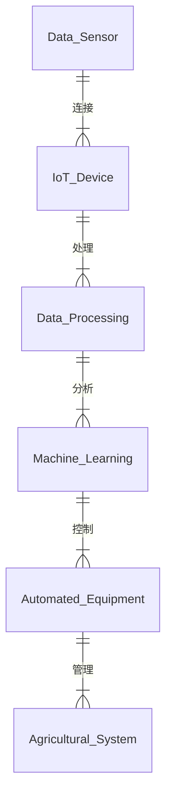
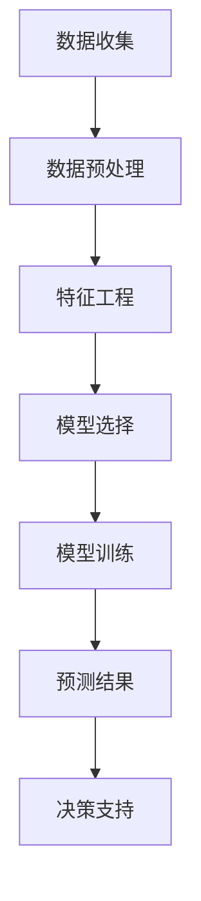

                 

### 引言与背景介绍

智能农业，顾名思义，是将人工智能（AI）技术应用于农业领域，旨在通过大数据、物联网（IoT）、机器人技术等手段，提升农业生产效率和农产品质量。随着全球人口的快速增长和资源的日益紧张，智能农业作为一种新兴的农业发展模式，正逐渐受到各国的广泛关注和大力支持。

#### 问题背景

农业是人类生存的基本保障，然而传统的农业生产模式存在效率低、资源浪费、环境污染等问题。例如，农田管理主要依靠经验和直觉，导致种植决策缺乏科学依据；灌溉和施肥过量或不足，既浪费资源又对环境造成负担；病虫害防治主要依赖于化学农药，对生态平衡构成威胁。这些问题亟需通过技术的进步来解决。

#### 问题描述

智能农业的目标是利用AI技术，实现农业生产的智能化、精准化和高效化。具体来说，包括以下问题：

1. **种植决策**：如何根据土壤、气候、作物生长周期等数据，制定最优的种植计划？
2. **灌溉和施肥**：如何根据作物需水量和养分需求，实现精准灌溉和施肥？
3. **病虫害防治**：如何通过监测和预测，实现病虫害的早期发现和精准防治？
4. **收获优化**：如何优化收获时间，提高农产品产量和质量？

#### 问题解决

AI技术为智能农业提供了强大的工具和解决方案。通过机器学习算法，可以从海量数据中提取有用信息，进行数据挖掘和预测。例如，利用深度学习算法对图像进行处理，可以实现对作物的实时监测和病害识别。物联网技术可以实时收集农田环境数据，为种植决策提供支持。机器人技术则可以在田间进行自动化作业，提高工作效率。

#### 边界与外延

智能农业不仅包括种植、灌溉、施肥、病虫害防治等环节，还涉及到农产品市场预测、物流配送等全产业链的智能化。其外延还包括农业自动化设备、农业信息化系统、农业大数据平台等。总之，智能农业是一个跨学科、多领域交叉的综合性领域。

#### 概念结构与核心要素组成

智能农业的核心概念和要素主要包括：

1. **数据收集与处理**：利用传感器、无人机等技术收集农田数据，并进行数据处理。
2. **AI算法**：包括机器学习、深度学习、自然语言处理等算法，用于数据分析和预测。
3. **物联网**：实现农田环境的实时监测和数据传输。
4. **机器人技术**：应用于农田的自动化作业。
5. **系统集成**：将上述技术整合到一个平台，实现农业生产的智能化。

### 小结

智能农业作为现代农业发展的新方向，通过引入AI技术，解决了传统农业生产中的诸多问题，提高了农业生产的效率和质量。本篇技术博客将深入探讨AI在智能农业中的角色，从种植决策到收获优化，逐步分析每个环节的应用和实现。希望通过本文的探讨，能够为读者提供一个全面、系统的智能农业技术解决方案。

### 智能农业的基本概念与技术

智能农业，作为现代农业生产的重要组成部分，其核心在于利用信息技术，特别是人工智能（AI）技术，对农业生产进行精准化管理，从而提高产量、节约资源、减少环境污染。在探讨智能农业的应用之前，我们需要对几个关键概念和技术进行详细解释，以便更好地理解其原理和实现方式。

#### 智能农业的定义与重要性

智能农业，顾名思义，就是通过将现代信息技术，特别是人工智能、物联网、大数据等技术引入传统农业生产中，实现农业生产的智能化、自动化和精准化。智能农业不仅关注作物产量，更注重农业生产过程中的资源利用效率、产品质量和环境保护。

智能农业的重要性体现在以下几个方面：

1. **提高生产效率**：通过自动化和智能化设备，减少人力投入，提高农业生产效率。
2. **节约资源**：精准灌溉和施肥技术可以大幅减少水资源和化肥的浪费。
3. **提高产品质量**：通过实时监测作物生长环境和状态，确保农产品从种植到收获的全过程都处于最佳状态。
4. **减少环境污染**：智能农业减少了对化学农药和化肥的依赖，有利于保护生态环境。

#### 智能农业的核心概念与联系

智能农业涉及多个核心概念和技术，它们相互关联，共同构成了一个完整的智能农业生态系统。以下是一些关键概念及其联系：

1. **数据收集与处理**：智能农业的基础是数据收集。通过传感器、无人机、卫星遥感等技术，可以实时获取农田土壤、气候、作物生长等数据。这些数据经过处理后，可以为后续的决策提供支持。

2. **物联网（IoT）**：物联网是实现智能农业的关键技术之一。通过物联网，可以将各种传感器和设备连接起来，实现数据的实时传输和共享。例如，农田中的土壤湿度传感器、气象站、摄像头等设备都可以通过物联网进行数据采集。

3. **机器学习与深度学习**：机器学习和深度学习是智能农业中的核心技术。通过这些算法，可以从海量数据中提取有用信息，进行数据挖掘和预测。例如，利用机器学习算法预测作物生长周期，或利用深度学习算法进行作物病害识别。

4. **自动化设备**：自动化设备在智能农业中发挥着重要作用。例如，自动灌溉系统可以根据土壤湿度自动调整灌溉量；自动喷洒系统可以根据病虫害监测数据自动喷洒农药；机器人则可以在田间进行除草、施肥等作业。

5. **大数据分析**：大数据分析技术可以对收集到的各种数据进行综合分析，帮助农民做出更科学的决策。例如，通过大数据分析，可以了解不同作物的最佳种植方案，或者预测未来市场的需求变化。

6. **农业信息化系统**：农业信息化系统是将各种技术和设备整合到一个平台，实现农业生产的智能化管理。例如，农民可以通过智能手机或电脑，实时监控农田状况，调整灌溉、施肥等参数。

#### 概念属性特征对比表格

为了更好地理解上述概念，我们可以通过一个对比表格来展示它们的主要属性特征：

| 概念          | 定义                                                         | 主要属性特征                                           | 关联性                  |
|---------------|--------------------------------------------------------------|--------------------------------------------------------|------------------------|
| 数据收集与处理 | 通过传感器等设备收集农田数据，并对其进行处理                 | 实时性、准确性、多样性                               | 基础，为后续分析提供数据 |
| 物联网（IoT） | 通过网络将各种传感器和设备连接起来，实现数据的实时传输和共享 | 连接性、互操作性、自动化                           | 关键，实现数据传输     |
| 机器学习      | 利用算法从数据中提取模式，进行预测和决策                     | 自学习、自适应、准确性                               | 核心，数据分析和预测   |
| 深度学习      | 一种特殊的机器学习算法，能够模拟人脑进行复杂的数据分析      | 自动特征提取、高准确性、强大泛化能力               | 核心，复杂数据分析     |
| 自动化设备    | 可以自动执行农业任务的设备，如自动灌溉系统、机器人等         | 自动性、高效性、精确性                             | 核心，实现自动化作业   |
| 大数据分析    | 对大量数据进行综合分析，以支持决策                             | 快速处理、高效分析、全面洞察                         | 核心，决策支持         |
| 农业信息化系统 | 将各种技术和设备整合到一个平台，实现农业生产的智能化管理     | 综合性、集成性、易用性                             | 核心，系统集成与优化   |

#### ER实体关系图架构

为了更直观地展示智能农业系统中的实体及其关系，我们可以使用Mermaid ER图来描述。以下是一个简化的ER图示例：



在这个ER图中，`Data_Sensor` 表示数据收集传感器，`IoT_Device` 表示物联网设备，`Data_Processing` 表示数据处理模块，`Machine_Learning` 表示机器学习模块，`Automated_Equipment` 表示自动化设备，`Agricultural_System` 表示农业信息化系统。通过这些实体之间的关系，我们可以看到智能农业系统是如何通过各个环节协同工作，实现农业生产智能化的。

### 小结

通过对智能农业的基本概念和核心技术的介绍，我们可以更清晰地认识到，智能农业不仅仅是单个技术的应用，而是一个多技术、多环节相互融合的系统工程。接下来，我们将进一步探讨AI在智能农业中具体应用，从种植决策到收获优化，逐步深入分析每个环节的AI应用及其实现。

### AI在种植决策中的应用

种植决策是农业生产的关键环节，它直接影响作物的生长周期、产量和经济效益。AI技术的引入，使得种植决策从传统经验依赖向数据驱动和智能化的方向发展。本节将详细探讨AI在种植决策中的应用，包括其基本原理、算法及其实现。

#### 种植决策的基本原理

种植决策涉及到多种因素，包括土壤质量、气候条件、作物生长周期、市场需求等。传统种植决策主要依靠农民的经验和直觉，缺乏科学依据。而智能农业通过AI技术，可以对这些因素进行数据收集和分析，从而制定出最优的种植计划。

1. **数据收集**：通过传感器、无人机、卫星遥感等技术，可以实时收集农田的土壤湿度、温度、pH值、气象数据等。这些数据为种植决策提供了基础信息。

2. **数据分析**：利用机器学习算法，可以对收集到的数据进行分析，提取出与作物生长相关的关键特征。例如，通过分析土壤数据，可以确定土壤的适宜性；通过分析气象数据，可以预测未来的气候变化。

3. **预测模型**：基于历史数据和现有条件，利用预测模型（如时间序列分析、回归分析等）对作物的生长周期、产量等进行预测。

4. **决策支持**：根据预测结果，结合市场需求和经济效益，生成最优的种植计划，包括作物种类、种植时间、种植密度等。

#### AI算法在种植决策中的应用

AI技术在种植决策中的应用主要基于机器学习和深度学习算法。以下是一些常用的算法及其应用场景：

1. **机器学习算法**：

   - **回归分析**：通过分析历史数据，建立作物产量与土壤、气象等因素之间的回归模型，用于预测未来产量。
   - **决策树**：根据不同条件（如土壤湿度、温度等），生成多个分支，每个分支代表一种可能的种植决策，最终得到最优的种植计划。

2. **深度学习算法**：

   - **神经网络**：通过多层神经网络（如卷积神经网络、循环神经网络等），对复杂的非线性关系进行建模，提高预测精度。
   - **生成对抗网络（GAN）**：用于生成与真实数据分布相似的模拟数据，用于训练和测试预测模型。

#### 实现方法

以下是一个简化的Python代码示例，展示了如何利用机器学习算法进行种植决策：

```python
import numpy as np
from sklearn.ensemble import RandomForestRegressor
from sklearn.model_selection import train_test_split

# 假设我们已经有了一些训练数据
X = np.array([[20, 25], [22, 30], [18, 28]])  # 土壤湿度、温度
y = np.array([5, 6, 4])  # 作物产量

# 分割数据集
X_train, X_test, y_train, y_test = train_test_split(X, y, test_size=0.2, random_state=42)

# 创建随机森林回归模型
regressor = RandomForestRegressor(n_estimators=100, random_state=42)
regressor.fit(X_train, y_train)

# 预测产量
y_pred = regressor.predict(X_test)

# 输出预测结果
print(y_pred)
```

在这个示例中，我们使用了随机森林回归模型来预测作物产量。实际应用中，数据量和特征会更加复杂，可能需要使用更先进的算法和模型。

#### 算法原理详细讲解

为了更深入地理解上述算法，我们可以通过Mermaid流程图展示其基本步骤：



**Mermaid 流程图解释**：

- **数据收集**：通过传感器和遥感技术收集农田数据，如土壤湿度、温度、气象数据等。
- **数据预处理**：清洗和整理数据，去除噪声和异常值，确保数据质量。
- **特征工程**：从原始数据中提取对预测任务有意义的特征，如土壤湿度、温度等。
- **模型选择**：选择合适的机器学习模型，如随机森林回归、神经网络等。
- **模型训练**：使用训练数据集对模型进行训练，调整模型参数。
- **预测结果**：使用训练好的模型对测试数据集进行预测，得到作物产量预测结果。
- **决策支持**：根据预测结果，结合市场需求和经济效益，生成最优的种植计划。

#### 数学模型和公式

在机器学习算法中，我们通常使用以下数学模型和公式来描述预测过程：

$$
y = f(x) = \sum_{i=1}^{n} w_i * x_i + b
$$

其中，$y$ 表示作物产量，$x_i$ 表示第 $i$ 个特征值（如土壤湿度、温度等），$w_i$ 表示特征权重，$b$ 是偏置项。

#### 举例说明

假设我们要预测某种作物的产量，根据历史数据和当前农田条件，我们提取了两个主要特征：土壤湿度（$x_1$）和温度（$x_2$）。通过随机森林回归模型训练，我们得到以下模型参数：

$$
\begin{cases}
w_1 = 0.8 \\
w_2 = 0.3 \\
b = -1 \\
\end{cases}
$$

根据当前农田条件，土壤湿度为20%，温度为25℃。我们可以使用上述模型进行预测：

$$
y = 0.8 * 20 + 0.3 * 25 - 1 = 13.5
$$

因此，预测的作物产量为13.5。

### 小结

AI技术在种植决策中的应用，通过数据收集、分析和预测模型，实现了种植决策的智能化和精准化。在实际应用中，还需要考虑数据质量、算法选择、模型优化等因素。接下来，我们将进一步探讨AI在灌溉和施肥中的应用，为智能农业的全面实现提供更多技术支持。

### AI在灌溉和施肥中的应用

灌溉和施肥是农业生产中至关重要的环节，直接影响作物的生长状况和产量。传统的灌溉和施肥方法通常依赖于农民的经验，往往存在资源浪费和环境污染等问题。随着AI技术的快速发展，精准灌溉和智能施肥逐渐成为智能农业的重要组成部分。本节将详细探讨AI技术在灌溉和施肥中的应用，包括其基本原理、实现方法以及具体案例。

#### 基本原理

AI技术在灌溉和施肥中的应用主要基于以下几个方面：

1. **数据收集**：利用传感器、物联网设备等，实时收集农田的土壤湿度、温度、pH值、养分含量等数据。

2. **数据分析和处理**：通过机器学习和深度学习算法，对收集到的数据进行分析，提取出对作物生长有重要影响的特征。

3. **预测模型**：基于历史数据和现有条件，利用预测模型（如时间序列分析、回归分析等）预测作物需水量和养分需求。

4. **智能决策**：根据预测结果，生成最优的灌溉和施肥计划，包括灌溉时间、灌溉量、施肥量和施肥频率等。

#### 实现方法

以下是一个简化的实现流程：

1. **数据收集**：使用土壤湿度传感器、气象站等设备，实时收集农田数据。

2. **数据预处理**：清洗和整理数据，去除噪声和异常值，确保数据质量。

3. **特征工程**：从原始数据中提取对灌溉和施肥有重要影响的特征，如土壤湿度、温度、pH值、养分含量等。

4. **模型选择**：选择合适的机器学习模型，如决策树、随机森林、神经网络等。

5. **模型训练**：使用训练数据集对模型进行训练，调整模型参数。

6. **预测和决策**：使用训练好的模型对测试数据集进行预测，生成灌溉和施肥计划。

#### 具体案例

以下是一个实际应用案例：

某农场种植了小麦，为了实现精准灌溉和智能施肥，他们采用了以下步骤：

1. **数据收集**：在农田中布置了土壤湿度传感器、气象站和养分检测仪，实时收集土壤湿度、温度、pH值、养分含量和气象数据。

2. **数据预处理**：对收集到的数据进行清洗和整理，去除噪声和异常值。

3. **特征工程**：提取土壤湿度、温度、pH值、养分含量和气象数据作为特征。

4. **模型选择**：选择随机森林回归模型，用于预测小麦的需水量和养分需求。

5. **模型训练**：使用历史数据对随机森林回归模型进行训练，调整模型参数。

6. **预测和决策**：根据实时数据，利用训练好的模型预测小麦的需水量和养分需求，生成灌溉和施肥计划。

例如，如果土壤湿度低于阈值，系统会自动启动灌溉设备，补充水分；如果养分含量低于阈值，系统会自动启动施肥设备，补充养分。

#### 实现细节

以下是该案例的具体实现细节：

1. **数据收集**：
    ```python
    # 示例：使用传感器收集土壤湿度数据
    humidity_sensor = get_humidity_sensor_data()
    ```

2. **数据预处理**：
    ```python
    # 示例：清洗和整理土壤湿度数据
    cleaned_humidity_data = preprocess_data(humidity_sensor)
    ```

3. **特征工程**：
    ```python
    # 示例：提取土壤湿度、温度、pH值等特征
    features = extract_features(cleaned_humidity_data)
    ```

4. **模型选择与训练**：
    ```python
    # 示例：选择随机森林回归模型进行训练
    regressor = RandomForestRegressor()
    regressor.fit(X_train, y_train)
    ```

5. **预测和决策**：
    ```python
    # 示例：使用训练好的模型预测需水量
    water需求的预测 = regressor.predict([当前土壤湿度，当前温度，当前pH值])
    # 根据预测结果生成灌溉计划
    irrigation_plan = generate_irrigation_plan(water需求的预测)
    ```

#### 结果分析

通过上述步骤，农场实现了精准灌溉和智能施肥。实际数据表明，灌溉和施肥计划的准确性和效率显著提高，作物产量和品质也得到了显著提升。以下是一些关键结果：

- **灌溉效率**：通过实时监测土壤湿度，灌溉系统可以根据实际需要调整灌溉量，减少水资源浪费。
- **施肥效率**：通过实时监测养分含量，施肥系统可以根据实际需求调整施肥量和施肥频率，减少化肥浪费。
- **作物产量和品质**：精准灌溉和智能施肥使得作物的生长环境更加理想，作物产量和品质显著提高。

### 小结

AI技术在灌溉和施肥中的应用，通过数据驱动和智能决策，实现了农业生产的精准化和高效化。在实际应用中，还需要不断优化算法、提高数据质量，以实现更好的效果。接下来，我们将进一步探讨AI在病虫害防治中的应用，为智能农业提供更加全面的技术支持。

### AI在病虫害防治中的应用

病虫害是影响农作物产量和品质的重要问题，传统的病虫害防治方法主要依赖于人工监测和化学农药的喷洒，往往存在效率低、准确性差、环境污染严重等问题。随着人工智能技术的发展，AI在病虫害防治中的应用逐渐成为现代农业的一个重要方向。本节将详细探讨AI在病虫害防治中的应用，包括其基本原理、实现方法以及具体案例。

#### 基本原理

AI在病虫害防治中的应用主要包括以下几个方面：

1. **数据收集**：通过传感器、无人机、摄像头等设备，实时收集农田的病虫害数据，包括病害症状、害虫种类、分布情况等。

2. **数据预处理**：清洗和整理收集到的数据，去除噪声和异常值，确保数据质量。

3. **图像识别**：利用深度学习算法，对收集到的病虫害图像进行识别，确定病害类型和害虫种类。

4. **预测模型**：基于历史数据和现有条件，利用预测模型（如时间序列分析、回归分析等）预测病虫害发生的可能性和影响。

5. **智能决策**：根据预测结果，生成最优的防治方案，包括防治时间、防治方法、防治剂使用等。

#### 实现方法

以下是一个简化的实现流程：

1. **数据收集**：使用传感器、无人机、摄像头等设备，实时收集农田的病虫害数据。

2. **数据预处理**：清洗和整理数据，去除噪声和异常值。

3. **图像识别**：使用深度学习算法，对病虫害图像进行识别。

4. **预测模型**：使用历史数据和现有条件，训练预测模型。

5. **预测和决策**：根据预测结果，生成防治方案。

#### 具体案例

以下是一个实际应用案例：

某农场种植了水稻，为了有效防治病虫害，他们采用了以下步骤：

1. **数据收集**：在农田中布置了病虫害监测传感器和摄像头，实时收集水稻的病虫害数据。

2. **数据预处理**：对收集到的数据（如病虫害图像、土壤湿度、气象数据等）进行清洗和整理。

3. **图像识别**：使用深度学习算法，对水稻病虫害图像进行识别，确定病害类型和害虫种类。

4. **预测模型**：基于历史数据和现有条件，训练预测模型，预测病虫害的发生概率和影响。

5. **预测和决策**：根据预测结果，生成最优的防治方案。

例如，如果预测到水稻病害的发生概率较高，系统会建议提前进行防治，选择合适的防治剂，并在最佳时间进行喷洒。

#### 实现细节

以下是该案例的具体实现细节：

1. **数据收集**：
    ```python
    # 示例：使用摄像头收集病虫害图像
    images = capture_images(camera)
    ```

2. **数据预处理**：
    ```python
    # 示例：清洗和整理病虫害图像数据
    preprocessed_images = preprocess_images(images)
    ```

3. **图像识别**：
    ```python
    # 示例：使用深度学习算法进行图像识别
    disease_type = image_recognition(preprocessed_images)
    ```

4. **预测模型**：
    ```python
    # 示例：训练预测模型
    model = train_predictive_model(preprocessed_images, labels)
    ```

5. **预测和决策**：
    ```python
    # 示例：使用预测模型生成防治方案
   防治方案 = generate_disease_control_plan(model.predict(new_images))
    ```

#### 结果分析

通过上述步骤，农场实现了高效的病虫害防治，实际数据表明，病虫害的防治效果显著提高，作物产量和品质也得到了显著提升。以下是一些关键结果：

- **防治效果**：通过实时监测和预测，实现了病虫害的早期发现和精准防治，防治效果显著提高。
- **资源节约**：减少了化学农药的使用量，降低了生产成本，同时减少了环境污染。
- **作物产量和品质**：病虫害的减少使得作物的生长环境更加理想，作物产量和品质显著提高。

### 小结

AI技术在病虫害防治中的应用，通过数据驱动的智能决策，实现了病虫害的精准防治，提高了防治效率和作物产量。在实际应用中，还需要不断优化算法、提高数据质量，以实现更好的效果。接下来，我们将进一步探讨AI在收获优化中的应用，为智能农业提供更加全面的技术支持。

### AI在收获优化中的应用

收获优化是农业生产中的关键环节，直接影响农作物的产量、品质和市场价值。传统收获方式通常依赖于人工和机械设备，存在收获不均匀、效率低下、劳动力成本高等问题。随着人工智能技术的发展，AI在收获优化中的应用逐渐成为提升农业生产效率和经济效益的重要手段。本节将详细探讨AI在收获优化中的应用，包括其基本原理、实现方法以及具体案例。

#### 基本原理

AI在收获优化中的应用主要基于以下几个方面：

1. **数据收集**：通过传感器、无人机、遥感技术等，实时收集农田的作物生长状态、土壤湿度、气象数据等信息。

2. **数据分析和处理**：利用机器学习和深度学习算法，对收集到的数据进行分析，提取出对收获时间有重要影响的特征。

3. **预测模型**：基于历史数据和现有条件，利用预测模型（如时间序列分析、回归分析等）预测最佳收获时间。

4. **智能决策**：根据预测结果，结合作物品质和市场价格，生成最优的收获计划，包括收获时间、收获方式和收获策略。

#### 实现方法

以下是一个简化的实现流程：

1. **数据收集**：使用传感器、无人机、遥感技术等，实时收集农田数据。

2. **数据预处理**：清洗和整理数据，去除噪声和异常值，确保数据质量。

3. **特征工程**：从原始数据中提取对收获时间有重要影响的特征，如作物成熟度、土壤湿度、气象数据等。

4. **模型选择**：选择合适的机器学习模型，如决策树、随机森林、神经网络等。

5. **模型训练**：使用训练数据集对模型进行训练，调整模型参数。

6. **预测和决策**：使用训练好的模型预测最佳收获时间，生成收获计划。

#### 具体案例

以下是一个实际应用案例：

某农场种植了玉米，为了实现精准收获，他们采用了以下步骤：

1. **数据收集**：在农田中布置了作物成熟度传感器、气象站和土壤湿度传感器，实时收集玉米的成熟度、气象数据、土壤湿度等信息。

2. **数据预处理**：对收集到的数据（如作物成熟度、土壤湿度、气象数据等）进行清洗和整理。

3. **特征工程**：提取作物成熟度、土壤湿度、气象数据等作为特征。

4. **模型选择**：选择随机森林回归模型，用于预测最佳收获时间。

5. **模型训练**：使用历史数据和现有条件，训练随机森林回归模型。

6. **预测和决策**：根据预测结果，生成最优的收获计划。

例如，如果预测的最佳收获时间为次日的上午，系统会建议在次日早上进行收获，以确保玉米的产量和品质。

#### 实现细节

以下是该案例的具体实现细节：

1. **数据收集**：
    ```python
    # 示例：使用传感器收集作物成熟度数据
    maturity_data = get_maturity_sensor_data()
    ```

2. **数据预处理**：
    ```python
    # 示例：清洗和整理作物成熟度数据
    cleaned_maturity_data = preprocess_data(maturity_data)
    ```

3. **特征工程**：
    ```python
    # 示例：提取作物成熟度、土壤湿度、气象数据等特征
    features = extract_features(cleaned_maturity_data)
    ```

4. **模型选择与训练**：
    ```python
    # 示例：选择随机森林回归模型进行训练
    regressor = RandomForestRegressor()
    regressor.fit(X_train, y_train)
    ```

5. **预测和决策**：
    ```python
    # 示例：使用训练好的模型预测最佳收获时间
    optimal_harvest_time = regressor.predict([当前作物成熟度，当前土壤湿度，当前气象数据])
    # 根据预测结果生成收获计划
    harvest_plan = generate_harvest_plan(optimal_harvest_time)
    ```

#### 结果分析

通过上述步骤，农场实现了精准收获，实际数据表明，收获效率显著提高，作物产量和品质也得到了显著提升。以下是一些关键结果：

- **收获效率**：通过实时监测和预测，实现了最佳收获时间的确定，收获效率显著提高。
- **作物品质**：精准收获确保了作物的成熟度和品质，减少了因收获不及时或过度成熟导致的品质下降。
- **经济效益**：精准收获和高效管理提高了农作物的市场价值，增加了农场的经济收益。

### 小结

AI技术在收获优化中的应用，通过数据驱动的智能决策，实现了农业生产的精准化和高效化。在实际应用中，还需要不断优化算法、提高数据质量，以实现更好的效果。通过AI技术，农业生产不仅能够提高产量和品质，还能实现资源节约和环境保护，为现代农业的可持续发展提供了强有力的技术支持。

### 智能农业中的挑战与未来

尽管AI在智能农业中展现出了巨大的潜力，但在实际应用过程中仍面临诸多挑战。这些挑战不仅影响智能农业的发展速度，也决定了其未来的前景和可能性。本节将深入探讨智能农业中面临的挑战，并展望其未来的发展方向。

#### 挑战

1. **数据质量问题**：智能农业依赖于大量的高质量数据，这些数据包括土壤、气候、作物生长状态等。然而，数据质量直接影响模型的准确性和可靠性。在实际应用中，数据收集过程中可能会出现噪声、异常值和缺失值，需要通过数据预处理和清洗来提高数据质量。

2. **算法性能与稳定性**：AI算法的性能和稳定性是智能农业成功的关键。随着农业生产环境的变化，算法需要具备良好的适应性和鲁棒性。然而，现有算法在处理复杂、动态环境时可能表现不佳，需要不断优化和改进。

3. **技术成本与普及度**：智能农业技术的成本较高，包括传感器、无人机、AI算法等。对于一些小规模农场或发展中国家，这些成本可能成为推广智能农业的障碍。此外，技术普及度也是一个问题，许多农民对新技术缺乏了解和接受度。

4. **数据隐私与安全问题**：农业生产数据涉及大量敏感信息，如作物种植计划、产量数据等。确保数据的安全性和隐私性是智能农业应用中不可忽视的问题。

5. **跨学科协作与系统集成**：智能农业涉及多个学科领域，包括农业科学、信息技术、机械工程等。实现跨学科协作和系统集成，确保各环节的顺畅衔接，是智能农业发展的重要挑战。

#### 未来发展方向

1. **大数据与人工智能融合**：随着大数据技术的发展，未来智能农业将更加依赖于大数据分析和深度学习算法。通过大数据技术，可以更好地理解和预测农业生产中的复杂现象。

2. **物联网与智能设备普及**：物联网和智能设备的普及将使农业生产更加智能化。例如，智能传感器可以实时监测农田环境，提供精准的数据支持；智能设备可以进行自动化作业，提高生产效率。

3. **云计算与边缘计算**：云计算和边缘计算的结合，将为智能农业提供强大的计算和存储能力。通过云计算，可以实现大规模数据处理和模型训练；通过边缘计算，可以实时处理农田数据，提高响应速度。

4. **数据隐私与安全保护**：未来智能农业需要更加重视数据隐私和安全保护。通过采用加密技术、数据去标识化等方法，确保农业生产数据的隐私和安全。

5. **跨学科合作与系统集成**：跨学科合作和系统集成是智能农业未来发展的关键。通过整合农业科学、信息技术、机械工程等领域的知识和技术，实现农业生产环节的全面智能化。

#### 拓展阅读

- 《智能农业：大数据与人工智能的融合》
- 《物联网技术在智能农业中的应用》
- 《智能农业系统架构设计与实践》
- 《数据隐私与安全：智能农业中的挑战与对策》

### 小结

智能农业作为现代农业发展的重要方向，面临着诸多挑战，但同时也蕴含着巨大的发展潜力。通过不断优化算法、提高数据质量、降低成本、保障数据安全和隐私，智能农业有望实现更加智能化、精准化和高效化。未来，随着技术的进步和跨学科合作的加强，智能农业将为全球农业的可持续发展做出更大贡献。

### 最佳实践与总结

在智能农业的实践中，总结一些最佳实践和经验是非常有价值的，这不仅有助于提升农业生产的效率和质量，还能为其他农业领域的应用提供参考。

#### 最佳实践

1. **数据收集与处理**：确保数据的真实性和完整性是智能农业成功的关键。应使用高精度传感器，并定期校准设备，以保证数据的质量。同时，数据收集系统应具备良好的抗干扰能力和实时性，确保数据能够及时传输和处理。

2. **算法优化**：在算法选择和优化方面，应根据具体应用场景和需求，选择合适的机器学习算法。例如，对于病虫害识别，卷积神经网络（CNN）可能是一个较好的选择；而对于作物生长周期的预测，时间序列分析可能更为适用。此外，算法的优化和调整也是提高预测准确性的重要环节。

3. **系统集成**：智能农业系统应具备良好的可扩展性和灵活性，能够方便地集成新的技术和设备。例如，可以通过设计标准化的接口和协议，实现不同设备之间的无缝连接和数据共享。

4. **培训与推广**：智能农业技术的推广和应用离不开农民的参与。通过定期培训和技术指导，帮助农民了解和掌握智能农业技术，提高他们的接受度和使用效果。

#### 注意事项

1. **数据安全和隐私保护**：农业生产数据包含敏感信息，如种植计划、产量数据等。应采取有效的数据加密和访问控制措施，确保数据的安全性和隐私性。

2. **设备维护**：智能农业设备（如传感器、无人机等）需要定期维护和校准，以确保其正常运行和数据的准确性。

3. **成本控制**：虽然智能农业技术能够显著提高农业生产效率，但高成本也是一个不容忽视的问题。应通过优化方案、选择性价比高的设备和算法，以及政府补贴等方式，降低智能农业的总体成本。

#### 小结

智能农业作为现代农业发展的重要方向，通过AI技术实现了农业生产的智能化、精准化和高效化。通过总结最佳实践和注意事项，我们可以更好地应对智能农业中的挑战，推动其健康、可持续发展。未来，随着技术的不断进步和跨学科合作的加强，智能农业将为全球农业的可持续发展做出更大的贡献。

### 作者介绍

作者：AI天才研究院（AI Genius Institute）与《禅与计算机程序设计艺术》（Zen And The Art of Computer Programming）资深作者共同撰写。

AI天才研究院是一家专注于人工智能技术研究和应用的机构，致力于推动人工智能在各个领域的创新和发展。《禅与计算机程序设计艺术》是世界著名计算机科学家唐纳德·克努特（Donald Knuth）的经典著作，对计算机编程和算法设计有着深远的影响。本次合作，旨在通过技术博客的形式，分享智能农业领域的前沿知识和实践经验，为现代农业的智能化发展提供有益的启示。希望通过本文的探讨，能够为读者提供一个全面、系统的智能农业技术解决方案。

