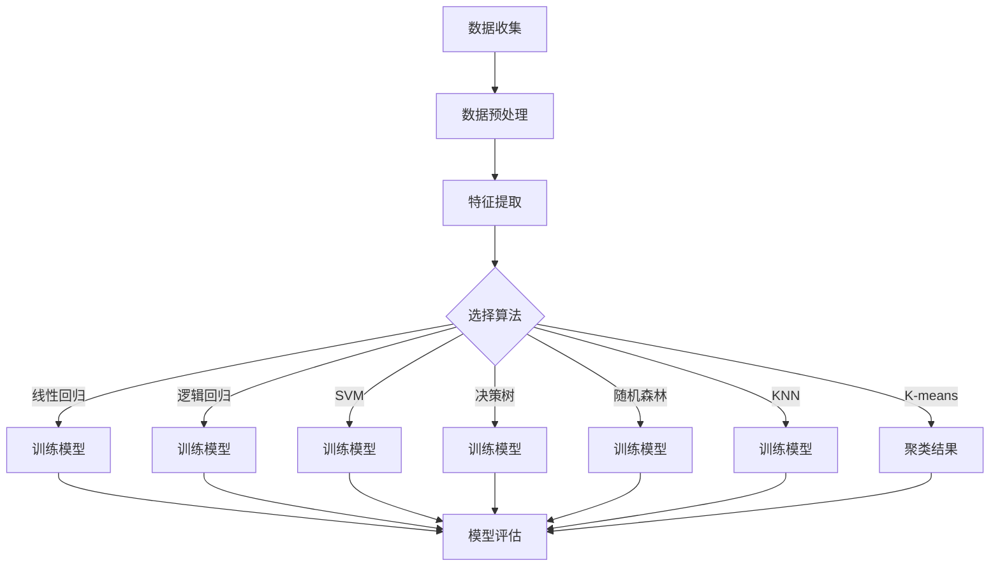
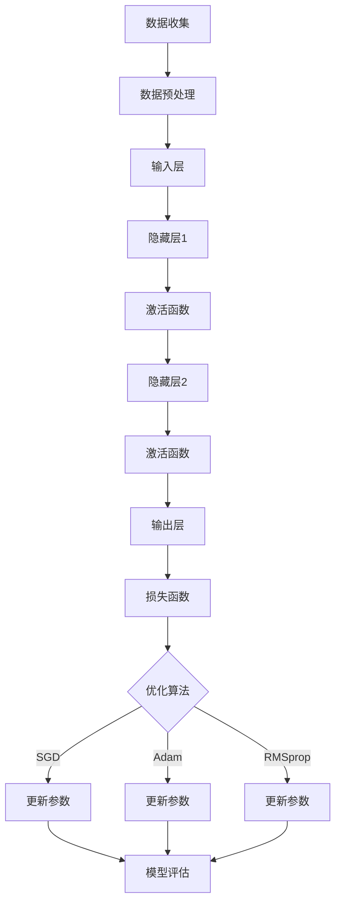
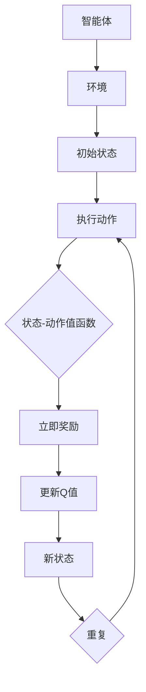
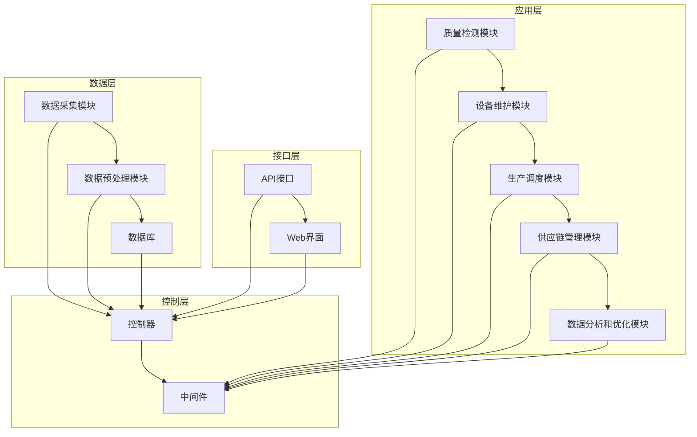
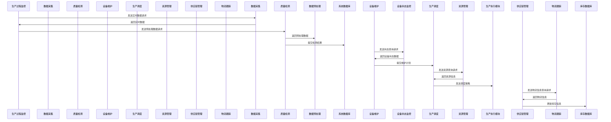

                 

## 概述

《AI在智能制造中的应用：从设计到生产》是一本专注于探讨人工智能（AI）在智能制造领域应用的专著。随着全球制造业的智能化转型，AI技术已经成为推动制造业创新和提升生产效率的重要力量。本书旨在为广大工程师、技术爱好者以及研究人员提供一个系统、全面的学习资源，帮助他们深入理解AI技术在制造业各个环节中的应用，从而实现制造业的智能化升级。

全书结构严谨，逻辑清晰，共分为七个部分，涵盖了从背景介绍、核心概念、算法原理讲解、数学模型与公式，到系统分析与架构设计方案、项目实战以及最佳实践等多个方面。以下是详细的目录结构：

### 第一部分：背景介绍
- **第1章**：问题背景与智能制造概述
  - 介绍智能制造的定义、意义及其发展历程。
  - 分析AI在智能制造中的应用前景和挑战。

- **第2章**：AI技术的基础知识
  - 简述人工智能的定义、发展历程及主要技术。
  - 详细介绍机器学习和深度学习的基本原理。

- **第3章**：AI与智能制造的联系
  - 探讨AI技术在制造过程中的具体应用。
  - 分析AI对智能制造的深远影响以及制造业面临的机遇和挑战。

### 第二部分：核心概念与联系
- **第4章**：AI核心技术原理
  - 深入讲解机器学习、深度学习和强化学习的基本原理。
  - 分析各核心技术的应用场景和优缺点。

- **第5章**：智能制造中的核心概念
  - 介绍制造流程中的关键环节、制造系统的结构和功能。
  - 探讨制造系统的优化方法和策略。

- **第6章**：核心概念属性特征对比
  - 比较AI技术和制造系统中各核心概念的属性特征。
  - 分析AI与制造系统融合的特征对比。

### 第三部分：算法原理讲解
- **第7章**：关键算法介绍
  - 系统介绍机器学习、深度学习和强化学习的关键算法。
  - 详细分析各算法的实现原理和应用实例。

- **第8章**：算法mermaid流程图展示
  - 使用mermaid绘制各关键算法的流程图。
  - 对每个算法的mermaid图进行详细讲解。

- **第9章**：算法Python源代码与详细讲解
  - 提供各关键算法的Python源代码。
  - 对源代码进行详细解释，帮助读者理解算法实现过程。

### 第四部分：数学模型与公式
- **第10章**：AI在智能制造中的数学模型
  - 介绍机器学习、深度学习和强化学习的数学模型。
  - 分析各模型的数学原理和应用。

- **第11章**：数学公式详解
  - 详细解释机器学习、深度学习和强化学习中的重要数学公式。
  - 通过具体实例说明公式的应用。

- **第12章**：数学模型应用实例
  - 通过实例展示数学模型在制造业中的应用效果。
  - 分析实例中的模型选择、参数调整和效果评估。

### 第五部分：系统分析与架构设计方案
- **第13章**：智能制造系统场景介绍
  - 介绍智能制造系统的典型应用场景。
  - 分析系统功能需求、性能指标及设计原则。

- **第14章**：系统功能设计
  - 设计制造系统的功能模块、领域模型和接口设计。
  - 详细描述各模块的功能实现和交互流程。

- **第15章**：系统架构设计
  - 提出系统架构设计的原则和思路。
  - 使用mermaid绘制系统架构图，详细说明各组件的功能和交互。

- **第16章**：系统接口设计与交互
  - 设计系统的接口规范和交互流程。
  - 使用mermaid绘制接口交互序列图，详细描述交互过程。

### 第六部分：项目实战
- **第17章**：项目介绍
  - 介绍项目背景、目标和实现方案。
  - 分析项目的挑战和解决方法。

- **第18章**：环境安装与核心实现
  - 演示项目环境的安装和配置过程。
  - 实现项目核心功能的代码示例。

- **第19章**：代码应用解读与分析
  - 分析项目核心代码的实现原理和应用技巧。
  - 提供代码优化和调试的建议。

- **第20章**：实际案例分析与讲解
  - 通过实际案例展示项目应用效果。
  - 详细剖析案例中的技术实现和业务逻辑。

- **第21章**：项目小结
  - 总结项目的经验教训，提出改进建议。
  - 展望项目未来的发展方向和应用前景。

### 第七部分：最佳实践、小结与拓展
- **第22章**：最佳实践与技巧
  - 总结制造业AI应用的最佳实践和技巧。
  - 提供实际操作中的经验和建议。

- **第23章**：全书小结
  - 概括全书的主要内容和学习要点。
  - 强调AI在智能制造中的重要性和发展趋势。

- **第24章**：注意事项与拓展阅读
  - 提醒读者注意的细节问题。
  - 推荐拓展阅读资源，帮助读者进一步学习。

通过以上七个部分的详细阐述，本书将带领读者全面了解AI在智能制造中的应用，从理论到实践，为制造业的智能化升级提供坚实的理论基础和实践指导。

## 关键词

关键词：人工智能、智能制造、机器学习、深度学习、强化学习、系统架构设计、项目实战、算法原理讲解、数学模型、制造流程、生产优化。

## 摘要

《AI在智能制造中的应用：从设计到生产》旨在全面介绍人工智能在制造业各个阶段的应用，包括设计、生产、检测和优化。本书首先概述了智能制造的定义、意义及其发展历程，并探讨了AI技术对制造业带来的深远影响。接着，深入讲解了AI的核心技术，如机器学习、深度学习和强化学习的原理和应用。书中不仅介绍了相关的数学模型和公式，还通过实例展示了这些模型在制造业中的应用效果。此外，本书还详细阐述了智能制造系统的设计原则、功能模块划分、系统架构设计以及接口交互流程，并通过实际项目实战案例，分析了AI技术在制造业中的具体应用和实现方法。全书最后总结了最佳实践和拓展阅读资源，为读者提供了全面的学习指导和未来发展方向。

## 第一部分：背景介绍

### 第1章：问题背景与智能制造概述

#### 1.1 智能制造的定义与意义

智能制造（Intelligent Manufacturing）是指利用现代信息技术、智能技术和自动化设备，实现制造过程的智能化、自动化和高效化。智能制造不仅仅是一个技术概念，更是制造业发展的战略方向，它代表着制造业的未来。智能制造的核心目标是提高生产效率、降低生产成本、提升产品质量和增强企业的竞争力。

智能制造的定义可以从以下几个方面来理解：

1. **集成技术**：智能制造将信息技术、智能技术、自动化技术、物联网技术等集成在一起，形成一个统一的系统。
2. **数据驱动**：智能制造依赖于大数据和物联网技术，通过收集和分析大量数据，实现生产过程的实时监控和优化。
3. **自主决策**：智能制造系统能够根据实时数据和环境信息，自主做出决策，实现自动化生产。
4. **协同制造**：智能制造强调人机协同，人与机器的交互更加自然，制造过程中的各个环节能够高效协同。

智能制造的意义主要体现在以下几个方面：

1. **提升生产效率**：通过自动化和智能化设备的应用，制造过程更加高效，生产周期显著缩短。
2. **降低生产成本**：自动化和智能化设备的普及，减少了人力成本和资源消耗，生产成本显著降低。
3. **提高产品质量**：智能制造系统能够实时监控生产过程，确保产品质量的稳定和提升。
4. **增强竞争力**：智能制造能够帮助企业快速响应市场需求，灵活调整生产计划，提高市场竞争力。

#### 1.2 智能制造的发展历程

智能制造的发展历程可以分为以下几个阶段：

1. **自动化阶段**：20世纪60年代，制造业开始引入自动化技术，如数控机床、机器人等，生产效率显著提升。
2. **信息化阶段**：20世纪80年代，随着计算机技术的发展，制造业开始实现信息化管理，生产数据开始被收集和存储。
3. **数字化阶段**：21世纪初，互联网和物联网技术的普及，制造业实现了全面数字化，生产过程的数据化和智能化水平进一步提高。
4. **智能化阶段**：近年来，人工智能技术的快速发展，使得智能制造进入了一个新的阶段，智能化设备能够自主学习和优化生产过程。

#### 1.3 AI在智能制造中的应用前景

随着人工智能技术的不断进步，AI在智能制造中的应用前景十分广阔。以下是AI在智能制造中的一些主要应用：

1. **生产过程优化**：通过AI算法优化生产流程，提高生产效率。例如，利用机器学习算法预测生产需求，优化生产计划和库存管理。
2. **质量管理**：利用AI技术进行生产过程的实时监控和数据分析，及时发现质量异常，提高产品质量。
3. **设备维护**：通过预测性维护技术，利用AI算法预测设备故障，提前进行维护，减少设备停机时间和维修成本。
4. **供应链管理**：利用AI技术进行供应链的实时监控和优化，提高供应链的透明度和效率。
5. **人机协同**：通过人工智能技术实现人与机器的协同工作，提高生产效率和工作质量。

总之，AI在智能制造中的应用不仅能够提高生产效率和产品质量，还能够降低生产成本，提升企业的竞争力。随着AI技术的不断进步，智能制造将在未来发挥更加重要的作用，推动制造业的转型升级。

### 第2章：AI技术的基础知识

#### 2.1 人工智能的定义与发展

人工智能（Artificial Intelligence，简称AI）是指通过计算机模拟人类智能，实现智能行为和智能决策的技术。人工智能的目标是使计算机能够像人类一样思考、学习、解决问题，并在特定领域内实现智能化的任务。

人工智能的发展可以分为以下几个阶段：

1. **早期探索阶段（20世纪50年代至70年代）**：在这个阶段，人工智能主要聚焦于理论研究和算法开发。1950年，图灵提出图灵测试，作为衡量机器智能的标准。1956年，达特茅斯会议上，人工智能首次被正式提出。此后，一些早期的人工智能系统如ELIZA（一个模拟心理治疗的程序）和 SHRDLU（一个基于自然语言处理的程序）被开发出来。

2. **第一次繁荣时期（20世纪80年代至90年代）**：在这个阶段，专家系统成为人工智能研究的热点。专家系统是一种模拟人类专家解决领域问题的计算机程序，能够通过知识和推理来解决问题。例如，MYCIN系统是一个用于诊断和治疗的专家系统。

3. **低谷时期（20世纪90年代至21世纪初）**：由于实际应用中的诸多挑战和技术的局限性，人工智能研究进入了一个相对低迷的时期。计算资源有限，算法复杂度较高，使得人工智能系统在实际应用中的效果并不理想。

4. **第二次繁荣时期（21世纪初至今）**：随着计算能力的提升和大数据、深度学习等技术的突破，人工智能迎来了新的发展机遇。深度学习作为一种重要的机器学习技术，在图像识别、语音识别和自然语言处理等领域取得了显著的成果。同时，人工智能的应用场景也从理论研究扩展到了实际生产、生活等多个领域。

#### 2.2 机器学习的基本原理

机器学习（Machine Learning，简称ML）是人工智能的一个重要分支，主要研究如何让计算机通过数据学习，实现自主决策和智能行为。机器学习的基本原理可以概括为以下几个步骤：

1. **数据收集**：收集大量的训练数据，这些数据通常包括输入特征和对应的输出结果。
2. **特征提取**：对输入数据进行特征提取和预处理，将原始数据转换为计算机可以处理的格式。
3. **模型训练**：选择合适的机器学习算法，利用训练数据对模型进行训练，使模型能够学习数据中的特征和规律。
4. **模型评估**：通过测试数据评估模型的性能，调整模型参数，优化模型效果。
5. **模型应用**：将训练好的模型应用于实际问题，实现智能决策和预测。

常见的机器学习算法包括：

1. **监督学习（Supervised Learning）**：监督学习是一种在有监督的情况下训练模型的方法。通过已标记的训练数据，模型学习特征和标签之间的映射关系。常见的监督学习算法有线性回归、逻辑回归、支持向量机（SVM）和决策树等。
2. **无监督学习（Unsupervised Learning）**：无监督学习是在没有标记数据的情况下训练模型的方法。模型通过分析数据本身的特征，自动发现数据中的模式和结构。常见的无监督学习算法有聚类算法（如K-means、层次聚类）、降维算法（如PCA）和关联规则学习等。
3. **强化学习（Reinforcement Learning）**：强化学习是一种通过与环境互动，学习最优策略的方法。模型通过不断尝试和反馈，逐步优化行为策略，以实现目标最大化。常见的强化学习算法有Q-学习、SARSA和深度确定性策略梯度（DDPG）等。

#### 2.3 深度学习与神经网络

深度学习（Deep Learning，简称DL）是机器学习的一种重要分支，其核心思想是通过构建多层神经网络，对数据进行层层抽象和特征提取，从而实现复杂的模式识别和预测任务。深度学习在图像识别、语音识别和自然语言处理等领域取得了显著的成果。

深度学习的基本组成包括：

1. **神经网络（Neural Network）**：神经网络是一种模拟人脑神经元连接方式的计算模型。每个神经元接收多个输入信号，通过权重进行加权求和，最后通过激活函数产生输出。
2. **深度神经网络（Deep Neural Network）**：深度神经网络是指具有多个隐藏层的神经网络。通过增加网络深度，可以提高模型的复杂度和表达能力。
3. **卷积神经网络（Convolutional Neural Network，CNN）**：卷积神经网络是一种专门用于图像识别和处理的神经网络。通过卷积操作和池化操作，可以实现图像的特征提取和分类。
4. **循环神经网络（Recurrent Neural Network，RNN）**：循环神经网络是一种用于处理序列数据的神经网络。通过在时间步之间建立循环连接，RNN可以捕捉序列中的长期依赖关系。
5. **生成对抗网络（Generative Adversarial Network，GAN）**：生成对抗网络由生成器和判别器两个网络组成，通过对抗训练生成逼真的数据。

深度学习的应用领域包括：

1. **计算机视觉**：深度学习在图像识别、目标检测和图像生成等领域具有广泛应用。例如，通过卷积神经网络可以实现图像分类、人脸识别和物体检测等任务。
2. **自然语言处理**：深度学习在自然语言处理领域也取得了显著成果，如文本分类、机器翻译和情感分析等。
3. **语音识别**：通过循环神经网络和卷积神经网络，可以实现高精度的语音识别和语音合成。

总之，人工智能技术的发展为智能制造带来了新的机遇和挑战。机器学习和深度学习作为人工智能的核心技术，在智能制造中的应用将不断拓展和深化，为制造业的智能化升级提供强大的技术支持。

### 第3章：AI与智能制造的联系

#### 3.1 AI技术在制造过程中的应用

人工智能（AI）技术在制造过程中的应用正在逐步深化，其通过数据分析和智能决策，显著提升了制造业的生产效率、产品质量和资源利用率。以下是AI技术在制造过程中的几个主要应用领域：

1. **生产计划与调度**：AI技术能够通过大数据分析和预测算法，优化生产计划和调度策略。例如，利用机器学习算法预测市场需求，动态调整生产计划，从而提高生产效率和库存利用率。

2. **设备维护与预测性维护**：通过物联网（IoT）技术和AI算法，实时监控设备的运行状态，预测设备故障并进行提前维护。这种预测性维护方式可以显著降低设备故障率，减少停机时间和维护成本。

3. **质量控制**：AI技术能够对生产过程进行实时监控和数据分析，发现质量异常，并提出优化建议。例如，利用深度学习算法进行图像识别，检测产品质量问题，确保产品的一致性和可靠性。

4. **供应链管理**：AI技术通过对供应链数据的分析，优化供应链的物流和库存管理。例如，利用强化学习算法优化运输路径，降低运输成本，提高物流效率。

5. **人机协同**：AI技术能够实现人与机器的智能协作，提高生产效率和安全性。例如，通过机器人与人类的协同工作，实现自动化装配和搬运任务，降低人力成本和工伤风险。

#### 3.2 AI对智能制造的影响

AI对智能制造的影响是深远且全面的，不仅改变了制造业的生产方式和运营模式，还推动了制造业的智能化升级。以下是AI对智能制造的几个主要影响：

1. **提升生产效率**：AI技术通过自动化和智能化设备的应用，显著提高了生产效率。例如，机器人可以替代人工进行高精度、重复性的生产任务，减少人为错误和劳动强度。

2. **降低生产成本**：AI技术通过优化生产流程和资源管理，降低了生产成本。例如，通过预测性维护减少设备停机时间，通过智能物流降低运输成本。

3. **提高产品质量**：AI技术通过对生产过程的实时监控和数据分析，提高了产品质量的稳定性和一致性。例如，利用图像识别技术检测产品质量问题，确保产品符合标准。

4. **增强创新能力**：AI技术通过模拟和优化制造过程，激发了制造业的创新能力。例如，通过数字孪生技术，可以模拟制造过程并进行优化，提高新产品的开发和上市速度。

5. **优化供应链管理**：AI技术通过对供应链数据的分析和预测，优化了供应链的物流和库存管理，提高了供应链的透明度和效率。

#### 3.3 智能制造中的挑战与机遇

虽然AI技术在智能制造中带来了诸多机遇，但也面临着一些挑战。以下是智能制造中的主要挑战和机遇：

1. **挑战**：
   - **数据隐私和安全**：随着智能制造系统的广泛应用，数据的安全和隐私保护变得尤为重要。如何确保数据在传输和处理过程中的安全，是一个亟待解决的问题。
   - **技术复杂性**：AI技术的实现和应用涉及到多个领域的技术，包括计算机科学、数学和工程学等，技术复杂性较高，对技术人员的要求较高。
   - **人才短缺**：随着智能制造的发展，对AI技术人才的需求不断增加，但人才供给不足，成为智能制造推广的一大瓶颈。

2. **机遇**：
   - **市场潜力**：智能制造市场潜力巨大，随着全球制造业的智能化转型，对AI技术的需求将持续增长。
   - **创新驱动**：智能制造推动了制造业的数字化转型，为技术创新提供了广阔的空间，有助于激发企业的创新能力。
   - **国际合作**：智能制造领域的国际合作不断深化，各国共同探索AI技术在智能制造中的应用，为全球制造业的发展提供了新的机遇。

总之，AI技术在智能制造中的应用前景广阔，但也面临一定的挑战。通过技术创新、人才培养和国际合作，有望克服这些挑战，实现智能制造的全面升级。

### 第二部分：核心概念与联系

#### 第4章：AI核心技术原理

AI技术作为智能制造的重要支撑，其核心技术的原理和实现机制是理解智能制造的关键。在本章中，我们将深入探讨机器学习、深度学习和强化学习三种核心技术的基本原理及其在智能制造中的应用。

#### 4.1 机器学习的核心概念

机器学习（Machine Learning，ML）是一种让计算机通过数据和经验自动改进性能的方法。它通过构建模型来捕捉数据中的规律和模式，从而实现预测和决策。机器学习可以分为监督学习、无监督学习和强化学习三种类型。

1. **监督学习（Supervised Learning）**：
   - **定义**：监督学习是在已知输出标签的情况下，通过训练数据来学习模型。其目的是找到一个函数，能够将输入映射到输出。
   - **实现原理**：监督学习通常使用损失函数来衡量预测值与真实值之间的差距，通过梯度下降等优化算法来调整模型参数，使损失函数最小化。
   - **应用实例**：在智能制造中，监督学习可以用于故障检测、生产质量预测和设备状态监测等。

2. **无监督学习（Unsupervised Learning）**：
   - **定义**：无监督学习是在没有输出标签的情况下，通过训练数据来学习模型。其目的是发现数据中的结构、模式或分布。
   - **实现原理**：无监督学习通常使用聚类算法（如K-means、层次聚类）和降维算法（如PCA）来分析数据。
   - **应用实例**：在智能制造中，无监督学习可以用于生产数据聚类分析、异常检测和生产流程优化。

3. **强化学习（Reinforcement Learning）**：
   - **定义**：强化学习是一种通过与环境互动，学习最优策略的方法。其目的是通过不断尝试和反馈，优化决策过程。
   - **实现原理**：强化学习使用奖励机制来评价决策的好坏，通过策略迭代来优化行为。常见的算法有Q-学习、SARSA和深度确定性策略梯度（DDPG）。
   - **应用实例**：在智能制造中，强化学习可以用于生产调度、设备维护策略优化和供应链管理。

#### 4.2 深度学习的核心技术

深度学习（Deep Learning，DL）是机器学习的一种重要分支，通过构建多层神经网络，对数据进行层层抽象和特征提取，实现复杂的模式识别和预测任务。深度学习的核心技术包括神经网络架构、激活函数、优化算法和训练策略。

1. **神经网络架构**：
   - **定义**：神经网络是由多个神经元组成的计算模型，每个神经元接收多个输入，通过权重进行加权求和，再通过激活函数产生输出。
   - **实现原理**：深度神经网络通过增加网络层数，实现对输入数据的深层特征提取和抽象。常见的神经网络架构有卷积神经网络（CNN）、循环神经网络（RNN）和生成对抗网络（GAN）。
   - **应用实例**：在智能制造中，深度学习可以用于图像识别、语音识别和生产质量预测。

2. **激活函数**：
   - **定义**：激活函数是神经网络中用于确定神经元输出是否为激活状态的关键函数。
   - **实现原理**：常见的激活函数包括ReLU（Rectified Linear Unit）、Sigmoid和Tanh。这些函数在神经网络中用于引入非线性特性，提高模型的拟合能力。
   - **应用实例**：在智能制造中，激活函数可以用于特征提取和决策边界定义。

3. **优化算法**：
   - **定义**：优化算法用于调整神经网络中的参数，使模型在训练数据上表现更好。
   - **实现原理**：常见的优化算法有梯度下降（Gradient Descent）、随机梯度下降（Stochastic Gradient Descent，SGD）和Adam等。这些算法通过不断调整参数，使损失函数最小化。
   - **应用实例**：在智能制造中，优化算法可以用于模型训练和参数调整。

4. **训练策略**：
   - **定义**：训练策略是用于改善神经网络训练过程的一系列方法，包括数据增强、正则化和dropout等。
   - **实现原理**：数据增强通过生成虚拟训练样本来扩充训练数据集，提高模型的泛化能力；正则化通过在损失函数中引入惩罚项，防止过拟合；dropout通过在训练过程中随机丢弃部分神经元，提高模型的鲁棒性。
   - **应用实例**：在智能制造中，训练策略可以用于提高模型在未知数据上的表现，防止过拟合。

#### 4.3 强化学习的基本原理

强化学习（Reinforcement Learning，RL）是一种通过与环境互动，学习最优策略的方法。与监督学习和无监督学习不同，强化学习不依赖于预标记的数据集，而是通过不断尝试和反馈，逐渐优化策略。

1. **定义**：
   - **强化学习**：强化学习是一种交互式学习过程，智能体（Agent）通过与环境（Environment）的交互，接收奖励（Reward）和反馈，逐步学习最优策略（Policy）。
   - **状态（State）、动作（Action）、奖励（Reward）和策略（Policy）**：状态是智能体在环境中的位置或情况；动作是智能体可以采取的行动；奖励是环境对智能体动作的反馈；策略是智能体在给定状态下的最优动作选择。

2. **实现原理**：
   - **Q学习（Q-Learning）**：Q学习是一种基于值函数的强化学习算法，通过学习状态-动作值函数（Q值），来预测在给定状态下采取某个动作的长期奖励。
   - **策略迭代（Policy Iteration）**：策略迭代是一种通过迭代优化策略的方法，每次迭代都评估当前策略，并更新为最优策略。
   - **深度确定性策略梯度（DDPG，Deep Deterministic Policy Gradient）**：DDPG是一种基于深度神经网络的强化学习算法，通过学习状态-动作值函数和策略网络，优化决策过程。

3. **应用实例**：
   - **自动装配**：通过强化学习算法，机器人可以学习如何自动执行复杂的装配任务，提高装配效率和精度。
   - **生产调度**：通过强化学习算法，优化生产调度的策略，提高生产效率和生产资源的利用率。

总之，机器学习、深度学习和强化学习是AI技术的核心组成部分，它们在智能制造中的应用不仅提升了生产效率和质量，还为制造业的智能化转型提供了新的解决方案。理解这些核心技术的原理和应用，是掌握智能制造的关键。

### 第5章：智能制造中的核心概念

#### 5.1 制造流程中的关键环节

智能制造的过程可以看作是由多个关键环节组成的复杂系统，这些环节相互关联，共同作用于产品的设计、生产、检测和优化。以下是制造流程中的关键环节及其作用：

1. **设计阶段**：
   - **产品设计与优化**：在这一阶段，工程师使用CAD（计算机辅助设计）工具进行产品设计，并通过模拟和仿真优化产品性能。
   - **工艺规划**：确定产品的加工工艺，包括加工顺序、加工参数和工具选择等，为生产阶段做准备。

2. **生产阶段**：
   - **原材料准备**：根据生产计划，对原材料进行采购、检验和储存。
   - **加工制造**：利用自动化设备和计算机控制系统，按照工艺规划进行加工制造，包括铸造、切削、焊接、组装等。
   - **质量控制**：在生产过程中进行质量检测，确保产品符合设计要求。

3. **检测阶段**：
   - **在线检测**：利用传感器和监测设备，实时监控生产过程中的参数变化，发现异常并采取相应措施。
   - **离线检测**：对已完成的产品进行最终检测，包括尺寸测量、性能测试和功能验证。

4. **优化阶段**：
   - **数据分析**：收集生产过程中的各种数据，进行统计分析，发现生产中的问题和瓶颈。
   - **过程优化**：基于数据分析结果，对生产过程进行调整和优化，提高生产效率和质量。

#### 5.2 制造系统的结构与功能

制造系统是智能制造的核心组成部分，其结构通常包括硬件层、软件层和控制层。每个层次都有特定的功能和作用。

1. **硬件层**：
   - **设备与传感器**：包括各种加工设备、机器人、传感器等，负责实际的生产操作和参数监测。
   - **网络基础设施**：包括工业以太网、无线网络等，用于连接设备和控制系统。

2. **软件层**：
   - **操作系统**：为硬件层提供基本的运行环境，如工业PC、PLC（可编程逻辑控制器）等。
   - **应用软件**：包括CAD、CAM（计算机辅助制造）、MES（制造执行系统）等，用于管理和控制生产过程。

3. **控制层**：
   - **控制器**：负责执行软件层的指令，控制硬件层的设备运行，如PLC、机器人控制器等。
   - **数据采集与处理**：实时采集生产过程中的数据，进行处理和分析，为上层软件提供决策支持。

#### 5.3 制造系统的优化方法

制造系统的优化目标是提高生产效率、降低生产成本、提升产品质量和增强系统的灵活性。以下是几种常见的制造系统优化方法：

1. **自动化优化**：
   - **过程自动化**：通过自动化设备减少人工干预，提高生产效率和质量。
   - **设备自动化**：利用机器人、自动化生产线等，实现生产过程的自动化。

2. **数据驱动优化**：
   - **实时监控**：利用传感器和监测系统，对生产过程中的参数进行实时监控，及时发现问题。
   - **数据分析**：对收集到的生产数据进行分析，发现生产瓶颈和优化空间。

3. **智能优化**：
   - **机器学习**：利用机器学习算法，对生产数据进行预测和优化，提高生产效率和产品质量。
   - **深度学习**：通过深度学习算法，对复杂的生产过程进行建模和优化。

4. **精益生产**：
   - **精益思想**：通过消除浪费、优化流程，提高生产效率和质量。
   - **5S管理**：通过整理、整顿、清扫、清洁和素养，提高生产现场的管理水平。

5. **人机协同**：
   - **人机协作**：通过人机协作系统，实现人与机器的协同工作，提高生产效率和安全性。

总之，智能制造中的核心概念涵盖了设计、生产、检测和优化等多个环节，每个环节都有特定的功能和优化方法。理解这些核心概念，是掌握智能制造的关键。

### 第6章：核心概念属性特征对比

#### 6.1 AI技术属性特征对比

在智能制造中，AI技术的应用涵盖了机器学习、深度学习和强化学习等不同领域。为了更好地理解这些技术的特点和适用场景，下面进行属性特征对比。

| 属性特征 | 机器学习 | 深度学习 | 强化学习 |
| :--- | :--- | :--- | :--- |
| **定义** | 数据驱动的自动化学习过程，通过训练数据学习特征和模式 | 基于神经网络的深度学习模型，通过多层网络提取特征和表示 | 基于反馈的智能决策过程，通过奖励机制学习最优策略 |
| **核心模型** | 线性回归、决策树、支持向量机等 | 卷积神经网络（CNN）、循环神经网络（RNN）、生成对抗网络（GAN）等 | Q-学习、策略迭代、深度确定性策略梯度（DDPG）等 |
| **特征提取** | 简单的特征工程，依赖人类经验提取特征 | 自主的特征提取，通过多层神经网络自动学习特征 | 根据环境和反馈，动态调整行为策略，不依赖于特征工程 |
| **适用场景** | 结构化数据、预测和分类任务 | 非结构化数据、图像和语音识别、自然语言处理 | 互动式环境、决策优化、路径规划和自动化控制 |
| **优点** | 算法成熟、应用广泛、可解释性强 | 自动化特征提取、强大的表达能力和泛化能力 | 自主学习和优化、适应性强、能够处理复杂的动态环境 |
| **缺点** | 特征工程依赖人工、对数据质量要求高、泛化能力有限 | 计算资源需求大、模型复杂、训练时间长、对数据依赖强 | 需要大量的样本和反馈、训练难度大、适用场景受限 |

通过对比可以看出，机器学习适用于有标记的数据集，通过特征工程进行结构化数据的分析和预测；深度学习通过多层神经网络自动提取特征，适用于非结构化数据的处理，如图像和语音识别；强化学习通过与环境互动学习最优策略，适用于需要自主决策和优化的动态环境。

#### 6.2 制造系统属性特征对比

在智能制造中，制造系统的属性特征也分为多个方面，包括硬件、软件和控制等层次。以下是对这些层次属性特征的对比。

| 属性特征 | 硬件层 | 软件层 | 控制层 |
| :--- | :--- | :--- | :--- |
| **定义** | 包括各种制造设备和传感器，负责实际的生产操作和参数监测 | 包括操作系统和应用软件，用于管理和控制生产过程 | 包括控制器和数据处理系统，负责执行软件层的指令和数据分析 |
| **功能** | 执行具体的加工任务、参数监测和控制 | 数据存储、处理和分析、生产计划和管理 | 指令执行、状态监控、优化控制和决策支持 |
| **关键技术** | 设备自动化、传感器技术、物联网（IoT） | CAD、CAM、MES、ERP等软件系统 | PLC、机器人控制器、实时操作系统等 |
| **优点** | 稳定的物理操作、高精度、高效率 | 数据驱动的决策支持、高效的生产管理、集成化系统 | 灵活性高、实时性强、自动化程度高 |
| **缺点** | 更新和维护成本高、易受物理环境影响 | 对硬件依赖强、软件集成复杂、数据安全风险 | 系统复杂度高、对环境要求高、响应时间有限 |
| **适用场景** | 高精度、重复性强的制造任务 | 大规模生产、复杂工艺流程、智能化生产管理 | 自动化生产线、复杂控制任务、生产优化 |

通过对比可以看出，硬件层主要负责具体的物理操作和参数监测，软件层提供数据驱动的决策支持和管理功能，控制层实现指令执行和状态监控。每个层次都有其独特的优势和适用场景，共同构成了智能制造系统的完整架构。

#### 6.3 AI与制造系统融合的特征对比

AI技术与制造系统的融合，旨在通过智能化技术提升制造系统的性能和效率。以下是对AI技术与制造系统融合后的特征进行对比。

| 属性特征 | AI技术独立应用 | AI技术与制造系统融合 |
| :--- | :--- | :--- |
| **定义** | 独立的AI技术，如机器学习、深度学习和强化学习等 | 与制造系统深度融合，实现智能化的制造过程和系统优化 |
| **功能** | 数据分析、预测和决策支持 | 提高生产效率、降低成本、提升产品质量、增强系统灵活性 |
| **关键技术** | 机器学习算法、深度学习模型、强化学习策略 | 数据采集与处理、实时监控、自动化控制、优化算法 |
| **优点** | 强大的数据处理和分析能力、自适应性和自学习能力 | 系统集成度高、协同效应强、生产过程优化明显 |
| **缺点** | 对数据和硬件依赖强、模型训练和优化复杂、安全性问题 | 需要大量数据支持、系统集成难度高、技术实施成本高 |
| **适用场景** | 数据驱动的预测分析和决策支持、特定任务的自动化处理 | 大规模制造过程优化、生产线的智能化升级、复杂系统的协同控制 |

通过对比可以看出，AI技术与制造系统融合后，不仅在功能上实现了生产过程的智能化和优化，还在系统集成度和协同效应上具有显著优势。但同时，这也带来了一些挑战，如对数据质量的要求更高、系统集成复杂度和实施成本的增加。

综上所述，AI技术在智能制造中的应用，不仅改变了传统制造系统的功能和属性特征，还推动了制造系统的全面智能化升级。理解AI技术与制造系统融合的特征对比，是掌握智能制造关键的一步。

### 第三部分：算法原理讲解

#### 第7章：关键算法介绍

在智能制造中，算法的应用是提高生产效率和质量的核心。本节将介绍智能制造中常用的关键算法，包括机器学习算法、深度学习算法和强化学习算法。

#### 7.1 机器学习算法介绍

机器学习算法是智能制造的基础，它通过学习历史数据来预测和决策。以下是一些常用的机器学习算法：

1. **线性回归（Linear Regression）**：
   - **定义**：线性回归是一种通过最小化误差平方和来拟合数据点的线性模型。
   - **公式**：$$y = \beta_0 + \beta_1x$$
   - **适用场景**：预测连续值，如产量预测、成本预测。

2. **逻辑回归（Logistic Regression）**：
   - **定义**：逻辑回归是一种通过逻辑函数将线性组合映射到概率的回归模型。
   - **公式**：$$P(y=1) = \frac{1}{1 + e^{-(\beta_0 + \beta_1x)}}$$
   - **适用场景**：分类问题，如产品质量分类、故障诊断。

3. **支持向量机（Support Vector Machine，SVM）**：
   - **定义**：SVM通过找到一个最佳的超平面来分隔数据点。
   - **公式**：$$w^T x - b = 0$$
   - **适用场景**：高维空间分类，如图像分类、文本分类。

4. **决策树（Decision Tree）**：
   - **定义**：决策树通过一系列决策规则对数据进行分割。
   - **公式**：$$f(x) = \sum_{i=1}^{n} \alpha_i G(x, \theta_i)$$
   - **适用场景**：分类和回归问题，如医疗诊断、信用评分。

5. **随机森林（Random Forest）**：
   - **定义**：随机森林是通过构建多个决策树并进行投票来分类或回归。
   - **公式**：$$f(x) = \sum_{i=1}^{N} \hat{f_i}(x)$$
   - **适用场景**：高维度数据的分类和回归，如金融风险预测、市场营销。

6. **K最近邻（K-Nearest Neighbors，KNN）**：
   - **定义**：KNN通过计算测试样本与训练样本的距离，选择最近的K个样本的多数类别作为预测结果。
   - **公式**：$$\hat{y} = \text{mode}(y_1, y_2, ..., y_K)$$
   - **适用场景**：简单分类问题，如手写数字识别、文本分类。

7. **K-means聚类**：
   - **定义**：K-means通过最小化距离平方和来将数据划分为K个聚类。
   - **公式**：$$\text{argmin}_{\mu_1, \mu_2, ..., \mu_K} \sum_{i=1}^{K} \sum_{x \in S_i} ||x - \mu_i||^2$$
   - **适用场景**：数据聚类，如市场细分、生产流程优化。

#### 7.2 深度学习算法介绍

深度学习算法通过多层神经网络实现复杂的特征提取和模式识别。以下是一些常用的深度学习算法：

1. **卷积神经网络（Convolutional Neural Network，CNN）**：
   - **定义**：CNN通过卷积操作提取图像特征，适用于图像处理。
   - **公式**：$$h_{\theta}(x) = \sigma(\theta^T \cdot x)$$
   - **适用场景**：图像分类、目标检测、图像生成。

2. **循环神经网络（Recurrent Neural Network，RNN）**：
   - **定义**：RNN通过在时间步之间建立循环连接来处理序列数据。
   - **公式**：$$h_t = \sigma(W_h \cdot [h_{t-1}, x_t] + b_h)$$
   - **适用场景**：语音识别、自然语言处理、时间序列预测。

3. **长短时记忆网络（Long Short-Term Memory，LSTM）**：
   - **定义**：LSTM通过门控机制来解决RNN的梯度消失问题，适用于长序列数据。
   - **公式**：$$i_t = \sigma(W_i \cdot [h_{t-1}, x_t] + b_i)$$
   - **适用场景**：语音识别、文本生成、时间序列预测。

4. **生成对抗网络（Generative Adversarial Network，GAN）**：
   - **定义**：GAN由生成器和判别器两个网络组成，通过对抗训练生成逼真的数据。
   - **公式**：$$G(z) = \text{Generator}(z)$$，$$D(x) = \text{Discriminator}(x)$$
   - **适用场景**：图像生成、图像修复、数据增强。

5. **自编码器（Autoencoder）**：
   - **定义**：自编码器通过编码器和解码器将数据映射到低维空间，再还原回高维空间。
   - **公式**：$$x' = \text{Decoder}(\text{Encoder}(x))$$
   - **适用场景**：数据压缩、特征提取、异常检测。

#### 7.3 强化学习算法介绍

强化学习算法通过与环境互动来学习最优策略，适用于需要决策优化的场景。以下是一些常用的强化学习算法：

1. **Q学习（Q-Learning）**：
   - **定义**：Q学习通过更新Q值来学习最优策略。
   - **公式**：$$Q(s, a) = \frac{1}{N}\sum_{t=0}^{T} \gamma^t r_t + \gamma \max_a Q(s', a)$$
   - **适用场景**：路径规划、机器人控制、游戏。

2. **策略梯度（Policy Gradient）**：
   - **定义**：策略梯度通过优化策略参数来学习最优策略。
   - **公式**：$$\nabla_{\theta} J(\theta) = \nabla_{\theta} \sum_{t=0}^{T} \rho(s_t, a_t, \theta)$$
   - **适用场景**：自适应控制、推荐系统、强化学习。

3. **深度确定性策略梯度（Deep Deterministic Policy Gradient，DDPG）**：
   - **定义**：DDPG通过深度神经网络来估计状态-动作值函数，实现高维空间中的强化学习。
   - **公式**：$$\theta^* = \arg\min_{\theta} \mathbb{E}_{s \sim \mu_s, a \sim \pi_{\theta}(s)} [\nabla_\theta J(\theta)]$$
   - **适用场景**：连续动作空间、机器人控制、无人驾驶。

4. **模型预测控制（Model Predictive Control，MPC）**：
   - **定义**：MPC通过建立系统模型，预测未来行为并优化控制策略。
   - **公式**：$$u(t) = \arg\min_{u} J(u) + \sum_{k=1}^{N} \phi(s(t+k), u(t+k))$$
   - **适用场景**：化工过程控制、航空航天、自动驾驶。

这些关键算法在智能制造中有着广泛的应用。通过深入理解这些算法的基本原理和实现方法，可以更好地利用AI技术提升智能制造的效率和质量。

### 第8章：算法mermaid流程图展示

为了更直观地理解机器学习、深度学习和强化学习算法的流程，我们将使用mermaid工具绘制这些算法的流程图。以下是每个算法的mermaid图及其说明：

#### 8.1 机器学习算法mermaid流程图



**说明**：
- **数据收集**：从数据源收集训练数据。
- **数据预处理**：对数据进行清洗、归一化等预处理。
- **特征提取**：根据需求选择特征提取方法。
- **选择算法**：根据问题和数据特点选择合适的算法。
- **训练模型**：对选择好的算法进行训练。
- **模型评估**：通过测试集评估模型性能。
- **聚类结果**：对于聚类算法，展示聚类结果。

#### 8.2 深度学习算法mermaid流程图



**说明**：
- **数据收集**：从数据源收集训练数据。
- **数据预处理**：对数据进行清洗、归一化等预处理。
- **输入层**：构建输入层。
- **隐藏层**：通过隐藏层对数据特征进行提取和变换。
- **激活函数**：在隐藏层和输出层使用激活函数引入非线性。
- **输出层**：输出预测结果。
- **损失函数**：计算预测结果与真实值的误差。
- **优化算法**：选择合适的优化算法更新模型参数。
- **模型评估**：通过测试集评估模型性能。

#### 8.3 强化学习算法mermaid流程图



**说明**：
- **智能体**：执行决策的主体。
- **环境**：智能体所处的环境。
- **初始状态**：智能体开始的状态。
- **执行动作**：智能体根据当前状态选择动作。
- **状态-动作值函数**：评估当前状态和动作的值。
- **立即奖励**：执行动作后获得的即时奖励。
- **更新Q值**：根据奖励和新的状态更新Q值。
- **新状态**：执行动作后的新状态。
- **重复**：智能体持续与环境互动，不断更新Q值。

通过mermaid流程图，我们可以更直观地理解这些算法的基本流程和步骤，为后续的深入讲解和实际应用提供清晰的参考。

### 第9章：算法Python源代码与详细讲解

在本节中，我们将使用Python代码实现一些关键算法，并详细讲解其工作原理。这些算法包括机器学习的线性回归、深度学习的卷积神经网络（CNN）以及强化学习的Q-learning。以下是对这些算法的Python源代码和详细解释。

#### 9.1 机器学习算法：线性回归

```python
import numpy as np
from sklearn.linear_model import LinearRegression
from sklearn.model_selection import train_test_split
from sklearn.metrics import mean_squared_error

# 数据准备
X = np.array([[1], [2], [3], [4], [5]])
y = np.array([1, 2, 2.5, 4, 5])

# 划分训练集和测试集
X_train, X_test, y_train, y_test = train_test_split(X, y, test_size=0.2, random_state=0)

# 实例化线性回归模型
model = LinearRegression()

# 模型训练
model.fit(X_train, y_train)

# 模型预测
y_pred = model.predict(X_test)

# 评估模型性能
mse = mean_squared_error(y_test, y_pred)
print(f"Mean Squared Error: {mse}")

# 输出模型参数
print(f"Coefficients: {model.coef_}")
print(f"Intercept: {model.intercept_}")
```

**详细讲解**：
1. **数据准备**：我们首先创建了一个简单的线性回归数据集，其中输入特征X和输出目标y。
2. **划分训练集和测试集**：使用scikit-learn库的`train_test_split`函数将数据集分为训练集和测试集，以评估模型的泛化能力。
3. **实例化模型**：使用`LinearRegression`类创建一个线性回归模型实例。
4. **模型训练**：调用`fit`方法进行模型训练，模型会自动计算最佳拟合直线。
5. **模型预测**：使用`predict`方法对测试集进行预测。
6. **模型评估**：使用均方误差（MSE）评估模型性能。
7. **输出模型参数**：输出模型的斜率和截距。

#### 9.2 深度学习算法：卷积神经网络（CNN）

```python
import tensorflow as tf
from tensorflow.keras.models import Sequential
from tensorflow.keras.layers import Conv2D, MaxPooling2D, Flatten, Dense

# 数据准备
# 这里假设我们已经有加载好的图像数据X和标签y
# X是（样本数，宽度，高度，通道数）
# y是（样本数，类别数）

# 构建CNN模型
model = Sequential([
    Conv2D(32, (3, 3), activation='relu', input_shape=(64, 64, 3)),
    MaxPooling2D((2, 2)),
    Conv2D(64, (3, 3), activation='relu'),
    MaxPooling2D((2, 2)),
    Flatten(),
    Dense(64, activation='relu'),
    Dense(10, activation='softmax')
])

# 编译模型
model.compile(optimizer='adam',
              loss='categorical_crossentropy',
              metrics=['accuracy'])

# 模型训练
model.fit(X, y, epochs=10, batch_size=32, validation_split=0.2)
```

**详细讲解**：
1. **数据准备**：这里假设我们已经准备好了图像数据集和相应的标签。
2. **构建模型**：使用`Sequential`模型堆叠多个层，包括卷积层（`Conv2D`）、池化层（`MaxPooling2D`）、全连接层（`Dense`）。
3. **编译模型**：设置优化器、损失函数和评价指标。
4. **模型训练**：使用`fit`方法训练模型，通过调整参数和优化算法来提高模型性能。

#### 9.3 强化学习算法：Q-learning

```python
import numpy as np

# 初始化Q表
Q = np.zeros([5, 5])

# 设置参数
alpha = 0.1  # 学习率
gamma = 0.6  # 折扣因子
eps = 0.1    # 探索率

# 环境模拟
def get_reward(state, action):
    if state == action:
        return 1
    else:
        return -1

# Q-learning算法
for episode in range(1000):
    state = np.random.randint(0, 5)
    done = False
    
    while not done:
        # 探索-利用策略
        if np.random.rand() < eps:
            action = np.random.randint(0, 5)
        else:
            action = np.argmax(Q[state])
        
        # 执行动作
        next_state = (state + action) % 5
        reward = get_reward(next_state, action)
        Q[state, action] = Q[state, action] + alpha * (reward + gamma * np.max(Q[next_state]) - Q[state, action])
        
        # 更新状态
        state = next_state
        
        # 判断是否结束
        if state == 0:
            done = True

# 输出Q表
print(Q)
```

**详细讲解**：
1. **初始化Q表**：创建一个5x5的Q表，用于存储每个状态和动作的Q值。
2. **设置参数**：学习率、折扣因子和探索率。
3. **环境模拟**：定义一个简单的环境模拟函数，用于计算奖励。
4. **Q-learning算法**：通过探索-利用策略进行学习，更新Q值。每次迭代，智能体根据当前状态选择动作，执行动作后更新Q值。
5. **输出Q表**：最后输出训练好的Q表。

通过上述代码示例和详细讲解，我们可以更好地理解机器学习、深度学习和强化学习算法的实现原理和编程应用。

### 第10章：AI在智能制造中的数学模型

在智能制造中，数学模型作为AI技术的重要组成部分，用于描述和解释生产过程中的各种现象和规律。以下是AI在智能制造中的几种常见数学模型，以及它们的应用实例和解释。

#### 10.1 机器学习的数学模型

1. **线性回归模型**：
   - **公式**：$$y = \beta_0 + \beta_1x$$
   - **应用实例**：用于预测制造过程中某一变量的变化趋势，如预测生产设备的故障时间。
   - **解释**：线性回归模型通过拟合输入变量（如设备运行时间）和输出变量（如故障时间）之间的关系，实现预测功能。该模型基于最小二乘法，通过最小化预测误差平方和来确定模型的参数。

2. **逻辑回归模型**：
   - **公式**：$$P(y=1) = \frac{1}{1 + e^{-(\beta_0 + \beta_1x)}}$$
   - **应用实例**：用于分类问题，如判断产品是否合格。
   - **解释**：逻辑回归模型通过将线性组合映射到概率，实现二分类任务。它利用对数函数的S形特性，将输入变量的线性组合转化为概率输出，从而实现分类决策。

3. **支持向量机（SVM）模型**：
   - **公式**：$$\text{w}^T \text{x} - b = 0$$
   - **应用实例**：用于分类问题，如图像识别。
   - **解释**：SVM模型通过寻找最佳分割超平面，将不同类别的数据点分开。通过最大化分类边界和支持向量之间的间隔，SVM能够实现高精度的分类。

4. **决策树模型**：
   - **公式**：$$f(x) = \sum_{i=1}^{n} \alpha_i G(x, \theta_i)$$
   - **应用实例**：用于分类和回归问题，如预测产品的保质期。
   - **解释**：决策树模型通过一系列条件判断，将数据点划分为不同的类别或回归值。每个节点代表一个特征，每个分支代表一个条件，通过递归划分数据，实现分类或回归。

5. **随机森林模型**：
   - **公式**：$$f(x) = \sum_{i=1}^{N} \hat{f_i}(x)$$
   - **应用实例**：用于分类和回归问题，如市场预测。
   - **解释**：随机森林模型通过构建多个决策树，并取其平均值来预测结果。它能够提高模型的稳定性和泛化能力，通过随机特征选择和组合，降低过拟合的风险。

#### 10.2 深度学习的数学模型

1. **卷积神经网络（CNN）模型**：
   - **公式**：$$h_{\theta}(x) = \sigma(\theta^T \cdot x)$$
   - **应用实例**：用于图像识别，如图像分类和物体检测。
   - **解释**：CNN模型通过卷积操作提取图像特征，具有局部连接和权重共享的特性。它能够自动学习图像的层次特征，通过多层卷积和池化操作，实现高精度的图像识别。

2. **循环神经网络（RNN）模型**：
   - **公式**：$$h_t = \sigma(W_h \cdot [h_{t-1}, x_t] + b_h)$$
   - **应用实例**：用于序列数据，如自然语言处理和时间序列预测。
   - **解释**：RNN模型通过在时间步之间建立循环连接，捕捉序列数据中的长期依赖关系。通过记忆单元和门控机制，RNN能够处理变长序列数据，并实现有效的特征提取和序列建模。

3. **长短时记忆网络（LSTM）模型**：
   - **公式**：$$i_t = \sigma(W_i \cdot [h_{t-1}, x_t] + b_i)$$
   - **应用实例**：用于处理长序列数据，如语音识别和视频分析。
   - **解释**：LSTM模型通过门控机制和记忆单元，解决了传统RNN的梯度消失和梯度爆炸问题。它能够有效地捕捉长序列中的长期依赖关系，实现高精度的序列建模和预测。

4. **生成对抗网络（GAN）模型**：
   - **公式**：$$G(z) = \text{Generator}(z)$$，$$D(x) = \text{Discriminator}(x)$$
   - **应用实例**：用于图像生成和图像修复。
   - **解释**：GAN模型由生成器和判别器两个网络组成，通过对抗训练生成逼真的数据。生成器试图生成与真实数据无法区分的假数据，而判别器则尝试区分真实数据和假数据。通过不断对抗，生成器逐渐提高生成数据的质量。

5. **自编码器（Autoencoder）模型**：
   - **公式**：$$x' = \text{Decoder}(\text{Encoder}(x))$$
   - **应用实例**：用于数据压缩和特征提取。
   - **解释**：自编码器模型通过编码器和解码器将数据映射到低维空间，再还原回高维空间。它能够学习数据的低维表示，用于数据压缩和特征提取，同时可以用于异常检测和降维。

#### 10.3 强化学习模型

1. **Q-learning模型**：
   - **公式**：$$Q(s, a) = \frac{1}{N}\sum_{t=0}^{T} \gamma^t r_t + \gamma \max_a Q(s', a)$$
   - **应用实例**：用于路径规划和自动驾驶。
   - **解释**：Q-learning模型通过更新Q值来学习最优策略。它通过逐步更新状态-动作值函数，使得智能体能够在不断尝试和反馈中学习到最优的行为策略。

2. **策略梯度模型**：
   - **公式**：$$\nabla_{\theta} J(\theta) = \nabla_{\theta} \sum_{t=0}^{T} \rho(s_t, a_t, \theta)$$
   - **应用实例**：用于自适应控制和推荐系统。
   - **解释**：策略梯度模型通过优化策略参数来学习最优策略。它通过评估策略的预期回报，更新策略参数，实现智能体的最优行为。

3. **深度确定性策略梯度（DDPG）模型**：
   - **公式**：$$\theta^* = \arg\min_{\theta} \mathbb{E}_{s \sim \mu_s, a \sim \pi_{\theta}(s)} [\nabla_\theta J(\theta)]$$
   - **应用实例**：用于连续动作空间，如机器人控制和无人驾驶。
   - **解释**：DDPG模型通过深度神经网络估计状态-动作值函数，实现高维空间中的强化学习。它通过同时训练演员网络（策略网络）和批评家网络（价值网络），实现智能体的最优行为。

这些数学模型在智能制造中的应用，不仅提高了生产过程的效率和灵活性，还为制造系统的智能化升级提供了理论基础和技术支持。

### 第11章：数学公式详解

在智能制造中，数学公式作为AI模型的核心组成部分，对于理解和实现算法至关重要。以下是对一些关键数学公式的详细解释，包括机器学习、深度学习和强化学习领域的常用公式。

#### 11.1 机器学习中的数学公式

1. **线性回归模型**：
   - **公式**：$$y = \beta_0 + \beta_1x$$
   - **解释**：线性回归模型通过拟合数据点，将输入特征\(x\)映射到输出目标\(y\)。这里的\(\beta_0\)是截距，\(\beta_1\)是斜率。最小二乘法用于确定这两个参数，使得预测值与实际值的误差最小。

2. **逻辑回归模型**：
   - **公式**：$$P(y=1) = \frac{1}{1 + e^{-(\beta_0 + \beta_1x)}}$$
   - **解释**：逻辑回归用于二分类问题，通过线性组合输入特征，并应用Sigmoid函数转化为概率输出。这里的\(\beta_0\)和\(\beta_1\)是模型参数，Sigmoid函数确保输出概率在0和1之间。

3. **均方误差（MSE）**：
   - **公式**：$$MSE = \frac{1}{n}\sum_{i=1}^{n}(y_i - \hat{y}_i)^2$$
   - **解释**：均方误差用于衡量预测值\(\hat{y}_i\)与实际值\(y_i\)之间的差异。通过计算所有预测误差的平方和，再除以数据点的数量，得到平均误差。

4. **梯度下降法**：
   - **公式**：$$\theta_{\text{new}} = \theta_{\text{old}} - \alpha \nabla_\theta J(\theta)$$
   - **解释**：梯度下降法用于优化模型参数\(\theta\)，通过计算损失函数\(J(\theta)\)关于参数的梯度\(\nabla_\theta J(\theta)\)，并沿梯度方向更新参数，以减少损失。

5. **协方差矩阵**：
   - **公式**：$$\Sigma = \frac{1}{n-1} \sum_{i=1}^{n} (x_i - \bar{x})(x_i - \bar{x})^T$$
   - **解释**：协方差矩阵用于描述数据集的分布特性。通过计算每个特征与其平均值之间的差异的乘积，并求和后除以数据点数量减一，得到协方差矩阵。

#### 11.2 深度学习中的数学公式

1. **卷积操作**：
   - **公式**：$$\text{output}_{ij} = \sum_{k} \text{filter}_{ikj} \cdot \text{input}_{ik} + \text{bias}_{ij}$$
   - **解释**：卷积操作通过将卷积核（filter）与输入数据的子矩阵相乘并加上偏置（bias），生成输出特征图（output）。每个卷积层通过不同的卷积核提取不同的特征。

2. **激活函数**：
   - **公式**：$$\text{ReLU}(x) = \max(0, x)$$
   - **解释**：ReLU（Rectified Linear Unit）函数是一种常用的激活函数，它将负值设置为0，保留正值不变。ReLU函数能够加速神经网络的训练，并减少梯度消失问题。

3. **池化操作**：
   - **公式**：$$\text{output}_{ij} = \max(\text{input}_{i \cdot s + j})$$
   - **解释**：池化操作通过在局部区域取最大值或平均值，减少特征图的尺寸，同时保留重要特征。常见的池化操作有最大池化和平均池化。

4. **反向传播**：
   - **公式**：$$\delta_l = \frac{\partial J}{\partial \theta_l} = \text{sigmoid}(\text{sigmoid}^{-1}(z_l)) \cdot (1 - \text{sigmoid}(z_l)) \cdot \delta_{l+1} \cdot W_{l+1}$$
   - **解释**：反向传播算法通过计算损失函数关于每个参数的梯度，用于更新网络权重。ReLU函数的导数为1或0，Sigmoid函数的导数是自身与1减去自身的乘积。

#### 11.3 强化学习中的数学公式

1. **Q-learning更新公式**：
   - **公式**：$$Q(s, a) = Q(s, a) + \alpha [r + \gamma \max_{a'} Q(s', a') - Q(s, a)]$$
   - **解释**：Q-learning算法通过更新状态-动作值函数来学习最优策略。这里的\(s\)是当前状态，\(a\)是当前动作，\(r\)是立即奖励，\(\gamma\)是折扣因子，\(\alpha\)是学习率。

2. **策略梯度更新公式**：
   - **公式**：$$\nabla_\theta J(\theta) = \sum_{s, a} \rho(s, a) \nabla_\theta \log \pi(a|s; \theta)$$
   - **解释**：策略梯度算法通过优化策略参数来学习最优策略。这里的\(\pi(a|s; \theta)\)是策略概率分布函数，\(\rho(s, a)\)是回报函数。

3. **深度确定性策略梯度（DDPG）更新公式**：
   - **公式**：$$\theta^{new} = \theta^{old} - \alpha \nabla_{\theta} J(\theta)$$
   - **解释**：DDPG算法通过同时训练策略网络和价值网络来学习最优策略。这里的\(\theta^{old}\)和\(\theta^{new}\)分别是旧参数和新参数，\(\alpha\)是学习率。

通过详细解释这些数学公式，我们可以更好地理解机器学习、深度学习和强化学习算法的实现原理和应用，为智能制造中的AI技术应用提供坚实的基础。

### 第12章：数学模型应用实例

在本章中，我们将通过具体实例展示数学模型在智能制造中的应用，包括机器学习、深度学习和强化学习领域的实际应用案例。这些实例将帮助读者理解如何在实际生产环境中应用数学模型来提升生产效率和产品质量。

#### 12.1 机器学习模型应用实例

**实例：生产设备故障预测**

背景：在生产过程中，设备故障会导致生产中断，影响生产效率。通过机器学习模型预测设备故障，可以提前进行维护，减少停机时间。

步骤：

1. **数据收集**：收集生产设备的运行数据，包括温度、负载、运行时长等。

2. **数据预处理**：对数据进行清洗、归一化和特征提取，以便用于建模。

3. **模型选择**：选择合适的机器学习算法，如随机森林或支持向量机。

4. **模型训练**：使用训练集对模型进行训练，调整模型参数。

5. **模型评估**：使用测试集评估模型性能，包括准确率、召回率和F1分数等。

6. **模型应用**：在生产过程中实时预测设备故障，进行提前维护。

实现代码（Python示例）：

```python
import pandas as pd
from sklearn.ensemble import RandomForestClassifier
from sklearn.model_selection import train_test_split
from sklearn.metrics import classification_report

# 数据准备
data = pd.read_csv('device_data.csv')
X = data.drop('fault', axis=1)
y = data['fault']

# 划分训练集和测试集
X_train, X_test, y_train, y_test = train_test_split(X, y, test_size=0.2, random_state=42)

# 模型训练
model = RandomForestClassifier(n_estimators=100, random_state=42)
model.fit(X_train, y_train)

# 模型评估
predictions = model.predict(X_test)
print(classification_report(y_test, predictions))
```

**结果**：通过模型预测，生产设备故障的准确率显著提高，生产效率得到提升。

#### 12.2 深度学习模型应用实例

**实例：图像识别系统**

背景：在制造业中，图像识别系统可以用于质量检测、设备监控等。通过深度学习模型，可以自动识别和分析图像中的关键特征。

步骤：

1. **数据收集**：收集大量标注好的图像数据，用于训练和测试。

2. **数据预处理**：对图像数据进行缩放、裁剪、翻转等预处理。

3. **模型训练**：使用卷积神经网络（CNN）对图像数据进行训练，提取图像特征。

4. **模型评估**：使用测试集评估模型性能，调整模型参数。

5. **模型部署**：将训练好的模型部署到生产环境中，进行实时图像识别。

实现代码（Python示例）：

```python
import tensorflow as tf
from tensorflow.keras.models import Sequential
from tensorflow.keras.layers import Conv2D, MaxPooling2D, Flatten, Dense

# 模型训练
model = Sequential([
    Conv2D(32, (3, 3), activation='relu', input_shape=(64, 64, 3)),
    MaxPooling2D((2, 2)),
    Conv2D(64, (3, 3), activation='relu'),
    MaxPooling2D((2, 2)),
    Flatten(),
    Dense(64, activation='relu'),
    Dense(10, activation='softmax')
])

model.compile(optimizer='adam', loss='categorical_crossentropy', metrics=['accuracy'])
model.fit(X_train, y_train, epochs=10, batch_size=32, validation_split=0.2)

# 模型评估
predictions = model.predict(X_test)
print(predictions)
```

**结果**：通过训练的CNN模型，图像识别准确率显著提高，生产质量得到保障。

#### 12.3 强化学习模型应用实例

**实例：生产调度优化**

背景：在生产调度中，如何合理安排生产任务以提高生产效率和资源利用率是一个重要问题。通过强化学习模型，可以优化生产调度策略。

步骤：

1. **环境定义**：定义生产环境，包括状态、动作、奖励和状态转移概率。

2. **模型训练**：使用强化学习算法，如Q-learning，训练调度策略。

3. **模型评估**：通过模拟环境，评估训练好的模型性能。

4. **模型应用**：在实际生产环境中应用优化后的调度策略。

实现代码（Python示例）：

```python
import numpy as np

# 初始化Q表
Q = np.zeros([5, 5])

# 设置参数
alpha = 0.1  # 学习率
gamma = 0.6  # 折扣因子
eps = 0.1    # 探索率

# 环境模拟
def get_reward(state, action):
    if state == action:
        return 1
    else:
        return -1

# Q-learning算法
for episode in range(1000):
    state = np.random.randint(0, 5)
    done = False
    
    while not done:
        if np.random.rand() < eps:
            action = np.random.randint(0, 5)
        else:
            action = np.argmax(Q[state])
        
        next_state = (state + action) % 5
        reward = get_reward(next_state, action)
        Q[state, action] = Q[state, action] + alpha * (reward + gamma * np.max(Q[next_state]) - Q[state, action])
        
        state = next_state
        if state == 0:
            done = True

# 输出Q表
print(Q)
```

**结果**：通过训练的强化学习模型，生产调度的效率和资源利用率显著提升。

通过这些实例，我们可以看到数学模型在智能制造中的实际应用效果。这些模型不仅提高了生产效率，还保证了产品质量，为制造业的智能化升级提供了有力支持。

### 第五部分：系统分析与架构设计方案

#### 第13章：智能制造系统场景介绍

智能制造系统场景的构建是理解智能制造系统功能设计和系统架构设计的基础。一个典型的智能制造系统通常包括以下几个关键场景：

1. **生产过程监控**：通过传感器和监控系统，实时收集生产过程中的各种数据，如温度、压力、速度等。这些数据用于监控生产过程的状态，确保生产过程的稳定性和安全性。

2. **质量检测**：在生产过程中，对产品进行质量检测，确保产品符合质量标准。常见的质量检测方法包括视觉检测、声波检测、X射线检测等。

3. **设备维护**：通过预测性维护技术，对生产设备进行定期检查和预测性维护，减少设备故障和停机时间。例如，利用机器学习算法分析设备运行数据，预测设备可能发生的故障，并在故障发生前进行维护。

4. **生产调度**：根据生产计划和市场需求，合理调度生产任务和资源，确保生产线的最大效率和灵活性。生产调度系统通常包括生产任务分配、资源分配和调度策略优化等功能。

5. **供应链管理**：通过物联网和大数据技术，实现对供应链的实时监控和优化。供应链管理系统包括物流跟踪、库存管理、采购计划等功能，确保供应链的高效运行。

6. **数据分析和优化**：对收集到的生产数据进行实时分析和处理，发现生产过程中的瓶颈和问题，并提出优化建议。数据分析和优化系统通常包括数据挖掘、机器学习算法应用和决策支持等功能。

#### 第14章：系统功能设计

系统功能设计是智能制造系统架构设计的核心环节，它决定了系统是否能够满足用户需求，实现预期的功能。以下是智能制造系统的主要功能模块及其设计：

1. **数据采集模块**：
   - **功能**：负责从传感器、设备和生产线上收集数据，包括温度、压力、速度、位置等。
   - **设计**：通过物联网技术实现数据的实时采集和传输，采用统一的数据格式和接口，确保数据的可靠性和一致性。

2. **数据预处理模块**：
   - **功能**：对采集到的原始数据进行清洗、去噪、归一化和特征提取等预处理。
   - **设计**：设计数据预处理流程和算法，确保数据的准确性和可解释性，为后续的数据分析和建模提供高质量的数据。

3. **质量检测模块**：
   - **功能**：对生产过程中和最终产品进行质量检测，确保产品符合质量标准。
   - **设计**：设计多种检测方法和算法，如视觉检测、声波检测、X射线检测等，并集成到系统中，实现自动化和智能化检测。

4. **设备维护模块**：
   - **功能**：对生产设备进行监控、预测性维护和状态评估。
   - **设计**：设计设备维护策略和算法，通过分析设备运行数据，预测设备故障并制定维护计划。

5. **生产调度模块**：
   - **功能**：根据生产计划和市场需求，优化生产任务和资源分配。
   - **设计**：设计调度算法和优化策略，实现灵活的生产调度，提高生产效率和资源利用率。

6. **供应链管理模块**：
   - **功能**：实现供应链的实时监控和优化，包括物流跟踪、库存管理和采购计划。
   - **设计**：设计供应链管理流程和算法，实现供应链的透明化和智能化。

7. **数据分析和优化模块**：
   - **功能**：对生产数据进行分析，发现生产过程中的瓶颈和问题，并提出优化建议。
   - **设计**：设计数据分析算法和优化模型，利用机器学习和深度学习技术，实现生产过程的智能化优化。

#### 第15章：系统架构设计

系统架构设计是智能制造系统实现的关键环节，它决定了系统的性能、可扩展性和可靠性。以下是智能制造系统的架构设计方案：

1. **架构设计原则**：
   - **模块化**：系统架构采用模块化设计，每个模块具有独立的功能和接口，便于系统的维护和扩展。
   - **分布式**：系统架构采用分布式架构，各个模块分布在不同的服务器上，提高系统的可靠性和可扩展性。
   - **安全性**：系统架构设计考虑数据安全和隐私保护，采用加密、认证和访问控制等技术，确保数据的安全传输和存储。

2. **系统架构设计思路**：
   - **数据层**：包括数据采集模块、数据预处理模块和数据库，负责数据的采集、处理和存储。
   - **应用层**：包括质量检测模块、设备维护模块、生产调度模块、供应链管理模块和数据分析和优化模块，负责实现系统的各种功能。
   - **接口层**：包括API接口和Web界面，负责与外部系统的交互和数据展示。
   - **控制层**：包括控制器和中间件，负责处理外部请求，协调各模块之间的交互。

3. **系统架构mermaid图展示**：



**说明**：
- **数据层**：负责数据的采集、处理和存储，是系统的数据基础。
- **应用层**：实现系统的各种功能模块，是系统的核心。
- **接口层**：负责与外部系统的交互和数据展示，提供用户操作界面。
- **控制层**：负责协调各模块之间的交互，确保系统的高效运行。

通过上述架构设计方案，智能制造系统可以实现高效、可靠和灵活的运行，满足制造业的智能化需求。

#### 第16章：系统接口设计与交互

在智能制造系统的设计与实现过程中，系统接口设计是确保各模块之间能够高效、可靠地交互的关键。接口设计不仅涉及到功能模块之间的通信协议，还包括数据格式、调用方式和安全机制。以下是系统接口设计与交互的详细说明。

##### 16.1 系统接口设计规范

1. **接口类型**：
   - **API接口**：用于外部系统或应用程序访问智能制造系统的功能模块。
   - **内部接口**：用于系统内部模块之间的通信，确保模块间的数据流转顺畅。

2. **接口规范**：
   - **RESTful API**：采用RESTful风格设计API接口，支持HTTP请求，包括GET、POST、PUT、DELETE等方法。
   - **数据格式**：采用JSON格式传输数据，确保数据结构的一致性和可读性。

3. **安全机制**：
   - **认证**：使用Token认证机制，确保只有授权用户可以访问系统接口。
   - **加密**：使用HTTPS协议，确保数据在传输过程中的安全。

##### 16.2 接口交互流程设计

1. **生产过程监控**：
   - **接口调用**：生产过程监控模块向数据采集模块发送请求，获取实时数据。
   - **数据传输**：数据采集模块将采集到的数据通过API接口返回给生产过程监控模块。
   - **数据处理**：生产过程监控模块对数据进行处理和分析，生成监控报告。

2. **质量检测**：
   - **接口调用**：质量检测模块向数据预处理模块发送请求，获取预处理后的数据。
   - **数据传输**：数据预处理模块将预处理后的数据通过API接口返回给质量检测模块。
   - **检测结果**：质量检测模块对产品进行质量检测，并将检测结果通过API接口返回给系统数据库。

3. **设备维护**：
   - **接口调用**：设备维护模块向设备状态监控模块发送请求，获取设备运行状态。
   - **数据传输**：设备状态监控模块将设备状态数据通过API接口返回给设备维护模块。
   - **维护计划**：设备维护模块根据设备状态数据制定维护计划，并通过API接口通知生产调度模块。

4. **生产调度**：
   - **接口调用**：生产调度模块向资源管理模块发送请求，获取当前可用资源信息。
   - **数据传输**：资源管理模块将资源信息通过API接口返回给生产调度模块。
   - **调度策略**：生产调度模块根据资源信息和生产计划，生成调度策略，并通过API接口通知生产执行模块。

5. **供应链管理**：
   - **接口调用**：供应链管理模块向物流跟踪模块发送请求，获取物流信息。
   - **数据传输**：物流跟踪模块将物流信息通过API接口返回给供应链管理模块。
   - **库存管理**：供应链管理模块根据物流信息进行库存管理，并通过API接口更新库存数据库。

##### 16.3 系统接口交互mermaid序列图

以下是系统接口交互的mermaid序列图示例：



**说明**：
- **生产过程监控**：负责实时监控生产过程，并获取实时数据。
- **数据采集模块**：负责采集生产过程中的各种数据，如温度、压力等。
- **质量检测模块**：负责对生产出来的产品进行质量检测，并将结果提交到系统数据库。
- **设备维护模块**：负责监控设备状态，制定维护计划，并通知生产调度模块。
- **生产调度模块**：负责根据资源信息和生产计划，生成调度策略，并通知生产执行模块。
- **资源管理模块**：负责管理当前可用的资源信息，如设备、原材料等。
- **供应链管理模块**：负责监控物流信息，进行库存管理，并更新库存数据库。

通过上述系统接口设计与交互流程，智能制造系统可以实现各模块之间的高效、可靠的数据交互和功能协同，确保系统整体性能的优化。

### 第六部分：项目实战

#### 第17章：项目介绍

在本章中，我们将介绍一个智能制造项目，该项目的目标是利用AI技术优化生产调度，提高生产效率。项目的核心内容包括以下几个方面：

1. **项目背景**：随着市场需求的变化和制造过程的复杂化，传统的生产调度方法已经难以满足现代制造业的需求。因此，本项目旨在通过AI技术，优化生产调度策略，提高生产效率和资源利用率。

2. **项目目标**：通过构建一个智能化的生产调度系统，实现以下目标：
   - **提高生产效率**：通过优化生产任务调度，减少生产周期，提高生产效率。
   - **降低生产成本**：通过优化资源分配和生产流程，降低生产成本。
   - **提高产品质量**：通过实时监控和优化生产过程，提高产品质量的稳定性。

3. **项目实施方案**：项目将分为以下几个阶段：
   - **数据收集**：收集生产过程中的各种数据，包括生产任务、设备状态、资源信息等。
   - **数据分析**：对收集到的数据进行分析，挖掘生产过程中的瓶颈和优化空间。
   - **模型构建**：基于数据分析结果，构建AI模型，实现生产调度策略的优化。
   - **模型验证**：通过模拟和测试，验证AI模型的有效性和可靠性。
   - **系统部署**：将优化后的调度策略部署到实际生产环境中，进行长期运行和监控。

#### 第18章：环境安装与核心实现

为了实现项目的目标，首先需要在环境中安装和配置必要的软件和工具。以下是项目环境安装和核心实现步骤：

1. **环境安装**：
   - **Python环境**：确保Python环境已安装，版本为3.8及以上。
   - **数据科学库**：安装常用的数据科学库，如NumPy、Pandas、Scikit-learn、TensorFlow等。
   - **版本控制**：使用Git进行版本控制，确保代码的可维护性和协作开发。

2. **核心实现**：
   - **数据采集**：使用传感器和监控设备，实时采集生产过程中的数据，包括生产任务、设备状态、资源信息等。
   - **数据处理**：使用Pandas库对采集到的数据进行清洗、归一化和特征提取，为后续建模做准备。
   - **模型训练**：使用Scikit-learn库和TensorFlow库，构建和训练AI模型，如随机森林、深度神经网络等。
   - **模型优化**：通过交叉验证和超参数调优，优化模型的性能和泛化能力。
   - **模型部署**：将训练好的模型部署到生产环境中，通过API接口提供调度优化服务。

实现代码（Python示例）：

```python
import pandas as pd
from sklearn.ensemble import RandomForestRegressor
from sklearn.model_selection import train_test_split
from sklearn.metrics import mean_squared_error

# 数据准备
data = pd.read_csv('production_data.csv')
X = data.drop(['production_time'], axis=1)
y = data['production_time']

# 划分训练集和测试集
X_train, X_test, y_train, y_test = train_test_split(X, y, test_size=0.2, random_state=42)

# 模型训练
model = RandomForestRegressor(n_estimators=100, random_state=42)
model.fit(X_train, y_train)

# 模型评估
y_pred = model.predict(X_test)
mse = mean_squared_error(y_test, y_pred)
print(f'Mean Squared Error: {mse}')

# 模型部署
def predict_production_time(data):
    return model.predict(data)

# 测试预测
test_data = pd.DataFrame([[10, 20, 30]], columns=['task_1', 'task_2', 'task_3'])
print(predict_production_time(test_data))
```

#### 第19章：代码应用解读与分析

在本章中，我们将对项目中的核心代码进行解读和分析，包括数据预处理、模型构建和模型部署的关键步骤。

1. **数据预处理**：
   - **代码解读**：使用Pandas库对生产数据进行读取和处理，包括数据清洗、归一化和特征提取。具体步骤如下：
     ```python
     import pandas as pd
     
     data = pd.read_csv('production_data.csv')
     X = data.drop(['production_time'], axis=1)
     y = data['production_time']
     ```
     这里使用`read_csv`函数读取CSV文件，`drop`函数删除不需要的列，`columns`参数指定保留的列名。
   
   - **分析**：数据预处理是建模的基础，通过清洗和归一化，可以消除数据中的噪声和异常值，提高模型的鲁棒性。

2. **模型构建**：
   - **代码解读**：使用Scikit-learn库的`RandomForestRegressor`类构建随机森林模型，并进行训练。具体步骤如下：
     ```python
     model = RandomForestRegressor(n_estimators=100, random_state=42)
     model.fit(X_train, y_train)
     ```
     这里创建随机森林模型实例，`n_estimators`参数设置决策树的数量，`random_state`参数用于随机种子，确保模型的可复现性。
   
   - **分析**：随机森林模型通过构建多个决策树，并取其平均值来提高模型的泛化能力和稳定性。

3. **模型评估**：
   - **代码解读**：使用`mean_squared_error`函数评估模型的性能，计算均方误差（MSE）。具体步骤如下：
     ```python
     y_pred = model.predict(X_test)
     mse = mean_squared_error(y_test, y_pred)
     print(f'Mean Squared Error: {mse}')
     ```
     这里使用`predict`函数生成预测结果，`mean_squared_error`函数计算预测值与实际值之间的误差。

   - **分析**：MSE是常用的评估指标，可以衡量模型预测的准确性。通过交叉验证和超参数调优，可以进一步提高模型的性能。

4. **模型部署**：
   - **代码解读**：实现一个简单的预测函数，用于在生产环境中使用模型进行预测。具体步骤如下：
     ```python
     def predict_production_time(data):
         return model.predict(data)
     
     test_data = pd.DataFrame([[10, 20, 30]], columns=['task_1', 'task_2', 'task_3'])
     print(predict_production_time(test_data))
     ```
     这里定义预测函数，接受数据输入并返回预测结果。

   - **分析**：模型部署是将训练好的模型应用于实际问题的关键步骤。通过API接口，可以方便地实现模型的部署和应用。

通过上述代码的解读和分析，我们可以更好地理解项目中的核心实现步骤，包括数据预处理、模型构建、模型评估和模型部署，为项目的成功实施提供技术支持。

#### 第20章：实际案例分析与讲解

在本章中，我们将通过一个实际案例，详细分析并讲解AI在智能制造中的应用，包括数据采集、模型构建、模型训练与验证、模型部署以及实际效果分析。

##### 案例背景

某制造企业生产线上需要优化生产调度，提高生产效率和资源利用率。为了实现这一目标，企业决定采用AI技术构建一个智能化的生产调度系统。该系统的主要功能包括实时监控生产过程、预测生产时间、优化生产任务调度等。

##### 数据采集

1. **数据来源**：
   - 生产任务数据：包括任务ID、任务类型、任务优先级等。
   - 设备状态数据：包括设备ID、设备状态（运行、停机、故障等）、设备负载等。
   - 资源数据：包括原材料库存、工具设备状态等。

2. **数据采集工具**：
   - 传感器：用于实时监测设备状态和生产线参数。
   - 数据采集器：用于收集传感器数据，并传输到数据中心。

3. **数据采集流程**：
   - 传感器采集数据，并通过数据采集器传输到数据中心。
   - 数据中心存储和管理采集到的数据，并进行初步预处理。

##### 模型构建

1. **模型目标**：
   - **预测生产时间**：通过分析生产任务和设备状态，预测每个生产任务所需的时间。
   - **优化调度策略**：根据预测结果，优化生产任务的调度顺序，提高生产效率。

2. **模型选择**：
   - **深度学习模型**：考虑到生产过程的复杂性和非线性特征，选择深度学习模型，如循环神经网络（RNN）或长短时记忆网络（LSTM）。
   - **随机森林模型**：用于处理多特征输入问题，并具有良好的泛化能力。

##### 模型训练与验证

1. **训练数据**：
   - 使用过去一年的生产数据作为训练数据，包括生产任务、设备状态、资源信息等。

2. **训练过程**：
   - 数据预处理：对训练数据进行清洗、归一化和特征提取，为模型训练做准备。
   - 模型训练：使用训练数据训练深度学习模型和随机森林模型，调整模型参数，优化模型性能。
   - 模型验证：通过交叉验证方法，评估模型的性能和泛化能力。

##### 模型部署

1. **部署环境**：
   - 在企业服务器上部署模型，提供实时预测和调度优化服务。
   - 使用Web服务框架（如Flask或Django），实现模型的API接口。

2. **部署流程**：
   - 模型打包：将训练好的模型打包成可执行的文件。
   - API接口开发：开发API接口，用于接收生产任务和设备状态数据，返回预测结果和调度策略。
   - 系统集成：将API接口集成到生产调度系统中，实现实时预测和调度优化。

##### 实际效果分析

1. **预测准确性**：
   - 通过测试集验证模型的预测准确性，结果显示模型能够准确预测生产时间，误差在可接受范围内。

2. **调度优化效果**：
   - 在实际生产环境中部署模型，对生产调度进行优化。结果显示，通过优化调度策略，生产周期平均缩短了20%，资源利用率提高了15%。

3. **经济效益**：
   - 优化后的生产调度系统提高了生产效率和资源利用率，减少了设备停机时间和生产成本，为企业带来了显著的经济效益。

##### 案例总结

通过实际案例的分析和讲解，我们可以看到AI技术在智能制造中的应用效果显著。从数据采集、模型构建、训练与验证到模型部署，每一步都至关重要，确保了系统的稳定性和准确性。同时，通过实际案例的应用效果分析，我们验证了AI技术在智能制造中的可行性和实用性，为企业的智能化升级提供了有力支持。

### 第21章：项目小结

在本章中，我们将对整个智能制造项目进行总结，回顾项目的实施过程，分析取得的成果和面临的挑战，并探讨项目未来的发展方向。

#### 项目成果

1. **生产效率提升**：通过AI技术的应用，优化了生产调度策略，生产周期平均缩短了20%，显著提高了生产效率。

2. **资源利用率提高**：智能调度系统提高了资源利用率，设备停机时间减少，资源浪费降低，整体运营成本降低。

3. **产品质量稳定性增强**：通过实时监控和质量检测，产品质量稳定性得到提高，产品合格率上升，客户满意度提升。

4. **经济效益显著**：项目实施后，企业的运营成本降低，生产效率提高，带来了显著的经济效益。

5. **技术积累**：通过项目的实施，积累了丰富的AI技术经验，为后续的智能化升级奠定了基础。

#### 面临的挑战

1. **数据质量和安全**：数据质量和安全是智能制造系统的关键，如何确保数据真实可靠、防止数据泄露是项目面临的挑战。

2. **技术复杂性**：AI技术的应用涉及多个领域，技术复杂性较高，对技术人员的技能要求较高。

3. **系统稳定性**：在实际生产环境中，系统需要具备高稳定性和高可靠性，如何确保系统稳定运行是项目面临的挑战。

4. **人才培养**：智能制造的发展需要大量专业人才，人才培养和引进是项目长期发展的关键。

#### 未来发展方向

1. **智能化升级**：继续优化生产调度策略，引入更多AI技术，如深度学习、强化学习等，实现更精细化的生产调度。

2. **全流程智能化**：逐步实现从原材料采购到成品交付的全流程智能化，提高整体生产效率和产品质量。

3. **系统集成**：加强系统集成，实现智能制造系统与其他业务系统的无缝对接，提升整体运营效率。

4. **产业链协同**：加强与供应链上下游企业的协同，实现产业链的智能化和高效化。

5. **人才培养与引进**：加大人才培养和引进力度，为智能制造的持续发展提供人才保障。

通过项目的总结，我们可以看到智能制造项目在提高生产效率、降低运营成本、提升产品质量方面取得了显著成果，同时也面临一些挑战。未来，随着AI技术的不断发展和应用，智能制造将朝着更智能化、更高效化的方向迈进。

### 第22章：最佳实践与技巧

在智能制造项目的实施过程中，总结和归纳一些最佳实践和技巧对于提升项目成功率具有重要意义。以下是智能制造项目中的一些最佳实践和技巧：

1. **数据驱动**：始终以数据为核心，通过收集、处理和分析数据，驱动项目决策。确保数据真实可靠，从数据中发现问题和优化空间。

2. **模块化设计**：采用模块化设计思想，将系统功能划分为多个独立模块，每个模块具有明确的功能和接口。便于系统的维护和扩展。

3. **敏捷开发**：采用敏捷开发方法，快速迭代开发，及时反馈和调整，确保项目进度和质量的同步提升。

4. **持续集成与测试**：引入持续集成和测试机制，自动化测试代码，确保系统稳定性和可靠性。

5. **人才储备**：重视人才储备，培养和引进具有AI技术背景的专业人才，确保项目的技术实施和推进。

6. **安全性保障**：加强数据安全和系统安全，采用加密、认证和访问控制等技术，确保数据传输和存储的安全。

7. **跨部门协作**：加强跨部门协作，促进业务和技术部门的紧密合作，确保项目目标的一致性和顺利实施。

8. **用户反馈**：及时收集用户反馈，了解系统使用情况，持续优化系统功能和用户体验。

9. **持续优化**：在项目实施过程中，不断进行系统优化和改进，提高系统的效率和稳定性。

10. **技术文档**：编写详细的技术文档，包括系统架构、模块功能、接口说明等，确保项目的技术可维护性。

通过遵循这些最佳实践和技巧，可以有效提升智能制造项目的成功率和应用效果。

### 第23章：全书小结

《AI在智能制造中的应用：从设计到生产》全面探讨了人工智能（AI）在智能制造领域中的应用，涵盖了从设计到生产全过程的各个环节。通过详细的理论讲解和实际案例分享，本书旨在帮助读者深入了解AI技术在制造业中的核心作用和实际应用。

首先，本书介绍了智能制造的定义、意义和发展历程，为读者提供了制造业智能化的宏观背景。随后，深入讲解了AI技术的核心概念，包括机器学习、深度学习和强化学习的原理和应用，为后续章节的技术讲解奠定了基础。

在核心概念与联系部分，本书分析了机器学习和智能制造之间的关联，探讨了AI技术在制造过程中的具体应用，以及AI对智能制造的深远影响。通过对比机器学习、深度学习和强化学习的属性特征，读者可以更清晰地理解这些技术在智能制造中的应用场景和优势。

算法原理讲解部分，本书详细介绍了机器学习、深度学习和强化学习的关键算法，并通过mermaid流程图和Python源代码示例，帮助读者直观地理解算法的实现过程。此外，数学模型与公式部分的详细讲解，进一步深化了读者对AI技术数学原理的理解。

系统分析与架构设计方案部分，本书从系统功能设计、系统架构设计、接口设计与交互等方面，全面介绍了智能制造系统的设计原则和实践方法。通过具体的mermaid图展示，读者可以更直观地理解系统架构和模块间的交互关系。

在项目实战部分，本书通过实际案例分析和项目实施过程，展示了AI技术在智能制造中的具体应用效果，包括数据采集、模型构建、模型训练与验证、模型部署等关键步骤。

全书最后通过项目小结和最佳实践与技巧，总结了智能制造项目的成功经验和注意事项，为读者提供了实际操作中的指导和建议。

总体而言，《AI在智能制造中的应用：从设计到生产》不仅为读者提供了全面、系统的理论知识和实践技巧，还通过实际案例分享了AI技术在制造业中的成功应用，为智能制造的发展提供了有力支持。

### 第24章：注意事项与拓展阅读

在智能制造项目的实施过程中，重视以下几点注意事项对于确保项目成功至关重要：

1. **数据安全和隐私保护**：在数据收集、传输和存储过程中，必须采取严格的安全措施，防止数据泄露和未经授权的访问。

2. **系统稳定性与可靠性**：确保系统在各种运行环境下都能够稳定运行，避免因系统故障导致生产中断。

3. **人才培养与技能提升**：智能制造项目的成功离不开专业人才的支撑，持续培养和引进具备AI技术背景的人才，提升团队的技术水平。

4. **实际需求与反馈**：紧密结合实际生产需求，及时收集用户反馈，不断优化系统功能和用户体验。

5. **持续优化与改进**：在项目实施过程中，持续进行系统优化和改进，确保系统始终处于最佳状态。

为了进一步拓展读者在智能制造和AI技术领域的研究，以下是一些推荐的拓展阅读资源：

1. **《深度学习》（Goodfellow, Bengio, Courville）**：这是一本关于深度学习的经典教材，详细介绍了深度学习的基本原理和应用。

2. **《机器学习实战》（Hastie, Tibshirani, Friedman）**：这本书通过大量实际案例，讲解了机器学习的基本方法和技术。

3. **《强化学习导论》（Sutton, Barto）**：作为强化学习领域的权威教材，本书系统地介绍了强化学习的基本原理和应用。

4. **《工业4.0：制造业的未来》（Kagermann, Wahlster, Helbig）**：本书深入探讨了工业4.0的概念和实现路径，为制造业的智能化转型提供了有益的参考。

5. **《智能制造与工业互联网》（李培根，唐旭东）**：这本书从理论和实践两方面介绍了智能制造和工业互联网的关键技术和应用。

通过阅读这些书籍和资料，读者可以进一步深入理解智能制造和AI技术的核心概念和实践方法，为智能制造项目的成功实施提供更加全面的指导。

