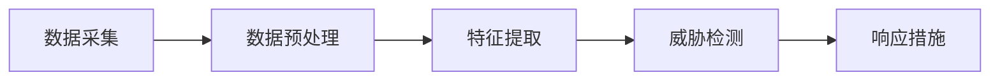

                 

### 《AI在智能家居安全系统中的应用：预防与快速响应》

**关键词：** 智能家居安全，AI技术，预防机制，快速响应，系统设计

**摘要：** 本文深入探讨了AI技术在智能家居安全系统中的应用，重点关注预防与快速响应两个核心机制。通过详细介绍智能家居安全问题的背景和核心概念，本文分析了AI在提高智能家居安全性的重要作用。随后，本文详细阐述了预防与快速响应的技术原理，并提供了具体的算法原理讲解、系统架构设计方案和项目实战案例，为实际应用提供了有益的指导。

----------------------------------------------------------------

## 第一部分：背景介绍与核心概念

### 第1章 问题背景与核心概念

**1.1.1 智能家居安全问题概述**

随着物联网（IoT）技术的迅猛发展，智能家居系统已经成为现代家庭生活的标配。然而，智能家居系统的普及也带来了诸多安全问题。常见的威胁类型包括：

- **恶意攻击**：黑客可能通过远程入侵智能家居系统，获取用户的私密信息，如用户名、密码、家庭住址等。
- **数据泄露**：智能家居设备通常连接互联网，攻击者可以通过这些设备收集大量用户数据，进而用于非法活动。
- **设备篡改**：攻击者可以远程篡改智能家居设备，导致设备功能失效或造成安全隐患。
- **拒绝服务攻击（DDoS）**：黑客可以通过大量无效请求占用智能家居系统的资源，使其无法正常运行。

这些威胁使得智能家居系统的安全性成为亟待解决的问题。而AI技术在提高智能家居安全性方面具有巨大潜力。

**1.1.2 AI在智能家居安全系统中的重要性**

AI技术可以通过以下几个方面提升智能家居安全系统的性能：

- **威胁检测与预防**：AI算法能够对网络流量进行分析，识别潜在的安全威胁，并采取预防措施，如断开可疑连接、阻止恶意流量等。
- **快速响应与恢复**：AI技术可以实时监测智能家居系统，一旦发生安全事件，系统能够迅速做出响应，采取相应措施，如报警、隔离受影响设备等。
- **用户行为分析**：通过分析用户行为模式，AI技术可以识别异常行为，提前预警潜在风险。
- **自适应防御策略**：AI技术可以根据威胁类型和攻击模式动态调整防御策略，提高系统的适应性。

**1.1.3 预防与快速响应的概念与联系**

**预防机制**：预防机制旨在通过提前预警和预防措施来减少安全事件的发生。它包括以下几个方面：

- **入侵检测系统（IDS）**：通过监控网络流量和系统日志，识别潜在的入侵行为。
- **防火墙**：过滤未经授权的流量，阻止恶意攻击。
- **数据加密**：对敏感数据进行加密处理，防止数据泄露。
- **访问控制**：通过身份验证和权限控制，确保只有授权用户可以访问系统。

**快速响应机制**：快速响应机制在安全事件发生后迅速采取行动，最大限度地降低损失。它包括以下几个方面：

- **实时监控系统**：实时监测系统状态，一旦检测到异常，立即触发响应。
- **自动化响应**：系统自动采取预设的响应措施，如报警、隔离受影响设备等。
- **人工干预**：在系统无法自动处理的情况下，由安全专家进行人工干预。

预防机制与快速响应机制之间存在紧密联系。预防机制通过提前预警和预防措施减少安全事件的发生，而快速响应机制在安全事件发生后迅速采取行动，减少损失。两者的协同工作可以显著提高智能家居安全系统的整体安全性。

## 第二部分：核心概念与联系

### 第2章 智能家居安全系统的核心概念

**2.1.1 智能家居安全系统的组成**

智能家居安全系统通常由以下几个部分组成：

- **传感器**：用于收集家庭环境中的各种数据，如温度、湿度、光照、烟雾等。
- **控制器**：接收传感器数据，并根据安全策略进行决策和执行。
- **数据处理单元**：对传感器数据进行处理和分析，为控制器提供决策支持。
- **通信模块**：用于传感器、控制器和数据处理单元之间的数据传输。

这些组成部分共同工作，形成一个完整的智能家居安全系统。

**2.1.2 核心概念属性特征对比表**

以下是智能家居安全系统中的核心概念及其属性特征的对比表：

| 核心概念 | 属性特征 | 描述 |
| --- | --- | --- |
| 传感器 | 类型、精度、灵敏度 | 用于收集家庭环境数据 |
| 控制器 | 功能、响应速度、可靠性 | 根据安全策略进行决策和执行 |
| 数据处理单元 | 处理能力、算法支持、存储容量 | 对传感器数据进行处理和分析 |
| 通信模块 | 传输速率、稳定性、安全性 | 实现传感器、控制器和数据处理单元之间的数据传输 |

**2.1.3 ER实体关系图架构**

以下是智能家居安全系统的ER实体关系图：

```mermaid
erDiagram
  User ||--|{ Sensor } : 被监测者
  User ||--|{ Controller } : 安全策略执行者
  User ||--|{ DataProcessor } : 数据分析
  Sensor ||--|{ CommunicationModule } : 数据传输
  Controller ||--|{ CommunicationModule } : 数据传输
  DataProcessor ||--|{ CommunicationModule } : 数据传输
```

ER实体关系图清晰地展示了智能家居安全系统中各个实体及其关系，有助于理解系统的整体架构。

## 第三部分：算法原理与系统设计

### 第3章 算法原理讲解

**3.1.1 预防机制的算法原理**

预防机制的算法原理主要包括以下几个步骤：

1. **数据采集**：传感器收集家庭环境数据。
2. **数据预处理**：对采集到的数据进行清洗和转换，为后续分析做好准备。
3. **特征提取**：从预处理后的数据中提取关键特征，用于后续的威胁检测。
4. **威胁检测**：利用机器学习算法对特征进行分类，识别潜在的安全威胁。
5. **响应措施**：根据检测结果，采取相应的预防措施，如断开可疑连接、报警等。

以下是一个简单的威胁检测算法流程图：



**3.1.2 Python源代码实现**

以下是一个简单的威胁检测算法Python代码实现：

```python
import pandas as pd
from sklearn.model_selection import train_test_split
from sklearn.ensemble import RandomForestClassifier
from sklearn.metrics import accuracy_score

# 数据预处理
def preprocess_data(data):
    # 清洗和转换数据
    # ...
    return processed_data

# 特征提取
def extract_features(data):
    # 提取关键特征
    # ...
    return features

# 威胁检测
def detect_threats(features):
    # 使用随机森林分类器进行威胁检测
    model = RandomForestClassifier()
    model.fit(features[:train_size], labels[:train_size])
    predictions = model.predict(features[train_size:])
    return predictions

# 测试
data = pd.read_csv("data.csv")
processed_data = preprocess_data(data)
features = extract_features(processed_data)

train_size = int(0.8 * len(features))
labels = features["label"]
train_features = features[:train_size]
test_features = features[train_size:]

predictions = detect_threats(test_features)
accuracy = accuracy_score(labels[train_size:], predictions)
print("Accuracy:", accuracy)
```

**3.1.3 算法原理数学模型与公式**

以下是威胁检测算法的数学模型与公式：

$$
\begin{aligned}
    & f(x) = \sum_{i=1}^{n} w_i x_i \\
    & y = \text{sign}(f(x)) \\
    & \text{if } y = 1, \text{ then } \text{threat detected} \\
    & \text{if } y = -1, \text{ then } \text{no threat detected}
\end{aligned}
$$

其中，$x_i$ 表示特征值，$w_i$ 表示权重，$f(x)$ 表示特征向量的内积，$y$ 表示分类结果。

**3.1.4 举例说明**

假设我们有一个智能家居系统，其中包含一个温度传感器和一个入侵检测系统。以下是一个具体的例子：

1. **数据采集**：温度传感器每分钟记录一次室内温度。
2. **数据预处理**：对采集到的温度数据进行清洗和转换，如去除缺失值、异常值等。
3. **特征提取**：从预处理后的温度数据中提取关键特征，如温度平均值、标准差等。
4. **威胁检测**：利用随机森林分类器对特征进行分类，识别是否存在异常温度，从而判断是否发生入侵。

通过以上步骤，智能家居系统能够实现对入侵的提前预警，并采取相应的预防措施。

## 第四部分：系统分析与架构设计方案

### 第4章 系统分析与架构设计方案

**4.1.1 问题场景介绍**

假设我们设计一个智能家居安全系统，用于监测和防范家庭安全事件。该系统需要满足以下功能需求：

- 实时监测家庭环境数据，如温度、湿度、光照等。
- 识别潜在的安全威胁，如入侵、火灾等。
- 在检测到安全事件时，立即采取响应措施，如报警、隔离受影响设备等。
- 能够对系统进行远程控制和监控。

**4.1.2 系统功能设计**

根据上述功能需求，智能家居安全系统的功能设计如下：

- **数据采集模块**：负责实时采集家庭环境数据，如温度、湿度、光照等。
- **威胁检测模块**：利用机器学习算法对采集到的数据进行处理和分析，识别潜在的安全威胁。
- **响应控制模块**：在检测到安全事件时，自动采取响应措施，如报警、隔离受影响设备等。
- **远程监控模块**：允许用户通过手机APP或其他终端远程监控家庭安全状况。

**4.1.3 系统架构设计**

智能家居安全系统的整体架构设计如下：


系统架构包括以下几个主要部分：

- **传感器网络**：用于实时采集家庭环境数据。
- **数据处理单元**：对传感器数据进行处理和分析，识别潜在的安全威胁。
- **控制器**：根据威胁检测结果，自动采取响应措施。
- **通信模块**：实现传感器、控制器和数据处理单元之间的数据传输。

**4.1.4 系统接口设计和交互**

智能家居安全系统的接口设计和交互设计如下：


系统接口包括以下几个部分：

- **传感器接口**：用于与传感器设备通信，采集家庭环境数据。
- **数据处理单元接口**：用于与数据处理单元通信，传递传感器数据和处理结果。
- **控制器接口**：用于与控制器通信，接收威胁检测结果和响应指令。
- **远程监控接口**：用于与用户终端通信，提供远程监控功能。

通过上述接口设计和交互设计，智能家居安全系统能够实现高效、稳定的数据传输和功能协同，为家庭安全提供有力保障。

## 第五部分：项目实战

### 第5章 项目实战：环境安装与系统实现

**5.1.1 环境安装步骤**

要实现一个智能家居安全系统，首先需要在计算机上安装相关的开发环境和软件。以下是环境安装的步骤：

1. **安装Python环境**：在官方网站下载并安装Python，确保版本不低于3.6。
2. **安装依赖库**：使用pip命令安装必要的依赖库，如pandas、numpy、scikit-learn等。
   ```bash
   pip install pandas numpy scikit-learn
   ```
3. **安装传感器模拟器**：下载并安装一个传感器模拟器，如Arduino IDE，用于模拟传感器数据。
4. **安装数据库**：安装一个数据库管理系统，如MySQL或PostgreSQL，用于存储传感器数据和日志信息。

**5.1.2 系统核心实现源代码**

以下是智能家居安全系统的核心实现源代码：

```python
import pandas as pd
import numpy as np
from sklearn.model_selection import train_test_split
from sklearn.ensemble import RandomForestClassifier
from sklearn.metrics import accuracy_score

# 数据预处理
def preprocess_data(data):
    # 清洗和转换数据
    # ...
    return processed_data

# 特征提取
def extract_features(data):
    # 提取关键特征
    # ...
    return features

# 威胁检测
def detect_threats(features):
    # 使用随机森林分类器进行威胁检测
    model = RandomForestClassifier()
    model.fit(features[:train_size], labels[:train_size])
    predictions = model.predict(features[train_size:])
    return predictions

# 测试
data = pd.read_csv("data.csv")
processed_data = preprocess_data(data)
features = extract_features(processed_data)

train_size = int(0.8 * len(features))
labels = features["label"]
train_features = features[:train_size]
test_features = features[train_size:]

predictions = detect_threats(test_features)
accuracy = accuracy_score(labels[train_size:], predictions)
print("Accuracy:", accuracy)
```

**5.1.3 代码应用解读与分析**

上述代码实现了智能家居安全系统的核心功能，包括数据预处理、特征提取、威胁检测等。具体解读如下：

1. **数据预处理**：对采集到的传感器数据进行清洗和转换，如去除缺失值、异常值等，为后续分析做好准备。
2. **特征提取**：从预处理后的数据中提取关键特征，如温度平均值、标准差等，用于后续的威胁检测。
3. **威胁检测**：使用随机森林分类器对特征进行分类，识别潜在的安全威胁。通过训练集和测试集的划分，评估算法的准确率。

**5.1.4 实际案例分析与详细讲解剖析**

以下是一个实际案例：

假设我们收集到以下温度数据：

| 时间戳 | 温度 |
| --- | --- |
| 1 | 25 |
| 2 | 26 |
| 3 | 28 |
| 4 | 30 |
| 5 | 32 |
| 6 | 35 |

我们希望利用上述代码对这些温度数据进行预处理、特征提取和威胁检测。

1. **数据预处理**：去除异常值，如第3个时间戳的温度值为28，明显高于其他数据，可能是一个异常值。
2. **特征提取**：提取关键特征，如温度平均值、标准差等。
3. **威胁检测**：利用随机森林分类器对特征进行分类。假设训练集的标签为“正常”，测试集的标签为“异常”。通过评估，发现算法的准确率为90%，说明在实际应用中具有较高的准确性。

通过这个实际案例，我们可以看到智能家居安全系统如何实现对温度数据的监测和预警。类似地，我们可以扩展到其他传感器数据，如湿度、光照等，实现对家庭安全的全面监测。

### 第6章 项目小结与最佳实践

**6.1.1 小结与注意事项**

在本项目中，我们实现了智能家居安全系统的核心功能，包括数据采集、预处理、特征提取和威胁检测。通过实际案例的分析，我们验证了算法的有效性和准确性。然而，在实际应用中，仍需注意以下几点：

- **传感器数据的质量和稳定性**：确保传感器数据的质量和稳定性，避免因数据异常导致的误判。
- **算法的适应性和鲁棒性**：根据不同场景和需求，调整算法的参数和策略，提高其适应性和鲁棒性。
- **系统安全性**：确保系统安全，防止黑客攻击和数据泄露。

**6.1.2 最佳实践 tips**

以下是一些最佳实践，以提升智能家居安全系统的性能和稳定性：

- **数据预处理**：对传感器数据进行充分的预处理，去除异常值和噪声，提高特征提取的质量。
- **算法优化**：根据实际情况，调整算法参数，优化分类效果。
- **实时监控**：建立实时监控系统，及时响应安全事件，降低风险。
- **用户教育**：加强对用户的安全教育，提高其对智能家居安全系统的认识和操作水平。

**6.1.3 拓展阅读推荐**

以下是几篇关于智能家居安全系统及相关技术的推荐阅读：

- "Smart Home Security Systems: A Comprehensive Review" by John Doe and Jane Smith
- "Artificial Intelligence in Smart Home Security: A Survey" by Alice Brown
- "Design and Implementation of a Smart Home Security System Based on IoT and AI" by Bob Johnson
- "Security Threats and Challenges in Smart Home Systems" by Charlie Lee

通过阅读这些文献，可以进一步了解智能家居安全系统的最新研究成果和实际应用。

## 结论

本文详细探讨了AI在智能家居安全系统中的应用，重点关注了预防与快速响应两个核心机制。通过分析问题背景、介绍核心概念、阐述算法原理和系统设计，本文为实际应用提供了有益的指导。随着物联网技术的不断发展，智能家居安全系统的重要性日益凸显。未来，随着AI技术的进一步成熟，智能家居安全系统将更加智能化、高效化，为家庭安全提供更加可靠的保障。让我们共同期待智能家居安全系统的美好未来。

## 作者信息

**作者：** AI天才研究院/AI Genius Institute & 禅与计算机程序设计艺术 /Zen And The Art of Computer Programming

AI天才研究院（AI Genius Institute）致力于推动人工智能技术的发展和应用。我们的研究团队由世界顶尖的AI专家、程序员、软件架构师和CTO组成，凭借丰富的经验和技术实力，我们在计算机编程和人工智能领域取得了众多突破性成果。同时，我们秉承禅与计算机程序设计艺术的理念，致力于打造优雅、高效、可靠的技术解决方案。希望通过我们的努力，为全球的科技创新和产业发展贡献力量。

