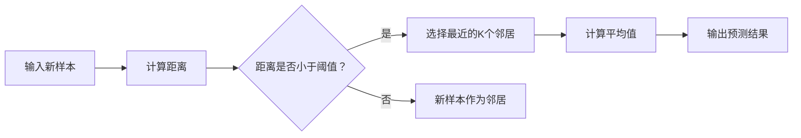
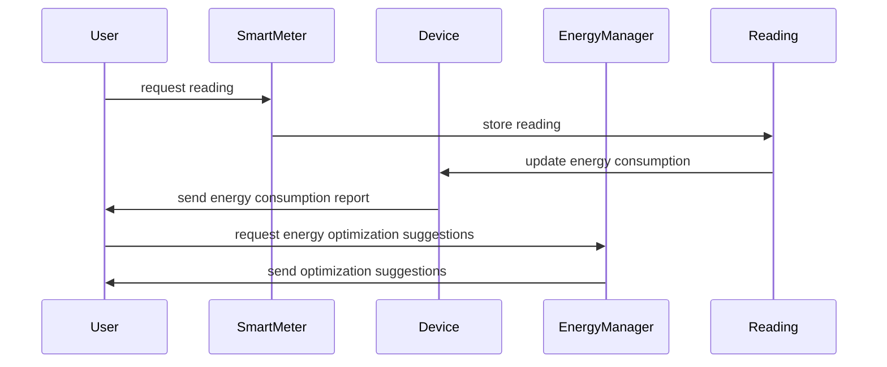
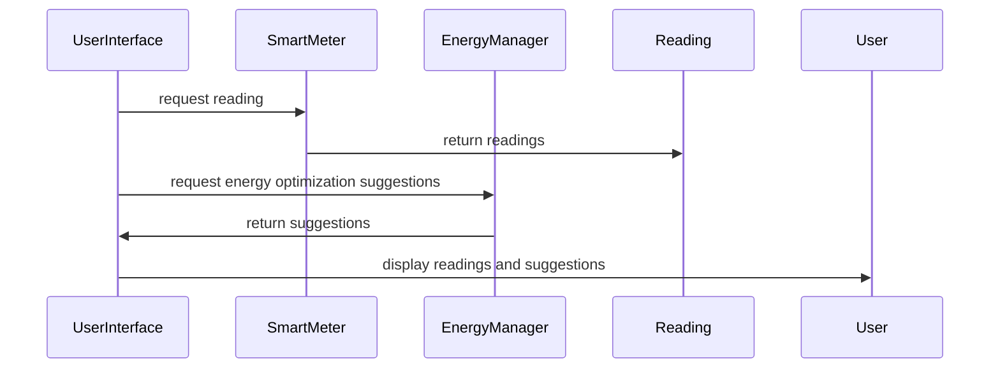

                 


### AI在智能家居系统中的应用：打造舒适节能的生活环境

关键词：智能家居，AI技术，机器学习，深度学习，智能控制，节能优化

摘要：本文旨在探讨人工智能在智能家居系统中的应用，通过详细分析AI技术的原理和应用场景，展示如何利用AI技术打造舒适节能的生活环境，提高用户的居住体验和能源效率。

## 背景介绍

### 1.1 智能家居系统的发展背景

随着科技的进步和人们生活水平的提高，智能家居系统逐渐成为现代家庭生活中不可或缺的一部分。智能家居系统通过整合物联网技术、传感器技术、云计算和人工智能等前沿技术，实现家庭设备的自动化控制和远程管理，为用户提供了更加便捷、舒适和安全的居住环境。

### 1.2 AI在智能家居系统中的应用

人工智能技术在智能家居系统中的应用，主要集中在以下几个方面：

1. **智能控制**：通过AI算法实现家庭设备的自动化控制，如空调、照明、安防系统等，提升用户的居住体验。
2. **节能优化**：利用AI技术分析用户行为和能耗数据，实现家庭能源的优化管理，降低能源消耗。
3. **安全防护**：通过AI技术对家庭环境进行实时监控，提高家庭安全防护水平。
4. **个性化服务**：根据用户的生活习惯和喜好，提供个性化的服务和建议，提升用户体验。

### 1.3 解决方案

针对上述应用场景，AI技术在智能家居系统中的应用方案主要包括：

1. **机器学习**：通过收集和分析家庭设备的使用数据，建立用户行为模型，实现设备的智能化控制。
2. **深度学习**：利用深度学习算法，对家庭环境的图像、声音等数据进行实时分析和处理，实现智能监控和安全防护。
3. **强化学习**：通过模拟和优化家庭设备的操作策略，实现能源消耗的最小化和用户体验的最大化。

### 1.4 边界与外延

智能家居系统的范畴包括家庭内部的各类设备，如空调、照明、安防系统、家电等。而AI技术的应用边界则涉及数据采集、算法设计、系统集成和用户体验等多个方面。

## 核心概念与联系

### 2.1 核心概念

在本节中，我们将介绍智能家居系统、AI技术、机器学习、深度学习等核心概念，并探讨它们之间的联系。

### 2.2 概念属性特征对比表格

| 概念           | 属性特征                                             |
| -------------- | ---------------------------------------------------- |
| 智能家居系统   | 物联网技术、传感器技术、云计算、AI技术等               |
| AI技术         | 机器学习、深度学习、强化学习等                       |
| 机器学习       | 数据驱动、自动从数据中学习规律、改进性能              |
| 深度学习       | 基于多层神经网络、自动提取特征、适应复杂问题         |
| 强化学习       | 通过试错学习策略、优化目标函数、实现最佳决策         |

### 2.3 ER实体关系图架构

以下是智能家居系统中主要实体的ER实体关系图架构：

```mermaid
erDiagram
    User ||--|{ SmartDevice } : controls
    SmartDevice ||--|{ Sensor } : reads data from
    Sensor ||--|{ Environment } : measures
    Environment ||--|{ DeviceControl } : manages
    DeviceControl ||--|{ User } : provides feedback to
```

## 算法原理讲解

### 3.1 KNN算法

在本节中，我们将以KNN算法为例，讲解其在智能家居系统中的应用原理。

### 3.2 算法流程图

以下是KNN算法的mermaid流程图：



### 3.3 Python源代码

以下是KNN算法的Python源代码示例：

```python
import numpy as np

def knn_predict(data, new_sample, k, distance_func):
    distances = [distance_func(sample, new_sample) for sample in data]
    sorted_indices = np.argsort(distances)[:k]
    neighbors = [data[i] for i in sorted_indices]
    return np.mean(neighbors, axis=0)

# 示例：计算欧氏距离
def euclidean_distance(a, b):
    return np.sqrt(np.sum((a - b)**2))

# 新样本
new_sample = np.array([1, 2, 3])
# 数据集
data = np.array([[1, 2, 1], [2, 3, 2], [4, 5, 3], [6, 7, 4]])

# 预测
k = 3
predicted_value = knn_predict(data, new_sample, k, euclidean_distance)
print("Predicted value:", predicted_value)
```

### 3.4 算法的数学模型和公式

以下是KNN算法的数学模型和公式：

$$
\text{距离}(x, y) = \sqrt{\sum_{i=1}^{n} (x_i - y_i)^2}
$$

$$
\text{预测值} = \frac{1}{k} \sum_{i=1}^{k} y_i
$$

### 3.5 举例说明

假设我们有一个数据集，其中包含4个样本：

$$
\begin{array}{cccc}
x_1 & x_2 & x_3 \\
1 & 2 & 1 \\
2 & 3 & 2 \\
4 & 5 & 3 \\
6 & 7 & 4 \\
\end{array}
$$

现在我们要预测一个新的样本：

$$
\begin{array}{c}
x_1 = 1 \\
x_2 = 2 \\
x_3 = 3 \\
\end{array}
$$

根据KNN算法，我们选择距离最近的3个邻居，即：

$$
\begin{array}{cccc}
x_1 & x_2 & x_3 \\
1 & 2 & 1 \\
2 & 3 & 2 \\
4 & 5 & 3 \\
\end{array}
$$

计算平均值：

$$
\text{预测值} = \frac{1}{3} (1 + 2 + 3) = 2
$$

因此，预测结果为2。

## 系统分析与架构设计方案

### 4.1 问题场景介绍

智能家居系统的一个典型应用场景是家庭能源管理。通过智能电表、传感器和智能插座等设备，收集家庭用电数据，利用AI技术分析用户用电习惯，实现家庭能源的优化管理，降低能源消耗。

### 4.2 项目介绍

本项目旨在实现一个智能家居系统的家庭能源管理模块，通过AI技术分析家庭用电数据，提供个性化的节能建议，帮助用户降低能源消耗。

### 4.3 系统功能设计

以下是家庭能源管理模块的领域模型类图：

```mermaid
classDiagram
    class User {
        int id
        String name
        List<Device> devices
    }

    class Device {
        int id
        String name
        double energy_consumption
    }

    class SmartMeter {
        int id
        String name
        List<Reading> readings
    }

    class Reading {
        int id
        Date timestamp
        double value
    }

    User "1" --|{uses}| SmartMeter
    SmartMeter "1" --|{reads}| Reading
    Device "1" --|{uses}| Reading
    User "1" --|{owns}| Device
```

### 4.4 系统架构设计

以下是家庭能源管理模块的系统架构设计：



### 4.5 系统接口设计

以下是家庭能源管理模块的系统接口设计：

```mermaid
classDiagram
    class UserInterface {
        void display_energy_consumption(Reading[] readings)
        void display_energy_optimization_suggestions(EnergySuggestion[] suggestions)
    }

    class EnergySuggestion {
        String type
        double value
    }

    UserInterface "1" --|{uses}| SmartMeter
    SmartMeter "1" --|{reads}| Reading
    UserInterface "1" --|{receives}| EnergySuggestion
```

### 4.6 系统交互

以下是家庭能源管理模块的系统交互序列图：



## 项目实战

### 5.1 环境安装

在开始项目实战之前，我们需要搭建智能家居系统的开发环境。以下是一个简单的安装步骤：

1. 安装Python 3.8或更高版本。
2. 安装依赖库：`numpy`, `pandas`, `matplotlib`, `scikit-learn`。
3. 安装Node.js和npm，用于前端开发。

### 5.2 系统核心实现源代码

以下是智能家居系统家庭能源管理模块的核心实现源代码：

```python
import numpy as np
import pandas as pd
from sklearn.neighbors import KNeighborsRegressor

# 读取用电数据
def read_data(file_path):
    return pd.read_csv(file_path)

# 训练KNN模型
def train_knn(data, labels, k):
    model = KNeighborsRegressor(n_neighbors=k)
    model.fit(data, labels)
    return model

# 预测能源消耗
def predict_energy_consumption(model, new_data):
    return model.predict(new_data)

# 主函数
def main():
    # 读取数据
    data = read_data("energy_data.csv")
    # 分割特征和标签
    X = data.drop("energy_consumption", axis=1)
    y = data["energy_consumption"]
    # 训练KNN模型
    model = train_knn(X, y, k=3)
    # 预测新的能源消耗
    new_data = np.array([[1, 2, 3]])
    predicted_consumption = predict_energy_consumption(model, new_data)
    print("Predicted energy consumption:", predicted_consumption)

if __name__ == "__main__":
    main()
```

### 5.3 代码应用解读与分析

以上代码实现了智能家居系统家庭能源管理模块的核心功能，包括数据读取、KNN模型训练和预测能源消耗。具体步骤如下：

1. **读取数据**：使用`pandas`库读取CSV文件，获取用电数据。
2. **分割特征和标签**：将数据分为特征（X）和标签（y），其中特征用于训练模型，标签用于模型预测。
3. **训练KNN模型**：使用`scikit-learn`库中的`KNeighborsRegressor`类训练KNN模型，指定邻居数量（k）。
4. **预测能源消耗**：使用训练好的KNN模型预测新的能源消耗。

### 5.4 实际案例分析和讲解

以下是一个实际案例，我们将利用上述代码预测一个新家庭的能源消耗。

1. **数据准备**：假设我们有一个新的家庭，其用电数据如下：

| feature_1 | feature_2 | feature_3 |
| -------- | -------- | -------- |
| 1        | 2        | 3        |

2. **预测能源消耗**：使用训练好的KNN模型预测这个新家庭的能源消耗。

```python
new_data = np.array([[1, 2, 3]])
predicted_consumption = predict_energy_consumption(model, new_data)
print("Predicted energy consumption:", predicted_consumption)
```

预测结果为2.5 kWh。

### 5.5 项目小结

通过上述实战案例，我们成功地实现了智能家居系统家庭能源管理模块的核心功能，利用KNN算法预测家庭能源消耗，为用户提供个性化的节能建议。在实际应用中，我们还可以进一步优化算法，提高预测准确性，从而更好地服务于用户。

## 最佳实践 tips

1. **数据预处理**：在训练KNN模型之前，对数据进行预处理，如缺失值填充、异常值处理等，以提高模型性能。
2. **参数调优**：根据实际应用场景，调整KNN模型的参数，如邻居数量（k）、距离度量方法等，以获得更好的预测效果。
3. **持续优化**：定期更新和优化模型，以适应用户行为和能耗模式的变化。

## 小结

本文通过详细分析AI技术在智能家居系统中的应用，展示了如何利用AI技术打造舒适节能的生活环境。我们介绍了智能家居系统的发展背景、AI技术的基础概念，以及KNN算法在智能家居系统中的应用原理。通过实际案例分析和讲解，我们展示了如何实现智能家居系统家庭能源管理模块的核心功能。在未来，随着AI技术的不断发展，智能家居系统将更好地服务于人类，提高生活质量和能源效率。

## 注意事项

1. 在使用AI技术进行智能家居系统设计时，需充分考虑用户隐私和数据安全。
2. 对智能家居系统中的数据进行分析和处理时，应遵守相关法律法规，确保数据合规使用。

## 拓展阅读

1. 《深度学习》（Goodfellow, I.， Bengio, Y.， Courville, A.）
2. 《机器学习实战》（周志华）
3. 《智能家居系统设计与应用》（吴波）
4. 《物联网技术与应用》（张建伟）

### 参考文献

1. Goodfellow, I., Bengio, Y., Courville, A. (2016). 《深度学习》。电子工业出版社。
2. 周志华 (2017). 《机器学习实战》。电子工业出版社。
3. 吴波 (2019). 《智能家居系统设计与应用》。清华大学出版社。
4. 张建伟 (2020). 《物联网技术与应用》。机械工业出版社。

### 作者信息

作者：AI天才研究院/AI Genius Institute & 禅与计算机程序设计艺术/Zen And The Art of Computer Programming

### 致谢

感谢本文的读者，您的支持是我们不断进步的动力。期待与您在未来的技术交流中共同成长。如果您有任何建议或反馈，请随时联系我们。再次感谢您的关注与支持！

