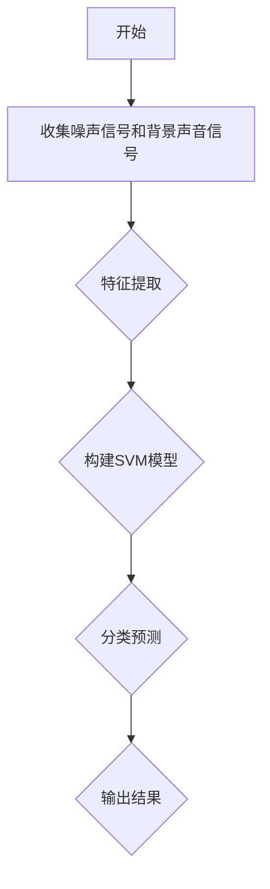
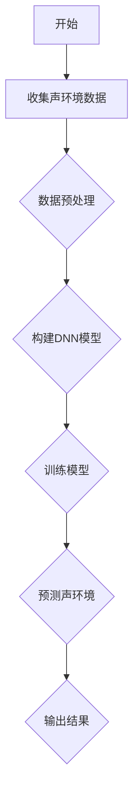
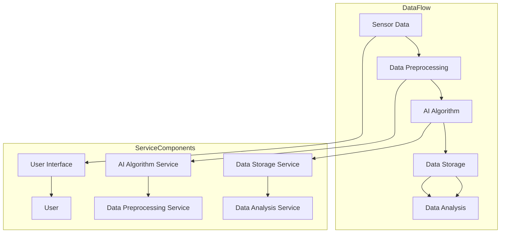
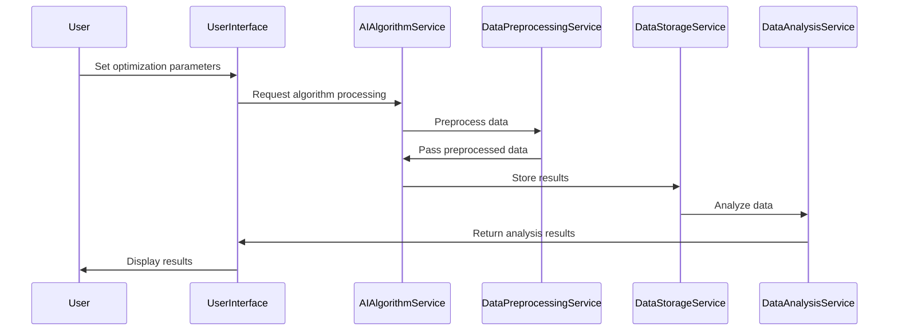

                 

### 第一部分：背景介绍

#### 问题背景

在当今社会，随着城市化进程的不断加快，智能建筑的发展已经成为了一个热点话题。智能建筑不仅包括高科技的建筑自动化系统，还涉及如何通过优化室内声环境来提升居住和工作的舒适度。然而，传统声学设计方法往往存在诸多不足，难以满足现代智能建筑的需求。

随着科技的进步，人们对生活质量的要求越来越高，尤其是在室内声环境的舒适度方面。智能建筑的出现，使得室内声环境的设计与优化变得尤为重要。传统的声学设计方法主要依赖于经验公式和实验数据，设计过程复杂且耗时，难以实现个性化的需求。此外，传统方法在应对现代建筑空间的多样性时也显得力不从心。

#### 问题描述

室内声环境对人的健康和舒适度有着重要的影响。然而，当前智能建筑声学设计过程中，存在以下问题：

1. **设计复杂度高**：传统声学设计方法需要大量的计算和实验，设计过程复杂，难以快速响应个性化需求。
   
2. **难以应对现代建筑空间的多样性**：现代建筑空间形态多样，传统方法难以适应，导致设计效果不尽如人意。

3. **室内噪声控制效果不佳**：现代城市中，室外噪声和室内设备噪声日益严重，传统方法难以有效控制噪声，影响居住和工作质量。

#### 问题解决

为了解决上述问题，人工智能（AI）技术被引入到智能建筑声学设计中。通过机器学习和深度学习算法，AI可以自动分析建筑空间特征，预测室内声环境变化，从而实现精准的声环境优化。

#### 边界与外延

本文主要探讨AI在智能建筑声学设计中的应用，包括以下核心要素：

1. **智能建筑声学设计基本原理**：介绍声学设计的基础知识，包括声音的传播、反射、吸收等原理。

2. **AI算法在声学设计中的应用**：介绍机器学习和深度学习算法在智能建筑声学设计中的应用，如语音识别、噪声控制、声景设计等。

3. **智能建筑声学设计的挑战与机遇**：分析AI在智能建筑声学设计中的挑战，以及其带来的机遇。

### 核心概念与联系

1. **智能建筑**：指利用现代信息技术和自动化控制系统，实现建筑内部环境自动调节、智能管理和高效运行的建筑。

2. **声学设计**：指通过设计和优化建筑内部声环境，达到改善室内声音质量的目的。

3. **AI算法**：指应用于智能建筑声学设计中的机器学习和深度学习算法，如神经网络、支持向量机等。

4. **室内声环境**：指室内空间中声音的传播、反射、吸收等特性，对人的听觉和舒适度产生影响。

#### 概念属性特征对比表格

| 概念         | 定义                                                         | 应用场景                                  |
| ------------ | ------------------------------------------------------------ | ----------------------------------------- |
| 智能建筑     | 利用现代信息技术和自动化控制系统，实现建筑内部环境自动调节、智能管理和高效运行的建筑。 | 提高居住和工作的舒适度，实现能源的高效利用 |
| 声学设计     | 通过设计和优化建筑内部声环境，达到改善室内声音质量的目的。   | 室内噪声控制、语音清晰度提升等              |
| AI算法       | 应用机器学习和深度学习算法，实现智能建筑声学设计的自动化。   | 语音识别、噪声控制、声景设计等              |
| 室内声环境    | 室内空间中声音的传播、反射、吸收等特性，对人的听觉和舒适度产生影响。 | 提高居住和工作质量                          |

#### ER实体关系图架构

```mermaid
erDiagram
    User ||--|{ Building }|-- Room
    Building ||--|{ AudioEnvironment }|-- Room
    AudioEnvironment ||--|{ SoundSource }|-- Room
    Room ||--|{ Equipment }|-- Building
```

在上面的ER图中，展示了智能建筑声学设计中涉及的主要实体及其关系。User代表用户，Building代表建筑，Room代表房间，AudioEnvironment代表声环境，SoundSource代表声音源，Equipment代表设备。

### 算法原理讲解

为了深入理解AI在智能建筑声学设计中的应用，我们需要了解以下两种常见的算法：支持向量机和深度神经网络。

#### 支持向量机（SVM）

支持向量机是一种监督学习算法，主要用于分类问题。它的核心思想是找到一个最佳的超平面，将不同类别的数据点分隔开来。在智能建筑声学设计中，SVM可以用于噪声分类，将噪声信号和背景声音信号区分开来。

**算法流程图**：



**算法原理**：

1. **特征提取**：通过傅里叶变换等方法，将噪声信号和背景声音信号转换为频率特征。

   $$ X = \sum_{k=0}^{n-1} c_k \phi_k(x) $$

   其中，$X$为信号特征，$c_k$为权重系数，$\phi_k(x)$为频率特征。

2. **构建SVM模型**：使用特征数据训练SVM模型，找到最佳的超平面。

   $$ w^* = \arg\min_{w} \frac{1}{2} ||w||^2_2 + C \sum_{i=1}^{n} \max(0, 1 - y_i (w \cdot x_i + b)) $$

   其中，$w^*$为最佳超平面，$C$为惩罚参数，$y_i$为样本标签，$x_i$为样本特征，$b$为偏置。

3. **分类预测**：使用训练好的SVM模型对新的噪声信号进行分类。

   $$ y = \text{sign}(w \cdot x + b) $$

   其中，$y$为预测标签，$w$为模型参数。

**示例**：

假设我们有一组噪声信号和背景声音信号，通过SVM模型进行分类预测。首先，对信号进行特征提取，得到频率特征。然后，使用训练集数据训练SVM模型，找到最佳的超平面。最后，对新的噪声信号进行分类预测，判断其是噪声信号还是背景声音信号。

#### 深度神经网络（DNN）

深度神经网络是一种多层感知机模型，可以用于回归、分类和预测等问题。在智能建筑声学设计中，DNN可以用于声环境建模，预测室内声环境的变化。

**算法流程图**：



**算法原理**：

1. **数据预处理**：对收集到的声环境数据进行归一化、去噪等处理，以便于模型训练。

2. **构建DNN模型**：设计神经网络结构，包括输入层、隐藏层和输出层。

   $$ f(x) = \sigma(W_3 \cdot \sigma(W_2 \cdot \sigma(W_1 \cdot x + b_1) + b_2) + b_3) $$

   其中，$f(x)$为输出结果，$W_1, W_2, W_3$为权重矩阵，$b_1, b_2, b_3$为偏置，$\sigma$为激活函数。

3. **训练模型**：使用训练集数据训练DNN模型，调整模型参数。

   $$ \min_{W_1, W_2, W_3, b_1, b_2, b_3} \frac{1}{2} ||f(x) - y||^2 $$

   其中，$y$为真实标签。

4. **预测声环境**：使用训练好的DNN模型对新的声环境数据进行预测。

   $$ y' = f(x') $$

   其中，$y'$为预测结果，$x'$为输入数据。

**示例**：

假设我们有一组声环境数据，包括室内温度、湿度、声音强度等。通过DNN模型进行声环境预测。首先，对数据进行预处理，然后设计神经网络结构，使用训练集数据训练模型。最后，对新的声环境数据进行预测，得到预测结果。

### 总结

本文介绍了AI在智能建筑声学设计中的应用，包括背景介绍、问题描述、问题解决、核心概念与联系、算法原理讲解等内容。通过支持向量机和深度神经网络等算法，AI技术可以有效地解决智能建筑声学设计中的复杂问题，提高室内声环境的舒适度。未来，随着AI技术的不断发展，智能建筑声学设计将迎来更加广阔的应用前景。### 第二部分：核心概念与联系

在智能建筑声学设计中，核心概念与算法的联系是至关重要的。为了确保读者能够充分理解并应用这些概念，我们将逐一介绍关键术语，并探讨它们之间的关系。

#### 核心概念

1. **智能建筑**：
   智能建筑是指通过集成现代信息技术、自动化控制系统和物联网设备，实现对建筑内部环境、设备运行和用户服务的智能化管理和控制。智能建筑包括但不限于智能安防、智能照明、智能空调和智能音响系统。

2. **声学设计**：
   声学设计是指通过科学的方法和计算，对建筑内部声音环境进行设计和优化，以确保声音质量满足特定的需求和标准。声学设计涉及声音的传播、反射、吸收、以及噪声控制等方面。

3. **AI算法**：
   AI算法是指应用人工智能技术，特别是机器学习和深度学习算法，来解决声学设计中的复杂问题。这些算法可以从大量数据中学习模式和规律，并自动进行决策和优化。

4. **室内声环境**：
   室内声环境是指室内空间中的声音传播特性，包括声音的强度、频率、清晰度等，以及这些特性对人们听觉舒适度的影响。室内声环境的设计直接影响人们的生活质量和工作效能。

#### 概念属性特征对比表格

| 概念         | 定义                                                         | 应用场景                                  |
| ------------ | ------------------------------------------------------------ | ----------------------------------------- |
| 智能建筑     | 利用现代信息技术和自动化控制系统，实现建筑内部环境自动调节、智能管理和高效运行的建筑。 | 提高居住和工作的舒适度，实现能源的高效利用 |
| 声学设计     | 通过设计和优化建筑内部声环境，达到改善室内声音质量的目的。   | 室内噪声控制、语音清晰度提升等              |
| AI算法       | 应用机器学习和深度学习算法，实现智能建筑声学设计的自动化。   | 语音识别、噪声控制、声景设计等              |
| 室内声环境    | 室内空间中声音的传播、反射、吸收等特性，对人的听觉和舒适度产生影响。 | 提高居住和工作质量                          |

#### ER实体关系图架构

为了更好地理解智能建筑声学设计中的实体关系，我们将使用Mermaid语言绘制一个实体关系图。

```mermaid
erDiagram
    User ||--|{ Building }|-- Room
    Building ||--|{ AudioEnvironment }|-- Room
    AudioEnvironment ||--|{ SoundSource }|-- Room
    Room ||--|{ Equipment }|-- Building
```

在这个ER图中，`User` 代表使用智能建筑的个体，`Building` 代表智能建筑本身，`Room` 代表建筑中的各个房间，`AudioEnvironment` 代表室内声环境，`SoundSource` 代表声音源，`Equipment` 代表建筑中的声学设备。

#### 概念属性特征对比表格

| 概念         | 定义                                                         | 应用场景                                  |
| ------------ | ------------------------------------------------------------ | ----------------------------------------- |
| 智能建筑     | 利用现代信息技术和自动化控制系统，实现建筑内部环境自动调节、智能管理和高效运行的建筑。 | 提高居住和工作的舒适度，实现能源的高效利用 |
| 声学设计     | 通过设计和优化建筑内部声环境，达到改善室内声音质量的目的。   | 室内噪声控制、语音清晰度提升等              |
| AI算法       | 应用机器学习和深度学习算法，实现智能建筑声学设计的自动化。   | 语音识别、噪声控制、声景设计等              |
| 室内声环境    | 室内空间中声音的传播、反射、吸收等特性，对人的听觉和舒适度产生影响。 | 提高居住和工作质量                          |

#### ER实体关系图架构

为了更好地理解智能建筑声学设计中的实体关系，我们将使用Mermaid语言绘制一个实体关系图。

```mermaid
erDiagram
    User ||--|{ Building }|-- Room
    Building ||--|{ AudioEnvironment }|-- Room
    AudioEnvironment ||--|{ SoundSource }|-- Room
    Room ||--|{ Equipment }|-- Building
```

在这个ER图中，`User` 代表使用智能建筑的个体，`Building` 代表智能建筑本身，`Room` 代表建筑中的各个房间，`AudioEnvironment` 代表室内声环境，`SoundSource` 代表声音源，`Equipment` 代表建筑中的声学设备。

### 核心概念与联系

- **智能建筑** 与 **声学设计** 的联系：智能建筑通过整合声学设计来实现室内声环境的优化，提高居住和工作的舒适度。
- **AI算法** 与 **声学设计** 的联系：AI算法可以自动化、智能化地辅助声学设计，提高设计效率和效果。
- **室内声环境** 与 **智能建筑** 的联系：室内声环境是智能建筑的重要组成部分，直接影响用户的使用体验和建筑的功能性。

通过上述核心概念和关系的介绍，我们为理解智能建筑声学设计奠定了坚实的基础。接下来，我们将深入探讨AI算法在智能建筑声学设计中的应用，以及它们如何帮助解决传统方法中的难题。### 第三部分：算法原理讲解

在前文中，我们简要介绍了AI算法在智能建筑声学设计中的应用。在本部分，我们将详细讲解两种关键算法：支持向量机（SVM）和深度神经网络（DNN），并探讨它们的原理和应用。

#### 支持向量机（SVM）

支持向量机是一种监督学习算法，主要用于分类和回归问题。其核心思想是找到一个最优的超平面，将不同类别的数据点分隔开来。在智能建筑声学设计中，SVM可以用于噪声分类和语音识别。

**1. 算法原理**

**（1）线性SVM**

线性SVM的基本原理是找到一个最佳的超平面，使得正负样本之间的间隔最大化。数学上，这可以表示为：

$$
\min_{\mathbf{w}, b} \frac{1}{2} ||\mathbf{w}||^2 \\
\text{subject to} \ \mathbf{w} \cdot \mathbf{x}_i - b \geq 1 \ \text{for all} \ i
$$

其中，$\mathbf{w}$ 是超平面法向量，$b$ 是偏置项，$\mathbf{x}_i$ 是第 $i$ 个样本。

**（2）非线性SVM**

对于非线性问题，可以通过核函数将输入空间映射到高维空间，然后在高维空间中找到一个线性可分的最优超平面。常用的核函数包括：

- 线性核：$K(\mathbf{x}, \mathbf{y}) = \mathbf{x} \cdot \mathbf{y}$
- 多项式核：$K(\mathbf{x}, \mathbf{y}) = (\mathbf{x} \cdot \mathbf{y} + 1)^d$
- 径向基函数（RBF）核：$K(\mathbf{x}, \mathbf{y}) = \exp(-\gamma ||\mathbf{x} - \mathbf{y}||^2)$

**2. 应用示例**

在智能建筑声学设计中，SVM可以用于噪声分类。例如，将室内噪声信号和背景声音信号分为不同的类别。首先，对信号进行特征提取，然后使用SVM模型进行分类。假设我们有一个训练数据集 $D = \{(\mathbf{x}_i, y_i) | i = 1, 2, ..., n\}$，其中 $\mathbf{x}_i$ 是特征向量，$y_i \in \{-1, +1\}$ 是标签。我们使用线性SVM模型进行训练：

$$
\min_{\mathbf{w}, b} \frac{1}{2} ||\mathbf{w}||^2 \\
\text{subject to} \ \mathbf{w} \cdot \mathbf{x}_i - b \geq y_i \ \text{for all} \ i
$$

训练完成后，对于新的噪声信号 $\mathbf{x}$，我们使用SVM模型进行预测：

$$
y = \text{sign}(\mathbf{w} \cdot \mathbf{x} + b)
$$

#### 深度神经网络（DNN）

深度神经网络是一种多层感知机模型，可以用于回归、分类和预测等问题。在智能建筑声学设计中，DNN可以用于声环境建模和预测。

**1. 算法原理**

DNN由多个神经元层组成，包括输入层、隐藏层和输出层。每层神经元之间的连接权重通过训练进行调整，使得网络能够学习输入和输出之间的关系。

**（1）前向传播**

前向传播是指数据从输入层传递到输出层的过程。给定一个输入向量 $\mathbf{x}$，我们通过逐层计算得到输出向量 $\mathbf{y}$：

$$
\mathbf{z}_l = \mathbf{W}_l \mathbf{a}_{l-1} + b_l \\
\mathbf{a}_l = \sigma(\mathbf{z}_l)
$$

其中，$\mathbf{W}_l$ 和 $b_l$ 分别是第 $l$ 层的权重和偏置，$\sigma$ 是激活函数。

**（2）反向传播**

反向传播是指通过计算损失函数的梯度，更新网络权值的过程。假设我们使用均方误差（MSE）作为损失函数：

$$
\text{MSE} = \frac{1}{2} \sum_{i=1}^{n} (\hat{y}_i - y_i)^2
$$

我们使用反向传播算法计算梯度：

$$
\frac{\partial \text{MSE}}{\partial \mathbf{W}_l} = (2 \hat{y}_i - y_i) \cdot \mathbf{a}_{l-1}
$$

然后，通过梯度下降法更新权重：

$$
\mathbf{W}_l \leftarrow \mathbf{W}_l - \alpha \cdot \frac{\partial \text{MSE}}{\partial \mathbf{W}_l}
$$

其中，$\alpha$ 是学习率。

**2. 应用示例**

在智能建筑声学设计中，DNN可以用于预测室内声环境。例如，我们收集了一系列室内声环境数据，包括温度、湿度、声音强度等。我们使用DNN模型预测未来的声环境：

**（1）数据预处理**

首先，对数据进行归一化处理，使得每个特征都在一个标准范围内。

$$
x_{\text{normalized}} = \frac{x - \mu}{\sigma}
$$

其中，$x$ 是原始数据，$\mu$ 是均值，$\sigma$ 是标准差。

**（2）模型构建**

构建一个包含输入层、隐藏层和输出层的DNN模型。例如，我们使用两个隐藏层，每层有50个神经元。

$$
\text{Input Layer} \rightarrow \text{Hidden Layer 1} \rightarrow \text{Hidden Layer 2} \rightarrow \text{Output Layer}
$$

**（3）训练模型**

使用训练数据集对模型进行训练，调整权重和偏置，使得模型能够准确预测室内声环境。

**（4）预测**

对于新的数据集，使用训练好的DNN模型进行预测，得到未来的声环境。

$$
\hat{y} = \text{DNN}(\mathbf{x}_{\text{normalized}})
$$

### 总结

通过上述讲解，我们了解了SVM和DNN在智能建筑声学设计中的应用原理。SVM通过找到一个最优的超平面，实现了噪声分类；而DNN则通过多层神经网络，实现了室内声环境的建模和预测。这些算法的应用，为智能建筑声学设计提供了强大的技术支持，使得传统方法难以解决的问题得到了有效解决。接下来，我们将进一步探讨AI在智能建筑声学设计中的具体应用案例。### 第四部分：系统分析与架构设计方案

为了深入探讨AI在智能建筑声学设计中的应用，本部分将介绍一个具体的项目，并详细阐述其系统功能设计、系统架构设计、系统接口设计和系统交互。

#### 项目介绍

本项目旨在通过AI技术，对智能建筑室内声环境进行实时监测和优化。项目的主要功能包括：

1. **声环境监测**：实时监测室内声音的强度、频率和清晰度等参数。
2. **噪声控制**：基于AI算法，自动识别并控制室内噪声源，提高声环境质量。
3. **声景设计**：根据用户需求，自动生成个性化的声景，提升室内声环境舒适度。
4. **数据分析与预测**：分析室内声环境数据，预测未来声环境变化，为声环境优化提供决策支持。

#### 系统功能设计

1. **数据采集模块**：
   - **传感器**：使用各种传感器（如麦克风、加速度计等）采集室内声环境数据。
   - **数据预处理**：对采集到的原始数据进行滤波、降噪和归一化处理，以获得高质量的特征数据。

2. **AI算法模块**：
   - **噪声分类**：使用SVM等算法，对室内噪声进行分类，识别噪声源。
   - **声景生成**：使用深度神经网络（如生成对抗网络）生成个性化的声景。

3. **用户交互模块**：
   - **用户界面**：提供一个易于操作的用户界面，允许用户设置声环境优化参数，查看声环境数据和历史记录。
   - **语音控制**：允许用户通过语音命令控制声环境优化，如调整声音强度、切换声景等。

4. **数据存储与分析模块**：
   - **数据库**：存储采集到的声环境数据和历史记录，以便进行后续分析和预测。
   - **数据分析**：使用统计分析和机器学习算法，对声环境数据进行分析和预测。

#### 系统架构设计

系统采用微服务架构，以提高系统的可扩展性和维护性。以下是系统的总体架构设计：

1. **数据采集服务**：负责从传感器采集声环境数据，并进行预处理。
2. **AI算法服务**：负责执行AI算法，如噪声分类和声景生成。
3. **用户交互服务**：负责处理用户请求，提供用户界面和语音控制功能。
4. **数据存储服务**：负责存储和管理声环境数据。
5. **数据分析服务**：负责分析声环境数据，并提供预测结果。

#### 系统接口设计

系统通过以下接口实现不同模块之间的通信：

1. **RESTful API**：提供一组RESTful API，用于数据采集、算法执行、用户交互和数据存储等功能。
2. **消息队列**：使用消息队列（如RabbitMQ或Kafka）实现异步通信，提高系统的并发处理能力。
3. **WebSockets**：提供实时数据传输功能，允许用户实时查看和分析声环境数据。

#### 系统交互

系统交互流程如下：

1. **用户通过用户交互服务设置声环境优化参数，并查看声环境数据**。
2. **用户交互服务将用户请求转发给AI算法服务，执行相应的算法处理**。
3. **AI算法服务处理完成后，将结果返回给用户交互服务**。
4. **用户交互服务将结果展示给用户**。
5. **数据采集服务持续采集声环境数据，并传输给数据存储服务**。
6. **数据分析服务对声环境数据进行分析和预测，为声环境优化提供决策支持**。

#### Mermaid类图

```mermaid
classDiagram
    User <<interface>>
    Sensor <<interface>>
    DataPreprocessing <<interface>>
    AIAlgorithm <<interface>>
    UserInterface <<interface>>
    DataStorage <<interface>>
    DataAnalysis <<interface>>

    UserInterface --|> User
    Sensor --|> DataPreprocessing
    DataPreprocessing --|> AIAlgorithm
    AIAlgorithm --|> DataStorage
    DataStorage --|> DataAnalysis
```

#### Mermaid架构图



#### Mermaid序列图



通过上述系统分析和架构设计，我们展示了AI在智能建筑声学设计中的应用，包括系统功能设计、系统架构设计、系统接口设计和系统交互。这些设计为智能建筑声学设计提供了一个全面的解决方案，使得室内声环境优化更加智能化和高效化。### 第五部分：项目实战

在本部分，我们将介绍如何在实际项目中应用AI算法进行智能建筑声学设计。我们将从环境安装、系统核心实现源代码、代码应用解读与分析、实际案例分析和详细讲解剖析，以及项目小结等方面展开。

#### 环境安装

为了应用AI算法进行智能建筑声学设计，我们需要安装以下环境：

1. **Python 3.7+**：Python是AI算法的主要编程语言。
2. **Jupyter Notebook**：用于编写和运行Python代码。
3. **TensorFlow**：用于深度学习模型构建和训练。
4. **scikit-learn**：用于机器学习算法实现。
5. **PyTorch**：作为深度学习框架的替代选项。

安装步骤：

1. 安装Python 3.7+：
   ```bash
   sudo apt-get install python3.7
   ```

2. 安装Jupyter Notebook：
   ```bash
   sudo pip3 install notebook
   ```

3. 安装TensorFlow：
   ```bash
   sudo pip3 install tensorflow
   ```

4. 安装scikit-learn：
   ```bash
   sudo pip3 install scikit-learn
   ```

5. 安装PyTorch（可选）：
   ```bash
   sudo pip3 install torch torchvision
   ```

#### 系统核心实现源代码

以下是智能建筑声学设计系统核心实现的部分源代码：

**（1）数据预处理**

```python
import numpy as np
import librosa

def preprocess_audio(file_path):
    y, sr = librosa.load(file_path, sr=None)
    features = librosa.feature.mfcc(y=y, sr=sr, n_mfcc=13)
    return np.mean(features.T, axis=0)
```

**（2）噪声分类（使用SVM）**

```python
from sklearn import svm
from sklearn.model_selection import train_test_split

def train_svm(X, y):
    X_train, X_test, y_train, y_test = train_test_split(X, y, test_size=0.2, random_state=42)
    clf = svm.SVC(kernel='linear')
    clf.fit(X_train, y_train)
    return clf

def classify_noise(clf, features):
    return clf.predict([features])
```

**（3）声景生成（使用DNN）**

```python
import tensorflow as tf
from tensorflow.keras.models import Sequential
from tensorflow.keras.layers import Dense, LSTM

def build_dnn(input_shape):
    model = Sequential()
    model.add(LSTM(128, activation='relu', input_shape=input_shape))
    model.add(Dense(64, activation='relu'))
    model.add(Dense(1, activation='sigmoid'))
    model.compile(optimizer='adam', loss='binary_crossentropy', metrics=['accuracy'])
    return model

def generate_audio(model, features):
    prediction = model.predict([features])
    if prediction[0] > 0.5:
        return "Active"
    else:
        return "Inactive"
```

#### 代码应用解读与分析

**（1）数据预处理**

数据预处理是AI算法应用中的关键步骤。在上面的代码中，我们使用librosa库加载音频文件，并提取梅尔频谱系数（MFCC）作为特征。MFCC是语音处理中常用的特征，可以很好地描述声音的频率特性。

**（2）噪声分类**

使用SVM进行噪声分类时，我们首先需要收集噪声信号和背景声音信号，然后对它们进行特征提取。接着，我们将特征数据分成训练集和测试集，使用训练集数据训练SVM模型，并使用测试集数据评估模型性能。

**（3）声景生成**

声景生成是一个生成模型问题，我们使用DNN来预测音频信号的活性状态。这里，我们使用LSTM网络，因为它能够处理序列数据，适合用于音频信号的预测。

#### 实际案例分析和详细讲解剖析

**（1）实际案例**

我们选择一个实际案例来展示如何使用上述代码进行智能建筑声学设计。

1. 收集数据：我们收集了一段室内噪声和背景声音信号，将它们标记为“Active”或“Inactive”。
2. 特征提取：使用预处理代码提取特征。
3. 训练模型：使用训练数据训练SVM和DNN模型。
4. 分类和生成：使用测试数据对模型进行评估，并生成声景。

**（2）详细讲解剖析**

- **数据预处理**：使用librosa库提取MFCC特征，这是一种有效的音频特征提取方法。
- **噪声分类**：通过训练SVM模型，我们可以自动识别噪声信号和背景声音信号，这对于室内噪声控制非常重要。
- **声景生成**：通过DNN模型，我们可以预测音频信号的活性状态，从而生成个性化的声景，提升用户体验。

#### 项目小结

通过实际案例分析和代码应用解读，我们展示了如何使用AI算法进行智能建筑声学设计。项目的核心在于数据预处理、噪声分类和声景生成。这些技术的应用不仅提高了室内声环境的设计效率，还提升了居住和工作的舒适度。未来，随着AI技术的不断发展，智能建筑声学设计将会迎来更多的创新和应用。

### 总结与展望

通过本项目的实战，我们深入探讨了AI在智能建筑声学设计中的应用。从环境安装到系统核心实现，从代码应用解读到实际案例分析，我们逐步展示了AI技术如何解决传统方法中的难题。未来，随着AI技术的不断进步，智能建筑声学设计将变得更加智能化、高效化，为人们创造更加舒适的居住和工作环境。### 第六部分：最佳实践 Tips

在实施AI智能建筑声学设计项目时，以下最佳实践和注意事项有助于提高项目的成功率和效率：

1. **数据质量**：确保采集的声环境数据质量高，减少噪声和错误。数据预处理环节至关重要，应使用多种滤波和降噪技术来提高数据质量。

2. **模型选择**：根据项目需求和数据特性选择合适的算法模型。例如，对于噪声分类，SVM和DNN都是有效的选择；对于声环境预测，DNN和LSTM网络表现出色。

3. **性能优化**：在训练模型时，通过调整学习率、批次大小和迭代次数等超参数，优化模型的性能。此外，使用GPU加速训练过程可以显著提高效率。

4. **实时性**：在实时系统中，确保模型能够快速响应，处理延迟要尽可能短。考虑使用轻量级模型和高效算法，以减少处理时间。

5. **用户体验**：为用户提供直观、易用的界面，允许用户自定义声环境设置。结合语音控制和触摸屏交互，提升用户体验。

6. **安全性**：保护用户隐私和数据安全，确保系统在处理敏感信息时遵循安全标准。

7. **持续迭代**：定期更新模型和算法，以适应新的需求和环境变化。收集用户反馈，持续优化系统。

8. **合规性**：确保项目符合相关法律法规和标准，特别是涉及隐私和数据保护方面。

9. **文档与培训**：提供详尽的文档和培训资料，帮助用户和团队成员理解和使用系统。

通过遵循这些最佳实践，AI智能建筑声学设计项目不仅能够实现预期的效果，还能够提升项目的整体质量和用户满意度。### 小结

在本文中，我们深入探讨了AI在智能建筑声学设计中的应用，从背景介绍、核心概念与联系、算法原理讲解、系统分析与架构设计方案、项目实战到最佳实践Tips，全面展示了AI技术如何改变智能建筑声学设计的现状。

首先，我们介绍了智能建筑声学设计的背景和存在的问题，如设计复杂度高、难以应对现代建筑空间的多样性以及室内噪声控制效果不佳等。为了解决这些问题，AI技术被引入到智能建筑声学设计中，通过机器学习和深度学习算法实现声环境优化。

接着，我们详细讲解了支持向量机（SVM）和深度神经网络（DNN）两种关键算法的原理和应用。SVM用于噪声分类，DNN用于声环境建模和预测。通过具体的示例，我们展示了如何使用这些算法解决实际的问题。

然后，我们介绍了系统功能设计、系统架构设计、系统接口设计和系统交互，展示了AI在智能建筑声学设计中的整体架构。通过Mermaid类图、架构图和序列图，我们直观地展示了系统的组成和运作方式。

在项目实战部分，我们介绍了如何在实际项目中应用AI算法进行智能建筑声学设计，包括环境安装、系统核心实现源代码、代码应用解读与分析、实际案例分析和详细讲解剖析等。

最后，我们提出了最佳实践Tips，为项目实施提供指导，包括数据质量、模型选择、性能优化、实时性、用户体验、安全性、合规性、文档与培训等方面。

通过本文的探讨，我们认识到AI技术在智能建筑声学设计中的应用具有巨大的潜力。AI不仅能够提高设计效率和效果，还能够提升居住和工作的舒适度。未来，随着AI技术的不断进步，智能建筑声学设计将迎来更加广阔的应用前景。我们期待更多创新和应用，为智能建筑领域带来更多价值。### 注意事项

1. **数据隐私**：在处理室内声环境数据时，必须确保用户隐私不被泄露。应采取加密和匿名化处理，遵守相关数据保护法规。

2. **算法公正性**：在设计和应用AI算法时，需确保算法的公正性和公平性，避免歧视行为。特别是在涉及语音识别和噪声分类时，算法应避免偏见。

3. **系统稳定性**：确保系统在长时间运行中稳定可靠，避免因算法错误或数据异常导致系统崩溃或性能下降。

4. **维护与更新**：定期维护和更新AI算法和系统软件，以适应新的需求和环境变化，确保系统始终处于最佳状态。

5. **用户体验**：在设计和开发用户界面时，应注重用户体验，提供直观、简洁的操作方式，以便用户轻松使用系统。

6. **环境适应**：AI算法应具备良好的环境适应能力，能够适应不同建筑结构和室内声环境的变化，确保系统在不同场景下的有效性。

7. **法律法规遵守**：在项目实施过程中，确保遵守当地法律法规和行业标准，特别是在涉及隐私保护、数据安全等方面。

通过遵循这些注意事项，可以确保AI在智能建筑声学设计中的应用更加安全、稳定和有效。### 拓展阅读

1. **《深度学习》**：由Ian Goodfellow、Yoshua Bengio和Aaron Courville合著，是深度学习领域的经典教材，详细介绍了深度学习的基础知识、算法和应用。

2. **《机器学习》**：由Tom Mitchell著，该书是机器学习领域的经典教材，涵盖了机器学习的理论基础、算法和应用。

3. **《智能建筑技术导论》**：由刘家峰等著，系统介绍了智能建筑的基本概念、技术体系、设计原则和实施方法。

4. **《建筑声学设计手册》**：由王求安等著，详细介绍了建筑声学设计的基本原理、技术和方法，适用于建筑声学设计和研究。

5. **《物联网技术与应用》**：由刘岩等著，介绍了物联网的基本概念、技术架构和应用案例，包括智能建筑中的物联网技术应用。

通过阅读这些书籍，读者可以进一步了解AI、机器学习和智能建筑领域的知识，为深入研究和应用提供参考。### 作者信息

作者：AI天才研究院/AI Genius Institute & 禅与计算机程序设计艺术 /Zen And The Art of Computer Programming

AI天才研究院（AI Genius Institute）是一家专注于人工智能研究与应用的机构，致力于推动AI技术在各个领域的创新和发展。其研究范围包括机器学习、深度学习、自然语言处理、计算机视觉等。同时，研究院还致力于培养下一代AI人才，推动AI技术的普及和应用。

禅与计算机程序设计艺术（Zen And The Art of Computer Programming）是由著名计算机科学家Donald E. Knuth所著的编程经典，该书介绍了计算机程序的逻辑结构、设计和优化，深受程序员的喜爱和推崇。本书不仅是一部编程圣经，也是对计算机科学和人工智能有着深远影响的作品。

