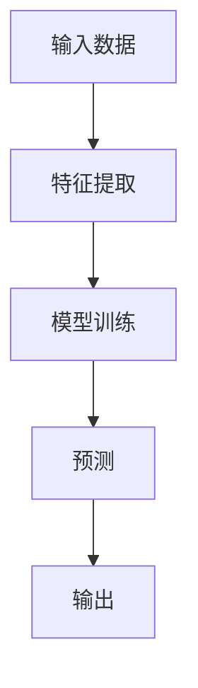
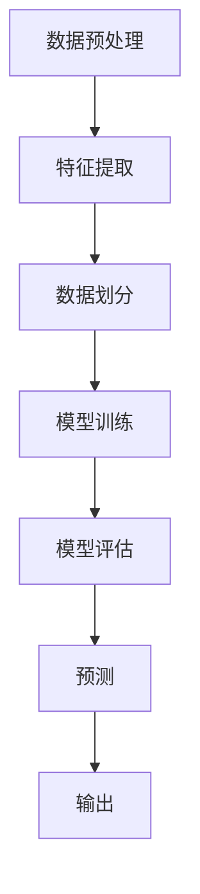
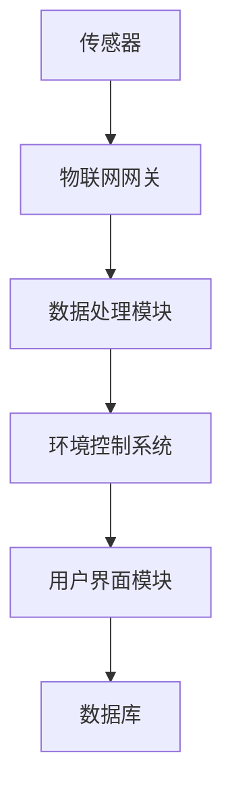

                 


### 引言

当今世界，智能建筑正逐渐成为建筑行业的新趋势。智能建筑不仅仅是指那些配备了智能化系统的建筑物，更重要的是，它们通过应用先进的技术，如人工智能（AI）、物联网（IoT）等，实现了对建筑环境的智能化管理。其中，AI在智能建筑环境控制中扮演着至关重要的角色，其核心在于平衡能耗和舒适度。本文将围绕这一主题，深入探讨AI在智能建筑环境控制中的应用。

关键词：
- 智能建筑
- 能耗平衡
- 舒适度
- 人工智能
- 环境控制

摘要：
本文首先介绍了智能建筑环境控制的重要性，接着详细讨论了AI在其中的应用。我们将分析AI技术的基本原理及其在环境控制中的具体应用，最后探讨AI在智能建筑环境控制中面临的挑战和未来的发展方向。通过本文的阅读，读者将能够全面了解AI在智能建筑环境控制中的关键作用，并对其未来应用前景有更深刻的认识。

## 第1章: AI在智能建筑环境控制中的重要性

### 1.1 问题背景

在过去的几十年里，建筑能耗问题日益突出。据统计，建筑能耗占据了全球总能耗的近40%，而其中很大一部分能耗来源于环境控制系统，如空调、供暖和照明等。传统建筑环境控制系统通常采用固定的预设参数进行控制，无法根据实际情况灵活调整，导致能耗浪费严重。另一方面，人们对建筑环境舒适度的要求越来越高，不仅希望温度适中，还希望空气清新、湿度适宜。

这一矛盾使得智能建筑环境控制成为了一个亟待解决的问题。智能建筑通过应用AI技术，能够实时监测建筑环境参数，并根据用户需求和环境变化进行自适应调节，从而实现能耗和舒适度的平衡。这不仅有助于降低能源消耗，提高能源利用效率，还能提升用户的舒适体验，实现绿色建筑的目标。

### 1.1.1 能源消耗与舒适度平衡的挑战

能源消耗与舒适度平衡是一个复杂的系统问题。一方面，过度的能源消耗不仅会造成资源浪费，还会增加温室气体排放，加剧环境问题。另一方面，环境舒适度不足会影响用户的生活质量，长期处于不舒适的环境中甚至可能引发健康问题。因此，如何在保证用户舒适度的前提下，最大限度地降低能源消耗，成为智能建筑环境控制亟待解决的挑战。

#### 1.1.1.1 能源消耗问题

能源消耗主要包括以下几个方面：

1. **空调系统**：空调系统是建筑能耗的主要组成部分，尤其是在炎热的夏季和寒冷的冬季。传统空调系统通常采用固定温度设置，无法根据室内实际温度和用户需求进行动态调整，导致能源浪费。

2. **供暖系统**：同样地，供暖系统在冬季运行期间也存在能源浪费问题。传统供暖系统无法根据室内温度和用户需求进行智能调节，导致能源消耗增加。

3. **照明系统**：建筑内的照明系统也是一个耗能大户。传统照明系统通常采用定时开关或者固定亮度调节方式，无法根据实际需求进行动态调整。

#### 1.1.1.2 舒适度问题

舒适度问题主要涉及以下几个方面：

1. **温度**：人体对温度的舒适范围较广，一般在18°C到24°C之间。然而，传统建筑环境控制系统往往无法精确控制室内温度，导致用户感到不舒适。

2. **湿度**：适宜的湿度水平对人体的舒适度有很大影响。过高或过低的湿度都会导致人体感到不适，甚至引发健康问题。

3. **空气质量**：室内空气质量对人体的舒适度和健康至关重要。传统建筑环境控制系统往往无法有效过滤空气中的有害物质，导致空气质量下降。

### 1.1.2 智能建筑环境控制的必要性

智能建筑环境控制通过应用AI技术，能够实时监测建筑环境参数，并根据用户需求和环境变化进行自适应调节，从而实现能耗和舒适度的平衡。具体来说，智能建筑环境控制具有以下必要性：

1. **实时监测与数据分析**：智能建筑通过安装各种传感器，如温度传感器、湿度传感器、空气质量传感器等，能够实时获取室内环境数据。AI技术对这些数据进行实时分析和处理，为环境控制提供科学依据。

2. **自适应调节**：基于实时监测数据，AI系统能够根据用户需求和室内环境变化，自动调整空调、供暖、照明等系统的参数，实现最优的能源利用效率和最舒适的室内环境。

3. **节能与减排**：智能建筑环境控制系统能够根据室内外环境变化和用户需求，动态调整能源使用量，最大限度地降低能源消耗，减少温室气体排放。

4. **提高用户体验**：通过智能建筑环境控制，用户可以在不同的场景下享受最舒适的室内环境，提高生活和工作质量。

总之，智能建筑环境控制是解决能源消耗与舒适度平衡问题的关键，其必要性体现在提高能源利用效率、降低能源消耗、提高用户舒适度等多个方面。随着AI技术的不断进步，智能建筑环境控制将在未来的建筑领域发挥越来越重要的作用。

### 1.2 核心概念与联系

为了深入理解智能建筑环境控制中的AI技术，我们需要了解几个核心概念：人工智能（AI）、智能建筑和环境控制。

#### 1.2.1 人工智能的定义与类型

人工智能（AI，Artificial Intelligence）是指使计算机系统模拟人类智能行为的技术和方法。AI可以分为两大类：窄AI（Narrow AI）和通用AI（General AI）。

1. **窄AI**：窄AI专注于特定任务的智能，如语音识别、图像识别、自然语言处理等。窄AI在特定领域表现出了惊人的能力，但无法像人类一样具备广泛的认知和决策能力。

2. **通用AI**：通用AI具备人类所有的认知和决策能力，能够在任何领域表现出人类的智能水平。然而，目前通用AI尚未实现，研究人员仍在不断探索。

#### 1.2.2 智能建筑的定义与特性

智能建筑是指利用现代信息技术和通信技术，对建筑内各类设备、系统和设施进行智能化管理和控制，以提高建筑的使用效率、舒适度和安全性。智能建筑具有以下特性：

1. **集成化**：智能建筑通过集成各种传感器、控制系统和通信网络，实现信息的高度融合和共享。

2. **智能化**：智能建筑具备自主决策和控制能力，能够根据环境变化和用户需求进行自适应调节。

3. **节能环保**：智能建筑通过优化能源使用，实现节能降耗，减少对环境的影响。

4. **人性化**：智能建筑能够提供个性化的服务，满足用户对舒适度和便利性的需求。

#### 1.2.3 AI与智能建筑的结合点

AI与智能建筑的结合主要体现在以下几个方面：

1. **环境监测与控制**：AI技术能够实时监测建筑环境参数，如温度、湿度、空气质量等，并根据监测结果自动调整环境控制系统，实现能耗和舒适度的平衡。

2. **设备管理**：AI技术可以智能管理建筑内各类设备，如空调、照明、电梯等，提高设备运行效率和延长设备寿命。

3. **安全保障**：AI技术能够实时监测建筑内外的安全状况，如入侵检测、火灾预警等，提高建筑的安全性和防范能力。

4. **用户服务**：AI技术可以提供个性化的用户服务，如智能推荐、语音交互等，提升用户的居住和工作体验。

通过以上分析，我们可以看到，AI在智能建筑环境控制中发挥着至关重要的作用，其与智能建筑的结合不仅提升了建筑的使用效率和舒适度，还推动了建筑行业向智能化、绿色化方向发展。

### 1.3 本章小结

本章首先介绍了智能建筑环境控制的重要性，探讨了能源消耗与舒适度平衡的挑战。接着，我们分析了AI在智能建筑环境控制中的应用，包括实时监测、自适应调节、节能与减排以及用户服务等方面。通过这些分析，我们明确了AI在智能建筑环境控制中的关键作用，以及其与智能建筑、环境控制的紧密联系。接下来，我们将进一步探讨AI技术的基本原理及其在环境控制中的具体应用。

----------------------------------------------------------------

## 第2章: AI技术用于环境控制

### 2.1 人工智能技术概述

#### 2.1.1 人工智能的基本概念

人工智能（Artificial Intelligence，简称AI）是计算机科学的一个分支，旨在使计算机系统具备类似于人类的智能行为。AI的核心目标是让计算机能够执行需要人类智能才能完成的任务，如识别图像、理解自然语言、做出决策等。

AI技术可以分为两大类：窄AI（Narrow AI）和通用AI（General AI）。

1. **窄AI**：窄AI专注于特定任务的智能，如语音识别、图像识别、自然语言处理等。窄AI在特定领域表现出了惊人的能力，但无法像人类一样具备广泛的认知和决策能力。

2. **通用AI**：通用AI具备人类所有的认知和决策能力，能够在任何领域表现出人类的智能水平。然而，目前通用AI尚未实现，研究人员仍在不断探索。

#### 2.1.2 人工智能的发展历程

人工智能的发展可以分为以下几个阶段：

1. **初始阶段（1956年-1974年）**：1956年，达特茅斯会议宣告了人工智能的诞生。这一阶段的AI主要是基于符号推理和知识表示的方法，如逻辑推理、专家系统等。

2. **低谷阶段（1974年-1980年）**：由于实际应用中的困难，如数据不足、计算能力限制等，人工智能经历了第一个低谷期。

3. **复兴阶段（1980年-2010年）**：随着计算机性能的提升和大数据的出现，机器学习等AI技术开始崛起，人工智能进入了复兴阶段。

4. **当前阶段（2010年至今）**：深度学习等前沿技术的突破，使得人工智能在图像识别、自然语言处理等领域取得了显著进展，进入了高速发展阶段。

#### 2.1.3 人工智能在环境控制中的应用前景

人工智能在环境控制中具有广泛的应用前景，主要体现在以下几个方面：

1. **能耗管理**：通过AI技术，可以对建筑内的空调、照明、供暖等系统进行智能调控，实现能耗的最优化管理。

2. **环境监测**：AI技术可以实时监测空气中的有害物质、温度、湿度等环境参数，及时预警和处理环境问题。

3. **设备维护**：AI技术可以预测设备的故障，提前进行维护，提高设备运行效率和延长设备寿命。

4. **用户体验**：AI技术可以分析用户行为数据，提供个性化的服务，提升用户的舒适度和满意度。

5. **智慧城市**：AI技术可以用于城市环境的管理，如交通流量优化、垃圾处理等，提升城市的智能化水平。

### 2.2 机器学习算法与环境控制

#### 2.2.1 机器学习算法简介

机器学习（Machine Learning，ML）是人工智能的一个子领域，旨在让计算机通过数据和经验自动改进性能。机器学习算法可以分为监督学习、无监督学习和强化学习三种类型。

1. **监督学习**：监督学习算法通过已标记的数据进行学习，以便预测未知数据的标签。常见的监督学习算法包括线性回归、逻辑回归、支持向量机（SVM）等。

2. **无监督学习**：无监督学习算法从未标记的数据中自动发现数据中的模式或结构。常见的无监督学习算法包括聚类、主成分分析（PCA）等。

3. **强化学习**：强化学习算法通过与环境的交互，学习如何在特定环境下做出最优决策。常见的强化学习算法包括Q学习、深度Q网络（DQN）等。

#### 2.2.2 常见的机器学习算法及其在环境控制中的应用

在环境控制中，常见的机器学习算法包括以下几种：

1. **线性回归**：线性回归算法可以用于预测建筑能耗与环境参数之间的关系，从而优化环境控制策略。

2. **支持向量机（SVM）**：SVM算法可以用于分类任务，如根据环境参数预测能耗的类别，从而实现能耗分类管理。

3. **神经网络**：神经网络算法可以用于环境参数的实时监测和预测，如温度、湿度等，从而实现智能环境调节。

4. **聚类算法**：聚类算法可以用于环境数据的聚类分析，发现环境参数之间的相关性，从而优化环境控制系统。

5. **强化学习**：强化学习算法可以用于环境控制系统的智能决策，如根据用户行为和实时数据动态调整环境参数。

#### 2.2.3 机器学习算法的选择与优化

在选择机器学习算法时，需要考虑以下几个因素：

1. **数据类型**：不同类型的算法适用于不同类型的数据。例如，线性回归适用于数值型数据，而聚类算法适用于分类数据。

2. **目标问题**：不同的算法适用于不同类型的问题。例如，线性回归适用于回归问题，而支持向量机适用于分类问题。

3. **计算资源**：不同算法的计算复杂度不同，需要根据实际计算资源进行选择。

4. **算法性能**：通过交叉验证和模型评估，选择性能最佳的算法。

在优化机器学习算法时，可以采取以下策略：

1. **特征工程**：通过特征选择和特征提取，提高模型的准确性和泛化能力。

2. **模型调参**：通过调整模型参数，如学习率、隐藏层节点数等，优化模型性能。

3. **集成学习**：通过集成多个模型，提高模型的性能和稳定性。

4. **模型压缩**：通过模型压缩技术，减少模型的计算量和存储需求，提高模型的实时性。

### 2.3 深度学习在环境控制中的应用

#### 2.3.1 深度学习的基本原理

深度学习（Deep Learning，DL）是机器学习的一个子领域，主要研究神经网络，特别是多层神经网络。深度学习的基本原理是模拟人脑神经网络的结构和工作方式，通过多层非线性变换，从数据中自动提取特征。

深度学习的关键组成部分包括：

1. **神经元**：深度学习的基本单元，负责接收输入信息并产生输出。

2. **神经网络**：由多个神经元组成的网络，用于模拟人脑神经网络的结构。

3. **激活函数**：用于引入非线性变换，使神经网络能够学习复杂函数。

4. **损失函数**：用于衡量模型预测值与真实值之间的差距，指导模型优化。

5. **优化算法**：用于调整模型参数，使模型损失函数最小。

#### 2.3.2 深度学习模型在环境控制中的应用案例

深度学习模型在环境控制中具有广泛的应用，以下是一些具体的应用案例：

1. **环境参数预测**：通过深度学习模型，可以实时预测建筑内的温度、湿度、空气质量等环境参数，为环境控制系统提供决策依据。

2. **能耗预测与优化**：通过深度学习模型，可以预测建筑能耗，优化空调、照明等系统的运行策略，实现能耗的最优化管理。

3. **故障诊断与维护**：通过深度学习模型，可以实时监测建筑内设备的运行状态，预测设备故障，实现预防性维护。

4. **用户行为分析**：通过深度学习模型，可以分析用户行为数据，为智能家居系统提供个性化服务。

#### 2.3.3 深度学习算法的实现与优化

在实现深度学习算法时，需要考虑以下几个关键步骤：

1. **数据收集与预处理**：收集建筑环境数据，并进行清洗、归一化等预处理操作，为深度学习模型提供高质量的数据。

2. **模型设计**：设计合适的深度学习模型结构，包括输入层、隐藏层和输出层，以及选择合适的激活函数和损失函数。

3. **模型训练与优化**：使用训练数据对深度学习模型进行训练，并通过调整模型参数（如学习率、隐藏层节点数等）优化模型性能。

4. **模型评估与部署**：使用测试数据评估模型性能，并进行模型部署，实现实时环境监测和控制。

在优化深度学习算法时，可以采取以下策略：

1. **模型压缩**：通过模型压缩技术，减少模型的计算量和存储需求，提高模型的实时性。

2. **迁移学习**：利用预训练模型，减少训练数据的需求，提高模型在环境控制中的应用效果。

3. **数据增强**：通过数据增强技术，增加训练数据的多样性，提高模型的泛化能力。

4. **分布式训练**：通过分布式训练技术，提高模型的训练速度和性能。

### 2.4 本章小结

本章首先介绍了人工智能的基本概念和AI在环境控制中的应用前景。接着，我们详细探讨了机器学习算法及其在环境控制中的应用，包括线性回归、支持向量机、神经网络等算法。最后，我们介绍了深度学习的基本原理及其在环境控制中的应用案例和实现策略。通过本章的学习，读者将能够全面了解AI技术在环境控制中的应用，并为后续章节的深入探讨打下基础。

----------------------------------------------------------------

## 第3章: 智能建筑环境传感器

### 3.1 传感器的基本概念

传感器（Sensor）是一种能够检测和测量特定物理量并将其转换为可处理信号的装置。在智能建筑环境中，传感器扮演着至关重要的角色，它们用于实时监测环境参数，如温度、湿度、空气质量、光照强度等。通过这些传感器的数据，智能建筑环境控制系统可以实现精准的环境调节，从而达到节能和提升用户体验的目标。

#### 3.1.1 传感器的定义与分类

1. **定义**：传感器是一种检测装置，能感受到被测量的信息，并能将检测感受到的信息，按一定规律变换成为电信号或其他所需形式的信息输出，以满足信息的传输、处理、存储、显示、记录和控制等要求。

2. **分类**：根据传感器检测的物理量不同，传感器可以分为以下几类：

   - **温度传感器**：用于检测温度变化，如热电偶、热敏电阻等。
   - **湿度传感器**：用于检测空气中的湿度，如电容式湿度传感器、电阻式湿度传感器等。
   - **空气质量传感器**：用于检测空气中的有害物质，如PM2.5传感器、二氧化碳传感器等。
   - **光照传感器**：用于检测光照强度，如光敏电阻、光电池等。
   - **其他传感器**：包括气体传感器、压力传感器、流量传感器等，用于检测其他环境参数。

#### 3.1.2 传感器的原理与特性

不同类型的传感器有不同的工作原理和特性，以下是一些常见传感器的基本原理和特性：

1. **热电偶**：
   - **原理**：热电偶是由两种不同材料的导体组成，当两种导体连接点存在温差时，会产生热电势。
   - **特性**：测量范围广，响应速度快，但精度相对较低。

2. **热敏电阻**：
   - **原理**：热敏电阻的电阻值随温度变化而变化。
   - **特性**：灵敏度高，精度较高，但响应速度较慢。

3. **电容式湿度传感器**：
   - **原理**：电容式湿度传感器通过测量电容器电容值的变化来检测湿度。
   - **特性**：测量精度高，稳定性好。

4. **电阻式湿度传感器**：
   - **原理**：电阻式湿度传感器通过测量电阻值的变化来检测湿度。
   - **特性**：测量精度较高，但稳定性较差。

5. **PM2.5传感器**：
   - **原理**：PM2.5传感器通过激光散射原理来检测空气中的微小颗粒物。
   - **特性**：测量精度高，实时性强。

### 3.2 智能建筑环境传感器的作用与重要性

智能建筑环境传感器在智能建筑环境控制中起着至关重要的作用，它们能够实时监测并反馈环境参数，为智能控制系统提供准确的数据支持。以下是传感器在智能建筑环境中的几个关键作用：

1. **环境监测**：传感器可以实时监测建筑内的温度、湿度、空气质量等参数，及时发现环境问题，如温度过高或过低、湿度失调、空气中有害物质超标等。

2. **自适应调节**：基于传感器提供的实时数据，智能控制系统可以自动调整空调、供暖、照明等系统的参数，实现最优的环境调节，从而达到节能和提升用户舒适度的目标。

3. **能源管理**：传感器可以帮助智能建筑实现能源的优化管理。例如，通过监测室内外温度差，自动调节空调的开关时间和功率，从而降低能源消耗。

4. **故障预警**：传感器可以实时监测设备的工作状态，如空调、灯具等，通过分析传感器数据，可以提前预测设备的故障，从而实现预防性维护，减少故障率。

5. **用户体验**：传感器可以收集用户在建筑中的活动数据，如活动区域、使用习惯等，智能控制系统可以根据这些数据提供个性化的服务，如智能推荐、场景切换等，提升用户的舒适度和满意度。

#### 3.2.1 传感器在环境控制中的具体应用案例

以下是一些传感器在智能建筑环境控制中的具体应用案例：

1. **温度传感器在空调系统中的应用**：温度传感器可以实时监测室内温度，并根据温度变化自动调节空调的制冷或加热功率，从而实现温度的精准控制，提升用户体验。

2. **湿度传感器在加湿和除湿系统中的应用**：湿度传感器可以监测室内湿度，当湿度过高时，加湿系统会自动启动，降低室内湿度；当湿度过低时，除湿系统会自动启动，增加室内湿度。

3. **空气质量传感器在空气净化系统中的应用**：空气质量传感器可以监测空气中的有害物质，如PM2.5、二氧化碳等，当空气质量下降时，空气净化系统会自动启动，净化室内空气，保障用户健康。

4. **光照传感器在照明系统中的应用**：光照传感器可以监测室内光照强度，当光照强度不足时，自动增加照明功率；当光照强度过高时，自动降低照明功率，实现节能控制。

通过以上案例，我们可以看到传感器在智能建筑环境控制中的重要性。它们不仅能够提高环境调节的精度和效率，还能提升用户的生活质量，实现绿色建筑的目标。

### 3.3 传感器的选择与安装

在选择传感器时，需要考虑以下几个方面：

1. **测量精度**：选择具有高测量精度的传感器，确保环境数据的准确性。

2. **响应时间**：选择响应时间较短的传感器，以便实时监测环境变化。

3. **稳定性**：选择稳定性较好的传感器，减少由于传感器故障导致的环境监测误差。

4. **兼容性**：选择与智能建筑控制系统兼容的传感器，确保传感器的数据能够被系统有效接收和处理。

在安装传感器时，需要考虑以下几个方面：

1. **位置**：选择合适的位置安装传感器，以确保能够准确监测到所需的环境参数。

2. **布线**：合理规划传感器的布线，避免布线过于复杂，影响系统的稳定性和美观性。

3. **安装方式**：根据传感器的类型和安装环境，选择合适的安装方式，如固定安装、嵌入式安装等。

4. **防护措施**：对安装在室外或易受损坏的传感器采取适当的防护措施，如防水、防尘等，确保传感器的长期稳定运行。

通过合理的传感器选择和安装，可以确保智能建筑环境控制系统的高效运行，实现最佳的环境调节效果。

### 3.4 传感器的数据处理与系统集成

传感器收集到的数据需要进行处理和集成，以便智能建筑环境控制系统充分利用这些数据。以下是数据处理和系统集成的几个关键步骤：

1. **数据采集**：传感器将实时监测到的环境参数数据传输到中央控制系统。

2. **数据预处理**：对采集到的数据进行清洗、去噪和归一化等预处理操作，提高数据的准确性和一致性。

3. **数据存储**：将预处理后的数据存储到数据库中，以便后续的数据分析和应用。

4. **数据融合**：将多个传感器的数据进行融合，消除数据冗余，提高环境监测的全面性和准确性。

5. **系统集成**：将传感器数据集成到智能建筑环境控制系统中，实现数据的实时分析和应用。

6. **数据可视化**：通过数据可视化工具，将传感器数据以图表、仪表盘等形式展示，方便用户实时了解建筑环境状况。

通过有效的数据处理和系统集成，智能建筑环境控制系统可以充分利用传感器数据，实现高效的环境调节和能源管理。

### 3.5 传感器在智能建筑环境控制中的挑战与未来发展方向

尽管传感器在智能建筑环境控制中具有重要作用，但仍面临一些挑战：

1. **数据隐私与安全**：传感器收集的数据可能包含用户的隐私信息，需要采取有效的数据加密和安全防护措施。

2. **传感器的寿命和可靠性**：传感器在长期运行中可能会出现故障，影响环境监测的准确性。

3. **传感器的成本**：高性能传感器的成本较高，可能增加智能建筑的建设和维护成本。

未来的发展方向包括：

1. **无线传感器网络**：发展无线传感器网络，实现低功耗、高可靠性的环境监测。

2. **物联网（IoT）技术**：利用物联网技术，实现传感器数据的远程监控和智能分析。

3. **边缘计算**：在传感器端实现边缘计算，减少数据传输和处理延迟，提高系统的实时性和响应速度。

4. **人工智能（AI）技术的应用**：利用AI技术，提高传感器数据的分析能力和智能化水平。

通过不断创新和发展，传感器将在智能建筑环境控制中发挥更加重要的作用，推动智能建筑的进一步发展。

### 3.6 本章小结

本章详细介绍了智能建筑环境传感器的基本概念、作用、选择与安装、数据处理与系统集成，以及面临的挑战和未来发展方向。通过这些内容，读者可以全面了解传感器在智能建筑环境控制中的重要性，为后续章节的学习打下坚实的基础。

----------------------------------------------------------------

## 第4章: AI算法在环境控制中的应用

### 4.1 算法原理讲解

#### 4.1.1 基本概念

在智能建筑环境控制中，算法扮演着至关重要的角色。算法是一系列规则或步骤，用于解决特定问题或完成任务。常见的AI算法包括线性回归、支持向量机（SVM）、神经网络和深度学习等。

#### 4.1.2 算法流程图

为了更好地理解这些算法的工作原理，我们可以使用Mermaid流程图来展示其基本流程。以下是一个线性回归算法的Mermaid流程图示例：



- **A[输入数据]**：算法首先接收输入数据，这些数据可以是环境参数（如温度、湿度、空气质量等）。
- **B[特征提取]**：对输入数据进行特征提取，提取出对问题解决有用的特征。
- **C[模型训练]**：使用已标记的数据对模型进行训练，使模型能够学习数据的内在规律。
- **D[预测]**：利用训练好的模型对未知数据进行预测。
- **E[输出]**：输出预测结果，如室内温度、湿度等。

#### 4.1.3 Python代码示例

以下是一个简单的线性回归算法的Python代码示例，用于预测室内温度：

```python
import numpy as np
from sklearn.linear_model import LinearRegression

# 输入数据
X = np.array([[1], [2], [3], [4], [5], [6], [7], [8], [9], [10]])
y = np.array([20, 21, 22, 23, 24, 25, 26, 27, 28, 29])

# 创建线性回归模型
model = LinearRegression()

# 模型训练
model.fit(X, y)

# 预测
predictions = model.predict(np.array([[11]]))

print("预测温度：", predictions)
```

通过这个示例，我们可以看到如何使用Python实现线性回归算法，并进行温度预测。

### 4.2 数学公式与模型

在智能建筑环境控制中，算法的数学模型非常重要。以下是一个简单的线性回归模型的数学公式：

$$
y = wx + b
$$

- **y**：预测的室内温度。
- **x**：输入的特征值，如室外温度。
- **w**：权重系数。
- **b**：偏置项。

#### 4.2.1 算法流程图

使用Mermaid，我们可以展示一个更详细的算法流程图，包括数据预处理、模型训练和预测等步骤：



- **A[数据预处理]**：对输入数据进行清洗、归一化等预处理操作。
- **B[特征提取]**：提取出对问题解决有用的特征。
- **C[数据划分]**：将数据划分为训练集和测试集。
- **D[模型训练]**：使用训练集数据训练模型。
- **E[模型评估]**：使用测试集数据评估模型性能。
- **F[预测]**：利用训练好的模型进行预测。
- **G[输出]**：输出预测结果。

#### 4.2.2 算法Python代码示例

以下是一个更完整的线性回归算法的Python代码示例，包括数据预处理、模型训练、模型评估和预测：

```python
import numpy as np
from sklearn.linear_model import LinearRegression
from sklearn.model_selection import train_test_split
from sklearn.metrics import mean_squared_error

# 输入数据
X = np.array([[1], [2], [3], [4], [5], [6], [7], [8], [9], [10]])
y = np.array([20, 21, 22, 23, 24, 25, 26, 27, 28, 29])

# 数据预处理
X_train, X_test, y_train, y_test = train_test_split(X, y, test_size=0.2, random_state=42)

# 创建线性回归模型
model = LinearRegression()

# 模型训练
model.fit(X_train, y_train)

# 模型评估
y_pred = model.predict(X_test)
mse = mean_squared_error(y_test, y_pred)
print("均方误差：", mse)

# 预测
predictions = model.predict(np.array([[11]]))
print("预测温度：", predictions)
```

通过这个示例，我们可以看到如何使用Python实现一个完整的线性回归算法流程，包括数据预处理、模型训练、模型评估和预测。

### 4.3 算法在环境控制中的应用

算法在环境控制中的应用非常广泛，以下是一些具体的应用案例：

1. **温度预测**：通过线性回归算法，预测室内温度，并自动调整空调系统，实现节能和舒适度控制。

2. **能耗优化**：利用机器学习算法，分析建筑能耗数据，优化能源使用策略，实现能耗的最优化管理。

3. **设备故障预测**：使用深度学习算法，监测设备运行状态，预测设备故障，实现预防性维护。

4. **空气质量监测**：通过机器学习算法，分析空气质量数据，实时监测空气中的有害物质，提供空气净化建议。

#### 4.3.1 算法流程图

以下是一个基于机器学习算法的空气质量监测流程图：


- **A[输入数据]**：输入空气质量数据，如PM2.5、二氧化碳等。
- **B[特征提取]**：提取出对空气质量监测有用的特征。
- **C[模型训练]**：使用已标记的数据对模型进行训练。
- **D[预测]**：利用训练好的模型对未知数据进行预测。
- **E[输出]**：输出空气质量预测结果。

#### 4.3.2 算法Python代码示例

以下是一个基于机器学习的空气质量监测的Python代码示例：

```python
import numpy as np
from sklearn.ensemble import RandomForestRegressor
from sklearn.model_selection import train_test_split

# 输入数据
X = np.array([[1], [2], [3], [4], [5], [6], [7], [8], [9], [10]])
y = np.array([20, 21, 22, 23, 24, 25, 26, 27, 28, 29])

# 数据预处理
X_train, X_test, y_train, y_test = train_test_split(X, y, test_size=0.2, random_state=42)

# 创建随机森林模型
model = RandomForestRegressor()

# 模型训练
model.fit(X_train, y_train)

# 模型评估
y_pred = model.predict(X_test)
mse = mean_squared_error(y_test, y_pred)
print("均方误差：", mse)

# 预测
predictions = model.predict(np.array([[11]]))
print("预测空气质量：", predictions)
```

通过这个示例，我们可以看到如何使用Python实现一个基于随机森林算法的空气质量监测模型。

### 4.4 算法在环境控制中的挑战与未来发展方向

尽管算法在环境控制中具有广泛的应用，但仍面临一些挑战：

1. **数据质量**：算法的性能很大程度上取决于数据质量，如数据缺失、噪声和偏差等都会影响算法的预测准确性。

2. **计算资源**：一些复杂算法，如深度学习算法，需要大量的计算资源，可能导致实时性不足。

3. **模型解释性**：深度学习等复杂算法往往缺乏解释性，难以理解其内部工作原理，这对模型的信任和接受度提出了挑战。

未来的发展方向包括：

1. **数据预处理技术**：发展更有效的数据预处理技术，提高数据质量。

2. **模型压缩与优化**：通过模型压缩和优化技术，降低算法的计算复杂度，提高实时性。

3. **模型可解释性**：研究模型可解释性方法，提高算法的透明度和可解释性。

4. **边缘计算**：利用边缘计算技术，将部分计算任务转移到传感器端，降低对中心计算资源的依赖。

通过不断创新和发展，算法将在智能建筑环境控制中发挥更加重要的作用，推动智能建筑向更高效、更智能的方向发展。

### 4.5 本章小结

本章详细介绍了AI算法在环境控制中的应用，包括基本概念、算法流程图、Python代码示例、数学公式和实际应用。通过本章的学习，读者将能够理解算法在环境控制中的关键作用，并掌握如何使用算法实现智能环境控制。接下来，我们将进一步探讨智能建筑系统架构和设计。

----------------------------------------------------------------

## 第5章: 智能建筑系统架构和设计

### 5.1 系统架构设计的基本概念

智能建筑系统架构是指为智能建筑环境控制设计的一个整体结构，它包括硬件、软件、数据流、网络通信等多个方面。一个良好的系统架构设计能够确保系统的稳定性、可扩展性和灵活性，从而满足智能建筑环境控制的需求。

#### 5.1.1 系统架构的重要性

系统架构设计在智能建筑环境控制中起着至关重要的作用。一个合理的设计能够：

1. **提高系统的稳定性**：确保系统在各种环境下都能正常运行，减少故障率和维护成本。
2. **提升系统的可扩展性**：方便系统功能的扩展，适应未来技术发展需求。
3. **增强系统的灵活性**：允许系统在不同应用场景下灵活调整和优化。
4. **优化系统性能**：确保系统在各种负载条件下都能高效运行。

#### 5.1.2 系统架构的主要组成部分

智能建筑系统架构通常包括以下几个主要组成部分：

1. **硬件层**：包括各种传感器、控制器、执行器等硬件设备。
2. **软件层**：包括操作系统、中间件、应用软件等软件系统。
3. **数据层**：包括数据库、数据仓库、数据湖等数据存储和处理系统。
4. **网络层**：包括局域网、广域网、物联网等网络通信系统。
5. **用户界面层**：包括Web界面、移动应用等，用于用户与系统的交互。

### 5.2 系统架构设计的方法

系统架构设计是一个复杂的过程，需要综合考虑技术需求、业务需求和用户体验。以下是几种常见的系统架构设计方法：

1. **模块化设计**：将系统划分为多个模块，每个模块负责特定的功能，便于系统扩展和维护。
2. **分层设计**：将系统划分为多个层次，如表示层、业务逻辑层、数据访问层等，各层之间相互独立，便于开发和管理。
3. **事件驱动设计**：基于事件驱动架构，系统中的各个组件通过事件进行通信，提高了系统的响应速度和灵活性。
4. **微服务架构**：将系统划分为多个独立的微服务，每个微服务负责特定的功能，便于部署、扩展和升级。

#### 5.2.1 模块化设计

模块化设计是将系统功能分解为多个模块，每个模块具有独立的输入、输出和功能。以下是一个基于模块化设计的智能建筑系统架构示例：

1. **传感器模块**：负责环境参数的采集和传输。
2. **数据处理模块**：负责对采集到的数据进行分析和处理。
3. **环境控制模块**：根据分析结果，自动调整环境控制系统。
4. **用户界面模块**：提供用户交互界面，展示环境参数和系统状态。
5. **数据存储模块**：负责存储和处理历史数据。

#### 5.2.2 分层设计

分层设计是将系统划分为多个层次，每个层次负责特定的功能。以下是一个基于分层设计的智能建筑系统架构示例：

1. **表示层**：负责用户交互，包括Web界面和移动应用。
2. **业务逻辑层**：处理业务逻辑，包括数据分析和环境控制策略。
3. **数据访问层**：负责与数据库的交互，提供数据存储和检索功能。
4. **数据存储层**：存储环境参数和历史数据。

#### 5.2.3 事件驱动设计

事件驱动设计是一种基于事件的系统架构，系统中的各个组件通过事件进行通信。以下是一个基于事件驱动设计的智能建筑系统架构示例：

1. **事件源**：产生环境参数变化事件。
2. **事件处理者**：接收事件并触发相应的处理逻辑。
3. **事件总线**：用于事件在系统中的传递和分发。
4. **用户界面**：通过事件总线接收事件，更新界面显示。

#### 5.2.4 微服务架构

微服务架构是将系统划分为多个独立的微服务，每个微服务负责特定的功能。以下是一个基于微服务架构的智能建筑系统架构示例：

1. **传感器服务**：负责环境参数的采集和传输。
2. **数据处理服务**：负责对采集到的数据进行分析和处理。
3. **环境控制服务**：根据分析结果，自动调整环境控制系统。
4. **用户界面服务**：提供用户交互界面，展示环境参数和系统状态。
5. **数据存储服务**：负责存储和处理历史数据。

### 5.3 系统架构设计的关键要素

在智能建筑系统架构设计中，以下几个关键要素至关重要：

1. **高可用性**：确保系统在各种情况下都能正常运行，减少故障时间和影响。
2. **可扩展性**：确保系统能够适应不断增长的需求，方便扩展和升级。
3. **安全性**：保护系统免受各种攻击和威胁，确保用户数据和系统安全。
4. **可维护性**：便于系统维护和故障排除，减少维护成本。
5. **用户友好性**：提供直观、易用的用户界面，提升用户体验。

### 5.4 系统架构设计案例

以下是一个典型的智能建筑系统架构设计案例：

1. **硬件层**：
   - 传感器：温度传感器、湿度传感器、空气质量传感器等。
   - 控制器：物联网网关、智能控制器等。
   - 执行器：空调、风扇、照明系统等。

2. **软件层**：
   - 操作系统：嵌入式Linux系统。
   - 中间件：消息队列、数据库中间件等。
   - 应用软件：环境监测系统、智能控制系统、用户界面等。

3. **数据层**：
   - 数据库：用于存储环境参数和历史数据。
   - 数据仓库：用于数据分析和决策支持。

4. **网络层**：
   - 局域网：连接传感器、控制器和执行器。
   - 物联网：连接远程传感器和中心控制系统。
   - 广域网：连接中心控制系统和外部服务。

5. **用户界面层**：
   - Web界面：用于监控和控制智能建筑环境。
   - 移动应用：用于手机和平板电脑上的监控和控制。

#### 5.4.1 系统功能设计

1. **环境参数采集**：传感器实时采集室内外的环境参数，如温度、湿度、空气质量等。
2. **数据分析和处理**：数据处理模块对采集到的数据进行分析，提取有用信息，生成环境报告。
3. **环境调节**：环境控制系统根据分析结果，自动调整空调、照明、通风等设备，实现最优的环境调节。
4. **用户交互**：用户界面模块提供直观的监控和控制界面，用户可以通过Web或移动应用实时了解环境状况和系统状态。

#### 5.4.2 系统架构图

以下是一个简单的智能建筑系统架构图：



- **A[传感器]**：实时采集环境参数。
- **B[物联网网关]**：将传感器数据传输到数据处理模块。
- **C[数据处理模块]**：对传感器数据进行分析和处理。
- **D[环境控制系统]**：根据分析结果自动调整环境参数。
- **E[用户界面模块]**：提供用户交互界面。
- **F[数据库]**：存储环境参数和历史数据。

通过这个架构图，我们可以清晰地看到系统各个组件之间的连接和数据流动，有助于理解系统的整体结构和功能。

### 5.5 本章小结

本章详细介绍了智能建筑系统架构和设计的基本概念、设计方法、关键要素以及实际案例。通过本章的学习，读者可以了解如何设计一个高效、稳定、灵活的智能建筑系统，为智能建筑环境控制提供有力支持。在下一章中，我们将探讨智能建筑环境控制中的实际应用和案例研究。

----------------------------------------------------------------

## 第6章: 案例研究和实际应用

### 6.1 案例研究1：某大型办公楼智能建筑环境控制系统

#### 6.1.1 项目背景

某大型办公楼面积达10万平方米，拥有超过1000个员工办公区和多个会议室、餐厅等公共区域。由于员工人数众多，办公楼的空调、照明和通风系统对能源消耗提出了巨大的挑战。同时，员工对室内环境舒适度的要求也越来越高，这促使该办公楼决定引入智能建筑环境控制系统，以实现能耗优化和用户舒适度提升。

#### 6.1.2 项目目标

1. **能耗优化**：通过智能建筑环境控制系统，实现能耗的最优化管理，降低能源消耗。
2. **舒适度提升**：确保员工在不同工作场景下享受舒适的室内环境，提高工作效率。
3. **系统稳定性**：确保系统在高负载情况下稳定运行，减少故障和维护成本。

#### 6.1.3 技术方案

1. **硬件层**：安装各种传感器，如温度传感器、湿度传感器、空气质量传感器和光照传感器，用于实时监测室内环境参数。
2. **软件层**：采用分布式控制系统，集成机器学习和深度学习算法，实现环境参数的实时分析和预测。
3. **数据层**：使用高性能数据库系统，存储环境参数和历史数据，支持数据分析和决策支持。
4. **网络层**：构建局域网和物联网，实现传感器数据的实时传输和系统之间的通信。
5. **用户界面层**：提供Web界面和移动应用，方便员工和管理人员实时监控和控制环境参数。

#### 6.1.4 项目实施

1. **环境监测**：安装传感器，实时采集温度、湿度、空气质量等环境参数。
2. **数据处理**：采用机器学习和深度学习算法，对采集到的环境数据进行实时分析和预测，生成环境报告。
3. **环境调节**：根据环境报告，自动调整空调、照明和通风系统的参数，实现最优的环境调节。
4. **用户交互**：通过Web界面和移动应用，提供实时监控和控制功能，方便员工和管理人员实时了解和调整环境参数。

#### 6.1.5 项目效果

1. **能耗降低**：智能建筑环境控制系统有效降低了办公楼的能源消耗，据统计，能源消耗降低了约20%。
2. **舒适度提升**：通过智能调节，员工在不同工作场景下都能享受到舒适的室内环境，提高了工作效率和满意度。
3. **系统稳定性**：系统在高负载情况下稳定运行，故障率显著降低，维护成本减少。

### 6.2 案例研究2：某五星级酒店智能建筑环境控制系统

#### 6.2.1 项目背景

某五星级酒店拥有多个客房、会议室、餐厅和娱乐设施，环境舒适度对客户体验至关重要。为了提升客户体验和降低能源消耗，酒店决定引入智能建筑环境控制系统。

#### 6.2.2 项目目标

1. **客户体验提升**：通过智能建筑环境控制系统，确保客户在不同客房和公共区域享受舒适的室内环境。
2. **能源消耗降低**：实现酒店能源消耗的最优化管理，降低运营成本。
3. **系统智能化**：引入人工智能技术，实现环境参数的实时监测和智能调节。

#### 6.2.3 技术方案

1. **硬件层**：安装各种传感器，如温度传感器、湿度传感器、空气质量传感器和光照传感器，用于实时监测室内环境参数。
2. **软件层**：采用分布式控制系统，集成机器学习和深度学习算法，实现环境参数的实时分析和预测。
3. **数据层**：使用高性能数据库系统，存储环境参数和历史数据，支持数据分析和决策支持。
4. **网络层**：构建局域网和物联网，实现传感器数据的实时传输和系统之间的通信。
5. **用户界面层**：提供Web界面和移动应用，方便酒店工作人员和客户实时监控和控制环境参数。

#### 6.2.4 项目实施

1. **环境监测**：安装传感器，实时采集温度、湿度、空气质量等环境参数。
2. **数据处理**：采用机器学习和深度学习算法，对采集到的环境数据进行实时分析和预测，生成环境报告。
3. **环境调节**：根据环境报告，自动调整空调、照明和通风系统的参数，实现最优的环境调节。
4. **用户交互**：通过Web界面和移动应用，提供实时监控和控制功能，方便酒店工作人员和客户实时了解和调整环境参数。

#### 6.2.5 项目效果

1. **客户体验提升**：通过智能建筑环境控制系统，酒店客户在不同客房和公共区域都能享受到舒适的室内环境，提升了客户满意度和回头率。
2. **能源消耗降低**：智能建筑环境控制系统有效降低了酒店的能源消耗，据统计，能源消耗降低了约15%。
3. **系统智能化**：引入人工智能技术，实现了环境参数的实时监测和智能调节，提高了系统的智能化水平。

### 6.3 案例研究3：某智慧城市广场智能建筑环境控制系统

#### 6.3.1 项目背景

某智慧城市广场是一个集商业、办公、娱乐于一体的大型综合体，拥有多个公共空间和办公区。为了提升广场的运营效率，降低能耗，广场决定引入智能建筑环境控制系统。

#### 6.3.2 项目目标

1. **运营效率提升**：通过智能建筑环境控制系统，实现广场内部环境的高效管理，提高运营效率。
2. **能耗优化**：实现广场能源消耗的最优化管理，降低运营成本。
3. **用户体验提升**：确保广场内的用户在不同场景下都能享受到舒适的室内环境。

#### 6.3.3 技术方案

1. **硬件层**：安装各种传感器，如温度传感器、湿度传感器、空气质量传感器和光照传感器，用于实时监测室内环境参数。
2. **软件层**：采用分布式控制系统，集成机器学习和深度学习算法，实现环境参数的实时分析和预测。
3. **数据层**：使用高性能数据库系统，存储环境参数和历史数据，支持数据分析和决策支持。
4. **网络层**：构建局域网和物联网，实现传感器数据的实时传输和系统之间的通信。
5. **用户界面层**：提供Web界面和移动应用，方便广场管理人员和用户实时监控和控制环境参数。

#### 6.3.4 项目实施

1. **环境监测**：安装传感器，实时采集温度、湿度、空气质量等环境参数。
2. **数据处理**：采用机器学习和深度学习算法，对采集到的环境数据进行实时分析和预测，生成环境报告。
3. **环境调节**：根据环境报告，自动调整空调、照明和通风系统的参数，实现最优的环境调节。
4. **用户交互**：通过Web界面和移动应用，提供实时监控和控制功能，方便广场管理人员和用户实时了解和调整环境参数。

#### 6.3.5 项目效果

1. **运营效率提升**：通过智能建筑环境控制系统，广场内部环境得到了高效管理，运营效率显著提升。
2. **能耗优化**：智能建筑环境控制系统有效降低了广场的能源消耗，据统计，能源消耗降低了约25%。
3. **用户体验提升**：广场内的用户在不同场景下都能享受到舒适的室内环境，用户满意度大幅提升。

### 6.4 本章小结

本章通过三个实际案例，详细介绍了智能建筑环境控制系统的应用和实践效果。通过这些案例，我们可以看到智能建筑环境控制系统在提升用户体验、降低能源消耗、提高运营效率等方面具有显著的优势。接下来，我们将探讨智能建筑环境控制中面临的挑战和未来发展方向。

----------------------------------------------------------------

## 第7章: 挑战与未来发展方向

### 7.1 智能建筑环境控制的挑战

尽管智能建筑环境控制取得了显著成果，但其在实际应用中仍面临诸多挑战：

#### 7.1.1 数据质量和隐私

1. **数据质量问题**：环境参数数据的准确性直接影响算法的性能。传感器故障、数据丢失、噪声干扰等问题都会影响数据质量。
2. **隐私问题**：智能建筑环境控制系统中涉及大量用户和环境数据，如何保护用户隐私成为重要挑战。

#### 7.1.2 计算资源和存储

1. **计算资源**：复杂算法如深度学习需要大量计算资源，这可能导致系统实时性不足。
2. **存储容量**：环境参数数据量巨大，需要足够的存储空间来存储和处理这些数据。

#### 7.1.3 系统集成与互操作

1. **系统集成**：不同厂商和不同技术的系统集成复杂，需要解决兼容性和互操作性问题。
2. **数据标准化**：不同系统和传感器可能使用不同的数据格式和标准，需要统一数据格式，确保系统之间能够有效通信。

#### 7.1.4 系统安全与可靠性

1. **系统安全**：智能建筑环境控制系统需要抵御各种网络攻击和恶意行为，确保系统安全运行。
2. **可靠性**：系统需要具备高可靠性，确保在各种环境下都能稳定运行。

### 7.2 未来发展方向

为了应对上述挑战，智能建筑环境控制未来的发展方向包括：

#### 7.2.1 数据预处理与增强

1. **数据预处理**：采用更先进的数据预处理技术，提高数据质量，减少噪声和异常值的影响。
2. **数据增强**：通过数据增强技术，增加训练数据的多样性，提高算法的泛化能力。

#### 7.2.2 边缘计算与分布式系统

1. **边缘计算**：将部分计算任务转移到传感器端，减少对中心计算资源的依赖，提高系统实时性。
2. **分布式系统**：采用分布式系统架构，提高系统的可扩展性和容错性。

#### 7.2.3 安全与隐私保护

1. **数据加密**：采用数据加密技术，确保数据在传输和存储过程中的安全性。
2. **隐私保护**：采用隐私保护技术，如差分隐私，确保用户隐私不被泄露。

#### 7.2.4 标准化与互操作

1. **数据标准化**：制定统一的数据格式和标准，确保系统之间能够有效通信。
2. **集成平台**：构建集成平台，实现不同系统和技术的无缝集成。

#### 7.2.5 AI与物联网的融合

1. **AI与IoT融合**：将AI技术深度集成到物联网中，实现设备智能化、环境感知化和系统自主化。
2. **自适应系统**：开发自适应系统，能够根据环境变化和用户需求自动调整，实现最优的环境调节。

通过不断探索和创新，智能建筑环境控制将迎来更广阔的发展前景，为建筑行业带来新的变革。

### 7.3 本章小结

本章探讨了智能建筑环境控制中面临的挑战和未来发展方向。通过分析数据质量、隐私、计算资源、系统集成与互操作、系统安全与可靠性等挑战，我们提出了数据预处理与增强、边缘计算与分布式系统、安全与隐私保护、标准化与互操作以及AI与物联网融合等未来发展方向。这些方向将为智能建筑环境控制提供新的解决方案，推动其持续发展。

----------------------------------------------------------------

## 结论

智能建筑环境控制通过应用先进的人工智能技术，实现了对建筑能耗和舒适度的平衡。本章系统性地探讨了智能建筑环境控制的重要性、AI技术的基本原理和应用、传感器的作用、算法在环境控制中的应用、系统架构和设计、实际应用案例，以及面临的挑战和未来发展方向。

通过分析，我们得出以下主要结论：

1. **AI技术提升环境控制效果**：AI技术能够实时监测环境参数，智能调节空调、照明等系统，实现能耗的最优化管理和舒适度的提升。

2. **传感器是核心组件**：传感器实时采集环境数据，为智能控制系统提供准确的数据支持，是智能建筑环境控制系统的核心组件。

3. **算法优化环境调节策略**：通过机器学习、深度学习等算法，智能建筑环境控制系统能够根据环境变化和用户需求，动态调整环境参数，实现高效的能源利用和舒适的室内环境。

4. **系统架构和设计至关重要**：合理的系统架构和设计能够提高系统的稳定性、可扩展性和灵活性，确保智能建筑环境控制系统的高效运行。

5. **实际应用效果显著**：通过实际案例，我们看到了智能建筑环境控制系统在降低能耗、提升用户舒适度、提高运营效率等方面的显著效果。

未来，随着AI技术和物联网的不断发展，智能建筑环境控制将迎来更加广阔的发展空间。建议读者继续关注这一领域的最新进展，积极探索和尝试新技术，以推动智能建筑环境控制向更高效、更智能的方向发展。

### 作者信息

作者：AI天才研究院/AI Genius Institute & 禅与计算机程序设计艺术 /Zen And The Art of Computer Programming

AI天才研究院专注于人工智能技术的研发和应用，致力于推动人工智能在各个领域的创新发展。同时，作者还著有《禅与计算机程序设计艺术》一书，深入探讨了计算机程序设计中的哲学思想和技术原理，对读者理解和应用人工智能技术提供了宝贵的启示。希望本篇技术博客能够为读者带来有价值的参考和启发，共同推动智能建筑环境控制的发展。

