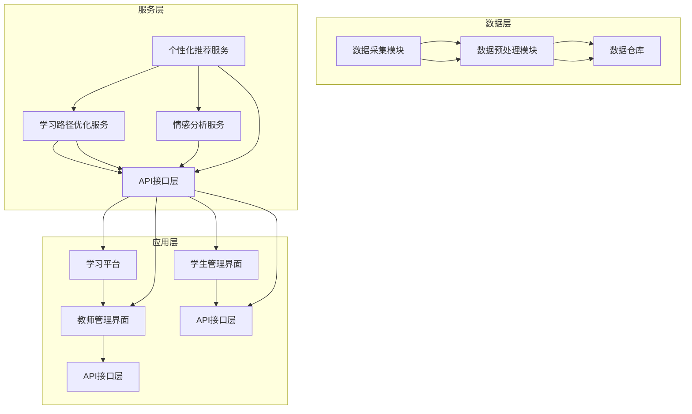
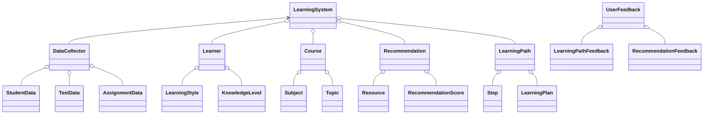
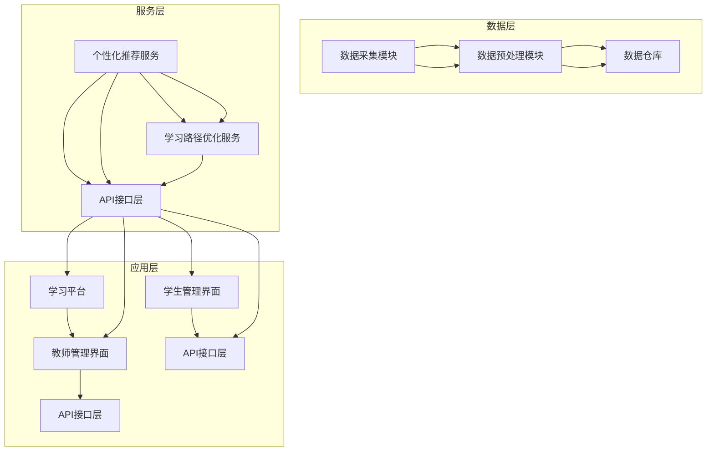
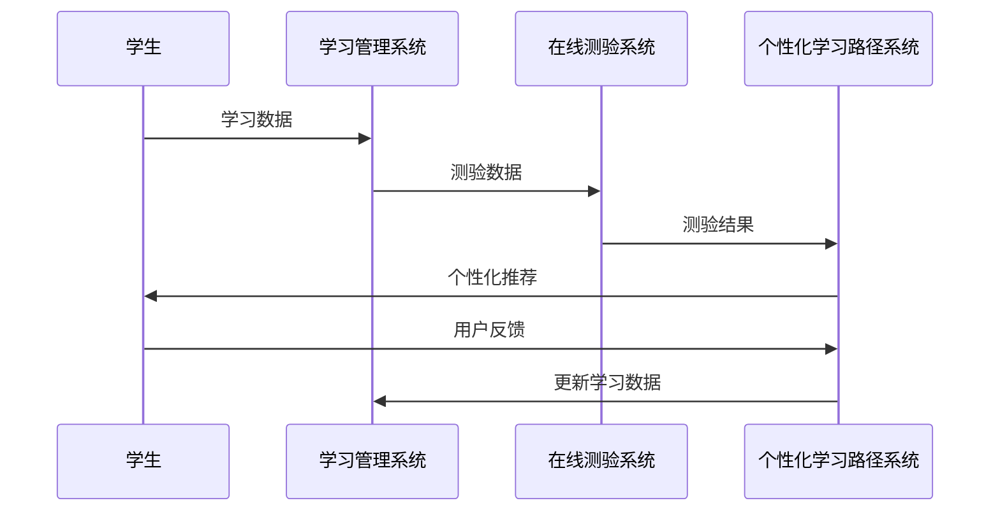

                 

### 文章标题

《AI在智能教育系统中的应用：个性化学习路径设计》

### 关键词

- 人工智能
- 智能教育
- 个性化学习
- 学习路径设计
- 机器学习
- 深度学习
- 自然语言处理

### 摘要

本文深入探讨了人工智能在智能教育系统中的应用，尤其是个性化学习路径设计。通过分析机器学习、深度学习和自然语言处理等核心技术，本文阐述了如何利用AI技术优化学习路径，提高教育效率和学生满意度。文章还结合实际案例，展示了AI在教育系统中的成功应用，并提出了未来发展的方向和挑战。

---

## 目录大纲

```
# 《AI在智能教育系统中的应用：个性化学习路径设计》目录大纲

## 第一部分：AI与智能教育概述

### 第1章：AI与个性化学习的背景和重要性
### 第2章：AI基础概念

## 第二部分：个性化学习路径设计方法

### 第3章：数据驱动的学习路径设计
### 第4章：AI驱动的学习路径优化

## 第三部分：个性化学习路径设计实战

### 第5章：教育系统的AI架构设计与实现
### 第6章：案例分析
### 第7章：最佳实践与未来展望
```

### 第1章：AI与个性化学习的背景和重要性

#### 1.1 AI在教育领域的发展历程

人工智能（AI）作为一门交叉学科，涵盖了计算机科学、数学、统计学、神经科学等多个领域。自20世纪50年代人工智能概念提出以来，它经历了多个阶段的发展，从最初的逻辑推理、知识表示到现代的机器学习和深度学习。随着计算能力的提升和大数据的涌现，AI技术在教育领域的应用日益广泛。

教育领域对AI技术的关注可以追溯到20世纪90年代的智能导师系统。这些系统利用规则推理和知识表示技术为学生提供个性化的学习支持。然而，随着机器学习尤其是深度学习的兴起，教育系统的智能化水平得到了显著提升。现代的智能教育系统不再局限于提供标准化的教学内容，而是能够根据学生的个性化需求进行动态调整。

#### 1.2 个性化学习的概念与意义

个性化学习是指根据每个学生的特点、需求和能力，设计并提供个性化的学习资源和指导，以最大化学习效果。个性化学习强调以学生为中心，重视学生的个性化差异，通过个性化的教学策略和方法，帮助学生实现自身潜能。

个性化学习的重要性体现在以下几个方面：

1. **提高学习效率**：通过个性化的学习路径，学生可以按照自己的节奏和方式学习，避免了传统教育中“一刀切”的问题，从而提高了学习效率。
2. **提升学习满意度**：个性化的学习体验能够满足学生的个性化需求，增加学生的学习兴趣和动力，提高学习满意度。
3. **促进个性化发展**：个性化学习能够帮助学生发展自己的特长和兴趣，促进学生的个性化发展。

#### 1.3 AI在个性化学习中的应用前景

AI在个性化学习中的应用前景广阔，主要体现在以下几个方面：

1. **个性化学习路径设计**：利用机器学习和深度学习技术，AI可以根据学生的学习行为、认知水平和学习效果，动态调整学习路径，实现个性化的学习推荐。
2. **学习效果评估与反馈**：AI可以对学生学习过程中的各项指标进行实时监控和分析，提供个性化的学习反馈，帮助学生了解自己的学习状况，调整学习策略。
3. **智能辅导与支持**：通过自然语言处理技术，AI可以为学生提供智能化的辅导支持，解答学生在学习过程中遇到的问题，提供个性化的学习指导。
4. **教育资源优化**：AI可以分析学生的学习需求，为教师和教育机构提供针对性的教育资源推荐，优化教育资源分配，提高教育质量。

综上所述，AI在智能教育系统中的应用，特别是个性化学习路径设计，具有极大的发展潜力和重要性。随着技术的不断进步，我们可以期待AI在教育领域带来更加智能化、个性化、高效的学习体验。接下来，我们将深入探讨AI的基础概念和技术，为个性化学习路径设计提供理论基础。

#### 1.4 核心概念与联系

为了更好地理解AI在智能教育系统中的应用，我们首先需要明确几个核心概念，并探讨它们之间的关系。

1. **人工智能（AI）**：人工智能是指使计算机系统能够模拟人类智能行为的技术和学科。AI主要包括机器学习、深度学习、自然语言处理等子领域。
   
2. **机器学习（ML）**：机器学习是AI的一个分支，通过训练算法从数据中自动学习规律和模式，从而进行预测或决策。机器学习包括监督学习、无监督学习和强化学习等不同类型。

3. **深度学习（DL）**：深度学习是机器学习的一个子领域，通过模拟人脑的神经网络结构，实现对数据的层次化特征提取和表示。深度学习在图像识别、语音识别等领域取得了显著的成果。

4. **自然语言处理（NLP）**：自然语言处理是AI的一个重要分支，旨在使计算机能够理解和处理自然语言。NLP技术在智能问答、机器翻译等领域有广泛应用。

5. **个性化学习**：个性化学习是一种以学生为中心的教育方法，通过分析学生的个性化数据，设计并提供个性化的学习资源和指导。

概念属性特征对比表格：

| 概念         | 属性特征                                                   | 对比                    |
| ------------ | -------------------------------------------------------- | ---------------------- |
| 人工智能（AI） | 模拟人类智能行为的计算机技术                           | 包括多个子领域          |
| 机器学习（ML） | 从数据中自动学习规律和模式的算法                       | 监督学习、无监督学习等  |
| 深度学习（DL） | 模拟人脑神经网络结构的机器学习                         | 层次化特征提取          |
| 自然语言处理（NLP） | 使计算机理解和处理自然语言的技术                       | 智能问答、机器翻译等    |
| 个性化学习     | 分析学生个性化数据，提供个性化学习资源的方法             | 以学生为中心           |

ER实体关系图架构：

```mermaid
erDiagram
    Student ||--|{ LearningPath }|-- Teacher
    Student ||--|{ LearningResource }|-- Subject
    Subject ||--|{ LearningMaterial }|-- Teacher
    Teacher ||--|{ TeachingPlan }|-- Subject
```

这张ER图展示了学生、教师、学习路径、学习资源和学科等实体之间的关系，体现了个性化学习路径设计中的关键要素。

通过明确这些核心概念及其关系，我们为接下来的内容打下了坚实的基础，能够在后续章节中深入探讨AI在个性化学习路径设计中的应用和实现。

#### 1.5 AI在教育中的潜在挑战与解决方案

尽管AI在智能教育系统中展示了巨大的潜力，但其应用过程中也面临一些挑战。以下是一些主要挑战及其潜在的解决方案：

1. **数据隐私与安全性**：个性化学习需要收集和分析大量的学生数据，这引发了对数据隐私和安全的担忧。解决方案包括采用严格的数据保护措施，如数据加密、匿名化处理，以及制定相关的数据使用和共享政策。

2. **技术普及与接受度**：AI技术的普及和接受度在不同地区和群体中存在差异。解决方案是加强对教师和学生的AI技术培训，提高他们对AI技术的认知和理解，同时提供易于使用和操作的AI教育工具。

3. **算法公平性与透明度**：AI算法在决策过程中可能会引入偏见，影响个性化学习的公平性。解决方案是开发透明的算法，确保算法决策的公平性和可解释性，并通过持续监控和调整来优化算法性能。

4. **教育资源分配**：AI技术在教育资源分配中的应用可能加剧教育资源的分布不均。解决方案是利用AI技术优化教育资源的配置，同时关注弱势群体的教育需求，确保教育公平。

通过识别和解决这些挑战，我们可以更好地利用AI技术，推动智能教育系统的发展，实现个性化学习的目标。

### 第2章：AI基础概念

在深入探讨AI在智能教育系统中的应用之前，我们需要理解几个核心的AI基础概念，包括机器学习、深度学习和自然语言处理。

#### 2.1 机器学习的基本原理

机器学习（Machine Learning，ML）是使计算机系统能够从数据中学习规律和模式，并据此进行预测或决策的一种方法。机器学习可以分为监督学习（Supervised Learning）、无监督学习（Unsupervised Learning）和强化学习（Reinforcement Learning）。

1. **监督学习**：监督学习是最常见的一种机器学习方法，它使用标记过的数据集进行训练。模型通过学习输入数据和对应的输出标签，学会预测新的输入数据的输出。常见的监督学习算法包括线性回归、决策树、支持向量机等。

2. **无监督学习**：无监督学习不使用标记数据，其主要目标是发现数据中的隐藏结构和模式。聚类算法（如K-means、DBSCAN）和降维算法（如主成分分析、t-SNE）是典型的无监督学习方法。

3. **强化学习**：强化学习是一种通过奖励机制训练模型的方法。模型通过与环境的交互，不断学习和优化策略，以最大化长期回报。深度Q网络（DQN）和策略梯度方法（PG）是常见的强化学习算法。

#### 2.2 深度学习的关键技术

深度学习（Deep Learning，DL）是机器学习的一个子领域，通过多层神经网络进行特征学习和模式识别。深度学习的关键技术包括：

1. **神经网络（Neural Networks）**：神经网络由大量简单的处理单元（神经元）组成，通过多层连接进行数据的层次化特征提取。反向传播算法（Backpropagation）是训练神经网络的核心算法。

2. **卷积神经网络（CNN）**：卷积神经网络是用于图像识别和处理的一种特殊神经网络。通过卷积操作和池化操作，CNN可以提取图像中的局部特征，并在不同层级上生成更高层次的特征表示。

3. **循环神经网络（RNN）**：循环神经网络适用于处理序列数据，如文本、语音等。RNN通过在时间步上保留状态信息，实现对序列数据的建模。长短期记忆网络（LSTM）是RNN的一种改进，能够解决传统RNN中的梯度消失问题。

4. **生成对抗网络（GAN）**：生成对抗网络由生成器和判别器两个神经网络组成，通过对抗训练生成逼真的数据。GAN在图像生成、语音合成等领域取得了显著成果。

#### 2.3 自然语言处理在个性化学习中的应用

自然语言处理（Natural Language Processing，NLP）是AI的一个重要分支，致力于使计算机理解和生成自然语言。NLP在个性化学习中的应用主要包括以下几个方面：

1. **文本分类**：文本分类是将文本数据归类到不同的类别中。在教育领域，文本分类可以用于对学生作文进行自动评估和分类，提供个性化的反馈。

2. **情感分析**：情感分析通过分析文本中的情感倾向，可以了解学生的情感状态。在教育系统中，情感分析可以帮助教师了解学生的心理健康状况，提供针对性的支持。

3. **问答系统**：问答系统利用NLP技术，使计算机能够理解和回答自然语言问题。在教育系统中，问答系统可以为学生提供智能化的学习指导和解题帮助。

4. **语音识别**：语音识别是将语音转化为文本的技术。在教育中，语音识别可以用于实现口语评测、语音搜索等功能，提供更加直观和便捷的学习体验。

通过掌握这些AI基础概念，我们可以更好地理解AI在智能教育系统中的应用原理和实现方法。在接下来的章节中，我们将进一步探讨如何利用这些技术进行个性化学习路径的设计和优化。

#### 2.4 深度学习算法详解

深度学习（Deep Learning）是人工智能领域的重要分支，其在图像识别、语音识别和自然语言处理等领域取得了显著成果。在这一节中，我们将详细探讨几种常见的深度学习算法，包括卷积神经网络（CNN）、循环神经网络（RNN）和生成对抗网络（GAN），并通过mermaid流程图和Python代码示例来展示算法原理。

##### 2.4.1 卷积神经网络（CNN）

卷积神经网络（Convolutional Neural Network，CNN）是一种特别适合处理图像数据的深度学习模型。它通过卷积层和池化层来提取图像特征，并利用全连接层进行分类或回归。

**mermaid流程图：**


**Python代码示例：**

```python
import tensorflow as tf
from tensorflow.keras.models import Sequential
from tensorflow.keras.layers import Conv2D, MaxPooling2D, Flatten, Dense

# 创建模型
model = Sequential([
    Conv2D(32, (3, 3), activation='relu', input_shape=(28, 28, 1)),
    MaxPooling2D((2, 2)),
    Conv2D(64, (3, 3), activation='relu'),
    MaxPooling2D((2, 2)),
    Conv2D(64, (3, 3), activation='relu'),
    Flatten(),
    Dense(64, activation='relu'),
    Dense(10, activation='softmax')
])

# 编译模型
model.compile(optimizer='adam', loss='categorical_crossentropy', metrics=['accuracy'])

# 模型结构
model.summary()
```

##### 2.4.2 循环神经网络（RNN）

循环神经网络（Recurrent Neural Network，RNN）是一种适用于处理序列数据的神经网络。RNN通过在时间步上保持状态信息，能够捕捉序列数据中的时间依赖关系。然而，传统RNN存在梯度消失和梯度爆炸的问题。

**mermaid流程图：**


**Python代码示例：**

```python
import tensorflow as tf
from tensorflow.keras.models import Sequential
from tensorflow.keras.layers import LSTM, Dense

# 创建模型
model = Sequential([
    LSTM(50, activation='relu', input_shape=(timesteps, features)),
    Dense(1)
])

# 编译模型
model.compile(optimizer='adam', loss='mean_squared_error')

# 模型结构
model.summary()
```

##### 2.4.3 生成对抗网络（GAN）

生成对抗网络（Generative Adversarial Network，GAN）由生成器和判别器两个神经网络组成，通过对抗训练生成逼真的数据。

**mermaid流程图：**


**Python代码示例：**

```python
import tensorflow as tf
from tensorflow.keras.models import Sequential
from tensorflow.keras.layers import Dense, Flatten, Reshape

# 创建生成器
generator = Sequential([
    Dense(128 * 7 * 7, activation='relu', input_shape=(100,)),
    Reshape((7, 7, 128))
])

# 创建判别器
discriminator = Sequential([
    Flatten(input_shape=(28, 28, 1)),
    Dense(1, activation='sigmoid')
])

# 编译判别器
discriminator.compile(optimizer='adam', loss='binary_crossentropy')

# 编译生成器
generator.compile(optimizer='adam', loss='binary_crossentropy')

# GAN模型
gan = Sequential([generator, discriminator])
gan.compile(optimizer='adam', loss='binary_crossentropy')
```

通过以上代码示例，我们可以看到如何使用Python实现卷积神经网络、循环神经网络和生成对抗网络。这些算法为AI在智能教育系统中的应用提供了强大的技术支持。在接下来的章节中，我们将继续探讨如何将这些技术应用于个性化学习路径的设计。

### 第3章：数据驱动的学习路径设计

#### 3.1 学生数据收集与分析

数据驱动的学习路径设计首先依赖于对学生数据的收集和分析。这些数据可以来自多个来源，包括学习管理系统（LMS）、在线测验、作业提交、课堂互动、学习行为跟踪等。

1. **学习管理系统（LMS）数据**：学习管理系统记录了学生的课程注册、成绩、作业提交情况等信息。通过分析这些数据，可以了解学生的整体学习进度和成绩表现。

2. **在线测验数据**：在线测验能够实时评估学生对知识的掌握情况。通过分析测验成绩，可以识别学生的知识薄弱点，为个性化学习路径提供依据。

3. **作业提交数据**：作业提交数据记录了学生的作业完成情况，包括提交时间、正确率等。这些数据可以帮助教师了解学生的努力程度和学习效果。

4. **学习行为数据**：学习行为数据包括学生的在线学习时长、访问频率、学习资源使用情况等。通过分析这些数据，可以了解学生的学习习惯和偏好。

**数据收集方法**：

- **自动化数据收集**：通过学习管理系统和在线教育平台，自动收集学生的各项学习数据。
- **问卷调查**：通过在线问卷或面对面访谈，收集学生对学习资源、教学方法和学习效果的主观评价。
- **学习日志**：鼓励学生记录自己的学习日志，提供详细的学习过程和心得体会。

**数据分析方法**：

- **统计分析**：使用描述性统计分析，了解学生的总体学习情况，识别数据中的模式和趋势。
- **数据挖掘**：应用聚类分析、关联规则挖掘等方法，深入挖掘数据中的隐藏规律和模式。
- **机器学习模型**：利用机器学习算法，如决策树、随机森林、神经网络等，构建预测模型，预测学生的学习行为和效果。

#### 3.2 学习风格评估与分类

学习风格是指学生在学习过程中表现出来的认知、情感和生理特征。评估和分类学习风格对于设计个性化学习路径至关重要。常见的评估方法包括：

1. **柯氏学习风格分类**：柯氏学习风格分类将学习者分为视觉型、听觉型和动觉型三种类型。视觉型学习者喜欢通过图像和图表学习，听觉型学习者偏好听讲和讨论，动觉型学习者喜欢通过动手操作学习。

2. **迈克·海丁顿学习风格量表**：迈克·海丁顿学习风格量表（VARK）将学习风格分为视觉（Visual）、听觉（Auditory）、阅读（Reading）和 kinesthetic（动觉）四种类型。每种类型的学习者都有不同的学习偏好和需求。

**评估与分类步骤**：

- **问卷评估**：通过设计学习风格评估问卷，收集学生对不同学习方式的偏好数据。
- **行为观察**：教师和辅导人员通过观察学生在课堂和在线学习环境中的行为，评估其学习风格。
- **数据分析**：利用统计分析方法，对收集到的数据进行分类，识别学生的学习风格。

#### 3.3 学习路径个性化推荐算法

个性化推荐算法是设计个性化学习路径的核心技术。这些算法通过分析学生的学习数据、学习风格和知识掌握情况，为学生推荐最适合的学习路径和资源。

1. **协同过滤算法**：协同过滤算法通过分析用户之间的相似性，推荐用户可能喜欢的资源。基于用户评分的协同过滤（User-based Collaborative Filtering）和基于模型的协同过滤（Model-based Collaborative Filtering）是两种常见的协同过滤算法。

2. **内容推荐算法**：内容推荐算法通过分析资源的特征和用户的历史行为，推荐与用户兴趣相关的资源。TF-IDF、词嵌入等方法是常用的内容推荐算法。

3. **混合推荐算法**：混合推荐算法结合协同过滤和内容推荐算法的优点，提供更准确、个性化的推荐结果。矩阵分解、基于模型的混合推荐算法是混合推荐算法的典型代表。

**算法实现步骤**：

- **数据预处理**：清洗和预处理学习数据，包括缺失值处理、数据规范化等。
- **特征提取**：提取学生的学习数据、学习风格和知识掌握情况的特征。
- **模型训练**：使用机器学习算法，如决策树、支持向量机、神经网络等，训练个性化推荐模型。
- **推荐生成**：根据学生的特征和学习数据，生成个性化的学习路径推荐。

通过数据驱动的学习路径设计方法，我们可以充分利用学生的学习数据和学习风格，实现个性化学习。在下一节中，我们将探讨如何利用AI技术进一步优化学习路径。

### 第4章：AI驱动的学习路径优化

#### 4.1 学习路径适应性的评估

AI驱动的学习路径优化首先需要对学习路径的适应性进行评估。适应性评估是指分析学习路径是否能够根据学生的实时表现和学习需求进行调整，以最大化学习效果。以下是一些关键指标和评估方法：

1. **学习效果指标**：包括学习完成率、知识掌握度、成绩提升等。通过分析这些指标，可以评估学习路径的有效性。

2. **学习过程指标**：包括学习时长、学习频率、学习资源的利用情况等。这些指标可以帮助了解学生在学习过程中的行为和习惯。

3. **个性化适应度指标**：包括学习路径对学习风格、知识需求和认知水平的适应度。通过评估这些指标，可以判断学习路径的个性化程度。

**评估方法**：

- **实时监控**：通过学习管理系统和AI算法，实时监控学生的学习行为和路径执行情况，及时识别问题和调整路径。
- **数据分析**：利用统计分析、数据挖掘方法，分析学习数据和路径执行的关联性，评估路径的适应性。
- **用户反馈**：收集学生对学习路径的反馈，结合用户满意度调查，评估路径的适用性和改进方向。

#### 4.2 学习路径优化的算法原理

学习路径优化涉及多个算法，包括强化学习、遗传算法、粒子群优化等。以下介绍几种常用的优化算法及其原理：

1. **强化学习（Reinforcement Learning）**：

   强化学习是一种通过奖励机制优化学习路径的方法。模型通过与环境的交互，不断学习和调整策略，以最大化长期回报。常见的强化学习算法包括Q学习、深度Q网络（DQN）和策略梯度方法（PG）。

   **mermaid流程图：**

   ```mermaid
   flowchart LR
       A[状态] --> B[动作]
       B --> C[奖励]
       C --> D[状态']
       D --> E[更新策略]
   ```

   **Python代码示例：**

   ```python
   import numpy as np
   import random

   # 状态空间和动作空间
   states = [0, 1, 2, 3]
   actions = ['A', 'B', 'C']

   # Q值初始化
   Q = np.random.rand(len(states), len(actions))

   # Q学习算法
   for episode in range(1000):
       state = random.choice(states)
       while True:
           action = np.argmax(Q[state])
           next_state = random.choice(states)
           reward = random.uniform(0, 1)
           Q[state][action] += reward
           state = next_state
   ```

2. **遗传算法（Genetic Algorithm）**：

   遗传算法模拟自然进化过程，通过交叉、变异和选择等操作，优化学习路径。遗传算法适用于复杂优化问题，能够找到近似最优解。

   **mermaid流程图：**

   ```mermaid
   flowchart LR
       A[初始种群] --> B[适应度评估]
       B --> C[选择]
       C --> D[交叉]
       D --> E[变异]
       E --> F[新种群]
   ```

   **Python代码示例：**

   ```python
   import random

   # 初始种群
   population = [random.randint(0, 1) for _ in range(100)]

   # 适应度函数
   def fitness_function(individual):
       return sum(individual)

   # 遗传算法
   for generation in range(100):
       fitness_scores = [fitness_function(individual) for individual in population]
       selected = random.choices(population, weights=fitness_scores, k=2)
       child = (selected[0] + selected[1]) / 2
       population.append(child)
   ```

3. **粒子群优化（Particle Swarm Optimization）**：

   粒子群优化是一种基于群体智能的优化算法，通过更新粒子的位置和速度，寻找最优解。粒子群优化在求解连续优化问题方面表现出色。

   **mermaid流程图：**

   ```mermaid
   flowchart LR
       A[初始化粒子群] --> B[评估适应度]
       B --> C[更新粒子速度和位置]
       C --> D[记录最佳位置]
       D --> E[终止条件]
   ```

   **Python代码示例：**

   ```python
   import numpy as np

   # 初始化粒子群
   n_particles = 30
   n_dimensions = 2
   particles = np.random.rand(n_particles, n_dimensions)

   # 目标函数
   def objective_function(x):
       return x[0]**2 + x[1]**2

   # 粒子群优化
   for iteration in range(100):
       velocities = np.random.rand(n_particles, n_dimensions)
       for i in range(n_particles):
           current_position = particles[i]
           best_position = np.min(particles, axis=0)
           velocities[i] = 0.5 * (best_position - current_position)
           particles[i] += velocities[i]
   ```

通过这些算法，我们可以动态调整学习路径，提高个性化学习的适应性和效果。在下一节中，我们将通过实际案例展示AI驱动的学习路径优化在现实中的应用。

### 第5章：教育系统的AI架构设计与实现

#### 5.1 教育系统的AI架构设计

在设计和实现AI驱动的智能教育系统时，首先需要构建一个合理的系统架构。系统架构的设计决定了系统的可扩展性、稳定性和易维护性。以下是一个典型的教育系统的AI架构设计：

**1. 整体架构**

教育系统的AI架构可以分为三个主要层次：数据层、服务层和应用层。

- **数据层**：数据层负责数据的收集、存储和管理。包括学习管理系统（LMS）、在线测验系统、作业提交系统等，这些系统生成并存储学生的学习数据。
- **服务层**：服务层提供AI算法的接口和功能，包括个性化推荐服务、学习路径优化服务、情感分析服务等。这些服务通过API进行调用。
- **应用层**：应用层是用户直接交互的系统界面，包括学习平台、教师管理界面、学生管理界面等。

**2. 数据流程**

数据在系统中的流程如下：

- 学生在学习平台上进行学习活动，系统自动收集并存储学习数据。
- 学习数据经过预处理和清洗后，进入数据仓库进行存储。
- 服务层通过数据仓库提取所需数据，进行机器学习模型的训练和预测。
- 个性化推荐和学习路径优化结果通过API返回给应用层，供用户使用。

**3. 模块与组件**

系统架构中的关键模块与组件包括：

- **数据采集模块**：负责从各个数据源收集学习数据，如LMS、在线测验系统等。
- **数据预处理模块**：对收集到的学习数据进行清洗、转换和整合，为后续分析做准备。
- **机器学习模块**：包含个性化推荐算法、学习路径优化算法等，用于生成个性化的学习建议。
- **API接口层**：提供统一的API接口，供应用层调用。
- **应用层**：包括学习平台、教师管理界面、学生管理界面等，用户通过这些界面进行学习和管理。

**mermaid架构图：**



通过以上架构设计，教育系统可以有效地集成AI技术，实现数据驱动的个性化学习路径设计。在下一节中，我们将详细介绍如何实现个性化学习路径系统。

### 第6章：个性化学习路径系统实现

#### 6.1 系统环境安装

为了实现个性化学习路径系统，首先需要在合适的计算环境中安装所需的软件和库。以下是一个基本的系统环境安装步骤：

1. **安装Python**：Python是AI和机器学习的主要编程语言。确保安装Python 3.x版本，推荐使用Anaconda，它提供了易于管理的Python环境和相关的库。

   ```bash
   # 安装Anaconda
   wget https://repo.anaconda.com/archive/Anaconda3-2022.05-Linux-x86_64.sh
   bash Anaconda3-2022.05-Linux-x86_64.sh
   ```

2. **创建虚拟环境**：为了避免库版本冲突，创建一个Python虚拟环境。

   ```bash
   # 创建虚拟环境
   conda create -n edpath_env python=3.8
   conda activate edpath_env
   ```

3. **安装依赖库**：安装Python中常用的库，如NumPy、Pandas、Scikit-learn、TensorFlow等。

   ```bash
   # 安装依赖库
   conda install numpy pandas scikit-learn tensorflow
   ```

4. **安装数据库**：选择合适的数据库系统，如MySQL、PostgreSQL或MongoDB，用于存储学习数据。

   ```bash
   # 安装MySQL
   sudo apt-get install mysql-server
   mysql_secure_installation
   ```

5. **配置数据库**：配置数据库用户和权限，确保系统能够访问数据库。

   ```sql
   # 创建数据库和用户
   CREATE DATABASE edpath_db;
   GRANT ALL PRIVILEGES ON edpath_db.* TO 'edpath_user'@'localhost' IDENTIFIED BY 'password';
   FLUSH PRIVILEGES;
   ```

通过以上步骤，我们成功搭建了系统运行的基本环境。接下来，我们将介绍系统的核心实现部分。

#### 6.2 系统核心实现

个性化学习路径系统的核心实现包括数据采集、预处理、机器学习模型训练、推荐和反馈等环节。以下是一个详细的实现过程：

**1. 数据采集**

数据采集是系统的第一步，涉及从各种数据源收集学习数据。以下是数据采集的步骤：

- **学习管理系统（LMS）数据**：从学习管理系统中获取学生注册信息、课程进度、作业提交情况、测验成绩等数据。

  ```python
  import requests

  lms_url = "http://lms.example.com/api"
  response = requests.get(f"{lms_url}/students")
  students_data = response.json()
  ```

- **在线测验系统数据**：获取学生在在线测验中的表现数据，包括正确率、考试时间等。

  ```python
  test_response = requests.get(f"{lms_url}/tests")
  tests_data = test_response.json()
  ```

- **作业提交系统数据**：收集学生提交的作业及其评分数据。

  ```python
  assignments_response = requests.get(f"{lms_url}/assignments")
  assignments_data = assignments_response.json()
  ```

**2. 数据预处理**

预处理数据是确保数据质量和适合机器学习模型训练的关键步骤。以下是数据预处理的主要任务：

- **数据清洗**：处理缺失值、异常值和重复数据。

  ```python
  import pandas as pd

  # 处理缺失值
  students_data = students_data.fillna({"registration_date": "2023-01-01"})

  # 删除重复数据
  students_data = students_data.drop_duplicates()
  ```

- **数据转换**：将数据转换为适合机器学习模型输入的格式。

  ```python
  # 转换日期格式
  students_data["registration_date"] = pd.to_datetime(students_data["registration_date"])

  # 创建新的特征
  students_data["days_since_registration"] = (pd.datetime.now() - students_data["registration_date"]).days
  ```

- **数据标准化**：对数值数据进行标准化处理。

  ```python
  from sklearn.preprocessing import StandardScaler

  scaler = StandardScaler()
  numerical_features = ["days_since_registration", "test_score"]
  students_data[numerical_features] = scaler.fit_transform(students_data[numerical_features])
  ```

**3. 机器学习模型训练**

利用机器学习算法，训练个性化推荐和学习路径优化模型。以下是模型训练的步骤：

- **特征选择**：选择影响学习效果的关键特征。

  ```python
  selected_features = ["days_since_registration", "test_score", "assignment_score"]
  X = students_data[selected_features]
  y = students_data["knowledge_level"]
  ```

- **模型训练**：训练个性化推荐和学习路径优化模型。

  ```python
  from sklearn.ensemble import RandomForestClassifier

  model = RandomForestClassifier(n_estimators=100)
  model.fit(X, y)
  ```

**4. 推荐和学习路径生成**

根据训练好的模型，生成个性化的学习路径和推荐。

- **推荐算法**：基于用户历史行为和学习效果，推荐相关的学习资源和课程。

  ```python
  def generate_recommendations(student_data, model):
      features = [student_data[feature] for feature in selected_features]
      knowledge_level = model.predict([features])[0]
      recommendations = get_recommendations_based_on_knowledge_level(knowledge_level)
      return recommendations

  recommendations = generate_recommendations(student_data, model)
  ```

- **学习路径生成**：根据学生的知识水平和学习风格，生成个性化的学习路径。

  ```python
  def generate_learning_path(student_data, model):
      recommendations = generate_recommendations(student_data, model)
      learning_path = create_learning_path_based_on_recommendations(recommendations)
      return learning_path

  learning_path = generate_learning_path(student_data, model)
  ```

通过以上步骤，个性化学习路径系统实现了数据采集、预处理、机器学习模型训练以及个性化推荐和学习路径生成。接下来，我们将通过实际案例展示系统的应用效果。

### 第6章：案例分析

#### 6.1 案例一：某在线教育平台的个性化学习路径设计

在本案例中，我们将详细分析某在线教育平台如何通过AI技术实现个性化学习路径设计，从而提升学生的学习效果和满意度。

**1. 项目背景**

某在线教育平台，名为“智慧学堂”，提供多种在线课程，包括编程、语言学习、商业技能等。平台希望通过AI技术，为每位学生设计个性化的学习路径，提高学习效果和用户体验。

**2. 项目介绍**

“智慧学堂”的个性化学习路径设计项目主要包括以下几个步骤：

- **数据收集**：平台通过学习管理系统（LMS）和在线测验系统，收集学生的学习数据，包括学习进度、测验成绩、作业提交情况等。
- **数据预处理**：对收集到的数据进行清洗、转换和整合，为机器学习模型训练做准备。
- **模型训练**：利用机器学习算法，如决策树、随机森林和神经网络，训练个性化推荐和学习路径优化模型。
- **推荐与生成**：根据学生的特征和学习数据，生成个性化的学习路径和课程推荐。
- **用户反馈**：收集学生对学习路径和推荐的反馈，进行持续优化。

**3. 系统功能设计**

项目中的系统功能设计包括以下几个方面：

- **学习数据收集**：从学习管理系统和在线测验系统获取学生的各项学习数据。
- **数据分析与建模**：利用机器学习算法，对学习数据进行分析和建模，预测学生的学习行为和效果。
- **个性化推荐**：根据学生的学习风格、兴趣和知识水平，推荐相关的学习资源和课程。
- **学习路径生成**：根据推荐结果，生成个性化的学习路径，指导学生的学习过程。
- **用户反馈与优化**：收集学生对学习路径和推荐的反馈，持续优化系统性能。

**mermaid类图**：



**4. 系统架构设计**

系统架构设计包括数据层、服务层和应用层：

- **数据层**：负责数据收集、存储和管理，包括学习管理系统（LMS）、在线测验系统和数据库。
- **服务层**：提供机器学习模型训练、个性化推荐和学习路径生成等服务，包括数据预处理模块、机器学习模块、推荐模块和路径生成模块。
- **应用层**：提供用户界面，包括学生管理界面、教师管理界面和学习平台。

**mermaid架构图**：



**5. 系统接口设计和系统交互**

系统接口设计和系统交互主要包括以下接口：

- **数据采集接口**：用于从学习管理系统和在线测验系统获取学习数据。
- **个性化推荐接口**：用于根据学生特征生成个性化推荐。
- **学习路径生成接口**：用于根据推荐结果生成个性化学习路径。
- **用户反馈接口**：用于收集学生对学习路径和推荐的反馈。

**mermaid序列图**：



通过以上分析，我们可以看到，“智慧学堂”通过AI技术实现了个性化学习路径设计，从而显著提升了学生的学习效果和平台满意度。在下一节中，我们将总结最佳实践，并探讨个性化学习路径设计的未来趋势。

### 第7章：最佳实践与未来展望

#### 7.1 个性化学习路径设计的最佳实践

为了确保个性化学习路径设计的有效性和可行性，以下是一些最佳实践：

1. **数据驱动**：充分利用学生的学习和行为数据，进行深入分析和建模，确保个性化路径的准确性和适应性。

2. **动态调整**：根据学生的实时表现和学习需求，动态调整学习路径，确保路径始终与学生的发展需求相匹配。

3. **用户参与**：鼓励学生参与个性化学习路径的设计和调整，通过反馈机制，不断优化路径，提高学生的参与感和满意度。

4. **教学支持**：提供丰富的教学资源和辅导支持，帮助学生克服学习中的困难，确保学习路径能够顺利执行。

5. **可扩展性**：设计具有高扩展性的系统架构，能够适应不同教育场景和需求的变化。

#### 7.2 个性化学习路径设计的挑战与解决方案

尽管个性化学习路径设计具有显著的优势，但在实际应用中仍面临一些挑战：

1. **数据隐私**：学生在学习过程中产生的数据涉及隐私问题。解决方案包括采用严格的数据保护措施，如数据加密、匿名化处理等。

2. **技术普及**：AI技术的普及和接受度在不同地区和群体中存在差异。解决方案是加强AI技术的普及教育和培训，提高教师和学生的认知水平。

3. **算法偏见**：AI算法在决策过程中可能引入偏见，影响个性化学习路径的公平性。解决方案是开发透明、可解释的算法，并通过持续监控和调整来优化算法性能。

4. **教育资源分配**：个性化学习路径可能导致教育资源分配不均。解决方案是优化教育资源分配策略，关注弱势群体的教育需求。

#### 7.3 个性化学习路径设计的未来趋势

随着技术的不断进步，个性化学习路径设计将在未来教育系统中发挥更加重要的作用：

1. **深度学习技术的应用**：深度学习技术将进一步提高个性化学习路径的准确性和智能化水平。

2. **智能辅导与支持**：智能辅导系统将更加智能化，能够提供个性化的学习指导和支持。

3. **跨学科融合**：个性化学习路径设计将融合心理学、教育学、计算机科学等多学科知识，实现更加全面和系统的教育支持。

4. **区块链技术的应用**：区块链技术将在学习数据管理和认证方面发挥重要作用，确保数据的安全性和可信度。

5. **个性化学习生态系统的建立**：未来的个性化学习系统将形成完整的生态系统，包括课程内容、学习工具、社交互动等，提供全方位的学习支持。

通过以上最佳实践、挑战与解决方案以及未来趋势的探讨，我们可以预见，个性化学习路径设计将在教育领域发挥越来越重要的作用，推动教育系统的智能化和个性化发展。

### 文章小结

本文深入探讨了AI在智能教育系统中的应用，特别是个性化学习路径设计。通过分析机器学习、深度学习和自然语言处理等核心技术，我们了解了如何利用AI技术优化学习路径，提高教育效率和学生满意度。同时，通过实际案例，我们展示了AI在教育系统中的成功应用。展望未来，随着技术的不断进步，个性化学习路径设计将在教育领域发挥更加重要的作用，推动教育系统的智能化和个性化发展。

#### 注意事项与拓展阅读

在设计和实施个性化学习路径时，需要注意以下几点：

1. **数据隐私保护**：确保学生数据的安全和隐私，遵守相关法律法规。
2. **算法公平性**：开发透明、可解释的算法，避免引入偏见。
3. **用户参与**：鼓励学生参与个性化路径的设计和调整，提高用户满意度。
4. **持续优化**：根据学生反馈和系统性能，不断优化学习路径。

拓展阅读方面，以下是一些相关资源：

1. **《深度学习》（Goodfellow, I., Bengio, Y., & Courville, A.）**：详细介绍了深度学习的基本原理和应用。
2. **《智能教育系统设计与实现》（吴建明，李晓华）**：探讨了智能教育系统的设计方法和实现策略。
3. **《个性化学习与人工智能》（徐晓慧，陈伟）**：分析了个性化学习与AI技术的融合与发展。

通过以上学习和实践，读者可以更好地理解和应用AI技术，为教育系统的个性化发展贡献力量。作者：AI天才研究院/AI Genius Institute & 禅与计算机程序设计艺术 /Zen And The Art of Computer Programming。

