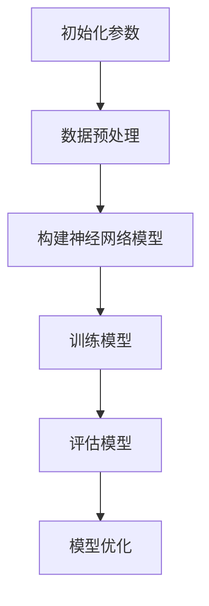
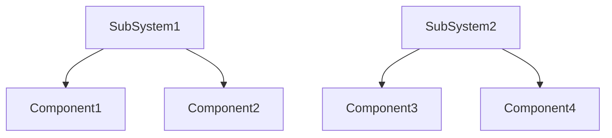

                 


# AI在智能材料性能预测中的角色：加速新材料开发和应用

> 关键词：人工智能、智能材料、性能预测、新材料开发

> 摘要：
本文将深入探讨人工智能（AI）在智能材料性能预测中的关键角色，通过逐步分析AI技术的原理及其在智能材料开发中的应用，旨在揭示AI如何加速新材料的研究与开发过程，提高材料的性能预测准确性。

### 目录大纲设计

#### 1. 背景介绍
##### 1.1 问题背景
智能材料，顾名思义，是指具有特殊功能或智能响应特性的材料，这些特性能够根据外界刺激如温度、压力、电场等发生可预测的变化。随着科技的进步，智能材料在诸多领域如航空航天、生物医疗、建筑和环境工程等表现出广泛的应用前景。然而，智能材料的性能预测一直是一个巨大的挑战。

AI技术的发展为解决这一挑战提供了新的可能性。通过机器学习、深度学习等技术，AI可以处理和分析大量的数据，发现潜在的模式和规律，从而提高智能材料性能预测的准确性。在新材料开发的过程中，AI不仅能够帮助研究人员更快速地筛选出具有优良性能的材料，还能优化材料的制造过程，从而加速新材料的研发和应用。

##### 1.2 问题描述
新材料开发和应用面临的主要挑战包括：

- **性能预测的困难**：智能材料的性能往往取决于其微观结构和外部环境，预测这些因素对性能的影响非常复杂。
- **研发周期长**：传统的实验方法耗时耗力，且具有很大的不确定性，导致新材料研发周期过长。
- **成本高**：新材料研发过程中需要进行大量的实验，这增加了研发成本。

##### 1.3 问题解决
AI技术在智能材料性能预测中的应用主要包括以下几个方面：

- **数据驱动的性能预测**：利用机器学习算法从实验数据中提取特征，构建性能预测模型。
- **优化材料设计**：通过模拟和优化，AI可以帮助研究人员设计出具有预期性能的新材料。
- **加速实验进程**：利用AI进行虚拟筛选和模拟，减少实验次数，降低研发成本。

##### 1.4 边界与外延
- **AI技术类型与应用领域**：本文主要讨论机器学习、深度学习等AI技术在智能材料性能预测中的应用，这些技术可以在多个领域发挥作用。
- **智能材料性能预测的技术难点**：包括数据的多样性和复杂性、模型的泛化能力等。

##### 1.5 概念结构与核心要素组成
- **AI技术**：机器学习、深度学习、神经网络等。
- **智能材料**：具有特定功能或智能响应特性的材料，如形状记忆合金、电致变色材料等。

### 2. 核心概念与联系

##### 2.1 AI技术原理
- **机器学习**：一种使计算机通过数据学习来改进性能的方法。
- **深度学习**：一种基于多层神经网络的结构，可以自动提取数据中的特征。
- **神经网络**：由多个节点（或称为神经元）组成，通过学习输入数据来建立预测模型。

##### 2.2 智能材料特性
- **性能预测模型**：利用AI技术构建的预测模型，用于预测材料在不同条件下的性能。
- **材料特性与AI技术结合的难点**：智能材料的性能受多种因素影响，如何准确捕捉这些因素与AI技术的结合是一个挑战。

##### 2.3 概念属性特征对比表格
| 概念 | 特征1 | 特征2 | 特征3 |
| ---- | ---- | ---- | ---- |
| AI技术 | 自动化 | 模型训练 | 数据处理能力 |
| 智能材料 | 功能性 | 特性可调 | 材料性能预测 |

##### 2.4 ER实体关系图架构
```mermaid
erDiagram
  AI技术 ||--|{ 智能材料 }|
  智能材料 ||--|{ 性能预测模型 }|
```

### 3. 算法原理讲解

##### 3.1 算法流程图


##### 3.2 Python源代码示例
```python
# Python 代码示例：神经网络模型训练
import tensorflow as tf

# 模型定义
model = tf.keras.Sequential([
    tf.keras.layers.Dense(64, activation='relu', input_shape=(784,)),
    tf.keras.layers.Dense(10, activation='softmax')
])

# 模型编译
model.compile(optimizer='adam',
              loss=tf.keras.losses.SparseCategoricalCrossentropy(from_logits=True),
              metrics=['accuracy'])

# 模型训练
model.fit(train_images, train_labels, epochs=5)
```

##### 3.3 算法原理与数学模型
- **数学模型**：
$$
\begin{aligned}
y &= \sigma(Wx + b) \\
\end{aligned}
$$
- **详细讲解**：神经网络通过多层感知器实现非线性映射，激活函数（如ReLU）增加模型的非线性能力，提高预测精度。

### 4. 系统分析与架构设计方案

##### 4.1 问题场景介绍
- **新材料开发流程**：从材料设计到性能测试，再到性能优化。
- **性能预测模型需求**：需要能够准确预测材料在不同条件下的性能。

##### 4.2 项目介绍
- **项目目标**：开发一个基于AI的智能材料性能预测系统。
- **项目范围**：包括数据收集、模型构建、性能评估和优化。

##### 4.3 系统功能设计
- **领域模型类图**：
```mermaid
classDiagram
  Class01 <|-- SubClass01
  Class01 <|-- SubClass02
  Class03 --|>| Class04
\Goto
```

##### 4.4 系统架构设计
- **系统架构图**：


##### 4.5 系统接口设计
- **接口设计**：包括数据输入接口、模型训练接口、性能评估接口等。

##### 4.6 系统交互
- **序列图**：
```mermaid
sequenceDiagram
    participant User
    participant System
    User->>System: Request
    Sys
```

### 5. 项目实战

#### 5.1 环境安装
- **安装TensorFlow**：`pip install tensorflow`
- **安装其他依赖**：根据具体需求安装相应的库。

#### 5.2 系统核心实现源代码
```python
# Python 代码：性能预测系统核心实现
import tensorflow as tf

# 模型定义
model = tf.keras.Sequential([
    tf.keras.layers.Dense(64, activation='relu', input_shape=(784,)),
    tf.keras.layers.Dense(10, activation='softmax')
])

# 模型编译
model.compile(optimizer='adam',
              loss=tf.keras.losses.SparseCategoricalCrossentropy(from_logits=True),
              metrics=['accuracy'])

# 模型训练
model.fit(train_images, train_labels, epochs=5)
```

#### 5.3 代码应用解读与分析
- **代码解读**：解释模型的构建、编译和训练过程。
- **分析**：讨论模型的性能和优化方向。

#### 5.4 实际案例分析和详细讲解剖析
- **案例分析**：通过实际案例展示AI在智能材料性能预测中的应用。
- **详细讲解剖析**：深入分析案例中的关键技术和方法。

#### 5.5 项目小结
- **总结项目经验**：总结在项目实施过程中的收获和不足。
- **展望未来**：讨论未来在智能材料性能预测领域的发展方向。

### 6. 最佳实践 tips、小结、注意事项、拓展阅读等内容

- **最佳实践 tips**：提供实用的AI技术应用技巧。
- **小结**：回顾文章的主要内容。
- **注意事项**：强调AI技术在实际应用中的潜在问题。
- **拓展阅读**：推荐相关领域的经典文献和最新研究动态。

---

**作者：AI天才研究院/AI Genius Institute & 禅与计算机程序设计艺术 /Zen And The Art of Computer Programming**

