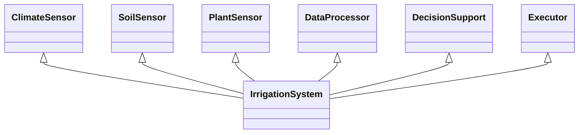
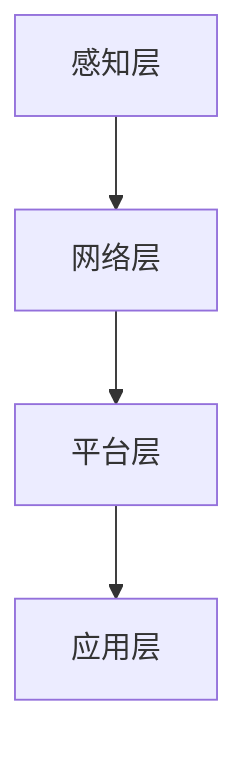
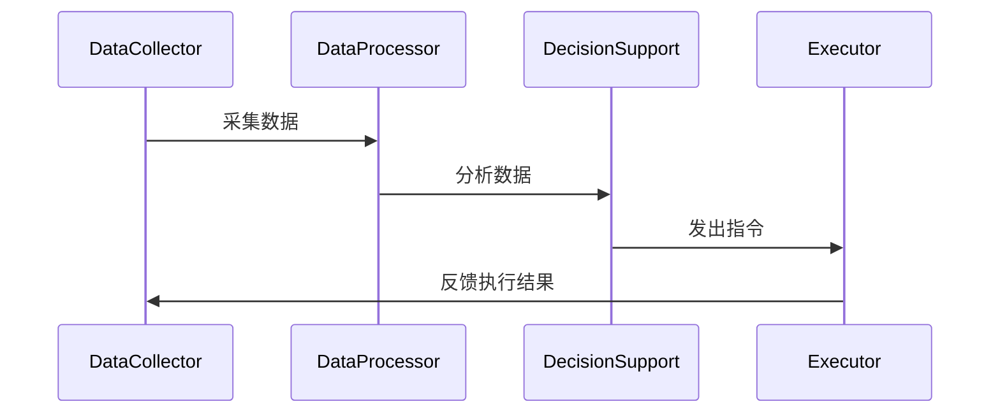

                 

### 《AI在智能灌溉决策中的角色：优化水资源利用》

#### 关键词：人工智能、智能灌溉、水资源管理、算法、系统架构

> 摘要：随着全球水资源的日益紧张，智能灌溉技术成为了优化水资源利用的重要手段。本文将探讨人工智能在智能灌溉决策中的角色，通过深入分析算法原理、系统架构及实际案例，阐述如何利用AI技术提高水资源利用效率。

---

### 第一部分：背景介绍

#### 第1章 问题背景与核心概念

#### 1.1 问题背景

全球水资源短缺问题日益严重，气候变化和人类活动加剧了这一问题的复杂性。水资源的不均衡分布和过度利用使得农业灌溉成为水资源管理的重点。传统的灌溉方式往往依赖经验，难以实现精确的水资源管理，导致水资源浪费。

#### 1.2 核心概念

智能灌溉、水资源管理、人工智能、数据收集与预处理、算法、系统架构。

#### 1.3 水资源利用的现状与挑战

当前，水资源利用效率低下，农业灌溉是水资源浪费的主要来源。智能灌溉技术的发展有望提高水资源利用效率，减少浪费。

#### 1.4 水资源管理与AI的关系

人工智能在数据分析和模式识别方面具有优势，可以辅助水资源管理决策，优化灌溉策略，提高水资源利用效率。

#### 第2章 AI在智能灌溉中的应用概述

#### 2.1 智能灌溉的定义与发展

智能灌溉是指利用传感器、计算机技术和通信技术，实现灌溉过程的自动化和智能化。它包括实时监测、数据分析、决策支持和执行控制等功能。

#### 2.2 AI在智能灌溉中的重要性

AI技术可以帮助智能灌溉系统更好地适应环境变化，优化灌溉策略，降低水资源消耗。

#### 2.3 AI在智能灌溉中的应用领域

AI在智能灌溉中的应用领域包括气象监测、土壤湿度监测、植物生长状态监测等。

#### 2.4 智能灌溉系统的基本架构

智能灌溉系统通常包括传感器、数据采集与处理单元、决策支持系统和执行控制系统等组成部分。

#### 第3章 核心概念与联系

#### 3.1 水资源管理核心概念

水资源管理涉及水资源规划、开发、利用、保护和管理等方面。核心概念包括水资源量、水资源质量、水资源利用效率等。

#### 3.2 AI相关核心概念

AI的核心概念包括机器学习、深度学习、神经网络、数据挖掘等。这些技术在智能灌溉中扮演着关键角色。

#### 3.3 AI与水资源管理的联系

AI技术可以用于水资源监测、预测、优化和管理，提高水资源利用效率。

#### 3.4 概念属性特征对比表格

| 概念     | 属性特征                | 说明                                                         |
|----------|-----------------------|------------------------------------------------------------|
| 水资源管理 | 水资源量、水质、利用效率 | 涉及水资源规划、开发、利用、保护和管理                     |
| AI       | 机器学习、深度学习、神经网络 | 用于数据分析和模式识别，辅助水资源管理决策                   |

#### 3.5 ER实体关系图架构

```mermaid
erDiagram
  Customer ||--|{ Order }|
  Customer ||--|{ Product }|
  Product ||--|{ Order }|
```

### 第二部分：算法原理讲解

#### 第4章 数据收集与预处理

#### 4.1 数据来源

智能灌溉系统所需的数据来源于气象站、土壤传感器、植物传感器等。

#### 4.2 数据预处理方法

数据预处理包括数据清洗、数据转换、数据归一化等步骤，以保证数据质量。

#### 4.3 数据质量评估

数据质量评估包括数据完整性、数据准确性、数据一致性等方面。

#### 4.4 特征工程

特征工程是数据预处理的重要环节，包括特征提取、特征选择、特征转换等。

#### 第5章 智能灌溉算法原理

#### 5.1 基于统计学的算法

##### 5.1.1 算法原理

统计学算法通过分析历史数据，预测未来的水资源需求。

##### 5.1.2 数学模型与公式

$$
Y = \sum_{i=1}^{n} w_i X_i + b
$$

其中，$Y$为预测值，$w_i$为权重，$X_i$为特征值，$b$为偏置。

##### 5.1.3 举例说明

假设我们要预测明天的水资源需求，可以选取昨天的气象数据、土壤湿度数据等作为特征值，通过统计学算法进行预测。

#### 5.2 基于机器学习的算法

##### 5.2.1 算法原理

机器学习算法通过训练模型，从数据中学习规律，进行预测。

##### 5.2.2 数学模型与公式

$$
\theta^{(t+1)} = \theta^{(t)} - \alpha \nabla_{\theta} J(\theta)
$$

其中，$\theta$为模型参数，$J(\theta)$为损失函数，$\alpha$为学习率。

##### 5.2.3 举例说明

以线性回归为例，机器学习算法通过训练数据集，学习到特征值与预测值之间的关系，从而预测新的数据。

#### 5.3 基于深度学习的算法

##### 5.3.1 算法原理

深度学习算法通过多层神经网络，自动提取特征，进行预测。

##### 5.3.2 数学模型与公式

$$
a^{(L)} = \sigma(z^{(L)})
$$

$$
z^{(L)} = W^{(L)} a^{(L-1)} + b^{(L)}
$$

其中，$a^{(L)}$为激活值，$z^{(L)}$为线性组合，$W^{(L)}$为权重，$b^{(L)}$为偏置，$\sigma$为激活函数。

##### 5.3.3 举例说明

以卷积神经网络（CNN）为例，深度学习算法可以自动提取图像中的特征，从而进行图像分类。

### 第三部分：系统分析与架构设计方案

#### 第6章 系统分析与设计

#### 6.1 问题场景介绍

某农田需要进行智能灌溉，以提高水资源利用效率。

#### 6.2 系统功能设计

系统功能包括数据采集、数据分析、决策支持、执行控制等。

#### 6.2.1 领域模型类图



#### 6.3 系统架构设计

系统架构包括感知层、网络层、平台层和应用层。

#### 6.3.1 系统架构图



#### 6.4 系统接口设计

系统接口包括数据采集接口、数据分析接口、决策支持接口和执行控制接口。

#### 6.5 系统交互序列图



### 第四部分：项目实战

#### 第7章 环境安装与配置

#### 7.1 系统要求

系统要求包括操作系统、编程语言、开发环境等。

#### 7.2 环境搭建

环境搭建包括安装操作系统、配置编程语言和开发环境等。

#### 7.3 软件安装与配置

软件安装与配置包括安装传感器驱动程序、配置数据库等。

#### 第8章 系统核心实现

#### 8.1 源代码解析

源代码解析包括对系统核心算法和功能模块的解析。

#### 8.2 核心算法实现

核心算法实现包括数据收集与预处理、智能灌溉算法实现等。

#### 8.3 应用解读与分析

应用解读与分析包括系统功能测试、性能评估等。

#### 第9章 实际案例分析与讲解

#### 9.1 案例介绍

介绍实际案例，包括农田、灌溉系统和水资源利用情况。

#### 9.2 数据处理与模型训练

数据处理与模型训练包括数据收集、数据预处理、模型训练等。

#### 9.3 结果分析与评估

结果分析与评估包括灌溉效果评估、水资源利用效率评估等。

#### 9.4 案例小结

案例小结包括案例总结、经验教训等。

### 第五部分：最佳实践与总结

#### 第10章 最佳实践 Tips

#### 10.1 实施要点

实施要点包括系统设计、数据收集、模型训练等方面。

#### 10.2 常见问题与解决方法

常见问题与解决方法包括系统故障、数据质量等问题。

#### 10.3 拓展应用场景

拓展应用场景包括城市绿化、园林灌溉等。

#### 第11章 小结与展望

#### 11.1 本书要点回顾

回顾本书的主要内容和关键要点。

#### 11.2 未来发展趋势

探讨智能灌溉技术的发展趋势和应用前景。

#### 11.3 拓展阅读与资源推荐

推荐相关书籍、论文和网站等资源。

---

### 作者

作者：AI天才研究院/AI Genius Institute & 禅与计算机程序设计艺术 /Zen And The Art of Computer Programming

---

[上一页](# 《AI在智能灌溉决策中的角色：优化水资源利用》) | [下一页](# 《AI在智能灌溉决策中的角色：优化水资源利用》#第一部分：背景介绍) | [目录](# 《AI在智能灌溉决策中的角色：优化水资源利用》目录大纲)

