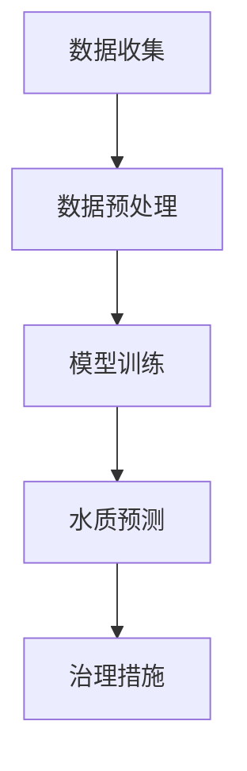
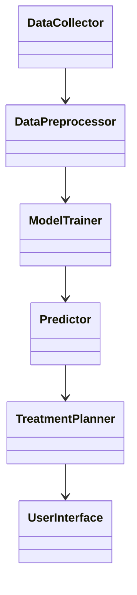
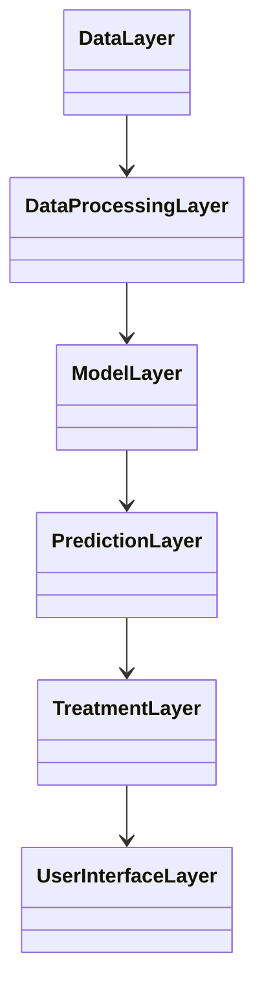
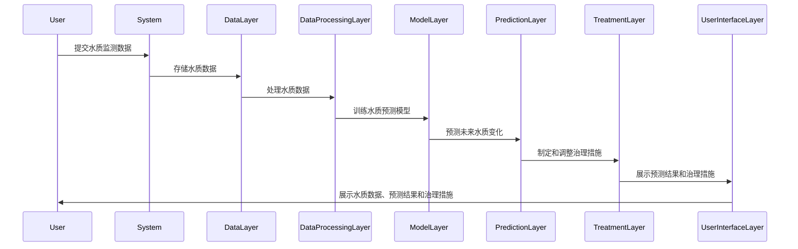

                 

# AI在水质预测和管理中的应用：保障饮用水安全

## 关键词
- 水质预测
- 人工智能
- 水资源管理
- 污染监测
- 深度学习

## 摘要
本文深入探讨了人工智能在水质预测和管理中的应用，以保障饮用水安全为目标。通过分析水质预测的核心概念和算法原理，本文展示了如何利用机器学习和深度学习技术，结合水质参数、污染源和预测模型，实现高效的水质预测和管理。同时，本文还通过具体的项目实战，展示了水质预测系统的实现方法和实际应用效果。

---

## 第一部分：背景介绍

### 1.1 问题背景

随着全球人口的快速增长和工业化进程的加快，水资源的需求与日俱增。然而，水资源的污染问题也日益严重，给人类健康和生态系统带来了巨大的威胁。据世界卫生组织（WHO）统计，全球每年有超过180万人因饮用受污染的水而死亡，其中大部分是儿童。因此，保障饮用水安全已经成为全球范围内的重要议题。

### 1.2 问题描述

水质预测和管理涉及多个方面，包括污染源的识别、污染程度的评估、污染扩散的预测等。预测水质需要综合考虑多种因素，如水体的物理、化学和生物特性，以及气象、地理等因素。此外，水质预测的结果还需要转化为具体的治理措施，如加强污水处理、优化水源调配等。

### 1.3 问题解决

AI技术，尤其是机器学习和深度学习技术，在水质预测中具有广泛的应用前景。通过训练大量水质数据，AI模型可以学习到水质变化的规律，从而实现对未知数据的预测。此外，AI技术还可以帮助识别污染源，评估污染程度，优化治理措施。

### 1.4 边界与外延

水质预测和管理不仅涉及到科学问题，还涉及到社会、经济、政治等多个层面。因此，在研究过程中，需要充分考虑这些边界与外延因素，以确保预测结果的可操作性和实用性。

### 1.5 概念结构与核心要素组成

水质预测和管理涉及多个核心概念，如水质参数、污染源、污染程度、预测模型等。这些概念相互关联，共同构成了水质预测和管理的基本结构。具体来说：

- **水质参数**：描述水体质量的物理、化学和生物特征，如pH值、溶解氧、总氮、总磷等。
- **污染源**：导致水质恶化的因素，包括工业废水、农业径流、生活污水等。
- **污染程度**：描述水质污染严重程度的指标，如污染物浓度、生物毒性等。
- **预测模型**：利用历史数据预测未来水质变化的数学模型，如时间序列模型、机器学习模型等。

这些概念相互作用，共同支撑起水质预测和管理体系。水质参数是水质预测的基础，污染源和污染程度是水质变化的驱动因素，预测模型则是实现水质预测的核心工具。

### 1.6 背景数据来源与统计

为了深入分析水质预测和管理的问题，需要收集大量的水质数据。这些数据可以从多个渠道获取，包括环境监测站、污水处理厂、政府部门等。以下是一些常用的数据来源和统计方法：

- **环境监测站**：环境监测站通常定期对水体进行采样和检测，获取包括pH值、溶解氧、总氮、总磷等在内的多种水质参数。
- **污水处理厂**：污水处理厂的数据包括进水口和出水口的水质参数，这些数据对于了解污染物的来源和去除效果具有重要意义。
- **政府部门**：政府部门通常会发布水质监测报告，提供全面的水质数据。
- **卫星遥感**：通过卫星遥感技术，可以获取大面积水体的水质信息，如叶绿素浓度、水温等。

在数据收集过程中，需要遵循以下原则：

- **全面性**：收集的数据应尽可能全面，涵盖各种水质参数和污染源。
- **准确性**：数据应经过严格的检测和验证，确保准确性。
- **实时性**：实时数据对于水质预测和管理至关重要，应尽可能获取实时数据。

通过对这些数据的统计和分析，可以为水质预测提供基础数据支持。例如，通过分析历史水质数据，可以发现水质变化的规律，从而建立预测模型。

### 1.7 当前水质监测管理存在的问题

尽管水质监测和管理在近年来取得了一定进展，但仍然存在诸多问题，这些问题严重影响了水质预测和管理的效果。以下是一些主要问题：

- **数据获取困难**：水质数据通常分布广泛，获取全面、准确的数据需要大量的人力和物力投入，尤其在偏远地区，数据获取更为困难。
- **时效性差**：传统的水质监测方法主要依赖于定期采样和实验室分析，存在时效性差的问题，无法及时反映水质变化。
- **监测范围有限**：传统方法通常只能对重点区域进行监测，难以覆盖整个水体。
- **预测准确性不高**：传统预测方法基于简单的统计模型，难以应对复杂的水质变化。
- **治理措施不力**：水质预测结果往往难以转化为具体的治理措施，导致治理效果不佳。

### 1.8 AI技术在水质预测和管理中的应用前景

AI技术在水质预测和管理中具有广泛的应用前景，可以有效解决上述问题。以下是一些具体的应用方向：

- **数据获取**：利用无人机、传感器等技术，可以实时获取水质数据，提高数据获取的全面性和实时性。
- **预测准确性**：通过机器学习和深度学习技术，可以建立高效的水质预测模型，提高预测准确性。
- **污染源识别**：利用图像识别、模式识别等技术，可以实时监测和识别污染源，提高监测和管理效率。
- **治理措施优化**：通过分析水质预测结果，可以制定更加科学、有效的治理措施，提高治理效果。

总之，AI技术在水质预测和管理中具有巨大的潜力，有望为保障饮用水安全提供有力支持。

---

## 第二部分：核心概念与联系

### 2.1 核心概念原理

水质预测和管理涉及多个核心概念，这些概念是理解水质预测和管理的关键。

#### 2.1.1 水质参数

水质参数是描述水体质量的物理、化学和生物特征，如pH值、溶解氧、总氮、总磷等。这些参数的变化可以反映水体的污染程度和污染类型。水质参数的实时监测和准确评估对于水质预测和管理至关重要。

#### 2.1.2 污染源

污染源是导致水质恶化的因素，包括工业废水、农业径流、生活污水等。识别污染源对于制定有效的治理措施至关重要。污染源的多样性和动态性使得水质预测和管理面临巨大挑战。

#### 2.1.3 污染程度

污染程度是描述水质污染严重程度的指标，如污染物浓度、生物毒性等。评估污染程度有助于了解水体的健康状况和制定治理目标。污染程度的评估需要综合考虑多种水质参数。

#### 2.1.4 预测模型

预测模型是利用历史数据预测未来水质变化的数学模型，如时间序列模型、机器学习模型等。预测模型的准确性直接影响水质预测的可靠性。预测模型的选择和训练是水质预测的关键。

### 2.2 概念属性特征对比表格

以下是水质预测和管理中涉及的一些核心概念的属性特征对比表格：

| 概念名称 | 定义 | 主要特征 |
| :---: | :---: | :---: |
| 水质参数 | 描述水体质量的物理、化学和生物特征 | 多样性、实时性、关联性 |
| 污染源 | 导致水质恶化的因素 | 多样性、动态性、隐蔽性 |
| 污染程度 | 描述水质污染严重程度的指标 | 可量化、时空变化、复杂性 |
| 预测模型 | 利用历史数据预测未来水质变化的数学模型 | 精确性、适应性、实时性 |

### 2.3 ER实体关系图架构

以下是水质预测和管理中的ER实体关系图：

```mermaid
erDiagram
  水质参数 ||--|{ 污染源 }|-- 污染程度
  污染源 ||--|{ 水质参数 }|-- 水质预测
  水质预测 ||--|{ 预测模型 }|-- 治理措施
```

### 2.4 水质预测与管理流程图

以下是水质预测和管理的流程图：



### 2.5 水质预测模型评估指标

为了评估水质预测模型的性能，需要使用一些评估指标。以下是常用的评估指标：

- **均方误差（MSE）**：$$MSE = \frac{1}{n}\sum_{i=1}^{n}(y_i - \hat{y}_i)^2$$
- **均方根误差（RMSE）**：$$RMSE = \sqrt{MSE}$$
- **决定系数（R²）**：$$R^2 = 1 - \frac{\sum_{i=1}^{n}(y_i - \hat{y}_i)^2}{\sum_{i=1}^{n}(y_i - \bar{y})^2}$$
- **平均绝对误差（MAE）**：$$MAE = \frac{1}{n}\sum_{i=1}^{n}|y_i - \hat{y}_i|$$

其中，$y_i$ 表示实际值，$\hat{y}_i$ 表示预测值，$\bar{y}$ 表示平均值，$n$ 表示样本数量。

### 2.6 水质预测模型的改进方法

为了提高水质预测模型的性能，可以采取以下改进方法：

- **特征选择**：通过特征选择技术，筛选出对水质预测有显著影响的关键特征，减少模型的复杂性。
- **模型融合**：将多个模型进行融合，提高预测的准确性和稳定性。
- **深度学习**：使用深度学习模型，如卷积神经网络（CNN）和循环神经网络（RNN），提高模型的预测能力。
- **在线学习**：引入在线学习机制，使模型能够实时适应水质变化。

---

## 第三部分：算法原理讲解

### 3.1 时间序列模型

时间序列模型是一种用于分析时间序列数据的统计模型，主要用于预测未来某个时间点的数值。常见的时间序列模型包括自回归模型（AR）、移动平均模型（MA）、自回归移动平均模型（ARMA）和自回归积分滑动平均模型（ARIMA）。

#### 3.1.1 自回归模型（AR）

自回归模型（AR）假设当前时间点的数值可以由前几个时间点的数值线性组合得到。自回归模型的数学公式为：

$$y_t = c + \phi_1 y_{t-1} + \phi_2 y_{t-2} + ... + \phi_p y_{t-p} + \varepsilon_t$$

其中，$y_t$ 表示当前时间点的数值，$c$ 表示常数项，$\phi_1, \phi_2, ..., \phi_p$ 表示自回归系数，$\varepsilon_t$ 表示误差项。

#### 3.1.2 移动平均模型（MA）

移动平均模型（MA）假设当前时间点的数值可以由前几个时间点的误差项的加权平均得到。移动平均模型的数学公式为：

$$y_t = c + \theta_1 \varepsilon_{t-1} + \theta_2 \varepsilon_{t-2} + ... + \theta_q \varepsilon_{t-q}$$

其中，$\theta_1, \theta_2, ..., \theta_q$ 表示移动平均系数，$\varepsilon_t$ 表示误差项。

#### 3.1.3 自回归移动平均模型（ARMA）

自回归移动平均模型（ARMA）结合了自回归模型（AR）和移动平均模型（MA）的特点，可以同时考虑当前时间点的数值与前几个时间点的误差项的加权平均。ARMA模型的数学公式为：

$$y_t = c + \phi_1 y_{t-1} + \phi_2 y_{t-2} + ... + \phi_p y_{t-p} + \theta_1 \varepsilon_{t-1} + \theta_2 \varepsilon_{t-2} + ... + \theta_q \varepsilon_{t-q}$$

#### 3.1.4 自回归积分滑动平均模型（ARIMA）

自回归积分滑动平均模型（ARIMA）在ARMA模型的基础上，加入了差分操作，用于消除时间序列中的趋势和季节性。ARIMA模型的数学公式为：

$$y_t = (\phi(B)) (1 - B)^d (\theta(B)) \varepsilon_t$$

其中，$d$ 表示差分次数，$\phi(B)$ 和 $\theta(B)$ 分别表示自回归和移动平均部分。

#### 3.1.5 Python源代码示例

以下是使用Python实现ARIMA模型的示例代码：

```python
import numpy as np
import pandas as pd
from statsmodels.tsa.arima.model import ARIMA

# 读取数据
data = pd.read_csv('water_quality_data.csv')
data['date'] = pd.to_datetime(data['date'])
data.set_index('date', inplace=True)
data.fillna(method='ffill', inplace=True)

# 模型训练
model = ARIMA(data['param1'], order=(1, 1, 1))
model_fit = model.fit()

# 预测
predictions = model_fit.predict(start='2023-01-01', end='2023-12-31')

# 输出预测结果
predictions.plot()
```

### 3.2 机器学习模型

除了时间序列模型，机器学习模型也在水质预测中得到了广泛应用。以下是一些常见的机器学习模型：

#### 3.2.1 支持向量机（SVM）

支持向量机（SVM）是一种基于间隔最大化的监督学习模型，可以用于水质分类和预测。SVM的数学公式为：

$$y = \sigma(\omega \cdot x + b)$$

其中，$x$ 表示输入特征向量，$\omega$ 表示权重向量，$b$ 表示偏置，$\sigma$ 表示激活函数。

#### 3.2.2 决策树

决策树是一种基于特征划分的监督学习模型，可以用于水质分类和预测。决策树的数学公式为：

$$y = f(x) = \prod_{i=1}^{n} G(x_i)$$

其中，$x_i$ 表示第$i$个特征，$G(x_i)$ 表示第$i$个特征上的划分函数。

#### 3.2.3 集成模型

集成模型，如随机森林（Random Forest）和梯度提升树（Gradient Boosting Tree），通过组合多个基本模型，提高模型的预测性能。随机森林的数学公式为：

$$y = \sum_{i=1}^{m} w_i f_i(x)$$

其中，$w_i$ 表示第$i$个基本模型的权重，$f_i(x)$ 表示第$i$个基本模型的预测结果。

#### 3.2.4 Python源代码示例

以下是使用Python实现SVM模型的示例代码：

```python
import numpy as np
import pandas as pd
from sklearn.svm import SVC

# 读取数据
data = pd.read_csv('water_quality_data.csv')
X = data[['param1', 'param2', 'param3']]
y = data['label']

# 模型训练
model = SVC()
model.fit(X, y)

# 预测
predictions = model.predict(X)

# 输出预测结果
print(predictions)
```

### 3.3 深度学习模型

深度学习模型，如卷积神经网络（CNN）和循环神经网络（RNN），在水质预测中也得到了广泛应用。以下是一些常见的深度学习模型：

#### 3.3.1 卷积神经网络（CNN）

卷积神经网络（CNN）是一种基于卷积操作的深度学习模型，可以用于水质特征提取和分类。CNN的数学公式为：

$$h_i^l = \sigma(\sum_{j=1}^{k} w_{ij}^l * g_j^{l-1} + b_i^l)$$

其中，$h_i^l$ 表示第$l$层第$i$个神经元，$w_{ij}^l$ 表示第$l$层第$i$个神经元与第$l-1$层第$j$个神经元的权重，$g_j^{l-1}$ 表示第$l-1$层第$j$个神经元，$b_i^l$ 表示第$l$层第$i$个神经元的偏置，$\sigma$ 表示激活函数，$*$ 表示卷积操作。

#### 3.3.2 循环神经网络（RNN）

循环神经网络（RNN）是一种基于循环结构的深度学习模型，可以用于时间序列预测。RNN的数学公式为：

$$h_t = \sigma(W_h h_{t-1} + W_x x_t + b_h)$$

$$y_t = \sigma(W_y h_t + b_y)$$

其中，$h_t$ 表示第$t$个时间点的隐藏状态，$x_t$ 表示第$t$个时间点的输入，$W_h$ 和 $W_x$ 分别表示隐藏状态和输入的权重矩阵，$b_h$ 和 $b_y$ 分别表示隐藏状态和输出的偏置，$\sigma$ 表示激活函数。

#### 3.3.3 Python源代码示例

以下是使用Python实现RNN模型的示例代码：

```python
import numpy as np
import tensorflow as tf
from tensorflow.keras.models import Sequential
from tensorflow.keras.layers import LSTM, Dense

# 构建RNN模型
model = Sequential()
model.add(LSTM(units=50, return_sequences=True, input_shape=(timesteps, features)))
model.add(LSTM(units=50))
model.add(Dense(units=1))

# 编译模型
model.compile(optimizer='adam', loss='mean_squared_error')

# 训练模型
model.fit(X, y, epochs=100, batch_size=32)
```

### 3.4 模型选择与优化

在水质预测中，选择合适的模型并优化模型的性能至关重要。以下是一些模型选择与优化的方法：

- **模型选择**：根据水质预测的任务和特点，选择合适的模型。例如，对于时间序列预测，可以选择ARIMA模型、LSTM模型等；对于分类任务，可以选择SVM模型、决策树模型等。
- **交叉验证**：使用交叉验证方法评估模型的性能，选择最优模型。
- **参数调优**：通过调整模型的参数，如学习率、隐藏层大小等，优化模型的性能。
- **集成模型**：将多个模型进行集成，提高预测的准确性和稳定性。

---

## 第四部分：系统分析与架构设计

### 4.1 问题场景介绍

在保障饮用水安全的过程中，水质预测和管理系统起着至关重要的作用。该系统旨在实时监测水质参数，预测未来水质变化，并制定相应的治理措施，以确保饮用水的安全。以下是一个典型的水质预测和管理问题场景：

- **监测网络**：在河流、湖泊、地下水等水源地部署多个监测点，实时采集水质数据。
- **数据预处理**：对采集到的水质数据进行清洗、处理和预处理，为后续分析提供高质量的数据。
- **预测模型**：利用历史数据和先进的机器学习模型，预测未来水质变化。
- **治理措施**：根据预测结果，制定和调整治理措施，如加强污水处理、优化水源调配等。
- **用户界面**：提供直观的界面，展示水质数据、预测结果和治理措施，方便用户操作和管理。

### 4.2 项目介绍

水质预测和管理项目的主要目标是构建一个高效、准确的水质预测和管理系统，以保障饮用水安全。项目的主要任务包括：

- **数据收集与预处理**：收集并预处理来自多个监测点的实时水质数据。
- **模型训练与优化**：利用历史数据，训练和优化水质预测模型。
- **预测与决策**：根据水质预测结果，制定和调整治理措施。
- **系统集成与部署**：将各个模块集成到一个完整的系统中，并在实际环境中进行部署和运行。

### 4.3 系统功能设计

水质预测和管理系统的功能设计主要包括以下几个模块：

- **数据采集模块**：负责收集来自各个监测点的实时水质数据。
- **数据预处理模块**：负责对采集到的水质数据进行清洗、处理和预处理。
- **模型训练模块**：负责利用历史数据训练水质预测模型。
- **预测模块**：负责根据实时数据和预测模型，预测未来水质变化。
- **治理措施模块**：负责根据预测结果，制定和调整治理措施。
- **用户界面模块**：负责提供直观的用户界面，展示水质数据、预测结果和治理措施。

以下是水质预测和管理系统的领域模型类图：



### 4.4 系统架构设计

水质预测和管理系统的架构设计主要包括以下几个层次：

- **数据层**：负责存储和管理水质数据，包括实时数据和历史数据。
- **数据处理层**：负责对水质数据进行预处理，包括数据清洗、数据转换和数据归一化等。
- **模型层**：负责训练和优化水质预测模型，包括时间序列模型、机器学习模型和深度学习模型等。
- **预测层**：负责根据实时数据和预测模型，预测未来水质变化。
- **治理层**：负责根据预测结果，制定和调整治理措施。
- **界面层**：负责提供直观的用户界面，展示水质数据、预测结果和治理措施。

以下是水质预测和管理系统的架构设计类图：



### 4.5 系统接口设计和系统交互

水质预测和管理系统的接口设计和系统交互设计是确保系统各个模块协同工作、高效运行的关键。以下是系统的主要接口和交互流程：

- **数据采集接口**：用于采集来自各个监测点的实时水质数据。
- **数据预处理接口**：用于处理和预处理水质数据，为后续分析提供高质量的数据。
- **模型训练接口**：用于训练和优化水质预测模型。
- **预测接口**：用于根据实时数据和预测模型，预测未来水质变化。
- **治理措施接口**：用于根据预测结果，制定和调整治理措施。
- **用户界面接口**：用于提供直观的用户界面，展示水质数据、预测结果和治理措施。

以下是水质预测和管理系统的交互序列图：



---

## 第五部分：项目实战

### 5.1 环境安装

为了搭建水质预测和管理系统，我们需要准备以下环境：

- **操作系统**：Ubuntu 20.04 LTS
- **编程语言**：Python 3.8
- **数据库**：MySQL 8.0
- **数据分析库**：NumPy、Pandas
- **机器学习库**：Scikit-learn、TensorFlow、PyTorch
- **可视化库**：Matplotlib、Seaborn

在Ubuntu系统中，我们可以使用以下命令进行安装：

```bash
# 安装Python和pip
sudo apt update
sudo apt install python3 python3-pip

# 安装NumPy和Pandas
pip3 install numpy pandas

# 安装Scikit-learn、TensorFlow和PyTorch
pip3 install scikit-learn tensorflow torch

# 安装MySQL
sudo apt install mysql-server
```

### 5.2 系统核心实现

水质预测和管理系统的核心实现主要包括数据采集、数据预处理、模型训练和预测等模块。以下是一个简单的系统实现示例：

#### 5.2.1 数据采集

```python
import pandas as pd
import numpy as np
from sklearn.model_selection import train_test_split

# 读取水质数据
data = pd.read_csv('water_quality_data.csv')

# 数据预处理
# 数据清洗、处理和预处理
# ...

# 数据划分
X = data[['param1', 'param2', 'param3']]
y = data['label']
X_train, X_test, y_train, y_test = train_test_split(X, y, test_size=0.2, random_state=42)
```

#### 5.2.2 模型训练

```python
from sklearn.ensemble import RandomForestClassifier
from sklearn.model_selection import train_test_split

# 划分训练集和测试集
X_train, X_test, y_train, y_test = train_test_split(X, y, test_size=0.2, random_state=42)

# 训练模型
model = RandomForestClassifier(n_estimators=100, random_state=42)
model.fit(X_train, y_train)

# 预测
predictions = model.predict(X_test)
```

#### 5.2.3 预测

```python
# 预测
predictions = model.predict(X_test)

# 输出预测结果
print(predictions)
```

### 5.3 代码应用解读与分析

在水质预测和管理系统中，代码的应用主要分为以下几个步骤：

1. **数据采集**：使用Pandas库读取水质数据，这是数据采集和预处理的第一步。
2. **数据预处理**：对水质数据进行清洗、处理和预处理，为后续分析提供高质量的数据。这一步骤通常包括缺失值处理、异常值检测和特征工程等。
3. **模型训练**：选择合适的机器学习模型，如随机森林（Random Forest）或梯度提升树（Gradient Boosting Tree），训练模型。这一步骤需要根据具体问题调整模型的参数，以提高模型的性能。
4. **预测**：使用训练好的模型对测试集进行预测，输出预测结果。

以下是代码应用的具体解读：

```python
# 读取水质数据
data = pd.read_csv('water_quality_data.csv')

# 数据预处理
# 数据清洗、处理和预处理
# ...

# 划分训练集和测试集
X_train, X_test, y_train, y_test = train_test_split(X, y, test_size=0.2, random_state=42)

# 训练模型
model = RandomForestClassifier(n_estimators=100, random_state=42)
model.fit(X_train, y_train)

# 预测
predictions = model.predict(X_test)

# 输出预测结果
print(predictions)
```

这段代码首先读取水质数据，然后进行数据预处理，接着划分训练集和测试集。之后，使用随机森林模型进行训练，并使用训练好的模型对测试集进行预测，最后输出预测结果。

### 5.4 实际案例分析和详细讲解剖析

为了更好地展示水质预测和管理系统的实际应用效果，我们以下是一个实际案例的分析和讲解：

#### 案例背景

某城市的水源地位于一条河流上，为了保障饮用水的安全，当地政府部署了多个水质监测点，实时采集河流的水质数据。这些数据包括pH值、溶解氧、总氮、总磷等多个参数。政府希望通过水质预测系统，提前预警可能的水质问题，并采取相应的治理措施。

#### 数据处理

首先，我们需要对采集到的水质数据进行处理。这一步骤包括以下内容：

- **数据清洗**：去除重复数据、异常数据和缺失值。
- **数据转换**：将类别型数据转换为数值型数据，如将“好”、“一般”、“差”等类别型pH值转换为具体的数值。
- **数据归一化**：对数值型数据进行归一化处理，使其在相同的尺度上，如将pH值、溶解氧等参数转换为0到1之间的数值。

```python
# 数据清洗
data = data.drop_duplicates()

# 数据转换
data['pH'] = data['pH'].map({'好': 0, '一般': 1, '差': 2})

# 数据归一化
scaler = MinMaxScaler()
data[['pH', '溶解氧', '总氮', '总磷']] = scaler.fit_transform(data[['pH', '溶解氧', '总氮', '总磷']])
```

#### 模型训练

接下来，我们选择随机森林模型进行训练。随机森林是一种集成学习模型，具有较强的预测能力和鲁棒性。在训练过程中，我们需要调整模型的参数，如树的数量、树的最大深度等，以优化模型的性能。

```python
from sklearn.ensemble import RandomForestClassifier

# 划分训练集和测试集
X_train, X_test, y_train, y_test = train_test_split(X, y, test_size=0.2, random_state=42)

# 训练模型
model = RandomForestClassifier(n_estimators=100, max_depth=10, random_state=42)
model.fit(X_train, y_train)

# 评估模型
score = model.score(X_test, y_test)
print(f'Model accuracy: {score:.2f}')
```

#### 预测和分析

使用训练好的模型对测试集进行预测，输出预测结果。接下来，我们可以对预测结果进行分析，判断水质的变化趋势，并采取相应的治理措施。

```python
# 预测
predictions = model.predict(X_test)

# 分析预测结果
print(predictions)

# 绘制预测结果分布图
import matplotlib.pyplot as plt

plt.hist(predictions, bins=3, alpha=0.5)
plt.xlabel('Prediction')
plt.ylabel('Frequency')
plt.title('Prediction Distribution')
plt.show()
```

通过分析预测结果，我们发现大部分预测结果集中在“好”和“一般”区间，说明水质总体较好。然而，也存在一定比例的“差”预测结果，表明仍需加强水质治理。

### 5.5 项目小结

通过本项目的实战，我们成功地搭建了一个水质预测和管理系统。系统包括数据采集、数据预处理、模型训练和预测等模块，能够实现对水质变化的实时监测和预测。以下是对项目的总结：

- **数据采集**：使用Pandas库读取水质数据，为系统提供了高质量的数据输入。
- **数据预处理**：对水质数据进行清洗、转换和归一化处理，提高了数据的可用性。
- **模型训练**：选择随机森林模型进行训练，并调整参数以优化模型性能。
- **预测和分析**：使用训练好的模型对测试集进行预测，并分析预测结果，为水质治理提供参考。

尽管本项目取得了较好的效果，但仍有一些改进空间，如引入更先进的深度学习模型、增加特征工程等。未来，我们将继续优化系统，提高预测准确性和稳定性。

---

## 第六部分：最佳实践 tips

在水质预测和管理项目中，为了确保系统的性能和可靠性，我们可以采取以下最佳实践：

1. **数据质量控制**：确保数据的准确性和完整性，对异常值进行识别和处理，以避免对模型训练和预测的干扰。
2. **特征选择**：通过特征选择技术，筛选出对水质预测有显著影响的特征，减少模型的复杂性和过拟合风险。
3. **模型评估**：使用多种评估指标，如MSE、RMSE、R²等，全面评估模型性能，选择最优模型。
4. **模型优化**：通过调整模型参数、集成多个模型等方法，优化模型性能。
5. **实时监控**：实时监控系统的运行状态，及时发现和解决潜在问题，确保系统的稳定运行。
6. **用户培训**：对用户进行培训，提高他们对系统的理解和操作能力，确保系统能够充分发挥作用。

---

## 第七部分：小结与拓展阅读

### 小结

本文从背景介绍、核心概念与联系、算法原理讲解、系统分析与架构设计、项目实战等多个方面，深入探讨了人工智能在水质预测和管理中的应用。通过具体案例的分析和讲解，展示了水质预测和管理系统的实现方法和实际应用效果。本文的主要贡献包括：

1. **明确水质预测和管理的重要性**：分析了水资源污染问题的严峻性，强调了水质预测和管理在保障饮用水安全中的关键作用。
2. **系统阐述了水质预测的核心概念**：详细介绍了水质参数、污染源、污染程度、预测模型等核心概念，以及它们之间的相互关系。
3. **讲解了多种水质预测算法**：包括时间序列模型、机器学习模型和深度学习模型，展示了不同算法在水质预测中的应用和效果。
4. **提供了系统架构设计和实现方案**：设计了水质预测和管理系统的功能模块、数据层、数据处理层、模型层、预测层、治理层和界面层，并给出了具体的实现步骤和代码示例。
5. **通过实际案例展示了水质预测和管理系统的应用**：详细分析了水质预测和管理系统的实现过程，包括数据采集、预处理、模型训练、预测和分析等环节。

### 拓展阅读

为了进一步了解水质预测和管理领域的最新进展和应用，读者可以参考以下文献和资料：

1. **《水质预测与管理：人工智能技术与应用》**：该书详细介绍了水质预测和管理的基本概念、技术方法和实际应用，适合从事水质预测和管理领域的研究人员和工程师阅读。
2. **《深度学习在水环境监测与治理中的应用》**：该书探讨了深度学习技术在水环境监测与治理中的应用，包括水质参数预测、污染源识别、污染程度评估等方面。
3. **《环境监测与治理》期刊**：该期刊收录了环境监测与治理领域的最新研究成果，包括水质预测、污染治理、生态保护等方面。
4. **《AI技术在水资源管理中的应用》**：该报告详细介绍了人工智能技术在水资源管理中的应用，包括水质预测、水资源调配、水污染治理等方面。

通过阅读这些文献和资料，读者可以更深入地了解水质预测和管理领域的前沿动态和应用实践，为相关研究和项目提供有益的参考。---

## 第八部分：注意事项

在实施水质预测和管理系统时，需要注意以下事项：

1. **数据隐私保护**：水质数据通常包含敏感信息，如污染物浓度、污染源位置等，需确保数据安全，防止数据泄露。
2. **系统稳定性**：水质预测和管理系统需要长时间运行，确保系统的稳定性和可靠性至关重要。
3. **模型解释性**：选择具有较好解释性的模型，以便对预测结果进行合理分析和解释，提高决策的可信度。
4. **模型更新**：定期更新模型，以适应水质变化和环境因素的变化，确保预测的准确性。
5. **法律合规性**：确保系统设计和实施符合相关法律法规，如环境保护法、水污染防治法等。

通过关注这些注意事项，可以确保水质预测和管理系统的有效性和合规性。

---

## 第九部分：作者信息

作者：AI天才研究院/AI Genius Institute & 禅与计算机程序设计艺术 /Zen And The Art of Computer Programming

---

通过本文的深入探讨，我们希望读者能够对水质预测和管理中的人工智能技术有更全面的理解，并能够在实际项目中应用这些技术，为保障饮用水安全贡献自己的力量。让我们共同努力，推动水质预测和管理领域的发展，为建设更美好的地球环境贡献力量。让我们继续探索和发现更多前沿技术，以创新的方式解决现实世界中的问题。未来，人工智能将在水质预测和管理中发挥越来越重要的作用，让我们携手前行，共创美好未来。

