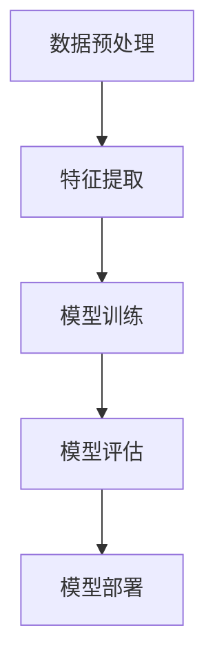
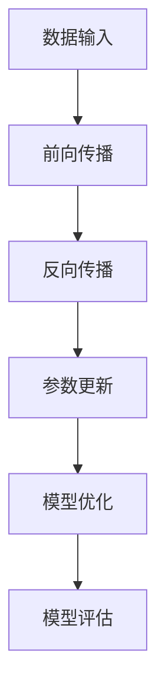
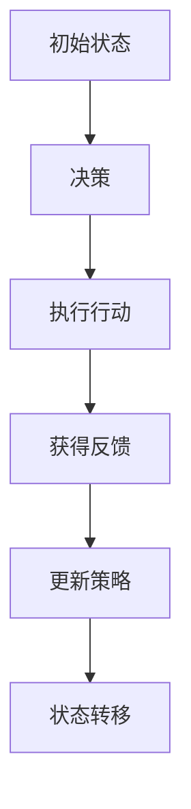
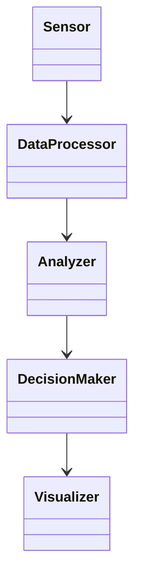
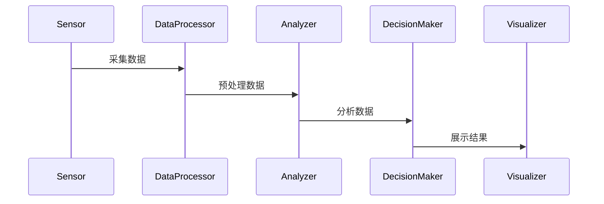
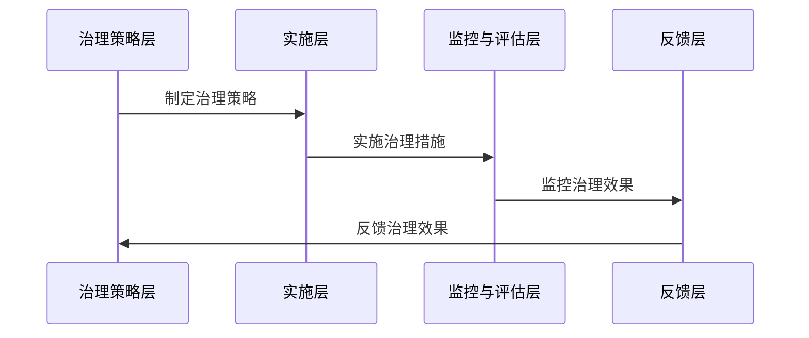

                 

# AI在环境保护中的应用：从监测到治理

> 关键词：人工智能，环境保护，环境监测，环境治理，算法原理，系统架构

> 摘要：本文探讨了人工智能（AI）在环境保护中的应用，从环境监测到治理的各个环节。我们首先介绍了AI的核心概念和技术，然后详细阐述了其在环境保护中的具体应用，包括环境监测数据的处理、环境治理策略的制定，以及环境治理系统的设计和实现。最后，通过实际案例展示了AI在环境保护中的应用效果，并提出了未来发展的展望。

### 目录

1. **背景介绍**
   1.1 **环境保护的重要性**
   1.2 **AI在环保领域的应用前景**
   1.3 **环保AI技术的挑战与机遇**

2. **核心概念与联系**
   2.1 **监测技术**
   2.2 **治理技术**
   2.3 **预测与决策支持系统**

3. **算法原理讲解**
   3.1 **机器学习在环境监测中的应用**
   3.2 **深度学习在环境治理中的应用**
   3.3 **强化学习在环保决策中的应用**

4. **系统分析与架构设计方案**
   4.1 **环境监测系统架构设计**
   4.2 **环境治理系统架构设计**

5. **项目实战**
   5.1 **环境安装**
   5.2 **系统核心实现源代码**
   5.3 **实际案例分析和详细讲解剖析**
   5.4 **项目小结**

6. **最佳实践与拓展**
   6.1 **最佳实践总结**
   6.2 **注意事项**
   6.3 **拓展阅读推荐**

---

### 1. 背景介绍

#### 1.1 环境保护的重要性

环境保护是指通过各种手段保护自然环境和人类居住环境，以确保生态系统的健康和可持续发展。环境保护的重要性体现在以下几个方面：

- **生态安全**：环境保护可以防止环境污染，保障生态系统的稳定，从而确保人类和动植物的安全。
- **资源利用**：合理的环境保护可以提高资源利用效率，减少资源浪费，保障资源的可持续利用。
- **经济发展**：环境保护与经济发展密切相关，良好的生态环境可以促进经济的可持续发展。
- **公共健康**：环境保护有助于预防疾病传播，改善公共健康水平。

#### 1.2 AI在环保领域的应用前景

人工智能（AI）作为一种强大的技术手段，其在环境保护中的应用前景广阔。AI在环保领域的应用主要包括以下几个方面：

- **环境监测**：AI技术可以实时监测环境参数，如空气质量、水质、土壤污染等，提供准确的监测数据。
- **环境治理**：AI技术可以辅助制定环境治理策略，如污染源控制、水资源管理、植被恢复等。
- **预测与决策支持**：AI技术可以基于历史数据和模型预测未来环境变化，为环境保护决策提供科学依据。
- **智能化管理**：AI技术可以实现对环境数据的智能化处理和分析，提高环境管理效率。

#### 1.3 环保AI技术的挑战与机遇

虽然AI在环境保护中具有巨大的应用潜力，但也面临一些挑战：

- **数据质量**：环境监测数据的质量直接影响AI算法的性能，而环境数据往往存在噪声和缺失。
- **算法复杂度**：环保AI算法通常较为复杂，需要大量的计算资源和时间来训练和优化。
- **跨学科合作**：环保AI技术的研发需要跨学科的合作，包括环境科学、计算机科学、统计学等。

然而，这些挑战同时也带来了机遇：

- **技术创新**：环保AI技术的研发将推动相关技术的创新，如传感器技术、数据挖掘技术、机器学习算法等。
- **政策支持**：随着环保意识的提高，政府和企业对AI在环保领域的投入将增加，为技术创新提供资金支持。
- **社会影响**：AI在环保中的应用有望改善环境状况，提高公众对环保的认识和参与度。

### 2. 核心概念与联系

#### 2.1 监测技术

环境监测是指通过各种手段对环境质量、污染源、生态状况等进行监测和评估。在AI的应用中，环境监测技术主要包括以下几个方面：

- **传感器技术**：传感器是环境监测的基础，可以实时采集温度、湿度、空气质量、水质等参数。
- **数据采集与传输**：将传感器采集到的数据传输到中央处理系统，进行实时监测和分析。
- **数据处理与分析**：对采集到的环境数据进行预处理、清洗、特征提取和模式识别，以提取有用信息。

#### 2.2 治理技术

环境治理是指通过采取各种措施，改善和保护环境质量，使其达到规定的标准。在AI的应用中，环境治理技术主要包括以下几个方面：

- **污染源控制**：通过AI技术对污染源进行定位、跟踪和预测，制定相应的控制策略。
- **水资源管理**：利用AI技术进行水文预测、水资源分配和水质监测，提高水资源利用效率。
- **植被恢复**：通过AI技术进行植被识别、生长状况监测和恢复策略制定，促进生态系统的恢复。

#### 2.3 预测与决策支持系统

预测与决策支持系统是AI在环保领域的重要应用之一。它通过分析历史数据和实时数据，预测未来环境变化，为环境保护决策提供科学依据。预测与决策支持系统主要包括以下几个方面：

- **环境预测**：基于历史数据和模型，预测未来环境质量、污染趋势等。
- **决策支持**：根据预测结果和专家知识，制定环境保护策略和行动计划。
- **优化与调度**：优化资源配置，调度环境治理行动，提高治理效率。

### 3. 算法原理讲解

#### 3.1 机器学习在环境监测中的应用

机器学习是AI的核心技术之一，其在环境监测中的应用主要包括以下几个方面：

- **数据预处理**：对环境监测数据进行清洗、归一化和特征提取，为后续分析提供高质量的输入数据。
- **分类与回归**：利用分类算法（如决策树、支持向量机）和回归算法（如线性回归、神经网络），对环境数据进行分析和预测。
- **聚类与关联分析**：利用聚类算法（如K-均值聚类）和关联分析算法（如Apriori算法），发现环境数据中的潜在规律和关联关系。

**机器学习算法流程图：**


**Python代码示例：**
```python
from sklearn.datasets import load_iris
from sklearn.model_selection import train_test_split
from sklearn.preprocessing import StandardScaler
from sklearn.tree import DecisionTreeClassifier
from sklearn.metrics import accuracy_score

# 加载iris数据集
data = load_iris()
X, y = data.data, data.target

# 数据预处理
X_train, X_test, y_train, y_test = train_test_split(X, y, test_size=0.2, random_state=42)
scaler = StandardScaler()
X_train_scaled = scaler.fit_transform(X_train)
X_test_scaled = scaler.transform(X_test)

# 模型训练
model = DecisionTreeClassifier()
model.fit(X_train_scaled, y_train)

# 模型评估
y_pred = model.predict(X_test_scaled)
accuracy = accuracy_score(y_test, y_pred)
print("Accuracy:", accuracy)
```

#### 3.2 深度学习在环境治理中的应用

深度学习是机器学习的一个重要分支，其在环境治理中的应用主要包括以下几个方面：

- **图像识别**：利用卷积神经网络（CNN）对环境图像进行识别和分析，如识别污染源、植被状态等。
- **语音识别**：利用循环神经网络（RNN）对环境语音数据进行识别和分析，如识别环境噪音、语言指令等。
- **时序预测**：利用长短期记忆网络（LSTM）等深度学习模型对环境时序数据进行预测和分析，如预测空气污染、水资源需求等。

**深度学习算法流程图：**


**Python代码示例：**
```python
import tensorflow as tf
from tensorflow.keras.models import Sequential
from tensorflow.keras.layers import Dense, LSTM

# 定义LSTM模型
model = Sequential()
model.add(LSTM(50, activation='relu', input_shape=(timesteps, features)))
model.add(Dense(1))
model.compile(optimizer='adam', loss='mse')

# 训练模型
model.fit(X_train, y_train, epochs=200, batch_size=32, validation_data=(X_test, y_test))

# 预测
y_pred = model.predict(X_test)
```

#### 3.3 强化学习在环保决策中的应用

强化学习是一种通过试错和反馈来学习决策策略的机器学习技术，其在环保决策中的应用主要包括以下几个方面：

- **污染源控制**：利用强化学习算法，对污染源进行实时控制和优化，以降低污染物排放。
- **水资源管理**：利用强化学习算法，优化水资源分配和调度策略，提高水资源利用效率。
- **生态恢复**：利用强化学习算法，制定植被恢复策略，优化植被生长条件和恢复速度。

**强化学习算法流程图：**


**Python代码示例：**
```python
import numpy as np
from collections import deque

# 定义强化学习环境
class Environment:
    def __init__(self):
        self.state = None
        self.action_space = ['reduce', 'optimize', 'increase']
        self.reward_range = [-1, 1]
        self.memory = deque(maxlen=2000)

    def step(self, action):
        # 执行行动
        if action == 'reduce':
            self.state = np.random.uniform(0, 10)
        elif action == 'optimize':
            self.state = np.random.uniform(5, 15)
        elif action == 'increase':
            self.state = np.random.uniform(10, 20)

        # 计算奖励
        reward = 0
        if self.state < 10:
            reward = 1
        elif self.state >= 20:
            reward = -1

        # 更新状态
        done = False
        if np.abs(self.state) >= 20:
            done = True

        return self.state, reward, done

    def reset(self):
        self.state = None
        return self.state

# 定义强化学习模型
class QLearning:
    def __init__(self, state_size, action_size, learning_rate, gamma):
        self.state_size = state_size
        self.action_size = action_size
        self.learning_rate = learning_rate
        self.gamma = gamma
        self.q_table = np.zeros((state_size, action_size))

    def select_action(self, state, epsilon):
        if np.random.rand() < epsilon:
            action = np.random.choice(self.action_size)
        else:
            action = np.argmax(self.q_table[state])
        return action

    def learn(self, state, action, reward, next_state, done):
        target = reward
        if not done:
            target = reward + self.gamma * np.max(self.q_table[next_state])
        target_f = self.q_table[state][action]
        self.q_table[state][action] = target_f + self.learning_rate * (target - target_f)

# 训练强化学习模型
env = Environment()
q_learning = QLearning(state_size=21, action_size=3, learning_rate=0.1, gamma=0.9)
epsilon = 0.1
for episode in range(1000):
    state = env.reset()
    done = False
    while not done:
        action = q_learning.select_action(state, epsilon)
        next_state, reward, done = env.step(action)
        q_learning.learn(state, action, reward, next_state, done)
        state = next_state
```

### 4. 系统分析与架构设计方案

#### 4.1 环境监测系统架构设计

环境监测系统是AI在环保领域应用的基础，其架构设计主要包括以下几个方面：

- **数据采集层**：通过传感器和网络设备采集环境数据，如空气质量、水质、土壤湿度等。
- **数据处理层**：对采集到的环境数据进行预处理、清洗和特征提取，以提供高质量的输入数据。
- **分析层**：利用机器学习、深度学习等算法对预处理后的环境数据进行分析和预测，提取有用信息。
- **决策层**：根据分析结果和专家知识，制定环境监测和治理策略。
- **展示层**：通过可视化工具和报告，展示环境监测和分析结果，供决策者和公众查看。

**环境监测系统架构设计mermaid类图：**


**环境监测系统接口设计mermaid序列图：**


#### 4.2 环境治理系统架构设计

环境治理系统是AI在环保领域应用的深层次体现，其架构设计主要包括以下几个方面：

- **治理策略层**：利用AI技术对环境治理策略进行优化和调整，以提高治理效果。
- **实施层**：根据治理策略，对污染源进行控制、水资源进行管理和植被进行恢复等。
- **监控与评估层**：实时监控环境治理效果，评估治理策略的执行情况，为下一轮治理提供依据。
- **反馈层**：将治理效果反馈给治理策略层，实现闭环控制和持续优化。

**环境治理系统架构设计mermaid架构图：**
```mermaid
subgraph 环境治理系统架构
   治理策略层 --> 实施层
   实施层 --> 监控与评估层
   监控与评估层 --> 反馈层
   反馈层 --> 治理策略层
end
```

**环境治理系统接口设计mermaid序列图：**


### 5. 项目实战

#### 5.1 环境安装

环境安装是AI在环保应用的第一步，主要包括以下内容：

- **软件安装**：安装Python环境、TensorFlow、Scikit-learn等依赖库。
- **硬件安装**：安装传感器、路由器等硬件设备，确保数据采集的稳定性。
- **网络配置**：配置网络参数，确保传感器采集的数据可以实时传输到中央处理系统。

**Python环境安装命令：**
```bash
pip install python==3.8.10
pip install tensorflow==2.6.0
pip install scikit-learn==0.24.2
```

#### 5.2 系统核心实现源代码

系统核心实现源代码主要包括环境监测数据处理、环境治理策略优化和实时监控等功能。以下是一个简单的示例：

**环境监测数据处理：**
```python
import numpy as np
import pandas as pd
from sklearn.preprocessing import StandardScaler

# 读取环境监测数据
data = pd.read_csv('environment_data.csv')

# 数据预处理
scaler = StandardScaler()
data_scaled = scaler.fit_transform(data)

# 特征提取
X = data_scaled[:, :-1]
y = data_scaled[:, -1]

# 数据集划分
X_train, X_test, y_train, y_test = train_test_split(X, y, test_size=0.2, random_state=42)
```

**环境治理策略优化：**
```python
import tensorflow as tf
from tensorflow.keras.models import Sequential
from tensorflow.keras.layers import Dense, LSTM

# 定义LSTM模型
model = Sequential()
model.add(LSTM(50, activation='relu', input_shape=(timesteps, features)))
model.add(Dense(1))
model.compile(optimizer='adam', loss='mse')

# 训练模型
model.fit(X_train, y_train, epochs=200, batch_size=32, validation_data=(X_test, y_test))
```

**实时监控：**
```python
import time

# 实时监控函数
def monitor():
    while True:
        # 读取实时数据
        data = pd.read_csv('realtime_data.csv')

        # 数据预处理
        data_scaled = scaler.transform(data)

        # 预测未来环境质量
        future_quality = model.predict(data_scaled)

        # 打印实时监控信息
        print("实时环境质量：", future_quality)
        
        # 等待一段时间再进行下一次监控
        time.sleep(60)

# 启动实时监控
monitor()
```

#### 5.3 实际案例分析和详细讲解剖析

以下是一个关于空气质量监测的案例：

**案例背景**：某城市空气质量较差，需要利用AI技术进行实时监测和治理。

**数据来源**：某城市空气质量监测站提供的实时数据，包括PM2.5、PM10、SO2、NO2、CO等指标。

**数据处理**：对数据集进行清洗、归一化和特征提取，提取出与空气质量相关的特征。

**模型训练**：利用LSTM模型对空气质量进行预测，训练模型并评估其性能。

**实时监控**：将训练好的模型部署到实时监控系统，对空气质量进行实时预测和报警。

**案例剖析**：通过对案例的详细分析，可以发现以下问题和改进措施：

- **数据质量**：部分数据存在噪声和缺失，需要进一步清洗和预处理。
- **模型性能**：LSTM模型在训练过程中可能出现过拟合现象，需要调整模型参数和正则化方法。
- **实时性**：实时监控系统需要优化，以提高数据采集和处理的实时性。

**项目小结**：该项目通过AI技术实现了对城市空气质量的实时监测和预测，为政府和企业提供了科学依据，有助于改善空气质量，提高居民生活质量。

### 6. 最佳实践与拓展

#### 6.1 最佳实践总结

在AI在环境保护中的应用过程中，以下是一些最佳实践总结：

- **数据质量控制**：确保数据采集的准确性和完整性，对异常数据和缺失值进行有效处理。
- **模型选择与优化**：根据具体应用场景选择合适的模型，并对其进行优化和调整，以提高预测精度和效率。
- **实时监控系统**：构建高效的实时监控系统，确保环境数据的实时采集、处理和预测。
- **跨学科合作**：环保AI技术的研发需要跨学科的合作，包括环境科学、计算机科学、统计学等。

#### 6.2 注意事项

在AI在环境保护中的应用过程中，需要注意以下事项：

- **数据隐私**：确保环境数据的隐私和安全，防止数据泄露和滥用。
- **算法透明性**：提高算法的透明性，确保治理策略的可解释性和可信度。
- **法律法规**：遵守相关法律法规，确保AI技术在环保领域的合法合规。

#### 6.3 拓展阅读推荐

- **《人工智能：一种现代方法》**：介绍人工智能的基本概念、算法和应用。
- **《深度学习》**：详细介绍深度学习的基本理论、算法和应用。
- **《环境监测与评估》**：介绍环境监测的基本原理、方法和应用。
- **《环保法律法规汇编》**：了解环保领域的法律法规，确保AI技术在环保领域的合法合规。

---

### 结论

本文详细探讨了人工智能（AI）在环境保护中的应用，从监测到治理的各个环节。我们介绍了AI的核心概念和技术，阐述了其在环保领域的具体应用，包括环境监测数据的处理、环境治理策略的制定，以及环境治理系统的设计和实现。通过实际案例展示了AI在环境保护中的应用效果，并提出了未来发展的展望。AI在环境保护中的应用具有巨大的潜力，将为保护地球家园、实现可持续发展作出重要贡献。

### 附录

**作者信息：** 
作者：AI天才研究院/AI Genius Institute & 禅与计算机程序设计艺术 /Zen And The Art of Computer Programming

---

本文为原创文章，版权归作者和AI天才研究院所有，未经授权不得转载或用于其他商业用途。如需转载，请联系作者或AI天才研究院获取授权。感谢您的支持与关注！

