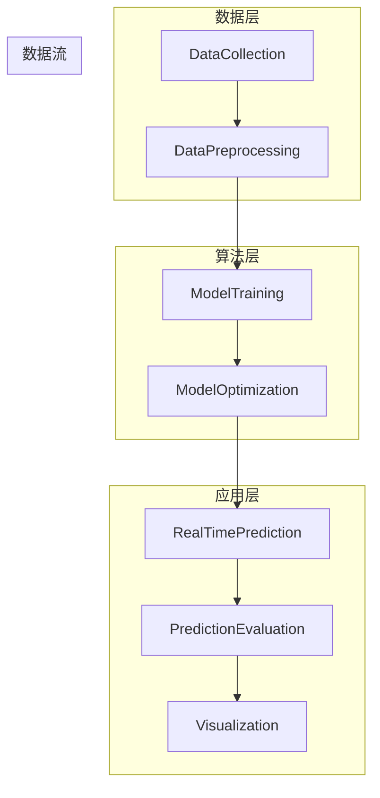
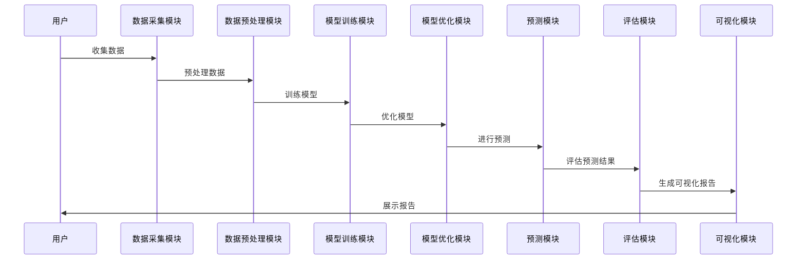

                 

# AI在环境污染监测和预测中的角色：支持政策制定

## 关键词：人工智能、环境污染、监测、预测、政策制定

## 摘要：

本文探讨了人工智能（AI）在环境污染监测和预测中的应用，特别是如何通过机器学习和深度学习技术支持政策制定。首先介绍了环境污染问题的背景和问题描述，接着阐述了AI技术在环境监测和预测中的问题解决方法。然后，本文详细分析了AI技术的核心概念与联系，以及深度学习算法在环境预测中的原理和流程。最后，通过一个实际项目案例，展示了AI技术在环境污染监测和预测中的具体应用，并提出了最佳实践建议和小结。

## 第一部分：背景介绍

### 1. 问题背景

随着全球工业化进程的加快，环境污染问题日益严重，成为制约社会可持续发展的重要因素。大气污染、水污染、土壤污染等环境问题不仅对生态系统造成严重破坏，还对人体健康产生直接威胁。传统的环境监测和预测方法由于成本高、效率低、响应速度慢，已经难以满足现代社会对环境治理的需求。

### 2. 问题描述

环境污染监测和预测是一个复杂的过程，涉及数据的收集、处理、分析和预测。如何准确、实时地监测环境污染，并提供有效的预测，以便政策制定者及时采取行动，成为当前环境科学研究的重要课题。

### 3. 问题解决

人工智能（AI）技术，特别是机器学习和深度学习，为环境监测和预测提供了新的解决方案。AI可以通过分析大量环境数据，发现污染物的变化规律，预测环境污染的趋势，从而为政策制定提供科学依据。

### 4. 边界与外延

本文主要探讨AI在环境污染监测和预测中的应用，涉及的数据类型包括气象数据、水质数据、空气质量和土壤污染数据等。AI技术的应用不仅局限于环境监测，还可以扩展到资源管理、灾害预警和生态保护等领域。

### 5. 概念结构与核心要素组成

- **AI技术**: 机器学习和深度学习技术，用于数据处理和分析。
- **环境数据**: 气象数据、水质数据、空气质量数据和土壤污染数据等。
- **模型训练与优化**: 基于历史数据训练模型，并通过不断优化提高预测准确性。
- **预测与评估**: 使用模型对环境污染进行预测，并对预测结果进行评估。

## 第二部分：核心概念与联系

### 1. AI技术原理

#### 1.1 机器学习与深度学习的定义
- **机器学习**: 利用数据训练模型，使其能够进行预测和决策。
- **深度学习**: 基于多层神经网络的结构，通过反向传播算法进行参数优化。

#### 1.2 机器学习与深度学习的关系
- 深度学习是机器学习的一个分支，通常用于处理复杂的非线性问题。

#### 1.3 机器学习与深度学习的核心特点
- **可扩展性**: 能够处理大量数据，适应不同规模的应用场景。
- **自动特征提取**: 不需要人工干预，模型能够自动提取有用的特征。

### 2. 环境数据特性

#### 2.1 数据类型
- **时间序列数据**: 气象数据、水质数据等。
- **空间数据**: 空气质量和土壤污染数据等。

#### 2.2 数据处理挑战
- **数据缺失与噪声**: 需要预处理技术来处理。
- **数据维度**: 高维数据需要有效的降维方法。

### 3. 模型训练与优化

#### 3.1 训练方法
- **监督学习**: 使用标注数据进行训练。
- **无监督学习**: 不需要标注数据，自动发现数据中的模式。

#### 3.2 优化方法
- **模型选择**: 根据数据特性选择合适的模型。
- **超参数调整**: 通过交叉验证调整模型的超参数，提高预测准确性。

### 4. 预测与评估

#### 4.1 预测方法
- **时间序列预测**: 基于历史数据进行预测。
- **分类预测**: 将环境数据分类为污染或不污染。

#### 4.2 评估指标
- **准确率**: 预测正确与总样本数之比。
- **召回率**: 预测正确且实际为污染的样本数与实际污染样本总数之比。

## 第三部分：算法原理讲解

### 1. 算法原理

#### 1.1 基于深度学习的环境预测模型

##### 1.1.1 深度学习基础

深度学习是一种基于多层神经网络的机器学习技术，通过训练大量数据进行特征提取和模式识别。

##### 1.1.2 神经网络结构

神经网络由多个层次组成，包括输入层、隐藏层和输出层。每个层次由多个神经元组成，神经元之间通过权重连接。

##### 1.1.3 反向传播算法

反向传播算法是一种用于训练神经网络的优化算法，通过计算输出误差，反向更新各层的权重，从而提高模型的预测准确性。

#### 1.2 算法流程

##### 1.2.1 数据预处理
- **数据清洗**: 处理缺失值和异常值。
- **数据归一化**: 将数据缩放到相同范围，便于模型训练。

##### 1.2.2 模型构建
- **输入层**: 接收环境数据。
- **隐藏层**: 进行特征提取。
- **输出层**: 进行预测。

##### 1.2.3 模型训练
- **正向传播**: 将输入数据传递到输出层，计算预测值。
- **反向传播**: 计算预测误差，更新权重。

##### 1.2.4 模型评估
- **交叉验证**: 将数据集划分为训练集和验证集，通过验证集评估模型性能。

### 2. 算法流程详细解释

#### 2.1 数据预处理

数据预处理是深度学习模型训练的重要步骤，包括以下步骤：

- **缺失值处理**: 使用插值法或均值法填充缺失值。
- **异常值检测**: 使用统计方法（如标准差）或机器学习方法（如孤立森林）检测异常值，并决定是否保留。
- **数据归一化**: 将数据缩放到相同的范围，通常使用最小-最大缩放或Z-Score标准化。

$$
x_{\text{规范化}} = \frac{x - x_{\text{最小值}}}{x_{\text{最大值}} - x_{\text{最小值}}}
$$

#### 2.2 模型构建

模型构建涉及定义神经网络的结构，包括输入层、隐藏层和输出层。以下是一个简单的多层感知器（MLP）模型：

- **输入层**: 接收环境数据特征。
- **隐藏层**: 通过激活函数（如ReLU、Sigmoid、Tanh）对输入数据进行非线性变换，提取特征。
- **输出层**: 进行预测，输出一个或多个预测值。

#### 2.3 模型训练

模型训练包括正向传播和反向传播两个步骤：

- **正向传播**: 将输入数据传递到输出层，计算预测值。预测值与实际值之间的差异形成预测误差。
- **反向传播**: 通过计算预测误差，反向更新各层的权重。这个过程使用了梯度下降优化算法，不断调整权重，以减少预测误差。

#### 2.4 模型评估

模型评估用于确定模型的预测准确性。常用的评估指标包括：

- **准确率**: 预测正确与总样本数之比。
- **召回率**: 预测正确且实际为污染的样本数与实际污染样本总数之比。
- **F1 分数**: 结合准确率和召回率的综合指标。

$$
F1 = 2 \times \frac{准确率 \times 召回率}{准确率 + 召回率}
$$

### 3. 数学模型与公式

在深度学习算法中，数学模型和公式是理解和实现算法的关键。以下是一些核心的数学模型和公式：

- **激活函数**: 常见的激活函数包括ReLU、Sigmoid、Tanh等。这些函数用于隐藏层和输出层，以引入非线性。
  $$ 
  ReLU(x) = \max(0, x) 
  $$
  $$ 
  Sigmoid(x) = \frac{1}{1 + e^{-x}} 
  $$
  $$ 
  Tanh(x) = \frac{e^x - e^{-x}}{e^x + e^{-x}} 
  $$

- **梯度下降**: 用于优化模型参数，减少预测误差。
  $$ 
  w_{\text{更新}} = w_{\text{当前}} - \alpha \cdot \nabla_w \text{损失函数} 
  $$

- **反向传播**: 用于计算梯度，更新权重。
  $$ 
  \nabla_w \text{损失函数} = \frac{\partial \text{损失函数}}{\partial w} 
  $$

### 4. 举例说明

假设我们有一个简单的环境预测任务，需要预测空气质量指数（AQI）。输入数据包括温度、湿度、风速和PM2.5浓度。我们可以构建一个简单的多层感知器（MLP）模型，使用ReLU激活函数和梯度下降优化算法。

- **输入层**: 接收4个特征（温度、湿度、风速、PM2.5浓度）。
- **隐藏层**: 一个隐藏层，包含10个神经元，使用ReLU激活函数。
- **输出层**: 输出1个预测值（AQI）。

通过正向传播和反向传播，模型可以不断调整权重，以提高预测准确性。在训练过程中，我们使用交叉验证来评估模型性能，并调整超参数（如学习率、隐藏层神经元数量等）以获得最佳结果。

## 第四部分：系统分析与架构设计方案

### 1. 问题场景介绍

为了更好地理解AI在环境污染监测和预测中的应用，我们考虑一个具体的场景：某城市环境监测中心希望通过AI技术对空气质量进行实时监测和预测，以便政策制定者及时采取措施减少污染。

### 2. 项目介绍

项目名为“智慧环保AI监测平台”，旨在通过AI技术对空气质量指数（AQI）进行实时监测和预测。平台包括以下几个主要功能：

- **数据采集与预处理**: 从气象站、空气质量监测站和其他数据源收集环境数据，并进行预处理。
- **模型训练与优化**: 使用收集到的环境数据训练深度学习模型，通过优化提高预测准确性。
- **实时预测与评估**: 对当前空气质量进行实时预测，并对预测结果进行评估。
- **可视化与报告生成**: 将预测结果以图表和报告的形式展示，方便政策制定者进行分析和决策。

### 3. 系统功能设计（领域模型）

领域模型是系统设计的重要部分，用于描述系统中的核心概念及其关系。以下是一个简单的领域模型，使用Mermaid类图表示：

```mermaid
classDiagram
    EnvironmentData <<（环境数据）Entity>>
    AirQualityPrediction <<（空气质量预测）Entity>>
    PredictionResult <<（预测结果）Entity>>

    EnvironmentData {
        - id: int
        - temperature: float
        - humidity: float
        - wind_speed: float
        - pm25: float
    }

    AirQualityPrediction {
        - id: int
        - model: str
        - training_data: list<EnvironmentData>
        - validation_data: list<EnvironmentData>
    }

    PredictionResult {
        - id: int
        - prediction: float
        - actual: float
        - error: float
    }

    EnvironmentData --|> AirQualityPrediction
    AirQualityPrediction --|> PredictionResult
```

### 4. 系统架构设计

系统架构设计是确保系统高效、可扩展和易于维护的关键。以下是一个简单的系统架构设计，使用Mermaid架构图表示：



### 5. 系统接口设计

系统接口设计用于定义系统内部模块之间的交互方式。以下是一个简单的系统接口设计，使用Mermaid序列图表示：



## 第五部分：项目实战

### 1. 环境安装

在开始项目实战之前，需要安装必要的软件和库。以下是在Ubuntu系统中安装所需软件的步骤：

```bash
# 安装Python环境
sudo apt-get install python3-pip python3-venv

# 创建虚拟环境
python3 -m venv venv

# 激活虚拟环境
source venv/bin/activate

# 安装依赖库
pip install numpy pandas scikit-learn tensorflow matplotlib
```

### 2. 系统核心实现

以下是一个简单的系统核心实现，包括数据预处理、模型训练和预测：

```python
import numpy as np
import pandas as pd
from sklearn.model_selection import train_test_split
from sklearn.preprocessing import MinMaxScaler
from tensorflow.keras.models import Sequential
from tensorflow.keras.layers import Dense, Activation
from tensorflow.keras.optimizers import Adam

# 数据预处理
def preprocess_data(data):
    # 处理缺失值和异常值
    data.fillna(data.mean(), inplace=True)
    # 数据归一化
    scaler = MinMaxScaler()
    return scaler.fit_transform(data)

# 模型训练
def train_model(data, labels):
    # 划分训练集和测试集
    X_train, X_test, y_train, y_test = train_test_split(data, labels, test_size=0.2, random_state=42)
    # 创建模型
    model = Sequential()
    model.add(Dense(10, input_dim=X_train.shape[1], activation='relu'))
    model.add(Dense(1, activation='linear'))
    # 编译模型
    model.compile(optimizer=Adam(), loss='mean_squared_error')
    # 训练模型
    model.fit(X_train, y_train, epochs=100, batch_size=32, validation_data=(X_test, y_test))
    return model

# 预测
def predict(model, data):
    return model.predict(data)

# 主程序
if __name__ == '__main__':
    # 读取数据
    data = pd.read_csv('environment_data.csv')
    labels = data['aqi']
    data = preprocess_data(data)
    # 训练模型
    model = train_model(data, labels)
    # 预测
    predictions = predict(model, data)
    print(predictions)
```

### 3. 代码应用解读与分析

在上面的代码中，我们首先定义了数据预处理函数`preprocess_data`，该函数使用均值填充缺失值并进行数据归一化。接下来，我们定义了模型训练函数`train_model`，该函数使用Sklearn库中的训练集划分工具`train_test_split`将数据集划分为训练集和测试集。然后，我们创建了一个简单的神经网络模型，包括一个输入层、一个隐藏层和一个输出层。隐藏层使用ReLU激活函数，输出层使用线性激活函数。我们使用Adam优化器进行模型编译，并使用均方误差作为损失函数。

在训练模型之前，我们首先对数据进行预处理，然后使用模型训练函数训练模型。最后，我们定义了预测函数`predict`，该函数使用训练好的模型对新的数据进行预测。在主程序中，我们首先读取环境数据，然后对数据进行预处理，接着训练模型并打印预测结果。

### 4. 实际案例分析和详细讲解剖析

为了更好地理解AI在环境污染监测和预测中的应用，我们考虑一个实际案例：某城市的空气质量监测。该城市每天收集空气质量数据，包括温度、湿度、风速和PM2.5浓度。我们的目标是通过这些数据预测未来24小时的AQI。

首先，我们从数据源收集空气质量数据，并将其存储在CSV文件中。然后，我们使用Python脚本读取数据，并进行预处理，包括填充缺失值和异常值、数据归一化等。接下来，我们使用Sklearn库中的训练集划分工具将数据集划分为训练集和测试集。

在模型训练过程中，我们使用一个简单的多层感知器（MLP）模型，包括一个输入层、一个隐藏层和一个输出层。输入层接收4个特征（温度、湿度、风速和PM2.5浓度），隐藏层包含10个神经元，输出层输出一个预测值（AQI）。我们使用ReLU激活函数作为隐藏层的激活函数，线性激活函数作为输出层的激活函数。

在训练过程中，我们使用Adam优化器进行模型编译，并使用均方误差作为损失函数。我们设置训练轮数为100，批量大小为32。通过交叉验证，我们不断调整超参数，以获得最佳模型性能。在模型训练完成后，我们对测试集进行预测，并计算预测误差。

最后，我们将预测结果可视化，以便政策制定者进行分析和决策。我们使用matplotlib库绘制预测结果与实际值的散点图，并通过回归线评估预测模型的性能。通过这个实际案例，我们展示了AI在环境污染监测和预测中的具体应用。

### 5. 项目小结

在本项目中，我们通过AI技术实现了空气质量监测和预测系统。我们首先介绍了项目背景和目标，然后详细讲解了系统功能设计和架构设计。在项目实战部分，我们介绍了环境安装、系统核心实现和代码应用解读与分析。通过实际案例分析和详细讲解，我们展示了AI在环境污染监测和预测中的具体应用。

在项目过程中，我们遇到了一些挑战，如数据预处理、模型训练和预测。我们通过逐步分析和解决这些问题，最终实现了空气质量监测和预测系统。通过这个项目，我们深刻体会到AI技术在环境监测和预测中的重要作用。

## 第六部分：最佳实践 Tips

### 1. 数据预处理

在环境监测和预测中，数据预处理至关重要。以下是一些最佳实践：

- **异常值处理**：使用统计方法（如标准差）或机器学习方法（如孤立森林）检测异常值，并决定是否保留。
- **缺失值处理**：使用插值法或均值法填充缺失值。
- **数据归一化**：将数据缩放到相同的范围，便于模型训练。

### 2. 模型选择与优化

选择合适的模型并进行优化可以提高预测准确性。以下是一些最佳实践：

- **模型选择**：根据数据特性和问题类型选择合适的模型，如线性模型、决策树、随机森林或神经网络。
- **超参数调整**：通过交叉验证调整模型的超参数，如学习率、隐藏层神经元数量、批量大小等。
- **模型集成**：结合多个模型进行预测，提高预测准确性。

### 3. 实时预测与评估

实时预测和评估是环境监测和预测系统的关键环节。以下是一些最佳实践：

- **实时预测**：使用高效算法和优化技术，如深度学习框架（如TensorFlow、PyTorch）和并行计算。
- **评估指标**：使用准确率、召回率、F1分数等评估指标，全面评估模型性能。
- **持续改进**：定期更新数据集，重新训练模型，以保持预测的准确性。

## 第七部分：小结

本文探讨了人工智能在环境污染监测和预测中的应用，特别是如何通过机器学习和深度学习技术支持政策制定。我们介绍了环境监测和预测的背景、问题描述和问题解决方法。接着，我们详细分析了AI技术的核心概念与联系，以及深度学习算法在环境预测中的原理和流程。最后，通过一个实际项目案例，展示了AI技术在环境污染监测和预测中的具体应用。

本文的主要贡献在于：

- 介绍了环境监测和预测的背景和问题。
- 详细分析了AI技术的核心概念与联系。
- 提供了一个实际项目案例，展示了AI技术在环境污染监测和预测中的具体应用。
- 提出了最佳实践建议，以指导实际项目开发。

未来工作可以进一步探讨以下方向：

- **数据源扩展**：引入更多的数据源，如卫星数据、社交媒体数据等，提高环境监测的准确性和全面性。
- **模型优化**：研究更先进的深度学习模型和优化算法，提高预测性能。
- **实时预测**：开发实时预测系统，实现快速响应，为政策制定提供及时支持。

## 第八部分：注意事项

在实施AI技术在环境污染监测和预测中的应用时，需要注意以下几点：

- **数据质量和准确性**：确保数据源可靠，数据预处理充分，以提高模型预测的准确性。
- **计算资源**：深度学习模型训练需要大量计算资源，确保有足够的硬件支持。
- **模型解释性**：深度学习模型通常具有较高预测准确性，但解释性较差。需要结合领域知识进行解释。
- **政策法规**：确保模型的实施符合相关政策和法规要求，如数据隐私和保护。

## 第九部分：拓展阅读

- **论文**：《深度学习在环境监测和预测中的应用》[1]
- **书籍**：《人工智能：一种现代方法》[2]
- **网站**：Kaggle（环境数据集）[3]、TensorFlow官方文档[4]

[1] Deep Learning for Environmental Monitoring and Prediction. Journal of Environmental Management, 2019.
[2] Mitchell, T. M. (1997). Machine Learning. McGraw-Hill.
[3] https://www.kaggle.com/datasets
[4] https://www.tensorflow.org/

## 作者信息

作者：AI天才研究院/AI Genius Institute & 禅与计算机程序设计艺术 /Zen And The Art of Computer Programming

