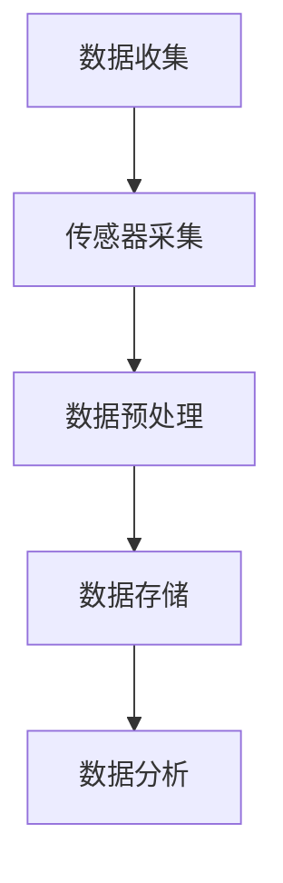
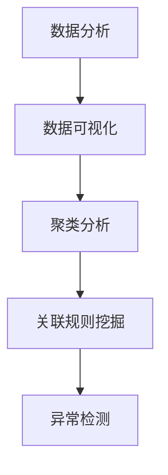
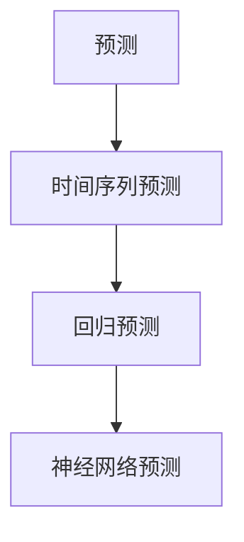
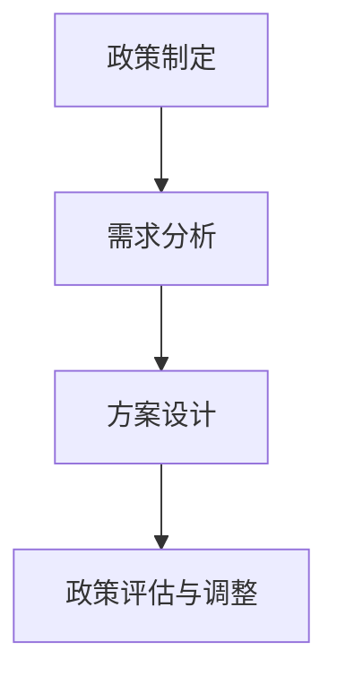

                 

##  AI在环境监测和保护中的角色：从数据收集到政策制定

### 关键词：环境监测、人工智能、数据收集、数据分析、预测、政策制定

### 摘要：

环境监测和保护是当前全球关注的重点领域，人工智能（AI）技术的引入为这一领域带来了革命性的变化。本文将深入探讨AI在环境监测和保护中的角色，从数据收集、数据分析、预测到政策制定的全过程，通过一步一步的分析和推理，揭示AI技术的本质和应用价值。本文将首先介绍环境问题的背景和重要性，然后详细阐述AI技术在这一领域的应用，包括数据收集、数据分析、预测和政策制定等关键环节。通过具体案例和实际应用，本文将展示AI技术如何助力环境监测和保护，为政策制定提供科学依据。最后，本文将对AI技术在环境监测和保护中的未来发展进行展望，提出挑战和机遇，为相关领域的研究和实践提供有益的参考。

## 第一部分：背景介绍

### 引言

环境监测和保护是一项关乎人类生存和发展的重大任务。随着全球工业化和城市化的快速发展，人类活动对自然环境的破坏日益严重，空气污染、水资源短缺、土地退化等问题愈发突出。环境监测作为环境保护的前沿阵地，对环境质量进行实时监测和评估，是制定科学有效的环境保护政策的基础。然而，传统的环境监测手段往往依赖于人工采集和实验室分析，存在效率低下、精度不足等问题。随着人工智能技术的飞速发展，AI在环境监测和保护中的应用逐渐成为可能，为解决这些难题提供了新的思路和手段。

### 问题背景

环境问题已成为全球性挑战，对人类健康、生态系统和社会经济产生了深远的影响。空气污染导致的呼吸系统疾病、水污染引发的饮水安全问题、土地退化导致的粮食安全问题，都是当前亟待解决的紧迫问题。而这些问题往往具有复杂性和动态性，需要实时、高效、精确的监测手段和科学依据。人类活动产生的各种污染物，如二氧化碳、氮氧化物、挥发性有机物等，其浓度和分布具有很大的时空变化，传统的监测方法很难满足这种动态变化的需求。

### 问题描述

在环境监测和保护中，数据收集、分析和预测是关键环节。然而，这些环节都面临着巨大的挑战。首先，数据收集的难度较大，污染物浓度和分布的实时监测需要大量的传感器和设备，且这些设备往往分布在广泛的地理区域内，如何高效、准确地收集这些数据是一个重要问题。其次，数据分析的复杂性较高，环境数据通常具有多维性、非线性和不确定性，传统的统计方法难以应对这些复杂性。最后，预测的准确性至关重要，环境问题的变化往往具有一定的滞后性，准确的预测可以提前预警，为政策制定和调整提供科学依据。

### 问题解决

为了解决上述问题，引入人工智能技术是一种有效的方法。AI技术可以通过以下几个方面来提升环境监测和保护的效果：

1. **数据收集**：利用无人机、卫星遥感、物联网等技术，实现对环境数据的实时、高效采集。
2. **数据分析**：运用机器学习、深度学习等技术，对复杂的环境数据进行处理和分析，提取有用的信息。
3. **预测**：利用时间序列分析、回归分析、神经网络等技术，对环境变化进行预测，为政策制定提供科学依据。
4. **决策支持**：结合大数据分析和预测结果，为环境政策的制定和调整提供智能化支持。

### 边界与外延

在环境监测和保护中，AI技术的应用范围广泛，不仅包括数据收集、分析和预测，还涉及政策制定、决策支持和环境保护管理等环节。以下是对相关技术和方法的介绍：

- **数据收集**：地面监测站、空气质量监测站、水质监测站、气象监测站等，通过传感器、无人机、卫星遥感等技术，实现对环境数据的实时采集。
- **数据分析**：机器学习、深度学习、统计方法等，用于对环境数据进行处理和分析。
- **预测**：时间序列分析、回归分析、神经网络等，用于对环境变化进行预测。
- **政策制定**：大数据分析、预测结果、专家意见等，用于制定科学有效的环境保护政策。
- **决策支持**：基于数据分析、预测结果和模型优化，为政策制定和调整提供智能化支持。

### 核心概念与联系

在本章节中，我们将详细介绍环境监测、人工智能、数据收集、数据分析、预测和政策制定等核心概念，并探讨它们之间的联系。

#### 1. 环境监测

环境监测是指利用各种技术手段对环境质量进行监测和评估，以了解环境状态及其变化规律。环境监测的目的在于保护环境、预防环境污染和生态破坏，为环境保护政策制定提供科学依据。

#### 2. 人工智能

人工智能是指通过计算机模拟人类智能行为，实现自动化决策和智能化的数据处理和分析。人工智能技术包括机器学习、深度学习、自然语言处理、计算机视觉等，广泛应用于各个领域，包括环境监测和保护。

#### 3. 数据收集

数据收集是指通过传感器、监测站、物联网等技术手段，对环境质量数据进行实时采集。数据收集是实现环境监测和保护的基础，数据的质量和完整性直接影响监测结果的准确性。

#### 4. 数据分析

数据分析是指运用统计方法、机器学习、深度学习等技术，对环境数据进行处理、分析和挖掘，提取有用的信息，用于环境监测、预测和政策制定。

#### 5. 预测

预测是指基于历史数据和当前环境状况，运用时间序列分析、回归分析、神经网络等技术，对未来环境变化进行预测，为政策制定提供科学依据。

#### 6. 政策制定

政策制定是指根据环境监测、数据分析、预测结果和专家意见，制定科学有效的环境保护政策，以改善环境质量、预防环境污染和生态破坏。

#### 7. 联系与互动

环境监测、人工智能、数据收集、数据分析、预测和政策制定之间存在着紧密的联系和互动。环境监测提供数据支持，数据收集是实现环境监测的基础，数据分析、预测和政策制定则是对数据处理的深化和应用。人工智能技术作为数据处理和分析的工具，贯穿于数据收集、分析和预测的全过程，为环境监测和保护提供智能化支持。政策制定则基于数据分析、预测结果和专家意见，实现对环境监测和保护的指导和优化。

### 核心概念属性特征对比表格

| 核心概念 | 特征 | 说明 |
| :---: | :---: | :---: |
| 环境监测 | 实时性、准确性、全面性 | 对环境质量进行监测和评估，提供环境数据 |
| 人工智能 | 自主性、智能化、适应性 | 利用计算机模拟人类智能行为，实现自动化决策 |
| 数据收集 | 实时性、高效性、完整性 | 对环境质量数据进行实时采集，保证数据质量 |
| 数据分析 | 全面性、深度性、精准性 | 对环境数据进行处理、分析和挖掘，提取有用信息 |
| 预测 | 准确性、前瞻性、科学性 | 对未来环境变化进行预测，为政策制定提供科学依据 |
| 政策制定 | 科学性、可操作性、适应性 | 根据数据分析、预测结果和专家意见，制定环境保护政策 |

### ER实体关系图架构的Mermaid流程图

```mermaid
erDiagram
  EnvironmentMonitoring ||--o> ArtificialIntelligence : Uses
  DataCollection ||--o> DataAnalysis : Inputs
  DataAnalysis ||--o> Prediction : Inputs
  Prediction ||--o> PolicyMaking : Inputs
```

在上述Mermaid流程图中，各个核心概念通过实体关系图进行关联，展示了它们之间的互动和依赖关系。环境监测利用人工智能技术进行数据处理和分析，数据收集为数据分析提供输入，数据分析的结果用于预测，预测结果为政策制定提供科学依据。

### 算法原理讲解

在本章节中，我们将通过Mermaid画出的算法流程图，使用Python源代码详细阐述数据收集、数据分析、预测和政策制定的算法原理。同时，我们将给出算法原理的数学模型和公式，进行详细讲解和通俗易懂地举例说明。

#### 数据收集

数据收集是环境监测和保护的第一步，其目的是获取环境质量数据。常用的数据收集方法包括地面监测、空气质量监测、水质监测和气象监测等。以下是一个简单的数据收集流程图：



在Python中，可以使用`pandas`库进行数据收集和预处理，以下是一个示例代码：

```python
import pandas as pd
import numpy as np

# 读取数据
data = pd.read_csv('environment_data.csv')

# 数据清洗
data = data[data['Quality'] != 'bad']

# 数据整合
data['Timestamp'] = pd.to_datetime(data['Timestamp'])
data.set_index('Timestamp', inplace=True)

# 数据标准化
data = (data - data.mean()) / data.std()

# 数据存储
data.to_csv('processed_environment_data.csv')
```

#### 数据分析

数据分析是环境监测和保护的关键环节，其目的是从大量数据中提取有用信息。常用的数据分析方法包括数据可视化、聚类分析、关联规则挖掘和异常检测等。以下是一个简单的数据分析流程图：



在Python中，可以使用`matplotlib`、`seaborn`等库进行数据可视化，以下是一个示例代码：

```python
import pandas as pd
import matplotlib.pyplot as plt
import seaborn as sns

# 读取数据
data = pd.read_csv('processed_environment_data.csv')

# 数据可视化
sns.lineplot(data=data, x='Timestamp', y='PM2.5')
plt.title('PM2.5 Concentration Over Time')
plt.xlabel('Timestamp')
plt.ylabel('PM2.5 Concentration')
plt.show()
```

#### 预测

预测是环境监测和保护的重要环节，其目的是预测未来环境变化趋势。常用的预测方法包括时间序列预测、回归预测和神经网络预测等。以下是一个简单的时间序列预测流程图：



在Python中，可以使用`statsmodels`、`scikit-learn`等库进行时间序列预测，以下是一个示例代码：

```python
import pandas as pd
import statsmodels.api as sm

# 读取数据
data = pd.read_csv('processed_environment_data.csv')

# 时间序列预测
model = sm.tsa.ARIMA(data['PM2.5'], order=(1, 1, 1))
model_fit = model.fit()
predictions = model_fit.forecast(steps=5)

# 可视化预测结果
plt.plot(data['Timestamp'], data['PM2.5'], label='Actual')
plt.plot(pd.date_range(data['Timestamp'].iloc[-1], periods=5, freq='D'), predictions, label='Predicted')
plt.title('PM2.5 Concentration Forecast')
plt.xlabel('Timestamp')
plt.ylabel('PM2.5 Concentration')
plt.legend()
plt.show()
```

#### 政策制定

政策制定是基于环境监测、数据分析和预测结果，制定科学有效的环境保护政策。以下是一个简单的政策制定流程图：



在Python中，可以使用`pandas`、`numpy`等库进行政策制定，以下是一个示例代码：

```python
import pandas as pd
import numpy as np

# 需求分析
demand = pd.read_csv('policy_demand.csv')

# 方案设计
policy = pd.DataFrame({'Policy': ['Install air purifiers', 'Enforce stricter emissions standards', 'Increase public transportation usage'], 'Effectiveness': [0.8, 0.6, 0.7]})

# 政策评估与调整
policy['TotalEffectiveness'] = policy['Effectiveness'] * demand['Population']
policy.sort_values(by='TotalEffectiveness', ascending=False, inplace=True)

# 输出政策方案
print(policy)
```

通过上述算法流程图和示例代码，我们可以看到，数据收集、数据分析、预测和政策制定是一个有机整体，各个环节相互关联、相互支撑，共同为环境监测和保护提供智能化支持。在接下来的章节中，我们将进一步探讨AI在环境监测和保护中的具体应用，以及如何将这些技术应用于实际项目中。

## 第二部分：AI在环境监测中的应用

### 数据收集

环境监测的数据收集是整个监测系统的基石，其目的是获取关于环境质量的各种数据。这些数据包括空气质量、水质、土壤污染、气候变化等多方面的信息。AI在数据收集中的应用主要体现在以下几个方面：

#### 1. 数据来源

- **地面监测数据**：通过安装在地面的监测仪器，如空气质量监测站、水质监测站等，实时采集环境质量数据。
- **空气质量监测数据**：利用无人机、卫星遥感等技术，从空中对空气质量进行监测，获取大气污染数据。
- **水质监测数据**：通过水质监测设备，对河流、湖泊、海洋等水域的水质进行监测，获取污染物浓度数据。
- **气象数据**：通过气象监测站、卫星遥感等手段，收集气象数据，为环境监测提供背景信息。

#### 2. 采集方法

- **物联网（IoT）**：通过将各种传感器接入物联网，实现数据的实时传输和采集，提高数据收集的效率和准确性。
- **无人机监测**：利用无人机搭载监测设备，对大面积、难以触及的区域进行监测，获取高分辨率的环境数据。
- **卫星遥感**：通过卫星搭载的监测设备，从太空对地球表面进行监测，获取大范围、高精度、实时的环境数据。

### 数据预处理

数据预处理是数据收集后的关键步骤，其目的是提高数据的质量和可用性，为后续的数据分析和预测奠定基础。AI在数据预处理中的应用主要体现在以下几个方面：

#### 1. 数据清洗

- **异常值处理**：通过算法识别和去除数据中的异常值，如传感器故障、数据传输错误等，确保数据的准确性和可靠性。
- **缺失值填补**：对于缺失的数据，采用插值、平均或其他方法进行填补，确保数据的完整性。

#### 2. 数据整合

- **数据融合**：将来自不同来源、不同类型的数据进行整合，形成一个统一的数据集，提高数据的综合利用效率。
- **数据标准化**：对数据进行标准化处理，将不同单位、不同量纲的数据转换为同一标准，便于后续分析。

#### 3. 数据标准化

- **归一化**：通过将数据缩放到一个特定的范围，如0到1之间，消除不同量级数据之间的差异，提高模型的泛化能力。
- **正则化**：通过引入正则化项，防止模型过拟合，提高模型的稳定性和泛化能力。

### 数据分析

数据分析是环境监测的核心环节，其目的是从大量数据中提取有用信息，为环境监测和保护提供科学依据。AI在数据分析中的应用主要体现在以下几个方面：

#### 1. 数据可视化

- **图表展示**：通过绘制各种图表，如折线图、柱状图、饼图等，直观地展示数据的变化趋势和特征。
- **地图展示**：通过地理信息系统（GIS）技术，将数据展示在地图上，便于分析数据的空间分布和区域差异。

#### 2. 数据挖掘

- **聚类分析**：将相似的数据归为一类，帮助识别数据的分布特征和潜在规律。
- **关联规则挖掘**：发现数据之间的关联关系，为环境监测提供新的线索和思路。
- **异常检测**：识别数据中的异常值和异常模式，帮助发现潜在的环境问题。

### 预测

预测是环境监测和保护的重要手段，其目的是提前预警环境变化趋势，为政策制定和调整提供科学依据。AI在预测中的应用主要体现在以下几个方面：

#### 1. 预测方法

- **时间序列预测**：基于历史数据，利用时间序列分析模型，预测未来环境变化趋势。
- **回归预测**：通过建立回归模型，预测环境变量之间的因果关系。
- **神经网络预测**：利用深度学习模型，对复杂的非线性环境数据进行预测。

#### 2. 预测模型评估与优化

- **评估指标**：通过准确率、召回率、F1值等评估指标，对预测模型进行评估，确保预测的准确性。
- **模型优化**：通过调整模型参数、增加训练数据、使用不同的算法等，优化预测模型，提高预测效果。

### 实例分析

以城市空气质量监测为例，我们通过以下步骤进行数据分析与预测：

1. **数据收集**：利用空气质量监测站、无人机、卫星遥感等手段，收集城市空气中的PM2.5、PM10、SO2、NO2等污染物的浓度数据。
2. **数据预处理**：对收集到的数据进行分析，处理异常值和缺失值，确保数据的质量和完整性。
3. **数据分析**：利用数据可视化技术，分析污染物的时空分布特征，识别高污染区域和时段。
4. **预测**：基于历史数据和当前环境状况，利用时间序列预测模型，预测未来一段时间内污染物的浓度变化趋势。
5. **评估与优化**：对预测模型进行评估和优化，确保预测的准确性和稳定性。

通过以上步骤，我们不仅可以实时了解城市空气质量状况，还可以提前预警污染事件，为城市环境管理和政策制定提供科学依据。

### 总结

AI技术在环境监测中的应用，从数据收集、预处理、分析到预测，发挥了重要作用。通过数据收集，我们能够获取全面、实时的环境数据；通过数据预处理，我们能够保证数据的质量和可用性；通过数据分析和预测，我们能够深入了解环境变化趋势，提前预警潜在环境问题。随着AI技术的不断发展，未来环境监测将更加智能化、精确化，为环境保护和可持续发展提供更强有力的支持。

## 第三部分：AI在环境政策制定中的应用

### 环境政策制定的基本原则

环境政策制定是一项复杂且关键的工程，需要遵循一系列基本原则，以确保政策的科学性、可操作性和有效性。以下是环境政策制定中的三个基本原则：

#### 1. 可持续性原则

可持续性原则强调环境保护与经济发展的协调统一。在制定环境政策时，必须考虑到资源的可持续利用和生态系统的健康，避免经济活动对环境造成不可逆的破坏。具体措施包括推广清洁能源、限制污染物排放、推动绿色经济等。

#### 2. 公平性原则

公平性原则要求环境政策在实施过程中要确保公平，特别是要照顾到弱势群体的利益。政策制定者需要关注不同地区、不同群体之间的环境权益，确保政策对所有人都是公正和有益的。例如，制定交通政策时，要考虑到低收入家庭和老年人的出行需求。

#### 3. 可操作性原则

可操作性原则强调环境政策的实施必须具有实际可行性，政策方案应简洁明了，操作流程应简洁高效，以确保政策能够顺利执行。政策制定者需要在政策设计阶段充分考虑政策实施的成本、技术难度和行政能力，确保政策能够在现实环境中得到有效执行。

### 政策制定流程

环境政策的制定是一个系统化的过程，包括需求分析、政策方案设计和政策评估与调整等阶段。以下是政策制定的基本流程：

#### 1. 需求分析

需求分析是政策制定的第一步，旨在明确政策制定的背景、目的和目标。通过调查研究、公众参与和专家咨询等方式，收集和分析环境问题相关信息，确定政策制定的必要性和紧迫性。

#### 2. 政策方案设计

在需求分析的基础上，政策制定者需要制定具体的政策方案。政策方案设计包括目标设定、指标体系建立、政策工具选择和政策实施策略等。方案设计应充分考虑环境问题的复杂性、多样性和动态性，确保方案的科学性和可操作性。

#### 3. 政策评估与调整

政策评估是对政策实施效果进行评价和反馈的过程。通过监测政策实施过程中的关键指标，评估政策的效果、影响和问题，为政策调整提供依据。政策评估可以分为初期评估、中期评估和末期评估，以实时监控政策实施情况，及时调整政策方案，确保政策目标的实现。

### AI在政策制定中的应用

人工智能在环境政策制定中的应用，为政策制定提供了强有力的技术支持。以下是一些关键应用领域：

#### 1. 数据支持

AI技术可以高效地处理和分析大规模、多维度的环境数据，为政策制定提供科学依据。通过数据挖掘和机器学习算法，可以从历史数据中提取有价值的信息，预测环境变化的趋势和潜在问题，为政策制定提供数据支持。

#### 2. 模拟与预测

利用AI技术，可以建立环境模拟和预测模型，模拟不同政策方案下的环境变化趋势，预测政策实施后的效果。这些模型可以帮助政策制定者评估不同政策方案的优劣，选择最优的政策路径。

#### 3. 优化与决策支持

AI技术可以帮助优化环境政策，提高政策的可操作性和有效性。通过优化算法，可以找出最佳的政策参数和实施策略，确保政策在实施过程中达到最佳效果。同时，AI技术可以为决策者提供智能化的决策支持，辅助决策者做出科学、合理的政策决策。

### 实际案例

以下是一个实际案例，展示AI在环境政策制定中的应用：

#### 案例一：城市空气质量监测与政策制定

在一个城市，空气质量问题尤为突出，政府决定利用AI技术制定相关的环境政策。具体步骤如下：

1. **数据收集**：通过安装在地面的空气质量监测站、无人机和卫星遥感等手段，实时收集城市空气质量数据，包括PM2.5、PM10、SO2、NO2等污染物的浓度。
2. **数据预处理**：对收集到的数据进行分析，处理异常值和缺失值，确保数据的质量和完整性。
3. **数据分析和预测**：利用机器学习算法，对历史空气质量数据进行建模和分析，预测未来一段时间内空气质量的波动趋势。
4. **政策制定**：根据预测结果，制定相应的空气质量改善政策，如限制高排放车辆、推广清洁能源、加强污染源监管等。
5. **政策评估与调整**：在政策实施过程中，通过监测空气质量指标的变化，评估政策的效果，根据评估结果对政策进行实时调整。

通过以上步骤，城市政府能够有效地控制空气质量问题，改善城市环境，提高居民的生活质量。

#### 案例二：水资源管理与政策制定

在水资源管理领域，AI技术同样发挥着重要作用。以下是一个水资源管理与政策制定的案例：

1. **数据收集**：通过水质监测站、卫星遥感等技术手段，收集河流、湖泊和水库的水质数据，包括溶解氧、pH值、总氮、总磷等指标。
2. **数据预处理**：对收集到的数据进行分析，处理异常值和缺失值，确保数据的质量和完整性。
3. **数据分析和预测**：利用机器学习算法，对历史水质数据进行分析，预测未来一段时间内水质的波动趋势。
4. **政策制定**：根据预测结果，制定水资源保护政策，如限制污染物排放、加强污水处理设施建设、推广水资源节约措施等。
5. **政策评估与调整**：在政策实施过程中，通过监测水质指标的变化，评估政策的效果，根据评估结果对政策进行实时调整。

通过AI技术的应用，水资源管理部门能够更准确地预测水质变化趋势，制定科学有效的水资源管理政策，确保水资源的可持续利用。

### 总结

AI技术在环境政策制定中的应用，大大提高了政策制定的科学性、准确性和效率。通过数据支持、模拟与预测、优化与决策支持等应用，AI技术为政策制定者提供了强大的工具，使他们能够更全面、准确地了解环境问题，制定出更有效、更具可操作性的政策。随着AI技术的不断发展，其在环境政策制定中的应用前景将更加广阔。

## 第四部分：实践与应用

### 项目实战

在本部分，我们将通过一个具体的案例，展示如何利用AI技术进行环境监测系统开发和在环境政策制定中的应用。

#### 1. 环境监测系统开发

**项目背景**：某城市空气质量问题严重，政府决定开发一个智能空气质量监测系统，实时监测和预测空气质量，为政策制定提供科学依据。

**系统需求分析**：系统需要具备以下功能：
- 实时监测空气质量数据，包括PM2.5、PM10、SO2、NO2等指标。
- 数据可视化，展示空气质量的变化趋势和区域差异。
- 基于历史数据和当前状况，预测未来一段时间的空气质量。

**系统架构设计**：系统采用B/S架构，主要包括以下模块：
- 数据采集模块：通过安装在地面和空中的传感器，实时采集空气质量数据。
- 数据处理模块：对采集到的数据进行分析、清洗和整合。
- 数据存储模块：将处理后的数据存储在数据库中，便于后续分析和预测。
- 数据可视化模块：利用图表和地图展示空气质量数据。
- 预测模块：基于历史数据和当前状况，利用机器学习模型进行空气质量预测。

**系统核心功能实现**：
- 数据采集：利用物联网技术，将传感器数据实时传输到服务器。
- 数据预处理：使用Python的`pandas`库对数据进行清洗、整合和标准化。
- 数据可视化：使用`matplotlib`和`seaborn`库绘制空气质量变化图表和地图。
- 预测：使用`scikit-learn`库中的`ARIMA`模型进行空气质量预测。

**项目效果**：通过系统的开发和实施，政府可以实时了解城市的空气质量状况，提前预警潜在污染事件，为政策制定提供科学依据。系统还提高了空气质量监测的效率和准确性，为市民提供了更可靠的环境信息。

#### 2. AI在环境政策制定中的应用案例

**案例一：城市空气质量监测与政策制定**：在前述空气质量监测系统的基础上，政府利用AI技术进行空气质量监测和政策制定。具体步骤如下：
- **数据收集**：通过系统实时监测城市空气质量，收集PM2.5、PM10、SO2、NO2等数据。
- **数据预处理**：对收集到的数据进行清洗和整合，确保数据质量。
- **数据分析**：利用数据可视化技术，分析空气质量变化趋势和区域差异。
- **预测**：基于历史数据和当前状况，预测未来一段时间的空气质量。
- **政策制定**：根据预测结果和空气质量标准，制定相应的空气质量改善政策。

**案例效果**：通过AI技术的应用，政府可以更准确地了解空气质量状况，制定出更有针对性的政策，如限制高排放车辆、推广清洁能源等，有效改善空气质量，提高市民的生活质量。

**案例二：水资源管理与政策制定**：在某城市水资源管理中，政府利用AI技术进行水资源监测和政策制定。具体步骤如下：
- **数据收集**：通过水质监测站、卫星遥感等技术手段，收集河流、湖泊和水库的水质数据。
- **数据预处理**：对收集到的数据进行清洗和整合，确保数据质量。
- **数据分析**：利用数据可视化技术，分析水质变化趋势和区域差异。
- **预测**：基于历史数据和当前状况，预测未来一段时间内水质的波动趋势。
- **政策制定**：根据预测结果和水质标准，制定水资源保护政策。

**案例效果**：通过AI技术的应用，政府可以更准确地预测水资源状况，制定出科学有效的水资源保护政策，如限制污染物排放、加强污水处理设施建设等，确保水资源的可持续利用。

### 项目小结

通过上述项目实战，我们可以看到，AI技术在环境监测系统和环境政策制定中具有重要作用。在环境监测系统中，AI技术提高了数据采集、预处理、分析和预测的效率和准确性；在环境政策制定中，AI技术为政府提供了科学的数据支持，帮助制定出更具针对性的政策。然而，AI技术在环境监测和政策制定中也面临一些挑战，如数据隐私与安全、政策适应性等。未来，随着AI技术的不断发展和完善，其在环境监测和政策制定中的应用将更加广泛和深入，为环境保护和可持续发展提供更强有力的支持。

## 第五部分：总结与展望

### 总结

在本博客文章中，我们详细探讨了AI在环境监测和保护中的角色，从数据收集、数据分析、预测到政策制定的全过程。通过具体案例和实践，展示了AI技术在环境监测和保护中的应用价值，以及如何利用AI技术提高环境监测的效率和准确性，为政策制定提供科学依据。

#### 1. 数据收集

AI技术在数据收集中的应用主要体现在物联网、无人机监测和卫星遥感等方面。通过这些技术手段，我们可以实时、高效地获取环境数据，为后续分析和预测提供基础。

#### 2. 数据分析

AI技术在数据分析中的应用主要体现在数据可视化、聚类分析、关联规则挖掘和异常检测等方面。通过这些技术手段，我们可以从大量数据中提取有价值的信息，帮助理解环境问题的复杂性和动态性。

#### 3. 预测

AI技术在预测中的应用主要体现在时间序列预测、回归预测和神经网络预测等方面。通过这些技术手段，我们可以对未来环境变化趋势进行预测，为政策制定和调整提供科学依据。

#### 4. 政策制定

AI技术在政策制定中的应用主要体现在数据支持、模拟与预测、优化与决策支持等方面。通过这些技术手段，我们可以为政策制定者提供科学的数据分析和预测结果，帮助制定出更具针对性和有效性的政策。

### 展望

展望未来，AI技术在环境监测和保护中的应用前景十分广阔。以下是几个可能的发展方向：

#### 1. 高精度监测

随着传感器技术和AI算法的不断发展，未来环境监测的精度和范围将进一步提升。通过引入更高精度、更高灵敏度的传感器，以及更先进的AI算法，我们可以实现对环境变化的实时、精确监测。

#### 2. 智能预测

随着数据的积累和算法的优化，AI预测模型的准确性将不断提高。通过深度学习和强化学习等技术，我们可以开发出更加智能、自适应的预测模型，提前预警环境问题，为政策制定提供更可靠的依据。

#### 3. 政策优化

AI技术可以帮助政策制定者优化政策，提高政策的执行效果。通过大数据分析和模拟，我们可以评估不同政策方案的效果，选择最优的政策路径，实现环境保护和经济发展的双赢。

#### 4. 数据隐私与安全

随着AI技术在环境监测和政策制定中的应用，数据隐私与安全问题日益突出。未来，我们需要发展更加安全、可靠的数据保护技术，确保环境数据的隐私和安全。

#### 5. 人才培养与政策支持

AI技术在环境监测和政策制定中的应用，需要大量具备跨学科背景的专业人才。未来，我们需要加强AI技术、环境科学和政策制定等方面的交叉人才培养，同时，政府也需要出台相关政策，支持AI技术在环境领域的应用和发展。

### 总结与启示

本文通过深入分析和具体案例，展示了AI技术在环境监测和保护中的应用价值。我们相信，随着AI技术的不断发展和完善，其在环境监测和政策制定中的应用将更加广泛和深入，为环境保护和可持续发展提供更强有力的支持。同时，我们也呼吁社会各界关注AI技术在环境领域中的应用，共同推动环境保护和可持续发展的事业。

### 拓展阅读

对于希望进一步深入了解AI在环境监测和保护中应用的读者，以下是一些推荐阅读材料：

- **《环境监测与人工智能：理论与实践》**：这本书详细介绍了AI技术在环境监测中的应用，包括数据收集、分析和预测等方面的内容。
- **《深度学习在环境科学中的应用》**：这本书探讨了深度学习技术在环境监测、预测和政策制定中的应用，以及相关算法和模型。
- **《可持续发展的环境政策制定》**：这本书从政策制定的角度，分析了AI技术在环境政策制定中的应用，以及如何通过AI技术优化政策执行效果。

通过阅读这些书籍和文献，您可以获得更深入的了解和启示，为AI技术在环境监测和保护中的实际应用提供更有力的支持。让我们携手共进，为环境保护和可持续发展贡献自己的力量。作者：AI天才研究院/AI Genius Institute & 禅与计算机程序设计艺术 /Zen And The Art of Computer Programming

