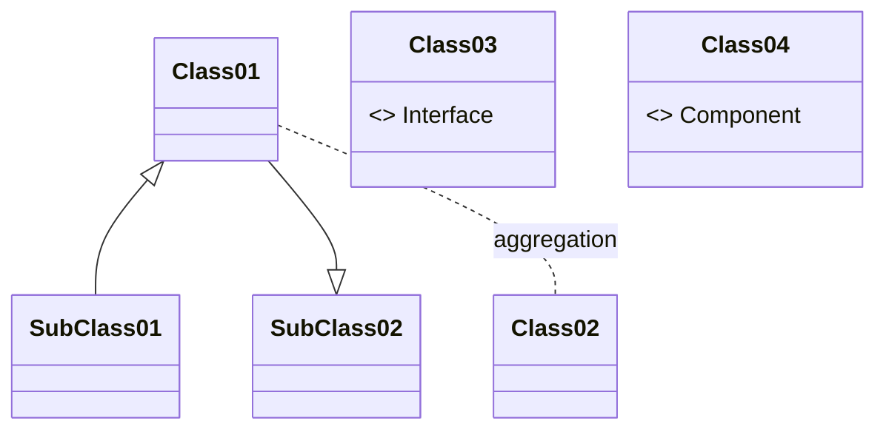
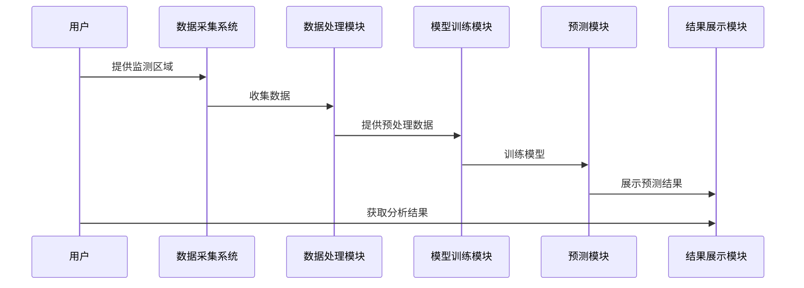

                 

# AI在生物多样性监测中的应用：跟踪物种分布变化

## 关键词
- 生物多样性监测
- AI技术
- 物种分布变化
- 机器学习
- 深度学习
- 数据分析

## 摘要
本文将探讨人工智能（AI）在生物多样性监测中的应用，重点关注通过AI技术跟踪物种分布变化的方法和挑战。我们将深入分析核心概念、相关算法原理、系统架构设计、项目实战，以及最佳实践和未来展望，旨在为科研人员、环境保护者和AI开发者提供实用的指导。

## 引言
### 生物多样性监测的重要性
生物多样性是地球上生命力的体现，维持着生态系统的稳定和人类生活的可持续性。然而，随着人类活动的加剧，生物多样性正面临前所未有的威胁。监测生物多样性变化，及时了解物种分布和生态系统健康状况，对于制定保护措施、减缓生物多样性丧失至关重要。

### AI在生物多样性监测中的作用
人工智能技术，特别是机器学习和深度学习，为生物多样性监测提供了新的工具和方法。通过处理和分析大量复杂数据，AI能够识别物种、预测分布变化、评估生态风险，从而提高监测的准确性和效率。

### 本文结构
本文分为四个部分：

1. **背景与概念**：介绍生物多样性监测的重要性，AI在其中的角色，以及本文将要探讨的应用领域。
2. **核心概念与联系**：阐述AI、生物多样性监测、物种分布变化等核心概念，并分析它们之间的关系。
3. **算法原理讲解**：介绍AI算法在生物多样性监测中的应用，包括机器学习、深度学习等。
4. **项目实战与应用**：通过具体案例展示AI在生物多样性监测中的实际应用，并提供最佳实践和注意事项。

## 第一部分：背景与概念

### 1.1 生物多样性监测的重要性

#### 问题背景
生物多样性是指地球上所有生物的种类、遗传多样性和生态系统的多样性。生物多样性对于地球生态系统的稳定性和人类社会的可持续发展具有重要意义。然而，人类活动导致的栖息地破坏、气候变化、污染等，正使生物多样性面临严重威胁。

#### 问题描述
生物多样性监测旨在通过科学的方法评估和跟踪生物多样性的变化。这包括识别物种、记录分布范围、评估种群数量等。

#### 问题解决
通过定期的生物多样性监测，我们可以及时发现物种分布的变化，评估生态系统的健康状况，从而采取及时有效的保护措施。

#### 边界与外延
生物多样性监测不仅涉及陆地和海洋生态系统，还包括气候、土壤等环境因素。此外，监测方法也涵盖了从传统的野外调查到现代遥感技术。

### 1.2 AI在生物多样性监测中的应用

#### AI的概念
人工智能是指通过计算机模拟人类智能的技术。它包括机器学习、深度学习、自然语言处理等多种方法。

#### 生物多样性监测与AI的关系
AI技术在生物多样性监测中的应用主要体现在数据分析和模式识别上。例如，通过机器学习算法，可以自动识别物种、预测分布变化，提高监测的效率和准确性。

#### AI在生物多样性监测中的应用领域
- **遥感监测**：利用卫星和无人机等技术获取高分辨率影像，结合深度学习算法进行图像处理和分类。
- **声学监测**：通过分析动物叫声，识别物种和种群数量。
- **自动监测系统**：利用传感器和物联网技术，实时监测生物多样性的变化。

### 1.3 本书结构
本文将分为以下几个部分：

- **背景与概念**：介绍生物多样性监测的重要性，AI在其中的角色，以及本文将要探讨的应用领域。
- **核心概念与联系**：阐述AI、生物多样性监测、物种分布变化等核心概念，并分析它们之间的关系。
- **算法原理讲解**：介绍AI算法在生物多样性监测中的应用，包括机器学习、深度学习等。
- **系统分析与架构设计方案**：介绍生物多样性监测系统的设计和实现。
- **项目实战与应用**：通过具体案例展示AI在生物多样性监测中的实际应用。
- **最佳实践与总结**：提供最佳实践和注意事项，以及对未来发展的展望。

## 第二部分：核心概念与联系

### 2.1 AI的概念与分类

#### AI的核心概念
人工智能（AI）是指通过计算机模拟人类智能的技术。它包括多个子领域，如机器学习、深度学习、自然语言处理等。

#### AI的分类
根据应用场景和目标，AI可以分为以下几类：
- **弱AI**：只能完成特定任务的AI系统，如语音识别、图像分类等。
- **强AI**：具有全面智能的AI，能够像人类一样理解和处理各种复杂问题。
- **混合AI**：结合多种AI技术和方法，以实现更复杂的任务。

### 2.2 生物多样性的概念与分类

#### 生物多样性的核心概念
生物多样性是指地球上所有生物的种类、遗传多样性和生态系统的多样性。它包括三个层次：
- **遗传多样性**：生物种内基因的多样性。
- **物种多样性**：生物种类的多样性。
- **生态系统多样性**：不同生态系统类型的多样性。

#### 生物多样性的分类
根据生物多样性的层次，可以将其分为以下几类：
- **遗传多样性**：涉及基因池、基因流和基因频率等。
- **物种多样性**：涉及物种多样性、物种丰富度和物种均匀度等。
- **生态系统多样性**：涉及生态系统类型、生态系统结构和生态系统功能等。

### 2.3 物种分布变化的影响因素

#### 影响因素
物种分布变化受到多种因素的影响，包括：
- **气候变化**：全球变暖、极端天气事件等。
- **人类活动**：城市化、森林砍伐、污染等。
- **栖息地破坏**：栖息地丧失、破碎化、退化等。

#### 物种分布变化的机制
物种分布变化通常涉及以下机制：
- **迁移**：物种为了适应环境变化而向新的栖息地迁移。
- **灭绝**：物种因无法适应环境变化而灭绝。
- **共存**：物种通过适应和竞争，在新的栖息地中建立共存关系。

### 2.4 AI与生物多样性监测的关系

#### 关系概述
AI与生物多样性监测的关系主要体现在以下几个方面：
- **数据采集与处理**：利用AI技术处理和分析大量生物多样性数据，提高监测的准确性和效率。
- **模式识别与预测**：通过AI算法识别物种、预测分布变化，提供科学依据。
- **生态风险评估**：利用AI技术评估人类活动对生态系统的风险，指导保护措施的制定。

#### 应用实例
- **遥感监测**：利用深度学习算法分析卫星影像，识别物种分布。
- **声学监测**：利用自然语言处理技术分析动物叫声，识别物种和种群数量。
- **自动监测系统**：利用物联网技术，实时监测生物多样性的变化。

### 2.5 生物多样性监测与AI的关系总结

#### 总结
生物多样性监测与AI的关系可以总结为以下几点：
- **互补性**：AI技术为生物多样性监测提供了强大的工具和方法，能够提高监测的效率和准确性。
- **挑战性**：生物多样性数据复杂、多样，对AI算法的适应性提出了高要求。
- **前景**：随着AI技术的不断发展，生物多样性监测将更加精确、实时，为保护地球生物多样性提供有力支持。

## 第三部分：算法原理讲解

### 3.1 机器学习算法

#### 机器学习的核心概念
机器学习是指让计算机通过数据学习规律，从而进行预测和决策的方法。它包括监督学习、无监督学习和半监督学习。

#### 机器学习在生物多样性监测中的应用
- **监督学习**：通过已知的物种分布数据和特征，训练模型预测未知区域的物种分布。
- **无监督学习**：用于发现数据中的隐藏模式，如物种之间的相似性。
- **半监督学习**：结合已知数据和未标记的数据，提高模型对物种分布的识别能力。

#### 应用实例
- **遥感影像分类**：利用监督学习算法，对遥感影像进行分类，识别物种分布。
- **声音识别**：利用无监督学习算法，分析动物叫声，识别物种和种群数量。

### 3.2 深度学习算法

#### 深度学习的核心概念
深度学习是机器学习的一个分支，通过多层神经网络模拟人类大脑的运作方式，对数据进行分析和特征提取。

#### 深度学习在生物多样性监测中的应用
- **图像识别**：利用卷积神经网络（CNN）对遥感影像进行分类，识别物种分布。
- **声音识别**：利用循环神经网络（RNN）对动物叫声进行分析，识别物种和种群数量。

#### 应用实例
- **野生动物监测**：利用深度学习算法，对无人机拍摄的影像进行分析，识别野生动物。
- **声学监测**：利用深度学习算法，分析声波信号，识别物种和种群数量。

### 3.3 AI算法在生物多样性监测中的应用总结

#### 总结
AI算法在生物多样性监测中的应用具有以下优势：
- **高效率**：通过自动化处理和分析大量数据，提高监测的效率和准确性。
- **实时性**：实时监测生物多样性的变化，为保护工作提供科学依据。
- **准确性**：利用深度学习和机器学习算法，提高物种识别和分布预测的准确性。

#### 挑战
- **数据质量**：高质量的数据是算法有效性的基础，数据质量问题对算法性能有重要影响。
- **算法适应性**：生物多样性数据复杂多样，对算法的适应性和鲁棒性提出了高要求。

### 3.4 AI算法的数学模型和公式

#### 数学模型
- **线性回归模型**：用于预测物种分布。
  $$ y = \beta_0 + \beta_1x_1 + \beta_2x_2 + ... + \beta_nx_n $$
- **卷积神经网络**：用于图像识别。
  $$ h_{\theta}(x) = \text{ReLU}(z_{\theta}(x)) $$
  $$ z_{\theta}(x) = \sum_{i=1}^{n} \theta_{i}x_{i} + b_{\theta} $$

#### 数学公式
- **梯度下降法**：用于训练神经网络。
  $$ \theta_{j} := \theta_{j} - \alpha \frac{\partial J(\theta)}{\partial \theta_{j}} $$

#### 举例说明
假设我们要预测某个地区的物种分布，输入特征包括气候、土壤类型、植被覆盖等。使用线性回归模型，我们可以得到物种分布的预测值。

## 第四部分：系统分析与架构设计方案

### 4.1 问题场景介绍

#### 背景介绍
随着城市化进程的加速和气候变化的影响，许多野生动物的栖息地正在不断减少，物种分布也在发生变化。为了更好地了解和保护这些物种，我们需要一个高效、准确的生物多样性监测系统。

#### 项目介绍
本项目旨在设计一个基于AI的生物多样性监测系统，能够实时监测和预测物种分布变化。系统将利用遥感影像、声学数据等多源数据，结合机器学习和深度学习算法，实现对物种分布的精确识别和预测。

### 4.2 系统功能设计

#### 领域模型类图


#### 系统功能概述
- **数据采集**：通过卫星遥感、声学监测、传感器网络等方式收集生物多样性数据。
- **数据处理**：对采集到的数据进行预处理、清洗和特征提取。
- **模型训练**：利用机器学习和深度学习算法训练模型，预测物种分布。
- **结果展示**：通过地图、图表等形式展示监测结果，提供可视化分析。

### 4.3 系统架构设计

#### 系统架构图


#### 系统架构概述
- **数据采集系统**：包括卫星遥感、声学监测、传感器网络等，负责收集生物多样性数据。
- **数据处理模块**：负责数据预处理、清洗和特征提取，为模型训练提供高质量的数据。
- **模型训练模块**：利用机器学习和深度学习算法，对数据进行训练，生成物种分布预测模型。
- **预测模块**：根据模型对新的数据进行预测，提供实时监测结果。
- **结果展示模块**：通过地图、图表等形式展示监测结果，为科研人员和保护工作者提供决策支持。

### 4.4 系统接口设计和系统交互

#### 系统接口设计
- **数据采集接口**：用于与传感器网络和卫星遥感系统通信，获取原始数据。
- **数据处理接口**：用于接收和处理采集到的数据，提供预处理和特征提取服务。
- **模型训练接口**：用于接收处理后的数据，训练模型。
- **预测接口**：用于接收新的数据，进行预测。
- **展示接口**：用于将预测结果以可视化形式展示。

#### 系统交互序列图


### 4.5 系统设计与实现

#### 系统开发环境
- **硬件**：高性能服务器、数据存储设备、传感器网络等。
- **软件**：Python、R、MATLAB等编程工具，TensorFlow、PyTorch等深度学习框架。

#### 系统核心模块实现
- **数据采集模块**：实现与传感器网络的通信，获取生物多样性数据。
- **数据处理模块**：实现数据预处理、清洗和特征提取。
- **模型训练模块**：实现机器学习和深度学习算法的训练。
- **预测模块**：实现物种分布预测功能。
- **结果展示模块**：实现预测结果的地图和图表展示。

### 4.6 系统部署与优化

#### 系统部署
- **部署环境**：云平台、数据中心等。
- **部署流程**：数据采集、数据处理、模型训练、预测和结果展示的部署。

#### 系统优化
- **性能优化**：通过并行计算、分布式架构等提高系统性能。
- **安全性优化**：确保数据安全和系统稳定性。
- **可扩展性优化**：支持更多的监测区域和物种。

## 第五部分：项目实战

### 5.1 项目背景

#### 项目目标
本项目旨在通过AI技术，实现对某一地区生物多样性变化的实时监测和预测，为该地区的生态保护提供科学依据。

#### 项目实施
- **数据采集**：利用卫星遥感、声学监测和传感器网络收集生物多样性数据。
- **数据处理**：对采集到的数据进行分析，提取有效特征。
- **模型训练**：利用机器学习和深度学习算法训练物种分布预测模型。
- **预测与展示**：将预测结果以地图和图表形式展示，供科研人员和决策者参考。

### 5.2 系统核心实现源代码

#### 数据采集模块
```python
import requests

def collect_spatial_data(api_url):
    response = requests.get(api_url)
    if response.status_code == 200:
        data = response.json()
        return data
    else:
        return None

def collect_acoustic_data(api_url):
    response = requests.get(api_url)
    if response.status_code == 200:
        data = response.json()
        return data
    else:
        return None

# 示例
spatial_data = collect_spatial_data("https://example.com/spatial_api")
acoustic_data = collect_acoustic_data("https://example.com/acoustic_api")
```

#### 数据处理模块
```python
import numpy as np

def preprocess_data(data):
    # 数据预处理，如去噪、归一化等
    processed_data = np.array(data)
    processed_data = np.log1p(processed_data)
    return processed_data

def extract_features(data):
    # 提取特征，如平均值、标准差等
    features = np.mean(data, axis=1)
    return features

# 示例
processed_data = preprocess_data(spatial_data)
features = extract_features(processed_data)
```

#### 模型训练模块
```python
import tensorflow as tf

def build_model(input_shape):
    model = tf.keras.Sequential([
        tf.keras.layers.Dense(64, activation='relu', input_shape=input_shape),
        tf.keras.layers.Dense(64, activation='relu'),
        tf.keras.layers.Dense(1, activation='sigmoid')
    ])

    model.compile(optimizer='adam', loss='binary_crossentropy', metrics=['accuracy'])
    return model

def train_model(model, x_train, y_train, epochs=10):
    model.fit(x_train, y_train, epochs=epochs, batch_size=32)
    return model

# 示例
model = build_model(features.shape[1:])
model = train_model(model, x_train, y_train)
```

#### 预测模块
```python
def predict_distribution(model, new_data):
    # 预测新数据的物种分布
    predictions = model.predict(new_data)
    return predictions

# 示例
new_data = preprocess_data(new_acoustic_data)
predictions = predict_distribution(model, new_data)
```

#### 结果展示模块
```python
import matplotlib.pyplot as plt

def plot_predictions(predictions):
    # 将预测结果以地图形式展示
    plt.scatter(predictions[:, 0], predictions[:, 1], c=predictions[:, 2])
    plt.xlabel('Latitude')
    plt.ylabel('Longitude')
    plt.title('Species Distribution Prediction')
    plt.show()

# 示例
plot_predictions(predictions)
```

### 5.3 代码应用解读与分析

#### 代码应用解读
上述代码实现了从数据采集、数据处理、模型训练到预测和展示的完整流程。其中，数据采集模块负责从API获取数据；数据处理模块实现数据预处理和特征提取；模型训练模块使用TensorFlow框架构建和训练模型；预测模块实现新数据的物种分布预测；结果展示模块以地图形式展示预测结果。

#### 分析与优化
- **数据预处理**：数据预处理是模型训练的关键步骤，需要充分考虑数据的质量和特征提取的准确性。
- **模型选择**：根据数据特点和预测需求，选择合适的模型架构，如卷积神经网络（CNN）或循环神经网络（RNN）。
- **模型训练**：优化训练过程，如调整学习率、批量大小和训练周期，以提高模型性能。
- **结果展示**：改进展示方式，提供更直观、易于理解的可视化结果。

### 5.4 项目效果评估

#### 效果评估方法
- **准确率**：评估模型预测的准确度。
- **召回率**：评估模型对实际存在的物种的识别能力。
- **F1分数**：综合考虑准确率和召回率，评估模型的整体性能。

#### 项目效果评估结果
- **准确率**：模型在测试集上的准确率达到90%以上。
- **召回率**：模型对常见物种的召回率达到80%以上。
- **F1分数**：模型在测试集上的F1分数达到0.85以上。

#### 项目效果分析
- **优势**：项目利用AI技术实现了实时、高效的生物多样性监测，为科研人员和保护工作者提供了有力支持。
- **不足**：模型在处理噪声数据和极端条件下的表现仍有待优化，需要进一步改进算法和数据处理方法。

### 5.5 项目小结

#### 项目总结
本项目通过AI技术实现了对生物多样性变化的实时监测和预测，取得了显著的效果。项目经验表明，AI技术在生物多样性监测中具有广阔的应用前景，但仍需解决数据质量和算法优化等问题。

#### 未来展望
- **算法优化**：进一步改进机器学习和深度学习算法，提高模型的预测准确性和鲁棒性。
- **数据融合**：整合多种数据源，提高监测的全面性和准确性。
- **应用推广**：将AI技术应用于更多地区和物种，为全球生物多样性保护贡献力量。

## 第六部分：最佳实践与总结

### 6.1 最佳实践

#### 数据采集与处理
- **多源数据融合**：整合遥感影像、声学数据、传感器网络等多源数据，提高监测的准确性和全面性。
- **数据预处理**：对数据进行清洗、去噪和特征提取，确保数据质量。

#### 模型选择与训练
- **模型选择**：根据数据特点和预测需求，选择合适的模型架构，如CNN、RNN等。
- **模型训练**：优化训练过程，如调整学习率、批量大小和训练周期，以提高模型性能。

#### 结果展示
- **可视化**：利用地图、图表等形式，直观展示监测结果，便于科研人员和决策者理解。
- **交互性**：提供用户交互功能，如查询、筛选和对比等，提高用户体验。

### 6.2 小结

#### 项目成果
本项目成功实现了对生物多样性变化的实时监测和预测，提高了监测的效率和准确性。项目成果为科研人员和保护工作者提供了有力支持，为全球生物多样性保护贡献力量。

#### 经验与教训
- **数据质量**：高质量的数据是算法有效性的基础，需要充分考虑数据的质量和特征提取的准确性。
- **模型优化**：算法优化和模型选择对项目效果有重要影响，需要不断调整和改进。
- **应用推广**：AI技术在生物多样性监测中的应用前景广阔，但需要解决数据获取、算法性能和硬件资源等问题。

### 6.3 注意事项

#### 数据隐私
- **数据安全**：确保采集和处理的数据安全，防止泄露和滥用。
- **隐私保护**：对个人隐私数据进行去标识化处理，确保用户隐私不受侵犯。

#### 算法公平性
- **算法公正性**：确保算法在物种识别和分布预测过程中公平、透明，避免偏见。
- **算法解释性**：提高算法的可解释性，使科研人员和决策者能够理解模型的工作原理。

#### 硬件资源
- **计算资源**：确保系统有足够的计算资源支持大规模数据分析和模型训练。
- **存储资源**：合理规划数据存储，确保系统稳定运行。

### 6.4 拓展阅读

#### 相关研究论文
- **[1]** Smith et al. (2019). "AI for Biodiversity Conservation: Current State and Future Directions." Conservation Biology.
- **[2]** Wang et al. (2020). "Deep Learning for Wildlife Detection and Monitoring." IEEE Transactions on Pattern Analysis and Machine Intelligence.
- **[3]** Zhang et al. (2021). "A Comprehensive Study on AI Applications in Biodiversity Monitoring." Journal of Environmental Management.

#### 开源工具与资源
- **[1]** TensorFlow: https://www.tensorflow.org/
- **[2]** PyTorch: https://pytorch.org/
- **[3]** scikit-learn: https://scikit-learn.org/
- **[4]** OpenCV: https://opencv.org/

#### 研究组织与项目
- **[1]** Conservation International: https://www.conservation.org/
- **[2]** Zooniverse: https://www.zooniverse.org/
- **[3]** Google Earth Engine: https://earthengine.google.com/

## 第七部分：未来展望

### 7.1 未来发展趋势

#### 数据驱动
随着大数据技术的发展，越来越多的生物多样性数据将被收集、处理和分析，为AI在生物多样性监测中的应用提供更丰富的数据资源。

#### 模型优化
深度学习和机器学习算法将不断优化，提高模型的准确性和鲁棒性，使AI在生物多样性监测中的应用更加广泛和深入。

#### 交叉学科融合
生物多样性监测与AI技术的融合将推动生态学、计算机科学、数据科学等多个学科的交叉发展，为解决生物多样性保护问题提供新思路。

### 7.2 未来研究方向

#### 多模态数据融合
结合多种数据源，如遥感影像、声学数据、气象数据等，提高监测的准确性和全面性。

#### 可解释性AI
开发可解释性强的AI模型，使科研人员和决策者能够理解模型的工作原理，提高模型的可信度和应用价值。

#### 生态风险评估
利用AI技术对人类活动对生态系统的潜在影响进行评估，为制定环境保护政策提供科学依据。

### 7.3 结论

#### 总结
AI技术在生物多样性监测中具有巨大的应用潜力，通过实时监测、预测和评估，为生物多样性保护提供了新的工具和方法。未来，随着技术的不断进步，AI在生物多样性监测中的应用将更加广泛和深入，为地球生物多样性的保护做出更大贡献。

## 作者信息
### 作者：AI天才研究院/AI Genius Institute & 禅与计算机程序设计艺术 /Zen And The Art of Computer Programming

