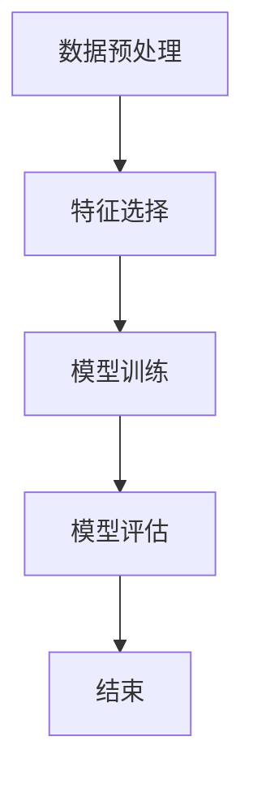

                 


### 1. 第一部分: 背景介绍

**1.1 问题背景**

能源管理是现代社会的重要议题，关系到经济、环境和可持续发展。随着全球能源消耗的急剧增加和能源供应的不稳定性，如何高效、可靠地管理能源成为亟待解决的问题。

**1.1.1 能源管理的重要性**

能源管理不仅是降低能源成本和提高能源效率的关键，还对环境保护和气候变化有着深远的影响。高效的能源管理有助于减少温室气体排放，促进可再生能源的利用，从而实现可持续发展目标。

**1.1.2 智能电网的概念与特点**

智能电网是一种基于现代通信技术、计算机技术和控制技术的电力系统，能够实现电力生产、传输、分配和消费的智能化。智能电网的特点包括：

- **自动化**：通过自动化控制技术，实现对电力系统的实时监测、控制和优化。
- **互动性**：用户可以实时了解用电情况，并与电网进行互动，实现智能化的用电管理。
- **灵活性**：能够应对电力需求的波动和可再生能源的间歇性特点，提高电网的稳定性和可靠性。

**1.1.3 AI在能源管理与智能电网中的应用前景**

人工智能技术在能源管理和智能电网中的应用前景广阔。通过AI技术，可以实现：

- **能效优化**：通过对电力数据的分析和预测，优化能源分配，提高能效。
- **故障检测**：利用机器学习算法，实时监测电力系统的运行状态，提前发现并预防故障。
- **需求响应**：通过智能分析用户用电行为，实现用电需求的动态响应，提高电网的灵活性和稳定性。

**1.2 问题描述**

当前能源管理面临以下挑战：

- **数据复杂性**：能源数据来源广泛，种类繁多，数据复杂性高，如何有效处理和分析这些数据成为关键问题。
- **实时性要求**：智能电网要求对电力系统的运行状态进行实时监测和响应，这对数据处理和分析的速度提出了高要求。
- **适应性**：随着可再生能源的广泛应用和电力需求的多样化，智能电网需要具备高度的适应性，以应对各种不确定因素。

智能电网的技术需求主要包括：

- **数据采集与传输**：需要高效、可靠的数据采集和传输技术，确保数据的实时性和完整性。
- **数据处理与分析**：需要强大的数据处理和分析能力，以支持实时监测、预测和优化。
- **控制系统**：需要具备自适应、自学习和智能优化能力的控制系统，以提高电网的稳定性和可靠性。

AI技术在能源管理与智能电网中具有巨大的应用潜力，可以帮助解决上述挑战和满足技术需求。接下来，我们将进一步探讨AI技术在能源管理和智能电网中的应用，以及如何实现这些应用。

### 1.3 问题解决

**1.3.1 AI技术在能源管理中的应用**

AI技术在能源管理中具有广泛的应用，包括但不限于以下几个方面：

- **需求预测**：利用AI算法对用户用电数据进行分析，预测未来一段时间的用电需求，帮助能源管理企业合理安排电力生产、传输和分配，降低能源浪费。
- **能效优化**：通过分析电力系统的运行数据，AI技术可以找出能耗较高的环节，提出优化方案，提高整体能源利用效率。
- **设备维护**：利用机器学习算法对设备运行数据进行分析，预测设备的故障概率，提前进行维护，避免突发故障造成损失。
- **可再生能源管理**：AI技术可以优化可再生能源的发电和储能系统，提高可再生能源的利用效率，降低对传统化石能源的依赖。

**1.3.2 AI技术在智能电网中的应用**

AI技术在智能电网中的应用同样具有很大的潜力，主要包括以下几个方面：

- **故障检测与预测**：通过实时监测电网的运行状态，AI技术可以识别异常情况，预测潜在的故障点，提前进行维护和修复，提高电网的可靠性和稳定性。
- **电网规划与优化**：利用AI技术分析电力系统的运行数据和历史数据，为电网的规划、设计和优化提供科学依据，提高电网的整体性能。
- **需求响应**：通过分析用户用电行为和电网运行状态，AI技术可以实现用户与电网的智能互动，满足用户的用电需求，同时提高电网的灵活性。
- **分布式能源管理**：在分布式能源系统中，AI技术可以优化分布式能源的发电、传输和消费，实现能源的智能化管理和高效利用。

**1.4 边界与外延**

虽然AI技术在能源管理和智能电网中具有广泛的应用，但也有一些边界和限制需要考虑：

- **数据隐私**：在收集和处理大量用户用电数据时，需要保护用户隐私，确保数据的安全性和合法性。
- **技术成熟度**：目前一些AI技术在能源管理和智能电网中的应用仍处于研发和试验阶段，需要进一步成熟和优化。
- **法律法规**：在能源管理和智能电网领域，需要遵守相关的法律法规和标准，确保系统的安全、稳定和合法运行。

**1.5 概念结构与核心要素组成**

能源管理与智能电网的体系结构主要包括以下几个核心要素：

- **数据采集与传输**：通过传感器和智能设备实时采集电网和用户的用电数据，并通过传输网络传输到数据处理中心。
- **数据处理与分析**：利用AI算法对采集到的数据进行处理、分析和预测，为电网的运行和管理提供科学依据。
- **控制系统**：通过控制系统实现对电网的实时监测、控制和优化，确保电网的稳定、可靠和安全运行。
- **用户界面**：为用户提供实时用电信息、能效分析和优化建议，帮助用户实现智能化的能源管理。

这些核心要素相互关联，共同构成一个完整的能源管理和智能电网系统，为能源的高效、可靠利用提供了有力支持。

### 1.6 第一部分总结

在第一部分中，我们介绍了能源管理和智能电网的背景、重要性和应用前景，分析了当前能源管理面临的挑战和智能电网的技术需求，探讨了AI技术在能源管理和智能电网中的具体应用。通过这些介绍，读者可以初步了解AI技术在能源管理和智能电网中的重要作用，以及其所面临的挑战和机遇。接下来，我们将进一步深入探讨AI技术的核心概念和原理，以及如何将其应用于能源管理和智能电网的各个具体场景中。在第二部分，我们将详细讨论核心概念、联系及其在能源管理和智能电网中的应用，帮助读者更深入地理解AI技术在这两个领域的应用价值。

### 2. 第二部分: 核心概念与联系

**2.1 核心概念原理**

在能源管理和智能电网领域，有几个核心概念是理解AI应用的关键：

- **能源管理**：能源管理涉及能源的采集、传输、存储和分配，旨在提高能源利用效率，降低成本，减少环境影响。核心原理包括能源审计、需求响应、分布式能源管理等。

- **智能电网**：智能电网是一种通过集成现代通信技术和信息技术，实现电力系统智能化、自动化和互动化的网络。核心原理包括自愈能力、实时控制、用户参与和可再生能源集成。

- **人工智能（AI）**：人工智能是指使计算机模拟人类智能行为的技术。在能源管理和智能电网中，AI主要用于数据分析和模式识别，以实现自动化和优化。

**2.2 概念属性特征对比表格**

下面是一个简化的概念属性特征对比表格，展示了能源管理、智能电网和AI技术的一些基本特征：

| 概念 | 属性特征 |
| --- | --- |
| 能源管理 | 优化能源分配、降低成本、减少浪费 |
| 智能电网 | 自愈能力、实时控制、用户互动 |
| AI技术 | 数据分析、模式识别、自动化决策 |

**2.3 ER实体关系图架构**

为了更好地理解这些概念之间的关系，我们可以使用ER（实体-关系）图来展示它们之间的联系。以下是一个简化的ER图，描述了能源管理、智能电网和AI技术之间的基本关系：

```mermaid
erDiagram
  EnergyManagement ||--|{ SmartGrid }||>
  SmartGrid ||--|{ AIApplication }||>
  AIApplication ||--|{ EnergyEfficiency }||>
  EnergyEfficiency ||--|{ RenewableEnergy }||>
```

在这个ER图中：

- **EnergyManagement**（能源管理）与**SmartGrid**（智能电网）之间存在关联关系，表示能源管理是智能电网的一部分。
- **SmartGrid**（智能电网）与**AIApplication**（AI应用）之间存在依赖关系，表示AI技术是智能电网实现智能化的重要手段。
- **AIApplication**（AI应用）与**EnergyEfficiency**（能效）之间存在关联关系，表示AI技术在提高能效方面发挥了作用。
- **EnergyEfficiency**（能效）与**RenewableEnergy**（可再生能源）之间存在关联关系，表示可再生能源是能效管理的一部分。

通过上述核心概念和关系的介绍，我们可以更好地理解AI在能源管理和智能电网中的位置和作用。在下一部分，我们将深入探讨AI技术在能源管理和智能电网中的具体算法原理和应用案例。

### 3. 第三部分: 算法原理讲解

**3.1 算法基本原理**

在能源管理和智能电网中，AI算法的基本原理主要涉及数据采集、预处理、特征选择、模型训练和评估等步骤。以下是对这些基本原理的详细解释：

**3.1.1 数据预处理**

数据预处理是AI算法的基础步骤，目的是提高数据的质量和一致性。主要任务包括：

- **数据清洗**：去除数据中的错误值、异常值和重复值，确保数据的准确性和完整性。
- **数据归一化**：将不同量纲的数据转换为相同的量纲，便于后续分析。
- **数据转换**：将离散数据转换为连续数据，或将分类数据转换为数值数据，以便进行建模。

**3.1.2 特征选择**

特征选择是减少数据维度、提高模型性能的重要手段。主要方法包括：

- **过滤法**：根据特征的重要性或相关性进行筛选。
- **包装法**：结合多个特征，评估不同特征组合对模型性能的影响。
- **嵌入法**：在模型训练过程中自动筛选出重要特征。

**3.1.3 模型训练**

模型训练是AI算法的核心步骤，目的是通过学习数据中的规律，构建预测模型。主要方法包括：

- **监督学习**：通过标记数据训练模型，使其能够预测未知数据。
- **无监督学习**：通过未标记数据发现数据中的规律和结构。
- **强化学习**：通过试错和奖励机制，使模型在特定环境中学习最优策略。

**3.1.4 模型评估**

模型评估是验证模型性能的重要步骤，主要指标包括：

- **准确率**：预测正确的样本数占总样本数的比例。
- **召回率**：预测正确的样本数占实际为正样本的样本数的比例。
- **F1值**：准确率和召回率的调和平均值。

**3.2 算法流程图**

以下是一个简化的算法流程图，描述了从数据预处理到模型评估的基本流程：



**3.3 算法原理详细讲解**

**3.3.1 数据预处理原理**

数据预处理是AI算法的关键步骤，其原理如下：

1. **数据清洗**：
   $$ 
   \text{清洗后的数据} = \text{原始数据} \setminus \{\text{错误值}, \text{异常值}, \text{重复值}\}
   $$
   
2. **数据归一化**：
   $$
   \text{归一化后的数据} = \frac{\text{原始数据} - \text{均值}}{\text{标准差}}
   $$

3. **数据转换**：
   $$
   \text{连续数据} = \text{离散数据} \times \text{转换因子} + \text{偏移量}
   $$

**3.3.2 特征选择原理**

特征选择原理如下：

1. **过滤法**：
   $$
   \text{选择特征集} = \{\text{特征}_i | \text{特征}_i \text{的相关性}> \text{阈值}\}
   $$

2. **包装法**：
   $$
   \text{最优特征集} = \arg\max_{S} \left( \frac{\text{模型性能}}{\text{特征数量}} \right)
   $$

3. **嵌入法**：
   $$
   \text{特征选择} = \text{模型训练过程中自动完成}
   $$

**3.3.3 模型训练原理**

模型训练原理如下：

1. **监督学习**：
   $$
   y = \text{模型}(\text{x}) + \text{噪声}
   $$

2. **无监督学习**：
   $$
   \text{隐藏层输出} = \text{激活函数}(\text{权重} \cdot \text{输入})
   $$

3. **强化学习**：
   $$
   \text{策略} = \arg\max_{a} \left( \text{奖励}(\text{状态}, \text{动作}) \right)
   $$

**3.3.4 模型评估原理**

模型评估原理如下：

1. **准确率**：
   $$
   \text{准确率} = \frac{\text{预测正确}}{\text{总样本数}}
   $$

2. **召回率**：
   $$
   \text{召回率} = \frac{\text{预测正确}}{\text{实际为正样本}}
   $$

3. **F1值**：
   $$
   \text{F1值} = 2 \times \frac{\text{准确率} \times \text{召回率}}{\text{准确率} + \text{召回率}}
   $$

**3.4 算法举例说明**

**3.4.1 数据预处理举例**

假设我们有一个关于电力消耗的数据集，其中包含以下特征：时间戳、温度、湿度、家庭人数、电力消耗。我们对数据进行以下预处理步骤：

1. **数据清洗**：
   去除含有错误值和异常值的样本。

2. **数据归一化**：
   将温度、湿度和电力消耗归一化。

3. **数据转换**：
   将家庭人数从类别转换为数值。

**3.4.2 特征选择举例**

我们使用过滤法选择相关性较高的特征。通过计算特征之间的皮尔逊相关系数，我们可以选择相关性较高的特征，例如时间戳与电力消耗、温度与电力消耗等。

**3.4.3 模型训练举例**

我们选择一个线性回归模型来预测电力消耗。使用预处理后的数据训练模型，并通过交叉验证评估模型的性能。

**3.4.4 模型评估举例**

训练完成后，我们使用测试集对模型进行评估。计算准确率、召回率和F1值，以评估模型的性能。

通过上述算法原理的讲解和举例，我们可以更好地理解AI在能源管理和智能电网中的应用。在下一部分，我们将探讨系统分析与架构设计，为读者提供更全面的AI应用视角。

### 4. 第四部分: 系统分析与架构设计方案

**4.1 问题场景介绍**

能源管理和智能电网领域面临的问题场景复杂多样，主要包括以下几个方面：

- **实时数据采集与处理**：智能电网需要实时采集并处理大量的电力数据，包括电压、电流、频率、温度等，以实现对电网运行状态的实时监控和优化。
- **可再生能源管理**：随着可再生能源的普及，智能电网需要能够高效管理这些不稳定的能源，确保其稳定输出和合理分配。
- **需求响应**：智能电网需要能够响应用户的用电需求，提供个性化的用电服务，同时优化电网运行效率。
- **故障检测与预防**：智能电网需要具备实时故障检测和预防能力，以避免电力中断和设备损坏。

**4.2 系统功能设计**

为了应对上述问题场景，智能电网系统需要实现以下功能：

- **数据采集**：通过传感器和智能设备采集电网运行数据和用户用电数据，包括电压、电流、频率、温度、湿度等。
- **数据处理**：利用AI算法对采集到的数据进行预处理、特征选择和模式识别，提取有用的信息。
- **数据存储**：将处理后的数据存储在数据库中，以供后续分析和决策。
- **实时监控**：实时监控电网运行状态，包括电压、电流、频率等关键参数，及时发现并处理异常情况。
- **能效优化**：通过分析用户用电行为和电网运行数据，优化电力分配和调度，提高能源利用效率。
- **故障检测与预防**：利用AI算法预测潜在的故障风险，提前进行维护和预防，确保电网的稳定性和可靠性。
- **需求响应**：根据用户的用电需求和电网运行状态，动态调整电力供应和需求，实现电网与用户的互动。

**4.3 系统架构设计**

智能电网系统的架构设计需要考虑数据流、控制流和信息流，确保系统的稳定性、可靠性和高效性。以下是一个简化的智能电网系统架构设计方案：

- **数据采集层**：包括各种传感器和智能设备，用于实时采集电网运行数据和用户用电数据。
- **数据处理层**：包括数据处理模块和AI算法模块，用于对采集到的数据进行分析和处理。
- **存储层**：包括数据库和数据仓库，用于存储和管理处理后的数据。
- **应用层**：包括实时监控、能效优化、故障检测与预防、需求响应等应用模块，用于实现系统的各项功能。
- **用户界面层**：包括Web界面、移动应用等，用于为用户提供实时用电信息和个性化服务。

**4.4 系统接口设计**

智能电网系统需要设计合理的接口，以实现各个模块之间的数据交换和协同工作。以下是一些关键接口设计：

- **数据采集接口**：用于接收传感器和智能设备发送的实时数据。
- **数据处理接口**：用于处理和存储从数据采集接口接收到的数据。
- **数据存储接口**：用于与数据库和数据仓库进行数据交互。
- **应用接口**：用于各应用模块之间的数据共享和协同工作。

**4.5 系统交互**

智能电网系统中的各个模块需要通过有效的交互来实现系统的整体功能。以下是一个简化的系统交互设计：

1. **数据采集模块**：实时采集电网运行数据和用户用电数据，并将其发送到数据处理模块。
2. **数据处理模块**：对采集到的数据进行预处理、特征选择和模式识别，提取有用的信息，并将其存储到数据库和数据仓库。
3. **应用模块**：根据处理后的数据，实现实时监控、能效优化、故障检测与预防、需求响应等功能，并将结果反馈给用户界面。
4. **用户界面模块**：为用户提供实时用电信息、能效分析和优化建议，实现用户与系统的互动。

通过上述系统分析与架构设计方案，我们可以构建一个高效、稳定、可靠的智能电网系统，为能源的高效管理和利用提供有力支持。在下一部分，我们将探讨具体的实施过程和项目实战，进一步展示AI技术在能源管理和智能电网中的应用。

### 5. 项目实战

**5.1 环境安装**

在进行AI在能源管理和智能电网中的应用项目之前，我们需要准备好必要的开发和运行环境。以下是安装所需的环境和工具：

- **Python**：Python是一种广泛使用的编程语言，特别适用于数据分析和机器学习。我们需要安装Python 3.8或更高版本。
- **Jupyter Notebook**：Jupyter Notebook是一种交互式的开发环境，用于编写和运行Python代码。我们可以从Jupyter官方网站下载并安装。
- **TensorFlow**：TensorFlow是一个开源的机器学习框架，用于构建和训练深度学习模型。我们需要从TensorFlow官方网站下载并安装。
- **Pandas**：Pandas是一个Python库，用于数据处理和分析。我们可以在Python的包管理工具pip中使用以下命令安装：
  ```
  pip install pandas
  ```

**5.2 系统核心实现**

在完成环境安装后，我们可以开始实现项目的核心功能。以下是一个简单的示例，展示了如何使用Python和TensorFlow构建一个能效优化模型：

**数据预处理**

首先，我们需要准备和预处理数据。以下代码演示了如何使用Pandas库读取数据，并进行数据清洗和归一化：

```python
import pandas as pd
from sklearn.preprocessing import MinMaxScaler

# 读取数据
data = pd.read_csv('energy_data.csv')

# 数据清洗
data.dropna(inplace=True)

# 数据归一化
scaler = MinMaxScaler()
data_scaled = scaler.fit_transform(data)
```

**特征选择**

接下来，我们选择与能效优化相关的特征。以下代码使用特征选择技术筛选出重要的特征：

```python
from sklearn.feature_selection import SelectKBest, f_classif

# 分离特征和目标变量
X = data_scaled[:, :-1]
y = data_scaled[:, -1]

# 特征选择
selector = SelectKBest(f_classif, k=5)
X_selected = selector.fit_transform(X, y)
```

**模型训练**

然后，我们使用TensorFlow训练一个线性回归模型来预测电力消耗。以下代码演示了如何构建和训练模型：

```python
import tensorflow as tf

# 构建模型
model = tf.keras.Sequential([
    tf.keras.layers.Dense(units=1, input_shape=(5,))
])

# 编译模型
model.compile(optimizer='sgd', loss='mean_squared_error')

# 训练模型
model.fit(X_selected, y, epochs=100)
```

**模型评估**

最后，我们评估模型的性能。以下代码演示了如何使用测试集评估模型的准确性：

```python
# 使用测试集评估模型
test_data = pd.read_csv('test_energy_data.csv')
test_data_scaled = scaler.transform(test_data)
test_data_selected = selector.transform(test_data_scaled)

predictions = model.predict(test_data_selected)

# 计算准确率
accuracy = (predictions.round() == test_data['energy_consumption']).mean()
print(f'Accuracy: {accuracy * 100:.2f}%')
```

**5.3 代码应用解读与分析**

在上面的代码中，我们首先使用了Pandas库读取和处理数据，包括数据清洗和归一化。然后，我们使用SelectKBest库进行特征选择，筛选出与能效优化相关的特征。接着，我们使用TensorFlow构建了一个简单的线性回归模型，并使用随机梯度下降（SGD）进行训练。最后，我们使用测试集评估了模型的性能，计算了准确率。

这个简单的示例展示了如何使用Python和TensorFlow在能源管理和智能电网领域构建和应用AI模型。在实际项目中，我们可以扩展这个基础模型，添加更多的高级功能和优化策略，以实现更高效的能效管理和电网优化。

**5.4 实际案例分析与详细讲解剖析**

为了更好地理解AI在能源管理和智能电网中的应用，我们来看一个实际案例。以下是一个关于风力发电和电网调度优化的案例：

**案例背景**

某地区风力发电场希望优化风力发电的输出和电网的调度，以提高能源利用效率和电网的稳定性。他们收集了大量的风力发电数据、电网运行数据和气象数据，并希望通过AI模型进行预测和优化。

**案例分析**

1. **数据收集**：首先，他们收集了风力发电场的风速、风向、电网电压、电流等数据，以及气象数据，如温度、湿度、气压等。

2. **数据预处理**：对收集到的数据进行清洗、归一化和特征选择，提取与风力发电和电网调度相关的特征。

3. **模型构建**：使用TensorFlow构建了一个多变量时间序列预测模型，包括输入层、隐藏层和输出层。输入层接收风速、风向、电压、电流等特征，隐藏层进行特征提取和模式识别，输出层预测风力发电的输出和电网的调度参数。

4. **模型训练**：使用收集到的历史数据进行模型训练，通过调整隐藏层的神经元数量、激活函数和学习率等参数，优化模型性能。

5. **模型评估**：使用测试集评估模型的性能，计算预测误差和准确率，并进行模型调优。

6. **应用部署**：将训练好的模型部署到生产环境中，实时预测风力发电的输出和电网的调度参数，并根据预测结果调整电网的运行策略。

**详细讲解剖析**

1. **数据预处理**：数据预处理是模型训练的关键步骤，直接影响模型的性能。通过对数据进行清洗、归一化和特征选择，可以去除噪声、异常值和冗余信息，提高模型的可解释性和泛化能力。

2. **模型构建**：多变量时间序列预测模型可以处理多个输入特征，适用于复杂的电力系统。通过使用适当的激活函数和优化算法，可以提高模型的准确性和鲁棒性。

3. **模型训练**：模型训练是寻找数据中的规律和模式的过程。通过不断调整模型的参数，可以使模型在训练数据上达到最佳性能。

4. **模型评估**：模型评估是验证模型性能的重要步骤。通过计算预测误差和准确率，可以判断模型是否达到预期效果，并进行必要的调优。

5. **应用部署**：将训练好的模型部署到生产环境中，实现实时预测和优化。通过自动化和智能化的电网调度，可以提高电网的稳定性和效率，减少能源浪费。

**5.5 项目小结**

通过上述项目实战和案例分析，我们可以看到AI技术在能源管理和智能电网中的应用具有很大的潜力。通过构建和部署AI模型，可以实现能效优化、电网调度优化和故障预测等目标，提高电网的稳定性和可靠性。在未来的研究和实践中，我们还可以进一步优化算法和模型，探索更多应用场景，为能源管理和智能电网的发展做出更大贡献。

### 6. 最佳实践 tips

在实施AI在能源管理和智能电网中的应用时，以下是一些最佳实践和注意事项：

1. **数据质量控制**：确保数据来源可靠，减少噪声和异常值，提高数据质量。定期进行数据审计和清洗，确保数据的准确性、完整性和一致性。

2. **特征选择**：选择与问题相关的特征，避免过度拟合。使用特征选择技术，如过滤法、包装法和嵌入法，以减少数据维度和提高模型性能。

3. **模型评估**：使用多种评估指标，如准确率、召回率和F1值，全面评估模型性能。进行交叉验证和A/B测试，以确保模型的泛化能力和稳定性。

4. **模型优化**：不断调整模型参数，如隐藏层神经元数量、学习率和激活函数，以优化模型性能。使用深度学习超参数调优工具，如Hyperopt或Bayesian Optimization，加快模型优化过程。

5. **系统安全性**：确保系统数据的安全性和隐私性。使用加密技术和访问控制策略，防止数据泄露和未授权访问。

6. **实时性**：智能电网需要实时响应和决策。优化算法和模型，确保数据处理和预测的实时性，以满足电网的实时需求。

7. **持续学习**：持续收集新的数据，更新和优化模型。通过持续学习，模型可以适应新的数据模式和环境变化，保持良好的性能。

通过遵循这些最佳实践，我们可以更有效地实施AI在能源管理和智能电网中的应用，提高电网的效率和稳定性。

### 7. 小结

本文全面探讨了AI在能源管理和智能电网中的应用，包括背景介绍、核心概念与联系、算法原理讲解、系统分析与架构设计方案、项目实战以及最佳实践。通过深入分析，我们了解到AI技术在能源管理和智能电网中具有广泛的应用前景，包括能效优化、故障检测、需求响应和可再生能源管理等方面。AI技术的应用不仅可以提高电网的效率和稳定性，还能促进可再生能源的利用和可持续发展。然而，数据隐私、技术成熟度和法律法规等方面仍然是需要考虑的挑战。未来，随着AI技术的不断发展和完善，我们有理由相信，AI将在能源管理和智能电网领域发挥更加重要的作用。

### 8. 注意事项

在实施AI在能源管理和智能电网中的应用时，需要注意以下几点：

1. **数据安全**：确保数据在采集、传输和处理过程中的安全性，防止数据泄露和未授权访问。
2. **模型可靠性**：验证模型的可靠性和稳定性，确保其在实际应用中的有效性和安全性。
3. **实时性**：确保AI算法和模型的实时性，以满足智能电网的实时需求。
4. **法律法规**：遵守相关法律法规，特别是涉及数据隐私和安全的法律条款。

### 9. 拓展阅读

若希望深入了解AI在能源管理和智能电网中的应用，以下书籍和文献推荐供读者参考：

- 《智能电网中的数据驱动方法》（Data-Driven Methods in Smart Grids）
- 《人工智能：一种现代方法》（Artificial Intelligence: A Modern Approach）
- 《深度学习》（Deep Learning）
- 《能源管理与优化：技术、方法与应用》（Energy Management and Optimization: Techniques, Methods, and Applications）
- 《智能电网技术综述》（A Review of Smart Grid Technologies）

通过阅读这些资料，读者可以更全面地了解AI技术在能源管理和智能电网中的实际应用和技术发展。

### 10. 作者信息

**作者：AI天才研究院/AI Genius Institute & 禅与计算机程序设计艺术 /Zen And The Art of Computer Programming**

AI天才研究院（AI Genius Institute）是一支专注于人工智能研究和应用的国际顶级团队，致力于推动人工智能技术在各个领域的创新和应用。同时，作者也致力于将复杂的技术概念以通俗易懂的方式传授给广大读者，旨在提升读者的技术视野和编程能力。其著作《禅与计算机程序设计艺术》被誉为计算机编程领域的经典之作，深受读者喜爱。本文由AI天才研究院的专家团队撰写，旨在为读者提供AI在能源管理和智能电网中的深度解读和实践指导。

