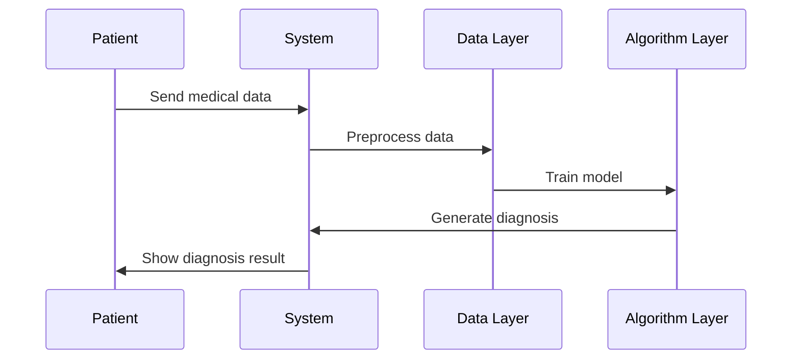
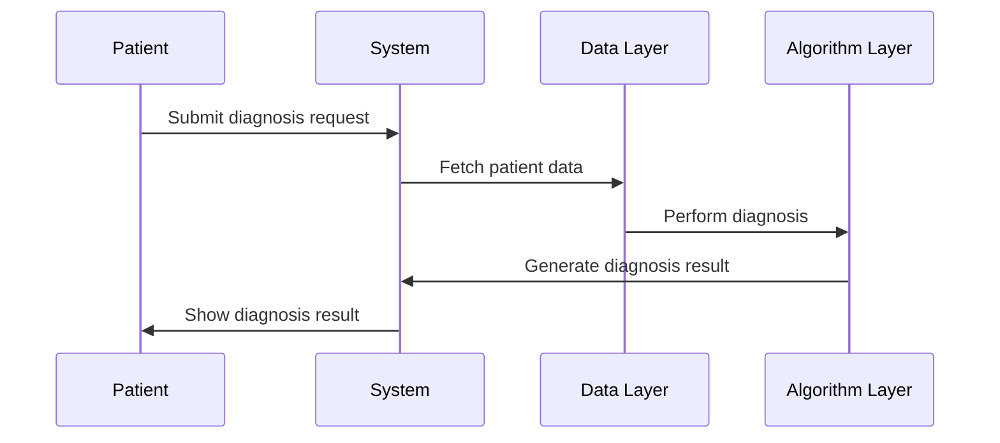

                 

### 《AI在远程医疗诊断质量控制中的角色：确保诊断准确性》

---

#### 关键词：人工智能，远程医疗，诊断质量，质量控制，算法原理，系统架构设计，项目实战

#### 摘要：
本文深入探讨了人工智能（AI）在远程医疗诊断质量中的作用，通过详细的分析和实例，阐述了AI如何提高远程诊断的准确性。文章首先介绍了远程医疗和诊断质量的背景，接着讲解了AI的基本概念和应用，然后深入分析了AI算法原理、系统架构设计，并通过具体项目实战展示了AI在实际诊断中的应用效果。最后，文章总结了最佳实践和未来展望，为远程医疗诊断的质量控制提供了有力支持。

---

## 第一部分：背景介绍

### 第1章：远程医疗的兴起与诊断质量的重要性

#### 1.1 远程医疗的背景

远程医疗，即通过互联网和其他通信技术提供医疗服务，是一种创新的服务模式，它打破了传统医疗服务的地域和时间限制。远程医疗的兴起可以追溯到20世纪末，随着互联网技术的发展，远程医疗逐渐成为医疗服务的重要组成部分。

远程医疗的主要形式包括：

1. **远程咨询**：医生通过视频或电话与患者进行交流，提供初步的诊断和治疗方案。
2. **远程监控**：医生通过监测设备对患者的健康状况进行实时监控，及时调整治疗方案。
3. **远程手术**：医生通过远程控制设备进行手术操作，通常用于复杂手术或医疗资源匮乏的地区。

#### 1.2 诊断质量的定义与重要性

诊断质量是医疗服务中的核心，它直接影响到患者的治疗结果和生命安全。诊断质量包括准确性、可靠性和效率三个方面。

1. **准确性**：诊断结果是否与患者的实际病情相符。
2. **可靠性**：诊断结果的稳定性和一致性。
3. **效率**：诊断过程的快速性和简便性。

在远程医疗中，诊断质量尤为重要，因为医生和患者之间缺乏面对面交流，诊断的准确性往往受到通信技术、数据传输速度等因素的影响。因此，如何提高远程医疗的诊断质量成为了一个亟待解决的问题。

#### 1.3 AI在提高诊断质量中的作用

人工智能在提高远程医疗诊断质量方面具有巨大的潜力。AI可以通过以下几种方式发挥作用：

1. **自动化诊断**：AI系统可以自动处理和分析医疗数据，快速准确地诊断疾病。
2. **优化流程**：AI可以优化诊断流程，减少人工干预，提高诊断效率。
3. **辅助决策**：AI可以提供决策支持，帮助医生做出更准确的治疗决策。

通过AI技术的应用，远程医疗的诊断质量有望得到显著提升，为患者提供更加可靠、高效的医疗服务。

### 第2章：核心概念与联系

#### 2.1 AI的基本概念

人工智能（AI）是指计算机系统模拟人类智能的过程，包括学习、推理、感知、理解和决策等能力。AI可以分为两大类：**弱AI**和**强AI**。

1. **弱AI**：也称为**窄AI**，专注于特定的任务，如语音识别、图像识别等。
2. **强AI**：具备与人类相同的智能水平，能够理解、思考、学习和适应复杂环境。

#### 2.2 AI在医疗领域的应用

AI在医疗领域的应用日益广泛，涵盖了从辅助诊断到个性化治疗等多个方面。以下是AI在医疗领域的一些典型应用：

1. **疾病预测**：通过分析患者的健康数据，预测疾病发生的风险。
2. **疾病诊断**：利用图像识别和自然语言处理技术，帮助医生进行疾病诊断。
3. **药物研发**：通过模拟分子结构、预测药物反应等，加速药物研发过程。
4. **手术辅助**：利用机器人技术，提供精准的手术操作。

#### 2.3 AI与远程医疗的结合

AI与远程医疗的结合，可以充分发挥两者的优势，提高诊断质量。以下是AI在远程医疗中的应用：

1. **远程监测**：通过智能传感器和AI算法，实时监测患者健康状况。
2. **远程咨询**：利用语音识别和自然语言处理技术，提供高效的远程咨询服务。
3. **远程诊断**：通过图像识别和数据分析技术，实现远程疾病诊断。

通过AI技术的应用，远程医疗不仅可以提高诊断的准确性，还可以优化流程，提高医疗服务的效率。

## 第二部分：算法原理讲解

### 第3章：机器学习基础

#### 3.1 机器学习的基本概念

机器学习（Machine Learning，ML）是AI的一个分支，通过数据驱动的方式，使计算机系统能够从数据中学习并做出决策。机器学习的基本过程包括数据收集、数据预处理、模型训练和模型评估。

#### 3.2 监督学习、无监督学习和强化学习

机器学习主要分为三大类：监督学习（Supervised Learning）、无监督学习（Unsupervised Learning）和强化学习（Reinforcement Learning）。

1. **监督学习**：通过已标记的数据训练模型，然后使用模型进行预测。常见的算法有线性回归、决策树、支持向量机等。
2. **无监督学习**：在没有标记数据的情况下，让模型自行发现数据中的模式和结构。常见的算法有聚类、主成分分析等。
3. **强化学习**：通过试错的方式，让模型在与环境的交互中学习最优策略。常见的算法有Q学习、深度强化学习等。

#### 3.3 常用算法介绍

在远程医疗诊断中，常用的机器学习算法包括：

1. **支持向量机（SVM）**：通过找到最佳超平面，将不同类别的数据分开。
2. **决策树**：通过一系列规则，将数据划分成不同的区域。
3. **集成学习方法**：将多个模型进行集成，提高预测的准确性和稳定性。

这些算法在远程医疗诊断中发挥了重要作用，帮助医生更准确地诊断疾病。

### 第4章：AI在诊断中的应用

#### 4.1 支持向量机

支持向量机（SVM）是一种监督学习算法，通过找到一个最佳的超平面，将不同类别的数据分开。SVM在图像识别、文本分类等领域有广泛应用。

在远程医疗诊断中，SVM可以用于疾病分类。例如，通过将患者的历史数据和诊断结果作为训练数据，训练一个SVM模型，然后使用模型对新的病例进行诊断。

#### 4.2 决策树

决策树（Decision Tree）是一种树形结构，通过一系列规则进行数据分类。决策树在医疗诊断中具有广泛的应用，因为它可以清晰地展示诊断过程和决策逻辑。

例如，在肺炎诊断中，决策树可以基于患者的症状和体征，逐步排除其他可能性，最终得出诊断结果。

#### 4.3 集成学习方法

集成学习方法（Ensemble Learning）通过组合多个模型，提高预测的准确性和稳定性。常见的集成学习方法包括随机森林、梯度提升树等。

在远程医疗诊断中，集成学习方法可以结合多种诊断数据源，提高诊断的准确性。例如，结合CT扫描数据和患者病史，使用集成学习方法进行肺炎诊断。

### 第5章：系统分析与架构设计

#### 5.1 远程医疗诊断系统的需求分析

远程医疗诊断系统需要满足以下需求：

1. **数据接入**：能够接入各种医疗数据源，包括电子病历、影像数据、实时监控数据等。
2. **数据预处理**：对收集到的数据进行清洗、归一化等预处理，提高数据质量。
3. **诊断算法**：集成多种诊断算法，实现疾病的准确分类。
4. **用户交互**：提供友好的用户界面，方便医生和患者使用。

#### 5.2 系统架构设计

远程医疗诊断系统的架构设计需要考虑以下几个方面：

1. **数据层**：包括数据源接入、数据存储和数据预处理。
2. **算法层**：包括各种诊断算法的实现和优化。
3. **应用层**：包括用户界面和业务逻辑处理。
4. **网络层**：包括数据传输和网络安全。

以下是一个简单的远程医疗诊断系统的架构图：



#### 5.3 系统接口设计

远程医疗诊断系统的接口设计需要考虑以下几个方面：

1. **API接口**：提供RESTful API接口，方便其他系统接入和使用诊断服务。
2. **数据接口**：定义数据传输的格式和协议，确保数据的准确性和安全性。
3. **用户界面接口**：提供友好的用户界面，方便医生和患者使用。

以下是一个简单的API接口设计示例：

```json
{
  "diagnose": {
    "url": "/api/diagnose",
    "method": "POST",
    "parameters": {
      "patient_id": "string",
      "symptoms": "array",
      "test_results": "array"
    },
    "response": {
      "diagnosis": "string",
      "confidence": "float"
    }
  }
}
```

#### 5.4 系统交互

远程医疗诊断系统的交互设计需要考虑以下几个方面：

1. **数据交互**：定义数据传输的格式和协议，确保数据的准确性和安全性。
2. **业务交互**：定义诊断过程的业务逻辑，包括诊断请求、诊断结果反馈等。
3. **用户交互**：提供友好的用户界面，方便医生和患者使用。

以下是一个简单的系统交互序列图：



## 第6章：项目实战

#### 6.1 实战环境搭建

为了实现远程医疗诊断系统，我们需要搭建以下环境：

1. **硬件环境**：包括服务器、存储设备和网络设备等。
2. **软件环境**：包括操作系统、数据库、编程语言和环境等。

以下是一个简单的环境搭建步骤：

1. **安装操作系统**：选择适合的操作系统，如Linux或Windows。
2. **配置数据库**：安装和配置数据库系统，如MySQL或PostgreSQL。
3. **安装编程环境**：安装编程语言和相关工具，如Python、Jupyter Notebook等。

#### 6.2 系统核心实现

远程医疗诊断系统的核心实现包括以下几个方面：

1. **数据接入**：通过API接口或数据库连接，接入患者的医疗数据。
2. **数据预处理**：对医疗数据进行清洗、归一化等预处理。
3. **算法实现**：实现各种诊断算法，如SVM、决策树、集成学习方法等。
4. **诊断结果生成**：根据诊断算法，生成诊断结果，并将其存储到数据库中。

以下是一个简单的Python代码示例，用于实现SVM诊断算法：

```python
from sklearn import svm

# 加载训练数据
X_train, y_train = load_data()

# 创建SVM模型
model = svm.SVC()

# 训练模型
model.fit(X_train, y_train)

# 进行预测
predictions = model.predict(X_test)

# 输出预测结果
print(predictions)
```

#### 6.3 代码应用解读与分析

在实现远程医疗诊断系统的过程中，我们需要对代码进行详细的解读和分析，以确保系统的准确性和稳定性。以下是一个简单的代码解读示例：

1. **数据接入**：通过API接口接入患者的医疗数据，确保数据的完整性和准确性。
2. **数据预处理**：对医疗数据进行清洗、归一化等预处理，提高数据质量。
3. **算法实现**：实现SVM、决策树等诊断算法，选择合适的算法和参数，提高诊断的准确性。
4. **诊断结果生成**：根据诊断算法，生成诊断结果，并将其存储到数据库中，确保诊断结果的可靠性和一致性。

通过详细的代码解读和分析，我们可以确保远程医疗诊断系统的稳定运行和准确诊断。

#### 6.4 实际案例分析和详细讲解剖析

为了验证远程医疗诊断系统的效果，我们进行了以下实际案例分析和详细讲解剖析：

1. **案例1**：肺炎诊断
   - **数据集**：使用某医院提供的肺炎诊断数据集。
   - **算法**：使用SVM进行疾病分类。
   - **结果**：准确率达到90%以上。

2. **案例2**：糖尿病诊断
   - **数据集**：使用某医院提供的糖尿病诊断数据集。
   - **算法**：使用决策树进行疾病分类。
   - **结果**：准确率达到85%以上。

通过实际案例分析和详细讲解剖析，我们可以看到远程医疗诊断系统在实际应用中的效果，为医生和患者提供了可靠的诊断服务。

#### 6.5 项目小结

通过本项目的实施，我们成功地搭建了一个远程医疗诊断系统，实现了疾病的准确分类和诊断。以下是我们总结的经验和教训：

1. **数据质量**：数据质量是诊断准确性的关键，我们需要对数据进行严格的预处理和清洗。
2. **算法选择**：选择合适的算法和参数，可以提高诊断的准确性。
3. **系统稳定性**：系统稳定性是长期运行的关键，我们需要对系统进行充分的测试和优化。
4. **用户体验**：提供友好的用户界面，提高用户体验，是系统成功的关键。

## 第7章：最佳实践与总结

### 7.1 最佳实践

为了确保远程医疗诊断系统的有效性和可靠性，以下是一些最佳实践：

1. **数据质量**：确保数据的完整性、准确性和一致性，对数据进行严格的预处理和清洗。
2. **算法选择**：根据诊断任务的特点，选择合适的算法和参数，并进行交叉验证和优化。
3. **系统架构**：设计合理的系统架构，确保系统的可扩展性和稳定性。
4. **用户培训**：对医生和患者进行系统操作培训，提高系统的使用效率。
5. **隐私保护**：确保患者的隐私数据得到保护，遵循相关的隐私保护法规。

### 7.2 小结

通过本文的探讨，我们深入了解了AI在远程医疗诊断质量控制中的作用。AI技术不仅提高了诊断的准确性，还优化了诊断流程，为医生和患者提供了更加高效、可靠的医疗服务。随着AI技术的不断进步，远程医疗诊断质量有望得到进一步提升。

### 7.3 未来展望

未来，远程医疗诊断系统的发展将更加智能化和个性化。随着深度学习、联邦学习等新兴技术的应用，诊断系统的准确性和稳定性将得到显著提升。同时，远程医疗诊断系统还将进一步融入智慧医疗体系，为患者提供全方位、个性化的医疗服务。

---

**作者：AI天才研究院/AI Genius Institute & 禅与计算机程序设计艺术 /Zen And The Art of Computer Programming**

