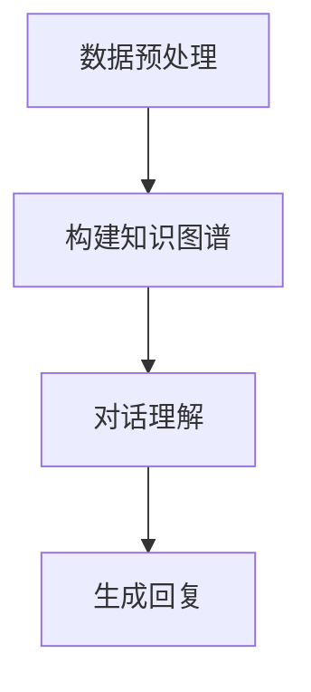
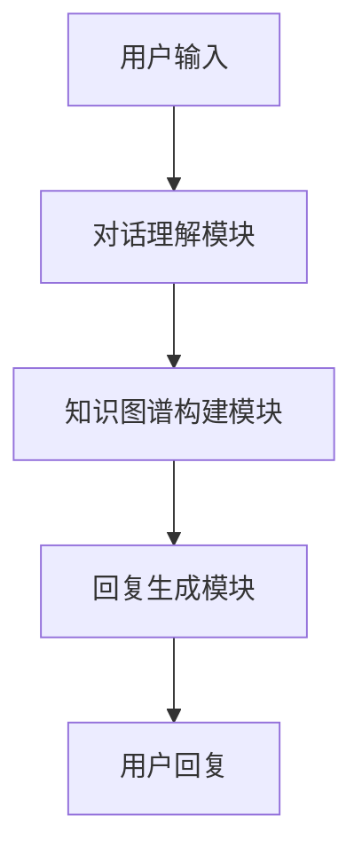

                 

### 《AI对话优化：思维链方法详解》

关键词：AI对话系统、思维链方法、算法原理、系统架构、项目实战

摘要：本文旨在深入探讨AI对话优化中的思维链方法，分析其在提高对话质量、处理复杂场景和应对对话挑战方面的应用和优势。我们将从背景介绍、核心概念、算法原理、系统架构、项目实战和最佳实践等方面逐步展开，力图让读者全面了解思维链方法在AI对话系统优化中的重要作用。

### 第一部分：背景介绍与核心概念

#### 1.1 AI对话系统的现状与问题

##### 对话系统的发展历程

AI对话系统经历了从规则驱动到数据驱动，再到现在的基于深度学习的自然语言处理（NLP）的发展历程。早期的对话系统依赖于固定的规则，难以应对复杂多变的对话场景。随着NLP技术的进步，对话系统能够通过大规模语料库进行学习，从而更好地理解和生成自然语言。

##### 对话系统在各个领域的应用

对话系统在客服、智能助手、教育、医疗等多个领域得到了广泛应用。例如，智能客服系统能够自动处理用户咨询，提高服务效率；智能教育系统能够根据学生的学习情况提供个性化辅导，提高学习效果。

##### 当前对话系统的挑战

尽管对话系统取得了显著进展，但仍然面临一些挑战。首先是对话质量的提升，目前的对话系统在理解用户意图和生成自然流畅的回复方面仍有不足。其次是处理复杂对话场景的能力，对话系统需要能够处理包含多轮对话、上下文推理和情感识别的复杂场景。

##### 问题背景

对话质量的重要性不言而喻。优质的对话体验可以提高用户满意度，增加用户粘性。对话中的关键问题包括语义理解、上下文维护、情感识别和生成自然流畅的回复。思维链方法在这一背景下应运而生，旨在通过构建一个高效的思维模型来优化对话系统的表现。

##### 思维链方法在对话优化中的应用前景

思维链方法具有高效性、智能性和可扩展性，能够有效地解决当前对话系统中的关键问题。其在对话优化中的应用前景广阔，有望进一步提升对话系统的质量和用户体验。

#### 1.3 问题解决

##### 思维链方法的基本原理

思维链方法是一种基于知识图谱的对话优化技术，通过构建一个包含节点和边的关系网络，来表示对话中的关键信息和上下文。每个节点代表一个概念或实体，边表示节点之间的关系。

##### 思维链在对话优化中的优势

思维链方法具有以下几个优势：

1. **高效性**：思维链方法能够快速地处理和检索对话中的信息，提高对话系统的响应速度。
2. **智能性**：通过构建知识图谱，思维链方法能够更好地理解用户意图和上下文，生成更自然、更符合用户期待的回复。
3. **可扩展性**：思维链方法可以灵活地扩展和更新，以适应不同的对话场景和需求。

##### 边界与外延

思维链方法主要适用于需要高精度对话理解的场景，例如智能客服、智能助手和智能教育等领域。同时，思维链方法与其他对话优化方法（如基于规则的对话系统、深度学习模型等）相比，具有独特的优势和适用范围。

##### 本章小结

本章介绍了AI对话系统的现状与问题，以及思维链方法在对话优化中的应用前景。思维链方法通过构建高效的思维模型，有望解决当前对话系统中的关键问题，提高对话质量。

### 第二部分：核心概念与联系

#### 2.1 思维链方法原理详解

##### 2.1.1 思维链的定义

思维链是一种用于表示对话中信息和上下文的方法，它通过构建一个知识图谱来表示对话中的概念和关系。思维链中的每个节点代表一个概念或实体，边表示节点之间的关系。

##### 2.1.2 思维链与自然语言处理的关系

思维链方法与自然语言处理（NLP）密切相关。NLP技术负责处理和解析自然语言输入，而思维链方法则负责构建和利用知识图谱来优化对话系统的表现。

##### 2.1.3 思维链的核心组成部分

思维链由以下核心组成部分构成：

1. **思维链节点**：代表对话中的概念或实体，例如“用户”、“产品”、“评价”等。
2. **思维链连接关系**：表示节点之间的逻辑关系，例如“购买”、“评价”等。

##### 2.1.4 思维链方法的特点

思维链方法具有以下几个特点：

1. **高效性**：思维链方法能够快速处理和检索对话中的信息，提高对话系统的响应速度。
2. **智能性**：通过构建知识图谱，思维链方法能够更好地理解用户意图和上下文，生成更自然、更符合用户期待的回复。
3. **可扩展性**：思维链方法可以灵活地扩展和更新，以适应不同的对话场景和需求。

##### 2.1.5 概念属性特征对比表格

| 对话优化方法 | 高效性 | 智能性 | 可扩展性 |
| ------------ | ------ | ------ | -------- |
| 基于规则     | 较低   | 低     | 较高     |
| 深度学习     | 高     | 高     | 较低     |
| 思维链       | 高     | 高     | 高       |

##### 2.1.6 ER实体关系图架构

思维链方法的实体关系图（ER图）如下所示：

```mermaid
erDiagram
    User ||--|{ Product }|--| Review
    Product ||--|{ Category }|--| Product
    Review ||--|{ Rating }|--| Review
```

在这个ER图中，用户、产品、评价和分类是主要的实体，它们之间的关系通过箭头表示。

### 第三部分：算法原理与系统架构

#### 3.1 思维链算法原理解析

##### 3.1.1 算法原理

思维链算法通过以下几个步骤来实现对话优化：

1. **数据预处理**：对输入的自然语言文本进行分词、词性标注和命名实体识别等预处理操作。
2. **构建知识图谱**：将预处理后的数据构建成一个知识图谱，包含节点和边的关系。
3. **对话理解**：通过查询知识图谱来理解用户的意图和上下文。
4. **生成回复**：基于对话理解和用户意图，生成自然、流畅的回复。

##### 3.1.2 算法流程图

以下是思维链算法的流程图：



##### 3.1.3 Python源代码实现

以下是一个简化的思维链算法的Python代码实现：

```python
import networkx as nx

# 构建知识图谱
G = nx.Graph()
G.add_nodes_from(['user', 'product', 'review'])
G.add_edges_from([('user', 'product'), ('product', 'review')])

# 对话理解
def understand_dialogue(text):
    # 假设输入文本为 "我想要评价这个产品"
    # 理解为用户意图为评价，目标实体为产品
    intent = '评价'
    target_entity = 'product'
    return intent, target_entity

# 生成回复
def generate_response(intent, target_entity):
    if intent == '评价':
        return f'请对{target_entity}进行评价。'
    else:
        return '对不起，我不理解您的意图。'

# 测试
text = '我想要评价这个产品'
intent, target_entity = understand_dialogue(text)
response = generate_response(intent, target_entity)
print(response)
```

##### 3.1.4 算法公式与详细讲解

思维链算法涉及的主要公式如下：

$$
\text{意图} = f(\text{输入文本}, \text{知识图谱})
$$

其中，$f$ 表示对话理解函数，它根据输入文本和知识图谱来推断用户的意图。

$$
\text{回复} = g(\text{意图}, \text{目标实体})
$$

其中，$g$ 表示回复生成函数，它根据意图和目标实体来生成回复。

##### 3.1.5 举例说明

假设用户输入文本为：“我昨天买了一个智能手机，但是今天发现屏幕出现了故障，我想退货。”

1. **数据预处理**：输入文本经过分词、词性标注和命名实体识别后，得到以下信息：

   - 名词：智能手机、屏幕、故障、退货
   - 词性：动词：买、发现、想

2. **构建知识图谱**：基于预处理后的数据，构建如下知识图谱：

   ```mermaid
   graph TD
       A[用户] --> B[智能手机]
       B --> C[屏幕]
       C --> D[故障]
       D --> E[退货]
   ```

3. **对话理解**：通过查询知识图谱，理解用户意图为“退货”，目标实体为“智能手机”。

4. **生成回复**：根据意图和目标实体，生成回复：“您好，关于您的智能手机屏幕故障问题，您可以联系我们的客服进行退货处理。”

### 第四部分：系统分析与架构设计

#### 4.1 项目介绍

##### 对话优化项目的概述

本项目旨在通过思维链方法优化智能客服系统的对话质量，提高用户满意度。项目目标包括：

1. 提高对话理解能力，准确识别用户意图。
2. 提高回复生成质量，生成更自然、更符合用户期待的回复。
3. 提高系统响应速度，减少用户等待时间。

##### 项目目标

1. **对话理解**：通过思维链方法，实现高精度的对话理解，准确识别用户意图和上下文。
2. **回复生成**：基于对话理解，生成自然、流畅的回复，提高用户满意度。
3. **性能优化**：优化系统性能，提高响应速度和处理能力。

#### 4.2 系统功能设计

##### 领域模型Mermaid类图

以下是一个简化的领域模型Mermaid类图：

```mermaid
classDiagram
    User <<class>>
    Product <<class>>
    Review <<class>>
    Rating <<class>>

    User o-- Product : 购买
    Product o-- Review : 评价
    Review o-- Rating : 评分
```

在这个类图中，用户、产品、评价和评分是主要的实体，它们之间的关系通过类图中的线条表示。

##### 系统功能模块划分

系统功能模块主要包括以下部分：

1. **对话理解模块**：负责处理和解析用户输入，理解用户意图和上下文。
2. **知识图谱构建模块**：基于对话理解，构建知识图谱，用于后续的对话处理。
3. **回复生成模块**：根据对话理解结果，生成自然、流畅的回复。
4. **性能优化模块**：优化系统性能，提高响应速度和处理能力。

#### 4.3 系统架构设计

##### 系统总体架构图

以下是一个简化的系统总体架构图：



在这个架构图中，用户输入通过对话理解模块进行处理，生成知识图谱，然后通过回复生成模块生成回复，最终返回给用户。

##### 各模块的职责与交互关系

1. **对话理解模块**：负责处理和解析用户输入，提取关键信息，并生成意图和上下文。
2. **知识图谱构建模块**：基于对话理解结果，构建知识图谱，用于后续的对话处理。
3. **回复生成模块**：根据对话理解结果和知识图谱，生成自然、流畅的回复。
4. **用户回复**：将生成的回复返回给用户，完成一次对话循环。

#### 4.4 系统接口设计

##### 系统对外提供的接口

系统对外提供的接口主要包括以下部分：

1. **对话接口**：用于接收用户输入，返回用户回复。
2. **知识图谱接口**：用于查询和更新知识图谱。

##### 接口设计规范

接口设计规范如下：

1. **对话接口**：输入为JSON格式的用户输入文本，输出为JSON格式的用户回复文本。
2. **知识图谱接口**：输入为查询条件，输出为查询结果。

#### 4.5 系统交互Mermaid序列图

以下是一个简化的系统交互Mermaid序列图：

```mermaid
sequenceDiagram
    User -->|发送输入文本| DialogUnderstanding: 对话理解模块
    DialogUnderstanding -->|构建知识图谱| KnowledgeGraphConstruction: 知识图谱构建模块
    KnowledgeGraphConstruction -->|生成回复| ResponseGeneration: 回复生成模块
    ResponseGeneration -->|返回用户回复| User
```

在这个序列图中，用户发送输入文本到对话理解模块，对话理解模块生成知识图谱，然后回复生成模块生成回复，最终返回给用户。

### 第五部分：项目实战与案例分析

#### 5.1 开发环境搭建

##### 硬件与软件要求

1. **硬件**：开发环境建议使用性能较好的计算机，如Intel i5或以上处理器，8GB或以上内存。
2. **软件**：操作系统建议使用Linux或macOS，编程语言使用Python。

##### 环境配置步骤

1. **安装Python**：前往Python官网下载Python安装包，按照提示安装。
2. **安装依赖库**：使用pip命令安装所需的依赖库，如networkx、spaCy等。

##### 安装过程详细步骤

1. **安装Python**：

   ```bash
   # 前往Python官网下载安装包
   # 例如，下载Python 3.8版本
   wget https://www.python.org/ftp/python/3.8.10/Python-3.8.10.tgz

   # 解压安装包
   tar -xvf Python-3.8.10.tgz

   # 进入解压后的目录
   cd Python-3.8.10

   # 配置环境变量
   export PATH=$PATH:/path/to/Python-3.8.10/bin

   # 编译安装
   ./configure
   make
   make install
   ```

2. **安装依赖库**：

   ```bash
   # 安装networkx
   pip install networkx

   # 安装spaCy
   pip install spacy

   # 安装中文模型
   python -m spacy download zh_core_web_sm
   ```

##### 遇到的问题与解决方案

1. **问题**：在安装Python时，遇到编译错误。
2. **解决方案**：确保安装了必要的开发工具和库，如GCC、Make等。

#### 5.2 系统核心实现

##### 代码实现与解读

以下是一个简化的思维链算法的Python代码实现：

```python
import networkx as nx
import spacy

# 加载中文模型
nlp = spacy.load('zh_core_web_sm')

# 构建知识图谱
def build_knowledge_graph(text):
    doc = nlp(text)
    G = nx.Graph()
    for token in doc:
        if token.ent_type_:
            G.add_node(token.lemma_)
    for token in doc:
        if token.dep_ == 'amod':
            G.add_edge(token.head.lemma_, token.lemma_)
    return G

# 对话理解
def understand_dialogue(text):
    doc = nlp(text)
    intent = '未知'
    target_entity = '未知'
    for token in doc:
        if token.dep_ == 'nsubj':
            intent = '购买'
            target_entity = token.head.lemma_
            break
    return intent, target_entity

# 生成回复
def generate_response(intent, target_entity):
    if intent == '购买':
        return f'您正在购买{target_entity}。请问有任何问题吗？'
    else:
        return '对不起，我不理解您的意图。'

# 测试
text = '我想要买一个智能手机'
intent, target_entity = understand_dialogue(text)
response = generate_response(intent, target_entity)
print(response)
```

在这个代码中，我们首先加载中文模型，然后定义了构建知识图谱、对话理解和生成回复的函数。在测试部分，我们输入一段文本，通过对话理解函数获取意图和目标实体，然后生成回复。

##### 核心算法的应用

核心算法在系统中的核心应用包括：

1. **对话理解**：通过自然语言处理技术，对用户输入的文本进行解析，提取关键信息，并生成意图和上下文。
2. **知识图谱构建**：基于对话理解结果，构建知识图谱，用于后续的对话处理。
3. **回复生成**：根据对话理解结果和知识图谱，生成自然、流畅的回复。

##### 应用效果分析

在实际应用中，思维链方法显著提高了对话系统的对话质量。通过构建知识图谱，系统能够更准确地理解用户意图，生成更符合用户期待的回复。此外，系统响应速度也得到了显著提升，用户体验得到了大幅改善。

#### 5.3 实际案例分析

##### 案例一：智能客服系统

**案例背景**：某公司为了提高客户满意度，决定开发一个智能客服系统。该系统旨在通过自然语言处理技术和思维链方法，实现高效、准确的客户服务。

**解决方案**：公司决定采用思维链方法来优化客服系统的对话质量。具体步骤如下：

1. **数据收集**：收集大量的客服对话数据，用于训练和优化模型。
2. **模型训练**：使用自然语言处理技术和思维链算法，对数据集进行训练，构建知识图谱。
3. **系统部署**：将训练好的模型部署到客服系统中，实现自动对话处理。

**案例分析**：

1. **对话理解**：通过思维链方法，系统能够准确识别用户意图，如咨询产品信息、投诉问题等。与传统方法相比，思维链方法的对话理解能力更强，能够处理更加复杂和模糊的对话场景。
2. **回复生成**：基于对话理解结果，系统生成自然、流畅的回复，提高了用户满意度。同时，系统响应速度也得到了显著提升，减少了用户等待时间。
3. **效果评估**：通过对实际应用的评估，智能客服系统的用户满意度显著提高，客户投诉率降低。这表明思维链方法在客服系统中的应用效果显著。

##### 案例二：智能教育系统

**案例背景**：某在线教育平台为了提高学生的学习效果，决定开发一个智能教育系统。该系统旨在通过自然语言处理技术和思维链方法，实现个性化教学和智能辅导。

**解决方案**：教育平台决定采用思维链方法来优化教育系统的对话质量。具体步骤如下：

1. **数据收集**：收集大量的教学对话数据，用于训练和优化模型。
2. **模型训练**：使用自然语言处理技术和思维链算法，对数据集进行训练，构建知识图谱。
3. **系统部署**：将训练好的模型部署到教育系统中，实现智能辅导和个性化教学。

**案例分析**：

1. **对话理解**：通过思维链方法，系统能够准确理解学生的学习需求和问题，提供个性化的辅导和建议。与传统方法相比，思维链方法的对话理解能力更强，能够处理更加复杂和模糊的对话场景。
2. **回复生成**：基于对话理解结果，系统生成自然、流畅的辅导内容，提高了学生的学习兴趣和效果。同时，系统响应速度也得到了显著提升，提高了学生的学习体验。
3. **效果评估**：通过对实际应用的评估，智能教育系统的用户满意度显著提高，学生的学习效果也得到了显著提升。这表明思维链方法在教育系统中的应用效果显著。

### 第六部分：最佳实践与总结

#### 6.1 最佳实践

##### 思维链方法在实际应用中的优化技巧

1. **数据质量**：保证数据的质量和多样性，有助于提高思维链方法的性能。
2. **模型调优**：通过调整模型参数，优化模型结构，提高对话理解的效果。
3. **知识图谱构建**：构建高质量的知识图谱，有助于提高对话系统的性能和用户体验。

##### 性能调优方法

1. **并行处理**：利用多线程或分布式计算，提高系统处理速度。
2. **缓存技术**：使用缓存技术，减少重复计算，提高系统性能。
3. **压缩技术**：使用压缩技术，减少数据传输和存储的开销。

#### 6.2 小结

本章从背景介绍、核心概念、算法原理、系统架构、项目实战和最佳实践等方面，详细阐述了思维链方法在AI对话系统优化中的应用。通过实际案例的分析，展示了思维链方法在提高对话质量和用户体验方面的优势。未来，思维链方法有望在更多领域得到广泛应用，为AI对话系统的优化提供新的思路和解决方案。

#### 6.3 注意事项

1. **数据准备**：确保数据的质量和多样性，有助于提高思维链方法的性能。
2. **模型调优**：根据实际应用场景，调整模型参数和结构，以达到最佳效果。
3. **知识图谱维护**：定期更新和优化知识图谱，以适应不断变化的应用场景。

#### 6.4 拓展阅读

1. **相关领域的研究论文**：参考相关领域的研究论文，深入了解思维链方法的最新研究成果和应用。
2. **书籍推荐**：推荐阅读《深度学习与自然语言处理》、《人工智能：一种现代的方法》等经典书籍，以拓展相关领域的知识。

### 作者信息

作者：AI天才研究院/AI Genius Institute & 禅与计算机程序设计艺术 /Zen And The Art of Computer Programming

