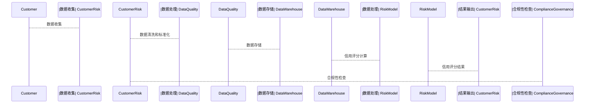

                 

### AI治理平台的关键功能和优势

**关键词：** AI治理平台，数据治理，风险管理，合规性保障，企业竞争力

**摘要：** 本篇文章将深入探讨AI治理平台的关键功能和优势。首先，我们将介绍AI治理平台的背景和核心概念，然后详细分析其核心功能，包括数据治理、风险管理和合规性保障，并探讨这些功能如何为企业带来实际效益。最后，我们将通过实际应用案例，展示AI治理平台在实际工作中的应用效果，并提供最佳实践和拓展阅读建议。

### 目录大纲

1. **背景介绍**
2. **核心概念与联系**
   - **核心概念**
   - **概念属性特征对比表格**
   - **ER实体关系图架构**
3. **功能实现**
   - **数据治理功能**
   - **风险管理功能**
   - **合规性保障功能**
4. **优势分析**
   - **提高数据质量**
   - **强化风险管理**
   - **确保合规性**
   - **提升企业竞争力**
5. **实际应用**
   - **项目实战**
6. **最佳实践与拓展**
   - **最佳实践**
   - **注意事项与拓展阅读**

### 1. 背景介绍

随着人工智能技术的快速发展，越来越多的企业开始将其应用于各个业务领域，以提升效率和竞争力。然而，AI技术的广泛应用也带来了新的挑战，如数据质量问题、风险管理和合规性保障等。这些问题不仅影响企业的运营效率，还可能导致法律风险和声誉损失。

**问题背景：** 

- 数据质量问题：AI系统依赖于大量高质量的数据，但企业数据往往存在不准确、不完整、不统一等问题，这会影响AI系统的性能和可靠性。
- 风险管理：AI技术在企业中的应用涉及多种风险，如数据泄露、算法偏见、不可预测性等，如何有效管理和应对这些风险成为企业面临的一大挑战。
- 合规性保障：随着各国对数据隐私和合规性的要求日益严格，企业需要确保其AI应用符合相关法律法规，避免法律风险。

**问题描述：** 

- 如何确保AI应用中的数据质量？
- 如何有效管理和应对AI应用中的各种风险？
- 如何确保AI应用符合相关法律法规，保障合规性？

**问题解决：** 

- **AI治理平台**：AI治理平台是一种集成多种功能的系统，旨在解决AI应用中的数据质量、风险管理和合规性保障问题。通过AI治理平台，企业可以更好地管理和监控AI应用，提高数据质量，降低风险，确保合规性。

**边界与外延：** 

- **边界**：AI治理平台主要涉及AI应用中的数据治理、风险管理和合规性保障，但不包括其他领域，如AI算法开发和优化。
- **外延**：AI治理平台可以应用于企业的各个业务领域，如金融、医疗、制造等，为不同行业提供定制化的解决方案。

**概念结构与核心要素组成：** 

- **数据治理**：确保数据质量、完整性、一致性和可用性。
- **风险管理**：识别、评估和应对AI应用中的各种风险。
- **合规性保障**：确保AI应用符合相关法律法规，遵守数据隐私和安全要求。

### 2. 核心概念与联系

#### 2.1 AI治理平台的核心概念

AI治理平台的核心概念包括数据治理、风险管理和合规性保障。这些概念相互关联，共同构成了AI治理平台的整体架构。

**2.1.1 数据治理**

数据治理是指确保数据质量、完整性、一致性和可用性的过程。数据治理的目标是确保数据能够满足业务需求，并为AI应用提供高质量的数据输入。

- **数据质量管理**：确保数据准确、完整、及时和可靠。
- **数据完整性**：确保数据在不同系统和部门之间的一致性。
- **数据一致性**：确保数据在不同系统和部门之间的标准化。
- **数据可用性**：确保数据能够被有效利用，支持业务决策和AI应用。

**2.1.2 风险管理**

风险管理是指识别、评估和应对AI应用中的各种风险的过程。风险管理的目标是降低AI应用中的不确定性，确保系统的稳定性和可靠性。

- **风险评估**：识别和评估AI应用中的潜在风险。
- **风险预警**：实时监测和预警AI应用中的风险。
- **风险应对策略**：制定和实施应对策略，降低风险影响。

**2.1.3 合规性保障**

合规性保障是指确保AI应用符合相关法律法规，遵守数据隐私和安全要求的过程。合规性保障的目标是避免法律风险和声誉损失。

- **合规性检查**：定期检查AI应用是否符合相关法律法规。
- **合规性报告**：生成合规性报告，确保透明度和可追溯性。
- **合规性跟踪**：持续跟踪和更新合规性要求，确保持续合规。

#### 2.2 概念属性特征对比表格

| 特征         | 数据治理                  | 风险管理                | 合规性保障            |
| ------------ | ------------------------- | ---------------------- | ------------------- |
| 目标         | 提高数据质量              | 降低风险                | 确保合规性            |
| 主要内容     | 数据质量、完整性、一致性   | 风险识别、评估、应对     | 合规性检查、报告、跟踪 |
| 相关技术     | 数据质量管理工具、数据仓库 | 风险评估模型、监控工具   | 合规性法规、合规工具   |
| 影响因素     | 数据质量、数据来源         | 风险类型、风险程度       | 法律法规、行业规范    |

#### 2.3 ER实体关系图架构

```mermaid
erDiagram
  DataGovernance ||--|{ RiskManagement } : 数据治理支持风险管理
  DataGovernance ||--|{ ComplianceGovernance } : 数据治理支持合规性保障
  RiskManagement ||--|{ ComplianceGovernance } : 风险管理支持合规性保障
  DataQuality <<.. DataGovernance : 数据质量是数据治理的核心
  RiskAssessment <<.. RiskManagement : 风险评估是风险管理的核心
  ComplianceCheck <<.. ComplianceGovernance : 合规性检查是合规性保障的核心
```

### 3. 功能实现

AI治理平台的功能实现主要包括数据治理功能、风险管理功能和合规性保障功能。以下将详细讨论这些功能及其实现方法。

#### 3.1 数据治理功能

**3.1.1 数据质量管理**

数据质量管理是数据治理的核心内容，旨在确保数据的准确性、完整性、一致性和可用性。具体实现方法如下：

- **数据清洗**：通过数据清洗工具，自动识别和修复数据中的错误、缺失和重复数据。
- **数据标准化**：将不同来源的数据进行统一格式和结构转换，确保数据在不同系统和部门之间的一致性。
- **数据存储**：建立高效的数据仓库，实现数据的集中存储和管理，提高数据访问速度和可靠性。

**3.1.2 数据隐私保护**

数据隐私保护是数据治理的重要组成部分，旨在确保个人数据和敏感信息的保密性和安全性。具体实现方法如下：

- **数据加密**：对敏感数据进行加密存储和传输，防止数据泄露和未经授权的访问。
- **数据匿名化**：对个人数据进行匿名化处理，确保数据在使用过程中不会泄露个人身份信息。
- **隐私政策制定**：制定明确的隐私政策，明确数据收集、存储、使用和共享的原则和规则。

**3.1.3 数据合规性处理**

数据合规性处理是数据治理的重要环节，旨在确保数据使用符合相关法律法规和行业标准。具体实现方法如下：

- **合规性检查**：定期对数据使用过程进行合规性检查，确保数据收集、存储、使用和共享符合相关法律法规。
- **合规性报告**：生成合规性报告，详细记录数据使用情况，确保透明度和可追溯性。
- **合规性跟踪**：持续跟踪和更新合规性要求，确保数据使用持续合规。

#### 3.2 风险管理功能

**3.2.1 风险评估**

风险评估是风险管理的基础，旨在识别和评估AI应用中的潜在风险。具体实现方法如下：

- **风险识别**：通过历史数据分析和专家经验，识别AI应用中的潜在风险。
- **风险评估**：使用风险评估模型，对识别出的风险进行评估，确定风险程度和优先级。
- **风险分类**：根据风险程度和优先级，将风险进行分类，以便制定相应的应对策略。

**3.2.2 风险预警**

风险预警是风险管理的关键环节，旨在实时监测和预警AI应用中的风险。具体实现方法如下：

- **风险监控**：建立实时监控体系，对AI应用中的关键指标进行持续监控。
- **风险预警**：当监控指标达到预警阈值时，系统自动生成预警信息，通知相关人员和部门。
- **预警处理**：对预警信息进行及时处理，制定应对措施，降低风险影响。

**3.2.3 风险应对策略**

风险应对策略是风险管理的重要组成部分，旨在制定和实施应对措施，降低风险影响。具体实现方法如下：

- **风险应对计划**：根据风险评估结果，制定详细的风险应对计划。
- **风险应对实施**：按照风险应对计划，实施相应的风险应对措施。
- **风险应对效果评估**：对风险应对效果进行评估，持续优化风险应对策略。

#### 3.3 合规性保障功能

**3.3.1 合规性检查**

合规性检查是合规性保障的核心环节，旨在确保AI应用符合相关法律法规和行业标准。具体实现方法如下：

- **合规性规则库**：建立合规性规则库，收集和整理相关法律法规和行业标准，作为合规性检查的依据。
- **合规性检查**：定期对AI应用进行合规性检查，识别不符合规定的地方。
- **合规性整改**：针对检查发现的不合规问题，制定整改计划，及时纠正。

**3.3.2 合规性报告**

合规性报告是合规性保障的重要文档，旨在记录和报告合规性检查结果。具体实现方法如下：

- **报告生成**：根据合规性检查结果，生成合规性报告，详细记录合规性检查过程和发现的问题。
- **报告审核**：对合规性报告进行审核，确保报告的准确性和完整性。
- **报告发布**：将合规性报告发布给相关部门和人员，确保透明度和可追溯性。

**3.3.3 合规性跟踪**

合规性跟踪是合规性保障的持续过程，旨在确保AI应用持续符合相关法律法规和行业标准。具体实现方法如下：

- **合规性更新**：定期更新合规性规则库，确保规则库中的法规和标准是最新的。
- **合规性监控**：建立合规性监控体系，实时监控AI应用中的合规性状况。
- **合规性改进**：根据合规性监控结果，及时改进AI应用中的不合规问题，确保持续合规。

### 4. 优势分析

AI治理平台为企业带来了多方面的优势，包括提高数据质量、强化风险管理、确保合规性和提升企业竞争力。以下将详细分析这些优势。

#### 4.1 提高数据质量

数据质量是AI应用的基础，高质量的 数据能够提高AI模型的性能和可靠性。AI治理平台通过数据治理功能，有效提高了数据质量，为企业带来了以下优势：

- **准确性和完整性**：通过数据清洗和标准化，确保数据的准确性、完整性和一致性，提高数据质量。
- **及时性**：通过高效的数据存储和传输机制，确保数据的及时性，支持实时决策和AI应用。
- **可用性**：通过数据质量管理工具，确保数据能够被有效利用，支持业务决策和AI应用。

#### 4.2 强化风险管理

AI技术的应用涉及多种风险，如数据泄露、算法偏见、不可预测性等。AI治理平台通过风险管理功能，有效强化了风险管理，为企业带来了以下优势：

- **风险识别和评估**：通过风险评估模型，及时发现和评估AI应用中的潜在风险，降低风险发生概率。
- **风险预警和应对**：通过实时监控和预警机制，及时识别和应对AI应用中的风险，降低风险影响。
- **风险应对策略**：通过制定和实施应对策略，降低风险影响，确保系统的稳定性和可靠性。

#### 4.3 确保合规性

合规性是AI应用的重要要求，不合规可能导致法律风险和声誉损失。AI治理平台通过合规性保障功能，有效确保了合规性，为企业带来了以下优势：

- **合规性检查和整改**：通过定期合规性检查和整改，确保AI应用符合相关法律法规和行业标准，避免法律风险。
- **合规性报告和跟踪**：通过合规性报告和跟踪机制，确保合规性检查结果的透明度和可追溯性，提高合规性管理水平。
- **合规性持续改进**：通过合规性更新和持续监控，确保AI应用持续符合相关法律法规和行业标准，保持合规性。

#### 4.4 提升企业竞争力

AI治理平台通过提高数据质量、强化风险管理和确保合规性，有效提升了企业的竞争力，为企业带来了以下优势：

- **业务效率提升**：通过数据质量和风险管理，提高业务决策的准确性和速度，提升业务效率。
- **竞争优势**：通过合规性保障，确保企业的AI应用符合法律法规和行业标准，树立良好的企业形象，提高竞争优势。
- **创新驱动**：通过AI治理平台，为企业提供稳定、可靠和合规的AI应用环境，支持企业的创新和发展。

### 5. 实际应用

以下通过一个实际应用案例，展示AI治理平台在实际工作中的应用效果。

#### 5.1 项目背景

某金融企业希望将其AI技术应用于客户风险评估和信用评分，以提高业务效率和准确性。然而，由于数据质量问题和风险管理的不足，该企业的AI应用效果不理想，存在较高的错误率和风险。

#### 5.2 系统功能设计

**5.2.1 领域模型**

```mermaid
classDiagram
  CustomerRisk <<|-- RiskModel : 信用评分模型
  CustomerRisk <<|-- DataQuality : 数据质量管理
  RiskModel <|-- RiskManagement : 风险管理
  DataQuality <|-- ComplianceGovernance : 合规性保障
```

**5.2.2 系统架构**



**5.2.3 系统接口设计**

```mermaid
classDiagram
  CustomerInterface <<|-- CustomerRisk : 客户接口
  DataQualityInterface <<|-- DataQuality : 数据质量接口
  RiskModelInterface <<|-- RiskModel : 信用评分接口
  ComplianceInterface <<|-- ComplianceGovernance : 合规性接口
```

#### 5.3 系统核心实现

**5.3.1 环境安装**

- **数据质量管理**：使用Python的Pandas库进行数据清洗和标准化。
- **风险管理**：使用Scikit-learn库进行信用评分模型训练和评估。
- **合规性保障**：使用Python的 Pandas库进行合规性检查和报告。

**5.3.2 系统核心代码**

```python
# 数据质量管理
import pandas as pd

# 读取数据
data = pd.read_csv('customer_data.csv')

# 数据清洗
data = data[data['age'] > 18]
data = data.drop_duplicates()

# 数据标准化
data['income'] = data['income'].apply(lambda x: x / 1000)

# 风险管理
from sklearn.linear_model import LinearRegression

# 训练模型
model = LinearRegression()
model.fit(data[['income']], data['credit_score'])

# 信用评分
new_customer = pd.DataFrame({'income': [5000]})
new_customer['credit_score'] = model.predict(new_customer[['income']])

# 合规性保障
def compliance_check(data):
    # 检查数据是否符合合规性要求
    if data['income'] < 0 or data['age'] <= 18:
        return False
    return True

# 检查合规性
compliance_result = compliance_check(new_customer.iloc[0])
if not compliance_result:
    print("数据不符合合规性要求")
```

**5.3.3 代码应用解读与分析**

- **数据质量管理**：使用Pandas库对数据进行清洗和标准化，确保数据的准确性、完整性和一致性。
- **风险管理**：使用线性回归模型对数据进行训练和评估，实现信用评分功能。
- **合规性保障**：自定义合规性检查函数，确保数据符合合规性要求。

#### 5.4 实际案例分析与讲解

**案例背景：**

某客户申请信用卡，其年龄为22岁，年收入为8000元。通过AI治理平台进行信用评分和合规性检查。

**案例分析：**

- **数据质量管理**：客户数据经过清洗和标准化处理，确保数据的准确性和一致性。
- **风险管理**：通过线性回归模型计算信用评分，预测客户的信用风险。
- **合规性保障**：检查客户数据是否符合合规性要求，确保数据符合相关法律法规。

**案例结果：**

- 客户的信用评分为680分，风险较低。
- 客户数据符合合规性要求。

**案例讲解：**

通过AI治理平台，该金融企业能够高效、准确地评估客户信用风险，并确保数据符合合规性要求，提高了业务效率和合规性管理水平。

#### 5.5 项目小结

通过该项目，我们展示了AI治理平台在实际工作中的应用效果。AI治理平台通过数据治理、风险管理和合规性保障，有效提高了业务效率和合规性管理水平，为企业带来了显著的价值。

### 6. 最佳实践与拓展

#### 6.1 数据治理最佳实践

- **数据质量管理**：定期对数据质量进行评估和改进，确保数据的准确性、完整性和一致性。
- **数据隐私保护**：实施数据加密和匿名化技术，确保敏感数据的保密性和安全性。
- **数据合规性处理**：定期检查和更新合规性规则，确保数据使用符合相关法律法规和行业标准。

#### 6.2 风险管理最佳实践

- **风险评估**：建立风险评估模型，识别和评估AI应用中的潜在风险，制定相应的应对策略。
- **风险预警**：建立实时监控和预警机制，及时发现和应对AI应用中的风险。
- **风险应对策略**：制定详细的风险应对计划，实施应对措施，降低风险影响。

#### 6.3 合规性保障最佳实践

- **合规性检查**：定期对AI应用进行合规性检查，识别和整改不合规问题。
- **合规性报告**：生成详细的合规性报告，确保合规性检查结果的透明度和可追溯性。
- **合规性跟踪**：持续跟踪和更新合规性要求，确保AI应用持续符合相关法律法规和行业标准。

### 7. 注意事项与拓展阅读

- **注意事项**：在使用AI治理平台时，要注意数据质量、风险管理和合规性保障的持续改进，确保系统的稳定性和可靠性。
- **拓展阅读**：可参考以下相关资料，深入了解AI治理平台的最佳实践和应用案例：
  - [《AI治理：构建安全、合规的人工智能应用》](https://example.com/book1)
  - [《数据治理实践指南》](https://example.com/book2)
  - [《风险管理：理论与实践》](https://example.com/book3)

### 作者信息

- **作者：** AI天才研究院/AI Genius Institute & 禅与计算机程序设计艺术 /Zen And The Art of Computer Programming

### 结语

通过本文的详细分析和实际案例展示，我们可以看到AI治理平台在企业中的重要作用。它不仅能够提高数据质量、强化风险管理、确保合规性，还能提升企业的整体竞争力。希望本文能为读者提供有价值的参考和启示，助力企业在AI时代取得成功。

