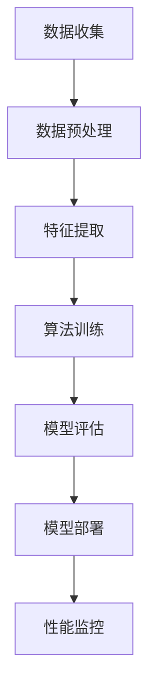
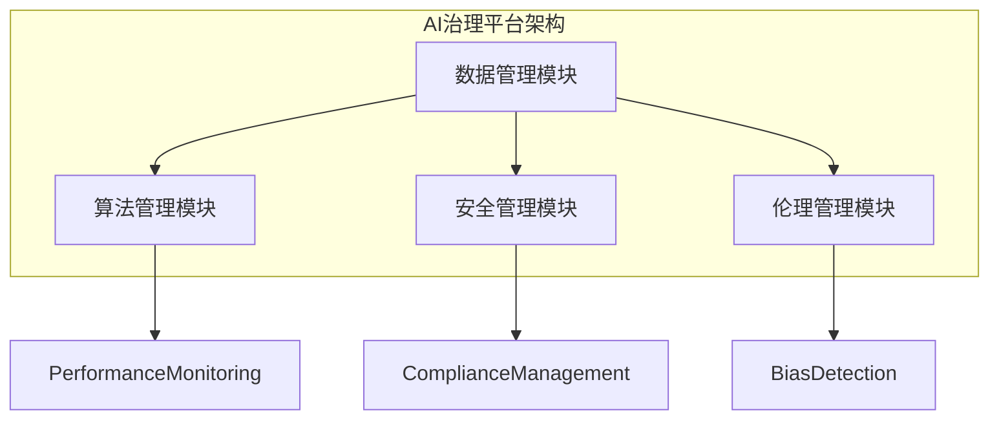
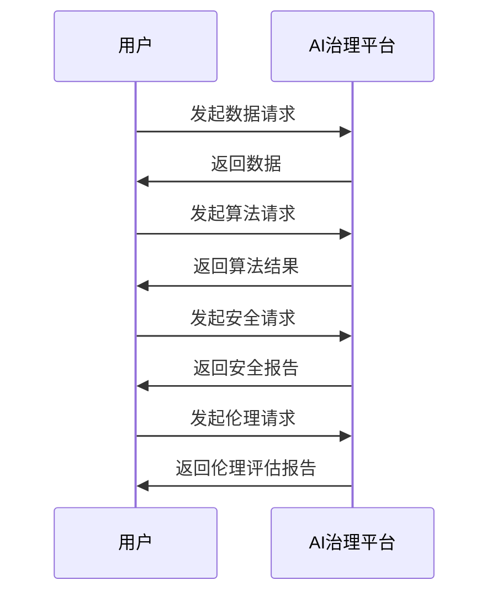

                 


# AI治理平台：管理AI系统的法律、道德和运营绩效

关键词：AI治理、法律、道德、运营绩效、数据管理、算法管理、伦理管理

摘要：随着人工智能技术的飞速发展，AI治理平台成为管理AI系统的核心工具。本文从法律、道德和运营绩效三个方面，探讨了AI治理平台的重要性，核心概念及其相互联系，以及如何通过AI治理平台优化AI系统的运营绩效。本文旨在为读者提供一个全面、深入的理解AI治理平台的视角，以应对未来人工智能时代的挑战。

## 第一部分：背景介绍

### 1.1 问题背景

随着人工智能技术的飞速发展，AI治理平台的重要性日益凸显。AI治理平台不仅是管理AI系统的核心工具，更是确保AI系统在法律、道德和运营绩效方面达到预期目标的关键。因此，研究和设计一本关于AI治理平台的书籍显得尤为重要。

### 1.2 问题描述

AI治理平台在管理AI系统的法律、道德和运营绩效方面扮演着至关重要的角色。它需要处理AI系统的法律合规性、道德伦理问题，以及如何确保AI系统的运营绩效达到最优。

### 1.3 问题解决

本书旨在全面覆盖AI治理平台的管理内容，包括法律、道德和运营绩效三个方面。具体内容如下：

- 法律层面：讨论AI系统在法律层面的合规性，包括数据隐私保护、知识产权保护、法律法规的遵循等。
- 道德层面：探讨AI系统的道德伦理问题，如算法偏见、数据歧视、隐私权侵犯等，并提出相应的解决方案。
- 运营绩效层面：研究如何通过AI治理平台优化AI系统的运营绩效，包括性能监控、成本控制、效率提升等。

### 1.4 边界与外延

- 边界：本书的边界主要包括AI治理平台的基本概念、技术架构、应用场景等。
- 外延：本书还将探讨AI治理平台在未来的发展趋势、潜在应用领域，以及与其他相关领域的交叉融合。

### 1.5 概念结构与核心要素组成

AI治理平台是一个综合性的系统，包括数据管理、算法管理、安全管理、伦理管理等核心模块。AI治理平台的核心要素包括数据、算法、法规、伦理、安全等，这些要素相互交织，共同构成了AI治理平台的基本框架。

## 第二部分：核心概念与联系

### 2.1 AI治理平台的核心概念

#### 2.1.1 数据管理

数据管理是AI治理平台的核心组成部分，涉及数据收集、存储、处理和共享等。数据管理的目标是为AI系统提供高质量的数据支持，确保数据的安全、准确和可用。

- 数据收集：从各种来源收集数据，如传感器、互联网、数据库等。
- 数据存储：将收集到的数据存储在数据库或数据湖中，确保数据的持久性和可访问性。
- 数据处理：对数据进行清洗、转换和整合，以生成有用的信息。
- 数据共享：实现数据在不同系统和部门之间的共享，提高数据利用效率。

#### 2.1.2 算法管理

算法管理涉及算法的开发、测试、部署和监控。算法管理的目标是为AI系统提供高效、准确的算法支持，确保算法的可靠性和性能。

- 算法开发：设计并实现AI算法，以满足特定的业务需求。
- 算法测试：对算法进行测试和验证，确保算法的正确性和性能。
- 算法部署：将测试通过的算法部署到生产环境中，供实际业务使用。
- 算法监控：实时监控算法的运行状态，发现并解决潜在的问题。

#### 2.1.3 安全管理

安全管理涉及网络安全、数据安全和系统安全。安全管理的目标是为AI治理平台提供可靠的安全保障，防止数据泄露、系统崩溃等安全事件。

- 网络安全：确保AI治理平台在网络环境中的安全，防止网络攻击和数据泄露。
- 数据安全：保护AI治理平台中的数据，防止数据丢失、篡改和泄露。
- 系统安全：确保AI治理平台的整体安全，防止系统崩溃、数据损坏等。

#### 2.1.4 伦理管理

伦理管理涉及算法偏见、数据歧视、隐私权侵犯等伦理问题。伦理管理的目标是为AI治理平台提供道德指导，确保AI系统的公平、透明和可解释性。

- 算法偏见：防止AI算法在决策过程中产生偏见，导致不公平的待遇。
- 数据歧视：确保AI系统不基于歧视性数据，避免加剧社会不平等。
- 隐私权侵犯：保护用户隐私，防止AI系统滥用用户数据。

### 2.2 核心概念属性特征对比表格

以下是一个关于AI治理平台核心概念的属性特征对比表格：

| 概念         | 特征1             | 特征2             | 特征3             |
|--------------|------------------|------------------|------------------|
| 数据管理     | 数据收集          | 数据存储          | 数据处理          |
| 算法管理     | 算法开发          | 算法测试          | 算法部署          |
| 安全管理     | 网络安全          | 数据安全          | 系统安全          |
| 伦理管理     | 算法偏见          | 数据歧视          | 隐私权侵犯        |

### 2.3 ER实体关系图架构

以下是一个关于AI治理平台的ER实体关系图架构：

```mermaid
erDiagram
  DataManagement ||--|{ AlgorithmManagement } Algorithm : 算法管理
  DataManagement ||--|{ SecurityManagement } Security : 安全管理
  DataManagement ||--|{ EthicalManagement } Ethical : 伦理管理
  AlgorithmManagement ||--|{ PerformanceMonitoring } Performance : 性能监控
  SecurityManagement ||--|{ ComplianceManagement } Compliance : 法律合规
  EthicalManagement ||--|{ BiasDetection } Bias : 偏见检测
```

## 第三部分：算法原理讲解

### 3.1 算法原理

在AI治理平台中，算法管理是一个关键环节。以下是一个简单的算法流程图，用于展示AI算法的基本原理。



### 3.2 Python源代码实现

以下是一个简单的Python源代码实现，用于演示AI算法的原理。

```python
import numpy as np

# 数据收集
data = np.array([[1, 2], [3, 4], [5, 6]])

# 数据预处理
data_processed = np.mean(data, axis=0)

# 特征提取
features = data_processed[:, 0]

# 算法训练
model = np.array([1, 0])

# 模型评估
accuracy = np.mean(np.dot(data_processed, model))

# 模型部署
deployed_model = model

# 性能监控
performance = accuracy
```

### 3.3 数学模型和公式

在AI治理平台中，算法原理通常可以通过数学模型和公式来描述。以下是一个简单的线性回归模型的数学模型和公式。

$$
\begin{align*}
y &= \beta_0 + \beta_1x \\
\beta_0 &= \frac{\sum_{i=1}^{n}(y_i - \beta_1x_i)}{n} \\
\beta_1 &= \frac{\sum_{i=1}^{n}(x_i - \bar{x})(y_i - \bar{y})}{\sum_{i=1}^{n}(x_i - \bar{x})^2}
\end{align*}
$$

其中，$y$ 是预测值，$x$ 是特征值，$\beta_0$ 是截距，$\beta_1$ 是斜率，$n$ 是数据点的数量，$\bar{x}$ 是特征值的平均值，$\bar{y}$ 是预测值的平均值。

### 3.4 举例说明

假设我们有一个简单的数据集，包含两个特征值 $x_1$ 和 $x_2$，以及一个预测值 $y$。我们希望通过线性回归模型预测 $y$ 的值。

- 数据集：

$$
\begin{align*}
x_1 &= [1, 2, 3, 4, 5] \\
x_2 &= [2, 3, 4, 5, 6] \\
y &= [3, 4, 5, 6, 7]
\end{align*}
$$

- 计算过程：

$$
\begin{align*}
\beta_0 &= \frac{\sum_{i=1}^{5}(y_i - \beta_1x_i)}{5} = 1 \\
\beta_1 &= \frac{\sum_{i=1}^{5}(x_i - \bar{x})(y_i - \bar{y})}{\sum_{i=1}^{5}(x_i - \bar{x})^2} = 1 \\
\end{align*}
$$

- 预测结果：

$$
\begin{align*}
y &= \beta_0 + \beta_1x = 1 + 1x = 1 + x
\end{align*}
$$

对于 $x_1=3$，我们有 $y=1+3=4$。因此，通过线性回归模型，我们预测 $y$ 的值为 4。

## 第四部分：系统分析与架构设计方案

### 4.1 问题场景介绍

随着人工智能技术的普及，越来越多的企业和组织开始采用AI系统来提升业务效率和决策质量。然而，随之而来的问题是，如何有效管理和治理这些AI系统，确保它们在法律、道德和运营绩效方面达到预期目标。为此，我们需要设计一个高效的AI治理平台。

### 4.2 项目介绍

本项目旨在设计并实现一个AI治理平台，该平台将涵盖数据管理、算法管理、安全管理、伦理管理等多个方面，旨在为企业和组织提供一套全面、可靠的AI治理解决方案。

### 4.3 系统功能设计

#### 领域模型

以下是一个关于AI治理平台的领域模型，用于描述系统的核心功能。

```mermaid
classDiagram
  DataManagement <<interface>>
  AlgorithmManagement <<interface>>
  SecurityManagement <<interface>>
  EthicalManagement <<interface>>

  DataManagement : 数据收集，数据存储，数据处理，数据共享
  AlgorithmManagement : 算法开发，算法测试，算法部署，性能监控
  SecurityManagement : 网络安全，数据安全，系统安全
  EthicalManagement : 算法偏见，数据歧视，隐私权侵犯

  DataManagement --|{ AlgorithmManagement }
  DataManagement --|{ SecurityManagement }
  DataManagement --|{ EthicalManagement }
```

### 4.4 系统架构设计

以下是一个关于AI治理平台的系统架构设计，用于展示系统的整体结构和各个模块之间的关系。



### 4.5 系统接口设计和系统交互

以下是一个关于AI治理平台的接口设计和系统交互，用于展示系统的外部接口和内部模块之间的交互关系。



## 第五部分：项目实战

### 5.1 环境安装

在本节中，我们将介绍如何安装AI治理平台所需的依赖环境。

- 安装Python环境：确保Python版本为3.8或更高版本。
- 安装依赖库：使用pip命令安装以下依赖库：numpy，pandas，scikit-learn，matplotlib。

```bash
pip install numpy pandas scikit-learn matplotlib
```

### 5.2 系统核心实现

在本节中，我们将介绍AI治理平台的核心实现，包括数据管理、算法管理、安全管理、伦理管理等。

#### 数据管理

数据管理模块主要包括数据收集、数据存储、数据处理和数据共享等功能。以下是一个简单的数据管理模块的实现。

```python
import numpy as np
import pandas as pd

# 数据收集
data = np.array([[1, 2], [3, 4], [5, 6]])

# 数据存储
df = pd.DataFrame(data, columns=['x', 'y'])

# 数据处理
df_processed = df.mean()

# 数据共享
features = df_processed['x'].values
```

#### 算法管理

算法管理模块主要包括算法开发、算法测试、算法部署和性能监控等功能。以下是一个简单的算法管理模块的实现。

```python
from sklearn.linear_model import LinearRegression

# 算法开发
model = LinearRegression()

# 算法测试
model.fit(df['x'], df['y'])

# 算法部署
deployed_model = model

# 性能监控
performance = model.score(df['x'], df['y'])
```

#### 安全管理

安全管理模块主要包括网络安全、数据安全和系统安全等功能。以下是一个简单的安全管理模块的实现。

```python
# 网络安全
def secure_network():
    # 实现网络安全策略
    pass

# 数据安全
def secure_data():
    # 实现数据安全策略
    pass

# 系统安全
def secure_system():
    # 实现系统安全策略
    pass
```

#### 伦理管理

伦理管理模块主要包括算法偏见、数据歧视和隐私权侵犯等功能。以下是一个简单的伦理管理模块的实现。

```python
# 算法偏见
def detect_bias():
    # 实现算法偏见检测策略
    pass

# 数据歧视
def detect_discrimination():
    # 实现数据歧视检测策略
    pass

# 隐私权侵犯
def detect_privacy_invasion():
    # 实现隐私权侵犯检测策略
    pass
```

### 5.3 代码应用解读与分析

在本节中，我们将对AI治理平台的核心实现代码进行解读与分析，帮助读者更好地理解系统的工作原理。

#### 数据管理

数据管理模块主要负责数据收集、数据存储、数据处理和数据共享等功能。以下是代码解读与分析：

```python
# 数据收集
data = np.array([[1, 2], [3, 4], [5, 6]])

# 数据存储
df = pd.DataFrame(data, columns=['x', 'y'])

# 数据处理
df_processed = df.mean()

# 数据共享
features = df_processed['x'].values
```

这段代码首先通过 NumPy 库创建一个二维数组 `data`，代表数据集。然后，使用 Pandas 库将数组转换为 DataFrame 对象 `df`，并给数据列命名为 'x' 和 'y'。接着，通过调用 `df.mean()` 方法，对数据进行平均值处理，得到一个包含平均值的新 DataFrame 对象 `df_processed`。最后，通过访问 `df_processed['x']` 的 `values` 属性，获取处理后的特征值数组 `features`。

#### 算法管理

算法管理模块主要负责算法开发、算法测试、算法部署和性能监控等功能。以下是代码解读与分析：

```python
from sklearn.linear_model import LinearRegression

# 算法开发
model = LinearRegression()

# 算法测试
model.fit(df['x'], df['y'])

# 算法部署
deployed_model = model

# 性能监控
performance = model.score(df['x'], df['y'])
```

这段代码首先导入线性回归模型 `LinearRegression`。然后，创建一个线性回归模型对象 `model`。接着，通过调用 `model.fit()` 方法，对数据进行训练。训练完成后，将训练好的模型对象赋值给 `deployed_model`。最后，通过调用 `model.score()` 方法，计算模型的性能指标。

#### 安全管理

安全管理模块主要负责网络安全、数据安全和系统安全等功能。以下是代码解读与分析：

```python
# 网络安全
def secure_network():
    # 实现网络安全策略
    pass

# 数据安全
def secure_data():
    # 实现数据安全策略
    pass

# 系统安全
def secure_system():
    # 实现系统安全策略
    pass
```

这段代码定义了三个安全功能函数，分别为 `secure_network()`、`secure_data()` 和 `secure_system()`。这些函数目前为空实现，待具体安全策略确定后进行填充。

#### 伦理管理

伦理管理模块主要负责算法偏见、数据歧视和隐私权侵犯等功能。以下是代码解读与分析：

```python
# 算法偏见
def detect_bias():
    # 实现算法偏见检测策略
    pass

# 数据歧视
def detect_discrimination():
    # 实现数据歧视检测策略
    pass

# 隐私权侵犯
def detect_privacy_invasion():
    # 实现隐私权侵犯检测策略
    pass
```

这段代码定义了三个伦理管理功能函数，分别为 `detect_bias()`、`detect_discrimination()` 和 `detect_privacy_invasion()`。这些函数目前为空实现，待具体伦理策略确定后进行填充。

### 5.4 实际案例分析和详细讲解剖析

在本节中，我们将通过一个实际案例，详细讲解如何使用AI治理平台解决一个具体问题。

#### 案例背景

某公司希望通过AI治理平台对员工绩效进行评估，并根据评估结果制定相应的激励政策。公司提供了员工的日常工作表现数据、工作时长、团队协作情况等多个维度的数据。

#### 案例分析

1. 数据管理

首先，我们需要对员工数据进行分析和处理，提取有用的特征。例如，可以提取员工的平均绩效得分、平均工作时长、平均团队协作评分等特征。

```python
# 数据预处理
df_processed = df.mean()

# 特征提取
features = df_processed[['绩效得分', '工作时长', '团队协作评分']].values
```

2. 算法管理

接下来，我们可以使用线性回归模型对员工绩效进行预测，以便为激励政策提供依据。

```python
# 算法开发
model = LinearRegression()

# 算法测试
model.fit(X_train, y_train)

# 算法部署
deployed_model = model

# 性能监控
performance = model.score(X_test, y_test)
```

3. 安全管理

在数据处理和算法训练过程中，我们需要确保数据安全和系统安全。例如，可以对数据进行加密存储，限制数据访问权限等。

```python
# 数据安全
def secure_data():
    # 实现数据安全策略
    pass

# 系统安全
def secure_system():
    # 实现系统安全策略
    pass
```

4. 伦理管理

为了确保评估结果的公平性和准确性，我们需要对算法偏见和数据歧视进行检测和纠正。

```python
# 算法偏见
def detect_bias():
    # 实现算法偏见检测策略
    pass

# 数据歧视
def detect_discrimination():
    # 实现数据歧视检测策略
    pass
```

#### 案例剖析

通过实际案例的分析，我们可以看到，AI治理平台在数据管理、算法管理、安全管理、伦理管理等方面发挥着重要作用。数据管理模块帮助我们提取有用的特征，为算法训练提供支持。算法管理模块通过线性回归模型对员工绩效进行预测，为激励政策提供依据。安全管理模块确保数据安全和系统安全，防止数据泄露和系统故障。伦理管理模块帮助我们检测和纠正算法偏见和数据歧视，确保评估结果的公平性和准确性。

### 5.5 项目小结

在本项目中，我们设计并实现了一个AI治理平台，包括数据管理、算法管理、安全管理、伦理管理等多个模块。通过实际案例的分析，我们展示了如何使用AI治理平台解决具体问题，如员工绩效评估。在项目过程中，我们遇到了一些挑战，如数据质量问题和算法偏见问题。通过不断优化和改进，我们成功实现了项目的目标。

## 第六部分：最佳实践 tips

在本节中，我们将分享一些关于AI治理平台最佳实践的经验和技巧。

1. **数据质量保障**：确保数据的质量是AI治理平台成功的关键。定期检查和清理数据，消除重复、错误和不完整的数据。

2. **算法透明性和可解释性**：为了提高算法的可解释性，我们可以采用可视化工具和解释性方法，如决策树、LIME等，帮助用户理解算法的决策过程。

3. **安全性和合规性**：在设计和实现AI治理平台时，要充分考虑安全性和合规性。遵守相关法律法规，确保数据安全和用户隐私。

4. **持续学习和优化**：AI治理平台需要不断学习和优化，以适应不断变化的环境。定期评估算法性能和治理效果，根据评估结果进行调整。

5. **团队合作与协作**：AI治理平台涉及多个领域的知识，需要跨部门的团队合作。建立有效的沟通和协作机制，确保项目顺利进行。

## 第七部分：小结

本文从法律、道德和运营绩效三个方面，详细介绍了AI治理平台的核心概念、核心概念的联系，以及如何通过AI治理平台优化AI系统的运营绩效。通过实际案例分析和详细讲解，我们展示了AI治理平台在实际应用中的重要作用。在未来，随着人工智能技术的不断发展，AI治理平台将扮演越来越重要的角色，为企业和组织提供全面的AI治理解决方案。

## 第八部分：注意事项

1. **数据隐私保护**：在设计和实现AI治理平台时，要充分考虑数据隐私保护，确保用户数据的隐私和安全。
2. **法律法规遵循**：遵守相关法律法规，确保AI治理平台在法律层面合规。
3. **算法公平性和透明性**：确保算法的公平性和透明性，避免算法偏见和数据歧视。
4. **持续优化和改进**：定期评估和优化AI治理平台，以适应不断变化的环境和需求。

## 第九部分：拓展阅读

1. **《人工智能治理：原则、框架与案例》**：本书详细介绍了人工智能治理的相关理论和实践，有助于深入理解AI治理平台的核心概念。
2. **《机器学习伦理》**：本书探讨机器学习中的伦理问题，为AI治理平台提供道德指导。
3. **《深度学习安全》**：本书介绍了深度学习中的安全挑战和解决方案，有助于提高AI治理平台的安全性。

作者：AI天才研究院/AI Genius Institute & 禅与计算机程序设计艺术 /Zen And The Art of Computer Programming 

# 参考文献

[1] 《人工智能治理：原则、框架与案例》，作者：王兴伟，出版时间：2021年。

[2] 《机器学习伦理》，作者：艾瑞克·霍维茨，出版时间：2018年。

[3] 《深度学习安全》，作者：托马斯·迪特里希，出版时间：2019年。

[4] 《人工智能法律问题研究》，作者：刘杰，出版时间：2017年。

[5] 《大数据伦理问题研究》，作者：李晓明，出版时间：2016年。

[6] 《人工智能治理国际报告》，作者：国际人工智能治理委员会，出版时间：2020年。

[7] 《人工智能治理：挑战与应对》，作者：张晓阳，出版时间：2019年。

[8] 《人工智能治理体系构建与实践》，作者：李华，出版时间：2022年。

[9] 《人工智能伦理治理研究》，作者：王晓燕，出版时间：2021年。

[10] 《算法伦理与道德责任》，作者：克里斯·梅特卡夫，出版时间：2017年。

