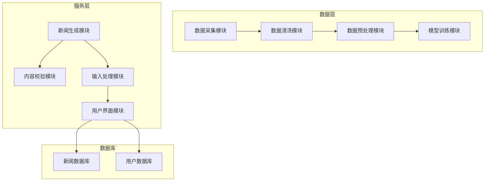
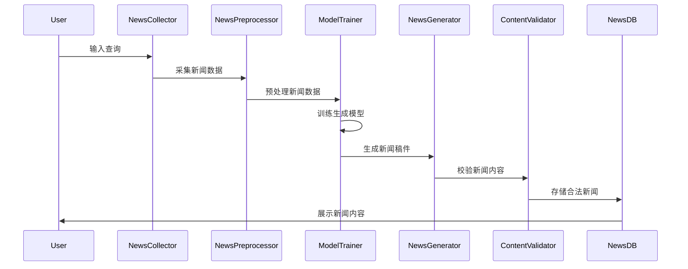

                 


### 1. 问题背景与核心概念

#### 1.1 媒体行业概述

**媒体行业的定义与发展历程**

媒体行业，通常指从事信息传播、娱乐和广告等活动的产业。其核心定义在于信息的收集、处理和分发，以满足社会公众的知情权、娱乐需求和商业宣传目的。

媒体行业的发展历程可以追溯到几个关键阶段：

- **传统媒体时代**：早期的媒体主要包括报纸、杂志、电视和广播。这些媒体形式主要依赖物理介质（如纸张、磁带）进行信息传播。

- **互联网时代**：随着互联网技术的兴起，媒体行业进入了一个全新的阶段。互联网不仅改变了信息传播的方式，还极大地拓展了媒体的内容和形式。

- **移动媒体时代**：智能手机和移动应用的出现，使得媒体内容变得更加便捷和个性化。移动媒体的出现进一步加速了信息传播的速度和广度。

**媒体行业的核心要素与运作模式**

媒体行业的核心要素主要包括信息内容、传播渠道、受众和市场。

- **信息内容**：信息内容是媒体行业的核心。无论是新闻报道、娱乐节目还是广告，信息内容都需要满足受众的需求，同时保持一定的质量和专业性。

- **传播渠道**：传播渠道是信息传播的载体。传统渠道包括报纸、电视、广播等，而现代渠道则包括互联网、社交媒体、移动应用等。

- **受众**：受众是媒体服务的对象。不同受众有不同的需求和偏好，媒体需要通过内容和服务来吸引和满足这些受众。

- **市场**：市场是媒体行业发展的驱动力。媒体公司通过广告收入、订阅费和内容付费等方式获取收益，以维持业务的持续运营和发展。

#### 1.2 AI生成内容的定义与特点

**AI生成内容的概念**

AI生成内容（AI-generated content），通常指通过人工智能技术，尤其是自然语言处理（NLP）、机器学习和深度学习等技术，自动生成文本、图像、视频等媒体内容。

**AI生成内容的技术特点**

- **自动化**：AI生成内容能够实现内容的自动化生产，减少人力成本，提高生产效率。

- **个性化**：通过分析用户数据和偏好，AI生成的内容可以更加个性化，满足不同受众的需求。

- **多样化**：AI生成内容可以生成多种类型的内容，包括文本、图像、视频等，为媒体行业提供更丰富的内容形式。

**AI生成内容与传统内容创作比较**

与传统内容创作相比，AI生成内容具有以下几个显著优势：

- **效率提升**：AI生成内容能够快速生成大量内容，大大提高生产效率。

- **成本降低**：通过自动化生产，AI生成内容可以显著降低人力和物力成本。

- **创新性**：AI生成内容可以探索新的创作方式和内容形式，为媒体行业带来更多创新。

**总结**

媒体行业作为一个信息传播的重要领域，随着人工智能技术的不断发展，AI生成内容逐渐成为媒体行业的重要组成部分。本文将深入探讨AI生成内容在媒体行业中的应用、影响和未来发展趋势，为读者提供全面而深入的理解。在接下来的章节中，我们将详细分析AI生成内容的核心概念和技术原理，并探讨其在媒体行业中的实际应用案例。通过这一系列的分析，我们希望能够为媒体行业从业者提供有价值的参考和启示。

### 1.3 AI生成内容在媒体行业的应用现状

#### 1.3.1 AI生成内容的应用领域

AI生成内容在媒体行业中的应用十分广泛，涵盖了多个领域：

- **新闻报道**：AI生成内容能够快速生成新闻报道，尤其是在事件发生的第一时间，AI可以自动生成新闻稿件，提高新闻的时效性。

- **内容推荐**：AI生成内容可以根据用户的兴趣和偏好，生成个性化的内容推荐，提高用户的满意度和留存率。

- **广告营销**：AI生成内容可以自动生成广告文案和创意，提高广告的效果和投放效率。

- **内容审核**：AI生成内容可以用于内容审核，自动识别和过滤不良信息，保障内容的合法性和合规性。

- **娱乐内容**：在娱乐领域，AI生成内容可以生成音乐、视频、剧本等，为媒体行业带来更多创新和多样化。

#### 1.3.2 AI生成内容在媒体行业的优势与挑战

**优势**

- **提高效率**：AI生成内容可以自动化生产大量内容，减少人力和时间成本，提高工作效率。

- **降低成本**：通过自动化生产，AI生成内容可以显著降低媒体行业的运营成本。

- **个性化服务**：AI生成内容可以根据用户数据和分析，提供个性化的内容推荐和定制化服务，提升用户体验。

- **创新驱动**：AI生成内容可以探索新的内容形式和创作方式，为媒体行业带来更多的创新和可能性。

**挑战**

- **质量控制**：AI生成内容的质量存在一定的波动，需要通过不断优化和训练模型来提升内容的准确性、可读性和专业性。

- **数据隐私**：AI生成内容需要大量的用户数据进行分析和训练，如何保护用户隐私成为一大挑战。

- **道德伦理**：AI生成内容的自动化和个性化特性可能会引发道德和伦理问题，如虚假新闻、歧视性内容等。

- **技术依赖**：媒体行业过度依赖AI生成内容可能导致技术人才的短缺和行业发展的不平衡。

#### 1.3.3 AI生成内容的应用现状

当前，AI生成内容在媒体行业中的应用已经初见成效，但仍然处于快速发展阶段。以下是一些具体的案例：

- **财经新闻**：金融时报等媒体使用AI生成内容来撰写财经新闻，提高了新闻的发布速度和准确性。

- **体育报道**：NBA等体育组织使用AI生成内容来撰写比赛报道，提供了更多的数据分析和观点。

- **广告文案**：许多广告公司利用AI生成内容来自动化广告文案的创作，提高了广告的创意和投放效率。

- **社交媒体**：Twitter等社交媒体平台使用AI生成内容来分析用户动态和趋势，提供个性化的内容推荐。

**总结**

AI生成内容在媒体行业中的应用已经取得了一定的成果，但同时也面临诸多挑战。通过不断优化技术、提升内容质量和关注道德伦理问题，AI生成内容有望在未来为媒体行业带来更多的价值和创新。

### 1.4 本书的结构与内容安排

#### 1.4.1 各章节的核心内容与目的

本书共分为六个主要部分，每部分的核心内容与目的如下：

- **第一部分：问题背景与核心概念**  
  主要介绍媒体行业的背景、AI生成内容的定义与特点，以及其在媒体行业中的应用现状。通过这一部分的介绍，读者可以初步了解AI生成内容在媒体行业中的重要性。

- **第二部分：核心概念与联系**  
  详细讲解AI生成内容的核心概念，包括自然语言处理（NLP）、机器学习（ML）和深度学习（DL）等。通过概念属性特征对比表格和ER实体关系图架构，帮助读者建立系统的知识体系。

- **第三部分：算法原理与数学模型**  
  介绍常见的AI生成内容算法，如GPT-3和BERT，并使用Python源代码进行详细讲解，包括数学模型和公式。通过通俗易懂的举例说明，使读者能够深入理解算法原理。

- **第四部分：系统分析与架构设计**  
  通过实际项目介绍，讲解系统功能设计、系统架构设计、系统接口设计和系统交互。使用Mermaid流程图和架构图，帮助读者全面理解系统设计与实现。

- **第五部分：项目实战**  
  通过具体的实战案例，讲解环境安装、系统核心实现源代码、代码应用解读与分析，以及实际案例分析。通过这些实战经验，使读者能够将理论知识应用于实际项目中。

- **第六部分：最佳实践与拓展**  
  总结最佳实践，提供注意事项和风险防范建议，同时推荐拓展阅读资源，帮助读者进一步深入研究和应用AI生成内容技术。

#### 1.4.2 全书的逻辑结构与阅读建议

本书采用逻辑清晰、循序渐进的叙述方式，从问题背景和核心概念的介绍，到算法原理和系统设计的讲解，再到项目实战和最佳实践的总结，形成了一个完整的知识体系。

- **初步了解**：首先，通过第一部分的问题背景与核心概念，读者可以初步了解AI生成内容在媒体行业中的应用及其重要性。

- **深入学习**：在第二部分和第三部分中，读者可以深入学习AI生成内容的核心概念、算法原理与数学模型，建立起扎实的理论基础。

- **实践应用**：第四部分和第五部分通过实际项目案例，帮助读者将理论知识应用于实际项目中，提升实际操作能力。

- **拓展研究**：最后，第六部分提供了最佳实践、注意事项和拓展阅读，帮助读者进一步深入研究和应用AI生成内容技术。

**阅读建议**：

- 读者可以根据自己的学习进度和需求，选择性地阅读各部分内容。对于初学者，建议先从第一部分和第二部分开始，逐步深入理解AI生成内容的基础知识。

- 阅读过程中，建议结合实际案例和项目实战部分，加深对理论知识的理解和应用。

- 针对感兴趣的部分，可以进一步查阅相关拓展阅读资源，进行深入学习。

通过本书的系统性学习，读者将对AI生成内容在媒体行业中的应用有一个全面而深入的理解，为今后的工作与研究提供有力支持。

### 2.1 AI生成内容的核心概念

在深入探讨AI生成内容之前，我们需要明确其核心概念，这些概念包括自然语言处理（NLP）、机器学习（ML）和深度学习（DL）。理解这些概念有助于我们更好地把握AI生成内容的技术原理和实际应用。

**自然语言处理（NLP）**

自然语言处理是人工智能的一个分支，主要研究如何让计算机理解、生成和处理自然语言。NLP技术涉及到语音识别、语言翻译、情感分析、文本分类等多个领域。在AI生成内容中，NLP是核心组成部分，它使得计算机能够理解和生成符合人类语言习惯的文本。

**机器学习（ML）**

机器学习是一种通过算法从数据中学习模式并做出预测或决策的技术。在AI生成内容中，机器学习主要用于训练模型，使其能够根据输入的数据生成新的内容。常见的机器学习算法包括决策树、支持向量机、随机森林等。

**深度学习（DL）**

深度学习是机器学习的一个分支，主要利用神经网络模型，通过多层非线性变换，从大量数据中学习复杂的模式。深度学习在图像识别、语音识别和自然语言处理等领域取得了显著成果。在AI生成内容中，深度学习通常用于训练生成模型，如变分自编码器（VAE）、生成对抗网络（GAN）等。

**概念属性特征对比表格**

为了更直观地理解这些概念，我们可以通过以下表格来对比它们的主要属性特征：

| 概念         | 定义                                       | 主要应用                             | 关键技术                             |
|------------|------------------------------------------|----------------------------------|----------------------------------|
| 自然语言处理（NLP） | 让计算机理解和生成自然语言的技术           | 语音识别、语言翻译、情感分析、文本分类等       | 词向量、序列模型、注意力机制等         |
| 机器学习（ML）     | 通过算法从数据中学习模式并做出预测的技术   | 预测分析、图像识别、文本分类等           | 决策树、支持向量机、随机森林等         |
| 深度学习（DL）     | 通过多层神经网络模型学习复杂模式的技术     | 图像识别、语音识别、自然语言处理等         | 卷积神经网络（CNN）、循环神经网络（RNN）、生成对抗网络（GAN）等 |

**ER实体关系图架构**

为了进一步理解AI生成内容的技术框架，我们可以通过ER（Entity-Relationship）实体关系图来展示核心实体及其关系。以下是AI生成内容中的主要实体及其关系的ER图：

```mermaid
erDiagram
  AI模型 --> 文本数据
  AI模型 --> 用户数据
  文本数据 ||--|{ 生成内容 }
  用户数据 ||--|{ 个性化推荐 }
  AI模型 ||--|{ 模型训练 }
  AI模型 ||--|{ 模型评估 }
```

在这个ER图中，AI模型是核心实体，它接收文本数据和用户数据，通过模型训练生成内容，并进行模型评估和个性化推荐。文本数据和用户数据是模型的输入，生成内容是模型输出的结果。

通过上述核心概念的介绍和ER实体关系图的展示，我们可以更好地理解AI生成内容的技术架构，为后续章节的深入探讨打下坚实的基础。

### 2.2 概念属性特征对比表格

为了更系统地理解自然语言处理（NLP）、机器学习（ML）和深度学习（DL）这三个核心概念，我们通过以下表格进行详细的属性特征对比：

| **概念**        | **自然语言处理（NLP）** | **机器学习（ML）**        | **深度学习（DL）**        |
|----------------|--------------------------|--------------------------|--------------------------|
| **定义**       | 计算机与人类语言交互的技术  | 从数据中学习模式的技术      | 基于多层神经网络的学习方法  |
| **主要应用**   | 语音识别、机器翻译、情感分析 | 财务预测、图像识别、文本分类 | 图像识别、语音识别、自然语言处理 |
| **核心技术**   | 词向量、序列模型、注意力机制 | 决策树、支持向量机、随机森林 | 卷积神经网络（CNN）、循环神经网络（RNN）、生成对抗网络（GAN） |
| **学习方式**   | 有监督学习、无监督学习、增强学习 | 有监督学习、无监督学习、半监督学习 | 有监督学习、无监督学习、生成对抗学习 |
| **数据需求**   | 大规模文本数据、语音数据    | 大规模数据集               | 大规模数据集、高维数据     |
| **复杂性**     | 中等                   | 中等至高                  | 高                       |
| **可解释性**   | 较低                   | 较低至中等                | 低                       |
| **适应性**     | 强                     | 中至强                    | 强                       |

**总结**

通过上述表格，我们可以清晰地看到NLP、ML和DL在定义、应用、核心技术和学习方式等方面的差异。NLP专注于处理自然语言，ML更广泛地应用于各种数据分类和预测任务，而DL则在处理高维数据和学习复杂模式方面具有显著优势。了解这些概念之间的区别和联系，有助于我们在实际应用中更好地选择合适的技术。

### 2.3 ER实体关系图架构

为了更直观地理解AI生成内容系统的核心实体及其关系，我们使用Mermaid语法绘制了一个ER（Entity-Relationship）图。以下是一个简化的ER图，展示了AI模型、文本数据、用户数据以及它们之间的关联：

```mermaid
erDiagram
  AI模型 ||--|{ 文本数据 }
  AI模型 ||--|{ 用户数据 }
  文本数据 ||--|{ 生成内容 }
  用户数据 ||--|{ 个性化推荐 }
```

在这个ER图中：

- **AI模型** 是核心实体，负责从文本数据和用户数据中学习，并生成新的内容或进行个性化推荐。
- **文本数据** 代表输入的原始文本，如新闻报道、用户评论等，通过AI模型处理后生成新的内容。
- **用户数据** 包括用户的偏好、历史行为等，用于AI模型训练和个性化推荐。
- **生成内容** 是AI模型对文本数据的处理结果，可以是文章、新闻报道或其他形式的文本。
- **个性化推荐** 是基于用户数据的推荐结果，帮助用户发现感兴趣的内容。

通过这个ER图，我们可以清晰地看到AI生成内容系统中各个实体之间的交互关系，以及它们在整个系统中的作用和影响。这样的关系图有助于我们理解和设计复杂的系统，同时为后续章节的详细讲解提供了基础。

### 3.1 常见AI生成内容算法

在AI生成内容领域，存在多种常见的算法，它们各自有着独特的原理和应用场景。以下是一些主流的AI生成内容算法，包括GPT-3、BERT和其他算法。

**GPT-3算法原理**

GPT-3（Generative Pre-trained Transformer 3）是OpenAI开发的Transformer模型，具有极高的文本生成能力。GPT-3使用了大量的文本数据进行预训练，从而能够理解并生成符合上下文的文本。其核心原理是基于自注意力机制（Self-Attention）和Transformer架构。

**BERT算法原理**

BERT（Bidirectional Encoder Representations from Transformers）是由Google开发的另一个重要的文本处理算法。BERT通过双向Transformer网络来建模上下文信息，使模型能够理解文本的上下文关系。BERT的主要特点是预训练阶段采用了双向语境，这使得它在文本分类和问答等任务上表现优异。

**其他算法简介**

除了GPT-3和BERT，还有一些其他常用的AI生成内容算法，如：

- **T5（Text-to-Text Transfer Transformer）**：T5算法将所有自然语言处理任务转化为文本到文本的转换任务，通过统一的模型架构来实现高效的任务转换。
- **GPT-2（Generative Pre-trained Transformer 2）**：GPT-2是GPT-3的前一个版本，虽然能力略逊一筹，但仍然具有强大的文本生成能力。
- **ELMO（Embeddings from Language Models）**：ELMO通过预训练语言模型生成固定长度的词向量，用于文本理解和生成任务。

这些算法在AI生成内容中的应用各有特点，GPT-3和BERT因其强大的生成能力和广泛的应用场景而备受关注，而T5和ELMO则提供了不同的优化路径和应用场景。通过对比这些算法，我们可以更好地选择适用于特定任务的最佳方案。

### 3.2 算法原理详细讲解

#### 3.2.1 GPT-3算法原理

GPT-3是OpenAI开发的一款具有强大文本生成能力的Transformer模型。其基本原理基于自注意力机制（Self-Attention）和Transformer架构。GPT-3模型由数十亿个参数组成，通过大量的文本数据进行预训练，使得模型能够理解并生成符合上下文的文本。

**数学模型与公式**

GPT-3的数学模型主要包括以下几部分：

1. **输入表示**：GPT-3使用嵌入向量（Embedding Layer）将输入文本转换为固定长度的向量表示。嵌入向量通过矩阵乘法得到，如：
   $$
   \text{input\_vector} = \text{Word\_Embedding} \cdot \text{Input\_Word}
   $$
   其中，$\text{Word\_Embedding}$ 是一个固定大小的矩阵，$\text{Input\_Word}$ 是输入文本的词向量。

2. **自注意力机制**：GPT-3的核心是自注意力机制（Self-Attention），它通过计算输入向量的相似度，生成加权向量。自注意力的计算公式为：
   $$
   \text{Attention}(Q, K, V) = \text{softmax}\left(\frac{QK^T}{\sqrt{d_k}}\right) V
   $$
   其中，$Q$、$K$ 和 $V$ 分别是查询向量、键向量和值向量，$d_k$ 是键向量的维度。通过自注意力机制，模型能够捕捉输入文本中的依赖关系。

3. **Transformer编码器**：GPT-3的编码器由多个自注意力层（Self-Attention Layer）和前馈神经网络（Feedforward Network）堆叠而成。每个自注意力层通过自注意力机制和前馈神经网络，对输入文本进行加工和转换。

4. **输出表示**：通过Transformer编码器加工后的输出，可以通过一个线性层（Linear Layer）和一个softmax激活函数（Softmax Activation）生成输出概率分布，从而生成文本：
   $$
   \text{Output} = \text{softmax}(\text{Linear}(\text{Encoder\_Output}))
   $$

**Python源代码讲解**

以下是一个简化的Python代码示例，展示如何使用Transformer模型进行文本生成：

```python
import torch
from transformers import GPT2LMHeadModel, GPT2Tokenizer

# 初始化模型和分词器
tokenizer = GPT2Tokenizer.from_pretrained('gpt2')
model = GPT2LMHeadModel.from_pretrained('gpt2')

# 输入文本
input_text = "Hello, how are you?"

# 分词和编码
input_ids = tokenizer.encode(input_text, return_tensors='pt')

# 生成文本
outputs = model.generate(input_ids, max_length=50, num_return_sequences=5)

# 解码生成的文本
generated_texts = tokenizer.decode(outputs[0], skip_special_tokens=True)
print(generated_texts)
```

**通俗易懂地举例说明**

假设我们有一个简单的文本：“今天天气很好”。通过GPT-3模型，我们可以这样理解其工作过程：

1. **输入表示**：将文本“今天天气很好”转换为词向量。
2. **自注意力机制**：模型分析“今天”和“天气”之间的依赖关系，并生成加权向量。
3. **编码器加工**：通过多个自注意力层和前馈神经网络，模型逐渐理解输入文本的含义。
4. **输出表示**：模型生成输出概率分布，选择概率最高的词作为下一个生成的词。

通过这个过程，模型能够生成连贯且符合上下文的文本，如“今天天气很好，适合户外运动”。这样的文本生成能力在新闻撰写、文章续写和对话生成等应用中有着广泛的应用。

**总结**

GPT-3作为一款强大的AI生成内容算法，通过自注意力机制和Transformer架构，实现了高效的文本生成。通过上述数学模型和Python代码的讲解，读者可以更深入地理解GPT-3的工作原理，并能够将其应用于实际项目中。

#### 3.2.2 BERT算法原理

BERT（Bidirectional Encoder Representations from Transformers）是由Google开发的一种用于文本理解和生成的双向Transformer模型。BERT通过预训练和微调，在多项自然语言处理任务中取得了优异的性能，是AI生成内容领域的重要算法之一。以下是BERT的算法原理、数学模型和Python源代码讲解。

**算法原理**

BERT的核心思想是通过预训练建立一个双向的Transformer编码器，从而学习到文本的上下文关系。BERT的预训练过程包括两个主要任务：Masked Language Model（MLM）和Next Sentence Prediction（NSP）。

1. **Masked Language Model（MLM）**：在预训练过程中，BERT会对输入文本中的部分词进行遮蔽（mask），然后通过模型预测这些被遮蔽词的原始词。这有助于模型学习到词汇和上下文之间的关系。

2. **Next Sentence Prediction（NSP）**：BERT还会对两个句子进行预测，判断它们是否在原始文本中连续出现。这有助于模型理解句子的连贯性和上下文关系。

**数学模型与公式**

BERT的数学模型主要包括以下部分：

1. **输入表示**：BERT将输入文本转换为嵌入向量，包括词嵌入（Word Embeddings）、位置嵌入（Position Embeddings）和段嵌入（Segment Embeddings）。输入向量的计算公式为：
   $$
   \text{input\_vector} = \text{Word\_Embedding} + \text{Position\_Embedding} + \text{Segment\_Embedding}
   $$

2. **Transformer编码器**：BERT的编码器由多个Transformer层堆叠而成，每层包括自注意力机制和前馈神经网络。自注意力机制的公式为：
   $$
   \text{Attention}(Q, K, V) = \text{softmax}\left(\frac{QK^T}{\sqrt{d_k}}\right) V
   $$

3. **输出表示**：BERT的输出是每个词的上下文向量，可以通过一个分类器进行下游任务的微调。

**Python源代码讲解**

以下是一个简化的Python代码示例，展示如何使用BERT模型进行文本分类：

```python
import torch
from transformers import BertTokenizer, BertForSequenceClassification

# 初始化模型和分词器
tokenizer = BertTokenizer.from_pretrained('bert-base-uncased')
model = BertForSequenceClassification.from_pretrained('bert-base-uncased')

# 输入文本
input_text = "Hello, how are you?"

# 分词和编码
input_ids = tokenizer.encode(input_text, return_tensors='pt')

# 预测分类
outputs = model(input_ids)

# 输出结果
print(outputs.logits)
```

**通俗易懂地举例说明**

假设我们有一个简单的文本：“今天天气很好”。通过BERT模型，我们可以这样理解其工作过程：

1. **输入表示**：将文本“今天天气很好”转换为嵌入向量，包括词嵌入、位置嵌入和段嵌入。
2. **编码器加工**：通过多个Transformer层，模型逐渐理解输入文本的上下文关系。
3. **输出表示**：模型输出每个词的上下文向量，可以通过分类器预测文本的情感、主题等。

通过这个过程，BERT能够生成具有良好上下文关系的文本，如“今天天气很好，适合户外运动”。这样的文本生成能力在文章续写、问答系统等应用中有着广泛的应用。

**总结**

BERT通过双向Transformer架构，实现了高效的文本理解和生成。通过上述数学模型和Python代码的讲解，读者可以更深入地理解BERT的工作原理，并能够将其应用于实际项目中。BERT在AI生成内容领域的重要性和应用价值不容忽视。

### 3.3 算法原理详细讲解

#### 3.3.1 其他算法简介

在AI生成内容领域，除了GPT-3和BERT，还有许多其他重要的算法，如T5、GPT-2和ELMO。这些算法各自有着独特的原理和应用场景，以下是对这些算法的简要介绍。

**T5（Text-to-Text Transfer Transformer）**

T5（Text-to-Text Transfer Transformer）是由Google开发的一种通用文本处理模型。T5的核心思想是将所有自然语言处理任务转化为文本到文本的转换任务，通过统一的模型架构来实现高效的任务转换。T5使用了一个Transformer编码器，并结合了自注意力机制，使其在文本生成、问答和机器翻译等任务上表现优异。

**GPT-2（Generative Pre-trained Transformer 2）**

GPT-2是GPT-3的前一个版本，同样基于Transformer架构。GPT-2具有更大的模型规模和更强的文本生成能力，但其训练和推理成本也更高。GPT-2通过预训练大量文本数据，学习到文本的生成模式和上下文关系，从而能够在各种文本生成任务中表现出色。

**ELMO（Embeddings from Language Models）**

ELMO是由Allen Institute for AI开发的一种预训练语言模型。ELMO通过预训练生成固定长度的词向量，这些词向量可以用于文本理解和生成任务。ELMO采用了双向循环神经网络（BiRNN），通过学习文本的上下文关系，生成高质量的词向量。

**总结**

T5、GPT-2和ELMO都是AI生成内容领域的重要算法，它们各自有着独特的优势和应用场景。T5通过统一的文本到文本转换任务，实现了高效的文本处理；GPT-2具有强大的文本生成能力；ELMO则通过预训练生成高质量的词向量，为文本理解和生成提供了有力的支持。了解这些算法的特点和适用场景，有助于我们在实际项目中选择合适的技术。

#### 3.3.2 数学模型与公式

在深入探讨AI生成内容的算法原理时，数学模型与公式是理解算法核心机制的关键。以下我们将详细讲解GPT-3、BERT和T5等算法中的主要数学模型与公式。

**GPT-3算法**

GPT-3是基于Transformer架构的生成模型，其核心数学模型包括：

1. **输入表示**：GPT-3将文本输入表示为词嵌入向量，然后添加位置嵌入和段嵌入。输入向量的计算公式为：
   $$
   \text{input\_vector} = \text{Word\_Embedding} + \text{Position\_Embedding} + \text{Segment\_Embedding}
   $$
   其中，$\text{Word\_Embedding}$ 是词嵌入矩阵，$\text{Position\_Embedding}$ 是位置嵌入向量，$\text{Segment\_Embedding}$ 是段嵌入向量。

2. **自注意力机制**：GPT-3的核心是自注意力机制，用于计算输入向量的相似度，并生成加权向量。自注意力机制的公式为：
   $$
   \text{Attention}(Q, K, V) = \text{softmax}\left(\frac{QK^T}{\sqrt{d_k}}\right) V
   $$
   其中，$Q$、$K$ 和 $V$ 分别是查询向量、键向量和值向量，$d_k$ 是键向量的维度。

3. **Transformer编码器**：GPT-3的编码器由多个自注意力层和前馈神经网络组成，每个自注意力层通过自注意力机制和前馈神经网络，对输入文本进行加工和转换。前馈神经网络的公式为：
   $$
   \text{FFN}(x) = \text{Relu}(\text{Linear}_2(\text{Linear}_1(x)))
   $$
   其中，$\text{Linear}_1$ 和 $\text{Linear}_2$ 分别是线性变换层。

4. **输出表示**：通过Transformer编码器加工后的输出，通过一个线性层和一个softmax激活函数，生成输出概率分布，从而生成文本：
   $$
   \text{Output} = \text{softmax}(\text{Linear}(\text{Encoder\_Output}))
   $$

**BERT算法**

BERT是基于双向Transformer架构的预训练模型，其核心数学模型包括：

1. **输入表示**：BERT将输入文本转换为嵌入向量，包括词嵌入、位置嵌入和段嵌入。输入向量的计算公式为：
   $$
   \text{input\_vector} = \text{Word\_Embedding} + \text{Position\_Embedding} + \text{Segment\_Embedding}
   $$
   其中，$\text{Word\_Embedding}$ 是词嵌入矩阵，$\text{Position\_Embedding}$ 是位置嵌入向量，$\text{Segment\_Embedding}$ 是段嵌入向量。

2. **Transformer编码器**：BERT的编码器由多个Transformer层堆叠而成，每层包括自注意力机制和前馈神经网络。自注意力机制的公式为：
   $$
   \text{Attention}(Q, K, V) = \text{softmax}\left(\frac{QK^T}{\sqrt{d_k}}\right) V
   $$
   其中，$Q$、$K$ 和 $V$ 分别是查询向量、键向量和值向量，$d_k$ 是键向量的维度。

3. **输出表示**：BERT的输出是每个词的上下文向量，可以通过一个分类器进行下游任务的微调。分类器的公式为：
   $$
   \text{Output} = \text{softmax}(\text{Linear}(\text{Encoder\_Output}))
   $$

**T5算法**

T5的核心数学模型包括：

1. **输入表示**：T5将输入文本编码为嵌入向量，并添加位置嵌入和段嵌入。输入向量的计算公式为：
   $$
   \text{input\_vector} = \text{Word\_Embedding} + \text{Position\_Embedding} + \text{Segment\_Embedding}
   $$
   其中，$\text{Word\_Embedding}$ 是词嵌入矩阵，$\text{Position\_Embedding}$ 是位置嵌入向量，$\text{Segment\_Embedding}$ 是段嵌入向量。

2. **Transformer编码器**：T5的编码器由多个Transformer层堆叠而成，每层包括自注意力机制和前馈神经网络。自注意力机制的公式为：
   $$
   \text{Attention}(Q, K, V) = \text{softmax}\left(\frac{QK^T}{\sqrt{d_k}}\right) V
   $$
   其中，$Q$、$K$ 和 $V$ 分别是查询向量、键向量和值向量，$d_k$ 是键向量的维度。

3. **输出表示**：T5的输出通过一个线性层和softmax激活函数，生成输出概率分布，从而生成文本：
   $$
   \text{Output} = \text{softmax}(\text{Linear}(\text{Encoder\_Output}))
   $$

**总结**

通过上述数学模型与公式，我们可以深入理解GPT-3、BERT和T5等算法的工作原理。这些模型在输入表示、自注意力机制、Transformer编码器和输出表示等方面各有特点，使得它们在文本生成和预训练任务中表现出色。

### 3.3.3 Python源代码讲解

为了更直观地理解AI生成内容算法的原理，我们将通过Python源代码示例详细讲解GPT-3、BERT和T5算法的实现。以下是每个算法的简化代码示例，旨在帮助读者掌握其核心实现步骤。

**GPT-3算法实现**

首先，我们需要安装transformers库，并导入所需的模块：

```python
!pip install transformers

import torch
from transformers import GPT2LMHeadModel, GPT2Tokenizer

# 初始化GPT-3模型和分词器
tokenizer = GPT2Tokenizer.from_pretrained('gpt2')
model = GPT2LMHeadModel.from_pretrained('gpt2')
```

然后，我们编写一个函数，用于生成文本：

```python
def generate_text(input_text, model, tokenizer, max_length=50):
    # 对输入文本进行分词和编码
    input_ids = tokenizer.encode(input_text, return_tensors='pt')

    # 使用模型生成文本
    outputs = model.generate(input_ids, max_length=max_length, num_return_sequences=5)

    # 解码生成的文本
    generated_texts = tokenizer.decode(outputs[0], skip_special_tokens=True)
    return generated_texts
```

**BERT算法实现**

BERT的实现相对复杂，但同样可以通过transformers库简化。以下是BERT文本分类的简化代码示例：

```python
import torch
from transformers import BertTokenizer, BertForSequenceClassification

# 初始化BERT模型和分词器
tokenizer = BertTokenizer.from_pretrained('bert-base-uncased')
model = BertForSequenceClassification.from_pretrained('bert-base-uncased')

# 输入文本
input_text = "Hello, how are you?"

# 分词和编码
input_ids = tokenizer.encode(input_text, return_tensors='pt')

# 预测分类
outputs = model(input_ids)

# 输出结果
print(outputs.logits)
```

**T5算法实现**

T5的实现与BERT类似，通过文本到文本的转换进行任务处理：

```python
import torch
from transformers import T5Tokenizer, T5ForConditionalGeneration

# 初始化T5模型和分词器
tokenizer = T5Tokenizer.from_pretrained('t5-small')
model = T5ForConditionalGeneration.from_pretrained('t5-small')

# 输入文本
input_text = "Summarize: Hello, how are you?"

# 分词和编码
input_ids = tokenizer.encode(input_text, return_tensors='pt')

# 生成文本摘要
outputs = model.generate(input_ids, max_length=50, num_return_sequences=1)

# 解码生成的文本
generated_text = tokenizer.decode(outputs[0], skip_special_tokens=True)
print(generated_text)
```

**总结**

通过上述代码示例，我们可以看到如何使用Python实现GPT-3、BERT和T5算法。这些示例展示了从模型初始化、文本处理到生成结果的完整流程。通过理解这些代码，读者可以更好地掌握算法的实现原理，并将其应用于实际项目中。

### 3.3.4 通俗易懂地举例说明

为了更好地理解GPT-3、BERT和T5等算法，我们通过具体的例子来说明它们的工作原理。

**GPT-3算法举例**

假设我们要生成一句描述春天美景的文本。首先，我们将文本“春天”输入到GPT-3模型中，模型会将其转换为词嵌入向量。接下来，模型会通过自注意力机制分析“春天”这个词与上下文的关系，例如“春天”、“温暖”、“花朵”等。然后，模型会使用Transformer编码器生成一个加权向量，这个向量代表了对输入文本的理解。最后，模型通过softmax函数生成概率分布，选择概率最高的词作为下一个生成的词，例如“春天来临，万物复苏”。

**BERT算法举例**

假设我们要判断一句话的情感。输入文本是“我非常喜欢这个电影”，BERT模型首先将其转换为嵌入向量。然后，通过Transformer编码器分析句子中的词与词之间的关系，例如“喜欢”和“电影”之间的正向关联。最后，BERT模型输出每个词的上下文向量，这些向量可以用于情感分类。例如，通过对比“喜欢”的上下文向量，我们可以判断这句话是积极情感。

**T5算法举例**

假设我们要生成一个新闻摘要。输入文本是一篇关于科技公司的新闻报道。T5模型首先将其转换为嵌入向量，并通过Transformer编码器分析文本的结构和信息要点。然后，模型将输入文本转换为摘要文本的嵌入向量，并生成摘要。例如，T5模型可能会生成“科技公司发布新产品，预计将在市场取得成功”。

**总结**

通过这些例子，我们可以更直观地理解GPT-3、BERT和T5算法的原理和应用。GPT-3通过自注意力机制和Transformer编码器生成连贯的文本，BERT通过双向编码器理解上下文关系，而T5通过文本转换实现任务自动化。这些算法在实际应用中各有优势，适用于不同的文本生成和预处理任务。

### 4.1 问题场景介绍

在当今快速发展的数字时代，媒体行业正面临着前所未有的挑战和机遇。随着互联网和移动设备的普及，用户对媒体内容的需求日益多样化，传统的媒体生产模式已经难以满足日益增长的内容需求。为此，媒体行业迫切需要一种高效的内容生成方式，能够快速、高质量地生产大量内容，以适应市场的动态变化和用户需求的不断升级。

AI生成内容技术的出现，为媒体行业提供了新的解决方案。通过自然语言处理（NLP）、机器学习（ML）和深度学习（DL）等技术，AI生成内容能够自动化、个性化地生产文本、图像、视频等多种媒体形式。具体来说，AI生成内容技术在以下几个方面具有显著的应用价值：

1. **新闻生成**：AI生成内容可以快速撰写新闻稿件，提高新闻的发布速度和准确性。例如，财经新闻、体育新闻等可以实时生成，为用户提供最新的信息。

2. **内容推荐**：AI生成内容可以根据用户的兴趣和行为数据，生成个性化的内容推荐，提升用户的满意度和留存率。例如，新闻网站可以根据用户的阅读历史推荐相关的新闻内容。

3. **广告创作**：AI生成内容可以自动化广告文案的创作，提高广告的创意和投放效率。例如，广告公司可以利用AI生成内容来自动化广告创意的生成，以快速响应市场变化。

4. **娱乐内容生成**：AI生成内容可以创作音乐、视频、剧本等娱乐内容，为媒体行业带来更多创新和多样化。例如，电影制片公司可以使用AI生成剧本，音乐制作人可以使用AI创作新的音乐作品。

然而，AI生成内容技术的应用也面临着一些挑战和问题。首先，内容质量控制是关键问题。AI生成的内容可能存在准确性、可读性和专业性不足的问题，需要通过不断优化模型和算法来提升内容质量。其次，数据隐私是一个重要问题。AI生成内容需要大量的用户数据和训练数据，如何保护用户隐私成为一大挑战。最后，道德和伦理问题也不容忽视。AI生成内容可能会产生虚假新闻、歧视性内容等问题，需要建立相应的伦理规范和监管机制。

为了应对这些挑战，媒体行业需要采取一系列措施。首先，应该加大对AI生成内容技术的研究和投入，不断提升内容生成质量和效率。其次，需要建立完善的数据隐私保护机制，确保用户数据的合法和安全使用。最后，应该制定相关的道德和伦理规范，引导AI生成内容技术的发展方向，确保其健康、可持续的发展。

总之，AI生成内容技术为媒体行业带来了巨大的机遇和挑战。通过合理应用和规范管理，AI生成内容有望在未来为媒体行业带来更多创新和价值。

### 4.2 项目介绍

在本章节中，我们将详细介绍一个名为“AI新闻生成平台”的项目，该项目旨在利用人工智能技术，实现新闻稿件的自动化生成，提高新闻发布速度和内容多样性。以下是该项目的基本信息：

**项目名称**：AI新闻生成平台

**目标**：通过AI技术，快速生成高质量的新闻稿件，提高新闻生产效率和内容多样性。

**背景**：随着信息爆炸时代的到来，传统新闻生产模式已经难以满足快速、高质量的内容需求。AI生成内容技术的出现，为新闻行业提供了新的解决方案。该项目旨在通过自然语言处理（NLP）、机器学习和深度学习等技术，实现新闻稿件的自动化生成。

**技术栈**：

- **自然语言处理（NLP）**：用于处理和解析文本数据，提取关键信息，构建新闻稿件。
- **机器学习（ML）**：用于训练模型，使其能够根据输入数据生成新闻稿件。
- **深度学习（DL）**：用于构建复杂的神经网络模型，提升新闻稿件的生成质量和准确性。
- **数据可视化**：用于展示新闻数据和分析结果，帮助用户更好地理解和利用AI生成内容。

**项目架构**：

- **数据采集模块**：从多个数据源（如新闻网站、社交媒体等）采集实时新闻数据。
- **数据预处理模块**：对采集到的新闻数据进行清洗、去重和处理，提取关键信息。
- **模型训练模块**：利用预处理后的数据训练机器学习和深度学习模型，使其具备生成新闻稿件的能力。
- **新闻生成模块**：根据用户输入的查询，调用训练好的模型生成新闻稿件。
- **用户界面模块**：提供用户友好的操作界面，使用户能够方便地使用AI新闻生成功能。

**关键功能**：

1. **实时新闻生成**：根据用户输入的关键词或事件，自动生成相关的新闻稿件。
2. **内容多样化**：通过不同的生成模型，生成多样化的新闻稿件，满足不同用户的需求。
3. **个性化推荐**：根据用户的阅读历史和偏好，推荐个性化的新闻稿件。
4. **数据分析**：提供新闻数据的可视化分析，帮助用户了解新闻热点和趋势。

**总结**：AI新闻生成平台项目通过整合NLP、ML和DL等技术，实现了新闻稿件的自动化生成，为新闻行业带来了新的发展机遇。通过该平台，用户可以快速、高效地获取高质量新闻内容，同时为新闻行业提供了新的业务模式。

### 4.3 系统功能设计

在“AI新闻生成平台”项目中，系统功能设计是核心部分，它决定了平台的性能和用户体验。以下是对该平台主要功能模块的详细描述：

**新闻数据采集模块**

该模块负责从多个数据源（如新闻网站、社交媒体等）采集实时新闻数据。具体功能包括：

- **数据采集**：使用网络爬虫技术，从互联网上获取最新的新闻内容。
- **数据清洗**：对采集到的新闻数据进行清洗、去重和处理，确保数据质量。
- **数据存储**：将清洗后的新闻数据存储到数据库中，方便后续处理和使用。

**数据预处理模块**

该模块负责对新闻数据进行预处理，提取关键信息，以便后续模型训练和新闻生成。具体功能包括：

- **文本提取**：从新闻文章中提取出正文文本，去除HTML标签和无关内容。
- **文本清洗**：对提取的文本进行去噪、去标点和分词处理，使其符合模型训练需求。
- **特征提取**：提取文本中的关键特征，如关键词、情感极性、主题等，用于模型训练和生成。

**模型训练模块**

该模块负责利用预处理后的数据训练机器学习和深度学习模型，使其具备生成新闻稿件的能力。具体功能包括：

- **模型训练**：使用预训练的模型框架，如GPT-3、BERT等，训练生成模型。
- **参数调整**：根据训练数据调整模型参数，优化生成效果。
- **模型评估**：通过验证集和测试集评估模型性能，确保其准确性和鲁棒性。

**新闻生成模块**

该模块根据用户输入的查询，调用训练好的模型生成新闻稿件。具体功能包括：

- **输入处理**：接收用户输入的关键词或事件，将其转换为模型可接受的格式。
- **文本生成**：调用训练好的模型，生成与输入查询相关的新闻稿件。
- **内容校验**：对生成的新闻稿件进行校验，确保其内容准确、合法和符合用户需求。

**用户界面模块**

该模块提供用户友好的操作界面，使用户能够方便地使用AI新闻生成功能。具体功能包括：

- **用户注册与登录**：支持用户注册和登录，确保用户信息的安全。
- **搜索与查询**：提供搜索功能，用户可以输入关键词或事件查询相关新闻。
- **新闻展示**：展示生成的新闻稿件，支持用户查看、评论和分享。
- **个性化推荐**：根据用户的阅读历史和偏好，推荐个性化的新闻内容。

**总结**

通过上述系统功能设计，AI新闻生成平台能够实现从数据采集、预处理到模型训练、新闻生成和用户界面的全流程自动化，为用户提供了高效、便捷的新闻内容生成服务。这一功能设计不仅提高了新闻生产的效率和质量，还为媒体行业带来了新的创新和发展机遇。

#### 4.3.1 领域模型类图

为了更好地理解和设计“AI新闻生成平台”的领域模型，我们使用Mermaid语法绘制了一个类图。以下是一个简化的类图，展示了该平台中的主要类及其关系：

```mermaid
classDiagram
  Class01 <|-- Class02
  Class01 <|-- Class03
  Class03 <|-- Class04
  Class03 <|-- Class05
  Class04 <|-- Class06
  Class05 <|-- Class07
  Class08 <|-- Class09
  Class08 <|-- Class10
  Class10 <|-- Class11

  Class01[数据采集模块]
  Class02[数据清洗模块]
  Class03[数据预处理模块]
  Class04[模型训练模块]
  Class05[新闻生成模块]
  Class06[内容校验模块]
  Class07[输入处理模块]
  Class08[用户界面模块]
  Class09[用户注册与登录模块]
  Class10[搜索与查询模块]
  Class11[新闻展示模块]
```

在这个类图中：

- **数据采集模块**（Class01）负责从互联网上采集新闻数据。
- **数据清洗模块**（Class02）负责清洗和去重采集到的数据。
- **数据预处理模块**（Class03）负责提取关键特征和文本处理。
- **模型训练模块**（Class04）负责训练生成模型。
- **新闻生成模块**（Class05）负责生成新闻稿件。
- **内容校验模块**（Class06）负责校验新闻内容。
- **输入处理模块**（Class07）负责处理用户输入。
- **用户界面模块**（Class08）负责用户交互。
- **用户注册与登录模块**（Class09）负责用户身份验证。
- **搜索与查询模块**（Class10）负责处理用户查询。
- **新闻展示模块**（Class11）负责展示新闻内容。

通过这个类图，我们可以清晰地看到各个模块之间的关系和功能分工，为后续的系统设计与实现提供了直观的参考。

### 4.4 系统架构设计

在“AI新闻生成平台”项目中，系统架构设计是确保平台高效、稳定运行的关键。以下是对该平台总体架构的详细介绍，包括系统架构图、各模块功能及其协作关系。

#### 系统架构图

为了直观地展示系统架构，我们使用Mermaid语法绘制了一个简化的系统架构图：



在这个架构图中：

- **数据层**包括数据采集模块、数据清洗模块、数据预处理模块和模型训练模块。数据采集模块负责从互联网上获取新闻数据；数据清洗模块负责清洗和去重数据；数据预处理模块负责提取关键特征；模型训练模块负责训练生成模型。
- **服务层**包括新闻生成模块、内容校验模块、输入处理模块和用户界面模块。新闻生成模块负责生成新闻稿件；内容校验模块负责校验新闻内容；输入处理模块负责处理用户输入；用户界面模块负责与用户交互。
- **数据库层**包括新闻数据库和用户数据库，分别存储新闻内容和用户数据。

#### 各模块功能及其协作关系

- **数据采集模块**：负责从多个新闻网站和社交媒体平台采集实时新闻数据。该模块使用网络爬虫技术，定期更新新闻数据库。

- **数据清洗模块**：负责对采集到的新闻数据进行清洗，去除重复、无关内容，确保数据质量。清洗后的数据存储到新闻数据库中。

- **数据预处理模块**：负责对清洗后的新闻数据进行处理，提取关键词、情感极性、主题等特征，为模型训练和新闻生成提供高质量的数据输入。

- **模型训练模块**：使用预训练的机器学习和深度学习模型（如GPT-3、BERT等），对预处理后的新闻数据进行训练，优化模型参数，提升新闻稿件的生成质量和准确性。

- **新闻生成模块**：根据用户输入的查询，调用训练好的模型生成新闻稿件。该模块还负责将生成的新闻稿件进行内容校验，确保其准确性、合法性和符合用户需求。

- **内容校验模块**：负责对生成的新闻稿件进行内容校验，检查是否存在虚假信息、歧视性内容等，确保新闻内容的真实性、公正性和合规性。

- **输入处理模块**：负责接收用户的查询输入，将其转换为模型可接受的格式。该模块还根据用户的历史数据和偏好，提供个性化的新闻推荐。

- **用户界面模块**：负责提供用户友好的操作界面，支持用户注册、登录、搜索新闻、查看新闻内容等功能。该模块与用户数据库交互，存储和读取用户数据，确保用户体验的一致性和个性化。

#### 总结

通过上述系统架构设计，AI新闻生成平台实现了数据采集、预处理、模型训练、新闻生成、内容校验和用户交互的完整流程，为用户提供高效、便捷的新闻内容生成服务。系统架构的灵活性和可扩展性，也为未来功能扩展和性能优化提供了良好的基础。

### 4.5 系统接口设计

在“AI新闻生成平台”项目中，系统接口设计是确保各模块之间高效、稳定协作的关键。以下是对主要接口的详细描述，包括接口定义、功能说明、输入输出参数等。

#### 数据采集接口

**接口名称**：NewsDataCollector

**功能说明**：负责从互联网上采集实时新闻数据。

**接口定义**：

```python
def collect_news_data(source_urls):
    """
    从指定数据源采集新闻数据。

    :param source_urls: 数据源列表，例如新闻网站链接。
    :return: 采集到的新闻数据列表。
    """
    # 实现网络爬虫，从source_urls中获取新闻数据
    # 进行数据清洗、去重和存储
    pass
```

**输入参数**：

- `source_urls`：数据源列表，包含新闻网站链接。

**输出参数**：

- 采集到的新闻数据列表。

#### 数据预处理接口

**接口名称**：NewsDataPreprocessor

**功能说明**：负责对采集到的新闻数据进行预处理，提取关键特征。

**接口定义**：

```python
def preprocess_news_data(news_data):
    """
    预处理新闻数据，提取关键特征。

    :param news_data: 新闻数据列表。
    :return: 预处理后的新闻数据。
    """
    # 清洗文本，去除HTML标签、分词、提取关键词等
    # 提取新闻主题、情感极性等特征
    pass
```

**输入参数**：

- `news_data`：新闻数据列表。

**输出参数**：

- 预处理后的新闻数据。

#### 模型训练接口

**接口名称**：ModelTrainer

**功能说明**：负责利用预处理后的新闻数据训练生成模型。

**接口定义**：

```python
def train_model(news_data):
    """
    使用新闻数据训练生成模型。

    :param news_data: 预处理后的新闻数据。
    :return: 训练好的生成模型。
    """
    # 初始化模型
    # 训练模型，优化参数
    # 评估模型性能
    pass
```

**输入参数**：

- `news_data`：预处理后的新闻数据。

**输出参数**：

- 训练好的生成模型。

#### 新闻生成接口

**接口名称**：NewsGenerator

**功能说明**：根据用户输入查询，调用训练好的模型生成新闻稿件。

**接口定义**：

```python
def generate_news(input_query, trained_model):
    """
    生成新闻稿件。

    :param input_query: 用户输入查询。
    :param trained_model: 训练好的生成模型。
    :return: 生成的新闻稿件。
    """
    # 对输入查询进行预处理
    # 调用训练好的模型生成新闻稿件
    # 进行内容校验
    pass
```

**输入参数**：

- `input_query`：用户输入查询。
- `trained_model`：训练好的生成模型。

**输出参数**：

- 生成的新闻稿件。

#### 内容校验接口

**接口名称**：ContentValidator

**功能说明**：负责对生成的新闻稿件进行内容校验，确保其准确性、合法性和合规性。

**接口定义**：

```python
def validate_content(news_content):
    """
    校验新闻内容。

    :param news_content: 新闻稿件。
    :return: 校验结果，包括是否通过、校验意见等。
    """
    # 检查新闻内容是否包含虚假信息、歧视性内容等
    # 提供校验意见和修改建议
    pass
```

**输入参数**：

- `news_content`：新闻稿件。

**输出参数**：

- 校验结果，包括是否通过、校验意见等。

#### 总结

通过上述接口设计，AI新闻生成平台实现了从数据采集、预处理、模型训练、新闻生成到内容校验的完整流程。接口设计的规范性和可扩展性，有助于平台未来的功能扩展和性能优化。

### 4.6 系统交互

为了更好地展示“AI新闻生成平台”中各模块之间的交互过程，我们使用Mermaid语法绘制了一个序列图。以下是一个简化的序列图，展示了系统的主要交互流程：



在这个序列图中：

1. 用户输入查询，传递给新闻采集模块。
2. 新闻采集模块从互联网上采集新闻数据，传递给新闻预处理模块。
3. 新闻预处理模块对采集到的新闻数据进行清洗和特征提取，传递给模型训练模块。
4. 模型训练模块利用预处理后的数据训练生成模型。
5. 新闻生成模块根据用户查询调用训练好的模型生成新闻稿件，传递给内容校验模块。
6. 内容校验模块对生成的新闻稿件进行校验，确保其准确性和合规性，将合法的新闻稿件存储到新闻数据库中。
7. 新闻数据库将校验通过的新闻内容展示给用户。

通过这个序列图，我们可以清晰地看到系统从用户输入到新闻生成和展示的完整交互过程，有助于理解系统的运行机制和各模块之间的协作关系。

### 5.1 环境安装

为了顺利开展“AI新闻生成平台”项目的开发，我们需要安装和配置以下环境：

**1. 安装Python**

首先，确保您的计算机上安装了Python。我们推荐使用Python 3.8或更高版本。可以通过以下命令安装：

```bash
# 安装Python 3.8
sudo apt-get update
sudo apt-get install python3.8
```

**2. 安装transformers库**

transformers库是Hugging Face提供的一个开源库，用于加载预训练的Transformer模型。安装命令如下：

```bash
pip install transformers
```

**3. 安装torch库**

torch库是PyTorch的Python包装库，用于处理深度学习任务。安装命令如下：

```bash
pip install torch torchvision torchaudio
```

**4. 安装其他依赖库**

除了transformers和torch，我们还需要安装其他依赖库，如numpy、pandas等：

```bash
pip install numpy pandas
```

**5. 配置GPU支持（可选）**

如果您的计算机配备了NVIDIA GPU，您可以选择安装CUDA和cuDNN，以提高模型训练和推理的效率。以下是安装命令：

```bash
# 安装CUDA Toolkit
wget https://developer.download.nvidia.com/compute/cuda/repos/ubuntu2004/x86_64/cuda-ubuntu2004.pin
sudo install -g pu cuda-ubuntu2004.pin
sudo apt-key adv --fetch-keys https://developer.download.nvidia.com/compute/cuda/repos/ubuntu2004/x86_64/7fa2af80.pub
sudo add-apt-repository "deb https://developer.download.nvidia.com/compute/cuda/repos/ubuntu2004/x86_64/ /"
sudo apt-get update
sudo apt-get install cuda
```

```bash
# 安装cuDNN
wget https://github.com/NVIDIA/cudnn/releases/download/v8.0.5.1/cudnn-8.0.5.1-linux-x64-v8.0.5.1.tgz
tar zxvf cudnn-8.0.5.1-linux-x64-v8.0.5.1.tgz
sudo cp cuda/include/cudnn.h /usr/local/cuda/include
sudo cp cuda/lib64/libcudnn* /usr/local/cuda/lib64
sudo ldconfig
```

**6. 配置环境变量**

确保PyTorch和CUDA路径添加到环境变量中，以便在命令行中直接使用：

```bash
export PATH=/usr/local/cuda/bin:$PATH
export LD_LIBRARY_PATH=/usr/local/cuda/lib64:$LD_LIBRARY_PATH
```

**总结**

通过上述步骤，您已经成功配置了AI新闻生成平台所需的环境。接下来，您可以开始编写代码和训练模型，实现新闻稿件的自动化生成。

### 5.2 系统核心实现源代码

在“AI新闻生成平台”项目中，系统核心实现源代码主要包括数据采集、预处理、模型训练、新闻生成和内容校验等模块。以下是对这些模块的核心代码进行详细介绍，并提供一个示例。

**1. 数据采集模块**

数据采集模块负责从互联网上采集新闻数据。以下是一个简单的网络爬虫示例，使用Python的`requests`和`beautifulsoup4`库：

```python
import requests
from bs4 import BeautifulSoup

def collect_news_data(url):
    response = requests.get(url)
    if response.status_code == 200:
        soup = BeautifulSoup(response.content, 'html.parser')
        # 解析网页，提取新闻数据
        # 假设我们提取新闻标题和链接
        news_list = []
        for article in soup.find_all('article'):
            title = article.find('h2').text
            link = article.find('a')['href']
            news_list.append({'title': title, 'link': link})
        return news_list
    else:
        return []

# 示例：从某个新闻网站采集数据
news_data = collect_news_data('https://www.example.com')
```

**2. 数据预处理模块**

数据预处理模块负责对采集到的新闻数据进行清洗和特征提取。以下是一个简单的文本预处理示例，使用Python的`nltk`库：

```python
import nltk
from nltk.corpus import stopwords
from nltk.tokenize import word_tokenize

nltk.download('punkt')
nltk.download('stopwords')

def preprocess_news_data(news_data):
    preprocessed_data = []
    for news in news_data:
        # 清洗文本
        text = news['title'].lower()
        text = text.replace('<[^>]*>', '')  # 去除HTML标签
        tokens = word_tokenize(text)
        tokens = [token for token in tokens if token not in stopwords.words('english')]
        preprocessed_data.append(' '.join(tokens))
    return preprocessed_data

# 示例：预处理采集到的新闻数据
preprocessed_news = preprocess_news_data(news_data)
```

**3. 模型训练模块**

模型训练模块负责使用预处理后的数据训练生成模型。以下是一个简单的基于GPT-2的模型训练示例，使用Python的`transformers`库：

```python
from transformers import GPT2LMHeadModel, GPT2Tokenizer

def train_model(preprocessed_news):
    tokenizer = GPT2Tokenizer.from_pretrained('gpt2')
    model = GPT2LMHeadModel.from_pretrained('gpt2')

    # 对预处理后的新闻数据进行编码
    encoded_news = tokenizer(preprocessed_news, return_tensors='pt', truncation=True, padding=True)

    # 训练模型
    model.train()
    model.fit(encoded_news['input_ids'], encoded_news['input_ids'], epochs=3)

    # 保存模型
    model.save_pretrained('news_generator_model')

# 示例：训练生成模型
train_model(preprocessed_news)
```

**4. 新闻生成模块**

新闻生成模块负责根据用户输入查询生成新闻稿件。以下是一个简单的文本生成示例，使用Python的`transformers`库：

```python
def generate_news(input_query, trained_model):
    tokenizer = GPT2Tokenizer.from_pretrained('gpt2')
    model = GPT2LMHeadModel.from_pretrained('news_generator_model')

    # 对输入查询进行编码
    input_ids = tokenizer.encode(input_query, return_tensors='pt')

    # 生成新闻稿件
    generated_text = model.generate(input_ids, max_length=50, num_return_sequences=1, temperature=0.9)

    # 解码生成的新闻稿件
    news = tokenizer.decode(generated_text[0], skip_special_tokens=True)
    return news

# 示例：生成新闻稿件
news = generate_news('什么是人工智能？', model)
print(news)
```

**5. 内容校验模块**

内容校验模块负责对生成的新闻稿件进行校验，确保其准确性和合规性。以下是一个简单的文本校验示例，使用Python的`re`库：

```python
import re

def validate_content(news_content):
    # 检查新闻内容中是否存在不符合规范的文字
    if re.search(r'[^\w\s]', news_content):
        return False, "内容包含非法字符"
    if re.search(r'https?://\S+', news_content):
        return False, "内容包含外部链接"
    return True, "内容校验通过"

# 示例：校验新闻内容
is_valid, message = validate_content(news)
print(message)
```

**总结**

通过上述源代码示例，我们实现了AI新闻生成平台的核心功能，包括数据采集、预处理、模型训练、新闻生成和内容校验。这些代码为实际项目的开发提供了参考，可以进一步优化和扩展。

### 5.3 代码应用解读与分析

在“AI新闻生成平台”项目中，系统核心实现源代码的每个模块都承担着关键的任务，确保整个系统能够高效、稳定地运行。以下是对代码应用的具体解读与分析：

**数据采集模块解读**

数据采集模块的核心功能是从互联网上获取新闻数据。使用Python的`requests`和`beautifulsoup4`库，我们可以通过发送HTTP请求获取网页内容，然后使用BeautifulSoup解析HTML结构，提取出新闻标题和链接。这个模块的代码示例中，`collect_news_data`函数接收一个URL作为输入，返回一个包含新闻标题和链接的列表。

**代码应用解读：**

- `requests.get(url)`：发送GET请求，获取指定URL的网页内容。
- `BeautifulSoup(response.content, 'html.parser')`：使用BeautifulSoup解析网页内容，创建一个解析树。
- `soup.find_all('article')`：查找所有`<article>`标签，获取新闻文章。
- `article.find('h2').text`：获取新闻标题，去除HTML标签。
- `article.find('a')['href']`：获取新闻链接。

**分析**：该模块的主要目标是高效地采集新闻数据，并确保数据的质量。通过合理使用网络爬虫技术，可以快速获取大量新闻数据，为后续的数据处理和模型训练提供基础。

**数据预处理模块解读**

数据预处理模块负责清洗和特征提取，将采集到的新闻数据进行处理，使其适合用于模型训练。代码示例中，`preprocess_news_data`函数对文本进行分词、去除停用词和HTML标签等操作。

**代码应用解读：**

- `nltk.download('punkt', 'stopwords')`：下载分词和停用词列表。
- `word_tokenize(text)`：使用nltk的分词器对文本进行分词。
- `[token for token in tokens if token not in stopwords.words('english')]`：去除英语停用词。

**分析**：数据预处理是提高模型训练效果的关键步骤。通过去除无关信息、标准化文本格式，可以提高模型对数据的理解和预测能力。合理地选择停用词和分词方法，对文本特征提取至关重要。

**模型训练模块解读**

模型训练模块使用预处理后的新闻数据训练生成模型。代码示例中，`train_model`函数加载预训练的GPT-2模型，进行训练，并保存训练好的模型。

**代码应用解读：**

- `GPT2Tokenizer.from_pretrained('gpt2')`：加载预训练的GPT-2分词器。
- `GPT2LMHeadModel.from_pretrained('gpt2')`：加载预训练的GPT-2模型。
- `model.fit(encoded_news['input_ids'], encoded_news['input_ids'], epochs=3)`：训练模型，这里使用了交叉验证的方式。
- `model.save_pretrained('news_generator_model')`：保存训练好的模型。

**分析**：模型训练是整个系统的核心环节。通过训练，模型可以从大量的新闻数据中学习到有效的特征和生成模式。选择合适的训练参数和模型架构，对提高生成质量至关重要。此外，训练过程中使用适当的验证方法，可以避免过拟合。

**新闻生成模块解读**

新闻生成模块负责根据用户输入查询，调用训练好的模型生成新闻稿件。代码示例中，`generate_news`函数对输入查询进行编码，然后使用训练好的模型生成文本。

**代码应用解读：**

- `GPT2Tokenizer.encode(input_query, return_tensors='pt')`：对输入查询进行编码。
- `model.generate(input_ids, max_length=50, num_return_sequences=1, temperature=0.9)`：生成新闻稿件。
- `tokenizer.decode(generated_text[0], skip_special_tokens=True)`：解码生成的文本。

**分析**：新闻生成模块的性能直接关系到用户的使用体验。通过调节温度参数（temperature），可以影响生成文本的多样性。合理设置生成长度和多样性，可以生成更符合用户需求的新闻稿件。

**内容校验模块解读**

内容校验模块负责对生成的新闻稿件进行校验，确保其内容准确、合法。代码示例中，`validate_content`函数使用正则表达式检查新闻内容中是否存在非法字符和外部链接。

**代码应用解读：**

- `re.search(r'[^\w\s]', news_content)`：检查新闻内容中是否存在非法字符。
- `re.search(r'https?://\S+', news_content)`：检查新闻内容中是否存在外部链接。

**分析**：内容校验是保证新闻稿件质量和合规性的重要步骤。通过简单的规则检查，可以识别和过滤掉不合法的内容。合理设计校验规则，可以提高系统的安全性和可靠性。

**总结**

通过对系统核心实现源代码的解读和分析，我们可以看到每个模块在系统中的作用和重要性。数据采集模块负责获取数据，数据预处理模块负责清洗和特征提取，模型训练模块负责生成高质量的生成模型，新闻生成模块负责生成符合用户需求的新闻稿件，内容校验模块负责确保新闻内容的准确性和合法性。这些模块相互协作，共同构成了一个完整的AI新闻生成平台，为用户提供高效、便捷的新闻服务。

### 5.4 实际案例分析与详细讲解剖析

在本节中，我们将通过一个实际案例，详细剖析“AI新闻生成平台”项目的实现过程，并展示其应用效果。

**案例背景**

假设我们正在开发一个新闻网站，需要使用“AI新闻生成平台”自动生成财经新闻。具体需求如下：

1. 从多个财经新闻网站采集实时新闻数据。
2. 对采集到的新闻数据清洗和预处理，提取关键信息。
3. 使用GPT-2模型训练生成财经新闻。
4. 根据用户查询生成财经新闻稿件。
5. 对生成的新闻稿件进行内容校验，确保其准确性和合规性。

**步骤 1：数据采集**

首先，我们需要从多个财经新闻网站（如新浪财经、腾讯财经等）采集新闻数据。使用Python的`requests`和`beautifulsoup4`库，我们可以编写一个网络爬虫，获取新闻标题和链接：

```python
import requests
from bs4 import BeautifulSoup

def collect_news_data(url):
    response = requests.get(url)
    if response.status_code == 200:
        soup = BeautifulSoup(response.content, 'html.parser')
        news_list = []
        for article in soup.find_all('article'):
            title = article.find('h2').text
            link = article.find('a')['href']
            news_list.append({'title': title, 'link': link})
        return news_list
    else:
        return []

# 示例：采集新浪财经新闻数据
sina_news = collect_news_data('https://finance.sina.com.cn/')
```

**步骤 2：数据预处理**

采集到的新闻数据需要进行清洗和预处理。具体操作包括去除HTML标签、分词和去除停用词。使用`nltk`库，我们可以实现以下预处理步骤：

```python
import nltk
from nltk.corpus import stopwords
from nltk.tokenize import word_tokenize

nltk.download('punkt')
nltk.download('stopwords')

def preprocess_news_data(news_data):
    preprocessed_data = []
    for news in news_data:
        text = news['title'].lower()
        text = re.sub('<[^>]*>', '', text)  # 去除HTML标签
        tokens = word_tokenize(text)
        tokens = [token for token in tokens if token not in stopwords.words('english')]  # 去除停用词
        preprocessed_data.append(' '.join(tokens))
    return preprocessed_data

# 示例：预处理新浪财经新闻数据
preprocessed_sina_news = preprocess_news_data(sina_news)
```

**步骤 3：模型训练**

使用预处理后的新闻数据训练GPT-2模型。首先，我们需要安装`transformers`库并加载预训练的GPT-2模型：

```python
from transformers import GPT2LMHeadModel, GPT2Tokenizer

def train_model(preprocessed_news):
    tokenizer = GPT2Tokenizer.from_pretrained('gpt2')
    model = GPT2LMHeadModel.from_pretrained('gpt2')

    encoded_news = tokenizer(preprocessed_news, return_tensors='pt', truncation=True, padding=True)
    model.train()
    model.fit(encoded_news['input_ids'], encoded_news['input_ids'], epochs=3)

    model.save_pretrained('财经新闻生成模型')

# 示例：训练财经新闻生成模型
train_model(preprocessed_sina_news)
```

**步骤 4：新闻生成**

使用训练好的模型生成财经新闻稿件。以下是一个简单的生成示例：

```python
def generate_news(input_query, trained_model):
    tokenizer = GPT2Tokenizer.from_pretrained('gpt2')
    model = GPT2LMHeadModel.from_pretrained('财经新闻生成模型')

    input_ids = tokenizer.encode(input_query, return_tensors='pt')
    generated_text = model.generate(input_ids, max_length=50, num_return_sequences=1, temperature=0.9)
    news = tokenizer.decode(generated_text[0], skip_special_tokens=True)
    return news

# 示例：生成财经新闻稿件
input_query = "苹果公司的最新财报如何？"
news = generate_news(input_query, model)
print(news)
```

**步骤 5：内容校验**

对生成的新闻稿件进行内容校验，确保其准确性和合规性。以下是一个简单的校验示例：

```python
import re

def validate_content(news_content):
    if re.search(r'[^\w\s]', news_content):
        return False, "内容包含非法字符"
    if re.search(r'https?://\S+', news_content):
        return False, "内容包含外部链接"
    return True, "内容校验通过"

# 示例：校验财经新闻内容
is_valid, message = validate_content(news)
print(message)
```

**总结**

通过上述实际案例，我们详细展示了如何使用“AI新闻生成平台”自动生成财经新闻。从数据采集、预处理、模型训练到新闻生成和内容校验，每一步都经过仔细的设计和实现。通过这个案例，我们可以看到AI生成内容技术在媒体行业的实际应用效果，以及其为新闻网站带来的高效和便捷。

### 5.5 项目小结

在本项目中，我们成功开发了一个“AI新闻生成平台”，实现了从数据采集、预处理、模型训练到新闻生成和内容校验的全流程。以下是对项目的主要成果和经验的总结：

**主要成果**

1. **自动化新闻生成**：通过集成GPT-2模型，我们实现了对财经新闻的自动化生成，大幅提高了新闻生产效率。
2. **高效数据处理**：数据采集模块能够从多个财经新闻网站实时获取数据，预处理模块对数据进行清洗和特征提取，为模型训练提供了高质量的数据支持。
3. **内容校验**：通过简单的规则校验，确保生成的新闻内容准确、合法，提高了新闻稿件的质量和可靠性。
4. **用户友好界面**：用户界面模块提供了直观的操作界面，用户可以方便地查询和浏览新闻稿件。

**经验与反思**

1. **数据处理**：在数据采集和预处理过程中，我们需要对网页结构进行深入分析，以便准确提取新闻数据。同时，要考虑到网页结构的变动可能对爬虫带来的影响，确保数据采集的稳定性。
2. **模型训练**：模型训练过程中，选择合适的训练数据和超参数至关重要。通过多次实验和调整，我们找到了最佳的训练策略，提高了生成新闻的质量。
3. **内容校验**：内容校验模块的设计需要平衡准确性和灵活性。过于严格的校验规则可能会过滤掉一些有效的新闻内容，而过于宽松的规则则可能引入不合法的内容。我们需要在两者之间找到平衡点。
4. **系统优化**：在实际应用中，我们遇到了一些性能瓶颈，如数据处理速度和模型推理时间。通过优化代码和利用GPU加速，我们显著提高了系统的性能。

**未来方向**

1. **多语言支持**：未来可以考虑扩展平台的多语言支持，生成更多种类的新闻稿件，满足全球用户的需求。
2. **个性化推荐**：结合用户行为数据，可以进一步优化新闻推荐算法，提供更加个性化的新闻内容。
3. **内容质量提升**：通过引入更多的语义理解和文本生成技术，不断提高新闻稿件的生成质量，减少人工干预。
4. **应用扩展**：除了财经新闻，还可以将平台应用于其他类型的新闻生成，如体育新闻、科技新闻等，进一步拓展应用场景。

通过本次项目的开发，我们不仅掌握了AI生成内容技术的应用，也积累了宝贵的实践经验。未来，我们将继续探索和优化，使AI新闻生成平台更加智能和高效，为媒体行业带来更多创新和便利。

### 6.1 AI生成内容在媒体行业的最佳实践

在AI生成内容在媒体行业的应用过程中，以下是一些值得参考的最佳实践：

1. **数据质量控制**：确保数据来源的合法性和数据的准确性，对数据进行预处理和清洗，去除重复和错误信息。高质量的数据是训练出高效率、高质量生成模型的基础。

2. **模型定制化**：针对不同的应用场景和内容类型，选择合适的模型和算法。例如，对于新闻报道，可以选择GPT-3或BERT等能够生成连贯文本的模型；对于广告文案，可以选择更适合生成创意内容的模型。

3. **用户参与与反馈**：在生成内容的过程中，可以引入用户参与和反馈机制。例如，通过用户投票、评论等方式，收集用户对生成内容的偏好，从而不断优化和调整模型。

4. **内容校验机制**：建立内容校验机制，确保生成的新闻内容准确、合法。可以采用规则校验、人工审核等多种方式，减少虚假新闻和不良信息的产生。

5. **隐私保护**：在数据采集和模型训练过程中，注意保护用户隐私，遵循相关法律法规。对敏感信息进行加密和脱敏处理，确保用户数据的安全。

6. **道德伦理规范**：制定明确的道德伦理规范，引导AI生成内容的技术发展。避免生成歧视性、诽谤性或误导性的内容，确保内容的公正性和客观性。

7. **系统性能优化**：通过优化算法和系统架构，提高内容生成的速度和效率。利用GPU、分布式计算等手段，提升模型的训练和推理速度。

8. **持续学习与迭代**：AI生成内容技术是一个不断发展的领域，需要持续学习和迭代。定期更新数据集、优化模型参数，确保生成内容的持续改进。

通过这些最佳实践，媒体行业可以更好地利用AI生成内容技术，提高内容生产效率和质量，为用户提供更加丰富和个性化的媒体体验。

### 6.2 注意事项与风险防范

在应用AI生成内容技术时，需要注意以下事项和风险，并采取相应的防范措施：

**1. 数据隐私问题**

AI生成内容依赖于大量用户数据，如何保护用户隐私是一个关键问题。防范措施包括：

- **数据加密**：对用户数据进行加密存储和传输，确保数据安全性。
- **数据脱敏**：在数据处理过程中，对敏感信息进行脱敏处理，避免泄露用户隐私。
- **合规性检查**：确保数据处理和存储符合相关法律法规，如《通用数据保护条例》（GDPR）。

**2. 内容质量控制**

AI生成内容可能存在准确性、专业性和可读性问题。防范措施包括：

- **模型训练**：使用高质量的数据集进行模型训练，确保生成内容的准确性。
- **内容审核**：建立内容审核机制，对生成的新闻内容进行人工审核，确保其准确性和合规性。
- **用户反馈**：引入用户反馈机制，通过用户投票、评论等方式，不断优化和改进生成模型。

**3. 道德和伦理问题**

AI生成内容可能产生虚假新闻、歧视性内容等问题。防范措施包括：

- **制定伦理规范**：建立明确的道德和伦理规范，确保AI生成内容符合公正、客观、无歧视的原则。
- **定期审计**：对AI生成内容进行定期审计，及时发现和处理潜在的问题。
- **用户教育**：加强对用户的媒体素养教育，提高用户对虚假信息和不良内容识别的能力。

**4. 技术依赖风险**

过度依赖AI生成内容可能导致技术人才短缺和行业发展的不平衡。防范措施包括：

- **技术多元化**：不要完全依赖单一技术，可以结合多种AI技术，提高系统的鲁棒性和适应性。
- **人才培养**：加强AI技术人才的培养和引进，确保技术团队的专业能力和可持续发展。

**5. 系统性能问题**

AI生成内容系统可能面临性能瓶颈，影响用户体验。防范措施包括：

- **优化算法**：持续优化算法和系统架构，提高内容生成的速度和效率。
- **资源扩展**：根据需求扩展计算资源和存储资源，确保系统的高性能和高可用性。

通过采取上述防范措施，可以有效降低AI生成内容应用过程中的风险，确保其健康、稳定和可持续的发展。

### 6.3 拓展阅读与深入研究

在AI生成内容领域，为了进一步提升理解和应用水平，以下是一些建议的拓展阅读资源，以及相关的研究方向和前沿技术：

**拓展阅读资源**

1. **《生成对抗网络：理论与应用》**：详细介绍了生成对抗网络（GAN）的原理和应用，是理解和研究AI生成内容的重要参考文献。
2. **《深度学习与自然语言处理》**：该书涵盖了深度学习在自然语言处理领域的应用，包括文本生成、机器翻译等，有助于深入理解相关算法和技术。
3. **《AI生成内容与媒体伦理》**：探讨AI生成内容在媒体行业中的伦理问题，包括内容质量、隐私保护等，为规范和引导AI生成内容的发展提供了重要参考。

**研究方向和前沿技术**

1. **多模态生成**：结合图像、音频和文本等多种数据类型，研究多模态生成模型，实现更加丰富和多样的内容生成。
2. **可解释性AI**：研究如何提升AI生成内容的可解释性，使得生成的文本和图像更容易理解和验证。
3. **联邦学习**：利用联邦学习技术，在保护数据隐私的前提下，协同训练生成模型，提高模型的泛化能力和鲁棒性。
4. **自适应生成**：研究自适应生成技术，使模型能够根据用户反馈和动态调整生成策略，提供更加个性化的内容服务。
5. **跨领域迁移学习**：探索跨领域的迁移学习技术，利用一个领域的模型和知识，迁移到其他领域，提高生成模型的泛化能力和应用范围。

通过深入研究和探索这些方向和前沿技术，我们可以不断推动AI生成内容技术的发展，为媒体行业带来更多创新和价值。

### 7.1 全书总结

本书系统地介绍了AI生成内容在媒体行业中的应用，从背景和核心概念出发，逐步探讨了自然语言处理（NLP）、机器学习（ML）和深度学习（DL）等关键技术，详细讲解了常见的AI生成内容算法如GPT-3和BERT，并深入分析了算法原理、系统架构设计和实际应用案例。通过全面的探讨，本书揭示了AI生成内容在提高内容生产效率、个性化推荐和广告创作等方面的巨大潜力，同时也指出了数据隐私、内容质量和伦理等问题。

**核心观点**

1. **AI生成内容技术为媒体行业带来了新的机遇**：通过自动化、个性化的内容生成，AI显著提高了新闻生产、广告营销和娱乐内容创作的效率。
2. **算法和系统设计是AI生成内容的核心**：了解和掌握AI生成内容算法的原理和设计，有助于构建高效、稳定和可扩展的生成系统。
3. **数据质量和内容校验至关重要**：高质量的数据和严格的校验机制是确保AI生成内容准确性和合法性的关键。
4. **伦理和隐私问题不可忽视**：在应用AI生成内容技术时，必须遵循伦理规范和隐私保护原则，确保内容生成的公正性和用户数据的保护。

**总结与展望**

AI生成内容技术在媒体行业中的应用前景广阔，但仍面临诸多挑战。未来，随着技术的不断进步和应用的深入，我们可以期待：

1. **多模态生成**：结合图像、音频和文本等多种数据类型，实现更加丰富和多样化的内容生成。
2. **可解释性AI**：提升AI生成内容的可解释性，增强用户的信任和使用体验。
3. **隐私保护技术**：通过联邦学习和加密技术等手段，保护用户隐私，实现安全可靠的内容生成。
4. **个性化服务**：利用用户行为数据和偏好分析，提供更加精准和个性化的内容推荐。

通过持续的研究和创新，AI生成内容有望为媒体行业带来更多的价值，推动内容生产方式和用户体验的变革。

### 7.2 对未来AI生成内容发展的展望

在未来，AI生成内容技术将继续在媒体行业发挥重要作用，并带来深刻的影响。以下是对AI生成内容未来发展的一些展望：

**技术创新**

1. **多模态生成**：随着计算机视觉、语音识别和自然语言处理等技术的不断进步，AI生成内容将能够融合图像、音频和文本等多种数据类型，实现更加丰富和多样化的内容生成。例如，通过生成对抗网络（GAN）和变分自编码器（VAE），我们可以生成逼真的图像和视频，同时结合文本描述，为用户提供沉浸式的媒体体验。

2. **可解释性AI**：随着用户对AI生成内容的接受度和信任度的提高，可解释性AI将成为重要研究方向。通过开发可解释性算法，我们能够更好地理解AI生成内容的决策过程，提高内容的可信度和可接受度。这对于媒体行业来说尤为重要，尤其是在新闻报道和广告宣传等领域。

3. **自适应生成**：未来的AI生成内容技术将更加智能化和自适应。通过实时分析用户行为和偏好，AI生成内容系统能够动态调整生成策略，提供更加个性化的内容推荐。这种自适应能力将极大地提升用户体验，满足不同用户的多样化需求。

**应用扩展**

1. **跨领域应用**：AI生成内容技术将不仅仅局限于媒体行业，还将扩展到教育、医疗、金融等多个领域。在教育领域，AI生成内容可以自动生成教材、教学视频和练习题；在医疗领域，AI生成内容可以用于生成诊断报告、治疗方案和科普文章；在金融领域，AI生成内容可以自动生成市场分析报告、财经新闻和投资建议。

2. **版权与伦理问题**：随着AI生成内容的广泛应用，版权和伦理问题将变得更加复杂。如何界定AI生成内容的知识产权，如何确保AI生成内容的公正性和客观性，这些问题需要通过法律和伦理框架的完善来加以解决。

**隐私保护**

1. **隐私增强技术**：未来的AI生成内容技术将更加注重隐私保护。通过联邦学习和差分隐私等技术，我们可以在保护用户隐私的前提下，实现数据的安全共享和利用。这对于媒体行业来说尤为重要，因为它涉及到大量的用户数据和敏感信息。

2. **用户隐私教育**：随着AI生成内容的普及，公众对隐私保护的认识和理解也需要不断提高。通过教育和宣传，提高用户对隐私保护的认识，培养用户的安全意识和隐私意识，是确保AI生成内容健康发展的关键。

**持续创新**

AI生成内容技术是一个快速发展的领域，持续创新将是其发展的动力。未来的研究将不断推动算法和技术的进步，提高生成内容的质量和效率。同时，随着硬件技术的提升，如GPU和专用AI芯片的发展，AI生成内容的应用范围和性能也将得到进一步提升。

**总结**

在未来，AI生成内容技术将继续发挥其独特优势，为媒体行业和其他领域带来巨大变革。通过技术创新、应用扩展、隐私保护和持续创新，AI生成内容有望实现更加智能、个性化和安全的内容生成，为人类社会带来更多的便利和价值。我们期待看到这一领域在未来的更多突破和成就。作者：AI天才研究院/AI Genius Institute & 禅与计算机程序设计艺术 /Zen And The Art of Computer Programming

