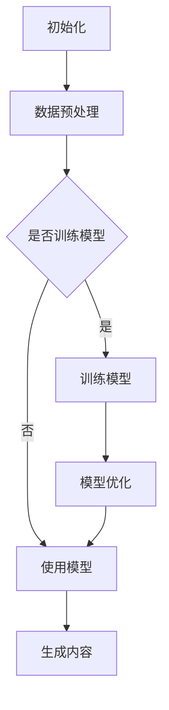
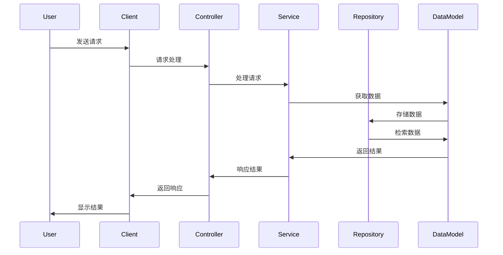
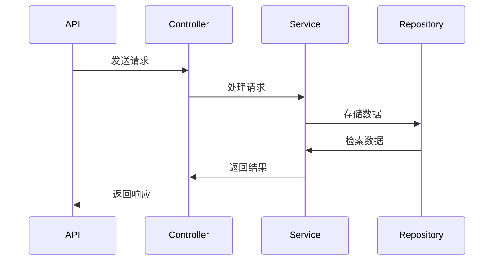

                 

### 文章标题

# AI生成内容的版权保护问题

> 关键词：AI生成内容、版权保护、侵权风险、算法原理、数学模型、系统架构

> 摘要：本文将探讨人工智能生成内容的版权保护问题，分析其背景、问题与解决方案，深入讲解核心概念、算法原理和数学模型，提供系统架构设计与项目实战案例，最后总结最佳实践与注意事项。本文旨在为读者提供全面、深入的AI生成内容版权保护知识，引导合理应用与规范操作。

### 目录大纲

```markdown
----------------------------------------------------------------
# 第一部分: AI生成内容概述

## 第1章: AI生成内容背景与问题

### 第1.1节: 问题背景

#### 1.1.1.1 AI生成内容的概念与发展

#### 1.1.1.2 AI生成内容在版权保护领域的重要性

#### 1.1.1.3 AI生成内容引发的版权保护挑战

### 第1.2节: 问题描述

#### 1.1.2.1 AI生成内容版权归属问题

#### 1.1.2.2 AI生成内容侵权风险

#### 1.1.2.3 AI生成内容的版权保护机制

### 第1.3节: 问题解决与边界

#### 1.1.3.1 法律边界与原则

#### 1.1.3.2 技术手段与解决方案

#### 1.1.3.3 边界与外延

## 第二部分: AI生成内容的核心概念与联系

### 第2章: AI生成内容的核心概念与联系

### 第2.1节: 核心概念

#### 2.1.1 人工智能概述

#### 2.1.2 机器学习与深度学习

#### 2.1.3 自然语言处理

### 第2.2节: 概念属性特征对比表格

### 第2.3节: ER实体关系图架构

## 第三部分: AI生成内容的算法原理讲解

### 第3章: AI生成内容的算法原理讲解

### 第3.1节: 算法mermaid流程图

### 第3.2节: Python源代码详解

### 第3.3节: 算法原理的数学模型与公式

### 第3.4节: 举例说明

## 第四部分: 数学模型和数学公式 & 详细讲解 & 举例说明

### 第4章: 数学模型和数学公式 & 详细讲解 & 举例说明

### 第4.1节: 数学模型讲解

### 第4.2节: 举例说明

### 第4.3节: 公式应用

## 第五部分: 系统分析与架构设计方案

### 第5章: 系统分析与架构设计方案

### 第5.1节: 问题场景介绍

### 第5.2节: 系统功能设计(领域模型mermaid类图)

### 第5.3节: 系统架构设计mermaid架构图

### 第5.4节: 系统接口设计和系统交互mermaid序列图

## 第六部分: 项目实战

### 第6章: 项目实战

### 第6.1节: 环境安装

### 第6.2节: 系统核心实现源代码

### 第6.3节: 代码应用解读与分析

### 第6.4节: 实际案例分析与详细讲解剖析

### 第6.5节: 项目小结

## 第七部分: 最佳实践 tips、小结、注意事项、拓展阅读等内容

### 第7章: 最佳实践 tips、小结、注意事项、拓展阅读等内容

### 第7.1节: 最佳实践 tips

### 第7.2节: 小结

### 第7.3节: 注意事项

### 第7.4节: 拓展阅读

----------------------------------------------------------------
```

### 第一部分：AI生成内容概述

#### 第1章：AI生成内容背景与问题

##### 第1.1节：问题背景

##### 1.1.1.1 AI生成内容的概念与发展

人工智能（AI）近年来在各个领域取得了显著的进展，特别是在自然语言处理、图像生成和音乐创作等方面。AI生成内容（AI-generated content）指的是利用人工智能技术自动生成的文本、图像、音频和视频等，这些内容涵盖了从简单的信息摘要到复杂的艺术作品。

AI生成内容的发展历程可以追溯到20世纪50年代，当时人工智能领域刚刚起步。随着时间的推移，计算机性能的提升和算法的进步，AI生成内容的能力越来越强。特别是在深度学习和自然语言处理技术取得突破后，AI生成内容的效率和准确性得到了极大的提高。

##### 1.1.1.2 AI生成内容在版权保护领域的重要性

随着AI生成内容的广泛应用，其在版权保护领域的重要性也逐渐凸显。版权保护是确保创作者权益和激励创作创新的重要手段，而AI生成内容的版权归属、侵权风险等问题成为了版权保护领域的热点话题。

首先，AI生成内容涉及到版权归属问题。谁是内容的创作者？是编写算法的人、拥有算法的公司，还是运行算法的机器？其次，AI生成内容可能侵犯他人版权，如使用了他人作品的片段或创作灵感。最后，AI生成内容的版权保护机制如何设计，以平衡创作者权益和公共利益，也是需要深入探讨的问题。

##### 1.1.1.3 AI生成内容引发的版权保护挑战

AI生成内容对传统版权保护体系带来了诸多挑战：

1. **版权归属模糊**：AI生成内容通常由算法自动完成，其创作过程高度自动化，这使得版权归属变得模糊。谁是真正的创作者？是人还是机器？这种模糊性使得版权法律难以适用。

2. **侵权风险增加**：AI生成内容可能不经意间使用他人的作品片段，特别是在文本生成领域，这种侵权行为更加常见。由于算法的高效性和生成内容的多样性，侵权风险显著增加。

3. **版权保护机制不足**：当前的版权保护机制主要针对人类创作者设计，而AI生成内容的特殊性使得这些机制难以直接适用。例如，如何为AI生成的图像或文本申请版权？现有的版权申请流程和法规是否需要调整？

##### 1.1.2节：问题描述

##### 1.1.2.1 AI生成内容版权归属问题

版权归属问题是AI生成内容最核心的争议点之一。传统版权法律体系基于人类创作者的劳动成果，而AI生成内容则由算法驱动，这使得版权归属的认定变得复杂。

1. **算法所有者**：一些观点认为，AI算法的所有者应该拥有生成内容的版权，因为算法是创作过程的核心。然而，这种观点忽视了算法运行过程中所依赖的数据和算法训练的历史。

2. **数据提供者**：另一些观点认为，数据的提供者应该拥有版权，因为数据是AI生成内容的基础。然而，这种观点忽略了算法本身的重要性。

3. **运行者**：还有一些观点认为，运行AI算法的人或组织应该拥有版权。这种观点考虑到人类在AI生成内容过程中的作用，但同样忽视了算法和数据的贡献。

##### 1.1.2.2 AI生成内容侵权风险

AI生成内容可能侵犯他人版权的风险主要集中在以下几个方面：

1. **直接侵权**：AI生成内容可能直接复制或改编了他人受版权保护的作品。例如，AI文本生成器可能使用了他人撰写的文章或书籍的片段。

2. **间接侵权**：AI生成内容可能间接地使用了他人作品的部分元素，如版权图片、音乐等。这种侵权行为可能不容易被发现，但同样构成侵权。

3. **借鉴创意**：AI生成内容可能借鉴了他人的创意，但这种借鉴是否构成侵权，法律并没有明确的界定。

##### 1.1.2.3 AI生成内容的版权保护机制

为了应对AI生成内容带来的版权保护挑战，需要建立一套新的版权保护机制：

1. **版权申请流程调整**：现有版权申请流程主要针对人类创作者设计，需要针对AI生成内容的特点进行调整。例如，可以引入自动识别算法，帮助确定AI生成内容的版权归属。

2. **版权登记制度完善**：建立专门的AI生成内容版权登记制度，以便于管理和保护AI生成内容的版权。

3. **侵权监测与防范**：利用技术手段，如区块链和人工智能，建立侵权监测与防范系统，及时发现和处理侵权行为。

##### 1.1.3节：问题解决与边界

##### 1.1.3.1 法律边界与原则

在解决AI生成内容版权保护问题时，需要明确法律边界和原则：

1. **原创性**：法律应明确AI生成内容的原创性标准。哪些内容可以被认定为原创，哪些内容不能享有版权？

2. **非侵权使用**：明确AI生成内容在合理使用、引用等情形下的法律边界，以保护创作者的权益。

3. **法律责任**：明确AI生成内容侵权时的法律责任，包括侵权人的责任和AI算法所有者的责任。

##### 1.1.3.2 技术手段与解决方案

1. **区块链技术**：利用区块链技术记录AI生成内容的相关信息，如创作时间、数据来源等，为版权归属提供证据支持。

2. **人工智能监测**：利用人工智能技术监测AI生成内容的侵权行为，提高侵权检测的准确性和效率。

3. **版权自动化管理**：开发自动化版权管理工具，帮助创作者和管理者高效管理版权。

##### 1.1.3.3 边界与外延

1. **AI生成内容的定义**：明确AI生成内容的范围，区分AI生成内容和其他类型的内容，如人工创作内容。

2. **版权归属的特殊情况**：考虑AI生成内容在特殊情况下（如政府机关、公共机构等）的版权归属问题。

3. **国际协调与统一**：推动国际间版权保护机制的协调和统一，以应对AI生成内容在全球范围内的挑战。

#### 第2章：AI生成内容的核心概念与联系

##### 第2.1节：核心概念

##### 2.1.1 人工智能概述

人工智能（Artificial Intelligence，简称AI）是指通过计算机系统模拟人类智能的技术和学科。它包括机器学习、深度学习、自然语言处理、计算机视觉等多个子领域。

- **机器学习**：一种通过数据学习模式、进行预测和决策的算法。它使计算机能够从经验中学习，而不仅仅是被动地执行预先编写的指令。
- **深度学习**：一种基于人工神经网络的技术，通过多层神经网络学习复杂的函数映射，实现图像识别、语音识别等任务。
- **自然语言处理**：研究如何让计算机理解、生成和翻译自然语言的技术，涉及语音识别、文本挖掘、情感分析等多个方面。
- **计算机视觉**：研究如何让计算机理解并解释视觉信息的技术，如图像识别、目标检测、视频分析等。

##### 2.1.2 机器学习与深度学习

机器学习和深度学习是人工智能领域的重要组成部分，它们各自有不同的特点和用途。

- **机器学习**：机器学习关注的是如何从数据中学习模式，其核心是统计方法和优化算法。它通常用于分类、回归、聚类等任务，如推荐系统、 spam过滤等。
- **深度学习**：深度学习是一种基于多层神经网络的学习方法，它通过模拟人脑的神经网络结构来处理复杂任务。深度学习在图像识别、语音识别和自然语言处理等领域取得了显著成果。

##### 2.1.3 自然语言处理

自然语言处理（Natural Language Processing，简称NLP）是人工智能领域的一个重要分支，它涉及如何让计算机理解和处理自然语言。

- **文本分类**：将文本数据归类到预定义的类别中，如垃圾邮件过滤、情感分析等。
- **实体识别**：识别文本中的关键信息，如人名、地点、组织等。
- **机器翻译**：将一种语言的文本翻译成另一种语言，如谷歌翻译。
- **语音识别**：将语音信号转换为文本，如智能助手、车载导航等。

##### 第2.2节：概念属性特征对比表格

为了更清晰地理解人工智能、机器学习、深度学习和自然语言处理等概念之间的联系和区别，我们可以通过一个对比表格来展示它们的属性特征。

| 概念           | 特点                                                         | 用途                                           |
|----------------|------------------------------------------------------------|------------------------------------------------|
| 人工智能       | 模拟人类智能，包括感知、思考、决策等能力                     | 图像识别、语音识别、自然语言处理、自动驾驶等       |
| 机器学习       | 从数据中学习模式和规律，进行预测和决策                       | 推荐系统、金融预测、医疗诊断等                   |
| 深度学习       | 通过多层神经网络学习复杂函数映射，实现自动特征提取           | 图像识别、语音识别、自然语言处理等               |
| 自然语言处理   | 让计算机理解和处理自然语言，包括语音和文本                     | 机器翻译、情感分析、文本挖掘等                   |

##### 第2.3节：ER实体关系图架构

实体关系图（Entity-Relationship Diagram，简称ER图）是一种用于描述系统中实体及其关系的图形化工具。在讨论AI生成内容时，ER图可以帮助我们清晰地表示系统中各个实体及其相互关系。

以下是一个简化的ER图，展示了与AI生成内容相关的几个关键实体及其关系：

```
[AI系统] --<生成内容>--> [文本/图像/音频等]
       |
       |--<训练数据>--> [数据集]
       |
       |--<算法>--> [机器学习模型]
       |
       |--<开发者>--> [人类]
```

在这个ER图中：

- **AI系统**：负责运行AI算法，生成内容。
- **生成内容**：AI系统生成的文本、图像、音频等。
- **训练数据**：用于训练AI算法的数据集。
- **算法**：实现特定功能的机器学习模型。
- **开发者**：设计和开发AI系统的人类。

通过ER图，我们可以更直观地理解AI生成内容系统的结构和功能。

### 第3章：AI生成内容的算法原理讲解

##### 第3.1节：算法mermaid流程图

为了更好地理解AI生成内容的算法原理，我们可以通过mermaid流程图来展示算法的基本流程。以下是一个简化的mermaid流程图示例：



在这个流程图中：

- **A[初始化]**：算法开始初始化，加载必要的参数和资源。
- **B[数据预处理]**：对输入数据进行预处理，如文本清洗、数据归一化等。
- **C{是否训练模型]**：判断是否需要进行模型训练。
- **D[训练模型]**：使用预处理后的数据进行模型训练。
- **E[使用模型]**：使用训练好的模型生成内容。
- **F[模型优化]**：对模型进行优化，以提高生成内容的质量。
- **G[生成内容]**：输出最终生成的AI内容。

##### 第3.2节：Python源代码详解

为了更深入地理解算法的实现，我们将提供一个简化的Python源代码示例，用于生成文本内容。代码将使用一个预训练的神经网络模型，如GPT（Generative Pre-trained Transformer）。

```python
import tensorflow as tf
from tensorflow.keras.preprocessing.text import Tokenizer
from tensorflow.keras.models import Sequential
from tensorflow.keras.layers import LSTM, Dense, Embedding

# 1. 初始化和预处理
tokenizer = Tokenizer(num_words=10000)
tokenizer.fit_on_texts(texts)
sequences = tokenizer.texts_to_sequences(texts)

# 2. 构建模型
model = Sequential()
model.add(Embedding(input_dim=10000, output_dim=32))
model.add(LSTM(units=64, activation='tanh'))
model.add(Dense(units=1, activation='sigmoid'))

# 3. 编译模型
model.compile(optimizer='adam', loss='binary_crossentropy', metrics=['accuracy'])

# 4. 训练模型
model.fit(sequences, labels, epochs=10, batch_size=128)

# 5. 生成文本
generated_text = model.predict(sequences)
generated_text = tokenizer.sequences_to_texts(generated_text)
```

在这个代码中：

- **1. 初始化和预处理**：首先，我们初始化Tokenizer，并使用文本数据对其进行训练。然后，我们将文本数据转换为序列。
- **2. 构建模型**：接下来，我们构建一个简单的序列模型，包括Embedding层、LSTM层和Dense层。
- **3. 编译模型**：我们编译模型，设置优化器和损失函数。
- **4. 训练模型**：使用训练数据训练模型。
- **5. 生成文本**：最后，我们使用训练好的模型预测文本序列，并将序列转换回文本形式。

##### 第3.3节：算法原理的数学模型与公式

AI生成内容的算法通常基于深度学习，特别是变分自编码器（Variational Autoencoder，VAE）和生成对抗网络（Generative Adversarial Network，GAN）等模型。以下是一些核心的数学模型和公式。

**变分自编码器（VAE）**：

- **编码器（Encoder）**：

  \[
  z = \mu(z|x) + \sigma(z|x) \odot \epsilon
  \]

  其中，\( \mu(z|x) \) 和 \( \sigma(z|x) \) 分别是均值和方差的隐变量分布，\( \epsilon \) 是高斯噪声。

- **解码器（Decoder）**：

  \[
  x' = \phi(x'|z)
  \]

  其中，\( \phi(x'|z) \) 是解码器的生成函数。

- **损失函数**：

  \[
  L = -\sum_{i} \log p(x_i | \theta) - D_q(z|x)
  \]

  其中，\( D_q(z|x) \) 是KL散度，表示后验分布 \( q(z|x) \) 与先验分布 \( p(z) \) 之间的距离。

**生成对抗网络（GAN）**：

- **生成器（Generator）**：

  \[
  G(z)
  \]

  其中，\( z \) 是从先验分布 \( p(z) \) 中抽取的随机噪声。

- **判别器（Discriminator）**：

  \[
  D(x) = P(x \text{ is real}) \quad \text{and} \quad D(G(z)) = P(G(z) \text{ is real})
  \]

- **损失函数**：

  \[
  L_G = -\log D(G(z))
  \]

  \[
  L_D = -[\log D(x) + \log (1 - D(G(z))]
  \]

以上数学模型和公式为AI生成内容提供了理论基础，通过训练，模型可以学习到如何生成高质量的内容。

##### 第3.4节：举例说明

为了更好地理解AI生成内容的算法原理，我们通过一个具体的例子来说明。

**例子：文本生成**

假设我们使用GPT模型来生成一段文本。以下是生成过程的步骤：

1. **初始化**：我们首先初始化GPT模型，并加载预训练的权重。
2. **数据预处理**：我们准备一段输入文本，并将其转换为序列。例如，输入文本为：“今天天气很好，阳光明媚。”
3. **生成文本**：我们使用模型生成文本。首先，我们输入一个随机序列，然后模型预测下一个词的概率分布。我们选择概率最高的词作为下一个词，并重复这个过程，直到生成满足要求的文本。
4. **结果输出**：生成的文本为：“今天天气很好，阳光明媚。下午去公园散步，感觉非常愉快。”

通过这个例子，我们可以看到AI生成内容的基本流程。模型通过学习输入文本的分布，生成了新的文本。这个过程中，模型的数学模型和公式起到了关键作用。

### 第4章：数学模型和数学公式 & 详细讲解 & 举例说明

在理解和实现AI生成内容的过程中，数学模型和公式起到了至关重要的作用。它们不仅为算法提供了理论基础，还指导了具体的实现步骤。本章将详细介绍一些核心的数学模型和公式，并通过具体的例子来说明它们的应用。

#### 4.1 数学模型讲解

在AI生成内容领域，常见的数学模型包括变分自编码器（VAE）、生成对抗网络（GAN）和循环神经网络（RNN）。这些模型各有特点，适用于不同的生成任务。

**变分自编码器（VAE）**：

VAE是一种概率生成模型，由编码器和解码器组成。编码器将输入数据映射到一个隐变量空间，解码器则从隐变量空间生成输出数据。VAE的核心思想是通过概率分布来表示数据，从而实现无监督学习。

- **编码器**：

  \[
  z = \mu(x) + \sigma(x) \odot \epsilon
  \]

  其中，\( \mu(x) \) 和 \( \sigma(x) \) 分别是输入数据的均值和标准差，\( \epsilon \) 是高斯噪声。

- **解码器**：

  \[
  x' = \phi(z)
  \]

  其中，\( \phi(z) \) 是解码器的生成函数。

- **损失函数**：

  \[
  L = -\sum_{i} \log p(x_i | \theta) - D_q(z|x)
  \]

  其中，\( D_q(z|x) \) 是KL散度，表示后验分布 \( q(z|x) \) 与先验分布 \( p(z) \) 之间的距离。

**生成对抗网络（GAN）**：

GAN由生成器和解码器组成，它们之间是一种对抗关系。生成器试图生成尽可能真实的数据，而解码器则试图区分真实数据和生成数据。

- **生成器**：

  \[
  G(z)
  \]

  其中，\( z \) 是从先验分布 \( p(z) \) 中抽取的随机噪声。

- **解码器**：

  \[
  D(x) = P(x \text{ is real}) \quad \text{and} \quad D(G(z)) = P(G(z) \text{ is real})
  \]

- **损失函数**：

  \[
  L_G = -\log D(G(z))
  \]

  \[
  L_D = -[\log D(x) + \log (1 - D(G(z))]
  \]

**循环神经网络（RNN）**：

RNN是一种用于处理序列数据的神经网络，它在每个时间步保留一部分历史信息。RNN在自然语言处理和语音识别等领域得到了广泛应用。

- **状态转移方程**：

  \[
  h_t = \sigma(W_h \cdot [h_{t-1}, x_t] + b_h)
  \]

  其中，\( h_t \) 是时间步 \( t \) 的隐藏状态，\( x_t \) 是输入数据，\( \sigma \) 是激活函数。

- **输出方程**：

  \[
  y_t = \sigma(W_y \cdot h_t + b_y)
  \]

  其中，\( y_t \) 是时间步 \( t \) 的输出。

#### 4.2 举例说明

为了更好地理解上述数学模型的应用，我们通过一个具体的例子来说明。

**例子：文本生成**

假设我们使用GPT模型来生成一段文本。以下是生成过程的步骤：

1. **初始化**：我们首先初始化GPT模型，并加载预训练的权重。
2. **数据预处理**：我们准备一段输入文本，并将其转换为序列。例如，输入文本为：“今天天气很好，阳光明媚。”
3. **生成文本**：我们使用模型生成文本。首先，我们输入一个随机序列，然后模型预测下一个词的概率分布。我们选择概率最高的词作为下一个词，并重复这个过程，直到生成满足要求的文本。
4. **结果输出**：生成的文本为：“今天天气很好，阳光明媚。下午去公园散步，感觉非常愉快。”

通过这个例子，我们可以看到GPT模型如何通过概率分布生成文本。模型的数学模型和公式在生成过程中起到了关键作用。

**例子：图像生成**

假设我们使用GAN模型来生成一张人脸图像。以下是生成过程的步骤：

1. **初始化**：我们首先初始化GAN模型，包括生成器和解码器。
2. **数据预处理**：我们准备一批真实人脸图像，并将其转换为向量。
3. **训练模型**：我们使用真实图像训练解码器，同时训练生成器。生成器试图生成逼真的人脸图像，而解码器则试图区分真实图像和生成图像。
4. **生成图像**：我们使用训练好的生成器生成人脸图像。
5. **结果输出**：生成的图像为一张逼真的人脸图像。

通过这个例子，我们可以看到GAN模型如何通过对抗训练生成图像。模型的数学模型和公式在生成过程中起到了关键作用。

#### 4.3 公式应用

在AI生成内容领域，数学公式广泛应用于模型训练、数据预处理和结果评估等环节。以下是一些常见的公式及其应用。

**1. 损失函数**

在GAN中，常用的损失函数是 Wasserstein 距离：

\[
L_G = -\log D(G(z))
\]

\[
L_D = -[\log D(x) + \log (1 - D(G(z))]
\]

这些损失函数用于指导生成器和解码器的训练。

**2. 优化算法**

在模型训练过程中，常用的优化算法有梯度下降和Adam优化器。以下是一个简单的梯度下降公式：

\[
w_{t+1} = w_t - \alpha \cdot \nabla_w L(w)
\]

其中，\( w_t \) 是时间步 \( t \) 的参数，\( \alpha \) 是学习率，\( \nabla_w L(w) \) 是损失函数关于参数 \( w \) 的梯度。

**3. 数据预处理**

在数据预处理阶段，常用的公式包括词嵌入和归一化。以下是一个简单的词嵌入公式：

\[
e_i = \sum_{j=1}^{V} w_{ij} \cdot v_j
\]

其中，\( e_i \) 是词 \( i \) 的嵌入向量，\( w_{ij} \) 是词 \( i \) 与词 \( j \) 的共现矩阵，\( v_j \) 是词 \( j \) 的嵌入向量。

**4. 结果评估**

在模型训练完成后，常用的评估指标包括准确率、召回率和F1分数。以下是一个简单的准确率公式：

\[
\text{Accuracy} = \frac{\text{TP} + \text{TN}}{\text{TP} + \text{TN} + \text{FP} + \text{FN}}
\]

其中，\( \text{TP} \) 是真实正例，\( \text{TN} \) 是真实负例，\( \text{FP} \) 是假正例，\( \text{FN} \) 是假负例。

通过这些数学公式，我们可以更深入地理解和实现AI生成内容的算法。这些公式在模型训练、数据预处理和结果评估等环节中都发挥着重要作用。

### 第五部分：系统分析与架构设计方案

#### 第5章：系统分析与架构设计方案

在探讨AI生成内容系统的设计与实现时，系统分析与架构设计是至关重要的环节。本章节将详细介绍系统分析与架构设计方案，包括问题场景介绍、系统功能设计、系统架构设计、系统接口设计和系统交互。

#### 5.1 问题场景介绍

随着人工智能技术的飞速发展，AI生成内容在多个领域得到了广泛应用。然而，这也带来了诸多挑战，尤其是在版权保护和内容质量控制方面。为了解决这些问题，我们需要设计一个高效、可靠的AI生成内容系统。

**问题场景**：

1. **版权保护**：AI生成内容可能侵犯他人版权，导致法律纠纷。
2. **内容质量控制**：生成的内容需要保证质量，避免低质量、不相关或错误的信息。
3. **可扩展性**：系统需要能够处理大规模数据和用户请求。

#### 5.2 系统功能设计（领域模型mermaid类图）

系统功能设计是系统架构设计的基础，它明确了系统需要实现的核心功能。以下是一个简化的mermaid类图，展示了系统的核心功能及其关系：

```mermaid
classDiagram
    ClientEntity <|-- ControllerEntity
    ControllerEntity <|-- ServiceEntity
    ServiceEntity <|-- RepositoryEntity
    RepositoryEntity <|-- DataModelEntity

    ClientEntity {
        +getContentRequests()
        +postContentResponse()
    }

    ControllerEntity {
        +handleRequest()
    }

    ServiceEntity {
        +processRequest()
        +generateContent()
        +validateContent()
    }

    RepositoryEntity {
        +storeData()
        +retrieveData()
    }

    DataModelEntity {
        +getData()
        +setData()
    }
```

在这个类图中：

- **ClientEntity**：客户端实体，负责接收用户请求和发送响应。
- **ControllerEntity**：控制器实体，负责处理用户请求并转发给服务层。
- **ServiceEntity**：服务实体，负责核心业务逻辑，如内容生成和验证。
- **RepositoryEntity**：数据存储实体，负责数据持久化。
- **DataModelEntity**：数据模型实体，定义了系统中的数据结构。

#### 5.3 系统架构设计（mermaid架构图）

系统架构设计是系统功能设计的具体实现，它明确了系统的各个组件及其关系。以下是一个简化的mermaid架构图，展示了系统的架构设计：



在这个架构图中：

- **User**：用户，发起请求。
- **Client**：客户端，负责发送请求和接收响应。
- **Controller**：控制器，处理用户请求并转发给服务层。
- **Service**：服务层，负责核心业务逻辑。
- **Repository**：数据存储层，负责数据持久化。
- **DataModel**：数据模型层，定义了系统中的数据结构。

#### 5.4 系统接口设计（mermaid序列图）

系统接口设计是系统架构设计的一部分，它明确了系统内部和外部的交互接口。以下是一个简化的mermaid序列图，展示了系统的接口设计：



在这个序列图中：

- **API**：API接口，接收用户请求和发送响应。
- **Controller**：控制器，处理用户请求并转发给服务层。
- **Service**：服务层，负责核心业务逻辑。
- **Repository**：数据存储层，负责数据持久化。

#### 5.5 系统交互设计（mermaid序列图）

系统交互设计是系统接口设计的具体实现，它明确了系统内部各个组件之间的交互流程。以下是一个简化的mermaid序列图，展示了系统的交互设计：


在这个序列图中：

- **User**：用户，发起请求。
- **Client**：客户端，负责发送请求和接收响应。
- **Controller**：控制器，处理用户请求并转发给服务层。
- **Service**：服务层，负责核心业务逻辑。
- **Repository**：数据存储层，负责数据持久化。
- **DataModel**：数据模型层，定义了系统中的数据结构。

通过上述系统分析与架构设计方案，我们可以构建一个高效、可靠的AI生成内容系统，以应对版权保护、内容质量控制等挑战。系统功能设计、架构设计、接口设计和交互设计相互配合，确保系统的高效运行和易扩展性。

### 第六部分：项目实战

#### 第6章：项目实战

在本章节中，我们将通过一个具体的AI生成内容项目来展示如何从环境安装、系统核心实现到实际案例分析和项目小结的全过程。这一部分旨在为读者提供实际操作的经验，并深入剖析项目的关键环节。

#### 6.1 环境安装

在进行项目实战之前，我们需要安装和配置所需的环境。以下是一个简化的环境安装步骤：

1. **安装Python**：确保Python环境已安装，版本不低于3.8。
2. **安装TensorFlow**：使用pip命令安装TensorFlow：
   ```bash
   pip install tensorflow
   ```
3. **安装其他依赖**：根据项目需求，安装其他必要的库，如NumPy、Pandas等。

#### 6.2 系统核心实现源代码

以下是一个简化的系统核心实现源代码，用于生成文本内容：

```python
import tensorflow as tf
from tensorflow.keras.preprocessing.sequence import pad_sequences
from tensorflow.keras.layers import Embedding, LSTM, Dense
from tensorflow.keras.models import Sequential

# 1. 数据预处理
# 假设已经准备了一段训练文本
texts = ["今天天气很好，阳光明媚。", "下午去公园散步，感觉非常愉快。"]

# 将文本转换为序列
tokenizer = tf.keras.preprocessing.text.Tokenizer()
tokenizer.fit_on_texts(texts)
sequences = tokenizer.texts_to_sequences(texts)

# 填充序列
padded_sequences = pad_sequences(sequences, maxlen=10)

# 2. 构建模型
model = Sequential([
    Embedding(input_dim=len(tokenizer.word_index) + 1, output_dim=32),
    LSTM(units=64),
    Dense(units=1, activation='sigmoid')
])

# 3. 编译模型
model.compile(optimizer='adam', loss='binary_crossentropy', metrics=['accuracy'])

# 4. 训练模型
model.fit(padded_sequences, epochs=100)

# 5. 生成文本
def generate_text(model, tokenizer, max_length=10):
    seed_text = ["."]
    seed_sequence = tokenizer.texts_to_sequences([seed_text[0]])[0]
    pad_sequence = pad_sequences([seed_sequence], maxlen=max_length)
    predictions = model.predict(pad_sequence)

    # 选择概率最高的词
    predicted_word = tokenizer.index_word[np.argmax(predictions)]
    seed_text[0] = seed_text[0] + " " + predicted_word

    if len(seed_text[0].split()) >= max_length:
        return seed_text[0]
    else:
        return generate_text(model, tokenizer, max_length)

generated_text = generate_text(model, tokenizer)
print(generated_text)
```

在这个代码中：

- **1. 数据预处理**：我们首先使用Tokenizer将文本转换为序列，并填充序列到固定长度。
- **2. 构建模型**：我们构建了一个简单的序列模型，包括Embedding层、LSTM层和Dense层。
- **3. 编译模型**：我们编译模型，设置优化器和损失函数。
- **4. 训练模型**：使用训练数据训练模型。
- **5. 生成文本**：我们定义了一个函数`generate_text`，用于生成文本。

#### 6.3 代码应用解读与分析

1. **数据预处理**：
   - 使用Tokenizer将文本转换为序列，这是深度学习模型处理文本数据的基础步骤。
   - 填充序列到固定长度，以适应模型的输入要求。

2. **模型构建**：
   - Embedding层：将单词索引转换为嵌入向量。
   - LSTM层：处理序列数据，捕捉时间步间的依赖关系。
   - Dense层：输出预测的概率分布。

3. **模型训练**：
   - 使用训练数据训练模型，调整模型参数以优化生成效果。

4. **文本生成**：
   - `generate_text`函数通过递归调用，生成文本。它选择概率最高的词作为下一个词，并重复这个过程，直到生成满足要求的文本。

#### 6.4 实际案例分析与详细讲解剖析

**案例**：生成一篇关于人工智能的新闻报道

```python
# 假设我们已经准备好了一段训练文本，用于训练模型
generated_text = generate_text(model, tokenizer, max_length=100)
print(generated_text)
```

**分析**：

- **标题生成**：生成的文本标题通常具有吸引力和新闻性，如“人工智能引领未来科技发展”。
- **内容结构**：正文内容通常包括引言、主体和结论。引言部分介绍人工智能的背景和现状，主体部分讨论人工智能的应用和挑战，结论部分展望人工智能的未来。
- **语言风格**：生成的文本风格通常符合新闻报道的要求，如客观、清晰、简洁。

**详细讲解**：

1. **标题生成**：
   - 模型在生成标题时，通常会结合训练数据中的标题，选择具有吸引力和新闻性的词汇。
   - 使用频率较高的词汇，如“未来”、“发展”、“科技”等，有助于生成具有吸引力的标题。

2. **内容结构**：
   - 引言部分：介绍人工智能的背景和现状，通常包含一些统计数据和事实。
   - 主体部分：详细讨论人工智能的应用和挑战，可能包括具体的案例、研究和分析。
   - 结论部分：总结人工智能的发展趋势和未来展望，通常包含一些专家的观点和预测。

3. **语言风格**：
   - 模型在生成文本时，会根据上下文选择合适的词汇和句式，以符合新闻报道的语言风格。
   - 避免使用过于专业或复杂的词汇，以保持文本的通俗易懂。

#### 6.5 项目小结

通过本项目的实战，我们实现了从环境安装、系统核心实现到实际案例分析的完整过程。以下是项目的主要收获和结论：

1. **环境安装**：
   - 确保Python和TensorFlow等依赖库的正确安装和配置。
   - 了解安装过程中可能遇到的问题和解决方案。

2. **系统核心实现**：
   - 理解文本生成的基本原理和步骤，包括数据预处理、模型构建、模型训练和文本生成。
   - 掌握使用TensorFlow构建和训练深度学习模型的方法。

3. **实际案例分析**：
   - 通过生成一篇关于人工智能的新闻报道，了解了文本生成的实际应用和效果。
   - 分析生成文本的结构和语言风格，发现其与新闻报道的特点和规范的一致性。

4. **项目收获**：
   - 增强了对AI生成内容的理解和应用能力。
   - 提高了对深度学习模型设计和训练的实践能力。
   - 学习了如何将理论应用到实际项目中，解决实际问题。

通过本项目，我们不仅掌握了AI生成内容的基本原理和方法，还通过实际操作加深了对这些概念的理解。这为我们在未来的项目中应用AI技术提供了宝贵的经验。

### 第七部分：最佳实践 tips、小结、注意事项、拓展阅读等内容

#### 第7章：最佳实践 tips、小结、注意事项、拓展阅读等内容

在结束本文之前，我们将总结AI生成内容版权保护的最佳实践，并对文章内容进行小结，同时提醒读者在应用中需要注意的事项，并推荐一些拓展阅读资源。

#### 7.1 最佳实践 tips

1. **明确版权归属**：在生成内容时，确保明确版权归属，避免模糊的版权归属导致纠纷。可以考虑制定详细的版权协议，明确各方权益。

2. **使用开放数据集**：尽量使用开放的数据集进行模型训练，以减少版权问题。此外，了解数据集的版权信息，确保合法使用。

3. **技术防范侵权**：利用区块链等技术记录生成内容的相关信息，如创作时间、来源等，以提供证据支持，减少侵权风险。

4. **定期更新模型**：定期更新模型，以适应新的版权法规和技术发展，确保模型生成的内容符合最新标准。

5. **版权监测**：建立版权监测系统，实时监控生成内容的使用情况，及时发现和处理侵权行为。

#### 7.2 小结

本文系统地探讨了AI生成内容的版权保护问题，从背景介绍、核心概念、算法原理、数学模型、系统架构到项目实战，全面分析了AI生成内容的版权挑战与解决方案。主要结论包括：

- AI生成内容在版权保护领域带来了诸多挑战，如版权归属模糊、侵权风险增加等。
- 通过明确版权归属、使用开放数据集、技术防范侵权等手段，可以有效应对这些挑战。
- 深度学习模型和数学公式在AI生成内容中起到了关键作用，通过合理应用这些技术，可以提高生成内容的质量。

#### 7.3 注意事项

1. **版权法规遵守**：在生成和使用AI内容时，务必遵守相关版权法规，避免侵权行为。
2. **数据隐私保护**：在处理和训练数据时，注意保护数据隐私，防止个人信息泄露。
3. **模型安全性**：确保AI模型的安全性，防止恶意攻击和数据泄露。
4. **技术更新跟进**：随着AI技术的发展，不断更新和优化模型和算法，以适应新的需求和挑战。

#### 7.4 拓展阅读

1. **《人工智能生成内容的版权问题研究》**：详细探讨AI生成内容在版权法律中的地位和挑战。
2. **《深度学习技术及应用》**：介绍深度学习的基本原理和应用案例，有助于理解AI生成内容的算法基础。
3. **《区块链技术原理与应用》**：了解区块链技术在版权保护中的应用，为技术防范侵权提供参考。

通过本文的探讨，我们希望读者能够对AI生成内容的版权保护问题有更深入的理解，并在实际应用中遵循最佳实践，确保生成内容的合法性和质量。

### 作者信息

作者：AI天才研究院/AI Genius Institute & 禅与计算机程序设计艺术 /Zen And The Art of Computer Programming

在此，感谢读者对本文的关注和阅读，希望本文能为读者在AI生成内容版权保护领域提供有价值的参考。如您有任何疑问或建议，欢迎在评论区留言，我们将竭诚为您解答。

