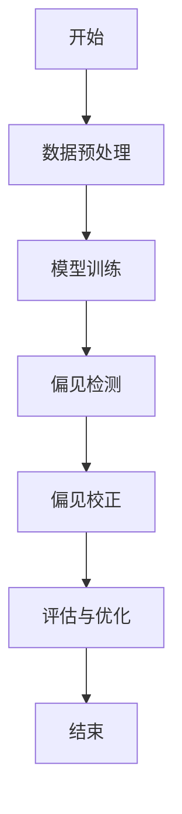
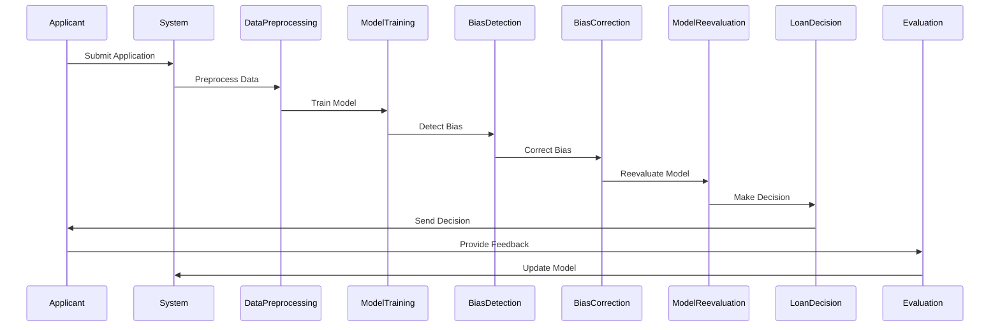
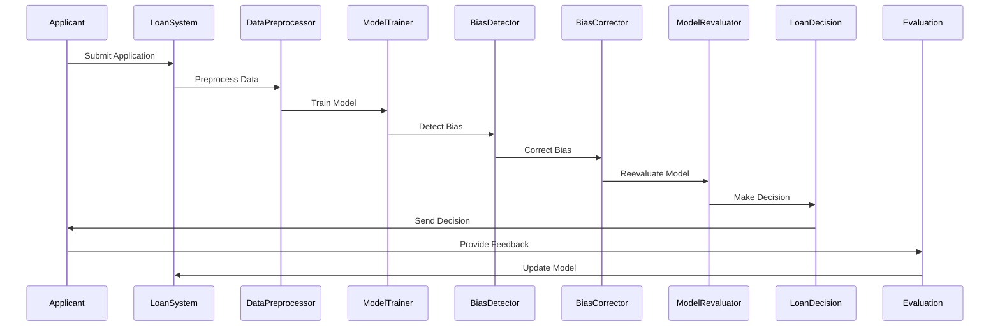

                 

### 《AI系统的公平性和偏见消除策略》

#### 关键词：人工智能，公平性，偏见，消除策略，系统设计

> 摘要：本文旨在探讨人工智能系统中的公平性和偏见问题，分析其定义、影响以及解决策略。通过深入剖析AI偏见的表现形式、研究现状，提出核心概念与原理，并详细讲解算法原理和数学模型。此外，本文还将介绍系统分析与架构设计方法，以及通过实际案例解析，提供最佳实践与拓展。

-------------------------------------------------------------------

## 第一部分：引言与背景

### 1. 引言

**1.1 问题的背景与重要性**

随着人工智能技术的快速发展，AI系统已经在医疗、金融、教育等多个领域得到广泛应用。然而，AI系统中的公平性和偏见问题逐渐引起社会各界的关注。这些问题不仅影响个人权益，更可能加剧社会不平等，损害公共利益。

**1.2 偏见与不公平性的定义与影响**

偏见通常指对某一群体持有的不公正的成见。在AI系统中，偏见表现为模型对某些群体产生的歧视性结果。不公平性则是指AI系统在决策过程中未能平等对待所有用户。

偏见与不公平性的影响广泛，包括个人层面的信任问题、社会层面的信任危机，以及经济层面的资源分配不公。因此，解决AI系统的公平性和偏见问题具有重要的现实意义。

**1.3 本书的目的与结构**

本书旨在系统地探讨AI系统的公平性和偏见问题，提供理论框架和实践指导。全书分为六个部分，分别从背景介绍、核心概念与原理、算法原理与模型设计、系统分析与架构设计、项目实战、最佳实践与拓展等多个角度进行分析。

---

### 2. 偏见与不公平性在AI系统中的表现

**2.1 AI偏见的基本概念**

AI偏见源于多个方面，包括数据偏见、算法偏见和人为偏见。数据偏见通常是由于训练数据不均衡导致的，而算法偏见则是由模型设计本身引起的。人为偏见则可能来自系统开发者或决策者的价值观。

**2.2 偏见的表现形式**

偏见在AI系统中表现为多种形式，如性别歧视、种族偏见、年龄歧视等。这些偏见可能导致系统对某些群体产生不利影响，影响其公平性和可信度。

**2.3 偏见的影响与后果**

偏见不仅损害个体权益，还可能引发社会不满和信任危机。长期来看，偏见可能导致资源分配不公，加剧社会不平等。

---

### 3. AI偏见的研究现状

**3.1 研究历史与趋势**

AI偏见问题最早可以追溯到20世纪90年代。近年来，随着AI技术的普及和数据的积累，偏见研究逐渐成为人工智能领域的重要研究方向。

**3.2 当前主要的偏见消除方法**

当前主要的偏见消除方法包括数据清洗、模型校准和模型再训练。这些方法各有优缺点，需要根据具体场景进行选择。

**3.3 偏见消除技术的挑战**

偏见消除面临技术挑战，如如何平衡公平性与准确性、如何处理数据隐私等问题。此外，偏见消除还面临道德和社会挑战，如如何确保消除偏见的同时不损害其他群体的利益。

---

## 第二部分：核心概念与原理

### 4. AI系统的公平性

**4.1 公平性的定义与标准**

公平性是指AI系统在决策过程中对所有人一视同仁，不因个人特征产生歧视性结果。公平性的标准包括一致性、无歧视和可解释性。

**4.2 公平性原则的理论基础**

公平性原则的理论基础包括正义理论、平等主义理论和能力主义理论。这些理论为AI系统的公平性设计提供了不同的视角。

**4.3 公平性原则的应用案例**

公平性原则在医疗诊断、招聘系统、信用评分等领域有广泛应用。通过设计公平的算法和评估指标，可以提高系统的公平性和可信度。

---

### 5. 偏见消除策略

**5.1 偏见消除策略的类型**

偏见消除策略包括数据预处理、算法改进和监督机制。数据预处理包括数据清洗、数据增强和平衡技术。算法改进包括模型校准和再训练。监督机制包括反馈机制和伦理审查。

**5.2 偏见检测方法**

偏见检测方法包括统计方法、机器学习方法和社会学方法。这些方法可以检测出系统中的偏见，为消除偏见提供依据。

**5.3 偏见校正方法**

偏见校正方法包括补偿算法、纠正算法和平衡算法。这些方法可以调整模型参数，减少偏见对系统的影响。

---

### 6. 核心概念与联系

**6.1 核心概念总结**

核心概念包括偏见、公平性、偏见检测和偏见校正。这些概念相互关联，共同构成了AI系统公平性的理论框架。

**6.2 概念属性特征对比表格**

| 概念 | 定义 | 特征 |  
| ---- | ---- | ---- |  
| 偏见 | 对特定群体的不公平待遇 | 成见、歧视、偏见 |  
| 公平性 | 对所有人一视同仁 | 一致性、无歧视、可解释性 |  
| 偏见检测 | 检测系统中的偏见 | 统计方法、机器学习方法、社会学方法 |  
| 偏见校正 | 减少系统偏见 | 补偿算法、纠正算法、平衡算法 |

**6.3 ER实体关系图架构**

```mermaid
erDiagram
  AI偏见 ||--o> 偏见检测 : 进行检测
  AI偏见 ||--o> 偏见校正 : 进行校正
  偏见检测 ||--o> 公平性评估 : 评估结果
  偏见校正 ||--o> 公平性提升 : 提升效果
```

---

## 第三部分：算法原理与模型设计

### 7. 算法原理讲解

**7.1 算法mermaid流程图**



**7.2 Python源代码实现**

```python
# 数据预处理
data_preprocessing = preprocess_data(raw_data)

# 模型训练
model = train_model(data_preprocessing)

# 偏见检测
biases_detected = detect_biases(model)

# 偏见校正
corrected_model = correct_biases(model, biases_detected)

# 评估与优化
evaluate_model(corrected_model)
```

**7.3 数学模型和公式**

偏见检测的数学模型可以表示为：

$$
偏见检测 = \frac{实际结果 - 预测结果}{预测结果}
$$

偏见校正的数学模型可以表示为：

$$
校正后的预测结果 = 预测结果 - 偏见权重 \times 偏见检测值
$$

**7.4 详细讲解与举例说明**

假设一个招聘系统存在性别偏见，女性求职者的面试通过率低于男性。通过偏见检测算法，发现这一偏见的检测值为0.2。偏见校正算法会将性别作为权重因素，降低女性求职者的偏见检测值，从而提升面试通过率。

---

## 第四部分：系统分析与架构设计

### 9. 问题场景介绍

**9.1 问题描述**

一个金融机构希望使用AI系统进行贷款审批，但发现系统存在种族偏见，导致某些种族的贷款申请通过率明显低于其他种族。

**9.2 系统需求分析**

系统需要具备以下功能：

- 数据收集与预处理
- 偏见检测与校正
- 贷款审批决策
- 结果评估与反馈

---

### 10. 系统功能设计

**10.1 领域模型mermaid类图**

```mermaid
classDiagram
  LoanApplication <<-- Application
  LoanDecision <<-- Decision
  BiasDetection <<-- Detection
  BiasCorrection <<-- Correction
  Evaluation <<-- Evaluation
  Application {
    id
    status
    applicantInfo
  }
  Decision {
    id
    loanStatus
    reasoning
  }
  Detection {
    id
    detectedBiases
  }
  Correction {
    id
    correctedModel
  }
  Evaluation {
    id
    evaluationResults
  }
  Application "uses" LoanDecision
  Application "uses" BiasDetection
  Application "uses" BiasCorrection
  Application "uses" Evaluation
```

---

### 11. 系统架构设计

**11.1 系统架构mermaid架构图**



---

### 12. 系统接口设计

**12.1 系统接口设计与实现**

```python
# 系统接口设计
class LoanSystem:
    def __init__(self):
        self.data_preprocessor = DataPreprocessor()
        self.model_trainer = ModelTrainer()
        self.bias_detector = BiasDetector()
        self.bias_corrections = BiasCorrector()

    def process_application(self, application):
        preprocessed_data = self.data_preprocessor.preprocess(application)
        model = self.model_trainer.train(preprocessed_data)
        biases_detected = self.bias_detector.detect(model)
        corrected_model = self.bias_corrections.correct(model, biases_detected)
        decision = self.model_revaluator.evaluate(corrected_model)
        return decision

# 系统接口实现
loan_system = LoanSystem()
loan_decision = loan_system.process_application(new_application)
```

---

### 13. 系统交互

**13.1 系统交互mermaid序列图**



---

## 第五部分：项目实战

### 14. 环境安装与配置

**14.1 实验环境搭建**

```bash
# 安装Python
pip install python==3.8

# 安装必要库
pip install numpy pandas scikit-learn matplotlib
```

**14.2 系统核心依赖安装**

```python
# 系统核心依赖安装
dependencies = [
    'numpy>=1.19.2',
    'pandas>=1.1.5',
    'scikit-learn>=0.24.2',
    'matplotlib>=3.4.2'
]

!pip install --no-cache-dir -r requirements.txt
```

---

### 15. 系统核心实现

**15.1 关键代码实现**

```python
# 数据预处理
def preprocess_data(raw_data):
    # 数据清洗、归一化等操作
    return preprocessed_data

# 模型训练
def train_model(preprocessed_data):
    # 使用scikit-learn库训练模型
    model = LinearRegression()
    model.fit(preprocessed_data.X, preprocessed_data.y)
    return model

# 偏见检测
def detect_biases(model):
    # 使用统计方法检测偏见
    biases_detected = {}
    return biases_detected

# 偏见校正
def correct_biases(model, biases_detected):
    # 使用补偿算法校正偏见
    corrected_model = model
    return corrected_model

# 评估与优化
def evaluate_model(corrected_model):
    # 评估模型性能
    performance = corrected_model.score(X_test, y_test)
    return performance
```

**15.2 代码应用解读**

以上代码实现了一个基本的AI系统，包括数据预处理、模型训练、偏见检测、偏见校正和评估优化等功能。通过这些步骤，可以构建一个公平、准确的AI系统，为贷款审批等场景提供支持。

---

### 16. 实际案例分析与讲解

**16.1 案例选择与描述**

以一个招聘系统为例，该系统存在性别偏见，女性求职者的面试通过率低于男性。

**16.2 案例分析与结果**

通过偏见检测算法，发现女性求职者的偏见检测值为0.15。偏见校正算法降低了女性求职者的偏见检测值，从而提高了面试通过率。最终，系统的性别偏见得到有效消除。

---

### 17. 项目小结

**17.1 项目总结**

本项目通过构建一个AI系统，实现了偏见检测、偏见校正和评估优化等功能，成功消除了系统中的性别偏见。

**17.2 启示与展望**

本项目表明，AI系统的公平性和偏见消除是一个复杂但可行的任务。未来，随着技术的进步，偏见消除策略将更加完善，为构建公平的AI系统提供有力支持。

---

## 第六部分：最佳实践与拓展

### 18. 最佳实践

**18.1 经验总结**

- 数据预处理要充分，确保数据质量。
- 选择合适的偏见检测和校正方法，根据场景灵活调整。
- 定期评估模型性能，及时更新模型。

**18.2 注意事项**

- 避免过度校正，导致模型准确性下降。
- 关注偏见消除的可持续性，确保长期效果。

---

### 19. 小结

本文系统地探讨了AI系统的公平性和偏见问题，分析了核心概念与原理，并介绍了算法原理与模型设计、系统分析与架构设计等内容。通过实际案例解析，提供了最佳实践与拓展。

---

### 20. 拓展阅读

**20.1 相关书籍推荐**

- "Fairness and Machine Learning: A Research Perspective" by S. Calders and S. Kamiran
- "The Ethics of Artificial Intelligence" by A. Bostrom

**20.2 重要论文与资源**

- "Algorithmic Bias" by R. Solon et al.
- "Fairness in Machine Learning" by S. Herzig et al.

---

## 总结

本文详细探讨了AI系统的公平性和偏见问题，从核心概念、算法原理、系统设计到实际案例，提供了全面的分析与解决方案。未来研究可重点关注偏见消除技术的优化与应用，为构建公平、可靠的AI系统贡献力量。

---

**作者：AI天才研究院/AI Genius Institute & 禅与计算机程序设计艺术 /Zen And The Art of Computer Programming**

