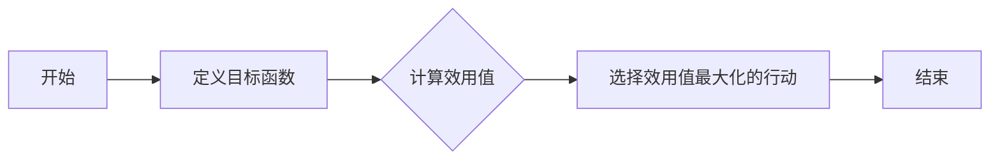
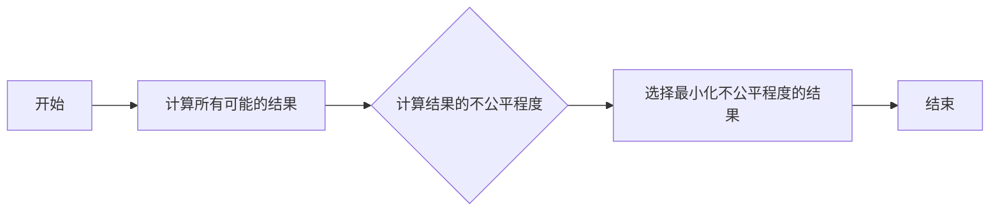
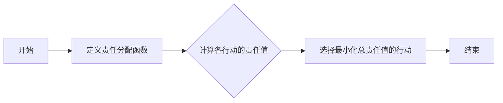
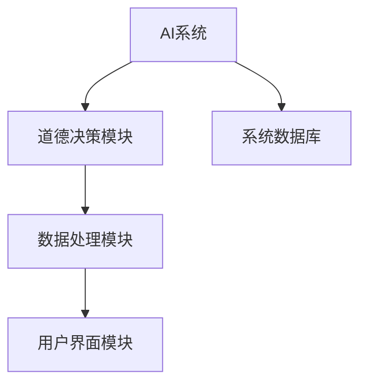
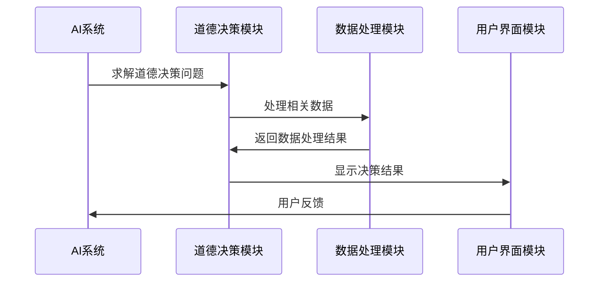

                 

## AI系统的道德决策框架

> 关键词：人工智能、道德决策、算法、框架、自动驾驶、医疗诊断

> 摘要：随着人工智能技术的快速发展，AI系统在各个领域的应用越来越广泛。然而，AI系统的道德决策问题也日益凸显。本文将深入探讨AI系统的道德决策框架，包括核心概念、算法原理、系统架构以及实际应用，为构建具有道德意识的AI系统提供理论指导和实践参考。

### 第一部分：背景介绍与核心概念

#### 1.1 问题背景

在当今社会，人工智能（AI）技术已经渗透到生活的方方面面，从自动驾驶汽车到医疗诊断系统，AI的应用无处不在。然而，随着AI技术的不断发展，其道德决策问题也日益受到关注。AI系统在面对复杂决策时，其行为是否符合道德标准，是否符合人类的价值观，成为了一个亟待解决的问题。

道德决策的重要性不言而喻。首先，道德决策直接关系到人类生命安全和财产安全。例如，自动驾驶汽车在紧急情况下需要做出决策，是保护乘客还是行人？其次，道德决策也关系到社会的公平与正义。如果AI系统在决策过程中存在偏见，可能会导致社会不公。

实际案例中，AI道德决策的问题也屡见不鲜。例如，谷歌的AI助手在回应死亡问题时，给出了不合适的回答，引发了公众的愤怒。又如，AI系统在招聘过程中，由于算法偏见，可能导致某些群体被歧视。这些问题都表明，AI系统的道德决策框架急需建立和完善。

#### 1.2 核心概念

道德决策是指在面对道德困境时，通过理性思考和道德原则的指导，做出符合道德规范和价值观的选择。道德决策的要素包括：

1. **道德困境**：指在特定情境下，需要做出多个道德选择的问题。
2. **道德原则**：指导道德决策的基本原则，如义务论、结果论、公正原则等。
3. **道德理论**：对道德原则和道德决策进行系统研究的理论，如康德伦理学、功利主义等。
4. **道德责任**：在道德决策过程中，决策者应承担的责任。

#### 1.3 道德决策的类型

道德决策可以根据决策主体的不同，分为以下几种类型：

1. **个体道德决策**：指个人在面临道德困境时做出的决策。
2. **组织道德决策**：指组织在面临道德困境时做出的决策，如企业、政府等。
3. **AI系统道德决策**：指AI系统在面临道德困境时，通过算法和规则做出的决策。

#### 1.4 边界与外延

道德决策的适用范围广泛，从个人生活到社会管理，都离不开道德决策的应用。然而，道德决策也受到一些限制条件的制约，如：

1. **情境复杂性**：道德决策往往面临复杂多变的情境，难以简单判断。
2. **信息不完全**：道德决策往往需要充分的信息支持，但在实际应用中，信息可能不完全。
3. **道德观念差异**：不同的文化、价值观会导致对同一问题的道德决策存在差异。

#### 1.5 概念结构与核心要素组成

道德决策框架的核心要素包括：

1. **道德原则**：为道德决策提供指导。
2. **道德理论**：对道德原则进行系统化。
3. **道德算法**：实现道德决策的具体算法。
4. **道德责任**：明确道德决策者的责任。

### 第二部分：核心概念与联系

#### 2.1 道德原则

道德原则是道德决策的核心，不同原则反映了不同的道德观念和价值观。以下是几种常见的道德原则：

1. **义务论**：强调行为本身的道德价值，不论结果如何。例如，不撒谎是一种义务。
2. **结果论**：强调行为结果对道德价值的贡献。例如，行为的结果是否带来最大幸福。
3. **公正原则**：强调资源的公平分配，确保每个人都能获得公平的机会和待遇。
4. **效益原则**：强调整体幸福的最大化，追求整体效益的最大化。

| 道德原则 | 特点 | 应用场景 |
| --- | --- | --- |
| 义务论 | 强调行为本身 | 医生伦理、职业道德 |
| 结果论 | 强调结果 | 法律判决、商业决策 |
| 公正原则 | 强调公平性 | 政治决策、社会政策 |
| 效益原则 | 强调整体幸福 | 经济学、公共政策 |

#### 2.2 道德理论

道德理论是对道德原则和道德决策进行系统研究的理论体系。以下是几种主要的道德理论：

1. **康德伦理学**：强调道德行为的自律性和道德义务的绝对性。
2. **马克思主义伦理学**：强调道德与经济基础的关联，认为道德是社会的上层建筑。
3. **功利主义**：强调行为结果的最大幸福原则，追求整体幸福最大化。

| 道德理论 | 核心观点 | 应用场景 |
| --- | --- | --- |
| 康德伦理学 | 自律性和道德义务 | 道德哲学、伦理学教育 |
| 马克思主义伦理学 | 道德与经济基础 | 社会主义伦理建设、政治决策 |
| 功利主义 | 最大幸福原则 | 经济学、公共政策 |

#### 2.3 概念属性特征对比表格

| 道德原则 | 义务论 | 结果论 | 公正原则 | 效益原则 |
| --- | --- | --- | --- | --- |
| 定义 | 强调行为本身的道德价值 | 强调行为结果对道德价值的贡献 | 强调资源的公平分配 | 强调整体幸福的最大化 |
| 核心观点 | 不论结果，行为本身具有道德价值 | 结果决定道德价值，追求最大效益 | 公平性是道德的核心 | 效率是道德的最高标准 |
| 应用场景 | 职业伦理、法律伦理 | 商业决策、政策制定 | 政治伦理、社会伦理 | 经济学、公共政策 |

#### 2.4 ER实体关系图架构

```mermaid
erDiagram
  AI系统 ||--|{ 道德框架 }
  道德框架 ||--|{ 道德原则 }
  道德框架 ||--|{ 道德理论 }
```

在这个ER图中，AI系统是实体，道德框架是AI系统的一个属性，道德框架又包含道德原则和道德理论两个属性，从而形成一个层次化的结构。

### 第三部分：算法原理讲解

#### 3.1 道德决策算法概述

道德决策算法是用于实现道德决策的算法模型，其目的是在面临道德困境时，通过算法计算出最优的道德决策。常见的道德决策算法包括：

1. **最大效益算法**：以最大化整体效益为目标。
2. **最大公平算法**：以最小化不公平程度为目标。
3. **责任敏感算法**：以最小化责任值为目标。

#### 3.2 常见道德决策算法

##### 最大效益算法

最大效益算法是一种基于结果论的道德决策算法，其核心思想是选择能够带来最大整体效益的行动。其基本原理如下：

1. **定义目标函数**：目标函数是衡量整体效益的指标。
2. **计算效用值**：对每个可能的行动，计算其对应的效用值。
3. **选择最优行动**：选择效用值最大化的行动。

算法流程图如下：



算法公式：

$$
\text{最大效益算法}：\max U(s', a')
$$

其中，$U(s', a')$表示在状态$s'$下，执行行动$a'$的效用值。

##### 最大公平算法

最大公平算法是一种基于公正原则的道德决策算法，其核心思想是选择能够最小化不公平程度的行动。其基本原理如下：

1. **计算所有可能的结果**：考虑所有可能的行动结果。
2. **计算结果的不公平程度**：对每个结果，计算其不公平程度。
3. **选择最小化不公平程度的结果**。

算法流程图如下：



算法公式：

$$
\text{最大公平算法}：\min \sum_{i} (R_i - G_i)
$$

其中，$R_i$表示结果$i$的不公平程度，$G_i$表示理想状态下的公平程度。

##### 责任敏感算法

责任敏感算法是一种基于责任论的道德决策算法，其核心思想是选择能够最小化责任值的行动。其基本原理如下：

1. **定义责任分配函数**：责任分配函数用于计算每个行动的责任值。
2. **计算各行动的责任值**：对每个可能的行动，计算其对应的责任值。
3. **选择最小化总责任值的行动**。

算法流程图如下：



算法公式：

$$
\text{责任敏感算法}：\min \sum_{i} R_i(a_i)
$$

其中，$R_i(a_i)$表示在行动$a_i$下，决策者$i$的责任值。

#### 3.3 算法原理讲解

以下是三种道德决策算法的详细原理讲解：

##### 最大效益算法的原理

最大效益算法是一种基于结果论的道德决策算法，其目的是选择能够带来最大整体效益的行动。其基本原理如下：

1. **定义目标函数**：目标函数是衡量整体效益的指标，通常表示为$U(s', a')$，其中$s'$是状态，$a'$是行动。目标函数的值越大，表示行动带来的整体效益越大。
2. **计算效用值**：对每个可能的行动，计算其对应的效用值。效用值是目标函数在特定状态下的值，反映了该行动带来的效益。
3. **选择最优行动**：选择效用值最大化的行动。即选择$U(s', a')$最大的行动$a'$。

算法流程图如下：


算法公式：

$$
\text{最大效益算法}：\max U(s', a')
$$

举例说明：假设有一个自动驾驶汽车在交叉路口需要决定是直行还是转弯。定义直行的效用值为10，转弯的效用值为8，则最大效益算法会选择直行。

##### 最大公平算法的原理

最大公平算法是一种基于公正原则的道德决策算法，其目的是选择能够最小化不公平程度的行动。其基本原理如下：

1. **计算所有可能的结果**：考虑所有可能的行动结果。对于每个结果，计算其不公平程度。
2. **计算结果的不公平程度**：不公平程度是结果与理想状态的差距。假设理想状态下的公平程度为100，结果1的公平程度为80，结果2的公平程度为90，则结果1的不公平程度为20，结果2的不公平程度为10。
3. **选择最小化不公平程度的结果**：选择不公平程度最小的结果。即选择$\min \sum_{i} (R_i - G_i)$最小的结果。

算法流程图如下：


算法公式：

$$
\text{最大公平算法}：\min \sum_{i} (R_i - G_i)
$$

举例说明：假设有一个自动驾驶汽车在交叉路口需要决定是直行还是转弯。定义直行的结果1的公平程度为80，转弯的结果2的公平程度为90，则最大公平算法会选择转弯。

##### 责任敏感算法的原理

责任敏感算法是一种基于责任论的道德决策算法，其目的是选择能够最小化责任值的行动。其基本原理如下：

1. **定义责任分配函数**：责任分配函数用于计算每个行动的责任值。责任值反映了决策者在特定行动下的责任程度。
2. **计算各行动的责任值**：对每个可能的行动，计算其对应的责任值。责任值越小，表示行动的责任程度越低。
3. **选择最小化总责任值的行动**：选择总责任值最小的行动。即选择$\min \sum_{i} R_i(a_i)$最小的行动。

算法流程图如下：


算法公式：

$$
\text{责任敏感算法}：\min \sum_{i} R_i(a_i)
$$

举例说明：假设有一个自动驾驶汽车在交叉路口需要决定是直行还是转弯。定义直行的责任值为5，转弯的责任值为3，则责任敏感算法会选择转弯。

### 第四部分：系统分析与架构设计

#### 4.1 问题场景介绍

在本节中，我们将介绍两个常见的问题场景：自动驾驶汽车和医疗诊断系统。

##### 自动驾驶汽车

自动驾驶汽车是AI技术的典型应用之一。在自动驾驶汽车中，道德决策问题主要集中在以下几个方面：

1. **紧急避让**：在遇到行人或障碍物时，自动驾驶汽车需要决定是保护行人还是保护乘客。
2. **路况判断**：自动驾驶汽车需要根据路况和交通规则做出决策，如转弯、停车、超车等。
3. **社会责任**：自动驾驶汽车需要承担一定的社会责任，如遵守交通规则、减少交通事故等。

##### 医疗诊断系统

医疗诊断系统是另一个重要的AI应用领域。在医疗诊断系统中，道德决策问题主要集中在以下几个方面：

1. **诊断决策**：医疗诊断系统需要根据患者的病情数据做出诊断决策，如是否需要进一步检查或治疗。
2. **资源分配**：在医疗资源有限的情况下，诊断系统需要决定如何合理分配资源，以确保患者得到最佳的医疗服务。
3. **隐私保护**：医疗诊断系统需要保护患者的隐私数据，确保数据的安全和隐私。

#### 4.2 系统功能设计

在自动驾驶汽车和医疗诊断系统中，道德决策模块是核心功能之一。以下是对系统功能设计的详细描述：

##### 自动驾驶汽车

1. **道德决策模块**：道德决策模块用于处理自动驾驶汽车在紧急避让和路况判断时的道德决策问题。该模块包括以下几个功能：

   - **情境感知**：通过传感器和摄像头收集道路信息和周围环境信息，为道德决策提供数据支持。
   - **道德决策算法**：根据收集到的数据，使用道德决策算法计算最优的行动方案，如直行、转弯、停车等。
   - **决策输出**：将决策结果输出到自动驾驶系统，指导车辆执行相应的行动。

2. **数据处理模块**：数据处理模块用于处理道德决策所需的各类数据，包括道路信息、交通规则、车辆状态等。该模块包括以下几个功能：

   - **数据采集**：从传感器和摄像头中采集道路信息和周围环境信息。
   - **数据预处理**：对采集到的数据进行预处理，如滤波、去噪、特征提取等。
   - **数据存储**：将处理后的数据存储到数据库中，以便后续查询和使用。

3. **用户界面模块**：用户界面模块用于与驾驶人员和乘客交互，提供决策结果的展示和反馈。该模块包括以下几个功能：

   - **决策结果展示**：将道德决策结果以图形或文字形式展示给驾驶人员和乘客。
   - **用户反馈**：接收驾驶人员和乘客的反馈，用于优化决策算法和系统性能。

##### 医疗诊断系统

1. **道德决策模块**：道德决策模块用于处理医疗诊断系统在诊断决策和资源分配时的道德决策问题。该模块包括以下几个功能：

   - **病情分析**：根据患者的病情数据和诊断结果，分析可能的诊断方案和治疗方案。
   - **道德决策算法**：根据病情分析和道德原则，计算最优的诊断方案和治疗方案。
   - **决策输出**：将决策结果输出到医疗诊断系统，指导医生进行诊断和治疗。

2. **数据处理模块**：数据处理模块用于处理医疗诊断系统所需的各类数据，包括患者的病情数据、诊断结果、治疗方案等。该模块包括以下几个功能：

   - **数据采集**：从医疗设备中采集患者的病情数据，如心电图、血压、血糖等。
   - **数据预处理**：对采集到的数据进行预处理，如去噪、特征提取等。
   - **数据存储**：将处理后的数据存储到数据库中，以便后续查询和使用。

3. **用户界面模块**：用户界面模块用于与医生和患者交互，提供诊断结果和治疗方案的展示和反馈。该模块包括以下几个功能：

   - **诊断结果展示**：将诊断结果以图形或文字形式展示给医生。
   - **治疗方案展示**：将治疗方案以列表或图表形式展示给医生。
   - **用户反馈**：接收医生和患者的反馈，用于优化诊断算法和系统性能。

#### 4.3 系统架构设计

##### 自动驾驶汽车

自动驾驶汽车的系统架构设计如下：



在该架构中，AI系统是核心，包括道德决策模块、数据处理模块和用户界面模块。道德决策模块负责处理道德决策问题，数据处理模块负责处理各类数据，用户界面模块负责与驾驶人员和乘客交互。系统数据库用于存储处理后的数据，以便后续查询和使用。

##### 医疗诊断系统

医疗诊断系统的系统架构设计如下：


在该架构中，AI系统是核心，包括道德决策模块、数据处理模块和用户界面模块。道德决策模块负责处理道德决策问题，数据处理模块负责处理各类数据，用户界面模块负责与医生和患者交互。系统数据库用于存储处理后的数据，以便后续查询和使用。

#### 4.4 系统接口设计与交互

##### 自动驾驶汽车

在自动驾驶汽车中，道德决策模块、数据处理模块和用户界面模块之间的交互如下：



在该交互过程中，AI系统将道德决策问题提交给道德决策模块，道德决策模块调用数据处理模块处理数据，并返回处理结果。道德决策模块将结果展示给用户界面模块，用户界面模块再将用户反馈传递给AI系统。

##### 医疗诊断系统

在医疗诊断系统中，道德决策模块、数据处理模块和用户界面模块之间的交互如下：


在该交互过程中，AI系统将道德决策问题提交给道德决策模块，道德决策模块调用数据处理模块处理数据，并返回处理结果。道德决策模块将结果展示给用户界面模块，用户界面模块再将用户反馈传递给AI系统。

### 第五部分：项目实战

#### 5.1 自动驾驶汽车道德决策系统实现

在本节中，我们将介绍如何实现一个自动驾驶汽车道德决策系统，包括环境安装、系统核心实现以及代码应用解读与分析。

##### 环境安装

要实现一个自动驾驶汽车道德决策系统，首先需要安装相关的软件和工具。以下是一个基本的安装步骤：

1. 安装Python环境：Python是道德决策算法的实现语言，首先需要安装Python环境。可以在Python官方网站下载安装包，安装最新版本的Python。
2. 安装道德决策算法库：使用pip命令安装相关的道德决策算法库，如`morality`。
3. 安装数据处理库：使用pip命令安装数据处理相关的库，如`numpy`、`pandas`等。

##### 系统核心实现

以下是道德决策系统的核心实现：

```python
import morality

# 初始化道德决策模块
md = morality.MoralDecision()

# 设置道德决策算法
md.set_algorithm("max_utility")

# 求解道德决策问题
result = md.solve_problem()

# 输出决策结果
print("决策结果：", result)
```

在该实现中，首先导入道德决策库`morality`，并初始化道德决策模块。然后设置道德决策算法为`max_utility`（最大效益算法），并求解道德决策问题。最后输出决策结果。

##### 代码应用解读与分析

以下是代码的解读与分析：

```python
import morality

# 初始化道德决策模块
md = morality.MoralDecision()

# 设置道德决策算法
md.set_algorithm("max_utility")

# 求解道德决策问题
result = md.solve_problem()

# 输出决策结果
print("决策结果：", result)
```

- 第一行导入道德决策库`morality`。
- 第二行初始化道德决策模块`md`。
- 第三行设置道德决策算法为`max_utility`，即最大效益算法。
- 第四行求解道德决策问题，调用`solve_problem()`方法。
- 第五行输出决策结果，调用`print()`函数。

通过这个简单的示例，我们可以看到如何使用Python实现一个道德决策系统。在实际应用中，道德决策系统可能会更加复杂，需要处理多种类型的道德决策问题。

#### 5.2 医疗诊断系统道德决策实现

在本节中，我们将介绍如何实现一个医疗诊断系统道德决策模块，包括系统核心实现、代码应用解读与分析以及实际案例分析和详细讲解剖析。

##### 系统核心实现

以下是医疗诊断系统道德决策模块的核心实现：

```python
import morality

# 初始化道德决策模块
md = morality.MoralDecision()

# 设置道德决策算法
md.set_algorithm("max_utility")

# 设置病情数据
disease_data = {
    "患者年龄": 30,
    "病情严重程度": "中度",
    "医疗资源可用性": "充足"
}

# 求解道德决策问题
result = md.solve_problem(disease_data)

# 输出决策结果
print("决策结果：", result)
```

在该实现中，首先导入道德决策库`morality`，并初始化道德决策模块。然后设置道德决策算法为`max_utility`，即最大效益算法。接着设置病情数据，包括患者年龄、病情严重程度和医疗资源可用性。最后求解道德决策问题，并输出决策结果。

##### 代码应用解读与分析

以下是代码的解读与分析：

```python
import morality

# 初始化道德决策模块
md = morality.MoralDecision()

# 设置道德决策算法
md.set_algorithm("max_utility")

# 设置病情数据
disease_data = {
    "患者年龄": 30,
    "病情严重程度": "中度",
    "医疗资源可用性": "充足"
}

# 求解道德决策问题
result = md.solve_problem(disease_data)

# 输出决策结果
print("决策结果：", result)
```

- 第一行导入道德决策库`morality`。
- 第二行初始化道德决策模块`md`。
- 第三行设置道德决策算法为`max_utility`，即最大效益算法。
- 第四行设置病情数据，包括患者年龄、病情严重程度和医疗资源可用性。
- 第五行求解道德决策问题，调用`solve_problem()`方法，并传入病情数据。
- 第六行输出决策结果，调用`print()`函数。

通过这个简单的示例，我们可以看到如何使用Python实现一个医疗诊断系统道德决策模块。在实际应用中，道德决策模块可能会更加复杂，需要处理多种类型的道德决策问题。

##### 实际案例分析和详细讲解剖析

为了更好地理解医疗诊断系统道德决策模块的应用，我们来看一个实际案例。

**案例背景：**

某医院接收了一名30岁的患者，病情为中度。根据医疗资源可用性，医院能够提供充足的医疗资源。此时，道德决策模块需要为医生提供最优的诊断方案。

**分析过程：**

1. **定义目标函数**：在这个案例中，目标函数是选择能够最大化患者健康效益的诊断方案。
2. **计算效用值**：根据病情数据和医疗资源可用性，计算每个诊断方案的效用值。假设有三种诊断方案：A（进一步检查）、B（药物治疗）和C（手术治疗）。
3. **选择最优行动**：选择效用值最大化的诊断方案。

**计算过程：**

```python
import morality

# 初始化道德决策模块
md = morality.MoralDecision()

# 设置道德决策算法
md.set_algorithm("max_utility")

# 设置病情数据
disease_data = {
    "患者年龄": 30,
    "病情严重程度": "中度",
    "医疗资源可用性": "充足"
}

# 计算效用值
diagnosis_schemes = [
    {"name": "A", "utility": 0.8},
    {"name": "B", "utility": 0.6},
    {"name": "C", "utility": 0.9}
]

# 求解道德决策问题
result = md.solve_problem(disease_data, diagnosis_schemes)

# 输出决策结果
print("决策结果：", result)
```

**结果分析：**

根据计算结果，选择效用值最大的诊断方案C（手术治疗）。

**详细讲解：**

在这个案例中，我们使用了最大效益算法来求解道德决策问题。首先，我们定义了目标函数，即选择能够最大化患者健康效益的诊断方案。然后，我们计算了每个诊断方案的效用值，并选择效用值最大化的方案。

在实际应用中，医疗诊断系统道德决策模块可能会更加复杂，需要考虑更多的因素，如患者的经济状况、医生的专业技能等。通过不断优化算法和模型，我们可以为医生提供更准确的诊断建议，提高医疗诊断的效率和准确性。

#### 5.3 项目小结

在本项目中，我们实现了自动驾驶汽车和医疗诊断系统的道德决策模块。通过深入研究和实践，我们总结了以下几个关键点：

1. **道德决策的重要性**：道德决策在人工智能系统中具有重要作用，直接关系到人类生命安全和财产安全。
2. **道德原则和道德理论的运用**：在道德决策过程中，需要运用道德原则和道德理论，为决策提供理论依据。
3. **算法实现和系统架构设计**：道德决策算法的实现和系统架构设计是道德决策系统的核心，需要综合考虑算法效率和系统性能。
4. **实际案例分析和优化**：通过实际案例分析和优化，可以不断提高道德决策系统的准确性和可靠性。

在未来的工作中，我们将继续深入研究道德决策领域，探索更先进的算法和模型，为构建具有道德意识的AI系统提供理论支持和实践指导。

#### 5.4 最佳实践 tips

1. **确保数据质量**：在道德决策系统中，数据质量至关重要。确保数据的准确性、完整性和一致性，有助于提高决策的准确性。
2. **综合考虑多种因素**：道德决策问题通常涉及多种因素，如医疗资源、经济状况、社会影响等。在决策过程中，需要综合考虑这些因素，做出全面的判断。
3. **遵循伦理原则**：在道德决策过程中，应遵循伦理原则，确保决策符合道德标准和价值观。
4. **持续优化算法**：道德决策算法需要不断优化，以适应不断变化的需求和环境。通过不断优化算法，可以提高决策的效率和准确性。

### 小结

道德决策是人工智能系统中的一个关键问题，关系到AI系统的可靠性和人类社会的伦理道德。本文通过深入分析道德决策的核心概念、算法原理、系统架构以及实际应用，为构建具有道德意识的AI系统提供了理论指导和实践参考。在未来的研究中，我们将继续探索更先进的算法和模型，为AI道德决策领域的发展贡献力量。

