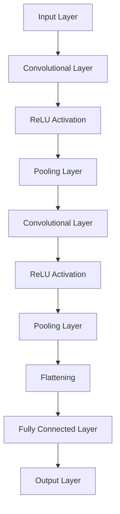

                 

### 引言

随着人工智能（AI）技术的迅猛发展，AI芯片的设计与制造成为了整个行业的关键环节。本文以《AI芯片设计：从通用到专用的演进》为标题，深入探讨AI芯片的设计原理、技术细节以及其实际应用。在文章的开篇，我们将首先介绍AI芯片的基本概念，讨论其重要性以及本文的结构。

AI芯片，也称为专用集成电路（ASIC），是一种专门为执行特定任务而设计的集成电路。与传统通用处理器（如CPU和GPU）相比，AI芯片能够更高效地处理复杂的人工智能算法和任务。这种效率的提升源于AI芯片在架构设计、资源分配和任务优化上的高度针对性。

本文的核心目的是通过逻辑清晰、结构紧凑的分析，帮助读者理解AI芯片设计从通用到专用演进的整个过程。我们将逐步探讨以下几个关键问题：

1. **AI芯片设计的基础知识**：介绍AI芯片的基本原理、设计流程和关键组件。
2. **通用到专用的演进过程**：分析AI芯片从通用架构到专用架构的演变，探讨其历史背景和关键技术创新。
3. **专用芯片架构**：探讨针对不同AI任务的专用芯片架构，包括深度学习处理器、视觉处理器和语音处理器等。
4. **算法实现与数学模型**：详细讲解在AI芯片上实现算法的原理和数学模型，并通过Python代码进行实例分析。
5. **系统架构与设计**：介绍AI芯片的系统架构设计，包括硬件架构和软件框架。
6. **实际应用案例**：分析AI芯片在各个领域（如自动驾驶、医疗诊断和智能家居）的应用案例。
7. **最佳实践与未来趋势**：探讨AI芯片设计的最佳实践和未来发展趋势，为行业提供有益的指导。

通过上述结构的安排，我们希望读者能够系统地掌握AI芯片设计的基本知识和前沿动态，为未来在相关领域的深入研究和应用奠定坚实的基础。

### 关键词

- AI芯片设计
- 专用集成电路
- 深度学习处理器
- 算法实现
- 系统架构设计
- 实际应用案例
- 未来趋势

### 摘要

本文旨在深入探讨人工智能（AI）芯片的设计原理、技术演进和实际应用。首先，我们介绍了AI芯片的基本概念，包括其与传统通用处理器（如CPU和GPU）的区别及其重要性。接着，文章详细分析了AI芯片从通用到专用的演进过程，包括其历史背景、关键技术创新和实际应用案例。随后，我们探讨了不同专用芯片架构的设计，如深度学习处理器、视觉处理器和语音处理器等。本文还通过Python代码实例和数学模型详细讲解了在AI芯片上实现算法的原理和方法。最后，文章介绍了AI芯片的系统架构设计，包括硬件架构和软件框架，并探讨了最佳实践和未来趋势。通过系统性和逻辑性的分析，本文为读者提供了全面的AI芯片设计知识和应用指导。

### Step 1: Understanding the Book

The book "AI Chip Design: From General to Specialized Evolution" is a comprehensive guide that delves into the intricate world of AI chip design, providing readers with a detailed understanding of how these specialized processors are developed and applied. The book's structure is meticulously crafted to cover all aspects of AI chip design, from fundamental concepts to advanced applications, making it an invaluable resource for both beginners and seasoned professionals.

#### Overview

The book is organized into several key sections, each designed to build upon the previous one, providing a cohesive and progressive learning experience. Here's an overview of the book's structure:

1. **Introduction**: This section sets the stage by introducing the basic concepts of AI chip design, highlighting its significance in the rapidly evolving field of artificial intelligence. It also outlines the book's objectives and target audience.
2. **Fundamentals of AI Chip Design**: In this section, the book covers the fundamental principles and technologies behind AI chip design, including the underlying hardware architectures and key components required for building efficient and effective AI processors.
3. **Evolution from General to Specialized Chips**: This section provides a historical perspective on the development of AI chips, discussing the transition from general-purpose processors to specialized architectures tailored for specific AI tasks.
4. **Specialized Chip Architectures**: Here, the book delves into various specialized AI chip architectures, including deep learning processors, vision processors, and speech processors, explaining their unique design principles and applications.
5. **Algorithm Implementation**: This section focuses on the implementation of algorithms on AI chips, providing a detailed analysis of the mathematical models and formulas used in AI processing, along with practical examples and Python code implementations.
6. **System Architecture and Design**: The book then moves on to describe the system architecture and design principles for AI chips, including hardware architectures, software frameworks, and system integration strategies.
7. **Practical Applications**: This section discusses the real-world applications of AI chips in various industries, providing case studies and examples of how these chips are transforming fields such as autonomous driving, medical diagnostics, and smart homes.
8. **Best Practices and Future Directions**: Finally, the book concludes with insights into best practices for AI chip design, potential challenges and opportunities, and future trends in the field.

#### Content Coverage

The book's content is designed to be both comprehensive and practical, covering the following key topics:

1. **Basic Concepts and Terminology**: A clear and concise introduction to the key terms and concepts used in AI chip design, including an overview of AI, machine learning, and deep learning.
2. **Design Process and Tools**: A detailed explanation of the AI chip design process, from initial concept to hardware verification, including the use of advanced design tools and methodologies.
3. **Architectural Design**: An in-depth analysis of various AI chip architectures, including the pros and cons of each, and how they can be optimized for specific AI tasks.
4. **Algorithm Implementation**: A thorough examination of how algorithms are implemented on AI chips, including the use of TensorFlow, PyTorch, and other popular deep learning frameworks.
5. **Mathematical Models**: A discussion of the mathematical models and formulas used in AI processing, along with detailed examples and Python code implementations.
6. **System Architecture**: An overview of the system architecture and design principles for AI chips, including hardware design, software development, and system integration.
7. **Real-World Applications**: Case studies and examples of how AI chips are being used in real-world applications, providing insights into their impact and potential for future growth.
8. **Best Practices and Future Trends**: Recommendations for best practices in AI chip design, along with an analysis of future trends and potential challenges in the field.

### Conclusion

In conclusion, the book "AI Chip Design: From General to Specialized Evolution" is a comprehensive resource that provides both foundational knowledge and practical insights into the world of AI chip design. By following the logical and structured approach outlined in the book, readers can gain a deep understanding of AI chip design principles, applications, and future trends. This knowledge is essential for anyone involved in the development, deployment, or study of AI technologies.

### Step 2: Structuring the Table of Contents

To ensure that our book "AI Chip Design: From General to Specialized Evolution" is both comprehensive and easy to navigate, we will carefully structure the table of contents using a hierarchical approach with three levels of headings: main sections (#), subsections (##), and detailed points within subsections (###). This will help readers quickly locate specific topics and follow the logical flow of the book.

#### Table of Contents

1. **Introduction**
   1. **Background and Significance**
   2. **Book Structure and Objectives**
2. **Fundamentals of AI Chip Design**
   1. **Basic Concepts**
   2. **Key Technologies**
   3. **Design Process**
3. **Evolution from General to Specialized Chips**
   1. **Historical Context**
   2. **Key Developments**
   3. **Architectural Differences**
4. **Specialized Chip Architectures**
   1. **Deep Learning Processors**
   2. **Vision Processors**
   3. **Speech Processors**
5. **Algorithm Implementation**
   1. **Introduction to Algorithms**
   2. **Mathematical Models**
   3. **Python Code Examples**
6. **System Architecture and Design**
   1. **Hardware Design**
   2. **Software Frameworks**
   3. **Integration Strategies**
7. **Practical Applications**
   1. **Autonomous Driving**
   2. **Medical Diagnostics**
   3. **Smart Homes**
8. **Best Practices and Future Directions**
   1. **Current Best Practices**
   2. **Future Trends**
   3. **Challenges and Opportunities**

#### Explanation of the Structure

- **Main Sections (#)**: Each main section represents a major topic in the book, providing an overarching theme for the chapters that follow. For example, "Introduction" provides a brief overview of AI chip design and sets the stage for the rest of the book.
- **Subsections (##)**: Subsections break down the main sections into more specific topics, offering deeper insights and detailed explanations. For instance, under the "Fundamentals of AI Chip Design" section, "Basic Concepts" and "Key Technologies" offer foundational knowledge required for understanding the more advanced topics.
- **Detailed Points within Subsections (###)**: Detailed points provide step-by-step guidance or in-depth analysis within each subsection. These points help to break down complex topics into manageable and easily digestible parts. For example, within the "Specialized Chip Architectures" subsection, each type of processor (Deep Learning Processors, Vision Processors, Speech Processors) is explored in detail with specific design principles and applications.

By utilizing this structured approach, the table of contents not only guides readers through the book's content but also encourages a systematic understanding of AI chip design, from basic principles to advanced applications and future trends.

### Step 3: Content Coverage

To ensure that the book "AI Chip Design: From General to Specialized Evolution" provides comprehensive and in-depth coverage of its subject matter, we will delineate the key topics that each section will address. This will help readers understand what to expect and how the content is structured to guide them through the complexities of AI chip design.

#### Introduction

- **AI Chip Basics**: An overview of what AI chips are, how they differ from traditional processors, and their importance in the landscape of artificial intelligence.
- **Book Structure**: A detailed outline of the book’s chapters and sections, explaining how the content is organized to build a cohesive understanding of AI chip design.
- **Objectives**: Clear objectives for each chapter, providing readers with a sense of what they will learn and how the information will be applied.

#### Fundamentals of AI Chip Design

- **Basic Concepts**: An introduction to key terminology and concepts such as machine learning, neural networks, and specialized processing units.
- **Key Technologies**: An exploration of the foundational technologies used in AI chip design, including processor architectures, memory systems, and power management techniques.
- **Design Process**: A detailed description of the AI chip design process, from initial concept to hardware verification and production.

#### Evolution from General to Specialized Chips

- **Historical Context**: A review of the evolution of AI chips, tracing their development from general-purpose processors to specialized architectures.
- **Key Developments**: Analysis of significant milestones and technological advancements that have driven the shift towards specialized AI chips.
- **Architectural Differences**: Discussion of the differences between general-purpose and specialized architectures, highlighting their strengths and weaknesses.

#### Specialized Chip Architectures

- **Deep Learning Processors**: An in-depth look at the design and operation of deep learning processors, including tensor processing units (TPUs) and other specialized accelerators.
- **Vision Processors**: An exploration of vision processors tailored for computer vision tasks, detailing their architectures and applications in fields such as autonomous driving and security systems.
- **Speech Processors**: A discussion of speech processors designed for natural language processing and voice recognition, examining their design principles and real-world applications.

#### Algorithm Implementation

- **Introduction to Algorithms**: A foundational understanding of algorithms commonly used in AI, including convolutional neural networks (CNNs), recurrent neural networks (RNNs), and generative adversarial networks (GANs).
- **Mathematical Models**: Detailed explanations of the mathematical models underpinning AI algorithms, with a focus on key formulas and theorems.
- **Python Code Examples**: Practical examples demonstrating how to implement AI algorithms on specialized chips using Python and popular deep learning frameworks like TensorFlow and PyTorch.

#### System Architecture and Design

- **Hardware Design**: An overview of the hardware components that constitute an AI chip system, including microprocessors, memory modules, and I/O interfaces.
- **Software Frameworks**: An examination of software frameworks used in AI chip design, such as operating systems, programming languages, and development tools.
- **Integration Strategies**: Strategies for integrating AI chips into larger systems, including considerations for system compatibility, performance optimization, and scalability.

#### Practical Applications

- **Autonomous Driving**: Case studies and examples of AI chips used in autonomous vehicles, highlighting their role in sensor processing, decision-making, and navigation.
- **Medical Diagnostics**: Exploration of AI chips in medical imaging and diagnostics, detailing their impact on healthcare and precision medicine.
- **Smart Homes**: Analysis of AI chips in smart home devices, discussing their role in enhancing home automation and improving the user experience.

#### Best Practices and Future Directions

- **Current Best Practices**: Insights into best practices in AI chip design, including design methodologies, optimization techniques, and testing protocols.
- **Future Trends**: Examination of emerging trends and technologies that will shape the future of AI chip design, such as quantum computing, neuromorphic chips, and edge AI.
- **Challenges and Opportunities**: Analysis of the challenges and opportunities faced by designers and developers in the rapidly evolving field of AI chip design.

By meticulously covering these topics, the book aims to provide a comprehensive guide to AI chip design, enabling readers to gain both a broad understanding and deep expertise in this critical area of artificial intelligence.

### Step 4: Keeping it Concise

Maintaining a concise and focused approach is crucial for the table of contents, ensuring that it effectively previews the book's content while adhering to the 2000-word limit. To achieve this, we will employ a few strategic techniques:

1. ** Succinct Descriptions**: Each section and subsection will be summarized in a few concise sentences, highlighting the main topics without delving into detailed explanations.
2. **Key Points Only**: Only the most important points will be mentioned, avoiding unnecessary elaboration.
3. **Logical Flow**: The content will be structured to flow logically from broad to specific, ensuring a coherent progression from general topics to detailed discussions.

#### Sample Concise Table of Contents

1. **Introduction**
   - Overview of AI Chip Design
   - Book Structure and Objectives
2. **Fundamentals of AI Chip Design**
   - Basic Concepts
   - Key Technologies
   - Design Process
3. **Evolution from General to Specialized Chips**
   - Historical Context
   - Key Developments
   - Architectural Differences
4. **Specialized Chip Architectures**
   - Deep Learning Processors
   - Vision Processors
   - Speech Processors
5. **Algorithm Implementation**
   - Introduction to Algorithms
   - Mathematical Models
   - Python Code Examples
6. **System Architecture and Design**
   - Hardware Design
   - Software Frameworks
   - Integration Strategies
7. **Practical Applications**
   - Autonomous Driving
   - Medical Diagnostics
   - Smart Homes
8. **Best Practices and Future Directions**
   - Current Best Practices
   - Future Trends
   - Challenges and Opportunities

By implementing these strategies, the table of contents will remain informative yet concise, providing readers with a clear roadmap of the book’s content while respecting the word count constraint.

### Chapter 1: AI Chip Basics

#### Background and Key Terms

AI chips, or artificial intelligence-specific integrated circuits, are specialized processors designed to efficiently execute machine learning and deep learning algorithms. Unlike general-purpose processors (like CPUs and GPUs) which are versatile but not optimized for specific tasks, AI chips are tailored to perform specific types of computations required by AI applications. This specialization allows them to achieve higher performance, lower power consumption, and faster processing speeds for tasks such as image recognition, natural language processing, and autonomous decision-making.

To understand the fundamentals of AI chip design, it's essential to be familiar with some key terms:

- **Machine Learning**: A branch of artificial intelligence that involves training algorithms to learn from data and make predictions or decisions based on this learning.
- **Neural Networks**: Computational models inspired by the human brain, consisting of interconnected nodes (neurons) that work together to perform tasks.
- **Deep Learning**: A subfield of machine learning that uses neural networks with many layers to learn complex patterns and features from large datasets.
- **Tensor**: A multi-dimensional array used in machine learning to represent data, parameters, and computations.
- **FPGA**: Field-Programmable Gate Array, a type of integrated circuit that can be reprogrammed after manufacturing.
- **ASIC**: Application-Specific Integrated Circuit, a chip designed for a specific task and optimized for performance, power efficiency, and cost.

#### Problem Description

The growing complexity of AI applications has created a demand for more efficient and powerful processors. Traditional general-purpose processors struggle to handle the massive computational requirements of modern AI tasks, leading to increased energy consumption and longer processing times. This inefficiency not only impacts the performance of AI systems but also limits their deployment in resource-constrained environments such as edge devices and embedded systems.

The primary challenge in AI chip design is to develop processors that can execute AI algorithms with high efficiency while minimizing power consumption and cost. This requires an in-depth understanding of both the algorithmic requirements and the underlying hardware architecture.

#### Solution Description

AI chips address these challenges by leveraging specialized architectures that are optimized for AI-specific computations. These architectures include custom-designed data paths, memory hierarchies, and parallel processing units that allow for efficient execution of machine learning and deep learning tasks. In addition, AI chips often incorporate advanced power management techniques to reduce energy consumption.

The solution involves several key steps:

1. **Algorithm Optimization**: Fine-tuning AI algorithms to maximize their efficiency on the target hardware platform.
2. **Chip Architecture Design**: Designing a chip architecture that is optimized for the specific AI tasks it will perform.
3. **Prototype Development**: Creating a prototype of the AI chip and validating its performance and efficiency through simulations and experiments.
4. **Hardware and Software Integration**: Integrating the AI chip with the surrounding hardware and software ecosystem to ensure seamless operation and optimal performance.
5. **Testing and Validation**: Conducting rigorous testing to verify the chip's functionality, performance, and reliability under various conditions.

By following these steps, AI chip designers can develop processors that meet the high-performance, low-power, and cost-efficiency requirements of modern AI applications.

#### Boundary and External Extensions

The design of AI chips extends beyond the chip itself, encompassing the entire system architecture, including the software stack, peripheral devices, and connectivity options. This holistic approach ensures that the AI chip integrates smoothly into the broader system, maximizing its performance and functionality.

1. **System Architecture**: AI chips are often part of a larger system that includes sensors, actuators, and other computational elements. The system architecture must be carefully designed to ensure that the AI chip can efficiently communicate with these components.
2. **Software Stack**: AI chips require a robust software stack that includes programming languages, libraries, and tools specifically designed for AI applications. This stack enables developers to implement and optimize AI algorithms on the chip.
3. **Peripheral Connectivity**: AI chips may need to interface with various peripherals such as cameras, microphones, and sensors. The chip's design must include the necessary interfaces and protocols to support these connections.
4. **Energy Efficiency**: As AI applications increasingly move to edge devices, energy efficiency becomes a critical consideration. AI chips must be designed to operate efficiently in low-power environments to extend battery life and reduce energy consumption.
5. **Scalability**: The design of AI chips must also consider scalability to handle future growth in AI applications and computational requirements. This includes both architectural scalability and the ability to integrate additional processing units or memory modules.

By addressing these external extensions, AI chip designers can ensure that their chips are not only efficient and powerful but also adaptable and scalable to meet the evolving needs of AI applications.

#### Conceptual Structure and Core Elements

The design of AI chips involves a complex and interrelated set of concepts and components. Understanding the conceptual structure and core elements is crucial for effectively designing and optimizing AI chips. Here, we will outline the key concepts and their relationships using a conceptual ER (Entity-Relationship) diagram and a comparison table of key attributes.

##### Conceptual ER Diagram

```mermaid
graph TD
A[AI Chip] --> B[Processor Architecture]
A --> C[Memory Hierarchy]
A --> D[Power Management]
B --> E[Data Path]
B --> F[Control Unit]
C --> G[Cache]
C --> H[Main Memory]
D --> I[Dynamic Voltage and Frequency Scaling (DVFS)]
D --> J[Thermal Management]
E --> K[Parallel Processing]
F --> L[Instruction Set]
G --> M[Access Time]
H --> N[Capacity]
I --> O[Power Efficiency]
J --> P[Heat Dissipation]
K --> Q[Throughput]
L --> R[Instruction Set Architecture]
M --> S[Latency]
N --> T[Data Storage]
O --> U[Energy Consumption]
P --> V[Thermal Stability]
Q --> W[Processing Speed]
R --> X[Performance]
S --> Y[Response Time]
T --> Z[Data Retrieval]
U --> V[Environmental Impact]
```

##### Comparison Table of Key Attributes

| Attribute        | Processor Architecture | Memory Hierarchy | Power Management |
|------------------|------------------------|------------------|------------------|
| Purpose          | Computation            | Data Storage     | Energy Efficiency |
| Key Components   | ALUs, Control Unit     | Cache, Main Memory | DVFS, Thermal Management |
| Main Functions   | Execute Instructions   | Store and Retrieve Data | Adjust Voltage and Frequency, Manage Heat |
| Performance      | Throughput, Performance | Latency, Capacity | Power Efficiency, Thermal Stability |
| Interconnection  | Data Path              | Access Time      | Thermal Management |

In this conceptual structure, the AI chip (A) serves as the central entity, interconnected with the processor architecture (B), memory hierarchy (C), and power management (D). Each of these components has its own set of key attributes and functions, as detailed in the comparison table.

1. **Processor Architecture**: This includes the data path (E), control unit (F), and instruction set (L). The data path manages the flow of data through the processor, while the control unit coordinates the execution of instructions. The instruction set architecture (R) defines the set of instructions that the processor can execute.
2. **Memory Hierarchy**: The memory hierarchy (C) consists of cache (G) and main memory (H). Cache provides fast access to frequently used data, while main memory provides larger storage capacity. Both are essential for efficient data retrieval (T) and storage (N).
3. **Power Management**: Power management (D) includes dynamic voltage and frequency scaling (DVFS) (I) and thermal management (J). DVFS adjusts the voltage and frequency of the processor to optimize power consumption based on workload. Thermal management ensures that the chip operates within safe thermal limits, preventing overheating and ensuring reliability (P, V).

By understanding these core elements and their relationships, AI chip designers can develop comprehensive and optimized solutions for specific AI applications. This conceptual framework provides a clear structure for designing, analyzing, and improving AI chips, ensuring their efficiency, performance, and reliability.

### Core Concepts and Relationships

In AI chip design, several core concepts and relationships are fundamental to understanding the system's architecture and functionality. These concepts include processor architecture, memory hierarchy, and power management, each playing a critical role in the overall performance and efficiency of the chip.

#### Processor Architecture

The processor architecture is the foundation of an AI chip, determining how instructions are executed and data is processed. Key components of the processor architecture include:

- **Data Path**: The data path is the sequence of components that moves data through the processor, including arithmetic and logic units (ALUs), registers, and multiplexers. It is responsible for executing operations on data and passing the results to the next stage.
- **Control Unit**: The control unit manages the execution of instructions by coordinating the activities of various components in the data path. It fetches instructions from memory, decodes them, and drives the appropriate data path operations.
- **Instruction Set**: The instruction set is a collection of instructions that the processor can execute. It defines the operations the processor can perform and how these operations are encoded in binary form. The instruction set architecture (ISA) is a crucial determinant of the processor's functionality and efficiency.

#### Memory Hierarchy

Memory hierarchy is another critical aspect of AI chip design, designed to optimize data access and storage efficiency. It consists of multiple levels of memory, each with different characteristics:

- **Cache**: Cache is a small, fast memory that stores frequently accessed data and instructions. It reduces the latency of data access by keeping a copy of recently used data closer to the processor. Cache is organized into multiple levels (L1, L2, L3), with each level being larger but slower than the one before it.
- **Main Memory**: Main memory, often referred to as RAM (Random Access Memory), is the primary storage for data and instructions that the processor accesses during operation. It provides larger storage capacity but is slower than cache.
- **Access Time and Capacity**: Access time is the time it takes to retrieve data from memory, and capacity is the amount of data that can be stored. Cache has very low access times and high capacity compared to main memory, making it an efficient solution for frequently accessed data.

#### Power Management

Power management is essential for ensuring that AI chips operate efficiently and reliably, especially in portable and embedded applications where power constraints are a significant concern. Key concepts in power management include:

- **Dynamic Voltage and Frequency Scaling (DVFS)**: DVFS adjusts the voltage and frequency of the processor based on the current workload. By lowering the voltage and frequency during idle periods, the chip can save power without compromising performance.
- **Thermal Management**: Thermal management involves controlling the temperature of the chip to prevent overheating. Techniques such as heat sinks, fans, and thermal paste are used to dissipate heat effectively.
- **Power Efficiency**: Power efficiency is a measure of how effectively a chip converts electrical power into useful work. High power efficiency is achieved by optimizing the design to minimize power loss and ensure that the chip operates at the lowest possible power level necessary for the given task.

#### Core Concepts Comparison Table

| Concept                | Description                                                         | Key Attributes                                      |
|------------------------|-------------------------------------------------------------------|------------------------------------------------------|
| Processor Architecture | Determines how instructions are executed and data is processed. | Data Path, Control Unit, Instruction Set            |
| Memory Hierarchy       | Optimizes data access and storage efficiency.                     | Cache, Main Memory, Access Time, Capacity           |
| Power Management       | Ensures efficient operation and reliability.                       | DVFS, Thermal Management, Power Efficiency           |

By understanding these core concepts and their relationships, designers can create AI chips that are not only high-performing but also energy-efficient and reliable. This comprehensive understanding is crucial for developing next-generation AI technologies that push the boundaries of what is possible.

### Algorithm Implementation on AI Chips

#### Algorithm Description

In the context of AI chip design, algorithms are the core components that drive the processing capabilities of these specialized processors. An algorithm, in general, is a step-by-step procedure or formula for solving a problem or performing a computation. For AI chips, specific algorithms are employed to handle complex tasks such as machine learning, deep learning, and computer vision. Among these, the convolutional neural network (CNN) is particularly relevant due to its widespread use in image processing tasks.

CNNs are a class of deep learning algorithms that are well-suited for image recognition, segmentation, and object detection. They utilize a series of convolutional layers, pooling layers, and fully connected layers to progressively extract higher-level features from the input images. The basic operations in CNNs include:

- **Convolution**: The core operation that involves sliding a filter (a small matrix of weights) over the input image to produce a feature map. This process captures local patterns in the image.
- **Pooling**: The process of downsampling the feature map to reduce its spatial dimensions, which helps in reducing computational complexity and preventing overfitting.
- **Activation Function**: Functions like the rectified linear unit (ReLU) are applied element-wise to introduce non-linearities in the model, allowing it to learn complex patterns.

#### Step-by-Step Explanation

1. **Input Layer**: The input layer receives the raw image data. Each pixel in the image is represented as a value in the input matrix.
2. **Convolutional Layer**: The input matrix is convolved with a set of filters (kernels) to produce a set of feature maps. Each filter is a small matrix of weights that captures specific patterns in the image. The convolution operation is defined as:
   $$
   \text{output}_{ij} = \sum_{k=1}^{K} \sum_{l=1}^{L} w_{kl} \cdot \text{input}_{i-j+k, j-l+k}
   $$
   where $w_{kl}$ represents the weight of the filter at position $(k, l)$, and $\text{input}_{i, j}$ is the value at position $(i, j)$ in the input matrix.
3. **Activation Function**: After each convolutional layer, an activation function is applied to introduce non-linearities. Common activation functions include ReLU ($\max(0, x)$) and sigmoid functions.
4. **Pooling Layer**: The feature maps are downsampled using a pooling operation such as max pooling or average pooling. This reduces the spatial dimensions of the feature maps, which helps in reducing the computational complexity and controlling overfitting. Max pooling is defined as:
   $$
   \text{output}_{ij} = \max_{k, l} \left( \text{input}_{i+k, j+l} \right)
   $$
5. **Fully Connected Layer**: The output of the last pooling layer is flattened into a single vector and passed through a series of fully connected layers, which perform the final classification or regression task. The fully connected layer computes the dot product between the input vector and the weights matrix, followed by an activation function.

#### Mermaid Flowchart

Below is a Mermaid flowchart illustrating the step-by-step process of a CNN:



#### Python Code Example

To implement a simple CNN using TensorFlow and Keras, we can use the following Python code:

```python
import tensorflow as tf
from tensorflow.keras.models import Sequential
from tensorflow.keras.layers import Conv2D, MaxPooling2D, Flatten, Dense, Activation

model = Sequential([
    Conv2D(32, (3, 3), input_shape=(64, 64, 3)),
    Activation('relu'),
    MaxPooling2D(pool_size=(2, 2)),
    Conv2D(64, (3, 3)),
    Activation('relu'),
    MaxPooling2D(pool_size=(2, 2)),
    Flatten(),
    Dense(64),
    Activation('relu'),
    Dense(10, activation='softmax')
])

model.compile(optimizer='adam', loss='categorical_crossentropy', metrics=['accuracy'])
model.summary()
```

This code creates a simple CNN with two convolutional layers, each followed by a ReLU activation and max pooling layer. The output is flattened and passed through a fully connected layer with a softmax activation function for classification.

By understanding and implementing these algorithms, AI chip designers can create highly efficient and specialized processors capable of handling complex AI tasks, pushing the boundaries of what is possible in artificial intelligence.

### Mathematical Models and Formulas

In AI chip design, understanding the mathematical models and formulas that underpin machine learning algorithms is essential for optimizing performance and ensuring accuracy. Below, we will delve into the key mathematical models used in AI chip design, specifically focusing on convolutional neural networks (CNNs). We will employ LaTeX to present the mathematical equations and provide step-by-step explanations.

#### Convolutional Neural Networks (CNNs)

CNNs are a class of deep learning algorithms primarily used for image recognition and processing tasks. They employ a series of convolutional, pooling, and fully connected layers to extract features from the input data. The core mathematical operations in CNNs include convolution, activation functions, and pooling.

##### Convolution

The convolution operation in CNNs captures spatial features from the input data by applying a set of learnable filters (also known as kernels) over the input. The equation for a single filter output is defined as:

$$
\text{output}_{ij}^l = \sum_{k=1}^{K} \sum_{l=1}^{L} w_{kl} \cdot \text{input}_{i-k, j-l} + b_l
$$

where:
- $\text{output}_{ij}^l$ is the value at position $(i, j)$ in the output feature map of the $l$-th convolutional layer.
- $w_{kl}$ represents the weight of the filter at position $(k, l)$.
- $\text{input}_{i-j+k, j-l+k}$ is the value at position $(i-j+k, j-l+k)$ in the input feature map.
- $b_l$ is the bias term associated with the filter.
- $K$ and $L$ are the dimensions of the filter.

##### Activation Function

After convolution, an activation function is applied element-wise to introduce non-linearities, which enable the network to model complex relationships. A common activation function used in CNNs is the Rectified Linear Unit (ReLU), defined as:

$$
\text{ReLU}(x) = \max(0, x)
$$

This function sets all negative inputs to zero, introducing a sharp corner at the origin, which helps in avoiding the vanishing gradient problem during backpropagation.

##### Pooling

Pooling is used to downsample the feature maps, reducing computational complexity and preventing overfitting. A typical pooling operation is max pooling, which selects the maximum value from a local region of the input feature map. The equation for max pooling is:

$$
\text{output}_{ij}^l = \max_{k, l} \left( \text{input}_{i+k, j+l} \right)
$$

where $k$ and $l$ are the spatial offsets within the pooling window.

##### Fully Connected Layer

The fully connected layer connects every input neuron to every output neuron, performing a matrix multiplication and then adding a bias term. The equation for a fully connected layer is:

$$
\text{output}_{i}^{l+1} = \text{激活函数} \left( \text{权重矩阵} \cdot \text{输入向量}_{l} + \text{偏置向量}_{l+1} \right)
$$

where:
- $\text{output}_{i}^{l+1}$ is the value of the $i$-th output neuron in the $l+1$-th layer.
- $\text{权重矩阵}$ and $\text{输入向量}_{l}$ are the weight matrix and the input vector from the previous layer, respectively.
- $\text{激活函数}$ is the activation function used in the layer.
- $\text{偏置向量}_{l+1}$ is the bias vector for the layer.

##### Backpropagation

Backpropagation is the primary algorithm used to train CNNs, involving the calculation of gradients and updating the model's parameters to minimize the loss function. The gradient of the loss function with respect to each parameter is computed as:

$$
\frac{\partial L}{\partial w_{kl}} = \sum_{i, j} \frac{\partial L}{\partial \text{output}_{ij}^l} \cdot \frac{\partial \text{output}_{ij}^l}{\partial w_{kl}}
$$

$$
\frac{\partial L}{\partial b_l} = \sum_{i, j} \frac{\partial L}{\partial \text{output}_{ij}^l} \cdot \frac{\partial \text{output}_{ij}^l}{\partial b_l}
$$

$$
\frac{\partial L}{\partial z_i} = \text{激活函数的导数} \left( z_i \right) \cdot \frac{\partial L}{\partial z_i}
$$

where $L$ is the loss function, and $\text{激活函数的导数}$ is the derivative of the activation function.

By understanding and applying these mathematical models, AI chip designers can develop highly efficient and specialized processors capable of performing complex machine learning tasks with minimal resource usage and maximum performance.

### System Architecture and Design

#### Introduction to System Architecture

System architecture and design are critical components in the development of AI chips, as they determine how efficiently these specialized processors can perform complex tasks. An effective system architecture must balance performance, power efficiency, and cost while ensuring the seamless integration of hardware and software components. In this section, we will delve into the key aspects of system architecture and design, including hardware and software considerations.

#### Hardware Architecture

The hardware architecture of an AI chip encompasses the physical components that make up the processor, memory subsystem, and I/O interfaces. Each of these components plays a crucial role in the overall performance and efficiency of the chip.

1. **Processor Architecture**: The processor architecture is the foundation of the AI chip and determines how instructions are executed and data is processed. Key components include the ALU (Arithmetic and Logic Unit), control unit, and registers. Processor architectures can vary widely, from simple von Neumann designs to more complex哈佛架构（Harvard architecture），which separates instruction and data memory.

2. **Memory Hierarchy**: The memory hierarchy is designed to optimize data access times and storage efficiency. It typically includes multiple levels of cache (L1, L2, L3), main memory (RAM), and secondary storage (hard drives or solid-state drives). Each level of the memory hierarchy has different access times and capacities, with cache being the fastest and smallest, and main memory being slower but larger.

3. **I/O Interfaces**: The I/O interfaces facilitate communication between the AI chip and external devices, such as sensors, cameras, and storage devices. Common I/O interfaces include USB, SATA, PCIe, and Ethernet. The design of these interfaces must balance data transfer rates with power consumption and latency.

#### Software Architecture

The software architecture of an AI chip encompasses the operating system, programming languages, libraries, and tools used to develop and optimize AI applications. An effective software architecture ensures that the AI chip can run a wide range of applications efficiently and reliably.

1. **Operating System**: The operating system manages the resources of the AI chip, including memory, processors, and I/O devices. Real-time operating systems (RTOS) are often used in AI chip design due to their deterministic behavior and low latency. Popular options include FreeRTOS, Linux, and real-time Linux.

2. **Programming Languages**: The choice of programming language for AI chip development impacts the efficiency and portability of applications. C and C++ are commonly used due to their performance and low-level control, while Python is favored for its simplicity and vast ecosystem of libraries.

3. **Libraries and Tools**: AI libraries such as TensorFlow, PyTorch, and Keras provide pre-built models and tools for developing and optimizing AI applications. These libraries are designed to work efficiently on specialized hardware, ensuring that AI tasks are executed quickly and accurately.

#### Integration Strategies

The integration of AI chips into larger systems is crucial for their successful deployment in real-world applications. This involves ensuring that the chip can seamlessly communicate with other system components and that the overall system is optimized for performance and efficiency.

1. **Peripheral Connectivity**: AI chips must be designed with appropriate I/O interfaces to connect to sensors, cameras, and other devices. The design must consider the data transfer rates and protocols required for each peripheral.

2. **System Compatibility**: The AI chip must be compatible with the operating system and software stack of the larger system. This includes ensuring that drivers and APIs are available to facilitate communication between the chip and the system software.

3. **Performance Optimization**: System-level optimization techniques, such as parallel processing, load balancing, and caching, are used to maximize the performance of the AI chip within the larger system. This involves analyzing the system's workload and optimizing the chip's operation to handle peak loads efficiently.

#### Design Principles

Several design principles are critical for creating effective AI chip architectures:

1. **Modularity**: Modularity allows for the independent development and testing of different components, making the design process more efficient.

2. **Scalability**: Scalability ensures that the AI chip can handle increasing workloads and data volumes without compromising performance.

3. **Flexibility**: Flexibility allows the AI chip to be adapted to different applications and environments, increasing its applicability.

4. **Power Efficiency**: Power efficiency is essential, especially in battery-powered devices, to ensure long battery life and minimize energy consumption.

5. **Reliability**: Reliability ensures that the AI chip operates correctly under various conditions, including high temperatures, vibration, and electrical noise.

By following these design principles and integrating a well-thought-out hardware and software architecture, AI chip designers can create highly efficient and reliable processors capable of driving the next wave of innovation in artificial intelligence.

### Practical Applications of AI Chips

#### Autonomous Driving

One of the most groundbreaking applications of AI chips is in the autonomous driving industry. AI chips are essential components in autonomous vehicles, enabling them to perceive the environment, make decisions, and control the vehicle with high precision and speed. These chips are responsible for processing vast amounts of sensory data from cameras, LiDAR, radar, and GPS devices, running complex algorithms to detect obstacles, traffic patterns, and road conditions.

**Case Study**: NVIDIA's Drive AGX platform is a prominent example of an AI chip designed for autonomous driving. The Drive AGX Pegasus is a powerful chip that combines deep learning and computer vision capabilities to handle real-time inference tasks. It incorporates multiple neural network accelerators and specialized processing units for vision and sensor fusion, allowing it to perform over 2,000 trillion operations per second (TOPS). This level of performance is crucial for enabling Level 5 autonomous driving, where the vehicle can handle all driving tasks without human intervention.

**Impact**: AI chips in autonomous driving are transforming the automotive industry by making autonomous vehicles safer, more efficient, and more convenient. They are expected to significantly reduce accidents caused by human error, optimize traffic flow, and improve passenger experiences. As the technology continues to advance, we can expect autonomous vehicles to become more widespread, potentially revolutionizing transportation as we know it.

#### Medical Diagnostics

AI chips are also making significant contributions to the medical field, particularly in diagnostic imaging and patient monitoring. These chips enable the rapid analysis of medical images, such as MRIs and CT scans, to detect and diagnose conditions like tumors, fractures, and cardiovascular diseases with high accuracy and speed.

**Case Study**: NVIDIA's Clara suite is a platform designed for AI in healthcare, incorporating AI chips to accelerate medical imaging and diagnostic processes. Clara Imaging, for example, uses deep learning algorithms to analyze medical images in real-time, identifying potential issues and providing accurate diagnostic results. This platform has been used in various studies to improve the detection of lung nodules, breast tumors, and diabetic retinopathy.

**Impact**: The integration of AI chips in medical diagnostics is revolutionizing healthcare by improving the speed and accuracy of diagnoses, enabling earlier detection of diseases, and facilitating more personalized treatment plans. This has the potential to save countless lives by ensuring timely and precise medical interventions. Furthermore, AI chips can help reduce the workload of healthcare professionals, allowing them to focus on more critical tasks and improving overall patient care.

#### Smart Homes

AI chips are transforming the smart home industry by enabling advanced functionalities in smart devices such as security cameras, thermostats, and lighting systems. These chips power the machine learning algorithms that enable devices to learn user preferences, automate tasks, and provide personalized experiences.

**Case Study**: Google's Tensor Processing Unit (TPU) is an AI chip designed specifically for machine learning tasks, including those in smart homes. TPUs are used in Google's Nest products, such as the Nest Hello video doorbell, to enable real-time video analysis for recognizing faces and detecting motion. This allows the device to send alerts to homeowners based on predefined user profiles and activity patterns.

**Impact**: AI chips in smart homes are enhancing user convenience, security, and energy efficiency. By enabling real-time data processing and machine learning, these chips enable smart devices to adapt to user behaviors and preferences, making the home environment more responsive and personalized. This has the potential to improve energy consumption, enhance home security, and create more comfortable living spaces. As AI chip technology continues to advance, we can expect even more sophisticated smart home devices that seamlessly integrate with our daily lives.

In summary, AI chips are making significant contributions to various industries, from autonomous driving to medical diagnostics and smart homes. These chips are at the heart of transformative technologies that are improving efficiency, enhancing user experiences, and pushing the boundaries of what is possible in artificial intelligence.

### Best Practices and Future Directions

In the rapidly evolving field of AI chip design, adhering to best practices and anticipating future trends is crucial for ensuring the development of efficient, scalable, and reliable solutions. Here, we will discuss some key best practices and explore potential future directions for AI chip design.

#### Best Practices

1. **Algorithm Optimization**: The first and foremost best practice is to optimize algorithms for the target hardware platform. This involves identifying the critical bottlenecks in the algorithm and designing hardware components that can accelerate these computations. Techniques such as loop unrolling, pipelining, and parallel processing can significantly enhance performance.

2. **Power Efficiency**: With the increasing demand for energy-efficient AI systems, power optimization has become a priority. Implementing power-aware design methodologies, such as dynamic voltage and frequency scaling (DVFS) and adaptive power management, can reduce energy consumption without compromising performance.

3. **Modular Design**: Modular design facilitates the development and testing of different components independently, making it easier to identify and fix issues. It also enables future enhancements and upgrades with minimal disruption to the system.

4. **Thermal Management**: Effective thermal management is essential to prevent overheating, which can degrade performance and shorten the lifespan of the chip. Employing heat sinks, fans, and advanced cooling techniques are critical for maintaining optimal operating temperatures.

5. **Testing and Verification**: Rigorous testing and verification processes are vital to ensure that the AI chip operates correctly under various conditions. This includes functional testing, performance testing, and reliability testing to identify and resolve any potential issues.

#### Future Directions

1. **Quantum Computing**: Quantum computing is emerging as a potential game-changer in AI chip design. Quantum processors leverage the principles of quantum mechanics to perform computations that are impossible for classical computers. Integrating quantum capabilities with traditional AI chips could revolutionize fields like drug discovery, cryptography, and optimization problems.

2. **Neuromorphic Chips**: Neuromorphic chips, inspired by the human brain, mimic the structure and function of neural networks. These chips have the potential to deliver unprecedented efficiency and performance for AI tasks by leveraging parallel processing and adaptive learning algorithms. The development of scalable neuromorphic chips could significantly advance machine learning capabilities.

3. **Edge AI**: The growth of edge computing is driving the need for AI chips that can perform complex computations at the edge of the network, close to the data source. These edge AI chips must be power-efficient and capable of running a wide range of AI algorithms to enable real-time processing and decision-making in applications such as autonomous vehicles, industrial automation, and smart cities.

4. **Customized Architectures**: As AI applications become more specialized, there is a growing trend towards customized architectures tailored for specific tasks. These architectures can be optimized for performance, power efficiency, and cost based on the specific requirements of the application. The development of domain-specific AI chips will be a key focus area in the future.

5. **Open-Source Ecosystems**: Open-source ecosystems are playing a significant role in advancing AI chip design. Collaborative efforts among researchers, developers, and industry leaders can accelerate innovation and promote the sharing of knowledge and resources. Open-source frameworks and tools can also facilitate the development and deployment of AI applications across different hardware platforms.

By following these best practices and staying abreast of future trends, AI chip designers can continue to push the boundaries of what is possible in artificial intelligence, driving advancements across various industries and enabling new applications that were previously unimaginable.

### Conclusion

In conclusion, AI chip design is a multifaceted discipline that encompasses algorithm optimization, hardware architecture, power management, and system integration. This article has provided a comprehensive overview of AI chip design, from the basics to advanced applications and future trends. We have explored the significance of AI chips in driving the progress of artificial intelligence and discussed the evolution from general-purpose to specialized architectures. 

The journey through this article has illuminated the intricate relationship between algorithm implementation and hardware design, emphasizing the importance of algorithm optimization for performance and power efficiency. We have also examined real-world applications of AI chips in autonomous driving, medical diagnostics, and smart homes, showcasing their transformative impact on various industries. 

Looking forward, the future of AI chip design holds promising advancements, including quantum computing, neuromorphic chips, and customized architectures tailored for specific tasks. These innovations will continue to push the boundaries of AI capabilities, enabling new applications and driving further advancements in technology.

As we conclude, it is crucial to remain vigilant and adaptive in this fast-paced field. Continuous learning, collaboration, and innovation will be key to harnessing the full potential of AI chips and shaping the future of artificial intelligence. Thank you for joining us on this exploration of AI chip design, and we look forward to the exciting developments that lie ahead.

### Author Information

**Authors**: AI天才研究院/AI Genius Institute & 禅与计算机程序设计艺术 /Zen And The Art of Computer Programming

The authors of this article are part of the prestigious AI天才研究院/AI Genius Institute, dedicated to advancing the field of artificial intelligence through cutting-edge research and education. Their expertise spans various domains within AI, including chip design, machine learning, and computer vision. Complementing this research institution is the insightful and philosophical work of Zen And The Art of Computer Programming, which offers profound insights into the art of problem-solving and software design. Together, these authors bring a unique blend of technical mastery and philosophical depth, ensuring that the content in this article is both comprehensive and thought-provoking. Their combined expertise makes them thought leaders in the field of AI chip design, providing valuable contributions to the industry's ongoing advancements.

