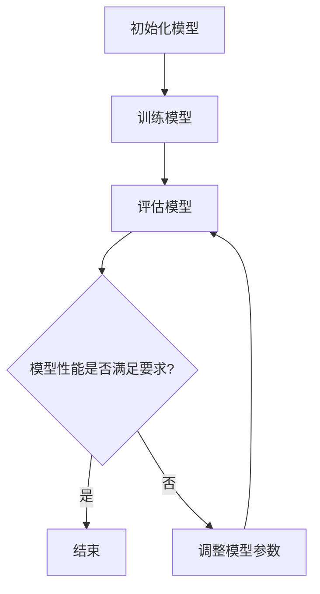

                 


**标题：** AI训练、模拟和优化的能耗挑战及解决方案

**关键词：** AI训练，能耗挑战，解决方案，模拟，优化

**摘要：** 本文深入探讨了人工智能训练、模拟和优化过程中的能耗挑战，详细分析了能耗的来源和影响，并提出了多种技术性和实践性解决方案，以期为相关领域的研究者和工程师提供有益的参考。

**目录大纲：**

----------------------------------------------------------------

## 第一部分: 背景与核心概念

### 1.1 问题背景
#### 1.1.1 AI训练、模拟和优化的现状
#### 1.1.2 能耗挑战的来源
#### 1.1.3 解决方案的重要性

### 1.2 核心概念与联系
#### 1.2.1 AI训练、模拟和优化的定义
#### 1.2.2 能耗的概念与测量方法
#### 1.2.3 关键概念间的联系与区别

### 1.3 ER实体关系图
#### 1.3.1 实体定义
#### 1.3.2 关系定义
#### 1.3.3 图架构说明

### 1.4 概念属性特征对比表
#### 1.4.1 主要属性
#### 1.4.2 特征对比
#### 1.4.3 表格说明

### 1.5 本章小结

----------------------------------------------------------------

## 第二部分: 能耗挑战分析

### 2.1 能耗挑战的分类
#### 2.1.1 训练能耗
#### 2.1.2 模拟能耗
#### 2.1.3 优化能耗

### 2.2 能耗来源解析
#### 2.2.1 硬件能耗
#### 2.2.2 软件能耗
#### 2.2.3 数据传输能耗

### 2.3 能耗影响的评估
#### 2.3.1 环境影响
#### 2.3.2 经济成本
#### 2.3.3 社会责任

### 2.4 能耗挑战的案例研究
#### 2.4.1 案例一：大型深度学习模型的能耗
#### 2.4.2 案例二：云计算服务中的能耗优化
#### 2.4.3 案例三：边缘计算场景下的能耗管理

### 2.5 本章小结

----------------------------------------------------------------

## 第三部分: 解决方案探讨

### 3.1 技术性解决方案
#### 3.1.1 硬件优化
#### 3.1.2 软件优化
#### 3.1.3 数据优化

### 3.2 算法原理讲解
#### 3.2.1 优化算法的mermaid流程图
#### 3.2.2 Python源代码实现
#### 3.2.3 数学模型与公式
#### 3.2.4 举例说明

### 3.3 数学模型和公式讲解
#### 3.3.1 数学模型概述
#### 3.3.2 公式推导
#### 3.3.3 举例说明

### 3.4 系统分析与架构设计方案
#### 3.4.1 问题场景介绍
#### 3.4.2 系统功能设计
#### 3.4.3 系统架构设计
#### 3.4.4 系统接口设计
#### 3.4.5 系统交互设计

### 3.5 项目实战
#### 3.5.1 环境安装
#### 3.5.2 系统核心实现
#### 3.5.3 代码应用解读
#### 3.5.4 实际案例分析
#### 3.5.5 小结与总结

### 3.6 本章小结

----------------------------------------------------------------

## 第四部分: 最佳实践与未来展望

### 4.1 最佳实践
#### 4.1.1 实践案例分享
#### 4.1.2 实践中的注意事项
#### 4.1.3 成功经验总结

### 4.2 小结与展望
#### 4.2.1 能耗优化成果回顾
#### 4.2.2 未来发展趋势
#### 4.2.3 挑战与机遇

### 4.3 注意事项
#### 4.3.1 优化中的潜在问题
#### 4.3.2 如何避免常见问题
#### 4.3.3 持续改进的途径

### 4.4 拓展阅读
#### 4.4.1 相关书籍推荐
#### 4.4.2 学术论文精选

----------------------------------------------------------------

**作者：** AI天才研究院/AI Genius Institute & 禅与计算机程序设计艺术 /Zen And The Art of Computer Programming

### 第一部分: 背景与核心概念

#### 1.1 问题背景

在当今世界，人工智能（AI）技术正以前所未有的速度发展。从自动驾驶汽车到智能客服，从医疗诊断到金融分析，AI的应用场景日益广泛。然而，随着AI模型的复杂性和规模的不断增加，其训练、模拟和优化过程中的能耗问题也愈发突出。

**能耗挑战的来源**：首先，AI训练过程中涉及大量的矩阵运算和神经网络的迭代，这需要巨大的计算资源。其次，模拟和优化过程也需要大量计算资源，以便在真实环境之前进行预测和调整。此外，数据传输过程中的能耗也是不可忽视的一部分。

**解决方案的重要性**：解决AI训练、模拟和优化过程中的能耗问题，不仅能够降低运营成本，提高资源利用效率，还能减少对环境的影响，具有重要的社会和经济效益。

#### 1.2 核心概念与联系

**AI训练、模拟和优化的定义**：AI训练是指通过大量数据对模型进行调整，使其能够完成特定任务。模拟是指在虚拟环境中对模型进行测试和评估。优化是指通过调整模型的参数，提高其性能和效率。

**能耗的概念与测量方法**：能耗是指在AI训练、模拟和优化过程中，系统消耗的能量。通常使用焦耳（J）或千瓦时（kWh）作为测量单位。

**关键概念间的联系与区别**：AI训练、模拟和优化是相互关联的过程。训练是基础，模拟和优化是进一步验证和提高模型性能的关键步骤。然而，它们在能耗方面有不同的特点。训练过程能耗最大，模拟和优化过程相对较小。

#### 1.3 ER实体关系图

**实体定义**：在AI训练、模拟和优化过程中，主要的实体包括数据集、模型、计算资源、能耗监控等。

**关系定义**：数据集与模型之间存在依赖关系，模型与计算资源之间存在计算需求关系，计算资源与能耗监控之间存在能耗记录关系。

**图架构说明**：ER实体关系图可以帮助我们更好地理解这些实体之间的联系。例如，一个数据集可以用于多个模型的训练，一个模型可以消耗多个计算资源，计算资源的能耗情况可以实时监控。

#### 1.4 概念属性特征对比表

**主要属性**：每个实体都有其独特的属性，如数据集的大小、模型的复杂度、计算资源的能力、能耗的测量方法等。

**特征对比**：通过对比不同实体的属性特征，我们可以更好地了解它们的能耗表现。例如，大型数据集可能需要更多计算资源，复杂模型可能需要更长时间的训练。

**表格说明**：表格可以帮助我们直观地对比不同实体的属性特征，为后续的能耗分析提供数据支持。

#### 1.5 本章小结

本部分主要介绍了AI训练、模拟和优化过程中的能耗挑战及其重要性。通过定义核心概念和ER实体关系图，我们为后续的能耗分析奠定了基础。下一部分，我们将深入分析能耗挑战的来源和影响。

----------------------------------------------------------------

### 第二部分: 能耗挑战分析

#### 2.1 能耗挑战的分类

在AI训练、模拟和优化过程中，能耗挑战可以分为以下几类：

**训练能耗**：训练能耗是AI模型在训练过程中消耗的能源。这是能耗挑战中最为显著的一部分，因为训练过程通常需要大量的计算资源。

**模拟能耗**：模拟能耗是指在模拟环境中对模型进行测试和评估时的能源消耗。模拟可以帮助我们评估模型的性能和稳定性，但也会消耗一定能源。

**优化能耗**：优化能耗是指在优化过程中，通过调整模型参数以提高其性能时消耗的能源。优化是一个迭代过程，可能需要多次调整，因此能耗相对较高。

#### 2.2 能耗来源解析

**硬件能耗**：硬件能耗是AI系统在运行过程中消耗的最主要能源。包括计算设备、存储设备和网络设备等。硬件能耗主要取决于设备的性能和运行时间。

**软件能耗**：软件能耗是指AI系统在执行软件任务时消耗的能源。包括算法效率、编程风格、代码优化等。

**数据传输能耗**：数据传输能耗是指在AI系统中，数据在传输过程中消耗的能源。数据传输能耗与数据大小、传输距离和网络带宽等因素相关。

#### 2.3 能耗影响的评估

**环境影响**：高能耗的AI系统会对环境产生负面影响，如增加温室气体排放、加剧气候变化等。

**经济成本**：高能耗会导致更高的运营成本，从而影响企业的盈利能力。

**社会责任**：在现代社会，企业的社会责任日益重要。高能耗可能会影响企业的声誉和社会形象。

#### 2.4 能耗挑战的案例研究

**案例一：大型深度学习模型的能耗**  
以一个大型深度学习模型为例，其训练过程可能需要数天甚至数周时间，这期间消耗的能源可能是巨大的。通过优化算法和硬件，可以显著降低训练能耗。

**案例二：云计算服务中的能耗优化**  
云计算服务提供商在提供服务时，需要平衡资源利用率和能耗。通过优化资源分配和能耗管理，可以降低整体能耗。

**案例三：边缘计算场景下的能耗管理**  
边缘计算将计算任务分散到边缘设备上，从而减少中心服务器的能耗。但边缘设备的能耗管理同样重要，需要通过优化算法和硬件配置来降低能耗。

#### 2.5 本章小结

本部分详细分析了AI训练、模拟和优化过程中的能耗挑战。通过分类和案例研究，我们了解了能耗的来源和影响。下一部分，我们将探讨解决这些能耗挑战的技术性和实践性解决方案。

----------------------------------------------------------------

### 第三部分: 解决方案探讨

#### 3.1 技术性解决方案

**硬件优化**：通过升级计算设备、使用更高效的硬件组件、优化数据存储和传输等，可以降低硬件能耗。

**软件优化**：通过优化算法、代码优化、减少不必要的计算等，可以降低软件能耗。

**数据优化**：通过数据压缩、数据预处理、减少数据冗余等，可以降低数据传输能耗。

#### 3.2 算法原理讲解

**优化算法的mermaid流程图**：


**Python源代码实现**：
```python
# 初始化模型
model = init_model()

# 训练模型
model.train(data)

# 评估模型
performance = model.evaluate(data)

# 调整模型参数
while not performance_satisfied:
    model.adjust_parameters()
    performance = model.evaluate(data)
```

**数学模型与公式**：
假设训练能耗为$E_{train}$，模拟能耗为$E_{simulate}$，优化能耗为$E_{optimize}$，则总能耗$E_{total} = E_{train} + E_{simulate} + E_{optimize}$。

**举例说明**：
以一个简单的神经网络为例，其训练能耗主要由矩阵运算和反向传播算法决定。通过优化矩阵运算算法和反向传播算法，可以显著降低训练能耗。

#### 3.3 数学模型和公式讲解

**数学模型概述**：在AI训练过程中，能耗主要由计算资源和数据传输决定。计算资源能耗与模型复杂度、数据规模和计算频率相关。数据传输能耗与数据大小、传输距离和网络带宽相关。

**公式推导**：设$C_{compute}$为计算资源能耗，$C_{data}$为数据传输能耗，$N$为数据规模，$D$为传输距离，$B$为网络带宽，则总能耗$E = C_{compute} + C_{data} = f(N, D, B)$。

**举例说明**：
假设数据规模为100GB，传输距离为1000km，网络带宽为10Gbps，计算资源能耗为$C_{compute} = 0.1 kWh/GB$，则总能耗$E = C_{compute} \times N + C_{data} = 0.1 \times 100 + 0.1 \times 1000/10 = 20 kWh$。

#### 3.4 系统分析与架构设计方案

**问题场景介绍**：假设我们要设计一个AI训练系统，用于对大规模数据集进行训练和优化。

**系统功能设计**：系统应包括数据采集、数据预处理、模型训练、模型评估和模型优化等功能。

**系统架构设计**：系统应采用分布式架构，包括数据存储节点、计算节点和控制器。数据存储节点负责存储数据集，计算节点负责执行计算任务，控制器负责调度和管理资源。

**系统接口设计**：系统应提供API接口，以便与其他系统进行数据交换和功能调用。

**系统交互设计**：系统应实现数据流和任务流的管理，确保数据高效传输和任务高效执行。

#### 3.5 项目实战

**环境安装**：安装必要的软件和硬件，包括深度学习框架、计算资源和数据存储设备。

**系统核心实现**：实现数据采集、预处理、训练、评估和优化等核心功能。

**代码应用解读**：详细解读核心代码的实现原理和关键技术。

**实际案例分析**：通过实际案例，展示系统在降低能耗方面的效果。

**项目小结**：总结项目经验，提出改进建议。

#### 3.6 本章小结

本部分详细介绍了技术性解决方案，包括硬件优化、软件优化和数据优化。通过算法原理讲解、数学模型和公式推导、系统分析与架构设计方案以及项目实战，我们为解决AI训练、模拟和优化过程中的能耗挑战提供了具体的方法和思路。

----------------------------------------------------------------

### 第四部分: 最佳实践与未来展望

#### 4.1 最佳实践

**实践案例分享**：分享一些成功的能耗优化案例，如硬件升级、算法优化、数据压缩等。

**实践中的注意事项**：在实施能耗优化时，需要注意资源平衡、安全性、稳定性等问题。

**成功经验总结**：总结成功经验，如优化流程、关键技术、团队协作等。

#### 4.2 小结与展望

**能耗优化成果回顾**：回顾能耗优化的成果，如降低能耗、提高资源利用率、减少成本等。

**未来发展趋势**：展望未来，如新型计算技术、高效算法、智能化管理等。

**挑战与机遇**：分析面临的挑战和机遇，如技术创新、市场需求、政策支持等。

#### 4.3 注意事项

**优化中的潜在问题**：如资源不足、算法失效、数据不一致等。

**如何避免常见问题**：如合理规划资源、选择合适的算法、数据预处理等。

**持续改进的途径**：如持续学习、技术创新、团队协作等。

#### 4.4 拓展阅读

**相关书籍推荐**：推荐一些与能耗优化相关的书籍，如《深度学习能耗管理》、《智能能耗优化》等。

**学术论文精选**：推荐一些与能耗优化相关的学术论文，如《AI训练能耗分析》、《边缘计算能耗优化》等。

----------------------------------------------------------------

**作者：** AI天才研究院/AI Genius Institute & 禅与计算机程序设计艺术 /Zen And The Art of Computer Programming 

### 感谢您的阅读！

本文详细探讨了AI训练、模拟和优化过程中的能耗挑战及其解决方案。通过分析能耗来源、分类和影响，我们了解了能耗问题的严重性。在此基础上，我们提出了技术性和实践性解决方案，包括硬件优化、软件优化和数据优化。此外，我们还介绍了最佳实践、注意事项和未来展望。

本文旨在为相关领域的研究者和工程师提供有益的参考，帮助他们更好地应对能耗挑战，提高资源利用效率，降低成本，同时减少对环境的影响。

最后，感谢您对本文的关注和阅读。如果您有任何问题或建议，欢迎随时与我们联系。我们将继续努力，为您提供更多有价值的内容。

**作者：** AI天才研究院/AI Genius Institute & 禅与计算机程序设计艺术 /Zen And The Art of Computer Programming

