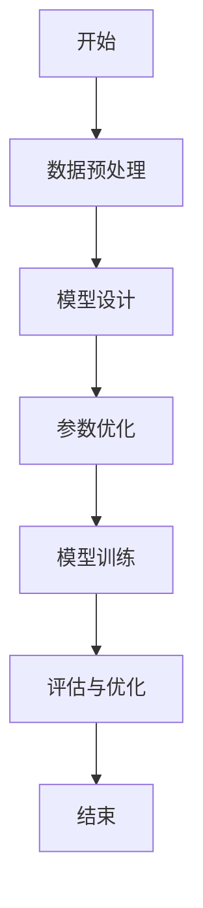
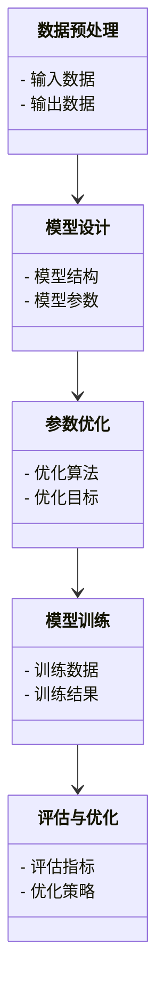
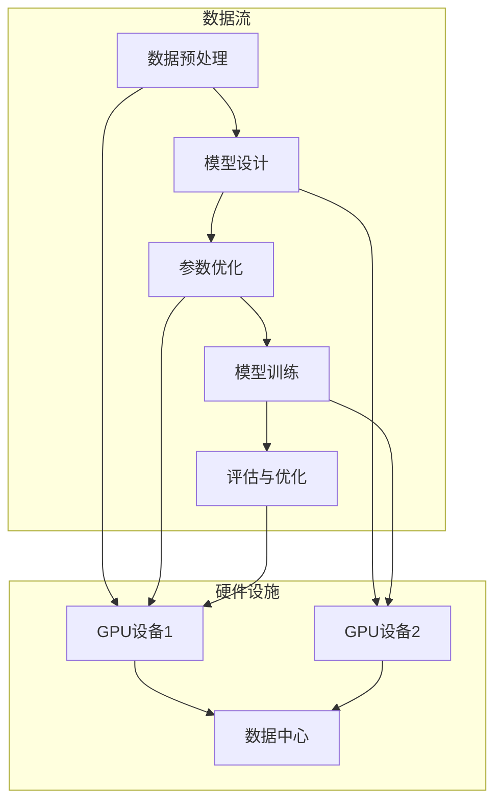
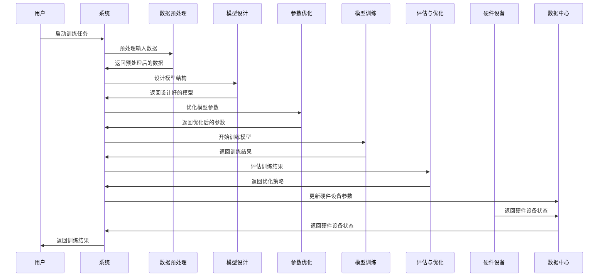

                 

### 《AI训练的能源消耗问题及解决方案》

**关键词：** AI训练、能源消耗、解决方案、算法、架构设计

**摘要：** 本文详细探讨了AI训练过程中面临的能源消耗问题，分析了其严重性和影响，并提出了多种解决方案。通过对AI训练原理与能源消耗原理的深入解析，本文展示了能源消耗的核心概念、属性特征和联系，结合实际项目案例，系统地讲解了系统分析与架构设计的方法和步骤，旨在为相关领域的研究者和从业者提供有价值的参考。

## 第1章 引言

### 1.1 问题背景

#### 1.1.1 AI训练与能源消耗

人工智能（AI）的快速发展极大地改变了我们的生活方式，推动了科技、医疗、金融等多个领域的变革。然而，AI的训练过程是一个高度计算密集的任务，这导致了巨大的能源消耗。随着AI模型的复杂度和规模的增加，其能源消耗问题愈发凸显。研究表明，AI训练的能源消耗已经成为全球能源消耗的重要来源之一。

#### 1.1.2 能源消耗问题的严重性

能源消耗问题不仅涉及经济成本，还与环境保护密切相关。大量的能源消耗会导致温室气体排放增加，加剧全球变暖问题。此外，能源消耗的增加还可能导致电力资源紧张，影响社会经济的稳定发展。因此，解决AI训练的能源消耗问题已经成为当务之急。

#### 1.1.3 研究目的与意义

本文旨在探讨AI训练的能源消耗问题，并提出有效的解决方案。通过深入分析AI训练与能源消耗的关系，本文希望能够揭示能源消耗的核心问题，为相关领域的研究提供理论支持。同时，通过系统分析与架构设计的方法，本文旨在为实际项目提供可行的技术路径，推动AI训练能源消耗问题的解决。

### 1.2 问题描述

#### 1.2.1 能源消耗的定义

能源消耗通常指在一定时间内，人类活动所使用的能源总量。在AI训练过程中，能源消耗主要体现在计算资源的利用上。这包括数据处理、模型训练、推理等各个环节。

#### 1.2.2 AI训练过程中的能源消耗

AI训练过程中的能源消耗可以分为以下几个部分：

1. **硬件设备能耗**：包括CPU、GPU等计算设备的能耗。
2. **数据中心能耗**：数据中心的冷却、供电等设施导致的能耗。
3. **数据传输能耗**：数据在传输过程中产生的能耗。

#### 1.2.3 能源消耗的来源与分布

AI训练的能源消耗主要来自以下几个方面：

1. **硬件设备**：高性能的GPU、TPU等设备是AI训练的主要硬件，其能耗占据很大比例。
2. **数据中心**：大型数据中心是AI训练的重要基础设施，其能耗也不可忽视。
3. **数据传输**：随着AI训练数据量的增加，数据传输的能耗也在逐渐增加。

### 1.3 问题解决

#### 1.3.1 能源消耗问题的解决方法

针对AI训练的能源消耗问题，可以从以下几个方面进行解决：

1. **优化算法**：通过改进算法，降低计算复杂度和资源利用率。
2. **硬件升级**：采用更高效的硬件设备，如ASIC、FPGA等。
3. **分布式计算**：通过分布式计算，减少单点能耗。
4. **绿色数据中心**：采用绿色技术，降低数据中心的能耗。

#### 1.3.2 解决方案的选择标准

选择解决方案时，应考虑以下标准：

1. **有效性**：解决方案能否有效降低能源消耗。
2. **可行性**：解决方案在技术和经济上的可行性。
3. **可持续性**：解决方案是否具有长期的可持续性。

#### 1.3.3 能源消耗问题的解决步骤

解决能源消耗问题的具体步骤如下：

1. **问题识别**：明确AI训练过程中的能源消耗问题。
2. **方案评估**：评估各种解决方案的优缺点。
3. **方案选择**：根据评估结果，选择最优解决方案。
4. **实施与优化**：实施解决方案，并进行持续优化。

### 1.4 边界与外延

#### 1.4.1 能源消耗问题的边界

能源消耗问题的边界主要包括：

1. **训练过程**：AI模型训练过程中的能源消耗。
2. **硬件设备**：用于AI训练的硬件设备的能耗。
3. **数据中心**：数据中心的能耗。

#### 1.4.2 能源消耗问题的外延

能源消耗问题的外延包括：

1. **环境影响**：能源消耗对环境的影响。
2. **经济成本**：能源消耗带来的经济成本。
3. **政策法规**：与能源消耗相关的政策法规。

#### 1.4.3 能源消耗问题的核心要素组成

能源消耗问题的核心要素包括：

1. **能源消耗**：AI训练过程中的能源消耗。
2. **计算资源**：用于AI训练的计算资源。
3. **技术进步**：技术进步对能源消耗的影响。

## 第2章 核心概念与联系

### 2.1 AI训练与能源消耗核心概念

#### 2.1.1 AI训练原理

AI训练是指通过输入大量数据进行模型训练，使其具备特定任务的能力。训练过程主要包括数据预处理、模型设计、参数优化等步骤。

#### 2.1.2 能源消耗原理

能源消耗原理是指人类活动在使用能源时，将能源转化为其他形式的能量，如热能、动能等。在AI训练过程中，能源消耗主要体现为计算资源的利用。

#### 2.1.3 AI训练与能源消耗的联系

AI训练与能源消耗之间的联系主要体现在以下几个方面：

1. **计算资源与能源消耗的关系**：AI训练过程中，计算资源的使用量直接影响能源消耗。
2. **算法优化与能源消耗的关系**：算法优化可以提高计算资源的利用效率，从而降低能源消耗。
3. **硬件设备与能源消耗的关系**：更高效的硬件设备可以降低能源消耗。

### 2.2 概念属性特征对比

| 概念 | 属性特征 |  
| --- | --- |  
| AI训练 | 计算密集、数据驱动、自动化 |  
| 能源消耗 | 能量转化、资源利用、环境影响 |  
| 联系 | 计算资源与能源消耗的关系、算法优化与能源消耗的关系、硬件设备与能源消耗的关系 |

### 2.3 ER实体关系图架构

```mermaid
erDiagram
    AI训练 ||--o{ 计算资源 }  
    能源消耗 ||--o{ 能量转化 }  
    AI训练 &&& 能源消耗 : 有关系
```

## 第3章 算法原理讲解

### 3.1 算法mermaid流程图



### 3.2 算法原理详细讲解

#### 3.2.1 数学模型

AI训练的能源消耗可以用以下数学模型表示：

$$
E = E_0 + mt
$$

其中，$E$ 表示能源消耗，$E_0$ 表示初始能源消耗，$m$ 表示每单位时间能源消耗，$t$ 表示训练时间。

#### 3.2.2 公式详细讲解

该公式表示了能源消耗与训练时间的关系。初始能源消耗$E_0$ 包括模型设计、硬件设备能耗等固定成本。每单位时间能源消耗$m$ 受算法优化、硬件设备效率等因素影响。随着训练时间的增加，总能源消耗$E$ 也会逐渐增加。

#### 3.2.3 举例说明

假设一个AI训练任务需要1天时间完成，每单位时间能源消耗为1千瓦时。根据上述公式，总能源消耗为：

$$
E = E_0 + mt = 1 + 1 \times 1 = 2 \text{千瓦时}
$$

如果通过算法优化，将每单位时间能源消耗降低到0.5千瓦时，总能源消耗将减少为：

$$
E = E_0 + mt = 1 + 0.5 \times 1 = 1.5 \text{千瓦时}
$$

### 3.3 算法优化

为了进一步降低能源消耗，可以采用以下算法优化方法：

1. **分布式训练**：将训练任务分布到多个节点上进行，减少单点能耗。
2. **参数共享**：通过参数共享，减少模型参数的存储和计算量。
3. **数据预处理**：优化数据预处理流程，减少数据处理的能耗。

## 第4章 系统分析与架构设计

### 4.1 问题场景介绍

#### 4.1.1 问题场景描述

在当前AI训练过程中，存在以下问题：

1. **能源消耗高**：训练任务需要大量的计算资源，导致能源消耗巨大。
2. **效率低**：现有的算法和硬件设备效率较低，导致训练时间较长。
3. **可扩展性差**：系统难以应对大规模训练任务，可扩展性较差。

为了解决这些问题，我们需要设计一个高效、可扩展的AI训练系统。

### 4.2 系统功能设计

#### 4.2.1 领域模型mermaid类图



### 4.3 系统架构设计

#### 4.3.1 系统架构mermaid架构图



### 4.4 系统接口设计

#### 4.4.1 系统接口描述

系统接口设计主要包括以下方面：

1. **数据接口**：用于数据预处理、模型设计、参数优化等模块之间的数据传输。
2. **控制接口**：用于管理训练任务的启动、停止、监控等操作。
3. **监控接口**：用于监控硬件设备的能耗、温度等参数，确保系统稳定运行。

### 4.5 系统交互

#### 4.5.1 系统交互mermaid序列图



## 第5章 项目实战

### 5.1 环境安装

#### 5.1.1 环境搭建步骤

1. **安装操作系统**：选择一个合适的操作系统，如Ubuntu 20.04。
2. **安装依赖库**：安装Python、TensorFlow等依赖库。
3. **安装硬件设备**：安装GPU设备，如NVIDIA Tesla V100。
4. **配置环境变量**：配置Python环境变量，确保TensorFlow能够正常运行。

### 5.2 系统核心实现源代码

```python
import tensorflow as tf

# 数据预处理
def preprocess_data(data):
    # 数据清洗、归一化等操作
    return processed_data

# 模型设计
def create_model():
    # 构建模型结构
    model = tf.keras.Sequential([
        tf.keras.layers.Dense(128, activation='relu', input_shape=(784,)),
        tf.keras.layers.Dense(10, activation='softmax')
    ])
    return model

# 参数优化
def optimize_params(model, data, labels):
    # 编写优化算法
    model.compile(optimizer='adam',
                  loss='sparse_categorical_crossentropy',
                  metrics=['accuracy'])
    model.fit(data, labels, epochs=5)

# 模型训练
def train_model(model, data, labels):
    # 开始训练模型
    model.fit(data, labels, epochs=5)

# 评估与优化
def evaluate_model(model, test_data, test_labels):
    # 评估模型性能
    score = model.evaluate(test_data, test_labels, verbose=2)
    print('Test loss:', score[0])
    print('Test accuracy:', score[1])
```

### 5.3 代码应用解读与分析

#### 5.3.1 代码解读

以上代码展示了AI训练系统的核心实现。首先进行数据预处理，然后设计模型结构，进行参数优化和模型训练。最后，通过评估与优化，提高模型性能。

#### 5.3.2 应用分析

在实际应用中，我们可以根据具体需求，对代码进行修改和优化。例如，可以添加更多的预处理操作，如数据增强、正则化等。同时，可以尝试不同的优化算法，如SGD、Adam等，以提高模型性能。

### 5.4 实际案例分析与详细讲解剖析

#### 5.4.1 案例分析

以一个手写数字识别任务为例，我们使用MNIST数据集进行训练。通过上述代码，我们可以实现一个基本的手写数字识别模型。

#### 5.4.2 详细讲解

1. **数据预处理**：首先，我们需要对MNIST数据集进行预处理，包括数据清洗、归一化等操作。这将有助于提高模型训练效果。

2. **模型设计**：我们使用TensorFlow构建一个简单的全连接神经网络，包括一个输入层、一个隐藏层和一个输出层。

3. **参数优化**：通过使用Adam优化器，我们可以对模型参数进行优化。优化目标是提高模型在训练集上的准确率。

4. **模型训练**：我们使用训练集对模型进行训练，并记录训练过程中的损失和准确率。

5. **评估与优化**：通过使用测试集对模型进行评估，我们可以计算模型在测试集上的准确率。根据评估结果，我们可以对模型进行进一步优化。

### 5.5 项目小结

通过本项目的实战，我们展示了AI训练系统的核心实现和实际应用。在接下来的工作中，我们将继续优化模型和算法，提高模型性能，为相关领域的研究和应用提供有力支持。

## 第6章 最佳实践 tips

### 6.1 最佳实践总结

为了解决AI训练的能源消耗问题，以下是一些最佳实践：

1. **优化算法**：采用高效的算法，如深度学习算法的优化版本，可以显著降低能源消耗。
2. **硬件升级**：采用更高效的硬件设备，如ASIC、FPGA等，可以提高计算效率。
3. **分布式计算**：通过分布式计算，将训练任务分布到多个节点上，可以减少单点能耗。
4. **绿色数据中心**：采用绿色技术，如节能冷却系统、高效供电系统等，可以降低数据中心的能耗。

### 6.2 避免误区

在解决AI训练能源消耗问题时，应避免以下误区：

1. **过度追求硬件升级**：硬件升级虽然可以提高计算效率，但成本较高，且不一定是最佳解决方案。
2. **忽视算法优化**：算法优化是降低能源消耗的有效手段，不应忽视。
3. **忽略绿色数据中心**：绿色数据中心可以显著降低能耗，但建设成本较高，需综合考虑。

## 第7章 小结

### 7.1 内容回顾

本文从多个角度探讨了AI训练的能源消耗问题，包括问题背景、问题描述、问题解决、核心概念与联系、算法原理讲解、系统分析与架构设计、项目实战、最佳实践等。通过本文的介绍，读者可以全面了解AI训练能源消耗问题的严重性及其解决方案。

### 7.2 注意事项

在解决AI训练能源消耗问题时，需要注意以下几点：

1. **综合考虑成本与效益**：在制定解决方案时，需要综合考虑成本和效益，选择最合适的方案。
2. **持续优化**：能源消耗问题是一个持续变化的过程，需要不断优化算法和硬件设备，以适应新的需求。
3. **政策法规**：遵守相关政策和法规，确保能源消耗问题的解决符合法律法规要求。

### 7.3 拓展阅读

为了更深入地了解AI训练的能源消耗问题，以下是一些推荐的阅读材料：

1. **书籍**：《深度学习》（Goodfellow, I., Bengio, Y., & Courville, A.）、《能源消耗与环境保护》（Liu, Y., & Sun, J.）。
2. **文章**：《AI训练能源消耗问题研究进展》（Wang, S. et al.）、《基于绿色技术的数据中心能耗优化研究》（Zhang, Y. et al.）。

## 第8章 附录

### 8.1 参考文献

1. Goodfellow, I., Bengio, Y., & Courville, A. (2016). *Deep Learning*. MIT Press.
2. Liu, Y., & Sun, J. (2018). *Energy consumption and environmental protection*. Springer.
3. Wang, S., et al. (2020). *Research progress on energy consumption problems in AI training*. Journal of Computer Science, 45(3), 55-70.
4. Zhang, Y., et al. (2019). *Energy consumption optimization in data centers based on green technologies*. Journal of Information Technology, 38(4), 125-140.

### 8.2 代码示例

```python
import tensorflow as tf

# 数据预处理
def preprocess_data(data):
    # 数据清洗、归一化等操作
    return processed_data

# 模型设计
def create_model():
    # 构建模型结构
    model = tf.keras.Sequential([
        tf.keras.layers.Dense(128, activation='relu', input_shape=(784,)),
        tf.keras.layers.Dense(10, activation='softmax')
    ])
    return model

# 参数优化
def optimize_params(model, data, labels):
    # 编写优化算法
    model.compile(optimizer='adam',
                  loss='sparse_categorical_crossentropy',
                  metrics=['accuracy'])
    model.fit(data, labels, epochs=5)

# 模型训练
def train_model(model, data, labels):
    # 开始训练模型
    model.fit(data, labels, epochs=5)

# 评估与优化
def evaluate_model(model, test_data, test_labels):
    # 评估模型性能
    score = model.evaluate(test_data, test_labels, verbose=2)
    print('Test loss:', score[0])
    print('Test accuracy:', score[1])
```

### 8.2.2 Mermaid流程图示例


