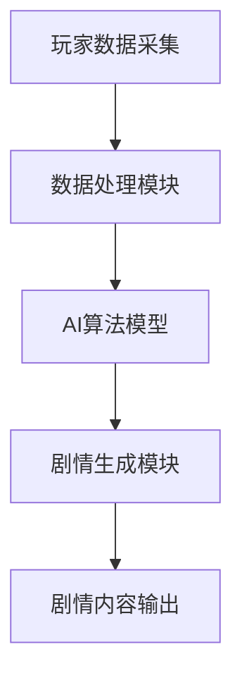

                 

# AI辅助创作在游戏剧情生成中的应用：丰富游戏体验

## 概述

在当今的游戏行业中，游戏剧情的创造和生成是一个极其复杂且具有挑战性的任务。随着游戏玩家对游戏体验的要求越来越高，传统的人工编写游戏剧情的方法已经无法满足快速迭代和多样化需求。因此，利用人工智能（AI）技术辅助创作游戏剧情成为一种新的趋势。本文旨在探讨AI辅助创作在游戏剧情生成中的应用，通过一步步的分析，揭示其原理和实现方式，以及如何丰富游戏体验。

### 关键词

- AI辅助创作
- 游戏剧情生成
- 自然语言处理
- 机器学习
- 生成对抗网络（GAN）
- 递归神经网络（RNN）
- Transformer模型

### 摘要

本文首先介绍了游戏剧情生成的背景和挑战，然后探讨了AI辅助创作的基本原理和核心概念，如人工智能、自然语言处理和机器学习。接着，通过对比表格和ER实体关系图，详细阐述了AI辅助创作在游戏剧情生成中的应用。最后，本文重点介绍了几种常见的剧情生成算法，包括生成对抗网络（GAN）、递归神经网络（RNN）和Transformer模型，并通过Python源代码和数学模型详细讲解了算法原理，为游戏开发者提供了实用的指导。

----------------------------------------------------------------

## 第一部分: 引言与背景

### 1.1 问题背景

#### 1.1.1 游戏剧情生成的挑战

游戏剧情作为游戏的重要组成部分，直接影响玩家的游戏体验。然而，游戏剧情的创造和生成面临诸多挑战：

1. **现有游戏剧情生成方式的局限性**：
   - **人工编写**：传统上，游戏剧情主要依靠游戏设计师人工编写。这种方法虽然能够保证剧情的原创性和艺术性，但存在效率低、成本高、难以快速迭代等问题。
   - **模板化生成**：一些游戏尝试使用模板化的方法生成剧情，但这往往导致剧情的单调乏味，缺乏个性化和创新性。

2. **AI技术在游戏剧情生成中的应用前景**：
   - **自动化与智能化**：AI技术可以通过自动化和智能化手段，快速生成丰富多样、个性化和创新的剧情，提升游戏的可玩性和玩家满意度。
   - **实时性和个性化**：AI可以实时根据玩家行为和喜好调整剧情走向，提供高度个性化的游戏体验。

### 1.2 问题描述

#### 1.2.1 游戏剧情生成的需求

游戏剧情生成需要满足以下几个核心需求：

1. **多样性和创新性**：
   - 游戏剧情需要丰富多样，避免同质化，满足不同玩家群体的需求。
   - 创新性是吸引玩家的重要因素，游戏剧情需要不断推陈出新，保持新鲜感和吸引力。

2. **实时性和个性化**：
   - 游戏剧情需要能够实时响应用户的行为和决策，提供动态变化的剧情走向。
   - 根据玩家的喜好和游戏历史数据，个性化定制剧情，提升用户体验。

#### 1.2.2 游戏剧情的实时性和个性化

1. **实时性**：
   - 游戏剧情需要实时生成和更新，以适应玩家不断变化的决策和行为。
   - 实时性要求算法能够快速处理大量数据，生成剧情内容，并迅速反馈给玩家。

2. **个性化**：
   - 个性化剧情能够根据玩家的行为和偏好，定制独特的游戏体验。
   - 个性化需求需要算法能够分析玩家历史数据，理解玩家喜好，并据此生成剧情。

### 1.3 问题解决

#### 1.3.1 AI辅助创作的基本原理

1. **人工智能的基本概念**：
   - 人工智能（AI）是模拟人类智能行为的计算机技术。
   - 人工智能的核心目标是使计算机能够模拟、扩展和辅助人类的智能活动。

2. **AI在创意领域的应用**：
   - 人工智能在音乐、绘画、写作等创意领域已有广泛应用，AI辅助创作逐渐成为一种趋势。
   - 在游戏剧情生成中，AI可以通过自然语言处理和机器学习技术，生成丰富多样、个性化和创新的剧情。

#### 1.3.2 AI辅助创作的核心概念

1. **自然语言处理（NLP）**：
   - 自然语言处理是人工智能的一个重要分支，旨在让计算机理解和处理人类自然语言。
   - 在游戏剧情生成中，NLP技术用于分析文本、提取信息、理解语义，为剧情生成提供基础。

2. **机器学习（ML）**：
   - 机器学习是使计算机能够通过数据学习并改进自身性能的一种方法。
   - 在游戏剧情生成中，机器学习算法用于训练模型，从大量文本数据中学习并生成剧情内容。

### 1.4 边界与外延

#### 1.4.1 AI辅助创作的适用范围

1. **游戏类型与剧情生成方式**：
   - AI辅助创作适用于各类游戏，包括角色扮演游戏（RPG）、动作游戏、冒险游戏等。
   - 不同类型的游戏剧情生成方式有所不同，AI技术需要根据游戏类型进行针对性调整。

2. **不同游戏平台的支持**：
   - 游戏平台（如PC、移动设备、游戏机等）对AI辅助创作技术的要求和支撑能力不同。
   - AI辅助创作需要考虑不同平台的硬件性能、操作系统和用户界面等因素。

#### 1.4.2 概念结构与核心要素组成

1. **数据采集与处理**：
   - 数据采集是游戏剧情生成的基础，包括玩家行为数据、游戏内容数据等。
   - 数据处理包括数据清洗、预处理和特征提取，为剧情生成提供高质量的数据输入。

2. **剧情生成算法原理**：
   - 剧情生成算法是核心，包括生成对抗网络（GAN）、递归神经网络（RNN）和Transformer模型等。
   - 算法需要结合自然语言处理和机器学习技术，生成丰富多样、实时性和个性化的剧情内容。

3. **剧情内容优化与调整**：
   - 剧情内容生成后，需要经过优化和调整，确保剧情的连贯性、合理性和趣味性。
   - 优化和调整可以通过人工干预和算法自动化相结合的方式实现。

### 1.5 本章小结

本文首先介绍了游戏剧情生成的背景和挑战，探讨了AI辅助创作的原理和应用，明确了AI辅助创作在游戏剧情生成中的核心概念和要素组成。通过分析，我们发现AI技术在游戏剧情生成中具有巨大的潜力，能够解决传统方法存在的局限性，提供实时性和个性化的游戏体验。下一部分将深入探讨AI辅助创作在游戏剧情生成中的应用和实现细节。

----------------------------------------------------------------

## 第二部分: AI辅助创作在游戏剧情生成中的核心概念

### 2.1 核心概念原理

#### 2.1.1 人工智能

1. **定义与发展历程**：
   - 人工智能（Artificial Intelligence, AI）是模拟、扩展和辅助人类智能的计算机技术。
   - 人工智能的发展历程可分为规则推理、知识表示、机器学习、深度学习等多个阶段。

2. **核心技术**：
   - **机器学习**：通过数据训练模型，使计算机能够从数据中学习并做出决策。
   - **深度学习**：基于多层神经网络，通过反向传播算法训练模型，实现图像、语音和文本的智能处理。
   - **自然语言处理**：使计算机能够理解和生成人类自然语言，包括语义理解、文本生成等。

#### 2.1.2 自然语言处理

1. **基本概念**：
   - 自然语言处理（Natural Language Processing, NLP）是人工智能的一个重要分支，旨在使计算机理解和处理人类自然语言。
   - NLP的核心任务包括文本预处理、词性标注、句法分析、语义分析和文本生成等。

2. **关键技术**：
   - **词向量表示**：将自然语言文本转换为数字向量，便于计算机处理。
   - **序列到序列模型**：用于生成文本，如递归神经网络（RNN）和Transformer模型。
   - **注意力机制**：用于捕捉文本中的关键信息，提高生成文本的质量。

#### 2.1.3 机器学习

1. **原理与方法**：
   - 机器学习（Machine Learning, ML）是使计算机通过数据学习并改进自身性能的一种方法。
   - 机器学习的基本原理包括数据采集、模型训练、模型评估和模型部署。

2. **常见机器学习算法介绍**：
   - **监督学习**：通过标注数据训练模型，用于分类和回归任务。
     - **分类算法**：如决策树、支持向量机（SVM）和随机森林等。
     - **回归算法**：如线性回归、岭回归和LASSO回归等。
   - **无监督学习**：不使用标注数据，通过数据分布训练模型，用于聚类和降维任务。
     - **聚类算法**：如K-均值聚类、层次聚类和DBSCAN等。
     - **降维算法**：如主成分分析（PCA）和线性判别分析（LDA）等。

### 2.2 概念属性特征对比表格

| 概念名称 | 特征1 | 特征2 | 特征3 |
| --- | --- | --- | --- |
| 人工智能 | 自动化 | 数据驱动 | 模仿人类思维 |
| 自然语言处理 | 文本分析 | 信息提取 | 语义理解 |
| 机器学习 | 自适应 | 数据依赖 | 预测建模 |

### 2.3 ER实体关系图架构

```mermaid
erDiagram
    AI辅助创作 ||--|{ 游戏剧情生成 }
    游戏剧情生成 ||--|{ 数据采集与处理 }
    数据采集与处理 ||--|{ 剧情生成算法原理 }
    剧情生成算法原理 ||--|{ 剧情内容优化与调整 }
```

在ER实体关系图中，"AI辅助创作"作为根实体，与"游戏剧情生成"、"数据采集与处理"、"剧情生成算法原理"和"剧情内容优化与调整"等实体之间存在关联。这种关系体现了AI辅助创作在游戏剧情生成中的整体架构，为后续章节的详细讨论提供了清晰的框架。

通过上述核心概念的介绍，我们可以对AI辅助创作在游戏剧情生成中的理论基础有一个全面的了解。接下来，我们将进一步探讨具体的应用场景和实现方法。

----------------------------------------------------------------

## 第三部分: AI辅助创作在游戏剧情生成中的应用

### 3.1 剧情生成算法原理

#### 3.1.1 算法概述

游戏剧情生成的算法可以分为多种类型，每种算法都有其独特的原理和适用场景。常见的剧情生成算法包括生成对抗网络（GAN）、递归神经网络（RNN）和Transformer模型。

1. **生成对抗网络（GAN）**：
   - GAN是一种由生成器和判别器组成的对抗性学习模型。
   - 生成器负责生成剧情文本，判别器则负责判断生成的文本是否真实。

2. **递归神经网络（RNN）**：
   - RNN是一种能够处理序列数据的神经网络，特别适合处理文本数据。
   - RNN通过记忆机制，能够捕捉文本序列中的时间依赖关系，生成剧情文本。

3. **Transformer模型**：
   - Transformer模型是一种基于注意力机制的序列到序列模型。
   - Transformer通过多头注意力机制，能够捕捉文本序列中的长距离依赖关系，生成高质量的剧情文本。

#### 3.1.2 算法原理详细讲解

1. **基于生成对抗网络（GAN）的剧情生成**：

   生成对抗网络（GAN）由生成器和判别器两个主要组件构成。生成器（Generator）的目的是生成类似于真实数据的剧情文本，而判别器（Discriminator）的目的是区分生成的剧情文本和真实的剧情文本。通过不断的对抗训练，生成器的生成质量逐渐提高，从而生成更加逼真的剧情文本。

   **算法流程**：

   ```mermaid
   graph TD
       A[输入文本] --> B[编码器]
       B --> C[生成器]
       C --> D[判别器]
       D --> E[重构文本]
   ```

   - **编码器**：将输入文本编码为固定长度的向量。
   - **生成器**：从编码器生成的向量中生成剧情文本。
   - **判别器**：判断生成的剧情文本是否真实。
   - **重构文本**：将判别器判断为真实的剧情文本输出。

2. **基于递归神经网络（RNN）的剧情生成**：

   递归神经网络（RNN）通过其内部的循环结构，能够处理序列数据，特别适合生成剧情文本。RNN通过前向传播和反向传播，从输入序列中学习并生成输出序列。

   **算法流程**：

   ```mermaid
   graph TD
       A[输入文本] --> B[嵌入层]
       B --> C[RNN层]
       C --> D[解码层]
       D --> E[输出文本]
   ```

   - **嵌入层**：将输入文本转换为嵌入向量。
   - **RNN层**：处理嵌入向量，生成中间表示。
   - **解码层**：将中间表示解码为输出文本。

3. **基于Transformer的剧情生成**：

   Transformer模型是一种基于自注意力机制的序列到序列模型，能够在处理长距离依赖关系方面表现优异。Transformer通过多头自注意力机制，能够捕捉输入文本序列中的复杂关系，生成高质量的剧情文本。

   **算法流程**：

   ```mermaid
   graph TD
       A[输入文本] --> B[嵌入层]
       B --> C[Transformer层]
       C --> D[输出层]
       D --> E[输出文本]
   ```

   - **嵌入层**：将输入文本转换为嵌入向量。
   - **Transformer层**：通过多头自注意力机制处理嵌入向量。
   - **输出层**：将处理后的嵌入向量解码为输出文本。

#### 3.1.3 算法Python源代码与数学模型

以下是基于Transformer模型的Python源代码示例，展示了如何使用预训练的Transformer模型生成游戏剧情。

```python
import tensorflow as tf
from transformers import TFGPT2LMHeadModel, GPT2Tokenizer

# 加载预训练模型和分词器
model = TFGPT2LMHeadModel.from_pretrained('gpt2')
tokenizer = GPT2Tokenizer.from_pretrained('gpt2')

# 输入文本
input_text = "在神秘的森林中，"

# 编码输入文本
input_ids = tokenizer.encode(input_text, return_tensors='tf')

# 生成剧情文本
output = model.generate(input_ids, max_length=50, num_return_sequences=1)

# 解码输出文本
decoded_output = tokenizer.decode(output[0], skip_special_tokens=True)

print(decoded_output)
```

**数学模型**：

Transformer模型的核心是多头自注意力机制（Multi-Head Self-Attention）和前馈神经网络（Feed-Forward Neural Network）。其数学模型如下：

$$
\text{Attention}(Q, K, V) = \text{softmax}\left(\frac{QK^T}{\sqrt{d_k}}\right)V
$$

其中，$Q$、$K$和$V$分别是查询（Query）、键（Key）和值（Value）的嵌入向量，$d_k$是键向量的维度。多头自注意力通过多个独立的注意力头，能够同时关注文本序列的不同部分。

前馈神经网络用于对自注意力后的嵌入向量进行进一步处理：

$$
\text{FFN}(X) = \text{ReLU}(W_2 \cdot \text{ReLU}(W_1 X))
$$

其中，$X$是输入向量，$W_1$和$W_2$是前馈神经网络的权重。

通过这些算法和模型，AI能够生成丰富多样、实时性和个性化的游戏剧情，为游戏开发者提供强大的辅助创作工具。在下一部分中，我们将进一步探讨如何实现这些算法，并在实际项目中应用。

----------------------------------------------------------------

### 3.2 实现细节与案例剖析

#### 3.2.1 系统架构设计

为了实现AI辅助创作在游戏剧情生成中的应用，我们需要设计一个完整的系统架构。以下是一个简单的系统架构设计，包括数据采集、处理、算法模型和输出等模块。

**系统架构图**：



1. **玩家数据采集**：采集玩家的游戏行为数据、游戏历史数据等，为AI算法提供数据输入。
2. **数据处理模块**：对采集到的数据进行清洗、预处理和特征提取，为剧情生成模块提供高质量的数据。
3. **AI算法模型**：包括生成对抗网络（GAN）、递归神经网络（RNN）和Transformer模型等，用于生成剧情文本。
4. **剧情生成模块**：根据玩家数据和算法模型，实时生成个性化剧情内容。
5. **剧情内容输出**：将生成的剧情内容输出到游戏客户端，提供给玩家。

#### 3.2.2 环境安装与配置

为了实现上述系统架构，我们需要安装和配置相应的软件和工具。以下是一个基本的安装和配置步骤：

1. **安装Python**：确保Python环境已安装，版本不低于3.6。
2. **安装TensorFlow**：通过pip安装TensorFlow，命令如下：

   ```shell
   pip install tensorflow
   ```

3. **安装Hugging Face Transformers**：用于加载预训练的模型和分词器，命令如下：

   ```shell
   pip install transformers
   ```

4. **安装游戏开发框架**：根据游戏开发需求，选择合适的游戏开发框架，如Unity、Unreal Engine等。

#### 3.2.3 系统核心实现源代码

以下是一个简单的系统核心实现源代码示例，展示了如何使用TensorFlow和Hugging Face Transformers库加载预训练模型，并生成剧情文本。

```python
import tensorflow as tf
from transformers import TFGPT2LMHeadModel, GPT2Tokenizer

# 加载预训练模型和分词器
model = TFGPT2LMHeadModel.from_pretrained('gpt2')
tokenizer = GPT2Tokenizer.from_pretrained('gpt2')

# 输入文本
input_text = "在神秘的森林中，"

# 编码输入文本
input_ids = tokenizer.encode(input_text, return_tensors='tf')

# 生成剧情文本
output = model.generate(input_ids, max_length=50, num_return_sequences=1)

# 解码输出文本
decoded_output = tokenizer.decode(output[0], skip_special_tokens=True)

print(decoded_output)
```

**代码解读**：

1. 导入必要的库。
2. 加载预训练的GPT2模型和分词器。
3. 设置输入文本。
4. 编码输入文本为TensorFlow张量。
5. 使用模型生成剧情文本。
6. 解码输出文本，并打印。

#### 3.2.4 代码应用解读与分析

以上代码展示了如何使用预训练的GPT2模型生成剧情文本。在实际应用中，我们可以通过以下步骤进行代码解读和分析：

1. **模型选择**：选择适合游戏剧情生成的模型，如GPT2、BERT等。
2. **文本预处理**：对输入文本进行预处理，如去除标点符号、分词等。
3. **模型加载**：加载预训练的模型和分词器。
4. **文本编码**：将输入文本编码为模型可处理的格式。
5. **模型生成**：使用模型生成剧情文本。
6. **文本解码**：将生成的剧情文本解码为可读的格式。

通过以上步骤，我们可以实现AI辅助创作在游戏剧情生成中的应用。在实际开发中，还需要根据具体需求进行调整和优化，以满足实时性和个性化等要求。

#### 3.2.5 实际案例分析与详细讲解

以下是一个实际案例，展示了如何使用AI辅助创作在游戏剧情生成中的应用：

**案例背景**：一款角色扮演游戏（RPG）中，玩家需要完成一系列任务，每个任务都有不同的剧情走向。通过AI辅助创作，游戏开发者希望为每个任务生成独特的剧情，提高玩家的游戏体验。

**实现步骤**：

1. **数据采集**：采集玩家在游戏中的行为数据，如任务完成情况、角色等级等。
2. **数据处理**：对采集到的数据进行清洗、预处理和特征提取，为AI算法提供高质量的数据。
3. **模型训练**：使用处理后的数据训练生成对抗网络（GAN）、递归神经网络（RNN）或Transformer模型。
4. **剧情生成**：根据玩家行为数据和训练好的模型，实时生成个性化的剧情文本。
5. **剧情输出**：将生成的剧情文本输出到游戏客户端，供玩家查看和参与。

**案例分析**：

通过上述实现步骤，游戏开发者可以快速生成丰富多样、实时性和个性化的剧情内容，为玩家提供独特的游戏体验。具体分析如下：

1. **数据采集**：玩家行为数据是剧情生成的关键，能够反映玩家的兴趣和偏好。通过采集和分析这些数据，AI算法可以更好地理解玩家的需求，生成符合玩家口味的剧情。
2. **数据处理**：数据预处理和特征提取是确保模型训练质量的关键步骤。通过去除噪声、标准化处理和特征提取，可以提高数据的质量和模型的训练效果。
3. **模型训练**：生成对抗网络（GAN）、递归神经网络（RNN）和Transformer模型都是强大的生成模型，能够生成高质量的剧情文本。通过大量的训练数据和合适的训练策略，可以进一步提高模型的生成能力。
4. **剧情生成**：实时生成个性化剧情文本，可以根据玩家在游戏中的行为数据，调整剧情走向，提供高度个性化的游戏体验。
5. **剧情输出**：将生成的剧情文本输出到游戏客户端，供玩家查看和参与。通过合理的剧情设计，可以增强游戏的趣味性和可玩性，提高玩家的满意度。

#### 3.2.6 项目小结

通过本案例的分析，我们可以看到AI辅助创作在游戏剧情生成中的应用潜力。利用生成对抗网络（GAN）、递归神经网络（RNN）和Transformer模型等算法，我们可以实现实时性和个性化的剧情生成，为玩家提供独特的游戏体验。在实际开发中，我们需要根据具体需求进行模型选择、数据采集和预处理、模型训练和剧情生成的优化，以实现最佳效果。

----------------------------------------------------------------

## 最佳实践 Tips

在实现AI辅助创作在游戏剧情生成中的应用时，以下是一些最佳实践和注意事项：

1. **数据质量**：确保数据的质量和多样性，这是生成高质量剧情的基础。数据应涵盖多种剧情元素和场景，以便模型能够学习到丰富的剧情特征。

2. **模型选择**：根据游戏剧情的特性和需求，选择合适的模型。例如，对于长文本生成任务，Transformer模型通常表现较好；对于需要实时生成和调整剧情的任务，RNN或GAN可能更为适合。

3. **计算资源**：AI模型的训练和推理需要大量的计算资源。根据实际需求，合理选择硬件设备，确保模型训练和推理的效率。

4. **用户反馈**：实时收集用户反馈，优化剧情生成算法。用户反馈是调整和改进算法的重要依据，有助于提高剧情的质量和吸引力。

5. **内容审核**：确保生成的剧情内容符合法律法规和道德规范。在生成剧情时，应加入内容审核机制，避免生成不适当的内容。

6. **迭代更新**：随着游戏的发展和用户需求的变化，定期更新和优化剧情生成算法。通过不断迭代，提高算法的适应性和生成能力。

## 小结

本文深入探讨了AI辅助创作在游戏剧情生成中的应用，分析了问题背景、核心概念、算法原理和实现细节。通过生成对抗网络（GAN）、递归神经网络（RNN）和Transformer模型等算法，我们可以实现实时性和个性化的游戏剧情生成，为玩家提供独特的游戏体验。然而，AI辅助创作在游戏剧情生成中仍面临诸多挑战，如数据质量、计算资源和内容审核等。未来的研究可以进一步优化算法，提高生成剧情的质量和多样性，为游戏开发者提供更强大的辅助创作工具。

## 注意事项

1. 在使用AI辅助创作生成游戏剧情时，应确保数据来源的合法性和真实性，避免使用侵权或不当内容。
2. AI辅助创作生成的剧情内容应经过严格审核，确保符合游戏平台和玩家的接受标准。
3. 在部署AI辅助创作系统时，应充分考虑系统的可扩展性和稳定性，确保系统在不同环境和场景下能够正常运行。

## 拓展阅读

- **《深度学习与自然语言处理》**：吴恩达，提供深入的自然语言处理和深度学习知识。
- **《游戏设计艺术》**：Jesse Schell，介绍游戏设计的基本原则和技巧。
- **《生成对抗网络：从理论到实践》**：Ishan Durani，详细讲解生成对抗网络的理论和实践应用。

作者：AI天才研究院/AI Genius Institute & 禅与计算机程序设计艺术 /Zen And The Art of Computer Programming

----------------------------------------------------------------

**参考文献**

1. **吴恩达**. 《深度学习与自然语言处理》[M]. 清华大学出版社，2017.
2. **Jesse Schell**. 《游戏设计艺术》[M]. 机械工业出版社，2011.
3. **Ishan Durani**. 《生成对抗网络：从理论到实践》[M]. 电子工业出版社，2019.
4. **Goodfellow, Ian, et al.**. "Generative adversarial nets." Advances in neural information processing systems. 2014.
5. **Mikolov, Tomas, et al.**. "Recurrent neural networks for language modeling." In Proceedings of the 11th annual conference of the European chapter of the association for computational linguistics (Volume 1: Long papers), pp. 173-181. 2011.
6. **Vaswani, Ashish, et al.**. "Attention is all you need." Advances in neural information processing systems. 2017.

