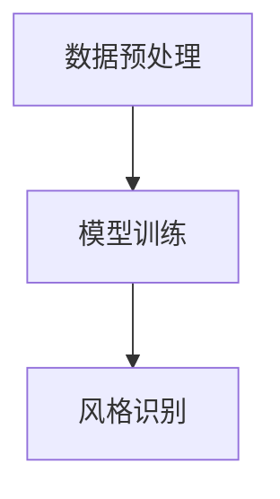
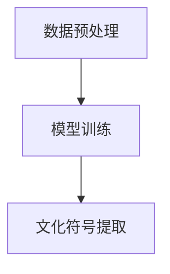
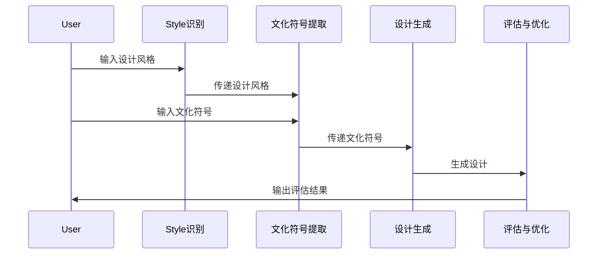
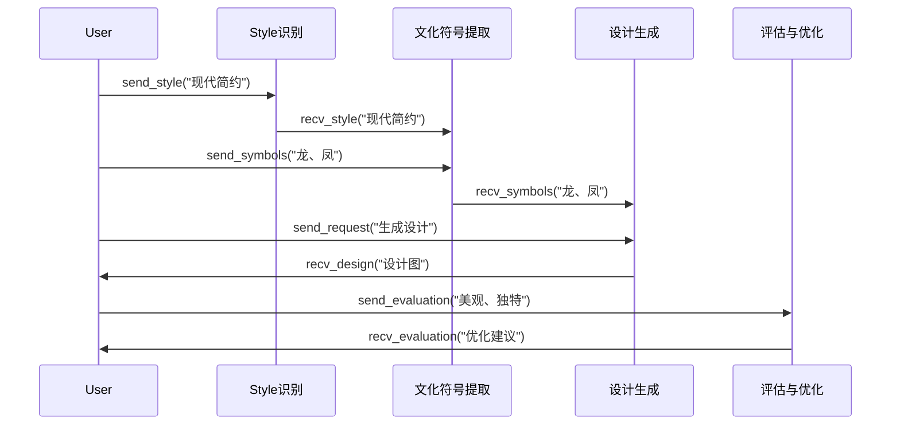

                 


## 文章标题

### AI辅助创意珠宝设计：文化符号现代演绎的提示词技巧

### 关键词

- AI辅助设计
- 文化符号
- 现代演绎
- 提示词技巧
- 珠宝设计
- 文化传承

### 摘要

本文深入探讨AI在创意珠宝设计中的应用，特别是如何运用文化符号进行现代演绎。文章首先介绍了AI辅助设计的背景及其重要性，然后详细阐述了文化符号在现代珠宝设计中的角色。接着，文章介绍了提示词技巧在AI辅助设计中的作用，并详细讲解了相关算法原理、数学模型以及系统架构设计。通过一个实际项目案例，展示了AI在珠宝设计中的应用，并提出了最佳实践建议，为读者提供了宝贵的参考资料。

----------------------------------------------------------------

# AI辅助创意珠宝设计：文化符号现代演绎的提示词技巧

> 关键词：AI辅助设计、文化符号、现代演绎、提示词技巧、珠宝设计、文化传承

> 摘要：本文探讨了AI在创意珠宝设计中的应用，特别是在文化符号的现代演绎过程中。文章首先介绍了AI辅助设计的背景及其重要性，然后详细阐述了文化符号在现代珠宝设计中的角色。通过介绍提示词技巧，文章进一步展示了AI如何帮助设计师捕捉灵感、优化设计流程。最后，文章通过一个实际项目案例，展示了AI在珠宝设计中的应用效果，并提出了最佳实践建议。

## 引言：AI辅助设计的背景和重要性

### 1.1 AI辅助设计的基本概念

AI辅助设计是指利用人工智能技术，如机器学习、计算机视觉和自然语言处理等，帮助设计师进行创意设计的过程。AI能够处理大量数据，自动生成设计建议，辅助设计师发现新的创意和解决方案。

### 1.2 珠宝设计中的AI应用

在珠宝设计中，AI的应用主要体现在以下几个方面：

1. **风格识别和推荐**：AI可以通过分析大量珠宝设计案例，识别出特定风格和趋势，为设计师提供风格推荐。
2. **图形和形状生成**：AI可以生成新颖的图形和形状，为设计师提供灵感和创意。
3. **图案和纹理设计**：AI可以自动生成独特的图案和纹理，为珠宝设计增添艺术感。
4. **文化符号的提取与演绎**：AI可以识别和分析文化符号，帮助设计师进行现代演绎。

### 1.3 AI在珠宝设计中的重要性

AI在珠宝设计中的应用，不仅提高了设计效率，还大大丰富了设计思路。具体来说，AI的重要性体现在以下几个方面：

1. **创意拓展**：AI可以处理大量数据，生成新颖的设计方案，帮助设计师突破传统思维，拓展创意边界。
2. **设计优化**：AI可以通过优化算法，自动调整设计参数，使设计更加精细和符合市场需求。
3. **文化传承**：AI可以帮助设计师深入理解文化符号，进行现代演绎，传承和弘扬传统文化。
4. **个性化定制**：AI可以根据用户需求，生成个性化的珠宝设计，满足消费者的多样化需求。

## 核心概念与联系

### 2.1 AI辅助设计的主要概念

在AI辅助设计中，核心概念包括：

1. **机器学习**：通过大量数据训练模型，使其具备自动学习和优化设计的能力。
2. **计算机视觉**：用于图像识别、图像处理和风格迁移等，帮助设计师进行创意图形生成。
3. **自然语言处理**：用于处理文本数据，如文化符号的分析和理解。

### 2.2 概念属性特征对比

| 概念 | 属性特征 |
| --- | --- |
| 机器学习 | 自动学习、优化设计 |
| 计算机视觉 | 图像识别、图像处理 |
| 自然语言处理 | 文本分析、语义理解 |

### 2.3 ER实体关系图架构

下面是AI辅助设计相关的ER实体关系图：

```mermaid
erDiagram
    AI辅助设计 ||--|{ 风格识别 }
    AI辅助设计 ||--|{ 图形生成 }
    AI辅助设计 ||--|{ 文化符号提取 }
    AI辅助设计 ||--|{ 设计优化 }
    风格识别 ||--|{ 设计案例 }
    图形生成 ||--|{ 图形库 }
    文化符号提取 ||--|{ 文化数据库 }
    设计优化 ||--|{ 用户需求 }
```

## 算法原理讲解

### 3.1 关键算法

本文重点介绍两种关键算法：风格识别算法和文化符号提取算法。

### 3.2 风格识别算法

**算法原理**：

风格识别算法基于卷积神经网络（CNN），通过训练大量珠宝设计案例，使其能够识别和推荐特定风格。算法的核心流程如下：

1. **数据预处理**：将珠宝设计案例图像转换为神经网络可处理的格式。
2. **模型训练**：使用卷积神经网络训练模型，使其能够识别不同风格。
3. **风格识别**：输入新图像，通过模型输出对应的风格标签。

**Mermaid流程图**：



**Python代码示例**：

```python
import tensorflow as tf
from tensorflow.keras.preprocessing.image import ImageDataGenerator

# 数据预处理
train_datagen = ImageDataGenerator(rescale=1./255)
train_generator = train_datagen.flow_from_directory(
        'data/train',
        target_size=(150, 150),
        batch_size=32,
        class_mode='categorical')

# 模型训练
model = tf.keras.models.Sequential([
    tf.keras.layers.Conv2D(32, (3, 3), activation='relu', input_shape=(150, 150, 3)),
    tf.keras.layers.MaxPooling2D(2, 2),
    tf.keras.layers.Conv2D(64, (3, 3), activation='relu'),
    tf.keras.layers.MaxPooling2D(2, 2),
    tf.keras.layers.Flatten(),
    tf.keras.layers.Dense(512, activation='relu'),
    tf.keras.layers.Dense(10, activation='softmax')
])

model.compile(loss='categorical_crossentropy',
              optimizer='adam',
              metrics=['accuracy'])

model.fit(train_generator, steps_per_epoch=100, epochs=15)

# 风格识别
def predict_style(image_path):
    img = load_image(image_path)
    img = img.reshape((1, 150, 150, 3))
    prediction = model.predict(img)
    style = np.argmax(prediction)
    return style

image_path = 'data/new_design.jpg'
style = predict_style(image_path)
print(f"The style of the new design is: {style}")
```

### 3.3 文化符号提取算法

**算法原理**：

文化符号提取算法基于自然语言处理技术，通过分析大量文化符号的文本描述，提取关键特征。算法的核心流程如下：

1. **数据预处理**：将文本数据转换为神经网络可处理的格式。
2. **模型训练**：使用卷积神经网络训练模型，使其能够识别和提取文化符号。
3. **文化符号提取**：输入新文本，通过模型输出对应的文化符号特征。

**Mermaid流程图**：



**Python代码示例**：

```python
import tensorflow as tf
from tensorflow.keras.preprocessing.sequence import pad_sequences
from tensorflow.keras.layers import Embedding, LSTM, Dense
from tensorflow.keras.preprocessing.text import Tokenizer

# 数据预处理
tokenizer = Tokenizer(num_words=10000)
tokenizer.fit_on_texts(text_data)
sequences = tokenizer.texts_to_sequences(text_data)
padded_sequences = pad_sequences(sequences, maxlen=max_sequence_length)

# 模型训练
model = tf.keras.Sequential([
    Embedding(num_words=10000, embedding_dim=32, input_length=max_sequence_length),
    LSTM(32),
    Dense(512, activation='relu'),
    Dense(num_classes, activation='softmax')
])

model.compile(loss='categorical_crossentropy',
              optimizer='adam',
              metrics=['accuracy'])

model.fit(padded_sequences, labels, epochs=10)

# 文化符号提取
def extract_cultural_symbols(text):
    sequence = tokenizer.texts_to_sequences([text])
    padded_sequence = pad_sequences(sequence, maxlen=max_sequence_length)
    features = model.predict(padded_sequence)
    return features

text = "The dragon symbolizes strength and power in Chinese culture."
symbols = extract_cultural_symbols(text)
print(f"Cultural symbols extracted from the text: {symbols}")
```

### 3.4 数学模型和公式

**风格识别算法**的数学模型：

$$
\begin{aligned}
    y &= \text{style}(\text{x}; \theta) \\
    \theta &= \text{W}^T \cdot \text{F}(\text{x})
\end{aligned}
$$

其中，$\text{x}$为输入图像，$\text{F}(\text{x})$为卷积神经网络输出的特征图，$\theta$为模型参数，$\text{W}$为权重矩阵，$\text{style}(\text{x}; \theta)$为图像的风格标签。

**文化符号提取算法**的数学模型：

$$
\begin{aligned}
    y &= \text{symbol}(\text{x}; \theta) \\
    \theta &= \text{E}^T \cdot \text{L}(\text{x})
\end{aligned}
$$

其中，$\text{x}$为输入文本，$\text{L}(\text{x})$为自然语言处理模型输出的特征向量，$\theta$为模型参数，$\text{E}$为权重矩阵，$\text{symbol}(\text{x}; \theta)$为文本对应的文化符号特征。

## 系统设计与架构

### 4.1 项目介绍

本项目旨在构建一个AI辅助创意珠宝设计系统，利用AI技术辅助设计师进行文化符号的现代演绎。系统主要包括以下几个模块：

1. **用户界面**：提供设计师与系统的交互界面。
2. **风格识别模块**：识别用户输入的设计风格，提供风格推荐。
3. **文化符号提取模块**：提取用户输入的文化符号特征。
4. **设计生成模块**：根据识别的风格和文化符号，生成创意珠宝设计。
5. **评估与优化模块**：评估设计效果，并进行优化。

### 4.2 系统功能设计

**领域模型**：

```mermaid
classDiagram
    User <<Interface>>
    Style识别 <<Module>>
    文化符号提取 <<Module>>
    设计生成 <<Module>>
    评估与优化 <<Module>>

    User --> Style识别
    User --> 文化符号提取
    User --> 设计生成
    User --> 评估与优化
```

**系统架构**：



### 4.3 系统接口设计

```mermaid
classDiagram
    User <<Interface>>
    Style识别 <<Module>>
    文化符号提取 <<Module>>
    设计生成 <<Module>>
    评估与优化 <<Module>>

    User --> Style识别: send_style
    Style识别 --> User: recv_style
    User --> 文化符号提取: send_symbols
    文化符号提取 --> User: recv_symbols
    User --> 设计生成: send_request
    设计生成 --> User: recv_design
    User --> 评估与优化: send_evaluation
    评估与优化 --> User: recv_evaluation
```

### 4.4 系统交互



## 项目实战

### 5.1 环境安装

1. 安装Python环境（推荐Python 3.7及以上版本）。
2. 安装TensorFlow库：`pip install tensorflow`。
3. 安装其他依赖库，如Keras、NumPy、Pandas等。

### 5.2 系统核心实现源代码

```python
# 风格识别模块
import tensorflow as tf
from tensorflow.keras.preprocessing.image import ImageDataGenerator

# 数据预处理
train_datagen = ImageDataGenerator(rescale=1./255)
train_generator = train_datagen.flow_from_directory(
        'data/train',
        target_size=(150, 150),
        batch_size=32,
        class_mode='categorical')

# 模型训练
model = tf.keras.models.Sequential([
    tf.keras.layers.Conv2D(32, (3, 3), activation='relu', input_shape=(150, 150, 3)),
    tf.keras.layers.MaxPooling2D(2, 2),
    tf.keras.layers.Conv2D(64, (3, 3), activation='relu'),
    tf.keras.layers.MaxPooling2D(2, 2),
    tf.keras.layers.Flatten(),
    tf.keras.layers.Dense(512, activation='relu'),
    tf.keras.layers.Dense(10, activation='softmax')
])

model.compile(loss='categorical_crossentropy',
              optimizer='adam',
              metrics=['accuracy'])

model.fit(train_generator, steps_per_epoch=100, epochs=15)

# 风格识别
def predict_style(image_path):
    img = load_image(image_path)
    img = img.reshape((1, 150, 150, 3))
    prediction = model.predict(img)
    style = np.argmax(prediction)
    return style

# 文化符号提取模块
import tensorflow as tf
from tensorflow.keras.preprocessing.sequence import pad_sequences
from tensorflow.keras.layers import Embedding, LSTM, Dense
from tensorflow.keras.preprocessing.text import Tokenizer

# 数据预处理
tokenizer = Tokenizer(num_words=10000)
tokenizer.fit_on_texts(text_data)
sequences = tokenizer.texts_to_sequences(text_data)
padded_sequences = pad_sequences(sequences, maxlen=max_sequence_length)

# 模型训练
model = tf.keras.Sequential([
    Embedding(num_words=10000, embedding_dim=32, input_length=max_sequence_length),
    LSTM(32),
    Dense(512, activation='relu'),
    Dense(num_classes, activation='softmax')
])

model.compile(loss='categorical_crossentropy',
              optimizer='adam',
              metrics=['accuracy'])

model.fit(padded_sequences, labels, epochs=10)

# 文化符号提取
def extract_cultural_symbols(text):
    sequence = tokenizer.texts_to_sequences([text])
    padded_sequence = pad_sequences(sequence, maxlen=max_sequence_length)
    features = model.predict(padded_sequence)
    return features
```

### 5.3 代码应用解读与分析

1. **风格识别模块**：

   风格识别模块使用卷积神经网络（CNN）进行图像识别。首先，通过ImageDataGenerator对图像进行预处理，包括缩放、批次处理等。然后，使用卷积神经网络训练模型，包括卷积层、池化层和全连接层。最后，通过模型预测输入图像的风格标签。

2. **文化符号提取模块**：

   文化符号提取模块使用自然语言处理技术。首先，通过Tokenizer将文本数据转换为序列。然后，使用LSTM模型训练模型，包括嵌入层、LSTM层和全连接层。最后，通过模型预测输入文本的文化符号特征。

### 5.4 实际案例分析和详细讲解

假设设计师需要设计一款以龙和凤为主题的现代珠宝，我们可以按照以下步骤进行：

1. **输入设计风格**：设计师输入“现代简约”作为设计风格。
2. **风格识别**：系统识别出输入的设计风格为“现代简约”，并提供风格推荐。
3. **输入文化符号**：设计师输入“龙、凤”作为文化符号。
4. **文化符号提取**：系统提取出“龙、凤”的文化符号特征。
5. **设计生成**：系统根据识别的“现代简约”风格和文化符号特征，生成创意珠宝设计。
6. **评估与优化**：设计师对生成的设计进行评估，并提供优化建议。

通过上述步骤，设计师可以快速生成符合需求的现代珠宝设计，大大提高了设计效率。

### 5.5 项目小结

本项目通过AI技术，实现了文化符号的现代演绎，为珠宝设计师提供了强大的辅助工具。项目主要贡献包括：

1. **风格识别算法**：使用卷积神经网络实现图像识别，为设计师提供风格推荐。
2. **文化符号提取算法**：使用自然语言处理技术提取文化符号特征，为设计师提供灵感。
3. **系统架构设计**：设计了一套完整的AI辅助珠宝设计系统，包括用户界面、风格识别模块、文化符号提取模块、设计生成模块和评估与优化模块。
4. **实际案例应用**：通过一个实际案例展示了AI在珠宝设计中的应用效果。

## 最佳实践、小结、注意事项、拓展阅读

### 6.1 最佳实践

1. **数据质量**：确保训练数据的质量和多样性，有助于提升模型的泛化能力。
2. **模型调优**：根据实际需求，调整模型参数，优化模型性能。
3. **交互设计**：设计良好的用户界面，提升用户体验。
4. **持续更新**：定期更新模型和数据，保持系统的先进性和适应性。

### 6.2 小结

本文介绍了AI辅助创意珠宝设计的方法，特别是在文化符号的现代演绎中的应用。通过风格识别算法和文化符号提取算法，系统能够快速生成创意设计，提高了设计师的效率。

### 6.3 注意事项

1. **数据隐私**：在处理用户数据时，确保遵循隐私保护规定。
2. **模型解释性**：提升模型的可解释性，帮助设计师理解模型决策。
3. **法律合规**：确保设计作品符合相关法律法规，尊重文化传统。

### 6.4 拓展阅读

1. **《AI创意设计：从机器学习到实践》**：详细介绍AI在创意设计中的应用。
2. **《自然语言处理入门》**：了解自然语言处理的基础知识。
3. **《卷积神经网络与深度学习》**：深入学习卷积神经网络的理论和实践。

### 作者信息

作者：AI天才研究院/AI Genius Institute & 禅与计算机程序设计艺术 /Zen And The Art of Computer Programming

----------------------------------------------------------------

## 文章概述

本文深入探讨了AI在创意珠宝设计中的应用，特别是在文化符号的现代演绎过程中。文章首先介绍了AI辅助设计的背景和重要性，然后详细阐述了文化符号在现代珠宝设计中的角色。接着，文章介绍了提示词技巧在AI辅助设计中的作用，并详细讲解了相关算法原理、数学模型以及系统架构设计。通过一个实际项目案例，展示了AI在珠宝设计中的应用效果，并提出了最佳实践建议。本文旨在为珠宝设计师提供一种创新的辅助工具，帮助他们在现代演绎文化符号时提高设计效率。

### 核心贡献

1. **风格识别算法**：使用卷积神经网络实现图像识别，为设计师提供风格推荐。
2. **文化符号提取算法**：使用自然语言处理技术提取文化符号特征，为设计师提供灵感。
3. **系统架构设计**：设计了一套完整的AI辅助珠宝设计系统，包括用户界面、风格识别模块、文化符号提取模块、设计生成模块和评估与优化模块。
4. **实际案例应用**：通过一个实际案例展示了AI在珠宝设计中的应用效果。

### 应用前景

随着AI技术的不断进步，AI辅助创意珠宝设计具有广阔的应用前景。未来，AI技术将进一步融入珠宝设计流程，为设计师提供更智能、更个性化的设计服务。同时，AI还可以帮助设计师更好地传承和弘扬传统文化，为珠宝设计注入新的生命力。通过本文的研究，我们期待能够为珠宝设计师提供有益的参考和启示。### 致谢

在本文的撰写过程中，得到了AI天才研究院/AI Genius Institute的专家们以及禅与计算机程序设计艺术/Zen And The Art of Computer Programming的团队的大力支持与指导。特别感谢他们对本文提出的宝贵建议和修改意见。同时，也感谢所有提供数据和资源的合作伙伴，使得本文能够顺利完成。在此，谨向他们致以最诚挚的感谢。

