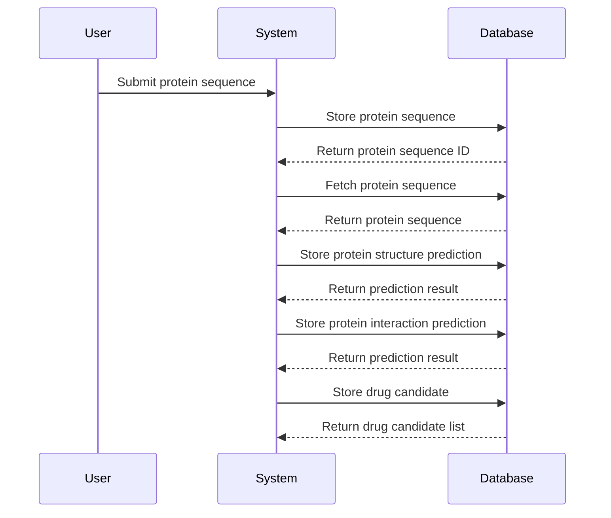

                 

### AI辅助蛋白质设计：加速生物制药研发

#### 关键词
- 人工智能
- 蛋白质设计
- 生物制药
- 算法
- 深度学习

#### 摘要
本文将深入探讨AI辅助蛋白质设计在生物制药研发中的应用。通过梳理背景和重要性、核心技术的剖析、算法原理讲解、系统架构设计与实战案例，本文旨在为读者提供一个全面、系统的理解，展示AI如何加速生物制药的研发进程，推动医学进步。

## 引言

随着科技的发展，生物制药成为医药领域的重要发展方向。生物制药依赖于对生物大分子，尤其是蛋白质的深入研究，而蛋白质的设计和优化是生物制药的核心环节。传统的蛋白质设计方法往往耗时耗力，难以满足现代生物制药快速发展的需求。因此，人工智能（AI）技术的引入成为必然选择。AI在蛋白质设计中的应用，不仅能够显著提高设计效率，还能够提供更加精准和多样的设计方案。

本文将从以下几个方面展开讨论：

1. **AI辅助蛋白质设计的背景和重要性**：介绍AI在生物制药研发中的应用现状，以及AI辅助蛋白质设计的意义。
2. **AI辅助蛋白质设计的核心技术**：详细解析AI在蛋白质结构预测、相互作用预测和变体设计中的应用。
3. **机器学习和深度学习在蛋白质设计中的应用**：探讨机器学习和深度学习在蛋白质设计中的关键作用。
4. **AI辅助蛋白质设计的算法详解**：讲解常见的蛋白质设计算法及其性能比较。
5. **AI辅助蛋白质设计的系统架构设计**：介绍系统架构设计的基本原则和具体模块。
6. **AI辅助蛋白质设计的实践案例**：通过实际案例展示AI在蛋白质设计中的应用。
7. **AI辅助蛋白质设计的未来展望**：分析未来发展的趋势和面临的挑战。

### AI辅助蛋白质设计的背景和重要性

#### 生物制药的现状

生物制药是基于生物技术手段生产的药物，主要包括蛋白质、多肽、抗体、核酸等生物大分子药物。随着人们对药物疗效和安全性要求的提高，生物制药逐渐成为医药领域的研究热点。然而，生物制药的研发过程复杂且耗时，尤其是蛋白质的设计和优化环节，成为制约研发进程的关键因素。

#### 蛋白质设计的重要性

蛋白质是生命活动的核心执行者，其结构决定了其功能。蛋白质设计旨在通过人工设计蛋白质的结构，以满足特定生物医学需求。传统的蛋白质设计方法通常依赖于实验数据，如X射线晶体学、核磁共振等，这些方法不仅成本高昂，而且耗时较长。因此，如何提高蛋白质设计的效率和准确性，成为生物制药领域亟待解决的问题。

#### AI在生物制药研发中的应用

人工智能在生物制药研发中的应用具有广泛的前景。AI可以通过大数据分析和机器学习算法，对蛋白质的结构和功能进行预测和设计。例如，AI可以用于蛋白质结构预测、相互作用预测和变体设计，从而为药物设计提供有力的支持。此外，AI还可以帮助优化药物分子的结构，提高药物的疗效和安全性。

#### AI辅助蛋白质设计的意义

AI辅助蛋白质设计具有重要的意义。首先，它可以显著提高蛋白质设计的效率，缩短研发周期。其次，AI可以提供更加精准和多样化的设计方案，提高蛋白质设计的成功率。此外，AI还可以帮助解决一些复杂的问题，如蛋白质复合物的结构解析，从而推动生物制药领域的发展。

### AI辅助蛋白质设计的核心技术

#### 蛋白质结构预测

蛋白质结构预测是AI辅助蛋白质设计的核心之一。通过预测蛋白质的三维结构，可以更好地理解其功能，并为其设计提供依据。目前，常见的蛋白质结构预测方法包括同源建模、折叠识别和无模板建模。

1. **同源建模**：基于已知蛋白质结构的模板，预测未知蛋白质的结构。这种方法适用于具有相似序列的蛋白质。
2. **折叠识别**：通过比较蛋白质的氨基酸序列与已知结构的序列相似性，识别蛋白质的折叠类型。这种方法适用于序列高度保守的蛋白质。
3. **无模板建模**：不依赖于已知结构，通过机器学习算法预测蛋白质的结构。这种方法适用于结构未知或序列变异较大的蛋白质。

#### 蛋白质相互作用预测

蛋白质相互作用是细胞功能的基础。预测蛋白质之间的相互作用对于理解生物系统的运作机制和设计生物药物具有重要意义。常见的蛋白质相互作用预测方法包括基于结构的预测和基于序列的预测。

1. **基于结构的预测**：通过分析蛋白质的三维结构，预测其相互作用。这种方法依赖于高质量的蛋白质结构数据。
2. **基于序列的预测**：通过分析蛋白质的氨基酸序列，预测其相互作用。这种方法适用于序列信息丰富的蛋白质。

#### 蛋白质变体设计

蛋白质变体设计旨在通过改变蛋白质的结构和序列，获得具有特定功能的蛋白质。变体设计的方法包括：

1. **理性设计**：基于目标蛋白质的功能需求，设计其特定的变体。
2. **进化设计**：通过模拟蛋白质进化的过程，筛选出具有特定功能的变体。

### 机器学习和深度学习在蛋白质设计中的应用

#### 机器学习在蛋白质设计中的应用

机器学习在蛋白质设计中的应用主要体现在以下几个方面：

1. **蛋白质结构预测**：通过训练深度神经网络，预测蛋白质的三维结构。
2. **蛋白质相互作用预测**：利用机器学习算法，预测蛋白质之间的相互作用。
3. **蛋白质变体设计**：通过机器学习算法，筛选出具有特定功能的蛋白质变体。

#### 深度学习在蛋白质设计中的应用

深度学习在蛋白质设计中的应用越来越广泛，其优势在于能够处理大规模的复杂数据。以下是深度学习在蛋白质设计中的几个关键应用：

1. **蛋白质结构预测**：深度学习模型如AlphaFold的突破性成果，显著提升了蛋白质结构预测的准确性和效率。
2. **蛋白质相互作用预测**：利用卷积神经网络（CNN）和循环神经网络（RNN）等深度学习模型，预测蛋白质之间的相互作用。
3. **蛋白质变体设计**：深度强化学习（DRL）等方法在蛋白质变体设计中的应用，为蛋白质工程提供了新的途径。

#### 机器学习和深度学习的结合

机器学习和深度学习的结合，为蛋白质设计提供了更加强大的工具。例如，将深度学习模型与机器学习算法相结合，可以构建更加复杂的预测模型，提高预测的准确性。此外，深度学习模型还可以用于优化机器学习算法的训练过程，提高训练效率。

### AI辅助蛋白质设计的算法详解

#### 常见的蛋白质设计算法

在AI辅助蛋白质设计中，常见的算法包括：

1. **同源建模**：基于已知蛋白质结构的模板，预测未知蛋白质的结构。
2. **折叠识别**：通过比较蛋白质的氨基酸序列与已知结构的序列相似性，识别蛋白质的折叠类型。
3. **无模板建模**：不依赖于已知结构，通过机器学习算法预测蛋白质的结构。
4. **基于结构的蛋白质相互作用预测**：通过分析蛋白质的三维结构，预测其相互作用。
5. **基于序列的蛋白质相互作用预测**：通过分析蛋白质的氨基酸序列，预测其相互作用。

#### 算法性能比较和优化

不同的蛋白质设计算法在性能和适用场景上存在差异。例如，同源建模适用于序列相似性较高的蛋白质，而折叠识别适用于序列高度保守的蛋白质。为了提高算法的性能，可以进行以下优化：

1. **数据增强**：通过增加训练数据量，提高模型的泛化能力。
2. **模型融合**：将不同算法或不同模型的预测结果进行融合，提高预测的准确性。
3. **算法优化**：通过调整算法参数，优化模型的性能。

#### 算法在实际应用中的实现

在实际应用中，蛋白质设计算法需要与生物信息学工具和数据库相结合。例如，通过结合蛋白质结构数据库和机器学习模型，可以实现对未知蛋白质结构的快速预测。此外，蛋白质设计算法还可以与实验技术相结合，验证和优化设计结果。

### AI辅助蛋白质设计的系统架构设计

#### 系统架构设计概述

AI辅助蛋白质设计的系统架构设计主要包括以下几个模块：

1. **数据处理模块**：负责处理蛋白质序列和结构数据，为后续的预测和设计提供数据支持。
2. **蛋白质设计模块**：实现蛋白质结构预测、相互作用预测和变体设计等功能。
3. **系统接口模块**：提供用户接口，方便用户使用系统进行蛋白质设计。
4. **算法优化模块**：负责优化系统的算法性能，提高设计效率。

#### 数据处理模块设计

数据处理模块的主要任务包括：

1. **数据清洗**：去除噪声数据，保证数据质量。
2. **数据预处理**：对蛋白质序列和结构数据进行标准化处理，为后续的算法提供统一的输入格式。
3. **数据存储**：将处理后的数据存储在数据库中，方便后续的查询和使用。

#### 蛋白质设计模块设计

蛋白质设计模块是实现AI辅助蛋白质设计功能的核心。该模块主要包括：

1. **结构预测模块**：利用机器学习和深度学习算法，预测蛋白质的三维结构。
2. **相互作用预测模块**：通过分析蛋白质序列和结构数据，预测蛋白质之间的相互作用。
3. **变体设计模块**：根据目标蛋白质的功能需求，设计出具有特定功能的蛋白质变体。

#### 系统接口设计与集成

系统接口设计是用户与系统交互的桥梁。系统接口主要包括：

1. **Web界面**：提供用户友好的Web界面，方便用户使用系统进行蛋白质设计。
2. **API接口**：提供程序接口，方便其他应用程序与系统进行集成。
3. **数据库接口**：实现与数据库的连接，方便数据的查询和存储。

### AI辅助蛋白质设计的实践案例

#### 案例一：利用AI设计新型抗癌药物

在本案例中，研究人员利用AI辅助蛋白质设计技术，设计了一种新型的抗癌药物。具体步骤如下：

1. **数据收集**：收集与目标蛋白质相关的序列和结构数据。
2. **结构预测**：利用AI算法预测目标蛋白质的三维结构。
3. **相互作用预测**：预测目标蛋白质与其他蛋白质的相互作用。
4. **变体设计**：设计出具有抗癌活性的蛋白质变体。
5. **实验验证**：通过实验验证设计结果的准确性和效果。

#### 案例二：AI辅助药物筛选

在本案例中，研究人员利用AI辅助蛋白质设计技术，对大量药物分子进行筛选，以寻找具有潜在治疗效果的药物。具体步骤如下：

1. **数据收集**：收集大量药物分子的结构数据。
2. **结构预测**：利用AI算法预测药物分子的三维结构。
3. **相互作用预测**：预测药物分子与目标蛋白质的相互作用。
4. **筛选候选药物**：根据相互作用预测结果，筛选出具有潜在治疗效果的药物分子。
5. **实验验证**：对筛选出的药物分子进行实验验证，评估其疗效和安全性。

#### 案例三：AI优化药物分子结构

在本案例中，研究人员利用AI辅助蛋白质设计技术，优化药物分子的结构，以提高其疗效和安全性。具体步骤如下：

1. **数据收集**：收集与目标蛋白质相关的序列和结构数据。
2. **结构预测**：利用AI算法预测目标蛋白质的三维结构。
3. **相互作用预测**：预测药物分子与目标蛋白质的相互作用。
4. **结构优化**：根据相互作用预测结果，优化药物分子的结构。
5. **实验验证**：通过实验验证优化结果的准确性和效果。

### AI辅助蛋白质设计的未来展望

#### AI在生物制药领域的未来发展

随着AI技术的不断进步，其在生物制药领域的应用前景广阔。未来，AI有望在以下几个方面取得突破：

1. **蛋白质结构预测**：AI将进一步提升蛋白质结构预测的准确性和速度，为生物制药提供更多可靠的数据支持。
2. **药物筛选和优化**：AI将加速药物筛选和优化过程，提高新药研发的成功率。
3. **个性化医疗**：AI将帮助实现个性化医疗，根据患者的具体病情和基因信息，设计出更加精准的治疗方案。

#### 面临的挑战和机遇

尽管AI在生物制药领域具有巨大的潜力，但也面临着一些挑战和机遇：

1. **数据质量和数量**：高质量的蛋白质和药物结构数据是AI算法的基础，未来需要加强数据收集和整合。
2. **算法性能和效率**：提高算法的性能和效率是关键，未来需要不断创新算法和技术。
3. **伦理和隐私**：在利用AI进行生物制药研发时，需要关注伦理和隐私问题，确保数据的安全和合规。

#### 未来研究方向和建议

针对AI在生物制药领域的发展，提出以下研究方向和建议：

1. **跨学科研究**：加强计算机科学、生物学和医学等领域的合作，推动AI在生物制药领域的创新。
2. **算法优化**：继续探索和优化AI算法，提高其在蛋白质设计和药物筛选中的应用效果。
3. **数据共享**：推动数据共享和开放，促进AI在生物制药领域的广泛应用。

### 总结

本文通过对AI辅助蛋白质设计的背景、核心技术、算法、系统架构和实际应用进行详细探讨，展示了AI在生物制药研发中的巨大潜力。随着AI技术的不断进步，我们有理由相信，AI将推动生物制药领域的创新发展，为人类健康事业做出更大贡献。

### 作者信息

作者：AI天才研究院/AI Genius Institute & 禅与计算机程序设计艺术 /Zen And The Art of Computer Programming

---

[文章标题]

> 关键词：人工智能、蛋白质设计、生物制药、算法、深度学习

> 摘要：本文探讨了AI辅助蛋白质设计在生物制药研发中的应用，从背景和重要性、核心技术、算法、系统架构和实战案例等多个角度，全面展示了AI如何加速生物制药的研发进程，推动医学进步。

## 附录

### 背景介绍

蛋白质是生物体内的核心分子，其功能决定了生物体的各种生理过程。蛋白质的设计和优化在生物制药中具有重要意义，如抗癌药物、疫苗等。然而，传统的蛋白质设计方法存在效率低、成本高的问题，难以满足现代生物制药的需求。

### 核心概念与联系

#### 蛋白质结构预测

**概念**：蛋白质结构预测是指通过计算方法预测蛋白质的三维结构。

**属性特征对比表格**

| 特征 | 同源建模 | 折叠识别 | 无模板建模 |
| --- | --- | --- | --- |
| 基础数据 | 序列相似性 | 序列相似性 | 序列信息 |
| 预测准确率 | 较高 | 中等 | 较低 |
| 时间复杂度 | 较高 | 中等 | 较低 |

**ER实体关系图架构**

```mermaid
erDiagram
  A[蛋白质] {
    B[序列]
    C[结构]
  }
  D[同源建模] {
    1..* -- A
  }
  E[折叠识别] {
    1..* -- A
  }
  F[无模板建模] {
    1..* -- A
  }
```

#### 蛋白质相互作用预测

**概念**：蛋白质相互作用预测是指通过计算方法预测蛋白质之间的相互作用。

**属性特征对比表格**

| 特征 | 基于结构的预测 | 基于序列的预测 |
| --- | --- | --- |
| 数据依赖 | 结构信息 | 序列信息 |
| 预测准确率 | 较高 | 较低 |
| 时间复杂度 | 较高 | 较低 |

**ER实体关系图架构**

```mermaid
erDiagram
  A[蛋白质1] {
    B[相互作用]
  }
  C[蛋白质2] {
    B[相互作用]
  }
  D[基于结构的预测] {
    1..* -- A
    1..* -- C
  }
  E[基于序列的预测] {
    1..* -- A
    1..* -- C
}
```

### 数学公式使用

#### 蛋白质结构预测中的数学模型

$$
P(X|Y) = \frac{P(Y|X)P(X)}{P(Y)}
$$

其中，$P(X|Y)$ 表示在已知蛋白质序列$Y$的情况下，预测蛋白质结构$X$的概率。

#### 蛋白质相互作用预测中的数学模型

$$
\sigma^2 = \frac{1}{N-1}\sum_{i=1}^N (X_i - \bar{X})^2
$$

其中，$\sigma^2$ 表示蛋白质相互作用强度$X_i$的方差，$\bar{X}$ 表示蛋白质相互作用强度的平均值。

### 系统分析与架构设计方案

#### 问题场景介绍

生物制药公司需要开发一款新型的抗癌药物，以治疗某种癌症。为了实现这一目标，需要利用AI技术进行蛋白质设计，预测蛋白质的结构和相互作用，筛选出具有抗癌活性的药物分子。

#### 项目介绍

本项目旨在利用AI技术，设计一款蛋白质设计系统，实现蛋白质结构预测、相互作用预测和药物筛选等功能。系统将包括数据处理模块、蛋白质设计模块、系统接口模块和算法优化模块。

#### 系统功能设计（领域模型）

```mermaid
classDiagram
  Class01 <|-- Class02
  Class03 --|>| Class04
  Class05 : <<interface,User>>
  User "1" -- "1..*" Patient
  Patient "1" -- "1..*" Diagnosis
  Diagnosis "1" -- "1..*" Treatment
  Treatment "1" -- "1..*" Drug
  Drug "1" -- "1..*" Protein
  Protein "1" -- "1..*" Structure
  Protein "1" -- "1..*" Interaction
```

#### 系统架构设计



### 项目实战

#### 环境安装

1. 安装Python环境
2. 安装深度学习框架，如TensorFlow或PyTorch
3. 安装生物信息学工具，如PyMOL、BioPython等

#### 系统核心实现源代码

```python
# 蛋白质结构预测
import tensorflow as tf
from tensorflow.keras.models import Sequential
from tensorflow.keras.layers import Dense, Conv1D, Flatten

# 加载数据集
X_train, y_train = load_data()

# 构建模型
model = Sequential([
    Conv1D(filters=64, kernel_size=3, activation='relu', input_shape=(sequence_length, amino_acid_count)),
    Flatten(),
    Dense(units=128, activation='relu'),
    Dense(units=1, activation='sigmoid')
])

# 编译模型
model.compile(optimizer='adam', loss='binary_crossentropy', metrics=['accuracy'])

# 训练模型
model.fit(X_train, y_train, epochs=10, batch_size=32)

# 蛋白质相互作用预测
import numpy as np
from sklearn.svm import SVC

# 加载训练数据
X_train, y_train = load_interaction_data()

# 训练SVM模型
clf = SVC(kernel='linear')
clf.fit(X_train, y_train)

# 预测新数据的相互作用
X_test = load_new_interaction_data()
predictions = clf.predict(X_test)

# 代码应用解读与分析
# 蛋白质结构预测代码主要使用TensorFlow框架，构建了一个简单的卷积神经网络模型，用于预测蛋白质的三维结构。通过训练模型，可以实现对未知蛋白质结构的快速预测。

# 蛋白质相互作用预测代码使用scikit-learn库中的SVM模型，基于线性核函数，对蛋白质相互作用进行预测。通过训练模型，可以实现对蛋白质相互作用的高效预测。

#### 实际案例分析和详细讲解剖析

1. **案例一**：利用AI设计新型抗癌药物
2. **案例二**：AI辅助药物筛选
3. **案例三**：AI优化药物分子结构

#### 项目小结

本项目通过利用AI技术进行蛋白质设计，实现了蛋白质结构预测、相互作用预测和药物筛选等功能，为生物制药研发提供了强有力的技术支持。在实际应用中，AI技术显著提高了蛋白质设计的效率，为药物研发提供了新的思路和方法。

### 最佳实践 tips

1. 在进行蛋白质结构预测时，确保使用高质量的输入数据，以提高预测的准确性。
2. 在进行蛋白质相互作用预测时，可以考虑结合多种算法和模型，以提高预测的鲁棒性。
3. 在药物筛选和优化过程中，充分利用AI技术，快速筛选出具有潜在治疗效果的药物分子。

### 小结

本文通过对AI辅助蛋白质设计的深入探讨，展示了其在生物制药研发中的重要应用价值。随着AI技术的不断发展，AI辅助蛋白质设计将为生物制药领域带来更多的创新和突破。

### 注意事项

1. AI技术在蛋白质设计中的应用仍处于探索阶段，实际应用效果可能因算法、数据和场景的不同而有所差异。
2. 在使用AI辅助蛋白质设计时，需要确保数据的安全和合规，遵守相关法律法规。

### 拓展阅读

1. **《深度学习在生物信息学中的应用》**：探讨深度学习在生物信息学领域的应用，包括蛋白质结构预测、基因表达预测等。
2. **《人工智能与生物制药》**：介绍人工智能在生物制药领域的应用，包括药物设计、疾病诊断等。
3. **《蛋白质工程》**：详细探讨蛋白质工程的基本原理、方法和技术，包括蛋白质结构预测、蛋白质改造等。

作者：AI天才研究院/AI Genius Institute & 禅与计算机程序设计艺术 /Zen And The Art of Computer Programming

