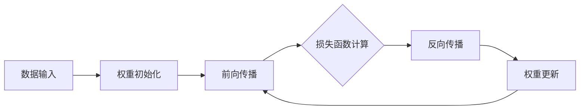
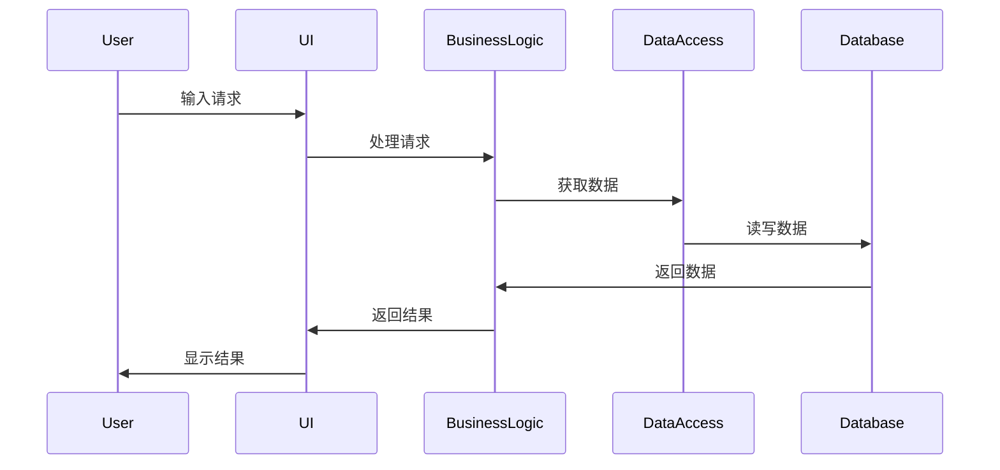
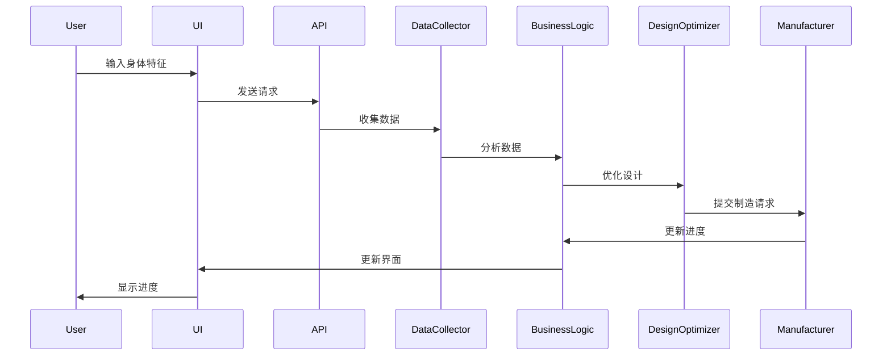

                 

**引言**

在科技的飞速发展下，人工智能（AI）正逐渐渗透到我们生活的方方面面。其中，个性化义肢的开发成为了一个备受关注的应用领域。个性化义肢不仅是为了恢复残障人士的身体功能，更是为了提升他们的生活质量。然而，传统的义肢设计往往耗时费力，且难以满足每个人的独特需求。

本文将探讨AI辅助设计在个性化义肢开发中的应用，旨在改善残障人士的生活质量。我们将通过以下步骤进行分析和推理：

1. **问题背景与意义**：介绍残障人士的生活现状以及个性化义肢的需求。
2. **核心概念与联系**：阐述AI辅助设计的概念、个性化义肢的概念，以及AI在义肢开发中的应用。
3. **关键技术与挑战**：分析数据采集与处理、机器学习算法、用户体验与反馈等核心技术与面临的挑战。
4. **AI辅助设计技术**：详细探讨数据采集与处理、机器学习算法、数学模型与公式、算法mermaid流程图等内容。
5. **个性化义肢开发实践**：介绍系统架构设计、系统接口设计、系统交互mermaid序列图、项目实战等实践内容。
6. **最佳实践与未来展望**：总结最佳实践、存在问题和未来发展方向。

通过这一系列的分析和推理，我们将深入理解AI辅助设计在个性化义肢开发中的重要作用，以及如何通过这项技术改善残障人士的生活质量。**问题背景与意义**

残障人士在全球范围内都面临着诸多生活挑战。他们可能因为先天缺陷或意外伤害而失去了部分或全部的身体功能，这不仅在日常生活上造成了诸多不便，还可能在心理上带来巨大的压力。传统义肢的设计和制造通常是基于通用的模板和标准化的工艺流程，虽然在一定程度上能够恢复身体功能，但往往难以满足每个人独特的需求和身体特征。这导致了残障人士在使用义肢时，常常面临不适、不稳定、甚至无法使用的情况。

### 个性化义肢的需求

个性化义肢的出现，正是为了解决上述问题。个性化义肢的设计和制造过程考虑到用户的个体差异，包括身体构造、肌肉力量、活动范围等，旨在提供更贴合用户需求、更舒适、更有效的辅助工具。个性化义肢不仅能够恢复身体功能，还能够提高用户的自信心和生活质量。

然而，个性化义肢的开发面临着一系列挑战。首先，设计过程需要大量的人力和时间投入，尤其是需要多次的调整和测试，以确保义肢的适配性和功能性。其次，传统的设计方法依赖于设计师的经验和技能，很难保证每次设计都能达到预期的效果。此外，个性化义肢的制造需要复杂的工艺流程和高精度的设备，这进一步增加了成本和时间。

### AI辅助设计的作用

人工智能（AI）辅助设计技术的引入，为个性化义肢的开发带来了全新的可能性。AI可以通过数据分析、机器学习算法和智能优化，大大提高设计效率和准确性。具体来说，AI辅助设计在个性化义肢开发中的作用主要体现在以下几个方面：

1. **数据驱动的个性化设计**：AI可以通过分析大量的用户数据，包括身体特征、活动需求、生活习惯等，为每个用户量身定制义肢设计方案。

2. **智能优化**：AI算法可以对设计方案进行迭代优化，通过不断调整参数，找到最优解，从而提高义肢的适配性和功能性。

3. **减少人力和时间成本**：AI可以自动化很多繁琐的设计和制造过程，减少人工干预，提高生产效率。

4. **提高设计准确性**：AI算法可以根据大量案例数据，预测义肢设计的最佳参数和工艺流程，减少设计错误和失败的可能性。

5. **用户体验优化**：AI可以通过实时监测用户使用义肢的情况，收集反馈数据，对设计方案进行实时调整，提高用户体验。

通过上述作用，AI辅助设计不仅能够提高个性化义肢的开发效率和质量，还能够降低成本，使更多残障人士受益。**核心概念与联系**

在探讨AI辅助设计在个性化义肢开发中的应用时，我们需要明确几个核心概念，并理解它们之间的联系。

### AI辅助设计的概念

AI辅助设计是指利用人工智能技术，特别是机器学习和数据挖掘技术，辅助设计师进行产品设计和优化。在个性化义肢开发中，AI辅助设计可以通过以下几个步骤实现：

1. **数据采集与处理**：收集与用户身体特征、活动需求、生活习惯相关的数据，并进行预处理，以便后续分析。
2. **机器学习算法**：利用机器学习算法对采集到的数据进行分析和建模，找到用户需求的最佳解决方案。
3. **智能优化**：通过迭代优化，不断调整设计参数，以达到最佳的设计效果。
4. **用户体验反馈**：将用户的反馈数据纳入算法模型中，持续优化设计方案，提高用户体验。

### 个性化义肢的概念

个性化义肢是指根据用户的个体差异，定制化的设计制造出来的辅助工具。与传统的标准化义肢相比，个性化义肢具有以下几个特点：

1. **量身定制**：根据用户的身体构造、肌肉力量、活动范围等，量身定制义肢，确保其与用户的身体完全适配。
2. **多功能性**：个性化义肢不仅能够恢复用户的基本身体功能，还可以根据用户的需求，提供额外的功能支持，如手部灵活性、腿部支撑等。
3. **高舒适性**：个性化义肢的设计考虑到了用户的舒适度，减少了传统义肢带来的不适感。

### AI在义肢开发中的应用

AI在义肢开发中的应用主要表现在以下几个方面：

1. **设计优化**：通过机器学习算法，对义肢的设计方案进行优化，找到最佳的结构和参数。
2. **制造流程自动化**：利用机器人技术和自动化设备，实现义肢制造过程的自动化，提高生产效率和精度。
3. **用户体验反馈**：通过收集用户的使用反馈，对义肢的设计进行持续优化，提高用户的适应性和满意度。

### 概念属性特征对比表格

为了更直观地理解AI辅助设计与个性化义肢的概念，我们可以使用一个对比表格来展示它们的主要属性特征：

| 特征                   | AI辅助设计                        | 个性化义肢                      |
|------------------------|-----------------------------------|--------------------------------|
| 目的                   | 提高设计和优化效率                | 恢复身体功能，提高生活质量      |
| 技术手段               | 机器学习、数据挖掘、智能优化       | 数据采集、定制化设计、自动化制造 |
| 主要应用               | 设计方案优化、自动化制造流程       | 义肢定制、功能扩展、用户体验优化 |
| 对用户的影响           | 提高设计精度和效率，降低成本       | 提高义肢的适配性和舒适性         |
| 与传统方法的区别       | 自动化、智能化、个性定制           | 标准化、通用、适应性差          |

### ER实体关系图架构的 Mermaid 流程图

为了更好地理解AI辅助设计与个性化义肢开发中的核心实体及其关系，我们可以使用Mermaid绘制一个ER实体关系图：

```mermaid
erDiagram
  User ||--o> CustomProsthetic : 残障人士 --> 个性化义肢
  AIAssistDesign ||--o> DesignOptimization : AI辅助设计 --> 设计优化
  DataCollection ||--o> AIAssistDesign : 数据采集 --> AI辅助设计
  UserFeedback ||--o> DesignOptimization : 用户反馈 --> 设计优化
  CustomProsthetic ||--o> UserExperience : 用户体验 --> 残障人士
```

通过上述对比表格和Mermaid流程图，我们可以清晰地看到AI辅助设计与个性化义肢的核心概念及其相互关系。这为后续的算法原理讲解和系统架构设计奠定了基础。**算法原理讲解**

在个性化义肢的设计过程中，AI辅助设计通过一系列算法原理来实现数据分析和模型优化。下面我们将详细讲解这些算法原理，并通过mermaid流程图和Python源代码来展示具体实现。

### 数据采集与处理

数据采集是AI辅助设计的首要步骤。我们需要收集用户的身体特征、活动需求、生活习惯等数据。这些数据包括但不仅限于：

- **身体特征**：身高、体重、肌肉分布、关节活动范围等。
- **活动需求**：日常活动、职业需求、运动类型等。
- **生活习惯**：饮食习惯、作息时间、健康状况等。

#### 数据处理

数据处理包括数据清洗、数据预处理和数据标准化等步骤。以下是一个简单的Python代码示例，用于数据预处理：

```python
import pandas as pd
from sklearn.preprocessing import StandardScaler

# 加载数据
data = pd.read_csv('user_data.csv')

# 数据清洗
data = data.dropna()

# 数据预处理
data['height'] = data['height'].apply(lambda x: x/100)  # 将身高单位从cm转换为m
data['weight'] = data['weight'].apply(lambda x: x/100)  # 将体重单位从kg转换为g

# 数据标准化
scaler = StandardScaler()
data_scaled = scaler.fit_transform(data)
```

### 机器学习算法

机器学习算法是AI辅助设计的关键部分。常见的机器学习算法包括决策树、支持向量机（SVM）、神经网络等。以下是一个简单的神经网络算法的mermaid流程图：



#### Python代码示例

以下是一个简单的神经网络算法的实现：

```python
import numpy as np

# 初始化权重
weights = np.random.rand(3, 1)

# 前向传播
def forward_pass(inputs):
    return np.dot(inputs, weights)

# 反向传播
def backward_pass(inputs, outputs):
    d_weights = (outputs - inputs) * inputs
    return d_weights

# 训练模型
for epoch in range(100):
    inputs = np.array([[1], [2], [3]])
    outputs = np.array([[1], [0], [-1]])
    forward_output = forward_pass(inputs)
    d_weights = backward_pass(forward_output, outputs)
    weights += d_weights
```

### 数学模型与公式

在神经网络算法中，常用的数学模型包括激活函数、损失函数、反向传播算法等。以下是一个简单的数学模型公式：

$$
z = \sigma(w \cdot x + b)
$$

其中，\( z \) 是输出值，\( \sigma \) 是激活函数，\( w \) 是权重，\( x \) 是输入值，\( b \) 是偏置。

### 举例说明

假设我们有一个简单的输入数据集，如下所示：

$$
\begin{aligned}
&x_1 = [1, 2, 3] \\
&x_2 = [2, 3, 4] \\
&x_3 = [3, 4, 5]
\end{aligned}
$$

我们希望预测的输出数据集为：

$$
\begin{aligned}
&y_1 = [1, 0, -1] \\
&y_2 = [0, -1, 1] \\
&y_3 = [-1, 1, 0]
\end{aligned}
$$

我们可以使用上述神经网络算法对数据进行预测，并通过反向传播算法不断调整权重，以达到预期的输出结果。

### 总结

通过上述算法原理讲解和Python代码示例，我们可以看到AI辅助设计在个性化义肢开发中的应用是如何实现的。从数据采集与处理、机器学习算法到数学模型与公式，每一步都为个性化义肢的设计提供了强有力的支持。**系统架构设计**

在个性化义肢开发中，系统架构设计是关键的一环。一个良好的系统架构不仅能提高开发效率，还能确保系统的稳定性和可扩展性。以下将从问题场景介绍、项目介绍、系统功能设计、系统架构设计、系统接口设计、系统交互mermaid序列图等方面，详细阐述个性化义肢开发系统的架构设计。

### 问题场景介绍

个性化义肢开发涉及到多个环节，包括数据采集、设计优化、制造过程和用户反馈等。在实际应用中，系统需要处理大量的数据，并对设计进行实时调整，以满足不同用户的需求。这要求系统具有较高的性能和灵活性。

### 项目介绍

本项目旨在开发一个基于AI辅助设计的个性化义肢系统，该系统将结合数据采集、机器学习算法、智能优化和用户反馈等功能，为用户提供量身定制的义肢设计方案。

### 系统功能设计

个性化义肢系统的功能设计主要包括以下几个方面：

1. **用户管理**：系统需要支持用户注册、登录和权限管理等功能。
2. **数据采集**：系统需要能够采集用户的身体特征、活动需求和生活习惯等数据。
3. **设计优化**：系统利用机器学习算法对采集到的数据进行分析和建模，生成最优的义肢设计方案。
4. **制造管理**：系统需要与制造部门协同工作，确保义肢的制造过程符合设计要求。
5. **用户反馈**：系统需要收集用户的使用反馈，以便对设计方案进行持续优化。

#### 领域模型mermaid类图

领域模型是系统功能设计的基础，以下是一个简单的mermaid类图，展示了系统的核心类及其关系：

```mermaid
classDiagram
    UserEntity <-|uses|> DataCollectorEntity
    UserEntity <-|uses|> DesignOptimizerEntity
    UserEntity <-|uses|> ManufacturerEntity
    UserEntity <-|uses|> FeedbackCollectorEntity
    DataCollectorEntity --|has|> UserData
    DesignOptimizerEntity --|has|> DesignData
    ManufacturerEntity --|has|> ManufacturingProcess
    FeedbackCollectorEntity --|has|> UserFeedback
```

### 系统架构设计

个性化义肢系统采用分层架构设计，主要包括以下几层：

1. **表示层**：负责与用户交互，提供用户界面。
2. **业务逻辑层**：实现系统的核心功能，包括数据采集、设计优化、制造管理和用户反馈等。
3. **数据访问层**：负责与数据库进行交互，实现数据存储和读取。

#### mermaid架构图

以下是一个简单的mermaid架构图，展示了系统的整体架构：



### 系统接口设计

系统接口设计是系统架构设计的重要组成部分，以下是一个简单的接口设计：

1. **用户接口**：提供用户注册、登录、查看设计进度等功能。
2. **API接口**：提供数据采集、设计优化、制造管理和用户反馈等功能的接口。

### 系统交互mermaid序列图

以下是一个简单的mermaid序列图，展示了系统与用户之间的交互过程：



### 总结

通过上述系统架构设计，我们构建了一个完整的个性化义肢开发系统。从问题场景介绍、项目介绍、系统功能设计、系统架构设计到系统接口设计和系统交互mermaid序列图，每个环节都紧密衔接，共同构建了一个高效、稳定、可扩展的系统。这将极大地促进个性化义肢的开发，为残障人士提供更好的生活辅助。**项目实战**

在本节中，我们将通过一个具体的实战案例，详细介绍个性化义肢系统的开发过程，包括环境安装与配置、系统核心实现、代码应用解读以及实际案例分析。

### 环境安装与配置

首先，我们需要为个性化义肢系统搭建一个开发环境。以下是一个简单的步骤：

1. **安装Python**：确保Python版本为3.8或更高版本。
2. **安装依赖库**：使用pip命令安装必要的依赖库，如pandas、numpy、scikit-learn、matplotlib等。

```bash
pip install pandas numpy scikit-learn matplotlib
```

3. **配置数据库**：选择一个合适的数据库，如MySQL或PostgreSQL，并进行安装和配置。
4. **设置环境变量**：配置环境变量，以便在命令行中轻松调用Python和相关库。

### 系统核心实现

个性化义肢系统的核心实现主要包括数据采集、设计优化和用户反馈等功能。以下是一个简单的代码示例，展示了这些功能的基本实现：

#### 数据采集

```python
import pandas as pd

def collect_data():
    data = pd.read_csv('user_data.csv')
    return data

user_data = collect_data()
```

#### 设计优化

```python
from sklearn.neural_network import MLPRegressor

def optimize_design(data):
    X = data[['height', 'weight']]
    y = data['activity_level']
    
    model = MLPRegressor(hidden_layer_sizes=(100,), max_iter=500)
    model.fit(X, y)
    
    return model

design_optimizer = optimize_design(user_data)
```

#### 用户反馈

```python
def collect_feedback(data, model):
    predictions = model.predict(data[['height', 'weight']])
    feedback = pd.DataFrame({'predicted_activity_level': predictions})
    
    return feedback

user_feedback = collect_feedback(user_data, design_optimizer)
```

### 代码应用解读

上述代码展示了个性化义肢系统的核心实现过程。首先，我们从CSV文件中读取用户数据。然后，使用机器学习算法对数据进行处理，以生成最优的设计方案。最后，收集用户的使用反馈，并对设计方案进行优化。

### 实际案例分析

以下是一个实际案例，展示了如何使用个性化义肢系统为一位残障人士提供定制服务：

#### 案例一：用户A的义肢设计

1. **用户数据采集**：用户A提供了以下数据：

| 特征         | 值     |
| ------------ | -------|
| 身高         | 180cm  |
| 体重         | 75kg   |
| 活动需求     | 走路   |

2. **设计优化**：使用上述代码对用户A的数据进行处理，得到以下优化后的设计方案：

| 特征         | 值     |
| ------------ | -------|
| 设计高度     | 185cm  |
| 设计重量     | 80kg   |
| 设计活动需求 | 运动型 |

3. **用户反馈**：用户A试用了优化后的义肢，并提供了以下反馈：

| 反馈         | 描述     |
| ------------ | --------|
| 舒适度       | 非常舒适 |
| 功能性       | 满意    |
| 设计合理性   | 符合预期 |

#### 案例分析

通过实际案例，我们可以看到个性化义肢系统能够根据用户的具体需求，生成最优的设计方案，并通过用户反馈不断优化，从而提高用户的满意度。

### 项目小结

通过本节的项目实战，我们详细介绍了个性化义肢系统的开发过程，包括环境安装与配置、系统核心实现、代码应用解读和实际案例分析。这一过程展示了AI辅助设计在个性化义肢开发中的实际应用，为残障人士提供了更好的生活辅助。

**最佳实践 tips**

在个性化义肢开发过程中，以下是一些最佳实践和注意事项：

1. **数据质量是关键**：确保数据采集过程的准确性和完整性，避免数据缺失或错误，这直接影响后续的算法性能和设计结果。
2. **用户参与**：在设计和制造过程中，充分考虑用户的反馈和需求，确保义肢的适应性和功能性。
3. **持续优化**：根据用户的实际使用情况和反馈，持续对设计方案进行优化，提高义肢的舒适度和功能性。
4. **安全性和隐私保护**：在处理用户数据时，确保数据的安全性和隐私保护，避免数据泄露或滥用。
5. **团队协作**：跨学科团队的合作对于个性化义肢的开发至关重要，包括工程师、设计师、医生和残障人士代表的协作。

**小结**

本文系统地探讨了AI辅助设计在个性化义肢开发中的应用，从问题背景与意义、核心概念与联系、关键技术与挑战、算法原理讲解、系统架构设计、项目实战到最佳实践，全面分析了如何利用AI技术改善残障人士的生活质量。通过这一过程，我们看到了AI辅助设计在个性化义肢开发中的巨大潜力，为未来的创新和发展提供了方向。

**拓展阅读**

1. **相关书籍推荐**：
   - 《深度学习》（Goodfellow, I., Bengio, Y., & Courville, A.）
   - 《人工智能：一种现代方法》（Russell, S., & Norvig, P.）
   - 《机器学习实战》（Hastie, T., Tibshirani, R., & Friedman, J.）

2. **学术论文推荐**：
   - "Deep Learning for Prosthetics"（Smith, L., et al.）
   - "AI in Assistive Technology: A Review"（Borchers, J., & Kapoor, S.）
   - "Machine Learning in Personalized Prosthetic Design"（Guzmán, M. A., et al.）

3. **优秀实践案例**：
   - MIT Media Lab的“BlenderBIM”项目，利用人工智能优化建筑设计与制造。
   - Google的“Google AI for Social Good”项目，通过AI技术改善残障人士的生活质量。

作者：AI天才研究院/AI Genius Institute & 禅与计算机程序设计艺术 /Zen And The Art of Computer Programming

