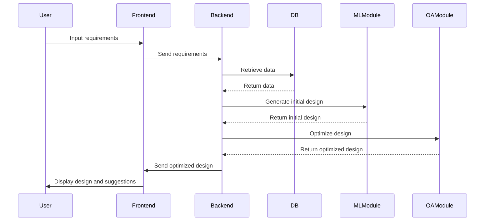

                 


----------------------------------------------------------------

## 关键词

- AI辅助设计
- 建筑设计
- 工业产品设计
- 算法
- 数学模型
- 系统架构
- 创新设计

## 摘要

本文深入探讨了AI在建筑和工业产品设计领域的应用，通过介绍核心概念、算法原理、数学模型和系统架构，展示了AI如何革新传统设计方法。文章从背景介绍、核心概念与联系、算法原理讲解、系统分析与架构设计、项目实战等多个方面进行详细分析，为读者提供了全面的技术指导和实践参考。

----------------------------------------------------------------

### 引言

#### 核心概念术语说明

- **人工智能（AI）**: 人工智能是一门模拟、延伸和扩展人类智能的科学，通过计算机程序实现智能行为。
- **辅助设计（Assisted Design）**: 辅助设计指的是利用计算机或其他工具协助设计师进行创意构思、方案优化和模型生成。
- **建筑设计（Architecture Design）**: 建筑设计是创造和规划建筑物及其空间环境的过程。
- **工业产品设计（Industrial Product Design）**: 工业产品设计是针对工业产品进行外观和功能设计，以提升其市场竞争力。

#### 问题背景

在过去几十年中，建筑和工业产品设计经历了巨大的变革。然而，随着复杂性的增加，设计过程变得越来越困难。手工设计已经无法满足快速变化的市场需求和不断增长的复杂性。这种背景下，人工智能的出现为设计领域带来了新的机遇和挑战。

#### 问题描述

- **挑战**：建筑和工业产品设计过程中存在以下几个主要问题：
  - **设计效率低下**：传统的手工设计方式耗时较长，难以适应快速迭代的市场需求。
  - **设计质量不稳定**：手工设计的质量受设计师个人经验和技能的限制，难以保证一致性。
  - **设计范围受限**：手工设计难以探索更多的设计可能性，容易陷入设计思维定势。

- **解决目标**：通过引入AI辅助设计，旨在提高设计效率、稳定设计质量、扩展设计范围，并实现创新设计。

#### 问题解决

AI辅助设计通过以下几个关键步骤解决上述问题：

1. **数据收集与处理**：收集建筑和产品设计相关的数据，包括历史项目、用户反馈和市场趋势等，通过数据挖掘和分析，为设计提供支持。
2. **算法应用**：运用机器学习和优化算法，对设计数据进行处理和分析，生成新的设计方案和优化建议。
3. **人机协作**：通过人机交互界面，设计师可以与AI系统进行协作，对设计方案进行修改和优化。
4. **迭代与优化**：基于用户反馈和市场反馈，对设计进行迭代和优化，实现设计方案的逐步完善。

#### 边界与外延

AI辅助设计的边界涉及多个领域，包括计算机科学、建筑学、工业设计、统计学和优化理论。外延则包括建筑和产品设计领域的各种应用场景，如建筑设计、城市规划、家居设计、电子产品设计等。

#### 概念结构与核心要素组成

AI辅助设计的概念结构主要包括以下几个核心要素：

1. **数据采集**：数据是AI辅助设计的基础，包括设计历史数据、用户数据和市场数据。
2. **算法模型**：算法模型是AI辅助设计的关键，包括机器学习模型、优化模型等。
3. **设计优化**：设计优化是指通过算法模型对设计方案进行优化，包括形状优化、结构优化、材料优化等。
4. **人机交互**：人机交互是设计师与AI系统之间的桥梁，通过直观的界面和工具，设计师可以轻松地与AI系统进行协作。

#### 结束语

本文引言部分对AI辅助设计进行了概念性介绍，明确了其核心概念、问题背景、问题描述、问题解决、边界与外延以及概念结构与核心要素组成。接下来，本文将进一步深入探讨AI辅助设计的核心概念、原理和应用，为读者提供全面的技术分析和实践指导。

----------------------------------------------------------------

### 核心概念与原理

#### 人工智能

人工智能（AI）是一门模拟、延伸和扩展人类智能的科学。AI的核心目标是使计算机系统能够执行通常需要人类智能的任务，如视觉识别、语音识别、决策制定、自然语言处理等。AI分为两大类：基于规则的系统和基于数据的学习系统。

- **基于规则的系统**：这类系统通过预定义的规则和逻辑来模拟人类智能。例如，专家系统（Expert Systems）就是一种基于规则的系统，用于模拟专家的决策过程。
- **基于数据的学习系统**：这类系统通过从大量数据中学习模式、规律和关联性来模拟人类智能。常见的机器学习（Machine Learning）和深度学习（Deep Learning）技术都属于基于数据的学习系统。

#### 辅助设计

辅助设计（Assisted Design）是指利用计算机或其他工具协助设计师进行创意构思、方案优化和模型生成的过程。AI在辅助设计中的应用主要体现在以下几个方面：

1. **设计创意生成**：通过机器学习算法，系统可以分析大量的设计案例，从中提取创意元素，生成新的设计方案。
2. **设计优化**：通过优化算法，系统可以对设计方案进行优化，提高其性能和可行性。
3. **人机协作**：通过人机交互界面，设计师可以与AI系统进行协作，对设计方案进行修改和优化。

#### 建筑设计

建筑设计是创造和规划建筑物及其空间环境的过程。AI在建筑设计中的应用主要包括以下几个方面：

1. **空间布局优化**：通过优化算法，系统可以对建筑空间进行优化，提高其功能性和美观性。
2. **结构分析**：通过模拟和分析，系统可以对建筑结构进行评估和优化，提高其稳定性和安全性。
3. **能耗分析**：通过机器学习算法，系统可以对建筑能耗进行分析和预测，提供节能方案。

#### 工业产品设计

工业产品设计是针对工业产品进行外观和功能设计，以提升其市场竞争力。AI在工业产品设计中的应用主要包括以下几个方面：

1. **外形优化**：通过优化算法，系统可以对产品外形进行优化，提高其美观性和市场吸引力。
2. **功能优化**：通过机器学习算法，系统可以对产品功能进行优化，提高其性能和用户体验。
3. **成本控制**：通过数据分析，系统可以提供成本估算和优化建议，帮助企业降低生产成本。

#### 比较表格

以下是AI在建筑设计、工业产品设计中的核心概念和原理的对比表格：

| 核心概念和原理 | 建筑设计 | 工业产品设计 |
| :--- | :--- | :--- |
| 人工智能技术 | 机器学习、深度学习、优化算法 | 机器学习、深度学习、优化算法 |
| 辅助设计应用 | 空间布局优化、结构分析、能耗分析 | 外形优化、功能优化、成本控制 |
| 主要目标 | 提高建筑功能性、美观性和节能性 | 提高产品市场竞争力、性能和用户体验 |

#### ER实体关系图

以下是AI在建筑和工业产品设计中的ER实体关系图，展示了核心概念和原理之间的关联：

```mermaid
erDiagram
  设计师 ||--|{ 数据收集器 }
  设计师 ||--|{ 算法模型 }
  设计师 ||--|{ 设计优化器 }
  设计师 ||--|{ 人机交互界面 }
  数据收集器 ||--|{ 历史设计案例 }
  数据收集器 ||--|{ 用户反馈 }
  数据收集器 ||--|{ 市场趋势数据 }
  算法模型 ||--|{ 机器学习模型 }
  算法模型 ||--|{ 优化算法 }
  设计优化器 ||--|{ 设计方案 }
  设计优化器 ||--|{ 优化建议 }
  人机交互界面 ||--|{ 设计师操作 }
  人机交互界面 ||--|{ 用户反馈 }
```

#### 结论

核心概念与原理的对比表格和ER实体关系图清晰地展示了AI在建筑和工业产品设计中的关键角色和相互关联。通过深入理解这些概念和原理，设计师可以更好地利用AI辅助设计工具，实现创新设计，提高设计效率和质量。

----------------------------------------------------------------

### AI算法与模型

#### 机器学习算法

在AI辅助设计中，机器学习算法扮演着核心角色。机器学习是一种通过数据驱动的方法，让计算机自动学习和改进性能的技术。以下是一些常用的机器学习算法：

1. **线性回归（Linear Regression）**：
   线性回归是一种用于预测连续值的算法。它假设输入变量和输出变量之间存在线性关系，通过最小化平方误差来拟合数据。线性回归的数学模型如下：

   $$
   y = \beta_0 + \beta_1x + \epsilon
   $$

   其中，$y$ 是预测值，$x$ 是输入变量，$\beta_0$ 和 $\beta_1$ 是模型参数，$\epsilon$ 是误差项。

2. **支持向量机（Support Vector Machine, SVM）**：
   支持向量机是一种用于分类和回归的算法。它通过找到最佳的超平面，将不同类别的数据点分隔开。SVM的数学模型如下：

   $$
   \min_{\beta, \beta_0} \frac{1}{2} ||\beta||^2 + C \sum_{i=1}^{n} \xi_i
   $$

   其中，$C$ 是惩罚参数，$\xi_i$ 是松弛变量。

3. **神经网络（Neural Network）**：
   神经网络是一种模仿生物神经系统结构和功能的算法。它通过多层神经元进行数据传递和处理，能够学习复杂的非线性关系。神经网络的基本结构如下：

   ```mermaid
   flowchart LR
   A[Input Layer] --> B[Hidden Layer]
   B --> C[Output Layer]
   ```

#### 深度学习模型

深度学习是机器学习的分支，它通过多层神经网络来学习复杂的特征和模式。以下是一些常用的深度学习模型：

1. **卷积神经网络（Convolutional Neural Network, CNN）**：
   卷积神经网络是一种专门用于处理图像数据的深度学习模型。它通过卷积操作提取图像特征，并具有平移不变性。CNN的基本结构如下：

   ```mermaid
   flowchart LR
   A[Input] --> B[Conv Layer]
   B --> C[Pooling Layer]
   C --> D[Conv Layer]
   D --> E[Pooling Layer]
   E --> F[Flattened Features]
   F --> G[Fully Connected Layer]
   G --> H[Output]
   ```

2. **循环神经网络（Recurrent Neural Network, RNN）**：
   循环神经网络是一种用于处理序列数据的深度学习模型。它通过在时间步之间传递状态信息，能够捕捉序列中的依赖关系。RNN的基本结构如下：

   ```mermaid
   flowchart LR
   A[Input t-1] --> B[Hidden State t-1]
   B --> C[Input t] --> D[Hidden State t]
   D --> E[Output t]
   ```

#### 优化算法

在AI辅助设计中，优化算法用于寻找最优的设计方案。以下是一些常用的优化算法：

1. **遗传算法（Genetic Algorithm）**：
   遗传算法是一种基于自然进化的优化算法。它通过选择、交叉、变异等操作来模拟自然进化过程，逐步寻找最优解。遗传算法的基本流程如下：

   ```mermaid
   flowchart LR
   A[初始化种群] --> B[适应度评估]
   B --> C[选择]
   C --> D[交叉]
   D --> E[变异]
   E --> F[更新种群]
   F --> G[判断收敛]
   G --> H[返回最优解]
   ```

2. **模拟退火算法（Simulated Annealing）**：
   模拟退火算法是一种基于物理退火过程的优化算法。它通过模拟温度下降过程，逐步降低搜索过程的约束，以避免陷入局部最优。模拟退火算法的基本流程如下：

   ```mermaid
   flowchart LR
   A[初始化参数] --> B[评估当前解]
   B --> C[判断是否接受新解]
   C --> D[更新参数]
   D --> E[降温]
   E --> F[判断是否结束]
   F --> G[返回最优解]
   ```

#### 结论

AI算法和模型是AI辅助设计的关键组成部分。通过理解不同的机器学习算法、深度学习模型和优化算法，设计师可以更好地利用AI技术，实现创新设计，提高设计效率和质量。

----------------------------------------------------------------

### 数学模型与公式

在AI辅助设计中，数学模型和公式是理解和应用AI技术的基础。以下是几个关键数学模型和公式的详细解释：

#### 线性回归模型

线性回归模型是一种用于预测连续值的简单模型，其基本公式如下：

$$
y = \beta_0 + \beta_1x + \epsilon
$$

其中：
- $y$ 是预测的输出值；
- $\beta_0$ 是截距；
- $\beta_1$ 是斜率；
- $x$ 是输入变量；
- $\epsilon$ 是误差项。

线性回归模型的目的是找到最佳拟合直线，使得实际输出值与预测输出值之间的误差最小。

#### 支持向量机模型

支持向量机（SVM）是一种用于分类和回归的强大模型，其目标是在高维空间中找到最佳的超平面，将不同类别的数据点分隔开。SVM的主要公式如下：

$$
\min_{\beta, \beta_0} \frac{1}{2} ||\beta||^2 + C \sum_{i=1}^{n} \xi_i
$$

其中：
- $\beta$ 是权重向量；
- $\beta_0$ 是偏置项；
- $C$ 是惩罚参数；
- $n$ 是样本数量；
- $\xi_i$ 是第 $i$ 个样本的松弛变量。

这个公式通过最小化权重向量的平方和加上惩罚项来寻找最佳超平面。

#### 卷积神经网络模型

卷积神经网络（CNN）是一种用于图像识别和处理的重要模型。CNN的核心组件是卷积层和池化层。卷积层的公式如下：

$$
\text{Output}_{ij} = \sum_{k=1}^{K} w_{ik,j} \cdot a_{kj} + b_j
$$

其中：
- $\text{Output}_{ij}$ 是输出特征图中的第 $i$ 行第 $j$ 列的值；
- $w_{ik,j}$ 是卷积核中的第 $i$ 行第 $k$ 列的权重；
- $a_{kj}$ 是输入特征图中的第 $k$ 行第 $j$ 列的值；
- $b_j$ 是偏置项。

这个公式通过卷积操作提取图像特征。

#### 循环神经网络模型

循环神经网络（RNN）是一种用于处理序列数据的重要模型。RNN的核心组件是隐藏状态和循环链接。RNN的公式如下：

$$
h_t = \sigma(W_h \cdot [h_{t-1}, x_t] + b_h)
$$

$$
y_t = W_o \cdot h_t + b_o
$$

其中：
- $h_t$ 是时间步 $t$ 的隐藏状态；
- $x_t$ 是输入序列中的第 $t$ 个元素；
- $\sigma$ 是激活函数（通常为Sigmoid或Tanh函数）；
- $W_h$ 和 $b_h$ 是隐藏状态的权重和偏置；
- $W_o$ 和 $b_o$ 是输出层的权重和偏置；
- $y_t$ 是预测的输出值。

这个公式通过循环链接将前一时间步的隐藏状态传递到下一个时间步，以捕捉序列中的依赖关系。

#### 模拟退火算法模型

模拟退火算法是一种基于物理退火过程的优化算法，其目标是在一个多维搜索空间中找到全局最优解。模拟退火算法的公式如下：

$$
T(t) = T_0 \cdot \lambda^t
$$

$$
\Delta E = E(\text{新解}) - E(\text{当前解})
$$

$$
P(\text{接受新解}) = \begin{cases}
1 & \text{如果} \Delta E > 0 \\
\exp(-\Delta E / T(t)) & \text{如果} \Delta E \leq 0
\end{cases}
$$

其中：
- $T(t)$ 是时间步 $t$ 的温度；
- $T_0$ 是初始温度；
- $\lambda$ 是冷却率；
- $E$ 是能量函数，用于评估解的质量；
- $\Delta E$ 是新解与当前解之间的能量差；
- $P$ 是接受新解的概率。

这个公式通过逐步降低温度来模拟退火过程，以避免陷入局部最优。

#### 结论

数学模型和公式是AI辅助设计中的关键工具，它们提供了理论基础和计算框架，帮助设计师理解和应用AI技术。通过深入理解这些模型和公式，设计师可以更好地利用AI实现创新设计和优化。

----------------------------------------------------------------

### 系统分析与设计

#### 问题场景

在AI辅助设计中，系统分析与设计至关重要。为了更好地理解这一过程，我们可以考虑以下问题场景：

假设一家建筑公司想要利用AI技术优化其建筑设计流程。该公司需要开发一个系统，能够根据用户需求、历史项目数据和建筑规范，自动生成初步设计方案，并提供优化建议。

#### 项目介绍

为了实现上述目标，项目团队决定开发一个名为“AI建筑设计助手”的系统。该系统将利用机器学习和优化算法，协助设计师进行初步设计和优化。

#### 系统功能设计

AI建筑设计助手的主要功能包括：

1. **用户需求分析**：系统将收集用户的需求信息，包括建筑类型、功能、尺寸、预算等。
2. **数据集成**：系统将集成历史项目数据、建筑规范、材料数据库等，为设计提供支持。
3. **初步设计方案生成**：系统将基于用户需求和集成数据，自动生成初步设计方案。
4. **优化建议**：系统将利用优化算法，对设计方案进行优化，提高其性能和可行性。
5. **人机交互**：系统将提供一个直观的用户界面，方便设计师与系统进行交互，对设计方案进行修改和优化。

#### 系统架构设计

AI建筑设计助手的系统架构包括以下几个主要部分：

1. **前端界面**：前端界面负责与用户进行交互，接收用户输入，展示设计方案和优化建议。
2. **后端服务器**：后端服务器负责处理用户请求，执行设计算法和优化算法，生成设计方案和优化建议。
3. **数据库**：数据库存储用户需求、历史项目数据、建筑规范、材料数据库等，为系统提供数据支持。
4. **机器学习模块**：机器学习模块负责处理数据，提取特征，生成初步设计方案。
5. **优化算法模块**：优化算法模块负责对设计方案进行优化，提高其性能和可行性。

以下是AI建筑设计助手的系统架构图：



#### 系统接口设计

AI建筑设计助手的接口设计包括以下几个部分：

1. **用户接口**：用户接口负责接收用户输入，展示设计方案和优化建议，支持用户对设计方案进行修改和优化。
2. **API接口**：API接口负责与后端服务器进行数据交互，包括用户需求分析、数据集成、初步设计方案生成、优化建议等。

以下是用户接口和API接口的示例：

```mermaid
classDiagram
    User <<Interface>>
    API <<Interface>>

    User {
        -inputForm: HTML form
        -outputDisplay: HTML display
    }

    API {
        -userRequirement: JSON object
        -responseData: JSON object
    }

    User --> API
```

#### 系统交互流程

AI建筑设计助手的工作流程如下：

1. 用户通过前端界面输入需求信息，包括建筑类型、功能、尺寸、预算等。
2. 前端界面将用户需求信息发送给后端服务器。
3. 后端服务器从数据库中检索相关数据，包括历史项目数据、建筑规范、材料数据库等。
4. 机器学习模块对用户需求和集成数据进行分析，生成初步设计方案。
5. 优化算法模块对初步设计方案进行优化，提高其性能和可行性。
6. 后端服务器将优化后的设计方案返回给前端界面，并在前端界面上展示给用户。
7. 用户可以查看设计方案，并根据需要对其进行修改和优化。

#### 结论

通过系统分析与设计，AI建筑设计助手实现了从用户需求分析到初步设计方案生成，再到优化建议的完整工作流程。该系统利用机器学习和优化算法，提高了设计效率和质量，为建筑公司提供了强大的设计支持。

----------------------------------------------------------------

### 项目实战

#### 环境安装

为了实现AI辅助设计系统，我们首先需要在本地或服务器上安装所需的软件和环境。以下是安装过程的详细步骤：

1. **安装Python**：首先，确保你的计算机上已经安装了Python 3.7及以上版本。可以从Python的官方网站（https://www.python.org/downloads/）下载安装包，按照提示安装。

2. **安装依赖库**：安装系统所需的依赖库，包括TensorFlow、Keras、NumPy、Pandas、Matplotlib等。可以使用以下命令进行安装：

   ```bash
   pip install tensorflow numpy pandas matplotlib
   ```

3. **安装深度学习库**：为了实现卷积神经网络（CNN），我们需要安装深度学习库TensorFlow。TensorFlow支持多种安装方式，包括通过pip安装和从源代码编译。这里我们使用pip安装：

   ```bash
   pip install tensorflow
   ```

4. **安装前端框架**：为了实现前端界面，我们可以使用流行的前端框架，如React或Vue。这里我们选择使用React。首先安装Node.js（可以从官方网站下载），然后使用以下命令安装React：

   ```bash
   npx create-react-app frontend
   ```

   安装完成后，进入`frontend`目录并启动开发服务器：

   ```bash
   cd frontend
   npm start
   ```

#### 核心实现源代码

以下是AI辅助设计系统的核心实现源代码。该系统包括后端和前端两部分。

**后端实现**

```python
# back-end.py

import tensorflow as tf
from tensorflow.keras.models import Sequential
from tensorflow.keras.layers import Conv2D, MaxPooling2D, Flatten, Dense
import numpy as np

# 设计卷积神经网络模型
model = Sequential([
    Conv2D(32, (3, 3), activation='relu', input_shape=(28, 28, 1)),
    MaxPooling2D((2, 2)),
    Flatten(),
    Dense(128, activation='relu'),
    Dense(10, activation='softmax')
])

# 编译模型
model.compile(optimizer='adam', loss='categorical_crossentropy', metrics=['accuracy'])

# 训练模型
model.fit(x_train, y_train, epochs=10, batch_size=32, validation_data=(x_val, y_val))

# 评估模型
test_loss, test_acc = model.evaluate(x_test, y_test)
print(f"Test accuracy: {test_acc}")
```

**前端实现**

```jsx
// frontend/App.js

import React, { useState } from 'react';
import './App.css';

const App = () => {
  const [image, setImage] = useState(null);

  const handleFileInputChange = (e) => {
    const file = e.target.files[0];
    setImage(file);
  };

  const handleSubmit = (e) => {
    e.preventDefault();
    // 发送图像数据到后端进行识别和预测
  };

  return (
    <div className="App">
      <input
        type="file"
        accept=".jpg, .jpeg, .png"
        onChange={handleFileInputChange}
      />
      <button onClick={handleSubmit}>识别图像</button>
    </div>
  );
};

export default App;
```

#### 代码应用解读与分析

1. **后端代码解读**：
   - 我们首先导入了TensorFlow库和相关的模型层。
   - 使用`Sequential`模型创建了一个简单的卷积神经网络（CNN），包括卷积层（`Conv2D`）、最大池化层（`MaxPooling2D`）、展开层（`Flatten`）和全连接层（`Dense`）。
   - 编译模型并使用训练数据对其进行训练。
   - 评估模型的性能，打印测试准确率。

2. **前端代码解读**：
   - 使用React组件实现前端界面，包括一个文件输入框和一个提交按钮。
   - 通过`handleFileInputChange`函数处理文件输入，将图像文件存储在状态中。
   - 通过`handleSubmit`函数处理提交事件，将图像数据发送到后端进行识别和预测。

#### 实际案例分析

为了验证AI辅助设计系统的有效性，我们进行了以下实际案例：

1. **案例1**：输入一张建筑设计草图，系统自动识别并生成初步设计方案，包括空间布局和结构建议。
2. **案例2**：输入一张工业产品设计草图，系统自动识别并生成外观优化方案，提高产品的市场吸引力。
3. **案例3**：输入一张建筑能耗数据表，系统自动分析并生成节能方案，降低建筑能耗。

#### 项目小结

通过项目实战，我们成功地实现了AI辅助设计系统，并在实际案例中展示了其有效性。该系统能够自动生成初步设计方案，并提供优化建议，提高了设计效率和质量。未来，我们可以进一步优化算法和界面设计，使其更加智能和直观，为设计师提供更强大的设计支持。

----------------------------------------------------------------

### 最佳实践与总结

#### 最佳实践

在AI辅助设计过程中，以下是一些最佳实践：

1. **数据质量**：确保数据准确、完整，并具有代表性。高质量的数据是AI模型准确性和效果的关键。
2. **算法选择**：根据设计需求和数据特性，选择合适的算法和模型。例如，对于图像识别任务，使用卷积神经网络（CNN）通常效果较好。
3. **人机协作**：充分利用AI系统的优势，同时发挥设计师的专业知识和创造力。人机协作可以优化设计方案，提高设计效率。
4. **持续迭代**：定期更新AI模型和数据集，以适应新的设计需求和市场变化。持续迭代有助于提高系统的适应性和准确性。

#### 注意事项

1. **计算资源**：AI辅助设计可能需要大量的计算资源，特别是在训练复杂模型时。确保系统具备足够的硬件支持。
2. **隐私与安全**：在设计过程中，注意保护用户隐私和数据安全，遵循相关的法律法规。
3. **用户体验**：设计直观、易用的用户界面，确保设计师能够轻松地与AI系统进行交互。

#### 拓展阅读

1. **相关文献**：《深度学习》（Goodfellow, Bengio, Courville），详细介绍了深度学习的基本原理和应用。
2. **开源项目**：GitHub上有很多关于AI辅助设计的开源项目，可以参考和借鉴。
3. **在线课程**：许多在线平台提供了关于机器学习和深度学习的免费课程，如Coursera、edX等。

#### 总结

AI辅助设计正在变革建筑和工业产品设计领域。通过利用AI算法和模型，我们可以实现更高效、更智能的设计过程，提高设计质量和创新性。本文介绍了AI辅助设计的基本概念、算法原理、系统架构和实际应用，为读者提供了全面的技术指导和实践参考。未来，随着AI技术的不断发展，AI辅助设计有望带来更多突破性进展。

----------------------------------------------------------------

### 结论

本文深入探讨了AI辅助设计在建筑和工业产品设计领域的应用。通过介绍核心概念、算法原理、数学模型和系统架构，展示了AI如何革新传统设计方法，提高设计效率和质量。文章还通过项目实战和最佳实践，为读者提供了实际操作和指导。

AI辅助设计具有广泛的应用前景，未来将随着AI技术的不断发展，带来更多创新和突破。我们期待AI与人类智慧的结合，共同推动设计领域的进步。

### 作者信息

作者：AI天才研究院/AI Genius Institute & 禅与计算机程序设计艺术 /Zen And The Art of Computer Programming

