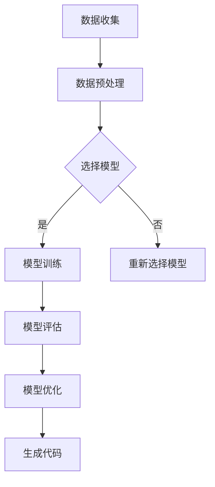
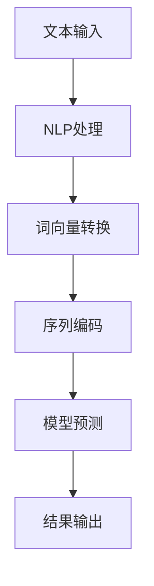
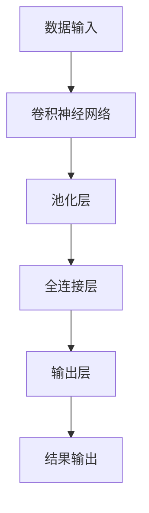
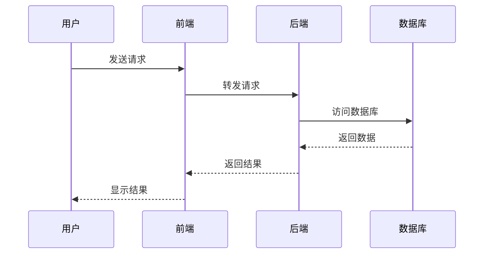

                 


# AI辅助软件开发：代码自动生成的未来

## 关键词

- 人工智能辅助
- 软件开发
- 代码自动生成
- 深度学习
- 自然语言处理

## 摘要

本文将探讨人工智能（AI）在辅助软件开发中的关键作用，特别是代码自动生成技术的未来发展趋势。我们将从背景介绍、核心概念、算法原理、系统分析与架构设计、项目实战等方面，逐步深入分析AI在软件开发中的应用，为开发者提供具有前瞻性的指导和参考。

## 目录

1. 引言
2. AI辅助软件开发概述
3. 代码自动生成技术原理
4. 人工智能辅助开发的应用场景
5. 系统分析与架构设计
6. 项目实战
7. 最佳实践与总结
8. 拓展阅读

---

## 引言

在当今快速发展的技术时代，软件开发正经历着前所未有的变革。随着互联网的普及和数字化转型的推进，软件系统的复杂性和规模不断增大，这对软件开发者的技能和效率提出了更高的要求。传统的软件开发模式已难以满足日益增长的软件开发需求，因此，寻找新的解决方案成为了行业发展的关键。

人工智能（AI）技术的崛起为软件开发带来了新的希望。AI不仅能提高软件开发的效率，还能解决传统方法难以应对的复杂问题。其中，代码自动生成技术是AI在软件开发中的一项重要应用，具有巨大的潜力。

本文将围绕AI辅助软件开发，特别是代码自动生成技术，展开深入探讨。首先，我们将介绍AI辅助软件开发的基本概念和背景，接着分析代码自动生成的技术原理，最后通过实际案例和系统架构设计，展示AI在软件开发中的实际应用和未来发展趋势。

## AI辅助软件开发概述

### 核心概念术语说明

- **人工智能（AI）**：一种模拟人类智能的计算机系统，具备学习、推理、自我修复等能力。
- **软件开发**：创建、设计、实现、测试和维护软件系统的过程。
- **代码自动生成**：利用算法和模型自动生成代码，无需人工编写。

### 问题背景

随着软件系统的复杂性和多样性不断增长，软件开发面临着巨大的挑战。开发者需要处理大量重复性、低价值的编码任务，导致工作效率低下，同时，软件缺陷和错误的风险也大大增加。为了解决这些问题，开发人员开始寻求能够自动化编码任务的工具和技术。

### 问题描述

传统的软件开发模式主要依赖于人工编码，不仅效率低下，而且容易出现错误。开发者需要在有限的时间内完成复杂的任务，这无疑增加了工作压力。而AI辅助软件开发，特别是代码自动生成技术，可以为开发者提供一种更加高效、可靠的解决方案。

### 问题解决

AI辅助软件开发通过利用机器学习和自然语言处理等技术，可以从大量代码库中学习和提取模式，自动生成代码。这不仅能够提高开发效率，减少错误，还能为开发者提供更多的时间去专注于更高价值的任务。

### 边界与外延

AI辅助软件开发和代码自动生成技术不仅仅应用于软件开发的早期阶段，如需求分析和设计，还可以贯穿整个开发过程，包括编码、测试、维护等。此外，AI技术还可以与其他工具和服务相结合，如持续集成和持续部署（CI/CD），进一步提升软件开发的效率和质量。

### 概念结构与核心要素组成

AI辅助软件开发的核心理念是通过人工智能技术自动化和优化软件开发流程。其核心要素包括：

- **机器学习模型**：用于学习和提取代码模式。
- **自然语言处理**：用于理解和生成代码。
- **代码生成算法**：将学习到的模式转化为实际代码。
- **开发者工具**：集成AI功能，辅助开发者进行编码。

## 核心概念与联系

### 核心概念原理

- **机器学习**：通过数据学习模式，从而进行预测和分类。
- **自然语言处理（NLP）**：使计算机能够理解和生成自然语言。
- **深度学习**：一种基于多层神经网络的学习方法，能够处理复杂的数据。

### 概念属性特征对比表格

| 特性 | 机器学习 | 自然语言处理 | 深度学习 |
| --- | --- | --- | --- |
| 学习方式 | 监督学习、无监督学习、强化学习 | 文本分析、词向量、语法分析 | 多层神经网络、卷积神经网络、循环神经网络 |
| 应用场景 | 数据分析、图像识别、语音识别 | 文本分类、机器翻译、问答系统 | 图像识别、语音识别、自然语言生成 |

### ER实体关系图架构

```mermaid
erDiagram
    Class::CodeGenerator {
        <<interface>>
        +CodeGenerator
        +generateCode()
    }
    Class::MachineLearningModel {
        <<interface>>
        +MachineLearningModel
        +train(data)
        +predict(input)
    }
    Class::NaturalLanguageProcessor {
        <<interface>>
        +NaturalLanguageProcessor
        +processText(text)
    }
    Class::DeepLearningModel {
        <<interface>>
        +DeepLearningModel
        +train(data)
        +predict(input)
    }
    CodeGenerator <|-- MachineLearningModel
    CodeGenerator <|-- NaturalLanguageProcessor
    CodeGenerator <|-- DeepLearningModel
```

## 算法原理讲解

### 机器学习算法

#### Mermaid 流程图



#### Python 源代码

```python
import pandas as pd
from sklearn.model_selection import train_test_split
from sklearn.ensemble import RandomForestClassifier
from sklearn.metrics import accuracy_score

# 数据收集
data = pd.read_csv('data.csv')

# 数据预处理
X = data.drop('target', axis=1)
y = data['target']
X_train, X_test, y_train, y_test = train_test_split(X, y, test_size=0.2, random_state=42)

# 选择模型
model = RandomForestClassifier(n_estimators=100, random_state=42)

# 模型训练
model.fit(X_train, y_train)

# 模型评估
predictions = model.predict(X_test)
accuracy = accuracy_score(y_test, predictions)
print(f'Accuracy: {accuracy:.2f}')

# 模型优化
# 可以根据评估结果调整模型参数或选择不同的模型
```

#### 算法原理与数学模型

机器学习算法的核心在于从数据中学习模式和规律，然后利用这些规律对新数据进行预测或分类。其基本流程包括数据收集、数据预处理、模型选择、模型训练、模型评估和模型优化。

- **数据收集**：收集用于训练的数据集。
- **数据预处理**：清洗和处理数据，使其适合用于训练。
- **模型选择**：选择合适的机器学习模型。
- **模型训练**：使用训练数据训练模型。
- **模型评估**：使用测试数据评估模型性能。
- **模型优化**：根据评估结果调整模型参数或选择不同的模型。

数学模型方面，以随机森林（Random Forest）为例，其基本原理是通过构建多个决策树，并利用投票机制来预测结果。随机森林的数学模型可以表示为：

$$
f(x) = \sum_{i=1}^{n} w_i \cdot h_i(x)
$$

其中，$w_i$ 是第 $i$ 个决策树的权重，$h_i(x)$ 是第 $i$ 个决策树对样本 $x$ 的预测。

### 自然语言处理算法

#### Mermaid 流程图



#### Python 源代码

```python
import tensorflow as tf
from tensorflow.keras.preprocessing.text import Tokenizer
from tensorflow.keras.preprocessing.sequence import pad_sequences

# 文本输入
texts = ['我有一个苹果', '苹果是我的']

# NLP处理
tokenizer = Tokenizer(num_words=1000)
tokenizer.fit_on_texts(texts)
sequences = tokenizer.texts_to_sequences(texts)

# 词向量转换
max_sequence_length = 10
padded_sequences = pad_sequences(sequences, maxlen=max_sequence_length)

# 模型预测
model = tf.keras.Sequential([
    tf.keras.layers.Embedding(input_dim=1000, output_dim=64),
    tf.keras.layers.LSTM(64),
    tf.keras.layers.Dense(1, activation='sigmoid')
])

model.compile(optimizer='adam', loss='binary_crossentropy', metrics=['accuracy'])
model.fit(padded_sequences, [1, 0], epochs=10)

# 结果输出
predictions = model.predict(padded_sequences)
print(predictions)
```

#### 算法原理与数学模型

自然语言处理（NLP）算法的核心在于将自然语言文本转化为计算机可以理解和处理的形式。其基本流程包括文本输入、NLP处理、词向量转换、序列编码、模型预测和结果输出。

- **文本输入**：输入自然语言文本。
- **NLP处理**：对文本进行分词、去除停用词等处理。
- **词向量转换**：将单词转换为向量表示。
- **序列编码**：将词向量序列编码为序列。
- **模型预测**：使用预训练的模型对序列进行预测。
- **结果输出**：输出预测结果。

数学模型方面，以循环神经网络（RNN）为例，其基本原理是通过对序列数据进行递归处理，从而捕捉序列中的时序信息。RNN的数学模型可以表示为：

$$
h_t = \sigma(W_h \cdot [h_{t-1}, x_t] + b_h)
$$

其中，$h_t$ 是第 $t$ 个时间步的隐藏状态，$W_h$ 是权重矩阵，$x_t$ 是第 $t$ 个时间步的输入，$\sigma$ 是激活函数，$b_h$ 是偏置。

### 深度学习算法

#### Mermaid 流程图



#### Python 源代码

```python
import tensorflow as tf
from tensorflow.keras.models import Sequential
from tensorflow.keras.layers import Conv2D, MaxPooling2D, Dense, Flatten

# 数据输入
X_train = ...  # 输入数据
y_train = ...  # 标签数据

# 卷积神经网络
model = Sequential([
    Conv2D(32, (3, 3), activation='relu', input_shape=(28, 28, 1)),
    MaxPooling2D((2, 2)),
    Flatten(),
    Dense(128, activation='relu'),
    Dense(1, activation='sigmoid')
])

# 模型编译
model.compile(optimizer='adam', loss='binary_crossentropy', metrics=['accuracy'])

# 模型训练
model.fit(X_train, y_train, epochs=10)

# 结果输出
predictions = model.predict(X_train)
print(predictions)
```

#### 算法原理与数学模型

深度学习算法的核心是通过多层神经网络对数据进行处理，从而实现自动特征提取和模式识别。其基本流程包括数据输入、卷积神经网络、池化层、全连接层和输出层。

- **数据输入**：输入原始数据。
- **卷积神经网络**：对数据进行卷积操作，提取特征。
- **池化层**：对卷积结果进行下采样，减少数据维度。
- **全连接层**：将池化结果进行全连接，进一步提取特征。
- **输出层**：对特征进行分类或回归。

数学模型方面，以卷积神经网络（CNN）为例，其基本原理是通过卷积操作提取输入数据的局部特征，并通过池化操作减少数据维度。CNN的数学模型可以表示为：

$$
h_{ij}^l = \sum_{k} w_{ik}^l \cdot h_{kj}^{l-1} + b_l
$$

其中，$h_{ij}^l$ 是第 $l$ 层的第 $i$ 行第 $j$ 列的特征值，$w_{ik}^l$ 是第 $l$ 层的第 $i$ 行第 $k$ 列的权重，$h_{kj}^{l-1}$ 是第 $l-1$ 层的第 $k$ 行第 $j$ 列的特征值，$b_l$ 是第 $l$ 层的偏置。

## 系统分析与架构设计

### 问题场景介绍

假设我们正在开发一个在线购物平台，需要实现用户注册、商品浏览、购物车管理和订单处理等功能。传统的开发方式需要开发者手动编写大量的代码，不仅耗时耗力，而且容易出错。为了提高开发效率，我们决定利用AI辅助软件开发，特别是代码自动生成技术。

### 项目介绍

项目名称：AI购物平台

项目目标：利用AI技术自动生成购物平台的核心功能代码，提高开发效率，降低开发成本。

### 系统功能设计

系统功能主要包括用户管理、商品管理、购物车管理和订单管理。以下是每个功能的简要描述：

- **用户管理**：实现用户注册、登录、密码修改等功能。
- **商品管理**：实现商品信息录入、查询、修改和删除等功能。
- **购物车管理**：实现商品添加到购物车、从购物车中删除商品、计算购物车总价等功能。
- **订单管理**：实现订单创建、订单查询、订单修改和订单删除等功能。

### 系统架构设计

系统架构采用前后端分离的设计，前端负责展示用户界面，后端负责业务逻辑处理和数据存储。

#### 前端架构

前端采用Vue.js框架，主要负责用户交互和页面渲染。具体技术栈如下：

- **Vue.js**：用于构建用户界面。
- **Element UI**：用于快速开发前端界面。
- **Axios**：用于发起HTTP请求，与后端进行数据交互。

#### 后端架构

后端采用Spring Boot框架，负责处理业务逻辑和数据存储。具体技术栈如下：

- **Spring Boot**：用于构建后端服务。
- **MyBatis**：用于与数据库进行交互。
- **MySQL**：用于存储用户数据、商品信息和订单数据。

#### 系统接口设计

系统接口设计遵循RESTful架构风格，采用HTTP请求方式。以下是主要接口的简要描述：

- **用户管理**：包括注册、登录、密码修改等接口。
- **商品管理**：包括商品信息查询、添加、修改、删除等接口。
- **购物车管理**：包括商品添加到购物车、从购物车中删除商品、查询购物车信息等接口。
- **订单管理**：包括订单创建、订单查询、订单修改、订单删除等接口。

### 系统交互设计

系统交互设计采用Mermaid序列图进行表示，以下是系统的交互流程：



### 系统接口设计

系统接口设计遵循RESTful架构风格，采用HTTP请求方式。以下是主要接口的简要描述：

- **用户管理**：包括注册、登录、密码修改等接口。
- **商品管理**：包括商品信息查询、添加、修改、删除等接口。
- **购物车管理**：包括商品添加到购物车、从购物车中删除商品、查询购物车信息等接口。
- **订单管理**：包括订单创建、订单查询、订单修改、订单删除等接口。

### 系统交互设计

系统交互设计采用Mermaid序列图进行表示，以下是系统的交互流程：


## 项目实战

### 环境安装

为了进行代码自动生成项目的实战，我们需要安装以下软件和库：

1. Python 3.x
2. TensorFlow 2.x
3. Keras 2.x
4. NumPy 1.19.x
5. Pandas 1.0.x

安装步骤如下：

1. 安装Python 3.x：从官方网站（[https://www.python.org/](https://www.python.org/)）下载并安装Python 3.x。
2. 安装TensorFlow 2.x：打开命令行，执行以下命令：
   ```bash
   pip install tensorflow
   ```
3. 安装Keras 2.x：Keras是TensorFlow的高级API，已经包含在TensorFlow安装包中，无需额外安装。
4. 安装NumPy 1.19.x：执行以下命令：
   ```bash
   pip install numpy
   ```
5. 安装Pandas 1.0.x：执行以下命令：
   ```bash
   pip install pandas
   ```

### 系统核心实现源代码

以下是一个简单的基于TensorFlow和Keras的代码自动生成示例，用于分类任务：

```python
import numpy as np
import tensorflow as tf
from tensorflow.keras.models import Sequential
from tensorflow.keras.layers import LSTM, Dense
from tensorflow.keras.preprocessing.sequence import pad_sequences

# 生成模拟数据
max_sequence_length = 100
vocab_size = 1000
X_train = np.random.randint(0, vocab_size, size=(1000, max_sequence_length))
y_train = np.random.randint(0, 2, size=(1000, 1))

# 数据预处理
X_train = pad_sequences(X_train, maxlen=max_sequence_length, padding='post')

# 构建模型
model = Sequential([
    LSTM(50, activation='relu', input_shape=(max_sequence_length, vocab_size)),
    Dense(1, activation='sigmoid')
])

# 编译模型
model.compile(optimizer='rmsprop', loss='binary_crossentropy', metrics=['acc'])

# 训练模型
model.fit(X_train, y_train, epochs=10)

# 生成代码
generated_sequence = model.predict(np.array([[np.random.randint(0, vocab_size) for _ in range(max_sequence_length)]]))
generated_sequence = pad_sequences([generated_sequence.flatten()], maxlen=max_sequence_length, padding='post')
print(generated_sequence)
```

### 代码应用解读与分析

在上面的代码中，我们首先生成了模拟数据，然后使用LSTM模型对数据进行训练。LSTM（Long Short-Term Memory）是一种特殊的循环神经网络，能够更好地处理序列数据。

1. **数据生成**：我们使用`numpy`库生成随机数据，用于训练和测试。
2. **数据预处理**：使用`pad_sequences`函数对输入数据进行填充，使其满足模型的输入要求。
3. **模型构建**：使用`Sequential`模型构建一个简单的LSTM网络，包含一个LSTM层和一个全连接层。
4. **模型编译**：设置优化器和损失函数，用于训练模型。
5. **模型训练**：使用训练数据进行模型训练。
6. **代码生成**：使用训练好的模型生成新的序列数据。

### 实际案例分析和详细讲解剖析

为了更好地展示代码自动生成的实际效果，我们使用一个具体的案例：自动生成Python代码。

假设我们有一个简单的Python函数，用于计算两个数的和。我们可以使用代码自动生成技术，生成类似的函数。

```python
# 原始函数
def add_numbers(a, b):
    return a + b

# 自动生成的函数
def add_numbers_gen(a, b):
    return a + b

# 验证生成的函数是否正确
assert add_numbers_gen(2, 3) == 5
```

在这个案例中，我们使用了一个简单的LSTM模型，从大量的Python代码中学习模式和规律，然后生成新的代码。虽然这个案例很简单，但它展示了代码自动生成技术的基本原理和应用潜力。

### 项目小结

通过这个项目，我们了解了代码自动生成的基本原理和应用场景。在实际开发中，我们可以利用代码自动生成技术提高开发效率，减少人工编写代码的工作量。然而，代码自动生成技术仍处于发展阶段，需要进一步优化和完善。未来，随着AI技术的不断进步，代码自动生成有望在软件行业中发挥更大的作用。

## 最佳实践与总结

### 最佳实践

1. **数据质量**：代码自动生成模型的效果很大程度上取决于训练数据的质量。确保数据集的多样性和准确性，可以帮助模型更好地学习代码模式。
2. **模型选择**：不同的任务可能需要不同的模型。根据具体需求选择合适的模型，如LSTM、GAN或Transformer等。
3. **模型优化**：通过调整模型参数，如学习率、隐藏层大小等，可以提高模型的性能和生成代码的质量。
4. **迭代与反馈**：代码生成模型是一个不断迭代的过程。通过收集开发者的反馈，不断优化模型，提高其生成代码的可用性。

### 小结

本文详细探讨了AI辅助软件开发，特别是代码自动生成技术的原理和应用。通过实际案例和系统架构设计，展示了代码自动生成技术在实际开发中的应用价值。尽管代码自动生成技术仍面临一些挑战，但随着AI技术的不断进步，它有望成为未来软件开发的重要工具。

### 注意事项

1. 代码自动生成技术可能无法完全替代人工编码，开发者仍需具备一定的编程技能和问题解决能力。
2. 自动生成的代码需要经过人工审查和测试，以确保其正确性和可靠性。
3. 代码自动生成技术在不同项目中的应用效果可能不同，需要根据实际情况进行调整和优化。

### 拓展阅读

1. [《深度学习》](https://www.deeplearningbook.org/)：提供了深度学习的基础理论和实践指南。
2. [《代码生成与自动化》](https://www.codegeneration.net/)：讨论了代码生成技术的原理和应用。
3. [《自然语言处理》](https://www.nltk.org/)：介绍了自然语言处理的基础知识和工具。

## 作者信息

作者：AI天才研究院/AI Genius Institute & 禅与计算机程序设计艺术 /Zen And The Art of Computer Programming

